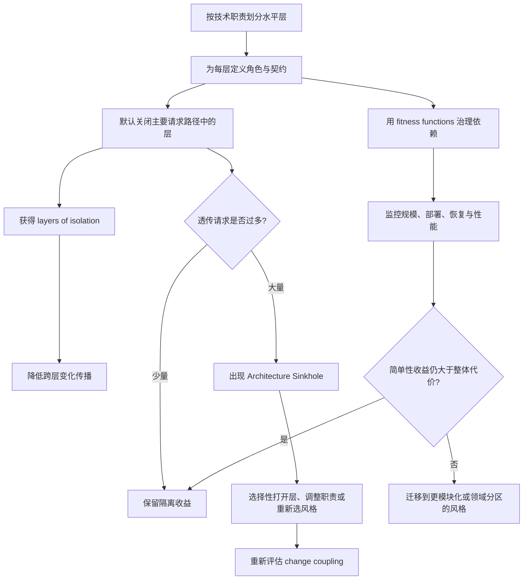
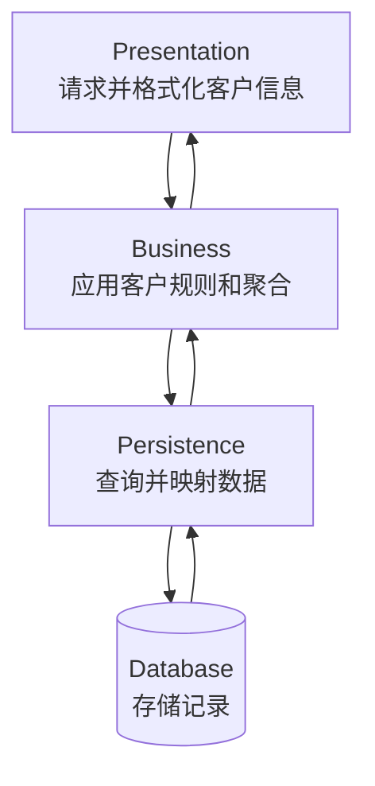

> 对应原章：10. Layered Architecture Style.md
> Layered architecture 又称 n-tiered architecture，是最常见、最熟悉、成本最低的架构风格之一。它用水平技术层分离展示、业务、持久化与数据职责；真正的设计难点不在“画四层”，而在决定每层的契约、哪些层 closed、哪些层 open，以及怎样在 change isolation 与 request sinkhole 之间取得平衡。
> 本笔记严格沿原章顺序展开。原章以拓扑、权衡和经验阈值为主，没有计算型算法；文中的路径模型、sinkhole 比例、Python 示例和决策流程属于教学化表达。80/20 是诊断启发式，不是统计定律；评分表示风格的默认倾向，会随系统规模、代码质量、部署拓扑与治理能力变化。

## 0. 本章要回答的核心问题

1. 为什么 layered architecture 会成为大量 legacy applications 的事实标准？
2. Architecture by Implication 与 Accidental Architecture 怎样让团队在没有明确选择时“自然长成”分层架构？
3. 标准四层分别承担什么职责，为什么层数不是固定的？
4. Business 与 Persistence 何时会合并，复杂系统为什么可能增加 Rules 或 Services 等层？
5. Logical layer 与 physical deployment unit 有何区别？
6. 原章三种物理部署变体分别怎样组合 Presentation、Business、Persistence 和 Database？
7. 为什么技术角色分工能提高局部专业效率，却降低 holistic agility？
8. Layered architecture 为什么属于 technical partitioning，为什么 DDD domain changes 会横跨所有层？
9. Closed layer 与 open layer 分别约束什么请求路径？
10. Fast-Lane Reader 为什么性能更直接，却可能破坏 layers of isolation？
11. Layers of isolation 如何限制变化传播，其成立前提是什么？
12. Business Delegate pattern 怎样帮助 Presentation 与 Business 契约解耦？
13. 为什么把 shared business objects 放在 Business layer 内很难阻止 Presentation 访问？
14. 新增 open Services layer 怎样同时保护 shared components 并允许 Business 访问 Persistence？
15. 为什么 open/closed 状态及其理由必须被记录和自动治理？
16. 什么是 Architecture Sinkhole，为什么纯透传请求会消耗对象、内存与处理时间？
17. 20% 与 80% sinkhole 比例分别说明什么，应该按请求类型还是实际流量分析？
18. 把所有层都打开为何能减轻 sinkhole，却会增加 change coupling？
19. Layered architecture 的典型 data topology 是什么，Persistence layer 解决什么映射问题？
20. 把某些层部署到云时，为什么 technical partitioning 既提供便利又可能增加跨层 latency？
21. Monolithic deployment 为什么导致低 fault tolerance 和较高 MTTR？
22. ArchUnit 怎样把层和允许依赖编码为 fitness function？
23. 四种 Team Topologies 为什么都能与 layered style 配合，各自又有什么限制？
24. “技术层高度模块化”与评分表中 architecture modularity 只有 1 星为什么不矛盾？
25. 评分表每个星级背后的因果链是什么？
26. 为什么简单三行修改也可能导致整包部署、高风险回归和低 deployability/testability？
27. 为什么 layered architecture 的 engineering characteristics 会随代码库增长快速恶化？
28. 它适合哪些小型、低预算、时间紧或仍在探索的系统？
29. 为什么应限制 code reuse 并保持浅继承，以便未来迁移？
30. 哪些大型系统不应继续使用该风格？
31. Operating systems 和网络模型怎样体现 layers，但严格 OSI 与五层 TCP/IP 教学模型有何区别？
32. Feasibility 为什么有时足以让投资驱动团队有意识选择“以后可能重写”的 layered architecture？

本章论证主线如下：



一句话概括：**分层架构用 closed technical layers 换取简单性、熟悉度与变化隔离；当业务变化频繁、部署单元膨胀或多数请求只是穿层透传时，这些层会从保护边界变成阻力。**

---

## 1. 开篇：为什么 Layered Architecture 如此常见

Layered architecture 又称 n-tiered architecture，常见于：

- 企业内部业务系统；
- 传统 Java/.NET Web 应用；
- 大量 legacy applications；
- 小型网站和 CRUD 系统；
- on-premises 产品。

成为事实标准的原因：

| 原因 | 直接收益 | 长期风险 |
| --- | --- | --- |
| Simplicity | 容易解释和起步 | 简单系统不断增长后边界僵化 |
| Familiarity | 开发者知道 UI、business、data access 放哪里 | 团队可能不再质疑风格是否适合 |
| Low cost | 不需要复杂分布式基础设施 | 以后迁移可能集中支付结构债务 |
| Tool support | 框架、测试和治理工具成熟 | 容易被框架默认结构绑住 |
| Technical specialization | UI、业务和数据库专家可各自聚焦 | 一个业务变化横跨多个团队和层 |

### 1.1 Architecture by Implication

Architecture by Implication 指团队没有明确表达风格、原则和边界，而由框架默认目录、历史习惯和局部编码暗示架构。

典型过程：

```text
创建 controller
    -> 创建 service
    -> 创建 repository
    -> 接入 database
    -> 默认形成 Presentation/Business/Persistence 分层
```

结构本身未必错误，问题是没有回答：

- 为什么这样分层；
- 哪些层 closed/open；
- 哪些依赖允许；
- 关键架构特征是什么；
- 规模增长后何时应改变。

### 1.2 Accidental Architecture

Accidental Architecture 是未经有意识权衡，由“先写起来”逐渐形成的结构。Layered style 因为最符合常见框架和技术角色，很容易成为默认结果。

偶然形成的分层常出现：

- 层名称存在，但职责混杂；
- Controller 直接访问 database；
- Business layer 只做 pass-through；
- shared utility 无边界增长；
- open/closed 规则从未定义；
- 物理部署与逻辑层随意映射。

本章不是反对 layered architecture，而是要求显式选择并治理它。

---

## 2. Topology：拓扑

Layered style 把组件组织成 logical horizontal layers，每层承担特定 technical role。

### 2.1 标准四层


#### 2.1.1 Presentation layer

负责：

- UI rendering；
- browser/client communication；
- 输入与输出格式；
- 调用业务入口；
- 展示 view model。

不应承担核心业务规则，也不应知道数据库访问细节。

#### 2.1.2 Business layer

负责：

- 执行业务规则；
- 计算和聚合；
- 协调业务操作；
- 根据请求决定领域结果；
- 从 Persistence 获取或保存数据。

它不应关心屏幕具体格式，也不应把 SQL/数据库协议泄漏给 Presentation。

#### 2.1.3 Persistence layer

负责：

- 数据访问；
- repository/DAO；
- query 与 mapping；
- transaction integration；
- 隐藏 database/filesystem 技术。

它将面向对象世界的对象层次映射到关系数据库的 set-based model，是传统 layered applications 的常见职责。

#### 2.1.4 Database layer

代表持久化数据系统，例如：

- relational database；
- embedded database；
- in-memory database；
- filesystem。

这里称 layer，是逻辑拓扑中的数据职责；物理上通常是外部数据库，也可能嵌入应用。

### 2.2 层数不是固定规则

Layered style 没有规定必须存在四层，也没有固定名称。

- 小型应用可能只有 Presentation、Business/Persistence、Database 三层；
- Persistence SQL/HSQL 嵌入 Business 时，两层可以合并；
- 大型业务应用可能有五层以上，例如 Rules、Services、Integration；
- 额外层必须解决明确隔离或职责问题，不能为“架构感”机械增加。

层数增加的成本：

- 调用深度；
- mapping 和 DTO；
- 更多 contracts；
- 调试路径；
- sinkhole 风险；
- 认知负担。

### 2.3 Layer 是职责边界，不等于部署单元

Logical layer 说明代码责任与允许依赖；physical tier/deployment unit 说明运行位置和发布边界。

同一四层逻辑架构可以有不同物理映射。

### 2.4 三种物理部署变体


#### 变体一：应用单体 + 外部数据库

```text
Deployment A:
    Presentation
    Business
    Persistence

Deployment B:
    Database
```

这是最常见形态：应用整体部署，数据库单独运行。

#### 变体二：Presentation 单独部署

```text
Deployment A:
    Presentation

Deployment B:
    Business
    Persistence

Deployment C:
    Database
```

适用于独立 Web/client tier，但 Presentation 与 Business 间出现 remote communication、network latency 和 failure semantics。

#### 变体三：所有层单一部署

```text
Deployment A:
    Presentation
    Business
    Persistence
    Embedded/In-memory Database
```

适用：

- 小型应用；
- mobile applications；
- embedded/in-memory database；
- 交付给客户的 on-prem products。

### 2.5 物理拆开不等于独立演进

变体二虽然有多个部署单元，但若：

- 共享一套 database schema；
- contracts 不可独立版本化；
- 发布必须 lockstep；
- 一个 business change 同时修改所有层；

那么在本章的评分口径下，物理拆层本身不会产生新的 architecture quantum，Number of quanta 仍为 1。物理网络 hop 还可能增加分布式成本，却没有获得领域自治。

### 2.6 每层形成职责抽象

以 customer data 请求为例：



Presentation 只需知道业务 contract，不需要知道数据来自 SQL、文件或远程存储；Business 只需获取业务数据，不关心屏幕像素和浏览器格式。

这种 abstraction 使技术实现可在相邻契约后变化。

### 2.7 Separation of concerns 与专业分工

组件在同一层只处理对应 technical concern：

- frontend developer 聚焦 presentation；
- domain/business developer 聚焦 rules；
- persistence specialist 聚焦 data access；
- DBA 聚焦 database。

这能建立清晰 role/responsibility model，降低单个开发者所需技术广度。

### 2.8 Holistic agility 的代价

Holistic agility 是整个系统快速响应业务变化的能力。

一个 Customer 功能可能同时位于：

- Presentation；
- Business；
- Rules；
- Services；
- Persistence/Database。

因此一项业务变化需要：

- 修改多个层；
- 多个技术角色协作；
- 整体 regression；
- 整包 deployment。

局部技术职责清晰，不等于端到端业务变化敏捷。

### 2.9 Technical partitioning 与 DDD

Layered architecture 是 technical partitioning，而不是 domain partitioning。

```text
Top level:
    Presentation
    Business
    Persistence

而不是：
    Customer
    Order
    Inventory
```

业务 domain 被涂抹在各层，使 bounded context 和独立 domain evolution 难以表达。因此经典 DDD decomposition 与纯 layered top-level style 不太匹配。

可以在每层内部按 domain 建包，形成混合结构，但顶层变化和部署仍由技术层主导。

---

## 3. Style Specifics：风格细节

层不仅有 technical responsibilities，还具有 isolation 与 access semantics。

### 3.1 Layers of Isolation：层隔离

每层可以是 closed 或 open。

#### 3.1.1 Closed layer

若一层 closed，上方请求不能跳过它，必须按相邻层向下移动。


标准请求：

```text
Presentation
    -> Business
        -> Persistence
            -> Database
```

Closed 描述跨层访问规则，不是说层内部不能扩展，也不是说下层不能返回结果。

#### 3.1.2 Open layer

若一层 open，上方层可以跳过它访问更低层。

例如 Business 与 Persistence 都 open 时，Presentation 可直接访问 Database，形成早期所谓 Fast-Lane Reader。

Open layer 可以：

- 避免无意义 pass-through；
- 缩短请求路径；
- 减少 mapping 和对象实例；
- 提高某些读取性能。

但它会扩大上层知识和依赖面。

### 3.2 Fast-Lane Reader 的收益与代价

简单 customer name/address 查询若无需业务规则，逐层调用看似浪费。直接读取可减少路径。

但 Presentation 若直接依赖 Persistence/Database：

- schema 变化影响 UI；
- data access contract 暴露；
- security/validation 可能被绕过；
- 测试需要更多底层依赖；
- Business layer 不再是统一入口。

性能收益必须与 change cost 比较，不能默认“更短路径总是更好”。

### 3.3 Layers of isolation 的定义

若层间 contract 保持不变，一层内部变化通常不影响其他层。

设层 $L_i$ 只依赖相邻 contract $C_{i,i+1}$：

```text
InternalChange(L_{i+1})
    and ContractStable(C_{i,i+1})
    -> NoRequiredChange(L_i)
```

这是教学化逻辑，不是绝对保证。反射、共享模型、数据库泄漏和行为语义变化都可能绕过 contract boundary。

### 3.4 为什么主要请求流中的层要 Closed

若 Presentation 能越过 Business 访问 Persistence：

- Persistence change 同时影响 Business 与 Presentation；
- 多个上层开始知道底层细节；
- contracts 数量增加；
- architecture 变 brittle；
- 修改成本扩大。

Closed layers 迫使底层变化通过一条受控边界传播。

### 3.5 Layer replacement 的前提

原章指出 isolation 允许替换某一层而不影响其他层，例如更换旧 UI framework。

成立前提：

- contract 清晰且稳定；
- 行为语义兼容；
- 没有跨层共享内部类型；
- 测试覆盖 contract；
- 使用 Business Delegate 等 adapter 隔离 Presentation 与 business services。

#### Business Delegate

Business Delegate 是减少 UI 与 business services 耦合的 pattern：

- Presentation 调用 delegate；
- delegate 适配业务对象调用；
- 隐藏 lookup、protocol 和异常转换；
- UI 不直接依赖业务实现。

Delegate 若只做无价值转发，也可能成为 sinkhole；价值来自稳定边界和技术隔离。

### 3.6 Open 与 Closed 的选择问题

```text
默认：主要请求路径使用 Closed 保护隔离

仅当：
    某层对一类请求没有任何职责
    + 绕过收益可测
    + 上下层 contract 可稳定治理
    + 不绕过安全/业务不变量
才考虑 Open
```

Open/closed 可以按 layer 定义，也可能按特定入口更精细治理；团队必须明确规则，不能靠开发者猜测。

### 3.7 Adding Layers：增加层

层可以用于把原本难治理的 shared responsibilities 提升为显式架构边界。

### 3.8 Shared business objects 的问题

假设 Business layer 包含：

- date/string utility classes；
- auditing classes；
- logging classes；
- shared business objects。

架构决策规定 Presentation 不得使用它们，但 Presentation 本来就允许访问 Business layer，因此代码层面很难阻止它继续深入访问 shared objects。


“请不要调用”不是强边界。开发压力下，开发者很容易直接 import。

### 3.9 新增 Services layer

把 shared business objects 移到独立 Services layer：


规则：

- Presentation layer：Closed；
- Business layer：Closed；
- Services layer：Open；
- Persistence layer：Closed；
- Database layer：Closed。

结果：

1. Presentation 不能跳过 closed Business 去访问 Services；
2. Business 可以访问 Services 中 shared components；
3. Services 是 open，Business 也可绕过它直接访问 Persistence；
4. 不需要 shared service 的请求不会被迫无意义穿层。

### 3.10 为什么 Services 必须 Open

若 Services closed，则所有 Business -> Persistence 请求都必须经过 Services，即使完全不需要 shared objects：

```text
Business -> Services(pass-through) -> Persistence
```

这会人为制造 sinkhole。Open 表示它是可选技术能力，而不是所有请求必经职责。

### 3.11 新增层的风险

Services layer 可能变成新的 dumping ground：

- 所有“不知道放哪”的代码进入；
- utilities 与领域服务混在一起；
- 无明确 owner；
- global coupling 增长；
- 名称过于宽泛。

应定义：

- 允许的 component types；
- 谁可以依赖；
- public contracts；
- 禁止放入的职责；
- 何时拆出更具体层或组件。

### 3.12 必须记录 Open/Closed 及 Why

若团队不知道：

- 哪些层 open；
- 哪些 closed；
- 哪类请求可绕过；
- 为什么这样决定；

结果通常是任意跨层访问、tight coupling 和 brittle architecture。

应在 architecture decision 与 fitness function 中共同表达：

```text
Decision: Business is closed; Services is open.
Why: Protect shared objects from Presentation while allowing direct persistence flows.
Consequence: Business may depend on Services or Persistence; Presentation only depends on Business.
```

### 3.13 Architecture Sinkhole antipattern

Sinkhole 指请求从一层传到下一层，各层没有执行真正业务逻辑，只做透传。

示例：查询 customer name/address：

```text
Presentation
    -> Business: pass-through
        -> Rules: pass-through
            -> Persistence: simple SQL
                -> Database
```

结果再原路返回，没有：

- aggregate；
- calculate；
- apply rules；
- transform。

### 3.14 Sinkhole 的成本

- unnecessary object instantiation；
- mapping/DTO allocation；
- method calls；
- logging/tracing noise；
- memory consumption；
- latency；
- 测试和维护更多 pass-through code。

若物理层分开，还会增加 network hops，代价更大。

### 3.15 80/20 诊断启发式

原章建议：

- 约 20% requests 是 sinkholes：通常可接受；
- 约 80% 是 sinkholes：强烈提示 layered style 不适合 problem domain。

定义：

$$
R_{sinkhole}=\frac{N_{pass\text{-}through}}{N_{total}}
$$

但要明确统计口径：

- 按 request types：看设计中多少用例透传；
- 按 production traffic：看实际资源中多少流量透传；
- 按 cost-weighted requests：考虑不同请求路径成本。

三者可能给不同结论。

### 3.16 可运行的 Sinkhole 示例

```python
def assess_sinkholes(total_requests, pass_through_requests):
    if total_requests <= 0:
        raise ValueError("total_requests must be positive")
    if not 0 <= pass_through_requests <= total_requests:
        raise ValueError("invalid pass-through count")

    ratio = pass_through_requests / total_requests
    if ratio >= 0.80:
        verdict = "reconsider layered style"
    elif ratio <= 0.20:
        verdict = "usually acceptable"
    else:
        verdict = "inspect request mix and trade-offs"
    return ratio, verdict


for pass_through in (20, 50, 80):
    ratio, verdict = assess_sinkholes(100, pass_through)
    print(f"sinkholes={ratio:.0%}: {verdict}")
```

输出：

```text
sinkholes=20%: usually acceptable
sinkholes=50%: inspect request mix and trade-offs
sinkholes=80%: reconsider layered style
```

代码只编码经验规则，不证明 79% 合理、80% 错误。高价值复杂请求与大量廉价读取还需分别分析。

### 3.17 处理 Sinkhole 的方案

#### 方案一：选择性 Open

让纯读取绕过无职责层，但限制入口和 contract。

#### 方案二：重新分配职责

若 Business 总是透传，检查业务逻辑是否放错层，或系统是否本质为简单 CRUD/read model。

#### 方案三：CQRS/专用读取路径

复杂写流程保留 closed layers，简单查询走专用 read path。该扩展不在原章，但体现“按请求差异设计”，代价是两套模型和一致性治理。

#### 方案四：更换架构风格

若大多数请求都不需要层职责，考虑 modular monolith、service-based 或其他更贴合 domain workflows 的风格。

#### 方案五：全部层 Open

原章给出的另一解法，但会显著提高 change management 难度：任何上层可能依赖任意下层。

### 3.18 Isolation 与 Sinkhole 的核心权衡

| 选择 | 获得 | 代价 |
| --- | --- | --- |
| Closed | 隔离、契约、替换性 | 透传、路径和性能成本 |
| Open | 直接路径、减少透传 | 跨层知识、变化传播 |
| 新增可选 Open layer | 保护共享能力并允许绕过 | 层数和治理复杂度 |
| 全 Open | 最大路径自由 | 最弱隔离、最高耦合风险 |

---

## 4. Data Topologies：数据拓扑

Layered architecture 传统上形成：

- monolithic application；
- single monolithic database；
- common Persistence layer。

### 4.1 Persistence 的映射职责

面向对象语言偏好：

- objects；
- inheritance；
- references；
- aggregates。

Relational database 偏好：

- tables；
- rows；
- sets；
- joins；
- constraints。

Persistence layer 通过 ORM、DAO 或 repository 处理 object-relational impedance mismatch。

### 4.2 单库的收益

- 简单 transaction；
- join 与 reporting 直接；
- backup/restore 集中；
- schema 管理单一；
- 成本低；
- 开发者熟悉。

### 4.3 单库的代价

- global coupling；
- schema change 影响多个业务域；
- 单点容量与可用性边界；
- 独立部署困难；
- data ownership 模糊；
- 难按 domain 拆分；
- architecture quantum 通常为 1。

### 4.4 多数据库是否仍是 Layered

可以使用多个 stores，但若逻辑仍按 technical layers 组织，它仍可称 layered style。随着 domain-specific data ownership 和独立部署增强，结构可能逐渐靠近 modular/service-based styles。

风格不是由数据库数量单独决定。

---

## 5. Cloud Considerations：云端考虑

Layered architecture 通常 monolithic 且按技术层划分，云选择主要是把一个或多个层部署到 cloud provider。

### 5.1 Technical partitioning 的云部署便利

技术层天然可映射到：

- Presentation in CDN/Web hosting；
- Business/Persistence in compute platform；
- Database in managed database。

这与图 10-2 的物理变体相似。

### 5.2 跨 on-prem/cloud latency

Layered workflow 往往穿过多数层。若层跨环境：

```text
Browser -> Cloud Presentation
        -> On-prem Business
        -> Cloud/On-prem Persistence
        -> Database
```

每个逻辑层 hop 可能变成 network hop，引入：

- latency；
- bandwidth；
- timeout/retry；
- security controls；
- egress cost；
- topology dependency。

原本廉价 method call 不应无分析地转成远程调用。

### 5.3 云不会自动提高 Elasticity

复制整个 monolith 可以提高总体容量，但：

- 无法只扩展热点层内功能；
- shared database 仍是瓶颈；
- state/session 可能阻止横向复制；
- startup 时间影响伸缩速度；
- 每个副本包含全部代码和资源。

云提供资源，不能改变 architecture quantum=1 的结构事实。

### 5.4 云部署决策问题

1. 哪些层真的能独立部署和版本化？
2. 请求每次跨多少网络边界？
3. Database 和 state 在哪里？
4. 跨区/混合云故障如何传播？
5. 整体扩展是否经济？
6. 是否只是把层物理拆开，却没有获得自治？

---

## 6. Common Risks：常见风险

### 6.1 Fault tolerance 低

Monolithic deployment 缺少 architecture modularity：

- 一个小组件 memory leak；
- 某请求触发 out-of-memory；
- 整个 process 崩溃；
- 所有功能同时不可用。

进程内模块边界无法提供进程级 fault isolation。

### 6.2 Availability 受 MTTR 影响

大型 monolith startup 可能很慢：

- 小应用约 2 分钟；
- 大型应用常 15 分钟或更久。

修复后必须重新启动整个 deployment unit，导致较高 MTTR。

对可修复二状态系统的长期简化模型：

$$
Availability\approx\frac{MTBF}{MTBF+MTTR}
$$

公式不是原章给出，也不覆盖降级、计划停机和相关故障；它只说明在 MTBF 相同时，MTTR 越高，availability 越差。

### 6.3 单点资源约束

随着系统增长，常见瓶颈：

- database connections；
- heap/memory；
- thread pools；
- startup time；
- build/test duration；
- deployment package size；
- concurrent users。

所有功能竞争同一进程和数据库资源，无法按 domain 独立配额。

### 6.4 风险缓解

- health checks 与自动重启；
- 多副本整体部署；
- graceful shutdown；
- memory/resource limits；
- startup optimization；
- caching；
- 浅继承和低共享；
- 模块依赖治理；
- 监控增长触发迁移。

缓解能延长风格适用期，不能消除单量子和整包部署的根本限制。

---

## 7. Governance：治理

Layered style 因历史悠久，结构测试工具支持非常成熟。层依赖适合编译时/CI 二元检查。

### 7.1 Example 10-1：ArchUnit 层治理

原书代码采用其对应版本的 API。较新的 ArchUnit 通常还需明确 dependency consideration；下面保留规则意图并显式选择可解析依赖：

```java
layeredArchitecture()
    .consideringAllDependencies()
    .layer("Controller").definedBy("..controller..")
    .layer("Service").definedBy("..service..")
    .layer("Persistence").definedBy("..persistence..")

    .whereLayer("Controller").mayNotBeAccessedByAnyLayer()
    .whereLayer("Service").mayOnlyBeAccessedByLayers("Controller")
    .whereLayer("Persistence").mayOnlyBeAccessedByLayers("Service")
```

具体 API 以项目锁定版本为准。

### 7.2 包匹配语义

ArchUnit pattern：

```text
..controller..
```

表示匹配 package path 中名为 `controller` 的 segment 及其范围，不应简单理解为业务“ownership”。实际项目应：

- 确保所有生产 classes 被纳入；
- 处理 generated/test code；
- 定义未匹配 classes；
- 检查反射/配置形成的运行依赖；
- 避免 namespace 命名绕过。

### 7.3 规则含义

- Controller 不被其他已定义层访问；
- 除同层访问外，Service 只被 Controller 访问；
- 除同层访问外，Persistence 只被 Service 访问；
- 依赖方向被持续保护。

这组规则没有自动定义 Presentation、Business、Database 的完整五层模型。治理代码必须与实际图一致，不能只复制示例。

### 7.4 Open/Closed 怎样编码

Layer tests 可以表达：

- Presentation may only access Business；
- Business may access Services and Persistence；
- Presentation may not access Services/Persistence；
- Persistence may not access Presentation/Business；
- domain-specific exceptions 明确列出。

Open 不表示“任何层都能访问”，而是特定上层可以跳过该层到达更低层。规则应按真实 access matrix 编码。

### 7.5 Governance 不止依赖规则

还应治理：

- sinkhole ratio；
- package cycles；
- layer-specific complexity；
- shared utility growth；
- startup/MTTR；
- full regression duration；
- database schema coupling；
- open-layer exceptions。

### 7.6 Fitness function 的协作原则

规则必须让 developers 理解：

- 保护哪项 characteristic；
- 为什么某层 closed；
- 违规会造成什么 change cost；
- 如何合法实现需求；
- 例外如何审批和过期。

否则团队会用 reflection、shared package 或改名规避数字，治理变成形式主义。

---

## 8. Team Topology Considerations：团队拓扑考虑

原章认为 layered style 相对不依赖特定 team topology，可与四种团队形态配合。但适配程度受系统规模和 ownership 方式影响。

### 8.1 Stream-aligned teams

若 layered application 小且 self-contained，代表单一 journey/flow，stream-aligned team 可以端到端拥有：

- Presentation；
- Business；
- Persistence；
- deployment。

这样减少按层交接，保留业务流 ownership。

若大型组织把每层交给不同技术团队，就不再是端到端 stream aligned，会遭遇 Conway’s Law 的跨层协调。

### 8.2 Enabling teams

Technical concerns 分层让 specialists 可以在某层实验：

- 在 Presentation 尝试新 UI library；
- 改进 persistence practice；
- 引入测试/可观测性；
- 帮助团队学习。

层隔离使实验不必立即影响其他层，前提是 contract 稳定。

Enabling team 应培养能力而非永久拥有某层的所有变化。

### 8.3 Complicated-subsystem teams

原章举例：Persistence layer 可以成为复杂子系统团队访问 operational data 做 analytics 的 hook，而不影响 stream team 拥有的其他层。

需要警惕：

- 绕过业务语义直接读取表；
- analytics load 干扰交易；
- schema coupling；
- ownership 模糊。

更安全做法可能是 read replica、data contract 或专用 export，而不是无限开放 Persistence。

### 8.4 Platform teams

Layered style 工具成熟，platform team 可提供：

- project templates；
- CI/CD；
- ArchUnit rules；
- logging/metrics；
- database migration；
- deployment runtime。

### 8.5 Monolith 增长给 Platform 带来的挑战

无论分层多清晰，monolith 持续增加功能后会挤压：

- database connections；
- memory；
- performance；
- concurrent users；
- build/deployment pipeline；
- test duration。

Platform team 会投入越来越复杂的工作维持整体运行。平台优化不能无限补偿架构边界问题。

### 8.6 “高度模块化”与 Modularity 1 星

原章团队段落称 layered architecture 具有较高模块化，同时评分给 architecture modularity 1 星。两者观察尺度不同：

| 尺度 | 分层的表现 |
| --- | --- |
| Code/technical separation | 层职责清晰，工具支持强，可替换局部实现 |
| Architecture modularity | 单一 deployment、单一 database、quantum=1，不能独立发布和扩展业务能力 |

所以技术层次的 separation 不等于 domain-level/operational modularity。

---

## 9. Style Characteristics：风格特征

评分规则：

- 1 星：该风格不擅长支持；
- 5 星：该风格最强特征之一；
- 表示默认 tendency，不是所有实现的绝对结果。


### 9.1 完整评分表

| 类别 | 特征 | 评分/值 |
| --- | --- | --- |
| Cost | Overall cost | `$`，低成本 |
| Structural | Partitioning type | Technical |
| Structural | Number of quanta | 1 |
| Structural | Simplicity | 5 星 |
| Structural | Modularity | 1 星 |
| Engineering | Maintainability | 1 星 |
| Engineering | Testability | 2 星 |
| Engineering | Deployability | 1 星 |
| Engineering | Evolvability | 1 星 |
| Operational | Responsiveness | 3 星 |
| Operational | Scalability | 1 星 |
| Operational | Elasticity | 1 星 |
| Operational | Fault tolerance | 1 星 |

### 9.2 Cost：`$`

低成本来自：

- 单体部署；
- 基础设施简单；
- 技能普遍；
- 工具成熟；
- 单数据库；
- 运维单元少。

规模增长后成本可能通过测试、发布和维护间接上升，`$` 主要描述合适规模下的起步和运行成本。

### 9.3 Simplicity：5 星

层结构直观、职责熟悉、调用链容易起步。相比分布式风格，少了：

- network failure；
- service discovery；
- distributed data；
- contract versioning；
- distributed tracing。

简单性是该风格最强 sweet spot。

### 9.4 Modularity：1 星

虽然代码按层组织，但：

- business domain 横跨层；
- deployment unit 单一；
- database 共享；
- quantum=1；
- 独立扩展/发布困难。

架构级 modularity 因而很低。

### 9.5 Maintainability：1 星

小型系统初期可维护，但随增长：

- feature 跨多层；
- shared code 增长；
- global data coupling；
- regression 范围扩大；
- ownership 分散。

评分反映长期整体维护，而非某个小类是否整洁。

### 9.6 Testability：2 星

优点：

- 可 mock/stub components；
- 可替换一整层；
- contracts 提供测试边界。

缺点：

- 改动常跨层；
- full regression 慢；
- shared database 增加 integration setup；
- 整包耦合使开发者倾向少跑测试。

因此高于 1 星，但仍偏弱。

### 9.7 Deployability：1 星

三行代码修改也要 redeploy entire unit。风险来自：

- 与几十项其他变化打包；
- database/config changes 混入；
- deployment ceremony；
- rollback 粒度粗；
- 发布频率低。

小修改的代码风险低，不等于部署风险低。

### 9.8 Evolvability：1 星

业务变化横跨 technical layers，结构难以按 domain 局部演进。单一数据库和 deployment 进一步扩大变化范围。

Open layers 和 shared utilities 还会使依赖逐渐侵蚀。

### 9.9 Responsiveness：3 星

可通过：

- caching；
- multithreading；
- query optimization；
- 减少 sinkholes；
- local in-process calls；

获得良好响应。

扣分原因：

- 缺少 inherent parallel processing；
- closed layering 增加路径；
- sinkhole；
- 大型 monolith 资源竞争。

### 9.10 Scalability：1 星

可复制整个应用，但很难只扩展热点能力。复杂的 multithreading、internal messaging、parallel processing 可以改善，却不是风格天然优势。

Shared database 和 quantum=1 限制上限。

### 9.11 Elasticity：1 星

整体副本大、startup 慢、状态与数据库共享，难以随短时负载快速增减特定功能容量。

云自动伸缩整个 monolith 仍可能受数据库和冷启动限制。

### 9.12 Fault tolerance：1 星

一个组件 OOM 可以击垮整个 application unit。层是逻辑隔离，不是 fault isolation boundary。

多副本能缓解实例故障，但不能防止确定性 bug 在所有副本触发。

### 9.13 Engineering characteristics 随规模恶化

原章强调评分会随 monolith 变大快速下降：


因此，适用规模是该风格成功的关键前提。

### 9.14 When to Use：何时使用

适合：

1. small, simple applications；
2. simple websites；
3. tight budget；
4. tight time constraints；
5. 团队熟悉技术分层；
6. 仍在判断是否需要复杂架构，但必须开始开发；
7. 以 feasibility 和快速验证为优先。

### 9.15 作为起点而非终点

在不确定阶段使用 layered style，可以：

- 快速获得业务反馈；
- 避免预付分布式复杂度；
- 识别真实热点与边界；
- 后续按证据迁移。

前提是保留迁移能力，而不是让 temporary 成为无治理永久结构。

### 9.16 迁移友好的纪律

原章建议：

- keep code reuse at a minimum；
- keep inheritance trees shallow。

原因：

#### 限制跨域共享

全局 reuse library 会让多个 domain 同时依赖，未来难以拆开。允许少量重复可能比错误共享更便于迁移。

#### 浅继承

深继承把行为分散多个层次，移动一个业务能力时必须带走整个 hierarchy。Composition 和清晰 contracts 更容易重组。

#### 显式边界

即使按技术层，也应在每层内部按业务功能组织 package，限制跨功能共享。

### 9.17 When Not to Use：何时不使用

大型 applications/systems 中，以下特征会恶化：

- maintainability；
- agility；
- testability；
- deployability；
- scalability；
- fault tolerance。

尤其不适合：

- 多团队需要独立发布；
- 不同业务域扩展差异大；
- 高 fault isolation；
- 高频持续部署；
- 复杂领域要求 bounded contexts；
- 单库无法承受规模或合规边界。

### 9.18 不要只因“系统大”就立即分布式

可先考虑：

- modular monolith；
- domain partitioning；
- service-based architecture；
- 只提取真正热点；
- 数据边界渐进拆分。

目标是提高架构 modularity，不是以服务数量替代设计。

---

## 10. Examples and Use Cases：示例与应用

Layers 广泛用于需要 separation of concerns 的领域。

### 10.1 Operating system layers

#### Hardware layer

CPU、memory、I/O devices 等物理硬件。

#### Kernel layer

提供 hardware abstraction、memory management、process scheduling。

#### System Call Interface layer

应用通过 system calls 请求 kernel services。

#### User layer

用户 applications 与 utilities。

层允许上层依赖稳定接口，不必知道硬件细节。

### 10.2 Networking layers

原章以 OSI 思想说明网络职责分层，并列出五层 TCP/IP 教学模型：

#### Physical layer

物理传输数据。

#### Data Link layer

frame synchronization 与 error detection。

#### Network layer

routing，例如 IP。

#### Transport layer

提供端到端传输：TCP 提供可靠、有序的字节流，UDP 提供无连接数据报服务，并不保证交付、顺序或去重。

#### Application layer

SMTP、FTP、HTTP 等应用服务。

### 10.3 OSI 与五层模型的边界

严格 OSI reference model 有七层：

1. Physical；
2. Data Link；
3. Network；
4. Transport；
5. Session；
6. Presentation；
7. Application。

原章列出的 Physical/Data Link/Network/Transport/Application 是常见五层 Internet/TCP-IP 教学模型，把 Session 与 Presentation 吸收到 Application。两者都表达职责分离，但术语不应混为完全相同标准。

### 10.4 Layering 为什么跨领域复用

- 每层职责清楚；
- 上层依赖抽象而非底层细节；
- 可独立开发和替换实现；
- 故障和变化可在某些边界隔离；
- 教学与沟通简单。

其代价也通用：

- 额外间接层；
- 严格路径产生 sinkhole；
- 横切 workflow 穿过所有层；
- 层次过多增加调试成本。

### 10.5 Feasibility 驱动的创业/投资场景

Feasibility 问：在给定时间、资金和资源下，能否交付 stated scope？

投资驱动组织可能必须快速推出产品：

- 需求尚未验证；
- 团队小；
- 预算有限；
- 未来规模不确定。

Layered architecture 的 simplicity 和 low cost 可能是合理 least-worst 选择，即使未来为获得不同能力需要重写部分系统。

### 10.6 Sacrificial 选择的责任

“以后重写”不能只是愿望，应记录：

- 哪些规模触发迁移；
- 哪些层/模块最可能拆出；
- 怎样限制 shared code；
- data migration strategy；
- 当前接受哪些技术债；
- 如何监控阈值。

有意识牺牲架构与无治理 Big Ball of Mud 的区别，在于边界、证据和退出计划。

---

## 11. 容易混淆的概念与常见误区

### 11.1 “Layer 与 Tier 完全相同”

错误之处：layer 是逻辑职责，tier/deployment 是物理运行边界。

正确理解：四个 logical layers 可以映射为一个、两个或多个 deployments。

### 11.2 “Layered architecture 必须正好四层”

错误之处：层数和名称没有硬规则。

正确理解：每个额外层必须有明确职责或隔离价值。

### 11.3 “代码有 Controller/Service/Repository 就完成了架构设计”

错误之处：默认目录没有说明 open/closed、契约和业务理由。

正确理解：显式定义风格、规则和 trade-offs。

### 11.4 “Physical split 自动提高架构 modularity”

错误之处：共享数据库和 lockstep 发布仍可形成 quantum=1。

正确理解：独立演进需同时具备代码、数据和部署自治。

### 11.5 “Technical specialization 等于整体 Agility”

错误之处：一个业务变化跨多个技术层和团队。

正确理解：局部效率与 holistic agility 是不同尺度。

### 11.6 “Layered style 很适合 DDD”

错误之处：顶层按技术角色划分，domain 被散布。

正确理解：可混合领域包，但纯经典分层与 bounded contexts 不自然对齐。

### 11.7 “Closed layer 表示任何代码都不能访问它”

错误之处：closed 限制上方请求不能跳过该层。

正确理解：相邻访问仍允许，规则要按方向和请求流表达。

### 11.8 “Open layer 表示所有层都可任意访问”

错误之处：open 表示特定请求可 bypass 该层到更低层。

正确理解：仍需 access matrix 和契约治理。

### 11.9 “Fast-Lane Reader 总是更好”

错误之处：短路径会让 Presentation 知道数据细节，扩大变化传播。

正确理解：只在可测收益足够、语义不变量不被绕过时使用。

### 11.10 “Contract 不变就绝对没有跨层影响”

错误之处：行为语义、性能、共享类型和数据泄漏仍可传播。

正确理解：隔离是有前提的倾向，需要 contract tests 和治理。

### 11.11 “新增 Services layer 一定改善架构”

错误之处：它可能成为新的 utility dumping ground。

正确理解：先定义职责、依赖者和允许内容。

### 11.12 “所有请求都应走完所有层”

错误之处：大量纯透传会形成 sinkhole。

正确理解：隔离是默认，按真实请求混合选择性 open/read path。

### 11.13 “20% 和 80% 是精确边界”

错误之处：这是经验启发式，且统计口径会改变结果。

正确理解：结合 request types、traffic、cost 和 change coupling。

### 11.14 “把所有层 Open 就解决 Sinkhole”

错误之处：性能路径变短，但变化和依赖更难管理。

正确理解：这只是把成本从 runtime 转移到 change time。

### 11.15 “Single database 只有坏处”

错误之处：本地事务、查询、运维和成本都更简单。

正确理解：规模与自治需求决定何时收益不再覆盖耦合。

### 11.16 “上云会让 Monolith 自动 Elastic”

错误之处：整体副本、状态、startup 与数据库瓶颈仍存在。

正确理解：云提供资源伸缩，架构决定可伸缩粒度。

### 11.17 “逻辑层能隔离 OOM 故障”

错误之处：同一 process 中任一组件 OOM 可击垮全体。

正确理解：代码隔离不等于 fault isolation。

### 11.18 “ArchUnit 示例复制后即可完整治理”

错误之处：示例层、包范围和工具版本未必匹配项目。

正确理解：建模所有目标层，固定 API 版本，处理未匹配和运行时依赖。

### 11.19 “层越清晰，Architecture Modularity 越高”

错误之处：技术代码分离不等于独立部署/数据/扩展。

正确理解：评分的 1 星观察 architecture quantum 和 business capability autonomy。

### 11.20 “三行修改只需测三行”

错误之处：整包部署可夹带数据库、配置和其他几十项变化。

正确理解：部署风险由 deployment unit 决定，不只由 diff 大小决定。

### 11.21 “小应用评分好，增长后也不变”

错误之处：工程特征随 monolith 规模快速恶化。

正确理解：持续监控 build/test/deploy/MTTR 和资源约束。

### 11.22 “Operating system layers 与应用层完全相同”

错误之处：它们共享 separation principle，边界和调用机制不同。

正确理解：借用组织思想，不机械复制实现。

### 11.23 “OSI 就是原章列出的五层”

错误之处：严格 OSI 是七层；五层是常见 Internet teaching model。

正确理解：明确采用的模型和层合并方式。

### 11.24 “计划未来重写即可忽略当前边界”

错误之处：无治理结构会让迁移成本失控。

正确理解：限制共享、浅继承、记录触发器和 data exit path。

---

## 12. 从本章提炼的 Layered Architecture 设计法

### 第 1 步：确认 Simplicity 是否是关键驱动

评估应用规模、预算、期限、团队和未来独立部署需求。

**输出**：选择 layered style 的上下文理由。

### 第 2 步：定义 Logical Layers

为 Presentation、Business、Persistence、Database 及额外层写清职责和禁止事项。

**输出**：layer responsibility matrix。

### 第 3 步：定义 Contracts

限制内部类型、数据模型和异常泄漏，明确 DTO/delegate/interface。

**输出**：稳定相邻层接口。

### 第 4 步：标记 Closed/Open

默认关闭主要路径；只有在明确无职责且收益可测时开放。

**输出**：request access matrix 与理由。

### 第 5 步：映射 Physical Deployment

选择单体应用+外部 DB、独立 Presentation，或全嵌入；计算 network hops。

**输出**：logical-to-physical map。

### 第 6 步：分析 Sinkholes

按类型、流量和成本统计纯透传请求，使用 20/80 作为调查启发式。

**输出**：保留、开放、专用读取或换风格的候选。

### 第 7 步：治理 Shared Components

避免 Business/Services 变成 dumping ground；定义所有权、消费者和依赖规则。

**输出**：shared capability policy。

### 第 8 步：实现 Fitness Functions

用 ArchUnit/同类工具检查层定义、越层访问、cycles 与 open exceptions。

**输出**：CI 中可执行的 architecture rules。

### 第 9 步：监控退化指标

跟踪 build/test/deployment duration、sinkhole、startup、MTTR、数据库连接和 shared code。

**输出**：风格仍适用或需要迁移的证据。

### 第 10 步：保留 Exit Strategy

限制全局 reuse、保持浅继承、按 domain 组织层内代码，记录迁移触发器。

**输出**：可从 layered style 演进的路径。

---

## 13. 本章知识结构

```mermaid
flowchart TD
    ROOT[Layered Architecture Style] --> TOPO[Topology]
    ROOT --> ISO[Isolation]
    ROOT --> DATA[Data]
    ROOT --> CLOUD[Cloud]
    ROOT --> RISK[Risks]
    ROOT --> GOV[Governance]
    ROOT --> TEAM[Teams]
    ROOT --> SCORE[Characteristics]

    TOPO --> FOUR[Presentation Business Persistence Database]
    TOPO --> PHYS[Three Physical Variants]
    TOPO --> TECH[Technical Partitioning]

    ISO --> CLOSED[Closed Layers]
    ISO --> OPEN[Open Layers]
    ISO --> SERVICES[Optional Open Services Layer]
    ISO --> SINK[Architecture Sinkhole]

    DATA --> MONODB[Monolithic Database]
    DATA --> ORM[Object-Relational Mapping]

    CLOUD --> HOPS[Cross-environment Latency]
    RISK --> Q1[Quantum = 1]
    RISK --> MTTR[High MTTR]

    GOV --> ARCHUNIT[ArchUnit Fitness Functions]
    TEAM --> T4[Four Team Topologies]

    SCORE --> STR[5-star Simplicity]
    SCORE --> MID[3-star Responsiveness]
    SCORE --> WEAK[Mostly 1-star Modularity and Operations]
```



整章可压缩为四层：

1. **结构层**：按 Presentation/Business/Persistence/Database 技术职责组织；
2. **隔离层**：Closed 保护变化，Open 减少透传，两者形成核心权衡；
3. **运行层**：单体数据库与 quantum=1 带来低成本，也限制扩展、弹性和容错；
4. **生命周期层**：成熟治理能维持边界，但规模增长最终会削弱维护、测试、部署和演进能力。

---

## 14. 核心结论

1. **Layered architecture 以简单、熟悉和低成本成为最常见的 legacy/application style。**
2. **若团队未显式选择风格而直接编码，很容易形成 Architecture by Implication 或 Accidental layered architecture。**
3. **标准四层是 Presentation、Business、Persistence、Database，但层数和名称并非固定。**
4. **Logical layer 是职责边界，physical tier 是部署边界；四层可映射成三种主要物理组合。**
5. **每层只处理技术角色可提高局部专业效率，却让一个 business domain 横跨所有层，降低 holistic agility。**
6. **Layered style 属于 technical partitioning，与 DDD bounded contexts 不自然对齐。**
7. **Closed layer 强制请求逐层移动，保护 layers of isolation；Open layer 允许绕过，减少无意义路径。**
8. **Fast-Lane Reader 提高简单读取效率，却使 Presentation 更了解底层并扩大 change coupling。**
9. **隔离成立依赖稳定 contract、行为兼容和没有跨层内部类型泄漏。**
10. **Business Delegate 可以把 UI 与 business invocation 细节隔开，但无价值转发也会成为 sinkhole。**
11. **把 shared objects 移入 open Services layer，可阻止 Presentation 访问，同时允许 Business 选择使用或绕过。**
12. **Open/Closed 状态和 Why 必须记录并自动治理，否则跨层捷径会侵蚀结构。**
13. **Architecture Sinkhole 是多层只透传、不执行职责的请求路径，会浪费对象、内存和处理时间。**
14. **20% sinkholes 通常可接受、80% 提示风格不匹配，但这是依赖统计口径的经验启发式。**
15. **全部 Open 会降低 runtime 路径成本，却把代价转移到 change management。**
16. **典型 data topology 是单体应用、单一数据库和公共 Persistence mapping。**
17. **云可以物理分离层，却可能把本地调用变为昂贵网络 hop；云资源不会自动提高功能级 elasticity。**
18. **逻辑层不是 fault boundary，一个小组件 OOM 可击垮整个 monolithic deployment。**
19. **Monolith startup 约 2 至 15 分钟以上会提高 MTTR，进而影响 availability。**
20. **ArchUnit 等成熟工具可把层、依赖方向和越层禁止写成 CI fitness functions。**
21. **四类 Team Topologies 都可与 layered style 配合，但大型 monolith 会增加跨层协调与平台负担。**
22. **代码技术层 separation 可很清晰，但 architecture modularity 因单一 deployment/database/quantum 仍只有 1 星。**
23. **该风格最强是 simplicity 5 星和低 cost；responsiveness 3 星，testability 2 星，其余工程与运行关键项多为 1 星。**
24. **小修改仍需整包部署，解释了低 deployability、testability 和 evolvability。**
25. **随着代码库增长，engineering characteristics 会快速退化，因此适用规模是关键约束。**
26. **适合小型简单、预算/期限紧、仍在探索的项目；大型多团队、高独立演进系统应考虑更模块化风格。**
27. **限制全局 code reuse 和深继承，有助于以后从 layered style 迁移。**
28. **Operating systems 与网络模型说明 layers 的普适价值；严格 OSI 七层不等同于五层 TCP/IP 教学模型。**
29. **Feasibility 可以让团队有意识地选择未来可能替换的 layered architecture，但必须保留退出计划。**

---

## 15. 主动回忆与应用题

以下问题不提供紧邻答案，适合脱离正文作答后再核对推理链。

1. 为一个订单系统写出四层职责矩阵，每层至少列三项“负责”和三项“禁止”。
2. 比较 logical layer 与 physical tier，并把同一四层架构映射成图 10-2 的三种部署。
3. 什么条件下 Business 与 Persistence 合并是合理简化，什么条件下会造成职责泄漏？
4. 选择一个 Customer 功能，标出它在 technical layers 中的所有落点，计算需要协调的团队。
5. 解释 technical expertise productivity 与 holistic agility 为什么可能反向变化。
6. 设计一个 closed-layer request flow，再给出一个合理 open-layer 例外。
7. 为 Fast-Lane Reader 列出性能收益、schema coupling、安全和测试四类权衡。
8. 设计一个 Business Delegate，说明它隐藏了什么；再给出它退化成 sinkhole 的反例。
9. 重建图 10-4 到图 10-5 的推理：为什么 Services 必须 open，而 Business 必须 closed？
10. 为 Services layer 写出允许内容、禁止内容、消费者和 owner，防止 utility dumping ground。
11. 从生产 tracing 中怎样识别 sinkhole？你会按请求类型、流量还是成本加权？
12. 某系统 60% 请求类型透传，但这些只占 5% 流量；另 40% 类型占 95% 流量且有复杂业务。你会怎样判断？
13. 比较选择性 open、CQRS read path、全部 open 和更换架构风格四种 sinkhole 方案。
14. 为单体数据库列出五项收益和五项迁移障碍。
15. 将 Presentation 放云上、Business/Database 留在 on-prem，画出每次请求的网络 hop 与失败模式。
16. 为什么复制十个 monolith instances 不等于能够独立扩展 Payment？
17. 用 MTBF/MTTR 简化模型比较 2 分钟与 15 分钟恢复时间的 availability，但说明公式遗漏什么。
18. 设计一个小组件 OOM 使全体功能失败的案例，并提出进程内和进程外缓解措施。
19. 根据自己的 package names 改写 Example 10-1，显式建模所有层和未匹配类。
20. 怎样用 fitness function 区分 closed Business 与 open Services，而不是简单禁止所有跨层？
21. 分别说明 stream-aligned、enabling、complicated-subsystem 和 platform team 在 layered system 中的边界。
22. 为什么 Persistence 对 analytics team 是“hook”也可能成为 schema coupling 风险？
23. 不看图，复述完整评分表，并为每个 1 星给出结构原因。
24. 为什么 testability 是 2 星而 deployability 只有 1 星？
25. 设计一个 caching/multithreading 使 responsiveness 提高、但 maintainability 下降的例子。
26. 为一个创业 MVP 写出选择 layered style 的 ADR，并定义三项迁移触发器。
27. 为什么限制 reuse 和浅继承有利于从 monolith 拆出 domain capability？
28. 比较严格 OSI 七层与原章五层 TCP/IP 教学模型，不混淆层名与协议实现。
29. 不看正文，复述设计十步：驱动、层、契约、开闭、部署、sinkhole、共享能力、治理、退化指标、退出策略。
