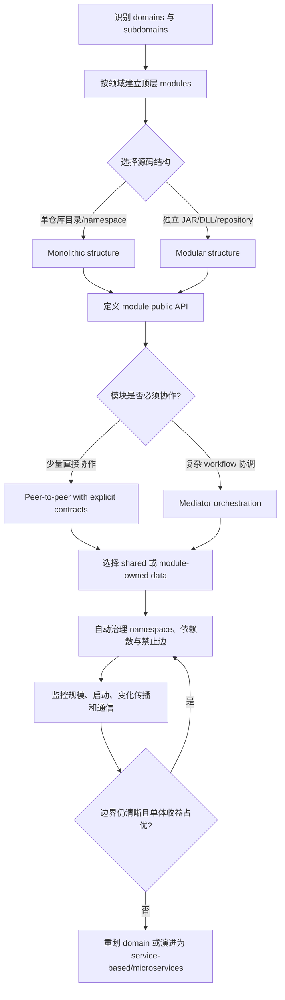
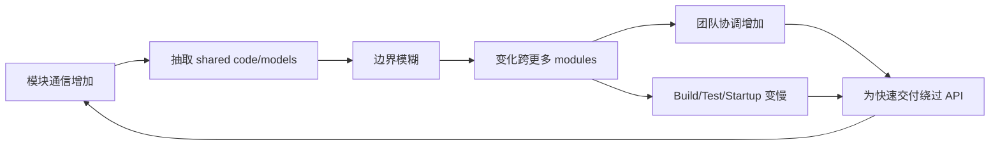
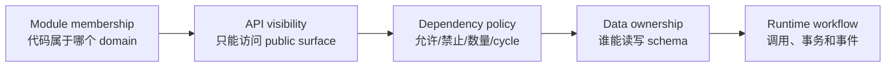
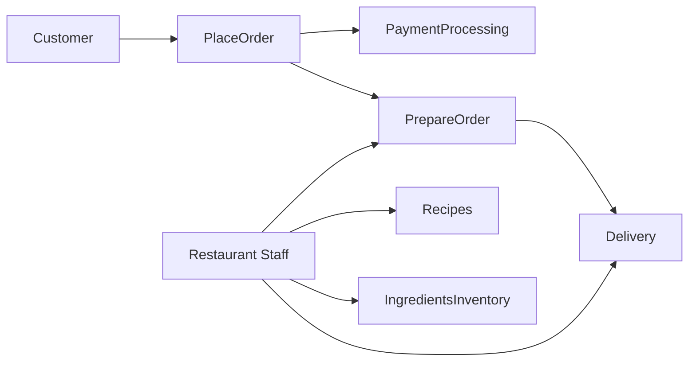
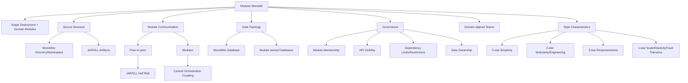

> 对应原章：11. The Modular Monolith Architecture Style.md
> Modular monolith 把“单体”与“泥球”明确分开：它保留单一部署的简单性和低成本，却在代码内部按业务 domain/subdomain 建立模块边界。本章真正讨论的不是文件夹命名，而是怎样让 domain partitioning 在单一进程中长期成立，包括代码制品、模块通信、数据所有权、团队对齐和自动治理。
> 本笔记严格沿原章顺序展开。原书的 Perl 代码块是语言无关伪代码，不是可直接执行的 Perl；本文会解释并修正其中的排版/变量问题。补充的图模型、公式、Python 示例和检查清单用于教学，不能单凭依赖数量自动决定 domain boundary。

## 0. 本章要回答的核心问题

1. 为什么 modular monolith 在 2020 年第一版之后迅速流行，并进入第二版独立成章？
2. “Monolithic” 与 “modular” 各自描述什么维度，为什么二者并不矛盾？
3. Modular monolith 的 isomorphic shape 为什么是“单一部署单元 + 按领域分组功能”？
4. 它与 layered architecture 的顶层分区轴有何本质区别？
5. 为什么 `com.app.customer.profile` 与 `com.app.presentation.customer.profile` 表达不同架构意图？
6. Domain-first namespace 内还能不能继续按 presentation/business 等技术关注分层？
7. Monolithic structure 与 modular structure 分别怎样组织源码和构建制品？
8. 单仓库目录模块为何最简单，又为什么最容易被跨模块 import 侵蚀？
9. JAR/DLL 模块怎样加强编译边界，又会引入哪些构建、版本和通信成本？
10. 什么条件下 modular structure 的收益超过 monolithic structure？
11. 为什么原书说模块间通信“从来不是好事”，但复杂业务流程又无法零通信？
12. Peer-to-peer approach 怎样工作，为什么它过于方便？
13. 为什么 shared interface JAR/DLL 既能解耦实现，又可能引发 JAR Hell/DLL Hell？
14. Mediator approach 如何减少模块彼此知识，它把耦合移到了哪里？
15. Mediator 何时是有价值的 orchestrator，何时会变成 God component 或 bottleneck？
16. 单一数据库为何能减少显式通信，又怎样造成隐藏 data coupling？
17. 单体应用能否让模块拥有独立数据库，这对 quantum、事务和部署意味着什么？
18. 为什么 modular monolith 能部署上云，却通常不能充分利用按需 provisioning？
19. 系统“太大”的四个原书警告信号是什么？
20. 过度 code reuse 怎样模糊模块边界并形成 unstructured monolith？
21. 过多 intermodule communication 为什么提示 domain 划分可能有误？
22. Governance 应怎样验证合法 namespace、单模块源码、依赖数量和禁止依赖？
23. 为什么依赖上限 5 是项目相关阈值，不能当作普遍定律？
24. ArchUnit、ArchUnitNet、NetArchTest、PyTestArch 和 TSArch 分别服务哪些平台？
25. Domain-partitioned architecture 为什么更适合 cross-functional/domain-aligned teams？
26. Stream-aligned、enabling、complicated-subsystem 与 platform teams 怎样映射模块？
27. 为什么 modular monolith 的 simplicity 是 5 星、modularity 只有 2 星？
28. 它为何比 layered architecture 的 maintainability/deployability/evolvability 略高，而两章评分图中的 testability 同为 2 星？
29. 为什么 responsiveness 是 3 星，而 scalability、elasticity、fault tolerance 都是 1 星？
30. 哪些情况下应从 modular monolith 起步，哪些情况下应直接选择其他风格？
31. 为什么 domain-based change 适合它，而持续替换 UI/database 等 technical change 不适合？
32. EasyMeals 的六个模块和各级 components 怎样从业务流程形成？
33. IngredientsInventory 中的 AI forecasting 为什么仍可以位于同一 domain module？
34. 怎样把本章方法转化为一套可持续治理、可迁移的 modular monolith 实践？

本章论证主线如下：



一句话概括：**Modular monolith 用领域模块约束单体内部的变化传播，以较低成本获得比技术分层更好的业务内聚；它的成败取决于边界治理，而不是“把代码放进不同文件夹”。**

---

## 1. 开篇：为什么 Modular Monolith 成为独立风格

第一版出版于 2020 年。此后，DDD 广泛采用，行业更重视 domain partitioning，modular monolith 快速流行，因此作者在第二版增加独立章节并给出评分。

原文明确归因于 DDD 的普及与 domain partitioning 受到更多重视。结合本书前后文，还可以做如下延伸分析（这些并非本段原文逐项给出的历史归因）：

- 团队认识到 monolith 不等于 Big Ball of Mud；
- 微服务的网络、数据和运维成本逐渐显现；
- DDD bounded context 提供更好的业务边界语言；
- 自动 architecture tests 能在单进程中保护模块；
- 组织希望先获得领域模块性，再按证据物理拆分。

### 1.1 两个词描述不同维度

| 词 | 描述维度 | 本风格中的含义 |
| --- | --- | --- |
| Monolith | 物理 deployment topology | 所有代码通常一次部署 |
| Modular | 逻辑 component topology | 代码按 domain/subdomain 分成受控模块 |

所以“模块化单体”不是自相矛盾：逻辑上多模块，物理上单部署。

### 1.2 与 Layered Monolith 的核心差异

Layered monolith 的顶层是：

```text
presentation/
business/
persistence/
```

Modular monolith 的顶层是：

```text
orderplacement/
inventorymanagement/
paymentprocessing/
shipping/
```

前者让技术类型集中；后者让一个 domain change 尽量局部。

### 1.3 不要把它理解为“微服务前的临时垃圾场”

Modular monolith 可以是长期风格，也可以作为分布式演进起点。无论哪种目的，都必须：

- 明确模块职责；
- 限制跨模块依赖；
- 控制共享数据与共享代码；
- 让团队按 domain ownership 工作；
- 自动验证边界。

若只是一个部署包里任意互调的目录，它是 unstructured monolith，不是 modular monolith。

---

## 2. Topology：拓扑

Modular monolith 是 monolithic architecture，通常部署为：

- Java WAR；
- Java EAR；
- .NET single assembly；
- 其他单一 application artifact。

它是 domain-partitioned architecture，因此同构形态为：

> 一个部署单元，其中功能按 domain area 分组。


### 2.1 单一部署不等于一个业务模块

所有模块：

- 共用一个 process/runtime；
- 同时发布；
- 通常共享 database；
- 可以用本地 method call；
- 仍有独立 domain responsibility。

这带来低运行复杂度，也限制独立扩缩、发布和故障隔离。

### 2.2 Namespace 怎样表达分区轴

Layered style 的 customer profile：

```text
com.app.presentation.customer.profile
```

第三段 `presentation` 表示 technical concern。

Modular monolith：

```text
com.app.customer.profile
```

第三段 `customer` 表示 domain concern。

路径顺序不是美学问题，它决定开发者首先看到“这是什么业务”，还是“这是什么技术”。

### 2.3 Domain-first 后仍可技术细分

复杂组件可以继续写成：

```text
com.app.customer.profile.presentation
com.app.customer.profile.business
com.app.customer.profile.persistence
```

这不是重新变成 layered top-level architecture，因为第一分区轴仍是 `customer.profile`。技术层被局部封装在 domain 内。

### 2.4 Isomorphic shape 的直觉

可以教学化表示：

$$
ModularMonolith=(SingleDeployment,DomainPartitionedModules)
$$

该式不是形式定义；它提醒团队同时检查两个必要方面：

- 只有 domain modules、却独立部署，可能更接近 services；
- 只有 single deployment、没有受控 domain modules，只是普通或无结构单体。

### 2.5 与 Architecture Quantum 的关系

本章评分中 Number of quanta 通常为 1，因为：

- single deployment；
- 通常 single database；
- 同一 process failure boundary；
- 同步发布和恢复。

即使模块各有逻辑边界，它们仍共享一个 operational characteristic scope。若模块有独立数据库却仍随同一应用部署，数据边界改善，但 deployment/failure quantum 仍通常是 1。

---

## 3. Style Specifics：风格细节

在本风格中，domain 或 subdomain 被称为 module。源码可以采用两种结构：

1. Monolithic structure；
2. Modular structure。

选择取决于模块独立度、系统规模、团队、编译边界、构建复杂度与通信需求。

### 3.1 Monolithic Structure：单一源码结构

所有模块位于一个 source-code repository，发布时所有代码组装为一个 unit。每个模块是独立 high-level directory，内部包含 components 与 subdomains。


原章 namespace：

```text
com.orderentry.orderplacement
com.orderentry.inventorymanagement
com.orderentry.paymentprocessing
com.orderentry.notification
com.orderentry.fulfillment
com.orderentry.shipping
```

图 11-2 实际印出的三个示例 namespace 是 `com.orderentry.placement`、`com.orderentry.payment`、`com.orderentry.shipping`；正文和后续治理示例则使用较长的 `orderplacement`、`paymentprocessing` 等名称。两组命名并不完全一致，项目应选择一套并在代码、图和规则中统一。

#### 3.1.1 优势

- 所有源码在一个位置；
- IDE navigation 简单；
- refactoring 可跨模块完成；
- build/test/deploy pipeline 单一；
- 无 artifact version coordination；
- 初始成本最低。

#### 3.1.2 风险

- 任意 class 都近在眼前；
- 跨模块 import 太方便；
- 共享代码容易增加；
- internal implementation 容易被其他模块调用；
- 目录边界没有编译器强制；
- 最终退化为 Big Ball of Mud。

#### 3.1.3 成功前提

- module public API 明确；
- internal package 不可从外部访问；
- 禁止依赖边自动测试；
- 数据所有权和写权限明确；
- code review 与 CI 共同治理；
- 不因同仓库而默认共享一切。

### 3.2 Modular Structure：独立制品结构

每个 module 是 self-contained artifact，例如：

- Java JAR；
- .NET DLL；
- 独立 build module；
- 有时独立 repository。

部署时把制品组合成一个 monolithic unit。


#### 3.2.1 优势

- 编译边界更强；
- 每个模块可自包含；
- 团队可在独立 repository 工作；
- 不容易随意复用内部代码；
- module communication 更显式；
- separation of concerns 更清楚；
- 适合更大、更复杂、需要不同 expertise/business knowledge 的系统。

#### 3.2.2 代价

- 构建图和 artifact version 更复杂；
- 本地开发需组合多个制品；
- 跨模块 refactor 较困难；
- shared interface 需要版本治理；
- 发布仍是一个 deployment；
- 相互依赖模块会产生 JAR/DLL coordination。

#### 3.2.3 适用条件

当 modules largely independent 时效果最好。若模块频繁互调、一起改变、共享大量类型，modular structure 的制品边界只会增加摩擦；此时 monolithic structure 更有效，或说明 domain boundary 本身需要重划。

### 3.3 两种结构的比较

| 维度 | Monolithic structure | Modular structure |
| --- | --- | --- |
| Source repository | 通常一个 | 可一个或多个 |
| Module boundary | Directory/namespace | JAR/DLL/build artifact |
| Compile isolation | 较弱 | 较强 |
| Cross-module refactor | 容易 | 需要协调版本 |
| Accidental reuse | 风险高 | 风险较低 |
| 构建复杂度 | 低 | 较高 |
| 最适合 | 模块有合理协作、团队较小 | 模块较独立、系统/团队较大 |
| Deployment | 单一 | 最终仍单一 |

选择不是“更模块化总更好”，而是用足够强的边界控制真实风险，不为低价值独立性支付过高构建成本。

### 3.4 Module Communication：模块通信

原书说模块间通信在该风格中“从来不是好事”，随后承认很多情况必需。更准确的理解：

- 部分跨领域 workflow 需要模块协作；
- 每条通信都会形成 coupling；
- 沟通越多，独立边界价值越低；
- 目标是必要、显式、稳定的协作，而不是追求绝对零通信。

OrderPlacement 必须：

- 通知 InventoryManagement 调整库存，必要时补货；
- 通知 PaymentProcessing 应用支付。

原章给出 peer-to-peer 与 mediator 两种方式。

#### 3.4.1 Peer-to-peer approach

一个 module 中的 class 实例化另一个 module 的 class，并直接调用方法。


##### 优势

- 最直接；
- 本地 method call 性能高；
- 调试路径清楚；
- 无中央 mediator；
- 少量稳定协作成本低。

##### 风险

- 调用者容易实例化目标任意 internal class；
- 目标实现泄漏；
- 依赖网络随需求增长；
- 循环依赖；
- 一个变化影响多个模块；
- 同仓库中尤其容易退化为 Big Ball of Mud。

##### 模块化制品中的 Compile-time dependency

若目标 class 在另一 JAR/DLL，调用者没有 class reference 就无法编译。常见解决：建立 shared interface artifact：

```text
order-api.jar
inventory-api.jar
payment-api.jar
```

模块依赖 interface，而非实现。

但 shared artifact 引入：

- 版本矩阵；
- binary compatibility；
- transitive dependencies；
- classpath/assembly resolution；
- 多个模块同步升级。

通信过多会形成 JAR Hell 或 DLL Hell。接口隔离减少 implementation coupling，却不会消除 semantic coupling 和版本协调。

##### 更稳妥的 P2P 纪律

- 只调用 target module public facade；
- 不直接 new internal implementation；
- contract 使用 domain-specific value，而非共享巨大实体；
- 禁止反向依赖；
- 用 architecture tests 检查；
- 记录同步调用、事务和失败语义。

#### 3.4.2 Mediator approach

Mediator component 在 modules 之间形成 abstraction layer，并作为 orchestrator 接收请求、转交给适当模块。


##### 耦合怎样改变

Peer-to-peer：

```text
OrderPlacement -> PaymentProcessing
OrderPlacement -> InventoryManagement
```

Mediator：

```text
External Requester -> Mediator
Mediator -> OrderPlacement
Mediator -> PaymentProcessing
Mediator -> InventoryManagement
```

外部 requester 先把 workflow 请求交给 mediator，mediator 再调用包括 OrderPlacement 在内的目标 modules。Modules 不再彼此知道；原章特别强调，是 mediator 持有调用各 module 所需的 API/interface，而不能由此推导所有 modules 都反向依赖 mediator contract。耦合被集中和重定向，不是消失。

##### 优势

- 模块彼此独立；
- workflow orchestration 集中可见；
- 调用顺序和补偿更容易统一；
- 调用者不需持有所有 module APIs；
- 复杂流程可从 domain modules 抽离。

##### 代价

- mediator 可能同时具有高 $C_A$（fan-in，进入依赖）和高 $C_E$（fan-out，向外依赖），而不是某个未定义的 $C_A/C_E$ 比值；
- 可能成为 God component；
- 所有新 workflow 都修改 mediator；
- 测试和发布仍整体进行；
- 业务知识若全部上移，modules 退化为贫血服务；
- 运行虽进程内，逻辑 bottleneck 仍可能出现。

##### 正确职责边界

Mediator 应知道 workflow sequence，不应知道每个 module 的内部业务规则。原章指出：需要 API/interface 的是 mediator，而不是让 dependent modules 彼此持有接口。

### 3.5 Peer-to-peer 与 Mediator 选择

| 场景 | 倾向 P2P | 倾向 Mediator |
| --- | --- | --- |
| 协作数量 | 少量、稳定 | 多步骤 workflow |
| 顺序/补偿 | 简单 | 需要统一 orchestration |
| 模块关系 | 清楚单向依赖 | 避免 modules 互相知道 |
| 变化位置 | 调用关系局部 | 流程本身频繁演进 |
| 风险 | 依赖网扩散 | 中央 mediator 过载 |

还可以使用 domain events 降低直接时间耦合，但这不在原章两种主要选项中；事件会引入顺序、重复和最终一致性，应独立权衡。

### 3.6 用有向图观察模块通信

设 module graph $G=(V,E)$：

- $V$ 是 modules；
- $E$ 是允许的跨模块依赖；
- 每条边表示一个 module 的代码依赖另一个 module public API。

目标不是简单最小化 $|E|$，而是：

- 边与业务 workflow 一致；
- 方向清楚；
- 无禁止边和 cycle；
- contract 稳定；
- 高频共同变化提示重新划界。

---

## 4. Data Topologies：数据拓扑

Modular monolith 通常单一部署，因此典型使用 monolithic database；但 modules 独立且功能明确时，也可拥有 contextual databases。


### 4.1 Monolithic database

#### 收益

- local ACID transactions；
- joins/reporting 简单；
- schema migration 集中；
- backup/restore 简单；
- 无跨数据库网络通信；
- 能通过 shared data 减少显式 module calls。

#### 隐藏代价

- module 可直接读写其他模块表；
- schema 成为全局 contract；
- data ownership 模糊；
- change impact 扩大；
- future extraction 困难；
- single scale/failure boundary。

“减少通信”可能只是把显式 API coupling 变成更难观察的 database coupling。

### 4.2 Module-owned database

模块可以拥有独立 database，即使应用仍一次部署。

#### 收益

- contextual data ownership；
- schema 独立；
- 减少跨模块表访问；
- 为未来 service extraction 准备；
- 可按数据类型选择 store。

#### 代价

- 跨模块 transaction 困难；
- reporting/join 需要集成；
- 数据复制与一致性；
- 多个 migrations/backups；
- 应用仍不能独立部署模块；
- operational complexity 增加。

### 4.3 共享一个 DB 但保持 module ownership

实践中可在同一数据库实例内：

- 每 module 独立 schema；
- 限制写权限；
- 只通过 module API 修改；
- 禁止 foreign key 跨 domain；
- 提供 read model/export 给报表；
- migration 按 owner 管理。

这是共享基础设施与逻辑所有权的折中。数据库仍可能是一个 failure/scale quantum，不能把 schema 分离误认为物理独立。

### 4.4 选择问题

1. Workflow 是否需要本地强事务？
2. Data 的真正 owner 是谁？
3. 多模块是否频繁 join？
4. 是否计划未来拆服务？
5. 备份和恢复是否必须一致？
6. 模块是否需要不同数据技术？
7. 团队能否运营多 stores？

---

## 5. Cloud Considerations：云端考虑

Modular monolith 可以部署到云，尤其适合 small system；但 monolithic nature 使其不容易充分利用 on-demand provisioning。

### 5.1 能利用的云能力

- file/object storage；
- managed database；
- messaging；
- secrets/identity；
- logging/monitoring；
- load balancer；
- 整体应用实例 autoscaling。

### 5.2 难以利用的能力

- 只扩展单一 hot module；
- 每 domain 独立 deployment；
- 不同 module 独立 failure isolation；
- 极短时间按功能弹性缩放；
- 每团队独立 release cadence。

### 5.3 上云不改变核心形状

把 WAR/JAR/container 放进 cloud：

```text
Single deployable artifact
    -> multiple identical instances
    -> shared database
```

仍是 modular monolith。云改变运行资源，不自动改变 component topology。

### 5.4 何时仍然合理

- 小型本地/区域产品；
- 负载可预测；
- 整体扩展足够；
- 团队不需要独立发布；
- managed services 能降低运营成本。

若云上的主要目标是 fine-grained elasticity、independent deployment 和 fault isolation，应考虑 service-based 或 microservices 等风格。

---

## 6. Common Risks：常见风险

### 6.1 Monolith too big

Monolithic architecture 本身不是坏事；太大后才出现问题。“太大”没有统一 LOC 或 team count 阈值，应看结果。

原章四个 warning signs：

1. Changes take too long to make；
2. 改一个区域，其他区域 unexpectedly break；
3. Team members applying changes 时互相阻塞；
4. System startup takes too long。

还可观察：

- build/test/deploy duration；
- rollback time；
- memory 和 database connections；
- code ownership conflicts；
- module cycle/communication density。

### 6.2 Overboard with code reuse

Code reuse 有价值，但跨 modules 过度共享会：

- 模糊 ownership；
- 让 shared model 成为 global model；
- 任一修改影响多个 domains；
- 阻止未来拆分；
- 形成 transitive dependencies。

最终进入 unstructured monolith：代码高度互依，无法解开。

### 6.3 什么应该复用

更适合共享：

- 很稳定的低层技术能力；
- 安全/观测平台 primitive；
- 无 domain semantics 的小工具；
- 有清晰 owner、version 和 consumers 的 library。

谨慎共享：

- `Customer`, `Order` 等 domain entities；
- business validation；
- workflow state；
- 为两处表面相似而抽取的代码。

Rule of Three 可作为启发式：先容忍少量重复，理解变化方向后再抽象；不是机械等待三次。

### 6.4 Too much intermodule communication

复杂 workflow 中一些通信正常。若通信过多，可能说明：

- domains 划得过细；
- 高内聚行为被拆开；
- shared entity 边界错误；
- mediator 承担整个系统逻辑；
- 每项需求都修改多个 modules；
- 模块无法独立理解和测试。

此时不要只优化调用框架，应重新思考 domains 以容纳 workflow 和 interdependencies。

### 6.5 量化通信的边界

可记录：

- module fan-in/fan-out；
- 跨模块 public API 数量；
- 一项 user story 涉及模块数；
- modules co-change frequency；
- cycle 数；
- shared model consumers；
- mediator route 数量。

数字用于发现异常，不能证明边界错误。支付流程可能合理跨多个 domain；一个错误共享数据库则可能没有任何代码依赖边。

### 6.6 风险之间的正反馈



治理要在第一次非法依赖进入时反馈，而不是等系统“太大”再重写。

---

## 7. Governance：治理

Modular monolith 的主要 artifact 是 module：domain/subdomain 的目录、namespace 或 package。治理目标是让实际代码持续符合这张 domain map。

### 7.1 工具生态

| 平台 | 工具示例 |
| --- | --- |
| Java | ArchUnit |
| .NET | ArchUnitNet, NetArchTest |
| Python | PyTestArch |
| TypeScript/JavaScript | TSArch |

工具能力和 API 会演进，应锁定版本并验证其 dependency semantics，包括 reflection、generated code 和 dynamic imports 的盲区。

### 7.2 Example 11-1：确保代码属于已定义模块

原书语言无关伪代码的意图：

```text
module_list = {
    com.orderentry.orderplacement,
    com.orderentry.inventorymanagement,
    com.orderentry.paymentprocessing,
    com.orderentry.notification,
    com.orderentry.fulfillment,
    com.orderentry.shipping
}

namespace_list = get_all_namespaces(root_directory)

for namespace in namespace_list:
    if not namespace.starts_with_any(module_list):
        send_alert(namespace)
```

它阻止开发者创建未定义 high-level namespace，例如：

```text
com.orderentry.common
com.orderentry.misc
com.orderentry.shared
```

但要允许模块内部子 namespace，所以是 `starts_with_any`，不是精确相等。

### 7.3 规则的边界条件

- 排除 tests/generated code 或明确其规则；
- 防止相似前缀误匹配，如 `shippinglegacy`；
- 按 segment 匹配而非任意字符串前缀；
- 允许 infrastructure/bootstrap 的明确位置；
- 新 module 通过 architecture decision 更新 allowlist；
- 告警应给出 owner 和修复建议。

### 7.4 Monolithic structure 为什么易治理

所有源码在一个 repository，检查器能一次扫描完整 namespace graph。

Modular structure 可能分散 repositories/artifacts，因此：

- 每 module pipeline 单独执行；
- 还需在 assembly/build 阶段验证组合依赖；
- 统一 policy 版本；
- 中央看板聚合结果；
- 防止某 repository 跳过检查。

### 7.5 Example 11-2：验证单个 InventoryManagement module

原书伪代码中 `namepace` 是拼写问题；按意图整理：

```text
namespace_list = get_all_namespaces(root_directory)

for namespace in namespace_list:
    if not namespace.starts_with("com.orderentry.inventorymanagement"):
        send_alert(namespace)
```

它保证该 module repository 不混入其他 domain code。还应验证它是否依赖被允许的 API，而不只看自身 package 名。

### 7.6 Example 11-3：限制依赖数量

原章设 total interdependency limit = 5，意图是计算每个 module 的 incoming + outgoing coupling points，超过则告警。

概念伪代码：

```text
for module in modules:
    incoming = modules_that_depend_on(module)
    outgoing = modules_used_by(module)
    total = count(incoming union outgoing)

    if total > project_limit:
        send_alert(module, total)
```

上面的整理版选用“无向相邻模块数”：同一相邻 module 即使存在双向边，也只计一次。它与原书文字所说 incoming + outgoing coupling points 不是同一指标；若忠实采用两个方向之和，应计算 $|Incoming|+|Outgoing|$，双向关系会计 2。原书伪代码本身还有多余 `{`、`incoming count` 非法标识符，以及在 source-file 循环中反复覆盖 `total_count`、最后可能只检查最后一个文件等问题。因此，实践中必须先明确聚合层级和计数单位：

- unique module dependency；
- unique public API；
- source-file reference；
- call site；
- runtime route。

同一阈值对不同单位完全不同。

### 7.7 为什么 5 不是普遍正确阈值

一个 mediator 合理依赖 6 个 domain modules；一个叶子 module 依赖 3 个内部实现可能已经过多。应先建立：

- 当前分布；
- 模块角色；
- 变化历史；
- cycle 与 co-change；
- 合法依赖 matrix。

把 5 当作讨论触发器，而非自动证明设计错误。

### 7.8 Example 11-4：禁止特定模块依赖

原书用 ArchUnit 阻止 `OrderPlacement` 访问 `Shipping`：

```java
public void order_placement_cannot_access_shipping() {
    noClasses().that()
        .resideInAPackage("..com.orderentry.orderplacement..")
        .should().accessClassesThat()
        .resideInAPackage("..com.orderentry.shipping..")
        .check(myClasses);
}
```

这比总数量阈值更能表达 architecture intent：

- OrderPlacement 不应知道 Shipping；
- Workflow 应通过 Fulfillment/mediator 等合法路径；
- 即使总依赖数很低，禁止边仍会失败。

`resideInAPackage` 匹配 Java package 名，模式中的 `..` 表示零个或多个 package segments，因此原模式也允许 `com.orderentry.orderplacement` 前存在其他 package 前缀。具体 API 以 ArchUnit 版本为准，并应确认 `myClasses` 覆盖全部 production classes。该片段还省略 imports、测试框架入口和 `myClasses` 初始化，是框架用法示意而非可独立编译程序。

### 7.9 可运行的依赖治理示例

下面同时检查 allowlist、禁止边、cycle 和每模块 unique dependency degree：

```python
from collections import defaultdict


def audit_modules(modules, dependencies, forbidden, degree_limit):
    unknown = sorted(
        {node for edge in dependencies for node in edge if node not in modules}
    )
    forbidden_hits = sorted(edge for edge in dependencies if edge in forbidden)

    incoming = defaultdict(set)
    outgoing = defaultdict(set)
    for source, target in dependencies:
        outgoing[source].add(target)
        incoming[target].add(source)

    over_limit = sorted(
        module
        for module in modules
        if len(incoming[module] | outgoing[module]) > degree_limit
    )

    graph = {module: outgoing[module] & modules for module in modules}
    visiting = set()
    visited = set()

    def has_cycle(node):
        if node in visiting:
            return True
        if node in visited:
            return False
        visiting.add(node)
        if any(has_cycle(neighbor) for neighbor in graph[node]):
            return True
        visiting.remove(node)
        visited.add(node)
        return False

    cyclic = any(has_cycle(module) for module in modules if module not in visited)
    return unknown, forbidden_hits, over_limit, cyclic


modules = {"placement", "inventory", "payment", "fulfillment", "shipping"}
dependencies = {
    ("placement", "inventory"),
    ("placement", "payment"),
    ("placement", "shipping"),
    ("fulfillment", "shipping"),
}
forbidden = {("placement", "shipping")}

unknown, forbidden_hits, over_limit, cyclic = audit_modules(
    modules, dependencies, forbidden, degree_limit=2
)
print(f"unknown={unknown}")
print(f"forbidden={forbidden_hits}")
print(f"over_limit={over_limit}")
print(f"cyclic={cyclic}")
```

输出：

```text
unknown=[]
forbidden=[('placement', 'shipping')]
over_limit=['placement']
cyclic=False
```

代码中 degree 按相邻 unique modules 计；unknown dependency 会单独报告，并在 cycle graph 中被排除，避免访问不存在节点时抛出 `KeyError`。它无法看到反射、共享 database tables、动态事件和 temporal coupling。禁止边比 degree limit 更具语义，cycle 检查则保护全局结构。

### 7.10 四层治理模型



只检查 package 名不能保护数据库和运行 workflow；完整治理必须覆盖代码、契约、依赖和数据。

---

## 8. Team Topology Considerations：团队拓扑考虑

Modular monolith 是 domain-partitioned architecture，因此最适合 teams 也按 domain area 对齐，例如 specialized cross-functional teams。

### 8.1 为什么 Technical teams 不自然

若组织分成 UI、backend、database teams，一个 domain requirement 仍要跨三组协调，与 domain module 端到端 ownership 相冲突。

Domain-focused team 可以从 presentation 到 database 完成一个 feature，减少 handoff。

### 8.2 Stream-aligned teams

- 端到端拥有一个 business flow；
- 与 module/domain 自然对齐；
- 单体 shape 让本地开发和部署简单；
- 不同 teams 仍共同发布整个 artifact。

若 modules 高耦合，stream team 名义自治却仍需大量协调。

### 8.3 Enabling teams

高模块性与 separation of concerns 允许 specialists：

- 引入额外 module 做 experiment；
- 帮助某 domain 改进测试、可观测性或安全；
- 在较小范围验证新实践。

Enabling team 应传递能力，不应成为所有 module 的永久依赖。

### 8.4 Complicated-subsystem teams

每个 module 对应特定 domain/subdomain，例如 PaymentProcessing。复杂子系统团队可以：

- 深入掌握支付、定价、预测等专业逻辑；
- 在 module public API 后封装复杂度；
- 减少其他团队 cognitive load。

如果该 module 与所有模块频繁通信，则复杂度仍泄漏。

### 8.5 Platform teams

高模块性使 developers 可复用平台提供的：

- common tools；
- services/APIs；
- build/deploy tasks；
- architecture tests；
- observability/security primitives。

平台应提供 self-service，不应强迫所有 modules 继承巨大共享 framework，否则 code reuse 会反向破坏边界。

### 8.6 Team 与 Deployment 的张力

Domain teams 可以独立修改模块，却不能独立 deploy：

- release calendar 仍共享；
- integration test 仍覆盖整体；
- 某 team 的变更可能延迟全体发布；
- rollback 以整个应用为单位。

这解释 modularity 评分高于 layered monolith，却仍低于真正 distributed modules。

---

## 9. Style Characteristics：风格特征

评分规则：1 星表示不擅长支持，5 星表示最强特征之一。评分是风格默认 tendency，不是所有实现的保证。


### 9.1 完整评分表

| 类别 | 特征 | 评分/值 |
| --- | --- | --- |
| Cost | Overall cost | `$`，低成本 |
| Structural | Partitioning type | Domain |
| Structural | Number of quanta | 1 |
| Structural | Simplicity | 5 星 |
| Structural | Modularity | 2 星 |
| Engineering | Maintainability | 2 星 |
| Engineering | Testability | 2 星 |
| Engineering | Deployability | 2 星 |
| Engineering | Evolvability | 2 星 |
| Operational | Responsiveness | 3 星 |
| Operational | Scalability | 1 星 |
| Operational | Elasticity | 1 星 |
| Operational | Fault tolerance | 1 星 |

### 9.2 Overall cost：`$`

成本低源于：

- 单 deployment；
- 通常单 database；
- 无 interservice network；
- infrastructure 和 observability 简单；
- 团队技能常见。

模块治理、构建与测试仍有成本，但显著低于 distributed styles。

### 9.3 Partitioning：Domain；Quanta：1

Application logic 按 domains/subdomains 分区；通常 monolithic deployment 使 quantum=1。

Domain modules 改善代码内边界，不提供独立 operational characteristic scope。

### 9.4 Simplicity：5 星

保留 monolith 的：

- 本地调用；
- 本地事务；
- 单一调试进程；
- 单一部署；
- 低基础设施复杂度。

同时比 unstructured monolith 更容易定位 domain code。

### 9.5 Modularity：2 星

高于 layered architecture 的 1 星，因为：

- domain boundaries 更贴近业务；
- module separation of concerns；
- 可通过 artifact/namespace 治理；
- 为未来 extraction 提供起点。

仍只有 2 星，因为：

- single deployment；
- 通常 shared database；
- module fault/scale independence 不存在；
- 跨模块调用过于方便；
- quantum=1。

### 9.6 Maintainability：2 星

Domain change 更容易定位，模块可由专门 team 维护；但应用变大后：

- build 与启动变慢；
- shared code 模糊边界；
- 跨模块 workflow 增多；
- 单 release train 扩大回归。

### 9.7 Testability：2 星

可按 module unit/integration test，public API 提供边界；但：

- 最终 application 集成测试整体；
- shared DB 使 fixture 复杂；
- module communication 引入组合；
- 发布前完整性测试成本高。

### 9.8 Deployability：2 星

Module boundary 让 change impact 比 layered smear 更清楚，但任何 module change 仍部署整个 artifact。

风险、ceremony、frequency 仍受 monolith 限制，所以只略高于 layered style。

### 9.9 Evolvability：2 星

Domain partitioning 与 bounded context 让业务变化更局部，也为拆服务提供 seam；但 shared process/data 和 lockstep release 限制演进。

### 9.10 Responsiveness：3 星

进程内调用、单库 transaction 和无网络序列化可实现良好响应；扣分来自：

- monolith resource contention；
- 无天然并行独立扩展；
- 大型应用 startup/GC；
- shared database bottleneck。

### 9.11 Scalability 与 Elasticity：1 星

Monolithic deployment 只能整体复制。要单独扩展某 module，通常需复杂：

- multithreading；
- internal messaging；
- parallel processing；
- workload isolation。

这些不是该风格天然优势。Database 仍可能是共享上限。

### 9.12 Fault tolerance：1 星

某 module OOM 会击垮整个 application unit；逻辑 module 不是 process failure boundary。

多个整体 replicas 可提高 instance availability，却无法隔离确定性 bug 和 shared database failure。

### 9.13 Availability 与 MTTR

评分图未单列 availability，但原文强调 monolith startup 通常以分钟计，高 MTTR 会降低 overall availability。

模块独立不等于可独立 restart。

### 9.14 与 Layered Architecture 的对照

| 特征 | Layered | Modular monolith | 原因 |
| --- | ---: | ---: | --- |
| Simplicity | 5 | 5 | 都是低复杂度单体 |
| Modularity | 1 | 2 | Domain modules 优于 technical smear |
| Maintainability | 1 | 2 | 业务变化更局部 |
| Testability | 2 | 2 | 都仍需整体集成 |
| Deployability | 1 | 2 | 模块边界改善变化定位，但仍整包发布 |
| Evolvability | 1 | 2 | Domain boundary 提供更好演进起点 |
| Responsiveness | 3 | 3 | 本地调用快，但无天然并行 |
| Scale/Elasticity/Fault tolerance | 1 | 1 | 单一 deployment/quantum 的共同限制 |

原章正文称 deployability 与 testability 都比 layered architecture “略高”，但图 10-6 与图 11-7 的 testability 都是 2 星，这是源文叙述和评分图之间的编辑矛盾。按图表可可靠比较的是 deployability 从 1 星升至 2 星，而 testability 持平；domain modules 仍让测试定位更清楚，但没有消除整体 integration testing。

### 9.15 When to Use：何时使用

适合：

1. tight budget/time；
2. 新系统起步；
3. architectural direction 尚不清楚；
4. domain-focused/cross-functional teams；
5. majority changes 是 domain based；
6. DDD 团队；
7. 负载和可用性要求中等；
8. 希望以后按证据演进到 service-based/microservices。

### 9.16 为什么“先单体再分布式”常更有效

起步时：

- domain boundary 尚未验证；
- 真实热点未知；
- 团队小；
- 运维能力不成熟；
- 网络/数据分布成本没有必要。

Modular monolith 允许用本地调用和事务快速学习，同时通过 module boundaries 保留 extraction 选项。

前提是不能把“以后拆”当借口，必须持续保护边界。

### 9.17 Domain-based change 示例

原章举例：给 customer wishlist items 添加 expiration date。

在 domain module 中，变化主要局限 customer/wishlist；在 technical layers 中可能横跨 presentation、business、persistence。

### 9.18 When Not to Use：何时不使用

若需要高：

- scalability；
- elasticity；
- availability；
- fault tolerance；
- responsiveness；
- performance；

则 monolithic deployment 通常不适合。

### 9.19 Technical changes 为何不适合

若多数变化是：

- 持续替换 UI framework；
- 持续替换 database technology；
- 跨所有 domains 的技术平台迁移；

Domain partitioning 使每个 module 都受影响，需要 domain teams 大量协调。此时 layered architecture 按技术 concern 集中变化，可能更好。

### 9.20 不是所有横切技术变化都要求 Layered

可用 platform abstraction、shared tooling、automated migration 降低横切变化。判断应看真实 change axis，而不是看到 UI/database 就机械换风格。

---

## 10. Examples and Use Cases：示例与应用

### 10.1 EasyMeals 业务背景

EasyMeals 是新开业的本地外送餐厅，面向忙碌下班、没有时间做饭的人。客户在线订晚餐，一小时内送达。

特点：

- small/local restaurant；
- 无高 scalability；
- responsiveness 要求不极端；
- budget limited；
- 不愿投入复杂系统。

这使 modular monolith 成为合适 least-worst style。


### 10.2 顶层 Modules

```text
com.easymeals.placeorder
com.easymeals.payment
com.easymeals.prepareorder
com.easymeals.delivery
com.easymeals.recipes
com.easymeals.inventory
```

图中两个 UI：

- customer HTTP client 访问 PlaceOrder/PaymentProcessing；
- restaurant staff HTTP client 访问 PrepareOrder/Recipes/Delivery/IngredientsInventory。

所有 modules 位于一个 deployment，并共享 database。

### 10.3 PlaceOrder module

责任：

- 查看 menu；
- 选择 items；
- 维护 shopping cart；
- 输入 name/address/payment information；
- checkout/submit order。

Components：

```text
com.easymeals.placeorder.menu
com.easymeals.placeorder.shoppingcart
com.easymeals.placeorder.customerdata
com.easymeals.placeorder.paymentdata
com.easymeals.placeorder.checkout
```

一个 module 由 one-to-many logical components 组成，再次说明 module 不是单个 class 或单一 action。

### 10.4 PaymentProcessing module

责任：应用付款。

支持：

- credit card；
- debit card；
- PayPal；
- 未来 loyalty points。

```text
com.easymeals.payment.creditcard
com.easymeals.payment.debitcard
com.easymeals.payment.paypal
```

PlaceOrder 收集 payment information，再传给 PaymentProcessing。前者拥有 customer interaction，后者拥有 payment application/provider details。

### 10.5 PrepareOrder module

订单付款后：

- PlaceOrder 通知 PrepareOrder；
- 厨房员工看到完整订单；
- 烹饪后标记 ready for delivery；
- 订单进入 Delivery。

```text
com.easymeals.prepareorder.displayorder
com.easymeals.prepareorder.ready
```

### 10.6 Delivery module

责任：

- assign delivery person；
- 提供 delivery address；
- 标记 delivered；
- 结束订单生命周期；
- 记录 aggressive dog、customer not home 等 issues。

```text
com.easymeals.delivery.assign
com.easymeals.delivery.issues
com.easymeals.delivery.complete
```

### 10.7 Recipes module

供 cooks/management：

- 添加 menu items；
- 维护 ingredients；
- 维护 measurements。

```text
com.easymeals.recipes.view
com.easymeals.recipes.maintenance
```

### 10.8 IngredientsInventory module

确保 menu recipes 有足够 ingredients。它比其他模块复杂，包含 sophisticated AI component，预测 sales volume 并自动采购未来一周食材。

```text
com.easymeals.inventory.maintenance
com.easymeals.inventory.forecasting
com.easymeals.inventory.ordering
com.easymeals.inventory.suppliers
com.easymeals.inventory.invoices
```

### 10.9 AI forecasting 为何仍属于 Inventory

组件技术复杂，不代表必须成为独立顶层 module。它服务于“确保食材供应”这一统一 domain responsibility，并与 ordering、suppliers、invoices 共同完成库存工作流。

若未来 forecasting：

- 需要独立 GPU/scale；
- 被多个 domains 复用；
- 独立 team/lifecycle；
- failure 不应影响交易；

则可能拆成 complicated subsystem/service。当前规模下留在 module 更简单。

### 10.10 EasyMeals 的业务流程



该图只保留原章明确描述的模块访问和订单流：PlaceOrder 把支付信息交给 PaymentProcessing，并在付款后与 PrepareOrder 通信。Recipes 与 IngredientsInventory 之间是否直接调用、库存怎样影响备餐，原章没有规定，不能从领域相关性擅自画成依赖。实际实现仍需明确失败、库存预留、退款和跨模块 transaction。

### 10.11 为什么案例有说服力

- 业务域清晰；
- 模块职责可从工作流解释；
- 单店规模不需分布式；
- 本地调用和单事务降低成本；
- domain namespace 让 bug/feature 易定位；
- 复杂 AI 被局部封装；
- 将来 loyalty points 等功能可在模块内扩展。

这正是 modular monolith 的 sweet spot。

---

## 11. 容易混淆的概念与常见误区

### 11.1 “Monolith 就是 Big Ball of Mud”

错误之处：monolith 描述部署，mud 描述无结构和高耦合。

正确理解：单体可以拥有严格 domain modules。

### 11.2 “有文件夹就是 Modular Monolith”

错误之处：任意跨目录调用和共享表会让边界失效。

正确理解：需要 API visibility、依赖、数据和 workflow 治理。

### 11.3 “Modular Monolith 是 Layered Monolith 的新名字”

错误之处：前者顶层按 domain，后者顶层按 technical concern。

正确理解：Domain 内可以局部分层，但第一组织轴不同。

### 11.4 “每个 Module 是一个 Service”

错误之处：module 是逻辑/构建边界，所有 modules 通常同一进程部署。

正确理解：未来可提取为 service，但当前不是远程边界。

### 11.5 “Modular Structure 会独立部署每个 JAR”

错误之处：JAR/DLL 最终组装成一个 deployment unit。

正确理解：它加强 compile isolation，不改变 monolithic deployment。

### 11.6 “独立 Repository 自动使 Module 独立”

错误之处：共享 interface versions、数据库和发布仍会协调。

正确理解：独立性要检查代码、数据、workflow 和 deployment。

### 11.7 “模块间通信从来不允许”

错误之处：复杂业务 workflow 必须跨域协作。

正确理解：最小化并显式治理必要通信。

### 11.8 “Shared Interface 消除了 Coupling”

错误之处：只降低 implementation coupling，仍有 semantic/version coupling。

正确理解：管理 interface 生命周期并避免 shared model 膨胀。

### 11.9 “Mediator 消除了所有依赖”

错误之处：modules 与 mediator 相互依赖，mediator 知道目标 APIs。

正确理解：它集中 workflow knowledge，代价是 central coupling。

### 11.10 “Mediator 应包含所有业务规则”

错误之处：会形成 God component 和贫血 modules。

正确理解：mediator 负责 orchestration，domain rules 留在 owner module。

### 11.11 “Shared Database 减少了所有 Coupling”

错误之处：API 调用减少，但 schema/data coupling 可能更隐蔽。

正确理解：明确 data ownership 并限制跨模块写表。

### 11.12 “每模块独立数据库就变成 Microservices”

错误之处：应用仍一次部署、同一 process/failure boundary。

正确理解：数据边界只是 distributed style 的一个维度。

### 11.13 “上云后可按 Module 自动伸缩”

错误之处：部署 artifact 包含所有 modules。

正确理解：通常整体复制，热点 module 不能天然独立扩展。

### 11.14 “Monolith 太大有统一 LOC 阈值”

错误之处：领域、团队、工具和硬件差异巨大。

正确理解：看变化时间、意外破坏、团队冲突和 startup 等结果。

### 11.15 “Code Reuse 越多越好”

错误之处：共享 domain model 会形成 global coupling。

正确理解：只共享稳定 primitive，对业务相似优先理解变化方向。

### 11.16 “依赖数量小于等于 5 就一定健康”

错误之处：阈值和计数单位都是项目相关，一个禁止边即使唯一也错误。

正确理解：数量、方向、cycle、语义和 co-change 一起判断。

### 11.17 “Namespace allowlist 足以完成治理”

错误之处：合法目录内仍可依赖错误 module 或直接读其表。

正确理解：组合 membership、API、dependency、data 和 runtime checks。

### 11.18 “Domain Teams 可以完全独立发布”

错误之处：所有模块仍共享 release artifact。

正确理解：代码 ownership 自主高于部署自主。

### 11.19 “Modularity 2 星表示边界很弱、不值得做”

错误之处：相对 layered 的 1 星已经改善 domain locality；低于服务是因物理单体。

正确理解：评分比较风格默认能力，不否定模块化价值。

### 11.20 “Responsiveness 3 星意味着一定快”

错误之处：大 monolith、GC 和 shared DB 仍可能慢。

正确理解：本地调用提供潜力，实际需测量。

### 11.21 “先 Modular Monolith 以后一定容易拆”

错误之处：若共享数据、模型和 transaction，目录边界无法保证 extraction。

正确理解：从第一天治理 API 和 data ownership。

### 11.22 “Technical change 发生就必须改用 Layered”

错误之处：平台和自动化可以吸收部分横切变化。

正确理解：比较主要 change axis 和真实协调成本。

### 11.23 “AI Forecasting 技术不同，应立即独立 Service”

错误之处：技术特殊不自动推翻 domain cohesion。

正确理解：独立 scale、team、lifecycle 和 failure scope 足够显著时再拆。

---

## 12. 从本章提炼的 Modular Monolith 设计法

### 第 1 步：确认单体约束和目标

明确预算、期限、规模、团队与 operational characteristics，确认 single deployment 的收益值得。

**输出**：选择 modular monolith 的上下文与退出条件。

### 第 2 步：按 Domain 划分 Modules

从 workflows、bounded contexts、变化原因和语言识别顶层 modules。

**输出**：domain map 与 module responsibilities。

### 第 3 步：选择 Source Structure

模块协作较多/系统较小时选 monolithic structure；独立度高/团队大时考虑 JAR/DLL structure。

**输出**：repository、build artifact 与 ownership model。

### 第 4 步：定义 Public API

隔离 internal classes，使用小型 domain-specific contracts，不共享全局 entities。

**输出**：module facade/interface 与 visibility rules。

### 第 5 步：选择 Communication

简单单向 workflow 用受控 peer-to-peer；复杂 orchestration 考虑 mediator，避免 God component。

**输出**：允许 dependency graph 与 workflow owner。

### 第 6 步：定义 Data Ownership

决定 shared DB/schema-per-module/independent DB，限制写入并记录 transaction boundaries。

**输出**：table/schema ownership 与 integration policy。

### 第 7 步：实现四层 Governance

检查 module membership、API visibility、dependencies/cycles 和 data access。

**输出**：CI fitness functions 与例外流程。

### 第 8 步：对齐 Teams

让 cross-functional teams 端到端拥有 domains；平台提供 self-service，不制造巨大 shared framework。

**输出**：module owners 与 team interaction model。

### 第 9 步：监控退化信号

跟踪 change/build/test/startup/deploy time、unexpected breakage、communication 和 co-change。

**输出**：重划 domain、拆 module 或迁移 style 的证据。

### 第 10 步：渐进演进

先提取 data ownership 清楚、通信少、特征差异大的 module；不要按流行度一次拆全系统。

**输出**：service-based/microservices extraction roadmap 或继续单体的决定。

---

## 13. 本章知识结构



整章可压缩为四层：

1. **逻辑层**：Domain modules 让业务变化和代码位置对齐；
2. **物理层**：Single deployment/process/database 保持简单，也限制独立运行能力；
3. **协作层**：Peer-to-peer 与 mediator 分别分散或集中 workflow coupling；
4. **治理层**：源码、API、依赖和数据必须自动受控，否则 modular 会退化成 unstructured monolith。

---

## 14. 核心结论

1. **Modular monolith 是单一部署单元中的 domain-partitioned architecture，不是 layered monolith 的别名。**
2. **Domain-first namespace 先表达业务，可在 module 内继续按 technical concern 分层。**
3. **Monolithic structure 用同仓库目录隔离，简单但容易 accidental reuse 和 arbitrary communication。**
4. **Modular structure 用 JAR/DLL 强化 compile boundary，适合独立模块和大团队，却增加制品版本与构建复杂度。**
5. **两种结构最终仍部署为一个 unit，artifact modularity 不等于 independent deployment。**
6. **模块间通信应最小、显式且必要；零通信不是复杂业务系统的现实目标。**
7. **Peer-to-peer 简单高效，却容易泄漏 internal classes 并形成依赖网。**
8. **Shared interface 减少实现耦合，但仍产生 semantic/version coupling，过多会进入 JAR/DLL Hell。**
9. **Mediator 让 modules 不彼此知道，却把 orchestration coupling 集中到 mediator。**
10. **Mediator 应拥有 workflow，不应吞掉 module domain rules，否则成为 God component。**
11. **单一数据库简化本地事务与查询，却可能把显式 module calls 变成隐藏 schema coupling。**
12. **模块可拥有 contextual databases，但应用仍是单体，会新增跨库事务和运营复杂度。**
13. **上云不改变 single deployment；只能整体伸缩，难以利用 module-level on-demand provisioning。**
14. **系统太大的原书信号是变化慢、意外破坏、团队互相阻碍和启动过慢。**
15. **过度 code reuse 会模糊 domain ownership，最终形成无法解开的 unstructured monolith。**
16. **过多 intermodule communication 通常提示 domain 粒度或 workflow ownership 需要重新分析。**
17. **Governance 至少覆盖 module membership、public API、dependency graph 和 data ownership。**
18. **依赖上限 5 只是示例；计数单位、模块职责和禁止边比单一总数更重要。**
19. **Domain-focused cross-functional teams 最匹配该风格，技术 silo 会让每项 domain change 跨团队。**
20. **Domain teams 能独立拥有代码，却仍共享 deployment、integration testing 和 rollback。**
21. **该风格 cost 为 `$`、simplicity 5 星、modularity 与工程特征 2 星、responsiveness 3 星、scalability/elasticity/fault tolerance 1 星。**
22. **它比 layered style 更适合 domain change 和 DDD，却不擅长系统级 technical replacement。**
23. **新系统、预算/期限紧、方向不明确时，先 modular monolith 再按证据分布式通常更经济。**
24. **高 scale、elasticity、availability、fault isolation 或独立 deployment 是选择其他风格的重要信号。**
25. **EasyMeals 的 PlaceOrder、PaymentProcessing、PrepareOrder、Delivery、Recipes、IngredientsInventory 展示 module 可包含多个 logical components。**
26. **技术复杂的 AI forecasting 只要服务统一库存责任，仍可留在 IngredientsInventory；独立特征范围出现后再拆。**
27. **长期成功不取决于起初画得多漂亮，而取决于团队是否持续阻止边界侵蚀。**

---

## 15. 主动回忆与应用题

以下问题不提供紧邻答案，适合脱离正文作答后再核对推理链。

1. 用 deployment、partitioning、data 和 failure boundary 四个维度比较 modular monolith、layered monolith 与 microservices。
2. 将 `com.app.presentation.customer.profile` 重构为 domain-first namespace，并保留内部技术层。
3. 为什么模块逻辑独立却通常只有一个 architecture quantum？独立数据库会改变哪些维度、不会改变哪些？
4. 为订单系统比较 monolithic source structure 与 JAR/DLL modular structure，给出结论翻转条件。
5. 设计一个同仓库模块边界被三次便利 import 逐渐侵蚀的案例。
6. 设计一套 module public API，区分 facade、internal classes 和 shared contract。
7. 何时 shared interface artifact 减少风险，何时形成 JAR Hell？
8. 对 OrderPlacement->Inventory/Payment workflow 比较 P2P 与 mediator 的依赖图和测试成本。
9. 设计一个 mediator 过载为 God component 的例子，再把 domain rules 移回 owner modules。
10. 为什么插入 mediator 不会减少所有耦合？分别计算前后各节点的 $C_A$ 与 $C_E$。
11. 为 shared database 定义 schema-per-module ownership、write restrictions 和 reporting policy。
12. 给出一个 API coupling 低、database coupling 却很高的反例。
13. 什么情况下每 module database 的未来 extraction 收益超过 transaction/operations 成本？
14. 解释为什么 cloud autoscaling 整体 artifact 不等于 module elasticity。
15. 用四个原书 warning signs 评估一个真实 monolith 是否太大，不使用 LOC 阈值。
16. 找出一个“错误共享 domain entity”的例子，比较重复本地模型与全局复用成本。
17. 定义 intermodule communication 的三个计数单位，并说明为什么阈值 5 会得到不同结论。
18. 修改 Python 示例加入 cycle，验证治理结果；再加入 unknown module。
19. 写一条比 dependency count 更有语义的 forbidden-edge ArchUnit rule。
20. 除 package dependency 外，还需怎样发现 reflection、event 和 temporal coupling？
21. 为 Java、.NET、Python 或 TypeScript 选择一种 architecture-test 工具并定义 CI 执行范围。
22. 设计 module membership、API、dependency、data 四层治理的例外与过期机制。
23. 为六个 domain modules 分配 stream-aligned teams，并设计 enabling/platform 支持。
24. 为什么 modularity 是 2 星而 simplicity 是 5 星？从逻辑和物理两个尺度解释。
25. 为什么 deployability 只有 2 星，即使 modules 可以独立编译和测试？
26. 为一个 domain-based change 和一个 technical change 比较 modular 与 layered 的修改范围。
27. 为新产品写一份“先 modular monolith”的 ADR，包括三项分布式迁移触发器。
28. 完整复述 EasyMeals 六个 modules、各自 components 和端到端 order lifecycle。
29. 决定 AI forecasting 保留 module 还是拆 service 时，应检查哪些 architecture characteristics？
30. 不看正文，复述设计十步：上下文、domain、source structure、API、communication、data、governance、teams、signals、evolution。
