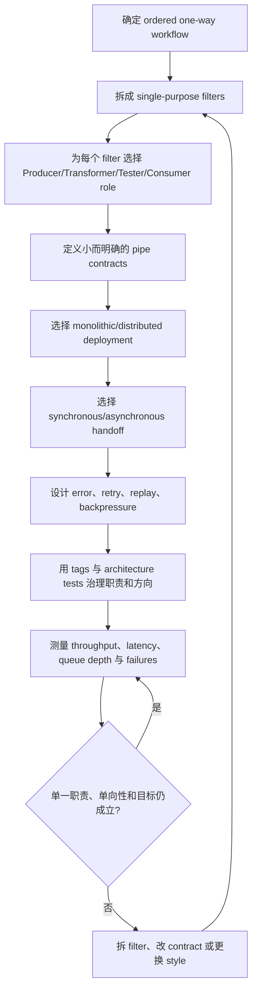
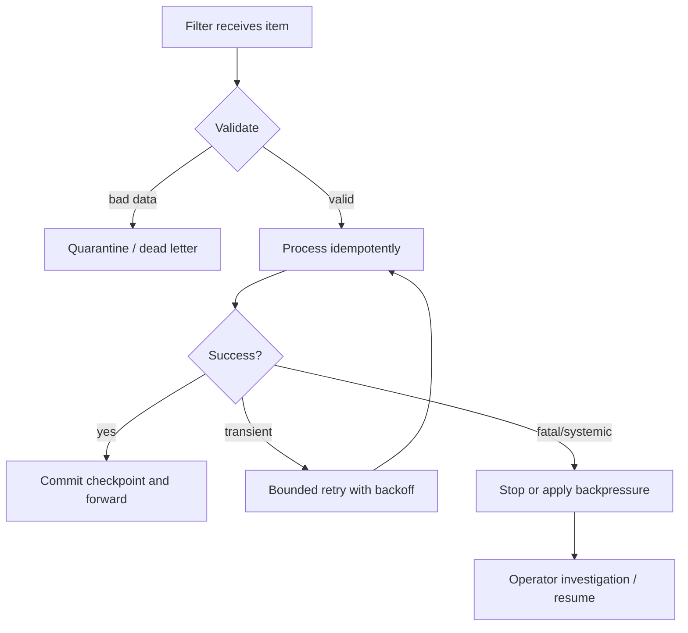
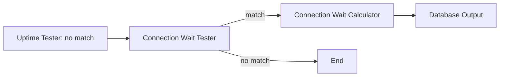
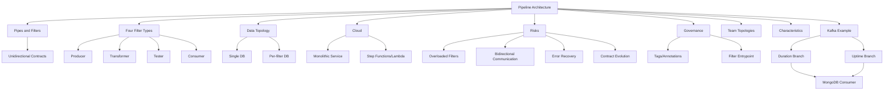

> 对应原章：12. Pipeline Architecture Style.md
> Pipeline architecture 又称 pipes and filters architecture。它把处理过程拆成单一目的的 filters，再用单向 pipes 传递数据，以顺序、组合和局部替换换取简单性与模块性。其关键不是“有一条处理链”，而是每个 filter 的责任足够小、contract 足够清楚、方向保持单向，并且错误恢复与背压从设计开始就被考虑。
> 本笔记严格沿原章顺序展开。原书没有正式计算算法；文中的吞吐、延迟、积压公式、Python 示例和治理检查是教学化扩展。评分以常见 monolithic deployment 为基准；把 filters 分布式部署可以改变 scalability、elasticity 和 fault tolerance，却会同时降低 simplicity、提高 cost，并引入网络与一致性问题。

## 0. 本章要回答的核心问题

1. Pipeline architecture 为什么在功能首次被拆成离散步骤后自然出现？
2. Unix shell、functional programming 与 MapReduce 怎样体现同一组合思想？
3. Pipes 与 filters 分别承担什么，为什么 pipeline 的同构形态强调单向连接？
4. 为什么大多数 pipeline 是 monolith，却也可以把 filter 部署为 services/functions？
5. Filter 为什么必须 self-contained、通常 stateless、single-purpose？
6. Producer、Transformer、Tester、Consumer 四种 filter 各自有什么输入输出约束？
7. Producer/source 与 Consumer/sink 怎样界定 pipeline 的开始和结束？
8. Transformer 与 functional `map` 有何相似，Tester 与原章所说 `reduce` 类比有什么局限？
9. Knuth 与 McIlroy 的词频故事怎样证明 compositional reuse 的力量？
10. 六行 shell pipeline 每一步怎样改变数据，为什么简单 filters 能组合出复杂算法？
11. Pipe 为什么通常 unidirectional、point-to-point、偏好 small payload？
12. Monolithic/distributed 与 synchronous/asynchronous 是哪两个独立维度？
13. Pipeline 的 data topology 为什么可以从单库到每 filter 一库？
14. Continuous fitness function 案例中 Raw Data、Selection Rules、Analytics 和 Report 怎样流动？
15. Pipeline 为什么适合 cloud，AWS Step Functions Standard/Express 的交付语义需要怎样谨慎理解？
16. Filter 过载、bidirectional communication、error handling 和 contract evolution 四类风险怎样产生？
17. Fatal error 为什么应在架构定义前识别，恢复点和重放怎样设计？
18. Tag/annotation 为什么只能提供 metadata，不能自动证明 filter 做对了事？
19. Java annotation 与 C# attribute 怎样标识 filter type 和 entry point？
20. 一个 filter 有多个 classes 时，为什么需要唯一 entry point？
21. 四类 Team Topologies 怎样与 pipeline 协作，哪类所有权最自然？
22. 为什么 simplicity 是 4 星而不是 5 星，modularity 为何只有 2 星？
23. Testability、evolvability、responsiveness 为什么是 3 星，deployability/maintainability 为什么只有 2 星？
24. Scalability、elasticity、fault tolerance 为什么在默认单体形态都只有 1 星？
25. Distributed asynchronous filters 能改善哪些项，又付出什么？
26. 何时 pipeline 适合 ordered deterministic workflow，何时 nondeterministic/back-and-forth workflow 应选择 event-driven？
27. EDI、ETL、Apache Camel 为什么是典型用例？
28. Kafka telemetry 案例中 Duration/Uptime 两条分支如何分类、转换并汇聚？
29. 新增 database connection wait-time metric 为什么能体现 extensibility？
30. 怎样把本章方法转成可治理、可恢复、可扩展的 pipeline 设计流程？

本章论证主线如下：



一句话概括：**Pipeline architecture 用单向、可组合的小步骤把复杂处理变成可推理的数据流；一旦步骤需要频繁回话、共享大量状态或包含复杂非确定分支，这种简单性就开始失效。**

---

## 1. 开篇：为什么 Pipes and Filters 是基础风格

只要开发者开始把完整功能拆成离散部分，就自然需要：

- 每一部分做什么；
- 数据怎样从一部分到下一部分；
- 如何组合已有步骤；
- 怎样替换某一步而不重写全流程。

Pipeline architecture 因此是软件架构最基础风格之一。

### 1.1 Unix shell 的直观经验

Bash、Zsh 等 shell 中：

```text
command_1 | command_2 | command_3
```

- 每个 command 是 filter；
- `|` 是 pipe；
- stdout 成为下一个 command 的 stdin；
- command 不需知道前后具体实现；
- 小工具可组合成新行为。

### 1.2 Functional programming 的对应

函数式语言常强调：

- immutable data；
- pure functions；
- function composition；
- map/filter/fold；
- 明确输入输出。

这些属性与 stateless filters、unidirectional data flow 高度相容。相似不表示任何函数链都构成架构 style；只有当这种拓扑成为系统主要组织方式时，才上升为架构。

### 1.3 MapReduce 的相似性

MapReduce 把数据变换分成 map、shuffle/group、reduce 阶段，工具可按阶段调度和并行。它遵循“离散处理 + 明确数据传递”的基本 topology，但 MapReduce 有特定分布式数据语义，不能与一般 pipeline 完全等同。

### 1.4 低层工具与高层业务都可使用

原章示例多是 telemetry、shell 和 ETL 等低层处理，但高层业务若具有：

- 明确顺序；
- 单向状态演进；
- 步骤可独立描述；
- 输入输出 contract 稳定；

也可使用 pipeline，例如文档审批、订单校验或数据导入。

---

## 2. Topology：拓扑

Pipeline topology 只有两种主要构件：filters 和 pipes。


### 2.1 Filters

Filter 包含系统功能，执行特定 business function。它可以：

- 捕获输入；
- 转换数据；
- 判断和路由；
- 持久化或展示结果。

### 2.2 Pipes

Pipe 把数据传给 chain 中的下一个 filter 或 filters。通常：

- one-way；
- point-to-point；
- 有明确 payload contract；
- 不承担业务变换。

### 2.3 Isomorphic shape

原章定义 pipeline 的同构形态：

> 一个部署单元，功能包含在由单向 pipes 连接的 filters 中。

教学化表示：

$$
Pipeline=(F,E),\qquad E\subseteq F\times F
$$

$F$ 是 filters，$E$ 是单向 pipes。常见 flow 是有向无环图，但原章没有要求所有 pipeline 必须线性或严格 DAG；若存在回边，团队应警惕它是否已经变成 feedback/event workflow。

### 2.4 单一部署是默认，不是定义的全部

同构形态描述最常见 monolithic implementation。原章后续明确允许每个 filter 或 filter group 成为 service。因此，真正稳定的结构特征是：

- filter responsibility；
- pipe direction；
- contract-based composition。

物理部署可以演进。

### 2.5 分支与汇聚

Pipeline 不必只有直线。Tester 可以：

- 命中条件时发往 transformer；
- 未命中时发往另一个 tester；
- 不感兴趣时终止；
- 多条 transform branch 最终汇聚到 consumer。

分支仍应保持单向和确定规则。分支数量爆炸、回话频繁时，event-driven/workflow engine 可能更合适。

---

## 3. Style Specifics：风格细节

多数实现是 monolithic；也可把 filters 部署成 services，通过 synchronous/asynchronous remote calls 连接。

### 3.1 两个独立设计轴

| 轴 | 选项 | 主要影响 |
| --- | --- | --- |
| Deployment topology | Monolithic / Distributed | 成本、故障隔离、独立扩展与发布 |
| Pipe timing | Synchronous / Asynchronous | 阻塞、缓冲、积压、顺序与恢复 |

Monolithic pipeline 也可用 threads/embedded messaging 异步；distributed pipeline 也可逐步同步调用。不要把 distributed 与 asynchronous 混为同义词。

### 3.2 Filters

Filter 应：

- self-contained；
- independent from other filters；
- generally stateless；
- perform one task only；
- 通过 contract 接收和输出。

Composite task 应拆成 filter sequence，而非塞进一个巨型 filter。

### 3.3 Filter 是 Component

Filter 可以由多个 class files 实现，因此属于第 8 章定义的 architecture component。即使只有一个 class，也仍是组件，因为它占据明确架构角色，而不是因为代码行数。

### 3.4 Producer

Producer 是 process 起点，又叫 source：

- outbound only；
- 从 UI、external request、file、topic、sensor 等接收系统外输入；
- 规范化为 pipeline contract；
- 不依赖上游 filter。

Producer 可以有多个下游，但每条 pipe 仍单向。

### 3.5 Transformer

Transformer：

1. 接受 input；
2. 可变换全部或部分 data；
3. 将结果发到 outbound pipe。

常见工作：

- enrich；
- normalize；
- convert format；
- calculate；
- aggregate；
- redact。

它类似 functional `map`：输入元素映射为输出元素。但 transformer 也可能聚合或访问状态，因此只有在纯一对一转换时才严格等同 map。

### 3.6 Tester

Tester：

- 接受 input；
- 根据一个或多个 criteria 判断；
- 可选择产生 output；
- 决定继续、分支或终止。

例子：

- 检查所有字段有效；
- 订单金额小于 5 美元时不再转发；
- 判断 telemetry 属于 duration 还是 uptime。

原章把 tester 类比 functional `reduce`。严格函数式术语中，`filter/predicate` 或 partition/branch 通常比 reduce 更贴切：reduce 把集合折叠为累计值。应把原类比理解为“根据条件缩减后续数据流”，而非 API 一一对应。

### 3.7 Consumer

Consumer 是 pipeline flow 的终点，又叫 sink：

- 不再向 pipeline 后续输出；
- 持久化最终结果；
- 展示 UI；
- 调用外部终端能力；
- 生成 report。

Consumer 的外部副作用需要 idempotency 和 error handling，特别是在 at-least-once delivery 下。

### 3.8 四类 Filter 对照

| Type | Inbound | Outbound | 核心责任 | 典型例子 |
| --- | --- | --- | --- | --- |
| Producer | 系统外部 | 有 | 启动数据流 | Kafka capture, UI request |
| Transformer | 有 | 有 | 变换/计算 | Duration Calculator |
| Tester | 有 | 可选/分支 | 判断、路由、终止 | Duration/Uptime filter |
| Consumer | 有 | 无 pipeline 输出 | 保存/展示最终结果 | DB Output, Graphing Tool |

### 3.9 Compositional Reuse

单向、简单 contract 让 filters 可重新排列和组合：

- filter 不知道整个业务；
- 输入输出可测试；
- 新流程复用旧步骤；
- 替换一步不影响其他步骤，前提是 contract 不变。

### 3.10 Knuth 与 McIlroy 的词频故事

问题：读取文本文件，找出使用最多的前 $n$ 个词，按频率排序输出。

Donald Knuth 用 Pascal 写了超过 10 页程序，并设计、记录新算法。Doug McIlroy 用短 shell pipeline：

```shell
tr -cs A-Za-z '\n' |
tr A-Z a-z |
sort |
uniq -c |
sort -rn |
sed ${1}q
```

逐步解释：

1. `tr -cs A-Za-z '\n'`：将非字母序列转换为换行，把文本切成单词；
2. `tr A-Z a-z`：统一小写；
3. `sort`：排序，使相同单词相邻；
4. `uniq -c`：计数；
5. `sort -rn`：按数字逆序；
6. `sed ${1}q`：输出参数指定的前若干行后退出。

这里每个 Unix command 是单目的 filter，pipe 只传文本。组合力量来自统一 stdin/stdout contract。

### 3.11 这个故事不证明什么

- 不证明 shell 永远优于通用语言；
- 不评价 Unicode、locale、超大数据、内存和错误恢复；
- 不保证跨平台行为；
- 不是所有业务都能表达成文本流。

它证明好的小抽象可以产生超出设计者预期的 compositional reuse。

### 3.12 Pipes

Pipe 是 filters 之间的 communication channel：

- one source -> one target 是典型形态；
- payload 可以是任何 format；
- architects 通常偏好 smaller payload，以提高性能；
- 不应包含业务逻辑；
- contract 是边界核心。

### 3.13 Payload 为什么应小

$$
TransferTime\ge\frac{PayloadBits}{Bandwidth}
$$

大 payload 增加：

- serialization/deserialization；
- memory allocation；
- network/disk I/O；
- queue storage；
- retry cost；
- contract coupling。

“小”不是丢掉下游所需数据。过度拆成大量 tiny messages 又会增加 headers、calls 和 ordering complexity。

### 3.14 Pipe 的同步/异步实现

#### Monolithic synchronous

- method/function call；
- iterator/stream；
- 简单、低 latency；
- 下游阻塞上游。

#### Monolithic asynchronous

- threads；
- bounded queue；
- embedded messaging；
- 可缓冲/并行；
- 需管理 backpressure 和 concurrency。

#### Distributed synchronous

- REST/RPC；
- 每 filter 可独立部署；
- 网络 latency/failure 逐级传播。

#### Distributed asynchronous

- messaging；
- streaming；
- serverless event trigger；
- 可提高隔离和弹性；
- 引入 duplicate、ordering、eventual consistency 和 observability。

### 3.15 Pipeline 性能模型

若 $k$ 个 synchronous filters 串行，每步处理时间 $t_i$：

$$
Latency_{one\ item}=\sum_{i=1}^{k}t_i+CommunicationOverhead
$$

若每步可并行处理不同 items，稳态吞吐受最慢 stage 限制：

$$
Throughput_{pipeline}\le\min_i Throughput_i
$$

若异步到达率 $\lambda$ 高于最慢消费率 $\mu$：

$$
Backlog(T)\approx\max(0,(\lambda-\mu)T)
$$

这些是简化模型，忽略 batching、并发度、I/O overlap、重试和相关故障。

### 3.16 可运行的 Filter Pipeline

```python
from collections import Counter
import re


def produce(text):
    return re.findall(r"[A-Za-z]+", text.lower())


def transform_count(words):
    return Counter(words)


def transform_rank(counts):
    return sorted(counts.items(), key=lambda item: (-item[1], item[0]))


def test_top_n(ranked, limit):
    return ranked[:limit]


def consume(rows):
    return ", ".join(f"{word}:{count}" for word, count in rows)


words = produce("Pipe filter pipe. Compose filters; compose data.")
counts = transform_count(words)
ranked = transform_rank(counts)
selected = test_top_n(ranked, 3)
print(consume(selected))
```

输出：

```text
compose:2, filter:1, filters:1
```

代码不实现 Unix shell 的流式外部排序，而是映射角色：`produce` 是 source，两个 transform 函数做计数和排序，`test_top_n` 截取，`consume` 格式化终点。由于排序规则对同频词按字母排序，输出可重复。

---

## 4. Data Topologies：数据拓扑

大多数 pipeline 作为 monolith 部署，因此常使用 single monolithic database；但该风格不要求单库，范围可从 single DB 到 database per filter。

### 4.1 Continuous Fitness Function 案例


流程：

1. `Capture Raw Data` producer 从 Raw Data database 加载；
2. Pipe 传给 `Time Series Selector` transformer；
3. Selector 从 Selection Rules database 读取分析时间区间配置；
4. 数据进入 `Trend Analyzer` transformer；
5. Analyzer 计算趋势并写 Analytics database；
6. Analytics 进入 `Graphing Tool` consumer；
7. Consumer 生成 graphical report。

### 4.2 数据库并不只属于 Consumer

- Producer 可以读取 source DB；
- Transformer 可读配置、写中间 analytics；
- Consumer 可持久化 final result；
- 一个 filter 可完全无数据库。

### 4.3 Single database 的收益与代价

收益：

- 事务和查询简单；
- 运维成本低；
- 本地访问；
- 统一 backup。

代价：

- filters 可能绕过 pipes 共享 tables；
- schema coupling；
- failure/scale boundary 共享；
- 难独立提取 filter。

### 4.4 Database per filter 的收益与代价

收益：

- filter 自包含；
- data purpose/retention 独立；
- 可选择适合 store；
- 易独立扩展和部署。

代价：

- data duplication；
- cross-filter consistency；
- 多 backup/migration；
- reporting 和 lineage 复杂；
- 运营成本高。

### 4.5 中间状态应否持久化

持久化中间结果可支持：

- restart from checkpoint；
- audit/replay；
- 独立重跑后半段；
- 长任务恢复。

代价：

- I/O 与 latency；
- storage cost；
- cleanup/retention；
- schema/version 管理。

短、可重算 pipeline 可以只流动内存数据；长、昂贵或受监管 pipeline 更需要 durable checkpoints。

---

## 5. Cloud Considerations：云端考虑

Pipeline 具有较高逻辑 modularity 和独立 filter types，适合 cloud。

### 5.1 Monolithic cloud deployment

所有 filters 放在一个：

- service；
- container；
- VM/process；

优点是简单、便宜、调试容易。小型 pipeline 通常不需要每 filter serverless。

### 5.2 Distributed functions

每 filter 可部署为：

- serverless function；
- containerized function；
- 独立 service；
- workflow step。

获得：

- 独立 scale；
- fault isolation；
- pay-per-use；
- 独立 runtime。

付出：

- orchestration cost；
- network latency；
- state/contract management；
- cold start；
- distributed observability；
- duplicate execution。

### 5.3 AWS Step Functions

原章将 continuous fitness function 映射为四个 Lambda Tasks：

```json
{
  "Comment": "Measure and analyze scalability trends.",
  "StartAt": "Capture Raw Data",
  "States": {
    "Capture Raw Data": {
      "Type": "Task",
      "Resource": "arn:aws:lambda:region:account_id:function:raw_data_capture",
      "Next": "Time Series Selector"
    },
    "Time Series Selector": {
      "Type": "Task",
      "Resource": "arn:aws:lambda:region:account_id:function:time_series_selector",
      "Next": "Trend Analyzer"
    },
    "Trend Analyzer": {
      "Type": "Task",
      "Resource": "arn:aws:lambda:region:account_id:function:trend_analyzer",
      "Next": "Graphing Tool"
    },
    "Graphing Tool": {
      "Type": "Task",
      "Resource": "arn:aws:lambda:region:account_id:function:graphing_tool",
      "End": true
    }
  }
}
```

顺序由 `StartAt`、`Next` 和 `End` 显式表达。

### 5.4 Standard 与 Express 语义边界

原章概括：Standard 中每 step exactly once，Express 中 step 可执行多次。实践中应按 AWS 当前文档和调用模式精确定义：

- Standard workflow execution 通常提供 exactly-once workflow semantics，但 Task retry、服务集成和超时后的副作用仍要求幂等；
- Asynchronous Express 通常是 at-least-once；
- Synchronous Express 通常是 at-most-once；
- Lambda 自身、网络 timeout 和 external side effect 可能制造重复或未知结果。

因此任何有副作用 filter 都应使用 idempotency key、conditional write 或去重状态，而不是只信任 workflow 标签。

### 5.5 Cloud 不只有一种实现

- Step Functions + Lambda；
- 单 service 包含四种 filters；
- containers + queue；
- streaming platform；
- managed ETL/workflow service。

选择取决于 traffic、duration、state、cost、delivery semantics 和团队能力。

---

## 6. Common Risks：常见风险

### 6.1 Filter 责任过载

Pipeline 的目标是每 filter 对数据执行 one specific action。过载 filter 会：

- 失去可替换性；
- 测试路径变多；
- 多种变化原因混合；
- 失败恢复粒度过大；
- 变成 unstructured monolith 内的小泥球。

信号：

- 名称包含 `And`；
- 既判断又持久化又通知；
- 多个不相关输入/输出；
- 多种 owner；
- CC、代码量和依赖快速增长。

### 6.2 Bidirectional communication

Pipe 应 unidirectional。若 B 处理时不断回问 A：

```text
A -> B -> A -> B
```

会产生：

- circular dependency；
- hidden state；
- request/response protocol；
- deadlock/time coupling；
- 难以独立测试和重放。

双向需求提示：

- filters 划分错误；
- workflow 非确定；
- 需要 orchestrator/state machine；
- pipeline style 可能不合适。

### 6.3 Error conditions

Pipeline 启动后，错误可能发生在任何 stage：

- 哪一步负责停止？
- 前面副作用是否回滚？
- 从头重跑还是 checkpoint？
- 原输入是否仍可获得？
- 重试会不会重复 consumer side effect？
- 一条坏数据是否阻塞全流？

原章要求在定义 architecture 前识别 possible fatal errors。

### 6.4 Error 分类

| Error | 示例 | 常见策略 |
| --- | --- | --- |
| Invalid data | Schema/字段无效 | Tester reject, quarantine |
| Transient | 网络 timeout | bounded retry + backoff |
| Permanent | 不支持格式 | dead-letter/manual review |
| Systemic | DB unavailable | stop/backpressure/circuit breaker |
| Partial side effect | Consumer 已写但 ack 丢失 | idempotency/reconciliation |
| Poison message | 每次处理都 crash | isolate and skip policy |

### 6.5 Recovery model



### 6.6 Contract management

每条 pipe contract 定义：

- schema/types；
- required/optional fields；
- meaning/unit；
- ordering；
- version；
- error representation；
- correlation/idempotency metadata。

改变 contract 可能破坏所有 receiving filters。治理措施：

- schema validation；
- backward-compatible additive changes；
- consumer contract tests；
- version lifecycle；
- producer/consumer deployment coordination；
- replay old messages in tests。

### 6.7 Backpressure 风险

原章没有单列 backpressure，但异步 pipeline 不可忽略。若 producer rate $\lambda$ 持续大于 slowest stage rate $\mu$：

$$
Backlog(T)=\max(0,(\lambda-\mu)T)
$$

必须：

- bounded queues；
- rate limiting；
- consumer scaling；
- load shedding；
- pause/resume producer；
- lag alerts。

无限 queue 只会把故障推迟到 memory/storage 耗尽。

---

## 7. Governance：治理

Operational characteristics 的治理依具体 use case。结构治理主要围绕四种 filter roles、entry point、pipe direction 和 contracts。

### 7.1 为什么职责难以完全自动判断

静态工具容易检查 annotation，却很难证明：

- Producer 真的是流程起点；
- Tester 只做 conditional decision；
- Transformer 没暗中路由；
- Consumer 没继续传播；
- Filter 只承担一个业务动作。

这些需要 metadata + dependency rules + code review + runtime tests。

### 7.2 Tags/Annotations 的作用

Tag 不执行功能，只提供 programmatic metadata：

- 告诉 developer 当前 class 的 architecture role；
- 让 analyzer 找到 filter；
- 支持依赖和职责规则；
- 让图和文档自动生成；
- 提高 review context。

Tag 是提醒和检查入口，不保证行为正确。

### 7.3 Java Filter annotation

```java
@Retention(RetentionPolicy.RUNTIME)
@Target(ElementType.TYPE)
public @interface Filter {
    FilterType[] value();

    enum FilterType {
        PRODUCER,
        TESTER,
        TRANSFORMER,
        CONSUMER
    }
}
```

- Runtime retention 允许运行/测试时反射读取；
- TYPE target 只标 class/interface 等类型；
- array 表示一个 entry class 可声明多个 roles，但这可能是责任过载信号。

原章使用 `public` 修饰 annotation members/enum；Java interface/annotation 中相关 members 隐式 public，省略更简洁。

### 7.4 C# Filter attribute

```csharp
[System.AttributeUsage(System.AttributeTargets.Class)]
class Filter : System.Attribute {
    public FilterType[] filterType;

    public enum FilterType {
        PRODUCER,
        TESTER,
        TRANSFORMER,
        CONSUMER
    }
}
```

实践中通常命名 `FilterAttribute` 并使用 constructor/property，以获得更惯用 API；这里保留原章意图。

### 7.5 为什么需要 FilterEntrypoint

一个 filter 是 architecture component，可由多个 classes 实现。若每个 class 都标 type：

- role 重复；
- analyzer 不知道入口；
- 内部 helper 被误当独立 filter；
- pipe dependency 无法准确挂接。

因此标出唯一 entry class，再给它 filter role。

Java：

```java
@Retention(RetentionPolicy.RUNTIME)
@Target(ElementType.TYPE)
public @interface FilterEntrypoint {}
```

C#：

```csharp
[System.AttributeUsage(System.AttributeTargets.Class)]
class FilterEntrypoint : System.Attribute {}
```

### 7.6 使用 Tags

Java：

```java
@FilterEntrypoint
@Filter(Filter.FilterType.TRANSFORMER)
public class TrendAnalyzerFilter {
    // Implementation classes remain inside this filter component.
}
```

C#：

```csharp
[FilterEntrypoint]
[Filter(Filter.FilterType.TRANSFORMER)]
class TrendAnalyzerFilter {
}
```

原书写 `@Filter(FilterType.TRANSFORMER)`，若 enum 嵌套于 annotation 且没有 static import/同包解析，完整限定 `Filter.FilterType` 更明确。C# 原示例也省略了可接收 enum 参数的 constructor，因此作为概念片段理解，不是可独立编译程序。

### 7.7 可以自动检查什么

```text
for each FilterEntrypoint:
    require exactly one declared Filter role
    require no incoming pipe if Producer
    require no outgoing pipeline pipe if Consumer
    require outbound dependencies follow allowed DAG
    require contract schema validation
    warn if dependency/complexity threshold exceeded
```

`Tester` 是否真正只测试、`Transformer` 是否业务内聚，仍需人工语义审查。

### 7.8 Governance 避免反效果

- 不把 annotation 当行为证明；
- 不让 role tag 成为形式主义；
- 阈值基于项目基线；
- 规则失败给出 pipe/filter path；
- 允许有期限例外；
- 同时验证 runtime contract；
- 变更 architecture intent 时更新规则。

---

## 8. Team Topology Considerations：团队拓扑考虑

Pipeline 通常 small/self-contained，且 technically partitioned，因此对团队拓扑相对独立。

### 8.1 Stream-aligned teams

- 一个 team 端到端拥有整条 flow；
- Pipeline 代表单一 journey；
- 减少 stage 间 handoff；
- 同时对最终 business outcome 负责。

这是默认最自然形态。若每 filter 由不同 team 所有，contract coordination 可能吞噬组合收益。

### 8.2 Enabling teams

Specialists 可加入新 filter 做 experiment，而不破坏主流：

- 在 Time Series Selector 后加 alternative Trend Analyzer；
- 使用同样 data；
- 分支比较结果；
- 验证后保留或移除。

前提是 pipe contract 稳定、分支不会给 producer 施加反向依赖。

### 8.3 Complicated-subsystem teams

复杂 filter 可由专门 team 拥有，例如：

- ML model scoring；
- cryptographic transformation；
- complex optimization；
- media encoding。

单向 handoff 让团队聚焦 filter 内部复杂度。其 API 应保持小，否则复杂度仍泄漏。

### 8.4 Platform teams

Platform 可提供：

- filter SDK/templates；
- schema registry；
- queue/stream runtime；
- deployment workflow；
- observability；
- retry/dead-letter primitives；
- annotation analyzer。

平台应保持 pipes/filters 简单，不要用统一框架迫使每个 filter 引入不需要的依赖。

### 8.5 团队边界的风险

| Ownership | 优势 | 风险 |
| --- | --- | --- |
| One stream team owns pipeline | 端到端速度快 | 需掌握所有 stage 技术 |
| Team per complex filter | 专业深度 | contract/version coordination |
| Platform owns runtime | 统一治理 | 平台 bottleneck |
| Enabling team adds experiments | 学习快 | 临时分支长期遗留 |

---

## 9. Style Characteristics：风格特征

评分以 typical monolithic pipeline 为基准。1 星表示弱，5 星表示风格最强能力。


### 9.1 完整评分表

| 类别 | 特征 | 评分/值 |
| --- | --- | --- |
| Cost | Overall cost | `$`，低成本 |
| Structural | Partitioning type | Technical |
| Structural | Number of quanta | 1 |
| Structural | Simplicity | 4 星 |
| Structural | Modularity | 2 星 |
| Engineering | Maintainability | 2 星 |
| Engineering | Testability | 3 星 |
| Engineering | Deployability | 2 星 |
| Engineering | Evolvability | 3 星 |
| Operational | Responsiveness | 3 星 |
| Operational | Scalability | 1 星 |
| Operational | Elasticity | 1 星 |
| Operational | Fault tolerance | 1 星 |

### 9.2 Cost：`$`

低成本来自：

- 默认 monolith；
- 构件类型少；
- 本地 pipes；
- 常见技术；
- 单 team 可拥有；
- 简单运维。

Distributed/serverless 版本会增加调用、状态、观测和供应商成本。

### 9.3 Technical partitioning；Quantum=1

按 producer/transformer/tester/consumer 等 technical roles 分区，而非业务 domain。典型单体部署和数据库使 quantum=1。

逻辑 filters 可替换，不等于独立 deployment/failure boundary。

### 9.4 Simplicity：4 星

强项：

- 两种构件；
- 单向数据流；
- 步骤容易推理；
- 无复杂 distributed infrastructure。

不是 5 星，因为：

- contract chain；
- branching/testers；
- error/recovery；
- data transformations；
- 长 pipeline 调试；

仍有显著复杂度。

### 9.5 Modularity：2 星

Filter separation 带来局部 modularity，任何 filter 在 contract 稳定时可修改/替换。例如 Duration Calculator 可改变计算而不改其他 filters。

仍只有 2 星，因为：

- technical 而非 domain partition；
- 单 deployment；
- quantum=1；
- contract chain 紧密；
- 可能共享 database/process。

### 9.6 Maintainability：2 星

单 filter 容易定位，但端到端行为跨多 stages：

- contract change 传播；
- error path 跨链；
- tester 分支增多；
- monolithic build/release；
- 过载 filter 破坏边界。

### 9.7 Testability：3 星

每 filter 有明确 input/output，可：

- unit test；
- property test；
- contract test；
- 用 fake pipe 隔离；
- replay fixtures。

扣分来自 end-to-end flow、状态、异步 timing 和 error recovery 测试。

### 9.8 Deployability：2 星

典型 monolith 仍整体发布，ceremony/risk/frequency 不佳。Filter modularity 使 change impact 比 layered monolith 更清楚，因此比最弱略好。

若每 filter 独立部署，该评分可提高，但成本和 contract coordination 同时提高。

### 9.9 Evolvability：3 星

新 tester/transformer 可插入，旧 filter 可替换，composition 支持演进。限制：

- 单向有序模型；
- contract compatibility；
- 复杂分支迅速降低可理解性；
- monolith release coupling。

### 9.10 Responsiveness：3 星

Monolithic local calls/streams 较快，小 payload 有利。串行 latency 会累计，slowest stage 限制 throughput；closed chain 与持久化 intermediate state 也增加响应时间。

### 9.11 Scalability/Elasticity/Fault tolerance：1 星

默认 monolithic deployment：

- 只能整体 scale；
- filter 无独立 elasticity；
- 任一 OOM 影响全体；
- startup/MTTR 高；
- shared DB 是瓶颈。

### 9.12 Distributed Asynchronous Trade-off

每 filter 作为 deployment unit、pipes 使用 async remote calls，可提高：

- independent scalability；
- elasticity；
- fault isolation；
- deployment autonomy；
- burst buffering。

同时降低：

- simplicity；
- overall cost；
- immediate consistency；
- debugging ease；
- contract simplicity。

这说明 rating 不是不可改变，改变 topology 会同时改变 style trade-offs。

### 9.13 When to Use：何时使用

适合任意 complexity、但 workflow 具有：

- distinct steps；
- ordered；
- deterministic；
- one-way processing；
- 每步可用 contract 表达。

也适合 tight time/budget，因为 topology 简单。

### 9.14 When Not to Use：何时不使用

不适合默认单体形态要求高：

- scalability；
- elasticity；
- fault tolerance。

Distributed implementation 可缓解，但不免费。

更根本的不适合信号：

- back-and-forth communication；
- nondeterministic workflow；
- 大量动态分支/汇合；
- 多 actor 反复协商；
- 长事务补偿复杂；
- pipeline topology 随数据动态改变。

虽然大量 tester filters 可以模拟 nondeterminism，但会损害 maintainability、testability、deployability 和 reliability。Event-driven architecture 更合适。

---

## 10. Examples and Use Cases：示例与用例

### 10.1 常见应用

#### EDI

Electronic Data Interchange tools 用多个 transformations 把一种 document type 转为另一种。

#### ETL

Extract/Transform/Load tools 从 data source 提取，经清理、转换、验证，再流入 target DB。

#### Apache Camel

Orchestrator/mediator 将 business process information 从一步传到下一步，使用 pipeline 和 integration patterns。

这些用例共同特点：有明确数据流与顺序步骤。

### 10.2 Kafka Service Telemetry 案例


### 10.3 Service Info Capture：Producer

- Subscribe Kafka topic；
- receive service information；
- 不判断 duration/uptime；
- 把 captured data 发给 Duration tester。

它只知道怎样连接 Kafka 和产生统一 pipeline input。

### 10.4 Duration filter：Tester

判断 data 是否为 service request duration（milliseconds）：

- 是 -> Duration Calculator；
- 否 -> Uptime filter。

它负责 qualification/routing，不负责计算 duration。

### 10.5 Duration Calculator：Transformer

- 接受 duration telemetry；
- 计算/聚合 duration metric；
- 把 transformed data 发给 Database Output。

原章评分解释中特别用它说明可替换性：改变 duration calculation 不需改其他 filters，只要 contract 不变。

### 10.6 Uptime filter：Tester

若数据不是 duration，检查是否 uptime metric：

- 是 -> Uptime Calculator；
- 否 -> pipeline end，数据对此 flow 无兴趣。

Tester 可终止数据项，而不要求所有输入到 consumer。

### 10.7 Uptime Calculator：Transformer

- 计算 uptime metrics；
- 将 modified data 发给 Database Output。

### 10.8 Database Output：Consumer

- 汇聚两条 calculator output；
- persist 到 MongoDB；
- 结束 pipeline。

它需要处理重复写、schema 和 database failure。

### 10.9 Separation of concerns

| Filter | 只关心 | 不关心 |
| --- | --- | --- |
| Capture | Kafka connection/capture | metric 类型与算法 |
| Duration tester | 是否 duration | 怎样计算与存储 |
| Uptime tester | 是否 uptime | duration 逻辑 |
| Calculators | 各自 metric transform | Kafka 与 MongoDB connection |
| DB Output | persistence | 如何分类/计算 |

这种 narrow knowledge 让局部替换和测试可行。

### 10.10 Extensibility：增加 Connection Wait Time

在 Uptime filter 后增加 tester：



若 existing contracts 足够通用：

- Capture 不变；
- Duration path 不变；
- Uptime Calculator 不变；
- 新 filter 局部插入；
- Consumer 可能只需兼容新 metric schema。

### 10.11 扩展并非零成本

- routing priority 要定义；
- 一个 item 是否可匹配多个 metrics；
- consumer schema 是否兼容；
- replay old data；
- tester chain latency 增长；
- 未识别 data 如何观测；
- filter ordering 影响结果。

### 10.12 为什么该案例适合 Pipeline

- telemetry 单向流动；
- classification rules 确定；
- transforms 独立；
- unmatched data 可结束；
- final persistence 统一；
- 新 metric 可组合加入。

若 telemetry 处理需要多个 filters 反复协商或动态反馈，event-driven/stream processing topology 可能更合适。

### 10.13 与下一章衔接

Pipeline 是倒数第二个 monolithic style。下一章 microkernel 同样通过 plug-in components 获得较好 modularity，但它围绕 core system + plug-ins，而非 ordered pipes + filters。

---

## 11. 容易混淆的概念与常见误区

### 11.1 “任何函数调用链都是 Pipeline Architecture”

错误之处：普通调用链未必是系统主要组织拓扑，也未必有单向 contract。

正确理解：filters/pipes 必须是显式 architecture components 和主要 flow。

### 11.2 “Pipeline 必须是直线”

错误之处：Tester 可分支，多个 transforms 可汇聚。

正确理解：核心是单向、可解释和确定规则，而非几何直线。

### 11.3 “Pipeline 必须是 Monolith”

错误之处：filters 可部署为 services/functions。

正确理解：默认评分基于 monolith，distributed 会改变 trade-offs。

### 11.4 “Distributed 就一定 Asynchronous”

错误之处：remote REST/RPC 可以同步；单体内 queue 可以异步。

正确理解：deployment 与 timing 是独立设计轴。

### 11.5 “Filter 只能由一个 Class 实现”

错误之处：filter 是 component，可包含多个 classes。

正确理解：entry point 表示边界入口，内部实现可复杂。

### 11.6 “Stateless 是绝对规则”

错误之处：aggregation、window 和 checkpoint 可能需要状态。

正确理解：优先显式、局部、可恢复状态，避免隐式跨-filter 共享。

### 11.7 “Transformer 严格等于 Map”

错误之处：可能 aggregate/enrich，并非一对一。

正确理解：map 是直觉类比，不是完整语义。

### 11.8 “Tester 严格等于 Reduce”

错误之处：Tester 更常是 predicate/filter/router，reduce 通常聚合集合。

正确理解：原章强调缩减或条件推进数据流。

### 11.9 “Consumer 永远写 Database”

错误之处：也可 display UI、send external output 或生成 report。

正确理解：它由“不再进入 pipeline”定义。

### 11.10 “Knuth/McIlroy 故事证明 Shell 总是更好”

错误之处：locale、Unicode、错误恢复和规模可能改变选择。

正确理解：故事证明 compositional abstractions 的力量。

### 11.11 “Pipe 可以包含 Transformation”

错误之处：业务逻辑放 pipe 会隐藏责任。

正确理解：pipe transport，filter process。

### 11.12 “Payload 越小越好”

错误之处：缺字段迫使额外 calls，小消息过多增加 overhead。

正确理解：传最小充分 contract。

### 11.13 “单库表示 Filters 高耦合”

错误之处：若只由 owner filter 访问，单实例仍可逻辑隔离。

正确理解：看 ownership、schema 和直接跨表访问。

### 11.14 “每 Filter 一库就一定更模块化”

错误之处：跨库 transaction、复制和运维可能超过收益。

正确理解：按 state ownership 与恢复需求选择。

### 11.15 “Step Functions Standard 让副作用天然 Exactly-once”

错误之处：retry/timeout/external service 仍可能重复或结果未知。

正确理解：有副作用 filter 自身必须 idempotent。

### 11.16 “Filter Tag 能证明职责正确”

错误之处：metadata 不理解业务代码。

正确理解：tag 提供 context，组合静态规则、测试和 review。

### 11.17 “双向 Pipe 只是多一条 Arrow”

错误之处：它引入会话、状态、cycle 和 time coupling。

正确理解：重新划分 filters 或换适合协商式 workflow 的 style。

### 11.18 “异常发生时从头 Retry 即可”

错误之处：consumer side effects 可能重复，长 pipeline 成本高。

正确理解：分类错误，设计 idempotency、checkpoint 和 reconciliation。

### 11.19 “Contract Change 只影响相邻 Filter”

错误之处：下游可能透传、持久化或依赖语义，影响可跨链传播。

正确理解：做 schema lineage 和 end-to-end contract tests。

### 11.20 “Annotation Role 越多越灵活”

错误之处：一个 entrypoint 多 roles 常提示责任过载。

正确理解：默认 exactly one role，有理由的 composite 明确记录。

### 11.21 “Technical Partitioning 表示没有业务内聚”

错误之处：每 filter 可以围绕一个业务动作内聚。

正确理解：顶层组织轴按 processing role/step，不是 domain module。

### 11.22 “Filter 可替换，所以 Modularity 应是 5 星”

错误之处：单 deployment、quantum=1 和 shared contracts 限制架构模块性。

正确理解：逻辑局部替换与物理独立演进不同。

### 11.23 “分布式化只提高评分，没有代价”

错误之处：cost、simplicity、debugging 和 consistency 会下降。

正确理解：评分改变是多维 trade-off，不是免费升级。

### 11.24 “大量 Tester 可优雅实现任何 Workflow”

错误之处：nondeterministic 分支会使链难维护、测试和观测。

正确理解：event-driven 更适合动态 workflow。

### 11.25 “Backpressure 只在 Distributed Pipeline 出现”

错误之处：单体内 threads/queues 也会积压并耗尽内存。

正确理解：任何异步生产消费速率不匹配都需背压。

---

## 12. 从本章提炼的 Pipeline 设计法

### 第 1 步：确认 Workflow Shape

检查是否 ordered、deterministic、one-way，输出依赖输入而非反复协商。

**输出**：选择 pipeline 的理由和不适用信号。

### 第 2 步：拆成 Single-purpose Filters

每步只捕获、判断、变换或消费一种职责，复合任务形成 sequence。

**输出**：filter responsibility map。

### 第 3 步：分配四类 Roles

标记 producer/transformer/tester/consumer，检查输入输出约束。

**输出**：role-tagged components。

### 第 4 步：定义 Pipe Contracts

明确 schema、type、unit、version、ordering 和 metadata，保持最小充分 payload。

**输出**：versioned data contracts。

### 第 5 步：选择 Deployment 与 Timing

分别决定 monolithic/distributed 和 synchronous/asynchronous，不混为一个选择。

**输出**：logical-to-physical topology。

### 第 6 步：建模 Performance 与 Backpressure

计算串行 latency、slowest stage throughput、queue growth 和 capacity margin。

**输出**：SLO、queue bounds 和 scale policy。

### 第 7 步：先设计 Error/Recovery

识别 fatal/transient/invalid/partial-side-effect，定义 retry、DLQ、checkpoint、idempotency。

**输出**：failure state machine 与 recovery runbook。

### 第 8 步：治理 Roles 与 Direction

使用 tags、entrypoint、dependency graph 和 review，阻止职责过载与双向 pipes。

**输出**：architecture fitness functions。

### 第 9 步：匹配 Data Ownership 与 Teams

选择 shared/per-filter DB，由 stream team 端到端拥有，复杂 filter 可由 specialist team 支持。

**输出**：data/team ownership map。

### 第 10 步：持续验证 Style Fit

监控 branching、contract changes、back-and-forth、filter size 和 operational ratings；复杂度超出时换 style。

**输出**：保留、重构、分布式化或迁移 event-driven 的决定。

---

## 13. 本章知识结构



整章可压缩为四层：

1. **结构层**：Single-purpose filters 由 unidirectional pipes 连接；
2. **语义层**：Producer/Transformer/Tester/Consumer 约束每步责任；
3. **运行层**：Deployment 与 timing 决定 latency、throughput、backpressure 和 fault isolation；
4. **治理层**：Tags、entrypoints、contracts 与 error design 防止简单 pipeline 退化为复杂耦合系统。

---

## 14. 核心结论

1. **Pipeline architecture 是由 filters 和 pipes 构成的基础风格，也称 pipes and filters。**
2. **Unix shell、函数组合和 MapReduce 体现离散步骤与数据传递的共同思想，但语义不完全相同。**
3. **典型同构形态是单一部署中由单向 pipes 连接 filters；filters 也可分布式部署。**
4. **Filter 是 architecture component，应 self-contained、通常 stateless、默认 single-purpose。**
5. **Producer/source 启动流程，Transformer 变换，Tester 判断/路由/终止，Consumer/sink 结束流程。**
6. **Transformer 类似 map；Tester 更接近 predicate/filter/router，原章 reduce 类比只表达缩减后续数据流。**
7. **Knuth/McIlroy 故事说明统一小 contract 支持强大 compositional reuse，而不是 shell 永远优于通用语言。**
8. **Pipe 通常 one-way、point-to-point，只传数据；业务逻辑属于 filter。**
9. **Payload 应最小充分，既避免 stamp coupling，也避免过多 tiny messages。**
10. **Monolithic/distributed deployment 与 synchronous/asynchronous timing 是两个独立设计轴。**
11. **串行 latency 为各 stage 之和，稳态 throughput 受最慢 stage 限制，异步速率失配产生 backlog。**
12. **Data topology 可从 single database 到 database per filter，中间状态持久化需权衡恢复与 I/O。**
13. **Cloud 可用单 service 或 Step Functions/Lambda 部署；有副作用步骤仍需幂等，不可只依赖 exactly-once 标签。**
14. **四类主要风险是 filter 过载、双向通信、错误恢复困难和 pipe contract 演进。**
15. **双向 pipe 提示 filter 边界或 architecture style 可能错误。**
16. **Fatal errors、partial side effects、retry、checkpoint 和 replay 应在架构定义前设计。**
17. **Tags/annotations 只提供 metadata，不能证明 role 行为正确。**
18. **多 class filter 需要 entrypoint，把 architecture role 与内部 helpers 区分。**
19. **Pipeline 可配合四种 Team Topologies，stream-aligned team 端到端拥有最自然。**
20. **典型评分是 cost `$`、technical partition、quantum=1、simplicity 4、modularity/maintainability/deployability 2、testability/evolvability/responsiveness 3、三项运行扩展能力 1。**
21. **Distributed asynchronous filters 可提高 scale、elasticity 和 fault tolerance，却降低 simplicity 并增加 cost。**
22. **适合 distinct、ordered、deterministic、one-way processing 和紧预算/期限。**
23. **Back-and-forth 与 nondeterministic workflows 不适合；大量 Tester 模拟复杂状态会损害可维护性。**
24. **EDI、ETL 和 Apache Camel 都利用清晰的一步一步数据处理。**
25. **Kafka telemetry 案例用 Duration/Uptime testers 分类，再由 calculators 转换并汇入 MongoDB consumer。**
26. **新增 connection wait-time metric 可局部增加 tester/transformer，体现 extensibility，但仍要治理顺序和 schema。**
27. **Pipeline 的价值来自受约束的简单组合；当约束被持续打破时，应重划 filters 或选择 event-driven 等其他风格。**

---

## 15. 主动回忆与应用题

以下问题不提供紧邻答案，适合脱离正文作答后再核对推理链。

1. 用 filters、pipes、deployment、timing 四个维度定义一个 pipeline，不使用风格名称作答案。
2. 将一个五步业务流程拆成 Producer、Transformer、Tester 和 Consumer，解释每一步为何属于该类型。
3. 给出 Transformer 与 map 相同和不同之处；再解释 Tester 与 reduce 类比的边界。
4. 手工执行 McIlroy shell pipeline，写出每个 command 后的中间文本。
5. 在 Unicode、locale 和超大文件条件下，词频 pipeline 需要怎样修改？
6. 设计一个 filter 由五个 classes 实现的目录，指出唯一 entrypoint 和 public contract。
7. 比较 monolithic synchronous、monolithic asynchronous、distributed synchronous、distributed asynchronous 四种 pipe。
8. 某 pipeline stages 吞吐为 100、40、80 items/s，稳态上限是多少？若输入 75/s，10 分钟后估算 backlog。
9. 三个串行 stages 分别 20、50、30 ms，再加 10 ms 通信开销，计算单 item latency。
10. 给出一个 payload 太大和一个 message 太碎的反例，设计最小充分 contract。
11. 为图 12-2 四个 filters 说明各自数据库 ownership、checkpoint 与 retention。
12. 何时 single DB 比 database per filter 更合理，何时隐藏 data coupling 已不可接受？
13. 将 Step Functions JSON 扩展为含 Retry/Catch 的状态机，并说明为什么 Lambda 仍须幂等。
14. 比较 Standard、Asynchronous Express 和 Synchronous Express 的交付语义，不把 workflow 标签等同副作用 exactly-once。
15. 找一个过载 transformer，按不同变化原因拆成两个 filters，并比较 contract 成本。
16. 构造一个需要双向通信的流程，判断应重划 filters、增加 orchestrator，还是改用 event-driven。
17. 为 invalid、transient、permanent、systemic、partial-side-effect 和 poison errors 分别设计策略。
18. 设计 checkpoint 粒度：每 item、每 batch、每 stage，各有什么性能和恢复权衡？
19. 为 pipe contract 建立 schema compatibility 和 consumer contract tests。
20. 为什么 unbounded queue 不是 backpressure 方案？给出 queue 满时的明确策略。
21. 用 Java/C# tags 设计一条“Producer 无入边、Consumer 无出边”的静态检查。
22. 为什么 `@Filter(TRANSFORMER)` 无法证明代码没有 testing logic？还需要什么证据？
23. 为 pipeline 分配 stream-aligned、enabling、complicated-subsystem 和 platform teams。
24. 不看图复述完整评分，并解释 simplicity 为什么是 4 而不是 5、modularity 为什么不是 5。
25. 设计一份把 filters 分布式化的 ADR，列出提高与下降的评分。
26. 判断三个案例是否适合 pipeline：税务审批、ETL 导入、多人实时协商；给出理由。
27. 从 Kafka 输入开始，复述 Duration 与 Uptime 的每个 tester/transformer/consumer 路径。
28. 新增 database connection wait-time metric 时，哪些 filter 和 contract 应改变，哪些应保持不变？
29. 不看正文，复述设计十步：shape、filters、roles、contracts、deployment/timing、performance、recovery、governance、ownership、style fit。
