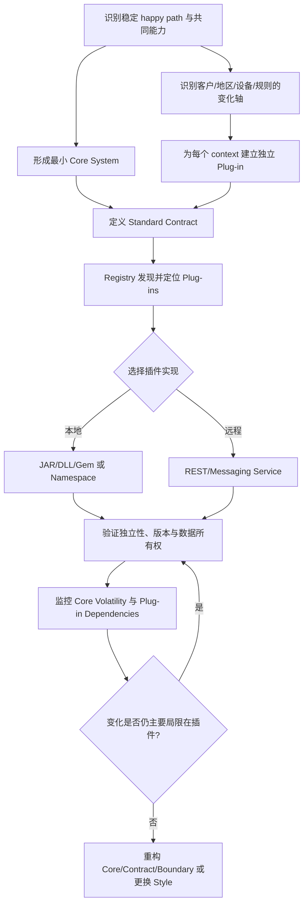
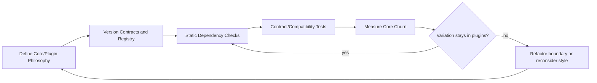

> 对应原章：13. Microkernel Architecture Style.md
> Microkernel architecture 又称 plug-in architecture：把稳定、通用、足以驱动系统的最小能力放进 core system，把客户、地区、设备、规则或功能差异放进独立 plug-ins。它解决的不是“怎样把所有代码做成插件”，而是“怎样让最常变化的定制逻辑不持续扰动稳定主流程”。
> 本笔记严格沿原章顺序展开。原书 Java 代码主要用于说明反射、registry 与 contract，不是包含异常处理、并发、安全和完整类型定义的生产代码；本文的公式、Python 示例和治理流程属于教学化扩展。评分以典型 monolithic microkernel 为基准，remote plug-ins 会改变部分评分，也会引入分布式代价。

## 0. 本章要回答的核心问题

1. Microkernel architecture 为什么数十年前出现后仍广泛使用？
2. 为什么它天然适合 packaged product、on-prem third-party product 和高度定制业务？
3. Core system 与 plug-ins 如何共同构成该风格的同构形态？
4. “Minimal functionality required to run” 与 “happy path” 两种 core 定义怎样统一？
5. 为什么把设备/地区规则从 core 的条件分支移到插件，能够降低 cyclomatic complexity？
6. Going Green 的 `assessDevice()` 怎样从 if/else dispatcher 演进为 registry + contract？
7. Core system 可采用 layered、modular monolith 或 domain services，为什么仍属于 microkernel？
8. Embedded UI、separate UI 和 UI 自身采用 microkernel 三种方案有何区别？
9. Plug-in 为什么要 standalone、independent，并默认彼此无依赖？
10. Runtime plug-in 与 compile-based plug-in 的安装、发布和治理差异是什么？
11. JAR/DLL/Gem、package/namespace、REST/messaging service 三种实现方式各自优化什么？
12. `app.plug-in.<domain>.<context>` 命名约定怎样表达角色和上下文？
13. Remote plug-ins 为什么能提高 scale、throughput 和 runtime change，却仍受 core 限制？
14. 异步评估怎样改善 responsiveness，又会引入哪些一致性和状态问题？
15. 什么是 microkern-ality spectrum，为什么“支持插件”不等于“采用 microkernel”？
16. Core standalone functionality 与 core volatility 怎样帮助判断纯度？
17. Plug-in registry 需要保存哪些信息，内存 map 与 ZooKeeper/Consul 的适用范围有何不同？
18. 原书 registry 代码为何会因同一个 key 连续 `put` 而只保留最后一个值？
19. Standard contract 应包含哪些 behavior/input/output，第三方 custom contract 为什么需要 adapter？
20. `AssessmentPlugin` 与 `AssessmentOutput` 怎样划分 core 和 plug-in 的职责？
21. 为什么 assessment report 的格式属于 plug-in，而 core 只负责打印或展示？
22. Core 为什么通常拥有共享数据库，plug-in 为什么不宜直接访问它？
23. Plug-in 自有 datastore/rules engine 何时合理，external 与 embedded 有何权衡？
24. 三种 cloud deployment 分别怎样放置 core、plug-ins 和 data？
25. 高频、大 payload 的 core/plug-in 调用为什么使混合云方案容易被 latency 拖垮？
26. Volatile Core 为什么从根本上破坏该风格？怎样度量和修复？
27. Plug-in dependencies 为什么会引入 transitive version conflicts 和 classloader 难题？
28. Governance 怎样检查 core churn、contract versions 和 topology？
29. Core team、plug-in teams、enabling、complicated-subsystem 和 platform teams 怎样分工？
30. 为什么该风格可同时是 domain-partitioned 与 technically partitioned？
31. 为什么 simplicity 为 4 星、六项中间特征为 3 星，而 scale/elasticity/fault tolerance 为 1 星？
32. Tax preparation 和 insurance claims 为什么比一般 CRUD 更适合 microkernel？
33. Rules engine 怎样可能长成 Big Ball of Mud，jurisdiction plug-ins 怎样局部化变化？
34. 如何从业务变化模式判断应该采用 microkernel、普通插件机制，还是其他架构风格？

本章论证主线如下：



一句话概括：**Microkernel 的价值来自把“稳定流程”和“变化规则”放在不同演进边界；如果 core 经常改变、插件彼此依赖或 contract 不稳定，插件数量越多，系统反而越难演进。**

---

## 1. 开篇：Microkernel 为什么经久不衰

Microkernel architecture 数十年前已经出现，至今仍广泛使用。它特别适合两类问题。

### 1.1 Product-based applications

产品型应用通常：

- 作为单一 monolithic deployment 打包；
- 供客户下载、安装；
- 常部署在 customer site；
- 不同客户需要不同 feature/configuration；
- 厂商需要在不复制整个产品的情况下扩展。

典型例子：

- IDE；
- build/CI tools；
- issue trackers；
- browsers；
- tax software；
- application servers。

Core 提供产品身份和最小流程，plug-ins 提供语言、规则、集成和客户功能。

### 1.2 Custom business applications

它也适合非产品业务系统，尤其变化沿清晰的 customization axis 发生：

- 美国保险公司：每州理赔规则不同；
- 国际航运：各地区法律、物流规则不同；
- 支付系统：不同 payment methods；
- 设备评估：不同型号 assessment rules；
- 税务系统：不同 forms/worksheets。

若每种差异都写进同一 core 的 `if/else`，complexity 随 context 数量持续增长；插件把差异局部化。

### 1.3 适合的变化形状

Microkernel 最擅长：

```text
稳定的共同流程
    + 大量彼此相对独立的可选/定制行为
    + 清晰、长期可维持的插件 contract
```

不适合：

- core business flow 本身持续剧烈变化；
- 所有插件必须频繁互相通信；
- 变化无法沿单一 extension point 分离；
- 每个请求都需要动态跨多个插件协商；
- 高 scale/fault isolation 是首要目标且仍使用单体 core。

---

## 2. Topology：拓扑

Microkernel 是相对简单的 monolithic architecture，包含两类组件：

1. Core system；
2. Plug-ins。

### 2.1 Application logic 怎样分配

Core system：

- 最小共同功能；
- happy path；
- plugin lifecycle；
- registry/dispatch；
- shared data/access；
- presentation 或 backend services。

Plug-ins：

- specialized processing；
- optional features；
- customer/location/device rules；
- volatile custom logic；
- domain-specific extension。

### 2.2 为什么这种分配有效

若所有变化位于 core：

- 每次定制都重新测试整个系统；
- 条件分支快速增长；
- 不同客户规则互相影响；
- 发布风险扩大。

将变化放入 plug-ins 后：

- 修改范围局部；
- 可独立测试；
- 新 context 通过新增组件实现；
- core 的 release cadence 降低；
- 不需要的功能可以不装载。

### 2.3 Isomorphic shape

可教学化表示：

$$
Microkernel=(StableCore,Registry,Contracts,IndependentPlugins)
$$

这不是原书形式公式。它强调仅有“插件目录”还不够：必须有稳定 core、发现机制、明确 contract 和插件独立性。

### 2.4 Monolithic 是默认，不是所有实现

典型产品把 core 与 local plug-ins 一起部署，评分按此形态。但原章允许：

- Core 自身为 layered/modular monolith；
- Core 拆成 domain services；
- Plug-ins 是 remote services；
- UI 单独部署甚至也是 microkernel。

一旦 remote services 增多，整体成为 distributed architecture，网络和部署 trade-offs 必须重新评估。

---

## 3. Style Specifics：风格细节

该风格的本质仍是 core system 与 plug-ins；实现选择服务于这条边界。

### 3.1 Core System：核心系统

Core 正式定义为：运行系统所需的 minimal functionality。

### 3.2 Eclipse 例子

Eclipse core 只是基础 text editor：

- open file；
- change text；
- save file。

加入 Java、Git、debugger 等 plug-ins 后才成为完整 IDE。

该例说明：pure microkernel 的 core 可以独立运行，却只有很少用户价值；插件承载主要产品能力。

### 3.3 Happy Path 定义

Core 的另一种定义是 happy path：

- 一般、共同 processing flow；
- 几乎不含 custom processing；
- 所有 context 都需要；
- 变化频率相对低。

两种定义可以统一：core 是“让系统执行共同 happy path 所需的最小 standalone functionality”。

### 3.4 把 Cyclomatic Complexity 移出 Core

Going Green 根据 device model 执行不同 assessment rules。直接实现：

```java
public void assessDevice(String deviceID) {
    if (deviceID.equals("iPhone6s")) {
        assessiPhone6s();
    } else if (deviceID.equals("iPad1")) {
        assessiPad1();
    } else if (deviceID.equals("Galaxy5")) {
        assessGalaxy5();
    } else {
        // More device-specific branches...
    }
}
```

每新增型号：

- 增加 branch；
- 修改 core；
- 提高 CC；
- 扩大 regression；
- 让设备规则互相可见。

若有 $n$ 个独立二元型号分支，简单 `if/else if` dispatcher 的 CC 大致随 $n+1$ 线性增长；真正每型号规则还会在分支内部增加更多复杂度。

### 3.5 Registry Dispatch

重构后 core 只做：

1. 根据 device ID 查 registry；
2. 加载 entry class；
3. 创建 instance；
4. 转成 standard contract；
5. 调用 `assess()`。

```java
public void assessDevice(String deviceID) throws Exception {
    String plugin = pluginRegistry.get(deviceID);
    Class<?> pluginClass = Class.forName(plugin);
    Constructor<?> constructor = pluginClass.getConstructor();
    DevicePlugin devicePlugin = (DevicePlugin) constructor.newInstance();
    devicePlugin.assess();
}
```

原章省略异常声明/处理；上面显式加 `throws Exception` 仍只是示意。生产实现要处理：

- unknown device；
- class not found；
- constructor failure；
- wrong contract type；
- classloader/version isolation；
- malicious plug-in；
- timeout/resource control；
- lifecycle and caching。

### 3.6 为什么 Registry Dispatch 有效

新增 device：

```text
新增 plugin implementation
    + 注册 descriptor
    + contract tests
    ≠ 修改 dispatcher branches
```

Core 的 control flow 保持稳定，device complexity 被封装在各插件中。

### 3.7 它没有消除哪些复杂度

- Registry 管理；
- Contract versioning；
- Plugin loading/security；
- 插件自身 CC；
- 错误隔离；
- 第三方兼容性；
- 依赖冲突。

复杂度被重新放到可局部治理的边界，而不是消失。

### 3.8 Core 内部架构变体

Core 的内部 topology 不决定外部是否 microkernel。

#### Layered Core

- 简单、熟悉；
- technical separation；
- 适合 Going Green 示例；
- 仍需防 sinkhole 和 domain smearing。

#### Modular Monolith Core

- 按 domains 分区；
- 模块内拥有自己的 plug-ins；
- 更适合复杂业务；
- 仍是单 deployment。

#### Distributed Domain Services Core

- Core domains 独立部署；
- 每个 service 有 domain-specific plug-ins；
- scale/fault isolation 更强；
- 整体已是 distributed，成本显著增加。

### 3.9 Payment Processing 例子

若 Payment Processing 是 core domain service，可有：

- Credit Card；
- PayPal；
- Store Credit；
- Gift Card；
- Purchase Order；

等 payment plug-ins。

共同 payment lifecycle 留在 core；provider-specific authorization/capture rules 留在 plugins。

### 3.10 UI Variants

#### Embedded UI

- 与 core 同 deployment；
- 产品安装简单；
- UI/core 一起发布；
- 不适合多客户端。

#### Separate UI

- Core 提供 backend services；
- UI 独立技术/部署；
- 增加 network/API/versioning；
- 可支持 Web/mobile clients。

#### Microkernel UI

- 页面、viewers、tools 以 UI plug-ins 扩展；
- 适合 IDE/browser/dashboard；
- 需要 UI extension contract、layout 与权限治理。

### 3.11 Plug-In Components：插件组件

Plug-in 是 standalone、independent component，包含：

- specialized processing；
- additional feature；
- custom code；
- volatile rules。

理想状态：plug-ins 只依赖 core contract，不互相依赖。

### 3.12 为什么 Plug-in 隔离 Volatility

假设州 A 与州 B 保险规则不同：

- 修改 A plugin 不重新验证 B 内部规则；
- 新州通过新增 plugin；
- 删除不再支持州时移除 plugin；
- Core 继续执行共同 claims process。

隔离成立前提：contract 与 core 不因每个变化一起改。

### 3.13 Point-to-point Communication

本地 plugin 通常通过 method/function call 到 entrypoint class：

```text
Core -> Plugin Entry Point -> Plugin Internals
```

这是 point-to-point，不是所有 plugins 广播。Core 需要知道如何找到目标，但不应知道内部 class graph。

### 3.14 Runtime 与 Compile-based Plugins

#### Runtime plug-in

- 运行时 add/remove；
- 不 redeploy core/其他 plugins；
- 支持 hot extension；
- 需要 lifecycle、classloader、security、dependency resolution。

原章框架例子：

- OSGi；
- Penrose；
- Jigsaw；
- Prism。

这些技术的当前使用度和语义各异，选择时应核对版本与维护状态，而不是仅因原书列出就采用。

#### Compile-based plug-in

- 构建时加入；
- 管理简单；
- 类型检查直接；
- add/remove/change 要 redeploy 整个 monolith；
- Deployability 低于真正 runtime plugin。

### 3.15 Shared Library Plugins

插件可实现为：

- JAR；
- DLL；
- Ruby Gem；
- 其他 shared library。

Library name 可与 device/context 对齐，便于安装和版本管理。

风险：

- classpath/load order；
- binary compatibility；
- dependency conflicts；
- unsigned/untrusted code；
- unload/resource leak。

### 3.16 Package/Namespace Plugins

更简单方案：同一 code base/IDE project 中，用 package/namespace 分隔。

推荐语义：

```text
app.plug-in.<domain>.<context>
```

例如：

```text
app.plug-in.assessment.iphone6s
```

节点含义：

1. `app`：应用；
2. `plug-in`：明确 architecture role；
3. `assessment`：共同 domain；
4. `iphone6s`：具体 context。

优点是简单；缺点是边界只靠 namespace，必须用 dependency tests 防止插件互调和访问 core internals。

### 3.17 Remote Plug-in Services

Plug-in 也可为 standalone service/microservice，通过：

- REST；
- messaging；
- async request/reply；
- containerized service；

调用。

### 3.18 Remote Benefits

- component decoupling 更强；
- 每 plugin 独立 scale；
- throughput 可按 context 调整；
- runtime change 不需 OSGi/Jigsaw/Prism；
- 可异步执行；
- failure/resource isolation 更强。

### 3.19 为什么仍被 Core 限制

原章指出该 topology 仍只有一个 architecture quantum，因为每个请求先经过 monolithic core 才到 plugin。更严谨地说，远程 plugins 已有独立部署/failure units，但 core 仍是所有 workflow 的共同入口和共享 operational bottleneck；按本书评分口径，整体特征范围仍由 singular core 主导。

### 3.20 Asynchronous Assessment

同步：

```text
User -> Core -> Assessment Plugin -> Core -> User
```

异步：

```text
User -> Core: start assessment
Core -> Plugin: async request
Core -> User: accepted/job ID
Plugin -> Core: completion event
Core -> User: result/notification
```

收益：用户不等待长评估，core threads 不被阻塞。

代价：

- job state；
- idempotency；
- duplicate completion；
- callback authentication；
- timeout/cancellation；
- eventual consistency；
- progress and observability。

### 3.21 Remote Trade-offs

- distributed deployment complexity；
- network latency/failure；
- higher cost；
- service discovery；
- contract versioning；
- on-prem product 安装困难；
- REST plugin unresponsive 时请求无法完成；
- data movement/security。

选择 local/remote 应来自具体 architecture characteristics，而非“远程看起来更现代”。

### 3.22 The Spectrum of “Microkern-ality”：“微内核度”光谱

The Spectrum of "Microkern-ality" 不是二元分类：不是所有支持 plugins 的系统都是 microkernel；所有 microkernels 都支持 plugins。

#### Pure Microkernel

左侧：Eclipse、linters。

- Core 功能很少；
- Linter core 解析 source 得 AST；
- 没有 rules plug-ins 时价值有限；
- 主要功能来自 plugins。

#### Rich Core with Plugins

右侧：web browser。

- 无 plugins 仍完全可用；
- Plugins 只是增加 viewers/features；
- 更像“支持插件的产品”，microkern-ality 较低。

### 3.23 判断 Microkern-ality

可问：

1. 移除所有 plugins 后，系统还完成多少用户价值？
2. 新 variation 是否只需新增 plugin？
3. Core 是否频繁因 variation 修改？
4. Plugin contracts 是否稳定？
5. Core 是否只提供 common mechanism，而非 context-specific policy？

Core standalone functionality 越少、variation 越集中到 plugins，越接近 pure microkernel。

### 3.24 Core Volatility 与选择

若 core 本身高 volatility：

- plugin contracts 随之变化；
- 所有 plugins 频繁升级；
- isolation 收益消失；
- 可能只适合普通 modular architecture，而非 microkernel。

因此 microkern-ality 不是越高越好，而是匹配真实变化形状。

### 3.25 Registry：插件注册表

Core 必须知道：

- 哪些 plugins available；
- 如何定位；
- plugin name/context；
- contract/version；
- communication type；
- endpoint/class/queue；
- health/capabilities；
- lifecycle status。

### 3.26 Registry 实现范围

最简单：core-owned in-memory map。

最复杂：external registry/discovery，例如：

- Apache ZooKeeper；
- Consul。

选择依据：

| 场景 | In-memory Map | External Registry |
| --- | --- | --- |
| Local compile plug-ins | 合适 | 过重 |
| Runtime local loading | 可用，需持久化/扫描 | 视规模 |
| Remote dynamic services | 静态配置易过时 | 更合适 |
| On-prem single product | 简单 | 增加安装运维 |
| Multi-instance core | 需同步 registry | 中央发现更容易 |

### 3.27 原书 Registry 示例的陷阱

```java
Map<String, String> registry = new HashMap<>();

// These are three alternative representations, not three simultaneous puts.
registry.put("iPhone6s", "Iphone6sPlugin");
registry.put("iPhone6s", "iphone6s.queue");
registry.put("iPhone6s", "https://atlas:443/assess/iphone6s");
```

在普通 Java `Map` 中，同 key 连续 `put` 会覆盖前值；最终只剩 REST URL。原章意图是展示 point-to-point、messaging 和 REST 三种 registry entry 示例，不是让三者同时执行。

### 3.28 Typed Descriptor 更清晰

```text
PluginDescriptor:
    id
    domain
    context
    contractVersion
    transportType
    className | queueName | endpoint
    healthMetadata
```

避免用一个 String 猜测它是 class、queue 还是 URL。

### 3.29 可运行的 Registry 示例

```python
from dataclasses import dataclass
from enum import Enum

class Transport(Enum):
    LOCAL = "local"
    MESSAGE = "message"
    REST = "rest"

@dataclass(frozen=True)
class PluginDescriptor:
    plugin_id: str
    contract_version: int
    transport: Transport
    location: str

def register(registry, descriptor):
    if descriptor.plugin_id in registry:
        raise ValueError(f"duplicate plugin: {descriptor.plugin_id}")
    registry[descriptor.plugin_id] = descriptor

registry = {}
register(
    registry,
    PluginDescriptor("iphone6s", 1, Transport.LOCAL, "Iphone6sPlugin"),
)

plugin = registry["iphone6s"]
print(f"id={plugin.plugin_id}")
print(f"transport={plugin.transport.value}")
print(f"location={plugin.location}")
```

输出：

```text
id=iphone6s
transport=local
location=Iphone6sPlugin
```

代码显式拒绝 duplicate ID。若同一 context 需要多 transport，应把 `(plugin_id, transport)` 作为 key，或在 descriptor 中存多个 endpoint，而不是静默覆盖。

### 3.30 Contracts：插件契约

同一 domain 的 plugins 通常共享 standard contract，包含：

- behavior；
- input data；
- output data；
- lifecycle；
- errors；
- version/capabilities。

### 3.31 Custom Contract 与 Adapter

Third-party plugin 可能使用无法控制的 custom contract。若 core 为每个 plugin 编写特殊逻辑，会产生：

```text
Core knows Plugin A format
Core knows Plugin B format
Core knows Plugin C format
```

正确做法是在边界放 adapter：

```text
Third-party Contract -> Adapter -> Standard Core Contract
```

变化局限在 adapter/plugin，不污染 core dispatcher。

### 3.32 Contract Formats

- XML；
- JSON；
- in-process objects；
- binary protocols；
- message schemas。

本地 object contract 类型安全且快，但 binary/classloader coupling 高；remote schema 更显式，却需 serialization、versioning 和 network governance。

### 3.33 AssessmentPlugin 示例

```java
public interface AssessmentPlugin {
    AssessmentOutput assess();
    String register();
    String deregister();
}

public class AssessmentOutput {
    public String assessmentReport;
    public Boolean resell;
    public Double value;
    public Double resellPrice;
}
```

输出包含：

- formatted assessment report；
- resell flag；
- calculated value；
- recommended resell price。

### 3.34 Contract 示例的工程边界

原代码用于说明语义，生产设计还需考虑：

- input 缺失：`assess()` 没参数，可能从 instance state 获取 device；
- nullable wrappers：`Boolean/Double` 可为 null；
- currency 不宜用 binary floating `Double`，应使用 decimal/money type；
- public mutable fields 缺少 invariants；
- `register()/deregister()` 返回 String 的语义不明确；
- error/result type；
- contract version；
- cancellation/timeout。

### 3.35 Core 与 Plugin 职责边界

`assessmentReport` 已由 plugin 格式化：

- Plugin 知道 assessment details；
- Core 不解析内部内容；
- Core 只 print/display/store as opaque report。

若 core 开始解析 report 字符串并按设备做判断，context-specific knowledge 又泄漏回 core。

---

## 4. Data Topologies：数据拓扑

典型 microkernel 是 monolithic application + single relational database。

### 4.1 Core 拥有 Shared Database

Plug-ins 通常不直接连接 centrally shared DB。Core：

- 读取共享数据；
- 执行 shared transaction；
- 通过 contract 把所需数据传入 plugin；
- 接收结果并持久化。

原因是 decoupling：database change 只影响 core mapping，而不要求所有 plugins 更新。

### 4.2 Plug-in 直接访问 Shared DB 的风险

- schema 泄漏；
- plugin 获得过大权限；
- core invariants 被绕过；
- database migrations 影响全部 plugins；
- third-party code 访问敏感数据；
- 难独立测试和版本化。

### 4.3 Plug-in-owned Data Store

Plug-in 可以拥有只对自身可见的数据：

- rules database；
- model/configuration；
- local cache；
- embedded/in-memory DB；
- external store。

### 4.4 External 与 Embedded

| 维度 | External store | Embedded/in-memory store |
| --- | --- | --- |
| 独立更新 | 容易 | 常随 plugin artifact |
| 运维 | 更多 | 简单 |
| 持久性/规模 | 较强 | 受限 |
| On-prem 安装 | 更复杂 | 更方便 |
| Network latency | 有 | 无/低 |
| Backup | 独立治理 | 随产品/文件治理 |

### 4.5 Data Contract 原则

- Core 只传 minimum necessary data；
- Plugin 不查询其他 plugin store；
- Output 明确 ownership；
- Plugin schema 可独立 version；
- Core/shared DB 与 plugin DB 的 consistency 明确；
- Remote plugin 的 data privacy/security 单独建模。

---

## 5. Cloud Considerations：云端考虑

典型 monolithic microkernel 有三种 coarse-grained cloud options。

### 5.1 Entire Application in Cloud

- Core + local plugins 一起部署；
- 可用 VM/container/cloud facilities；
- 运维较简单；
- 仍整体 scale/deploy；
- managed DB/storage 可降低成本。

### 5.2 Data in Cloud, Microkernel On-prem

- Product/core/plugins 在 customer site；
- Data/storage 在 cloud；
- 需可靠网络；
- latency、privacy、offline、egress 成为风险；
- On-prem product 的核心请求可能依赖远程数据。

### 5.3 Core On-prem, Plug-ins in Cloud

- 模块边界更强；
- Plugins 可独立 scale/change；
- Core 保留客户现场控制；
- 每次 plugin call 跨 WAN/cloud boundary。

### 5.4 为什么 Responsiveness 容易恶化

Microkernel 的 key workflows 常频繁调用 plugins，并传递较多信息。

简化延迟：

$$
T_{workflow}=T_{core}+\sum_{i=1}^{n}(T_{network,i}+T_{plugin,i})
$$

若 calls 串行，跨云 RTT 会累积；payload 又增加 bandwidth/serialization。必须测 p95/p99，而不是只看平均值。

### 5.5 缓解方式

- coarse-grained plugin API；
- batch request；
- async jobs；
- cache/reference data locality；
- minimize payload；
- timeout/circuit breaker；
- offline fallback；
- region placement；
- observability。

这些措施有复杂度，不能假定“插件上云”自动提高 modularity 而没有运行代价。

---

## 6. Common Risks：常见风险

主要风险来自误用 style，而不是 core+plugin 形状本身。

### 6.1 Volatile Core

Core 在初始开发后应尽可能 stable；该风格通过插件隔离变化。

如果 core 不断改变：

- 所有 plugin contracts 跟着变；
- regression scope 扩大；
- runtime plugin compatibility 破坏；
- Core 成为变化瓶颈；
- “插件隔离”只剩目录形式。

### 6.2 为什么 Core 会 Volatile

- 错把变化策略放进 core；
- 尚未理解 domain variability；
- extension points 设计过窄；
- common/happy path 判断错误；
- core 承担太多 standalone product functionality；
- plugins 反向要求 core 特殊处理。

### 6.3 Volatility 度量

可用 version control 建 fitness functions：

$$
CoreChangeRatio=\frac{CoreChangedFiles}{AllChangedFiles}
$$

还可观察：

- core commits/month；
- contracts changed/release；
- plugins forced to upgrade；
- co-change between core and plugins；
- core regression duration；
- extension-specific branches in core。

阈值应按项目基线和业务变化解释。Core 变化并非永远错误，关键是是否由本可局部化的 customization 驱动。

### 6.4 修复 Volatile Core

1. 分析 core changes 的变化原因；
2. 找出重复 context-specific branches；
3. 设计更稳定 extension contract；
4. 把规则移入 plugins；
5. 使用 adapter 兼容旧 plugins；
6. 版本化并渐进迁移；
7. 若 common flow 本身持续变化，重新评估 style。

### 6.5 Plug-In Dependencies

Microkernel 最适合 plugins 只与 core 通信。原章称这种形态为 dependency-free plug-ins：

- 不彼此调用；
- 不共享必须由 core 解析的额外 dependencies；
- 可独立安装、删除和测试。

### 6.6 Transitive Conflict

假设：

```text
Plugin A -> Library X v1
Plugin B -> Library X v2
```

Core/runtime 必须解决：

- classloader isolation；
- binary compatibility；
- load order；
- shared singleton/state；
- communication between versions；
- security updates。

Eclipse 等复杂系统允许 plugin dependencies，但需要成熟 dependency resolver、version ranges 和 lifecycle。

### 6.7 为什么应避免 Plug-in 间依赖

- install/remove 不再独立；
- transitive graph 增长；
- cycle；
- one plugin upgrade breaks others；
- core 被迫知道 dependency semantics；
- testing matrix 爆炸。

若两个 plugins 总是一起变化和安装，可能属于同一 plugin/domain boundary。

### 6.8 依赖治理策略

- only depend on core API；
- shade/vendor private libraries；
- classloader/process isolation；
- semantic versioning；
- declared dependency manifest；
- cycle/conflict checks；
- compatibility matrix；
- signed artifacts and allowlist。

---

## 7. Governance：治理

治理目标是检查团队是否遵守 microkernel philosophy，而不仅是目录形状。

### 7.1 Core Volatility Fitness Functions

不是特定 code rule，而是版本控制 churn 检查：

- core change rate；
- plugin/core co-change；
- core branches by context；
- contract churn；
- forced plugin upgrades。

趋势比单次 commit 更有意义。

### 7.2 Contract Tests

尤其当 plugins 渐进演进、支持不同 contract versions 时，应验证：

- 每个 version input/output；
- backward/forward compatibility；
- adapter behavior；
- missing optional fields；
- errors/timeouts；
- old plugin against new core；
- new plugin against supported core。

### 7.3 Structural Verifications

- Plugin only accesses public core API；
- Plugin A cannot access Plugin B；
- exactly one entrypoint；
- registry IDs unique；
- package follows `app.plug-in.domain.context`；
- no core imports plugin implementations；
- no direct shared DB access；
- dependency graph acyclic。

### 7.4 Registry Governance

- unique key；
- typed transport；
- contract version exists；
- endpoint/class resolvable；
- health and ownership metadata；
- deregistration cleans resources；
- stale registry entries detected；
- signed/approved plugins only。

### 7.5 Governance 不是冻结 Core

Core 可修 bug、改共同流程和安全能力。治理要识别“错误变化位置”，不是禁止任何 change。

```text
If change applies to all contexts and defines common lifecycle:
    candidate for core
Else if change varies by client/location/device/rule:
    candidate for plug-in
```

### 7.6 可运行的 Volatility 评估示例

```python
def core_change_ratio(core_changed, plugin_changed):
    total = core_changed + plugin_changed
    if total == 0:
        return 0.0
    return core_changed / total

releases = [
    ("r1", 2, 18),
    ("r2", 8, 12),
    ("r3", 15, 5),
]

for release, core, plugins in releases:
    ratio = core_change_ratio(core, plugins)
    signal = "investigate" if ratio >= 0.50 else "expected plugin locality"
    print(f"{release}: core_ratio={ratio:.0%}, {signal}")
```

输出：

```text
r1: core_ratio=10%, expected plugin locality
r2: core_ratio=40%, expected plugin locality
r3: core_ratio=75%, investigate
```

50% 只是演示阈值，不是通用标准。还要看 changed files 的大小、原因和 contract impact。

### 7.7 治理闭环



---

## 8. Team Topology Considerations：团队拓扑考虑

最自然 team split 是 core 与 plug-ins，但具体 ownership 取决于产品和插件来源。

### 8.1 Stream-aligned teams

- Core 是共同 product stream 的 sweet spot；
- Team 构建稳定 common behavior；
- 也可能拥有部分 first-party plugins；
- 应对 core outcome 负责，而非只做 framework。

风险：core team 变成审批瓶颈。需要稳定 API、self-service SDK 和明确 lifecycle。

### 8.2 Enabling teams

Microkernel 非常适合 experiments：

- A/B testing plugin；
- 新算法；
- 临时 integration；
- 新规则验证；
- 不修改 core 即插拔。

Enabling team 可帮助 stream team 试验后转移能力。实验 plugins 要有 owner 和 expiry，避免永久遗留。

### 8.3 Complicated-subsystem teams

Specialized behavior 可隔离进 plugin，例如：

- analytics；
- tax calculation；
- jurisdiction claims rules；
- device assessment ML；
- language tooling。

Stream team 调用 contract，不承担内部 cognitive load。

### 8.4 Platform teams

关注 monolithic operation 与 plugin platform：

- build/package/sign；
- registry/discovery；
- contract SDK；
- lifecycle/loading；
- observability；
- sandbox/security；
- compatibility testing；
- on-prem installer/update。

平台应降低 plug-in author friction，而不是强迫每个插件学习复杂内部 core。

### 8.5 Third-party Plug-in Teams

原章团队分类之外，product-based microkernel 常有外部开发者。必须提供：

- SDK/docs；
- stable API；
- certification；
- signing；
- permission model；
- version/deprecation policy；
- marketplace/distribution；
- support boundaries。

这是该风格产品化成功的重要延伸。

---

## 9. Architecture Characteristics Ratings：架构特征评分

评分以典型 monolithic microkernel 为基准。1 星弱，5 星为最强能力之一。

### 9.1 完整评分表

| 类别 | 特征 | 评分/值 |
| --- | --- | --- |
| Cost | Overall cost | `$`，低成本 |
| Structural | Partitioning type | Domain and Technical |
| Structural | Number of quanta | 1 |
| Structural | Simplicity | 4 星 |
| Structural | Modularity | 3 星 |
| Engineering | Maintainability | 3 星 |
| Engineering | Testability | 3 星 |
| Engineering | Deployability | 3 星 |
| Engineering | Evolvability | 3 星 |
| Operational | Responsiveness | 3 星 |
| Operational | Scalability | 1 星 |
| Operational | Elasticity | 1 星 |
| Operational | Fault tolerance | 1 星 |

### 9.2 Overall Cost：`$`

典型 monolith：

- 单 deployment；
- 本地 calls；
- 通常单 DB；
- 运维简单；
- plugin extension 避免复制产品。

Runtime framework、third-party ecosystem 或 remote plugins 会提高成本。

### 9.3 Domain and Technical Partitioning

Microkernel 是唯一可同时表现两种 partitioning 的 style：

- Technical：core vs plug-ins、extension mechanism；
- Domain：每 location/client/device/jurisdiction plugin 与业务变化轴同构。

强 domain-to-architecture isomorphism 使 customization domain 特别适合该风格。

### 9.4 Number of Quanta：1

典型所有请求先经 core 到 plugin，core 是共同入口、deployment 和 failure scope，因此评分为 1 quantum。

Remote plugins 有独立服务边界，但按本书风格评分，singular core 仍决定整体 quantum。若 core 也拆成独立 domain services，架构已成为 hybrid/distributed，应重新评估。

### 9.5 Simplicity：4 星

Core+plugins 结构直观、构件少、本地调用简单。不是 5 星，因为：

- registry；
- dynamic loading；
- lifecycle；
- contracts/versioning；
- third-party compatibility；
- dependency resolution。

### 9.6 Modularity：3 星

Self-contained plug-ins 提供：

- feature isolation；
- add/remove/replace；
- volatile logic locality；
- independent tests。

受限于 core、single deployment、shared DB 和 contract coupling，因此不是 5 星。

### 9.7 Maintainability：3 星

Context-specific change 局限插件，core 更稳定。风险来自：

- volatile core；
- plugin dependency conflicts；
- registry/contract proliferation；
- mediator-like core complexity。

### 9.8 Testability：3 星

- Plugin 可按 contract isolated test；
- Core 可用 fake plugins；
- 每 context rules 单独验证；
- regression scope 缩小。

仍需：

- core/plugin integration；
- version matrix；
- runtime loading；
- third-party tests；
- shared DB tests。

### 9.9 Deployability：3 星

Runtime plugins 可独立 add/remove，显著降低 deployment risk；compile-based plugins 仍需 redeploy monolith。

评分是二者综合。Remote services 可进一步提高独立部署，但成本增大。

### 9.10 Reliability：3 星的原文表述边界

原文正文称 testability、deployability 和 reliability 为 3 星，但 Figure 13-9 的统一评分表使用 `Maintainability`、`Evolvability` 等行，并未单列 Reliability。本文按图表记录十项星级；原文想表达的是插件隔离可以缩小变化和部署风险，不能据此虚构图中不存在的 Reliability 行。

### 9.11 Evolvability：3 星

新 tax form/device/jurisdiction 通过新增 plugin；过时 feature 可移除；稳定 core 不必随每种 variation 修改。

Contract 若不稳定，evolvability 会迅速下降。

### 9.12 Responsiveness：3 星

原因：

- 应用通常比大型 layered monolith 小；
- 少受 Architecture Sinkhole 影响；
- 可 unplug unnecessary functionality；
- local plugin calls 快。

WildFly/JBoss 例子：移除 clustering、caching、messaging 等不需要功能，可提高 application server performance。

Remote/cloud plugins 则可能因 latency/payload 降低 responsiveness。

### 9.13 Scalability/Elasticity/Fault Tolerance：1 星

典型 monolithic deployment：

- 整体 scale；
- core bottleneck；
- plugin 不独立 elasticity；
- 任一 OOM 可击垮进程；
- shared DB/failure scope；
- quantum=1。

Remote services 能改善，但会把架构变成 distributed hybrid，并支付网络、部署和可观测性成本。

### 9.14 评分的核心 trade-off

```text
Local Monolithic Plugins:
    + simplicity, cost, responsiveness
    - scale, elasticity, fault isolation

Remote Plugins:
    + independent scale/deploy/failure isolation
    - simplicity, cost, latency, distributed reliability
```

---

## 10. Examples and Use Cases：示例与用例

### 10.1 Software Development Tools

原章列出：

- Eclipse IDE；
- PMD；
- Jira；
- Jenkins。

共同点：

- core 提供基本编辑、分析、项目/构建流程；
- plugins 支持 languages、rules、integrations、workflows；
- 用户按需要安装功能。

### 10.2 Web Browsers

Chrome、Firefox 通过 viewers/extensions 增加 core browser 未提供的能力。

浏览器无插件仍完整可用，因此位于 microkern-ality 光谱右侧；“支持插件”不能单独证明 pure microkernel。

### 10.3 Tax Preparation Software

美国税务机构 Internal Revenue Service（IRS）的 1040 是两页 summary form，每行是一个数字，例如 gross income。得到这些数字需要其他 forms/worksheets。

映射：

```text
Core System:
    1040 summary + common tax filing workflow

Plug-ins:
    additional forms
    worksheets
    special tax rules
```

Tax law 改变：

- 新 form -> 新 plugin；
- 废弃 form -> 移除 plugin；
- 修改某 worksheet -> 只测对应 plugin + contract；
- core common filing flow 保持稳定。

### 10.4 为什么税务例子高度匹配

- Stable summary/happy path；
- 大量可选 forms；
- 规则按场景变化；
- 每年增删；
- contract 可统一为输入税务数据、输出 line values/report；
- 用户只安装适用 plugins。

若税法改变 1040 核心结构，则 core 仍需变化；microkernel 不能消除真正 common domain change。

### 10.5 Insurance Claims Processing

不同 jurisdiction 允许不同 claim rules。例如 windshield 被石头损坏：

- 某些州允许免费 replacement；
- 某些州不允许；
- 标准 claim process 相似；
- context rules 近乎无限组合。

### 10.6 Rules Engine 的 Big Ball of Mud 风险

大型 rules engine 可能：

- 所有 jurisdiction rules 混在一处；
- 一条规则影响其他州；
- 简单变更需要 analyst/developer/tester 大军；
- dependency 和 priority 不透明；
- regression scope 为全系统。

声明式不自动等于模块化；规则同样需要 boundary。

### 10.7 Jurisdiction Plug-ins

每 jurisdiction 使用 standalone plugin：

- source code implementation；或
- 独立 rules-engine instance，由 plugin adapter 访问。

Core 是稳定的 filing/processing claim standard process。

收益：

- 州规则独立 add/remove/change；
- 其他州不受影响；
- regression 局部；
- owner 清楚；
- 新 jurisdiction 通过新增 plugin。

### 10.8 Claims Plugin Contract 示例

```text
Input:
    claim facts
    policy facts
    jurisdiction

Behavior:
    validate eligibility
    calculate coverage
    produce required actions

Output:
    decision
    amount
    reasons
    audit report
```

Contract 要避免把某州特有字段强加给所有 plugins，可用 extension metadata 或 adapter。

### 10.9 Customization 为什么普遍

软件常有：

- user-installed features；
- client variants；
- local laws；
- device/provider integrations；
- optional analytics；
- language/build rules。

因此 core+plug-ins 这一 structure 与常见 problem shape 同构，microkernel “到处可见”。

---

## 11. 容易混淆的概念与常见误区

### 11.1 “支持 Plug-ins 就是 Microkernel”

错误之处：browser 有插件但 core standalone functionality 很强。

正确理解：看 core 是否最小、主要 variation 是否由 plugins 承担。

### 11.2 “Microkernel 指操作系统内核”

错误之处：本章是 application architecture style，借用 core/extension 思想。

正确理解：不要把 OS IPC/process isolation 结论直接套用应用插件。

### 11.3 “Core 越小越好”

错误之处：过小 core 会把共同流程复制到 plugins。

正确理解：core 应最小且足以承载真正共同 happy path。

### 11.4 “所有 If/Else 都应变 Plugin”

错误之处：稳定、局部、少量条件未必值得 extension infrastructure。

正确理解：当 variation 数量、独立变化和生命周期足够显著时使用。

### 11.5 “Registry 消除了 Branching”

错误之处：选择逻辑移到 key/descriptor/contract，插件内部仍有规则。

正确理解：它稳定 dispatcher，并局部化 complexity。

### 11.6 “原书 Map 中三个 iPhone6s Entry 会同时存在”

错误之处：相同 key 连续 put 只保留最后值。

正确理解：它们是三种替代 transport 示例，应使用 typed descriptor。

### 11.7 “Reflection 示例可直接用于生产”

错误之处：缺少异常、安全、classloader、lifecycle 和资源治理。

正确理解：使用成熟 plugin framework 或补足完整边界。

### 11.8 “Runtime Plug-in 一定更简单”

错误之处：hot add/remove 需要复杂 dependency/lifecycle management。

正确理解：compile-based 更简单，runtime 提高 deployability。

### 11.9 “Package 分隔天然独立”

错误之处：同源码中可任意 import。

正确理解：用 architecture tests 限制 plugin->plugin 和 core internals。

### 11.10 “Remote Plug-in 自动产生多个独立 Quanta”

错误之处：core 仍是所有请求共同入口和 bottleneck，本书评分仍为 1。

正确理解：remote 提高局部独立性，但要重新分析整体特征范围。

### 11.11 “Async Plug-in 让用户立即得到结果”

错误之处：用户只得到 accepted/job ID，最终结果以后到达。

正确理解：设计状态、通知、超时、取消与重复完成。

### 11.12 “Microkern-ality 是越高越好的分数”

错误之处：它描述 core/plugin 功能分布，不是质量总分。

正确理解：匹配 domain volatility 和用户价值。

### 11.13 “Core 支持更多功能一定更好”

错误之处：context-specific functionality 会提高 volatility 和 contract churn。

正确理解：共同机制放 core，变化策略放 plugins。

### 11.14 “Shared Contract 永远不变”

错误之处：业务和安全会要求演进。

正确理解：版本化、adapter、compatibility tests 和 deprecation。

### 11.15 “Plugin 可直接访问 Core Database”

错误之处：schema coupling、权限和 invariants 会泄漏。

正确理解：Core 传最小数据，plugin 可拥有自己的 context store。

### 11.16 “每 Plugin 一库一定更好”

错误之处：运营、事务和一致性成本可能超过隔离收益。

正确理解：只为插件私有、独立演进数据建立 store。

### 11.17 “Core on-prem + Plugins cloud 是最佳模块化”

错误之处：高频、大 payload 跨 WAN 会严重影响 responsiveness。

正确理解：用真实 latency、payload 和 failure 测量。

### 11.18 “Core Change 永远是坏事”

错误之处：共同流程、安全和 bug 修复属于合理变化。

正确理解：警惕本应插件化的 context change 反复修改 core。

### 11.19 “Plug-in Dependencies 只是构建问题”

错误之处：还涉及 runtime classloader、版本、安装顺序和安全。

正确理解：默认 dependency-free，复杂生态需专门 resolver。

### 11.20 “Plugin 隔离意味着 Fault Tolerance 高”

错误之处：local plugins 与 core 同 process，一个 OOM 可击垮全体。

正确理解：逻辑 isolation 不等于 process failure isolation。

### 11.21 “评分中的 Reliability 也是图上一行”

错误之处：正文提到 reliability 3 星，但图 13-9 不单列该行。

正确理解：按评分图记录，另解释正文的变化风险含义。

### 11.22 “Tax/Claims 用 Plugin 后不再需要全局测试”

错误之处：core contract、跨插件共同规则和 integration 仍需测试。

正确理解：缩小而不是消灭 regression scope。

### 11.23 “Rules Engine 天然模块化”

错误之处：无 jurisdiction boundary 的规则会相互影响并长成泥球。

正确理解：声明方式和 architecture boundary 是不同问题。

---

## 12. 从本章提炼的 Microkernel 设计法

### 第 1 步：识别 Stable Core

提取所有 contexts 共享、长期稳定、足以运行 happy path 的最小功能。

**输出**：core responsibility 与禁止放入项。

### 第 2 步：识别 Variation Axis

按 client/location/device/provider/jurisdiction/rule 找独立变化单元。

**输出**：plug-in context map。

### 第 3 步：定义 Standard Contract

明确 behavior、input/output、errors、version、lifecycle，第三方差异用 adapter。

**输出**：versioned plugin API/SDK。

### 第 4 步：选择 Plugin Packaging

比较 package、JAR/DLL/Gem、runtime framework 与 remote service。

**输出**：compile/runtime/deployment model。

### 第 5 步：设计 Registry

使用 typed descriptor，保证 unique ID、transport、location、version 和 health 可验证。

**输出**：discovery/lifecycle mechanism。

### 第 6 步：定义 Data Ownership

Core 控制 shared DB，plugin 只接收必要数据；私有 rules/state 可用独立 store。

**输出**：data contract 与 persistence boundaries。

### 第 7 步：限制 Dependencies

默认 plugin 只依赖 core API，不依赖其他 plugins；建立 conflict/cycle/security checks。

**输出**：dependency manifest 与 isolation policy。

### 第 8 步：治理 Core Volatility

用 VCS churn、co-change、contract changes 和 forced upgrades 判断变化是否放错位置。

**输出**：fitness functions 与 refactoring triggers。

### 第 9 步：验证 Operational Trade-offs

测量 local/remote latency、payload、scale、fault scope、startup 和 on-prem/cloud constraints。

**输出**：部署与通信 ADR。

### 第 10 步：持续评估 Microkern-ality

检查无 plugins 的 core 价值、插件变化独立性和 contract 稳定度；不匹配时重构或换 style。

**输出**：当前 core/plugin boundary 与演进计划。

---

## 13. 本章知识结构

```mermaid
flowchart TD
    ROOT[Microkernel Architecture] --> CORE[Core System]
    ROOT --> PLUG[Plug-ins]
    ROOT --> REG[Registry]
    ROOT --> CONTRACT[Contracts]
    ROOT --> DATA[Data Topology]
    ROOT --> CLOUD[Cloud]
    ROOT --> RISK[Risks]
    ROOT --> GOV[Governance]
    ROOT --> SCORE[Ratings]

    CORE --> MIN[Minimal Functionality]
    CORE --> HAPPY[Happy Path]
    CORE --> VAR[Layered Modular or Domain Services]

    PLUG --> LOCAL[JAR DLL Gem Namespace]
    PLUG --> REMOTE[REST Messaging Services]
    PLUG --> RUNTIME[Runtime or Compile-based]
    PLUG --> SPECTRUM[Microkern-ality Spectrum]

    REG --> DESC[Typed Descriptor]
    CONTRACT --> ADAPTER[Third-party Adapter]
    DATA --> SHARED[Core-owned Shared DB]
    DATA --> PRIVATE[Plugin-owned Store]

    RISK --> VOL[Volatile Core]
    RISK --> DEP[Plugin Dependencies]
    GOV --> CHURN[Core Churn]
    GOV --> TEST[Contract Tests]

    SCORE --> MID[3-star Modularity and Engineering]
    SCORE --> WEAK[1-star Scale Elasticity Fault Tolerance]
```



整章可压缩为四层：

1. **变化层**：Stable common flow 留在 core，volatile customization 留在 plugins；
2. **契约层**：Registry 发现插件，standard contract 隔离实现和第三方差异；
3. **物理层**：Local/runtime/remote packaging 改变部署、延迟、扩展和容错；
4. **治理层**：Core churn、contract compatibility 与 dependency graph 决定边界能否长期维持。

---

## 14. 核心结论

1. **Microkernel 是 Core System + Plug-ins 的架构风格，特别适合产品和高度定制领域。**
2. **Core 是执行共同 happy path 所需的最小 standalone functionality，而非所有“重要代码”。**
3. **将 context-specific branches 移入 plugins，可稳定 dispatcher、局部化 CC 和 regression scope。**
4. **复杂度不会消失，而会转移到 registry、contracts、loading、versioning 和 dependency management。**
5. **Core 内部可采用 layered、modular monolith 或 domain services；外层 core+plugin 关系仍定义 microkernel。**
6. **Presentation 可嵌入、独立部署，甚至自身采用 microkernel。**
7. **Plug-ins 应 standalone、self-contained，默认只依赖 core contract，不互相依赖。**
8. **Runtime plug-ins 提高动态部署能力，却比 compile-based plug-ins 更难管理 lifecycle 和 dependencies。**
9. **JAR/DLL/Gem 强化 artifact 边界，package/namespace 最简单，remote services 提高独立 scale 并增加分布式成本。**
10. **`app.plug-in.<domain>.<context>` 让插件角色、领域和具体变化上下文可见。**
11. **Remote plug-ins 可异步提高用户 responsiveness，但必须管理 job state、idempotency、callback 和 eventual consistency。**
12. **Microkern-ality 由 core standalone functionality 决定；支持 plugins 不等于 pure microkernel。**
13. **Registry 必须使用 typed descriptor；原书同 key 三次 `put` 只会保留最后值，应理解为替代示例。**
14. **Standard contract 应覆盖 behavior、data 和 lifecycle；第三方 custom contract 通过 adapter 转换。**
15. **Core 不应解析 plugin-specific report 细节，否则 customization knowledge 会泄漏回 core。**
16. **典型 shared DB 由 core 拥有，plugins 不应直接访问；plugin-private rules/state 可独立存储。**
17. **Core on-prem、plugins cloud 的方案可能因高频大 payload 调用严重损害 responsiveness。**
18. **Volatile Core 是根本误用信号；应分析 churn 并把 context-specific changes 重新插件化。**
19. **Plugin dependencies 会产生 transitive version/classloader conflicts，应尽量 dependency-free。**
20. **Governance 应覆盖 core churn、contract versions、registry、dependency、entrypoint 和 data access。**
21. **Core/plug-in topology 自然支持 stream、enabling、complicated-subsystem 与 platform teams。**
22. **该风格可同时 domain/technical partitioned，典型 quantum=1、cost `$`、simplicity 4 星。**
23. **Modularity、maintainability、testability、deployability、evolvability、responsiveness 均为 3 星。**
24. **Scalability、elasticity、fault tolerance 均为 1 星，源于 monolithic core 和共同 failure/scale boundary。**
25. **Tax forms 和 jurisdiction claims rules 与 core+plugins 的变化形状高度同构。**
26. **Rules engine 只有在规则按 context 隔离时才模块化；声明式语法不能自动防止 Big Ball of Mud。**
27. **Microkernel 的成功标准不是插件数量，而是大多数变化是否无需修改 core 和其他 plugins。**

---

## 15. 主动回忆与应用题

以下问题不提供紧邻答案，适合脱离正文作答后再核对推理链。

1. 选择一个业务系统，分别列出 stable happy path 与三个 customization axes，判断是否适合 microkernel。
2. 为什么“最重要功能”不一定属于 core？用 volatility 和 commonality 解释。
3. 将一段十个 client-specific `if/else` 重构为 registry + contract + plugins，说明 CC 转移到哪里。
4. 为反射加载代码补齐 unknown ID、wrong type、constructor failure、security 和 lifecycle 处理。
5. 比较 layered core、modular-monolith core 与 domain-services core 的适用条件。
6. 为 Payment Processing 设计五个 provider plugins 和统一 payment contract。
7. 比较 embedded UI、separate UI 和 microkernel UI 的部署与版本成本。
8. 何时选择 package plugin，何时选择 JAR/DLL，何时选择 remote service？
9. Runtime plugin 的 add/remove 怎样处理正在执行请求、资源清理和旧 classloader？
10. 设计 `app.plug-in.<domain>.<context>` namespace，并写 architecture test 禁止 plugin-to-plugin imports。
11. 画出 synchronous 与 asynchronous device assessment，分别列出 failure states。
12. 为什么 remote plugins 在本书评分中仍受 singular core quantum 限制？什么变化会真正形成多个 quanta？
13. 给 Eclipse、linter 和 browser 在 microkern-ality spectrum 上定位并说明依据。
14. 修改 Registry Python 示例，使同一 plugin 支持 local 和 REST fallback，而不覆盖 key。
15. 设计一个 registry descriptor schema，包括 version、transport、health、permissions 和 owner。
16. 为第三方 XML contract 写 adapter 到标准 JSON/object contract，说明错误和版本边界。
17. 审查 `AssessmentOutput`：为什么 money 不宜 Double，nullable Boolean 有何风险？
18. 为 shared DB 与 plugin-private DB 设计权限、transaction 和 backup 策略。
19. 比较三种 cloud placement，并为每种计算调用 hop、latency 和 failure boundary。
20. 用三个月 commit history 设计 core volatility fitness function，避免只看文件数量。
21. 构造两个 plugins 依赖同一 library 不同版本的冲突，比较 shading、classloader 和 process isolation。
22. 为什么两个总是共同安装和变化的 plugins 可能应合并？
23. 设计 core-old/plugin-new 与 core-new/plugin-old 的 contract compatibility matrix。
24. 为 first-party、third-party plugins 分别设计 signing、certification 和 deprecation policy。
25. 不看图复述评分，并解释六个 3 星为何没有达到 5 星。
26. 用 tax preparation 例子划分 1040 core 与 forms/worksheets plugins。
27. 将一个全球 insurance rules engine 按 jurisdiction plugins 重构，说明共享规则放哪里。
28. 给出一个“支持插件但不是 microkernel”的系统，并说明其 core standalone functionality。
29. 不看正文，复述设计十步：core、variation、contract、packaging、registry、data、dependencies、volatility、operations、microkern-ality。
