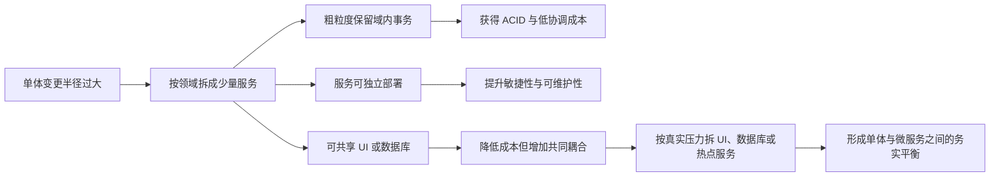
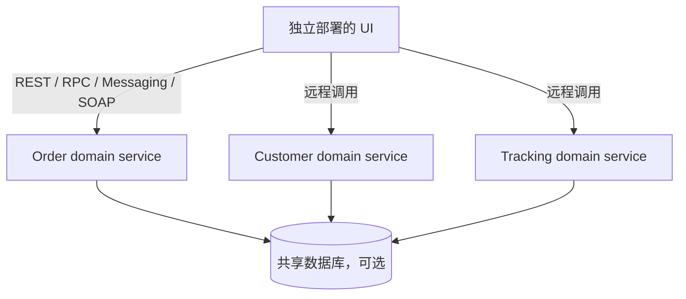
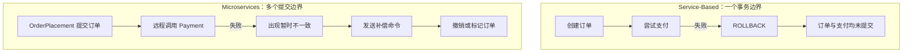

> 对应原书：*Fundamentals of Software Architecture, 2nd Edition*，Chapter 14
>
> 本章主题：如何用少量、粗粒度、按领域划分且可独立部署的服务，在单体架构与微服务之间取得务实平衡。

---

## 0. 本章要解决什么问题

很多系统遇到的真实矛盾不是“要不要分布式”，而是：

- 单体应用的部署、测试和变更半径太大；
- 完整微服务又会引入服务发现、网络故障、分布式事务、可观测性、编排和平台工程等高昂成本；
- 业务希望按领域独立演化，但并不需要把每个细小能力都变成一个远程服务；
- 数据仍然需要强一致事务，团队也未必有能力承担最终一致性和补偿事务的复杂度。

Service-Based Architecture（下文简称 SBA）给出的回答是：

1. 先按业务领域把系统拆成少量粗粒度的 **domain services**；
2. 每个 domain service 独立部署，内部保留足够多的业务能力，使一次业务事务尽量在服务内部完成；
3. UI 和数据库是否拆分，不预设唯一答案，而是根据扩展性、安全性、架构量子和变更风险选择；
4. 只把确实需要更高敏捷性或扩展性的热点领域继续细分，而不是把所有代码都变成微服务。

因此，SBA 是 microservices 的一种混合变体，也是原书认为最务实、最灵活的架构风格之一。它仍是分布式架构，但通常比 microservices、event-driven architecture 等分布式风格简单、便宜。

### 0.1 一句话抓住本章

> 用“粗粒度领域服务 + 可选择的共享基础设施”获得单体所缺少的独立部署能力，同时避免细粒度微服务的大部分协调成本。

### 0.2 本章的推理主线



### 0.3 阅读边界

原章没有给出数学公式或正式算法。本文中的变更半径、共同变更率、依赖密度、伪代码和 Python 示例都是帮助理解与落地的教学扩展，不是原书规定的行业标准。它们用于暴露权衡，不能替代业务语义和架构判断。

---

## 1. Topology：基本拓扑

### 1.1 SBA 的基本结构是什么

SBA 的基本拓扑是一种 **distributed macro-layered structure**，由三类可独立变化的部分组成：

1. **User Interface**：通常单独部署；
2. **Domain Services**：远程访问、粗粒度、分别部署；
3. **Database**：可以是一个共享的单体数据库，也可以按领域拆分。

图 14-1 展示最基本形态：一个 UI 调用多个 domain services，所有服务访问同一数据库。这里的“基本”不是“必须如此”，后文会逐步展示 UI、API 层和数据库的变体。



### 1.2 Domain Service：按领域组织的粗粒度服务

SBA 中的服务通常代表一个具体的业务领域或子领域，因此称为 **domain service**，例如：

- order fulfillment；
- order shipping；
- customer management；
- invoicing；
- item assessment。

“粗粒度”意味着一个服务不是只做一个技术动作，而是包含完成该领域业务所需的一组相关能力。以 `OrderService` 为例，它可能同时处理下单、生成订单号、支付和库存更新。

这种粒度带来三种重要性质：

- **功能内聚**：相关业务规则位于同一部署单元；
- **部署独立**：修改订单领域不必重新部署跟踪领域；
- **事务集中**：一次订单事务可以在一个服务和一个数据库事务中完成。

但“服务独立”不等于“完全没有共同耦合”。如果多个服务共享同一数据库、同一 UI 或同一公共实体库，它们仍可能属于同一个 architecture quantum，数据库变更也可能同时影响多个服务。

### 1.3 服务数量：为什么原书建议不超过约 12 个

在使用单一共享数据库时，原书建议尽量减少 domain services，原文表述为 **no more than 12**，即实践上通常不超过约 12 个。原因不是数字 13 会突然失败，而是服务数量增长会同时放大：

- 数据库 schema 变更协调；
- 数据库连接数量；
- 集成测试组合；
- 部署和版本管理；
- 监控与告警对象；
- 故障定位范围；
- 跨服务业务流程的诱惑。

因此，“12”是经验性警戒线，不是架构定律。若系统有 15 个高度独立、数据库分离、自动化成熟的服务，未必比 10 个频繁互调且共享大量表的服务更差。真正需要观察的是边界质量与协调成本。

### 1.4 部署形态与实例数量

每个 domain service 通常像一个传统单体应用一样打包和部署，并不强制使用容器。常见选择包括：

- 直接部署到虚拟机或应用服务器；
- 打包成 Docker 容器；
- 在 Kubernetes 上运行；
- 对少数热点服务创建多个实例。

SBA 的典型默认是 **每个服务一个实例**。只有吞吐量、可用性、故障转移或扩展性需要时，才增加实例。多实例之后，UI 与服务之间通常需要负载均衡，以便把请求发送到健康实例。

这体现了 SBA 的成本观：

> 不为理论上的最大弹性预付全部复杂度，只对真实热点增加实例和基础设施。

### 1.5 远程访问方式

UI 通过远程协议访问服务，最常见的是 REST，也可以使用：

- messaging；
- remote procedure call（RPC）；
- API proxy 或 API Gateway；
- SOAP。

协议不是风格定义本身。一个使用 REST 的系统不自动成为 SBA，一个使用消息队列的 SBA 也不会自动成为 event-driven architecture。决定风格的是总体拓扑、领域粒度、部署边界和通信方式之间的组合。

### 1.6 Service Locator 的位置

UI 必须知道服务在哪里。常见做法是在 UI 内嵌 **service locator pattern**，由它把逻辑服务名解析到实际地址。也可以把 service locator 放入 API Gateway 或 proxy，让 UI 只知道网关地址。

两种方式的权衡是：

| 位置 | 优点 | 代价 |
|---|---|---|
| UI 内 | 路径短、没有额外网关跳转 | 每个 UI 都要处理发现、路由和部分容错 |
| API Gateway 内 | 集中治理，UI 简化 | 网关成为关键基础设施，增加一次网络跳转 |

### 1.7 为什么共享单体数据库在这里可行

大多数分布式风格强调 database per service，而 SBA 能有效支持共享单体数据库，这是它很特别的一点。

共享数据库的收益：

- 可以继续使用 SQL join；
- 服务内部可使用普通 ACID 事务；
- 不必复制和同步所有数据；
- 服务数量少，数据库连接通常不会很快耗尽；
- 团队可复用成熟的数据库运维能力。

主要代价是 **schema change coordination**：表结构一旦变化，可能影响多个服务。后文 Data Topologies 的核心就是如何缩小这种数据变更半径。

### 1.8 与相邻风格的初步区别

| 维度 | Modular Monolith | Service-Based | Microservices |
|---|---|---|---|
| 部署单元 | 通常 1 个 | 少量粗粒度服务 | 大量细粒度服务 |
| 主要划分 | 单体内部领域模块 | 独立部署的领域 | 单一业务能力 |
| 数据库 | 通常共享 | 共享或分离 | 倾向每服务独有 |
| 事务 | 本地 ACID | 域内 ACID 较容易 | 常需 saga/补偿/最终一致性 |
| 远程协调 | 少 | 低到中 | 中到高 |
| 运维成本 | 低 | 中低 | 高 |
| 独立扩展 | 弱 | 领域级 | 细粒度能力级 |

SBA 不是“做得不彻底的微服务”，而是主动选择不同的粒度与成本结构。

---

## 2. Style Specifics：风格细节

### 2.1 Domain Service 内部如何设计

粗粒度 domain service 通常有两种内部结构。

#### 方案 A：技术分层

典型层次是：

1. **API Facade layer**：接收 UI 请求，暴露服务契约；
2. **Business Logic layer**：实现业务规则；
3. **Persistence layer**：读写数据库。

它容易理解，适合逻辑不太复杂的服务。但如果服务继续增长，按技术层组织可能使一个业务变化横跨很多目录和组件。

#### 方案 B：领域/子领域分区

在 API Facade 之下按子领域或业务能力组织组件，类似 modular monolith。这样可以在一个粗粒度服务内部继续保持模块边界，为以后拆分热点子域保留可能性。

这两种设计不互斥。实践中可以在 domain service 顶层按子领域分区，在每个子领域内部再使用适度分层。

### 2.2 API Facade 为什么不是普通 Controller

无论内部采用哪种设计，domain service 都需要一个供 UI 调用的 API access facade。它不仅做参数转换，还通常负责 **orchestrating the business request**。

以电商下单为例，UI 发出一个“购买这些商品”的业务请求，`OrderService` 的 facade 在本服务内部协调：

1. 创建订单；
2. 生成 order ID；
3. 执行支付；
4. 更新每种商品的库存；
5. 返回完整业务结果。

关键点是：协调发生在同一进程中的类或组件之间，而不是多个远程服务之间。

在 microservices 中，同一流程可能需要远程调用 `OrderPlacement`、`Payment`、`Inventory` 等多个服务。两者差别不在业务步骤，而在 **协调边界**：

- SBA：class-level / component-level orchestration；
- microservices：service-level network orchestration。

网络边界会引入超时、重试、幂等、部分失败、追踪和数据一致性问题。因此，把相关步骤留在同一 domain service 内，是 SBA 降低复杂度的主要机制。

### 2.3 ACID 与 BASE：粒度如何改变一致性问题

#### ACID 的含义

- **Atomicity**：事务中的操作要么全部成功，要么全部撤销；
- **Consistency**：事务前后数据满足约束；
- **Isolation**：并发事务的中间状态不会任意相互干扰；
- **Durability**：提交后的结果在故障后仍保留。

SBA 的 domain service 较粗，一次领域事务常能在一个进程、一个数据库连接和一个本地事务中完成，因此可以直接使用 commit/rollback。

#### BASE 的含义

原章用 **BASE transactions** 描述细粒度分布式服务常采用的模式：basic availability、soft state、eventual consistency。其直觉是放弃跨服务的即时强一致，允许各服务在一段时间内处于不同状态，最终通过消息、重试或补偿收敛。

BASE 并不是“不保证正确”，而是正确性模型变了：系统需要明确暂时不一致是否合法、多久必须收敛、重复消息如何处理、补偿失败怎么办。

### 2.4 过期信用卡案例：作者如何推出补偿事务

#### SBA 中的过程

1. `OrderService` 开启数据库事务；
2. 写入订单；
3. 尝试支付；
4. 发现信用卡过期；
5. rollback 撤销此前写入；
6. 告知客户支付失败。

因为订单与支付位于同一事务边界，数据库原子性直接保证“失败后没有半张订单”。

#### Microservices 中的过程

1. `OrderPlacement` 创建并提交订单；
2. 它远程调用 `PaymentService`；
3. 支付失败时，订单已经持久化；
4. 系统进入“有订单但未获支付批准”的中间状态；
5. 必须向 `OrderPlacement` 发出 **compensating update**，撤销或标记该订单。



难点不在“能不能写补偿代码”，而在补偿本身也会失败、重复、乱序或延迟。SBA 通过扩大服务粒度，让一批天然需要共同提交的操作重新落在本地事务里，从结构上减少这个问题。

### 2.5 可运行示例：用本地事务展示原子回滚

下面是教学性最小示例，使用 Python 标准库 SQLite 模拟 `OrderService`。它不是生产级支付实现，只演示事务边界与状态结果。

```python
import sqlite3

database = sqlite3.connect(":memory:")
database.execute(
    "CREATE TABLE orders (id INTEGER PRIMARY KEY, status TEXT NOT NULL)"
)
database.execute(
    "CREATE TABLE payments (order_id INTEGER PRIMARY KEY, amount INTEGER NOT NULL)"
)
database.commit()

class PaymentRejected(Exception):
    pass

def checkout(card_expired: bool) -> str:
    try:
        database.execute("BEGIN")
        cursor = database.execute(
            "INSERT INTO orders(status) VALUES (?)", ("PENDING",)
        )
        order_id = cursor.lastrowid

        if card_expired:
            raise PaymentRejected("expired card")

        database.execute(
            "INSERT INTO payments(order_id, amount) VALUES (?, ?)",
            (order_id, 1200),
        )
        database.execute(
            "UPDATE orders SET status = ? WHERE id = ?",
            ("APPROVED", order_id),
        )
        database.commit()
        return "accepted"
    except PaymentRejected:
        database.rollback()
        return "rejected and rolled back"

def row_count(table: str) -> int:
    return database.execute(f"SELECT COUNT(*) FROM {table}").fetchone()[0]

print(checkout(card_expired=True))
print("orders =", row_count("orders"))
print("payments =", row_count("payments"))
print(checkout(card_expired=False))
print("orders =", row_count("orders"))
print("payments =", row_count("payments"))
```

输出：

```text
rejected and rolled back
orders = 0
payments = 0
accepted
orders = 1
payments = 1
```

代码与原理的对应关系：

- `BEGIN` 定义原子工作单元；
- 创建订单、记录支付、更新状态都在同一连接和事务内；
- `PaymentRejected` 触发 `rollback()`；
- 第一次执行后两张表都是 0，说明没有向外暴露部分结果；
- 第二次成功时统一 commit，两张表同时出现一条记录。

适用前提是所有关键写入都能纳入同一数据库事务。若支付调用真实外部机构，数据库 rollback 无法“撤销已经发给外部系统的网络请求”，仍需要幂等键、对账或补偿机制。粗粒度服务降低分布式事务数量，但不会神奇地消除所有外部副作用。

---

## 3. Service Design and Granularity：服务设计与粒度

### 3.1 粗粒度带来的收益

粗粒度 domain service 将强相关功能放在一起，因此：

- 数据完整性更容易由本地 ACID 保证；
- 远程调用数量较少；
- 端到端业务协调更简单；
- 日志和调试上下文集中；
- 不需要为每个小能力建立独立部署流水线和监控面板。

### 3.2 粗粒度带来的代价

如果修改 `OrderService` 的 order-placement 逻辑，团队必须测试并重新部署整个服务，其中可能还包含 payment processing。与之相比，microservices 中只需修改和部署较小的 `OrderPlacement` 服务，`PaymentService` 不动。

粗粒度服务的风险来自两个不同层面：

1. **部署风险**：一个发布包包含更多功能，出错可能影响整个订单领域；
2. **回归范围**：即使只改一处，也要验证同一服务中的其他能力没有被破坏。

微服务通过单一职责缩小单次发布范围，但换来了更多远程交互、部署单元和运维对象。粒度没有“越细越先进”的单调关系。

### 3.3 用两个有界指标理解变更半径

设一次变更为 $c$，受影响的可部署单元集合为 $D(c)$，可以定义：

$$
B(c)=|D(c)|
$$

$B(c)$ 是 deployment blast radius。SBA 的一个域内变更通常有 $B(c)=1$，单体通常也是 1，但 SBA 的这个 1 只覆盖一个领域，而不是整个应用。

仅数部署单元仍不够。设部署单元 $d$ 中需要回归验证的业务能力数量为 $F(d)$，可用下式粗略表示回归面：

$$
R(c)=\sum_{d\in D(c)}F(d)
$$

这解释了为什么 SBA 和 microservices 都可能有 $B(c)=1$，但 SBA 的 $R(c)$ 较大：同一个 domain service 内有更多能力。

这些公式只适合做相对比较：

- “业务能力数量”很难客观统一；
- 自动化测试质量会改变真实风险；
- 一个高风险支付能力不能与一个简单查询等权；
- 跨服务契约变化即使不同时部署，也可能扩大兼容性测试范围。

### 3.4 如何形成合适的服务边界

作者的论证隐含了一个顺序：先识别领域内需要共同变化、共同提交的能力，再决定部署边界，而不是先追求服务数量。

可使用以下问题进行边界分析：

1. 哪些业务规则经常一起变化？
2. 哪些数据必须在同一事务中保持强一致？
3. 哪些能力需要独立扩展或独立安全边界？
4. 哪些团队能够独立拥有并发布这部分能力？
5. 拆开后是否会产生高频、同步、链式调用？
6. 该领域的变化速度是否显著高于周围领域？

若前两项很强而后三项不强，保留粗粒度 domain service 往往更合理。若某子域在变化率、扩展压力或安全边界上明显独立，再考虑拆分。

### 3.5 粒度决策不是一次性的

一个实用策略是“先粗后细”：

```text
先建立可识别的领域边界
    -> 每个领域形成独立部署单元
    -> 收集变化率、扩展压力和故障数据
    -> 找出真正热点
    -> 只拆分热点子域
    -> 重新检查调用和事务边界
```

这也是本章最后把 SBA 称为 stepping stone 的理论基础。

---

## 4. User Interface Options：用户界面变体

SBA 的灵活性不仅在服务和数据库，UI 也可以从单体逐步拆分。

图 14-3 给出三种典型选择。

### 4.1 Single Monolithic User Interface

一个 UI 调用所有 domain services。

优点：

- 用户体验和前端技术栈统一；
- 部署与路由简单；
- 适合规模较小、用户群相近的系统。

代价：

- UI 可能成为共同部署和故障边界；
- 前端变更可能仍需大范围协调；
- 即使后端服务独立，所有业务入口仍耦合在一个 UI 中。

### 4.2 Domain-Based User Interface

按较大的用户场景或领域拆成几个 UI，每个 UI 对应一组 domain services。

例如订单系统可以有：

- 客户下单 UI；
- 仓库打包 UI；
- 客服 UI。

它提高了扩展性、故障容错和团队敏捷性，同时保留跨服务组合页面的能力。

### 4.3 Service-Based User Interface

每个 domain service 对应一个 UI，前后端边界高度一致。这种形态的独立部署和隔离最强，但也会增加：

- 前端应用数量；
- 统一导航和登录的治理成本；
- 设计系统一致性要求；
- 跨领域用户流程的组合难度。

### 4.4 如何选择 UI 粒度

| 判断因素 | 倾向单一 UI | 倾向拆分 UI |
|---|---|---|
| 用户群 | 相同 | 外部客户、内部员工等明显不同 |
| 安全区域 | 相同网络区 | 需要公网/内网隔离 |
| 扩展压力 | 各功能相近 | 某些入口流量远高于其他入口 |
| 发布节奏 | 同步 | 不同领域独立发布 |
| 故障容忍 | UI 整体可一起停 | 一个场景故障不应影响其他场景 |
| 用户旅程 | 强跨域 | 领域内相对完整 |

拆 UI 不是为了图形对称，而应服务于用户群、网络边界、发布节奏和扩展需求。

---

## 5. API Gateway Options：API 网关变体

UI 可以直接访问 domain services，也可以在中间加入 reverse proxy 或 API Gateway。

### 5.1 为什么引入 API 层

原章列出三类主要用途。

#### 对外暴露统一 API

外部系统不需要了解内部服务地址和拓扑，只依赖稳定入口。

#### 集中横切关注点

适合集中处理：

- metrics；
- security；
- auditing；
- service discovery；
- 部分限流、路由和协议转换。

#### 多实例负载均衡

当某个 domain service 有多个实例时，网关可以把请求路由到健康实例。

### 5.2 UI 编排与网关编排

服务之间应尽量独立。跨领域流程若确实需要组合，原书倾向把 orchestration 放在 UI 或 API Gateway，而不是让 domain services 形成相互调用网。

这使依赖方向保持为：

```text
UI / Gateway -> Domain Services -> Data
```

而不是：

```text
Service A -> Service B -> Service C -> Service D
```

后者会把一次用户请求变成长同步链，任何节点超时都可能拖垮整个流程。

### 5.3 API Gateway 的边界

网关应主要承载入口治理和轻量组合，不应演化成包含大量领域规则的“新单体”。如果业务决策、事务逻辑和复杂状态都放在网关中：

- domain services 会退化为贫血 CRUD；
- 网关变成所有领域的共同变更点；
- 独立部署优势被重新集中；
- 网关故障的影响范围扩大。

判断原则是：身份认证、路由、限流、审计属于入口策略；订单能否接受、报价如何计算属于领域规则。

---

## 6. Data Topologies：数据拓扑

数据拓扑是本章最关键的部分之一，因为 SBA 的“服务独立部署”与“数据库可共享”之间存在天然张力。

### 6.1 三类数据库形态

#### 形态 A：一个共享数据库

所有 domain services 访问同一物理数据库。

适合：

- 服务数量少；
- 数据关系紧密；
- 需要大量 join；
- 强一致事务重要；
- 数据库扩展压力可控。

风险是 schema 变化与运行时数据库故障可能影响多个服务。

#### 形态 B：部分拆分

某些服务使用独立数据库，其余服务共享数据库。这通常是最务实的过渡形态：只隔离安全、规模或变化压力特殊的数据域。

#### 形态 C：每个领域一个数据库

每个 domain service 拥有独立数据库，接近 microservices 的数据拓扑。隔离最强，但跨领域查询、事务和同步更困难。

### 6.2 为什么本风格通常“共享数据优于服务互调”

如果拆库后服务 A 仍频繁需要服务 B 的数据，A 就必须通过远程调用、复制或事件同步获取数据。原书认为在 SBA 中，通常宁可共享数据，也不要制造大量 interservice communication。

这不是所有架构的普遍规则，而是 SBA 的特定取舍：

- 目标是降低分布式协调成本；
- domain services 数量较少；
- 共享数据库是被允许的共同基础设施；
- 频繁互调说明领域边界可能不自然。

若数据需要严格隔离、独立扩展或由不同合规区域管理，独立数据库仍可能更重要。

### 6.3 Schema Change 为什么危险

共享数据库允许服务在运行时相对独立，但表结构是共同契约。一次列重命名、类型修改或约束变化可能导致：

- 某个服务 ORM 映射失效；
- 旧 SQL 查询报错；
- 多个服务需要协调发布；
- 回滚数据库与回滚服务的顺序复杂；
- 团队难以准确知道受影响者。

因此，数据库共享降低了数据获取与事务成本，却把一部分耦合转移到了 schema 演化阶段。

### 6.4 反模式：所有 Entity Objects 放在一个共享库

SBA 常把表示数据库表结构的共享类称为 **entity objects**，并放入 JAR 或 DLL 等自定义共享库；SQL 也可能位于其中。

最差的实现是把所有 entity objects 放进一个 `single_shared_lib`，然后让所有服务依赖它。

问题的传播链是：

```text
一个表发生变化
    -> 对应 entity object 改变
    -> single_shared_lib 发布新版本
    -> 所有服务都表现为依赖变更
    -> 难以判断真实影响者
    -> 被迫分析、测试甚至重新部署所有服务
```

共享库版本化可以让新旧服务暂时使用不同版本，但不能自动回答“哪些服务真正访问了这张表”。如果库的粒度始终是整个数据库，版本号只是延迟协调，不会消除耦合。

### 6.5 改进：按数据领域逻辑分区共享库

原书建议先对共享数据库做逻辑分区，再建立与分区对应的 entity libraries。

图 14-7 中数据库被分为五个逻辑数据域：

- `common`；
- `customer`；
- `invoicing`；
- `order`；
- `tracking`。

同时建立：

- `common_entities_lib`；
- `customer_entities_lib`；
- `invoicing_entities_lib`；
- `order_entities_lib`；
- `tracking_entities_lib`。

每个 domain service 只依赖它实际使用的库。修改 `invoicing` 表时，只有依赖 `invoicing_entities_lib` 的服务需要评估、测试和部署，其他服务不受影响。

这一步的本质是把“整个数据库是一个契约”改成“每个逻辑数据域是一个较小契约”。物理数据库仍可共享，但变更依赖图更清晰。

### 6.6 可运行示例：计算共享库变更影响面

下面的教学示例把服务到 entity library 的依赖表示为二部图，并计算某个库变更会影响哪些服务。

```python
service_libraries = {
    "CustomerService": {"customer_entities_lib", "common_entities_lib"},
    "InvoicingService": {"invoicing_entities_lib", "common_entities_lib"},
    "OrderService": {
        "order_entities_lib",
        "customer_entities_lib",
        "common_entities_lib",
    },
    "TrackingService": {"tracking_entities_lib", "common_entities_lib"},
}

def impacted_services(changed_library: str) -> list[str]:
    return sorted(
        service
        for service, libraries in service_libraries.items()
        if changed_library in libraries
    )

for library in ("invoicing_entities_lib", "common_entities_lib"):
    impacted = ", ".join(impacted_services(library))
    print(f"{library}: {impacted}")
```

输出：

```text
invoicing_entities_lib: InvoicingService
common_entities_lib: CustomerService, InvoicingService, OrderService, TrackingService
```

直觉很清楚：分域库把一般变更限制在少数服务中；`common_entities_lib` 仍然是全局耦合点。

若有 $N$ 个服务，每个服务平均依赖 $L$ 个库，直接扫描的时间复杂度约为 $O(NL)$。实际工程可由构建系统、依赖清单或代码分析自动生成这张图，避免依赖人工记忆。

### 6.7 Common Domain 为什么仍然危险

图 14-7 中所有服务都使用 `common_entities_lib`。这在实际系统很常见，但修改 common 表仍需协调所有访问者。

原书给出一种治理方法：

- 在版本控制系统中锁定 common entity objects；
- 只允许数据库团队修改；
- 用流程强调其全局影响。

这能降低随意变更频率，但不能消除共同耦合，也可能让数据库团队成为审批瓶颈。更根本的办法是持续审查“common”是否真的共同：许多被放入 common 的对象只是命名方便，本可归入明确领域。

原书的提示是：在保持数据域定义清晰的前提下，让数据库的逻辑分区尽可能细。

### 6.8 Schema 安全演化：教学扩展

共享数据库中的破坏性变更不应要求所有服务同一秒切换。可采用 expand-and-contract：

1. **Expand**：先增加新列/新表，保持旧结构可用；
2. 发布写入方，必要时同时写新旧结构；
3. 回填历史数据并验证一致性；
4. 逐个发布读取方，让其切换到新结构；
5. 观察旧结构不再被使用；
6. **Contract**：最后删除旧列/旧表。

为什么有效：它把一个破坏性瞬间变成一段向后兼容窗口，使服务可以分批部署。

局限：

- 双写可能失败或出现不一致；
- 大表回填成本高；
- 需要明确观测旧字段使用情况；
- 某些类型变更或强约束调整仍很困难。

---

## 7. Cloud Considerations：云环境考虑

SBA 是分布式架构，因此适合云环境。domain services 虽然粗粒度，仍可分别部署、扩展和隔离。

### 7.1 为什么通常使用容器而不是 Serverless Function

粗粒度服务包含较多组件、路由和长期运行逻辑，通常更适合作为 containerized service，而不是拆成许多短小 serverless functions。

原因包括：

- 服务启动和依赖装配可能较重；
- 一个 domain service 有多个 API；
- 需要稳定连接池和缓存；
- 长事务或复杂工作流不适合极短执行模型；
- 按函数拆分可能重新引入细粒度分布式协调。

这不是说 serverless 被禁止，而是原章描述的典型实现偏向容器。若某个独立、事件触发、短时任务天然适合函数，仍可作为局部选择。

### 7.2 可直接利用的云服务

domain services 可以使用：

- cloud file storage；
- managed database；
- messaging service；
- load balancer；
- centralized logging 和 metrics。

### 7.3 云不会自动修复粗粒度扩展成本

云平台让增加实例容易，但复制粗粒度服务会复制其中所有功能，即使只有一个 API 是热点。这也是 SBA scalability 只有 3 星、elasticity 只有 2 星的根本原因。

因此应先问：

- 是整个领域都需要扩展，还是只有一个子能力？
- 服务中是否有大量内存状态阻碍水平扩展？
- 数据库连接池是否会随实例数线性放大？
- 是否值得把热点子域独立出来？

---

## 8. Common Risks：常见风险

### 8.1 风险一：过多跨服务通信

Microservices 中 interservice communication 很常见，但 SBA 刻意尽量避免它。理想状态是 domain services 彼此大体独立，主要耦合集中在受控的数据层。

如果出现大量同步互调，通常有两种可能：

1. 领域边界划错了，本应共同完成事务的能力被拆到不同服务；
2. 问题本身需要高度协作的细粒度服务，SBA 不是最合适的风格。

典型危险信号：

- 一个请求必须串行调用多个 domain services；
- 两个服务几乎每次发布都同时修改；
- 为避免重复读取而频繁请求另一个服务；
- 循环依赖 A -> B -> C -> A；
- 某服务只是为其他服务提供贫血 CRUD。

### 8.2 跨服务调用不是绝对禁止

确有合理例外。例如 `OrderProcessing` 完成订单后，需要通知 `CustomerNotification` 发送状态邮件。关键区别是：

- 这是偶发、语义明确的跨域协作；
- 通知失败通常不应回滚核心订单；
- 最好允许异步、重试或降级；
- 它不应成为每个订单步骤的长同步调用链。

### 8.3 风险二：创建太多 Domain Services

原书再次给出约 12 个的实践上限。超过这个数量，测试、部署、监控、数据库连接和 schema changes 的问题通常开始显著。

常见误因是把“可独立部署”误解为“每个名词都要成为服务”。领域服务应该围绕有内聚业务行为的边界，而不是围绕每张表或每个 CRUD endpoint。

### 8.4 教学扩展风险 A：共享数据库被误当成无成本（非原章枚举）

共享数据库避免服务互调和数据复制，却可能造成：

- schema 级共同变更；
- 服务绕过领域 API 直接修改别人的表；
- 数据库成为单点故障和扩展瓶颈；
- 所有团队争用同一迁移窗口。

正确做法不是机械地“拆库”，而是建立表所有权、逻辑分区、权限边界、兼容迁移和依赖分析。

### 8.5 教学扩展风险 B：粗粒度服务内部重新变成无结构单体（非原章枚举）

如果 domain service 内部没有组件或子域边界，它会成为一个较小但仍难维护的 monolith。图 14-2 的内部模块化因此很重要：部署粒度可以粗，代码结构不能混乱。

---

## 9. Governance：治理

SBA 除了使用圈复杂度、scalability、responsiveness 等通用治理指标，还应针对“领域独立性”建立专门测试。

### 9.1 治理问题一：一次变化跨越多少 Domain Services

理想的领域需求应主要落在一个 domain service 中。如果一个需求经常同时修改多个服务，说明：

- domain boundaries 可能不合适；
- 服务粒度可能过细；
- 某个共享概念没有明确所有者；
- 或该业务天然跨域，需要重新评估风格。

可从版本控制历史构造共同变更率。对服务 $i$ 和 $j$，设 $C_i$、$C_j$ 是分别修改它们的变更集合，定义 Jaccard 型指标：

$$
J(i,j)=\frac{|C_i\cap C_j|}{|C_i\cup C_j|}
$$

- $J=0$：历史上从未共同变更；
- $J=1$：每次都共同变更；
- 长期较高：值得检查边界或发布耦合。

为什么使用并集作分母：它把共同次数放到两者所有相关变化中归一化，避免“两个都很少改”或“一个改得特别多”造成仅看次数的误导。

局限：

- 大型重构会制造暂时的高共同变更；
- 团队提交习惯会污染数据；
- 契约兼容改动可能不需要同时发布；
- 低共同变更不能证明运行时独立。

因此，它是调查信号，不是自动拆分规则。

### 9.2 治理问题二：服务间通信有多密

当确实允许 interservice communication 时，应持续观察数量、方向和同步链长度。

若有 $N$ 个 domain services，观测到 $E$ 条有向服务依赖边，可定义依赖密度：

$$
\rho=\frac{E}{N(N-1)}
$$

$N(N-1)$ 是不考虑自调用时所有可能的有向边数量。$\rho$ 越高，说明服务关系越接近网状。

但该指标没有通用阈值：一条高频同步依赖可能比十条低频异步通知危险。还需要同时记录：

- 每个 use case 的跨服务调用数；
- 最大同步调用链长度；
- 调用频率和超时率；
- 循环依赖；
- 下游失败时的降级能力。

### 9.3 编排位置治理

原书建议多数跨域 orchestration 位于 UI 或 API Gateway。可制定以下结构规则：

```text
允许：UI/Gateway -> Domain Service
允许：Domain Service -> 自己负责的数据域
审查：Domain Service -> 另一个 Domain Service
禁止：循环服务依赖
审查：共享表无明确所有者
```

这不是说 UI 要包含领域规则，而是由组合层决定调用哪些独立业务能力，各 domain service 仍负责自己的业务不变量。

### 9.4 可执行治理检查清单

每次架构评审或发布流水线可检查：

1. 该需求修改了几个 domain services？
2. 是否新增同步服务依赖？
3. 是否形成循环调用？
4. 是否新增所有服务都依赖的 shared library？
5. schema change 是否有明确受影响服务清单？
6. common 表变更是否有兼容迁移计划？
7. 多实例服务是否有健康检查、负载均衡和无状态策略？
8. UI/Gateway 是否开始承载领域逻辑？
9. 单个 domain service 内部是否仍有清晰组件边界？
10. 服务数量和数据库连接是否接近经验警戒线？

### 9.5 避免指标异化

如果把“跨服务调用数必须为 0”当硬 KPI，团队可能绕过 API 直接共享更多表；如果把“每次只改一个服务”当目标，团队可能隐瞒必要的契约变更。治理应优化系统整体协调成本，而不是优化某个容易计数的代理指标。

---

## 10. Team Topology Considerations：团队拓扑考虑

SBA 按领域分区，因此最适合团队也按领域对齐。一个 cross-functional domain team 应能在自己的服务内完成 UI、业务逻辑、数据与发布工作。

### 10.1 为什么技术职能团队不匹配

若组织分成 UI team、backend team、database team，每个领域需求都要跨越多个团队：

```text
领域需求
    -> UI 团队排期
    -> 后端团队排期
    -> 数据库团队排期
    -> 跨团队集成与发布协调
```

架构按领域切开、组织却按技术层切开，会让一个本可在单服务内完成的变化变成跨团队项目。这正是 Conway's Law 的现实表现：沟通结构与软件边界互相塑造。

### 10.2 Stream-Aligned Teams

如果 value stream 与 domain service 边界一致，stream-aligned team 很适合 SBA。团队可以围绕一个领域持续交付。

若一个 stream 经常跨越多个服务，应分析：

- 服务边界是否需要重新对齐 stream；
- stream 是否定义过宽；
- 是否应选择更适合跨域协作的架构风格。

### 10.3 Enabling Teams

由于 domain services 粗粒度，SBA 对 enabling team 的利用不如更细粒度分布式风格直接。改善方式是在每个 domain service 内建立清晰组件，让专家和横切团队能够：

- 针对组件提出建议；
- 做局部实验；
- 建立安全、性能、测试等能力模板；
- 帮助领域团队形成自主能力。

Enabling team 应授能而不是永久接管领域交付。

### 10.4 Complicated-Subsystem Teams

SBA 的领域级和子领域级模块化允许 complicated-subsystem team 专注复杂处理，例如高难度定价、评估模型或财务结算，而不要求所有团队成员理解其内部细节。

前提是复杂子系统有稳定接口，不把专业团队变成所有需求都必须经过的瓶颈。

### 10.5 Platform Teams

SBA 的模块化可利用 platform team 提供：

- 通用部署流水线；
- 可观测性工具；
- API 和身份能力；
- 数据库迁移工具；
- 容器运行平台；
- 常见工程任务自动化。

平台应提供 self-service 能力，而不是把每个 domain service 的部署重新集中到平台团队手中。

### 10.6 团队与服务的理想关系

| 团队结构 | 与 SBA 的匹配 | 关键条件 |
|---|---|---|
| 按领域的跨职能团队 | 高 | 能独立开发、测试、发布 |
| Stream-aligned | 高 | stream 与领域边界一致 |
| Complicated-subsystem | 中高 | 复杂子域接口稳定 |
| Platform | 中高 | 提供自助式共性能力 |
| Enabling | 中 | 服务内部组件边界清晰 |
| 按技术层的职能团队 | 低 | 会制造跨团队交接 |

---

## 11. Style Characteristics：架构特征

### 11.1 精确评分

下表以图 14-8 为准：

| Architectural characteristic | 图中评分 | 核心原因 |
|---|---:|---|
| Overall cost | `$$` | 分布式但服务少，平台和协调成本低于微服务 |
| Partitioning type | Domain | 按业务领域而非技术层划分 |
| Number of quanta | 1 to many | 是否共享 UI/数据库决定共同耦合边界 |
| Simplicity | 3 星 | 比复杂分布式风格简单，但仍有远程调用和部署 |
| Modularity | 3 星 | 领域服务提供模块化，粒度仍较粗 |
| Maintainability | 4 星 | 变化通常限制在一个领域服务 |
| Testability | 4 星 | 领域范围清晰，测试面小于整体单体 |
| Deployability | 4 星 | 服务可单独部署，发布风险低于单体 |
| Evolvability | 4 星 | 领域可分别演进，热点还能继续拆分 |
| Responsiveness | 3 星 | 调用链通常不长，但毕竟有网络边界 |
| Scalability | 3 星 | 可多实例扩展，但复制的是粗粒度服务 |
| Elasticity | 2 星 | 扩缩粒度较大，资源效率不如细粒度服务 |
| Fault tolerance | 3 星 | 服务相对独立，但共享 UI/数据库可能扩大故障范围 |

### 11.2 原文内部的 Fault Tolerance 评分不一致

图 14-8 明确显示 **Fault tolerance 为 3 星**，但紧随图后的正文称“the four-star rating”来自服务自包含且很少互调。两者互相矛盾。

本文评分表忠实采用图中的 3 星，同时保留正文的定性理由：服务故障通常不会直接拖垮其他领域服务，所以故障容错表现较好；但共享数据库、共享 UI 和粗粒度影响范围使它没有达到最高水平。阅读时不应把正文误写的“4 星”静默当作图中事实。

### 11.3 Domain Partitioning

SBA 是 **domain-partitioned architecture**。结构由订单、客户、评估等业务领域驱动，而不是由 presentation、business、persistence 等技术职责驱动。

domain partitioning 的价值在于业务变化与部署边界对齐：评估规则变化时，主要修改 Assessment service；跟踪领域不应被迫重新部署。

### 11.4 Architecture Quanta：为什么是 1 到多个

Architecture quantum 可以理解为具有高度功能内聚、并受到共同同步耦合约束的一组可部署架构元素。不要把“一个服务”机械地等同于“一个量子”。

原章给出关键判断：

- 若所有服务共享同一数据库或同一 UI，整个系统可能只有 **一个 quantum**；
- 若 UI 与数据库都按边界 federate，系统可以有多个 quanta。

Going Green 在图 14-9 中有两个 quanta：

1. **External customer-facing quantum**：Customer UI、`Quoting`、`Item Status` 和客户数据库；
2. **Internal operations quantum**：Receiving UI、Recycling and Accounting UI、五个内部服务和共享内部数据库。

内部区虽然有两个 UI、五个独立部署服务，但共享同一数据库，因此整体仍是一个 quantum。这个例子说明“部署单元数量”与“架构量子数量”不是同一个概念。

### 11.5 为什么没有 5 星

SBA 在多个关键领域达到 4 星，却没有 5 星，因为它主动保留了一些共同基础设施和粗粒度：

- 粗粒度限制了最细的独立扩展；
- 共享数据库限制了完全故障隔离；
- 服务内部包含多个能力，发布范围大于微服务；
- 分布式网络仍比单体复杂。

它追求的不是任何单项极致，而是总体投入产出比。

### 11.6 Maintainability、Testability、Deployability、Evolvability：为什么是 4 星

这四项来自同一条因果链：

```text
按领域拆分
    -> 代码与业务边界更清楚
    -> 一次变化主要落在一个 domain service
    -> 测试范围比整体单体更小
    -> 可以只发布该服务
    -> 不同领域可采用不同演进节奏
```

它们共同缩短 time to market。注意，4 星建立在领域边界正确、服务内部仍模块化、数据库变化受控的前提上。若所有需求都跨服务或所有实体都在一个共享库，优势会明显下降。

### 11.7 Fault Tolerance 与 Availability

domain services 通常自包含且很少互调。若 Going Green 的 `Receiving` 服务宕机，其他六个服务仍可工作，这是较好 fault tolerance 的来源。

但可用性仍受共同依赖影响：

- 共享数据库故障可能影响所有服务；
- 单体 UI 故障可能阻断所有入口；
- API Gateway 若无冗余会成为单点；
- 一个粗粒度服务宕机会使整个领域不可用。

因此，服务级隔离不等于端到端无单点。

### 11.8 Scalability 3 星、Elasticity 2 星

SBA 可以通过多实例扩展，但扩展一个粗粒度服务会复制其中全部功能。若只有报价计算是热点，复制整个大服务会浪费资源。

Going Green 中只有面向大量客户的 `Quoting` 与 `Item Status` 需要多实例；其他内部服务一个实例即可。这样既满足真实吞吐量，又保留：

- 单实例内存缓存；
- 简单数据库连接池；
- 较低基础设施成本。

Elasticity 比 scalability 更低，是因为“能增加容量”不等于“能快速、细粒度且经济地随负载自动伸缩”。

### 11.9 Simplicity 与 Overall Cost

SBA 只有少量服务，通常不需要完整微服务平台，因此：

- 服务发现和路由简单；
- 分布式追踪链较短；
- 部署流水线数量较少；
- 分布式事务较少；
- 团队认知负担较低。

图中 overall cost 为 `$$`。这是相对评级，不是实际预算公式。它表达 SBA 比 microservices、event-driven、space-based 等复杂分布式架构更容易、成本更低。

成本可以用一个概念模型理解：

$$
C_{total}=C_{development}+C_{coordination}+C_{operations}+C_{failure}
$$

微服务可能降低单次功能变更的开发范围，却提高协调与运维项；单体降低运维项，却可能提高大型变更和发布失败成本；SBA 在这些项之间寻找中间点。各项无法仅凭风格名称定量，必须结合组织成熟度和业务压力。

### 11.10 为什么说它 Pragmatic

SBA 的务实来自“按需要购买能力”：

- 需要独立发布时，拆 domain service；
- 需要高吞吐时，只扩热点服务；
- 需要网络隔离时，拆 UI 和数据库；
- 需要强一致时，保留域内 ACID；
- 不需要细粒度弹性时，不承担完整微服务成本。

更强大的架构风格并不自动更合适。原书用跑车通勤作类比：系统若不需要极端扩展性，购买极端能力只是浪费成本与复杂度预算。

### 11.11 与 Domain-Driven Design 的关系

SBA 天然适合 DDD，因为粗粒度、domain-scoped 的服务可以包住一个较完整的领域。

但 domain service 与 bounded context 不能只按名称机械画等号。仍需确认：

- 领域语言是否一致；
- 模型和不变量是否内聚；
- 数据所有权是否清楚；
- 团队是否能独立拥有；
- 边界之间是否有明确契约。

### 11.12 SBA 的 ACID 优势

大多数分布式架构依赖 eventual consistency；SBA 因服务粗粒度，在分布式风格中最容易利用传统 ACID。

逻辑是：

1. domain service 包含完整领域流程；
2. 事务作用域能落在一个服务内；
3. 一个服务可使用一个数据库事务；
4. 因而可以 commit 或 rollback 整个领域操作。

这个优势的范围是 **特定 domain service 内部**，不是整个分布式系统自动拥有全球 ACID。跨数据库、跨外部支付或跨 domain services 时，仍需处理分布式一致性。

### 11.13 与 Microservices 的深入对比

| 问题 | SBA 的选择 | Microservices 的选择 |
|---|---|---|
| 基本粒度 | 粗粒度领域服务 | 细粒度单一业务能力 |
| 事务 | 尽量域内 ACID | 常用 saga、补偿和最终一致性 |
| 编排 | 服务内部类级协调 | 服务间 orchestration/choreography |
| 数据 | 可共享，也可拆分 | 倾向服务独有 |
| 扩展 | 复制整个领域服务 | 只复制热点能力 |
| 发布风险 | 小于单体，大于细服务 | 单服务风险小，但版本组合多 |
| 运维对象 | 少 | 多 |
| 平台要求 | 中等 | 高 |
| 适用组织 | 希望务实分布式、团队成熟度中等 | 需要高自治和细粒度扩展、平台成熟 |

SBA 适合希望获得良好模块化，又不愿陷入细粒度、服务协调和平台复杂性的团队。

---

## 12. Examples and Use Cases：案例与适用场景

原章再次使用 Going Green 电子设备回收系统，展示 SBA 如何组合服务、UI、数据库、网络区和架构量子。

### 12.1 Going Green 的六步业务流程

1. **Quoting**：客户通过网站或 kiosk 查询旧设备报价；
2. **Receiving**：客户接受报价后，把设备寄到回收公司；
3. **Assessment**：公司评估设备状况；
4. **Accounting / Item Status**：设备状态良好时向客户付款，客户可随时查询状态；
5. **Recycling**：根据评估结果安全销毁并回收零件，或在 Facebook Marketplace、eBay 等第三方平台转售；
6. **Reporting**：定期生成财务与运营报告。

### 12.2 映射为 Domain Services

系统包含七个独立 domain services：

- `Quoting`；
- `Item Status`；
- `Receiving`；
- `Assessment`；
- `Recycling`；
- `Accounting`；
- `Reporting`。

每个领域都作为独立部署单元，但并非每个服务都创建多个实例。

### 12.3 只扩展真正的热点

面向外部客户的 `Quoting` 和 `Item Status` 承受较高并发，需要多个实例。其余内部服务的用户量和吞吐量较低，单实例足够。

作者通过这个选择说明：扩展性不是“所有服务统一复制三份”，而是按业务流量有选择地投入资源。

### 12.4 三组 UI 的意义

案例按用户和领域拆成：

- Customer Facing UI；
- Receiving UI；
- Recycling and Accounting UI。

收益包括：

- 外部客户 UI 的高流量不会要求所有内部 UI 同步扩展；
- 一个 UI 故障不必影响其他业务入口；
- 内外用户权限和网络路径更清楚；
- 各领域团队可以独立发布界面。

### 12.5 两个物理数据库与网络区

案例使用两个数据库：

1. 客户侧外部操作数据库；
2. 内部运营数据库。

水平分界线代表不同 network zone。内部数据和操作不直接暴露到外部区域，从而提高：

- security access restriction；
- data protection；
- fault isolation；
- architecture quantum independence。

防火墙允许内部服务单向访问和更新客户侧信息，但反方向不允许。这样外部区域被攻破时，攻击路径不能直接进入内部运营区。

根据数据库能力，也可以用 internal table mirroring 和 external table synchronization 在两个数据库间同步必要数据。此时必须明确延迟、冲突、重放和失败恢复语义。

### 12.6 Assessment 为什么是变化热点

新产品不断上市，旧产品的估值规则也会变化，所以 `Assessment` service 持续变化。SBA 先把变化隔离在一个领域服务中，已经获得：

- agility；
- testability；
- deployability。

如果它的变化速度、设备类型差异和扩展需求继续增大，再把 Assessment 拆成按设备类型的更细服务，而不是一开始就拆所有领域。

### 12.7 SBA 作为 Stepping Stone

SBA 是迁移到其他分布式风格的良好踏脚石。无论从单体迁移，还是新建分布式系统，都可以先：

1. 识别粗粒度业务领域；
2. 将领域变成独立服务；
3. 观察真实变化率、负载、故障和团队边界；
4. 再决定哪些领域需要变成 microservices。

原章的核心提醒是：**Not every portion of an application needs to be microservices.** 即应用的每个部分都不需要成为微服务。

Going Green 中：

- `Recycling` 和 `Accounting` 没有继续细分的必要，可以保持 domain services；
- `Assessment` 高频变化、敏捷性要求高，可能按电子设备类型继续拆分。

若跳过 SBA 直接全面微服务化，团队很可能把所有功能都变成微服务，包括完全不需要独立扩展和变化的部分，从而付出没有业务回报的协调成本。

### 12.8 从案例抽象出的迁移算法

下面是决策流程，不是自动化打分公式：

```text
输入：现有单体或待建业务系统

1. 按业务语言、数据不变量和团队责任识别候选领域
2. 把强相关行为聚合为少量粗粒度 domain services
3. 明确每个服务的 UI、数据和发布边界
4. 尽量让域内事务使用本地 ACID
5. 上线并收集：
   - 变更频率
   - 独立扩展需求
   - 故障影响
   - 跨服务调用
   - 共同变更历史
6. 对每个热点子域判断：
   - 拆分收益是否大于额外远程协调和运维成本？
7. 只拆收益明确的热点
8. 重新验证事务、数据所有权和团队边界

输出：保留粗粒度的稳定领域 + 细分后的少量热点能力
```

为什么这种方法有效：它把不可逆的大规模微服务化，变成由运行证据驱动的渐进式决策。

### 12.9 适用场景

SBA 尤其适合：

- 中大型业务应用；
- 领域边界可识别；
- 希望独立部署，但不需要极细弹性；
- 强一致事务重要；
- 团队希望从单体渐进迁移；
- 运维和平台工程成熟度有限；
- 不同领域变化速度存在差异；
- 希望用较低成本获得较好敏捷性与容错。

### 12.10 不适用或需谨慎的场景

- 每个细小能力都需要独立扩展；
- 业务天然是高吞吐事件流；
- 领域之间无法形成低耦合边界；
- 服务需要形成大量低延迟同步调用；
- 全球多区域、极致弹性是第一优先级；
- 单个共享数据库无法满足容量或合规要求；
- 团队仍严格按技术层组织且无法改变交付方式。

这时可能需要 microservices、event-driven、space-based，或先回到 modular monolith 重新梳理领域。

---

## 13. 易混淆概念与常见误区

### 13.1 误区：Service-Based 就是“服务比较少的 Microservices”

数量只是表象。真正差异是服务粒度、事务边界、数据拓扑和协调位置。SBA 主动把相关业务放在一个粗粒度领域服务内，微服务则倾向细分为单一能力。

### 13.2 误区：有 REST API 就是 SBA

REST 只是访问协议。单体、SBA、microservices 都能使用 REST。必须同时观察独立部署、领域分区、服务粒度和数据边界。

### 13.3 误区：共享数据库一定是反模式

在 microservices 中，跨服务共享数据库通常破坏自治；在 SBA 中，共享数据库是有意支持的拓扑，可以降低数据复制、远程调用和事务复杂度。

真正的反模式是无边界地共享：所有服务任意读写所有表、所有实体放入一个库、schema change 没有影响分析。

### 13.4 误区：一个共享 Entity Library 最省事

它只在初始开发时看似省事，长期会把任意表变更传播给全部服务。应按逻辑数据域拆分库，并明确服务依赖。

### 13.5 误区：12 是硬上限

“约 12 个”是经验启发，用来提醒共享数据库、测试、部署和监控复杂度。边界质量、调用密度、自动化和数据拓扑比数字本身更重要。

### 13.6 误区：Domain Services 绝不能互相调用

目标是尽量独立，不是绝对禁止。订单完成后通知客户等低耦合协作是合理的。需要警惕的是高频同步链、循环依赖和每个请求都必须跨多个服务。

### 13.7 误区：API Gateway 是必需组件

UI 可以通过 service locator 直接访问服务。网关只在统一外部入口、横切治理、服务发现或负载均衡有价值时加入。

### 13.8 误区：网关应包含所有业务编排

网关可组合独立领域能力，但领域规则仍应属于 domain service。否则网关会成为新的集中式业务单体。

### 13.9 误区：粗粒度服务不能独立扩展

可以创建多个实例并负载均衡，只是扩展时会复制更多非热点功能，所以成本效率低于细粒度服务。

### 13.10 误区：容器或 Kubernetes 是 SBA 的必要条件

不是。domain service 可以像传统应用一样部署；容器只是云环境下的常见选择。

### 13.11 误区：使用 SBA 就自动拥有全系统 ACID

ACID 优势主要位于单个 domain service 的事务范围内。跨服务、跨数据库或外部系统副作用仍需最终一致性、幂等或补偿。

### 13.12 误区：每个服务就是一个 Architecture Quantum

共享 UI 或共享数据库会形成同步共同耦合，多个独立部署服务仍可能属于同一个 quantum。只有拆分相应共同依赖，才可能形成多个量子。

### 13.13 误区：Domain Service 名字与 DDD Bounded Context 相同就算对齐

名称相同不代表模型、语言、不变量、数据和团队责任真的内聚。边界必须由业务行为和变化模式验证。

### 13.14 误区：评分表说明 Fault Tolerance 是 4 星

图 14-8 是 3 星，正文中的“four-star rating”是原文内部不一致。应区分精确图表事实与正文定性分析。

---

## 14. 一般化的问题解决方法

本章不只是介绍一种拓扑，还展示了一种架构决策方法。

### 第 1 步：从业务变化而不是技术层开始划分

找出共同变化、共同提交、共享语言和共同责任的业务能力，形成候选领域。

### 第 2 步：选择能包住业务不变量的最粗合理边界

先让一次关键事务尽量在一个服务内完成，避免过早跨网络切断事务。

### 第 3 步：把部署边界与领域边界对齐

每个 domain service 能单独构建、测试和发布，团队对其端到端负责。

### 第 4 步：把共同基础设施当成显式权衡

共享 UI 和数据库能降低成本，但会影响量子、变更协调和故障范围。共享不是错误，隐形共享才危险。

### 第 5 步：用数据识别热点

观察变化率、流量、故障、共同变更、跨服务调用和团队等待时间，不凭“先进架构”想象压力。

### 第 6 步：只为真实压力增加复杂度

- 热点流量 -> 增加实例；
- 网络或安全隔离 -> 拆 UI/数据库；
- 高频变化子域 -> 继续拆分；
- 横切治理 -> 引入 API Gateway；
- schema 风险 -> 逻辑分区与兼容迁移。

### 第 7 步：每次拆分后重新核对事务与依赖

任何新边界都会改变一致性、故障和团队协调模型。拆分完成不代表决策结束。

---

## 15. 本章知识结构

```mermaid
flowchart TB
    SBA[Service-Based Architecture]
    SBA --> TOPO[Topology]
    SBA --> GRAN[Granularity]
    SBA --> DATA[Data Topologies]
    SBA --> GOV[Governance]
    SBA --> TEAM[Team Topology]
    SBA --> CHAR[Style Characteristics]
    SBA --> MIG[Stepping Stone]

    TOPO --> UI[可拆分 UI]
    TOPO --> DS[少量粗粒度 Domain Services]
    TOPO --> DB[共享或分离数据库]
    TOPO --> GW[可选 API Gateway]

    GRAN --> ACID[域内 ACID]
    GRAN --> LOW[较少远程协调]
    GRAN --> REG[较大回归面]

    DATA --> SHARED[共享数据降低互调]
    DATA --> LIB[按数据域拆 Entity Libraries]
    DATA --> COMMON[控制 Common 变更]

    GOV --> CHANGE[监控跨服务共同变更]
    GOV --> CALL[监控调用密度与链长]
    GOV --> BOUND[持续校验领域边界]

    TEAM --> DOMAIN[领域跨职能团队]
    TEAM --> STREAM[Stream 与领域对齐]

    CHAR --> FOUR[维护/测试/部署/演化 4 星]
    CHAR --> SCALE[扩展 3 星、弹性 2 星]
    CHAR --> QUANTA[1 到多个 Quanta]

    MIG --> OBS[先观察真实热点]
    MIG --> SPLIT[只细分必要领域]
```



---

## 16. 核心结论

1. **SBA 是一种务实的分布式领域架构。** 它用少量粗粒度服务获得独立部署，又避免全面微服务化的高协调成本。
2. **粗粒度是有意的设计选择。** 它扩大单服务回归面，却让相关业务步骤在进程内协调，并更容易使用 ACID。
3. **共享数据库在 SBA 中是合法拓扑。** 它支持 join、强一致和低服务互调，但必须治理 schema change、表所有权与共同故障。
4. **一个全局 entity shared library 是反模式。** 应按逻辑数据域拆分库，使依赖和变更影响可见。
5. **UI、API Gateway 和数据库都可按需要拆分。** 这些变体决定扩展性、安全区、故障隔离与 architecture quanta。
6. **服务之间应大体独立。** 大量互调和频繁跨服务共同变更通常说明边界不正确，或风格选择不合适。
7. **约 12 个服务是经验警戒线，不是定律。** 关注的是测试、部署、监控、连接和数据变更的综合协调成本。
8. **组织应按领域对齐。** 跨职能领域团队比 UI/后端/数据库职能团队更能发挥独立服务的价值。
9. **SBA 的优势是平衡而非极致。** 它在可维护性、可测试性、可部署性和可演化性上表现强，同时接受一般的扩展性和较弱的弹性。
10. **架构量子不等于服务数量。** 共享 UI 或数据库可能让多个服务仍处在同一量子中。
11. **最好的迁移策略通常是先粗后细。** 先建立领域服务，再根据真实变化和负载只拆热点。
12. **不是应用的每个部分都需要成为微服务。** 架构复杂度必须由明确业务收益来支付。

最终可以把本章的方法压缩为一句工程判断：

> 先用领域边界控制变化，再用运行证据决定哪里值得付出更细粒度分布式架构的成本。
