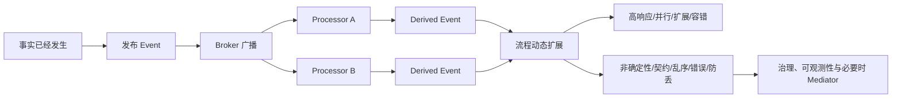

> 对应原书：*Fundamentals of Software Architecture, 2nd Edition*，Chapter 15
>
> 本章主题：如何让彼此解耦的事件处理器异步响应已经发生的事实，以获得高响应性、扩展性、容错性和演化能力；以及为此必须承担的非确定性、契约、顺序、错误恢复、防丢和状态管理成本。

---

## 0. 本章要解决什么问题

传统应用大多采用 request-based model：调用者提出明确请求，某个 orchestrator 按确定顺序同步调用处理器，最后返回结果。这种方式容易理解、测试和控制，但调用者要等待整个链路，并与下游可用性、延迟和扩展能力动态耦合。

Event-Driven Architecture（EDA）换了一个视角：系统不总是等待“请完成某事”的请求，而是响应“某事已经发生”的事件。事件处理器完成自己的动作后，再发布 derived event，让其他处理器自主决定是否响应。

它试图解决四类问题：

1. **等待问题**：用户是否必须等到整个后台流程完成？
2. **扩展问题**：不同处理步骤能否独立并行和扩缩容？
3. **演化问题**：能否在不修改现有生产者的情况下增加新反应？
4. **故障隔离问题**：下游暂时不可用时，上游能否继续接收工作？

但异步解耦会把困难转移到其他地方：

- 谁知道整个流程是否结束？
- 事件乱序、重复、丢失怎么办？
- 失败后由谁修复和恢复？
- payload 放多少数据？
- contract 变化会影响哪些未知消费者？
- 何时需要 choreography，何时需要 mediator 控制？

### 0.1 EDA 是架构风格还是局部模式

一些开发者把 EDA 视为 pattern。作者明确不同意：他们构建过完全以 EDA 为核心的系统，因此把它视为完整 architecture style。与此同时，EDA 也可以嵌入 microservices、space-based architecture 等风格，形成 hybrid architecture。

两点并不矛盾：

- 当系统的核心拓扑、通信和处理模型都由事件驱动时，它是架构风格；
- 当某个局部流程使用事件通知时，它也可以只是另一个风格中的模式。

### 0.2 Request-Based 与 Event-Based 的起点差异

Request-based model 中，request orchestrator 可以是 UI、API layer、orchestration service、event hub、event bus 或 integration hub。它确定性、同步地把请求交给 request processors。

“查询最近六个月订单历史”是典型 request：

- 目标明确；
- 需要在当前上下文返回数据；
- 调用者关心直接结果；
- 处理路径通常可预测。

“某人刚刚在在线拍卖中出价”则是 event：事实已经发生，系统要比较同期出价、更新最高价、广播价格并记录审计。生产者不应规定所有后续动作。

### 0.3 一句话抓住本章

> EDA 用对处理顺序和即时结果的控制，交换异步并行、动态解耦、广播扩展和故障隔离能力。

### 0.4 本章推理主线



### 0.5 阅读边界

原章没有提出统一数学模型或代码框架。本文中的排队公式、事件放大系数、契约利用率、Python 事件总线和幂等示例属于教学扩展，用于解释原理与检查直觉，不是原书规定的行业标准。

---

## 1. Topology：基本拓扑

### 1.1 四个核心组件

EDA 主要采用 asynchronous fire-and-forget communication。基本 broker topology 包含：

1. **Initiating event**：启动整个事件流的事件；
2. **Event broker**：承载 event channels 并转发事件；
3. **Event processor**：响应事件并完成一项处理的服务；
4. **Derived event**：处理器完成动作后发布的新事实。

一个典型流程是：

```text
initiating event
    -> broker 中的 channel
    -> 某个 event processor 处理
    -> 发布 derived event
    -> 其他 processors 并行响应
    -> 继续发布 derived events
    -> 直到所有处理器空闲且事件处理完毕
```

“直到全部结束”是概念描述，实际 choreography 中通常没有一个组件天然知道这一时刻，这也是后文 state management 风险的来源。

### 1.2 Initiating Event

Initiating event 是事件树的根。例如：

- 在线拍卖中 `bid placed`；
- 员工结婚后触发福利信息更新；
- 电商系统收到 `place order`；
- 市场发布新的股票价格。

事件名最好用已经发生的事实表达，例如 `order_placed`，而不是命令式 `place_order`。后者更像 message。

### 1.3 Federated Event Broker

Event broker 通常是 **federated** 的，即存在多个按领域组织的集群实例。每个 broker 包含该领域 event flow 所需的 event channels。

广播型 EDA 常使用：

- topic；
- AMQP topic exchange；
- stream；
- publish-and-subscribe model。

Broker federation 的意义：

- 按领域隔离流量和故障；
- 避免单一 broker 承担所有吞吐；
- 允许不同领域采用不同保留、顺序和安全策略；
- 但跨 broker 路由、治理和追踪会更复杂。

### 1.4 零售订单案例的完整事件链

`Order Placement` 接受 `place order` initiating event：

1. 创建订单并写数据库；
2. 向客户返回 order ID；
3. 发布 `order placed` derived event。

三个处理器并行响应：

- `Notification`：发订单邮件，再发布 `email sent`；
- `Payment`：扣款，发布 `payment applied` 或 `payment denied`；
- `Inventory`：调整库存，发布 `inventory updated`。

后续链路：

- `inventory updated` -> `Warehouse` 调拨或补货；
- `stock replenished` -> `Inventory` 更新当前库存；
- `payment denied` -> `Notification` 通知客户换卡；
- `payment applied` -> `Order Fulfillment` 拣货装箱；
- `order fulfilled` -> `Notification` 与 `Shipping` 并行处理；
- `order shipped` -> `Notification` 发送物流通知。

这个例子展示三种能力：

- **并行**：支付、库存、通知不必串行；
- **动态解耦**：生产者不知道所有消费者；
- **局部扩展**：每个 processor 可按自身负载增加 competing consumers。

### 1.5 Extensibility Hook

当前没有消费者监听 `email sent`，事件仍可发布。未来增加 `Email Analyzer` 时，不必修改 `Notification`。这类“先存在、后被使用”的事件是 architectural extensibility 的内建 hook，后文会专门讨论。

### 1.6 Poison Event：事件环路

`Inventory` 收到 `stock replenished` 后更新库存，但不应再发布一个会让 `Warehouse` 重复响应的等价事件，否则可能形成：

```text
Warehouse -> stock_replenished
Inventory -> inventory_adjusted
Warehouse -> stock_replenished
... 永久循环
```

原章称持续触发、持续响应的循环 derived event 为 **poison event**。它会消耗 broker、CPU、存储和下游容量。

预防方法包括：

- 在设计时画出 event graph 并检查有向环；
- 区分“状态变化原因”和“状态变化结果”；
- 为事件加入 causation ID、hop count 或处理历史；
- 消费者对 event ID 做幂等去重；
- 对异常高频同类事件告警；
- 明确哪些动作是流程终点，不再发布语义等价事件。

有向环并非绝对错误，例如库存确实会多轮补货，但必须有业务收敛条件，不能依靠偶然停止。

### 1.7 Relay Race 类比

作者把事件流比作接力赛：event processor 接到“接力棒”，跑完自己的阶段，把新事件交给下一棒后就释放，可以继续处理其他事件。

类比揭示：

- 处理器不必持有端到端调用栈；
- 各处理器可以独立扩展；
- 工作由 channel 缓冲；
- 但没有裁判时，单个选手通常不知道整场比赛何时结束。

### 1.8 教学示例：最小发布订阅事件流

下面用 Python 标准库模拟 broker、订阅和 derived events。它只演示语义，不提供持久化、并发或生产级重试。

```python
from collections import defaultdict, deque
from dataclasses import dataclass
from typing import Callable

@dataclass(frozen=True)
class Event:
    event_id: str
    name: str
    data: dict[str, object]

class EventBus:
    def __init__(self) -> None:
        self.handlers: dict[str, list[Callable[[Event], list[Event]]]] = defaultdict(list)
        self.processed: set[tuple[str, str]] = set()

    def subscribe(self, event_name: str, handler: Callable[[Event], list[Event]]) -> None:
        self.handlers[event_name].append(handler)

    def run(self, initiating_event: Event) -> None:
        queue = deque([initiating_event])
        while queue:
            event = queue.popleft()
            print(f"event: {event.name}")
            for handler in self.handlers[event.name]:
                key = (event.event_id, handler.__name__)
                if key in self.processed:
                    continue
                self.processed.add(key)
                queue.extend(handler(event))

def apply_payment(event: Event) -> list[Event]:
    print(f"payment: order {event.data['order_id']}")
    return [Event("evt-2", "payment_applied", event.data)]

def reserve_inventory(event: Event) -> list[Event]:
    print(f"inventory: order {event.data['order_id']}")
    return [Event("evt-3", "inventory_reserved", event.data)]

def fulfill_order(event: Event) -> list[Event]:
    print(f"fulfillment: order {event.data['order_id']}")
    return []

bus = EventBus()
bus.subscribe("order_placed", apply_payment)
bus.subscribe("order_placed", reserve_inventory)
bus.subscribe("payment_applied", fulfill_order)
bus.run(Event("evt-1", "order_placed", {"order_id": 123}))
```

输出：

```text
event: order_placed
payment: order 123
inventory: order 123
event: payment_applied
fulfillment: order 123
event: inventory_reserved
```

对应关系：

- `handlers` 相当于 topic subscription；
- 一个事件可有多个 handlers，体现 broadcast；
- handler 返回 derived events；
- queue 解开调用栈，处理器不直接调用彼此；
- `(event_id, handler)` 去重展示最小幂等思想。

局限：真实 broker 可能并发执行两个订阅者，输出顺序不确定；事件重投需要持久化去重记录；内存队列崩溃会丢数据。

---

## 2. Style Specifics：风格细节

### 2.1 Events Versus Messages：事件与消息

#### 2.1.1 语义差异

**Event** 广播“某事已经发生”：

```text
order_placed
payment_denied
stock_replenished
```

**Message** 表达命令或查询，即“需要做什么”：

```text
apply_payment
give_shipping_options
ship_order
```

区别不是命名风格，而是耦合意图：

- event 由消费者决定如何反应；
- message 由发送者指定目标动作。

#### 2.1.2 响应要求

- Event 通常不要求接收者回复；
- Message 通常期望执行结果或查询结果。

“通常”很重要：某些 message 也可以不回复，EDA 也支持 request-reply。不能只凭有没有 response 判断。

#### 2.1.3 一对多与一对一

- Event 常用 publish-subscribe，一对多；
- Message 常用 point-to-point，一对一。

广播命令仍是 message。通道基数不能覆盖语义。

#### 2.1.4 物理通道

| 维度 | Event | Message |
|---|---|---|
| 表达 | 已发生的事实 | 命令或查询 |
| 典型目标 | 未知的多个订阅者 | 一个指定能力 |
| 典型响应 | 不要求 | 常要求 |
| 通信 | publish-subscribe | point-to-point |
| 通道 | topic、stream、notification | queue、messaging service |

EDA 以 events 为主，但在数据查询、request-reply 和 mediated topology 中会使用 messages。

#### 2.1.5 原章四个辨析题

1. “Adventurous Air Flight 6557, turn left, heading 230 degrees.”
   - 是 message：指定某架飞机执行转向命令。
2. “A cold front has moved into the area.”
   - 是 event：事实已发生，向多人广播，不期待回复。
3. “Class, turn to page 145.”
   - 是 message：即使广播给多人，仍是命令。
4. “Sorry I’m late for the meeting.”
   - 是 event：迟到已经发生，向多人陈述事实。

最重要的结论：**publish-subscribe 不会把 command 自动变成 event。**

### 2.2 Derived Events：派生事件

Derived event 是处理器响应 initiating event 并完成动作后产生的事件。一个处理器可以根据不同结果发布多个 derived events。

信用卡扣款后，`Fraud Detection` 可能发布：

- `fraud_detected`；
- `no_fraud_detected`。

`Credit Limit` 可能发布：

- `limit_okay`：余额充足，还可携带剩余额度；
- `limit_warning`：接近额度，通知客户；
- `limit_exceeded`：通知、拒绝购买，甚至触发 `Extend Credit Limit` 营销流程。

为什么不只发布 `credit_checked` 并把结果藏在 payload？不同事实有不同的订阅语义。用事件名表达结果，消费者可在 broker 层选择订阅，无需每个消费者接收后再解析、丢弃。

但事件不能无限细分，否则会进入 Swarm of Gnats antipattern。正确粒度应表达有业务意义的 outcome。

### 2.3 Triggering Extensible Events：触发可扩展事件

原章建议：处理器完成动作后，通常应向系统发布它做了什么，即使当前没有消费者。

`Notification` 发完邮件后发布 `email_sent`。当前无人订阅时：

- 普通 pub-sub 中事件可能消失；
- stream 中事件可能保留但暂时无人读取。

未来新增 `Email Analyzer` 时，生产者无需修改。这叫 **extensible derived event**，提供 architectural extensibility hook。

适用前提：

- 事件代表稳定、有业务价值的事实；
- 发布成本和敏感数据风险可接受；
- contract 有清晰治理；
- 不为每个内部变量变化都发布事件。

否则“为了未来也许有用”会制造事件噪声、数据泄露面和治理负担。

### 2.4 Asynchronous Capabilities：异步能力

EDA 同时支持：

- fire-and-forget：不需要响应；
- asynchronous request/reply：最终需要回复，但通过两个异步通道传递。

#### 2.4.1 评论审核案例：3100 ms 与 25 ms

同步 REST 路径：

$$
T_{sync}=L_{request}+P_{validation}+L_{response}
$$

代入原章数据：

$$
T_{sync}=50+3000+50=3100\text{ ms}
$$

异步路径中，用户只等待系统接受消息：

$$
T_{user}=25\text{ ms}
$$

后台实际完成仍需：

$$
T_{complete}=25+3000=3025\text{ ms}
$$

因此异步并没有把 3000 ms 的审核算法变快，只是把“用户必须等待的边界”从业务完成移动到可靠接收。

#### 2.4.2 Responsiveness 不等于 Performance

- **Responsiveness**：用户多久收到系统反馈；
- **Performance**：端到端工作多久真正完成。

异步路径 25 ms 返回的是“已接受”，不是“已发布”。同步路径 3100 ms 返回的是“已经发布”。两个响应的语义不同，不能只比较数字。

若要提升 performance，需要并行运行文本解析器、使用缓存或优化算法。若评论最终被拒绝，可通过站内信、邮件或状态查询通知已注册用户。

#### 2.4.3 接受确认的正确语义

推荐响应：

```text
202 Accepted
submission_id: 8f2a...
status: pending_review
```

不应在仅写入队列后返回“comment posted”。API 应提供：

- 可查询的 operation ID；
- pending/succeeded/rejected 状态；
- 最终失败通知；
- 幂等提交键。

#### 2.4.4 Dynamic Quantum Entanglement

同步动态调用会把两个原本独立的 architecture quanta 纠缠起来。

`Portfolio Management` 同步调用 `Trade Order` 并等待 confirmation number：

- Trade Order 不可用，上游也不能继续；
- 下游慢，上游响应也慢；
- 上游扩展时，下游必须跟着扩展。

它们的 availability、responsiveness 和 scalability 共同受约束，形成一个 quantum。

改为异步队列后，Portfolio Management 先提交 trade order，Trade Order 后续处理并通过另一异步通道返回 confirmation。下游暂时离线时，上游仍可接收订单，两个系统可形成独立 quanta。

但若业务要求“必须立即拿到 confirmation 才能继续”，即使底层使用 request/reply queues，等待关系仍形成同步语义，量子仍可能合并。

#### 2.4.5 Backpressure 的直觉

异步 channel 可以吸收短时流量峰值。设到达率为 $\lambda$，消费者总处理率为 $\mu$，队列长度变化可近似写为：

$$
\Delta Q \approx (\lambda-\mu)\Delta t
$$

- $\lambda<\mu$：积压最终下降；
- $\lambda=\mu$：系统临界运行；
- $\lambda>\mu$：队列持续增长，异步只是在延迟失败。

因此 broker 不是无限缓冲。必须监控 queue depth、oldest message age、消费延迟、重试量和 dead-letter queue。

### 2.5 Broadcast Capabilities：广播能力

生产者广播事件时，不知道是否有消费者，也不知道消费者做什么。这种对下游动作没有知识和依赖的关系叫 **semantic decoupling**。

股票 ticker price 更新时，trade analytics、自动买卖、告警等处理器都可响应。价格发布者只陈述新价格，不编排这些行为。

广播是以下模式的基础：

- eventual consistency；
- complex event processing（CEP）；
- 实时分析；
- 审计与旁路处理；
- 新消费者无侵入扩展。

解耦不是“没有耦合”：生产者和消费者仍通过 event name、payload semantics、schema、时间和顺序假设静态耦合。

### 2.6 Event Payload：事件载荷

Payload 是事件携带的信息。两个基本选项是：

- **data-based payload**：携带下游处理所需数据；
- **key-based payload**：只携带定位上下文的 key。

它们不是全系统二选一，而应对每种 event 独立权衡。

#### 2.6.1 Data-based event payloads

订单案例中，`Order Placement` 将完整订单写入 system of record，再发布含 45 个属性、约 500 KB 的 `order_placed`。`Payment` 和 `Inventory` 直接从 payload 取所需字段，不查询数据库。

##### 优点

1. 减少数据库查询，提高 performance、responsiveness、scalability；
2. 生产者不知道未来消费者需要什么时，完整数据提高 extensibility；
3. 消费者没有权限访问源数据库时仍能工作；
4. 对 domain database 或 database-per-service 尤其有用；
5. 事件可作为当时业务事实的快照。

##### 缺点一：多个事实副本与乱序

数据库和流中的事件都保存订单数据。若客户马上把数量从 100 改为 1，旧事件仍可能在队列里：

- 旧事件可能晚于新事件到达；
- 消费者可能用旧值覆盖新值；
- 不同消费者看到的版本不同。

可缓解但不能免费消除：

- 每个 aggregate 使用递增 version；
- 同一 key 分区保证局部顺序；
- 消费者拒绝旧版本；
- 事件携带 occurred_at 与 causation ID；
- 对可变事实发布 correction event。

##### 缺点二：Contract Management 与 Versioning

完整数据必须有 contract。决策包括：

- JSON、XML 或二进制格式；
- strict schema 还是 loose name-value pairs；
- JSON Schema、GraphQL spec 或 class definition；
- 可选字段、默认值和兼容规则；
- vendor MIME type 中的版本；
- 旧版本废弃与消费者迁移。

Strict contract 更易验证，但形成明确 static coupling；loose contract 看似灵活，字段删改仍会在运行时破坏消费者。高度解耦意味着生产者甚至不知道全部订阅者，版本沟通与弃用特别困难。

##### 缺点三：Stamp Coupling

Stamp coupling 指多个模块共享同一大数据结构，却各自只使用其中一小部分。

`Inventory` 只需要 `item_id` 和 `quantity` 共 30 bytes，却接收 45 个字段、500 KB。即使删除的是 address line，Inventory 也可能因共享 contract 版本变化而需要重测和部署。

##### 缺点四：Bandwidth Utilization

原章使用 500 orders/s：

$$
B_{full}=500\times 500\text{ KB}=250{,}000\text{ KB/s}
$$

只发送 30 bytes：

$$
B_{needed}=500\times 30\text{ bytes}=15{,}000\text{ bytes/s}\approx 15\text{ KB/s}
$$

这还只是一个消费者。若 broker 为 $n$ 个订阅者复制 payload，出口带宽近似随 $n$ 增长：

$$
B_{egress}\approx r\times s\times n
$$

其中 $r$ 是事件率，$s$ 是 payload 大小。云环境中带宽并非无限，跨区传输尤其昂贵。

Consumer-driven contracts 能让每个 message consumer 只接收需要的字段，但 EDA 的广播和未知消费者使其比 point-to-point message 更难实施。

#### 2.6.2 Key-based event payload

Key-based payload 只携带上下文 key，例如：

```json
{
  "order_id": "123"
}
```

消费者收到后查询数据库获取所需数据。

##### 优点

- 单一 system of record，提高 consistency 与 integrity；
- key contract 小而稳定；
- 常可使用 loose、schema-less JSON/XML；
- contract versioning 与 deprecation 简单；
- 避免 stamp coupling；
- broker 和网络 payload 小。

##### 缺点

- 每个消费者都查询数据库；
- 并行 fan-out 会制造 query storm；
- 降低 responsiveness、performance、scalability；
- 数据库可能成为瓶颈和共同故障点；
- bounded context 外的数据可能不可访问；
- 当前数据库状态可能已不同于事件发生时状态。

最后一点很关键：key-based payload 获得“当前唯一真相”，但可能丢失“事件发生时的历史上下文”。因此 audit、计费或决策重放可能仍需快照字段。

#### 2.6.3 Trade-off summary

原章表 15-1：

| Criteria | Data-based payloads | Key-based payloads |
|---|---|---|
| Performance and scalability | Good | Bad |
| Contract management | Bad | Good |
| Stamp coupling | Bad | Good |
| Bandwidth utilization | Bad | Good |
| Restricted database access | Good | Bad |
| Overall system fragility | Bad | Good |

核心矛盾是：

```text
data-based：用更大、更脆弱的契约换少查询和高吞吐
key-based：用数据库读取和数据可达性换小契约与单一事实源
```

选择步骤：

1. 消费者能否访问权威数据源？
2. 是否必须看到事件发生时的值？
3. fan-out 和事件率多大？
4. payload 字段变化多频繁？
5. 数据是否敏感，能否广播？
6. 网络和 broker 带宽成本如何？
7. 消费者需要的字段交集多大？
8. 是否可用“key + 最小决策上下文”的中间方案？

最后一种常常最合理：不只给 key，也不复制整个 aggregate，而是携带事件语义所必需的 before/after、version 和关键字段。

#### 2.6.4 Anemic events：贫血事件

Anemic event 是 payload 缺少下游决策所需上下文的 derived event。

`profile_updated` 只带 customer ID 时：

- Service 1 不知道改了 name、address 还是其他字段；
- Service 2 不知道自己是否需要行动；
- Service 3 需要旧值，但数据库只保留新值。

仅查询数据库也无法恢复“哪些字段从什么值变成什么值”。正确 payload 应包含必要的 updated fields 和 prior values。

Payload granularity 是光谱：

```text
只含 key
    -> key + changed field names
    -> key + before/after for changed fields
    -> 业务所需快照
    -> 全量 aggregate
```

创建或删除订单时 key 可能足够；更新 profile 时通常需要更多上下文。避免贫血不等于发送全部数据。

### 2.7 The Swarm of Gnats Antipattern：事件碎片风暴反模式

Anemic event 讨论 payload 太少；Swarm of Gnats 讨论 **event 本身过细、数量过多**。

#### 2.7.1 过粗事件也有问题

若 Fraud Detection 只发布 `fraud_checked`，三个消费者都必须接收并检查 payload：

- 有欺诈时锁卡；
- 有欺诈时通知客户；
- 无欺诈时更新 purchase profile。

无欺诈时前两个消费者仍被唤醒，浪费带宽和处理。

改为 `fraud_detected` 与 `no_fraud_detected`，事件名把 outcome 提升为可订阅语义，消费者只接收相关事件。

#### 2.7.2 过细事件形成 Swarm

客户一次提交同时更新 bill-to address、ship-to address、phone。若每个字段都产生事件：

- broker 被同一业务动作的大量小事件占满；
- 下游继续派生更多小事件；
- 很难理解完整 event flow；
- 顺序和部分失败更复杂。

更好的方式是发布一个表示完整业务结果的 `profile_updated`，payload 包含所有变化字段的 before/after。

#### 2.7.3 粒度判断原则

原章建议聚焦 **processing outcome 或 state change**。判断问题：

- 这是独立业务事实，还是实现步骤？
- 消费者会按这个结果选择订阅吗？
- 多个字段变化是否属于一次原子用户动作？
- 分开后能否独立重试和补偿？
- 合并后是否迫使大量消费者接收无关事件？

事件放大可以用教学指标观察。设每个事件平均产生 $b$ 个 derived events，平均深度为 $d$，理想满树事件数约为：

$$
N=1+b+b^2+\cdots+b^d
$$

当 $b>1$ 时：

$$
N=\frac{b^{d+1}-1}{b-1}
$$

真实事件图会合并、过滤且不规则，这不是容量公式；它只说明小幅增加 fan-out 和深度可能带来非线性事件量。

### 2.8 Error Handling：异步错误处理

#### 2.8.1 为什么同步错误处理不再适用

异步 consumer 出错时：

- 原始用户早已收到 accepted；
- producer 不在当前调用栈；
- 阻塞当前 consumer 会拖延队列中的所有后续消息；
- 简单 log 不能让业务继续。

原章引入 reactive architecture 的 **Workflow Event pattern**，通过 delegation、containment、repair 同时保护 resiliency 与 responsiveness。

#### 2.8.2 Workflow Event Pattern

流程：

1. Consumer 处理失败；
2. 立即把原消息与错误委托给 Workflow Processor；
3. Consumer 继续处理主队列下一条，隔离坏消息；
4. Workflow Processor 自动诊断和修复；
5. 修复后重新投递原队列；
6. 无法自动修复时送人工 dashboard；
7. 专家修复后通过 reply-to 等信息重新提交。

为什么有效：慢而不确定的修复工作离开热路径，主队列吞吐不被单条坏消息阻塞。

#### 2.8.3 Trade Basket 案例

交易指令 contract：

```text
ACCOUNT(String),SIDE(String),SYMBOL(String),SHARES(Long)
```

错误输入：

```text
2WE35HF6DHF,BUY,AAPL,8756 SHARES
```

`SHARES(Long)` 无法解析 `8756 SHARES`，触发 `NumberFormatException`。由于输入来自外部 advisor，接收方无法同步要求用户修改。

`TradePlacement` 把错误委托给 `Trade Placement Error`，继续处理其他交易；workflow delegate 识别多余文本，修成：

```text
2WE35HF6DHF,BUY,AAPL,8756
```

再重新提交并成功处理。

#### 2.8.4 顺序代价

错误消息修复后重投，会晚于后续消息处理。交易中同一 account 必须保持顺序，例如 IBM 的 SELL 必须早于 AAPL 的 BUY。

原章方案：

1. 记录错误交易的 account number；
2. 同账户后续消息暂存到临时队列；
3. 其他账户继续处理；
4. 错误交易修复并成功后；
5. 按 FIFO 释放该账户积压。

这叫按 context/key 保序，而不是冻结整个系统。实现还需处理修复永久失败、临时队列容量、超时、人工审批和重复投递。

#### 2.8.5 自动修复的安全边界

自动去掉 `SHARES` 是确定性格式修复。若错误涉及交易方向、账户或价格，机器猜测可能产生金融损失。自动修复应满足：

- 规则确定且可审计；
- 不改变业务意图；
- 保存原始消息与修复版本；
- 设置最大重试次数；
- 无法证明安全时转人工。

### 2.9 Preventing Data Loss：防止数据丢失

#### 2.9.1 Broker 选择与语义

原章列出：

- AMQP：Amazon SNS、RabbitMQ、Solace、Azure Event Hubs；
- Jakarta Messaging API（原 JMS）：topic 与 durable subscriber；
- Kafka event streaming：防丢机制不同，应按 Kafka 的保留、复制和 offset 语义设计。

AMQP 通常把 event 发布到 exchange，再按 binding 为每类订阅者转发到 queue。JMS durable subscriber 离线时，topic 保存事件直到订阅者恢复。

#### 2.9.2 三个丢失窗口

1. Producer A 发布时崩溃，或 broker ACK 后在可靠保存/转交前崩溃；
2. Consumer B 取出消息后、处理完成前崩溃；
3. Consumer B 因数据错误无法持久化数据库。

#### 2.9.3 Event Forwarding Pattern 的三层保护

##### Producer -> Queue

- **persistent message queues**：broker 把消息写入物理存储；
- **synchronous send**：producer 阻塞等待 broker 确认已经持久化。

确认前 producer 仍负责消息；确认后 broker 持有持久副本。

##### Queue -> Consumer

- **client acknowledge mode**：消息被 consumer 锁定但不立即删除；
- consumer 崩溃时，broker 可让消息重新可见。

这比 auto acknowledge 更安全，后者读取即移除。

##### Consumer -> Database

- 数据库 ACID commit 确认持久化；
- **last participant support（LPS）** 在处理和数据库提交完成后 ACK queue，移除消息。

#### 2.9.4 防丢不等于 Exactly-Once

如果 consumer 已提交数据库、但 ACK queue 前崩溃，broker 会重投，业务写入可能执行两次。上述机制通常实现的是 at-least-once 倾向，而不是跨 broker 与数据库的端到端 exactly-once。

消费者仍应幂等：

```text
BEGIN
  INSERT event_id INTO processed_events
  如果 event_id 已存在：跳过业务副作用
  否则：执行业务写入
COMMIT
ACK message
```

`processed_events` 与业务写入必须在同一数据库事务中，否则仍有检查与写入之间的崩溃窗口。

#### 2.9.5 Transactional Outbox：教学扩展

原章聚焦 Event Forwarding。另一个常见 producer-side 方案是 transactional outbox：

1. 业务数据与 outbox row 在同一数据库事务提交；
2. relay 读取 outbox 并发布 broker；
3. 成功后标记已发布；
4. 重复发布由 consumer 幂等处理。

它解决“数据库提交成功但事件没发出”的 dual-write gap，但仍不自动提供 exactly-once。

### 2.10 Request-Reply Processing：请求-回复处理

当 producer 必须尽快从 consumer 获得 confirmation ID 或数据时，EDA 使用 request-reply messaging，也称 pseudosynchronous communication。

基本结构有两个 queues：

1. producer 异步发送 request queue；
2. producer 可先做其他工作，最终等待 reply queue；
3. consumer 处理 request；
4. consumer 把结果发送 reply queue；
5. producer 匹配并接收结果。

虽然传输使用异步消息，业务语义仍可能同步：producer 不能在结果到达前继续关键流程。

#### 2.10.1 Correlation ID

原章六步：

1. Producer 发送 ID 124、CID null，并记录 ID；
2. 在共享 reply queue 等待 `CID=124`；
3. Consumer 收到 ID 124；
4. Consumer 创建 reply ID 857，设置 CID 124；
5. reply 进入队列；
6. selector 匹配 CID 124，producer 收到正确响应。

CID 把并发请求与乱序回复关联起来。生产系统还要设置 timeout，并在超时后处理迟到 reply，不能永久阻塞。

#### 2.10.2 Temporary Queue

步骤：

1. 每个请求创建临时 reply queue；
2. 把 queue name 放入 reply-to header；
3. producer 等待专属 queue；
4. consumer 回到该 queue；
5. producer 收到后删除 queue。

它不需要 CID 和 selector，逻辑简单；但高并发下频繁创建/删除 queue 会降低 broker performance 与 responsiveness。因此作者通常推荐 correlation ID。

#### 2.10.3 使用边界

Request-reply 会重新引入：

- 等待与 timeout；
- 上下游 availability coupling；
- 单个 architecture quantum 的可能；
- retry 与 duplicate reply；
- 临时状态和资源清理。

如果大量 event processors 都需要即时 request-reply，说明系统本质可能更适合 request-based architecture。

### 2.11 Mediated Event-Driven Architecture：带中介的事件驱动架构

前文 broker topology 是 choreographed EDA：处理器广播事件，由订阅者自主反应。需要严格控制步骤、错误和恢复时，可采用 orchestrated EDA，即 mediator topology。

#### 2.11.1 Mediator Topology 组件

组件包括：

- initiating event；
- event queue；
- event mediator；
- event channels；
- event processors。

Mediator 接受 initiating event，知道流程步骤，并向专用 queues 发送 point-to-point derived messages。这里通常用 **messages/commands**，例如 `ship_order`，而不是 `order_shipped` event。

Processors 完成后通常回复 mediator，不再向全系统广播自己做了什么。因此控制集中、动态解耦较弱。

#### 2.11.2 为什么通常有多个 Mediators

单个全局 mediator 会成为：

- single point of failure；
- throughput bottleneck；
- 所有领域的共同变化点。

通常按领域建立多个 mediator，例如 Customer mediator 和 Order mediator，提高隔离、性能与可维护性。

#### 2.11.3 按流程复杂度选择实现

| 流程类型 | 典型工具 | 特征 |
|---|---|---|
| 简单路由与错误处理 | Apache Camel、Mule ESB、Spring Integration | Java/C# 等代码定义 route |
| 多条件、多动态路径、复杂错误指令 | Apache ODE、Oracle BPEL Process Manager | BPEL 描述流程、重定向、多播、错误 |
| 长事务、持续人工参与 | jBPM 等 BPM engine | 人工任务、等待、审批、长期状态 |

BPEL 强大但复杂，通常使用 GUI 工具。它不适合长时间等待人工审批；BPM 更适合。反过来，用 BPM 解决简单 route 可能花数月，而 Camel 数天可完成。

#### 2.11.4 Mediator Delegation

现实中事件复杂度不一致。作者建议分类为 simple、hard、complex：

- 所有事件先进入 Simple Event Mediator；
- simple 由它直接处理；
- hard 转发 BPEL mediator；
- complex/人工流程转发 BPM mediator；
- simple mediator 可保留完成通知责任，也可整体委托。

这避免“所有流程都用最重工具”，也避免简单工具硬撑复杂人机流程。

#### 2.11.5 订单流程模型

Mediator 明确知道五步以及步骤内的并行关系。

##### Step 1：创建订单

`place order` -> mediator -> `create order` message -> Order Placement。完成后返回 ACK 和 order ID。何时通知客户取决于业务规则。

##### Step 2：通知、支付、库存并行

Mediator 同时发送：

- `email customer`；
- `apply payment`；
- `adjust inventory`。

必须等待三个 ACK 都成功，才能进入下一步。任何分支失败时，mediator 可采取纠正动作。

##### Step 3：履约与补货并行

并行发送 `fulfill order` 与 `order stock`，等待完成。

##### Step 4：发货前处理

发送 `ship order`，同时发送带明确上下文的 `email customer`。

##### Step 5：发货完成通知

发送最后一次 `email customer`，标记 initiating event flow 完成，删除对应 workflow state。

#### 2.11.6 Error Recovery 与 Restart

若信用卡过期，mediator 知道 step 3 不能开始：

1. 停止流程；
2. 把当前状态持久化；
3. 等待支付问题解决；
4. 从 step 3 开头恢复。

这是 mediator 相比 choreography 的核心优势：它知道当前步骤、完成条件和恢复点。

#### 2.11.7 Broker 与 Mediator 的权衡

| 维度 | Choreographed Broker | Mediator |
|---|---|---|
| 控制 | 分散 | 集中 |
| 通信语义 | 事件/事实 | 多为消息/命令 |
| 耦合 | 高动态解耦 | 处理器依赖流程契约 |
| 性能/扩展 | 更高 | mediator 可能瓶颈 |
| 错误处理 | 困难 | 容易集中管理 |
| 状态/完成判断 | 困难 | mediator 明确维护 |
| 动态扩展 | 强 | 较弱 |
| 恢复/重启 | 困难 | 可保存 checkpoint |

复杂动态异常不易完全 declarative modeling，因此实践常采用 hybrid：主干由 mediator 控制，缺货等非典型动态反应仍用 choreography。

选择本质是：**workflow control 与 error handling** 对 **performance 与 scalability** 的权衡。

---

## 3. Data Topologies：数据拓扑

EDA 的事件处理看似不依赖数据，实际 payload、查询和 bounded context 会决定动态耦合、量子、扩展和故障范围。

简化订单流中，`Order Placement` 需要：

- 当前库存数量；
- 客户所在地可用 shipping options。

数据拓扑决定它能直接查询，还是必须同步调用其他 processor。

### 3.1 Monolithic Database Topology：单体数据库拓扑

所有 event processors 访问一个中央数据库。

#### 优点

- 所有数据直接可查；
- 不必同步调用其他 processors；
- 保持运行时处理器动态解耦；
- join 和事务实现简单。

#### 缺点

1. **Fault tolerance**：中央数据库宕机，全部 processors 受影响；
2. **Scalability**：processor 可独立扩容，数据库却必须承受所有并发查询与写入；
3. **Change control**：schema change 同时影响多个 processors；
4. **Quanta**：共享数据库产生同步共同耦合，整体成为单一 architecture quantum。

它适合数据高度共享、规模可控、避免同步服务调用比完全隔离更重要的系统。

### 3.2 Domain Database Topology：领域数据库拓扑

把 processors 按领域分组，每个 domain 拥有数据库。

#### 优点

- 一个领域数据库故障，其他领域仍可处理；
- channel 作为 backpressure point，等待故障领域恢复；
- 数据库按本领域负载扩展；
- schema change 只影响域内 processors；
- 可形成多个 quanta。

#### 缺点

Order Placement 可从本域数据库查库存，却要同步调用 `Order Shipping` 获取 shipping options。这会降低 fault tolerance 与 scalability，抵消 EDA 的动态解耦。

若跨域同步调用很多，应：

1. 重新检查 domain boundaries；
2. 合并高度依赖的 domains；
3. 复制只读数据并接受 eventual consistency；
4. 或回到 monolithic database topology。

### 3.3 Dedicated Data Topology：专用数据库拓扑

每个 event processor 独占数据库，即 microservices 中的 database-per-service pattern，形成紧密 bounded context。

#### 优点

- 三种拓扑中 fault tolerance 最高；
- 每个数据库只按一个 processor 的负载扩展；
- schema change 只影响其所有者；
- 故障和数据边界最清晰；
- architecture quanta 最容易独立。

#### 缺点

Order Placement 为库存和 shipping options 分别同步调用 Inventory 与 Order Shipment，形成更多 synchronous dynamic coupling。数据库实例也可能昂贵。

它适合 processors 大多 self-contained、只需自己 bounded context 数据的系统。若频繁跨服务取数，应考虑 domain 或 monolithic topology；若 schema 高频变化和隔离收益更重要，则可能接受同步调用或构建异步数据投影。

### 3.4 三种拓扑总结

| 维度 | Monolithic | Domain | Dedicated |
|---|---|---|---|
| 数据隔离 | 低 | 中 | 高 |
| 故障隔离 | 低 | 中 | 高 |
| 数据库扩展 | 共同扩展 | 按领域 | 按 processor |
| Schema 影响 | 全局 | 领域 | 单 processor |
| 直接查询便利 | 高 | 中 | 低 |
| 同步调用风险 | 低 | 中 | 高 |
| 成本 | 较低 | 中 | 较高 |
| Quanta | 通常 1 | 1 到多个 | 更容易多个 |

不存在总是最佳的拓扑。必须先列出每个 processor 的数据需求，再选择隔离与通信的平衡点。

---

## 4. Cloud Considerations：云环境考虑

原章在本节的核心结论是：EDA 与 cloud-based environment 高度匹配，能直接利用云厂商的异步服务，而云基础设施和云服务的弹性也与 EDA 的形态一致。

以下是教学扩展（非原章枚举），用于把这条结论落实为具体云端关注点：

- 云厂商提供 managed queues、topics、streams 和 event buses；
- processor 可按 backlog/lag 弹性扩缩；
- 解耦处理器适合独立部署；
- 跨可用区的持久 broker 提供故障恢复；
- serverless functions 可自然响应事件。

但“云服务托管”不会消除语义设计：

- 仍需定义 delivery guarantee；
- 仍会重复、乱序或迟到；
- 跨区传输和大 payload 有成本；
- 并发扩容可能压垮下游数据库；
- managed service 也有 quota、partition 和 retention 限制。

按 queue depth 扩容时，应同时限制数据库和外部 API 并发，避免把 broker 积压瞬间转化为 downstream overload。

---

## 5. Common Risks：常见风险

原章明确列出四类风险。

### 5.1 Nondeterministic Event Processing

处理器可能意外发布 derived events，或本该响应却没有响应。事件树受条件、顺序、失败和动态订阅影响，很难预知 initiating event 的完整结果。

应建立：

- event catalog；
- event lineage / causation tracing；
- correlation ID；
- contract tests；
- 可重放的测试数据；
- 关键业务不变量监控。

### 5.2 Static Contract Coupling

EDA 动态耦合低，不代表静态耦合低。Payload contract 尤其是全量 data-based payload 会形成 brittleness。生产者可能不知道订阅者，contract change 影响难以评估。

Key-based payload 可降低静态耦合，却带来查询、扩展、性能和 anemic event 风险。

### 5.3 Too Much Synchronous Communication

EDA 的“超能力”来自 dynamically decoupled processors。若 processors 不断同步取数或等待 reply：

- 故障隔离下降；
- quanta 纠缠；
- 扩展受最慢下游限制；
- 架构可能本质更适合 request-based model。

任何同步依赖都应有明确理由和超时/降级策略。

### 5.4 Overall State Management

Choreography 中很难知道：

- initiating event 是否完全处理；
- 当前进行到哪里；
- 哪些分支失败；
- 是否仍有迟到事件；
- 能否安全重启。

偶尔可以识别 final event，让最初 processor 订阅它；多数动态流程没有唯一终点。需要明确完成状态时，应考虑 mediator、workflow state store 或业务级 process manager。

### 5.5 教学扩展：风险并非独立

四类风险会互相强化：大 payload 增加 contract coupling；为了避免大 payload 改用 key，又增加同步查询；同步查询使 quanta 纠缠；失败分支让整体状态更难判断。因此不能逐项局部优化，要看整个 event flow。

---

## 6. Governance：治理

EDA 的治理大多不是静态目录规则，而依赖 logs、traces 和 metrics 形成 observability governance mesh。某些指标还需手工收集。

原章关注两种 structural decay：

1. static coupling through contract management；
2. dynamic coupling through synchronous calls。

### 6.1 Contract Change Rate

记录每个 event contract 的：

- breaking/nonbreaking 变更次数；
- 当前活跃版本数；
- 最老消费者版本；
- 废弃窗口；
- 兼容性测试结果。

Loose schema 并不意味着无 contract。它只是把破坏从编译/注册阶段推迟到运行时。

### 6.2 Stamp Coupling Governance

持续记录消费者实际读取哪些字段。对 contract $e$，设总字段集合为 $F_e$，所有消费者至少读取一次的字段并集为 $U_e$，可定义字段利用率：

$$
R_e=\frac{|U_e|}{|F_e|}
$$

低 $R_e$ 提示 payload 可能过大，但不能直接删除未读字段：

- 新消费者可能即将上线；
- 字段可能用于审计或未来重放；
- 采样日志可能漏记条件分支。

它是调查信号，不是自动裁剪规则。

### 6.3 Synchronous Call Fitness Function

通过 logs、distributed traces、source annotation 或统一 synchronous client library 自动记录：

- 哪个 processor 调用了谁；
- 原因与 use case；
- 调用频率；
- p95/p99 latency；
- timeout 和 failure rate；
- 是否位于 domain/dedicated topology。

原章强调 EDA 中 **任何同步通信都应跟踪和讨论**，尤其是 domain 或 dedicated database topology。

### 6.4 事件图治理

教学扩展检查项：

1. 是否有无收敛条件的环？
2. 每个 initiating event 最大 fan-out/depth 是多少？
3. 是否出现 Swarm of Gnats？
4. 是否有 anemic event？
5. 是否存在无人拥有的 topic？
6. 是否有事件从未被消费却长期保存？
7. 是否有 DLQ 持续增长？
8. 是否能从 trace 重建 causation chain？
9. 是否存在无限 retry？
10. consumer 是否幂等？

### 6.5 避免指标异化

- 强制同步调用为 0，团队可能把全量数据塞进每个 event；
- 强制 payload 最小，可能制造 anemic events 和 query storm；
- 强制 event 数少，可能制造所有消费者都要解析的超粗事件。

治理目标是整体正确性、可演化性和可操作性，而不是单个数字极小。

---

## 7. Team Topology Considerations：团队拓扑考虑

原章把 EDA 主要视为 **technically partitioned architecture**：一个 domain 往往由多个 event processors、channels、brokers、contracts 和可能的 databases 共同实现。它仍可由领域 cross-functional teams 负责，但团队理解完整流会更困难。

### 7.1 Stream-Aligned Teams

系统越大，stream team 越难掌握所有 moving parts。给 order placement 增加一步可能需要：

- 修改多个 processors；
- 重构 derived events；
- 调整触发时机；
- 协调 contract 与回放测试。

小型、领域边界清楚的 EDA 尚可；大型复杂事件树会降低 stream-aligned team 的有效性。

### 7.2 Enabling Teams

原章认为 enabling teams 与 EDA 匹配较差。原因是 processor 之间通过 derived events 与 contracts 集成，stream 内的局部实验可能扰动整个 flow，需要 enabling 与 stream teams 大量协调。

若使用 enabling team，应把实验放在明确隔离的环境和 contract 下，避免直接改变生产 event semantics。

### 7.3 Complicated-Subsystem Teams

这类团队与 EDA 匹配良好。复杂处理可隔离在独立 processor 中，例如 fraud detection、risk model、complex pricing。动态调用解耦后，stream team 主要协调：

- event payload contract；
- derived event semantics。

复杂算法内部可由专门团队独立演进。

### 7.4 Platform Teams

EDA 的技术分区使 platform team 很有价值，可提供：

- message broker/event hub/event bus；
- schema registry；
- producer/consumer SDK；
- observability 与 lineage；
- retry、DLQ、idempotency 模板；
- contract compatibility check；
- 自助 topic/queue provisioning。

平台应提供 paved road，不应垄断每个 event 的业务语义。

### 7.5 教学扩展：团队责任建议（非原章枚举）

每个 event 必须有明确 owner，至少负责：

- 语义与命名；
- schema 与兼容性；
- retention、安全和隐私；
- producer SLO；
- consumer 发现与弃用沟通。

“广播给未知消费者”不等于“无人负责”。

---

## 8. Style Characteristics：架构特征

### 8.1 精确评分

| Architectural characteristic | 图中评分 | 原因 |
|---|---:|---|
| Overall cost | `$$$` | Broker、可观测性、契约、重试和运维复杂 |
| Partitioning type | Technical | 一个领域分散在 processors/channels/contracts 中 |
| Number of quanta | 1 to many | 数据共享与 request-reply 决定同步共同耦合 |
| Simplicity | 2 星 | 非确定事件流、错误和状态管理复杂 |
| Modularity | 4 星 | Processors 高度独立、功能可插入 |
| Maintainability | 4 星 | 局部 processor 可独立修改，但 contract 有耦合 |
| Testability | 2 星 | 非确定路径与事件树难以穷举 |
| Deployability | 3 星 | Processor 可部署，但 contract/flow 协调限制独立性 |
| Evolvability | 5 星 | Derived-event hooks 支持无侵入扩展 |
| Responsiveness | 5 星 | 快速接受、异步后台处理 |
| Scalability | 4 星 | 并行和 competing consumers，数据库仍可能瓶颈 |
| Elasticity | 3 星 | 可按 backlog 扩缩，但状态、数据和 broker 有限制 |
| Fault tolerance | 5 星 | 异步隔离，下游恢复后可继续处理 |

图中没有单列 Performance；正文把 performance、scalability、fault tolerance 统称为 4 到 5 星强项。不要凭正文自行添加不存在的 Performance 评分行。

### 8.2 Technical Partitioning

一个业务 domain 通常横跨多个 processors、broker artifacts、topics 和 contracts。修改领域流程可能改变多个技术组件，所以 EDA 通常不被视为 domain partitioned。

这不否认每个 processor 可以围绕单一业务动作内聚，只是整体结构和变更路径主要沿事件处理技术拓扑展开。

### 8.3 Number of Quanta：1 到多个

异步调用本身有助于拆开 quanta，但以下情况会重新合并：

- 多个 processors 共享一个数据库；
- request-reply 要求即时 response；
- 上游业务必须等下游结果才能继续。

即使底层是 asynchronous messages，只要业务语义是 blocking wait，就存在 synchronous dynamic coupling。

### 8.4 Performance、Scalability 与 Fault Tolerance

高 performance 来自 asynchronous communication 与 highly parallel processing。

高 scalability 来自 programmatic load balancing：

- competing consumers；
- consumer groups；
- 根据 backlog 增加 processor 实例。

Scalability 只有 4 星而不是 5 星，主要因为 database 常成为共享瓶颈。

Fault tolerance 5 星来自异步隔离：只要调用者不需要即时结果，下游不可用时 event 可保存在 channel，恢复后继续处理。这取决于 broker 持久化、重试和幂等配置，不能只靠“用了异步”获得。

### 8.5 Simplicity 与 Testability 低

Request-based flow 路径和结果通常已知；EDA 的 nondeterministic workflows 会因并发、条件和 derived events 生成复杂 event tree，可能有数百甚至数千场景。

测试策略需要分层：

1. processor 单元测试；
2. schema/contract compatibility；
3. producer-consumer contract tests；
4. broker 集成测试；
5. 关键 event flow 场景；
6. duplicate、out-of-order、delay、retry、DLQ 故障注入；
7. 业务不变量与最终状态验证。

无法穷举全部事件交错，应重点验证不变量而非每一种时序。

### 8.6 Evolvability 5 星

已有 derived events 是扩展 hook。增加新 processor 订阅现有事件，无需改 producer 或基础设施，这是高度 evolutionary 的来源。

前提是：

- event semantics 稳定；
- contract 向后兼容；
- 新 consumer 不给共享数据库制造不可承受负载；
- 广播数据满足安全与合规。

### 8.7 Workflow Control、Error Handling 与 Recoverability

Choreography 没有 mediator 监控全局 transaction。`Payment` 崩溃时，`Inventory` 仍可能扣库存，其他流程继续，业务被卡在不一致状态。

重提 initiating event 也可能重复已完成动作，因此 recoverability 很难。需要：

- mediator/checkpoint；
- 幂等消费者；
- compensating events；
- workflow state store；
- 人工 repair path。

这正是 EDA 强大却复杂的核心代价。

### 8.8 Choosing Between Request-Based and Event-Based Models：如何选择

#### 8.8.1 选择 Request-Based

适合 well-structured、data-driven requests，例如查询 customer profile，优先：

- certainty；
- workflow control；
- 即时一致结果；
- 易测试和调试。

#### 8.8.2 选择 Event-Based

适合 flexible、action-based events，要求：

- 高 responsiveness；
- 高 scale；
- dynamic user processing；
- 实时反应与扩展。

#### 8.8.3 原章权衡表

| Advantages over request-based | Trade-offs |
|---|---|
| Better response to dynamic user content | Only supports eventual consistency |
| Better scalability and elasticity | Less control over processing flow |
| Better agility and change management | Less certainty over outcome of event flow |
| Better adaptability and extensibility | Difficult to test and debug |
| Better responsiveness and performance |  |
| Better real-time decision making |  |
| Better reaction to situational awareness |  |

“Only supports eventual consistency”是该 event-based model 的总体权衡描述，不意味着 event processor 内部不能使用 ACID；单个 processor 对自己的数据库仍可本地事务提交，但跨 processors 的整体业务状态通常最终一致。

#### 8.8.4 决策问题

1. 这是查询/命令，还是已发生的事实？
2. 调用者必须立即知道最终结果吗？
3. 流程顺序是否严格且可预知？
4. 可否接受 eventual consistency？
5. 是否需要未知消费者未来扩展？
6. 是否存在大规模并行和峰值流量？
7. 团队是否具备 broker、contract、observability 和 repair 能力？
8. 失败后是否有业务可接受的补偿或人工路径？

很多系统应混合使用：查询与强控制流程采用 request-based，事实传播、旁路处理和高并发反应采用 event-based。

---

## 9. Examples and Use Cases：案例与适用场景

### 9.1 适合 EDA 的问题

- 业务核心是响应内部或外部发生的事情；
- 需要高 responsiveness、performance、scalability；
- 需要 fault tolerance 与 elasticity；
- 多个独立反应可以并行；
- 下游未来可能扩展；
- 可以接受 eventual consistency。

前文 order-entry 适合 EDA，因为支付、库存、通知等可以解耦并行。

### 9.2 Going, Going, Gone 在线拍卖

拍卖参与者数量未知，临近结束时流量激增，需要 scalability 与 elasticity。出价必须快速反馈，因此 responsiveness 很重要。

最关键的是：placing a bid 不是“请求系统替我做一个确定任务”，而是“一个 bid 已经发生”，系统必须响应这个事实。

流程：

1. `Bid Capture` 接收 initiating bid；
2. 判断是否高于 prior bid；
3. 发布 `bid placed`；
4. `Auctioneer` 更新网站当前价格；
5. `Bid Streamer` 把出价推送到历史或各 bidder；
6. `Bidder Tracker` 持久化 bidder 与 bid，用于追踪和审计。

后三项可以同时或稍后后台执行，彼此不需直接调用。

### 9.3 拍卖场景的正确性难点

图只展示部分流程，真实系统还必须处理：

- 同时出价的全序或同一 item 分区顺序；
- duplicate bid 幂等；
- 结束时间与迟到事件；
- 当前最高价的原子比较更新；
- 网站推送与权威结果的差异；
- Bid Tracker 暂时离线后的补处理。

高并发竞价的“接受事件”可以异步，但决定最高 bidder 的核心状态转换仍需明确一致性边界，例如同一 auction key 单分区处理或数据库 compare-and-set。

### 9.4 何时不值得使用 EDA

原章结论：EDA 非常复杂但非常强大。应先分析 workflow 和 processing，确认业务真的需要它的 superpowers。

若大多数处理是 request-based：

- 数据查询明确；
- 需要即时结果；
- 路径确定；
- 并行和广播很少；

则应考虑 microservices 等 request-oriented style，而不是为了流行而事件化全部操作。

---

## 10. 易混淆概念与常见误区

### 10.1 Event 与 Message 只看 Topic/Queue

错误。Event/message 首先是语义：事实与命令。广播命令仍是 message，queue 中也可以传 event notification。

### 10.2 Asynchronous 等于处理更快

错误。评论案例只把用户等待从 3100 ms 降到 25 ms，后台仍需 3025 ms。提升的是 responsiveness，不自动是 end-to-end performance。

### 10.3 Accepted 等于 Succeeded

错误。Broker 接受只表示承诺稍后处理。API 必须准确表达 pending，并提供最终结果渠道。

### 10.4 Fire-and-Forget 等于不关心结果

错误。调用者不阻塞，不代表业务不关心失败。系统仍需要 durable delivery、observability、retry、DLQ 和 repair。

### 10.5 动态解耦等于完全无耦合

错误。Payload schema、event semantics、顺序、时间和安全假设形成 static coupling。

### 10.6 Data-Based Payload 总比 Key-Based 快

Broker/数据库访问层面通常更快，但大 payload 会增加序列化、带宽、存储和 contract 风险。必须按事件率、fan-out、字段变化和数据库可达性权衡。

### 10.7 Key-Based Payload 永远最干净

错误。它可能制造 query storm、跨 bounded context 同步调用，并成为 anemic event。

### 10.8 避免 Anemic Event 就要发送整个对象

错误。应发送完成业务决策所需的最小上下文，常见是 key + changed fields + before/after + version。

### 10.9 事件越细越解耦

错误。过细会形成 Swarm of Gnats，放大流量、顺序和理解成本。应表达业务 outcome，而不是每个字段赋值。

### 10.10 发布当前无人订阅的事件一定浪费

错误。稳定的 extensible derived event 是未来 hook；但无业务意义的内部噪声不应发布。

### 10.11 Persistent Queue + ACK 等于 Exactly-Once

错误。它主要防丢并导致重投，常见语义是 at-least-once。Consumer 必须幂等。

### 10.12 Retry 可以无限进行

错误。确定性坏数据会形成 poison message。应指数退避、限制次数、进入 DLQ/Workflow Processor。

### 10.13 Correlation ID 让 Request-Reply 完全异步解耦

错误。传输异步，但若 producer 必须等待结果才能继续，业务上仍同步耦合。

### 10.14 Mediator 与 Broker 谁更先进

没有高下。Broker 优先性能、扩展和动态解耦；Mediator 优先流程控制、错误恢复和状态。

### 10.15 每个 Processor 一个数据库总是最好

错误。Dedicated topology 隔离最好，却可能迫使大量同步取数，抵消 EDA 优势。

### 10.16 共享数据库只影响数据层

错误。它形成共同故障、扩展和 schema 边界，并可能把多个 processors 合为一个 architecture quantum。

### 10.17 EDA 天然容易测试

错误。Processor 单元测试容易不等于 event flow 容易。非确定时序、分支、重复和失败组合使端到端测试困难。

### 10.18 EDA 就是 Event Sourcing

错误。EDA 描述组件通过事件异步协作；Event Sourcing 描述以事件序列作为 aggregate 的权威持久化模型。两者可组合，也可独立使用。

### 10.19 EDA 就是 Kafka

错误。Kafka 是一种 event streaming broker。EDA 还可使用 AMQP、JMS topics、cloud notification 和其他 broker；架构语义不由产品名称决定。

---

## 11. 一般化的问题解决方法

本节是对原章论证的教学性归纳，并非原章逐项给出的流程。本章展示的不是“先选消息队列”，而是一套由业务语义到可靠运行的推导方法。

### 第 1 步：判断交互语义

先问是 command/query，还是已发生的 fact。不要用 topic 把命令伪装成事件。

### 第 2 步：定义一致性和响应承诺

明确用户收到的是 accepted 还是 completed；明确哪些不变量必须立即成立，哪些可以 eventual consistency。

### 第 3 步：画出 Initiating 与 Derived Event Graph

标出 producers、channels、consumers、fan-out、终点和可能环路，检查 poison event 与 Swarm of Gnats。

### 第 4 步：选择 Choreography 或 Mediator

- 动态反应、高性能、可扩展 -> choreography；
- 严格步骤、完成判断、复杂恢复 -> mediator；
- 主干可控、异常动态 -> hybrid。

### 第 5 步：逐事件设计 Payload

在 data-based 与 key-based 光谱上选择。避免 stamp coupling，也避免 anemic event。

### 第 6 步：先设计失败，再设计成功

对每条边回答：

- 发布前崩溃？
- Broker 持久化失败？
- Consumer 处理中崩溃？
- DB commit 后 ACK 前崩溃？
- 重复、乱序、迟到？
- 永久坏数据？

### 第 7 步：定义 Delivery、Idempotency 与 Ordering

不要笼统写“可靠”。明确 at-most-once/at-least-once 倾向、dedup key、顺序范围、partition key、retry 和 DLQ。

### 第 8 步：选择数据拓扑

先列每个 processor 的数据需求，再在 monolithic/domain/dedicated 中权衡。不要先 database-per-service 再发现所有服务必须同步互调。

### 第 9 步：建立 Observability 与 Governance

事件必须能关联、追踪、量化 lag、识别 contract 版本、查看 DLQ，并重建 causation chain。

### 第 10 步：用业务能力支付复杂度

只有当 responsiveness、scale、fault tolerance、extensibility 和 real-time reaction 的收益大于测试、状态、错误和治理成本时，才采用 EDA。

---

## 12. 本章知识结构

```mermaid
flowchart TB
    EDA[Event-Driven Architecture]
    EDA --> SEM[Semantics]
    EDA --> TOP[Topologies]
    EDA --> PAY[Payload]
    EDA --> REL[Reliability]
    EDA --> DAT[Data]
    EDA --> GOV[Governance]
    EDA --> TRADE[Trade-offs]

    SEM --> EVT[Event = 已发生事实]
    SEM --> MSG[Message = 命令/查询]
    SEM --> DER[Derived Events]

    TOP --> BRO[Broker/Choreography]
    TOP --> MED[Mediator/Orchestration]
    BRO --> PERF[性能/扩展/动态解耦]
    MED --> CTRL[控制/状态/恢复]

    PAY --> DATA[Data-based]
    PAY --> KEY[Key-based]
    DATA --> STAMP[Stamp Coupling]
    KEY --> ANEMIC[Anemic Event]
    PAY --> GNAT[Swarm of Gnats]

    REL --> ERR[Workflow Event]
    REL --> LOSS[Event Forwarding]
    REL --> IDEM[Idempotency]
    REL --> RR[Request-Reply/CID]

    DAT --> MONO[Monolithic DB]
    DAT --> DOMAIN[Domain DB]
    DAT --> DED[Dedicated DB]

    GOV --> CONTRACT[Contract Change]
    GOV --> SYNC[Synchronous Calls]
    GOV --> OBS[Logs/Traces/Metrics]

    TRADE --> POWER[响应/扩展/容错/演化]
    TRADE --> COST[非确定/测试/状态/错误]
```



---

## 13. 核心结论

1. **EDA 是完整架构风格，也可嵌入其他风格。** 它由解耦 processors 异步触发和响应 events。
2. **Event 是已发生事实，Message 是命令或查询。** 广播方式不能改变语义。
3. **Broker choreography 以控制换性能和扩展。** Mediator orchestration 以部分解耦和性能换流程控制、状态与恢复。
4. **异步主要改善 responsiveness，不自动改善 end-to-end performance。** `accepted` 也不等于 `completed`。
5. **Derived events 是演化能力的 hook。** 新 consumer 可无侵入订阅，但事件必须有稳定业务语义。
6. **动态解耦不消除静态耦合。** Payload contract、顺序和时间假设仍可能使系统脆弱。
7. **Data-based 与 key-based payload 是逐事件权衡。** 前者少查询但契约大，后者契约小但可能查询风暴和贫血。
8. **事件粒度应表达 outcome。** 过粗迫使消费者解析丢弃，过细形成 Swarm of Gnats。
9. **异步错误必须委托、隔离和修复。** Workflow Event pattern 保护主队列吞吐，但需处理按 key 顺序。
10. **防丢不等于 exactly-once。** Persistent queue、client ACK、DB commit 和 LPS 仍需幂等 consumer。
11. **Request-reply 使用异步传输也可能形成同步业务耦合。** Correlation ID 通常比每请求临时 queue 更高效。
12. **数据拓扑决定 EDA 能否保持解耦。** Dedicated DB 隔离强，但同步取数可能抵消全部收益。
13. **EDA 主要是技术分区。** 一个 domain 常横跨多个 processors、channels 和 contracts。
14. **EDA 强在 evolvability、responsiveness、fault tolerance，弱在 simplicity 与 testability。** 这是同一非确定异步机制的两面。
15. **治理重点是 contract static coupling 与 synchronous dynamic coupling。** 需要日志、追踪和可观测治理网格。
16. **不是所有业务都值得事件化。** 数据驱动、确定、要求即时结果的流程通常更适合 request-based model。

最终可以把本章压缩成一句架构判断：

> 只有当业务真正需要异步并行、广播扩展和故障隔离时，才值得用全链路可观测、幂等、防丢、错误恢复与契约治理来支付 EDA 的复杂度。
