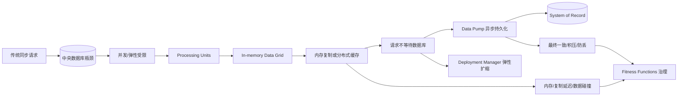
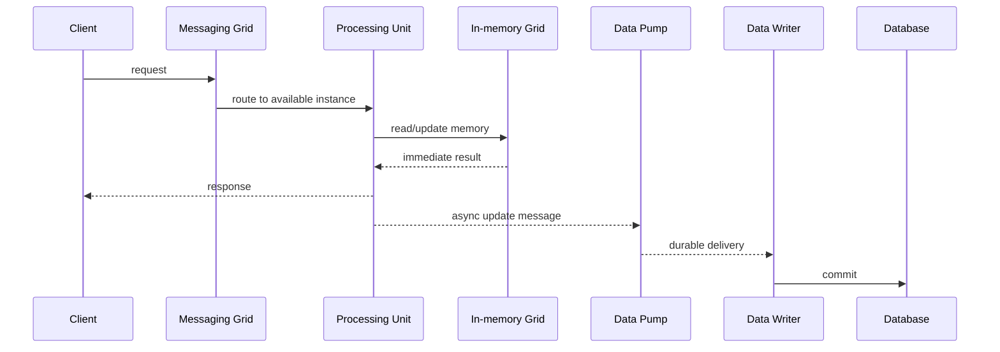
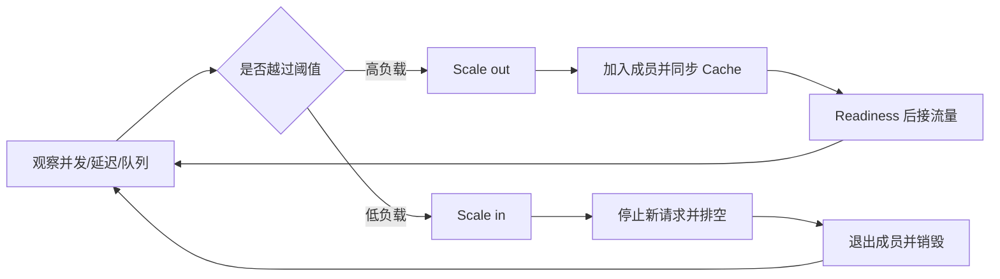
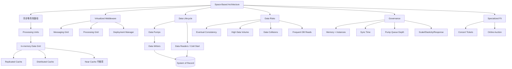

> 对应原书：*Fundamentals of Software Architecture, 2nd Edition*，Chapter 16
>
> 本章主题：如何把数据库移出同步事务热路径，用可弹性伸缩的 processing units、分布式内存数据网格和异步 data pumps，支撑极高并发、突发流量与低响应延迟。

---

## 0. 本章要解决什么问题

典型 Web 业务请求沿以下路径执行：

```text
Browser -> Web Server -> Application Server -> Database
```

并发用户增加时，瓶颈依次向下移动：

1. Web server 先饱和，增加实例相对容易、便宜；
2. 流量被推到 application server，继续扩展更复杂、更贵；
3. 最终所有实例仍汇聚到 database，数据库成为最难扩展的限制因素。

图 16-1 的形状像三角形：上游 Web 实例最多，应用实例较少，数据库最少。只扩上游并没有消除瓶颈，只是把压力更快地送到下一层。

缓存产品、读写分离和数据库分片可以延后极限，但对于极端并发、不可预测尖峰，给传统同步数据库架构“补缓存”仍很困难。Space-Based Architecture（下文简称 SBA；注意不要与上一章 Service-Based Architecture 的同缩写混淆，本文必要时写作 Space-Based）选择从架构上改变事务路径：

> 标准业务事务只访问 processing unit 内存中的数据；持久数据库通过异步 data pump 最终同步，不再是每次请求必须等待的同步约束。

### 0.1 为什么叫 Space-Based

名称来自 **tuple space**：多个并行处理器通过共享内存空间协作。这里的“space”不是物理空间，而是可由多个处理单元访问和复制的数据空间。

### 0.2 适用目标

原章明确面向：

- high scalability；
- elasticity；
- concurrency；
- performance / responsiveness；
- variable and unpredictable concurrent user volumes。

它是为极端容量设计的 specialized architecture style，不是普通 CRUD 系统的默认选择。

### 0.3 一句话抓住本章

> 把“计算实例可以扩，但所有请求仍同步争用一个数据库”的三角形，改造成“计算与事务状态一起在内存中水平复制，数据库在后台异步收敛”的矩形。

### 0.4 本章推理主线



### 0.5 阅读边界

原章给出数据碰撞的经验公式和具体数值。本文会统一单位、复算并解释变量关系，但不会把它包装成严格概率定律。本文中的内存公式、排队直觉、幂等 data-writer 示例和决策流程属于教学扩展，不是原书规定的通用标准。

---

## 1. Topology：基本拓扑

### 1.1 关键架构变化：数据库退出同步热路径

Application data 保存在内存中，并在 active processing units 之间复制。一个 processing unit 更新数据后，通过 data pump 异步把更新发送给数据库，通常借助具有持久队列的 messaging。

随着用户负载变化：

- processing unit 实例动态启动；
- 新实例从其他实例获得同名 cache；
- messaging grid 把请求路由到活跃实例；
- 负载下降后实例销毁。

标准事务不直接等待中央数据库，所以传统最终瓶颈被移除。原章称这能带来 **near-infinite scalability**。这个表述应理解为“消除中央数据库这一同步约束后，计算层可近线性扩展的架构目标”，不是数学上的无限：内存、网络复制、消息吞吐、数据写回和成本仍有上限。

### 1.2 八类主要构件

| Artifact | 职责 |
|---|---|
| Processing units | 承载应用功能和内存数据 |
| Virtualized middleware | 管理、协调 processing units 的基础设施集合 |
| Messaging grid | 管理输入请求和 session state |
| Data grid | 在 processing units 之间复制、同步数据 |
| Processing grid | 多 processing units 参与时编排请求 |
| Deployment manager | 根据负载启动和销毁实例 |
| Data pumps | 异步把更新送往数据库方向 |
| Data writers | 消费 data pump 并更新数据库 |
| Data readers | 冷启动/归档读取时从数据库加载数据 |

表中 virtualized middleware 是总称，内部包含多个 grid 和 manager；data readers/writers/pumps 位于内存事务面与持久数据面之间。

### 1.3 一次写请求的主路径



关键时序是：给用户的事务响应不等待最后三步。这提升响应性，却意味着 cache 与 database 之间存在最终一致窗口。

### 1.4 架构为何复杂

一次请求看似只读写内存，背后却涉及：

- 路由和 session；
- cache 复制与成员发现；
- 弹性扩缩；
- 异步消息可靠性；
- 数据转换和持久化；
- 冷启动恢复；
- 冲突、顺序和一致性治理。

Space-Based 用复杂基础设施换极致运行特征。若系统并不需要这些特征，成本不值得。

---

## 2. Style Specifics：风格细节

### 2.1 Processing Unit：处理单元

Processing unit 包含应用逻辑或其中一部分，通常包括 Web component、backend business logic、in-memory data grid 和 replication engine。

粒度可以变化：

- 小型 Web 应用可整体放在一个 processing-unit 类型中，再启动多个实例；
- 大型应用按 functional areas 拆成多个 processing-unit 类型；
- 也可包含类似 microservices 的 small single-purpose services。

常见数据网格产品：

- Hazelcast；
- Apache Ignite；
- Oracle Coherence。

Processing unit 不是普通无状态 Web instance。它拥有一份事务工作集，因此扩缩容同时涉及代码、内存、成员关系和数据同步。

#### 2.1.1 类型与实例不要混淆

“Order processing unit”可以表示一类部署单元；运行时可能有 1、10 或 100 个实例。Deployment manager 增减的是实例，业务功能边界仍由 processing-unit 类型定义。

#### 2.1.2 状态放在内存中意味着什么

优点：

- 纳秒/微秒级本地访问通常远快于远程数据库；
- 每个实例拥有数据，减少共享锁竞争；
- 计算与数据共置；
- 新请求可路由到任意已同步实例。

代价：

- 内存昂贵且易失；
- 多副本占用随实例数增长；
- 复制不是瞬时的；
- 所有副本同时丢失时必须从数据库恢复。

### 2.2 Virtualized Middleware：虚拟化中间件

Virtualized middleware 是管理 processing units 的 infrastructure artifacts 集合，不是某一个单独产品。

最少包含：

- messaging grid；
- data grid；
- deployment manager。

可选包含 processing grid，还可加入 security、metrics、observability 等能力。

通常需要组合 third-party products：Web server、load balancer、cache、service orchestrator、deployment manager。不存在一个产品自动承担全部职责。

### 2.3 Messaging Grid：消息网格

Messaging grid 管理 input requests 与 user session state。请求到达后，它：

1. 发现活跃 processing units；
2. 判断哪些实例可用；
3. 选择一个实例；
4. 转发请求。

算法可从简单 round-robin 到 next-available：

```text
round-robin：轮流分发，不感知实例当前负载
next-available：跟踪并选择最空闲/最可用实例
```

常用 HAProxy、Nginx 等具备 load balancing 的 Web server 实现。

#### 2.3.1 Session State 为什么也由它管理

若用户会话被绑在某个实例，实例销毁或请求路由到其他实例会丢失状态。Messaging grid 需要使用共享/外置 session、cookie/token，或基于数据网格的 session replication，使弹性扩缩不破坏会话。

### 2.4 Data Grid：数据网格

Data grid 是最关键组件。现代实现常把它完全放入 processing units，作为 replicated in-memory cache。若复制需要 external controller，或采用 distributed cache，则 virtualized middleware 中也存在 data-grid 功能。

由于 messaging grid 可把请求发给任意实例，同名 cache 最终必须包含同一逻辑数据。原章说复制通常异步完成，常在 100 ms 内。

这里“exactly the same data”描述稳态目标，不代表所有纳秒瞬间都相同。异步复制窗口内，实例可能暂时看到不同值；Data Collisions 一节正是这种窗口的后果。

#### 2.4.1 Named Cache 与 Hazelcast 示例

原章使用：

```java
HazelcastInstance hz = Hazelcast.newHazelcastInstance();
Map<String, CustomerProfile> profileCache =
    hz.getReplicatedMap("CustomerProfile");
```

所有需要 customer profile 的 processing units 使用同名 `CustomerProfile` cache。任一实例执行 `cache.put()` 后，replication engine 把变化传播到其他同名 cache。

一个 processing unit 可以持有多个 named caches。若没有本地数据，也可远程调用另一个 processing unit（choreography），或通过 processing grid 编排；但同步远程访问会削弱本架构的数据本地性和量子独立性。

#### 2.4.2 新实例加入集群

只要至少一个存活实例有同名 replicated cache，新实例通常无须读数据库：

1. 新实例广播 join 请求；
2. 其他同名 cache 实例确认并建立连接；
3. 通常第一个连接者把 cache 数据发送给新实例；
4. 新实例同步完成后接收请求。

每个实例维护 member list，包含同名 cache 所有实例的 IP 与 port。原章日志展示：

- 1 个实例时 member list size 为 1；
- 第 2 个实例加入后，两边都变成 size 2；
- 第 3 个加入后，三边都变成 size 3；
- 某实例下线后，其余 member lists 自动移除它，version 继续递增。

这说明弹性不是单纯“启动进程”，而是 membership + state transfer + readiness 的组合。Cache 未同步完成前不应接收需要完整数据的流量。

#### 2.4.3 更新传播

实例 1 更新 bill-to address 后，其他实例异步得到相同更新。其间有短暂 lag。系统需定义：

- 是否允许读到旧值；
- 同一 key 是否应固定路由；
- 并发写如何解决；
- 复制失败如何重试；
- 哪个版本最终获胜。

#### 2.4.4 Replicated and distributed caching

Space-Based 依靠 cache 处理事务，避免直接读写数据库。主要使用 replicated cache，也可组合 distributed cache。

##### Replicated Cache

每个 processing unit 内有完整副本，同名 caches 自动同步。

优势：

- 本地内存访问，性能极高；
- 每个实例都有数据；
- 通常没有中央 cache server 单点；
- 某实例故障不影响其他副本。

原章脚注明确例外：少数 cache 产品需要 external controller 监控复制，这可能重新引入中央依赖；多数现代产品正远离该模型。

限制一是内存。若单份 cache 大小为 $M$，实例数为 $N$，只计算 payload 的集群副本内存近似为：

$$
M_{replicated}=N\times M
$$

实际还要加索引、对象头、复制缓冲、JVM/运行时和应用代码。因此 cache 超过约 100 MB 后，每个实例的内存负担会妨碍 elasticity 与 scalability。100 MB 是原章经验线，不是所有产品的硬限制。

限制二是更新频率。更新速度超过 replication engine 能力时，副本落后并产生 collision。

##### Distributed Cache

Processing units 不保存完整数据，而是通过 proprietary protocol 同步访问外部 caching server/service。

优势：

- 数据集中，不需要副本间复制；
- consistency 较好；
- 支持大数据集和高更新率；
- 每个 processing unit 不必承担完整 cache 内存。

代价：

- 每次访问是远程调用，增加 latency；
- 性能不如 replicated cache；
- cache server 可能成为单点和瓶颈；
- mirror 可提高可用性，但主节点意外故障时仍可能有复制一致性问题。

##### 原章选择表

| Decision criteria | Replicated cache | Distributed cache |
|---|---|---|
| Optimization | Performance | Consistency |
| Cache size | Small（<100 MB） | Large（>500 MB） |
| Type of data | Relatively static | Highly dynamic |
| Update frequency | Relatively low | High update rate |
| Fault tolerance | High | Low |

原章在“小于 100 MB”和“大于 500 MB”之间没有给机械答案，中间区域必须根据产品、更新率、节点数、对象开销和一致性要求实测。

典型组合：

- Inventory counts：更新频繁且一致性优先，倾向 distributed cache；
- Customer profile / reference data：变化较少且读性能、容错优先，倾向 replicated cache。

不要为了“全系统一致”强行选择一种 cache model。不同 processing units 可按数据性质选不同模型。

#### 2.4.5 Near-cache considerations

Near-cache 是 replicated/front cache 与 distributed/full backing cache 的混合。

- Full backing cache：中央完整数据；
- Front cache：每个 processing unit 内的小子集；
- Eviction policy：空间不足时移除项目。

原章列出三种策略：

- most recently used（MRU）数据集合；
- most frequently used（MFU）数据集合；
- random replacement：没有访问模式证据时随机替换。

具体产品常提供 LRU、LFU、TTL 等不同命名和语义，应以产品文档为准。这里保留原章术语。

Front cache 与 backing cache 保持同步，但不同 processing units 的 front caches 互不直接同步，内容和命中率可能不同。同一请求落到不同实例会出现不一致的 performance 与 responsiveness。因此作者不推荐在 Space-Based 中使用 near-cache。

### 2.5 Processing Grid：处理网格

Processing grid 是可选 virtualized-middleware 组件，当一个 business request 涉及多个 processing-unit 类型时负责 orchestration。

例如下单需要协调：

- Order Placement；
- Payment；
- Inventory Adjustment。

现代实现通常不使用一个全局粗粒度 orchestration engine，而是建立多个 fine-grained orchestration processing units：

- Order Placement Orchestrator；
- Order Return Orchestrator；
- Stock Replenishment Orchestrator。

每个 orchestrator 只负责一个 major workflow，避免中央编排器成为单点和全局变更中心。

Processing grid 会引入同步协调时，参与者可能处于同一 architecture quantum，扩展与可用性要一起考虑。

### 2.6 Deployment Manager：部署管理器

Deployment Manager 持续监控 response time 与 user load：

```text
负载上升 -> 启动更多 processing-unit instances
负载下降 -> 销毁多余 instances
```

它是 variable scalability / elasticity 的关键。Cloud autoscaling 与 Kubernetes 等 service orchestration product 常承担该职责。

#### 2.6.1 弹性控制环

教学性模型：



若 scale-out 只看 CPU，而新实例同步 cache 需要很久，扩容可能来不及应对尖峰。演唱会案例因此建议预热：售票开始前先启动 standby instances。

### 2.7 Data Pumps：数据泵

Processing units 不直接写数据库，因此用 data pump 把更新发送给后续 processor，由 data writer 落库。

Data pumps **始终异步**，cache 与 database 因而是 eventual consistency。收到请求并更新 cache 的 processing unit 成为该更新的 owner，负责把更新送入 data pump。

Messaging 提供：

- asynchronous communication；
- 配置正确时的 guaranteed delivery；
- message persistence；
- 单一 FIFO queue/partition 范围内的 message order；
- writer 故障时的缓冲和解耦。

“Guaranteed delivery”不等于 exactly-once。持久消息通常可能重投，data writer 仍需幂等。

#### 2.7.1 Pump 粒度

系统通常有多个 data pumps，可按：

- domain/subdomain，例如 Customer、Inventory；
- named cache，例如 `CustomerProfile`、`CustomerWishlist`；
- processing-unit domain。

粒度越细，独立扩展和故障隔离越好，但 channels、contracts、监控和部署数量越多。

#### 2.7.2 Pump Contract

Contract 包含数据和 action：add、delete、update。格式可以是：

- JSON Schema；
- XML Schema；
- object；
- value-driven message / map message。

更新消息通常只含新值。例如手机号变更只发送 customer ID、new phone number、`update` action。这样 payload 小，但 writer 必须清楚 patch semantics、缺失字段含义与顺序。

### 2.8 Data Writers：数据写入器

Data Writer 消费 pump message，根据 payload 更新 database。可实现为 service、application 或 Ab Initio 等 data hub。

#### 2.8.1 Domain-Based Data Writer

Profile、WishList、Wallet、Preferences 四个 processing units 与四个 pumps，共享一个 Customer data writer。Writer 包含整个 customer domain 的 SQL 和数据库逻辑。

优点：

- 组件数量少；
- 同域数据库规则集中；
- 跨子域事务和转换较容易协调。

代价：

- 可能成为 customer domain 的吞吐瓶颈；
- 一个 writer 故障影响四条 pump；
- 变更与部署范围较大。

#### 2.8.2 Dedicated Data Writer

每类 processing unit/pump 有专用 writer，例如 Wallet writer。组件较多，但 processing unit、pump、writer 完整对齐。

优点：

- 独立扩展；
- 故障隔离；
- agility 和部署自治；
- SQL 责任更小。

代价：

- writer 数量、连接池和运维对象增加；
- 跨 writer 一致性更难；
- 共享 schema change 仍可能协调。

#### 2.8.3 教学扩展：幂等 Data Writer

下面用 SQLite 模拟消息重投。`processed_events` 去重记录与业务更新在同一事务中，避免同一扣减执行两次。

```python
import sqlite3

database = sqlite3.connect(":memory:")
database.execute(
    "CREATE TABLE inventory (sku TEXT PRIMARY KEY, quantity INTEGER NOT NULL)"
)
database.execute(
    "CREATE TABLE processed_events (event_id TEXT PRIMARY KEY)"
)
database.execute("INSERT INTO inventory VALUES ('blue-widget', 500)")
database.commit()

def apply_inventory_change(event_id: str, delta: int) -> str:
    try:
        database.execute("BEGIN")
        database.execute("INSERT INTO processed_events VALUES (?)", (event_id,))
        database.execute(
            "UPDATE inventory SET quantity = quantity + ? WHERE sku = ?",
            (delta, "blue-widget"),
        )
        database.commit()
        status = "applied"
    except sqlite3.IntegrityError:
        database.rollback()
        status = "duplicate"

    quantity = database.execute(
        "SELECT quantity FROM inventory WHERE sku = 'blue-widget'"
    ).fetchone()[0]
    return f"{status}: {quantity}"

print(apply_inventory_change("event-1", -10))
print(apply_inventory_change("event-1", -10))
print(apply_inventory_change("event-2", -5))
```

输出：

```text
applied: 490
duplicate: 490
applied: 485
```

第二次 `event-1` 被识别为重投，库存不再扣 10。前提是去重表与业务表位于同一事务资源；跨外部系统副作用仍需要 idempotency key 或补偿。

### 2.9 Data Readers：数据读取器

Data Reader 从 database 读取数据，经 **reverse data pump** 发送给 processing units。这类首次恢复加载在原章中也称为 **cold-starting**。Data Reader 只在三类场景调用：

1. 同名 cache 的所有实例都崩溃；
2. 同名 cache 的所有 processing units 同时重新部署；
3. 读取不在 replicated cache 中的 archive data。

频繁业务读不应走 Data Reader，否则数据库重新回到热路径。

#### 2.9.1 Cold Start 恢复流程

系统级崩溃或整体重部署后：

1. 多个实例启动并竞争 cache lock；
2. 第一个获得锁的实例成为 temporary cache owner；
3. 其他实例等待；
4. Owner 向 request queue 请求数据；
5. Data Reader 查询数据库；
6. 通过 reverse data pump 回传数据；
7. Owner 加载 cache 并释放锁；
8. 其他实例从 owner 同步；
9. 同步完成后开始处理请求。

具体 cache 产品实现可能不同，但核心是不让多个空实例同时全量压垮数据库，也不让未加载完成的实例提供不完整结果。

#### 2.9.2 Data Reader 粒度

与 writer 一样，可按 domain 或 processing-unit class 设置；专用 reader 更常见。实现可以是 service、application 或 data hub。

#### 2.9.3 Data Access Layer 与 Data Abstraction Layer

二者都让 processing unit 不直接连接数据库，差别在 schema knowledge：

| 模型 | Processing Unit 与 DB Schema 关系 | Reader/Writer 职责 |
|---|---|---|
| Data access layer | 仍知道表/列结构，只是间接访问 | 封装访问 |
| Data abstraction layer | 只依赖独立 contract | 访问 + schema transformation |

Space-Based 通常选择 data abstraction layer。Cache schema 可以不同于 database schema。Reader/writer 内的 transformation logic 能缓冲增量数据库变化：

- 列类型改变；
- 列删除；
- 表拆分/删除；
- cache contract 尚未同步升级。

这降低 processing unit 与持久 schema 的静态耦合，但 transformation layer 自身成为需要测试、版本化和监控的关键组件。

---

## 3. Data Topologies：数据拓扑

Processing units 不直接访问 database，data pumps + readers/writers 把事务面与持久面隔离，因此 Space-Based 对数据库拓扑和类型很灵活。

### 3.1 选择数据库拓扑的首要问题

主要取决于 backing database 如何被使用：

- Reporting 与 analytics 是否重要？
- 是否有 data mesh？
- 下游系统是否直接使用数据库？
- 数据能否按 domain 清晰分区？
- Pump 同步吞吐量多大？
- 业务允许多长 consistency lag？

### 3.2 Monolithic Database

适合：

- 集中 reporting 和 analytics；
- 下游系统需要统一数据集；
- 跨域查询与治理集中。

风险：单库可能成为异步 synchronization bottleneck。虽然它不阻塞前台请求，却会拉长 cache-to-database lag，使 system of record 更久落后。

### 3.3 Domain-Based Databases

适合：

- 数据能按 domain 清晰分区；
- 每域独立同步和扩展；
- analytics 通过 data mesh 组合；
- 希望缩小 schema 和故障范围。

它可能提高同步速度和 domain-level consistency，但跨域 reporting 和下游整合更复杂。

### 3.4 关键洞察：退出热路径不等于数据库不重要

Database 仍是 ultimate system of record，承担：

- 长期持久化；
- cold-start recovery；
- archive query；
- reporting/analytics；
- downstream processing。

Space-Based 不是“无数据库架构”，而是“数据库不在标准事务同步路径中的架构”。

---

## 4. Cloud Considerations：云环境考虑

整个系统可以全在 cloud，也可以全在 on-prem。原章特别强调 hybrid topology：

- Cloud：processing units、virtualized middleware，承担动态弹性事务处理；
- On-prem：physical databases、data readers/writers，承担受控数据管理、reporting、analytics；
- Data pumps：跨环境异步同步，使用 eventual consistency。

作者称这是其他风格没有的独特强大特性。更谨慎地理解：异步数据面使这种混合部署特别自然，并非逻辑上只有 Space-Based 才能做 hybrid cloud。

### 4.1 为什么契合云

- 云资源可快速增减；
- Kubernetes/autoscaling 可实现 Deployment Manager；
- Managed messaging 支持 data pumps；
- Processing units 可容器化；
- 计算弹性与持久数据位置分离。

### 4.2 混合云的实际限制（教学扩展）

- 跨环境带宽、延迟和断网会扩大同步 lag；
- Persistent queue 必须明确部署在哪一侧；
- 数据驻留、加密和访问控制更复杂；
- Cloud 全部副本丢失时，on-prem cold start 可能很慢；
- Data writer 吞吐必须追上峰值积压；
- 灾难恢复必须覆盖 cache、queue、database 三层。

---

## 5. Common Risks：常见风险

原章四类风险都围绕 cache 和后台同步。

### 5.1 Frequent Reads from the Database：频繁读数据库

Space-Based 的高扩展和并发依赖“事务数据全部从 cache 读取”。正常数据库读取主要只有：

1. archive data，如历史订单、过去银行账单；
2. cold start，即没有其他同名实例时首次加载。

若 cache 数据太大，以至于多数请求都要查 archive；或 processing units 经常崩溃/重部署导致反复 cold start，则该风格可能不适合该问题域。

判断信号：

- Data Reader 请求率；
- archive miss rate；
- cold-start 次数和持续时间；
- database read QPS；
- 请求中等待数据库的比例。

数据库一旦悄悄回到常规热路径，五星期待就失去基础。

### 5.2 Data Synchronization and Consistency：同步与一致性

Data pump 与 writer 让 cache 和 database **始终是 eventually consistent**。高并发下 pump 容易成为 bottleneck，显著延迟落库；如果 downstream systems 需要快速看到最新数据，这是重大风险。

#### 防丢措施

- persisted queues：消息同时保存在 disk 与 memory；
- client-acknowledgment mode：writer 完成处理前消息留在 queue，且 broker 不让其他 writer 读取该 in-process message。

这些措施降低丢失，却会增加磁盘与确认等待，可能降低 responsiveness 并扩大同步延迟。可靠性与速度存在真实权衡。

#### 一致性目标要量化

不能只说“最终会一致”。应定义：

- p95/p99 cache-to-database lag；
- 最大可接受 backlog age；
- 下游读取可容忍旧数据多久；
- writer 故障恢复时间；
- 消息保留和重放期限。

### 5.3 High Data Volumes：高数据量

所有 transactional memory 缓存在 processing units 中。Replicated model 下，增加实例也在增加完整副本，必须持续关注：

$$
M_{cluster}=\sum_i N_i\times M_i
$$

其中 $N_i$ 是第 $i$ 类 processing unit 的实例数，$M_i$ 是单实例 cache 内存。该式只是 payload 粗估，实际资源更高。

Out-of-memory 不只是单实例故障，还可能触发：

- 实例反复重启；
- member list 抖动；
- cache 反复迁移；
- 更多网络复制；
- cold start；
- 雪崩式容量下降。

### 5.4 Data Collisions：数据碰撞

Data collision 发生在 replicated cache 的 active/active state：cache A 更新后尚未复制到 B，B 又更新同一数据；两个旧状态交叉覆盖，最终副本不一致且都不正确。

#### 5.4.1 500 件库存案例

1. A、B 都显示 500；
2. A 卖 10，局部变 490；
3. A 尚未复制时，B 卖 5，局部变 495；
4. A 的 490 到 B，覆盖 B 的 495；
5. B 的 495 到 A，覆盖 A 的 490；
6. A=495、B=490，正确结果本应是 485。

这是 lost update，不是稍等复制就自动收敛的问题。即使后续选择一个副本作为最终值，也已丢失另一笔扣减。

#### 5.4.2 影响因素

- $N$：使用同名 cache 的 processing-unit instances；
- $UR$：update rate；
- $S$：cache rows；
- $RL$：replication latency；
- 数据 key 的热点分布。

实例越多、更新越快、复制越慢，碰撞越多；cache rows 越少，在均匀更新假设下同 key 相遇概率越高。

#### 5.4.3 原章碰撞公式与单位统一

原章给出：

$$
CollisionRate=N\times\frac{UR^2}{S}\times RL
$$

要复现表 16-2 到 16-5，应统一：

- $UR$：updates/second；
- $RL$：seconds；
- 结果：collisions/second。

换算成每小时：

$$
C_{hour}=3600\times N\times\frac{UR^2}{S}\times\frac{RL_{ms}}{1000}
$$

总更新数：

$$
U_{hour}=3600\times UR
$$

碰撞百分比：

$$
P=\frac{C_{hour}}{U_{hour}}\times100\%
$$

#### 5.4.4 直觉推导

在一个长度为 $RL$ 的复制窗口中，其他实例仍可能更新。若更新均匀随机落在 $S$ 行上，同一行相遇概率约为 $1/S$；更新机会与 $UR^2$ 成正比，再乘实例数和窗口长度，就得到该启发式形式。

它依赖强假设：

- key 近似均匀；
- 更新近似独立；
- replication latency 稳定；
- 所有实例行为相似；
- 不考虑锁、分区、版本检查和冲突解决。

真实库存通常有热门 SKU，分布远非均匀，因此公式更适合 planning comparison，而不是 SLA 保证。应使用生产测得的 RL 与 peak UR，并观察真实 conflict telemetry。

#### 5.4.5 四组原章数据复算

| 场景 | UR | N | S | RL | 碰撞/小时 | 百分比 |
|---|---:|---:|---:|---:|---:|---:|
| Base | 20/s | 5 | 50,000 | 100 ms | 14.4 | 0.02% |
| Low latency | 20/s | 5 | 50,000 | 1 ms | 0.144，原表取 0.1 | 0.0002% |
| Fewer instances | 20/s | 2 | 50,000 | 100 ms | 5.76，原表取 5.8 | 0.008% |
| Smaller cache | 20/s | 5 | 10,000 | 100 ms | 72.0 | 0.1% |

三种关系：

- $C\propto RL$：延迟 100 ms 降到 1 ms，碰撞约降 100 倍；
- $C\propto N$：实例 5 降到 2，碰撞按比例下降；
- $C\propto 1/S$：行数 50,000 降到 10,000，碰撞增 5 倍；
- $C\propto UR^2$：更新率翻倍，碰撞约变 4 倍，峰值特别危险。

#### 5.4.6 可运行计算器

```python
def collision_estimate(
    update_rate_per_second: float,
    instances: int,
    cache_rows: int,
    replication_latency_ms: float,
) -> tuple[float, float]:
    collisions_per_hour = (
        3600
        * instances
        * update_rate_per_second**2
        / cache_rows
        * replication_latency_ms
        / 1000
    )
    updates_per_hour = 3600 * update_rate_per_second
    percentage = collisions_per_hour / updates_per_hour * 100
    return collisions_per_hour, percentage

cases = {
    "base": (20, 5, 50_000, 100),
    "latency_1ms": (20, 5, 50_000, 1),
    "instances_2": (20, 2, 50_000, 100),
    "cache_10000": (20, 5, 10_000, 100),
}

for name, arguments in cases.items():
    collisions, percentage = collision_estimate(*arguments)
    print(f"{name}: {collisions:.3f}/hour ({percentage:.6f}%)")
```

输出：

```text
base: 14.400/hour (0.020000%)
latency_1ms: 0.144/hour (0.000200%)
instances_2: 5.760/hour (0.008000%)
cache_10000: 72.000/hour (0.100000%)
```

#### 5.4.7 应对碰撞

- 对强一致热点数据选择 distributed cache；
- 按 key 单写者或 sticky routing；
- 使用 atomic increment/CAS 而非 read-modify-write 覆盖；
- 使用 version/optimistic concurrency；
- 对 key 分区并保证单分区顺序；
- 降低 replication latency；
- 将高更新数据与静态参考数据分开；
- 业务可合并时使用 CRDT 等冲突可合并结构。

原章最终建议：不要只用全天平均值，应测 minimum、normal、peak，尤其用 peak update rate 计算。

---

## 6. Governance：治理

Space-Based 构件多、内存和最终一致性风险高，必须持续自动治理，而不是上线前一次容量评审。

### 6.1 Memory Consumption Fitness Function

每个 processing-unit instance 定期暴露当前 memory usage。同类实例有相同 replicated cache，报告可按 processing-unit name 聚合；另一个 fitness function 记录 instance count，从而计算总内存。

核心计算：

$$
MemoryTotal_i=MemoryPerInstance_i\times InstanceCount_i
$$

应同时观察：

- heap/RSS；
- cache entry count 与 serialized bytes；
- GC pause；
- replication buffer；
- scale-out 后总成本；
- OOM/restart rate。

### 6.2 Synchronization-Time Fitness Function

Processing unit 在更新时 stream `request_id + update_timestamp`；data writer 在 database commit 后 stream 同一 request ID 与 commit timestamp。

$$
T_{sync}=t_{db\_commit}-t_{cache\_update}
$$

可按单一 processing unit 原子观察，也可聚合平均。实践还应看 p50/p95/p99/max；仅平均值会隐藏少数严重陈旧数据。

趋势能回答：架构变化让同步更好还是更差？是否满足业务对 backing database 新鲜度的目标？

### 6.3 Data-Pump Bottleneck Fitness Function

Cache write 快于 database write，pump 是 backpressure point。持续记录 queue depth 和 oldest-message age。

粗略排队关系：

$$
\Delta Q\approx(\lambda_{cache\_updates}-\mu_{writers})\Delta t
$$

若输入速率长期超过 writers 的落库能力，queue 无限增长，同步时间变差，还增加数据丢失和 collision 风险。可按 pump 原子报告，也可聚合系统趋势。

### 6.4 Database-Read Fitness Function

跟踪 Data Reader 请求频率。频繁读取表示：

- cache working set 设计不合适；
- archive 比例过高；
- 实例反复 cold start；
- 架构正在退化成传统数据库热路径。

### 6.5 驱动特征本身也要治理

Scalability、elasticity、responsiveness 是选择该风格的主因，因此必须直接测量：

- 不同并发下 throughput 与 latency；
- scale-out 启动到 ready 的时间；
- scale-in 是否无损；
- 峰值后积压恢复时间；
- 实例数与成本曲线。

### 6.6 避免治理指标异化（教学扩展）

- 强制 database reads 为 0，可能把全部历史数据塞进内存导致 OOM；
- 强制 sync lag 极低，可能过度扩容 writers、重新压垮 database；
- 强制 instance 数少，会损害弹性；
- 强制 cache 小，会让 archive reads 增长。

治理目标是满足业务 SLO 下的整体平衡，不是把单项指标压到最小。

---

## 7. Team Topology Considerations：团队拓扑考虑

Space-Based 主要是 technically partitioned architecture。一个 domain 由 processing units、pumps、readers/writers、cache contracts、middleware 和 database 等技术构件组成。

它最自然地匹配按技术领域组织的团队，也可由 domain-aligned cross-functional teams 负责，但团队必须掌握更多构件。

### 7.1 Stream-Aligned Teams

一个 stream change 可能同时影响：

- 一个或多个 processing units；
- data pumps；
- readers/writers；
- cache contracts；
- orchestrators；
- backing database。

若构件还与其他 teams 共享，协调更难。系统越大，stream-aligned team 越难端到端管理。

### 7.2 Enabling Teams

Data pumps、readers/writers 和 virtualized middleware 具有 shared/cross-cutting 性质，适合 enabling teams。专门团队可对 pump/writer 做实验与效率改进，不干扰主要功能团队。

但 enabling team 应传播能力和工具，避免永久成为每次变更的审批依赖。

### 7.3 Complicated-Subsystem Teams

Data grid、pump、collision handling、异步同步错误都可能极其复杂，适合 complicated-subsystem team。Domain team 不必理解复制协议和冲突恢复的全部细节，只依赖稳定 contract。

### 7.4 Platform Teams

Platform team 可把以下能力产品化：

- virtualized middleware；
- autoscaling/deployment manager；
- cache provisioning；
- pump/reader/writer templates；
- observability 与 fitness functions；
- schema/contract registry；
- replay 和 recovery tooling。

平台应提供 self-service paved road，而不是把业务数据语义收归平台团队。

### 7.5 组织边界与运行边界

纯技术团队有利于深度专业化，却可能让一个业务变化跨多个团队。可采用混合责任：

- Domain team 拥有业务 processing unit 与数据语义；
- Platform/complicated-subsystem team 拥有通用 grid/pump 机制；
- Contract 和 SLO 共同评审；
- 自动化平台减少交接。

本小节是教学扩展，不是原章单列方案。

---

## 8. Style Characteristics：架构特征

### 8.1 精确评分

| Architectural characteristic | 图中评分 | 原因 |
|---|---:|---|
| Overall cost | `$$$$` | 构件复杂、cache license、云和本地资源昂贵 |
| Partitioning type | Technical | 一个领域横跨 PU、pump、reader/writer、DB |
| Number of quanta | 1 to many | UI 与 PU 关联及 PU 间同步通信决定 |
| Simplicity | 1 星 | Grid、cache、复制、异步同步和恢复复杂 |
| Modularity | 3 星 | Processing units 可独立，但技术构件跨域 |
| Maintainability | 3 星 | 边界可分，但同步链和多构件增加维护成本 |
| Testability | 1 星 | 极端并发和弹性昂贵且难模拟 |
| Deployability | 3 星 | PU 可部署，但 cache 与数据链需协调 |
| Evolvability | 3 星 | 可拆 PU，但 contract/schema/同步限制变化 |
| Responsiveness | 5 星 | 本地内存事务，不等待数据库 |
| Scalability | 5 星 | PU 可水平增加，数据库退出同步约束 |
| Elasticity | 5 星 | Deployment manager 动态增减实例 |
| Fault tolerance | 2 星 | 副本有容错，但易失内存、pump/恢复风险明显 |

图中没有单独 Performance 行；正文称 performance、scalability、elasticity 都是 5 星驱动特征。笔记不凭正文额外虚构评分行，使用 Responsiveness 行承载用户感知速度，并保留正文对 performance 的定性结论。

### 8.2 三个 5 星如何形成

因果链：

```text
事务数据在内存
    -> 避免同步数据库 I/O
    -> 单实例响应快

Processing units + replicated/distributed grid
    -> 可增加实例和容量
    -> 高 scalability

Deployment manager + cloud resources
    -> 随负载自动增减
    -> 高 elasticity
```

原章称可处理 millions of concurrent users。这是风格能力目标，具体系统仍受业务逻辑、cache、network、pump 和成本限制。

### 8.3 Simplicity 与 Testability 为何 1 星

复杂性来自：

- cache 与 database eventual consistency；
- replicated state；
- collision 与 lost update；
- data pump 防丢、重投和积压；
- cold start；
- 动态成员与弹性；
- 多套 middleware products。

测试数十万并发和峰值弹性既昂贵又困难，很多真正高负载测试只能在 production 极端流量中发生，给正常运营带来风险。

应使用：

- 负载回放与逐级加压；
- chaos/failure injection；
- shadow traffic；
- canary；
- 容量模型；
- 预演 cold start；
- pump backlog 和 collision 测试；
- 生产 guardrails。

这些能降低风险，但不能把 Testability 变成高分。

### 8.4 Cost 为何最高档

`$$$$` 来自：

- overall complexity；
- caching product licensing；
- 每实例复制数据的 memory；
- cloud/on-prem resources；
- broker、reader/writer、monitoring；
- 专业团队与测试环境。

它只有在极端扩展带来明确业务价值时才经济。

### 8.5 Technical Partitioning

Processing units 看似可按 domain 划分，但一个业务领域的完整实现还包括 pump、reader、writer、cache contract 和 database，因此作者将其归为 technical partitioning。

### 8.6 Architecture Quanta：1 到多个

Database 不与 processing unit 同步通信，因此不进入 quantum equation。量子主要由 UI 与 processing-unit associations 决定。

- PU 只异步写 pump：database 不与其形成同步量子；
- 多个 PUs 同步互调：属于同一 quantum；
- Processing grid 为一个请求同步编排多个 PUs：参与者属于同一 quantum；
- UI 同步依赖一组 PUs：这组关联也界定 quantum。

“数据库是 system of record”不等于“数据库一定属于同一量子”；量子关注同步动态耦合。

### 8.7 Fault Tolerance 只有 2 星的理解

Replicated cache 本身可以高容错，但整体仍有：

- 所有同名实例同时丢失后的 cold start；
- 易失内存中尚未进入 pump 的窗口；
- pump/writer/DB eventual lag；
- distributed cache 单点；
- collision；
- 多构件故障恢复复杂度。

局部 cache replication 的高容错不能自动推导为整体系统高 fault tolerance。

---

## 9. Examples and Use Cases：案例与适用场景

原章给出经验门槛：高突发流量，或 throughput 超过约 **10,000 concurrent users** 的应用可考虑 Space-Based。它不是硬阈值；请求复杂度、数据库压力和 SLO 比单一人数更重要。

### 9.1 Concert Ticketing System：演唱会售票

平时只有数百并发，热门演出开票后瞬间升到数千甚至数万，几分钟内售罄。

#### 难点

- 座位总量有限；
- 所有人争抢相同热点库存；
- availability 必须快速更新；
- 中央数据库难以承受高频同步事务；
- 流量峰值短、陡且可预知时间。

#### Space-Based 解法

- Deployment manager 识别并发上升，快速启动大量 processing units；
- 座位/库存放入适当 data grid；
- 请求在内存处理；
- Data pumps 后台持久化；
- 峰值结束后销毁多余实例。

最优策略是在开票前预启动 standby units，而不是等 CPU 告警后才扩容。

#### 一致性边界

售票库存高度动态、不可超卖，仅用无协调 replicated cache 风险很大。可选择 distributed cache、按 concert/section 分区单写、原子 reservation/CAS，并设置 reservation expiry。Space-Based 提供容量，不自动解决席位唯一性。

### 9.2 Online Auction System：在线拍卖

拍卖与售票相似：参与人数和每轮出价并发不可预测，需要 performance 与 elasticity。

Space-Based 可：

- 随负载创建 processing units；
- 拍卖结束后销毁；
- 每个 auction 使用专属 processing unit/partition，保证 bidding data consistency；
- Data pumps 把 bid 发送给 history、analytics、auditing，避免阻塞出价热路径。

#### 与上一章 EDA 拍卖案例的关系

- EDA 强调 bid 作为 event，多个 processor 异步反应；
- Space-Based 强调极端并发下的内存状态与弹性实例；
- 两者可组合：内存网格原子决定最高价，再发布 bid event 供展示、追踪和审计。

不要让多个 active/active replicated copies 对同一 auction price 无协调写入，否则会出现与库存相同的 collision。

### 9.3 适用场景

- 流量峰值巨大、短促、难预测；
- 对响应性、扩展性、弹性要求极高；
- 事务 working set 可装入内存或合理分区；
- 能接受 backing database eventual consistency；
- 团队有能力运营 cache、message、autoscaling 和恢复链；
- 数据模型支持按 key/领域隔离热点；
- 高性能收益足以支付 `$$$$` 成本。

### 9.4 不适用场景

- 数据集巨大且绝大多数请求必须临时查库；
- 强依赖跨全库复杂 join；
- 下游必须毫秒级看到 database 最新值；
- 负载稳定且普通数据库足够；
- 团队无法治理 eventual consistency 和 collision；
- 内存成本不可接受；
- 每次处理都必须跨多个 PUs 同步编排；
- 业务没有极端 scalability/elasticity 需求。

Space-Based 是复杂但强大的 specialized style。作者最后强调，它是唯一同时最大化 responsiveness、scalability、elasticity 组合的风格，主要原因就是 cache 和缺少直接数据库访问。

---

## 10. 易混淆概念与常见误区

### 10.1 Space-Based 与 Service-Based 是同一个 SBA

不是。Service-Based 以粗粒度 domain services 平衡单体和微服务；Space-Based 以 in-memory grid 和弹性 processing units 消除同步数据库瓶颈。

### 10.2 Space-Based 就是“给应用加 Redis”

错误。它改变整个事务、部署和数据同步拓扑，包括 messaging/data/processing grids、deployment manager、pumps、readers/writers 和 cold-start recovery。

### 10.3 数据库被移除了

错误。数据库仍是 ultimate system of record，只是退出标准事务同步路径。

### 10.4 内存中的副本永远完全相同

错误。异步复制存在 RL 窗口。稳态目标相同，不代表每个瞬间强一致。

### 10.5 Replicated Cache 一定比 Distributed Cache 好

错误。前者性能和容错强，后者一致性、大数据量和高更新率更合适。常应混用。

### 10.6 Distributed Cache 就完全没有单点

错误。中央 cache server 是同步依赖；mirror 降低可用性风险，却仍有切换时一致性问题。

### 10.7 Near-Cache 兼得两者全部优点

错误。各实例 front cache 内容和命中率不同，产生响应性能不一致，因此原章不推荐用于 Space-Based。

### 10.8 Cache 小于 100 MB 就一定复制，大于 500 MB 就一定分布

错误。数字是经验区间。还要看更新率、实例数、对象开销、RL、一致性和产品实现。

### 10.9 Data Pump 的 Guaranteed Delivery 等于 Exactly-Once

错误。持久 queue 和 ACK 防丢但会重投。Writer 仍需幂等和去重。

### 10.10 FIFO Queue 保证全系统总顺序

错误。顺序通常只在单 queue/partition/key 范围内成立，多 writers、多 pumps 和重试会改变全局顺序。

### 10.11 Eventual Consistency 表示“迟早就好，不必定义时间”

错误。必须有 sync-lag SLO、backlog age、保留时间和异常修复流程。

### 10.12 Data Reader 可以当普通查询服务

错误。它主要用于 archive 和 cold start。频繁调用会把 database 放回热路径。

### 10.13 Processing Grid 越集中越容易管理

错误。单一总编排器会成为瓶颈和共同故障点。现代实现倾向每个 major workflow 一个细粒度 orchestration PU。

### 10.14 增加 PU 实例总能提高容量

错误。Replicated cache 会线性增加内存与复制流量；writer/database 跟不上时只会扩大 pump backlog。

### 10.15 Data Collision 只是暂时读旧值

错误。交叉覆盖会 lost update，正确 485 可能永远不出现。

### 10.16 碰撞公式是精确预测

错误。它假设均匀独立更新，是规划启发式。热门 key、批处理和网络抖动会偏离结果。

### 10.17 Cache Size 越大，系统一定越危险

内存角度是；但原公式在均匀更新假设下，更多 rows 降低同 key 碰撞概率。内存风险和 collision 风险方向可能相反，不能只优化一个。

### 10.18 Processing Unit 独立部署，所以架构是 Domain Partitioned

错误。一个 domain 还横跨 pump、reader/writer、cache 与 DB，原章评为 Technical partitioning。

### 10.19 Database 不在同步路径，所以与 Architecture Quantum 无关的一切

Database 本身通常不进入量子，但 UI 与 PU 的同步关联、PU 间同步调用和 processing-grid orchestration 仍会形成量子。

### 10.20 五星 Scalability 代表无容量规划

错误。恰恰需要更严格地规划内存、RL、writer throughput、queue depth、cold start 和成本。

---

## 11. 一般化的问题解决方法

本节是对原章论证的教学性归纳，不是原章逐项算法。

### 第 1 步：证明数据库确实是同步瓶颈

测量连接、锁等待、I/O、事务延迟和并发曲线。不要把任何慢系统都归因于数据库。

### 第 2 步：确认业务需要极端弹性

评估峰值并发、持续时间、可预测性、收入影响和 SLO。普通扩容足够时不引入 Space-Based。

### 第 3 步：定义事务 Working Set

哪些数据必须在内存？多大？多久变化？是否有热点 key？哪些可归档？

### 第 4 步：按数据性质选择 Cache Model

- 静态、小、读多 -> replicated；
- 动态、大、强一致 -> distributed；
- 必要时不同 PU 混用。

### 第 5 步：设计 Processing Units 与路由

明确功能粒度、实例扩缩、session、readiness、member join/leave 和 orchestration。

### 第 6 步：设计异步持久化链

为每个 update 定义 owner、pump、contract、writer、幂等键、ordering scope、retry、DLQ 和 commit 语义。

### 第 7 步：先设计 Cold Start 与灾难恢复

假设所有副本同时丢失，计算 database load、加载时间、锁、reverse pump 和恢复顺序。

### 第 8 步：量化一致性与碰撞

使用实测 RL、peak UR、实例数和 key 分布评估 collision；定义 cache-to-DB lag SLO。

### 第 9 步：建立持续 Fitness Functions

监控 memory、instance count、sync time、queue depth、database reads、latency、elasticity 与成本。

### 第 10 步：用峰值业务价值支付复杂度

只有五星期待产生的收入、可用性或用户价值显著高于 `$$$$` 成本时，这个风格才成立。

---

## 12. 本章知识结构



---

## 13. 核心结论

1. **Space-Based 专门解决极端并发、弹性和响应性问题。** 它不是常规业务系统的默认风格。
2. **关键不是“加缓存”，而是让数据库退出同步事务热路径。** 请求在 processing-unit 内存中完成，数据库后台收敛。
3. **Processing unit 同时承载功能与事务 working set。** 弹性扩缩必须包含 membership、cache sync 与 readiness。
4. **Virtualized middleware 是多种基础设施能力的组合。** Messaging、data、processing grid 与 deployment manager 各有明确职责。
5. **Replicated cache 优先性能和容错，distributed cache 优先一致性与大/高频数据。** 同一系统通常应混合选择。
6. **Near-cache 不会自动兼得两者优势。** Front caches 不同会造成实例间性能不一致，原章不推荐。
7. **Data pump 建立 cache 到 database 的最终一致链。** 持久队列和 client ACK 防丢，但 writer 仍须幂等。
8. **Data reader 主要服务 cold start 与 archive。** 频繁读取说明数据库重新进入热路径或 working set 设计失败。
9. **Data abstraction layer 隔离 cache contract 与 database schema。** Reader/writer 的 transformation logic 承担演化缓冲。
10. **Replicated active/active 更新会产生真正的 lost update。** 数据碰撞不是简单的短暂陈旧。
11. **碰撞率对更新率呈平方增长。** 必须使用 peak UR 与生产实测 RL，而不是全天平均值。
12. **治理必须持续测内存、同步 lag、pump queue depth 和 database reads。** 这些是架构成立的前提指标。
13. **该风格以 `$$$$`、1 星 Simplicity 和 1 星 Testability 换取 5 星 Responsiveness、Scalability、Elasticity。**
14. **Database 通常不进入 architecture quantum，但同步 UI/PU 关联和 processing-grid orchestration 会。**
15. **演唱会售票和在线拍卖是典型场景。** 它们同时具有热点状态、短时尖峰和极高响应要求。
16. **“近乎无限扩展”不是无限资源。** 网络、复制、内存、pump、writer、database 和预算仍必须容量规划。

最终可以把本章压缩为一句架构判断：

> 当数据库同步事务已经成为不可接受的极端容量上限时，把计算与工作数据一起弹性复制到内存，并用可观测、可恢复、幂等的异步数据链来支付最终一致性的代价。
