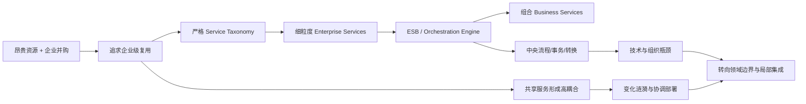
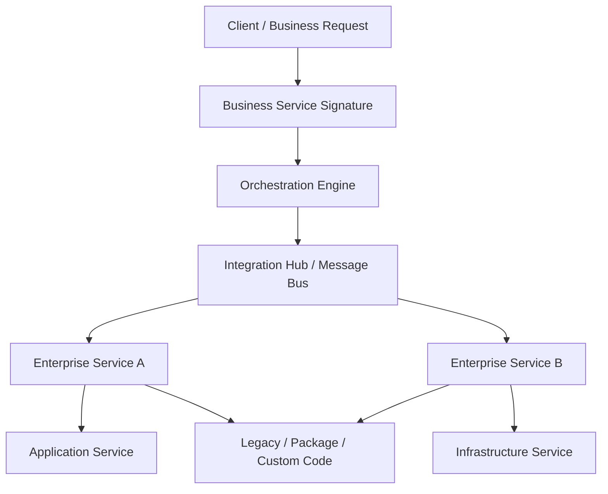
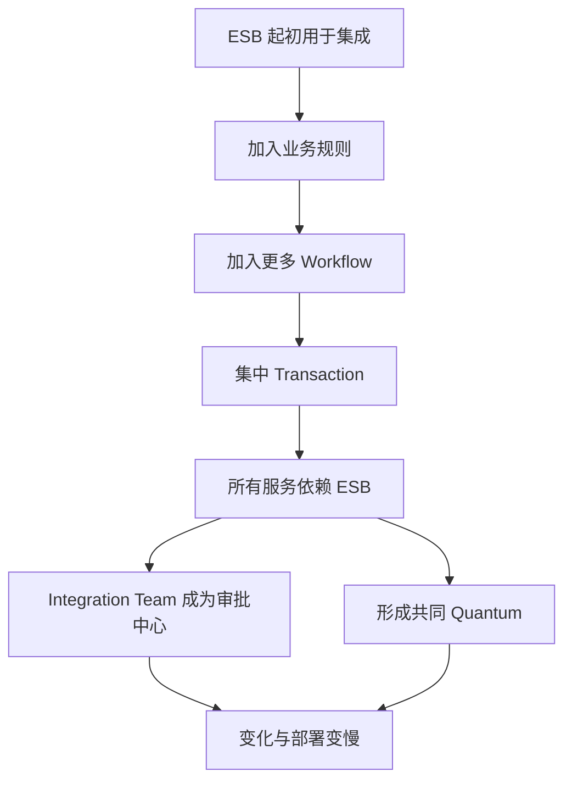

> 对应原书：*Fundamentals of Software Architecture, 2nd Edition*，Chapter 17
>
> 本章主题：为什么一套在 20 世纪 90 年代末看似合理的“企业级复用 + 严格服务分类 + 中央编排”方案，最终因耦合、事务抽象泄漏、技术分区和组织官僚化而失去生命力；以及今天应如何保留 ESB 的集成价值，而不重建 Accidental SOA。

---

## 0. 本章要解决什么问题

本章不是在推荐一种新的主流架构，而是在做架构考古。作者把 architecture styles 比作艺术运动：只有放回其产生时代，设计选择才显得合理；环境改变后，同一选择可能失去相关性。

Orchestration-driven Service-Oriented Architecture（下文简称 orchestration-driven SOA）出现于这样的时代：

- 大量小公司快速扩张、并购，企业内部系统和数据定义互不一致；
- Distributed computing 刚变得可行且必要；
- 操作系统、数据库和 application server 都是昂贵的商业软件；
- License 常按机器、CPU 或连接计费；
- Open source operating systems 尚未被大型企业普遍视为可靠选择；
- 企业希望避免每个部门重复实现 Customer、Order、Quote 等能力。

在这些约束下，“把细粒度企业能力做成一次开发、全公司复用的服务，再由中央引擎组合成业务流程”看起来非常理性。

问题是：软件不是几十年不变的建筑材料。业务市场、组织、技术和工程实践持续变化。为最大复用而建立的共享服务会成为最大共同依赖；为隐藏复杂性而建立的中央编排器会成为最大耦合点；为分离职责而建立的多层 taxonomy 会把一个业务变化磨碎到许多团队和技术层。

### 0.1 本章为什么仍值得读

虽然完整 orchestration-driven SOA 主要具有历史意义，它留下了四类长期有效的教训：

1. **架构选择受时代约束。** 不能脱离当年的成本和工具评价过去的设计。
2. **Reuse is implemented via coupling。** 复用不是免费收益。
3. **某些复杂性无法被配置彻底抽象。** 分布式事务尤其如此。
4. **工具可以局部有价值。** ESB 作为 integration hub 仍然有用，但不应吞掉整个架构。

### 0.2 First Law：第一法则贯穿本章

原书第一法则：

> Everything in software architecture is a trade-off.

Orchestration-driven SOA 的失败，不是因为 reuse、abstraction、transaction coordination 或 integration 本身错误，而是只看见收益，没有持续计算耦合、变化、测试、部署和组织成本。

### 0.3 一句话抓住本章

> 当复用成为最高目标时，共享能力会把所有使用者耦合起来；当编排成为唯一入口时，中央引擎会把分布式系统重新捏成一个更昂贵、更难变化的逻辑单体。

### 0.4 本章推理主线



### 0.5 阅读边界

原章没有提出数学公式。本文中的复用依赖图、变化半径指标、延迟分解和 Python 治理示例是教学扩展，用于解释原章权衡，不是作者给出的行业标准。对于图 17-5 与正文的 architecture quanta 冲突，本文会明确保留两种证据，不静默选择。

---

## 1. Topology：拓扑

### 1.1 核心结构

不是每个 SOA 实现都有完全相同的物理层，但都围绕同一个思想：建立严格 service taxonomy，每一层承担清晰的技术职责。

图 17-1 自上而下包括：

1. **Business services（BS）**：描述业务流程入口；
2. **Enterprise service bus（ESB）**：包含 orchestration engine 与 integration hub；
3. **Enterprise services（ES）**：可复用细粒度企业能力；
4. **Application services（AS）**：应用专属的一次性实现；
5. **Infrastructure services（IS）**：日志、认证等运行能力。

### 1.2 它是分布式架构

各层可能部署在不同进程、服务器或系统中，但图中没有画死物理边界，因为：

- 某些 taxonomy 部分可能共存于 application server；
- 不同组织与工具有不同部署方式；
- Package software、legacy system 和 custom code 都可能成为实现端点。

定义该风格的不是固定机器数量，而是：

- 以技术职责为中心的服务分类；
- 所有业务流程经过中央 orchestration；
- 细粒度 enterprise services 被跨流程复用；
- Integration hub 统一转换协议和契约。

### 1.3 中央编排的数据流



业务流程逻辑不主要位于业务服务代码中，而位于 orchestration engine 对 enterprise services 的组合关系中。

### 1.4 拓扑的承诺与隐患

当时的承诺：

- 业务流程定义与实现分离；
- 一套 enterprise services 可支持多个业务流程；
- Legacy/package/custom systems 可经统一 hub 集成；
- Transaction、protocol、message transformation 集中管理；
- 业务分析人员可更直接定义高层 service signatures。

隐患：

- 所有流程依赖同一中央引擎；
- 一次业务变化跨越多层；
- Shared service 变化影响所有消费者；
- 中央团队成为审批和发布瓶颈；
- 分布式调用很多，却没有独立演化的领域边界。

---

## 2. Style Specifics：风格细节

### 2.1 历史背景如何塑造设计

SOA 在 20 世纪 90 年代末兴起。当时快速并购使企业面临：

- 同一个 Customer 在不同部门有不同字段和规则；
- 同一 workflow 被多个系统重复实现；
- 商业操作系统和数据库 license 随机器数快速增长；
- Database connection pooling 甚至引发 application-server 与 database vendors 的商业博弈；
- 计算资源稀缺，复制一份实现的成本远高于今天。

因此 reuse 不是审美偏好，而是经济约束下的组织战略。作者批评的不是当年架构师“愚蠢”，而是这个逻辑最终走向极端后忽略了变化成本。

### 2.2 Technical Partitioning 为什么走向极端

严格分离职责看似符合单一责任：

- Business analysts 定义 business service；
- Enterprise developers 建共享原子能力；
- Application teams 建局部功能；
- Infrastructure teams 提供横切能力；
- Integration architects 维护 ESB；
- Configuration managers 定义事务。

但是一个业务能力被按技术职责横切到多个层和团队。局部修改必须穿越这些边界。职责分得越纯，交付完整业务价值所需的协调越多。

### 2.3 Why So Many Service Names?：为什么有这么多“服务”

本书至少讨论三种带 service 的风格：

- 本章 orchestration-driven SOA；
- 第 14 章 service-based architecture；
- 第 18 章 microservices。

`service` 是一个过于通用的词。随着生态演化，它不断获得不同含义，发生 **semantic diffusion**。

| 术语 | 典型含义 | 粒度与自治 |
|---|---|---|
| SOA enterprise service | 被中央编排复用的原子企业能力 | 细粒度，但依赖 ESB 和共享事务 |
| Service-based domain service | 可独立部署的粗粒度领域服务 | 域内聚合，通常较少互调 |
| Microservice | 围绕业务能力的独立部署单元 | 自治、独立数据与演化倾向更强 |

同样叫 service，不能据名称推断边界、部署、数据和通信。必须放回架构上下文。

### 2.4 Taxonomy：服务分类体系

驱动哲学是特定形式的 abstraction 和 enterprise-level reuse。企业希望逐步积累可复用资产，最终不再重复开发共同能力。

每层 taxonomy 同时服务两个目标：

- ultimate abstraction；
- maximum reuse。

下面按原章顺序解释各层。

#### 2.4.1 Business services

Business services 位于最上层，是业务流程入口，例如：

- `ExecuteTrade`；
- `PlaceOrder`。

当时常用 litmus test：

> 对该服务能否回答“Yes, we are in the business of ...”？

公司“从事交易执行”或“从事订单处理”，因此粒度合适；`CreateCustomer` 虽是流程中的必要动作，但公司并不以“创建客户”为独立业务目的，因此不属于 business service。

##### 它包含什么

Business service definition 通常没有实现代码，只包含：

- input；
- output；
- 有时包含 schema information。

由 business users 和/或 analysts 定义 service signature，因此称 business service。

##### 它解决什么问题

- 用业务语言暴露企业能力；
- 隐藏下层细粒度实现；
- 给 orchestration engine 提供高层流程入口；
- 让同一高层行为可映射到多种底层系统。

#### 2.4.2 Enterprise services

Enterprise services 包含细粒度、共享实现。开发团队围绕以下内容构建 atomic behavior：

- 业务动作：`CreateCustomer`、`CalculateQuote`；
- Transactional entities：`Customer`、`Order`、`Lineitem`。

它们是 business services 的 building blocks，由 orchestration engine 组合。

##### 与 Business Service 的抽象差异

| Business Service | Enterprise Service |
|---|---|
| 粗粒度业务流程 | 细粒度原子能力 |
| 主要是 signature | 包含共享实现 |
| 业务人员/分析师参与定义 | 开发团队构建 |
| 如 `ExecuteTrade` | 如 `CreateCustomer` |
| 由多个 ES 组成 | 被多个 BS 复用 |

##### 理想目标

架构师希望 enterprise service 是“完美封装、可任意组合”的孤立业务积木。一旦 `CreateCustomer` 建好，所有 workflow 永远复用它。

##### 为什么理想难以实现

抽象 sweet spot 同时受多种力量拉扯：

- 太粗：难以跨流程复用；
- 太细：每个业务流程需大量调用和事务协调；
- 通用字段太多：所有消费者承担无关复杂度；
- 字段太少：无法满足不同领域语义；
- 事务范围固定：无法适应不同 workflow；
- 事务范围可配置：运行时语义难理解和测试。

市场、技术和工程实践不断变化，软件组件不像标准砖块那样几十年稳定。所谓“写一次、永久复用”缺少现实前提。

#### 2.4.3 Application services

并非所有能力都值得 enterprise-level reuse。Application service 是 one-off、single-implementation service。

例如某个应用需要 geolocation，但组织不愿投入时间把它建设为全企业共享能力，于是由单一 application team 拥有。

它承认了一条现实：复用有建设、治理和兼容成本；需求只出现一次时，局部实现更经济。

#### 2.4.4 Infrastructure services

Infrastructure services 提供 operational concerns：

- monitoring；
- logging；
- authentication；
- authorization。

通常是具体实现，由 shared infrastructure team 与 operations 合作维护。

在严格 technical partitioning 哲学中，把横切基础设施也做成独立 service 十分自然；代价是业务请求可能继续增加远程依赖和共同故障点。

#### 2.4.5 Orchestration engine and message bus

Orchestration engine 是该分布式架构的心脏，它负责：

- 把 enterprise services 组合成 business-service implementation；
- 定义 business 与 enterprise services 的映射；
- 决定调用顺序；
- 划定 transaction boundaries；
- Transactional coordination；
- Message transformation；
- 作为 integration hub 接入 custom code、package software 和 legacy systems。

这些能力通常集中在 Enterprise Service Bus（ESB）中，原章也使用复数总称 **enterprise service buses**。

##### ESB 为什么今天仍有价值

作者并不认为 ESB 一无是处。它在 integration-heavy environment 中能有效组合：

- protocol transformation；
- contract transformation；
- routing；
- aggregation；
- orchestration；
- legacy/package integration。

问题不在工具，而在把整个架构都建立在工具中心。需要 integration hub + orchestration engine 时，使用成熟 ESB 比重新造轮子合理。

##### Conway's Law 与政治瓶颈

Message bus 是所有流程中心，负责它的 integration architects 掌握：

- 谁能接入；
- Contract 如何变化；
- Transaction 如何定义；
- Workflow 何时发布。

Conway's Law 预测该团队会成为组织中的政治力量，最终演化为 bureaucratic bottleneck。技术中心化必然带来沟通与决策中心化。

##### Transaction building blocks 为什么失败

管理者希望 enterprise services 成为可组合的 transactional building blocks。现实中同一 entity 参与很多 workflows，每个 workflow 需要不同原子性和失败语义。

少量服务放进 distributed transaction 尚可；服务数量和组合增加后，需要回答：

- 哪些调用必须一起 commit？
- 一个下游失败时撤销哪些已完成动作？
- Legacy system 是否支持相同事务协议？
- 长事务如何锁资源？
- Timeout、网络分区和部分提交如何处理？

编排工具可以声明关系，却不能消除这些业务与分布式系统问题。

#### 2.4.6 Message flow

所有请求，包括内部 calls，都通过 orchestration engine；架构逻辑集中在那里。

图 17-2 的流程：

1. `CreateQuote` business-level service 调用 service bus；
2. Bus 定义 workflow；
3. Workflow 调用 `CreateCustomer` 与 `CalcQuote`/`CalculateQuote`；
4. Enterprise services 再调用 `AddDriver`、`AddVehicle`、`CheckDMV` 等 application services；
5. 下层调用仍回到 bus；
6. 最后调用 `WriteAudit`。

Service bus 同时是 intermediary、integration hub 和 orchestration engine。

##### 延迟与可用性直觉（教学扩展）

若一条 workflow 依次经过 $k$ 个远程步骤，其响应时间可粗略分解为：

$$
T_{workflow}\approx\sum_{i=1}^{k}(L_i+P_i)+T_{orchestration}
$$

$L_i$ 是网络/总线延迟，$P_i$ 是服务处理时间。每个内部 call 都绕过 bus，会增加 hop、序列化和队列开销。

若步骤必须全部成功，粗略 availability 上界在独立假设下为：

$$
A_{workflow}\approx A_{bus}\times\prod_{i=1}^{k}A_i
$$

真实故障并不独立，因此这不是 SLA 公式；它只说明中央 bus 与长调用链都会进入端到端可靠性乘积。

### 2.5 Reuse…and Coupling：复用与耦合

早期 SOA 的主要目标是 service-level reuse。架构师被要求尽可能积极寻找复用机会。

#### 2.5.1 Insurance Customer 案例

一家保险公司有六个 divisions：

- Auto and Homeowners；
- Life；
- Commercial；
- Disability；
- Casualty；
- Travel。

每个部门都有 `Customer` 概念。

SOA 策略是提取一个 canonical `Customer` service，让六个部门共同依赖。

从代码重复率看，目标达成；从变化和领域语义看，代价开始出现。

#### 2.5.2 Reuse 通过 Coupling 实现

复用意味着使用者引用同一实现，因此：

```text
更多消费者
    -> 更多共享依赖
    -> 共享服务变化影响更多团队
    -> 需要兼容分析、整体测试和协调部署
    -> 交付速度下降
```

一次 `Customer` 变化会 ripple 到全部服务。Incremental change 也可能具有巨大 blast radius。

可以用有界教学指标描述共享变化面。设共享服务 $s$ 的直接消费者集合为 $C(s)$：

$$
B(s)=|C(s)|
$$

若还考虑消费者的下游依赖，transitive blast radius 为：

$$
B^+(s)=|Reachable(s)|
$$

数字越大，变化需要评估的范围越广。但它不是自动否定复用：稳定协议、向后兼容和隔离适配层可降低真实风险；一个消费者也可能比十个简单消费者更关键。

#### 2.5.3 Canonical Model 的语义膨胀

Auto insurance 需要 driver's license，它是 person/customer 属性，不是 vehicle 属性。为了一个统一 Customer，canonical service 必须包含驾照信息。

Disability insurance 完全不关心驾照，却必须：

- 理解更大的 schema；
- 处理无关 optional fields；
- 跟随共同 contract version；
- 承担全局 Customer 的变化。

所谓“同一个 Customer”只是语言表面相同，不代表各 bounded contexts 中模型语义相同。

DDD 强调避免 holistic reuse，正是从这类经验中发展而来：

- Auto context 的 Customer 可以包含 driver eligibility；
- Disability context 的 Customer 可以包含 employment/benefit 信息；
- Context 之间通过明确 translation/anti-corruption layer 交流；
- 不强迫全企业共享一个最大模型。

#### 2.5.4 Technical Partitioning 如何摧毁 Change Locality

需求：“给 `CatalogCheckout` 增加一条 address line”。

在 orchestration-driven SOA 中，`CatalogCheckout` 可能被磨碎到：

- Business service signature；
- Orchestration workflow；
- 多个 enterprise services；
- Application services；
- Message transformations；
- Canonical schemas；
- 单一 database schema；
- Infrastructure/audit logic。

如果现有 enterprise service 的 transactional granularity 不合适，只能修改设计或创建一个几乎相同的新 service。最初为复用建立的抽象，反而因变化出现 duplication。

#### 2.5.5 可运行示例：复用依赖影响面

下面用依赖图展示 canonical Customer 变化的直接与传递影响。它是教学模型，不代表原章代码。

```python
from collections import defaultdict, deque

dependencies = {
    "Customer": {
        "AutoHomeowners",
        "Life",
        "Commercial",
        "Disability",
        "Casualty",
        "Travel",
    },
    "AutoHomeowners": {"AutoQuoteWorkflow"},
    "Commercial": {"CommercialQuoteWorkflow"},
}

def reachable_consumers(service: str) -> list[str]:
    seen: set[str] = set()
    queue = deque(dependencies.get(service, set()))
    while queue:
        consumer = queue.popleft()
        if consumer in seen:
            continue
        seen.add(consumer)
        queue.extend(dependencies.get(consumer, set()))
    return sorted(seen)

direct = sorted(dependencies["Customer"])
transitive = reachable_consumers("Customer")
print("direct =", len(direct), ", ".join(direct))
print("transitive =", len(transitive), ", ".join(transitive))
```

输出：

```text
direct = 6 AutoHomeowners, Casualty, Commercial, Disability, Life, Travel
transitive = 8 AutoHomeowners, AutoQuoteWorkflow, Casualty, Commercial, CommercialQuoteWorkflow, Disability, Life, Travel
```

同一实现只写一次，但影响面并没有消失，而是沿依赖图扩大。

---

## 3. Data Topologies：数据拓扑

与本书其他分布式风格相比，本章的数据拓扑不复杂，原因是历史时期的默认做法：通常使用一个或少数几个 relational databases。

### 3.1 为什么数据被视为 Integration Point

当时架构师常把 data 看作“foreign country”：数据是 plumbing 中不可避免的一环，却没有被当成 problem domain 的核心。

结果是：

- 领域模型未围绕数据所有权组织；
- 多服务共享 relational database；
- Transactionality 被移到 message bus/application server；
- Entity 在不同 workflow 中复用；
- Database schema 成为全局耦合点。

这与现代 DDD、database-per-service 和 data mesh 对数据边界的关注形成鲜明对比。

### 3.2 事务为何离开数据库

Message bus 提供 declarative transactional interactions。开发者、架构师或配置人员可独立于数据库声明：

- 哪些 entities 加入事务；
- 哪些 workflow 是 transactional；

- Transaction scope 如何传播。

Application server 再与 database 协作，创建和管理相应事务。

表面收益是业务流程可通过配置调整事务，而不用改实体代码；实际却把运行时语义隐藏在代码之外。

### 3.3 Really? Declarative Transactions?!?：真的用声明式事务？

真的。鼎盛时期的 application servers 允许 configuration managers 改变 individual entities 的 transaction scope。配置通常使用 XML；`EntityBeans`（一种特殊 JavaBean）声明参与 workflow 时的事务行为。

#### 3.3.1 理想机制

```text
Workflow 声明 transaction policy
    -> EntityBean 声明 propagation/scope
    -> Application Server 解释配置
    -> Message Bus 协调调用
    -> Database 创建/提交/回滚事务
```

目标是让 transaction 成为可由基础设施统一处理的横切能力。

#### 3.3.2 失败原因一：运行时事务语义不可见

若开发者不知道 entity 在实际 workflow 中使用何种 transaction behavior，就难以推理：

- 该方法是否在已有事务中？
- 失败会回滚哪些远程动作？
- 锁会持续多久？
- 重试是否安全？
- 同一 entity 在另一 workflow 中是否不同？

为了支持不同 scope，开发者被迫创建几乎相同、只在事务配置上不同的 entity versions。抽象本来想消除重复，最终制造重复。

#### 3.3.3 失败原因二：分布式失败模式穿透抽象

无论 vendor 把 bus 做得多复杂，仍会出现：

- 网络分区；
- Participant timeout；
- 部分 commit；
- Legacy system 不支持协调协议；
- Lock 持有过久；
- Coordinator failure；
- 人工修复的不一致状态。

Transaction 是复杂、多面的系统特性，不能被配置干净地藏起来。Abstraction leaks 太多，最终可靠性不足。

#### 3.3.4 现代启示

声明式本地事务仍然有价值，例如单数据库 `@Transactional`；本章批评的是把跨服务、跨实体、跨遗留系统的分布式事务复杂性误认为可由中央 XML 完全抽象。

---

## 4. Cloud Considerations：云环境考虑

经典 orchestration-driven SOA 比 cloud 早数十年，原始形态没有 cloud-native 设计考量。

今天它的局部能力可用于 cloud/on-prem integration：

- 云服务与本地 legacy systems 需要共同参与 workflow；
- Protocol/contract transformation；
- 聚合 package software 与 custom APIs；
- 中央审计和路由。

作为 integration architecture，它与 cloud services/facilities 可以良好配合。

### 4.1 教学扩展：不要把“可部署到云”当成 Cloud-Native

把 ESB VM 搬到云上不会自动获得：

- 服务自治；
- 独立扩展；
- 故障隔离；
- Domain ownership；
- 无中央瓶颈。

现代集成应限制 ESB 边界、冗余部署、明确 SLO，并避免所有 east-west traffic 都经中央 bus。

---

## 5. Common Risks：常见风险

### 5.1 历史项目风险

当年主要风险：

- Cost 极高；
- Implementation 周期极长；
- Maintenance 困难；
- Update 困难。

很多项目是 multiyear endeavors，关键决策位于组织高层。企业很少称其“失败”，而是逐步把它们收缩为 integration architectures，并建立更接近 DDD 的边界。

### 5.2 Accidental SOA Antipattern

今天使用 ESB 的最大风险是 slippery slope：

1. 最初只做两个系统的 protocol transformation；
2. 接着加入 routing；
3. 再加入 aggregation；
4. 然后把业务条件放进 bus；
5. 最后所有流程、事务和服务调用都依赖 ESB；
6. 团队无意间重建完整 orchestration-driven SOA。

这叫 **Accidental SOA**。

### 5.3 如何避免 Accidental SOA

原章给出两项重点：

- 为 orchestration 建立 reasonable encapsulation boundaries；
- 密切关注 transactional boundaries。

可落地为：

- ESB 只做跨 bounded context/legacy integration；
- 领域规则留在领域服务；
- 不让内部细粒度服务调用都绕经 bus；
- 每个 workflow 有明确 owner；
- 限制 ESB 中可执行脚本和长期状态；
- 新 orchestration 必须解释为何不能由端点自身负责；
- 监控 bus 依赖和变化集中度。

后五项是教学扩展，不是原章逐项清单。

### 5.4 风险的根因关系



---

## 6. Governance：治理

### 6.1 历史治理为何沉重

在 SOA 流行时期，modern holistic testing 尚不常见。Individual parts 很少被自动测试，通常依赖正式 QA-level testing。

原因包括：

- Message bus machinery 庞大；
- Workflow 需要许多服务和环境；
- Transaction behavior 位于配置；
- Framework 对 testability 支持不足；
- Mocks/stubs 笨重且不一致。

当时“governance”通常意味着：

- Heavyweight frameworks；
- Meetings；
- Manual code reviews；
- Architecture boards；
- Ticket approvals。

Automated architectural governance 甚至比自动化测试更陌生。

### 6.2 现代 ESB 的战略用途

很多组织仍有 legacy systems，需要与现代系统交互、聚合结果和组合行为。ESB 擅长：

- Integration；
- Protocol transformation；
- Contract transformation；
- Routing；
- Aggregation；
- Orchestration。

现代治理的目标不是禁止 ESB，而是给它加 guardrails，防止 data 或 bounded contexts 泄漏到不该出现的位置。

### 6.3 ERP + Sales + Accounting 案例

场景：

- ERP package；
- Online sales tool；
- Modern microservices-based `Accounting` services；
- ESB 协调三者。

规则：

- 系统只从 ERP 和 Sales 读取；
- 只向 Accounting microservices 写入；
- ERP/Sales 的 update 若目标不是 Accounting，则违反边界。

原章伪代码：

```java
READ logs for ERP into ERP-logs for past 24 hours
READ logs for Sales into Sales-logs for past 24 hours
FOREACH entry IN ERP-logs
    IF 'operation' is 'update' and 'target' != 'accounting' THEN
        raise fitness function violation
            "Invalid communication between integration points"
    END IF
FOREACH entry IN Sales-logs
    IF 'operation' is 'update' and 'target' != 'accounting' THEN
        raise fitness function violation
            "Invalid communication between integration points"
    END IF
```

第一项 fitness function 必须先保证所有 communication 被一致写入 logs；第二项再读过去 24 小时日志验证方向。

### 6.4 可运行 Fitness Function

下面是原章伪代码的 Python 教学实现。Timestamp 过滤被简化为输入已经是过去 24 小时的日志。

```python
logs = {
    "ERP": [
        {"operation": "read", "target": "sales"},
        {"operation": "update", "target": "accounting"},
    ],
    "Sales": [
        {"operation": "update", "target": "accounting"},
        {"operation": "update", "target": "erp"},
    ],
}

def invalid_updates(entries: dict[str, list[dict[str, str]]]) -> list[str]:
    violations = []
    for source, source_entries in entries.items():
        for entry in source_entries:
            if (
                entry["operation"] == "update"
                and entry["target"] != "accounting"
            ):
                violations.append(
                    f"{source}->{entry['target']}: invalid update"
                )
    return violations

for violation in invalid_updates(logs):
    print(violation)
```

输出：

```text
Sales->erp: invalid update
```

### 6.5 为什么这种 Fitness Function 有效

它把架构意图从会议文档变成可重复检测：

```text
Intent：ERP/Sales 只读，更新只能流向 Accounting
Evidence：标准化 integration logs
Check：扫描 operation 与 target
Result：持续 violation signal
```

前提和局限：

- 所有流量必须确实进入日志；
- Source/target/operation 命名必须标准化；
- 延迟或丢失日志会造成漏报；
- 规则只能验证通信方向，不能证明 payload 正确；
- 需要处理 replay、batch 和管理员操作例外；
- 告警必须连接到责任团队和修复流程。

### 6.6 现代治理建议（教学扩展）

除原章日志规则外，还可持续检查：

1. 有多少 domain workflows 依赖 ESB？
2. ESB 内业务规则数量是否增长？
3. Contract breaking-change rate；
4. Orchestration workflow 的最大 hop count；
5. Bus p95/p99 latency 和 availability；
6. 一个共享 enterprise service 的消费者数量；
7. 跨团队 ticket wait time；
8. 每次业务变化涉及多少 taxonomy layers；
9. 是否出现环形路由或重复 transformation；
10. Integration code 是否有清晰 bounded-context owner。

这些指标用于发现 Accidental SOA 趋势，不能机械设为越小越好。

---

## 7. Team Topology Considerations：团队拓扑考虑

SOA 流行时 team topologies 尚未成为架构主题，原章没有像前几章那样逐类映射四种现代 team topology。

### 7.1 严格 Taxonomy 是 Communication Antipattern

该风格追求极端 responsibility separation，并相应分离人员：

- Business service builders；
- Enterprise service builders；
- Application teams；
- Infrastructure teams；
- Integration architects；
- Database/configuration/QA teams。

构建 business services 的人很少直接与 enterprise services 团队交流。他们被期望通过 contracts 和 interfaces 等 technical artifacts 沟通。

### 7.2 为什么工单不能替代共同理解

一个 feature 穿过多个 integration layers，每层由不同团队实现，并通过 enterprise ticketing tools 传递：

```text
业务需求
    -> Business Service ticket
    -> ESB workflow ticket
    -> Enterprise Service ticket
    -> Application Service ticket
    -> Schema/Transaction ticket
    -> QA integration cycle
```

每次交接损失上下文、增加排队时间，并把反馈推迟到集成测试。架构的技术分层直接塑造了组织沟通结构。

### 7.3 与现代 Team Topologies 的关系（教学扩展）

该历史失败促使现代实践强调：

- Stream-aligned team 端到端拥有业务价值；
- Platform team 提供自助能力而非审批；
- Complicated-subsystem team 隔离真正专业的复杂性；
- Enabling team 临时帮助团队获得能力；
- Team API 减少认知负担，但不取代必要对话。

ESB integration team 更适合作为 platform capability provider，而不是所有业务变化的中央 gatekeeper。

---

## 8. Style Characteristics：架构特征

### 8.1 图 17-5 精确评分

| Architectural characteristic | 图中评分 | 原因 |
|---|---:|---|
| Overall cost | `$$$$` | 商业工具、长期项目、集成和协调成本极高 |
| Partitioning type | Technical | 按 service taxonomy 和技术职责拆分 |
| Number of quanta | 1 to many | 图表如此标示；与紧邻正文存在冲突，见下节 |
| Simplicity | 1 星 | Taxonomy、ESB、分布式事务和多层间接复杂 |
| Modularity | 4 星 | 形式上大量细粒度 services 与清晰接口 |
| Maintainability | 1 星 | 共享服务和流程变化产生巨大涟漪 |
| Testability | 1 星 | 中央 machinery、非本地事务和跨层流程难测 |
| Deployability | 1 星 | 共享依赖导致协调发布 |
| Evolvability | 1 星 | Canonical model 和严格 taxonomy 难适应变化 |
| Responsiveness | 2 星 | 请求穿越大量服务、bus 与转换 |
| Scalability | 4 星 | Vendor 投入大量能力实现扩展 |
| Elasticity | 3 星 | Application-server/session replication 提供一定弹性 |
| Fault tolerance | 3 星 | 分布式冗余可实现，但中央 bus/DB 是共同风险 |

图中没有 Performance 独立行。正文只定性说明 performance 从来不是亮点，笔记不自行添加评分。

### 8.2 Number of Quanta 的原文内部不一致

图 17-5 明确写 **1 to many**，但图前正文明确说 **SOA has a single quantum**，并给出两个原因：

1. 通常共享一个或少数数据库，形成跨 concern 耦合；
2. 更重要的是 orchestration engine 是 giant coupling point，任何部分都无法拥有与 mediator 不同的 characteristics。

本文处理方式：

- 评分表忠实采用图中的 `1 to many`；
- 经典、全局 ESB + 共享数据库实现按正文理解为实际上 **single quantum**；
- 若现代局部化使用多个独立 orchestration boundaries、数据库和集成域，理论上可出现多个 quanta，这可以解释图的范围值，但这是合理化解释，不是原章显式消解冲突。

因此不能静默地把一个值当作另一个值。

### 8.3 最极端的 Technical Partitioning

作者称它或许是“最技术分区的通用架构”。一个 domain change 分散在多个技术层，正是现代 microservices 反弹并转向 domain partitioning 的背景之一。

### 8.4 同时获得 Monolithic 与 Distributed 的缺点

- 像 monolith：中央 orchestration/DB 让整个系统共同变化、共同 characteristics；
- 像 distributed system：仍有网络延迟、部分失败、消息转换、远程事务和昂贵运维。

它没有获得单体的本地简单性，也没有获得现代自治服务的独立演化。

### 8.5 Deployability 与 Testability 为何灾难性

这些目标在该架构产生时还不是大型企业优先项，Agile movement 刚开始，尚未深入采用者。

技术上又存在：

- Shared enterprise services；
- Central workflow；
- Declarative transaction configuration；
- Canonical schemas；
- Many integration endpoints；
- Heavy test environments。

任何变化都需要 holistic testing 和 coordinated deployment。

### 8.6 Scalability 与 Elasticity 为何仍有分数

Vendor 为扩展投入巨大努力，例如跨 application servers 的 session replication。作为分布式架构，它确实能通过昂贵工具扩展。

但扩展能力不等于低成本、简单或响应快。请求被拆到架构许多部分，performance 不是亮点。

### 8.7 Simplicity 与 Cost 的反向关系

理想关系是“付出较高成本换更强能力或更简单运营”；这里却是最高成本与最低 simplicity 并存。

本章作为里程碑的价值，就是让架构师看到：

- Technical partitioning 有实践极限；
- Distributed transaction 很难；
- Reuse 不应压倒 changeability；
- Central governance 可能成为组织瓶颈。

---

## 9. Examples and Use Cases：案例与适用场景

### 9.1 历史完整 SOA

主要出现在 20 世纪 90 年代末和 21 世纪初的大型企业。后来逐步被更 agile、domain-based 的分布式架构（如 microservices）替代。

企业最终承认：

- Change is inevitable；
- Software is not static；
- Market forces 与 new capabilities 会持续改变模型；
- 完美预先设计的 taxonomy 无法覆盖未来。

### 9.2 “幸运日”与“糟糕日”的变化范围

更新某个 entity details：

- 幸运日：只改 enterprise services layer；
- 糟糕日：stakeholders/enterprise architects 没预见这种变化，要改四五层，并在每层做高度耦合修改。

因此开发者害怕听到 “change”：每个需求都要先深度分析，scope 高度不确定。

### 9.3 现代合理用途：Integration Architecture

今天仍可使用 orchestration-driven SOA building blocks，特别是 ESB：

- Integration hub 处理 communication、protocol、contract transformation；
- Orchestration engine 构建 integration endpoints 之间的 workflow；
- Enterprise services 作为 package software、bespoke code、legacy system 的 integration points。

图 17-6 中：

1. Client requests 进入 ESB；
2. Business services 定义入口；
3. Bus 决定调用哪些 enterprise services、顺序和聚合；
4. Enterprise services 通过 API layer 接入大量 service components、mainframe 或 package/custom code；
5. 多层 abstraction 允许替换底层实现。

### 9.4 为什么这种局部使用合理

Integration 是 ESB 真正擅长的复杂问题：

- 协议不同；
- Contract 不同；
- Legacy 不可修改；
- 需要聚合多个结果；
- 需要少量跨系统 workflow。

将它限制在系统边界，可以获得 transformation/orchestration 收益，同时避免把领域内部所有调用都集中化。

### 9.5 适用场景

- 大量 legacy/package/cloud systems 必须集成；
- 端点协议和 contract 差异大；
- 无法直接修改旧系统；
- 需要集中审计、转换和有限 workflow；
- Integration boundary 清晰；
- ESB 团队能提供自助能力而非人工审批；
- Business rules 仍留在领域端点。

### 9.6 不适用场景

- 新建 general-purpose business system；
- 需要快速独立部署和频繁变化；
- 希望按 bounded context 自治；
- 业务流程不需要复杂 legacy integration；
- 团队追求 continuous delivery；
- 所有内部服务都计划经中央 bus；
- 想用 distributed transaction 隐藏领域一致性问题。

### 9.7 从历史方法中保留什么

应保留：

- Integration hub；
- Protocol/contract transformation；
- 对 legacy/package software 的适配；
- 有边界的 orchestration；
- 标准化 logging 和 guardrails。

应避免：

- 全局 canonical domain model；
- 所有内部调用绕经 ESB；
- Enterprise-wide fine-grained reuse；
- 中央团队审批每次业务变化；
- 用配置假装分布式事务不复杂；
- 把技术 taxonomy 当成业务边界。

---

## 10. 易混淆概念与常见误区

### 10.1 SOA 就是所有“服务架构”的总称

错误。本章 SOA 指特定历史风格：严格 taxonomy、enterprise services、中央 ESB 和 orchestration。它与 service-based、microservices 不同。

### 10.2 Enterprise Service 就是 Microservice

错误。Enterprise service 倾向细粒度共享原子能力，由中央引擎组合；microservice 倾向围绕业务能力自治，避免全局编排和共享数据模型。

### 10.3 Business Service 含有完整业务实现

经典 SOA 中通常只有 input/output/schema signature，具体实现由 orchestration engine 组合 enterprise services。

### 10.4 Service 越细，复用越高，架构越好

错误。粒度越细，workflow hop、transaction coordination 和变化组合越复杂。可复用性只是一个特征，不是总目标。

### 10.5 Reuse 会降低 Coupling

错误。复用通过依赖同一实现发生，因此会增加 coupling。它可能减少代码重复，却扩大变化影响。

### 10.6 Canonical Customer 消除了不一致

它统一结构，却把不同 bounded contexts 的语义强行合并，产生最大模型、无关字段和全局变化。

### 10.7 ESB 是失败技术，今天不应使用

错误。ESB 作为 integration hub 很有价值。失败的是围绕全局 ESB 构建整个 business architecture。

### 10.8 Orchestration 等于任何 Workflow

这里的 orchestration 是中央 engine 指定细粒度 services 的调用顺序、转换和 transaction boundaries。领域内部普通函数编排不自动构成本章 SOA。

### 10.9 声明式事务一定不好

错误。本地数据库的声明式事务可以很好用。问题是试图用配置完全抽象跨服务、跨遗留系统的分布式失败。

### 10.10 Application Service 是低质量 Enterprise Service

不是。它是有意的一次性局部实现，避免为不存在的复用需求提前支付企业级治理成本。

### 10.11 Technical Partitioning 就是职责清晰，所以总是好

职责可以清晰，但业务变化被分散到多层和团队。局部纯度可能牺牲交付整体价值的流动效率。

### 10.12 所有调用经过 Bus 可获得统一治理

能统一观察，也形成 giant coupling point、单点和审批瓶颈。治理收益必须与自治和故障范围权衡。

### 10.13 分布式架构就一定有多个 Quanta

错误。同步共同依赖决定 quantum。全局 ESB 与共享数据库会把分布式组件耦合成单一量子。

### 10.14 图 17-5 与正文的 Quanta 说法完全一致

不一致。图写 `1 to many`，正文写 single quantum。阅读时必须保留冲突并说明典型形态。

### 10.15 高 Scalability 表示架构整体优秀

错误。该风格 scalability 4 星，但 maintainability、testability、deployability、evolvability 都只有 1 星，且成本最高档。

### 10.16 工单与 Contract 可以替代团队沟通

错误。Artifact 能明确接口，不能自动建立共同领域理解；多层 ticket handoff 会增加等待和误解。

### 10.17 Accidental SOA 只会发生在老系统

错误。现代 API Gateway、integration platform 或 workflow engine 也可能逐步吸收业务逻辑，形成同样中心化结构。

---

## 11. 一般化的问题解决方法

本节是对本章历史教训的教学性归纳，不是原章给出的正式算法。

### 第 1 步：先还原时代与约束

评价架构前问：当时计算、license、网络、组织和工具的成本是什么？避免用今天的条件事后嘲笑历史方案。

### 第 2 步：列出目标之外的代价

选择 reuse 时同时列 coupling；选择 orchestration 时同时列 central dependency；选择 abstraction 时同时列 leak；选择 technical separation 时同时列 team handoffs。

### 第 3 步：区分 Domain Capability 与 Integration Capability

领域规则由 bounded context 拥有；ESB 负责跨系统转换、路由和有限组合。不要让 integration layer 成为 domain model。

### 第 4 步：按变化方向设计边界

经常共同变化的内容应靠近；只是名称相同但语义不同的 Customer 不应强制合并。

### 第 5 步：对 Reuse 做全生命周期评估

```text
收益：少写一次实现
成本：通用化设计 + Contract 治理 + Consumer 兼容
      + 变化涟漪 + 协调部署 + 组织等待
```

只有重复稳定、语义一致且消费者愿意共同演化时，企业级共享才值得。

### 第 6 步：承认复杂特性的不可消除性

Transaction、consistency 和 partial failure 只能被管理，不能靠 XML 或工具完全隐藏。Architecture decision 应显式记录失败语义。

### 第 7 步：给中央工具设置边界与退出条件

明确 ESB 能做什么、不能做什么；监控依赖增长；当业务逻辑进入 bus 或内部调用大量绕行时，触发架构评审。

### 第 8 步：把治理变成可执行证据

标准日志、fitness functions、contract tests 和依赖图比纯会议更早发现 boundary leakage。

### 第 9 步：让组织边界支持业务流

减少按技术层逐级工单交接，让 stream/domain teams 端到端交付；平台团队提供自助集成能力。

### 第 10 步：保留有效零件，不复制失败整体

历史架构不是全对或全错。保留 integration hub、transformation 和 legacy adaptation；放弃全局 taxonomy、canonical model 与中央业务编排。

---

## 12. 本章知识结构

```mermaid
flowchart TB
    SOA[Orchestration-Driven SOA]
    SOA --> ERA[Historical Constraints]
    SOA --> TAX[Service Taxonomy]
    SOA --> BUS[ESB / Orchestration]
    SOA --> REUSE[Enterprise Reuse]
    SOA --> TX[Declarative Transactions]
    SOA --> ORG[Organization]
    SOA --> MODERN[Modern Integration Use]

    ERA --> COST[昂贵 OS/DB/App Server]
    ERA --> MERGE[并购与不一致系统]

    TAX --> BS[Business Services]
    TAX --> ES[Enterprise Services]
    TAX --> AS[Application Services]
    TAX --> IS[Infrastructure Services]

    BUS --> FLOW[Central Message Flow]
    BUS --> HUB[Integration Hub]
    BUS --> GIANT[Giant Coupling Point]

    REUSE --> CANON[Canonical Customer]
    REUSE --> COUP[Reuse via Coupling]
    CANON --> DDD[DDD / Bounded Context 反思]

    TX --> XML[EntityBeans / XML Scope]
    TX --> LEAK[Distributed Failure Leaks]

    ORG --> TEAM[Integration Architects]
    TEAM --> BUREAU[Bureaucratic Bottleneck]

    MODERN --> GUARD[Fitness Function Guardrails]
    MODERN --> ACC[防止 Accidental SOA]
```



---

## 13. 核心结论

1. **Orchestration-driven SOA 必须放回历史环境理解。** 昂贵资源、并购和重复系统使 enterprise reuse 当时很有吸引力。
2. **该风格以严格 service taxonomy 为核心。** Business、enterprise、application、infrastructure services 各有不同职责。
3. **Business service 是高层业务 signature，enterprise service 是细粒度共享实现。** 二者不是同一种粒度。
4. **ESB 同时承担 orchestration engine 与 integration hub。** 它定义流程、转换、聚合和 transaction boundaries。
5. **Reuse is implemented via coupling。** 共享实现减少重复，却扩大 contract、测试、部署和组织协调范围。
6. **Canonical enterprise model 会吞并不同 bounded contexts 的语义差异。** DDD 避免 holistic reuse 正是对此类经验的回应。
7. **极端 technical partitioning 破坏 change locality。** 一个领域变化可能跨越四五层和多个团队。
8. **分布式事务无法被配置完全抽象。** 运行时 scope 不可见和 partial failure 会穿透 XML/EntityBeans 抽象。
9. **中央 bus 是技术与组织的 giant coupling point。** Conway's Law 使 integration team 容易成为 bureaucratic bottleneck。
10. **完整 SOA 同时承担单体与分布式架构的缺点。** 中央共同耦合加上网络、事务和运维复杂度。
11. **评分体现这一代价。** Cost `$$$$`，Simplicity、Maintainability、Testability、Deployability、Evolvability 均 1 星。
12. **图 17-5 与正文的 quanta 结论冲突。** 图为 `1 to many`，正文称典型架构 single quantum；不能静默合并。
13. **ESB 本身仍有价值。** 它适合有边界的 legacy/package/cloud integration、协议和契约转换。
14. **Accidental SOA 是现代主要风险。** 局部 ESB 若不断吸收业务规则，最终会重建全局中央架构。
15. **现代治理应自动验证集成边界。** 日志和 fitness functions 能防止不允许的数据/写操作泄漏。
16. **架构历史的正确学习方式是保留有效零件、内化失败原因。** 不因 hype 全盘采用，也不因反弹全盘丢弃。

最终可以把本章压缩为一句架构判断：

> 复用、抽象和中央编排只有在边界明确且变化成本可控时才是资产；一旦它们凌驾于领域自治和交付流之上，就会从“消除重复”变成“集中耦合”。
