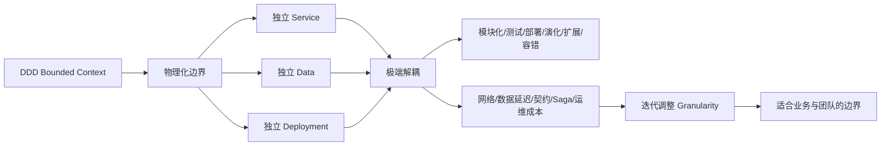
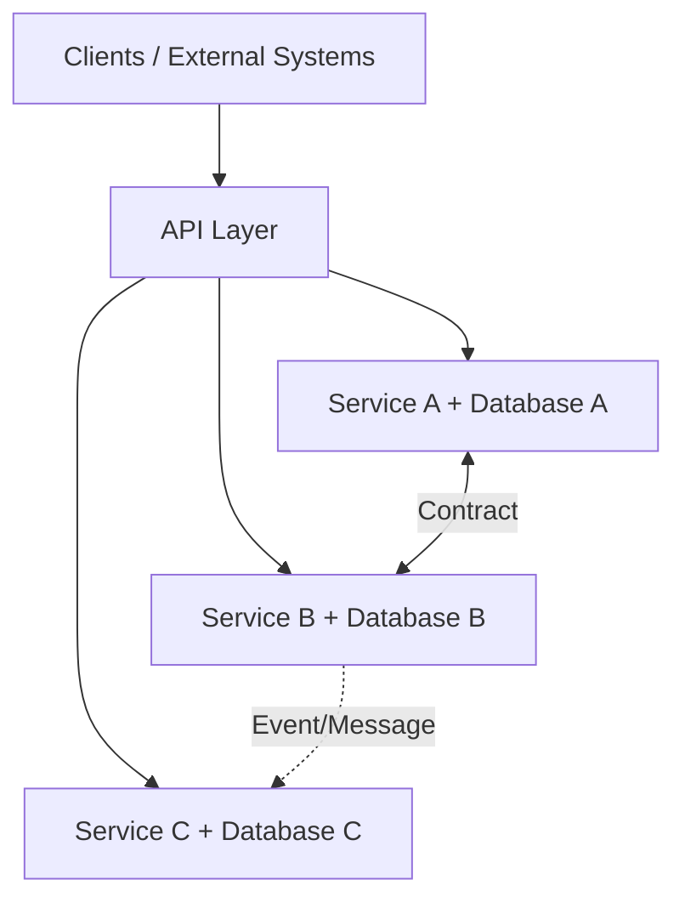

> 对应原书：*Fundamentals of Software Architecture, 2nd Edition*，Chapter 18
>
> 本章主题：如何把 DDD 的 bounded context 物理化为可独立部署、独立拥有数据的服务，以极端解耦换取模块化、可测试性、可部署性、演化性、扩展性和故障隔离；以及如何处理由此产生的粒度、网络、数据、事务与治理复杂度。

---

## 0. 本章要解决什么问题

Microservices 是近年最流行的架构风格之一。多数架构风格先在实践中反复出现，后来才被命名；microservices 比较特殊，它在使用早期就获得了明确名称。Martin Fowler 和 James Lewis 在 2014 年的著名文章中归纳并普及了它的特征，也反过来塑造了架构定义。

Microservices 要解决的核心问题不是“把应用切得更小”，而是：

- 如何让不同业务能力独立变化和部署？
- 如何让团队端到端拥有一个业务子域？
- 如何避免共享代码、共享数据库和共享运行时造成共同变化？
- 如何只扩展真正的热点能力？
- 如何让一个服务故障不拖垮整个应用？
- 如何用小而独立的部署单元支持持续交付和演进式架构？

它选择把 Domain-Driven Design（DDD）的 **bounded context** 从逻辑设计原则变成物理边界：

```text
一个有界上下文
    = 服务代码
    + 服务内部模块
    + 数据模型/Schema
    + 数据库或数据存储
    + 运行依赖
    + 独立部署与所有权
```

边界内部可以紧密协作；边界外部只能通过显式 contract 通信，不能直接共享类或数据结构。因为这种哲学，microservices 有时被称为 **share nothing architecture**。

### 0.1 First Law：复用也是权衡

传统单体常让多个模块共享 `Address`、`Customer` 等类和关联数据库。共享减少重复，却通过 inheritance、composition 或共同数据结构增加 coupling。

如果目标是高度解耦，microservices 会在 bounded contexts 之间优先选择 **duplication over reuse**：

- 两个上下文可以各自定义适合自己的 `Address`；
- 字段和验证规则不必完全一致；
- 一方变化不迫使另一方升级；
- 翻译发生在契约边界，而不是共享内部模型。

这不是说复制永远更好，而是承认 First Law：复用节省实现，却增加共同演化；复制增加局部代码，却保护自治。

### 0.2 一句话抓住本章

> Microservices 的“微”不是尺寸命令，而是把一个有内聚业务目的的 bounded context 做成独立部署、独立数据、独立演化的物理单元。

### 0.3 本章推理主线



### 0.4 阅读边界

原章没有提出统一数学公式或实现算法。本文中的边界评分、调用放大、Saga Python 状态机、依赖治理示例和迁移流程都是教学扩展，用于解释原章权衡，不是作者规定的行业标准。

---

## 1. Topology：拓扑

### 1.1 基本形态

Microservices 是 distributed architecture style。每个 service：

- 运行在独立 process；
- 部署于 virtual machine、container 或其他隔离环境；
- 围绕 single purpose / subdomain；
- 包含独立运行所需的代码、database 和 dependent components；
- 可有多个实例独立扩展；
- 经 API layer 对外暴露；
- 通过 network、message 或 event 与其他服务协作。

相较 orchestration-driven SOA、event-driven architecture 和 service-based architecture，microservices 通常更细粒度，但“更细”必须来自自然业务边界，不是追求最小代码量。

### 1.2 独立进程解决什么问题

传统 application server 在一个 multitenant runtime 中托管多个应用，复用：

- network bandwidth；
- memory；
- disk space；
- connection pools；
- runtime 与运维工具。

随着所有应用增长，共享资源最终会受限；更危险的是隔离不完整，一个应用的内存泄漏、线程耗尽或升级可能影响其他应用。

每服务独立进程带来：

- Resource isolation；
- Fault isolation；
- Independent scaling；
- Independent runtime/version；
- 独立发布和回滚。

它之所以在现代可行，依赖免费 open source operating systems、automated machine provisioning、cloud resources 和 container technology。相同想法在昂贵按机器授权的时代会不切实际。

### 1.3 API Layer 的拓扑位置

Clients 通常不直接记住所有实例地址，而通过 API layer/API Gateway：



API layer 负责 routing 和 operational cross-cutting concerns，不应成为集中业务 mediator。后文会详细辨析。

### 1.4 分布式代价：Performance

Method call 通常是进程内跳转；service call 需要：

- Serialization/deserialization；
- Network hop；
- TLS 与 identity verification；
- Routing/service discovery；
- Timeout/retry；
- 下游数据库访问。

因此 distributed nature 常使 performance 成为弱点。每个 endpoint 都要做 security checks，也增加 processing time。

若一条同步链串行经过 $n$ 个 services，可用教学性分解理解响应时间：

$$
T_{request}\approx\sum_{i=1}^{n}(L_i+P_i+D_i)+T_{gateway}
$$

- $L_i$：网络和协议延迟；
- $P_i$：服务处理时间；
- $D_i$：该服务数据访问时间。

这不是预测公式，因为调用可并行、缓存、失败重试；它说明把一个本地流程切成更多远程步骤通常增加延迟项。

### 1.5 为什么不建议跨服务 Transaction

每个服务和数据库是独立边界，跨服务 transaction 会把：

- Availability；
- Latency；
- Deployment；
- Failure handling；
- Data consistency

重新绑定在一起，违背 decoupling 目标。服务 granularity 因而是 microservices 成败的关键：经常必须共同提交的行为，通常应该位于同一 boundary。

---

## 2. Style Specifics：风格细节

### 2.1 Bounded Context：有界上下文

Bounded context 是 microservices 的 driving philosophy。每个 service 模型化一个：

- Function；
- Subdomain；
- Workflow。

Context 内包含执行该功能的一切：

- Logical components/classes；
- Database schemas；
- 对应 database；
- Rules 与 behavior；
- 必要 dependencies。

### 2.1.1 内聚与解耦的方向

边界内的 code 与 schema 可以耦合，共同实现业务；边界外不能直接依赖另一个 context 的 database 或 class definition。

这不是追求“零耦合”，而是把 coupling 放在正确位置：

```text
Context 内：高内聚，可共同演化
Context 间：低耦合，只依赖显式契约
```

### 2.1.2 CatalogCheckout 示例

一个 `CatalogCheckout` domain 可能包含 catalog items、customers、payment。单体会共享这些概念的 classes 和 linked databases；bounded context 只定义 checkout 所需语义，不为其他上下文容纳额外字段。

例如：

```text
Checkout Address：配送地址、可送达性、收件说明
Billing Address：账单地址、税务辖区、持卡人验证
```

名称相同不代表模型应共享。各 context 可以复制简单 value object，并通过 API/event translation 交换必要数据。

### 2.1.3 物理体现 DDD

Microservices 把 domain partitioning 推到极致：logical bounded context 对应 physical deployable unit。这样：

- 业务边界；
- Code ownership；
- Data ownership；
- Deployment boundary；
- Team boundary

尽量重合。

但“一服务一个 bounded context”不是机械定律。后文允许少量 services + shared database 形成 broader bounded context；关键是边界内部共同演化、外部不越权。

### 2.2 Granularity：粒度

Architects 常把 `micro` 当作命令，把 services 做得太小。随后为了完成有意义的工作，又建立大量通信链接，最终形成 **Big Ball of Distributed Mud**。

> The term microservice is a label, not a description.

`microservices` 当初用于对比约 2007 年占主导的巨大 SOA services，不表示每个服务必须只有几十行代码。

### 2.2.1 Purpose：目的边界

最直接的边界来自 problem domain。每个 microservice 应 functionally cohesive，为整体应用贡献一个 significant behavior。

好问题：

- 它能用一句业务语言描述吗？
- 它拥有清晰业务 outcome 吗？
- 大部分变化是否围绕同一目的？
- 团队能否独立理解和拥有？

坏信号：服务只对应一个 getter、一张表或一个技术 helper。

### 2.2.2 Transactions：事务边界

Business workflow 中需要共同参与 transaction 的 entities，往往提示自然 service boundary。

推理：

1. Distributed transactions 困难；
2. 经常共同满足同一 invariant 的数据应靠近；
3. 把它们放入同一 context 可用本地 ACID；
4. 因而从避免跨服务 transaction 反推边界。

例如 order line、order total 与 order status 若每次都必须原子更新，通常属于同一 Order context，而不是三个 microservices。

### 2.2.3 Choreography：通信反馈

一组 services 在领域上彼此隔离，但若每次工作都要 extensively communicate，应考虑重新合并。

过细信号：

- 请求平均跨越很多 services；
- 两个 services 总是同时变化；
- 一个 service 没有另一个就无法完成任何工作；
- 大量同步 request-reply；
- 多数 transaction 都需要 Saga；
- Contract changes 总是成组发生。

### 2.2.4 Iteration 是唯一可靠方法

Architects 很少第一次就找对 granularity、data dependencies 和 communication style。边界必须随理解迭代：

```text
候选领域边界
    -> 画 data ownership 与 workflow
    -> 识别 transaction/invariant
    -> 估算通信与变化
    -> 实现/观测
    -> 合并过细服务或拆分热点
    -> 再验证
```

服务边界不是一次性组织图，而是可演化设计。

### 2.2.5 有界粒度评估（教学扩展）

可用多维信号而非单一行数判断：

| 信号 | 太细时表现 | 太粗时表现 |
|---|---|---|
| Change coupling | 多服务共同变化 | 无关功能同服务发布 |
| Runtime calls | 高频同步互调 | 进程内耦合复杂 |
| Transactions | Saga 成为常态 | 本地事务过大 |
| Scaling | 总要一起扩 | 热点无法单独扩 |
| Team ownership | 多团队协作一个小流程 | 一个团队认知负担过高 |
| Failure blast radius | 链式失败 | 单服务故障影响整个大域 |

这些信号没有通用权重；它们用于引发边界讨论，不用于自动生成服务。

### 2.3 Data Isolation：数据隔离

Microservices 试图避免所有 coupling，包括把 shared schemas/databases 当 integration points。

### 2.3.1 不要落入 Entity Trap

一张表一个服务看似自然，却通常只产生贫血 CRUD services。Service 应围绕 behavior/workflow/invariant，而不是数据库 entity。

例如 `CustomerNameService`、`CustomerAddressService`、`CustomerPhoneService` 若每个业务请求都需组合，说明按列或实体碎片化，而不是按 domain 划分。

### 2.3.2 Single Source of Truth 的重新定义

Relational monolith 常通过一个数据库统一全系统值。数据分散后，architect 必须选择：

1. 指定一个 domain 为某事实的 authoritative source，其他服务通过 contract 获取；
2. 通过 database replication、events 或 caching 分发副本。

“多个副本”不等于“多个权威”。应明确：

- 谁拥有写入；
- 哪个版本是权威；
- 副本延迟多久；
- 冲突如何处理；
- 删除和更正如何传播。

### 2.3.3 Polyglot Persistence 的机会

Data isolation 允许每个 team 根据以下因素选数据库：

- Budget；
- Storage structure type；
- Operational characteristics；
- Process characteristics；
- Query model；
- Consistency requirements。

一个服务可用 relational DB，另一个用 document、key-value 或 time-series store。团队也可在不影响其他 context 的前提下更换技术，因为其他服务不能耦合其 implementation details。

代价是数据库产品、备份、监控和运维认知增加。Polyglot 是自治能力，不是要求每队故意选不同数据库。

### 2.4 API Layer：API 层

多数 microservices 在 consumers 与 services 之间使用 API Gateway。它可以是：

- Simple reverse proxy；
- 包含 security、naming/service discovery、monitoring、logging 的 gateway。

### 2.4.1 应做什么

- Request routing；
- Authentication/authorization enforcement；
- TLS termination；
- Rate limiting；
- Monitoring/logging/correlation；
- Service discovery integration；
- 必要的 protocol adaptation。

### 2.4.2 不应做什么

原章明确：不要把 API layer 当 mediator/orchestrator，不要放 business-related logic。

原因：

- Business logic 应位于 bounded context；
- 中央 mediator 是 technically partitioned architecture 的特征；
- Gateway 中的业务规则会成为所有 domain 的共同变化点；
- Domain teams 失去自治；
- Gateway 可能演化成新单体。

判断边界：JWT 验证是 operational concern；“VIP 客户可跳过库存检查”是 domain rule。

### 2.5 Operational Reuse：运行复用

Microservices 偏好 duplication over domain coupling，但 monitoring、logging、circuit breakers 等 operational concerns 确实受益于一致复用。

它把复用分成两类：

```text
Domain reuse：谨慎，优先 context 自治
Operational reuse：集中标准和能力，但不共享领域模型
```

### 2.5.1 Sidecar Pattern

每个 service 旁边运行 Sidecar，承载：

- Circuit breaker；
- Logging；
- Monitoring；
- 其他 cross-cutting operational concerns。

Sidecar 可由 service team 或 shared infrastructure team 拥有。升级监控工具时，基础设施团队更新 sidecar，各 microservices 获得一致能力，而不把业务代码合并进共享库。

### 2.5.2 Service Plane

各 sidecars 通过一致接口连接到 **service plane**。原章以 Istio 为例，service plane 是连接 sidecars 的 integration software。

### 2.5.3 Service Mesh

每个 service 是 mesh node。Service mesh 提供 holistic operational view，让团队统一控制：

- Monitoring levels；
- Logging；
- Traffic policies；
- Circuit breaking；
- Mutual TLS；
- Telemetry。

后四项是常见现代扩展，不是原图逐项列举。Mesh 统一 operational coupling，不应承载 domain workflow。

### 2.5.4 Service Discovery 与 Elasticity

Service discovery 自动检测和定位 network 中的 services。请求不再调用固定地址，而通过 discovery 找到健康实例。

原章进一步把 discovery 与监控请求频率、启动新实例联系起来。实践中 discovery 通常负责定位，autoscaler/orchestrator 根据 metrics 扩缩；两者协作实现 elasticity。

Service discovery 常被纳入 service mesh，也可由 API layer 提供统一入口，使 UI/外部系统以一致方式找到弹性实例。

### 2.6 Frontends：前端

Microservices 的原始愿景也希望 UI 属于 bounded context，但 Web 应用分区和外部约束使这一目标困难，常见两种形态。

### 2.6.1 Monolithic Frontend

Single UI 经 API layer 调用多个 services，可为 rich desktop、mobile 或 JavaScript Web app。

优点：

- 统一用户体验和技术栈；
- 跨领域页面组合直接；
- 部署与导航简单。

代价：

- UI 仍是共同发布/故障边界；
- 前端团队可能成为集中瓶颈；
- Backend contexts 独立，UI 却未完全自治。

### 2.6.2 Micro-Frontends

UI 由 components 组成，并与相应 backend services 形成关系，把 granularity 和 isolation 延伸到前端。

收益：

- Domain team 可端到端拥有 UI + API + service + data；
- 独立发布；
- 前后端边界对齐。

代价：

- Shared design system、navigation、authentication 和 runtime integration 更复杂；
- 页面加载性能与版本组合需治理；
- 组件仍可能同步依赖多个 contexts。

Micro-frontend 是可选 UI pattern，不是 microservices 定义条件。

### 2.7 Communication：通信

Granularity 同时影响 data isolation 与 communication。边界越细，独立性越强，也越需要网络协作。

Architect 首先选择 synchronous 或 asynchronous：

- Synchronous：sender 等 response；
- Asynchronous：通过 event/message 解开时间依赖。

### 2.7.1 Protocol-Aware Heterogeneous Interoperability

原章用这个复合短语概括 microservices 通信。

#### Protocol-Aware

没有中央 integration hub，每个 service 必须知道或发现如何调用其他 service。组织常标准化一部分协议，如 REST、message queues 等。

Protocol standardization 降低认知成本，但不能偷偷引入共享内部模型。

#### Heterogeneous

每个 service 可用不同 technology stack，支持 polyglot environment。

#### Interoperability

Services 通过 network 协作和交换信息。虽然 architects 尽量避免 transactional method calls，service-to-service calls 仍然常见。

### 2.7.2 同步与异步的权衡

| 维度 | Synchronous | Asynchronous |
|---|---|---|
| 结果 | 立即获得 | 后续获得/不需要 |
| 流程理解 | 直观 | 事件链更复杂 |
| 时间耦合 | 高 | 低 |
| 故障 | 立即传播 | 可缓冲、重试 |
| 一致性 | 容易表达即时结果 | 常为 eventual consistency |
| 调试 | 调用栈清晰 | 需 correlation/trace |

选择由业务语义决定，不是“microservices 必须异步”。查询和即时验证常同步；状态传播和旁路处理常异步。

#### 2.7.3 Enforced Heterogeneity

原章案例中，一位早期 microservices pioneer 为移动个人信息管理产品制定规则：每个 development team 必须使用不同 technology stack。

目的不是制造复杂生态，而是物理阻止 accidental class sharing：Java team 与 .NET team 无法直接共享 classes，边界只能经 contracts。

它与传统 enterprise governance 的“统一技术栈”完全相反，表达的原则是：

- 为狭窄问题选择合适技术；
- 小服务不必被迫使用 industrial-strength relational database；
- Decoupling 允许团队独立演进。

但这是极端示例，不是普遍建议。故意每服务不同栈会增加招聘、安全补丁、可观测性和平台成本。今天更实用的做法是“有限、受支持的 paved-road choices”，用架构测试禁止越界共享。

### 2.8 Choreography and Orchestration：协同与编排

### 2.8.1 Choreography

Choreography 使用类似 EDA 的通信风格，没有中央 coordinator。每个 service 按需调用或响应其他 services，尊重 bounded context。

`CustomerWishList` 缺少 demographics 时直接调用 `CustomerDemographics`，再把结果返回用户。

优点：

- 无全局 mediator；
- 保持分散自治；
- 不引入中央瓶颈。

代价：

- Workflow ownership 分散；
- Error handling 与 coordination 复杂；
- 调用关系可能变成网状；
- End-to-end state 难观察。

### 2.8.2 Localized Orchestration Service

Microservices 没有 global mediator，但复杂流程可建立自己的 localized mediator，即 **orchestration service**。

用户调用 `ReportCustomerInformation`，它协调所需 services 获取信息。

关键区别：

```text
SOA：全企业中央 orchestration engine
Microservices：某个 domain workflow 的局部 orchestrator
```

### 2.8.3 Complex Choreography 与 Front Controller

复杂下单流程中，第一个 `Order placement` service 必须协调 Payment、Inventory 等大量 services，同时承担领域职责与 mediator 角色。这叫 **Front Controller pattern**。

问题：

- 一个 service 承担多个职责；
- Change/failure blast radius 变大；
- Workflow logic 隐藏在 nominal domain service 中；
- 其他 services 依赖其协调能力。

### 2.8.4 Complex Orchestration

建立专用 `Place order` workflow owner，集中协调 Order Placement、Inventory、Payment。它明确引入 coupling，却把 coordination 收敛到一个 service，使参与者不必各自理解全流程。

领域 workflow 往往天然耦合。Architect 的任务不是消灭 coupling，而是选择最支持 domain 与 architecture goals 的表示方式。

### 2.8.5 选择依据

| 维度 | Choreography | Local Orchestration |
|---|---|---|
| Coordinator | 无 | 有 workflow owner |
| 自治 | 更高 | 参与者受流程契约约束 |
| 流程可见性 | 分散 | 集中 |
| 错误/补偿 | 难 | 较易统一 |
| 单点/瓶颈 | 少 | Orchestrator 需扩展和容错 |
| 简单流程 | 合适 | 可能过度 |
| 复杂流程 | 易成 Front Controller/网状 | 更清晰 |

First Law 说明两者都不完美。可对每个 workflow 单独选择，不必全系统统一。

### 2.9 Transactions and Sagas：事务与 Saga

### 2.9.1 首选答案：不要跨服务事务

跨 service transaction：

- 违反 decoupling；
- 形成强 dynamic connascence；
- 原章称其为最坏类型的 **Connascence of Values**；
- 将多个 deployments/databases 的成功值绑定；
- 增加 network coordination。

原章最强建议是：**先修正 granularity。** 若 microservices 必须靠 transaction 才能连起来，通常说明 services 太细。

### 2.9.2 例外何时存在

两个 services 可能需要截然不同的 architecture characteristics，必须保持独立边界，但少数业务操作仍需 transactional coordination。经过权衡后可采用 transactional patterns。

重点是“少数例外”。若跨服务 transaction 是 dominant feature，microservices 很可能不是正确选择。

### 2.9.3 Saga Pattern

Saga 名称来自描述长事件序列的史诗故事。它把全局 transaction 分解为多个 service-local operations，由 mediator 记录 success/failure 并协调结果。

Happy path：

1. Mediator 调用 Customer Profile；
2. 成功后调用 Credit Card Wallet；
3. 每个 service 更新自己的 database；
4. 全部成功后报告 customer registration 成功。

原章说 happy path 中各 values 被更新并协调成功。这里不应误解为一个跨数据库 ACID commit：每步仍是独立 local transaction，协调器只保证流程协议。

Failure path：若前一部分成功、后一部分失败，mediator 要求已成功 participants 执行 undo/compensating action。

### 2.9.4 Compensating Transaction Framework

常见方案让每个请求先进入 `pending`：

```text
start saga
    -> participant A: pending
    -> participant B: pending
    -> all success: confirm A/B
    -> any failure: compensate successful participants
```

复杂性：

- Pending state 上出现新的依赖请求怎么办？
- Compensation 本身失败怎么办？
- 重复 command 是否幂等？
- Timeout 后原请求可能仍成功；
- Undo 不一定等于真正恢复历史，例如已发送邮件无法撤回；
- Network traffic 显著增加。

原章提到作者在 *Software Architecture: The Hard Parts* 中识别了八种 transactional Saga patterns，本章只介绍基础思想。

### 2.9.5 可运行 Saga 状态机

下面是教学性最小 orchestrated saga。它展示 compensation 顺序，不是生产级分布式事务。

```python
from dataclasses import dataclass

@dataclass
class RegistrationState:
    profile_created: bool = False
    wallet_created: bool = False

def register_customer(wallet_should_fail: bool) -> list[str]:
    state = RegistrationState()
    events: list[str] = []

    state.profile_created = True
    events.append("profile: created")

    if wallet_should_fail:
        events.append("wallet: failed")
        if state.profile_created:
            state.profile_created = False
            events.append("profile: compensated")
        events.append("saga: failed")
        return events

    state.wallet_created = True
    events.append("wallet: created")
    events.append("saga: completed")
    return events

for line in register_customer(wallet_should_fail=True):
    print(line)
print("---")
for line in register_customer(wallet_should_fail=False):
    print(line)
```

输出：

```text
profile: created
wallet: failed
profile: compensated
saga: failed
---
profile: created
wallet: created
saga: completed
```

代码对应：

- 每个布尔状态代表 participant local state；
- Wallet 失败后只补偿已成功 Profile；
- Compensation 逆向恢复业务可接受状态；
- Saga 最终是 completed/failed，而不是数据库全局 rollback。

生产实现还需要持久化 saga log、idempotency key、timeout、retry、dead-letter/manual repair、并发控制和可观测性。

---

## 3. Data Topologies：数据拓扑

Microservices 是原书中唯一 **要求拆分数据** 的 architecture style。其他 distributed styles 即使效果不佳，仍可能使用 monolithic/domain database；microservices 的 fine granularity、bounded context 和大量 services 使共享数据库与定义冲突。

### 3.1 为什么 Monolithic Database 不可行

假设 60 services 共享 database。

#### Change Control

改 column name 或 drop table，可能需要修改、测试和发布全部 60 services，同时协调数据库 migration。独立部署名存实亡。

#### Bounded Context 被破坏

Bounded context 应包含执行业务所需 database/data structures。所有 services 共享同一数据结构时，物理边界消失。

#### Scalability 与 Elasticity 不平衡

Service instances 可自动增加，database 通常不能同速扩展。计算层扩容只会把更多请求压到单库，导致 timeout。

#### Connection Pool Exhaustion

每个 service instance 常有自己的 pool。服务数和实例数增加时，总 connections 粗略为：

$$
C_{total}=\sum_i Instances_i\times PoolSize_i
$$

单库连接上限很快耗尽，产生 connection wait 和 request timeout。这是教学性容量公式，实际还需考虑 lazy allocation、proxy 和共享池。

#### Availability 与 Fault Tolerance

Database crash、maintenance 或 backup 会让整个 ecosystem 不可用。Domain database 程度较轻，但仍有类似 scale、pool、availability 和 fault-tolerance 问题。

### 3.2 Database-per-Service Pattern

每个 microservice 拥有自己的 tables，位于独立 database 或 schema 中。

收益：

- Preserves bounded context；
- Schema change 只影响 owner；
- 外部服务必须通过 contract 请求数据；
- Internal structure 被隐藏；
- 可从 relational 改为 document DB 而不影响别人；
- 独立 scalability、elasticity、availability、fault tolerance；
- Connections 在小边界内更易管理。

“独立 schema”只有在权限和所有权上真正隔离才有效。若其他 services 仍直接查询表，只是换了 schema 名称，边界并未建立。

### 3.3 数据共享例外

现实中可能出现：

- 两个 services 必须写同一 table；
- Bound context 外 service 因 performance 必须直接查询；
- Payment 按 credit card、gift card、PayPal、rewards points 拆分，但共享支付数据；
- Shipping 按方法拆服务，却共享 shipping data。

原章允许少量 services 共享 database/schema，并建议 **不超过五六个（no more than five or six services）**。

图中的 box 表示这些 services + database 共同形成一个 **broader bounded context**。共享数据不是“没有 context”，而是 context 粒度更大。

### 3.4 共享数据的代价

- Schema change 要协调多个 services；
- Deployment 风险增加；
- Agility 下降；
- Scalability/elasticity 可能共同受库约束；
- Database failure 影响整个 broader context；
- 服务不再是最小 architecture quantum。

超过五六个后，会逐渐重现 monolithic database 的 change control、scale 和 fault issues。数字是经验警戒线，不是第七个服务自动失败的定律。

### 3.5 数据共享问题的选择顺序

```text
需要同一数据
    -> 是否属于同一 invariant/workflow？
       -> 是：考虑合并服务或 broader bounded context
       -> 否：明确 authoritative owner
            -> 同步 API 查询？
            -> 异步事件复制？
            -> Cache/read model？
```

不要先默认 direct database access。先判断数据语义和边界，再评估 performance。

---

## 4. Cloud Considerations：云环境考虑

Microservices 可部署 on-prem，Kubernetes、Cloud Foundry 等 orchestration platforms 也支持本地环境；但它非常适合 cloud，甚至常被称为 **cloud-native architecture**。

契合点：

- On-demand virtual machines；
- Containers；
- On-demand databases；
- Managed services；
- Automated provisioning；
- Elastic scaling。

### 4.1 Serverless 的定位

原章认为 serverless 不是独立 architecture style，而是 microservices 的 **deployment model**。

Serverless function：

- 请求触发；
- 按需分配 machine resources；
- Single-purpose；
- Separately deployed；
- 做一件事。

例子：AWS Lambdas、Google Cloud Functions、Azure Cloud Functions。

它与 microservice 定义高度相似，因此作者将其归入 microservices。这个分类是本书观点，不是行业唯一分类。

### 4.2 Container 与 Function 都可用

Cloud microservices 不必是 serverless functions，也可部署为 containerized services。云厂商普遍提供 Kubernetes 或类似平台，两种部署模型可并存。

选择取决于：

- Execution duration；
- Cold start；
- Traffic pattern；
- State/connection needs；
- Cost model；
- Runtime control；
- Operational constraints。

后六项是教学扩展，用于落地原章结论。

---

## 5. Common Risks：常见风险

原章明确列出四类风险，它们大多指向 granularity 和 boundary decay。

### 5.1 Grains of Sand Antipattern

Mark Richards 在 2016 年把 services 过细称为 **Grains of Sand**：像沙滩上的细沙一样数量巨大、独立却无法完成有意义工作。

`micro` 指 service **做什么**，不是它有多小。

信号：

- 一表一服务；
- 一两个 endpoint 就拆服务；
- 每个 user request 穿越十几个 services；
- 大量 tiny repositories/pipelines；
- Service 无法独立提供业务 outcome。

修复通常是合并为 coarser-grained microservices。

### 5.2 Too Much Interservice Communication

Fine-grained services + tight bounded contexts 必然需要一定通信，原因可能是：

- Workflow choreography；
- Serverless AWS Step Functions；
- 需要另一 context 的 data。

风险在于过多 dynamic coupling：链路延迟、部分失败、重试风暴、量子纠缠和认知复杂度增加。它经常是服务太细的结果，解决方式是合并边界，而不是只换更快 RPC。

### 5.3 Too Much Data Sharing

少量共享有时必要，但过度共享破坏 microservices 最强的特征：

- Change control；
- Scalability；
- Fault tolerance；
- Agility。

应判断是真正需要 broader bounded context，还是当前 services 本该 consolidation。

### 5.4 Code Reuse 与 Shared Functionality

Custom JAR/DLL 等共享库跨 contexts 传播代码，意味着功能不再完全包含在 bounded context 内。Shared code 变化可能破坏其他 services。

Versioning 可以让服务分批升级，但增加：

- 多版本维护；
- Security patch rollout；
- Compatibility matrix；
- Dependency governance；
- 隐性共同演化。

Microservices 不是禁止所有 library reuse。标准语言库、稳定第三方库和 operational SDK 仍可用；风险在于共享易变 domain behavior。

---

## 6. Governance：治理

Microservices governance 的核心是避免 structural decay，尤其是 static/dynamic coupling 重新增长。

### 6.1 Static Coupling

来源：

- Shared custom libraries；
- Third-party libraries；
- Service contracts；
- Shared schema/model packages。

Asynchronous protocol 只能降低 dynamic coupling；若 producer/consumer 都依赖同一 brittle contract，仍然 statically coupled。

### 6.2 静态依赖证据

原章建议使用：

- Software Bill of Materials（SBOM）；
- Deployment scripts；
- Dependency-management tools。

它们帮助回答：

- 哪些 artifacts 被多个 services 共享？
- 哪个 version 在哪里运行？
- 一个 vulnerability 或 breaking change 影响谁？

原章不规定“多少算太多”，只建议尽量 minimize coupling。

### 6.3 Dynamic Coupling

运行时调用更难治理。常见方法是 services 统一记录：

- Caller/callee；
- Protocol；
- Endpoint；
- Latency/status；
- Correlation ID。

Fitness function 分析 logs，绘制 interservice calls。前提是每个服务都一致暴露这些信息。

原章指出可用 custom JAR/DLL 提供统一 logging API。这本身产生 static coupling，是有意用少量 operational coupling 换 observability consistency，正体现 trade-off。

### 6.4 Registry Entries

另一方法：某 service 第一个实例启动时，把 interservice calls 以 JSON 等 contract 注册到 configuration service/server，如 Apache ZooKeeper。

Architect 查询 registry，得到 ecosystem 的调用地图，治理通信量。

优点：

- 不必仅依赖采样流量；
- 可在启动/部署时发现新增依赖；
- 容易做有向图分析。

局限：

- 声明可能与实际代码漂移；
- 动态目标/第三方调用可能漏记；
- 仍需 traces/logs 证明真实行为。

### 6.5 可运行依赖治理示例

下面对 registry 中声明的同步依赖检查环和过长调用链。它是教学扩展，不是原章代码。

```python
dependencies = {
    "Order": ["Payment", "Inventory"],
    "Payment": ["Fraud"],
    "Inventory": [],
    "Fraud": [],
}

def longest_path(start: str, path: tuple[str, ...] = ()) -> tuple[str, ...]:
    if start in path:
        cycle = path[path.index(start):] + (start,)
        raise ValueError("cycle: " + " -> ".join(cycle))

    next_path = path + (start,)
    children = dependencies.get(start, [])
    if not children:
        return next_path
    return max((longest_path(child, next_path) for child in children), key=len)

for service in sorted(dependencies):
    path = longest_path(service)
    print(f"{service}: hops={len(path) - 1}, path={' -> '.join(path)}")
```

输出：

```text
Fraud: hops=0, path=Fraud
Inventory: hops=0, path=Inventory
Order: hops=2, path=Order -> Payment -> Fraud
Payment: hops=1, path=Payment -> Fraud
```

该检查能暴露同步链深度，却不能判断调用是否必要，也不包含异步 event edges、频率、latency 和 failure rate。因此结果是评审信号，不是自动合并命令。

### 6.6 治理清单（教学扩展）

1. Shared domain libraries 是否增加？
2. Database 是否被其他 context 直接访问？
3. 同步调用链是否加深或形成 cycle？
4. Contract 是否向后兼容？
5. 一个业务变化是否跨多个 services？
6. Saga 数量是否持续增长？
7. API Gateway 是否出现 domain rules？
8. Sidecar/mesh 是否只承载 operational concerns？
9. Service 与 team ownership 是否明确？
10. Granularity 是否仍匹配 transaction 和 scaling needs？

---

## 7. Team Topology Considerations：团队拓扑考虑

Microservices 是 domain-partitioned architecture，最适合按 domain area 对齐的 cross-functional teams。

Technically partitioned teams（UI、backend、database）会让一个 domain requirement 需要跨团队协作，抵消独立 bounded context 的价值。

### 7.1 Stream-Aligned Teams

若 stream 与 domain boundary 对齐，stream-aligned teams 非常适合：

- 端到端拥有 service；
- 独立开发、测试、部署；
- 不干扰其他 teams。

若 stream 横跨多个 bounded contexts，应：

1. 分析 microservices granularity/boundaries；
2. 尝试将 boundaries 对齐 streams；
3. 或选择其他 architecture style。

### 7.2 Enabling Teams

Microservices 高 modularity 允许 enabling teams 围绕 specialized/cross-cutting concerns 提供 shared services，不妨碍 stream teams。

它们还可与 platform teams 合作创建 sidecar components 和 service mesh 能力。

### 7.3 Complicated-Subsystem Teams

可利用 service-level modularity 专注复杂 domain/subdomain processing，例如风险、医学信号分析或优化算法，并保持与其他 services/team 独立。

### 7.4 Platform Teams

Platform teams 提供 common tools、services、APIs 和 tasks，尤其维护：

- Sidecars；
- Service mesh；
- Deployment pipelines；
- Observability；
- Service discovery；
- Runtime security。

前三项中的前两项直接对应原章；其余为常见落地扩展。目标是释放 stream teams 的 operational concerns，而不是夺走 service ownership。

### 7.5 Team 与 Bounded Context 的理想关系

```text
一个稳定团队
    -> 拥有一个或少量相关 bounded contexts
    -> 自主选择内部实现
    -> 通过明确 Team API/Service Contract 对外
    -> 独立发布并承担运行结果
```

服务数量不应超过组织认知能力。每个 service 一个 repository 并不自动等于一个自治 team。

---

## 8. Style Characteristics：架构特征

### 8.1 图 18-16 精确评分

| Architectural characteristic | 图中评分 | 核心原因 |
|---|---:|---|
| Overall cost | `$$$$$` | 服务、数据库、网络、自动化和平台成本最高档 |
| Partitioning type | Domain | Bounded context 与 domain boundary 对齐 |
| Number of quanta | 1 to many | 独立服务通常形成多个量子；共享/同步关系可合并 |
| Simplicity | 1 星 | 分布式数据、调用、部署和运维复杂 |
| Modularity | 5 星 | 小而内聚的独立 contexts |
| Maintainability | 5 星 | 变化可限制在服务内部 |
| Testability | 5 星 | 单一目的使测试范围小 |
| Deployability | 5 星 | 独立、自动化部署单元 |
| Evolvability | 5 星 | 极端解耦支持持续演进 |
| Responsiveness | 2 星 | Network/security/data latency 较高 |
| Scalability | 5 星 | 每个热点 service 独立扩展 |
| Elasticity | 4 星 | 自动化与 discovery 支持动态实例 |
| Fault tolerance | 5 星 | 服务和数据隔离限制故障传播 |

图中没有 Performance 独立评分。正文定性说明 performance 常是问题，笔记不虚构星级。

### 8.2 DevOps 是成立前提

Microservices 对 automated deployment 和 testability 支持极高，但也 **cannot exist without the DevOps revolution**。没有以下能力，大量独立单元会变成运维灾难：

- Automated build/test/deploy；
- Environment provisioning；
- Service discovery；
- Observability；
- Automated rollback/canary；
- Security automation。

架构高分不是免费属性，而是依赖成熟工程系统。

### 8.3 Fault Tolerance 5 星

Independent、single-purpose、fine-grained services 限制故障范围。一个 service down，其他不依赖它的业务仍可运行。

前提：

- 没有长同步链；
- Database 不共享为全局单点；
- Timeout/circuit breaker/bulkhead 正确；
- Graceful degradation；
- Service discovery 避开坏实例。

否则拓扑上独立，运行时仍会级联失败。

### 8.4 Scalability、Elasticity、Evolvability

Scalability 5 星：只扩展热点 service，而非整个 application。

Elasticity 4 星：依靠 automation、operations integration、discovery/orchestration 动态增减实例。没有 5 星说明分布式数据、启动成本和依赖仍有限制。

Evolvability 5 星：极小、低耦合部署单元可按不同速度改变，支持 evolutionary architecture 和快速业务变化。

### 8.5 Responsiveness 只有 2 星

Microservices 的高分集中在工程和隔离，不代表响应快。开销包括：

- 多次 network calls；
- 每 endpoint security checks；
- 多数据库 data latency；
- Serialization；
- Gateway/mesh hops；
- Retry/timeout。

常用 intelligent data caching、replication 减少网络请求。Choreography 有时比中央 orchestration 更少耦合和 bottleneck，但过度 choreography 也会形成网状调用。

### 8.6 Domain Partitioning 与 Architecture Quanta

Microservices 明确是 domain-partitioned。Bounded context 使它拥有现代架构中最 distinct quanta，几乎是 architecture quantum 概念的典型实例。

理想情况：

```text
Service + Data + Deployment + Team = 一个独立 Quantum
```

但 shared database、同步 Saga、必须一起扩展的链路或 global gateway business logic 会合并 characteristics。图中因此仍写 `1 to many`，不是“服务数必等于量子数”。

### 8.7 高分与低分是同一机制的两面

```text
独立小边界
  -> 模块/维护/测试/部署/演化/扩展/容错高
  -> 网络/契约/数据/Saga/平台复杂度高
  -> Simplicity 低、Responsiveness 低、Cost 高
```

不能只购买高分，不支付低分。

---

## 9. Examples and Use Cases：案例与适用场景

### 9.1 适合的系统

High functional and data modularity 是良好候选信号：

- 子域能明确独立；
- 各自拥有数据；
- 不同变化/扩展速度；
- 团队可自治；
- 业务价值足以支付分布式成本。

### 9.2 Patient Medical-Monitoring System

系统从患者设备读取并记录：

- Heart rate；
- Blood pressure；
- Oxygen level；
- Blood sugar；
- Respiration rate；
- Body temperature。

每个 vital sign：

- 是独立 function；
- 管理自己的 current/historical data；
- 分析异常；
- 有问题时通知医护人员。

### 9.3 Shared Services

案例有两个 shared services：

- `Alert Staff`：某 reading 异常时通知 nurse/doctor；
- `Display Vital Signs`：各 vital-sign services 异步发送最新 reading 到病房 monitor。

它们不是 shared database/library，而是通过显式 contract 提供独立业务/展示能力。

### 9.4 边界并非绝对独立

Heart rate 分析可能需要 sleep-monitor data。正确选择包括：

- 同步查询 Sleep service；
- 订阅 sleep events 建 local projection；
- 若两者总是共同分析，重新评估是否属于更大 context。

Microservices 不否认协作，而是要求协作显式并受治理。

### 9.5 案例体现的三种 Superpowers

#### Fault Tolerance

一个 vital-sign service crash，其他监测继续。这在医疗系统中尤其重要。

#### Testability

维护 Blood Pressure service 时，测试范围小，可较有把握证明没有影响其他 vital signs。

#### Evolvability

新增一种 vital-sign monitor，不必修改现有 services，只需接入 shared display/alert contracts。

### 9.6 适用场景

- 大型复杂 domain，可划分稳定 bounded contexts；
- 多团队需要独立交付；
- 不同能力有不同 scale/fault/SLO；
- 自动化、平台与 DevOps 成熟；
- 独立部署和演化比最低 latency 更重要；
- Data ownership 可明确；
- 少量跨服务 workflow 可接受。

### 9.7 不适用场景

- 小团队、小系统、稳定需求；
- 大多数业务必须跨全部数据强一致；
- 极低 latency，无法承担 network hops；
- Domain 边界尚不清楚；
- 缺少 automated deployment/observability；
- 共享数据库无法拆分；
- 大多数 transaction 都需要 Saga；
- 组织仍按 UI/backend/database 技术层交付。

此时 modular monolith 或 service-based architecture 往往更务实。先建立逻辑边界，再根据真实需求拆分，比从大量空 repositories 开始更安全。

### 9.8 推荐延伸阅读

原章推荐：

- Sam Newman，*Building Microservices*, 2nd Edition；
- Luca Mezzalira，*Building Micro-Frontends*, 2nd Edition；
- Mark Richards，*Microservices vs. Service-Oriented Architecture*；
- Mark Richards，*Microservices AntiPatterns and Pitfalls*。

---

## 10. 易混淆概念与常见误区

### 10.1 `micro` 表示代码行数很少

错误。它是 label，不是 description。边界由 domain purpose、transaction 和 communication 决定。

### 10.2 一张表一个 Microservice

错误。这是 Entity Trap。Service 应围绕 behavior/invariant，而不是表结构。

### 10.3 复用总比重复好

错误。跨 bounded contexts 共享易变 domain code 会增加 coupling。简单模型的有界重复常更保护自治。

### 10.4 Share Nothing 表示完全不共享任何东西

错误。它强调 domain implementation/data 不共享。Operational platform、protocol standards、sidecars 和稳定第三方库仍可共享。

### 10.5 每个 Service 必须一个数据库服务器

错误。Database-per-Service 可用独立 database 或 schema；重点是 ownership、权限和结构不被外部直接耦合。

### 10.6 Microservices 绝不允许共享数据库

原章允许少数 services 共享，并形成 broader bounded context，建议不超过五六个。代价是变化、扩展和容错共同耦合。

### 10.7 API Gateway 应编排所有业务

错误。Gateway 只做 routing 和 cross-cutting operational concerns。Business orchestration 应位于 localized bounded-context service。

### 10.8 Sidecar 是业务共享库

错误。Sidecar 复用 monitoring/logging/circuit breaker 等 operational concerns，不承载 domain model。

### 10.9 Service Mesh 消除所有分布式问题

错误。Mesh 管理 traffic/security/telemetry，不能替你划 domain、处理 Saga 语义或修复错误 granularity。

### 10.10 Polyglot 表示每个团队必须选不同技术

错误。Enforced heterogeneity 是极端案例。Polyglot 提供选择自由，不要求无意义多样化。

### 10.11 Choreography 一定比 Orchestration 好

错误。简单流程适合 choreography；复杂流程的 localized orchestration 能集中错误和状态。两者都有 coupling。

### 10.12 Orchestration Service 等于 SOA 的全局 ESB

错误。前者只拥有一个 domain workflow；后者是全企业中央 mediator/integration hub。

### 10.13 Saga 等于跨数据库 ACID

错误。Saga 是 local transactions + coordination + compensation，存在 pending 和 eventual consistency。

### 10.14 Compensation 等于真正 Undo

错误。已发邮件、已产生外部费用等副作用可能只能追加纠正动作，不能恢复历史。

### 10.15 Transaction 跨服务越多越体现架构能力

错误。若成为主流，说明 granularity 不对或 microservices 不适合。

### 10.16 Serverless 是独立架构风格

原章观点是 deployment model of microservices。行业分类可不同，应说明来源。

### 10.17 服务独立部署就必然独立 Quantum

错误。Shared DB、同步调用和共同 mediator 会让 architecture characteristics 绑定。

### 10.18 五星 Testability 表示端到端测试容易

单 service 测试范围小，但 ecosystem 的 contract、failure、eventual consistency 和 workflow tests 仍复杂。评分强调 bounded context 的局部可测试性。

### 10.19 五星 Fault Tolerance 表示不会级联故障

错误。长同步链、无 timeout、shared database 仍会级联。高分建立在正确隔离和 resilience patterns 上。

### 10.20 Microservices 天生 Cloud-Native，所以不需要平台工程

恰好相反。它依赖 provisioning、automation、discovery、observability 和安全平台，成本为 `$$$$$`。

---

## 11. 一般化的问题解决方法

本节是对原章论证的教学性归纳，不是原章逐项算法。

### 第 1 步：从 Domain Language 识别 Bounded Context

寻找模型、规则、语言和变化相对内聚的子域，不从表、endpoint 或团队人数开始切。

### 第 2 步：把 Invariant 与 Transaction 放进边界

需要原子成立的数据和行为优先放在同一 service/database，先避免跨服务 transaction。

### 第 3 步：明确 Data Ownership

每个事实指定 authoritative owner；其他 contexts 通过 contract 或 event 获取，不直接读写内部 schema。

### 第 4 步：估算 Communication Cost

画同步/异步调用图，记录 fan-out、chain depth、latency、failure 和共同变化。通信过多时合并边界。

### 第 5 步：选择 Workflow Coordination

- 简单、自治反应：choreography；
- 复杂、需要状态/补偿：localized orchestration；
- 避免 global mediator。

### 第 6 步：把 Saga 当例外成本

列出 local steps、pending states、compensations、timeouts、idempotency 和人工修复。若数量过多，回到 granularity。

### 第 7 步：分开 Domain 与 Operational Reuse

Domain code 优先自治；monitoring/logging/security 等通过 sidecar、mesh、platform 一致提供。

### 第 8 步：让 Team、Service、Data、Deployment 对齐

Cross-functional stream/domain team 端到端拥有运行结果，减少技术层交接。

### 第 9 步：先建设 Automation 再扩大服务数

Build/test/deploy、observability、discovery、security、SBOM、contract compatibility 缺一不可。

### 第 10 步：用运行证据迭代粒度

根据共同变更、调用链、Saga 数、热点扩展和故障数据，合并过细服务或拆分过粗热点。

---

## 12. 本章知识结构

```mermaid
flowchart TB
    MS[Microservices Architecture]
    MS --> BC[Bounded Context]
    MS --> GRAN[Granularity]
    MS --> DATA[Data Isolation]
    MS --> OPS[Operational Reuse]
    MS --> COMM[Communication]
    MS --> TEAM[Team Alignment]
    MS --> CHAR[Style Characteristics]

    BC --> CODE[Service Code]
    BC --> DB[Owned Database]
    BC --> DEP[Independent Deployment]

    GRAN --> PURPOSE[Purpose]
    GRAN --> TX[Transactions]
    GRAN --> CHOR[Communication Feedback]
    GRAN --> ITER[Iteration]

    DATA --> DPS[Database per Service]
    DATA --> OWNER[Authoritative Owner]
    DATA --> BROAD[Broader Context Exception]

    OPS --> SIDE[Sidecar]
    OPS --> MESH[Service Mesh]
    OPS --> DISC[Service Discovery]

    COMM --> SYNC[Synchronous]
    COMM --> ASYNC[Events/Messages]
    COMM --> ORCH[Localized Orchestration]
    ORCH --> SAGA[Saga/Compensation]

    TEAM --> STREAM[Stream-aligned Domain Team]
    TEAM --> PLATFORM[Platform/Enabling]

    CHAR --> HIGH[Module/Maintain/Test/Deploy/Evolve/Scale/Fault = 5]
    CHAR --> LOW[Simplicity = 1, Responsiveness = 2]
    CHAR --> COST[Cost = $$$$$]
```

---

## 13. 核心结论

1. **Microservices 物理化 DDD bounded context。** 服务、代码、数据、部署和团队边界应尽量对齐。
2. **`micro` 是标签，不是尺寸描述。** Purpose、transaction 和 communication 决定 granularity。
3. **错误粒度会形成 Big Ball of Distributed Mud 或 Grains of Sand。** 通信和 Saga 过多通常要求合并服务。
4. **Microservices 偏好 duplication over cross-context domain reuse。** 复用减少代码，却增加共同演化 coupling。
5. **Data isolation 是定义性要求。** Database-per-Service 保护 change、scale、availability 和内部实现自由。
6. **少量数据共享例外形成 broader bounded context。** 原章建议不超过五六个 services，并明确承担协调代价。
7. **API Gateway 只做 routing 与 operational concerns。** 业务规则进入 gateway 会破坏 domain partitioning。
8. **Sidecar 与 service mesh 解决 operational reuse。** 它们统一日志、监控和 resilience，而不共享 domain model。
9. **Protocol-aware heterogeneous interoperability 支持 polyglot 自治。** Enforced heterogeneity 是防耦合的极端案例，不是普遍要求。
10. **Choreography 与 localized orchestration 各有权衡。** Complex workflow 需要显式 workflow owner，但不能回到全局 ESB。
11. **跨服务 transaction 首先是 granularity 警报。** Saga 只是 local transactions + compensation，不是分布式 ACID。
12. **Governance 要同时观察 static 与 dynamic coupling。** SBOM、logs、registry 和 fitness functions 提供证据。
13. **Domain-aligned cross-functional teams 最匹配。** 技术层团队会重新制造跨团队协调。
14. **DevOps 与自动化是 microservices 成立前提。** 高 deployability/testability 依赖成熟平台，不是拓扑免费赠送。
15. **高分与低分来自同一极端解耦机制。** 它带来大量 5 星，也带来 Simplicity 1 星、Responsiveness 2 星和 `$$$$$` 成本。
16. **Patient monitoring 展示最佳适配。** 独立 vital signs 有各自数据、故障边界和演化节奏，同时通过 shared services 显式协作。

最终可以把本章压缩成一句架构判断：

> 只有当业务边界、数据所有权、团队自治和独立演化的收益足以支付网络、Saga、平台与运维成本时，才应把逻辑 bounded contexts 物理拆成 microservices。
