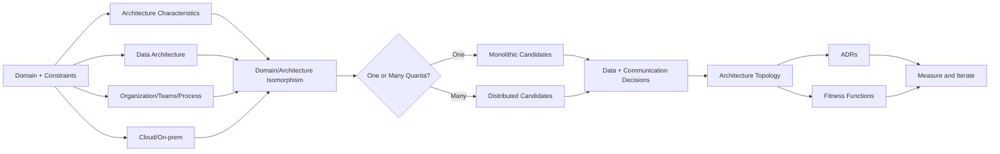
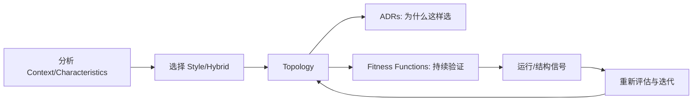
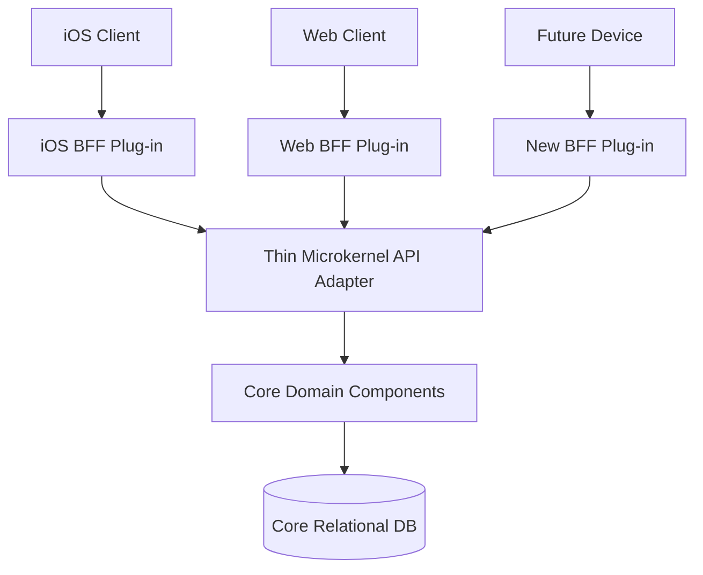
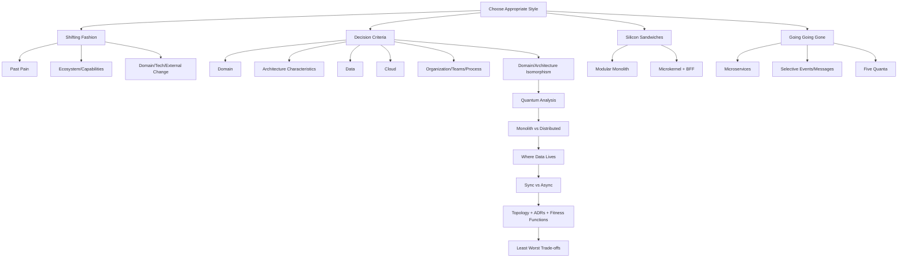

> 对应原书：*Fundamentals of Software Architecture, 2nd Edition*，Chapter 19
>
> 本章主题：如何把前面各章的架构风格知识转化为实际决策。答案不是寻找“最好”的风格，而是在业务领域、架构特征、数据、云、组织、团队能力和拓扑形状之间，选择当前上下文中最不坏的一组权衡。

---

## 0. 本章要解决什么问题

面对 layered、modular monolith、microkernel、service-based、event-driven、space-based、orchestration-driven SOA、microservices 等众多选择，最自然的问题是：

> 我应该使用哪一种架构风格？

原章的第一句回答是：**It depends!**

这不是逃避决策，而是承认 architecture style selection 是一整套分析的最终产物。它至少同时取决于：

- Architecture characteristics 的优先级；
- Domain 的结构、语义耦合和变化方式；
- Strategic goals；
- Data topology 与既有数据资产；
- Cloud/on-prem 目标；
- Cost、license、并购等 organizational constraints；
- Team、process、QA、operations maturity；
- 系统不同部分是否需要不同的 characteristics；
- 同步/异步通信的必要性；
- 未来演化路径。

因此，架构师的工作不是从菜单上选最流行的一项，而是把问题塑造成可比较的 trade-offs。

### 0.1 “通用风格”不等于“任意使用”

Generic architecture styles 理论上几乎都能实现任意一般业务领域。但“能实现”与“适合”不同：

- 用 monolith 可以实现拍卖系统，但极端 scalability 会很痛苦；
- 用 microservices 可以实现强耦合多页保险表单，但会制造大量协调；
- 用 space-based 可以实现普通后台管理，却为不需要的弹性支付巨额成本。

真正区分风格的往往不是 domain 名称，而是它对关键 architecture characteristics 的支持程度。

### 0.2 一句话抓住本章

> 先识别系统必须拥有什么特征和天然是什么形状，再选择最能匹配这些约束、且代价可被组织承担的风格或混合拓扑。

### 0.3 本章推理主线



### 0.4 本章不提供万能打分公式

作者刻意没有给出“按星级求和，最高者获胜”的算法。原因是：

- 某个 hard constraint 不能被其他高分抵消；
- Architecture characteristics 会相互作用；
- 同一个星级在不同业务中的价值不同；
- 组织能否落地会改变风格的实际表现；
- 风格经常需要 hybridization；
- 未来变化不可完全预测。

本文会增加决策表、约束过滤和可运行示例，均属于教学扩展，不是原书规定的自动选型方法。

---

## 1. Shifting “Fashion” in Architecture：架构“时尚”的迁移

软件行业对 architecture styles 的偏好不断变化。这里的 fashion 不是贬义：偏好变化通常来自真实痛点、新能力和外部环境，只是任何趋势都可能被过度套用。

原章按以下七类因素解释架构风格为什么兴衰。

### 1.1 Observations from the Past：对过去的观察

新风格常是对旧风格痛点的修正。

例如，曾经的架构以 code reuse 为中心；实践发现 reuse 会引入 coupling、协调发布和巨大变化半径，于是后来的风格重新思考 shared code，DDD 和 microservices 更强调 bounded context 与自治。

这种演化路径常是：

```text
旧架构获得某项收益
    -> 大规模使用暴露隐藏代价
    -> 新架构把该代价设为首要问题
    -> 新架构又引入另一组代价
```

所以后继风格不是简单“更先进”，而是优化目标改变。

### 1.2 Changes in the Ecosystem：生态变化

Software ecosystem 持续且不可预测地改变。Kubernetes 曾不存在，如今是许多开发者的日常；未来它也可能被尚未发明的工具替代。

架构设计若把某个当前工具当成永久事实，就可能把实现偶然性误当成结构本质。架构师应区分：

- 稳定的能力需求，如自动扩容、服务发现；
- 当前承载能力的产品，如 Kubernetes；
- 产品替换时必须保留的 contracts 和 operational semantics。

### 1.3 New Capabilities：新能力

新工具可能只是旧能力的新实现，也可能开启全新范式。Containers/Docker 是原章的代表：它并非简单替换虚拟机，而是深刻改变：

- Deployment unit；
- Environment reproducibility；
- Provisioning speed；
- Isolation economics；
- DevOps practice；
- Microservices 的可行性。

即使一个看似微小的新 feature，若恰好吻合 architecture goals，也可能改变整个设计空间。

### 1.4 Acceleration：变化加速

不仅变化持续发生，速度和覆盖面也在增加：

```text
新工具 -> 新工程实践 -> 新设计 -> 新能力 -> 更多新工具
```

原章以 generative AI 的兴起为突出例子。架构师无法等生态“稳定后再决定”，必须建立可逆决策、fitness functions 和演化路径。

### 1.5 Domain Changes：领域变化

Business domain 会随市场、法规、组织合并和产品演化而变化。昨天合理的 bounded context，明天可能需要拆分或合并；一次 M&A 可能带来两套客户、订单和财务系统。

Architecture style 必须支持领域实际变化速度，而不是只适配当前流程图。

### 1.6 Technology Changes：技术变化

组织会追随具有明显 bottom-line benefits 的技术变化，例如更低基础设施成本、更快部署、更好安全性或新的数据能力。

但“技术先进”不是独立理由。架构师仍要问：

- 它改善哪项业务/架构特征？
- Migration cost 是多少？
- 是否形成新 vendor lock-in？
- 团队是否具备运维能力？

### 1.7 External Factors：外部因素

与软件开发仅间接相关的因素也会迫使架构改变。例如团队很满意某工具，但 licensing cost 变得不可接受，企业只能迁移。

其他外部因素包括：

- Regulation/data residency；
- Vendor acquisition/end-of-life；
- Security policy；
- Supply chain；
- Corporate M&A；
- Budget contraction。

前五项中的后四项是常见实践补充，原章明确举例的是许可成本。

### 1.8 如何对待 Architecture Fashion

架构师应了解 industry trends，才能：

1. 判断趋势解决了什么历史痛点；
2. 判断自己的系统是否有同一痛点；
3. 知道组织追随趋势时如何正确落地；
4. 必要时有证据地做例外。

应避免两种极端：

- **Trend chasing**：因为流行就采用；
- **Trend rejection**：因为是 hype 就拒绝所有新能力。

真正的专业判断是理解机制和 trade-offs。

---

## 2. Decision Criteria：决策标准

架构师实际设计两样东西：

1. 指定的 **domain**；
2. 让系统成功所需的 **structural elements**，由 architecture characteristics 驱动。

只有对以下因素有足够认识后，才应选择 architecture style。

### 2.1 The Domain：业务领域

架构师不必成为 subject matter expert，但至少要理解影响 operational architecture characteristics 的主要方面。

应理解：

- 核心 workflows；
- 业务 invariants；
- 用户角色与流量；
- 数据语义与生命周期；
- 高峰和失败的业务后果；
- 变化热点；
- 强耦合/可独立子域。

Business analysts 和领域专家可填补知识空白。若不了解 domain，架构师容易把技术拓扑强加给业务。

### 2.2 Architecture Characteristics That Impact Structural Decisions

Architecture characteristics analysis 是选型核心活动。需要识别并阐明哪些 characteristics 支撑 domain 和 external factors，例如：

- Scalability；
- Elasticity；
- Availability；
- Fault tolerance；
- Responsiveness；
- Security；
- Customizability；
- Deployability；
- Testability；
- Evolvability；
- Cost。

Part II 每章使用 star charts 比较 characteristics，而不是比较“适合电商/保险/医疗”等 domain 标签，正反映了这一点。

#### 2.2.1 从需求到结构的推导

```text
“开票后 30 秒内承受 50 倍流量”
    -> Elasticity + Scalability
    -> 可独立增加实例、避免中央瓶颈
    -> Space-based / Microservices 等候选增强

“每个租户有独立定制规则”
    -> Customizability
    -> Stable core + Plug-ins
    -> Microkernel 候选增强
```

只有真正影响 structure 的 characteristics 才应主导 style。把所有“质量属性”列为最高优先级只会得到无法决策的清单。

#### 2.2.2 Generic Style 与 Special Operational Need

大部分 generic styles 都能实现一般 domain。例外是有特殊 operational requirements 的系统，如 highly scalable auction site。这类 hard requirement 会强烈缩小候选范围。

### 2.3 Data Architecture：数据架构

Architects 与 data developers 必须协作处理 database、schema 和其他 data concerns。虽然本书不全面讲数据架构，但选型必须理解数据设计对架构的影响，尤其是：

- 新系统是否必须接入旧 data architecture；
- 是否已有共享 database 无法立即拆分；
- Transactions 是否跨 domain；
- Reporting/analytics 如何工作；
- Data ownership；
- Replication、latency 与 consistency；
- Schema change 的影响范围。

例如，业务要求全局即时 ACID，却选择 database-per-service 的 microservices，会把最困难的问题留到实现阶段。反过来，清晰独立数据域能增强 distributed architecture 的价值。

### 2.4 Cloud Deployments：云部署

Cloud 是计算和数据位置的又一次根本变化。On-prem 与 cloud 的 trade-offs 不同。

必须理解：

- Stored data volume；
- Data movement volume 与 egress cost；
- Region/zone placement；
- Managed service constraints；
- Elastic provisioning；
- Vendor cost/lock-in；
- Compliance。

原章强调 data 能移动多少，因为 cloud data transfer 可能非常昂贵。

十年前，在 on-prem 构建高度 elastic/scalable 系统需要稀缺技能；如今许多能力只需调整 cloud provider configuration。曾经神奇的复杂能力会逐渐 commodity 化，这会改变合理架构的成本曲线。

### 2.5 Organizational Factors：组织因素

外部组织约束可能否定技术上理想的设计：

- 某 cloud vendor 成本过高；
- 公司计划 mergers/acquisitions，因而偏好 open solutions 与 integration architectures；
- Security/legal 限制特定部署；
- 预算无法承担昂贵 distributed platform；
- 供应商关系影响可选技术。

“最佳技术方案”若组织无法采购、运营或治理，就不是可行 architecture。

### 2.6 Knowledge of Process, Teams, and Operational Concerns

Project factors 同样决定风格能否成功：

- Software development process；
- Architect 与 operations 的关系；
- QA process；
- Agile/DevOps maturity；
- Automation；
- Observability；
- Team topology；
- On-call ownership。

原章明确举例：缺乏 Agile engineering maturity 的组织采用依赖这些实践的 microservices 会遇到困难。

#### 2.6.1 风格的“理论评分”与“组织实得分”

Microservices 在 deployability/testability 上理论很强，但没有 automated pipelines、contract tests 和 platform support 时，服务数量只会增加人工发布和测试负担。

因此，风格支持某 characteristic 只表示拓扑有潜力，不代表组织自动获得它。

### 2.7 Domain/Architecture Isomorphism：领域/架构同构

Architecture isomorphism 指架构的通用“形状”，即 components 在 topology 中如何依赖。数学上 isomorphism 是保留元素集合及关系的映射；词源来自希腊语 `isos`（equal）与 `morph`（form/shape）。

架构师应比较 problem shape 与 architecture shape。

图 19-1：

- Layered monolith 按 presentation/business/persistence 等 technical layers 分离；
- Modular monolith 按 domains/components 垂直分区。

图 19-2：monolithic 核心组件共处一个部署边界，distributed 核心组件分散为独立 deployable units。宏观 shape 一目了然。

#### 2.7.1 正向匹配例子

- 需要 customizability 的系统与 microkernel 同构：customizations 天然成为 plug-ins；
- Genome analysis 需要大量 discrete operations，与 space-based 的大量 discrete processors 相匹配。

同构不是视觉相似，而是 domain 中的依赖和变化关系能自然映射到 topology。

#### 2.7.2 反向不匹配例子

##### 高扩展系统 vs 大型 Monolith

Highly coupled code base 难以只扩展热点，也难支撑大量 concurrent users。

##### 高语义耦合领域 vs 高度解耦 Microservices

保险应用由多页 forms 组成，每页依赖前页 context，问题本身高度 coupled。强拆 microservices 会产生大量跨服务状态与协调。Intentionally coupled 的 service-based architecture 可能更合适。

“解耦越多越好”是误区。若 domain 天然耦合，架构应诚实表达，而不是隐藏在网络调用中。

### 2.8 三个最终设计判断

综合上述因素，架构师至少要回答三个问题。

#### 2.8.1 Monolith versus Distributed?

核心问题：整个 design 是否只需要一套 architecture characteristics？

- 单一 characteristics set -> monolith 通常合适，除非其他因素要求 distributed；
- 不同部分需要不同 characteristics -> distributed architecture 更自然。

Architecture quantum 是重要分析工具。若系统只有一个功能内聚且同步耦合的 quantum，分布式拆分可能没有收益；若多个部分在 scale、availability、security、deployability 上显著不同，应考虑多个 quanta。

注意：选择 distributed 不是因为系统“大”，而是因为不同部分需要独立 characteristics/变化/运行边界。

#### 2.8.2 Where Should Data Live?

Monolith 常使用一个 relational database 或少数数据库。Distributed architecture 必须决定：

- 哪些 services 持久化数据；
- 谁是 authoritative owner；
- Workflow 如何获得跨域数据；

- Data 如何在 topology 中流动；
- Consistency 和 transaction 边界。

要同时考虑 structure 与 behavior，并迭代寻找更好的组合。先画服务盒子、最后才想数据，通常会得到大量同步互调或 Saga。

#### 2.8.3 Synchronous or Asynchronous Communication?

Synchronous 更方便、容易设计、实现和 debug，但会牺牲 scalability、reliability 等 characteristics。

Asynchronous 可改善 performance/scale 并降低时间耦合，却带来：

- Data synchronization；
- Deadlocks；
- Race conditions；
- Debugging；
- Ordering；
- Duplicate delivery；
- Eventual consistency。

原章给出明确默认：

> Use synchronous communication by default, asynchronous when necessary.

这不是说同步总是更好，而是复杂度应由明确需求支付。没有 scale、latency、fault isolation 等理由时，不要仅因为“事件驱动更现代”引入异步。

### 2.9 决策过程的输出

选型不是只产出一个 style 名称，而应产出：

1. **Architecture topology**：包含选定 style 与必要 hybridizations；
2. **Architectural Decision Records（ADRs）**：记录高成本、高权衡部分的 context、decision、consequences；
3. **Architecture fitness functions**：保护重要 principles 和 operational characteristics。



### 2.10 教学扩展：约束优先的决策表

可以用表格外化推理，但不应机械求总分。

#### 第一步：Hard Constraints 过滤

例如：

```text
必须离线单机运行 -> 排除依赖持续远程协调的设计
必须每租户加载插件 -> Microkernel 强候选
必须短时承受百万并发 -> 普通大型 Monolith 弱候选
所有步骤必须同一 ACID -> 细粒度 Microservices 弱候选
组织没有自动部署 -> 大规模 Microservices 高风险
```

#### 第二步：比较关键 Trade-offs

| Candidate | 强项 | 弱项 | 风险缓解 | Remaining risk |
|---|---|---|---|---|
| Modular monolith | 简单、低成本、域内模块化 | 独立扩展弱 | 清晰组件/数据分区 | 单一部署与量子 |
| Microkernel | 定制、扩展 hook | Plugin contract 治理 | Registry/contract tests | Core/plug-in 耦合 |
| Service-based | 域级部署、ACID 较容易 | 粗粒度扩展 | UI/DB 选择性拆分 | Shared DB coordination |
| Event-driven | 响应、并行、演化 | 非确定、测试/错误难 | Durable broker/observability | 最终一致与状态 |
| Space-based | 极端 scale/elasticity | 成本、数据碰撞 | Grid/pump fitness functions | 内存与同步链 |
| Microservices | 自治、部署、演化 | 最高成本、数据/网络复杂 | Platform/mesh/contracts | Saga 与操作复杂度 |

#### 第三步：记录“为什么不是其他候选”

良好 ADR 不只写“选择 Microkernel”，还写：

- 为什么 modular monolith 的 Override 机制不足；
- 为什么 microservices 的独立 scale 不值得；
- 哪些未来信号会触发重新评估。

### 2.11 可运行示例：先过滤、再展示权衡

下面的 Python 示例只演示决策透明化。它不计算万能总分，而是先按 hard constraints 排除，再列候选的关键代价。

```python
styles = {
    "modular_monolith": {
        "distributed": False,
        "customizable": False,
        "extreme_scale": False,
        "cost": 1,
    },
    "microkernel": {
        "distributed": False,
        "customizable": True,
        "extreme_scale": False,
        "cost": 2,
    },
    "microservices": {
        "distributed": True,
        "customizable": True,
        "extreme_scale": True,
        "cost": 5,
    },
}

def feasible_styles(requirements: dict[str, bool]) -> list[str]:
    feasible = []
    for name, properties in styles.items():
        if all(
            not required or properties[characteristic]
            for characteristic, required in requirements.items()
        ):
            feasible.append(name)
    return sorted(feasible, key=lambda name: styles[name]["cost"])

silicon_sandwiches = {
    "distributed": False,
    "customizable": True,
    "extreme_scale": False,
}

for style in feasible_styles(silicon_sandwiches):
    print(f"{style}: relative_cost={styles[style]['cost']}")
```

输出：

```text
microkernel: relative_cost=2
microservices: relative_cost=5
```

这里 `distributed=False` 被解释为“不要求 distributed”，而不是“禁止 distributed”，所以 microservices 仍可行；microkernel 以较低相对成本排在前面。实际选型还要比较数据、团队和变化，不能把示例字典当作真实风格评分。

---

## 3. Monolith Case Study: Silicon Sandwiches：单体案例

Silicon Sandwiches kata 在第 5 章完成 architecture characteristics analysis 后，确定 **single quantum** 足够。系统简单、预算不大，monolith 的 simplicity 很有吸引力。

此前建立了两种 component design：

- Domain-partitioned；
- Technically partitioned。

本章在单体范围内比较两个具体候选：modular monolith 和 microkernel。

### 3.1 为什么先选 Monolith 家族

推理链：

1. 关键功能不需要不同 architecture characteristics；
2. 一个 quantum 足以；
3. 没有极端 scale/elasticity；
4. Budget 小；
5. Distributed complexity 没有明确回报；
6. 因而先把候选限制在 monolithic styles。

这体现“先选宏观 shape，再选具体 style”，而不是在八种风格中盲目打分。

### 3.2 Modular Monolith

Modular monolith 以 domain-centric components 组织代码，使用 single database，整体部署为 single quantum。

#### 3.2.1 设计组成

- Single relational database；
- Single Web UI；
- UI 仔细适配 mobile devices；
- 每个已识别 domain 对应一个 component；
- 单一部署单元降低 overall cost。

若时间和资源允许，database tables/assets 也应按 domain components 分区。物理上仍是一库，但逻辑边界清晰，未来 distributed migration 更容易。

#### 3.2.2 Customizability 如何实现

Modular monolith 本身不原生处理 customization，因此把它设计进 domain：

1. 建立 `Override` endpoint/component；
2. Developers 上传 individual customizations；
3. 每个 domain component 在处理 customizable characteristic 时引用 `Override`；
4. Fitness function 检查是否所有需要定制的路径都经过 Override。

这种做法能实现需求，但 customization 是应用级约定，不是 topology 的一等结构。遗漏调用 Override 会造成行为不一致。

#### 3.2.3 适合条件

- Customizations 数量有限；
- Override contract 简单；
- Domains 同步演化；
- 不要求第三方插件自治部署；
- 最低成本比极致扩展性更重要。

### 3.3 Microkernel

Customizability 是 Silicon Sandwiches 已识别的 architecture characteristic。Microkernel 的 core + plug-ins shape 与该需求天然同构。

#### 3.3.1 Core System

Core 包含 domain components 和 single relational database。与 modular monolith 一样，应让 domain/data design 同步分区，为未来 distributed migration 保留路径。

#### 3.3.2 Plug-ins

- Common customizations 放入一组 common plug-ins，并有对应 database；
- Local customizations 各自成为 local plug-in；
- 每个 local plug-in 可拥有自己的 data；
- Plug-ins 彼此不需要耦合，因而保持 decoupled。

相较 Override component，customization 直接映射为 architecture element，更容易独立添加和管理。

#### 3.3.3 Backends for Frontends（BFF）

该设计还有一个独特元素：API layer 也是 thin microkernel adapter，使用 BFF pattern。

Backend 提供 general information；每个 BFF adapter 转换为目标 frontend 需要的：

- Data format；
- Pagination；
- Latency characteristics；
- Device-specific shape。

例如 iOS BFF 把通用 backend output 适配为 native application 所需格式。新增设备时添加 adapter，不必污染 core。



#### 3.3.4 Communication 选择

两种 Silicon Sandwiches 设计都可使用 synchronous communication，因为：

- 没有 extreme performance requirement；
- 没有 elasticity requirement；
- Operations 不会长时间运行；
- 同步更容易设计、实现、调试。

这直接应用了“synchronous by default, asynchronous when necessary”。

### 3.4 两个方案如何选择

| 维度 | Modular Monolith | Microkernel |
|---|---|---|
| 基本成本 | 更低 | 略高，需 plugin contracts/registry |
| Domain modularity | 强 | Core 中同样可强 |
| Customization | Override 约定 | Plug-in 一等结构 |
| 漏接风险 | 每组件必须显式引用 Override | Core/registry 统一加载 |
| Local data | 通常纳入主库/模块 | Plug-in 可拥有独立数据 |
| 新设备支持 | 修改/扩展 UI/API | 新 BFF adapter |
| 未来 distributed migration | 依赖逻辑数据分区 | Core 同样可迁移，plug-ins 已解耦 |

原章没有宣布唯一赢家。Microkernel 更匹配 customizability shape；modular monolith 更简单。选择取决于 customization 是核心驱动还是普通功能。

---

## 4. Distributed Case Study: Going, Going, Gone：分布式案例

Going, Going, Gone（GGG）拍卖 kata 比 Silicon Sandwiches 更具挑战。

### 4.1 为什么需要 Distributed Architecture

不同系统部分需要不同 characteristics：

- Auctioneer：每场拍卖一个，交互和控制要求特殊；
- Bidder：数量巨大，需要高 scale/elasticity；
- Streaming：高 throughput、read-only；
- Payment：关键但吞吐较慢；
- Bid tracking：需要合并、排序异步流。

系统还明确要求 ambitious scale、elasticity、performance，以及 fine-grained customization。单一 quantum/characteristic set 无法自然表达。

### 4.2 候选风格为何是 EDA 与 Microservices

在 distributed candidates 中，low-level event-driven architecture 和 microservices 最匹配大多数 requirements。

Microservices 更适合的关键原因：支持各部分拥有不同 operational architecture characteristics。Pure event-driven 通常按 orchestrated/choreographed communication 分离，而不是按不同 characteristic sets 划分服务边界。

因此选择 microservices 作为 generic pattern，再在需要处使用 events/messages hybridization。

### 4.3 主动设计 Microservices 的弱点

GGG 的 performance goal 对 microservices 是挑战。正确做法不是忽略弱点，而是针对它设计。

Microservices 常见 performance 问题来自：

- Too much orchestration；
- Too aggressive data separation；
- Long synchronous chains；
- Repeated serialization/security；
- 过多 network/database calls。

架构师应减少热路径跳数、使用异步 buffer、建立 read-only streams，并让数据边界匹配 workflow。

### 4.4 GGG Microservices Topology

本设计把第 8 章识别的 components 映射为 services，使 component granularity 与 service granularity 对齐。

### 4.5 三类 User Interfaces

#### Bidder

面向数量众多的 online bidders，需要大规模水平扩展和低延迟。

#### Auctioneer

每场 auction 一个 auctioneer，控制当前拍卖。

#### Streamer

负责把 video 和 bids 流式发送给 bidders。它是 **read-only stream**，因此可使用更新型系统不能采用的缓存、复制和 fan-out 优化。

### 4.6 八个 Services

#### `Bid Capture`

- 捕获 online bidder entries；
- 异步发送给 `Bid Tracker`；
- 仅作 conduit，不需要 persistence；
- 可按 bidder volume 独立扩展。

#### `Bid Streamer`

- 把 bids 高性能地流回 online participants；
- Read-only，适合复制和并行 fan-out。

#### `Bid Tracker`

- 同时接收 `Auctioneer Capture` 与 `Bid Capture`；
- 统一两条 information streams；
- 尽可能接近 real time 地排序 bids；
- 两条 inbound connections 都 asynchronous；
- Message queues 缓冲差异很大的 flow rates。

“尽可能接近实时”承认分布式异步流很难拥有零延迟全局总序。必须定义 timestamp、sequence 或 auction-local ordering 规则。

#### `Auctioneer Capture`

- 捕获 auctioneer bids；
- 与 `Bid Capture` 的 architecture characteristics 不同，因此分离。

这是 architecture characteristics 驱动 boundary，而非只按功能名拆分的例子。

#### `Auction Session`

- 管理 individual auction workflows；
- 拥有一场拍卖的会话状态和生命周期。

#### `Payment`

- 第三方 payment provider；
- Auction Session 完成 auction 后处理 payment；
- Critical but fragile/slow dependency。

#### `Video Capture`

- 捕获 live auction video stream。

#### `Video Streamer`

- 把 auction video 流式发送给 online bidders。

### 4.7 同步与异步为何混用

架构明确标识两种 communication style，而不是教条地全异步。

选择 asynchronous 的主要原因是 services 间 operational characteristics 不同。

原章 Payment 例子：每 **500 ms** 才能处理一个新 payment。若大量 auctions 同时结束：

- Synchronous calls 会占住 callers；
- Queueing wait 导致 timeout；
- Payment 暂时故障会传播；
- 上游无法按自身速度完成。

Message queues 把 burst 转为 backlog，为 critical but fragile part 增加 reliability。

可用排队直觉表示：若结束拍卖到达率 $\lambda$ 大于 Payment 处理率 $\mu=2/s$，积压增长：

$$
\Delta Q\approx(\lambda-2)\Delta t
$$

队列不会让 Payment 变快，只会避免同步 timeout 并保存待处理工作。若平均到达率长期大于 2/s，仍必须扩展 provider 或增加 consumers。

### 4.8 五个 Architecture Quanta

最终设计得到五个 quanta，大致对应：

1. `Payment`；
2. `Auctioneer`；
3. `Bidder`；
4. `Bidder Streams`；
5. `Bid Tracker`。

图中的 stacked containers 表示 multiple instances。

Quantum analysis 在 component-design stage 就帮助识别：

- Service boundaries；
- Data boundaries；
- Communication boundaries；
- 哪些 characteristics 可独立；
- 哪些部分必须一起扩展或失败。

不是每个 service 都自动是一个 quantum。例如一组同步耦合 services 可能属于同一 quantum；多实例仍是同一功能量子的横向副本。

### 4.9 “Least Worst” 而不是 Correct/Best

作者明确说：

- 这不是 GGG 的 “correct” design；
- 不是唯一 design；
- 甚至不声称是 best possible design；
- 它只是具有 **least worst set of trade-offs**。

选择 microservices，再智能使用 events/messages，使 generic pattern 获得所需运行能力，同时给未来 development/expansion 留出基础。

这句话是全章最重要的方法论：架构决策不是证明唯一最优，而是公开当前约束下被接受的代价。

### 4.10 可运行示例：Quantum/通信边界说明

下面用简化数据描述 GGG 的五个 quanta 和异步边。它只验证结构说明，不是自动 quantum inference。

```python
quanta = {
    "Payment": {"Payment"},
    "Auctioneer": {"Auctioneer Capture", "Auction Session"},
    "Bidder": {"Bid Capture"},
    "Bidder Streams": {"Bid Streamer", "Video Capture", "Video Streamer"},
    "Bid Tracker": {"Bid Tracker"},
}

asynchronous_edges = [
    ("Bid Capture", "Bid Tracker"),
    ("Auctioneer Capture", "Bid Tracker"),
    ("Auction Session", "Payment"),
]

for name, services in quanta.items():
    print(f"{name}: {', '.join(sorted(services))}")
print("async_edges =", len(asynchronous_edges))
```

输出：

```text
Payment: Payment
Auctioneer: Auction Session, Auctioneer Capture
Bidder: Bid Capture
Bidder Streams: Bid Streamer, Video Capture, Video Streamer
Bid Tracker: Bid Tracker
async_edges = 3
```

真实 quantum 划分必须结合同步动态耦合、数据和 characteristics，不能只凭集合文件自动得出。

---

## 5. 两个案例放在一起看

| 维度 | Silicon Sandwiches | Going, Going, Gone |
|---|---|---|
| 主要压力 | 简单、低预算、可定制 | 极端 scale/elasticity/performance |
| Characteristics sets | 一套 | 多套 |
| Quanta | 1 | 5 |
| 宏观选择 | Monolith | Distributed |
| 候选 | Modular monolith / Microkernel | EDA / Microservices |
| 最终倾向 | Customizability 强时 Microkernel | Microservices + events/messages |
| Data | Single relational DB，可逻辑分区 | 按 quanta/services 分边界 |
| Communication | 同步足够 | 有意混合同步与异步 |
| 核心方法 | Domain/architecture isomorphism | Characteristics + quantum analysis |

### 5.1 同一套方法，不同答案

两个案例没有证明某风格普遍优越，而是展示相同决策过程：

```text
理解 domain
    -> 提取 structural characteristics
    -> 判断 quantum 数量
    -> 匹配 topology shape
    -> 设计 data/communication
    -> 针对候选弱点做设计
    -> 记录 trade-offs
```

### 5.2 Hybrid 不是妥协失败

GGG 使用 microservices 作为主体，同时采用 event/message；Silicon Sandwiches 的 microkernel 又在 API 使用 BFF adapters。现实 architecture topology 常是一个主风格加局部 patterns/hybridization。

关键是每个混合元素解决明确问题，而不是把流行技术堆在一起。

---

## 6. 易混淆概念与常见误区

### 6.1 “It depends” 表示没有方法

错误。它表示必须显式分析 context、characteristics、data、organization、teams 和 shape，而不是套模板。

### 6.2 星级最高的风格就是最佳风格

错误。星级按 characteristic 分项，没有通用权重；高分伴随成本和复杂度。Hard constraint 也不能被其他分数抵消。

### 6.3 Domain 决定唯一 Architecture Style

错误。Generic styles 可实现多数 domains，主要差异常在 architecture characteristics。同一种电商可做 monolith、service-based 或 microservices，取决于规模、组织和变化。

### 6.4 系统大就必须 Distributed

错误。关键是是否需要不同 characteristic sets/quanta。大型但统一部署和扩展的系统仍可 modular monolith。

### 6.5 只有一个 Quantum 就绝不能 Distributed

原章说单一集合暗示 monolith suitable，但其他因素仍可能建议 distributed。它是强信号，不是硬定律。

### 6.6 Distributed 一定比 Monolith 更能扩展

取决于瓶颈和数据。共享数据库、长同步链和错误粒度会让 distributed system 更慢、更脆。

### 6.7 Isomorphism 只是画图好看

错误。它比较 domain relationships 与 topology relationships 是否自然映射。Customizations 映射 plug-ins 是结构匹配，不是视觉装饰。

### 6.8 解耦越多越好

错误。高度 semantic coupling 的多页保险表单可能更适合 intentionally coupled service-based architecture。网络不会消除业务耦合。

### 6.9 数据问题可以选完风格后再处理

错误。Data ownership、transaction、flow 和旧数据库约束直接决定 topology。晚处理往往导致大量同步调用和 Saga。

### 6.10 Cloud 等于某种 Architecture Style

错误。Cloud 是 deployment destination 和 capabilities set，会改变成本与可行性，但同一风格可有 cloud/on-prem 变体。

### 6.11 组织成熟度与 Architecture 无关

错误。缺乏 Agile/DevOps automation 的组织无法实现 microservices 的理论高 deployability，实际只会增加人工工作。

### 6.12 Asynchronous 总比 Synchronous 先进

错误。原章默认同步、必要时异步。异步必须由 scale、performance、reliability 或 temporal decoupling 等明确需求支付复杂度。

### 6.13 Queue 会提高 Consumer 吞吐量

错误。Queue 缓冲 burst、提高可靠性，不会让每 500 ms 一笔的 Payment 自动变快。长期输入超过处理率仍积压。

### 6.14 Modular Monolith 不能定制

可以用 Override component，只是 customization 不是 topology 原生元素；Microkernel 的 plug-in shape 更自然。

### 6.15 Microkernel 一定比 Modular Monolith 好

错误。它更支持 customization，却增加 plugin contracts、registry 和数据边界复杂度。若定制很少，后者更简单。

### 6.16 BFF 应包含所有业务逻辑

错误。案例 BFF 是 thin adapter，转换 device-specific format、pagination、latency 等；核心业务仍在 backend/core。

### 6.17 GGG 选择 Microservices 因为拍卖都该用 Microservices

错误。选择来自该案例不同角色的 characteristic sets 和五个 quanta。另一个规模或团队条件下可有不同答案。

### 6.18 一个 Service 就是一个 Quantum

错误。Quantum 由功能内聚和同步动态耦合决定。多个同步 services 可同属一个 quantum；多实例也不是多个不同量子。

### 6.19 “Least Worst” 是缺乏信心

错误。所有架构都有 trade-offs。公开为什么接受一组缺点，比宣称“最佳实践”更严谨。

### 6.20 ADR 只是记录最终选择

错误。还应记录 context、alternatives、trade-offs、consequences 和重新评估触发条件。

### 6.21 Fitness Function 是一次验收测试

错误。它应持续保护 architecture principles/characteristics，例如 Override 引用、通信方向、latency 或 coupling。

---

## 7. 一般化的问题解决方法

本节把原章流程整理为可执行步骤，属于教学性归纳，不是原章给出的机械算法。

### 第 1 步：收集事实而不是选择技术

理解 domain、用户、workflows、数据、峰值、失败后果、变化和外部约束。

### 第 2 步：提取最少的 Structural Characteristics

从具体场景推导必须改变 topology 的 characteristics，区分 hard constraints、重要 drivers 和普通 desiderata。

### 第 3 步：检查 Domain/Architecture Shape

画 domain 依赖图，比较 technical layering、domain modules、plug-ins、events、processors 或 services 哪种 topology 最自然。

### 第 4 步：用 Quantum 判断宏观边界

一套还是多套 characteristics？哪些部分必须同步耦合？先决定 monolith/distributed 大方向。

### 第 5 步：把 Data 放进第一版设计

明确 owner、transaction、replication、reporting 和 legacy constraints，不画无数据的空服务盒子。

### 第 6 步：默认同步，按必要性引入异步

为每条 async edge 写清理由：burst buffer、fault isolation、different rates、latency 或 event semantics。

### 第 7 步：针对候选弱点设计

- Microservices performance 弱 -> 缩短热路径、避免过度分离；
- Modular monolith customizability 弱 -> Override/fitness function；
- Microkernel plugin governance -> contract tests；
- Event-driven state/error 弱 -> observability/mediator。

### 第 8 步：比较 Trade-offs，而非总分

列出每个候选带来的收益、代价、缓解措施、残余风险，并优先消除违反 hard constraints 的方案。

### 第 9 步：产出 Topology、ADRs 与 Fitness Functions

使决策既可沟通，也可在实现和运行中持续验证。

### 第 10 步：定义重新评估信号

例如：

- 单体出现不同 scale hotspots；
- Custom plug-ins 数量激增；
- Queue lag 超过 SLO；
- Shared database schema coordination 成为瓶颈；
- 团队结构改变；
- Cloud/license cost 改变。

Architecture style 是当前最合适的起点，不是永久不可变的身份。

---

## 8. 本章知识结构



---

## 9. 核心结论

1. **没有脱离上下文的最佳架构风格。** Style selection 是 domain、characteristics、data、cloud、organization 和 team/process 分析的结果。
2. **架构时尚来自真实演化。** 过去痛点、生态、新能力、变化加速、领域、技术和外部因素共同推动风格兴衰。
3. **了解趋势是为了正确追随或有证据地例外。** 既不要盲目追逐，也不要条件反射式拒绝。
4. **Architecture characteristics 通常比 domain 标签更能区分 generic styles。** Star charts 比较的是能力，不是行业名称。
5. **Data architecture 必须早期参与。** Data ownership、transaction 和 flow 会直接塑造服务与通信边界。
6. **Cloud 会改变能力的成本曲线。** 过去稀缺的 elasticity 已商品化，但 data movement 和 vendor cost 仍是约束。
7. **组织成熟度决定理论能力能否兑现。** 缺乏 Agile/DevOps 的团队无法轻易驾驭 microservices。
8. **Domain/architecture isomorphism 比较问题与 topology 的形状。** Microkernel 匹配 customization；高语义耦合领域不一定适合极端解耦。
9. **Monolith/distributed 的关键是 characteristic sets 与 quanta，不是系统大小。** 一套特征倾向单体，多套特征倾向分布式。
10. **原章推荐同步为默认，异步在必要时使用。** 异步收益必须支付 synchronization、race、debugging 等成本。
11. **选型输出不只是 style 名称。** 还包括 topology、ADRs 和持续保护原则的 fitness functions。
12. **Silicon Sandwiches 只需一个 quantum。** Modular monolith 更简单，microkernel 与 customizability 更同构，并可用 BFF 扩展设备。
13. **GGG 需要不同 operational characteristics 与五个 quanta。** Microservices 主体加选择性 events/messages 更适合。
14. **Queue 解决速率解耦和可靠缓冲，不增加下游处理速度。** Payment 每 500 ms 一笔的限制仍需容量治理。
15. **针对风格弱点设计，而不是假装弱点不存在。** Microservices 的 performance 必须通过合理粒度、数据和通信设计缓解。
16. **最终目标是 least worst trade-offs。** “正确”“唯一”“最佳”通常是假象；严谨决策应公开被接受的代价和重新评估条件。

最终可以把本章压缩成一句架构判断：

> 不要问哪种风格最先进；要问业务是什么形状、哪些特征不能妥协、组织能支付什么复杂度，以及哪种拓扑留下的残余风险最可接受。
