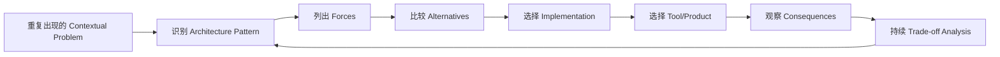
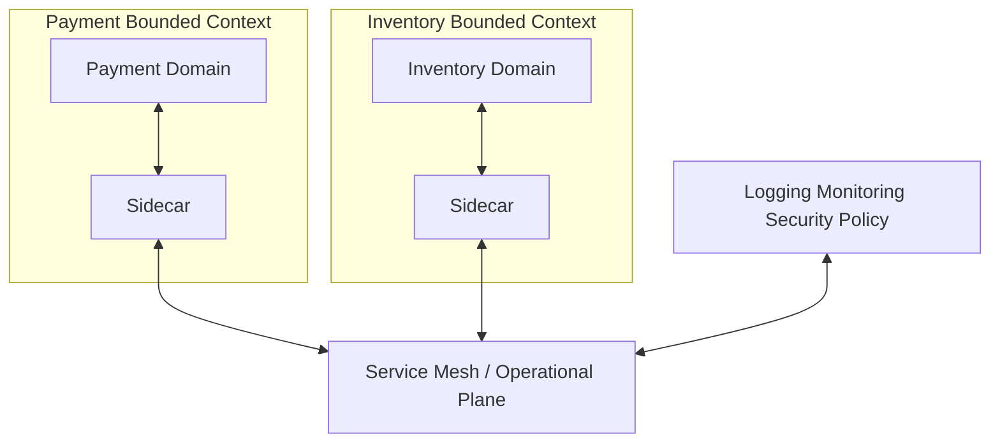
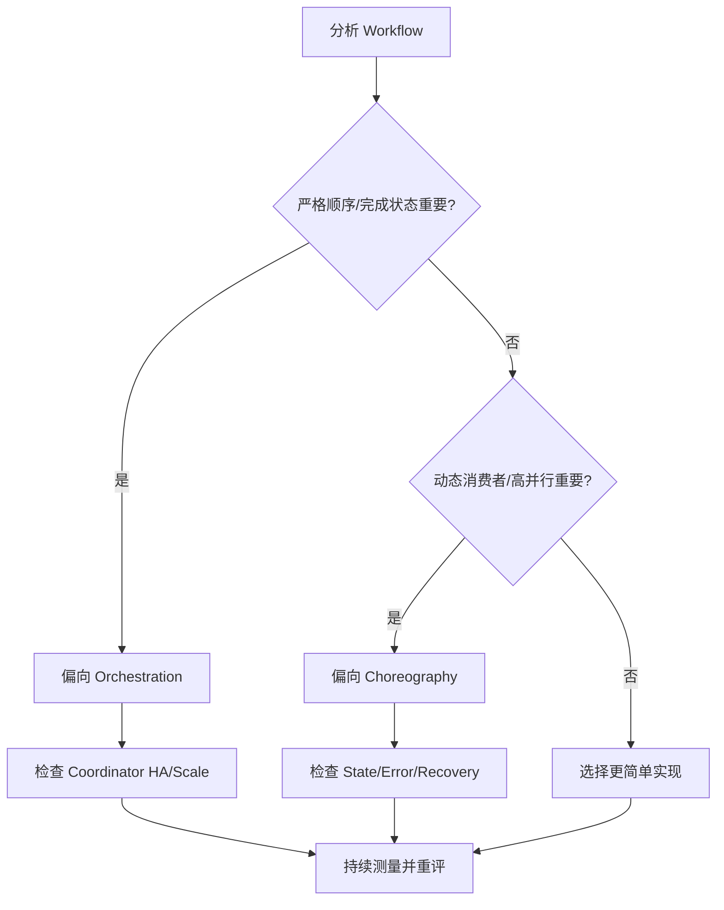
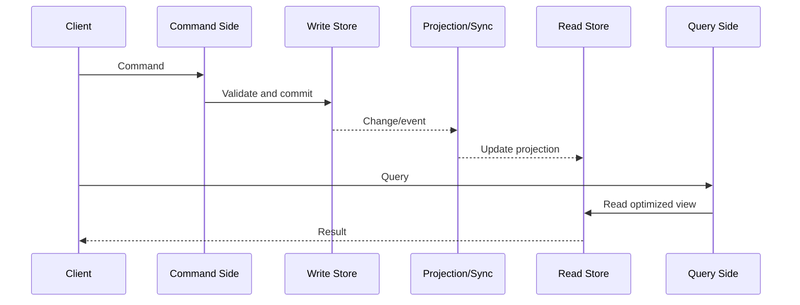
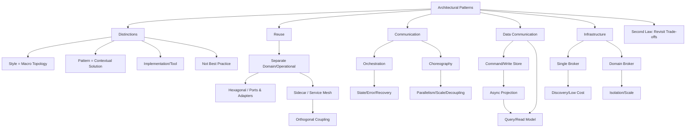

> 对应原书：*Fundamentals of Software Architecture, 2nd Edition*，Chapter 20
>
> 本章主题：如何识别跨架构风格反复出现的上下文化问题解法，并在“模式、风格、实现、工具、最佳实践”之间保持清晰边界。原章选取复用、通信、读写分离和基础设施四组代表性问题，展示模式的真正价值在于暴露 trade-offs，而不是提供万能答案。

---

## 0. 本章要解决什么问题

前面的章节主要讨论 architecture styles：layered、microkernel、event-driven、microservices 等。Architecture patterns 的思想受到经典著作 *Design Patterns* 启发，它们处理更局部、可跨风格复用的问题：

- Domain code 与 monitoring/logging 等 operational concerns 如何既分离又统一复用？
- 多个 services 的 workflow 应由中央 orchestrator 控制，还是由 participants 自主 choreography？
- Read/write 负载和数据模型差异巨大时，是否应拆开？
- Event broker 是全系统共享，还是按 domain 隔离？

这些问题不一定改变整个 architecture style，却会显著改变 coupling、fault tolerance、scalability、state、成本和团队责任。Architecture patterns 就是对这些重复问题的 **contextualized solutions**。

### 0.1 Style、Pattern、Solution、Tool 的区别

原章重申第 9 章的区分。

| 概念 | 回答的问题 | 例子 |
|---|---|---|
| Architecture style | 整个系统的宏观 topology 是什么 | Microservices、Event-Driven、Layered |
| Architecture pattern | 某类上下文问题如何解决 | Sidecar、CQRS、Orchestration |
| Solution/implementation | 在当前系统如何具体落地 pattern | 某套 sidecar deployment、某个 read model |
| Tool/framework/product | 用什么技术承载实现 | Istio、Kafka、数据库产品 |

Style 通常由 topology、physical architecture、deployment、communication style 和 data topology 区分。Pattern 可以存在于多个 styles 中；同一 pattern 又可有多种 implementations。

### 0.2 Pattern 不是 Best Practice

称某做法为 **best practice**，暗示任何相同情形都必须采用，容易让架构师停止思考。即便说 better practice，也至少还保留争论空间；“best”往往把 context 和 trade-offs 擦掉。

Pattern 的表达应包含：

- Context；
- Problem；
- Forces/constraints；
- Solution shape；
- Consequences/trade-offs；
- Known alternatives。

因此，本章所有模式都不是强制答案。

### 0.3 Pattern 不是现成 Product

Tools、frameworks、libraries 常封装一个或多个 patterns，而且 fidelity 不同，也可能与其他模式交织。

正确顺序：

```text
识别问题
    -> 选择合适 Pattern
    -> 明确所需语义和 Trade-offs
    -> 比较 Implementation
    -> 最后选择 Tool/Product
```

错误顺序是“公司买了某产品，所以所有问题都按它支持的模式重写”。

### 0.4 本章只提供代表性样本

原章使用 **a smattering of representative patterns**，不是完整模式目录。它们用于给 Part II 的 styles 增加对比和上下文，并训练架构师识别“实现背后的模式”。

### 0.5 一句话抓住本章

> 模式的价值不是告诉你永远做什么，而是给一个重复问题命名，让你能复用已经被观察过的解法与代价。

### 0.6 本章推理主线



### 0.7 阅读边界

原章没有给出统一公式或算法。本文添加的延迟/可用性直觉、CQRS 版本投影代码、broker 故障域示例和决策清单属于教学扩展，不是原书提出的正式模型。

---

## 1. Reuse：复用

Distributed architectures，尤其 microservices，常需要区分两类 coupling：

- **Domain coupling**：业务模型、规则与数据之间的关系；
- **Operational coupling**：monitoring、logging、authentication、authorization、circuit breaker 等运行能力。

如果把两者都按同一种“共享或不共享”策略处理，就会陷入两种极端：

- 所有东西都复用，bounded contexts 被共享 domain libraries 拉回一起；
- 所有东西都复制，每个团队的 logging/security/monitoring 实现漂移，运营失控。

### 1.1 Separating Domain and Operational Coupling：分离领域耦合与运行耦合

Microservices 常用建议是：**duplication is preferable to coupling**。

### 1.1.1 为什么 Domain Model 可以适度复制

假设 Payment 与 Inventory 需要交换 customer profile。DDD bounded context 要求 implementation details 保持私有，因此每个 service 可有自己的 `Profile` representation，通过 loosely coupled JSON name-value pairs 交换。

这样一方可以改变：

- Internal class；
- Field naming；
- Database schema；
- Technology stack；
- Validation rules，

只要外部 contract 兼容，就不会破坏另一方。

复制的代价是真实存在的：

- Synchronization；
- Semantic drift；
- 重复 bug fix；
- 转换代码。

但在 microservices 中，跨 context coupling 可能比这些代价更糟。这里不是“复制永远正确”，而是 bounded autonomy 的有意选择。

### 1.1.2 为什么 Operational Capabilities 反而受益于一致耦合

每个 service 都需要：

- Monitoring；
- Logging；
- Authentication/authorization；
- Circuit breakers。

若每个 team 独立实现：

- Operations 无法确认覆盖完整；
- Log/metric semantics 不一致；
- 升级 monitoring tool 要协调所有团队；
- Security patch rollout 不可控；
- Incident response 看不到统一视图。

因此目标不是消灭所有 coupling，而是：

> Domain implementation 低耦合；operational mechanism 有边界、可统一升级地耦合。

#### 1.1.3 Hexagonal architecture

Hexagonal architecture 把 domain logic 放在中心，周围通过 ports 和 adapters 接入生态，因此也叫 **Ports and Adapters pattern**。

图中六边形只用了四边。创建者 Alistair Cockburn 最初画成 hexagon 并如此命名，很快觉得 Ports and Adapters 更准确，但“Hexagonal”已经流行。

##### 结构含义

```text
外部输入 Adapter -> Input Port -> Domain Logic
Domain Logic -> Output Port -> DB/Message/External Adapter
```

Port 是 domain 定义的接口/契约；adapter 把 HTTP、CLI、database、broker 等技术细节转换为 port 所需形状。

收益：

- Domain 不直接依赖 UI/database framework；
- Adapter 可替换；
- Domain unit test 不需要启动全部 infrastructure；
- Operational/technical concerns 位于边缘。

##### 在 Microservices 中的 Data Fidelity 陷阱

Hexagonal pattern 早于现代 microservices，原始设计把 database 视为可插拔 adapter，没有把 data schema 视为 business logic 的一部分。这反映当时常见误解：database 是与 domain 分离的机器。

Eric Evans 在 *Domain-Driven Design*（DDD）中纠正了这一点：无论 schema 位于哪里，它必须随 business logic 变化，因此属于 bounded context 的一部分。

若在 microservices 中照搬“database 完全在 hexagon 外、与 domain 无关”的 literal implementation，会违反 microservices 的核心原则：service + schema/data 应共同形成 bounded context。

因此听到“Hexagonal”时要确认对方指：

1. 广义的 domain/operational separation；还是
2. Literal original implementation，连 data schema 都隔离在 domain 外。

前者可作为 shorthand；后者不适合现代 microservices。Pattern 名称不能替代精确定义。

#### 1.1.4 Service Mesh

第 18 章介绍的 Sidecar + Service Mesh 是现代 distributed architecture 中更合适的实现。

Sidecar 不只是“把 operational code 搬出去”，而是 **Orthogonal Reuse pattern**：对不符合主要层级组织方式、却需要跨域复用的 concern，建立一致的横切层。

##### 1.1.4.1 Orthogonal Coupling

数学中两条线 orthogonal 表示直角相交，也暗示相互独立。在软件架构中，两个 concerns 可有不同目的，却必须在完整解法中交叉。

例子：

- Catalog checkout 是 domain behavior；
- Monitoring 是 operational behavior；
- 二者语义独立，但每次 checkout 都必须被观察。

识别 orthogonal coupling 的目标，是找到 entanglement 最小的 intersection point。Sidecar 在 process/network boundary 截获流量和 telemetry，使 operational concern 横跨 domains，却不进入 domain model。



##### Sidecar/Service Mesh Trade-offs

原章表 20-1：

| Advantages | Disadvantages |
|---|---|
| Offers a consistent way to create isolated coupling | Must implement a sidecar per platform |
| Allows consistent infrastructure coordination | Sidecar component may grow large/complex |
| Ownership per team, centralized, or some combination | Implementation drift between independent teams |

解释：

- **Consistent isolated coupling**：所有 services 获得统一能力，而 domain code 不依赖具体实现；
- **Per-platform implementation**：Java、.NET、容器、serverless 等环境可能需要不同接入；
- **Coordination**：可统一升级 policy；
- **Sidecar growth**：过多功能会形成复杂 runtime 和延迟；
- **Flexible ownership**：team/central/hybrid 均可；
- **Drift**：自治团队若独立 fork，版本和行为会分裂。

### 1.2 同一 Separation Pattern 的两种实现

Hexagonal 与 Service Mesh 都实现“separate domain from operational/technical concerns”：

| 维度 | Hexagonal / Ports and Adapters | Sidecar / Service Mesh |
|---|---|---|
| 主要边界 | Code dependency boundary | Process/network operational boundary |
| 适用 | General purpose | Microservices/Distributed 尤其合适 |
| Domain core | 由 ports 保护 | 由 service boundary 保护 |
| Operational reuse | 通过 adapters | 通过 sidecars/mesh plane |
| 主要风险 | Literal DB-as-external interpretation | Sidecar complexity/platform drift |

关键方法：先识别 **separation/reuse pattern**，再按 architecture context 选择 implementation。不要因为听到 Hexagonal 就画六边形，也不要因为有 Istio 就认为 domain 已经解耦。

### 1.3 教学扩展：何时复制、何时正交复用

可用以下问题判断：

1. 该 concern 是否包含易变 domain semantics？
2. 不同 contexts 是否需要不同模型？
3. 一次升级是否必须全局一致？
4. 不一致会造成业务错误还是仅实现差异？
5. 能否在 process/network boundary 统一？
6. Shared mechanism 是否泄露 domain concepts？

通常：

```text
易变 Domain Rule -> Context 内实现，允许受控重复
稳定 Operational Mechanism -> Sidecar/Platform 正交复用
跨 Context Contract -> 最小、显式、版本化
```

---

## 2. Communication：通信

许多 communication patterns 来自 event-driven architecture，但可用于任何通过 messages/events 通信的 distributed architecture，包括 microservices。

Architects 经常已经在实现 pattern，只是没有给它命名。识别名称的价值在于能直接讨论已知 trade-offs。

### 2.1 Orchestration Versus Choreography：编排与协同

Orchestration/mediation 与 choreography 已在第 15、18 章出现。本章把它们作为跨 style 的 communication patterns 比较。

图 20-2 两边是同构 workflow：Services A-D 协作完成同一业务。区别在于 orchestration 多一个 coordinator/orchestrator；choreography 由 services 直接协作。

### 2.2 Orchestration Pattern

#### 2.2.1 Centralized Workflow

复杂度增长时，统一 component 可拥有：

- Workflow state；
- Behavior/step ordering；
- Boundary conditions；
- Completion criteria。

流程不再散落在多个 participants 中。

#### 2.2.2 Error Handling

Orchestrator 是 state owner，知道哪个 step 失败、哪些已完成，可决定 retry、compensate、pause 或人工处理。

#### 2.2.3 Recoverability

Domain service 短期 outage 时，orchestrator 可记录 checkpoint 并重试。前提是命令幂等、状态持久化且 retry policy 有界。

#### 2.2.4 State Management

Central state holder 使 workflow 可查询，其他 workflows 和 transient states 也有明确访问点。

#### 2.2.5 代价：Responsiveness

所有通信经过 orchestrator，增加 hop，并可能形成 throughput bottleneck。

以下公式是教学扩展（非原章公式），只用于分解延迟来源：

粗略地，若业务步骤处理时间相同，中央协调额外引入：

$$
T_{orchestrated}\approx T_{steps}+T_{coordination}+T_{extra\ hops}
$$

它不是性能预测公式，只说明 coordinator 不免费。

#### 2.2.6 代价：Fault Tolerance

Orchestration 提升 participants 的 recoverability，却让 orchestrator 成为 workflow potential single point of failure。Redundancy 可缓解，但需要 state replication、leader election 或幂等并发控制，增加复杂度。

#### 2.2.7 代价：Scalability

所有协调点集中，潜在 parallelism 较少，扩展通常不如 choreography。即使多 orchestrator instances，shared state/partitioning 仍需设计。

#### 2.2.8 代价：Service Coupling

Orchestrator 必须了解 participants、steps 和 contracts，与 domain components 形成更紧 coupling。复杂 domain workflow 有时天然需要这种 coupling，但 microservices 中应局部化，而非全局中央化。

### 2.3 Choreography Pattern

#### 2.3.1 优点：Responsiveness

没有单一 chokepoint，services 可并行响应 events/messages。

#### 2.3.2 优点：Scalability

缺少中央 coordination point，各 participant 可按自身 load 独立扩展。

#### 2.3.3 优点：Fault Tolerance

没有单一 orchestrator，services 可多实例运行，单个 participant 故障不必让整个协调中心消失。

原章提醒：当然也可建立多个 orchestrators，但因为所有 communication 仍经过它们，整体 fault tolerance 对 coordinator 更敏感。

#### 2.3.4 优点：Service Decoupling

没有中央组件掌握全部 participants，动态耦合更低，新 consumer 可独立加入。

#### 2.3.5 代价：Distributed Workflow

没有 workflow owner，错误、timeout、completion 和 boundary conditions 分散在各服务。

#### 2.3.6 代价：State Management

没有 centralized state holder，难以回答：

- 当前进行到哪一步？
- 哪些分支完成？
- 是否整体结束？
- 谁能查询状态？

#### 2.3.7 代价：Error Handling

Domain services 必须知道更多 workflow context，决定下游失败如何反应，增加 participant 复杂度。

#### 2.3.8 代价：Recoverability

没有 coordinator 统一 retry/remediation，恢复依赖 event replay、local retry、compensating events 或人工 repair。

### 2.4 对照表

| 维度 | Orchestration | Choreography |
|---|---|---|
| Workflow owner | 中央/local orchestrator | 无中央 owner |
| State | 集中、可查询 | 分散、难聚合 |
| Error/recovery | 易统一 | 分散复杂 |
| Responsiveness | 可能有瓶颈 | 并行机会多 |
| Scalability | Coordinator 限制 | 各服务独立扩展 |
| Fault tolerance | Coordinator 需高可用 | 无单一协调点 |
| Service coupling | Orchestrator 知道 participants | 更低动态耦合 |
| 适合 | 复杂、严格步骤、需状态恢复 | 简单反应、动态扩展、高并行 |

### 2.5 Pattern 可跨 Architecture Style

任何 distributed architecture 都可以使用任一 communication pattern：

- EDA 可以有 mediator topology；
- Microservices 可以有 localized orchestration service；
- Service-based 可以让 API Gateway 编排或 services choreography；
- Hybrid system 可按 workflow 分别选择。

这正是 style/pattern 区别：pattern 解决局部 coordination problem，不定义整个系统 topology。

### 2.6 Second Law：Trade-off Analysis 不是一次性工作

原章再次强调 Second Law of Software Architecture：

> You can't just do trade-off analysis once and be done with it.

初期三步 workflow 适合 choreography；增长到二十步、人工审批和复杂 compensation 后，orchestration 可能更合适。反之，中央流程被拆成大量独立反应时，也可能逐步 choreography。

需要持续观察：

- Workflow step count；
- Fan-out；
- Error/retry complexity；
- Orchestrator throughput；
- State query needs；
- Change coupling；
- Team ownership。

### 2.7 决策流程（教学扩展）



不要只按“团队喜欢 events”或“workflow engine 已采购”选择。

---

## 3. CQRS

CQRS 全称 **Command-Query-Responsibility-Segregation**，是一种 communication + data pattern。它把常见的“同一个 database 同时承担读写”拆成两个路径。

### 3.1 传统 Client/Server Data Interaction

左图中 application：

- Query database；
- Transactional writes 同一 database；
- Read/write 共用 schema、scale、security 和 availability boundary。

这种简单模式适合读写需求接近、数据模型一致、无需独立扩展的系统。

### 3.2 CQRS 解决什么问题

有些系统 read/write volume 差异悬殊，或出于 security、data model、operational characteristics 需要隔离。

CQRS：

1. Commands 写入一个 datastore，通常 database，也可 durable message queue；
2. Write side 把数据同步到另一个 database，通常 asynchronous；
3. Queries 只从 read database 服务。



### 3.3 可以独立优化哪些 Characteristics

#### Scale

Read-heavy 系统可增加 read replicas/query services，而不复制 write coordination；write-heavy 系统可独立优化 ingestion。

#### Data Model

Write model 可规范化、保护 invariants；read model 可 denormalize、预连接和按页面/API 形状组织。

#### Security

Write credentials 和 command endpoints 可严格限制；read store 可只读、脱敏或公开不同视图。

#### Availability/Performance

Read side 可缓存和区域复制；write side 可选择更强 consistency。

这正是 architecture pattern 的意义：为不同 data capabilities 提供不同 characteristics。

### 3.4 核心代价：数据同步

若同步 asynchronous，read model 会暂时落后：

```text
Command 已成功
    -> Write Store 已更新
    -> Projection 尚未消费
    -> Query 仍返回旧值
```

必须定义：

- Eventual consistency 窗口；
- Projection lag SLO；
- Duplicate/out-of-order update；
- Rebuild/replay；
- Schema evolution；
- Read-your-own-writes 体验；
- Sync failure repair。

原章主要说明模式形状，以上是落地所需的教学扩展。

### 3.5 CQRS 不等于 Event Sourcing

CQRS 只要求 command/query responsibility 分离。Write store 可以保存当前状态，也可以保存 events。

- CQRS without Event Sourcing：普通 write DB -> async projection -> read DB；
- Event Sourcing without full CQRS：事件作为 source of truth，但查询仍从同一派生模型；
- 二者可组合，但不是同义词。

### 3.6 可运行示例：有版本保护的 Read Projection

下面用内存对象模拟 write model 与异步 read projection。Version 防止旧事件覆盖新结果。

```python
from dataclasses import dataclass

@dataclass(frozen=True)
class PriceChanged:
    product_id: str
    price: int
    version: int

write_store: dict[str, tuple[int, int]] = {}
read_store: dict[str, tuple[int, int]] = {}

def change_price(product_id: str, price: int) -> PriceChanged:
    old_version = write_store.get(product_id, (0, 0))[1]
    new_version = old_version + 1
    write_store[product_id] = (price, new_version)
    return PriceChanged(product_id, price, new_version)

def project(event: PriceChanged) -> str:
    current_version = read_store.get(event.product_id, (0, 0))[1]
    if event.version <= current_version:
        return f"ignored v{event.version}"
    read_store[event.product_id] = (event.price, event.version)
    return f"projected v{event.version} price={event.price}"

version_1 = change_price("book", 100)
version_2 = change_price("book", 120)

print("before projection:", read_store.get("book"))
print(project(version_2))
print(project(version_1))
print("after projection:", read_store["book"])
```

输出：

```text
before projection: None
projected v2 price=120
ignored v1
after projection: (120, 2)
```

对应原理：

- `change_price` 是 command side，维护 invariant/version；
- `PriceChanged` 是同步载体；
- `project` 更新 query model；
- Read store 在 projection 前为空，体现 consistency gap；
- v2 先到、v1 后到时，version 防止旧值覆盖。

局限：生产系统还需要 durable delivery、idempotency、transactional outbox、projection checkpoint 和 rebuild strategy。

### 3.7 教学扩展：何时不该用 CQRS（非原章枚举）

- Read/write volume 接近；
- 同一 data model 已足够；
- 用户必须立即读到写结果；
- 团队无法运营两个 stores/projections；
- 业务简单，分离成本高于收益。

把每个 CRUD 应用都 CQRS 化，是把 contextual pattern 误当 best practice。

---

## 4. Infrastructure：基础设施

Architecture patterns 出现在任何团队反复解决 contextual problems 的地方，也会与 ecosystem 其他部分相交。Infrastructure 同样会形成 coupling，不只是 components、data 和 APIs。

### 4.1 Broker-Domain Pattern

原章标题使用 **Broker-Domain Pattern**，正文把 alternative 称为 **Domain-Broker pattern**。本文保留两种写法，并以 Domain-Broker 表示“按 domain 配置 broker”的方案。

### 4.2 EDA Order Placement Workflow

Order placement workflow 中，services 通过 events 协作。Event handlers 要订阅正确 channels；brokers 属于 infrastructure。

原章说 topic/queue 通常由 sender 拥有。例如 Payment 需要知道对应 topic address 才能订阅 OrderPlacement 发布的事件。

### 4.3 Sender-Owned Broker

`OrderPlacement` “owns” 其他 processors 要订阅的 broker/channel。这里 ownership 不一定表示独占一台物理 broker，而是该 service 的 infrastructure contract 包含 channel definition、address 和 lifecycle responsibility。

### 4.4 Single-Broker Pattern

整个 workflow 使用一个 broker。每个 processor 知道去同一位置发现 collaborators。

#### 4.4.1 优点

原章表 20-2：

| Advantages | Disadvantages |
|---|---|
| Centralized discovery | Fault tolerance |
| Least possible infrastructure | Throughput limits |

展开：

- **Centralized discovery**：topics/queues、monitoring 和治理集中；
- **Least infrastructure**：部署、license、连接和运维对象少；
- **Central logging/monitoring**：观察统一。

#### 4.4.2 缺点

- Broker down -> 整个 workflow 停止；
- 所有 messages 汇聚，可能 swamped；
- 一个维护窗口影响全部 domains；
- 所有 teams 共享 quota、upgrade 和 incident；
- 架构的故障边界小于 domain 边界。

高可用 broker cluster 可降低单节点故障，却仍可能有共同控制面、配置错误、容量和区域故障。Single-Broker pattern 讨论的是逻辑共同依赖，不只是机器数量。

### 4.5 Domain-Broker Pattern

Domain-Broker 按 domain granularity 组织 infrastructure：相关 services 共享一个 broker，不同 domains 使用不同 brokers。

它使 infrastructure topology 反映 architecture domain partitioning。

#### 4.5.1 优点

原章表 20-3：

| Advantages | Disadvantages |
|---|---|
| Better isolation | More difficult discovery of queues/topics |
| Matches domain boundaries | More infrastructure = more expensive |
| More scalable | More moving parts to maintain |

展开：

- 一个 broker/domain 故障不停止所有 workflows；
- 各 domain 按自身 throughput 扩展；
- Ownership、SLO、security 与 bounded context 更一致；
- Noisy neighbor 影响减小；
- Elasticity/fault tolerance 更好。

#### 4.5.2 缺点

- Cross-domain channel discovery 更复杂；
- Broker 数量和成本增加；
- Upgrade、monitoring、backup、security policy 对象增多；
- 跨 broker routing/transactions 更难；
- 需要平台自动化避免配置漂移。

### 4.6 Discovery 与 Isolation 的核心权衡

```text
Single Broker
    -> Discovery 简单、基础设施少
    -> 共同故障与吞吐边界大

Domain Brokers
    -> Isolation/Scale/Boundary 对齐
    -> Discovery、成本、运维复杂
```

Neither is a best practice。选择取决于：

- Domain failure isolation；
- Message volume；
- Team ownership；
- Broker cost/licensing；
- Platform automation；
- Cross-domain flows；
- Compliance/security zones。

### 4.7 可运行示例：Broker Failure Blast Radius

下面用简单映射比较 single broker 与 domain brokers 故障时受影响的 workflows。它是教学模型，不代表 broker HA 实现。

```python
workflows = {
    "order": "commerce-broker",
    "payment": "commerce-broker",
    "shipping": "commerce-broker",
    "customer-support": "support-broker",
}

def affected(failed_broker: str) -> list[str]:
    return sorted(
        workflow
        for workflow, broker in workflows.items()
        if broker == failed_broker
    )

print("commerce-broker:", ", ".join(affected("commerce-broker")))
print("support-broker:", ", ".join(affected("support-broker")))

single_broker = {workflow: "global-broker" for workflow in workflows}
workflows = single_broker
print("global-broker:", ", ".join(affected("global-broker")))
```

输出：

```text
commerce-broker: order, payment, shipping
support-broker: customer-support
global-broker: customer-support, order, payment, shipping
```

Domain brokers 缩小 blast radius，但 commerce domain 内三个 workflows 仍共同受影响。更细 broker 不是自动更好，因为每次隔离都会增加 infrastructure 和 discovery 成本。

### 4.8 Broker Granularity 的迭代

可以从 single broker 开始，也可从 domain isolation 开始。应持续观察：

- Broker utilization/lag；
- Incident blast radius；
- Cross-domain subscriptions；
- Discovery friction；
- Cost per broker/domain；
- Team deployment independence。

当一个 global broker 成为容量或故障瓶颈时按 domain 拆；当 domains 频繁跨 broker、运维成本过高时，重新调整边界或平台能力。

---

## 5. 四组模式放在一起看

| 问题域 | Pattern alternatives | 核心 trade-off |
|---|---|---|
| Reuse | Hexagonal vs Sidecar/Service Mesh | Domain isolation vs operational consistency |
| Workflow communication | Orchestration vs Choreography | Control/recovery vs parallelism/decoupling |
| Data communication | CQRS vs unified read/write | Characteristic isolation vs synchronization complexity |
| Infrastructure | Single Broker vs Domain Broker | Discovery/cost vs isolation/scale |

### 5.1 共同结构：分离会带来自治，也会带来协调

四组模式本质都在选择 boundary：

- Domain 与 operation 分离后，需要 sidecar intersection；
- Services choreography 后，需要分布式 state/error；
- Read/write 分离后，需要 projection synchronization；
- Brokers 按 domain 分离后，需要 cross-broker discovery/operations。

每次 decoupling 都会把直接耦合转化为 contract、同步、发现或治理问题。不存在“只解耦、不付协调成本”。

### 5.2 Pattern 可以组合

一个 microservices 系统可以同时使用：

- Hexagonal code boundaries；
- Sidecar/Service Mesh operational reuse；
- Orchestration 管理复杂订单；
- Choreography 处理通知；
- CQRS 构建 read models；
- Domain-Broker 隔离 event infrastructure。

组合并不等于越多越成熟。每个 pattern 必须对应明确 problem 和 measurable force。

---

## 6. 易混淆概念与常见误区

### 6.1 Architecture Pattern 等于 Architecture Style

错误。Style 定义宏观 topology；pattern 是可跨 styles 使用的 contextual solution。

### 6.2 Pattern 等于 Best Practice

错误。Pattern 必须带 context 和 trade-offs；best practice 容易暗示无条件采用。

### 6.3 Pattern 等于 Product

错误。Istio、broker 或 workflow engine 是实现工具，可能承载多个 patterns。先选模式，再选工具。

### 6.4 使用 Hexagonal 必须画六边形

错误。形状是历史命名偶然；Ports and Adapters 更准确。重点是 dependency boundary。

### 6.5 Database 永远只是 Hexagonal Adapter

在现代 DDD/microservices 中，schema 会随 business logic 变化，属于 bounded context。把它当完全无关外设会破坏 data fidelity。

### 6.6 Domain Code 和 Operational Code 都不应共享

错误。Domain implementation 可为自治而复制；operational mechanism 常适合正交复用。关键是 concern 类型。

### 6.7 Service Mesh 会自动形成正确 Bounded Context

错误。Mesh 统一 traffic/operational concerns，不会识别 domain boundary，也不能修复 shared database 或错误 granularity。

### 6.8 Sidecar 没有 Coupling

错误。它创建有意的 orthogonal coupling，只是把交叉点放在 entanglement 较小的位置。

### 6.9 Orchestration 一定违反 Microservices

错误。全局中央 mediator 不合适；复杂 domain workflow 的 localized orchestrator 可能是诚实表达必要 coupling 的最佳方式。

### 6.10 Choreography 完全无 Coupling

错误。Services 仍通过 event semantics/contracts/time assumptions 耦合，且 participant 需要更多 workflow knowledge。

### 6.11 多实例 Orchestrator 就没有单点

错误。实例故障可冗余，但 logical workflow state、shared store 和所有流量经过 coordinator 的共同依赖仍存在。

### 6.12 CQRS 就是 Event Sourcing

错误。CQRS 分离 command/query；Event Sourcing 以 events 为 source of truth。可组合但独立。

### 6.13 CQRS 表示两个数据库必须使用不同技术

错误。可以相同或不同；重点是责任和 characteristics 分离。

### 6.14 CQRS 保证 Read-Your-Own-Writes

错误。异步 projection 会有 lag；需要 session overlay、同步确认或产品语义额外解决。

### 6.15 Sender Owns Topic 表示每个 Service 必须独占物理 Broker

错误。Ownership 可指 channel contract/lifecycle；多个 channels 可位于同一 broker。

### 6.16 Single Broker 是单台机器

错误。可为 HA cluster，但仍是逻辑共同基础设施和容量/配置故障域。

### 6.17 Domain-Broker 总比 Single-Broker 可靠

它隔离故障，却增加更多 moving parts、配置和跨 broker flows。平台不成熟时，新复杂性也会降低可靠性。

### 6.18 Pattern 越多，架构越成熟

错误。无问题驱动的模式堆叠是 overengineering。最简单满足 forces 的解法通常更好。

### 6.19 Trade-off Analysis 做一次即可

违反 Second Law。Load、workflow、teams 和 tools 会变化，原先合理 pattern 可能不再合理。

---

## 7. 一般化的问题解决方法

本节是对原章论证的教学性归纳，不是原章给出的正式算法。

### 第 1 步：用问题语言描述 Context

不要先说“我们需要 CQRS/Istio/Kafka”。先说读写比例、错误恢复、domain autonomy 或 broker failure domain 是什么。

### 第 2 步：识别真正的 Coupling

区分 domain、operational、static、dynamic、data 和 infrastructure coupling。不同 coupling 需要不同边界。

### 第 3 步：为问题命名 Pattern

Pattern name 用于检索已知 consequences，不是结束分析。

### 第 4 步：列出 Forces 与 Hard Constraints

例如 workflow 必须可查询状态、read volume 是 write 的百倍、broker license 昂贵、domain 必须隔离故障。

### 第 5 步：比较 Pattern Alternatives

- Separation 如何实现：Ports/Adapters 还是 Mesh？
- Coordination：Orchestration 还是 Choreography？
- Data：Unified 还是 CQRS？
- Broker：Single 还是 Domain？

### 第 6 步：区分 Pattern 与 Implementation

定义需要的语义、failure model 和 ownership，再评估产品 fidelity、限制和锁定成本。

### 第 7 步：显式记录 Consequences

ADR 应包含选择、替代项、收益、代价、残余风险和重新评估触发条件。

### 第 8 步：建立可观察信号

- Sidecar version drift；
- Orchestrator throughput/state lag；
- Choreography error/replay rate；
- CQRS projection lag；
- Broker utilization/incident blast radius。

### 第 9 步：持续 Trade-off Analysis

Pattern 解决的是当前 context。Second Law 要求 context 改变后重新评估，而不是把模式永久制度化。

---

## 8. 本章知识结构



---

## 9. 核心结论

1. **Architecture style 与 pattern 不同。** Style 定义宏观 topology；pattern 是可跨风格复用的 contextual solution。
2. **Pattern 不是 best practice。** 它必须带 context、forces 和 consequences，不能无条件套用。
3. **Pattern 也不是 product。** 先选择问题解法，再选择 implementation/tool。
4. **Microservices 中 duplication 可保护 domain autonomy。** 但 monitoring、logging、auth、circuit breaker 等 operational concerns 需要一致复用。
5. **Hexagonal/Ports and Adapters 保护 domain dependency boundary。** Literal “database 只是无关 adapter”不符合现代 DDD/microservices 的 data fidelity。
6. **Sidecar/Service Mesh 是 orthogonal reuse。** 它让 operational concern 横切 domains，却把交叉点放在 domain 外。
7. **Orchestration 以中央 coupling 换 workflow state、error handling 和 recoverability。** Coordinator 也带来瓶颈和共同故障点。
8. **Choreography 以分布式复杂性换 responsiveness、scalability、fault tolerance 和 decoupling。** 没有 owner 时 state/error/recovery 更难。
9. **Communication patterns 可用于任何 distributed style。** 它们不属于某一个架构风格专有。
10. **CQRS 分离 command/write 与 query/read。** 它允许读写拥有不同 scale、model 和 security，却引入 projection synchronization 和 eventual consistency。
11. **CQRS 不等于 Event Sourcing。** 两者是可组合的不同模式。
12. **Infrastructure 也有 coupling 和 granularity。** Sender-owned channel、single broker、domain brokers 都是架构边界的一部分。
13. **Single Broker 优先 centralized discovery 和最低 infrastructure。** 代价是 fault domain 与 throughput limit。
14. **Domain-Broker 优先 isolation、domain alignment 和 scale。** 代价是 discovery、成本和 moving parts。
15. **没有一种模式是无条件最佳。** 架构师必须在 discovery、coupling、control、scale、consistency、成本间权衡。
16. **Second Law 要求持续分析。** Context、workflow、load、teams 和 ecosystem 改变后，模式选择也应重评。

最终可以把本章压缩成一句架构判断：

> 先辨认反复出现的问题和耦合类型，再选择能在当前上下文中把交叉点放到最合适位置的模式；不要从流行产品或“最佳实践”倒推架构。
