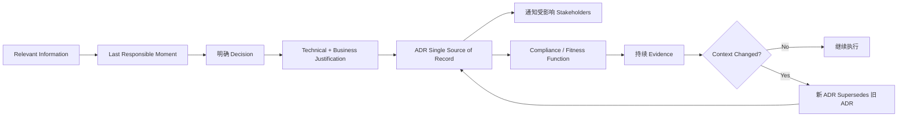
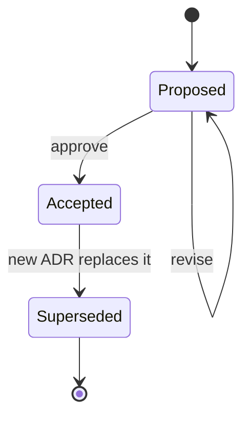
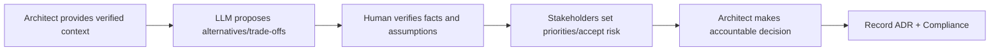

> 对应原书：*Fundamentals of Software Architecture, 2nd Edition*，Chapter 21
>
> 本章主题：架构师如何在信息不完备时，于最后责任时刻作出具有业务与技术依据的决策；如何用 Architectural Decision Records（ADRs）保存上下文、理由、后果和治理方式；以及如何让决策可发现、可追溯、可验证、可演化，而不是散落在邮件和个人记忆中。

---

## 0. 本章要解决什么问题

作出 architectural decisions 是架构师的核心职责之一。Decision 常涉及 application/system structure，也可能指定 technology；只要 technology choice 影响 architecture characteristics，它仍然是 architectural decision。

一项好的架构决策必须形成完整链条：

```text
收集足够相关信息
    -> 识别最后责任时刻
    -> 分析替代项与 Trade-offs
    -> 作出明确决定
    -> 给出技术 + 业务理由
    -> 记录 Context/Consequences
    -> 告知直接相关 Stakeholders
    -> 用 Compliance/Fitness Function 治理
    -> 变化时 Supersede 并保留历史
```

只完成“选技术”远远不够。没有理由，团队会重复争论；没有记录，决定会丢失；没有传播，相关人员不会执行；没有 compliance，决定只是一份愿望；没有 supersession history，未来的人无法理解为何变化。

### 0.1 Decision 的目的不是展示权威

好的 decision 帮助 development teams 作出正确的 technical choices。架构师不是替团队决定每个实现细节，而是：

- 约束会影响 system structure/characteristics 的选择；
- 解释为什么这些约束存在；
- 与实现团队协作验证可行性；
- 为边界内的局部选择保留自主空间。

### 0.2 一句话抓住本章

> 架构决策的价值不只在“选了什么”，更在于让组织长期知道为什么选、接受了什么代价、如何证明仍在遵守，以及何时应该改变。

### 0.3 本章推理主线



### 0.4 阅读边界

原章没有给出正式数学优化算法。本文中的总损失函数、ADR linter、决策分类表和治理清单属于教学扩展，不是作者规定的标准。原章示例自身有少量术语不一致，本文会明确说明，不会静默修成看似一致。

---

## 1. Architectural Decision Antipatterns：架构决策反模式

Andrew Koenig 对 antipattern 的定义是：开始时看似好主意，后来把你带入麻烦。另一种定义是：可重复、却产生负面结果的过程。

原章列出三种最常见 architectural decision antipatterns，并指出它们常按顺序出现：


克服第一种后才会暴露第二种；补足 justification 后，又会暴露 communication/repository 问题。Effective decision 必须跨过三关。

### 1.1 The Covering Your Assets Antipattern：明哲保身反模式

#### 1.1.1 是什么

Architect 因害怕选错而避免或无限延期 decision。表面上“谨慎”，实际把风险和成本转嫁给 teams：

- 开发者各自猜测；
- 临时实现变成事实标准；
- 依赖 decision 的工作阻塞；
- 后期改变代价更高。

#### 1.1.2 方法一：Last Responsible Moment

重要 decision 不应越早越好，也不应无限等信息完美，而应等到 **last responsible moment**：信息足以 justify/validate，同时未晚到阻塞 development。

图 21-1 中：

- 早期 cost 低，因为尚未投入太多分析/实现；
- 早期 risk 高，因为 problem/solution 信息不足；
- 延迟 decision 会增加 cost；
- 更多信息使 risk 下降；
- 两条曲线相交附近，是 cost increase 开始超过 risk reduction 的时间。

原章给出实用问题：

> 什么时候继续推迟的成本超过现在作出决定的风险？

超过该点仍分析，会进入 **Analysis Paralysis antipattern**。

#### 1.1.3 教学扩展：总损失直觉

可把等待时间 $t$ 的决策代价抽象为：

$$
L(t)=C_{delay}(t)+R_{uncertainty}(t)
$$

- $C_{delay}(t)$ 通常随时间上升；
- $R_{uncertainty}(t)$ 通常随信息积累下降；
- 选择目标不是让任一项为 0，而是避免总损失继续恶化。

离散评审时，可寻找第一个满足以下条件的时点：

$$
\Delta C_{delay}\ge -\Delta R_{uncertainty}
$$

即再等一轮增加的成本，已不小于风险下降。曲线无法精确量化时，仍可列出具体 waiting cost 和 missing evidence 来讨论。这个公式只是图 21-1 的教学解释，不是原书算法。

#### 1.1.4 可运行示例：识别最后责任时刻

```python
review_points = [
    {"week": 1, "delay_cost": 10, "decision_risk": 90},
    {"week": 2, "delay_cost": 25, "decision_risk": 65},
    {"week": 3, "delay_cost": 45, "decision_risk": 48},
    {"week": 4, "delay_cost": 70, "decision_risk": 38},
]

def last_responsible_moment(points: list[dict[str, int]]) -> int:
    for previous, current in zip(points, points[1:]):
        added_cost = current["delay_cost"] - previous["delay_cost"]
        reduced_risk = previous["decision_risk"] - current["decision_risk"]
        if added_cost >= reduced_risk:
            return previous["week"]
    return points[-1]["week"]

for point in review_points:
    total = point["delay_cost"] + point["decision_risk"]
    print(f"week {point['week']}: total={total}")
print("decide by week", last_responsible_moment(review_points))
```

输出：

```text
week 1: total=100
week 2: total=90
week 3: total=93
week 4: total=108
decide by week 2
```

Week 2 的总损失最低；比较 week 2 到 week 3 的估算时，新增 cost 20 已超过 risk reduction 17，说明阈值位于两者之间，因此最迟应在 week 2 评审时拍板，而不是等到 week 3。真实项目不会有如此精确数字，代码只展示如何把模糊争论变成证据讨论。

#### 1.1.5 方法二：与 Development Teams 协作

没有 architect 能掌握每项 technology 的全部细节。Close collaboration 能：

- 快速得到 implementation feedback；
- 发现隐藏 constraints；
- 修正错误 assumptions；
- 降低决定不可实现的风险；
- 避免架构师与团队的对抗。

#### 1.1.6 Replicated Cache 案例

Architect 决定把 product description、weight、dimensions 等 reference data 缓存在所有需要的 service instances：

- 使用 read-only replicated/in-memory cache；
- Primary cache 由 `Catalog` service 拥有；
- Catalog 更新后复制到其他 services；
- 理由是减少 interservice calls 和 coupling。

Development teams 发现某些 services 有很高 scalability requirements，实例很多；每实例复制会占用超过可用 in-process memory。

这不是团队“违反架构”，而是 decision 的 context 不完整。协作让 architect 及时知道问题并调整，例如改用 distributed cache、只复制热点 subset 或重新划数据边界。

### 1.2 Groundhog Day Antipattern：土拨鼠日反模式

#### 1.2.1 是什么

团队不知道 architect 为什么作出 decision，于是不断重新讨论同一问题，无法达成 final resolution。名称来自 1993 年电影 *Groundhog Day*，Bill Murray 的角色每天重复 2 月 2 日。

根因不是“团队不服从”，而是 architect 没有完整 justify decision。

#### 1.2.2 必须同时提供 Technical 与 Business Justification

例子：把 monolith 拆成 separate services。

Technical justification：

- Decouple functional aspects；
- 每部分使用更少 VM resources；
- 可独立 maintain/deploy。

这些还不足以回答“为什么 business 应为重构付钱”。Business justification 可以是：

- 更快交付新 business functionality，改善 time to market；
- 降低开发和发布新 feature 的成本。

#### 1.2.3 Business Value 是 Decision 的 Litmus Test

若 architectural decision 不能提供 business value，应重新考虑。原章列出四种常见 business justifications：

1. Cost；
2. Time to market；
3. User satisfaction；
4. Strategic positioning。

理由必须匹配 stakeholders 真正关心的目标。Stakeholders 优先 time to market 时，只谈 cost saving 可能说服力不足，也可能优化错方向。

#### 1.2.4 从 Business Concern 翻译到 Architecture Characteristic

```text
Time to market
    -> Maintainability + Testability + Deployability

User satisfaction
    -> Responsiveness + Availability + Usability

Sustained growth
    -> Scalability + Elasticity + Evolvability

Cost pressure
    -> Simplicity + Resource efficiency + Operational cost
```

该映射需要 context，不是固定词典。例如医疗用户满意还可能首先意味着 safety/reliability。

### 1.3 Email-Driven Architecture Antipattern：邮件驱动架构反模式

#### 1.3.1 是什么

Decision 已作出且 justify，却被人遗忘、丢失，或直接相关的人根本不知道，所以无法 implementation。

Email 是好的 notification tool，却是差的 document repository。

#### 1.3.2 为什么不要把 Decision 写在 Email Body

- 每封邮件产生 decision copy，形成 multiple systems of record；
- 不同邮件可能省略 justification/details；
- 再次诱发 Groundhog Day；
- Decision superseded 后，不知道所有收件人是否得到修订；
- 搜索、版本、链接和状态难统一。

#### 1.3.3 正确方法：Email 只通知 Context + Link

Email body 只写：

1. Decision 的 nature/context；
2. 为什么它直接影响 receiver；
3. 指向 single system of record 的 link。

原章示例大意：

```text
Sandra，我作出了一项关于服务间通信的重要决策，与你直接相关。
请通过以下链接查看该决策……
```

不在 body 复制实际决定。这样 source of record 可以是 wiki page 或 filesystem document。

#### 1.3.4 通知谁

Litmus test：**该 architectural decision 是否直接影响此人？**

- 是：定向通知；
- 否：无需用邮件打扰，但公开 repository 仍可查询。

Broadcast 给所有人会造成 notification fatigue；只通知少数人却藏起 repository 会造成不可发现。应把 targeted push 与 searchable pull 结合。

### 1.4 三个反模式的完整修复闭环

| Antipattern | 根因 | 修复 |
|---|---|---|
| Covering Your Assets | 怕错而不决定 | Last responsible moment + team collaboration |
| Groundhog Day | 缺少完整理由 | Technical + business justification |
| Email-Driven Architecture | 决定散落/不可发现 | Single system of record + targeted link notification |

三个修复分别对应：**timing、reasoning、communication**。

---

## 2. Architectural Significance：架构显著性

### 2.1 Technology Decision 何时也是 Architecture Decision

“指定某 technology 就只是技术决定”是误区。若 technology 直接支持/影响重要 architecture characteristic，它就是 architectural decision。

例如：

- 因低 latency 选择 gRPC；
- 因 elasticity 选择某 messaging platform；
- 因 audit/security 选择 immutable log；
- 因 deployment isolation 选择 container runtime。

关键不在产品名称，而在影响范围和系统性 consequences。

### 2.2 Michael Nygard 的 Architecturally Significant

Michael Nygard 用 **architecturally significant** 界定 architect 应负责的 decision。它们影响：

1. Structure；
2. Non-functional characteristics；
3. Dependencies；
4. Interfaces；
5. Construction techniques。

### 2.3 Structure

影响 architecture patterns/styles 的决定。

例：在一组 microservices 间共享 code，会破坏 bounded context，改变 system structure，因此是 architectural decision。

### 2.4 Non-Functional Characteristics

这里指重要 architecture characteristics。若 technology choice 影响关键 performance、scalability、availability 等，即使具体到 product/framework，也具有架构显著性。

判断必须有前提：performance 若不是系统重要 driver，微小性能差异未必提升为架构决策。

### 2.5 Dependencies

Components/services 之间的 coupling points。Dependency 会影响：

- Scalability；
- Modularity；
- Agility；
- Testability；
- Reliability。

因此共享 library、同步服务调用、共享 database、中央 broker 等 dependency decision 都应被记录。

### 2.6 Interfaces

描述 services/components 如何 accessed/orchestrated，通常包括：

- Gateway；
- Integration hub；
- Service bus；
- Adapter；
- API proxy。

Interface decisions 常需要定义 contracts、versioning 和 deprecation strategies，并影响外部 consumers，因此具有架构意义。

### 2.7 Construction Techniques

Platforms、frameworks、tools，甚至 processes 若影响 architecture，也属于 architecture decision。例如统一 deployment pipeline、schema migration technique、fitness-function framework。

### 2.8 教学扩展：Significance 筛选问题

可依次询问：

1. 是否改变 system boundary/topology？
2. 是否显著影响关键 characteristic？
3. 是否产生跨 component/team dependency？
4. 是否改变 public contract/interface？
5. 是否限制长期 construction/deployment technique？
6. 是否昂贵、难逆或具有长寿命？

前五项直接映射 Nygard 分类；第六项是常用决策范围补充。回答多个“是”时，应创建 ADR。不是每个代码风格偏好都需要 ADR。

---

## 3. Architectural Decision Records：架构决策记录

ADR 是记录 architectural decision 的短文本文件，通常 1–2 页。Michael Nygard 在 2011 年 blog post 中推广，Thoughtworks Technology Radar 在 2017 年建议广泛采用。

可使用：

- Plain text；
- Wiki template；
- AsciiDoc；
- Markdown。

Nat Pryce 的开源 **ADR Tools** 提供 CLI，管理 numbering、location 和 superseded logic；Micha Kops 提供 ADR tooling 示例。

### 3.1 ADR 为什么有效

它把决定拆成七个可验证问题：

```text
Title：这是哪个决定？
Status：现在处于什么生命周期？
Context：什么力量迫使我们决定？
Decision：我们将做什么，为什么？
Consequences：得到和失去什么？
Compliance：如何知道大家在执行？
Notes：谁、何时、由谁批准和修改？
```

### 3.2 Basic Structure：基本结构

标准五段是 Title、Status、Context、Decision、Consequences。作者强烈建议增加 Compliance 与 Notes。

模板可扩展，例如新增 Alternatives，但应保持 consistent 和 concise。

#### 3.2.1 Title

通常顺序编号 + 简短、无歧义的描述。

原章示例：

```text
42. Use of Asynchronous Messaging Between Order and Payment Services
```

Title 应让人不打开正文也知道 nature/context，但不塞入全部 rationale。

#### 3.2.2 Status

基本生命周期有三个 statuses：

- **Proposed**：需 higher-level decision maker/architecture review board 批准；
- **Accepted**：已批准，可 implementation；
- **Superseded**：已被新 ADR 替代。



Proposed ADR 不会被 superseded，而是修改直到 accepted。Superseded 隐含旧 ADR 曾 accepted。

##### 3.2.2.1 双向 Supersession Link

例子：

```text
ADR 42: asynchronous messaging
Status: Superseded by 68

ADR 68: REST
Status: Accepted, supersedes 42
```

双向历史链能回答“为什么不用 messaging”，保留：

- 当时 Context；
- 原选择理由；
- 后来哪些条件变化；
- 新 decision 的 consequences。

原章一处称 ADR 42 处于 `Approved` status，但正式状态表和示例均使用 `Accepted`。本文把 `Approved` 视为自然语言“已批准”，不新增第四个正式状态。

##### 3.2.2.2 ADRs and Request for Comments (RFC)

为扩大 stakeholder collaboration，可添加 **Request for Comments** status，并给出 feedback deadline：

```text
STATUS
Request For Comments, Deadline 09 JAN 2026
```

Deadline 到达后：

1. Architect 分析 comments；
2. 调整 decision；
3. 作出 final decision；
4. 设置 Proposed；
5. 若 architect 有批准权，可直接 Accepted。

RFC 是协作阶段，不等于无限讨论。Deadline 防止 review 变成新的 Analysis Paralysis。

##### 3.2.2.3 谁拥有 Approval Authority

Status 会迫使 architect 与 boss/lead architect 讨论 approval criteria。原章建议从三类开始：

1. **Cost**；
2. **Cross-team impact**；
3. **Security**。

Cost 包括：

- Software purchase/license；
- Additional hardware；
- Implementation level of effort。

工时成本估算：

$$
Cost_{labor}=EstimatedHours\times FTERate
$$

FTE（full-time equivalency）rate 通常由 project owner/manager 提供。

例：决定成本超过 `$5,000`，必须 Proposed 并由 ARB 批准；若影响其他 teams/systems 或有 security implications，也应提高批准层级。阈值必须文档化，让所有 architects 知道何时可 self-approve。

#### 3.2.3 Context

Context 写 **forces at play**，回答：

> What situation is forcing me to make this decision?

它应：

- 描述具体 circumstance；
- 简要列出 alternatives；
- 同时记录相关 architecture area；
- 不提前把 decision 当成既定事实。

原章示例：

```text
Order service 必须把当前订单信息传给 Payment service 以完成支付；
可以使用 REST 或 asynchronous messaging。
```

若要求详细分析所有 alternatives，应新增 Alternatives section，而不是让 Context 失控变长。

#### 3.2.4 Decision

包含两部分：

1. 明确 architectural decision；
2. 完整 justification。

Nygard 建议使用 affirmative, commanding voice：

```text
We will use asynchronous messaging between services.
```

不要写：

```text
I think asynchronous messaging might be the best choice.
```

后者只是 opinion，无法确认是否已决定。

##### Why 比 How 更重要

Decision section 的最大价值是 justification。未来的人通常能看懂 how，却不知道 why。

原章 gRPC 案例：

- 原 architect 因 very high responsiveness needs 和降低 network latency 选择 gRPC；
- 数年后新 architect 为统一通信改 REST；
- 不知道原理由，导致 latency 上升和 upstream timeouts；
- 若 ADR 记录“用 latency 换更 tight coupling”，新 decision 就会重新分析该 trade-off。

#### 3.2.5 Consequences

每个 decision 都有 good/bad impact。Consequences 强迫 architect 判断 negative impacts 是否超过 benefits，也是记录 trade-off analysis 的位置。

##### 异步评论案例

Decision：网站评论采用 asynchronous fire-and-forget messaging。

收益：用户响应从 3,100 ms 降到 25 ms，只等消息入 queue，不等 review 真正发布。

代价：error handling 更复杂，例如评论含 bad words 时不能在当前请求直接反馈。

Architect 已与 business stakeholders/其他 architects 讨论，并决定优先 responsiveness，接受复杂后续错误处理。若 Consequences 完整记录，团队就不会因只看到代价而重新争论。

Consequences 不是宣传材料，必须同时写：

- Positive outcomes；
- Negative outcomes；
- Risks；
- Operational burden；
- Accepted trade-offs。

#### 3.2.6 Compliance

Compliance 不是标准 ADR section，但作者强烈推荐。它回答：

> 如何 measure 和 govern 这项 decision？

选择：

- Manual review；
- Automated fitness function；
- 两者结合。

##### Layered Architecture 示例

Decision：Business layer 使用的所有 shared objects 必须放入 Shared Services layer，以隔离和包含 shared functionality。

图 21-3 显示 Presentation/Business/Persistence/Database layers closed，Services layer open；Business components 指向 Services layer 中 shared component。

可用 Java ArchUnit 自动检查：

```java
@Test
public void shared_services_should_reside_in_services_layer() {
    classes().that().areAnnotatedWith(SharedService.class)
        .should().resideInAPackage("..services..")
        .check(myClasses);
}
```

也可用 C# NetArchTest。要让 fitness function 工作，还需创建 `@SharedService` annotation 并标记所有 shared classes，因此 Compliance 可能反向产生 implementation stories。

##### Compliance 的三层设计

```text
Decision intent
    -> Observable marker/evidence
    -> Automated/manual check
    -> Violation owner + remediation
```

只写“通过 code review 保证”仍不够，应明确频率、责任人和违规处理。

#### 3.2.7 Notes

Notes 也不是标准 section，但作者强烈推荐，包含 metadata：

- Original author；
- Approval date；
- Approved by；
- Superseded date；
- Last modified date；
- Modified by；
- Last modification。

即使 ADR 存在 Git 中，仍建议添加 Notes，因为 repository metadata 未必表达 approval、supersession 和业务意义。

### 3.3 可运行示例：ADR Linter 与 Supersession 校验

下面的教学代码检查 required sections、workflow status 和双向 supersession。原书正式状态只有 Proposed、Accepted、Superseded；RFC 是可选的协作流程扩展。代码为同时校验这两类状态，将它们都纳入 `workflow_statuses`。它不替代人工 trade-off review。

```python
adrs = {
    42: {
        "title": "Use asynchronous messaging",
        "status": "Superseded",
        "superseded_by": 68,
        "context": "Order must communicate with Payment.",
        "decision": "We will use asynchronous messaging.",
        "consequences": "Higher responsiveness; harder error handling.",
    },
    68: {
        "title": "Use REST",
        "status": "Accepted",
        "supersedes": 42,
        "context": "Payment location and implementation changed.",
        "decision": "We will use REST.",
        "consequences": "Consistent API; higher latency.",
    },
}

required = {"title", "status", "context", "decision", "consequences"}
workflow_statuses = {"Proposed", "Accepted", "Superseded", "RFC"}

def validate(records: dict[int, dict[str, object]]) -> list[str]:
    errors: list[str] = []
    for number, adr in records.items():
        missing = sorted(required - adr.keys())
        if missing:
            errors.append(f"ADR {number}: missing {', '.join(missing)}")
        if adr.get("status") not in workflow_statuses:
            errors.append(f"ADR {number}: invalid status")

        newer = adr.get("superseded_by")
        if newer is not None:
            if adr.get("status") != "Superseded":
                errors.append(f"ADR {number}: must be Superseded")
            elif records.get(newer, {}).get("supersedes") != number:
                errors.append(f"ADR {number}: broken forward link")

        older = adr.get("supersedes")
        if older is not None and records.get(older, {}).get("superseded_by") != number:
            errors.append(f"ADR {number}: broken backward link")
    return errors

problems = validate(adrs)
print("valid" if not problems else "\n".join(problems))
print("history: 42 ->", adrs[42]["superseded_by"])
```

输出：

```text
valid
history: 42 -> 68
```

局限：格式完整不代表 decision 正确；linter 无法判断 business value、alternatives 是否充分或 consequences 是否诚实。

### 3.4 Example：GGG 的 ADR 76

Going, Going, Gone（GGG）拍卖系统有大量 decisions，例如：

- 分离 bidder/auctioneer UIs；
- Event-driven + microservices hybrid；
- Video capture 使用 Real-time Transport Protocol（RTP）；
- Single API Gateway；
- Messaging 使用 separate queues。

无论 decision 看起来多 obvious，都应 document 和 justify。

#### 3.4.1 图 21-4 与 Decision

图形显示 `Bid Capture` 分别向 `Bid Streamer`、`Bid Tracker` 发送两条 point-to-point queues。

ADR 标题：

```text
ADR 76. Separate Queues for Bid Streamer and Bidder Tracker Services
```

Status：Accepted。

#### 3.4.2 Context

`Bid Capture` 收到 bid 后必须发给：

- `Bid Streamer`；
- `Bidder Tracker`。

Alternatives：

1. Single topic（pub/sub）；
2. 每个 service 独立 queue（point-to-point）；
3. 经 Online Auction API layer 使用 REST。

#### 3.4.3 Decision 与四个理由

Decision：**We will use separate queues**。

理由一：Communication one-way，Bid Capture 不需要 downstream response。

理由二：Bid Streamer 必须按 Bid Capture 接受顺序收到 bids；FIFO queue 提供 queue 范围内的顺序。

理由三：同一 amount 可能有多个 bids。Bid Streamer 只需该 amount 第一笔；Bidder Tracker 需要所有 bids。Single topic 会迫使 Streamer 过滤重复 amount 并在多 instances 间保存 shared state。

理由四：

- Streamer 把 item bids 存在 in-memory cache，速度快；
- Tracker 写 database，较慢，需要独立 backpressure；
- Dedicated Tracker queue 提供独立缓冲。

注意：FIFO 只在 broker 的 queue/partition 配置、单/有序消费语义范围内保证；生产实现仍需明确 key、consumer concurrency 和 redelivery。这是实现边界补充。

#### 3.4.4 Consequences

- Message queues 需要 clustering 和 high availability；
- Bid Capture 要把同一 information 发送到 multiple queues；
- Internal bid events 绕过 API layer security checks；
- 2025-01-14 ARB review 接受该 trade-off，不增加额外 security checks。

最后一点展示 Notes/Consequences 可以记录后续审查和已接受风险，而不只记录初版理由。

#### 3.4.5 Compliance 与原文内部不一致

ADR Compliance 说使用 periodic manual code reviews，原理上应检查“Bid Capture 到两个 consumers 使用 separate asynchronous point-to-point queues”。

但原文 Compliance 写的是 **asynchronous pub/sub messaging**，图 21-4 caption 也写 “Use of pub/sub between services”；这与 ADR 的 Title、Context、Decision 以及图中两条 queues 冲突。

本文处理方式：

- 以 ADR Decision 和图形 topology 为决策事实：separate point-to-point queues；
- 把 caption/Compliance 的 pub/sub 视为原文术语不一致；
- 实际 ADR 应修正 Compliance，使它验证的正是 Decision，否则“合规检查”会检查错对象。

#### 3.4.6 Notes

- Author：Subashini Nadella；
- Approved：ARB Meeting Members，14 JAN 2025；
- Last Updated：14 JAN 2025。

### 3.5 Storing ADRs：存储 ADR

#### 3.5.1 基本原则

每个 architectural decision 应有自己的 file 或 wiki page。不要把多个 decisions 混在一个大文档中，否则 status、links 和 history 难独立维护。

#### 3.5.2 与 Source Code 同 Repository

优点：

- 与 code 一起 version/track；
- Development team 容易在 PR 中更新；
- Decision 靠近 implementation。

大型组织的风险：

- 需要查看 decision 的人未必有 repo access；
- Integration/enterprise/common decision 超出单应用 context；
- 同一决策可能被复制进多个 repos。

因此原章建议 dedicated ADR Git repository、wiki 或 shared file-server directory，确保相关人员易于访问。

#### 3.5.3 推荐目录结构

```text
architecture-decisions/
├── application/
│   ├── common/
│   ├── app1/
│   └── app2/
├── integration/
└── enterprise/
```

##### Application / Common

适用于所有 applications 的 decisions。例如所有 framework-related classes 必须用 Java `@Framework` annotation 或 C# `[Framework]` attribute 标记。

##### Application / app1, app2

只属于某 application/system context 的 decisions。

##### Integration

涉及 applications、systems 或 services 之间 communication 的 ADRs。

##### Enterprise

影响所有 systems/applications 的 global decisions。例如：system database 只能由 owning system 访问，禁止跨系统共享数据库。

Wiki 可用 landing pages 表示同一层级，每个 ADR 是独立 page。

目录名只是 recommendation/example。组织可选择适合自身的名称，但必须跨 teams consistent。

#### 3.5.4 Repository 还应提供什么（教学扩展）

- Index/search；
- Owner/affected systems metadata；
- Status filter；
- Supersession backlinks；
- Review date；
- Template/linting；
- Read permissions broad, write permissions controlled；
- Stable links，避免 Email 链接失效。

### 3.6 ADRs as Documentation：把 ADR 当架构文档

Software architecture 一直难以文档化。C4 Model、ArchiMate 等 diagramming standards 正在出现，但没有统一的软件架构文档标准。

ADR 能记录最有价值的 architecture knowledge：

- Context 描述某个 architecture area 和 alternatives；
- Decision 记录为什么选择；
- Consequences 记录 trade-off，例如为何 performance 优先于 scalability；
- Supersession history 记录 architecture evolution。

Diagram 回答“现在是什么形状”，ADR 回答“为什么变成这个形状”。二者互补，不能相互替代。

### 3.7 Using ADRs for Standards：用 ADR 表达标准

Developers 讨厌的 standards 往往只强调 control，不说明 purpose。

ADR 改变标准表达：

- Context：什么问题迫使组织建立标准？
- Decision：标准是什么，更重要的是为什么存在？
- Consequences：会产生什么代价，是否值得？
- Compliance：如何检查而不靠随意执法？

若 architect 无法 justify 一个 standard，它可能不应存在。理解 why 后，developers 更可能遵守，也更能在 context 变化时提出有依据的 challenge。

### 3.8 Using ADRs with Existing Systems：在既有系统中使用 ADR

系统已 production，不代表 ADR 没用。ADR 不只是事前 approval 文档，也用于恢复 decision rationale 和审视历史选择。

实施步骤：

1. 选择 architecturally significant decisions；
2. 调查当前 topology/code/data/history；
3. 追问 why；
4. 若原 decision maker 已离职，重建 alternatives/trade-offs；
5. Validate 或 invalidate 现有 decision；
6. 写入当前 Context、Decision、Consequences；
7. 需要改变时新建 ADR 并 supersede。

例：多个 services 共享 database。要问：

- Why shared？
- 是否有 transaction/performance 理由？
- 是否应拆 data？
- Change/fault/scale consequences 是什么？

这个过程逐步建立 system 的 justifications、rationales 和 **brain trust**，并可能发现 architecture inefficiencies 和 incorrect design。

### 3.9 Leveraging Generative AI and LLMs in Architectural Decisions

#### 3.9.1 LLM 面对的典型问题

- Downstream data 用 messaging、streaming 还是 event sourcing？
- Monolithic database 还是 domain databases？
- Payment Processing 是单一 service 还是按 payment type 拆分？

答案仍是 It depends，因为 First Law：everything is a trade-off。

#### 3.9.2 为什么概率答案和 Best Practice 不够

多数 LLM 主要基于 probability 生成“给定 prompt 最可能答案”，并容易复述所谓 best practice。Architecture decision 却需要：

- 特定 business context；
- 特定 technical constraints；
- Organization capabilities；
- 各 alternatives 的 trade-offs；
- Stakeholder priority。

最常见答案不一定适合当前公司。结构性问题没有脱离 context 的 best practice。

#### 3.9.3 从 Business Concern 到 Characteristics

Architecture decision 先把 business concern 翻译为 characteristics。

原章例子：若 business 最关心 time to market，则 maintainability 比 performance 更重要，并驱动优化 maintainability。

Payment Processing 的选择：

| 方案 | 倾向收益 | 倾向代价 |
|---|---|---|
| Single payment service | Performance 较好，少远程协调 | Maintainability/独立变化较弱 |
| Service per payment type | Maintainability 较好，独立变化 | Network/coordination 影响 performance |

若 time to market 是首要 concern，multiple services 在该特定 context 可能更合适。换一个 context，例如极低 latency，答案可能相反。

这种翻译并不显然，需要多年经验，是 trade-off analysis 的基础。

#### 3.9.4 LLM 的最佳角色

原章基于作者近期实验给出 best-case scenario：让 generative AI **outline possible trade-offs**，帮助发现遗漏项。

适合：

- 生成 alternatives 清单；
- 提醒常见 consequences；
- 质疑 assumptions；
- 草拟 ADR 结构；
- 检查遗漏的 operational concerns。

不适合直接承担：

- 最终 priority 排序；
- Business context 真伪判断；
- Stakeholder risk acceptance；
- Approval accountability；
- 最终 architectural decision。

#### 3.9.5 Knowledge 与 Wisdom

原章结论：Generative AI 有大量 **knowledge**，但缺少作出最合适 architecture decision 所需的 **wisdom**。

更准确的工作流：



AI output 不能作为证据本身。产品能力、成本、安全和法规事实应查官方来源/实测；敏感企业 context 也要遵守数据政策。

---

## 4. ADR 的完整生命周期

把本章各部分串起来，ADR 不是静态文件，而是一条决策控制回路。

### 4.1 Create

- 识别 architecturally significant issue；
- 收集 Context 和 alternatives；
- 等到 last responsible moment；
- 与 development teams 协作验证。

### 4.2 Review

- 可设 RFC + deadline；
- 获取直接 stakeholders 反馈；
- 根据 cost/cross-team/security 决定 approval level。

### 4.3 Decide

- 用 commanding voice；
- 写 technical/business justification；
- 诚实记录 Consequences；
- 状态 Accepted。

### 4.4 Communicate

- 写入 single system of record；
- 定向通知受影响者；
- Email 只含 context + link。

### 4.5 Govern

- Compliance 定义 evidence；
- Automated fitness function 或 manual review；
- 明确 violation owner/remediation。

### 4.6 Evolve

- Context 改变时创建新 ADR；
- 旧 ADR 标记 Superseded by N；
- 新 ADR 标记 Accepted, supersedes M；
- 保留完整 rationale history。

---

## 5. 易混淆概念与常见误区

### 5.1 Architecture Decision 只涉及 Structure，不涉及 Technology

错误。Technology 若影响 architecture characteristics、dependencies、interfaces 或 construction techniques，就具有架构显著性。

### 5.2 架构师应等信息完整后再决定

错误。信息永远不完整；应在 last responsible moment 决定，避免 Analysis Paralysis。

### 5.3 越早决定越有领导力

错误。过早 risk 高。好的 timing 在“获得足够证据”和“不阻塞团队”之间。

### 5.4 Architecture Decision 是架构师个人命令

错误。需要与 development teams 协作验证可实现性，并让 stakeholders 参与 trade-off/risk acceptance。

### 5.5 Technical Justification 足够

错误。没有 business value，组织不会知道为何付成本，也无法判断优先级。

### 5.6 Business Justification 等于永远写 Cost Saving

错误。还包括 time to market、user satisfaction、strategic positioning，必须匹配 stakeholders priorities。

### 5.7 Email 是 ADR Repository

错误。Email 用于定向通知和 link；decision body 必须只有一个 source of record。

### 5.8 所有人都应收到每个 ADR 邮件

错误。只通知直接受影响者；repository 应对需要者可发现。

### 5.9 ADR 越长越严谨

错误。通常 1–2 页，consistent/concise。详细 alternatives 可独立 section 或 supporting analysis。

### 5.10 Proposed 和 RFC 相同

错误。RFC 是带 deadline 的反馈阶段；Proposed 是等待正式 approval 的决定。

### 5.11 Proposed ADR 可以被 Superseded

原章明确否定。Proposed 应修改至 Accepted；Superseded 针对曾 Accepted 的 decision。

### 5.12 Superseded 表示旧 Decision 当时错误

错误。它可能在旧 Context 下正确，只是条件改变。保留历史正是为了避免事后误判。

### 5.13 `Approved` 是第四个标准 Status

不是。原章正式三状态为 Proposed/Accepted/Superseded；一处 `Approved` 是自然语言，与 Accepted 对应。

### 5.14 Context 应写成支持已选方案的论证

错误。Context 描述 forces 和 alternatives；Decision 才写选择与 justification。

### 5.15 Decision 只写 “Use Kafka” 即可

错误。必须说明具体 context、用途和 why，否则 product name 既含糊又无法未来重评。

### 5.16 Consequences 只写收益

错误。它必须记录 negative impact 和 accepted trade-offs，否则 ADR 只是营销文案。

### 5.17 Compliance 是可选装饰

虽非标准五段，但作者强烈推荐。无法检查的 decision 很容易结构衰减。

### 5.18 Git History 可以完全替代 Notes

错误。Git 不一定表达 approved by、approval date、business review 和 supersession metadata。

### 5.19 ADR 只能用于新系统

错误。既有系统更需要恢复 why、验证历史决定和建立 brain trust。

### 5.20 ADR 是完整 Architecture Documentation 的替代品

错误。ADR 擅长 rationale/evolution；C4/ArchiMate 等 diagram 描述当前结构，运行手册描述操作。它们互补。

### 5.21 Standards 不需要说明 Why

错误。无法 justify 的 standard 可能不应存在。Context/Consequences 还能暴露 control-only rule。

### 5.22 LLM 能按 Best Practice 自动选架构

错误。最可能答案不等于当前 context 最合适答案。AI 可扩展 trade-off 搜索，不能替代 priority、wisdom 和 accountability。

### 5.23 FIFO 意味跨所有 Queue 的全局顺序

错误。ADR 76 的顺序保证必须限定到具体 queue/partition 和消费模型。

### 5.24 ADR 76 的 Compliance 与 Decision 完全一致

原文不一致。Decision 是 separate point-to-point queues；Compliance/caption 误写 pub/sub。真实 ADR 必须让 Compliance 精确验证 Decision。

---

## 6. 一般化的问题解决方法

本节是对原章方法的教学性归纳，不是原章逐项给出的正式算法。

### 第 1 步：判断是否 Architecturally Significant

检查 structure、characteristics、dependencies、interfaces、construction techniques 和长期影响。

### 第 2 步：列出 Forces、Unknowns 与 Alternatives

区分已验证事实、assumptions、待实验项，不要把 solution 偷写进 Context。

### 第 3 步：识别 Last Responsible Moment

明确继续等待能获得什么 evidence、会增加什么 delay/rework cost；当 cost 增量超过 risk reduction 时决定。

### 第 4 步：与实现团队做 Cheap Validation

Prototype、capacity estimate、API spike、failure test，尽早发现 cache memory 等隐藏约束。

### 第 5 步：翻译 Business Value

把 time to market、user satisfaction、growth、cost 等 concern 映射到 architecture characteristics。

### 第 6 步：用 Commanding Voice 作出 Decision

写 “We will...”，并限定 scope、owner 和适用 context。

### 第 7 步：记录完整 Consequences

写清收益、代价、风险、缓解措施和 accepted residual risk。

### 第 8 步：设计 Compliance

确定 observable evidence、fitness function/manual review、频率、owner 和 violation response。

### 第 9 步：存入 Single System of Record 并定向传播

一个 decision 一个 file/page；Email/Chat 只发 context + stable link。

### 第 10 步：保留 Evolution Trail

新 context 产生新 ADR，双向 supersession，不改写旧历史使其“看起来一直正确”。

### 第 11 步：把 AI 当 Trade-off 助手

让 LLM 提醒 alternatives/consequences；由人验证事实、设 priority、承担 decision。

---

## 7. 本章知识结构

```mermaid
flowchart TB
    AD[Architectural Decisions]
    AD --> ANTI[Decision Antipatterns]
    AD --> SIG[Architectural Significance]
    AD --> ADR[Architectural Decision Records]
    AD --> USE[Uses]
    AD --> AI[Generative AI]

    ANTI --> CYA[Covering Your Assets]
    ANTI --> GD[Groundhog Day]
    ANTI --> EMAIL[Email-Driven Architecture]
    CYA --> LRM[Last Responsible Moment]
    GD --> JUST[Technical + Business Justification]
    EMAIL --> SOR[Single System of Record]

    SIG --> STRUCT[Structure]
    SIG --> CHAR[Non-functional Characteristics]
    SIG --> DEP[Dependencies]
    SIG --> INT[Interfaces]
    SIG --> BUILD[Construction Techniques]

    ADR --> TITLE[Title]
    ADR --> STATUS[Status/RFC/Supersession]
    ADR --> CONTEXT[Context]
    ADR --> DEC[Decision + Why]
    ADR --> CONS[Consequences]
    ADR --> COMP[Compliance]
    ADR --> NOTES[Notes]

    USE --> STORE[Dedicated Repo/Wiki/Directory]
    USE --> DOC[Architecture Documentation]
    USE --> STD[Standards]
    USE --> EXIST[Existing Systems/Brain Trust]

    AI --> TRADE[Outline Trade-offs]
    AI --> HUMAN[Human Wisdom + Accountability]
```



---

## 8. 核心结论

1. **架构师的核心职责之一是作出 architecture decisions。** 目标是指导 teams 做正确的技术选择，而非展示个人权威。
2. **Decision 必须完整经历信息、时机、理由、记录、传播和治理。** 少一环就会产生反模式。
3. **Covering Your Assets 来自怕错。** 用 last responsible moment 和 team collaboration 解决，而不是无限分析。
4. **Groundhog Day 来自缺少 Why。** 每个 decision 都需要 technical + business justification。
5. **Email-Driven Architecture 来自错误存储与传播。** Email 只通知 context/link，ADR repository 是 single source of record。
6. **Technology choice 也可能 architecturally significant。** 判断标准是 structure、characteristics、dependencies、interfaces、construction techniques。
7. **ADR 是短而持久的 rationale record。** 标准五段是 Title、Status、Context、Decision、Consequences；作者建议增加 Compliance、Notes。
8. **Status 形成生命周期。** Proposed -> Accepted -> Superseded；RFC 增加有截止日期的协作阶段。
9. **Supersession 应双向链接并保留历史。** 新 context 不会抹掉旧 decision 当时的合理性。
10. **Context 写 forces，Decision 写明确选择与 Why，Consequences 写完整 trade-offs。** 三者不能混用。
11. **Compliance 把 decision 从文档变成可验证约束。** ArchUnit/NetArchTest、logs 和 fitness functions 都可提供 evidence。
12. **GGG ADR 76 说明理由决定实现细节。** Separate queues 同时满足单向通信、FIFO、不同数据需求和独立 backpressure。
13. **原章 ADR 76 有术语不一致。** Decision/图形是 point-to-point queues，caption/Compliance 却写 pub/sub；实际 ADR 必须修正。
14. **ADR storage 必须可访问、可查找、可追溯。** Dedicated repo/wiki/shared directory 比散落邮件更可靠。
15. **ADR 可成为架构文档和标准的 rationale 层。** 它不能替代 diagrams/runbooks，但能解释 Why 和 evolution。
16. **既有系统同样适用 ADR。** 追问历史 Why 可重建 brain trust，并暴露 architecture inefficiency。
17. **LLM 适合扩展 trade-off 清单，不适合替代最终决策。** Probability/“best practice”无法自动理解特定 business priority。
18. **Knowledge 不等于 Wisdom。** 架构师和 stakeholders 必须验证事实、排序 characteristics、接受风险并承担 accountability。

最终可以把本章压缩成一句架构判断：

> 在最后责任时刻作出有业务与技术依据的明确选择，把 Why、Consequences 和 Compliance 写进唯一可追溯的 ADR，并让未来的改变通过新决策延续历史，而不是覆盖历史。
