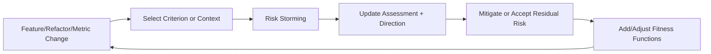
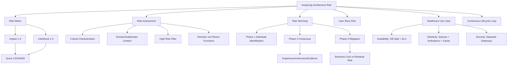

> 对应原书：*Fundamentals of Software Architecture, 2nd Edition*，Chapter 22
>
> 本章主题：如何把“我觉得这里有风险”的个人意见，转化为基于影响、可能性、上下文和关键架构特征的团队判断；如何通过 risk assessment 持续跟踪风险方向，并通过三阶段 risk storming 在风险进入生产环境前识别、达成共识并协商缓解方案。

---

## 0. 本章要解决什么问题

原章开篇明确区分前两类 architecture risk：

- **Operational risk**：availability、scalability、elasticity、performance、security、data integrity 等不达标；
- **Structural risk**：logical components 之间 static coupling、错误依赖方向、共享数据造成的变化扩散等；

从落地视角还可以补充一类教学扩展（非原章原句分类）：

- **Delivery/organizational risk**：团队不熟悉技术、缺少运维能力、缓解成本超出预算等。

Architecture risk analysis 是 architect 最重要的活动之一，因为它能在问题成为 production incident 前发现：

- Architecture deficiency；
- Structural decay；
- 未被验证的 assumptions；
- 单点和容量瓶颈；
- 团队知识缺口；
- 需要 corrective action 的区域。

困难在于 risk assessment 天生带有 subjectivity。两个 architects 看同一个 component，可能一个说 high，一个说 medium。解决办法不是假装人没有 opinion，而是：

1. 用统一 risk matrix 拆分 impact 和 likelihood；
2. 让每个参与者先独立判断，保留不同知识；
3. 再通过 evidence-based discussion 达成 consensus；
4. 把结论放回 context × criterion 的 risk assessment；
5. 用 fitness functions 观察方向；
6. 让有授权的 business stakeholders 决定缓解成本是否值得。

### 0.1 一句话抓住本章

> 风险分析不是让一个架构师给系统贴红黄绿标签，而是用统一尺度保留个体观察，再通过团队讨论、持续证据和业务取舍，把不确定性转化为可行动的优先级。

### 0.2 本章推理主线

```mermaid
flowchart LR
    ARCH[Architecture + Critical Characteristics] --> MATRIX[Impact x Likelihood Matrix]
    MATRIX --> ASSESS[Context x Criterion Assessment]
    ASSESS --> TREND[Fitness Functions / Direction]
    TREND --> STORM[Risk Storming]
    STORM --> ID[Individual Identification]
    ID --> CONS[Collaborative Consensus]
    CONS --> MIT[Risk Mitigation]
    MIT --> COST[Business Cost/Risk Decision]
    COST --> CHANGE[Architecture Changes]
    CHANGE --> ARCH
```



### 0.3 风险不是缺陷清单

Risk 表示未来不利结果的 exposure，不等于已经发生的 defect：

- “Database 当前宕机”是 incident；
- “Database 单点可能导致整个系统不可用”是 risk；
- “已有证据显示 queue lag 持续上升”是 risk 正在恶化的 signal；
- “某组件违反明确结构规则”可能已经是 structural defect，同时也是后续变化风险。

### 0.4 阅读边界

原章给出离散风险矩阵、表格总分和具体案例。本文会解释公式并用代码复算，但不会把 1–9 分误解为真实概率或财务期望损失。趋势公式、SLA 换算代码、治理清单和案例局限属于教学扩展，不是原书规定的正式标准。

---

## 1. Risk Matrix：风险矩阵

### 1.1 两个维度

Architecture risk-assessment matrix 用两个维度限定 risk：

1. **Overall impact**：如果发生，后果多严重；
2. **Likelihood**：发生的可能性多高。

两者均使用：

- Low = 1；
- Medium = 2；
- High = 3。

总风险分数：

$$
R=Impact\times Likelihood
$$

矩阵结果只有 1、2、3、4、6、9：

| Impact \ Likelihood | Low（1） | Medium（2） | High（3） |
|---|---:|---:|---:|
| Low（1） | 1 | 2 | 3 |
| Medium（2） | 2 | 4 | 6 |
| High（3） | 3 | 6 | 9 |

分类：

- 1–2：Low risk，通常绿色；
- 3–4：Medium risk，通常黄色；
- 6–9：High risk，通常红色。

图还使用不同 shading，方便 grayscale rendering 和无法区分颜色的读者。可访问性不能只依赖红黄绿。

### 1.2 为什么先看 Impact，再看 Likelihood

原章明确建议：

> 先评估 impact，再评估 likelihood；若 likelihood 不确定，先按 high（3），直到确认。

这样可减少一种常见偏差：因为“应该不太会发生”而过早淡化灾难性后果。先问系统损失，再用 clustering、SLA、历史 failure rate、load test 等 evidence 修正 likelihood。

### 1.3 Central Database Availability 示例

问题：primary central database 不可用会怎样？

- Impact：High（3），因为应用核心功能受阻；
- Likelihood：Low（1），因为 database 运行于 highly available clustered servers；
- Overall risk：$3\times1=3$，即 Medium。

High impact 不自动等于 high overall risk；强控制可以降低 likelihood。反过来，低 impact 高频发生也可能需要关注，但矩阵把它表示为最高 3。

### 1.4 Matrix 如何减少主观性

它不会把 opinion 变成客观事实，而是让参与者明确分歧在哪里：

- 对 impact 的业务后果理解不同？
- 对 likelihood 的技术证据不同？
- 还是 criterion/context 定义不同？

一旦分开，团队可针对具体 assumption 讨论，而不是争论“我觉得是红色”。因此更准确的说法是 **more measurable / more objective**，不是绝对客观。

### 1.5 教学扩展：离散乘法的局限

1、2、3 是 ordinal categories，不是等距概率或金额：

- Likelihood 3 不代表 likelihood 1 的三倍；
- Risk 6 不代表 risk 3 的经济损失恰好两倍；
- 两个 score 6 可能来自 Impact 3 × Likelihood 2，或 Impact 2 × Likelihood 3，缓解策略不同；
- 极低概率、灾难性 safety risk 可能需要特殊升级，不能只看 score 3。

因此矩阵用于 prioritization 和 conversation，不用于直接计算 expected monetary loss。

### 1.6 Unknown 与 Unproven 的保守处理

矩阵示例建议 unknown likelihood 暂按 3。后文 risk storming 进一步规定：参与者若对某 technology 完全不了解，该区域自动标 highest risk 9，因为当前无法可靠使用矩阵判断。

这不表示该 technology 本身危险，而表示 **组织当前没有证据和能力安全承担它**。后续可通过 spike、training、expert review、load/failure testing 降低 uncertainty。

---

## 2. Risk Assessments：风险评估报告

Risk assessment 是 architecture overall risk 的 summary report。它把：

- **Risk criteria** 放在纵轴；
- **Contexts** 放在横轴；
- 每个交叉点填入 risk score。

### 2.1 选择 Risk Criteria

原章建议使用系统最 critical 的 architecture characteristics。若系统真正关键的是 scalability、elasticity、data integrity，就不应把大量时间花在不重要的 performance risk 上。

> Critical architecture characteristics make great risk-assessment criteria.

Risk criteria 必须来自业务和 architecture drivers，而不是固定模板。

### 2.2 选择 Context Granularity

Context 可按：

- Domain；
- Subdomain；
- 某类完整业务区域。

原章不推荐通常按 individual services，因为过细粒度容易漏掉多 services 之间 communication/coordination risk。

### 2.3 Ecommerce Risk Assessment 的精确数据

系统有五项 criteria 和四个 domain contexts：

| Risk criteria | Customer registration | Catalog checkout | Order fulfillment | Order shipment | Total risk |
|---|---:|---:|---:|---:|---:|
| Scalability | 2 | 6 | 1 | 2 | 11 |
| Availability | 3 | 4 | 2 | 1 | 10 |
| Performance | 4 | 2 | 3 | 6 | 15 |
| Security | 6 | 3 | 1 | 1 | 11 |
| Data integrity | 9 | 6 | 1 | 1 | 17 |
| **Total risk** | **24** | **21** | **8** | **11** |  |

两个观察维度：

- Criterion-wise：Data integrity 总分 17，最高；Availability 10，最低；
- Context-wise：Customer registration 总分 24，最高；Order fulfillment 8，最低。

它帮助决定额外 effort 投在哪里：既可优先一种 characteristic，也可优先一个 domain。

### 2.4 总分公式与解释

设 $R_{i,j}$ 为 criterion $i$ 在 context $j$ 的分数：

$$
CriterionRisk_i=\sum_j R_{i,j}
$$

$$
ContextRisk_j=\sum_i R_{i,j}
$$

这些总分只能在同一 assessment 内辅助比较。若另一个表有更多 criteria/contexts，原始总分不可直接横向排名；也不能把多个 ordinal score 的和当精确损失。

### 2.5 可运行示例：复算总分与高风险单元

```python
assessment = {
    "scalability": [2, 6, 1, 2],
    "availability": [3, 4, 2, 1],
    "performance": [4, 2, 3, 6],
    "security": [6, 3, 1, 1],
    "data_integrity": [9, 6, 1, 1],
}
contexts = [
    "customer_registration",
    "catalog_checkout",
    "order_fulfillment",
    "order_shipment",
]

for criterion, scores in assessment.items():
    print(f"{criterion}={sum(scores)}")

context_totals = [
    sum(scores[index] for scores in assessment.values())
    for index in range(len(contexts))
]
print("contexts=" + ",".join(map(str, context_totals)))

high_risks = sorted(
    (criterion, contexts[index], score)
    for criterion, scores in assessment.items()
    for index, score in enumerate(scores)
    if score >= 6
)
print("high=" + ";".join(
    f"{criterion}/{context}:{score}"
    for criterion, context, score in high_risks
))
```

输出：

```text
scalability=11
availability=10
performance=15
security=11
data_integrity=17
contexts=24,21,8,11
high=data_integrity/catalog_checkout:6;data_integrity/customer_registration:9;performance/order_shipment:6;scalability/catalog_checkout:6;security/customer_registration:6
```

代码能验证 arithmetic，不能验证 input rating 是否正确。风险质量仍取决于 evidence 和 consensus。

### 2.6 Filtering：提高 Signal-to-Noise Ratio

向 stakeholders 讲 high-risk areas 时，可隐藏 low/medium noise，只显示 high risks。

过滤后只剩：

- Scalability / Catalog checkout = 6；
- Performance / Order shipment = 6；
- Security / Customer registration = 6；
- Data integrity / Customer registration = 9；
- Data integrity / Catalog checkout = 6。

Filtered totals：

- Criteria：Scalability 6、Availability 0、Performance 6、Security 6、Data integrity 15；
- Contexts：Customer registration 15、Catalog checkout 12、Order fulfillment 0、Order shipment 6。

过滤是 presentation view，不应删除 source assessment。否则团队会失去 medium risks 和历史趋势。

### 2.7 Direction of Risk：风险方向

静态 assessment 只是 snapshot，不显示改善还是恶化。Fitness functions 的 continuous measurements 可增加第三维：direction。

符号：

- 正三角：risk getting worse，尖端指向 higher number；
- 倒三角：risk lessening，尖端指向 lower number；
- 圆形：risk stable。

必须提供 legend，避免读者误解符号。

图 22-4 显示：

- Data integrity 在 Catalog checkout、Order fulfillment、Order shipment 恶化，可能提示 database issue；
- Security 和 Availability 在 Customer registration、Catalog checkout 改善；
- 其他单元有上升或稳定趋势。

教学上可定义：

$$
\Delta R_t=R_t-R_{t-1}
$$

但原图方向可以来自比离散 score 更细的 continuous metric；即使当前显示 score 1，也可能正朝更高风险移动。因此不要只用整数差推导方向。

### 2.8 Risk Level 与 Direction 必须一起读

- High + improving：仍高风险，但缓解可能有效；
- Medium + worsening：可能比 stable high 更需提前干预；
- Low + worsening：建立预警；
- High + stable：长期 residual risk，需要明确接受或再缓解。

优先级不能只按当前颜色。

---

## 3. Risk Storming：风险风暴

没有 architect 能单独确定 overall system risk：

1. 一个人会 miss/overlook areas；
2. 几乎没人完全了解系统每个部分。

Risk storming 是围绕特定 criterion 或 context 的 collaborative exercise。Participants 通常包括多个 architects，原章强烈建议加入：

- Senior developers；
- Tech leads。

他们提供 implementation perspective，也借此理解 architecture。

### 3.1 三阶段为何先独立、后协作

1. **Identification**：每人独立评分，防止 anchoring/groupthink；
2. **Consensus**：公开差异和 evidence，形成共享判断；
3. **Mitigation**：共同设计并由 business 决定成本/风险取舍。

```mermaid
flowchart LR
    PREP[Facilitator: Diagram + Criterion/Context] --> SOLO[Phase 1 Individual Identification]
    SOLO --> NOTES[Independent Sticky Notes]
    NOTES --> DISCUSS[Phase 2 Consensus Discussion]
    DISCUSS --> AGREED[Consolidated Risks]
    AGREED --> OPTIONS[Phase 3 Mitigation Options]
    OPTIONS --> BIZ[Business Cost/Risk Choice]
    BIZ --> UPDATE[Update Architecture + Assessment]
```



所有阶段使用 comprehensive/contextual architecture diagram。Facilitator 负责提前发送最新 diagram 和 session 信息。

### 3.2 示例 Architecture Diagram

示例包含：

- Elastic Load Balancer；
- EC2 instances；
- Nginx Web servers；
- Application services；
- MySQL database；
- Redis cache；
- MongoDB logging；
- Push Expansion Servers；
- iOS/Android push servers。

它故意是 generalized/vague architecture，只用于演示方法，不要求读者掌握所有产品。

### 3.3 Phase 1: Identification：识别阶段

每个 participant 独立标记 risk，不受他人 redirect/sway。

#### 3.3.1 三个步骤

1. Facilitator 发 invitation，包含 diagram/location、risk criterion/context、collaborative session 的日期、时间、物理/虚拟地点和 logistics；
2. Participants 独立使用 risk matrix；
3. 将 low（1–2）、medium（3–4）、high（6–9）写在绿色、黄色、红色 sticky notes 上。

颜色之外必须写数字，以支持 accessibility 和精确讨论。

#### 3.3.2 尽量只分析一个 Dimension

典型 session 聚焦：

- “Where are our security risks?”（单 criterion）；或
- “What is at risk in customer registration?”（单 context）。

这样能集中注意并避免“这个 6 到底是 availability 还是 performance”的混淆。

若 staff/time 限制必须在一个 context 内分析多个 criteria，sticky 上应写 criterion 名称。

原章例子：三人都给 central database 打 high 6，但一人针对 availability，另外两人针对 performance。这是两个不同风险，必须分别讨论，不能因 score 一样合并。

### 3.4 Phase 2: Consensus：共识阶段

Facilitator 把大幅 printed diagram 贴墙，或在大屏显示 electronic version。Participants 把 stickies 放到相关 architecture area。

#### 3.4.1 初始识别的精确结果

- Elastic Load Balancer：两人 3，一人 6；
- Push Expansion Servers：一人 9；
- MySQL database：三人 3；
- Redis cache：一人 9；
- MongoDB logging：三人 2；
- 其他区域：无人标记。

MySQL 和 MongoDB 已一致，无需继续讨论；重点是 rating 不同或只有少数人识别的区域。

#### 3.4.2 Consensus 不是平均分或多数投票

团队不应计算 $(3+3+6)/3=4$ 就结束。差异意味着 assumptions 或 knowledge 不同，应问 why。

##### Elastic Load Balancer

Austen、Logan 评 3，Addison 评 6。Addison 认为 LB 宕机会让全系统 inaccessible，所以 impact high（3）；其他人指出 clustering 使 likelihood low（1）。最终 overall risk 为 medium 3。

原文一句称“把 likelihood risk level 降到 medium（3）”，从矩阵逻辑看更准确的解释是：likelihood 降为 low（1），因此 overall score 降为 medium（3）。

如果 Addison 掌握别人遗漏的 evidence，结论也可能反向变成 high。Collaboration 的目的不是让少数服从多数，而是让隐藏证据出现。

##### Push Expansion Servers

只有一人评 9，因为此人经历过相似 high load 下 servers 持续 crash。个人经验暴露了其他人不知道的 failure mode。没有该 participant，风险可能直到 production 才出现。

##### Redis Cache

Developer Devon 评 9，因为他不知道 Redis cache 是什么。Unknown/unproven technology 自动 9。

这把 **team readiness** 纳入 architecture risk。缓解选择：

- 换用团队熟悉 technology；
- Training；
- Spike/prototype；
- 引入 expert；
- Failure/load testing。

#### 3.4.3 共识结果

Consolidated stickies：

- Elastic Load Balancer = 3；
- Push Expansion Servers = 9；
- MySQL = 3；
- Redis = 9；
- MongoDB logging = 2。

Phase 持续到所有 participants 对 identified areas 和 risk levels 达成共识。Consensus 不代表风险事实永远正确，而是当前 evidence 下的共同判断。

### 3.5 Phase 3: Risk Mitigation：风险缓解阶段

Participants 共同寻找降低或消除 phase 2 risks 的方案。即使原 architecture 被认为“完美”，也可能需要：

- 完全改变；
- 局部 architecture refactoring；
- 增加 queue/backpressure；
- Cluster/replicate；
- 拆分 data/domain；
- Training/process controls。

#### 3.5.1 为什么必须有 Business Stakeholders

Mitigation 通常增加 cost。需要有 authority 的 key business stakeholders 判断：

> Mitigation cost 是否超过不缓解该 risk 的代价和容忍度？

Architect 提供技术 options/consequences，business owner 接受 cost 或 residual risk。

#### 3.5.2 `$50,000` 与 `$16,000` 案例

Central database 对 availability 为 medium risk 4。

方案 A：Clustering + 拆成 separate physical databases，成本 `$50,000`。Owner 认为 cost 不值得。

方案 B：拆成两个 domain-based databases，成本 `$16,000`，仍降低 availability risk。Stakeholders 接受 compromise。

这不是简单选便宜方案，而是 negotiation：比较 risk reduction、cost 和 residual risk。Risk score 4 不能直接换算成美元。

### 3.6 Risk Storming 的真正产物

不仅是带 sticky 的 diagram，还包括：

- Agreed risk statements；
- Impact/likelihood assumptions；
- Supporting evidence；
- Mitigation options；
- Cost/owner/target date；
- Accepted residual risk；
- 更新后的 architecture diagram；
- 更新后的 risk assessment/fitness functions。

后六项是教学性落地扩展，原章强调的是识别、跟踪、改善架构和 stakeholder negotiation。

---

## 4. User-Story Risk Analysis：用户故事风险分析

Risk storming 不只用于 architecture。Story grooming 时可分析当前 iteration 的 user-story completion risk。

对每个 story：

- Impact：本 iteration 未完成的后果；
- Likelihood：本 iteration 无法完成的可能性；
- Score：$Impact\times Likelihood$。

用途：

- 识别 high-risk stories；
- 更严密跟踪；
- 调整优先级；
- 提前拆分、spike 或消除 dependency；
- 汇总 iteration overall risk。

不要把 high-risk story 简单推迟。它可能最值得优先消除 uncertainty；也可能因价值低而移出 iteration，取决于 impact 与 business priority。

---

## 5. Risk-Storming Use Case：护理热线诊断系统案例

本案例完整展示 architecture 如何经过 Availability、Elasticity、Security 三轮 storming 发生显著变化。

### 5.1 System Requirements

1. Third-party diagnostics engine 提供问题并引导 nurse/patient，容量约 500 requests/second；
2. Patient 可打电话与 nurse 沟通，也可使用直接访问同一 engine 的 self-service website；
3. 支持全国 250 concurrent nurses，以及最高数十万 concurrent self-service patients；
4. Nurses 可通过 medical records exchange 访问记录，patients 不能访问自己的 medical records；
5. 必须 HIPAA（Health Insurance Portability and Accountability Act）compliant，只有 nurses 可访问；self-service 无法保证 HIPAA compliance；
6. Cold、flu、COVID outbreaks 时处理高流量；
7. Calls 按 nurse skill profile（语言、医学专业等）路由。

### 5.2 Initial Architecture

三个 Web UIs：

- Nurse UI；
- Admin UI；
- Self-service Web app。

Call-center：

- `Call Accepter` 接电话；
- `Call Router` 按 profile 找 next available nurse；
- Router 查询 central database 中 nurse profile。

Diagnostics system API Gateway：

- Clustered instances；
- Authentication/authorization checks；
- 把 request 路由到 backend services。

四个主要 services：

- `Case Management`；
- `Nurse Profile Management`；
- `Medical Records Interface`；
- External third-party `Diagnostics Engine Interface`。

除 external systems/call-center proprietary protocols 外，communications 使用 REST。

三个 critical characteristics：

- Availability；
- Elasticity；
- Security。

经过多次 review，Logan 认为可 implementation，仍主动 risk storming。这说明 review/经验不能替代多人独立风险识别。

### 5.3 Availability：可用性

#### 5.3.1 Identified Risks

- Central database = High 6：Impact 3 × Likelihood 2；
- Diagnostics Engine = High 9：Impact 3 × Unknown likelihood 3；
- Medical Records Interface = Low 2：不是确定 medical outcome 的必要组件；
- 其他 components 无 availability risk：services 有 multiple instances，API Gateway clustered。

#### 5.3.2 Database Mitigation

Database down 时，nurses 可以手写 case notes，但 Call Router 无法工作，因为需要 nurse profile。

团队拆成：

- Clustered Nurse Profile database；
- Single-instance Case database。

这把高 availability 投资放在 routing-critical data 上；Case notes 可降级手工记录。拆分还增强 notes security。

#### 5.3.3 External SLAs 与 SLOs

- SLA：通常 legally binding contractual agreement；
- SLO：通常 not legally binding。

团队找到：

- Diagnostics Engine SLA = 99.99%，原章换算 52.60 minutes downtime/year；
- Medical Records Interface SLA = 99.90%，原章换算 8.77 hours downtime/year。

这些 evidence 足以让原案例团队移除 identified risk。

#### 5.3.4 可运行 SLA 换算

原章数值使用平均年 365.25 天：

```python
HOURS_PER_YEAR = 365.25 * 24

def downtime(availability_percent: float) -> tuple[float, float]:
    unavailable_fraction = 1 - availability_percent / 100
    hours = HOURS_PER_YEAR * unavailable_fraction
    return hours * 60, hours

minutes_9999, _ = downtime(99.99)
_, hours_999 = downtime(99.90)
print(f"99.99%: {minutes_9999:.2f} minutes/year")
print(f"99.90%: {hours_999:.2f} hours/year")
```

输出：

```text
99.99%: 52.60 minutes/year
99.90%: 8.77 hours/year
```

#### 5.3.5 SLA 不是技术缓解本身（教学扩展）

SLA 提供 likelihood evidence 和赔偿承诺，却不会在 outage 时让 dependency 可用。真实评估还应检查：

- Measurement window/exclusions；
- Regional failure；
- Historical performance；
- RTO/RPO；
- Rate limits；
- Fallback/manual workflow；
- Legal credit 是否能补偿业务损失。

因此“移除 risk”应理解为原案例团队在当前 context 下重新评级，而不是第三方依赖从此没有风险。

#### 5.3.6 Updated Architecture

图 22-10 增加两数据库并在 external systems 旁标注 SLA，让重要 operational assumption 直接出现在 diagram 上。

### 5.4 Elasticity：弹性

Elasticity 是 spikes in user load，即 variable scalability。

#### 5.4.1 Risk

- Nurses 最多 250；
- Self-service 可达 hundreds of thousands；
- 两者都访问 Diagnostics Engine；
- Engine 只有 500 requests/second；
- Flu/COVID outbreak 会制造巨大 spike；
- REST synchronous waiting 会导致 backlog、timeout。

Participants 一致评 Diagnostics Engine Interface = High 9。

#### 5.4.2 第一层缓解：Async Queues / Backpressure

API Gateway 与 Diagnostics Engine Interface 间改 messaging，queue 在调用积压时提供 backpressure point。

但 queue 只缓冲，不增加 engine capacity：

$$
\Delta Q\approx(\lambda-500)\Delta t
$$

若 arrival rate $\lambda$ 持续高于 500/s，queue 继续增长；nurses/patients 仍等太久并 timeout。因此“加 queue”只部分缓解。

公式是教学扩展；原章定性说明了同一限制。

#### 5.4.3 第二层缓解：Ambulance Pattern

使用两个 message channels：

- Nurse queue：高优先级；
- Self-service queue：低优先级。

Ambulance pattern 像交通中优先让救护车通过，让 nurse requests 优先于 self-service。它改善 priority 和 clinical urgency，但仍不降低总工作量，低优先请求还可能 starvation，需要 fair scheduling/age limits。

#### 5.4.4 第三层缓解：Outbreak Cache

团队发现 outbreak/flu questions 高度重复，于是新增 `Diagnostics Outbreak Cache Server`：相关请求由 cache 回答，不到 external engine。

这才减少 arrival rate：

$$
\lambda_{engine}=\lambda_{total}(1-h)
$$

$h$ 是 outbreak cache hit ratio。该式为教学直觉；缓存是否安全还需 medical content version、expiry、validation 和 audit。

#### 5.4.5 Updated Architecture

图中同时出现：

- Nurse queue；
- Self-service queue；
- Diagnostics Outbreak Cache；
- Availability 阶段的两个 databases 和 SLAs。

Risk mitigation 是累积演化，不是每轮推倒前一轮。

### 5.5 Security：安全

HIPAA 要求只有 nurses 可访问 medical records。Logan 原以为统一 API Gateway 的 authentication/authorization 足以 neutralize risk。

#### 5.5.1 Consensus 改变 Architect 的判断

Participants 一致评 API Gateway security = High 6：

- Impact 3：Admin/self-service 越权看到 medical records 后果严重；
- Likelihood 2：每个 call 有 security checks，但所有 user types 经过同一 gateway。

Facilitator Logan 原先只评 Low 2，最终被 evidence 说服。这展示 facilitator 不是最终答案拥有者。

#### 5.5.2 Mitigation：分离 API Gateways

团队按 user type 拆成：

- Admin API Gateway；
- Nurse API Gateway；
- Diagnostics API Gateway（服务 nurse/self-service 的 diagnostics 路径）。

只有 Nurse Gateway 有到 Medical Records Management/Interface 的 network/application path，non-nurse calls 无法到达。安全从“每次请求正确判断 role”提升为 topology-level least privilege。

Authentication system 仍共享，但 route exposure 被物理/逻辑边界限制。

#### 5.5.3 Final Architecture

最终 architecture 相比图 22-8：

- 1 central DB -> clustered nurse-profile DB + case DB；
- External dependencies 标注 SLAs；
- REST-to-engine -> nurse/self-service queues；
- 新增 outbreak cache；
- 1 API Gateway -> 3 user-oriented gateways；
- Medical records 只暴露给 nurse path。

### 5.6 三轮 Storming 的关系

| Criterion | 初始风险 | Mitigation | 新 trade-off |
|---|---|---|---|
| Availability | Central DB、external systems | Split DB、cluster critical data、SLA evidence | 更多 data topology/operations |
| Elasticity | 500 req/s engine | Queues、priority channels、outbreak cache | Eventual response、cache governance |
| Security | Shared API Gateway path | Per-user gateways | 更多 gateways/configuration |

Mitigation 不会“免费消除风险”，而是用新结构把风险转移到更可接受位置。新 trade-offs 应进入下一轮 assessment。

---

## 6. Summary：总结

Risk storming 不是 one-time process，而应贯穿 system lifecycle，在风险进入 production 前持续识别和缓解。

频率取决于：

- Change frequency；
- Architecture refactoring；
- Incremental development；
- Criticality；
- Incident/metric trends。

原章给出的典型触发点：

- 添加 major feature 后；
- 每个 iteration 结束时，对某些 dimensions 做 storming。

目标是持续确认 architecture 仍正确并满足 business needs。

### 6.1 建议控制回路



---

## 7. 易混淆概念与常见误区

本节是基于原章内容整理的教学扩展，用于辨析实践中的常见误读，并非原章逐项列出的结论。

### 7.1 Risk Score 是真实概率

错误。1–9 是 ordinal prioritization score。它使讨论可比，不是 actuarial probability 或 expected loss。

### 7.2 High Impact 就一定 High Risk

错误。High impact × low likelihood = medium 3。反之也应分别记录 impact/likelihood，以便选择控制手段。

### 7.3 Unknown Likelihood 应取 Medium

原章建议未知先取 High 3；完全 unproven/unknown technology 在 storming 中直接 9，直到获得 evidence。

### 7.4 Unknown Technology 天生危险

错误。9 表示当前 team/organization 无法可靠判断和运营；training/spike/expert evidence 可降低风险。

### 7.5 Risk Matrix 消除了 Subjectivity

错误。它结构化 opinion，使分歧可讨论；inputs 仍需要人和证据。

### 7.6 总分最高就必须先改

不一定。还要看 direction、business criticality、mitigation cost、safety/regulation 和 dependencies。

### 7.7 不同 Assessment 的 Total 可直接比较

若 criteria/context 数量或定义不同，不能直接比较 raw totals。应先归一化或保持同一 scope。

### 7.8 Filtered Assessment 可以替代完整记录

错误。过滤仅用于 stakeholder communication；完整表保留 medium/low risks 和趋势基线。

### 7.9 Low Risk 可以永远忽略

错误。Low but worsening 需要预警；多个 low dependencies 也可能组合成更高 workflow risk。

### 7.10 Risk Storming 就是投票取平均

错误。Consensus phase 讨论 why/evidence，不做均值或简单多数决。

### 7.11 只有 Architects 应参加

错误。Senior developers/tech leads 的 implementation experience 和知识缺口都是风险证据；mitigation 还需 authorized business stakeholders。

### 7.12 Phase 1 直接集体讨论更快

会产生 anchoring/groupthink，少数人的独特风险可能被压制。必须先 individual identification。

### 7.13 一次 Session 应覆盖全部 Characteristics

原章建议尽量限制为一个 criterion 或 context，避免注意力和 sticky meaning 混乱。

### 7.14 Consensus 表示每个人最初意见一致

错误。它表示听取差异和证据后形成当前共同判断。

### 7.15 Mitigation 必须把 Risk 降到 0

错误。可能因 cost 接受 residual risk，或采用 `$16,000` compromise 而非 `$50,000` 方案。

### 7.16 Queue 自动解决 Capacity

错误。Queue 提供 backpressure/buffer，不改变 500 req/s 的 processing limit；长期 overload 仍积压。

### 7.17 Priority Queue 解决所有 Wait Time

错误。Ambulance pattern 优先 nurse，但总容量不变，self-service 还可能 starvation。

### 7.18 Cache 医疗问题一定安全

错误。Cache 降低 engine load，但必须治理内容正确性、版本、expiry 和 audit。这是案例实现的重要外延风险。

### 7.19 SLA 意味第三方不会宕机

错误。SLA 量化承诺/补偿，不恢复 service。仍需 fallback 和 dependency risk 分析。

### 7.20 Unified API Gateway 有 Auth 就没有 Security Risk

错误。所有角色共享可达路径会增加 authorization/configuration failure exposure。Separate gateways 实现 topology-level least privilege。

### 7.21 Risk Storming 是 Design 完成前做一次

错误。它贯穿 lifecycle，在 major feature、iteration、refactor 或风险趋势变化后重复。

### 7.22 User-Story Risk 只看估时

错误。使用“不完成的 impact × 不完成的 likelihood”，不是只按 story points 大小。

---

## 8. 一般化的问题解决方法

本节是对原章方法的教学性归纳，不是原章直接给出的正式标准；以下步骤可作为实践建议，而非所有场景都必须遵循的流程。

### 第 1 步：识别 Critical Architecture Characteristics

从 business goals 提取真正重要的 availability、security、elasticity、integrity 等，作为 risk criteria。

### 第 2 步：选择合适 Context

优先 domain/subdomain 或完整 workflow，避免过细 service 粒度漏掉 coordination risk。

### 第 3 步：定义 Impact 与 Likelihood Evidence

- Impact：用户、收入、法规、数据、操作影响；
- Likelihood：历史 incidents、SLA、topology、load/failure tests、team readiness。

### 第 4 步：先独立评分

Facilitator 提供同一 diagram、criterion/context 和 matrix；participants 独立标 sticky，保护认知多样性。

### 第 5 步：围绕差异讨论 Why

优先讨论 rating 分歧、single-observer risks 和 unknown technologies；不要平均分。

### 第 6 步：形成 Risk Statement

推荐格式：

```text
由于 [cause/condition]，在 [context] 中可能发生 [event]，
导致 [impact on characteristic/business]；
当前 likelihood 依据是 [evidence/unknown]。
```

### 第 7 步：设计多档 Mitigation

提供 ideal、compromise、accept/defer 等 alternatives，说明 cost、risk reduction 和新 trade-offs。

### 第 8 步：让有授权者接受 Cost 或 Residual Risk

Architect 不能单方面决定 business risk appetite。记录 owner、理由和期限。

### 第 9 步：更新 Architecture、Assessment 与 Fitness Functions

Mitigation 必须反映到 diagram、backlog/ADR、risk matrix 和可观测指标。

### 第 10 步：持续跟踪 Direction

比较 snapshot 与 trend，在 major feature/iteration 后重复 storming，并让新 evidence 调整 likelihood。

---

## 9. 本章知识结构



---

## 10. 核心结论

本节是对原章论证的教学性归纳；其中带有实践推论的表述不代表原书新增了强制规范。

1. **每个 architecture 都有 operational 与 structural risk。** 风险分析用于发现 deficiency、decay 并采取 corrective action。
2. **Risk matrix 用 impact × likelihood 把意见结构化。** 1–2 low、3–4 medium、6–9 high。
3. **先评 impact，再评 likelihood。** Unknown likelihood 先按 high；unknown/unproven technology 在 storming 中按 9。
4. **Risk score 是优先级工具，不是真实概率。** 相同分数可能有不同根因和缓解方式。
5. **Risk assessment 应使用 critical architecture characteristics 和 domain/subdomain contexts。** Service-level 通常太细。
6. **行/列总分同时显示 criterion 与 context 风险。** Ecommerce 中 Data integrity 17、Customer registration 24 最高。
7. **Filtering 提升 presentation signal-to-noise，但不能删除完整 assessment。**
8. **Direction 与当前 level 同样重要。** Fitness functions 显示风险改善、恶化或稳定。
9. **Risk storming 必须先独立、后协作。** Phase 1 保护独立观察，Phase 2 用 evidence 达成 consensus，Phase 3 协商 mitigation。
10. **Consensus 不是平均分。** Minority experience 和“我不懂这项技术”都可能揭示关键 risk。
11. **Developers/tech leads 必须参与。** Implementation knowledge 和 team readiness 是 architecture risk 的组成部分。
12. **Mitigation 有成本且会产生新 trade-offs。** Business stakeholders 决定 `$50,000`、`$16,000` 或接受 residual risk。
13. **Queue 只缓冲，不增加 capacity。** Diagnostics Engine 的 500 req/s 限制还需 priority 和 demand reduction。
14. **Ambulance pattern 按业务紧急度分流。** Outbreak cache 进一步减少外部 engine 请求。
15. **Security 可通过 topology 缓解。** Separate gateways 让 non-nurse path 无法到达 medical records，而不只依赖共享 gateway 的判断。
16. **SLA 是 likelihood evidence，不是 availability 本身。** 应理解 measurement、fallback 和 residual dependency risk。
17. **Risk storming 也可用于 user stories。** 分析不完成的 impact 与 likelihood，跟踪高风险 stories。
18. **Risk storming 是持续过程。** Major feature、iteration、refactor 和趋势变化都可能触发新一轮。

最终可以把本章压缩成一句架构判断：

> 让每个人先独立指出自己看到的风险，再用 impact、likelihood 和证据形成团队共识；随后把缓解成本与业务风险放在同一张桌上，并用持续指标验证架构是否真的变得更安全。
