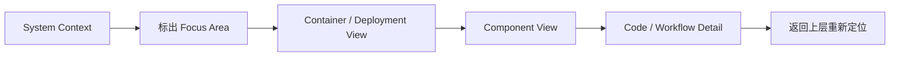
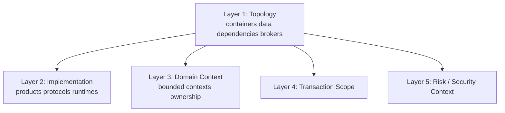
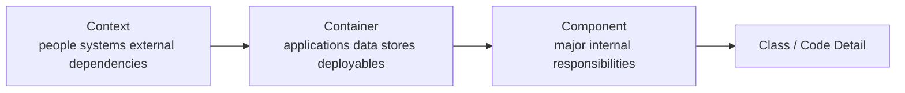
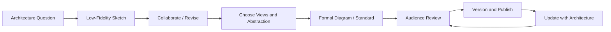
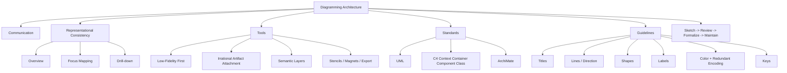

> 对应原书：*Fundamentals of Software Architecture, 2nd Edition*，Chapter 23
>
> 本章主题：如何把架构图当作沟通和共同建模工具，而不是装饰品；如何在不同抽象视图之间保持上下文，选择适当工具与标准，并通过标题、线、形状、标签、颜色和图例消除歧义。

---

## 0. 本章要解决什么问题

刚成为 software architect 的人常惊讶于工作内容的多样性。技术知识只是基础；真正让架构产生影响的是 communication：

- Managers 是否理解价值并愿意提供预算；
- Developers 是否理解结构并能正确实现；
- Operations、安全和数据团队是否看见自己的责任；
- Stakeholders 是否对 scope、dependency 和 risk 形成共同认识。

再出色的技术想法，如果无法被理解、资助和实施，就不会成为现实。Diagramming 因而是 architect 的关键沟通技能。

### 0.1 架构图不是 Architecture 本身

Architecture 是系统真实存在的结构、行为、约束和决策；diagram 是为某个 audience、purpose 和 abstraction level 建立的模型。

任何一张图都必然省略信息：

```text
真实系统
    -> 选择当前问题相关的元素
    -> 选择抽象层级
    -> 编码关系和语义
    -> 形成某个 View
```

因此，好的图不是“画得最全”，而是：

- 对当前问题足够真实；
- 清楚说明 scope；
- 不用隐含视觉语法误导读者；
- 能让 audience 得出预期理解。

### 0.2 多视图为什么容易让人迷失

描述 architecture 时，常先画 entire topology，再 drill down 某一部分。若直接从大图跳到局部细节，却不说明局部位于哪里，viewers 会失去方位：

- 这几个 components 属于哪个 system/service？
- 它们与前一张图是什么关系？
- 新图是替换旧图，还是展开其中一个方框？
- Scope 外的元素是不存在，还是被省略？

### 0.3 Representational Consistency：表述一致性

**Representational consistency** 是在切换视图前，始终显示 architecture parts 之间的关系。

推荐顺序：

1. 先展示 overall context/topology；
2. 指出即将展开的区域；
3. 保留连接线、名称、颜色或边框等视觉锚点；
4. 再进入局部结构；
5. 需要时返回上层，重新定位。

图 23-1 以 Silicon Sandwiches 为例：左侧先显示 `Local`、`Recipes`、`Inventory`、`Promotion`、`Location` 与 database 的整体关系，再用虚线把 `Recipes` 插件映射到右侧内部 `code` 结构。Viewers 能明确知道右侧不是新系统，而是左侧 `Recipes` 的放大视图。



Representational consistency 同样适用于 presentation：动画逐步构建图时，每一步都应保留足够 context，而不是让观众猜测新出现元素来自哪里。

### 0.4 一句话抓住本章

> 先让读者知道自己在系统的哪里，再用一致而有语义的视觉语言展示当前问题所需的信息；图越漂亮，不代表越准确或越有用。

### 0.5 本章没有统一的“正确画法”

原章介绍 UML、C4、ArchiMate 和一组 guidelines，却没有要求所有 architecture 采用唯一 notation。组织可以建立 standards，也应允许合理例外。

判断标准不是“是否完全符合某套符号”，而是：

- Audience 是否理解；
- 图是否准确表达 architecture intent；
- 语义是否一致；
- 是否能维护和演化；
- 是否有必要的 context 和 key。

### 0.6 阅读边界

原章没有给出数学公式或正式算法。本文增加的 view-selection 流程、静态/动态视图区分、diagram-as-code 比较、可执行 linter 和检查清单属于教学扩展，不是原书逐项规定。

---

## 1. Diagramming：架构绘图

Architecture topology 对 architects 和 developers 都重要，因为它展示 structure 如何组合，并帮助团队形成 shared understanding。

绘图能力不是把图标拖得整齐，而是能回答：

- 系统边界在哪里？
- 核心 elements 是什么？
- 谁依赖谁？
- Communication 是同步还是异步？
- Data 在哪里？
- 哪些是 deployment boundaries？
- 当前图刻意省略了什么？

原章建议 architects 把 diagramming skills 磨得非常锋利。

### 1.1 Tools：工具

现代 diagramming tools 功能很强，architect 应深入掌握自己选择的工具。但在 design early stage，不应忽视 low-fidelity artifacts。

工具选择应服务设计成熟度：

```text
探索期：白板、纸、便签、平板草图
    -> 快速试错、低沉没成本

收敛期：结构化绘图工具
    -> 一致符号、可演示、可维护

稳定期：版本化正式图/模型
    -> 文档、评审、自动生成或治理
```

#### 1.1.1 Irrational Artifact Attachment：非理性制品依恋

该 antipattern 描述：一个人对 artifact 的非理性依恋，往往与制作它花费的时间成正比。

例如，architect 用 Visio 花 4 小时制作精美图，比只花 2 小时更难接受“这个设计方向错了”。问题不是 Visio，而是制作成本变成 sunk cost，设计者开始保护图，而不是检验 architecture。

##### 为什么 Low-Fidelity Artifacts 有效

Agile 倾向 just-in-time artifacts，以尽可能少的 ceremony/ritual 创建。Index cards、sticky notes 和粗略草图容易被丢弃，所以团队更愿意：

- 尝试替代方案；
- 移动 boundary；
- 删除错误元素；
- 让设计通过 revision、collaboration、discussion 逐渐显现；
- 不把第一版当成承诺。

##### Whiteboard Photo

经典 ephemeral artifact 是手机拍下的 whiteboard diagram，旁边常写 “Do Not Erase!”。它捕获讨论结果，但有局限：

- Glare；
- 文字模糊；
- 后续修改困难；
- Remote collaborators 不易共同编辑；
- Context/日期/作者可能丢失。

##### Tablet + Projector

许多 architects 改用连接 overhead projector 的 tablet。原章列出四个优势：

1. Unlimited canvas，可容纳更多 drawings；
2. 可 copy/paste “what if” scenarios，不遮盖 original；
3. 图片天然 digital，没有 whiteboard photo glare；
4. 更适合 remote work 和 collaboration。

##### 何时转为正式图

最终仍需要 fancy tool 制作清晰 diagram，但应等 team 已充分 iterate design 后再投入时间。

判断信号：

- 主要 boundaries 已相对稳定；
- 图将被跨团队长期使用；
- 需要正式评审/审批；
- 需要放入 architecture documentation；
- 需要一致更新与版本管理。

##### 原书工具与中立立场

作者使用 OmniGraffle 创建本书 diagrams 原稿，再由 O'Reilly illustrators 完善，但不特别推荐某个产品。

Architect 应深入掌握所选工具，而不是不断换工具逃避表达问题。

##### Baseline Feature 1：Layers

Layers 把 elements 按逻辑分组，可 show/hide：

- Presentation 中隐藏当前无关细节；
- 逐层构建 picture；
- 从 topology 切换到 implementation；
- 在同一 base 上叠加 domain/security/transaction views。

##### Baseline Feature 2：Stencils/Templates

Stencils 保存常用 visual components，包含基本 shapes 的组合。例如本书中的 microservice icon 可作为单一 stencil item。

组织级 stencil library 能：

- 提高 diagrams consistency；
- 减少重复绘制；
- 建立共享 visual vocabulary；
- 加快新图创建。

风险是 stencil 形状被误当 architecture truth。图标应有语义说明，不能因为模板只有某种形状就扭曲设计。

##### Baseline Feature 3：Magnets

Magnets 是 shape 上 line 自动 snap 的连接点，可改善：

- Alignment；
- Line routing；
- Shape 移动后的连接保持；
- Visual neatness。

部分工具允许增加或自定义 magnets。它解决的是图形维护，不决定 dependency semantics。

##### 其他基础能力

工具还应支持：

- Lines；
- Colors；
- Shapes；
- Text/labels；
- 多种 export formats。

#### 1.1.2 Use Layers Semantically, Not Decoratively：图层要承载语义

Layers 不只是为了背景、阴影或美化，而应表达 meaning。

##### Base Layer：Architecture Topology

应包含：

- Containers；
- Databases；
- Dependencies；
- Brokers；
- Core elements。

这一层聚焦 architecture，不急于绑定 implementation。例如写：

```text
synchronous communication
```

而不是立刻写：

```text
REST over HTTP/2 with framework X
```

##### Next Layer：Implementation Details

第二层可添加：

- Database type/product；
- Communication protocol；
- Runtime/platform；
- Deployment technology；
- Framework/version。

这样可以先讨论结构是否正确，再讨论 technology selection，避免实现名词掩盖 architecture。

##### Contextual Layers

同一 topology 上还可叠加：

- Domain-driven design boundaries（DDD bounded contexts）；
- Transactional scope；
- Security/trust zones；
- Architecture quanta；
- Team ownership；
- Risk hotspots；
- Data classification。

原章明确举例 DDD boundaries 与 transactional scope；其余属于常见教学扩展。



##### 为什么语义图层让图 Extensible

Base topology 保持稳定，不同 discussions 只打开相关 overlays：

- Operations 看 deployment/product；
- Domain experts 看 contexts；
- Security 看 trust zones；
- Architects 看 transaction/quantum；
- Executives 看 high-level topology。

不必复制多张很快 drift 的图，也不必把所有信息同时塞进一张图。

##### 教学扩展：Diagram-as-Code 与自由绘图

PlantUML、Mermaid 等 diagram-as-code 工具可提供 versioning、diff、review 和 reproducibility；自由绘图工具更擅长不规则布局、视觉叙事和早期探索。

| 维度 | Diagram-as-Code | Canvas Drawing |
|---|---|---|
| Version diff | 强 | 取决于文件格式 |
| 自动生成 | 强 | 弱 |
| 自由布局 | 有限制 | 强 |
| 快速手绘探索 | 一般 | 强 |
| Consistent style | 容易模板化 | 依赖 stencil/discipline |

这不是原章工具清单。选择应由 artifact lifecycle、协作方式和 audience 决定，也可组合使用。

### 1.2 Diagramming Standards: UML, C4, and ArchiMate：绘图标准

Formal standard 的价值是建立 shared visual language；代价是 notation 学习、表达限制和不必要细节。原章介绍三种常见标准。

#### 1.2.1 UML

Grady Booch、Ivar Jacobson、Jim Rumbaugh 在 1980s 创建 Unified Modeling Language（UML），试图统一各自竞争的 design philosophies。

原章评价较直接：它本想汇聚各家优点，却像很多 committee-designed standards 一样，在强制使用它的组织之外影响有限。

今天仍常用：

- **Class diagram**：表达 types、attributes、relationships；
- **Sequence diagram**：表达 workflow、participants 和调用顺序。

其他许多 UML diagram types 已较少使用。

##### 何时 UML 合适

- 需要精确表达 code-level structure；
- 需要显示 request sequence、lifeline 和 timing order；
- Audience 已熟悉 notation；
- 工具链已有 UML support。

##### 何时会过重

- 只需向业务方解释 system context；
- Notation 本身比 architecture 更难懂；
- 团队被迫维护无人阅读的完整模型；
- 图包含当前 discussion 不需要的 detail。

后四项是基于原章评价的教学归纳。

#### 1.2.2 C4

Simon Brown 在 2006–2011 年开发 C4，目的是弥补 UML deficiencies 并现代化 architecture diagramming。

四个 C：

##### Context

整个 system context，包括：

- User roles；
- External dependencies；
- System boundary；
- 与外部 systems 的关系。

回答：系统为谁服务、处于什么环境。

##### Container

Physical（且通常 logical）deployment boundaries 和 containers。这里的 container 是可运行/部署边界概念，不限于 Docker container。

该 view 是 operations teams 与 architects 的良好 meeting point，因为它连接 logical responsibility 与 runtime/deployment。

##### Component

Container 内的 major components 及关系，最贴近 architect 对 system internals 的视图。

##### Class

C4 复用 UML class diagram style，因为它本来就有效，无需重新发明。



##### C4 的价值

- 适合希望标准化 diagramming technique 的组织；
- 社区活跃、拥有大量 followers；
- 随 software ecosystem 演化；
- 许多 tools 有 C4 templates；
- C4 ecosystem 提供 tools/frameworks；
- 定义 component、line、container、database 等常见 artifacts。

图 23-2 是 Silicon Sandwiches modular monolith 的 C4 component diagram：

- Web/mobile applications 作为 containers；
- `Purchase`、`Promotion`、`Deliver`、`Recipes`、`Location` 等作为 components；
- `Overrides` 表达 customizations；
- Dotted directional relations 展示 component dependencies。

图同时提醒：即使使用标准，仍要通过 labels 解释“它是什么/做什么”，而不是只依靠 shape。

##### C4 不是什么

- 不是自动生成正确 architecture 的方法；
- 不是要求所有图都画到四层；
- 不是 deployment/runtime behavior 的唯一表达；
- 不是替代 ADR、sequence、data-flow 或 operational diagrams 的万能标准。

这些是教学边界说明。应根据 audience/purpose 选择所需 level。

#### 1.2.3 ArchiMate

ArchiMate 是 `architecture` 与 `animate` 的 portmanteau，由 The Open Group 提供的 open source enterprise-architecture modeling language。

用途：

- 描述 architectures；
- 分析 architectures；
- 可视化 business domains 内部及之间的 architecture；
- 建模 enterprise ecosystem。

它追求 lighter-weight，目标是 **as small as possible**，而非覆盖每个 edge case，因此在 enterprise architects 中流行。

##### 与 C4/UML 的侧重点

| 标准 | 主要焦点 | 典型受众/用途 |
|---|---|---|
| UML | Software structure 与 interaction 的精确 notation | Developers、detailed design |
| C4 | 从 system context 逐级 zoom 到 code | Architects、developers、operations |
| ArchiMate | Enterprise/business/application/technology 跨域关系 | Enterprise architects、portfolio analysis |

该表是教学性比较，不表示三者互斥。一个组织可用 ArchiMate 描述 enterprise landscape，用 C4 描述某 system，再用 UML sequence 展示关键 workflow。

### 1.3 Diagram Guidelines：架构图通用指南

每个 architect 都应发展自己的 diagramming style，可以采用 formal modeling language，也可借鉴有效 representations。Style 可以不同，但必须清楚、一致、面向 audience。

#### 1.3.1 Titles：标题

所有 diagram elements 应有 title，除非对 audience 极其 well-known。

Title 应：

- 紧贴所描述 element；
- 避免与相邻 shape 混淆；
- 使用 rotation/effects 提高空间利用；
- 表达 responsibility，而不只是技术名；
- 在多层图中保持命名一致。

例如 `Order Service` 比 `Service 7` 更有意义；若图讨论 runtime，`PostgreSQL Orders Store` 可能比泛称 `Database` 更准确。

原章核心要求是 title 和贴合关系；后两例是教学扩展。

#### 1.3.2 Lines：线

Lines 必须足够粗，投影、缩放或打印后仍可见。

如果表示 information flow：

- 使用 arrow 指示 direction；
- 双向 traffic 要清楚表示；
- 不同 arrowheads 可表达不同 semantics；
- 全图必须 consistent。

少数广泛接受的 conventions 之一：

- Solid lines：通常表示 synchronous communication；
- Dotted lines：通常表示 asynchronous communication。

“通常”很重要。若组织使用不同 convention，必须放 key，不应假定所有 viewers 自动理解。

##### Line 应回答什么

教学扩展建议在线旁标注：

- Relationship/operation；
- Protocol 或 communication kind（在 implementation layer）；
- Data/event name；
- Direction；
- 必要时 cardinality/trust crossing。

无标签直线只说明“有某种关系”，通常不够。

#### 1.3.3 Shapes：形状

Formal modeling languages 有标准 shapes，但整个软件行业没有 pervasive universal shape set。多数 architects 建立自己的 standard shapes，组织也可能采纳为共享语言。

作者常用：

- 3D boxes：deployable artifacts；
- Rectangles：containers；
- Cylinders：databases。

这不是全行业标准，作者也没有声称除此之外有 universal key。

原则：

- 同一 shape 在同一图中只有一种 meaning；
- 不同 meanings 不应只靠细微圆角区别；
- Shape 选择不应被某 product icon library 绑架；
- Ambiguous 时必须提供 key。

#### 1.3.4 Labels：标签

每个 item 都应 label，尤其在任何可能 ambiguity 的情况下。

Label 应尽量回答：

- Name；
- Type/kind；
- Responsibility；
- 必要时 technology/protocol；
- Scope 或 owner。

不应只写 acronym，除非 audience 确认熟悉。若使用 `OMS`，可首次写 `Order Management System (OMS)`。

#### 1.3.5 Color：颜色

历史上书籍必须黑白打印，architects 习惯 monochromatic drawings。原章仍偏好 monochrome，但在 color 能区分 artifacts 时会使用。

图 23-3 重现第 19 章 GGG microservices communication，用不同 gray shades 表示 architecture quantum/grouping。

##### Color 的正确用途

- 标识 group/domain/quantum；
- 突出 focus area；
- 显示 risk/status；
- 区分 current/future state；
- 降低查找成本。

##### Accessibility：不能只靠颜色

Colorblind 或其他 visual disabilities 的 viewers 可能看不出差异。关键 distinction 必须增加 redundant encoding：

- Unique iconography；
- Shape；
- Pattern/hatching；
- Text label；
- Border style。

原章类比 street-crossing lights：不仅红/绿不同，还使用不同 figure/icon。

还应检查 grayscale/print 和 projection contrast。该句是实践扩展，与原章 accessibility 原则一致。

#### 1.3.6 Keys：图例

若 shapes/lines/colors/icons 有任何 ambiguity，加入 key，明确每种表示的 meaning。

Key 应覆盖图中非显然语法：

```text
solid arrow = synchronous call
dotted arrow = asynchronous event
cylinder = data store
stacked box = multiple instances
gray boundary = architecture quantum
red marker + warning icon = high risk
```

Key 必须与图同步更新。过时 key 会比没有 key 更误导。

原章结论很强：

> An easily misinterpreted diagram is worse than no diagram at all.

### 1.4 教学扩展：Static View 与 Dynamic View 不要混成一团

原章提到 UML class/sequence、C4 levels 和 information flow。可进一步把 architecture views 分为：

#### Static/Structural View

表达：

- Elements；
- Boundaries；
- Dependencies；
- Deployment/data ownership；
- Topology。

典型：C4 Context/Container/Component、UML class、deployment diagram。

#### Dynamic/Behavioral View

表达：

- Request/event sequence；
- State transition；
- Failure/retry；
- Timing/concurrency；
- Data flow。

典型：UML sequence、state diagram、event flow。

一张图同时塞入所有静态和动态信息会产生 crossing lines 和 cognitive overload。更好的做法是保持 representational consistency，使用多个相互链接的 views。

### 1.5 可运行示例：Diagram Ambiguity Linter

下面用 structured data 模拟 diagram，并检查 title、label、direction、shape/style key 和“仅靠颜色编码”。它是教学扩展，不判断 architecture 本身是否正确。

```python
diagram = {
    "title": "",
    "nodes": [
        {
            "id": "api",
            "label": "Checkout API",
            "shape": "rectangle",
            "color": "blue",
            "marker": "",
        },
        {
            "id": "db",
            "label": "",
            "shape": "cylinder",
            "color": "red",
            "marker": "",
        },
    ],
    "edges": [
        {
            "source": "api",
            "target": "db",
            "label": "",
            "style": "dotted",
            "direction": "",
        }
    ],
    "key": {"rectangle": "container"},
}

def lint(candidate: dict[str, object]) -> list[str]:
    issues: list[str] = []
    key = candidate.get("key", {})

    if not candidate.get("title"):
        issues.append("missing diagram title")

    nodes = candidate.get("nodes", [])
    for node in nodes:
        if not node.get("label"):
            issues.append(f"node {node['id']}: missing label")
        if node.get("shape") not in key:
            issues.append(
                f"node {node['id']}: unexplained shape {node.get('shape')}"
            )

    for edge in candidate.get("edges", []):
        name = f"{edge['source']}->{edge['target']}"
        if not edge.get("label"):
            issues.append(f"edge {name}: missing label")
        if not edge.get("direction"):
            issues.append(f"edge {name}: missing direction")
        if edge.get("style") not in key:
            issues.append(
                f"edge {name}: unexplained style {edge.get('style')}"
            )

    colors = {node.get("color") for node in nodes if node.get("color")}
    if len(colors) > 1 and not all(node.get("marker") for node in nodes):
        issues.append("color distinctions lack redundant markers")
    return issues

for issue in lint(diagram):
    print(issue)
```

输出：

```text
missing diagram title
node db: missing label
node db: unexplained shape cylinder
edge api->db: missing label
edge api->db: missing direction
edge api->db: unexplained style dotted
color distinctions lack redundant markers
```

代码与原则对应：

- Empty `title` -> 图的目的不清；
- Empty node/edge label -> 关系含义不清；
- Shape/style 不在 key -> 私有视觉语法未解释；
- Missing direction -> information flow 不明确；
- Red/blue 只有颜色差异 -> accessibility 风险。

真实 diagram review 还必须由人判断 scope、抽象层级、事实准确性和 audience fit，linter 只能发现部分形式歧义。

### 1.6 Diagram Review Checklist（教学扩展）

#### Purpose 与 Audience

- 这张图要支持什么 decision/conversation？
- Audience 是 executives、developers、operations 还是 security？
- Detail 是否匹配他们的需要？

#### Scope 与 Context

- System boundary 是否可见？
- Drill-down 是否指出来自上层哪里？
- 被省略内容是否说明？
- View level 是否命名？

#### Semantics

- 每个 title/label 是否明确？
- Lines 是否有 direction/meaning？
- Solid/dotted convention 是否一致？
- Shapes/colors 是否在 key 中？
- Color 是否有 redundant marker？

#### Accuracy 与 Lifecycle

- 图对应 current、target 还是 transition state？
- Owner 和 last-reviewed date 是否可查？
- Architecture change 后谁更新？
- Source of truth 在哪里？

#### Cognitive Load

- 是否能拆成多个 linked views？
- Crossing lines 是否可减少？
- 是否包含与当前问题无关的 noise？
- 能否先展示 base layer，再打开 details？

---

## 2. Summary：总结

Diagramming standards 能为组织建立 consistent communication，但 standard 不是目的。若 notation 无法有效表达 design，architects 经常也应该合理 break rules。

### 2.1 Standards 与 Exceptions

组织应建立：

- Common shapes/lines/colors；
- Required title/key/accessibility conventions；
- 推荐 view levels；
- Storage/versioning practices；
- Review ownership。

同时允许 reasonable exceptions：

- Standard 无法表达关键语义；
- Audience 不熟悉 notation；
- 临时探索无需正式模型；
- 特殊 domain 需要自定义 visual vocabulary。

例外仍需保持内部一致并提供 key，不能把“灵活”当作随意。

### 2.2 CASE Tools 的历史教训

过去 heavyweight Computer-Aided Software Engineering（CASE）tools 盛行，architects 为表达简单内容也要建立 elaborate models，被迫加入许多当前 context 无用的 details。

结果是：

- Signal 被 noise 淹没；
- Model 维护昂贵；
- Team 不愿更新；
- Artifact 变成合规产物而非沟通工具；
- Architect 对高投入模型产生依恋。

原章偏好 lightweight tools 和 quick-and-dirty artifacts，尤其在 early design stage。

### 2.3 图的成熟过程



不要在问题还没搞清楚时过早精修；也不要让 whiteboard photo 永久充当无人维护的正式文档。

### 2.4 易混淆概念与常见误区

本节是根据原章整理的教学性辨析，不是原章逐项列出的清单。

#### 2.4.1 Diagram 画得越全越好

错误。图是面向目的的 abstraction。无关 detail 是 noise，可能比省略更误导。

#### 2.4.2 漂亮 Diagram 代表成熟 Architecture

错误。精美可能只是投入时间多，并诱发 Irrational Artifact Attachment。

#### 2.4.3 Low-Fidelity Artifact 不专业

错误。探索期可丢弃、可协作的草图更支持学习；成熟后再正式化。

#### 2.4.4 Tool 决定 Diagram 质量

错误。Tool 提供 layers/stencils/magnets，无法替代 scope、semantics 和 audience reasoning。

#### 2.4.5 Layers 只用于美化

错误。应语义化分离 topology、implementation、domain、transaction 等 views。

#### 2.4.6 Implementation Detail 应放在 Base Layer

错误。Base 先表达 architecture，例如 synchronous；implementation layer 再写具体 protocol/product。

#### 2.4.7 UML 已经过时，完全没用

错误。Class 和 sequence diagrams 仍有效，只是整套 notation 很少被完整采用。

#### 2.4.8 C4 的 Container 等于 Docker Container

错误。它表示 physical/often logical deployment boundary，不限具体容器技术。

#### 2.4.9 C4 必须每次画完四层

错误。按 audience/purpose 选择 level；保持 zoom context 即可。

#### 2.4.10 ArchiMate 要覆盖每个 Edge Case

错误。其目标恰是 as small as possible 的轻量 enterprise modeling language。

#### 2.4.11 Solid/Dotted Line 是绝对国际标准

它是少数广泛 convention：通常 solid 同步、dotted 异步。若语义不同或 audience 不确定，必须 key/label。

#### 2.4.12 Shape 含义全球统一

错误。行业没有 pervasive shape set；组织可标准化，但要提供图例。

#### 2.4.13 Color 可以单独表达 Critical Difference

错误。Colorblind viewers 可能看不见，必须配 icon、shape、pattern 或 label。

#### 2.4.14 Key 会让图显得不够简洁

Ambiguous diagram 比没有图更糟。必要 key 是语义，不是装饰负担。

#### 2.4.15 一张图应同时表达 Structure 与所有 Workflow

错误。Static/dynamic concerns 应拆成 linked views，并保持 representational consistency。

#### 2.4.16 正式标准不能破例

错误。Standards 服务 communication，应允许有理由的 exception，但例外仍需一致和可解释。

### 2.5 一般化的问题解决方法

本节是对原章方法的教学性归纳，不是原章给出的正式算法。

#### 第 1 步：明确 Communication Goal

先写下 audience、question、decision 和所需 abstraction，不先打开绘图工具。

#### 第 2 步：选择 View 与 Scope

Context、container、component、workflow、deployment、data 或 risk view 只选择当前必要内容。

#### 第 3 步：先画 Low-Fidelity Version

使用白板、便签、平板或简单文本，快速比较 alternatives，避免过早依恋。

#### 第 4 步：保持 Representational Consistency

从整体定位 focus，再 drill down；使用稳定名称、边框和关系锚点。

#### 第 5 步：分离 Semantic Layers

Base topology 与 implementation/product detail 分离；按需叠加 domain、transaction、security。

#### 第 6 步：选择 Standard/Notation

根据 audience 和目的选择 UML、C4、ArchiMate 或组织自定义语言，不为遵循标准加入 noise。

#### 第 7 步：建立 Visual Grammar

定义 lines、arrows、shapes、labels、colors、icons，并提供 key 与 accessibility redundancy。

#### 第 8 步：让目标 Audience Review

不要问“图好看吗”，而问：

- 你认为 system boundary 在哪里？
- 这条线表示什么？
- 哪个 component owns data？
- 哪些 calls 是 asynchronous？

若答案与意图不同，diagram 失败。

#### 第 9 步：正式化、存储与版本化

Design 收敛后再投入精修；建立 owner、stable link、version 和 update trigger。

#### 第 10 步：随 Architecture 演化

过时图会主动传播错误。把 diagram update 纳入 ADR、release 或 architecture review 流程。

### 2.6 本章知识结构



### 2.7 核心结论

1. **Diagramming 是 architect 的核心 communication skill。** 无法被理解的 architecture 无法获得预算和正确实现。
2. **Architecture diagram 是有目的的 abstraction，不是系统本身。** 好图优化理解，不追求信息最大化。
3. **Representational consistency 防止视图切换时迷失。** 先展示整体与 focus 关系，再 drill down。
4. **早期优先 low-fidelity artifacts。** 它们降低 sunk cost，促进 revision、collaboration 和 experimentation。
5. **Irrational Artifact Attachment 与制作投入相关。** 不要让漂亮图阻碍改变错误设计。
6. **工具至少应支持 layers、stencils/templates、magnets 和常见 export。** 深入掌握工具，但不让工具定义 architecture。
7. **Layers 应承载语义。** Base topology、implementation details、DDD boundaries 和 transaction scope 应可独立展示。
8. **UML、C4、ArchiMate 解决不同尺度的问题。** UML class/sequence 仍有价值；C4 提供逐级 zoom；ArchiMate 面向 enterprise ecosystem。
9. **C4 的四层是 Context、Container、Component、Class。** Container 不等于 Docker，Class 沿用 UML。
10. **标题、线、形状、标签、颜色、图例共同构成 visual grammar。** 缺少任何关键语义都可能造成误读。
11. **Solid/ dotted 通常分别表示 synchronous/asynchronous。** Direction 和特殊 semantics 仍需 arrow/label/key。
12. **Color 不能独立承载关键区别。** 使用 icon、shape、pattern 或 text 提供 accessible redundancy。
13. **Ambiguous diagram 比没有 diagram 更糟。** 不确定时添加 key，不要假定私有符号是行业标准。
14. **组织应有 standards，也应允许 reasonable exceptions。** 标准服务沟通，而非迫使每张图加入无用 noise。
15. **Heavyweight CASE 的教训是模型不应超过问题所需。** 探索期快速粗糙，收敛后再正式化。
16. **图必须跟随 architecture 更新。** 过时图不是中性缺失，而是错误信息源。

最终可以把本章压缩成一句架构判断：

> 选择最少但足够的视图和符号，让目标读者始终知道范围、关系和语义；先用廉价草图发现正确设计，再把已经验证的理解正式化并持续维护。
