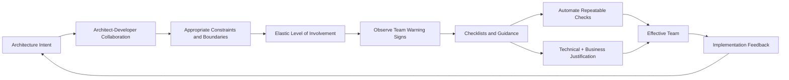
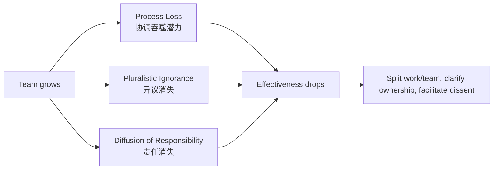
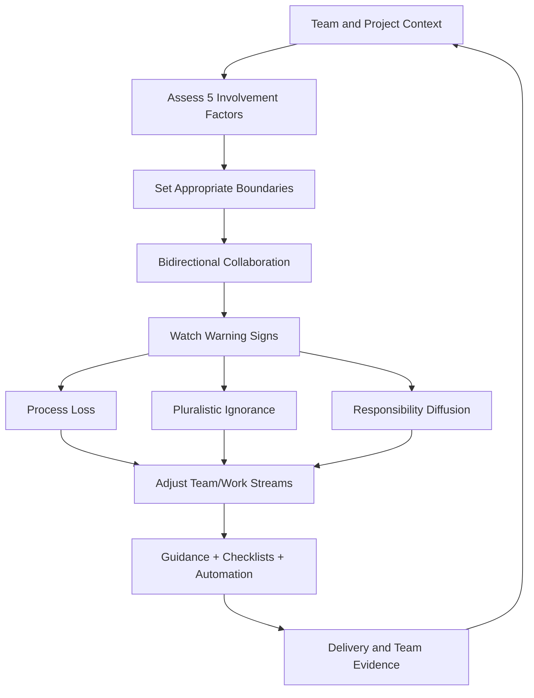
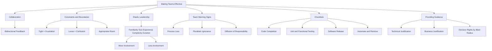

> 对应原书：*Fundamentals of Software Architecture, 2nd Edition*，Chapter 24
>
> 本章主题：架构师如何通过双向协作、合适的约束、弹性介入、团队警讯识别、精简清单和设计原则指导，帮助开发团队正确实现架构，并在控制过度与指导不足之间持续找到平衡。

---

## 0. 本章要解决什么问题

Software architect 的职责不止是绘制技术架构和作出 architecture decisions，还包括：

- 带领 development team；
- 指导团队实现 architecture；
- 让 architecture intent 与实际 code 保持一致；
- 帮助成员共同解决问题；
- 移除阻碍交付的技术障碍；
- 根据团队和项目情况调整介入程度。

如果 architect 独自在 silo 中完成设计，再把结果“扔过墙”交给 developers，团队往往很难正确实现。架构成功不只取决于设计本身，也取决于 architect 能否建立有效团队。

### 0.1 团队效能不是“架构师管得更多”

本章的核心不是增加审批，而是动态回答两个问题：

1. 哪些 constraints 必须由 architect 明确，才能保护 architecture characteristics？
2. 哪些 design/implementation decisions 应留给 developers，才能保留专业自主性？

边界太紧，团队无法使用必要工具并失去创造力；边界太松，团队被迫承担架构职责，在过多选择和 proof of concepts 中迷失。

### 0.2 一句话抓住本章

> 高效架构师不是永远站得最近或最远，而是持续为当前团队画出大小合适的“房间”：关键墙体清楚，内部空间足够，遇到变化时还能调整。

### 0.3 本章推理主线



### 0.4 阅读边界

原章给出五因素 `±20` 参与度量表，但明确说明它并不精确。本文会复算两个场景，同时把它视为讨论工具，而不是人员评价算法。沟通通道公式、清单分类代码、心理安全和治理补充属于教学扩展，不是原书规定的正式流程。

---

## 1. Collaboration：协作

### 1.1 传统的单向交接模型

软件行业经常把 architecture 和 development 当作完全分离的活动。

传统分工中：

| Architect | Developer |
|---|---|
| 提取 architecture characteristics | 设计 classes |
| 选择 architecture style | 构建 user interface |
| 设计 component structure | 编写 source code 和 tests |

分工本身并非错误，问题是图中的单向箭头和物理/虚拟屏障：

- Architecture decisions 未必传到团队；
- Developer 遇到实现约束时无法及时反馈；
- 团队修改 architecture 后，architect 未必知道；
- Logical design 和 running system 逐渐分叉；
- 最终 architecture 很少真正达到目标。

### 1.2 双向协作模型

架构成功的关键是拆除 physical/virtual barriers，让 architect 和 developers 属于同一个 virtual team，建立强 bidirectional relationship。

双向流动包括：

```text
Architect -> Team
  architecture intent、constraints、decisions、business context、mentoring

Team -> Architect
  implementation evidence、technology limits、complexity、feedback、emerging risks
```

Architect 同时提供 leadership、mentoring 和 coaching；developers 不是被动执行者，而是 architecture 的共同实现与反馈来源。

### 1.3 为什么现代 Architecture 更需要协作

Old-school waterfall 把 architecture 当一次性静态阶段。现代 architecture 几乎每个 iteration/product phase 都会变化：

- 新 requirement 暴露边界问题；
- 实现发现 assumptions 不成立；
- Load/incident 产生运行证据；
- Technology 和 team 变化；
- Architecture characteristics 优先级改变。

若 architect 不在反馈回路中，架构要么僵化，要么被实现悄悄改写。

### 1.4 协作不是取消角色边界

双向协作不表示所有人对所有事情共同审批。更健康的分工是：

- Architect 定义 logical building blocks、关键 interactions、system-wide constraints；
- Developers 设计 classes、patterns 和 component internals；
- 双方共同验证 assumptions、风险和可实现性；
- 影响 architecture 的变化回到 ADR/diagram/fitness-function 流程。

### 1.5 教学扩展：建立轻量反馈节奏

可根据项目设置：

- Architecture office hours；
- Design review pairing；
- ADR/RFC review；
- Architect 参与关键 refinement/retrospective；
- Implementation spike 共同复盘；
- Architecture fitness-function dashboard。

目的不是增加会议，而是缩短“设计假设错误”到“architect 得知并修正”的时间。

---

## 2. Constraints and Boundaries：约束与边界

### 2.1 “房间”隐喻

Architect 创建并沟通 constraints，形成 developers 实现 architecture 的“房间”。

图 24-3 展示三种边界：

- Tight boundaries -> frustration；
- Loose boundaries -> confusion；
- Appropriate boundaries -> effective teams。

### 2.2 边界太紧

过多 constraints 让房间太小：

- 禁止必要 open source/third-party libraries；
- 规定过细 naming/class/method 细节；
- Architect 代替 developers 选内部 design patterns；
- 每个局部选择都要审批；
- 团队无法使用完成系统所需的 tools/practices。

结果通常是 frustration、尊重下降，甚至 developers 离开项目寻找更健康环境。

### 2.3 边界太松

没有 constraints 让房间太大：

- 可选 tools/frameworks 太多；
- Developers 被迫承担 architect 职责；
- 反复做 proofs of concept；
- 围绕 system-wide design 长期争论；
- 团队 unproductive、confused、frustrated；
- 每个模块形成不同做法。

“完全自治”如果没有 architecture direction，实际是把高影响决定下放给缺少全局 context 的个人。

### 2.4 Appropriate Boundary 的组成

合适边界应说明：

1. **不可违反的原则**：安全、数据所有权、关键依赖方向；
2. **需要 architect approval 的高影响选择**：framework、general-purpose library、跨域 contract；
3. **Team 自主区**：局部 algorithm、class design、special-purpose library；
4. **例外机制**：如何提出理由、实验和修改 constraint；
5. **Why**：constraint 保护哪项 business/architecture goal；
6. **Compliance**：如何检查，优先自动化。

后三项是结合前章 ADR/governance 的教学扩展。

### 2.5 边界是动态的

同一个 team 会随时间变化：

- 新成员增加，需要更多 facilitation；
- 熟悉 domain 后可扩大自主空间；
- 项目进入复杂 migration，architect 临时更深入；
- 平台成熟后，manual approval 可变成 paved road；
- Incident 后可能新增 temporary guardrail。

因此，appropriate 不是固定 rule count，而是与 team/project 状态匹配。

---

## 3. Architect Personalities：架构师人格类型

作者为概念清晰而“wildly generalize”出三种类型。它们更适合看作行为模式或介入端点，而不是给人贴永久标签：

```text
Control-Freak <------ Effective / Appropriate ------> Armchair
更多控制、边界过紧                              更少指导、边界过松
```

### 3.1 The Control-Freak Architect：控制狂架构师

#### 3.1.1 行为特征

试图控制 software development 的每个细节，decision 太 fine-grained、low-level：

- 限制 useful/necessary libraries；
- 严控 naming conventions；
- 规定 class designs；
- 规定 method lengths；
- 甚至写 pseudocode 让 team 照抄。

这会“偷走 programming 的艺术”，让 developers 感到受挫并失去对 architect 的尊重。

#### 3.1.2 为什么新 Architect 容易落入

从 senior developer 转为 architect 后，原本熟悉的工作是：

- 设计 class diagram；
- 选择 design pattern；
- 编写内部结构。

但 architect 的新职责是创建 logical components 并决定它们如何 interaction；component 内部最佳实现属于 developers。放下熟悉的细节控制很难。

#### 3.1.3 Reference Manager 案例

Architect 应定义：

- Logical component：`Reference Manager`；
- Core operations：`GetData`、`SetData`、`ReloadCache`、`NotifyOnUpdate`；
- 哪些 components 与其 interaction；
- 需要保护的 characteristics/constraints。

Control-freak architect 还会指定 parallel loader pattern、internal cache 和 particular data structure。即使这个 design 有效，它也不是唯一方案，更不是 architect 通常应决定的内部实现。

#### 3.1.4 何时需要更强介入

原章承认某些情形 architect 需要暂时更像 control freak，取决于：

- Project complexity；
- Team skill level；
- 风险/法规；
- 关键时间窗口。

重点是有原因、有限范围、可撤回，而不是把微观管理作为默认领导方式。

### 3.2 The Armchair Architect：扶手椅架构师

#### 3.2.1 行为特征

- 很久没有 coding，甚至从未 coding；
- 设计时不考虑 implementation details；
- 与 development team 断开；
- 完成初始 diagrams 后转去下一个项目；
- 很少回答实现问题。

### 3.2.2 Stock-Trading 示例

图中可能只有两个 boxes：Trading System 与 Trade Compliance Engine。它并非“错误”，只是 level 太高，对任何实现者都没有实际帮助：没有 boundary、protocol、failure、data、responsibility 或 workflow guidance。

### 3.2.3 Loose Boundaries 的后果

Development team 被迫完成 architect 本应完成的工作：

- 决定 system decomposition；
- 选择 technology；
- 定义 integration；
- 自行猜测 quality trade-offs。

Velocity 和 productivity 下降，大家对系统如何工作感到 confused。

### 3.2.4 警讯

原章列出：

- 不理解 business domain/problem/technology；
- Hands-on software development experience 不足；
- 不考虑某 implementation 的 complexity、maintenance、testing implications；
- 没有时间或不愿与 implementation teams 相处。

Architect 往往不是故意变成 armchair，而是项目/团队覆盖过多，逐渐失去 technology 和 domain connection。

### 3.2.5 修复

- 减少同时承担的 projects/teams；
- 参与关键 spike/review；
- 提升 current technology 理解；
- 与 domain experts 和 developers 工作；
- 保持可被找到和及时回应；
- 对 architecture consequences 保持 hands-on evidence。

### 3.3 The Effective Architect：高效架构师

Effective architect：

- 创建 appropriate constraints/boundaries；
- 确保 members 合作良好；
- 提供 right level of guidance；
- 确保正确 tools/technologies 可用；
- 移除 development team 与目标之间的 roadblocks；
- Close collaboration 并赢得 respect。

这不仅是 architecture skill，也是 leadership art。Effective 不是永远处于量表正中，而是能按 context 调整并解释调整原因。

---

## 4. How Much Involvement?：应该介入多少

Effective architect 必须知道：

- 何时深入参与；
- 何时让 team 自己工作；
- 同时能管理多少 teams/projects。

原章借鉴 Roy Osherove 推广的 **Elastic Leadership**，并针对 software-architecture leadership 做调整。

### 4.1 五个因素

#### 4.1.1 Team Familiarity

- Members 相互熟悉、合作过 -> 更能 self-organize，architect 少介入；
- New members -> 需要 facilitation、减少 cliques，architect 多介入。

熟悉不等于同质。过于熟悉也可能 groupthink，仍需观察 dissent 和 pluralistic ignorance。

#### 4.1.2 Team Size

原章经验口径：5 人或更少为 small；正文称超过 12 developers 为 big，而 Scenario 2 又把 12 members 作为 large。应把 12 理解为警戒附近而非精确边界。

Team 越大，communication、coordination 和 ownership 越难，architect 通常需更多 facilitation。

#### 4.1.3 Overall Experience

评估：

- Senior/junior mix；
- Technology familiarity；
- Business-domain familiarity。

Domain 特别复杂时，应把 technical experience 与 domain experience 分开评估。

- Junior-heavy -> 更多 mentoring；
- Senior-heavy -> Architect 更像 facilitator。

#### 4.1.4 Project Complexity

- Highly complex -> Architect 更 available，协助 issues/trade-offs；
- Straightforward -> 减少介入。

Complexity 应看 integrations、data、risk、regulation 和 unknowns，不只看代码量。

#### 4.1.5 Project Duration

原章经验：

- Short（约 2 months）-> 少介入；
- Average（约 6 months）；
- Long（约 2 years）-> 多介入。

理由看似反直觉：短项目 urgency 已高，control-freak 会拖延；长项目节奏宽松，architect 需确保 schedule，并推动最复杂 tasks 优先完成。

这是作者的情境性 heuristic，不是“长项目团队必然懈怠”的普遍定律。高风险短项目仍可能需要更深入 architect support。

### 4.2 `±20` 参与度量表

每个 factor 取 `+20` 或 `-20`：

- Positive -> more control/involvement，趋向 Control-Freak extreme；
- Negative -> less control/involvement，趋向 Armchair extreme；
- 0 附近 -> 中性起点，并不表示不参与。

总分：

$$
I=Familiarity+Size+Experience+Complexity+Duration
$$

范围 $[-100,+100]$。原章明确说 scale 不精确，只用于估计 expected involvement。

### 4.3 Scenario 1：`-60`

| Factor | Value | Rating | Personality direction |
|---|---|---:|---|
| Team familiarity | New team members | +20 | Control freak |
| Team size | Small（4 members） | -20 | Armchair architect |
| Overall experience | All experienced | -20 | Armchair architect |
| Project complexity | Relatively simple | -20 | Armchair architect |
| Project duration | 2 months | -20 | Armchair architect |
| **Accumulated score** |  | **-60** | **Armchair architect** |

解释：限制 daily involvement，提供 questions/on-track 支持，主要 facilitation，避免阻碍 experienced team 快速交付。

### 4.4 Scenario 2：`+20`

| Factor | Value | Rating | Personality direction |
|---|---|---:|---|
| Team familiarity | Know each other well | -20 | Armchair architect |
| Team size | Large（12 members） | +20 | Control freak |
| Overall experience | Mostly junior | +20 | Control freak |
| Project complexity | High complexity | +20 | Control freak |
| Project duration | 6 months | -20 | Armchair architect |
| **Accumulated score** |  | **+20** | **Control freak** |

解释：Architect 应承担 mentoring/coaching，较多参与 day-to-day，但不能深入到 disrupt team 的程度。

### 4.5 可运行参与度计算器

```python
scenarios = {
    "scenario_1": {
        "team_familiarity": 20,
        "team_size": -20,
        "overall_experience": -20,
        "project_complexity": -20,
        "project_duration": -20,
    },
    "scenario_2": {
        "team_familiarity": -20,
        "team_size": 20,
        "overall_experience": 20,
        "project_complexity": 20,
        "project_duration": -20,
    },
}

def score(ratings: dict[str, int]) -> int:
    return sum(ratings.values())

for name, ratings in scenarios.items():
    total = score(ratings)
    direction = "more involvement" if total > 0 else "less involvement"
    print(f"{name}: score={total:+d}, {direction}")
```

输出：

```text
scenario_1: score=-60, less involvement
scenario_2: score=+20, more involvement
```

代码只复算原表，不定义精确行为阈值。`+20` 不等于 architect 批准所有 PR，`-60` 也不等于消失。

### 4.6 持续重评与权重

项目开始时可估计 involvement，但随着 lifecycle 推进应持续分析。Factors 很难完全 objective，且某项可能更重要，因此可按 situation weighting/modify metrics。

教学性加权形式：

$$
I_w=\sum_{i=1}^{5}w_i s_i
$$

其中 $s_i$ 是 factor score，$w_i$ 是 context 权重。公式只是把原章“可加权”形式化；权重必须有理由，不能伪装成科学精度。

### 4.7 从分数映射到行为，而不是人格

| Signal | 可能采取的行为 |
|---|---|
| More involvement | Pairing、mentoring、frequent reviews、clarify boundaries |
| Neutral | Regular check-ins、关键决策支持 |
| Less involvement | Office hours、milestone reviews、remove blockers |

量表输出应是可调整行为计划，而不是绩效标签。

---

## 5. Team Warning Signs：团队警讯

原章称有三个因素可判断 team 是否过大或失效：

1. Process loss；
2. Pluralistic ignorance；
3. Diffusion of responsibility。

### 5.1 Process Loss：过程损耗

Fred Brooks 在 *The Mythical Man-Month*（1995）提出 process loss / Brooks's Law。原章概括为：项目中增加的人越多，项目可能花越久。

概念关系：

$$
ActualProductivity=GroupPotential-ProcessLoss
$$

Group potential 是所有成员独立贡献的理想总和；actual productivity 永远低于 potential，中间差额来自 communication、coordination、onboarding、conflict 和 integration。

该式是概念恒等关系，不提供统一生产力单位。

#### 5.1.1 观察信号

- Frequent merge conflicts；
- 多人修改相同 code；
- Meetings/coordination 增多；
- Ownership 重叠；
- 新成员需大量 onboarding；
- Integration queue 变长。

原章明确举例 merge conflicts：说明成员可能在同一代码区互相妨碍。

#### 5.1.2 先寻找 Parallelism，再加人

Architect 应寻找独立 work streams，让成员负责不同 services/application areas。

Project manager 提议增加 member 时：

1. 是否有真正独立工作流？
2. 是否有清晰 ownership/interface？
3. 新人 onboarding 会占用谁？
4. 如果没有 parallelism，新增人员可能降低而非提升团队效能。

#### 5.1.3 教学扩展：Communication Channels

$n$ 人潜在两两 communication channels：

$$
Channels=\frac{n(n-1)}{2}
$$

5 人为 10 条，12 人为 66 条。这不表示每条每天通信，也不是 Brooks's Law 证明；它只说明 coordination surface 随人数非线性增长。

### 5.2 Pluralistic Ignorance：多元无知

Pluralistic ignorance 指每个人私下拒绝某个 norm，却因为以为自己漏掉 obvious fact 而公开同意。

#### 5.2.1 Messaging/Firewall 案例

大团队多数人同意两个 remote services 用 messaging。某成员认为 secure firewall 使该方案很荒谬，却怕自己漏掉显然事实而附和。若提出质疑，团队可能发现 REST 更合适。

Team 越大，人越不愿 challenge group。

#### 5.2.2 Emperor's New Clothes

Hans Christian Andersen 的 *The Emperor's New Clothes* 使该概念广为人知：所有人都看不见“衣服”，却害怕承认自己不配看见，直到孩子说国王没穿衣服。

#### 5.2.3 Architect 作为 Facilitator

观察：

- Facial expressions；
- Body language；
- 沉默；
- 迟疑或私下反对。

感到 skepticism 被隐藏时：

- 主动询问某人的看法；
- 支持其发言，即使最终证明其错误；
- 先让 junior/安静成员发言；
- 不用职位压制 debate；
- 建立说“不知道/不同意”安全的环境。

最后三项是心理安全实践扩展，核心与原章 facilitator 目标一致。

#### 5.2.4 Diffusion of Responsibility：责任扩散

虽然原文没有单独 H3 标题，但它是第三个 team-size warning sign。

Team 越大，communication 越差；若成员不知道谁负责什么、任务不断掉落，说明 team 可能过大。

Country road 上，community 小，路人可能停车帮助抛锚者；大城市 busy highway 上，数千车辆可能都假定别人已帮忙，而实际没有援助到来。

软件中的表现：

- “应该有人看告警”；
- “另一个 team 会更新文档”；
- Incident 没有 owner；
- Shared component 无维护者；
- Review request 无人响应。

缓解：明确 single accountable owner、on-call、component ownership、handoff 和 escalation。多人可参与，但责任不能只属于“大家”。

### 5.3 三个警讯的关系



Architect 不只指导 technical implementation，也要观察 team 是否 healthy、happy，并朝共同目标合作。

---

## 6. Leveraging Checklists：利用清单

### 6.1 为什么 Checklist 有效

Airline pilots 每次 flight 都使用 takeoff、landing 和 edge-case checklists。漏掉 flap 设为 10 degrees 等一项，可能导致灾难。

Dr. Atul Gawande 在 *The Checklist Manifesto* 中描述 surgical checklists：使用清单的医院 staph infection rates 降至接近零，control hospitals 继续上升。

Software 通常不是 life-or-death，因此不需给一切建 checklist。关键是选择合适场景。

### 6.2 什么不是 Checklist

图 24-9 的五项：

1. Determine database column field names and types；
2. Fill out database table request form；
3. Obtain permission for new database table；
4. Submit request form to database group；
5. Verify table once created。

这是有 dependent order 的 procedure，不是 checklist。例如 form 未提交前不能 verify table。

不适合 checklist：

- 有严格 procedural flow/dependencies；
- 简单、熟悉、频繁执行且很少出错的过程。

前者应使用 workflow/runbook；后者不需额外 ceremony。

### 6.3 好的 Checklist 候选

- Items 没有固定顺序；
- Tasks 相对独立；
- 人们经常 skip；
- 错误频发或后果大；
- 需要在完成前确认 coverage。

不要 overboard。Checklist 越多，developers 越不愿使用，触发 **Law of Diminishing Returns**。

### 6.4 Checklist 设计原则

1. 尽可能 small，同时覆盖 necessary steps；
2. Obvious item 也可保留，正是 obvious 常被漏掉；
3. 可自动化的 task 先 automate，然后从 checklist 删除；
4. 每项描述可验证 action，不写模糊愿望；
5. 随 incident/defect 更新；
6. 定期删除不再有价值的项目。

后两项是 lifecycle 教学扩展，与原章 release/root-cause 原则一致。

### 6.5 可运行示例：Checklist、Procedure 还是 Automation

```python
tasks = {
    "create_database_table": {
        "ordered_dependencies": True,
        "frequently_missed": True,
        "automatable": False,
    },
    "run_code_formatting": {
        "ordered_dependencies": False,
        "frequently_missed": True,
        "automatable": True,
    },
    "review_release_configuration": {
        "ordered_dependencies": False,
        "frequently_missed": True,
        "automatable": False,
    },
    "daily_git_pull": {
        "ordered_dependencies": False,
        "frequently_missed": False,
        "automatable": False,
    },
}

def classify(item: dict[str, bool]) -> str:
    if item["automatable"]:
        return "automate"
    if item["ordered_dependencies"]:
        return "procedure"
    if item["frequently_missed"]:
        return "checklist"
    return "no checklist"

for name, item in tasks.items():
    print(f"{name}: {classify(item)}")
```

输出：

```text
create_database_table: procedure
run_code_formatting: automate
review_release_configuration: checklist
daily_git_pull: no checklist
```

这是教学性 decision aid，不是原章算法。真实判断还需考虑 failure consequence、frequency 和 compliance。

### 6.6 The Hawthorne Effect：霍桑效应

最难的不是创建 checklist，而是让 developers 真正执行。Deadline 临近时，有人可能不做任务就全部勾选。

#### 6.6.1 先解释 Why 并共同设计

- 讨论 checklist 如何改善 productivity/quality；
- 阅读 Gawande 的 *The Checklist Manifesto*；
- 解释每项 reasoning；
- 让 team 共同决定哪些 procedure 应/不应进入 checklist；
- 通过参与产生 ownership。

#### 6.6.2 Hawthorne Effect

人知道自己被 observed/monitored 时，通常会改变 behavior、做正确事情。真正 monitoring 甚至不必频繁，perception 就有影响；原章举 non-functioning cameras 和很少查看的 website monitoring reports。

应用到 checklist：

- 告知 team checklist 很关键，会被 verified；
- 实际只需 occasional spot-checks；
- Developers 更少 skip/false completion。

#### 6.6.3 教学边界：不要变成欺骗式监控

Hawthorne effect 可以提高短期遵从，但长期质量更依赖 trust、ownership 和 automation。Architect 应透明说明 spot-check 目的，避免监控羞辱个人或把 checklist completion 当唯一绩效指标。

### 6.7 Developer Code-Completion Checklist：代码完成清单

用于回答 developer 说“done”时是否真正达到 **definition of done**。

适合包含：

- Automated tools 未覆盖的 coding/formatting standards；
- Frequently overlooked items，如 absorbed exceptions；
- Project-specific standards；
- Special team instructions/procedures。

图 24-10 七项：

1. Run code cleanup and code formatting；
2. Execute custom source validation tool；
3. Verify audit log is written for all updates；
4. Make sure there are no absorbed exceptions；
5. Check hardcoded values and convert to constants；
6. Verify only public methods call `setFailure()`；
7. Include `@ServiceEntrypoint` on service API class。

Obvious tasks 仍会被赶时间的人漏掉，因此可保留；但 architect 应持续寻找 automation。

例如原章认为检查 “only public methods call `setFailure()`” 很适合 code-crawling tool。自动化后应从 manual checklist 删除，提高 signal-to-noise ratio。

### 6.8 Unit and Functional Testing Checklist：单元与功能测试清单

这是最有价值也通常最长的 checklist，收录 developers 容易忘记的 unusual/edge cases。

典型条目：

- Special characters in text and numeric fields；
- Minimum and maximum value ranges；
- Unusual and extreme test cases；
- Missing fields。

QA 每次发现某类遗漏 test case，都可把它加入 checklist，形成 learning loop。

若条目已写成 automated test 或自动测试套件已覆盖，应从 manual checklist 删除。

作用：

- 给不知道从哪里开始写 tests 的 developer 提供 scenario prompts；
- 帮助估计 coverage，而不是规定 test 数量；
- 在 dev/QA 分离组织中 bridge the gap；
- Dev 更完整测试后，QA 可聚焦 checklist 未覆盖的 business scenarios。

### 6.9 Software-Release Checklist：软件发布清单

Production release 是 SDLC 最 error-prone 的阶段之一，适合 checklist。目标是减少 failed builds/deployments 和 release risk。

典型条目：

- Server/external configuration-server changes；
- 新增 third-party libraries（JAR、DLL 等）；
- Database updates 和 migration scripts。

它是三类清单中最 volatile 的：每次 deployment failure/problem 都可能产生新 item。

改进闭环：

```text
Build/Deployment Failure
    -> Root Cause Analysis
    -> 能自动防止？加入 pipeline
    -> 不能自动？加入 Release Checklist
    -> 下次发布验证
```

Checklist 不替代 rollback、canary、observability 或 release automation；它补足尚未自动化且易漏的事项。

---

## 7. Providing Guidance：提供指导

Architect 可用 design principles 提供指导，继续塑造 constraint room。Design principle 应说明 decision logic，而不是只发布禁用/允许列表。

### 7.1 Layered Stack 问题

Layered stack 是应用使用的 third-party libraries 集合。Team 常问：

- 哪些 libraries 可以使用？
- 哪些不可以？
- 何时可自行决定？
- 何时需要 architect approval？

### 7.2 两个前置问题

Developer 提议 library 时先回答：

1. Proposed library 与 system existing functionality 是否 overlap？
2. 使用它的 justification 是什么？

第一问防止 duplicate functionality，特别是在 large projects/teams 中。

第二问确认需求真实存在，并要求：

- Technical justification；
- Business justification。

它也训练 developers 把 technology choice 与 cost、timeline、business value 连接。

### 7.3 The Impact of Business Justifications：业务理由的影响

#### 7.3.1 Scala 案例

大型复杂 Java project 中，一位 team member 痴迷 Scala，持续要求引入，已使环境 toxic，两名关键成员准备离开。

Lead architect 没有直接禁止，而是承诺：若能为 training 和 rewriting costs 提供 business justification，就支持 Scala。

Developer 起初很兴奋。第二天却主动道谢并承认：

- 有许多 technical reasons；
- 但在 cost、budget、timeline 上没有 business benefit；
- 增加的成本和时间没有回报；
- 自己正在扰乱 team。

此后他成为团队最有帮助的成员之一，两名准备离开的 developers 留下。

#### 7.3.2 为什么方法有效

直接说“不”容易变成权力冲突；要求 business justification 迫使提议者站到 system/organization 视角：

```text
技术收益
    vs Training + Migration + Operations + Hiring + Timeline Cost
    -> 是否改善 Business Outcome？
```

如果收益成立，architect 也应愿意接受 proposal。Business justification 不是包装既定否决，而是公平 decision criterion。

### 7.4 用图形表达 Decision Rights

原章给出三层：

#### 7.4.1 Special Purpose：Developer Decision

特定能力，例如：

- Render PDF；
- Scan barcode；
- 不值得自行开发的窄功能。

Developers 可不咨询 architect 自主决定。

#### 7.4.2 General Purpose：Architect Approval

Language API 的 wrappers，例如 Java 的 Apache Commons、Guava。

Developers：

- 做 overlap analysis；
- 提供 justifications；
- 提出 recommendation。

最终需 architect approval，因为通用库容易扩散到整个 codebase。

#### 7.4.3 Framework：Architect Decision

构成整个 layer/structure、高侵入性的 libraries：

- Persistence：Hibernate；
- Inversion of control：Spring。

由 architect 负责决定；development team 甚至不应各自重复分析这类全局选择。

### 7.5 决策权限为何随 Blast Radius 变化

```text
Special-purpose library
  -> 局部影响、易替换
  -> Developer autonomy

General-purpose library
  -> 多模块扩散、中等迁移成本
  -> Team analysis + Architect approval

Framework
  -> 塑造整体结构、长期锁定
  -> Architect decision
```

规则背后的原则是 impact scope/reversibility，而不是 architect 对 framework 更“懂”。

### 7.6 Guidance 应具备的属性（教学扩展）

- **Clear**：团队能判断自己在哪个 category；
- **Justified**：说明 architecture/business reason；
- **Proportional**：审批强度匹配 blast radius；
- **Automatable**：可检测的 overlap/license/security 尽量自动化；
- **Revisable**：ecosystem/context 变化时调整；
- **Exception-friendly**：有 evidence 的例外可进入 ADR/RFC。

---

## 8. Summary：总结

Making teams effective 很难，需要 experience、practice 和 people skills。原章强调三组技术确实有效：

1. Elastic leadership；
2. Leveraging checklists；
3. Communicating design principles to provide guidance。

### 8.1 这是不是 Development/Project Manager 的工作

有人认为 team effectiveness 应完全交给 development manager 或 project manager。作者明确反对：

- Software architect 在 technical matters 上指导团队；
- 带领团队实现 architecture；
- Close collaboration 让 architect 看见 team dynamics；
- Architect 能 facilitation changes，提高 productivity。

这不表示 architect 取代 people manager：绩效、薪酬、行政管理仍可能属于 manager；architect 负责 architecture implementation 所需的技术领导和协作环境。

### 8.2 完整控制回路



### 8.3 易混淆概念与常见误区

本节是依据原章整理的教学性辨析，不是原章逐项列出的清单。

#### 8.3.1 Architect 只负责 Architecture Diagram

错误。还要领导并指导 team 实现，观察反馈并调整 architecture。

#### 8.3.2 Collaboration 表示 Roles 消失

错误。Architect 定义 logical/system constraints，developers 负责内部 design；双方双向验证。

#### 8.3.3 约束越少，团队越自主高效

错误。边界过松会产生选择过载、POC 和架构决策混乱。

#### 8.3.4 约束越多，Architecture 越一致

错误。过紧会阻止必要工具、扼杀专业判断并赶走 developers。

#### 8.3.5 Effective Architect 永远保持中等介入

错误。Elastic leadership 根据 team familiarity、size、experience、complexity、duration 动态变化。

#### 8.3.6 `+20/-20` 是精确科学模型

错误。原章明确说 scale 不精确，可 weighting/modify；它用于反思行为，不用于考核人。

#### 8.3.7 `-60` 表示 Architect 不再参与

错误。仍需 answer questions、确保 on track、remove blockers，只是少干预 daily implementation。

#### 8.3.8 Short Project 永远不需 Architect

错误。原章 duration 是 heuristic；high-risk、unknown technology 或 regulation 仍可能要求深入参与。

#### 8.3.9 团队越大，Potential Productivity 必然线性增长

错误。Process loss 会吞噬甚至超过新增能力；应先找 parallel work streams。

#### 8.3.10 沉默表示 Consensus

错误。Pluralistic ignorance 会让反对者附和。Architect 要建立安全发言环境。

#### 8.3.11 Shared Ownership 表示人人负责

常常意味着无人 accountable。Diffusion of responsibility 需要明确 owner/handoff。

#### 8.3.12 任何 Process 都适合 Checklist

错误。有依赖顺序的是 procedure；简单且不出错的无需 checklist。

#### 8.3.13 Checklist 越长越完整

错误。Law of Diminishing Returns；过长会被跳过。能自动化的项目应删除。

#### 8.3.14 Obvious Item 不该写进 Checklist

错误。原章强调 obvious stuff 最容易漏掉。

#### 8.3.15 勾选完成就证明任务完成

错误。Hawthorne effect/spot-check、evidence 和 automation 用于防止虚假勾选。

#### 8.3.16 Checklist 可以替代 Automated Test/Pipeline

错误。能自动的先自动化；清单只保留人类判断和尚未自动化事项。

#### 8.3.17 Business Justification 是阻止新技术的借口

错误。它应是中立 gate：若 business benefit 超过全生命周期成本，就应支持 proposal。

#### 8.3.18 所有 Library 都应由 Architect 选择

错误。Decision rights 应按 blast radius：special purpose 由 developer，general purpose 需 approval，framework 由 architect。

### 8.4 一般化的问题解决方法

本节是对原章方法的教学性归纳，不是正式管理算法。

#### 第 1 步：建立双向关系

Architect 与 team 同属 virtual team，设置低摩擦 feedback channel，不做一次性交接。

#### 第 2 步：明确不可妥协的 Architecture Intent

只把影响 system-wide characteristics 的事项设为 constraints，附 Why 和 compliance。

#### 第 3 步：划出 Developer Decision Space

明确哪些可以自主、哪些需 recommendation/approval、哪些由 architect 负责。

#### 第 4 步：评估五个 Involvement Factors

用量表开始讨论，不迷信分数；把结果转成具体 leadership behavior。

#### 第 5 步：持续观察三种 Team Warning Signs

Merge conflict/coordination、隐藏异议、责任掉落分别指向 process loss、pluralistic ignorance、diffusion。

#### 第 6 步：先找 Parallelism，再增加人员

没有独立 work stream 时，加人只增加 coordination。

#### 第 7 步：只为合适问题建立 Checklist

频繁遗漏、无严格顺序、后果明显才适合；procedural flow 用 runbook/workflow。

#### 第 8 步：Automation 优先

Formatting、static validation、architecture rules 和 test cases 应移入 tooling/pipeline。

#### 第 9 步：用 Business Justification 指导 Technology Choice

比较 training、migration、maintenance、timeline 与实际 business outcome。

#### 第 10 步：随 Team/Project 演化调整 Room

定期重评 involvement、constraints、checklists 和 decision rights，避免临时规则永久化。

### 8.5 本章知识结构



### 8.6 核心结论

1. **Architect 必须参与团队实现 Architecture。** 单向 handoff 会让设计与实现分叉。
2. **协作应双向。** Architect 提供 intent/constraints，developers 提供 implementation evidence 和反馈。
3. **边界太紧导致 frustration，太松导致 confusion。** Appropriate room 同时保护 architecture 和 developer autonomy。
4. **Control-freak 过度决定内部实现；armchair 缺少可执行指导。** Effective architect 动态调整。
5. **Architect 定义 logical component 和 interaction，developer 设计内部 classes/patterns。** Reference Manager 案例体现这一边界。
6. **参与度由五因素决定：team familiarity、size、experience、project complexity、duration。**
7. **`±20` scale 是 heuristic。** Scenario 1 为 `-60`，Scenario 2 为 `+20`，要转化为行为而非人格标签。
8. **参与度需在 lifecycle 中持续重评。** Factors 可按 context 加权。
9. **团队规模的三类警讯是 process loss、pluralistic ignorance、diffusion of responsibility。**
10. **加人前先找 parallel work stream。** 否则 coordination cost 可能降低 actual productivity。
11. **Architect 应主动邀请异议并保护发言者。** 沉默不等于 consensus。
12. **责任需要明确 accountable owner。** “大家负责”容易变成无人负责。
13. **Checklist 适合无强顺序、易遗漏的事项，不适合 dependent procedure。**
14. **Checklist 应短小，明显事项也可保留，能自动化的必须移除。**
15. **最有用的三类清单是 code completion、unit/functional testing、software release。**
16. **Hawthorne effect 和 spot-check 可提高遵从，但长期应依靠 Why、ownership 和 automation。**
17. **Technology proposal 需要 technical + business justification。** Scala 案例展示 business perspective 能改变个人和团队。
18. **Library decision rights 应匹配影响范围。** Special purpose 由 developer，general purpose 需 architect approval，framework 由 architect 决定。
19. **团队效能不是 manager 的专属问题。** Architect 的技术领导和 close collaboration 是架构落地的一部分。

最终可以把本章压缩成一句架构判断：

> 根据团队和项目状态动态决定介入多少，用清晰理由守住高影响边界，把局部实现空间还给开发者，并通过观察、清单、自动化和业务视角持续改善团队的工作方式。
