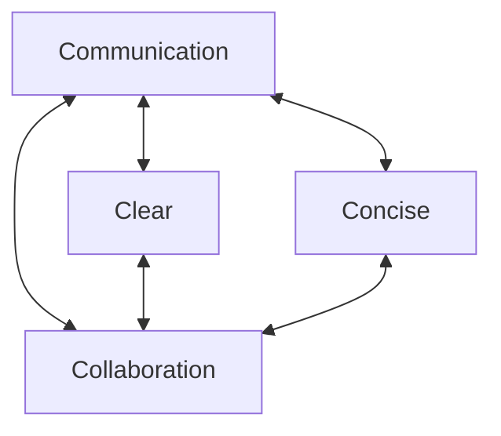
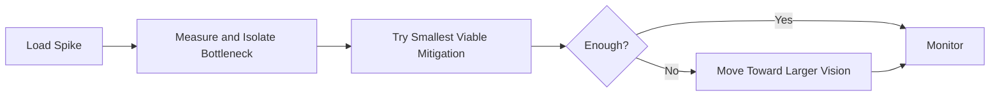
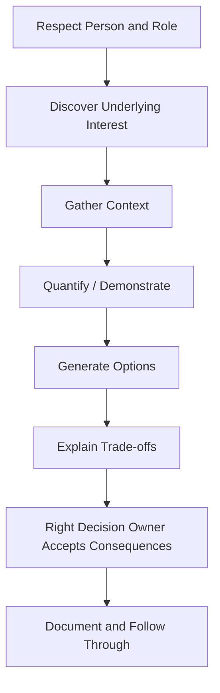
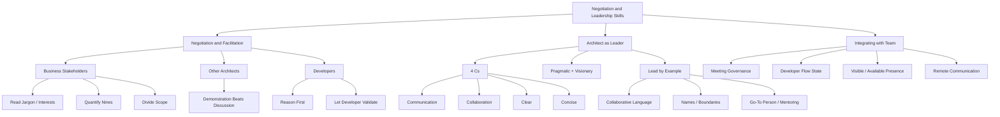

> 对应原书：*Fundamentals of Software Architecture, 2nd Edition*，Chapter 25
>
> 本章主题：软件架构师如何运用证据、理由、语言和示范，与业务利益相关者、其他架构师和开发者达成可执行共识；如何以 4C、务实与愿景的平衡、协作式领导和会议治理建立长期影响力，并保护开发团队的专注与 flow state。

---

## 0. 本章要解决什么问题

Negotiation 和 leadership 不是天生的“软技能”，原章把它们称为需要多年学习、实践和犯错才能获得的 **hard skills**。本章无法让读者一夜成为专家，但提供了一组可练习的起点。

作者推荐两本延伸读物：

- Tanya Reilly，*The Staff Engineer's Path: A Guide for Individual Contributors*；
- Roger Fisher、William L. Ury、Bruce Patton，*Getting to Yes: Negotiating Agreement Without Giving In*。

Architect 几乎每项 decision 都会受到 challenge：

- Developers 认为自己更懂实现；
- 其他 architects 认为有更好的方案；
- Business stakeholders 认为方案太贵或太慢；
- Operations/security/data 等角色有不同风险偏好；
- Timeline、budget 和组织政治限制技术选择。

如果 architect 只依靠 title 或技术知识“赢得争论”，即使短期压过反对者，也会损害信任、合作和后续执行。真正目标是：

1. 理解对方真正关心什么；
2. 收集足够 evidence；
3. 把口号翻译成可度量需求；
4. 明确 trade-offs 和 scope；
5. 让相关人参与验证；
6. 形成各方愿意执行的 solution；
7. 维护长期关系，而不是只赢一次会议。

### 0.1 谈判不等于操纵或妥协到底

Architecture negotiation 的重点不是通过话术让对方屈服，而是找出：

- Positions：对方口头要求什么；
- Interests：背后的 business/technical concern 是什么；
- Evidence：哪些事实支持或反驳 assumption；
- Constraints：哪些限制不可绕过；
- Options：是否能缩小范围或设计替代方案；
- Decision rights：谁有权接受 cost 和 residual risk。

有些要求不能折中，例如法律、安全或数据完整性底线；有些只需作用于局部系统，而不是全局。成熟谈判会区分二者。

### 0.2 领导力不等于职位

Architect 需要让开发团队愿意带着问题、坏消息和异议来找自己。影响力来自：

- 清楚而简洁的沟通；
- 可靠的技术判断；
- 承认不确定与错误；
- 亲自帮助团队解决障碍；
- 保护他人的专注和尊严；
- 言行一致。

Title 可以赋予决策权限，却不能自动赋予 respect。

### 0.3 一句话抓住本章

> 先理解对方真正关心的业务结果，再用可验证证据和清晰理由共同寻找方案；领导力则来自持续示范这种做法，而不是靠职位发命令。

### 0.4 本章推理主线

```mermaid
flowchart LR
    CHALLENGE[Decision Is Challenged] --> LISTEN[Listen for Interests and Jargon]
    LISTEN --> EVIDENCE[Gather Context and Evidence]
    EVIDENCE --> DEMO[Demonstrate / Quantify]
    DEMO --> SCOPE[Qualify or Divide Scope]
    SCOPE --> WHY[Explain Technical + Business Why]
    WHY --> COLLAB[Collaborative Language]
    COLLAB --> AGREEMENT[Executable Agreement]
    AGREEMENT --> EXAMPLE[Lead by Example]
    EXAMPLE --> TRUST[Trust and Long-term Influence]
```



### 0.5 阅读边界

原章没有给出正式谈判算法。本文增加的 availability 精确换算、谈判准备画布、会议成本模型、话术检查清单和伦理边界属于教学扩展，不是原书规定的万能流程。原章的可用性表存在两处近似/算术偏差，本文会保留原表并透明复算。

---

## 1. Negotiation and Facilitation：谈判与促成

第 1 章列出的 architect 核心期待之一，是理解并能 navigate organization office politics。原因是 architecture decision 天然跨越角色、预算和权责边界。

有效 architect：

- 理解组织政治，但不玩弄政治；
- 具备 negotiation 和 facilitation 能力；
- 能让冲突中的人继续共同工作；
- 把 disagreement 转成可验证问题；
- 形成 stakeholders 能接受的 solution。

Facilitation 与 negotiation 有区别：

- Negotiation 处理各方不同 interests 和可接受条件；
- Facilitation 设计对话过程，让信息、异议和证据能出现；
- Architect 经常同时扮演参与者与 facilitator，需要避免用职位压制讨论。

### 1.1 Negotiating with Business Stakeholders：与业务利益相关者谈判

#### 1.1.1 Scenario 1：Parker 与 Five Nines

Parker 是 senior vice president 和 product sponsor，坚持新的 global trading system 必须达到 five nines availability，即 99.999%。

Architect 已知：全球市场每天有 2 小时不交易，three nines（99.9%）足以满足 project requirements。

人际约束：

- Parker 不喜欢被证明错误；
- 尤其不接受 condescending correction；
- 技术知识有限，却认为自己很懂；
- 喜欢介入 non-functional aspects。

Architect 的任务不是当众纠正术语，而是让 Parker 在保有尊严、需求得到理解的情况下，接受合适的 availability target。

#### 1.1.2 Technique 1：听懂 Buzzwords 和 Jargon 背后的信号

原章建议：即使 corporate buzzwords 看似无意义，也要注意，它们常透露真实 concern。

| Stakeholder phrase | 不能按字面实现 | 可能的真实 concern |
|---|---|---|
| “I needed it yesterday” | 回到过去交付 | Time to market |
| “Lightning fast” | 没有具体速度 | Performance / responsiveness |
| “Zero downtime” | 绝对零通常极昂贵 | Availability / continuity |
| “Five nines” | 可能不了解精确含义 | 高 availability、业务声誉或风险恐惧 |

正确动作不是嘲笑夸张表达，而是追问：

- 哪个 user journey 不能停？
- 什么时间窗口最关键？
- 可接受多少 degradation？
- Planned maintenance 是否算 downtime？
- 这个 concern 来自历史 incident、合同还是市场承诺？

#### 1.1.3 Technique 2：谈判前尽可能收集信息

进入会议前应掌握：

- Current/required uptime；
- Business calendar 和 maintenance windows；
- 哪些 functions 真正 critical；
- 历史 outages 和损失；
- Cost/effort 差异；
- Vendor SLA/SLO；
- Technical feasibility；
- Alternatives 和 fallback。

收集信息也意味着准备被证明错。Architect 不应只搜集支持 three nines 的材料；若某个 global market、regulatory feed 或 settlement process 实际需要 24×7，就必须调整结论。

#### 1.1.4 原章 Availability Table

| Percentage uptime | Downtime per year（per day） |
|---|---|
| 90.0%（one nine） | 36 days 12 hrs（2.4 hrs） |
| 99.0%（two nines） | 87 hrs 46 min（14 min） |
| 99.9%（three nines） | 8 hrs 46 min（86 sec） |
| 99.99%（four nines） | 52 min 33 sec（7 sec） |
| 99.999%（five nines） | 5 min 35 sec（1 sec） |
| 99.9999%（six nines） | 31.5 sec（86 ms） |

表的意义是把抽象 “nines” 翻译成 stakeholder 能理解的 downtime budget。Five nines 在原章表中意味着每年约 5 分 35 秒、每天约 1 秒，极其昂贵且在 Scenario 1 中不必要。

#### 1.1.5 精确换算与原表偏差

若按 365 天计算：

$$
Downtime_{year}=(1-Availability)\times365\times24\times60\times60
$$

```python
SECONDS_PER_YEAR = 365 * 24 * 60 * 60

def downtime_seconds(availability_percent: float) -> float:
    return (1 - availability_percent / 100) * SECONDS_PER_YEAR

def format_year(seconds: float) -> str:
    hours, remainder = divmod(seconds, 3600)
    minutes, seconds = divmod(remainder, 60)
    return f"{int(hours)}h {int(minutes)}m {seconds:.2f}s"

for availability in (99.9, 99.999, 99.9999):
    yearly = downtime_seconds(availability)
    daily = yearly / 365
    print(
        f"{availability}%: yearly={format_year(yearly)}, "
        f"daily={daily:.3f}s"
    )
```

输出：

```text
99.9%: yearly=8h 45m 36.00s, daily=86.400s
99.999%: yearly=0h 5m 15.36s, daily=0.864s
99.9999%: yearly=0h 0m 31.54s, daily=0.086s
```

边界说明：

- 99.9% 的原表是合理四舍五入；
- 99.9999% 与原表一致；
- 99.0% 按 365 天应约 87h36m，而非 87h46m；
- 99.999% 应约 5m15s，而非 5m35s。

本文保留原章表用于忠实阅读，同时用公式指出偏差。真实 SLA 还要定义 measurement window、planned maintenance、regional scope、partial degradation 等，不能只用一个百分比。

#### 1.1.6 Validate Concern，再转换语言

谈判时先说：

```text
“我理解 availability 对这个系统非常重要。”
```

这不是虚假认同 five nines，而是确认 underlying interest。随后把 conversation 从 “nines” 转成 downtime：

```text
Three nines 约等于每天 86 秒非计划停机。
系统每天本来就有 2 小时无交易窗口。
哪些功能仍需在该窗口保持服务？
```

Quantification 能让双方讨论 business outcome，而不是争夺术语权威。

#### 1.1.7 Technique 3：最后再用 Qualified Cost and Time

原章建议把 cost/time 作为 last resort，而不是开场就说：

- “That will cost too much”；
- “We don't have time for that”。

这类开场容易让对方觉得 architect 只是在拒绝需求。应先讨论 business need、scope、evidence 和 alternatives；若仍需区分方案，再提供 **qualified** cost/time：

```text
不是：“Five nines 太贵。”
而是：“把 settlement path 提升到 five nines 预计增加 X 成本、Y 月，
并需要跨区域冗余；three nines 可在当前预算和日期内完成。”
```

Qualified 表示有范围、假设和依据，而不是模糊恐吓。

#### 1.1.8 Technique 4：Divide and Conquer

原章引用 Sun Tzu 的思想：“If his forces are united, separate them.”

不要默认 **entire system** 都需要 five nines。可按：

- Critical trading path；
- Read-only market data；
- Reporting；
- Administration；
- Settlement；
- Customer support

分别设不同 SLO。这样：

- 缩小高成本 requirement scope；
- 让 critical path 得到真正投入；
- 减少 negotiation 范围；
- 避免给低价值功能购买同等冗余。

这与 architecture quantum/characteristic scoping 相呼应：不同部分若需要不同 characteristics，应在 topology 中诚实表达。

#### 1.1.9 Stakeholder Negotiation Canvas（教学扩展）

```text
Position: “整个系统必须 five nines”
Interest: 交易不中断、避免声誉/收入损失
Evidence: 市场时段、历史事故、SLA、downtime budget
Unknowns: 2 小时窗口内仍有哪些活动
Options: 全局 5 nines / critical path 5 nines / 全局 3 nines + fallback
Trade-offs: cost、timeline、complexity、residual risk
Decision owner: Product sponsor 接受业务风险；architect 说明技术后果
```

### 1.2 Negotiating with Other Architects：与其他架构师谈判

#### 1.2.1 Scenario 2：Messaging vs REST

你是 senior architect，认为一组 services 应使用 asynchronous messaging，以提升 performance 和 scalability。

Addison 坚持 REST：

- 认为 REST always faster；
- 认为 REST 同样 scalable；
- Research 来自 Google search 和 popular generative AI prompt；
- 双方过去已有 heated debates。

虽然 senior architect 可以用 rank 否决，但会加剧 animosity，并让两位 architects 的 unhealthy relationship 伤害 development team。

#### 1.2.2 Demonstration Defeats Discussion

原章最重要建议：

> Demonstration defeats discussion.

不要继续抽象争论，应在 **specific environment** 中比较：

- Production-like traffic；
- Payload size；
- Latency distribution（p50/p95/p99）；
- Throughput；
- Backpressure；
- Failure/recovery；
- Consumer rate mismatch；
- Operational complexity；
- Cost。

每个 environment 不同，Google/LLM 的一般答案不能替代 context-specific evidence。

#### 1.2.3 什么才算有效 Demonstration

教学扩展建议：

1. 双方先共同定义 success criteria；
2. 使用同等优化和真实 topology；
3. 记录 assumptions；
4. 测试 normal、peak、failure；
5. 公开 raw results 和 limitations；
6. 不把 prototype benchmark 当完整生产结论。

否则 “demo” 也可能只是为预设结论设计的表演。

#### 1.2.4 保持 Calm、Clear、Concise

避免过度 argumentative，也不要 personal。事情一旦 heated：

- 停止 negotiation；
- 等双方冷静；
- 稍后重启；
- 回到 shared criteria 和 evidence。

原章说 calm leadership 加 clear/concise reasoning 通常会让对方 **back down**。**教学扩展解读**：实践中更健康的目标是让事实和共同目标取代个人对抗，而不是把迫使对方退让当作胜利；这项反思不替代原文表述。

#### 1.2.5 Seniority 不是证据

Senior architect 有决策责任，但应：

- 听取异议；
- 解释 why；
- 承认 evidence 推翻自己时改变决定；
- 记录 ADR 和 consequences；
- 避免把不同意见变成 loyalty test。

### 1.3 Negotiating with Developers：与开发者谈判

有效 architect 通过共同工作赢得 respect。团队越感到被 architecture/architect 排除，越容易出现 **Ivory Tower architecture antipattern**：高处发命令，不理 developers 的意见与 concerns。

#### 1.3.1 Justification，而非 Dictation

原对话：

```text
Architect: “You must go through the Business layer.”
Developer: “直接访问数据库更快。”
```

问题：

- “You must” 贬低对方并开启权力冲突；
- Architect 没解释 constraint；
- Developer 有 performance reason；
- 双方讨论的是 position，不是 trade-off。

改进对话：

```text
“Change control 对我们最重要，因此采用 closed-layered architecture。
这意味着 database calls 必须来自 Business layer。”
```

Developer 不再争论 layer rule，而是问如何改善 simple query performance。双方可以在保护 change control 的前提下探索 caching、query optimization 或受控 exception。

#### 1.3.2 Reason First

大多数人听到不同意的结论后会停止 listening，因此先说 justification，再说 demand。

```text
Because [important characteristic/business reason],
we have chosen [architecture principle].
This means [specific constraint].
Let's solve [local concern] inside that boundary.
```

“This means” 把规则表达为共同 architecture consequence，比 “You must” 少 personal confrontation。

#### 1.3.3 让 Developer 自己验证结论

Framework X 满足 security，Framework Y 看似不满足；developer 坚持 Y。

Architect 可以说：

```text
如果你能 demonstrate Framework Y 如何满足 security concerns，团队就使用 Y。
```

两种结果都是 win：

1. Developer 失败，亲自理解为何不能选 Y，并获得 buy-in；
2. Developer 找到可行方法，证明 architect 漏掉方案，团队得到更好 solution。

关键是条件必须真实、公平、可验证，不能把不可能完成的任务伪装成开放态度。

#### 1.3.4 Respect 是 Negotiation 的长期资本

Developers 有有用知识。Architect 越尊重他们并接受更好 evidence，未来越容易：

- 获得真实反馈；
- 发现 hidden implementation risk；
- 推动必要 refactoring；
- 处理紧急 incident；
- 获得合作而非表面服从。

---

## 2. The Software Architect as a Leader：作为领导者的架构师

原章估计，有效 architect 有 **about 50%** 依赖 people skills，包括 facilitation 和 leadership。这个数字是强调性经验判断，不是统计测量；其核心是技术知识只占成功的一部分。

### 2.1 The 4 Cs of Architecture：架构领导力的 4C

#### 2.1.1 Essential Complexity 与 Accidental Complexity

业务、technology 和 architecture 会越来越 complex。有些 complexity 无法避免，例如 six nines（99.9999%）意味着：

- 每天约 86 ms unplanned downtime；
- 每年约 31.5 seconds downtime。

这是 **essential complexity**：“we have a hard problem”。

Architects/developers 也会加入不必要 complexity 到 solution、diagram、documentation。Neal Ford 的话：

> Developers are drawn to complexity like moths to a flame—frequently with the same result.

图 25-1 展示大型 global bank backend 的密集 information flows。没人知道它是否必须如此复杂，因为 architecture 已把问题做复杂。这是 **accidental complexity**：“we have made a problem hard”。

来源可能包括：

- 为证明 architect 价值；
- 确保所有 decision 都必须经过自己；
- Job security；
- 对新技术的偏爱；
- 缺乏简化和 boundary reasoning。

原章明确列出前三类动机；后两项是常见扩展。

#### 2.1.2 4C 的精确内容

原章的 4C 是：

1. **Communication**；
2. **Collaboration**；
3. **Clear**；
4. **Concise**。

不要与 C4 Model 的 Context、Container、Component、Class 混淆。

语法上后两项是形容词，表达 architect 应 **communicate clearly and concisely**，并与 developers、business stakeholders、other architects collaboration。

#### 2.1.3 四者相互依赖



- Communication 无 clarity -> 信息被传递但误解；
- Clear 不 concise -> 重点被淹没；
- Concise 不 clear -> 过度压缩；
- Communication 无 collaboration -> 单向命令；
- Collaboration 无 communication -> 意图和约束无法共享。

4C 帮助 architect 赢得 respect，并成为 questions、advice、mentoring、coaching、leadership 的 go-to person。

### 2.2 Be Pragmatic, Yet Visionary：务实而有远见

#### 2.2.1 Visionary

Visionary 以 imagination/wisdom 思考和规划未来，使用 strategic thinking，确保 architecture 长期保持 **vital**（valid and useful）。

风险：太 theoretical，solution 难以实现甚至难以理解。

#### 2.2.2 Pragmatic

Pragmatic 是以 practical 而非 purely theoretical considerations，sensibly/realistically 处理问题。

原章列出五项：

- Budget constraints / cost factors；
- Time constraints / time factors；
- Development team's skill set/level；
- Trade-offs 和每项 architecture decision implications；
- Proposed design/solution 的 technical limitations。

平衡不是折中成平庸：vision 提供方向，pragmatism 选择下一步可行路径。

#### 2.2.3 Elasticity / Data Mesh 案例

系统出现突然、显著 concurrent-user growth，原因尚不明确。

纯 visionary 可能立即：

- 拆 databases；
- 建复杂 data mesh；
- 用 distributed domain-partitioned databases 分离 analytical 与 transactional concerns。

但 pragmatic architect 先问：

- 公司用过 data mesh 吗？
- Trade-offs 是什么？
- 它真的解决当前问题吗？
- 根因是否只是某 database/service/external source bottleneck？
- 是否能先 cache 某些 data、减少 calls？

正确顺序：



Architect 仍可保留 data mesh 作为 target option，但不应在根因未知时先购买复杂度。

#### 2.2.4 平衡带来的 Respect

- Business stakeholders 欣赏能在 constraints 内实现的 visionary solution；
- Developers 欣赏可实现、可理解的 practical design；
- Operations 欣赏考虑运行能力与 failure 的设计；
- Architect 通过 small evidence-backed steps 建立 credibility。

### 2.3 Leading Teams by Example：以身作则

#### 2.3.1 Lead by Example, Not by Title

Bad architect “pull rank”；effective architect 通过 example 让人愿意跟随。

Military story：远离 troops 的 captain 下令攻 hill，soldiers 犹豫并看 lower-ranking sergeant；sergeant 理解实际 situation，轻轻点头后，soldiers 才有信心前进。

Moral：rank/title 对真正 leadership 的作用有限；trust 来自共同经历和判断。

Gerald Weinberg 的名言：

> No matter what the problem is, it's a people problem.

Technical knowledge 必要，但解决技术问题也依赖 people skills。

#### 2.3.2 不要羞辱 Idea

在 production issue 会议中，architect 对 developer 说 “That's a dumb idea”，不仅让此人不再提建议，也让其他人沉默。

批评应面向 proposal 和 evidence，不面向人的 intelligence：

```text
“这个方案在 timeout 情况下会怎样？”
“我们有哪些数据支持它？”
“是否有更小的实验验证？”
```

#### 2.3.3 从 “What You Need to Do” 到 “Have You Considered”

命令式：

```text
“What you need to do is use a cache.”
```

Developer 回应：“Don't tell me what to do.”

协作式：

```text
“Have you considered using a cache? That might fix the problem.”
```

Question 把控制权还给 developer，邀请其共同分析。Architect 仍可提出专业方向，却不关闭 conversation。

#### 2.3.4 Facilitate Team Members 之间的协作

观察 demanding/condescending language，私下 coach，而不是公开羞辱。目标是让 members 彼此 respect，形成可持续 team dynamics。

#### 2.3.5 Turn a Request into a Favor

原章案例：Architect 要 Sridhar 在 busy iteration 把 Payment service 拆成 5 个 services：

- Store credit；
- Credit card；
- PayPal；
- Gift card；
- Reward points。

目标是提升 fault tolerance 和 scalability。

第一版是 impersonal demand：“This needs to be done this iteration”，Developer 拒绝。

第二版：

- 用名字 Sridhar；
- 承认自己等太久，处于 real bind；
- 解释 architecture reason；
- 问能否 squeeze into iteration；
- 表达 appreciation。

Sridhar 最终同意。

##### 伦理边界（教学扩展）

Favor 不应成为绕过 capacity planning 或利用人情施压的技巧。有效用法应：

- 坦诚 urgency 和 architect 自己的责任；
- 允许对方真实说 no；
- 与 product owner 调整 scope/priorities；
- 不让“欠人情”成为常态；
- 事后修复 planning process。

否则短期得到任务，长期会透支 trust 和造成 burnout。

#### 2.3.6 正确使用姓名与 Pronouns

使用名字让对话更 personal/familiar，能建立 respect。应：

- 记住姓名；
- 使用正确 pronouns；
- 不确定 pronunciation 时询问；
- 重复确认并练习正确发音。

尊重姓名不是谈判技巧表演，而是承认对方身份。

#### 2.3.7 Handshake、文化与 Personal Boundaries

原章建议在初次或偶尔见面时适当 handshake 和 eye contact：

- Firm but not overpowering；
- 约 2–3 seconds；
- 不要每天对所有人重复；
- Monthly ops meeting 等场景合适；
- 注意文化差异，例如 Japan 的 bowing；
- Professional setting 不要用 hug 替代，避免 discomfort/harassment。

现代边界补充：physical contact、eye contact 和 greeting norms 受文化、残障、健康和个人偏好影响。最安全原则是观察并尊重对方、必要时先询问；不握手不代表不尊重。

#### 2.3.8 成为 Go-To Person

Architect 应主动：

- 帮助技术问题；
- 回答 architecture questions；
- Mentoring/coaching；
- 关注 team members 状态；
- 识别何时提供空间。

Antonio 看起来 depressed/bothered 时，可邀请一起喝 coffee，温和问是否 okay；同时观察 verbal/nonverbal signals，知道何时 back off。Architect 不是 therapist，不应逼迫私人披露，但可提供人性化入口和转介支持。

#### 2.3.9 Brown-Bag / Lunch and Learn

定期分享 design patterns 或 programming-language 新特性：

- 给 developers 有价值知识；
- 练习 mentoring；
- 练习 public speaking；
- 建立 leader/mentor 身份；
- 降低“只有 architect 知道”的 knowledge bottleneck。

分享的目标不是展示 technical prowess，而是提高 team capability。

---

## 3. Integrating with the Development Team：融入开发团队

Architect calendar 往往被 overlapping meetings 填满。

Frequent meetings 是 necessary evil，但必须控制，才能留出指导、mentoring 和回答问题的时间。

### 3.1 两类 Meeting

1. **Imposed upon**：别人邀请 architect；
2. **Imposes upon**：architect 召集别人。

两类会议的控制杠杆不同。

### 3.2 管理别人邀请的会议

Architect 因跨 stakeholders 沟通常被邀请到几乎所有 meetings，即使并不需要。

收到邀请时问：

- Why am I needed？
- 只是 keep me in the loop 吗？Meeting notes 是否足够？
- Agenda 是什么？
- 我是否只需参加某个 agenda item？
- 该 item 后能否离开？
- 是否需要 decision、input，还是只需 awareness？

原章 tip 是 **Ask for the meeting agenda**：提前要求 agenda，判断是否真的需要。

### 3.3 替 Developer/Tech Lead 承担 Meeting

若 architect 和 tech lead 都被邀请，可考虑 architect 代替 tech lead，让 team 保持 focus。Architect 自己 meeting time 增加，但整体 team productivity 和 respect 提升。

前提：

- Architect 能代表/带回正确 context；
- 不替团队决定必须由 implementer 参与的事项；
- 会后简洁同步 decisions/actions；
- 不把 tech lead 永久排除在关键 discussion 外。

### 3.4 管理自己召集的会议

这是 architect 可直接控制的部分：

- Keep to absolute minimum；
- Set agenda and stick to it；
- 不让无关 issue 劫持所有人的时间；
- 问会议是否比被打断的工作更重要；
- 仅传递 information 时考虑 email/async document；
- 必须开会时放在 morning、after lunch 或 day end，减少对 central work hours 的破坏。

### 3.5 教学扩展：Meeting Cost

若 $n$ 人参加 $t$ 小时 meeting，直接人时成本至少为：

$$
PersonHours=n\times t
$$

还应考虑 context-switch/recovery cost。10 人 1 小时不是“1 小时会议”，而是至少 10 person-hours。

公式不意味着人数多的会议都不值；architecture risk/decision alignment 可能远高于成本。它用于提醒 organizer 评估 outcome。

### 3.6 Developer Flow State：开发者心流

Flow 是大脑 **100% engaged** 于问题、拥有 full attention 和 maximum creativity 的状态。处理困难 algorithm/code 时，hours 像 minutes。

原章推荐 Mihaly Csikszentmihalyi 的 *Flow: The Psychology of Optimal Experience*。

Architect 要保护 productivity flow：

- 避免在核心工作时段安排可异步会议；
- 将 interruptions batch；
- 提供 office hours；
- 使用明确 urgent channel；
- 不因自己 calendar 碎片化就碎片化全 team；
- 尊重 deep work block。

后三项是实践扩展。

### 3.7 On-Site Integration

若 on-site：

- 尽可能与 team 坐在一起；
- 独自坐远处传递 “I am special and should not be disturbed”；
- 坐在 team 旁传递 “我是团队一员，可随时提问”；
- 无法同坐时主动走动、让自己 visible；
- 在 morning、after lunch、late day block 时间交流；
- Coffee run 时问候 head of operations，保持 communication line。

Visibility 不是 surveillance，而是 availability。

### 3.8 Remote Integration

Remote environment 无法靠同坐或走动建立 presence，collaboration 更困难。原章推荐 Jacqui Read 的 *Communication Patterns*，Part 4 专门讨论 remote teams。

教学性实践：

- 固定 office hours + async Q&A；
- 公开 decision log/ADR；
- Short design recordings；
- Virtual pairing；
- 不用在线状态监控替代 trust；
- 跨时区轮换 meeting burden。

---

## 4. 三类谈判对象的统一框架

| 对象 | 主要风险 | 有效杠杆 | 应避免 |
|---|---|---|---|
| Business stakeholder | 术语、成本、目标不一致 | 识别 concern、量化、scope、qualified cost/time | 当众纠错、技术优越感 |
| Other architect | Ego、抽象争论、关系恶化 | Production-like demonstration、shared criteria、冷静 | Pull rank、Google/LLM 权威战 |
| Developer | Ivory Tower、执行抵触、实现知识被忽略 | Reason first、共同验证、让其得出结论 | “You must”、虚假开放 |

### 4.1 共同底层原则



### 4.2 可运行示例：Availability Requirement 分解

下面的教学示例不“自动谈判”，只把全局 five-nines position 分解为 subsystem SLO options，并算年度 downtime budget。

```python
SECONDS_PER_YEAR = 365 * 24 * 60 * 60

requirements = {
    "trade_execution": 99.999,
    "market_data_read": 99.99,
    "reporting": 99.9,
    "administration": 99.9,
}

def yearly_downtime_seconds(availability: float) -> float:
    return (1 - availability / 100) * SECONDS_PER_YEAR

for subsystem, availability in requirements.items():
    seconds = yearly_downtime_seconds(availability)
    print(f"{subsystem}: {availability}% -> {seconds:.2f}s/year")
```

输出：

```text
trade_execution: 99.999% -> 315.36s/year
market_data_read: 99.99% -> 3153.60s/year
reporting: 99.9% -> 31536.00s/year
administration: 99.9% -> 31536.00s/year
```

代码对应 divide-and-conquer：真正 critical 的 trade execution 获得最严 SLO，reporting/admin 不被迫购买同等 availability。具体数字必须由 stakeholders 与 risk analysis 决定，不能由程序生成。

---

## 5. 易混淆概念与常见误区

本节是根据原章整理的教学性辨析，不是原章逐项列出的清单。

### 5.1 Negotiation 是让对方接受我的方案

错误。目标是理解 interests、验证 evidence 并形成可执行 agreement；自己的方案也可能被推翻。

### 5.2 Facilitation 表示 Architect 必须保持中立

Architect 可以有专业立场，但要设计公平过程、让异议和证据出现，并明确自己何时是 decision owner。

### 5.3 Buzzword 都应按字面 Requirement 实现

错误。“Zero downtime”“yesterday”通常是 concern signal，应转成 measurable outcome。

### 5.4 Five Nines 只是比 Three Nines 多一点

错误。Downtime 从约 8h45m/year 降到约 5m15s/year，通常需要完全不同的 redundancy、operations 和成本。

### 5.5 Availability 百分比已定义完整需求

错误。还要定义 scope、measurement window、planned maintenance、degradation 和 dependency treatment。

### 5.6 Cost/Time 应作为第一句反驳

原章建议最后使用 qualified cost/time。先理解 concern、量化和缩小 scope，更容易建立共同目标。

### 5.7 Divide and Conquer 是拆散对手

在本章中是把全局 requirement 分解到真正需要它的 system areas，减少不必要范围，不是操纵人际关系。

### 5.8 Google 或 LLM 能裁决 REST vs Messaging

错误。一般知识可提供 hypotheses/trade-offs，specific environment 仍需 demonstration 和测量。

### 5.9 Demonstration 永远不会偏见

错误。Benchmark 可被错误 workload、指标和优化扭曲。应先共同定义 criteria，并公开 limitations。

### 5.10 Senior Architect 的 Rank 是最终证据

错误。Rank 带来 accountability，不让错误观点变正确。用 rank 压制会损害长期协作。

### 5.11 “You Must” 比解释 Why 更高效

短期更快，长期会制造抵触和反复争论。Reason-first 能让团队理解 constraint 并共同优化局部问题。

### 5.12 让 Developer 自己证明是把工作推给对方

若验证条件公平、时间合理且 architect 真愿意接受成功结果，这是共同 discovery；若设置不可能门槛，则是伪协作。

### 5.13 People Skills 不属于技术架构师

错误。Architecture 要靠人 funding、implement、operate；原章经验估计约 50% effectiveness 来自 people skills。

### 5.14 Essential Complexity 和 Accidental Complexity 相同

前者来自问题本身，例如 six nines；后者由设计者不必要地加入。Architect 的职责是承认前者、消除后者。

### 5.15 4C 是 C4 Model

错误。本章是 Communication、Collaboration、Clear、Concise；C4 是 Context、Container、Component、Class。

### 5.16 Visionary 表示采用最先进架构

错误。Visionary 思考长期方向；pragmatic 要求先理解 bottleneck、budget、skills 和 trade-offs。

### 5.17 Pragmatic 表示只做最便宜短期方案

错误。真正平衡是在现实约束下朝长期 vision 迈出可验证步骤。

### 5.18 Collaborative Language 表示 Architect 不给建议

错误。“Have you considered...” 仍明确提出 cache，只是邀请共同评估而非命令。

### 5.19 Favor 是更高明的命令

不应如此。必须允许真实拒绝、承认 planning failure，并调整 priority；否则是情感施压。

### 5.20 记名字和 Handshake 是操纵技巧

它们应源于尊重。Greeting 必须考虑文化、同意和个人边界；不应强迫 physical contact。

### 5.21 Go-To Person 要亲自解决所有问题

错误。应帮助、coach 并扩散知识，而不是成为 bottleneck 或英雄依赖。

### 5.22 Architect 参加所有 Meeting 才算重要

错误。应根据 agenda 和需要筛选；无必要会议会减少帮助 team 的时间。

### 5.23 Meeting Notes 能替代所有参与

若需要 decision、negotiation 或 context discovery，必须参加；若只是 awareness，notes 足够。

### 5.24 保护 Flow 表示永远不能打断 Developer

Production incident、安全问题等可能值得打断。关键是让 interruption cost 与 urgency 匹配。

### 5.25 坐在 Team 旁边就自动有 Collaboration

Physical proximity 只增加机会；仍需 respect、availability、清晰沟通和心理安全。Remote team 也能有高质量协作。

---

## 6. 一般化的问题解决方法

本节是对原章技巧的教学性归纳，不是保证谈判成功的脚本。

### 第 1 步：先管理自己

识别 ego、情绪、rank impulse 和预设答案。若 conversation 已 personal/heated，暂停并恢复冷静。

### 第 2 步：识别对方的 Interest

从 jargon、deadline、risk 和角色责任中提取真实 concern，并用复述确认。

### 第 3 步：谈判前收集 Context

准备事实、metrics、历史、cost、constraints、alternatives，也主动寻找推翻自己的 evidence。

### 第 4 步：把抽象词翻译为可度量结果

Nines -> downtime；fast -> latency SLO；scale -> throughput/concurrency；cheap -> lifecycle cost。

### 第 5 步：缩小 Requirement Scope

问 entire system 是否都需要同样 characteristic，按 critical path/domain/quantum 分解。

### 第 6 步：优先 Demonstration

在 production-like context 中做公平 spike/benchmark/failure test，用 evidence 替代观点权威。

### 第 7 步：Reason First，使用 Collaborative Language

先说明 business/architecture reason，再表达 constraint；用 question 邀请共同评估。

### 第 8 步：让提出异议者参与验证

给出真实成功条件。无论验证成功或失败，团队都获得知识和 buy-in。

### 第 9 步：Qualified Cost/Time 与 Decision Rights

其他 reasoning 不足时，说明范围化成本和时间；由有权者接受 business trade-off。

### 第 10 步：Lead by Example 并 Follow Through

承认错误、尊重姓名边界、帮助解决问题、记录 decision、兑现承诺。

### 第 11 步：管理 Calendar 保护 Team Flow

筛选 imposed meetings，最小化自己召集的会议，必要时替 team 挡会并保留 deep-work windows。

---

## 7. 本章知识结构



---

## 8. Summary：总结

本章技巧用于帮助 architect 与 development team 和其他 stakeholders 建立更好的 collaborative relationships。这些不是可有可无的礼仪，而是 architecture 能否被正确选择、理解和实现的必要技能。

Theodore Roosevelt 的话：

> The most important single ingredient in the formula of success is knowing how to get along with people.

### 8.1 核心结论

1. **Negotiation 和 leadership 是 hard skills。** 只能通过长期学习、实践、复盘和犯错提升。
2. **Architect 几乎每项 decision 都会被挑战。** 需要理解 office politics、facilitate disagreement，而不是靠 title 压制。
3. **业务方的 buzzword 是 concern signal。** 把 “yesterday”“lightning fast”“five nines” 翻译成 time-to-market、performance、availability 指标。
4. **谈判前尽可能收集 context。** 也要寻找证明自己错误的证据。
5. **把 nines 转成 downtime budget。** 原章表有两处换算偏差，精确公式能避免术语制造虚假确定性。
6. **先确认 concern，再讨论数值。** Qualified cost/time 最后使用，避免开场变成拒绝需求。
7. **Divide and conquer 用于缩小 requirement scope。** 不必让整个系统承担 critical path 的最高 characteristic。
8. **与其他 architect 争议时，demonstration defeats discussion。** Context-specific evidence 胜过 rank、搜索结果或 LLM 概率答案。
9. **冲突 personal/heated 时暂停。** Calm、clear、concise reasoning 保护关系和 decision quality。
10. **与 developers 沟通时 reason first。** “This means” 比 “You must” 更能形成共同问题求解。
11. **让反对者参与验证。** Framework Y 无论验证成功或失败，团队都获得更好的 knowledge 和 buy-in。
12. **People skills 占 architect effectiveness 的重要部分。** Technical knowledge 必要但不充分。
13. **4C 是 Communication、Collaboration、Clear、Concise。** 它与 diagramming 的 C4 Model 不同。
14. **区分 essential 与 accidental complexity。** 前者来自困难问题，后者来自不必要设计和组织动机。
15. **Architect 要 pragmatic yet visionary。** 长期方向必须经过 budget、time、skills、trade-offs 和 technical limits 检验。
16. **先隔离 bottleneck，再购买大架构。** Data mesh 不应成为未知负载问题的第一反应。
17. **Lead by example, not by title。** Language 能打开或关闭整个团队的 collaboration。
18. **Favor、姓名和问候必须建立在尊重与边界上。** 不可变成情感操纵或强迫 physical contact。
19. **成为 go-to person，但不要成为 bottleneck。** 帮助、mentor、分享并扩散团队能力。
20. **Meeting 是团队成本。** 用 agenda 筛选邀请，最小化自己召集的会议，必要时替 developers 挡会。
21. **保护 developer flow state。** 把可异步沟通移出核心工作时间，只有真正紧急事项才打断。
22. **On-site 要 visible/available，remote 要建立等价沟通机制。** Presence 的本质是可获得性，不是监控。

最终可以把本章压缩成一句架构判断：

> 用尊重发现真实诉求，用证据替代权威，用清楚而简洁的理由邀请协作，并通过亲自示范、务实判断和对团队专注的保护，把架构影响力变成长期信任。
