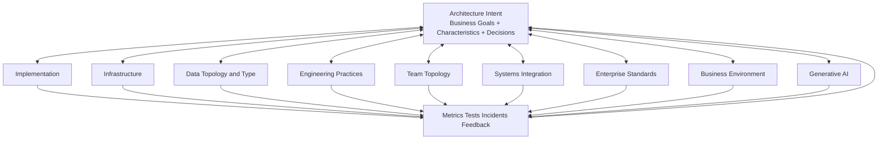
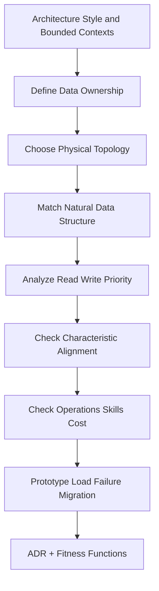
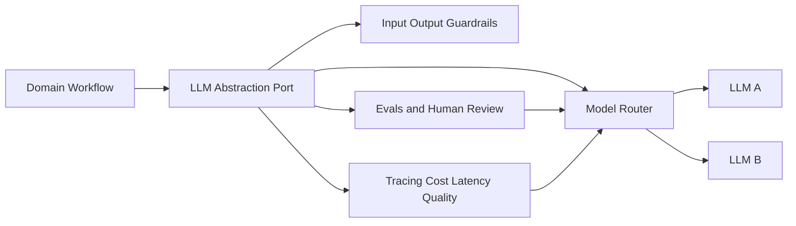

> 对应原书：*Fundamentals of Software Architecture, 2nd Edition*，Chapter 26
>
> 本章主题：软件架构从不独立存在。只有当 implementation、infrastructure、data topology、engineering practices、team topology、systems integration、enterprise standards、business environment 和 generative AI 都与架构目标对齐时，架构风格承诺的能力才会真正出现。

---

## 0. 本章要解决什么问题

前面章节已经讨论：

- 如何识别 critical architecture characteristics；
- 如何为 business problem 选择 architecture style；
- 如何作出和记录 architecture decisions；
- 如何领导 development team 实现 architecture。

但这些仍不够。Architecture 可能“图上正确、运行时失败”：

- Microservices 拆得很好，却部署在无法弹性扩容的 infrastructure 上；
- 逻辑 components 清晰，source directories 却随意交叉依赖；
- 追求 scalability，却使用一个不能扩展的 monolithic database；
- 选择 microservices，却用 manual provisioning、manual testing 和 quarterly release；
- 按 domain 划服务，团队却按 UI/backend/database 技术层分工；
- 本系统可用性很高，却同步依赖一个低可用 external system；
- 技术方案有效，却违反 enterprise security/technology standards，最终被废弃；
- Business 正在极端削减成本，却选择最昂贵的 distributed style；
- 把 LLM 接进关键流程，却没有 replaceability、guardrails、evals 和 observability。

原章把这些必须持续协调的关系称为 **intersections of architecture**。

### 0.1 九个 Architecture Intersections

| Intersection | 核心问题 |
|---|---|
| Implementation | Source code 是否支持 operational concerns、internal structure 和 constraints？ |
| Infrastructure | Deployment/runtime 是否兑现 scalability、responsiveness、fault tolerance、availability？ |
| Data topologies | Database topology/type/structure 是否匹配 architecture style 和数据行为？ |
| Engineering practices | Build、test、provision、deploy 和 feedback loop 是否支撑该风格？ |
| Team topologies | Team boundary 是否与 architecture partitioning 对齐？ |
| Systems integration | External dependencies 的 contracts、characteristics 和 coupling 是否兼容？ |
| Enterprise | 是否符合组织级 frameworks、principles、standards 和 practices？ |
| Business environment | Architecture 是否匹配成本、增长、并购、竞争和变化方向？ |
| Generative AI | LLM 如何成为可替换、可治理的架构组件，又如何安全辅助 architect？ |

### 0.2 “交叉”不是一次性接口

Intersection 不是两个部门开一次会，而是双向反馈关系：

```text
Architecture 决定需要什么能力
    -> 邻接领域提供/限制这些能力
    -> 实际证据改变 architecture assumption
    -> Architecture 与邻接领域共同调整
```

例如 architecture 需要 elastic scale，infrastructure 必须提供快速 provisioning 和 load balancing；若 cloud region placement 让 cache replication latency 失控，architecture 也必须调整 data placement 或 cache model。

### 0.3 一句话抓住本章

> Architecture style 只描述潜在能力；代码、平台、数据、实践、团队、集成、企业和业务环境共同决定这些能力能否兑现。

### 0.4 全章对齐模型



### 0.5 局部最优为何会造成整体失败

每个参与者都可能作出局部合理选择：

- Architect 选 microservices 优化 scale/elasticity；
- Developer 加 replicated cache 优化 responsiveness/decoupling；
- Infrastructure 为 performance 把 Pods 放同一 VM；
- Data team 为 consistency 选单一 relational database；
- Enterprise team 为 standardization 限制 technology；
- Business 为成本冻结 platform investment。

若这些 goals 没有共同排序，局部优化会互相抵消。本章的核心方法不是寻找“谁做错了”，而是把每个决定映射到同一组 business priorities 和 architecture characteristics。

### 0.6 阅读边界

原章没有统一的交叉点评分算法。本文加入的缓存内存公式、系统依赖可用性直觉、alignment checker、检查清单和总结流程属于教学扩展，不是原书规定的标准。Generative AI 部分反映作者在 2025 年初的观察，工具能力会快速变化，但 replaceability、evaluation、context 和 accountability 等结构性原则仍值得保留。

---

## 1. Architecture and Implementation：架构与实现

Architect 最常见回答是 First Law：**It depends**。第二常见回答是：**That's an implementation detail.**

当 architecture 未达到目标时，第二句话往往是原因。Implementation detail 仍可能决定：

- Architecture characteristic 是否成立；
- Logical boundary 是否保持；
- Constraint 是否被执行；
- Failure mode、resource usage 和 latency 是否符合假设。

Source code 必须在三方面与 design 对齐：

1. Operational concerns；
2. Internal structural integrity；
3. Architectural constraints。

### 1.1 Operational Concerns：运行关注点

Operational concerns 是 Part I 的 architecture characteristics，例如 fault tolerance、responsiveness、scalability、elasticity、availability。它们支撑 business problem，也驱动 architecture decisions。

#### 1.1.1 Order Entry 场景

新 order-entry system 需要支持：

- 数千 concurrent customers；
- 峰值约 500,000 concurrent customers。

Architect 因高 scalability 和 elasticity 选择 microservices。

Bounded contexts 很严格：

- `Order Placement` 不能直接访问 inventory database；
- 必须同步调用 `Inventory` service 获取 current inventory；
- 这形成 tight dynamic coupling；
- Network/database chain 降低 responsiveness。

#### 1.1.2 Development Team 的 Replicated Cache 方案

团队使用 in-memory replicated cache，产品例子：

- Apache Ignite；
- Hazelcast。

设计：

- `Inventory Management` 拥有 writable in-memory cache；
- 内容包括 `item_id`、`current_inv`、`max_inv`、`min_inv`；
- 每个 `Order Placement` instance 持有 read-only replicated copy；
- Cache product 在后台同步更新。

收益：

- 避免 hot-path synchronous service call；
- 降低 runtime coupling；
- 显著提升 responsiveness；
- Inventory data 本地读取。

#### 1.1.3 80,000 Customers 时的失败

Production 中 concurrent users 增长，系统增加 service instances。约到 80,000 concurrent customers 时，internal cache memory requirements 太高，所有 VMs 出现 out-of-memory，系统 crash。

这揭示两个不同优化目标：

| Architecture Team | Implementation Team |
|---|---|
| Scalability、elasticity | Responsiveness、service decoupling |
| 增加 instances | 每个 instance 复制 cache |
| 希望 resource 随负载扩展 | 每份完整副本消耗内存 |

双方 decision 都有合理依据，但没有在同一 architecture-characteristic portfolio 中评估。

#### 1.1.4 Replicated Cache 的资源直觉（教学扩展）

设：

- $N$：service instances；
- $M_a$：每实例 application memory；
- $M_c$：每实例完整 replicated cache memory；
- $M_o$：runtime/replication overhead。

集群总内存近似：

$$
M_{cluster}=N(M_a+M_c+M_o)
$$

Replicated model 中，$N$ 增加既提高 compute capacity，也线性复制 cache。单实例还必须满足：

$$
M_a+M_c+M_o<M_{instance\ limit}
$$

若 cache 随 catalog/inventory data 增长，单实例会 OOM；若单实例可容纳，但 cluster budget 有限，scale-out 会耗尽总资源。

#### 1.1.5 可运行示例：比较 Replicated 与 Shared Cache Footprint

下面只做容量示意，不复现原案例的真实配置。

```python
def replicated_memory_mb(
    instances: int,
    app_mb: int,
    cache_mb: int,
    overhead_mb: int,
) -> tuple[int, int]:
    per_instance = app_mb + cache_mb + overhead_mb
    return per_instance, instances * per_instance

for instances in (2, 8, 20):
    per_instance, cluster = replicated_memory_mb(
        instances=instances,
        app_mb=180,
        cache_mb=260,
        overhead_mb=40,
    )
    shared_cluster = instances * (180 + 40) + 260
    print(
        f"instances={instances}: replicated={cluster}MB, "
        f"shared={shared_cluster}MB, per_instance={per_instance}MB"
    )
```

输出：

```text
instances=2: replicated=960MB, shared=700MB, per_instance=480MB
instances=8: replicated=3840MB, shared=2020MB, per_instance=480MB
instances=20: replicated=9600MB, shared=4660MB, per_instance=480MB
```

含义：shared/distributed cache 降低重复 memory，却重新引入 remote access、shared bottleneck 和 availability dependency。没有免费修复；应根据 data size、update rate、latency、consistency 和 instance count 权衡。

#### 1.1.6 如何保持 Operational Alignment

以下是本文据此整理的实践检查项，属于教学扩展，并非原章逐项清单。Architecture decision 不应只写“使用 microservices”，还应定义：

- Scale model 和 expected instance count；
- Per-instance/container memory budget；
- Data placement/cache topology；
- Replication latency/update volume；
- Load/soak tests；
- Memory/GC/eviction fitness functions；
- 哪项 characteristic 优先，哪些可 trade off。

Implementation 变化若影响这些 assumptions，必须回到 architect/team 共同评估。

### 1.2 Structural Integrity：结构完整性

Logical components 是 system building blocks，组成 logical architecture。它们通常映射到：

- Source repository directories；
- Packages/namespaces；
- Modules/projects；
- Build/deployment boundaries。

Code structure 若不匹配 logical architecture，diagram 只剩愿望。

#### 1.2.1 Misaligned Logical Architecture

图 26-2 中 `Subscriber`、`Ticket`、`Completion` 边界混乱：

- `New ticket` 被放在 Subscriber；
- `Close ticket`/`Email notification` 又嵌入 Completion；
- `Ticket state` 位于边界外；
- Dependencies 横跨多个区域并交叉；
- Workflow 与 domain responsibility 混在一起。

没有 guidance、knowledge 和 governance 时，developers 可能按局部方便随意建 directory/namespace，导致：

- Maintainability 下降；
- Testability 下降；
- Deployability 下降；
- Reliability 下降；
- Evolvability/adaptability/extensibility 下降。

#### 1.2.2 Aligned Logical Architecture

图 26-3 重新按 domain 划分：

- `Ticketing`：Ticket creation、assignment、routing、expert status、customer notification、completion；
- `Customer`：registration、profile；
- `Customer survey`：send/receive survey、templates。

Boundaries 和 dependencies 更清楚，structure 与 behavior 更容易理解、测试和演化。

#### 1.2.3 Automated Governance Tools

原章列出：

- Java：ArchUnit；
- .NET：ArchUnitNet、NetArchTest；
- Python：PyTestArch；
- TypeScript/JavaScript：TSArch。

以下能力清单是本文结合这些工具整理的教学扩展。它们可检查：

- Package dependency direction；
- Forbidden cross-domain imports；
- Layer access；
- Naming/annotation rules；
- Cycle；
- Component location。

工具必须与 architect/development team 的 communication/collaboration 结合。若团队不理解 Why，规则只会被绕过；若只有沟通没有自动检查，structure 会在压力下 decay。

#### 1.2.4 Fitness Function 示例（教学扩展）

```python
allowed_dependencies = {
    "ticketing": {"customer", "customer_survey"},
    "customer": set(),
    "customer_survey": {"customer"},
}

observed_dependencies = {
    "ticketing": {"customer", "customer_survey"},
    "customer": {"ticketing"},
    "customer_survey": {"customer"},
}

def dependency_violations() -> list[str]:
    violations = []
    for source, targets in observed_dependencies.items():
        forbidden = targets - allowed_dependencies.get(source, set())
        for target in sorted(forbidden):
            violations.append(f"{source} -> {target}")
    return violations

for violation in dependency_violations():
    print("forbidden:", violation)
```

输出：

```text
forbidden: customer -> ticketing
```

代码只验证已声明 dependency policy；它不能判断 domain boundary 本身是否正确。规则必须来自 architecture decision，并随 architecture 演化更新。

### 1.3 Architectural Constraints：架构约束

Constraint 是 governing rule/principle，描述 architecture 为达到目标而必须遵守的 restriction，例如：

- Communication 只允许 REST；
- 必须使用特定 database type；
- 某 layer 不得被跨越；
- Data 只能由 owning service 修改。

Implementation 不遵守 constraint，architecture 就无法兑现目标。Architect 必须 identify、communicate，并用 tools/governance 执行。

#### 1.3.1 Limited Budget / Tight Deadline 案例

Business：

- Budget 很有限；
- Deadline 紧；
- 预计 database structure 经常变化；
- 需要快速完成这些变化。

Traditional layered architecture 适合，因为：

- Simplicity；
- Cost-effectiveness；
- Technical partitioning；
- Database changes 可隔离在一层。

#### 1.3.2 两条必要 Constraints

1. 所有 database logic 必须位于 Persistence layer；
2. Presentation 不得直接访问 Persistence，甚至 simple query 也必须经过所有 layers。

为什么看似低效仍合理：业务首要目标是 **快速控制 database change**。Database table drop/column rename 只影响 Persistence code，而不是全系统。

#### 1.3.3 Implementation 如何破坏 Goal

- UI developers 为速度直接查 database；
- Backend developers 为 maintain/test convenience 把 business logic 与 database logic 放在 Business layer。

局部理由都成立，却让 database concerns 扩散到所有 layers。结果：

- Schema change 影响全部 code；
- Change 变慢；
- Tight deadline/business goal 无法满足；
- Layered style 只剩视觉名称。

#### 1.3.4 Constraint 不是任意限制

每条 constraint 应能追溯：

```text
Business goal
    -> Architecture characteristic
    -> Architecture decision/style
    -> Constraint
    -> Compliance evidence
```

如果无法解释 Why，constraint 可能只是 preference；如果局部 exception 有更高 business value，应通过 ADR 更新，而不是悄悄违反。

---

## 2. Architecture and Infrastructure：架构与基础设施

Architecture scope 在过去二十多年不断扩大。

Mid-2000s 左右，architecture 与 operations 的关系通常：

- Contractual/formal；
- Bureaucratic；
- Operations 外包给第三方；
- 用 SLA 约定 uptime、scale、responsiveness。

今天 microservices 等 styles 会直接利用过去属于 operations 的 capabilities。Elastic scale 曾需要 space-based architecture 自己实现，现在可通过 architect 与 DevOps collaboration 更轻松获得。

### 2.1 History: How Pets.com Gave Us Elastic Scale

#### 2.1.1 Pets.com 的兴衰

- 约 1998 年出现；
- 目标成为 pet supplies 的 Amazon.com；
- Marketing 创造拿 microphone、说俏皮话的 sock puppet mascot；
- Mascot 出现在 parades 和 national sporting events；
- 原章称，management **apparently** 把资源主要花在 mascot，而非 infrastructure；
- Orders 涌入后 website slow、transactions lost、deliveries delayed；
- Disastrous Christmas rush 后关闭；
- 出售仅存有价值资产 mascot。

#### 2.1.2 Elastic Scale

Pets.com 需要：

> 在需要时快速启动更多 resource instances。

今天 cloud provider 把它商品化；early ecommerce 必须自建，许多公司第一次发现：**too much success can kill a business**。

这类失败推动 architects 重视 architecture/infrastructure intersection。

#### 2.1.3 Architecture Potential 不等于 Runtime Capability

Architecture 可以 support scalability，不表示 system 实际会 scale：

```text
Architecture allows horizontal instances
+ Infrastructure can provision/rout/store/observe them
= Real scalability
```

如果第二项不存在，star rating 无法兑现。Architect/developer 常为本质上的 infrastructure misalignment 被责备。

#### 2.1.4 DevOps 的形成逻辑

Misalignment 常来自 architect 与 infrastructure/operations 缺少 communication/collaboration。

历史演化：

1. 1990s/2000s：Operations 常被 outsourcing，architect 防御性设计；
2. Mid-2000s：Architectures 尝试内建 scale/performance/elasticity，SOA 借助 elaborate tools，implementation 变复杂；
3. Microservices creators 认识到 operational concerns 更适合由 operations 处理；
4. Architecture + operations collaboration 简化 design；
5. 形成 DevOps foundations。

DevOps 改善了 intersection，但多数公司仍有问题，因为它不只是成立一个 team 或购买 CI tool，而是共享目标、反馈和责任。

#### 2.1.5 Cloud 仍会 Misalign

##### 跨 Region/AZ 部署 Cache

Services 跨 regions 或 availability zones 会增加 latency/failure partitions，可能削弱甚至取消 in-memory replicated/distributed cache 的 performance 和 data-integrity benefits。

##### 同 VM Co-location

把 services、containers、Kubernetes Pods 放同一 VM：

- 提升 performance，减少 network hop；
- 但共同 host failure 降低 fault tolerance/availability；
- Resource contention 限制 scalability/elasticity。

这又是局部 performance 与系统 resilience 的 trade-off。

#### 2.1.6 Infrastructure Alignment Checklist（教学扩展）

- Provisioning time 是否匹配 elasticity SLO？
- Load balancer/service discovery 是否知道新实例？
- Placement 是否跨 failure domains？
- Network latency 是否匹配 sync/cache assumptions？
- Storage/database 是否能随 compute scale？
- Memory/CPU/connection quota 是否容量验证？
- Observability/rollback/chaos 是否覆盖 infrastructure failure？
- Architecture 与 platform teams 是否共享 operational characteristics 定义？

只有 close collaboration 或真正 DevOps practices，才能兑现 style 的 operational benefits。

---

## 3. Architecture and Data Topologies：架构与数据拓扑

该 intersection 经常被忽视。错误 database type/topology 会直接抵消 architecture superpowers。

| Data choice | 常见收益 | 常见代价 |
|---|---|---|
| Monolithic database | Consistency、transaction support | Scalability、fault tolerance 较弱 |
| Distributed databases | Scalability、change control | Data integrity/consistency/performance 更难 |

### 3.1 Database Topology

Database topology 指 physical databases 在 architecture 中的配置。

三种基本形态：

1. Monolithic database；
2. Distributed domain-based databases；
3. Distributed database-per-service。

#### 3.1.1 Microservices 对齐

Microservices 通常使用 database-per-service，以保持 strict bounded context。若所有 services 共享 database：

- Change control 困难；
- Fault tolerance 下降；
- Scalability/elasticity 受共同 DB 限制；
- Maintainability/testability/deployability 下降；
- Internal schema 泄漏成 integration contract。

#### 3.1.2 Service-Based 的灵活性

Service-based architecture 对 physical database topology 更灵活，可按 business/operation pressure 选择 monolithic、partial split 或 domain databases。

Style 要求不是宗教规则，而是为了 characteristic。例外必须评估 bounded context、data ownership 和 coordination consequences。

### 3.2 Architectural Characteristics：架构特征对齐

Architecture styles 和 database types 都有 superpowers（4–5 stars）与 weaknesses（1–2 stars）。应让两者优势互相放大，而非抵消。

原章引用 *Software Architecture: The Hard Parts* 对六类 database 的比较：

- Relational；
- Key-value；
- Document；
- Columnar；
- Graph；
- NoSQL（保留原章分类措辞）。

Microservices、event-driven、space-based 的 superpowers 包括 scalability/elasticity；key-value 和 columnar database 在这些方面也强，因此可能形成良好 alignment。

注意：匹配单一 characteristic 还不够。Consistency、query、transaction、operations、skills 和 cost 仍需综合权衡。

### 3.3 Data Structure：数据结构

Data 的自然结构也应匹配 database model：

- Interdependent relational hierarchy -> relational database；
- JSON event/request payload -> document model 可能更自然；
- Simple lookup/state -> key-value；
- Highly connected relationships -> graph。

把 key-value pairs 强塞进 relational schema 可能引入无谓 joins/mapping/overhead。反过来，把强关系、复杂 transaction 数据放入不合适的 store 也会把复杂性转移到 application。

一个 architecture 中的数据结构可以多样，因此原章建议 **polyglot databases whenever feasible**。

以下是本文对 “feasible” 的实践性展开，属于教学扩展，并非原章给出的逐项定义：

- Team 能运营；
- Backup/restore/security 已解决；
- 数据边界清楚；
- 产品数量不会超过组织认知能力；
- 选择带来真实 characteristic benefit。

### 3.4 Read/Write Priority：读写优先级

原章给出：

- High writes、infrequent reads -> columnar database；
- High reads -> key-value、document 或 graph；
- Reads/writes roughly equal -> relational 或 NewSQL。

这些是宏观指导，不是只凭 read/write ratio 选数据库的算法。还必须分析：

- Query shape；
- Transaction/invariant；
- Consistency；
- Data volume；
- Access locality；
- Update pattern；
- Operational maturity。

Misalignment 会造成 poor performance，并可能迫使 cache、replication 和 denormalization 补救。

### 3.5 Data Alignment Decision Flow（教学扩展）



---

## 4. Architecture and Engineering Practices：架构与工程实践

### 4.1 Process 与 Engineering Practice 的区别

Late 20th century 流行许多 methodologies：

- Waterfall；
- Agile variants：Scrum、Extreme Programming、Lean、Crystal。

过去 architects 常把 development process 与 architecture 完全分离。原章建议区分：

#### Process

Teams 如何形成/管理、meetings 如何举行、workflow 如何组织，即 people interaction mechanics。

#### Engineering Practices

Process-agnostic techniques/tools，用于 develop/release software，例如：

- Extreme Programming（XP）；
- Continuous integration（CI）；
- Continuous delivery（CD）；
- Test-driven development（TDD）。

Software engineering 同时包含 software development 与这些 practices。

### 4.2 Estimation 是 Achilles' Heel

Software development 缺少成熟 engineering disciplines 的可预测性。Civil engineers 能较准确预测 structural change；software engineers 很难回答：

- How much time？
- How many resources？
- How much money？

原因之一是传统 estimation 不适应 software 的 exploratory nature 和开发中出现的 unknowns。

这意味着 architecture/process 应允许 feedback、learning 和 re-planning，而不是把不确定性伪装成精确计划。

### 4.3 Iterative Process 更匹配 Architecture

Process 大部分与 architecture 分离，但 iterative process 更符合 architecture 会演化的本性。

用 Waterfall 构建 modern microservices 会产生 friction：

- Big-bang decomposition；
- Feedback 太晚；
- Data/contract assumptions 无法早期验证；
- Platform automation 滞后；
- Integration risk 最后集中爆发。

Agile 在 architecture migration 中尤其有效：

- Tight feedback loops；
- Strangler Pattern；
- Feature toggles；
- Incremental replacement；
- 可回滚实验。

### 4.4 Style 假设 Engineering Capabilities

Architect 往往也是 project technical leader，应决定/推动合适 practices。

Microservices architecture 隐含假设：

- Automated machine provisioning；
- Automated testing；
- Automated deployment；
- Observability/operations integration。

如果 operations antiquated、process manual、testing 很少，大量 deployable units 会导致 failure。

Style 不是只选 topology，也是在选择最低 engineering maturity 要求。

### 4.5 Evolutionary Architecture 与 Fitness Functions

Engineering practices 的进步让新 architecture capabilities 成为可能，从 XP 到 continuous delivery，再到 evolutionary architecture。

Neal Ford 等人的 *Building Evolutionary Architectures* 提出 architectural fitness functions：随着 change 持续保护/govern architecture characteristics。

Mechanisms 可包括：

- Metrics；
- Unit tests；
- Monitors；
- Chaos engineering。

### 4.6 Time to Market -> Agility

Business 需要 fast time to market，可翻译为 **agility**。原章把它视为 composite characteristic：

```text
Agility = Maintainability + Testability + Deployability
```

这里不是算术相加，而是组成关系。三者都受 engineering practices 影响，可通过 fitness functions 测量：

- Lead time for change；
- Deployment frequency；
- Test duration/flakiness；
- Change failure rate；
- Mean time to recovery；
- Component coupling/change scope。

Metrics 列表为教学扩展。

Microservices/service-based topology 支持 high agility；若 build/test/deploy practices 不对齐，系统仍达不到 goal。Fitness functions 暴露 misalignment，促使调整 practices 或 architecture。

---

## 5. Architecture and Team Topologies：架构与团队拓扑

Team topology 与 architecture 双向影响。最基础的 alignment 是 partitioning type。

### 5.1 Domain-Partitioned Teams

- 按 domain area 组织；
- 通常 cross-functional，成员各有 specialization；
- End-to-end 负责 UI 到 database。

例：Customer-facing team 拥有全部 customer functionality。

适合 domain-partitioned architectures：modular monolith、service-based、microservices 等。

### 5.2 Technically Partitioned Teams

按 technical category：

- UI team；
- Backend-processing team；
- Shared-services team；
- Database team。

与 layered architecture 的 technical partitioning 自然对齐。

Space-based 也可按 business-function teams 与 data-synchronization teams 技术分工。

### 5.3 Misalignment 的成本

若 microservices 按 domain 划分，team 却按技术层：

- 一个 feature 横跨多 teams；
- Handoffs/tickets 增多；
- End-to-end ownership 消失；
- Independent deployment 受组织同步限制。

若 layered monolith 却强行让每个 domain team 重复维护 UI/backend/data expertise，也可能增加 duplication 和 shared-layer coordination。

### 5.4 Conway's Law 的实践含义（教学扩展）

```text
Communication Structure <-> System Structure
```

Architecture migration 若不同时考虑 team ownership，代码边界会逐渐回到组织沟通边界。Alignment 不一定要求重组人员，也可通过 platform/team APIs 和明确 ownership 降低跨边界成本。

---

## 6. Architecture and Systems Integration：架构与系统集成

Systems 很少独立存在。调用 external system 做 processing/data retrieval 时，需要问：

- Called system available 吗？
- 它能按 caller 所需 scale/performance 运行吗？
- Contract 是否兼容/版本化？
- Protocol 是 sync 还是 async？
- Failure/timeout/retry 如何处理？
- Security/data classification 是否兼容？
- Integration 是否破坏 architecture quantum？

### 6.1 Static 与 Dynamic Coupling

- Static：shared schema、SDK、contract、data model；
- Dynamic：runtime call、availability/latency dependency。

忽略 integration 会让系统：

- 无法 scale；
- Responsiveness 下降；
- Agility 下降；
- Reliability 会继承必要 runtime dependencies 的 availability 与 failure constraints。

### 6.2 Availability/Latency Composition（教学扩展）

若 workflow 串行依赖 $n$ 个必须成功的 systems，在独立故障简化假设下：

$$
A_{workflow}\approx\prod_{i=1}^{n}A_i
$$

Latency 近似：

$$
T_{workflow}\approx\sum_{i=1}^{n}(L_i+P_i)
$$

真实 failures 可能相关，calls 也可 parallel，因此公式只用于说明：每个同步 dependency 会把 characteristics 带入 caller。

### 6.3 Preserve Architecture Quantum

若原本独立 quantum 必须同步等待 external system，它们可能共享：

- Availability；
- Responsiveness；
- Scalability ceiling；
- Failure mode。

可用 async messaging、local projection/cache、bulkhead、timeout/fallback 等降低 coupling，但会引入 consistency 和 complexity trade-offs。

---

## 7. Architecture and the Enterprise：架构与企业

Enterprise 指公司、department 或 division 内所有 systems/products 的集合。

Enterprise-level standards 可能涉及：

- Security standards/practices/procedures；
- Platforms；
- Technologies；
- Documentation standards；
- Diagramming standards；
- Procurement/compliance/operations。

Architect 必须了解并对齐。

### 7.1 One-Off Failure

原章多次见到：architect 忽略 enterprise practices，solution 即使 technically effective，也被判为 failed **one-off** 并 scrapped。

原因可能是：

- 无法由 enterprise operations 支持；
- 违反 security/compliance；
- Technology 无采购/人才/patch path；
- Documentation/ownership 不符合组织机制；
- 与 shared platform 重复。

### 7.2 Alignment 不等于盲从 Standards

以下 exception handling 流程是本文的实践性教学扩展。若 enterprise standard 不满足 critical characteristic，architect 应：

1. 说明 context 和 evidence；
2. 分析 standard 与 exception trade-offs；
3. 通过 ADR/architecture review 获批；
4. 定义 owner、support 和 exit plan；
5. 必要时推动 enterprise standard 演化。

偷偷绕过和盲目服从都不是有效 alignment。

---

## 8. Architecture and the Business Environment：架构与业务环境

Business environment 与 architecture 直接、双向影响，而且 business 不停止变化。

Architect 应理解公司处于：

- Severe cost cutting；
- Aggressive expansion；
- Frequent pivots / volatile competition；
- Stable market；
- Mergers and acquisitions；
- Regulatory or strategic transition。

### 8.1 Domain-to-Architecture Isomorphism

Problem/business shape 应匹配 architecture shape。

- Extreme cost cutting 与 microservices/space-based 不匹配，因为创建维护昂贵；
- Aggressive M&A 与难演化适配的 monolithic styles 不匹配；
- 高频变化需要 evolvability/adaptability；
- 稳定简单业务可能不需要昂贵分布式能力。

Architecture 也会反向限制 business：发布慢、集成难或成本高，会影响市场策略。

### 8.2 Known Knowns、Known Unknowns、Unknown Unknowns

原章引用 Donald Rumsfeld：

> There are known knowns... known unknowns... unknown unknowns—the ones we don't know we don't know.

- Known knowns：已知事实；
- Known unknowns：知道需要学习/会变化的 domain/technology；
- Unknown unknowns：没人预见、突然出现的变化。

Unknown unknowns 是 software systems 的 nemesis，也是所有 Big Design Up Front efforts 都会受挫的原因：无法为完全未知的变化预先设计完美结构。

Mark Richards 的话：

> All architectures become iterative because of unknown unknowns. Agile just recognizes this and does it sooner.

### 8.3 Planning for Change

Architecture 无法预测一切，但可降低 change cost：

- Iterative/evolutionary architecture；
- Portability；
- Scalability；
- Evolvability；
- Adaptability；
- Modularity 和 explicit contracts；
- Fitness functions 和 reversible decisions。

后两项是教学补充。

### 8.4 Residuality Theory

Barry O'Reilly（complexity theory/software design architect）提出 residuality theory，著作：*Residues: Time, Change, and Uncertainty in Software Architecture*（Leanpub, 2024）。

概念：

- Business changes 视为 **stressors**；
- 为响应 stressor 作出的 architecture changes 是 **residues**；
- 不断积累 residues 后，architecture 可能开始应对无法预测的 unknown changes；
- 在 complexity theory 中达到 critical state。

作者认为理论有趣并持续观察，并未把它宣布为已验证普遍定律。本文同样保留探索性边界。

---

## 9. Architecture and Generative AI：架构与生成式 AI

原章写于第二版完成时的 **early 2025（2025 年初）**。Gen AI/LLMs 已进入 software development/design：

1. LLM 成为 architecture 中的 runtime component；
2. Gen AI 成为 architect 的辅助工具。

这两类 intersection 不应混淆。

### 9.1 Incorporating Generative AI into Architecture

原章推荐核心原则：**abstraction + modularity**。

目标：

- 能快速替换一个 LLM 为另一个；
- 添加 guardrails（rails）；
- 对不同 LLM 结果做 evaluations（evals）；
- 收集 samples/metrics；
- 避免 domain code 直接绑死 vendor API。

#### 9.1.1 Résumé Anonymization 案例

Job-search company 用 LLM anonymize résumés，以减少 bias，让招聘关注 skills 而非 demographics。

关键问题：

- Results accurate 吗？
- 是否删除过多有价值信息？
- 是否保留过多 demographic information？
- 不同 models/prompts 表现如何？

因此必须收集 samples、metrics，并比较 LLM engines。Langfuse 等工具可提供 architecture observability。

#### 9.1.2 建议的 LLM Boundary（教学扩展）



应进一步考虑：

- PII/data retention；
- Prompt/model versioning；
- Nondeterminism；
- Fallback/manual review；
- Cost/rate limits；
- Adversarial input；
- Auditability。

这些是实践扩展，与原章 replaceability/rails/evals/observability 原则一致。

### 9.2 Generative AI as an Architect Assistant

LLM（例如 Copilot）擅长 specific、deterministic coding problem。原章例子：

```text
用 C# 生成四位、数字不重复的唯一 PIN 的 source code。
```

Architecture prompts 可能包括：

- Risk assessment：“此 architecture 有哪些 risk areas？”
- Risk mitigation：“如何处理该 risk？”
- Antipatterns：“是否存在 common antipatterns？”
- Decisions：“该 workflow 用 orchestration 还是 choreography？”

#### 9.2.1 2025 年初的作者结论

作者当时没有获得 tremendous success：询问 microservices 还是 space-based，LLM 很少给出正确答案。

原因：

- Everything is a trade-off；
- Decision 依赖 extensive business/technical context；
- 本章已有另外八类 intersections；
- 把完整 environment/context 教给 LLM，可能比 architect 自己解决更慢；
- LLM 有 knowledge，但缺少 appropriate decision 所需 wisdom。

这是一项 time-bound observation。未来模型会变化，但任何工具仍需 verified context、evidence 和 accountable human decision owner。

#### 9.2.2 有希望的工具

Thoughtworks Haiven：

- Interpret architecture diagram；
- 描述 software architecture；
- 省去先 export XML 再 prompt；
- 可询问 bottlenecks/issues。

其他尝试：

- LLM 将 PlantUML diagram 或 architecture pseudolanguage；
- 转换为 executable ArchUnit code；
- 自动 govern system structure。

该领域活动快速，未来数年会迅速改变。

#### 9.2.3 AI 的合适角色

以下角色边界是本文据原章结论整理的实践性教学扩展，并非原章逐项清单。

适合：

- 扩展 alternatives/trade-offs；
- 从 diagram/code 提取 candidate risks；
- 草拟 fitness functions/ADRs/tests；
- 生成 deterministic boilerplate；
- 帮助查询 architecture knowledge。

不应独立承担：

- Business priority；
- Risk acceptance；
- Context truth verification；
- 最终 architecture decision；
- Accountability。

Architecture assistant output 是 hypothesis，不是 evidence。

---

## 10. 九个交叉点如何联动

单个 issue 往往跨越多个 intersections。

### 10.1 Order Cache OOM 的教学性复盘链

以下链条是本文的教学性复盘；其中 infrastructure placement、测试缺口和协作问题是待验证假设，不是原书确认的事故根因。

```text
Business: 500k concurrent customers
-> Architecture: microservices + scale/elasticity
-> Implementation: replicated cache for responsiveness
-> Infrastructure: VM memory/placement limits
-> Data: inventory replication/update semantics
-> Engineering: missing representative load/soak tests
-> Team: architect/developer/platform goals未共同排序
-> Result: 80k customers 时 OOM
```

只把它归为“developer cache bug”会漏掉系统性原因。

### 10.2 可运行 Alignment Checker（教学扩展）

下面把目标能力与邻接领域证据做最小对照。它只提示缺口，不替代 architecture review。

```python
required_capabilities = {
    "implementation": {"bounded_contexts", "memory_budget"},
    "infrastructure": {"elastic_provisioning", "failure_isolation"},
    "data": {"owned_schema", "scalable_store"},
    "engineering": {"automated_tests", "automated_deployment"},
    "teams": {"domain_ownership"},
}

observed_capabilities = {
    "implementation": {"bounded_contexts"},
    "infrastructure": {"elastic_provisioning"},
    "data": {"owned_schema", "scalable_store"},
    "engineering": {"automated_tests"},
    "teams": {"technical_silos"},
}

def gaps() -> list[str]:
    result = []
    for intersection, required in required_capabilities.items():
        missing = required - observed_capabilities.get(intersection, set())
        for capability in sorted(missing):
            result.append(f"{intersection}: missing {capability}")
    return result

for gap in gaps():
    print(gap)
```

输出：

```text
implementation: missing memory_budget
infrastructure: missing failure_isolation
engineering: missing automated_deployment
teams: missing domain_ownership
```

Checker 只能验证团队已经显式定义的 expectations；真正困难的是识别哪些 capabilities 必须存在，并用 metrics/tests 证明。

### 10.3 Intersection Review Canvas（教学扩展）

| Intersection | Intent | Evidence | Gap | Owner/Action |
|---|---|---|---|---|
| Implementation | 代码保持 domain boundary | Dependency tests | Cross import | Team + architect |
| Infrastructure | 独立 failure domains | Placement/chaos result | Same VM | Platform team |
| Data | Per-service ownership | DB permissions/schema | Shared writes | Data/service owners |
| Engineering | Independent delivery | Pipeline metrics | Manual deploy | Platform/team |
| Team | Domain ownership | Team/service map | Layer handoffs | Leadership |
| Integration | Preserve SLO/quantum | Contract/trace/SLA | Sync weak dependency | Integration owner |
| Enterprise | Supported/compliant | Standard review | One-off tech | Enterprise architect |
| Business | Match cost/growth | Portfolio/business metrics | Style too expensive | Sponsor + architect |
| Gen AI | Replaceable/evaluable | Evals/traces/fallback | Vendor lock-in | AI/platform/domain |

---

## 11. 易混淆概念与常见误区

本节是基于原章整理的教学性辨析，并非原章逐项列出的清单。

### 11.1 “Implementation Detail” 不属于 Architecture

错误。若 code choice 影响 scalability、structure 或 constraint，它就是 architecture intersection 的一部分。

### 11.2 Architecture Style 的 Star Rating 自动兑现

错误。Infrastructure、data 和 practices 不支持时，五星只是潜力。

### 11.3 Replicated Cache 同时免费获得 Decoupling 与 Elasticity

错误。每实例复制 memory，scale-out 会扩大 footprint；还存在 replication/consistency trade-offs。

### 11.4 Logical Architecture 只存在 Diagram

错误。它必须映射到 directory/package/module/dependency，并由 tools 和 collaboration 治理。

### 11.5 Constraint 是 Architect 的个人偏好

错误。有效 constraint 必须追溯 business goal/characteristic，并有 compliance evidence。

### 11.6 Cloud 会自动修复 Infrastructure Misalignment

错误。Region/AZ placement、quota、co-location 和 storage 仍会抵消 architecture assumptions。

### 11.7 DevOps 等于把 Developers 和 Ops 放一个 Team

错误。核心是共同 operational goals、automation、feedback 和 responsibility，不是组织名称。

### 11.8 Database 只是 Persistence 实现细节

错误。Topology/type/structure/read-write behavior 直接影响 architecture characteristics 和 bounded context。

### 11.9 Polyglot Persistence 表示每个 Service 选不同 DB

错误。只有结构/characteristic benefit 足以支付 operational complexity 时才采用。

### 11.10 Read/Write Ratio 足以决定 Database

错误。还需 transaction、consistency、query shape、volume、skills 和 operations。

### 11.11 Process 与 Engineering Practice 完全相同

错误。Process 组织 people/workflow；practice 是 process-agnostic develop/release technique。

### 11.12 任何 Process 都同样适合任何 Style

理论上可组合，实际 friction 不同。Manual Waterfall 式 delivery 与大量 independently deployed microservices 高度不匹配。

### 11.13 Team Topology 不影响 Code Architecture

错误。Communication/ownership structure 会塑造 dependencies、handoffs 和 change boundary。

### 11.14 External System 只需有 API 就能 Integration

错误。还需 characteristics compatibility、contract/version、failure、security 和 quantum 分析。

### 11.15 Technically Excellent One-Off 一定会被接受

错误。若 enterprise 无法 support/compliance/operate，solution 可能被 scrapped。

### 11.16 Enterprise Alignment 表示禁止 Exception

错误。有证据的例外应正式审批并建立 support/exit plan；偷偷绕过才危险。

### 11.17 Business Environment 只影响 Requirements，不影响 Style

错误。Cost cutting、M&A、volatility 会改变合理 architecture shape 和 characteristic priorities。

### 11.18 Big Design Up Front 能消除 Unknown Unknowns

错误。无法预测不知道自己不知道的变化；iterative/evolutionary architecture 更诚实。

### 11.19 Residuality Theory 已是确定行业定律

错误。原章将其作为有趣的新理论并继续观察，不能过度宣称。

### 11.20 在 Architecture 中接 LLM 只需调用 Vendor API

错误。需要 abstraction、modularity、rails、evals、observability、privacy 和 fallback。

### 11.21 LLM 有大量 Knowledge，所以能独立作出 Architecture Decision

错误。Decision 需要 context、wisdom、priority 和 accountability；输出应作为 hypothesis。

### 11.22 本章九个 Intersection 可以各自独立优化

错误。它们互相作用；每个局部优化都必须回到共同 business/characteristic goals。

---

## 12. 一般化的问题解决方法

本节是对原章方法的教学性归纳，不是原章给出的正式算法。

### 第 1 步：写清 Architecture Intent

记录 business goals、critical characteristics、style decisions、constraints 和 priorities。

### 第 2 步：逐项列出九个 Intersections

不要只审 code diagram；检查 platform、data、practices、teams、external systems、enterprise、business、AI。

### 第 3 步：为每个 Intersection 收集 Evidence

使用 source dependency、load/chaos test、placement、DB metrics、pipeline data、team map、contract/SLA、enterprise standards、business roadmap、AI evals。

### 第 4 步：比较 Goal 与 Observed Capability

识别谁在优化不同 characteristic，避免“每个人都做对但系统失败”。

### 第 5 步：把 Gap 写成 Risk/ADR

说明 context、impact、likelihood、alternatives、decision、consequences 和 compliance。

### 第 6 步：共同调整，而非单方面甩锅

Architecture、development、platform、data、security、business owner 一起排序 trade-offs。

### 第 7 步：建立 Fitness Functions

将关键 alignment 转为 dependency tests、resource budgets、SLOs、pipeline metrics、team ownership checks 和 evals。

### 第 8 步：用 Iterative/Evolutionary Delivery 验证

通过 prototype、strangler、feature toggle、canary、load/failure test 小步学习。

### 第 9 步：随 Business 和 Ecosystem 重评

Cost、M&A、cloud、team、external dependencies、LLMs 都会变化，alignment 不是一次完成。

---

## 13. 本章知识结构

```mermaid
flowchart TB
    INTER[Architectural Intersections]
    INTER --> IMP[Implementation]
    INTER --> INF[Infrastructure]
    INTER --> DATA[Data Topologies]
    INTER --> ENG[Engineering Practices]
    INTER --> TEAM[Team Topologies]
    INTER --> SYS[Systems Integration]
    INTER --> ENT[Enterprise]
    INTER --> BIZ[Business Environment]
    INTER --> AI[Generative AI]

    IMP --> OPS[Operational Concerns]
    IMP --> STRUCT[Structural Integrity]
    IMP --> CONST[Constraints]

    INF --> ELASTIC[Elastic Scale / DevOps]
    INF --> PLACE[Placement and Failure Domains]

    DATA --> TOPO[Monolith / Domain / Per Service]
    DATA --> TYPE[Type and Natural Structure]
    DATA --> RW[Read Write Priority]

    ENG --> ITER[Iterative Process]
    ENG --> AUTO[CI CD TDD Automation]
    ENG --> FIT[Fitness Functions]

    TEAM --> PART[Domain vs Technical Partitioning]
    SYS --> COUP[Contracts Characteristics Quanta]
    ENT --> STD[Standards and Support]
    BIZ --> ISO[Domain-to-Architecture Isomorphism]
    BIZ --> UNK[Unknown Unknowns / Residuality]
    AI --> RUNTIME[Replaceable LLM + Rails + Evals]
    AI --> ASSIST[Assistant: Knowledge not Wisdom]

    INTER --> ALIGN[Continuous Evidence-Based Alignment]
```



---

## 14. Summary：总结

Software architecture 是 holistic activity。创建/维护 architecture 远不只是选 style 并进入 implementation；还要确保 architecture 与 technical/business environment 其他 facets 对齐，并依靠 Part III 的 communication/collaboration 让 alignment 持续发生。

### 14.1 核心结论

1. **Architecture 有九个关键 intersections。** Implementation、infrastructure、data、practices、teams、integration、enterprise、business、Gen AI 都能决定成败。
2. **Implementation detail 可能摧毁 architecture characteristic。** Order replicated cache 优化 responsiveness，却在 scale-out 时因 memory 导致 OOM。
3. **局部正确不等于整体正确。** Architecture 与 developers 各自优化不同 goals，必须共同排序。
4. **Logical architecture 必须体现在 source structure。** ArchUnit、ArchUnitNet、NetArchTest、PyTestArch、TSArch 可自动治理。
5. **Constraint 必须追溯 business goal。** Layered architecture 的 Persistence rule 用于隔离数据库变化，不是任意洁癖。
6. **Architecture potential 需要 infrastructure 才能兑现。** Pets.com 说明没有 elastic scale 时，成功流量也会杀死业务。
7. **DevOps 来自 architecture/operations collaboration。** 它让 architecture 不必内建所有 operational complexity。
8. **Cloud 仍会 misalign。** 跨 region/AZ 破坏 cache benefit，同 VM co-location 提速却扩大故障域。
9. **Data topology/type 必须匹配 style 和 characteristics。** Microservices 倾向 database-per-service；service-based 更灵活。
10. **Data natural structure 与 read/write priority 也要对齐。** Polyglot database 是有条件的能力，不是多样性目标。
11. **Engineering practices 是 architecture 的成立条件。** Microservices 假设 automated provision/test/deploy；Waterfall/manual process 会制造 friction。
12. **Evolutionary architecture 用 fitness functions 抵抗变化衰减。** Agility 依赖 maintainability、testability、deployability 及其 practices。
13. **Team partitioning 应匹配 architecture partitioning。** Domain architecture 配 domain ownership，technical architecture 可配技术团队。
14. **Integration 会把被调用系统的 characteristics 带入调用方。** 必须评估 protocol、contract、compatibility 和 quantum。
15. **Technically effective one-off 仍可能失败。** Enterprise standards、support 和 governance 是可落地性的一部分。
16. **Business environment 与 architecture 双向塑造。** Cost cutting、M&A、volatility 应改变 style 和 characteristics priorities。
17. **Unknown unknowns 使所有 architecture 最终 iterative。** Portability、scalability、evolvability、adaptability 和 residuality 思想帮助应对变化。
18. **把 LLM 纳入系统时优先 abstraction/modularity。** 必须可替换，并有 rails、evals、observability 和 human review。
19. **LLM 作为 architect assistant 更适合提出 hypotheses/trade-offs。** Knowledge 不等于 wisdom，最终 decision 与 accountability 属于人。
20. **Alignment 是持续控制回路。** 用 communication、collaboration、evidence 和 fitness functions 反复校正，而非一次评审盖章。

最终可以把本章压缩成一句架构判断：

> 不要只验证架构图是否合理；要持续验证代码、平台、数据、实践、团队、外部系统、企业规则、业务方向和 AI 组件是否仍在共同服务同一组架构目标。
