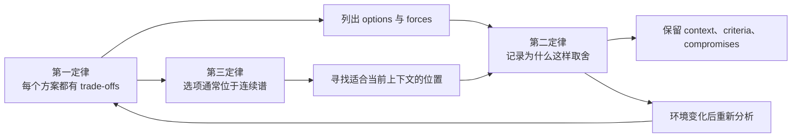
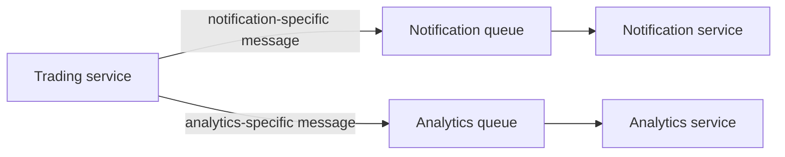
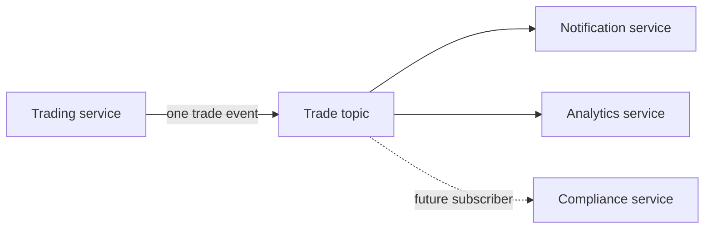
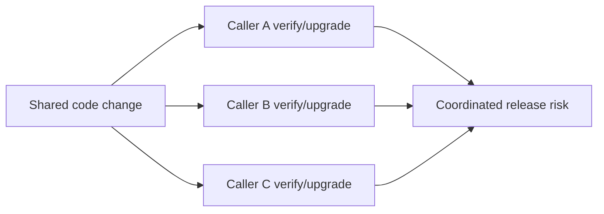
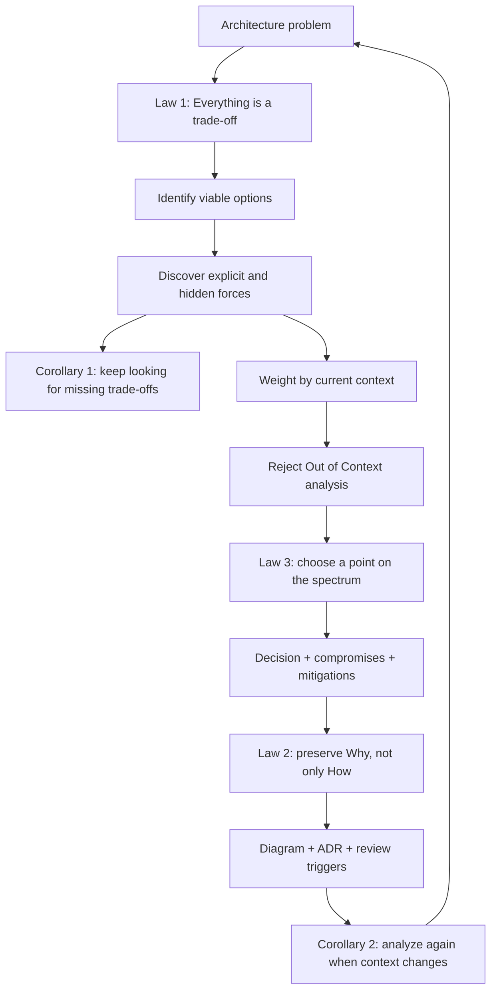

> 本章是全书的收束章。作者不再介绍一种新的 architecture style，而是回到第 1 章提出的三条定律，用 shared library/service、queue/topic、code reuse、ADR 和 architecture kata 等案例说明：架构师真正交付的不是某个永远正确的技术答案，而是在具体上下文中可解释、可复查、可调整的判断。
>
> 下文严格按原章顺序展开。原章没有给出数学算法；文中的加权公式、Python 示例、检查清单和决策流程均明确标为**教学扩展**，用于把作者的方法变成可操作工具，不应误认为原书规定的统一评分标准。

---

## 0. 本章位置：三条定律为何要在结尾重访

第 1 章提出三条 software architecture laws：

1. **Everything in software architecture is a trade-off**：软件架构中的一切都是权衡；
2. **Why is more important than how**：为什么这样做，比具体怎样做更重要；
3. **Most architecture decisions aren't binary but rather exist on a spectrum between extremes**：大多数架构决策不是二元选择，而是位于两个极端之间的连续谱。

第一版写作时，作者原本希望总结许多普遍规律，最后只找到前两条；第二版写作过程中，又逐渐识别出第三条。这一点本身很重要：作者把“law”保留给跨场景仍然成立的高层规律，而没有把某个时代的 technology、pattern 或 best practice 提升为永恒真理。

三条定律并非彼此独立：



可以把它们压缩成一个循环：

> **识别选项及代价 -> 用上下文确定优先级 -> 选择连续谱上的合适位置 -> 记录 Why -> 在条件变化时重新评估。**

这也是全章真正要解决的问题：当架构没有脱离上下文的“标准答案”时，架构师如何仍然做出可靠、可沟通、可演化的决定？

---

## First Law: Everything in Software Architecture Is a Trade-Off

### 1.1 第一定律是什么

第一定律说的不是“所有方案都一样差”，也不是“既然要权衡，就只能凭经验拍脑袋”，而是：

> 每个有意义的 architecture option 都会改善某些目标，同时牺牲另一些目标；架构工作的核心是把这些收益、代价和适用条件显式化。

人们有时把 architect 想象成寻找 silver bullet、一次解决棘手问题的英雄。作者认为这种期待不现实。优秀架构决策往往不显眼，坏决策却很容易被追责；因此 architect 的真实职责不是制造神奇答案，而是进行 **trade-off analysis**。

### 1.2 为什么架构师应成为客观的权衡仲裁者

作者建议架构师建立 **objective arbiter of trade-offs** 的声誉，而不是成为某项技术的 evangelist，理由有两层。

#### 1.2.1 技术选择会随时间失效

今天的 best practice 可能成为明天的 antipattern，因为决策只能基于：

- 当前 organization 与 business 情况；
- 当前 technology landscape；
- 当前 team capabilities；
- 当前 budget、schedule 与 risk；
- 永远不完整的信息。

即使一个决定在作出时完全合理，software ecosystem 仍在持续 evolution 和 churn。原有条件会缓慢改变，进而削弱甚至使该决定失效。若架构师把大量 social capital 投入对某种方案的宣传，后来不得不改变时，其声誉可能受损。因此，应避免把个人信誉绑定到未能良好演化的技术决定上。

因此，成熟的表达不是：

> “Technology X 永远最好。”

而是：

> “在当前目标、约束和已知风险下，X 的收益最能覆盖我们的高优先级需求；若这些条件改变，应重新评估。”

#### 1.2.2 组织真正需要的是可信判断

关键决策的负责人需要的通常不是热情推销，而是 sober objectivity：

- 选项有哪些；
- 各自得到什么、失去什么；
- 哪些事实已确认，哪些只是 assumption；
- 风险如何 mitigation；
- 什么变化会触发重审。

能持续提供这种分析的 architect，会成为组织在关键时刻愿意依赖的人。

### 1.3 Trade-off analysis 的一般步骤（教学扩展）

原章通过案例展示方法，但没有把它写成固定算法。可将其整理为以下可重复流程：

```text
输入：当前问题、候选方案、业务目标、技术与组织约束

1. 定义 decision scope，避免把不同问题混成一个选择。
2. 收集当前上下文：业务、组织、技术、团队、预算、时限与风险。
3. 列出真正可行的 options，包括中间态和组合方案。
4. 对每个 option 识别 benefits、costs、coupling 与 failure modes。
5. 提炼会影响选择的 criteria，而不是罗列所有可能属性。
6. 根据当前目标为 criteria 排优先级或赋权。
7. 先淘汰违反 hard constraints 的方案，再比较其余方案。
8. 做 sensitivity analysis：权重或假设变化时，结论是否翻转？
9. 记录 Why、compromises、mitigations 与 review triggers。
10. 条件变化后重新执行，而不是永久沿用旧结论。

输出：当前上下文下可辩护、可复查，但并非永久正确的决定
```

难点不在于画一个加减号表，而在于找到**与当前问题真正相关的 criteria**。这要求 architect 同时理解 organization、technology、team、budget 与 solution；缺少其中任何一类信息，都可能让表格看似客观、实际失真。

---

### Shared Library Versus Shared Service

#### 1.4.1 问题定义

在 microservices 或 event-driven architecture 中，多个 services 需要共享行为时，常见选择是：

- **Shared service**：把行为封装成独立服务，其他服务在 runtime 通过 network 调用；
- **Shared library**：把行为打包为 library，在 build time 编译或链接进各服务，部署后通过 in-process call 使用。

图 27-1 左侧是 shared service：A、B、C 通过网络调用集中承载 C1、C2、C3 的服务。右侧是 shared library：A 到 E 各自把所需公共组件编译到自己的 deployment unit 中。

“哪个更好”没有脱离上下文的答案。真正的问题是：**depends on what？**

#### 1.4.2 Heterogeneous code：异构技术栈

若调用方使用 Java、.NET、Go 等多个平台：

- Shared service 通过 network contract 暴露能力，implementation platform 对 caller 基本透明；
- Shared library 通常要为每个 technology stack 提供实现、binding 或 client-compatible artifact，并保持语义同步。

因此在高度异构的环境中，shared service 更有优势。它用 runtime distribution 换取 language/platform neutrality。

注意：service 并没有消除 compatibility 问题，而是把问题从“多语言实现同步”转成“网络 contract、serialization 和 runtime compatibility 管理”。

#### 1.4.3 High code volatility：高代码易变性

Code volatility 或 churn 衡量代码变化有多快。

- Shared service 更新并部署后，caller 通常能直接使用新行为；
- Shared library 更新后，各 caller 必须选择新版本、recompile、test 并 redeploy，才会获得变化。

所以公共行为频繁变化时，service 更容易集中演化。代价是所有 caller 在 runtime 依赖这个变化中的服务，兼容性错误可能即时扩散。

#### 1.4.4 Ability to version changes：变化的版本管理能力

原章认为 library 更容易 version：

- 各服务可在 compile/build time 固定自己需要的 library version；
- Version conflict 能在构建或测试阶段暴露；
- 不同 caller 可按自己的节奏升级。

Shared service 的 version negotiation 发生在 runtime，可能需要 endpoint version、header、schema evolution 或兼容窗口，interaction 更复杂。

这里看似与上一项矛盾，实际衡量的是不同问题：

- **Volatility** 问“新行为能否快速集中发布”；
- **Versionability** 问“不同消费者能否安全地控制升级节奏”。

Service 擅长集中变化，library 擅长让调用方隔离变化。

#### 1.4.5 Overall change risk：总体变更风险

Library 的变更在 caller 编译、测试并部署前不会进入其运行环境，因此可获得 compile-time verification。Service 可能在 caller 未重新编译的情况下改变，错误直到 runtime invocation 才暴露。

因此原章把 overall change risk 的优势给 library。这个结论依赖一个重要前提：library 的测试与发布流程确实能覆盖 caller 的使用方式；编译成功本身不等于行为正确。

#### 1.4.6 Performance：性能

- Library：in-process function/method call；
- Service：network hop，还涉及 serialization、routing、connection、queueing 与 remote processing。

所以在其他条件相同时，library 通常 latency 更低、overhead 更小。这里的“更快”是机制层面的相对结论，并不意味着每个系统都必须为这点差异放弃 service 的其他收益。

#### 1.4.7 Fault tolerance：容错性

Runtime service call 会引入 network partition、timeout、remote outage 等 failure modes。Library 一旦随 caller 编译、测试和部署，其执行不依赖远端服务可用性。

因此原章认为 library 的 fault tolerance 更好。更准确地说，它消除了这条**远程动态依赖**；它仍可能有本地 bug、resource exhaustion 或配置错误。

#### 1.4.8 Scalability：可伸缩性

原章认为 service-to-service latency 会削弱 scalability，而 library 的高效 in-process access 更有优势。其直觉是：每次请求都增加 remote call，会消耗连接、线程、network 和 downstream capacity，并把共享服务变成潜在瓶颈。

不过 scalability 不只是单次调用成本。Shared service 可独立扩容，而 library 会随每个 caller 复制 resource usage。原章表格关注的是本案例中的调用效率；实际决策仍需结合 state、resource footprint、instance count 和 scaling unit 分析。

#### 1.4.9 原章比较矩阵

| Factor | Shared library | Shared service | 决定差异的机制 |
|---|:---:|:---:|---|
| Heterogeneous code | - | + | Network contract 隐藏实现平台 |
| High code volatility | - | + | Service 集中部署后立即提供新行为 |
| Ability to version changes | + | - | Library 可在 build time 固定版本 |
| Overall change risk | + | - | Library change 可在 compile/test 阶段验证 |
| Performance | + | - | In-process call 避免 network overhead |
| Fault tolerance | + | - | Library 不引入 remote runtime dependency |
| Scalability | + | - | 本地调用避免 shared remote latency/bottleneck |

按未加权的正负项累计，shared library 占优。但作者马上限制了这个结论：

> 它只是在**这些 factors、这个 context** 下的初步赢家；criteria 可能需要加权，也可能还漏掉关键因素。

不能把表格复制到另一个项目后直接宣布 library 永远优于 service。

#### 1.4.10 容易混淆的结论

| 误解 | 正确理解 |
|---|---|
| “Shared service 更 decoupled，所以必然更好” | 它降低 build-time implementation coupling，却增加 runtime/network coupling。 |
| “Shared library 没有 coupling” | Caller 仍依赖 library API、semantics 和 release；只是依赖在 build/deploy 时处理。 |
| “多数加号就是答案” | 加号不代表相同价值，必须结合 priority、hard constraint 与 context。 |
| “一次选定后全公司统一” | 第二推论明确反对把局部分析永久推广。 |
| “Compile success 等于零风险” | 编译只能验证部分 compatibility，行为与数据风险仍需测试。 |

---

### Synchronous Versus Asynchronous Messaging

#### 1.5.1 标题与实际问题的边界

原章标题写的是 “Synchronous Versus Asynchronous Messaging”，但正文实际比较的是：

- **Queue / point-to-point topology**；
- **Topic / broadcast-publish-subscribe topology**。

必须避免一个常见误区：queue/topic 描述消息分发拓扑，synchronous/asynchronous 描述时间与控制流耦合；两组维度并不完全等价。Queue 和 topic 通常都用于 asynchronous messaging。下文忠实按原章的 queue/topic 案例展开，但不把它们错误地定义为同步/异步的同义词。

#### 1.5.2 场景与 Queue 方案

`Trading` service 要把 trade information 发给 `Notification` 和 `Analytics` services。

Queue 是 point-to-point communication：publisher 知道消息发给谁。要通知多个 consumer，`Trading` 必须为每个 consumer 对应的 queue 各发送一次：



Queue 方案的收益来自“每条通道独立”：

- 可给不同 consumer 发送 heterogeneous messages；
- 可分别监控各 queue depth；
- 可独立扩缩各条 consumer pipeline；
- Producer 明确知道 receiver，未经接线的 rogue service 较难直接 listen in；
- 可针对不同 receiver 设置 policy、retention 和 access control。

代价则来自 producer 对 consumers 的显式认识：

- Consumer 越多，producer 要连接和维护的 queues 越多；
- 新增 `Compliance` consumer 时，需要修改 `Trading`，让它再发送到第三条 queue；
- Infrastructure 数量随 consumer 增长；
- Producer 与 consumers 之间 coupling 较高。

原文一处把消费者写成 `Analytics` 和 `Reporting`，但场景开头、图 27-2 与后文均是 `Notification` 和 `Analytics`。这应理解为原章文字中的命名不一致，不代表第三个既有 consumer。

#### 1.5.3 Topic 方案

Topic 实现 broadcast/pub-sub：`Trading` 只发布一条消息，所有 subscriber 各自收到通知。Publisher 不知道也不关心有哪些 consumers；以后新增 consumer，无须修改 producer 或既有 consumers。



Topic 的核心收益是 extensibility/evolvability 与低 producer-consumer coupling：

- Producer 只生成一次消息；
- 新 subscriber 可自行接入；
- Existing producer/consumers 无需知道新订阅者；
- 对快速增长、未来消费者未知的 organization 很有吸引力。

它的代价也正来自 broadcast：

- 所有 consumers 收到同一种 homogeneous message；
- 为满足不同 consumer，event 容易携带过多字段，形成 **stamp coupling**；
- 每个 subscriber 都能看到完整消息，扩大 sensitive data exposure；
- 原章认为难以像独立 queues 那样监控或扩缩单个 consumer；
- 针对不同 consumer 的定制隔离与 capacity control 较少。

Stamp coupling 指 consumer 只需要某几个字段，却依赖并接收整个大数据结构。它增加 schema evolution、security 和 unnecessary data transfer 的成本。

#### 1.5.4 两种拓扑的权衡表

| Criterion | Queue / point-to-point | Topic / pub-sub |
|---|---|---|
| Message shape | 可按 consumer 定制 heterogeneous messages | Consumers 接收 homogeneous event |
| Producer coupling | 知道每个 consumer，coupling 较高 | 不知道 subscriber，coupling 较低 |
| Send count | 每个 consumer 发送一次 | Producer 发布一次 |
| Monitoring/scaling | 可独立监控 queue depth、独立扩缩 | 原章认为单个 consumer 的隔离选择较少 |
| Infrastructure | Consumer 增加时 queues/connections 增加 | 共享 topic，producer 侧较简单 |
| Security | 接收者明确，相对更容易限制暴露 | 所有 subscriber 可读完整 message，风险更高 |
| Extensibility/evolvability | 新 consumer 需要修改 producer 接线 | 新 subscriber 无需改 producer |
| Coupling risk | Static/topology coupling | Stamp/schema/security coupling |

原章 Table 27-2 的 Markdown 转换结果把 “Less extensible” 放在 Advantage 列、把 “Good support for extensibility and evolvability” 放在 Disadvantage 列，与相邻正文及 Table 27-3 逻辑冲突。这里按正文的明确论证解释：queue 的 extensibility 较弱，topic 的 extensibility/evolvability 较强；不把转换后的错位列当作新结论。

#### 1.5.5 选择如何形成

两种方案都 viable，选择必须回到 organizational goals：

- **Security 更重要**：倾向 queues，因为 receiver 与 channel 更明确；
- **组织快速增长、未来会有更多 trade consumers**：倾向 topic，因为 extensibility 更重要；
- **不同 consumers 需要不同 payload**：queue 更自然；
- **Producer 不应知道 subscriber 数量**：topic 更自然。

这段分析展示了第一定律的完整逻辑：

1. 先理解 topology 的机制；
2. 从机制推导 coupling、security、scalability 和 evolvability 后果；
3. 再让业务优先级决定哪个后果更可接受；
4. 不是先选喜欢的技术，再为它寻找理由。

---

### First Corollary: Missing Trade-Offs

第一定律的第一个推论是：

> **If you think you've discovered something that isn't a trade-off, more likely you just haven't identified the trade-off...yet.**

如果某项实践看上去只有好处，最合理的第一反应不是宣布发现 silver bullet，而是继续寻找被隐藏、转移或延迟的成本。

#### 1.6.1 Code reuse 为什么不是纯收益

“复用越多，重复代码越少，开发越快”听起来无可反驳。作者指出，有效 reuse 取决于两个条件：

1. **Good abstraction**：代码确实表达多个调用点共同且稳定的概念；
2. **Low volatility**：被复用部分变化缓慢。

Architects 常看到第一个条件，却忽略第二个。

若 shared module 持续变化：



即使变化声称 backward compatible，每个 caller 仍要确认没有被破坏。复用范围越大，change blast radius 越大；一个局部变化可能让全系统协调升级。

因此，reuse 的完整关系不是：

$$
\text{more reuse} \Rightarrow \text{less total work}
$$

而是以下教学性概念表达：

$$
\text{Reuse value}
= \text{avoided duplication}
- \text{coordination cost}
- \text{change propagation risk}
$$

这不是原章可计算公式，而是帮助识别隐藏代价的心智模型。只有 avoided duplication 长期大于协调与传播成本，reuse 才真正创造净收益。

#### 1.6.2 为什么 plumbing 比 domain 更适合复用

最成功的 reuse targets 往往是较稳定的 plumbing：

- Technology frameworks；
- Libraries；
- Platforms；
- Logging、observability、protocol 等基础能力。

多数 application 变化最快的是 domain，因为业务变化正是开发软件的动机。Domain concepts 因此常是糟糕的 implementation reuse 候选。

作者把它与 Domain-Driven Design 的 **bounded context** 联系起来：不同 bounded contexts 不应复用彼此的 implementation details。即便同一个词出现在两个上下文中，它的 meaning、rules 与 lifecycle 也可能不同。强行共用一个 domain model 会把本应独立演化的边界重新耦合起来。

#### 1.6.3 Orchestration-driven SOA 的教训

Orchestration-driven SOA 曾以尽可能多地 reuse code 为重要理念。实践中，共享行为的每次变化都可能产生不可预测的 ripple effects，团队像在 quicksand 中工作：看似节省了局部实现，实际付出全局协调成本。

作者借此说明：一个理念越“显然正确”，越需要追问它把 complexity 搬到了哪里。

---

#### Why We Can’t Have Nice Things—Trade-Offs!

客户常希望同时获得：

- Microservices/distributed architecture 的高度 decoupling、agility 和 fast deployment；
- 高度 institutional reuse，避免团队重复实现。

作者针对 **institutional implementation reuse** 的结论很强：组织不能同时拥有高度 decoupling 与高度 reuse，因为这种 reuse 必须建立 shared dependency，而 shared dependency 就是 coupling；二者 fundamentally incompatible。

推导如下：

1. Institutional reuse 要求多个 teams/systems 依赖同一实现；
2. Shared implementation 的 version、behavior 或 release 变化会影响多个 consumers；
3. Consumers 因此需要 compatibility、coordination 或 synchronized change；
4. 这种共同变化压力与 independent deployability/decoupling 冲突；
5. 所以“高度 implementation reuse”和“高度 decoupling”是相反方向的 forces。

这不意味着 microservices 必须复制所有东西。以下复用类型的区分是本文的教学澄清，原章未逐项展开：

| 可共享对象 | 对 decoupling 的影响 |
|---|---|
| 知识、经验、design guideline | 通常不形成 runtime/build dependency |
| Stable protocol/specification | 形成 contract coupling，但可通过兼容演化控制 |
| Tooling/platform capability | 可能适合复用，但需控制 release 与 failure coupling |
| Domain implementation/model | 容易把 bounded contexts 和 deployment lifecycle 绑在一起 |

这里的关键不是禁止 reuse，而是承认：**复用通过 coupling 实现，必须把 coupling 成本计入收益。**

---

### Second Corollary: You Can’t Do It Just Once

第二个推论是：trade-off analysis 不能只做一次。

架构师可能希望“认真分析一次”，然后规定所有 workflow 永远使用 choreography，或所有共享行为永远使用 library。但实际决定受几十乃至数百个 technical/nontechnical variables 影响，例如：

- Complexity；
- Team experience；
- Budget；
- Team topology；
- Schedule pressure；
- Security/compliance；
- Existing infrastructure；
- Business growth；
- Technology maturity。

这些变量的细微差别就可能让结论翻转。于是：

- 相似问题不等于相同 context；
- 今天正确不等于明天正确；
- Organization-wide default 不等于不可例外的永久规则；
- Pattern 名称相同，不等于 forces 权重相同。

#### 1.7.1 为什么“一次决定”危险

Sweeping、semipermanent decision 往往偷偷冻结了 assumptions。当未来系统不再满足这些 assumptions 时，团队仍机械沿用旧规则，best practice 就变成 antipattern。

第二推论与第一推论形成闭环：

- 第一推论要求继续找**遗漏的 trade-off**；
- 第二推论要求继续找**变化后的 context**。

#### 1.7.2 何时应重做分析（教学扩展）

可把以下事件写成 ADR review triggers：

- Business priority 改变；
- Load、data volume 或 latency 分布跨过阈值；
- 新 regulation/security classification 出现；
- Team ownership/topology 改变；
- Technology/platform 生命周期改变；
- 原 mitigation 失效；
- Incident 证明原 assumption 错误；
- 新 option 的成熟度显著提高。

作者略带幽默地把这一推论称为 architect 的 job security：架构师必须反复分析，而不是制造永久、完美的决定。

---

## Second Law: Why Is More Important Than How

### 2.1 How 与 Why 分别回答什么

经验丰富的 architect 通常能从 code、deployment、diagram 和 runtime topology 还原系统 **how it works**：

- Components 如何连接；
- Data 怎样流动；
- 使用什么 protocol；
- 部署到哪些 nodes；
- 哪个 service 调用哪个 service。

但这些 artifacts 往往无法解释 **why this option over another**：

- 当时有哪些 alternatives；
- 哪些 criteria 最重要；
- 为什么接受这些 compromises；
- 哪些 constraints 已不存在；
- 哪些 risks 有意保留。

最终 solution 会压缩决策过程。大量 context 不会自然留在 code 或 topology 中，所以 Why 比 How 更稀缺、更难恢复。

### 2.2 为什么 diagram 与 ADR 必须配合

- **Architecture diagram** 主要记录结构和交互，即 How；
- **Architecture Decision Record, ADR** 记录 context、decision、alternatives、trade-offs、consequences 和理由，即 Why。

只有 diagram，后来者会知道“系统使用 topic”，却不知道：

- 是为了未来 consumer extensibility 吗？
- 当时是否接受了 sensitive data 暴露风险？
- 为什么没有为每个 consumer 建 queue？
- 哪个业务变化会让选择翻转？

只有 ADR 没有 diagram，也难以看清决定落到 system topology 后产生的实际关系。因此二者不是替代品，而是同一 architecture story 的两半。

### 2.3 Why 如何避免重复劳动

若不记录 decision criteria，future architect 即使就是当年的自己，也只能重新分析，才能理解过去的选择。记录 Why 可以：

- 避免把有意 compromise 当成疏忽；
- 判断旧 constraint 是否仍成立；
- 在 context 改变时只重审受影响部分；
- 防止团队循环争论已经分析过的问题；
- 让 decision quality 可评审，而不只看最终结果。

### 2.4 最小 ADR 信息（教学扩展）

原章强调 ADR 的必要性，但未在本章重新规定模板。结合第二定律，可至少记录：

```text
Title / Status / Date
Context:
  当前问题、business drivers、constraints、known assumptions
Options:
  真正比较过的候选方案
Decision criteria:
  criteria、优先级、hard constraints
Decision:
  选择什么，以及最关键的 Why
Consequences:
  获得的 benefits、接受的 compromises、new risks
Mitigations:
  如何降低已知风险
Review triggers:
  哪些条件变化时必须重审
```

记录 Why 不等于写一篇长论文。重点是保留那些无法从最终系统反推、且会影响未来判断的信息。

---

### Out of Context Antipattern

#### 2.5.1 反模式定义

**Out of Context antipattern** 指 architect 理解各方案的一般 trade-offs，却没有根据当前 context 为它们正确加权。

这种分析可能事实都对，结论却错，因为它默认：

- 所有 criteria 同等重要；
- 所有 organization 目标相同；
- 所有 constraints 都是 soft preferences；
- 通用加减号可以直接替代本地判断。

#### 2.5.2 Shared library 表格为什么可能翻转

在未加权表中，shared library 有五项正面、两项负面，看似获胜。现在改变 context：

- Team 使用多个 platforms；
- Shared behavior 变化很快；
- Performance 与 scale 并不重要；
- Team 希望集中管理公共行为。

此时 `Heterogeneous code` 和 `High code volatility` 的优先级远高于其余 criteria，shared service 应成为更合适的选择。原表没有错；错的是忽略权重，把一个 context-free ranking 当成决定。

而且 trade-off table 仍有价值：团队已经提前知道 service 的 versioning、runtime change risk、performance、fault tolerance 和 scalability 风险，可为它们设计 mitigation。

#### 2.5.3 加权决策模型（教学扩展）

为了演示 context 如何改变结果，可把原章的 `+/-` 临时映射为 $+1/-1$。对 option $o$：

$$
Score(o)=\sum_{i=1}^{n}w_i s_{i,o}
$$

其中：

- $w_i\ge 0$：当前 context 中 criterion $i$ 的相对权重；
- $s_{i,o}$：option $o$ 在 criterion $i$ 上的相对评价；
- $Score(o)$：用于讨论的汇总结果，不是真理或精确收益。

下面的 Python 代码严格复现原章七项正负评价，并比较两个 contexts：

```python
options = {
    "shared_library": {
        "heterogeneous_code": -1,
        "high_code_volatility": -1,
        "version_changes": 1,
        "overall_change_risk": 1,
        "performance": 1,
        "fault_tolerance": 1,
        "scalability": 1,
    },
    "shared_service": {
        "heterogeneous_code": 1,
        "high_code_volatility": 1,
        "version_changes": -1,
        "overall_change_risk": -1,
        "performance": -1,
        "fault_tolerance": -1,
        "scalability": -1,
    },
}

def rank(weights: dict[str, int]) -> tuple[dict[str, int], str]:
    scores = {
        option: sum(weights[factor] * value for factor, value in factors.items())
        for option, factors in options.items()
    }
    winner = max(scores, key=scores.get)
    return scores, winner

equal_weights = {factor: 1 for factor in options["shared_library"]}
heterogeneous_and_volatile = {
    **equal_weights,
    "heterogeneous_code": 5,
    "high_code_volatility": 4,
}

for name, weights in {
    "equal": equal_weights,
    "heterogeneous_and_volatile": heterogeneous_and_volatile,
}.items():
    scores, winner = rank(weights)
    print(
        f"{name}: library={scores['shared_library']}, "
        f"service={scores['shared_service']} -> {winner}"
    )
```

输出：

```text
equal: library=3, service=-3 -> shared_library
heterogeneous_and_volatile: library=-4, service=4 -> shared_service
```

代码与原理的对应关系：

1. `options` 保存机制分析得到的相对方向；
2. `weights` 表达 organization 当前优先级；
3. `rank()` 让“同一选项在不同上下文中翻转”变得可见；
4. 输出不是自动 architecture decision，而是要求团队解释权重的讨论工具。

#### 2.5.4 模型的前提与局限

加权模型只有在以下前提下才有辅助价值：

- Criteria 没有遗漏决定性因素；
- `+/-` 方向在当前场景成立；
- 权重来自 stakeholders 与 evidence，而非为预设答案服务；
- 违反 legal/security 等 hard constraint 的方案先被淘汰；
- 不把 ordinal judgment 伪装成精确经济测量。

它的局限包括：

- Criteria 可能相关，简单求和会重复计分；
- $+1$ 与 $-1$ 不能表示影响幅度；
- 权重含不确定性并会随时间变化；
- 一个极端风险可能不能被许多小收益抵消；
- Political、operational 和 human factors 很难准确量化。

因此，公式的价值在于暴露 assumptions、支持 sensitivity analysis，而不是把 architect 变成自动计分器。

#### 2.5.5 如何识别 Out of Context

出现以下说法时应警惕：

- “这个 pattern 是 industry best practice，所以直接用”；
- “表中正面项更多，所以它赢”；
- “上个项目这样做成功，这次也一样”；
- “所有 teams 必须采用同一 topology”；
- “我们列了 trade-offs，因此不必问 business priority”。

Architect 的经验用于发现 criteria；context 决定如何 weight criteria。两者缺一不可。

---

## The Spectrum Between Extremes

### 3.1 第三定律是什么

第二版新增的第三定律是：

> **Most architecture decisions aren't binary but rather exist on a spectrum between extremes.**

现实中的 architecture 很少只有互斥的 A/B。许多争论难以得到统一定义，正因为对象位于 messy spectrum 上，例如：

- Architecture 与 design；
- Orchestration 与 choreography；
- Topics 与 queues；
- Centralization 与 decentralization；
- Reuse 与 duplication；
- Consistency 与 availability。

### 3.2 为什么二元化会误导

Binary framing 会隐藏三类事实：

1. **中间方案存在**：可按 workflow、domain 或 risk 采用不同程度；
2. **多个维度独立变化**：一个方案可能 topology 分散、governance 集中；
3. **位置会移动**：system growth、team maturity 或 regulation 改变后，合适点也会变化。

以下是教学性应用举例，原章未逐项展开：queue 与 topic 并非只能全系统二选一。Sensitive commands 可走 dedicated queues，公开 domain events 可走 topics；关键是说明每条 flow 的 forces，而不是追求技术标签纯度。

### 3.3 如何理解 architecture 与 design 的边界

作者给出一个实用判断：

> **A software architecture decision is one where each of the options has significant trade-offs.**

也就是说，一项决定越会显著影响 architectural characteristics、structure、coupling、deployment、team 或长期 change cost，它越靠近 architecture 一端。若选项之间代价很小、影响局部且易逆转，则更靠近 design/implementation 一端。

这不是用职位或文档类型划线，而是用**trade-off significance** 判断决策性质。

### 3.4 在连续谱上决策的方法（教学扩展）

```text
不要只问：A 还是 B？

改问：
1. 两个极端分别优化什么？
2. 有哪些独立维度，而不是单一轴？
3. 当前 context 在每个维度上需要多大程度？
4. 是否可按 domain/workflow/data classification 分段选择？
5. 哪些 coupling 或 operational cost 会在中间方案中叠加？
6. 未来什么信号会推动位置向另一端移动？
```

连续谱不意味着“永远折中取中点”。中点可能同时承担两端成本却得不到任一端收益。正确做法是选择与 forces 相称的位置，必要时也可以选择极端。

### 3.5 不确定性为何无法被彻底消除

Architects 在 uncertainty 的 swamp 中决策：

- 信息可能不完整；
- Unknown unknowns 无法预先列出；
- 即使拥有完整信息，多个 criteria 仍可能冲突；
- 方案位于连续谱上，不存在自然分界线。

“It depends” 因而不是逃避回答。合格的完整回答是：

> It depends on **哪些 forces**、它们在当前 context 中的 **priority**，以及我们愿意承担哪些 **consequences**。

第三定律与前两条的关系是：

- 第一定律解释为什么每个位置都有代价；
- 第二定律要求保留选择该位置的上下文；
- 第三定律提醒 architect 不要把丰富选项压扁成虚假的二元题。

---

## Parting Words of Advice

### 4.1 Architect 能力来自反复实践

作者引用 Fred Brooks：

> How do we get great designers? Great designers design, of course.

Ted Neward 随即提出困境：

> 如果一个人职业生涯中真正 architect 一个系统的机会不到六次，怎样成长为优秀 architect？

Architecture 涉及大量 contextual judgment，单靠阅读 pattern catalog 无法形成。必须反复练习：

- 识别 forces；
- 比较 options；
- 解释 trade-offs；
- 接受 challenge；
- 观察 consequence；
- 修正自己的判断模型；
- 持续扩大 technology breadth。

### 4.2 Architecture Katas 为什么没有标准答案

作者在 companion website 提供 architecture katas，让新老 architects 练习设计。使用者经常询问 answer guide，作者的回答是：没有。

Neal Ford 的总结是：

> **There are not right or wrong answers in architecture—only trade-offs.**

以下是本文对这句话的教学澄清，原章未逐项列出这些判据。它不是说架构没有质量差异；方案可能：

- 漏掉关键 requirement；
- 违反 hard constraint；
- 无法支持重要 characteristic；
- 对已知 risk 没有 mitigation；
- 无法解释 Why。

它真正强调的是：不能只凭 topology 与参考答案是否一致来评分。一个决定是否合理，取决于它能否在给定 context 下解释并承担 trade-offs。

### 4.3 为什么只保存图不够

作者早期曾保存 training 中学生画出的 diagrams，希望建立答案库，后来放弃，因为这些图只是 incomplete artifacts：

- 图记录 teams **how** implemented the solution；
- Teams 在课堂上口头说明了 **why** 和 trade-offs；
- 但没有时间创建 ADR；
- 离开上下文后，只剩半个故事。

这再次验证第二定律：相同图形可能来自完全不同的目标与限制，仅靠 How 不能判断 decision quality。

### 4.4 Kata 练习模板（教学扩展）

一次完整 kata 不应止于画图，可按以下步骤练习：

1. 提取 functional requirements 与 architectural characteristics；
2. 标出 explicit constraints、assumptions 与 unknowns；
3. 提出至少两个 viable options；
4. 对每个 option 分析 coupling、data、deployment、operations 与 team impact；
5. 让不同参与者代表 business、security、operations 等视角挑战 criteria；
6. 根据 context 加权，而不是数加号；
7. 选择连续谱上的位置并说明 compromises；
8. 画 architecture diagram 记录 How；
9. 写简短 ADR 记录 Why；
10. 改变一个关键条件，观察决定是否翻转。

最后一步尤其重要：它把第二推论“不能只做一次”和第三定律“存在连续谱”变成实际训练。

### 4.5 常见误区总表

| 常见误区 | 本章给出的纠正 |
|---|---|
| Architect 应找到 silver bullet | Architect 的核心工作是客观 trade-off analysis。 |
| Best practice 永远有效 | Ecosystem 与 context 会变化，今天的 best practice 可能成为 antipattern。 |
| 列出优缺点就完成决策 | Criteria 必须按当前 organization goals 加权。 |
| 正面项数量多的方案必胜 | 权重、hard constraints 和遗漏因素可能使结论翻转。 |
| 看似纯收益的实践没有代价 | 更可能是隐藏 trade-off 尚未被发现。 |
| Code reuse 只会减少工作 | 高 volatility 的 shared code 会扩大 coordination 与 change blast radius。 |
| 高 reuse 与高 decoupling 可同时最大化 | Implementation reuse 通过 shared dependency 实现，因此会增加 coupling。 |
| 相似问题可永久复用同一决定 | Variables 与 assumptions 变化，需要反复分析。 |
| Diagram 足以记录 architecture | Diagram 主要说明 How，ADR 还要保存 Why。 |
| Queue 就是 synchronous，topic 就是 asynchronous | Queue/topic 是分发 topology；sync/async 是另一维度。 |
| Architecture decisions 都是 A/B | 多数选项位于 extremes 之间的 spectrum。 |
| “It depends” 是拒绝回答 | 必须继续说明 depends on what、优先级和 consequences。 |
| Kata 应有唯一答案 | 应评估 context、reasoning 与 trade-offs，而非只比 topology。 |

### 4.6 全章知识结构



### 4.7 核心结论

1. **Architecture 的专业性不来自确定答案，而来自高质量判断。**
2. **每个 option 都会改变收益、成本、coupling 和 risk 的分布。**
3. **隐藏 trade-off 最常出现在看似只有收益的理念中，例如 reuse。**
4. **同一 trade-off table 在不同 context 下可以产生相反决定。**
5. **分析不能只做一次，因为 organization、technology 和 assumptions 会变化。**
6. **How 可从系统还原，Why 往往不可恢复，所以 diagram 必须配合 ADR。**
7. **多数决策位于连续谱上，不能被虚假二元选择限制。**
8. **Practice 是形成 architecture judgment 的唯一可靠路径之一。**

### 4.8 解决架构问题的一般思路

面对任何新问题，可以用本章形成的总方法：

> **先理解机制，再识别 forces；先绑定 context，再比较 options；先说明 compromise，再作决定；既记录 How，也记录 Why；最后设置 review trigger，并准备在条件变化时重新分析。**

本章最后的行动号召不是继续寻找万能 pattern，而是：

> **Always learn, always practice, and go do some architecture.**
