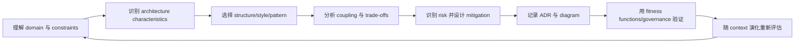
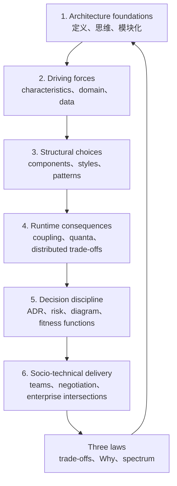

> 本附录不是普通章节，而是对全书 27 章、158 道讨论题的综合检验。以下笔记严格按原书章节与题目顺序组织，每题先给出直接答案，再解释依据、概念关系、适用边界与常见误区。
>
> 原书个别题目沿用旧版口径，或与当前第二版正文、图表存在措辞和数值不一致。本文会保留原书想考查的知识点，同时在必要处明确标注版本错位或内部矛盾。补充的公式、示例、代码和学习方法均标为教学扩展，不冒充原书结论。

---

## 如何使用这份讨论题笔记

这些题并不是 158 个孤立事实，而是在反复训练同一种 architecture reasoning：



推荐的复习方式：

1. 先遮住答案，用一句话直接作答；
2. 再说明“为什么”，尤其是机制如何导致 architecture characteristic；
3. 主动补充一个 trade-off，避免把答案背成绝对规则；
4. 对 named list、数字、公式和术语做精确记忆；
5. 最后尝试把题目换一个业务上下文，看结论是否仍成立。

---

## Chapter 1: Introduction

### 1.1 定义软件架构的四个维度是什么？

**直接答案：**

1. **Architecture characteristics**：系统必须支持的能力与成功标准，如 availability、scalability、security；
2. **Logical components**：系统执行哪些业务行为，以及这些行为如何划分；
3. **Architecture style**：系统总体 topology，如 layered、microservices、event-driven；
4. **Architecture decisions**：约束系统构建方式的规则及其理由。

这四维分别回答：系统必须“表现怎样”、由“什么组成”、总体“如何组织”、以及团队“必须遵守什么”。它们相互影响：characteristics 驱动 style，domain 驱动 components，decisions 则保护这些选择不被实现侵蚀。

当前第二版正文的分析顺序是 characteristics → components → style → decisions；图示中的 system structure 是这些维度的承载结果，不应另算第五维。

### 1.2 Architecture decision 与 design principle 有何区别？

**Architecture decision** 是明确规则或约束，通常规定允许或禁止什么；**design principle** 是指导方向，给 implementation team 保留选择空间。

例如：

- Decision：“Presentation layer 不得直接访问 database。”这是可检查的边界；
- Principle：“前端优先采用 reactive approach。”团队仍可选择具体 framework 和实现。

二者的关键区别不是文档名称，而是约束强度。Decision 需要 compliance；principle 主要用于引导判断。当前第 1 章未正式重述这一区分，第 24 章才明确把 design principles 解释为 guidance，因此本题带有旧版编排痕迹。

### 1.3 软件架构师的八项核心期望是什么？

依次是：

1. **Make architecture decisions**；
2. **Continually analyze the architecture**；
3. **Keep current with latest trends**；
4. **Ensure compliance with decisions**；
5. **Understand diverse technologies, frameworks, platforms, and environments**；
6. **Know the business domain**；
7. **Lead a team and possess interpersonal skills**；
8. **Understand and navigate organizational politics**。

它们形成三类职责：

- 技术判断：1、2、3、5；
- 落地治理：4、7；
- 组织与业务对齐：6、8。

常见误区是只重视画图和选技术。实际上，不能让决定落地、不了解 domain 或无法协商组织冲突，同样无法完成 architecture 工作。

### 1.4 软件架构第一定律是什么？

> **Everything in software architecture is a trade-off.**

每个有意义的方案都会改善一些目标，同时牺牲另一些目标。Architect 的职责不是寻找 silver bullet，而是揭示收益、代价、assumptions 和适用 context。

其两个推论在第 27 章完整展开：

1. 若某件事看起来没有 trade-off，更可能是尚未找到；
2. Trade-off analysis 不能只做一次，因为 context 会变化。

---

## Chapter 2: Architectural Thinking

### 2.1 如何判断一项决定更偏 architecture 还是 design？

三个判据是：

1. **Strategic versus tactical**：长期战略方向还是局部实现战术；
2. **Level of effort**：构建或改变它需要多大代价；
3. **Significance of trade-offs**：选项对全局 characteristics、structure 和风险的影响是否显著。

越长期、难改、影响范围大，越靠近 architecture；越局部、易逆转、代价小，越靠近 design。它们不是二元边界，而是连续谱。例如选择整个系统的 communication style 通常偏架构，选择一个局部 parsing library 通常偏设计，但若该 library 形成全局 contract，性质也会改变。

### 2.2 知识三角形的三个层级是什么？

1. **Stuff you know**：知道并能使用，例如 Java developer 熟练掌握 Java；
2. **Stuff you know you don't know**：知道某技术存在但尚不会，例如知道 Clojure 属于 Lisp family；
3. **Stuff you don't know you don't know**：连其存在都不知道，却可能恰好能解决问题。

Architect 不可能把所有内容都放进第一层。现实策略是持续扩大 awareness，把第三层移入第二层；当实际问题需要时，再把第二层的一小部分移入第一层。

### 2.3 为什么架构师更应重视 technical breadth 而非一味追求 depth？

Architecture 需要在大量 options 中匹配 capabilities、constraints 与 trade-offs。知道五种不同方案何时适用，往往比只精通一种方案更能避免“手里只有锤子，看什么都是钉子”。

Breadth 的作用是发现候选解和提出正确问题；depth 的作用是验证实现细节与风险。作者不是主张放弃 depth，而是指出专家知识维护成本很高，架构师无法对所有技术同时保持深度。

### 2.4 架构师如何保持技术深度并继续 hands-on？

可采用：

- 编写提前 1–3 个 iteration、不会阻塞主线的小功能；
- 做 production-quality proof of concept；
- 处理可随时中断的 technical debt；
- 修复 defects；
- 编写命令行工具、分析器与 fitness functions；
- 参加 code review；也可把 pairing 作为本文补充的实践方式。

不应长期占有 critical-path feature，否则容易形成 **Bottleneck Trap**：团队必须等待 architect 写完代码，architect 又无暇处理全局问题。保持 hands-on 的目标是维持判断力，而不是与全职 developer 争夺主线开发量。

---

## Chapter 3: Modularity

### 3.1 Modularity 与 granularity 有何区别？

**Modularity** 是把系统拆成较小逻辑部分，并把相关代码组织在一起；**granularity** 是这些部分究竟多大。

例如把一个分层单体按业务域拆成 modules，是改善 modularity；决定 `Order` 与 `Payment` 应是一个还是两个 services，是选择 granularity。

> **Embrace modularity, but beware of granularity.**

模块化通常值得追求，但粒度不存在普遍最优值。过粗会降低独立变化能力；过细会增加 communication、coordination、transaction 和 operational complexity。

### 3.2 Coupling 与 cohesion 有何区别？

- **Cohesion**：模块内部元素彼此相关的程度；
- **Coupling**：模块之间相互依赖的程度。

通常追求 high cohesion、low coupling。高内聚让一个业务变化集中在一个边界内；低耦合减少该变化传播到其他边界的概率。但不能为了追求形式上的“低耦合”拆散天然高内聚的行为，否则跨模块通信反而更多。

### 3.3 Connascence 是什么？

若为了保持系统正确性，修改组件 A 就必须修改组件 B，则 A 与 B 具有 **connascence**。

它比笼统的 coupling 更精确，因为它描述“必须共同变化”的具体原因：名称、类型、顺序、算法、时间或 identity。Connascence 分析应同时看：

- **Strength**：共同变化关系有多强；
- **Locality**：两个元素距离多远；
- **Degree**：多少元素被卷入。

### 3.4 Static connascence 与 dynamic connascence 有何区别？

**Static connascence** 可从 source code 结构发现：

- Name；
- Type；
- Meaning/Convention；
- Position；
- Algorithm。

**Dynamic connascence** 只在 runtime interaction 中显现：

- Execution；
- Timing；
- Values；
- Identity。

例如函数两边必须使用同一参数名称或类型属于 static；两个步骤必须按特定顺序执行、两个操作必须同时完成属于 dynamic。

### 3.5 最强的 connascence 是什么？

**Connascence of Identity**：多个组件必须引用同一个实体实例才正确。

本书图 3-5 给出的由弱到强顺序为：

$$
Name < Type < Meaning < Algorithm < Position < Execution < Timing < Value < Identity
$$

Identity 最强，是因为仅“值相同”仍不够，必须是同一对象或 resource，替换和分布式协调都更困难。

### 3.6 最弱的 connascence 是什么？

**Connascence of Name**。只要双方同意同一个名称即可，现代 IDE/refactoring tools 通常能安全地统一 rename。

原文介绍各类型时的顺序与强度图略有不同：正文先讲 Position、后讲 Algorithm，但强度判断应以图 3-5 为准，即 Algorithm 弱于 Position。

### 3.7 Code base 中应优先 static 还是 dynamic connascence？

优先 **static connascence**，因为它能在编译或静态分析阶段发现，也更容易借助重构工具改善。Dynamic connascence 涉及时序、并发和 runtime state，通常更难观察、测试与修复。

这不是说 static coupling 越多越好。原则是：距离越远、degree 越大，越应降低 connascence strength；同一 module 内可容忍的强关系，不应无条件跨越 service boundary。

---

## Chapter 4: Architecture Characteristics Defined

### 4.1 一个属性成为 architecture characteristic 必须满足哪三个条件？

必须同时满足：

1. **Specifies a nondomain design consideration**：不是直接业务功能；
2. **Influences some structural aspect of the design**：会改变系统结构；
3. **Is critical or important to application success**：对成功至关重要。

例如“查询订单”是 domain requirement，不是 characteristic；“订单查询必须在 200 ms 内完成”会影响 caching、data topology 和 deployment，且若不满足就失败，因此是 performance characteristic。

### 4.2 Implicit 与 explicit characteristic 有何区别？

- **Explicit**：需求或 stakeholder 明确写出，例如支持 10 万并发用户、响应时间低于 200 ms；
- **Implicit**：没有写出，但由 domain 或基本质量底线推导出来，例如 payment system 默认需要 security、reliability 和 auditability。

Implicit 不等于可忽略。Architect 的重要职责之一，就是把隐藏的必要特征提取出来，与 stakeholders 验证后变成可度量约束。

### 4.3 给出一个 operational characteristic 示例

**Scalability**：随着用户、请求或数据量增长，系统仍能维持目标服务水平。

其他 operational characteristics 包括 Availability、Continuity、Performance、Recoverability、Reliability/Safety 和 Robustness。它们主要描述 runtime 行为。

### 4.4 给出一个 structural characteristic 示例

**Maintainability**：修改、修复和增强系统的难易程度。

它受 modularity、coupling、cohesion、complexity 和 code organization 影响。其他例子有 Configurability、Extensibility、Portability 和 Upgradeability。

### 4.5 给出一个 cross-cutting characteristic 示例

**Security**。它横跨 components、data、network、identity、deployment 和 operations，不能由单一模块独立完成。

Authentication、authorization、encryption、privacy、legal compliance、supportability 与 usability 也常具有 cross-cutting 性质。

### 4.6 为什么无法建立永久统一的行业 architecture characteristics 清单？

因为：

- Technology ecosystem 持续产生新能力与风险；
- 不同 organization 对同一术语定义不同；
- Characteristics 会重叠或组合；
- Domain 对成功标准的要求不同；
- Measurement 随技术和业务上下文变化。

ISO 等标准可作词汇起点，却不能替代团队的 ubiquitous language。团队必须为本系统给出客观、可验证的定义，而不是只引用一个行业标签。

---

## Chapter 5: Identifying Architectural Characteristics

### 5.1 为什么应限制架构支持的 characteristics 数量？

每增加一个 characteristic，都可能增加设计、实现、测试、运营与治理成本，而且 characteristics 之间会冲突。例如极致 security、极致 usability 和最低 cost 很难同时最大化。

作者用有限槽位迫使团队排序，通常协作选择不排序的 top 3 driving characteristics。目标不是只支持三个质量属性，而是识别真正塑造 architecture 的少数驱动力；其他属性仍需达到可接受水平。

### 5.2 判断：大多数 architecture characteristics 来自 business requirements 和 user stories

**按本章后段的直接表述应答 True，但必须加边界。**

完整来源有三类：

1. Domain concerns；
2. Project/business requirements；
3. Implicit domain knowledge。

很多 characteristics 不会以 “-ility” 出现在 user story 中，而要从 stakeholder 语言推导。例如 “I needed it yesterday” 暗示 time to market，进一步映射到 deployability、testability 和 modularity。

### 5.3 Time to market 最重要时，应支持哪些 characteristics？

本书的精确映射是：

- **Agility**；
- **Testability**；
- **Deployability**。

Agility 本身是 composite characteristic，可进一步拆成 Deployability、Modularity 和 Testability。推理是：快速交付不仅要能部署，还要让变化局部化并快速验证，否则发布速度无法持续。

### 5.4 Scalability 与 elasticity 有何区别？

- **Scalability**：系统应对长期或可预期增长的能力；
- **Elasticity**：系统承受突发流量并维持目标服务水平的能力。

酒店预订随业务增长可强调 scalability；热门演唱会开票瞬间的 spike 强调 elasticity。快速增减资源或 autoscaling 是实现 elasticity 的常见机制，但不是 elasticity 的定义本身。

### 5.5 Composite architectural characteristic 是什么？举例说明

它是不能用单一客观指标定义、需要多个可测 characteristics 共同表达的属性。

例如：

$$
Agility \approx Deployability + Modularity + Testability
$$

这是概念分解，不是数值相加公式。其价值是把“系统要敏捷”转成可设计、可验证的具体能力。

---

## Chapter 6: Measuring and Governing Architecture Characteristics

### 6.1 为什么 cyclomatic complexity 对 architecture 分析重要？

Cyclomatic complexity, CC 为 control-flow complexity 提供客观基线。对单一连通控制流图：

$$
CC=E-N+2
$$

一般式为：

$$
CC=E-N+2P
$$

其中 $E$ 为 edges，$N$ 为 nodes，$P$ 为 connected components。它也可直观理解为独立执行路径数量。

CC 过高通常提高理解、测试和修改成本，进而损害 modularity、testability 与 deployability。行业常以小于 10 为参考，作者更偏好小于 5。

局限是 CC 只度量控制流，不能区分 essential complexity 和 accidental complexity，也不能单独评价 architecture quality。原书示例代码还存在 `void` 返回值和 `c2/C2` 大小写错误，但其预期 CC 是 3。

### 6.2 Architecture fitness function 是什么？如何使用？

> 对一个 architecture characteristic 或 characteristic 组合提供客观完整性评估的任何机制。

它可以是：

- 静态依赖规则；
- Unit/integration test；
- Runtime metric 与 alert；
- CI/CD gate；
- Chaos experiment；
- 人工 checklist。

Fitness function 把 architecture intent 变成持续反馈。例如“domain A 不得依赖 domain B”可由 ArchUnit 检查；“故障后 30 秒内恢复”可由 chaos test 验证。它不局限于自动化框架，但越频繁、客观、低成本，越能防止 architecture drift。

### 6.3 给出一个衡量 scalability 的 fitness function

可持续采集 request rate、concurrency、resource usage 和 latency，建立正常 scale relationship；当实时值超出预测区间时告警。

教学示例：在指定 workload 阶梯下验证 P95 latency：

```text
for users in [1_000, 5_000, 10_000]:
    run representative workload
    assert p95_latency < target
    assert error_rate < limit
    assert resource growth remains within expected envelope
```

偏离可能表示系统出现问题，也可能表示模型或 workload assumptions 已过期；两种情况都应调查。一次 benchmark 不能证明未来所有规模下都可扩展。

### 6.4 哪项条件最重要，才能为 characteristic 创建 fitness function？

Characteristic 必须有**客观、可重复验证的定义**。

它不一定是单一数字，也可以是 dependency invariant、failure experiment 或 statistical boundary。但“足够快”“高可用”“容易修改”若不进一步操作化，就无法可靠验证。

---

## Chapter 7: The Scope of Architectural Characteristics

### 7.1 什么是 architecture quantum？为什么重要？

Architecture quantum 是一组 architecture characteristics 的作用范围，也可理解为系统中能够独立运行的最小部分。

完整识别条件是：

1. **Independent deployment**；
2. **High functional cohesion**；
3. **Low external implementation static coupling**；
4. 与其他 quanta 存在 **synchronous communication** 时形成动态耦合边界。

Quantum 重要，因为 availability、scalability、security 等 operational characteristics 必须有明确作用域。两个独立部署单元若共享 database/schema 或必须同步变化，仍可能属于同一 quantum。

### 7.2 一个 UI 加四个独立部署且各有独立数据库的 services，是一个还是四个 quanta？

**四个 quanta。**

四个 services 分别独立部署并拥有独立 database，因此具有独立运行和特征范围。共享 UI 只是入口，不自动形成共同 implementation coupling。

这个答案依赖题目假设：若它们实际共享 schema、shared library 必须同步升级，或由全局同步 orchestrator 串成不可分割链路，quantum 数量可能减少。

### 7.3 Static coupling 与 dynamic coupling 有何区别？

- **Static coupling**：部署前或结构上的共同依赖，例如共享 database/schema、shared library、必须共同发布的 contract；
- **Dynamic coupling**：runtime communication 带来的等待、时序、吞吐和 failure propagation，例如 Auction service 同步调用 Payment service。

Static coupling 决定哪些部分必须共同变化；dynamic coupling 决定运行时 characteristics 如何互相传递。第 8 章个别措辞把同步通信直接称为 static coupling，与本章口径不完全一致；分析 quantum 时应采用本章定义。

### 7.4 为什么 synchronous communication 对 operational characteristics 的潜在影响更大？

同步调用会阻塞 caller，使上游直接继承 downstream 的：

- Latency；
- Throughput limit；
- Availability；
- Timeout/failure；
- Scaling bottleneck。

若 Payment 每 500 ms 只能处理一笔，Auction 的并发能力会立即受限。Async queue 可吸收短时 burst、解耦处理速度和故障时间，但并不消除容量定律：若长期 arrival rate 大于 consumption rate，backlog 仍会无限增长直至溢出。

---

## Chapter 8: Component-Based Thinking

### 8.1 Component 通常如何体现在 application/service 中？

通常表现为包含相关 source files/classes 的 **namespace、package、module 或 directory**。叶节点往往对应逻辑 component，上层目录表达 domain/subdomain。

例如 `order_entry/ordering/payment` 可映射为 Payment Processing component。真正重要的不是文件夹名称，而是 code structure 能否与 logical architecture 对齐并受到 dependency rules 保护。

### 8.2 Technical partitioning 与 domain partitioning 有何区别？

- **Technical partitioning**：按 Presentation、Business Rules、Services、Persistence 等技术职责组织；
- **Domain partitioning**：按 Catalog、Checkout、Purchase、Delivery 等业务能力或 workflow 组织，每个 domain 内可再分技术层。

技术分区让同类技术代码集中，却使一个业务变化横跨多层；领域分区让业务变化局部化，却可能在各 domain 重复少量 technical/customization code。

当前第二版把这部分主要正文移到第 9 章，而讨论题仍列在第 8 章，属于编排错位。

### 8.3 Domain partitioning 的优势是什么？

- Structure 更贴近 business；
- 容易围绕 domain 建立 cross-functional team；
- 业务变化通常集中在一个边界；
- 更适合 modular monolith 和 microservices；
- Data 与 components 更容易一起迁移到 distributed architecture。

其根本优势是减少完成一个 domain change 所需跨越的结构和团队边界，而不是“目录看起来更像业务”这么简单。

### 8.4 何时 technical partitioning 可能更合适？

当系统天然采用 layered architecture，且最重要的目标是集中 Common/Local customization、统一技术实现，而 organization 能接受跨层业务变化和较高全局 coupling 时，technical partitioning 可能合适。

它不是旧式、必然错误的组织方式。选择取决于哪类变化更频繁：若技术策略统一变化远多于 domain 独立变化，集中技术能力可能更经济。

### 8.5 什么是 Entity Trap？为什么不适合识别 components？

Entity Trap 是从 Customer、Item、Order 等 data entities 直接生成 `Customer Manager`、`Order Manager` 一类 components。

问题在于：

- Entity 名称不表达业务责任；
- Manager 容易成为所有相关功能的 dumping ground；
- Component 粒度越来越粗；
- Cohesion 降低，maintainability、testability、deployability 变差。

`Manager`、`Supervisor`、`Controller`、`Handler`、`Engine`、`Processor` 都是需要重新追问责任边界的警报词。若系统确实只是 CRUD，使用 CRUD framework 或 low-code/no-code 往往比伪造 domain components 更诚实。

### 8.6 何时用 Workflow approach 而不是 Actor/Action approach？

当主要 happy path 或 request flow 清晰，而 actors 较少、详细需求尚不完整时，优先 Workflow approach。它沿流程步骤识别候选 components。

Actor/Action 更适合多角色系统：按每个 actor，包括 external system，列出主要 actions，再检查 component coverage。两种方法可交叉验证，不是互斥算法。

---

## Chapter 9: Foundations

### 9.1 分布式计算的八个谬误是什么？

1. **The network is reliable**；
2. **Latency is zero**；
3. **Bandwidth is infinite**；
4. **The network is secure**；
5. **The topology never changes**；
6. **There is only one administrator**；
7. **Transport cost is zero**；
8. **The network is homogeneous**。

它们不是说网络永远失败，而是提醒 architect：若设计把这些命题当作前提，系统迟早会在 timeout、partial failure、bandwidth、security、ownership 或 compatibility 上暴露问题。

### 9.2 列举三个 distributed architecture 特有或显著放大的挑战

当前第二版额外强调：

1. **Versioning is easy** 是谬误：跨服务 contract 的版本范围、数量和废弃难协调；
2. **Compensating updates always work** 是谬误：补偿事务本身也会失败；
3. **Observability is optional** 是谬误：无 distributed tracing、correlation IDs、metrics 和 logs，跨服务问题几乎无法诊断。

Monolith 也会有版本、事务和监控问题，但它没有同等规模的 network boundary、partial failure 和独立 deployment coordination。

### 9.3 什么是 stamp coupling？如何缓解？

Stamp coupling 指发送完整复合数据结构，而 consumer 只需要其中少数字段，造成：

- 不必要 bandwidth；
- Consumer 对大 schema 的依赖；
- Security/data exposure；
- Schema evolution blast radius。

缓解方式包括：

- Private REST endpoints；
- Contract field selectors；
- GraphQL；
- Value-driven 或 consumer-driven contracts；
- Internal messaging endpoints；
- 为不同 use case 定义最小 event/DTO。

原则是只传 consumer 真正需要的数据。原书示例中的 $500\,KB\times2{,}000/s\approx1\,GB/s$（即约 $8\,Gbps$）在单位上成立，但这是全部 calls 的 aggregate throughput，不是 “per call”；$200\,bytes\times2{,}000/s=400\,KB/s\approx3.2\,Mbps$，不是原文写的 `400 Kbps`。

### 9.4 Technical partitioning 与 domain partitioning 的差异是什么？

Technical partitioning 按 implementation role 组织代码，domain partitioning 按 business capability/workflow 组织。前者优化技术集中与一致性，后者优化业务变化局部性、team ownership 和 independent evolution。

没有绝对赢家。应观察哪种 change axis 更重要，以及 partition 是否与 domain、team 和 deployment boundary 对齐。

### 9.5 Architectural style 与 pattern 的三个区别是什么？

Architecture style 描述系统整体 topology 和默认 trade-offs；pattern 是特定 context 中针对一个反复出现问题及 forces 的可复用方案。

本书实际列出 style 的五个区分属性，题目要求任意三个：

1. **Component topology**；
2. **Physical architecture**；
3. **Deployment**；
4. **Communication style**；
5. **Data topology**。

例如 microservices 是 style；Saga、CQRS、Sidecar 是解决局部 concern 的 patterns。Pattern 可以嵌入多种 styles，style 则定义系统的主要组织形态。

---

## Chapter 10: Layered Architecture Style

### 10.1 Open layer 与 closed layer 有何区别？

- **Closed layer**：请求不能跳过该层，必须逐层通过；
- **Open layer**：允许请求绕过该层，直接访问更下层。

它描述的是 dependency/request path，不是 deployment 或语言访问修饰符。Closed layer 保护隔离，却可能产生无业务价值的 forwarding；open layer 降低 sinkhole 开销，却增加跨层 coupling。全部 closed 或全部 open 都可能是有效选择，关键是结合 isolation 与 sinkhole trade-off 决定。

### 10.2 什么是 layers of isolation？有何收益？

在 layer contract 稳定时，一层内部实现变化通常不影响其他层，这就是 **layers of isolation**。

收益包括局部修改、独立替换、降低 change blast radius 与脆弱性。例如 persistence implementation 改变，只要 business-facing contract 不变，presentation 不应受影响。主要路径若任意跳过 closed layers，这种隔离就会被破坏。

### 10.3 什么是 Architecture Sinkhole antipattern？

请求穿过多个 layers，却没有发生业务计算、aggregation、rule 或 transformation，只产生对象创建与转发开销，即 architecture sinkhole。

作者给出 heuristic：约 20% sinkhole 可能可接受；若约 80% requests 都只是穿层，通常说明 layered style 与 problem 不匹配，或 layers 划分过度。数字是诊断启发，不是硬阈值。

### 10.4 哪些 characteristics 会驱动选择 layered architecture？

主要是：

- **Simplicity**；
- **Overall cost**。

它适合小型简单系统、预算/时间紧张、团队熟悉传统分层，或系统早期方向尚未确定的场景。选择它是接受 operational scalability、agility 等限制，换取认知、开发和部署成本较低。

### 10.5 为什么 layered architecture 的 testability 不高？

典型实现是单体 deployment，一处小改动也可能要求广泛 regression testing；完整 environment 与跨层路径使测试成本较高，团队容易跳过。

它并非完全不可测试：layers/components 仍可 mock 或 stub，所以本书评为 2 星而非 1 星。问题是局部 testability 没有自动转化为低成本的整体 release confidence。

### 10.6 为什么 layered architecture 的 agility 不高？

技术分区让一个 domain change 横跨 Presentation、Business、Persistence 和 Database，往往还跨多个 teams。结果是 coordinated change、whole-system test 与 monolithic deployment，降低 holistic agility。

Agility 差不是因为 layer 本身，而是 technical partitioning、shared deployment 和跨层业务变化共同造成。

---

## Chapter 11: Modular Monolith Architecture Style

### 11.1 Modular monolith 与 n-tiered layered architecture 有何不同？

二者通常都是单体 deployment，但 partition axis 不同：

- N-tiered layered：先按技术层组织；
- Modular monolith：先按 business domain/modules 组织，模块内部可再分层。

因此 modular monolith 更容易让 domain change 局部化，并为未来按领域拆分 services 保留路径；但仍共享 process 和 deployment unit。

### 11.2 Module communication 的 peer-to-peer 与 mediator 有何区别？

- **Peer-to-peer**：module A 直接调用 module B，简单直接，但形成 compile/runtime dependency；过多会导致 Big Ball of Mud 或 JAR/DLL Hell；
- **Mediator**：中介接收并协调 module interaction，modules 不直接认识彼此，但共同依赖 mediator，且 mediator 可能成为复杂中心。

选择取决于 interaction 数量与 workflow complexity。少量稳定调用可 direct；复杂 cross-module workflow 可 mediator，但不能让 mediator 吞掉所有 domain logic。

### 11.3 Modular monolith 的三个常见风险是什么？

1. **Monolith too big**；
2. **Overboard with code reuse**；
3. **Too much intermodule communication**。

后两项会侵蚀 module boundaries。大量 intermodule calls 还常说明 domain partition 错误：本应高内聚的行为被拆到了不同 modules。

### 11.4 三项主要优势是什么？何时采用？

主要优势：

- **Overall cost**；
- **Simplicity**；
- **Modularity**。

适合预算或工期紧、系统方向尚未稳定、业务变化主要按 domain 发生、采用 DDD，或由 domain-oriented cross-functional teams 负责的系统。它常是“先保持低 operational complexity，同时认真建立边界”的保守起点。

### 11.5 已有模块化，为何 scalability 与 fault tolerance 仍不好？

Logical modularity 不等于 runtime isolation。所有 modules 仍共享：

- Process/memory；
- Deployment unit；
- Scaling unit；
- Failure domain；
- 通常同一个 architecture quantum。

热点 module 无法单独复制，一处 OOM 可拖垮整体。因此 modularity 改善 change structure，却不会自动改善 operational characteristics。

---

## Chapter 12: Pipeline Architecture Style

### 12.1 Pipe 可以是双向的吗？

**不应是。Pipe 必须 unidirectional。**

若需要来回通信，通常表明 filter responsibilities 划分不当，或 pipeline 不是合适 style。可用两条独立 pipes 表达两个方向，但要警惕由此产生的 hidden cycle。

### 12.2 四类 filters 及其作用是什么？

1. **Producer/Source**：流程起点，只输出数据；
2. **Transformer/Map**：转换、增强或计算数据；
3. **Tester/Reduce-like**：检查条件并决定是否或向哪里继续；
4. **Consumer/Sink**：流程终点，持久化、发送或显示结果。

每个 filter 单一职责，使复杂 processing 由可组合步骤形成。

### 12.3 Filter 能通过多条 pipes 输出吗？

**可以。**例如 Tester 按条件把数据送入不同后续路径。Pipe 通常是 point-to-point，并且必须保持单向。

分支越多，理解和测试组合路径的成本越高；需要复杂回路与全局 state 时，应考虑 workflow/orchestration style。

### 12.4 为什么 pipeline 适合 cloud environment？

Filters 天然是独立、单一职责、通常无状态的 processing units，可映射为：

- Serverless functions；
- Containers；
- AWS Step Functions 等 managed workflow steps。

Cloud 可按步骤独立配置资源和扩展。以 AWS Step Functions 为例，交付语义需区分 execution type：Standard 默认 exactly-once（配置 `Retry` 后可重试），asynchronous Express 是 at-least-once，synchronous Express 是 at-most-once。使用 retries 或 asynchronous Express 时，filter 应具备 idempotency。

### 12.5 Pipeline 是 technical 还是 domain partitioning？

通常是 **technically partitioned**，因为按 Producer、Transformer、Tester、Consumer 这些处理角色分区，而不是按 business domain。

一个 pipeline 可以处理领域数据，但“处理什么”不改变其结构按技术阶段组织的事实。

### 12.6 Pipeline 如何支持 modularity？

Filter 自包含、单一职责，通过简单 pipe contract 组合，因此可独立理解、修改、替换与复用。

典型 pipeline 仍可作为一个 monolith 部署，所以逻辑 modularity 不必然意味着 independent deployment。当前第二版既允许 distributed filters，又称 quantum “always 1”，非典型独立异步部署时这个绝对说法需谨慎。

---

## Chapter 13: Microkernel Architecture Style

### 13.1 Microkernel style 的另一个名称是什么？

**Plug-in architecture**。Core system 提供稳定基础能力，plug-ins 提供可插拔、变化或定制功能。

### 13.2 何时允许 plug-ins 互相依赖？

默认应保持 dependency-free。只有复杂 plugin ecosystem 确实需要组合能力，且 core/framework 能显式管理 transitive dependencies、versions 和 conflicts 时才可允许，例如 Eclipse。

Plug-in dependency 会削弱独立安装、测试和卸载能力，因此是经证明确有收益后的例外，而不是默认设计。

### 13.3 哪些工具/frameworks 可管理 plug-ins？

原书列出：

- Java：**OSGi、Penrose、Jigsaw**；
- .NET：**Prism**。

它们处理 discovery、loading、lifecycle、version 与 dependency，但工具不能替代清晰 stable contract。

### 13.4 第三方 plug-in 不符合 core standard contract 怎么办？

创建 **Adapter**，把 third-party custom contract 转换为 core 的 standard plug-in contract。

Adapter 把变化与特殊性隔离在边界，避免 core 为每个 vendor 增加条件逻辑，也防止非标准 contract 泄漏给其他 plugins。

### 13.5 给出两个 microkernel 示例

例如：

- Eclipse IDE；
- Tax-preparation software。

其他例子包括 Chrome/Firefox extensions、Jira、Jenkins、PMD 和保险理赔系统。共同点是稳定 core 加可变化、可选或客户定制 plugins。

### 13.6 什么决定 core 的 microkern-ality 程度？

主要由 **core 内可独立运行的功能量**决定：

- Pure microkernel：core 极小，大部分能力来自 plugins；
- Rich core：core 本身已提供完整基础功能，plugins 只扩展边缘能力。

Core functionality 的 volatility 也重要：稳定共性适合 core，频繁变化或客户差异适合 plugins。Microkern-ality 是连续谱，不是二元标签。

### 13.7 为什么 microkernel 通常只有一个 architecture quantum？

即使 plugins 远程部署，所有 requests 仍经过 monolithic core；core 是共同同步耦合与 characteristics 作用点。因此系统通常只有一个 quantum。

若 plugins 真正拥有独立入口、data 和运行边界，系统可能已演化为其他 distributed style，而不再是典型 microkernel。

### 13.8 什么是 domain/architecture isomorphism？

Domain 的自然结构与 architecture structure 相匹配。

在 microkernel 中，稳定公共流程映射到 core；按客户、地区、产品变化的 rules 映射到 plugins。匹配使需求变化沿已有边界发生，减少结构阻力。

---

## Chapter 14: Service-Based Architecture Style

### 14.1 为什么服务称为 domain services？

每个 coarse-grained service 代表明确 business domain/subdomain，如 Order Fulfillment 或 Shipping，而不是单一技术职责。

它与 microservice 的区别主要在粒度和 data topology：domain service 往往包含完整领域流程，可共享 database；microservice 更强调 bounded context 和 database ownership。

### 14.2 两个常见风险是什么？

1. **Too much interservice communication**；
2. **Too many domain services**。

服务过多、互调过密会失去 service-based 的 simplicity，逐渐承担 microservices 的 network complexity，却未必获得其独立 data ownership。原书建议这一 architecture style 通常不要超过约 12 个 services；这是 heuristic，不是物理上限。

### 14.3 可采用哪些 database topologies？

三种都可：

- Monolithic database；
- Domain databases；
- Dedicated/database-per-service。

也可混合。该 style 常宁可让服务直接共享 data，也不鼓励仅为取数据而增加大量 service calls；选择需平衡 data coupling 与 communication coupling。

### 14.4 如何管理 service-based architecture 中的 database changes？

- 按 data domain 对数据库做细粒度 logical partitioning；
- 每个 partition 建独立 entity/SQL shared library；
- 各 library 独立 versioning；
- 严格限制全服务共享的 Common entities。

把所有 entities 放入一个 shared library 会让任意 schema change 触发全体协调，破坏服务独立演化。

### 14.5 Domain services 必须运行在 Docker 等 container 中吗？

**不需要。**它可以像普通 monolithic application 一样作为 executable、VM process 或 application-server deployment 运行。Container 是 packaging/deployment option，不是 style 定义。

### 14.6 Service-based style 支持哪些 characteristics 较好？

本书评分图中最强的四项，均为 4 星：

- Maintainability；
- Testability；
- Deployability；
- Evolvability。

原因是 domain change 常可限制在一个 independently deployed coarse-grained service 内。原文对 fault tolerance 星级有文字与图不一致，图 14-8 为 3 星。

### 14.7 为什么 elasticity 通常不高？

Domain services 粒度较粗。只为一个 hotspot function 扩容时，必须复制整个 service 及其 resources，成本与速度都不如细粒度 microservice。

它仍可水平扩展，但“能扩容”不同于“能快速、精确且经济地弹性匹配局部负载”。

### 14.8 如何增加 architecture quanta 数量？

按 domain **federate UI 和 database**，让一组 services 拥有自己的 UI、data 与 deployment boundary。

只增加 service instances 不会增加 quantum；若仍共享 UI、database/schema 或必须共同变化，characteristics scope 仍可能合并。

---

## Chapter 15: Event-Driven Architecture Style

### 15.1 Events 与 messages 的四个区别是什么？

1. **语义**：event 是已发生事实；message 常是 command/query；
2. **响应**：event 通常不要求 response；message 通常要求；
3. **接收者**：event 多为 pub/sub、一对多；message 多为 point-to-point、一对一；
4. **Channel**：event 常用 topic、stream、notification service；message 常用 queue/messaging service。

把 command 放入 topic 不会让它变成 event。关键是 semantics 和 expectation，而不只是 broker primitive。

### 15.2 Initiating event 与 derived event 有何区别？

- **Initiating event**：启动整个 event flow；
- **Derived event**：processor 完成动作后发布的新事实或结果，继续触发后续处理。

例如 `order_placed` 启动流程，Payment processor 发布 `payment_accepted`，后者是 derived event。

### 15.3 什么是 poison event？

Derived events 在 processors 之间不断互相触发，形成无限循环，即 poison event。

可通过 event lineage、correlation/causation IDs、cycle detection、hop limit、idempotency 和清晰 ownership 缓解。不能只靠 retry，因为 retry 会放大循环。

### 15.4 Event processor 能触发多个 derived events 吗？为何这样做？

**可以。**可表达互斥结果，如 `fraud_detected` 与 `no_fraud_detected`；也可触发多个可并行后续动作。

但事件过细、数量过多会形成 Swarm of Gnats。应让每个 event 表达有业务意义的事实，而不是每个字段变化都单独发事件。

### 15.5 为什么发布一个当前无人响应的 event？

它可作为 **extensible derived event**，预留 extension hook。未来新 subscriber 可接入而无需修改现有 processor 或 flow。

前提是 event 有稳定业务语义；为假想未来大量制造无意义 events 会增加 schema 和 governance burden。

### 15.6 Asynchronous processing 有哪些负面 trade-offs？

- Eventual consistency；
- 缺少即时成功保证；
- Flow/final state 不确定；
- Error handling 与 restart 困难；
- Ordering、duplicate、idempotency 问题；
- Data loss risk；
- End-to-end testing/debugging/observability 更难。

Async 把 temporal coupling 降低，却把 complexity 转移到状态、消息可靠性和 operations。

### 15.7 什么是 Swarm of Gnats antipattern？为何避免？

一个 processor 为同一次 domain change 发布过多细粒度 events，导致 broker/consumers 过载，flow 难理解，schema coupling 扩大。

例如不要为 profile 的每个字段分别发 event，可发一个包含必要 before/after 信息的 `profile_updated`。正确粒度应围绕 business outcome。

### 15.8 EDA 高 responsiveness 与 performance 的两个主要原因是什么？

1. **Asynchronous communication**：caller 不等待全部 downstream work；
2. **Highly parallel processing**：多个 processors 可并行处理。

原书示例中 synchronous 用户等待约 3,100 ms；async acknowledgment 约 25 ms，尽管 background 总工作仍约 3,025 ms。Responsiveness 改善不等于总计算量消失。

### 15.9 如何防止 queue send/receive 时 data loss？

Event Forwarding 的三层保护：

1. Persistent queue 加 synchronous send/persistence acknowledgment；
2. Client acknowledge mode，处理成功前不删除 message；
3. ACID commit 加 Last Participant Support，database commit 后才确认消息。

Topic 可使用 durable subscriber。它们通常实现 at-least-once delivery，因此 consumer 仍需 idempotency；不能轻率宣称 exactly once。

---

## Chapter 16: Space-Based Architecture Style

### 16.1 Space-based architecture 名称来自哪里？

来自 **tuple space**：多个 parallel processors 通过共享 memory space 协作。

### 16.2 它区别于其他 styles 的核心是什么？

把 central database 移出 synchronous transaction hot path：processing units 通过 replicated in-memory data grids 处理事务，再由 data pump 异步持久化。

这样避免 database 成为 scalability/elasticity bottleneck，但换来 cache consistency、collision、recovery 和 test complexity。

### 16.3 Virtualized middleware 的四个 components 是什么？

1. **Messaging Grid**：把 requests 路由到 processing units；
2. **Data Grid**：管理 in-memory replicated/distributed data；
3. **Processing Grid**：当一个 request 需多个 processing units 时编排；
4. **Deployment Manager**：监控 load 并启动/停止 instances。

Processing Grid 不是每个系统都必需，只有 cross-unit workflow 才使用。

### 16.4 Data Writer 的作用是什么？

消费 data pump messages，把 in-memory state changes 执行成 database insert/update/delete。

它把 transaction path 与 persistence latency 解耦。Data writer 可按 domain 共用，也可与某个 processing unit/data pump 一一对应；必须处理 ordering、duplicate 与 retry。

### 16.5 什么情况下 service 通过 Data Reader 访问 database？

本书列出三种：

1. 同名 cache 的所有 processing-unit instances 全部崩溃；
2. 它们全部重新部署，需要 warm cache；
3. 读取 replicated cache 中没有的 archived data。

正常交易不应频繁回源，否则 database 又回到 hot path，style 的核心收益会消失。

### 16.6 小 cache size 会增加还是降低 data collision？

**增加。**书中的估算关系为：

$$
CollisionRate=\frac{N\times UR^2}{S}\times RL
$$

$N$ 为 cache instances，$UR$ 为 update rate，$S$ 为 cache size，$RL$ 为 replication latency。$S$ 在分母，同样更新量集中到较少 records，碰撞概率更高。

该式是模型化估算，依赖更新独立、分布近似均匀等假设；热点 keys 会让实际碰撞更严重。

### 16.7 Replicated cache 与 distributed cache 有何区别？通常使用哪个？

- **Replicated cache**：每个 processing unit 保存完整副本并同步，local access 快、fault tolerance 好，但 memory duplication 与 update collision 增加；
- **Distributed cache**：data 分布在外部 cache servers，减少副本和一致性压力，但增加 remote latency 与 shared dependency。

Space-based 通常使用 replicated cache。书中给出小于 100 MB 偏向 replicated、大于 500 MB 偏向 distributed 的参考值，但不是硬阈值，还要看 instance count、update rate、memory 和 consistency。

### 16.8 支持最强的三个 characteristics 是什么？

正文称：

- Performance；
- Scalability；
- Elasticity。

图 16-18 实际列为 Responsiveness、Scalability、Elasticity 三项 5 星，没有 Performance 行。应透明保留这一内部不一致，而不是强行合并术语。

### 16.9 为什么 testability 很低？

因为最关键行为发生在难模拟的极端环境：

- 数十万 concurrency；
- Dynamic scale-out/in；
- Replication collision；
- Async persistence；
- 全 cache loss 与 recovery。

这些测试需要昂贵、接近 production 的 infrastructure 与 workload；单元测试无法证明整体 behavior，所以评分仅 1 星。

---

## Chapter 17: Orchestration-Driven Service-Oriented Architecture

### 17.1 SOA 的主要 driving force 是什么？

**Enterprise-level reuse。**

昂贵稀缺的计算资源，以及并购后重复且不一致的数据/流程，促使企业试图最大化 software 与 business capabilities 的复用。

### 17.2 SOA 的四类 primary services 是什么？

1. **Business services**：粗粒度业务流程签名，通常无实现；
2. **Enterprise services**：细粒度、共享、可组合的 business implementation；
3. **Application services**：单个 application 独有的一次性实现；
4. **Infrastructure services**：logging、monitoring、authentication、authorization 等运行能力。

Orchestration engine 把这些技术分层 services 组合成业务流程。

### 17.3 哪些因素导致 SOA 衰落？

- 极端 technical partitioning；
- Reuse 造成巨大 coupling；
- Canonical model 膨胀；
- Central ESB/orchestrator 成为技术与组织 bottleneck；
- 声明式 distributed transaction 泄漏且不可靠；
- Change 需跨 layers 协调测试部署；
- 项目昂贵、周期长、难维护。

根因不是“服务”概念错误，而是把 enterprise reuse 和 central orchestration 推到极端。

### 17.4 SOA 是 technical 还是 domain partitioning？

**Technically partitioned**，而且是最极端的通用技术分区之一。Business、Enterprise、Application、Infrastructure services 按技术角色分层，同一 domain workflow 横跨多层。

### 17.5 SOA 如何实现 domain reuse 与 operational reuse？

- Domain reuse：由 Enterprise services 提供，再由 orchestration engine 组合为 Business services；
- Operational reuse：由 Infrastructure services 提供，如 logging、monitoring、authentication、authorization。

收益是集中复用；代价是大量 consumers 对 shared services 与中央治理形成 coupling。

### 17.6 现代系统中这一 style 的主要用途是什么？

作为 **integration architecture**：利用 ESB integration hub、protocol/contract transformation 和 orchestration 连接 legacy、package、custom、cloud 与 on-prem systems。

它更适合解决异构 enterprise integration，而非作为整个新业务系统的默认 architecture。

---

## Chapter 18: Microservices Architecture

### 18.1 什么是 bounded context？为何对 microservices 至关重要？

Bounded context 把一个 function/subdomain/workflow 所需的 code、components、schema 和 database 封装在明确边界内；内部可耦合，外部只能通过 contract 访问。

它使每个 service 拥有一致 domain language、data ownership 和 independent evolution。若边界外可直接访问实现或 database，“微服务”只剩 deployment 外形。

### 18.2 为什么必须隔离 data？

隔离可防止 shared schema/database 成为：

- Static coupling；
- Change propagation path；
- Capacity bottleneck；
- Common failure point；
- Ownership ambiguity。

它还允许服务独立选择 database、扩缩、部署并维护 source of truth。代价是 cross-service transaction、reporting 和 consistency 更复杂。

### 18.3 什么是 protocol-aware heterogeneous interoperability？

- **Protocol-aware**：没有中央 integration hub，caller 必须知道/discover REST、queue 等 protocol；
- **Heterogeneous**：services 可用不同 languages、platforms、databases；
- **Interoperability**：异构 services 仍通过 network contracts 协作。

Microservices 去掉 central smart middleware，把 protocol 与 compatibility responsibility 分散给 service teams。

### 18.4 Orchestration 与 choreography 有何区别？各适合什么场景？

- **Choreography**：无中央 coordinator，各 services 响应 events 或直接协作；适合简单、去中心化 flow，如 wishlist 查询 demographics；
- **Orchestration**：局部 mediator service 显式协调步骤与 state；适合复杂 reports、Saga、业务 workflow 和集中 error handling。

不要把全部 business orchestration 塞入 global API Gateway，否则会重建 ESB 式 central bottleneck。

### 18.5 为什么采用 database-per-service？能否使用 monolithic/domain database？

Database-per-service 保护 bounded context、data ownership、independent change 与 scaling。

按本书严格定义，整个 ecosystem 不应采用 monolithic 或 domain database topology；但约 5–6 个 services 可因合理原因共享一个 schema，此时它们形成更宽 bounded context。共享不是绝对禁止，但会减少 independent quanta。

### 18.6 Microservices 的两个最大风险是什么？

1. **Grains of Sand antipattern**：services 过细；
2. **Too much interservice communication**。

二者常是因果关系：过细粒度迫使一次业务操作跨越大量 services。首选修复通常是合并高内聚 services，而不是继续加入 messaging、caching 掩盖错误边界。

### 18.7 为什么 agility、testability、deployability 很强？

Single-purpose、fine-grained、independently deployed bounded contexts 把 change、test、release 限制在小范围，并允许 teams 并行工作。

前提是成熟 automated build/test/deploy、observability 和 DevOps。高 testability 主要指 service-level；跨服务 end-to-end testing 仍然困难。

### 18.8 Performance 通常有问题的三个原因是什么？

1. Network calls 比 method calls 慢；
2. 每个 endpoint 都要 security verification；
3. Cross-service coordination 产生多次 database calls 与 data latency。

此外 serialization、retry、service mesh hops 和 distributed tracing 也有 overhead。不能用“独立扩容”抵消每条 request path 的 latency。

### 18.9 什么 topology 会让 microservices ecosystem 只有一个 quantum？

例如所有 services 共享一个 monolithic database，或全部被全局同步 orchestrator 串成不可分割调用链。共同 static/dynamic coupling 让 characteristics scope 合并为一个 quantum。

严格说，这已违反 bounded context 和 database-per-service 原则，是“microservices-shaped” distributed monolith，而非健康 microservices。

---

## Chapter 19: Choosing the Appropriate Architecture Style

### 19.1 Data architecture 如何影响 architecture style 选择？

Data 的 logical/physical model、ownership、transaction boundaries 和 flow 会限制可行 style：

- 紧密关系、共享事务与 centralized ownership 倾向 monolith 或 coarse-grained services；
- 独立 data domains 倾向 distributed style、domain databases 或 database-per-service；
- 既有 shared database 会反向形成 static coupling，限制 service independence；
- Cross-domain joins/reporting 会影响 synchronous calls、replication、events 或 CQRS 选择。

不能先画 service boundaries，再把 data 当实现细节塞进去；data topology 是 architecture topology 的共同决定因素。

### 19.2 确定 style、data partitioning 与 communication style 的步骤是什么？

1. 做 **domain analysis**；
2. 做 **architecture characteristics analysis**；
3. 判断 monolith 还是 distributed；
4. 决定 data 放在哪里、如何 partition 与流动；
5. 决定 synchronous 或 asynchronous communication；
6. 形成 topology，必要时混合 styles；
7. 用 ADRs 记录 Why，用 fitness functions 验证关键 assumptions。

原书建议“默认 synchronous，必要时 asynchronous”，因为 async 引入 consistency、workflow 和 operational complexity；但当 temporal decoupling、burst buffering 或 extensibility 是驱动力时，async 可能值得。

### 19.3 什么因素会推动 architect 选择 distributed architecture？

系统不同部分需要**不同 architecture-characteristic sets**，即需要多个 architecture quanta，是主要驱动力。

例如 payment 需要极高 security/reliability，catalog 需要高 read scalability，reporting 可接受 eventual consistency。若所有部分共享一套 characteristics，monolith 往往更简单。Distributed 不是规模大就自动正确，还要考虑 data、team 和 operational maturity。

### 19.4 选择 style 的两个输入分析是什么？

1. **Domain analysis**：理解业务行为、边界、workflow 和耦合形状；
2. **Architecture characteristics analysis**：识别必须支持的结构与运行能力。

前者回答系统做什么、变化如何发生；后者回答系统必须表现怎样。Style 是二者的交集，而不是从流行榜单中选择。

---

## Chapter 20: Architectural Patterns

### 20.1 哪两个 patterns 实现 operational 与 domain concerns 分离？

- **Hexagonal Architecture / Ports and Adapters**；
- **Service Mesh**，通常通过 Sidecar 实现 orthogonal operational reuse。

Hexagonal 用 ports/adapters 把 domain logic 与 UI、database、external systems 分开；service mesh 把 traffic policy、security、telemetry 等从 service code 移到 sidecars/infrastructure。二者作用层级不同，但都减少 cross-cutting concern 污染 domain implementation。

### 20.2 Orchestrated workflow 比 choreographed workflow 多什么 component？

多一个 **orchestrator/coordinator**。它保存 workflow state，决定下一步，并集中处理 error、retry、recovery 和 boundary cases。

收益是 flow 可见、复杂流程易控制；代价是 central coupling、bottleneck 与 common failure point。Choreography 没有该中心，但全局 flow 与错误恢复更难理解。

### 20.3 EDA 使用 single broker 的优缺点是什么？

优点：

- Centralized discovery；
- Least possible infrastructure；
- 便于统一 logging、monitoring、security 和 governance。

缺点：

- Fault tolerance risk/common failure domain；
- Throughput limits/scaling bottleneck；
- 所有 domains 受同一 broker maintenance 影响。

原章标题在 Broker-Domain、Single-Broker 与 Domain-Broker 间用词不一，本题应按其比较表理解为 single broker topology。

### 20.4 CQRS 分离哪两个 data operations？

**Command/write** 与 **Query/read**。

分离后两边可使用不同 models、stores、scaling 和 security policies。例如 write side 保证 domain invariants，read side 建 denormalized views。代价是 projection synchronization、eventual consistency 和 operational complexity；CRUD 简单系统通常不需要 CQRS。

---

## Chapter 21: Architectural Decisions

### 21.1 什么是 Covering Your Assets antipattern？

Architect 因害怕选错而逃避或无限推迟决定。

正确做法是在 **last responsible moment** 决策：不是越晚越好，而是推迟的 cost/risk 即将超过获得更多信息的价值时做出，并与 developers 用 prototype/evidence 验证。Decision 可被 supersede，不需要假装永久正确。

### 21.2 如何避免 Email-Driven Architecture antipattern？

- 不把 decision 正文散落在 email；
- 每项 decision 使用唯一 system of record，如 ADR repository；
- Email 只说明 nature/context 并附链接；
- 只主动通知 directly affected stakeholders；
- 让状态、替代关系和历史可搜索。

Email 是 notification，不是 architecture record。否则版本、理由和最终状态会散落在 inbox 中。

### 21.3 Michael Nygard 判断 architecturally significant 的五个因素是什么？

1. **Structure**；
2. **Non-functional characteristics**；
3. **Dependencies**；
4. **Interfaces**；
5. **Construction techniques**。

影响其中任一项且 trade-offs 显著的决定，值得正式记录。

### 21.4 ADR 的五个基本 sections 是什么？

1. Title；
2. Status；
3. Context；
4. Decision；
5. Consequences。

作者另推荐 Compliance 和 Notes，但不计入基本五项。ADR 应小而专注，一项记录一个决定。

### 21.5 Justification 通常写在哪一节？

写在 **Decision**。该节不仅说明选择了什么，还要完整解释 Why。

Context 描述问题与 forces；Decision 给出明确选择及理由；Consequences 记录收益、代价和后续影响。

### 21.6 没有单独 Alternatives section 时，备选方案写在哪里？

在 **Context** 简要列出。若 alternatives 需要详细逐项分析，可增加独立 Alternatives section。

记录 alternatives 的价值是让未来读者知道哪些路已考虑过，以及 context 改变后是否值得重开。

### 21.7 哪三种场景会把 ADR status 标为 Proposed？

1. **Cost** 超过 architect 的授权阈值；
2. **Cross-team impact**，影响其他 teams/systems；
3. **Security** 含义需要更高层审查。

Proposed 表示等待有权者批准，不表示内容不成熟。批准后成为 Accepted；被其他决定替代则 Superseded。

---

## Chapter 22: Analyzing Architecture Risk

### 22.1 Risk assessment matrix 的两个维度是什么？

**Overall impact** 与 **Likelihood**，各取 low=1、medium=2、high=3：

$$
Risk=Impact\times Likelihood
$$

- 1–2：low；
- 3–4：medium；
- 6–9：high。

先评 impact，再评 likelihood，可减少“很可能发生”对损失严重度判断的污染。乘法是排序工具，不是精确损失概率模型。

### 22.2 Risk storming 的三个主要活动是什么？

1. **Identification**：参与者独立识别并评分；
2. **Consensus**：解释评分差异并形成共同理解；
3. **Risk mitigation**：设计降低 likelihood/impact 或消除风险的措施，并权衡成本。

它把个人直觉转为团队可讨论、可行动的 risk map。

### 22.3 为什么 risk storming 必须 collaborative？

单个 architect 不可能熟悉所有 implementation、operations 和 domain details。Developer、tech lead、security、operations 各自拥有不同 evidence。

协作不仅提高 risk coverage，也让 mitigation 得到共同理解和 ownership。但 collaboration 不应过早发生，因此 Identification 先独立。

### 22.4 为什么 Identification 必须 individual？

避免：

- Anchoring；
- Groupthink；
- Authority pressure；
- Pluralistic ignorance；
- 他人先发言导致注意力偏移。

独立评分保留每人的未经污染观察，随后再在 Consensus 阶段共享理由。

### 22.5 三人评 high=6、一人评 medium=3，怎么办？

让双方分别解释 impact 与 likelihood 的 evidence，在 Consensus 中讨论；**不能投票、平均或自动服从多数**。

少数者可能掌握关键事实，多数者也可能看到共同风险。目标是统一认知，而不是用算术掩盖分歧；最终全组可一致选 3 或 6。

### 22.6 未验证/未知技术应给多少风险分？

**9，最高风险。**

这是 risk storming 的 categorical override：只要参与者认为该技术未知或未经验证，就不能可靠应用常规 impact × likelihood matrix，应直接评为 9。可通过 spike、POC、training、load test 和 vendor evidence 降低 uncertainty，再重新评分。

---

## Chapter 23: Diagramming Architecture

### 23.1 什么是 irrational artifact attachment？为何重要？

对 artifact 的不理性依恋会随制作投入时间增长。图画得越精美、耗时越久，作者越可能抵制修改，即使设计已被证伪。

因此探索期应使用 whiteboard、sticky notes 等 low-fidelity、ephemeral artifacts；方向收敛后再正式绘制。目标是让思考可修改，而不是保护图的美观。

### 23.2 C4 modeling 的 4 Cs 是什么？

按本书用词：

1. Context；
2. Container；
3. Component；
4. Class。

C4 官方通常把第四层称 Code，class diagram 是 Code level 的一种表达。本题应按书内口径回答 Class，同时理解层级从 system environment 逐步 zoom 到 implementation detail。

### 23.3 Diagram 中 components 间 dotted lines 表示什么？

它表示 **asynchronous communication**，solid lines 表示 synchronous；原章认为这是 architecture diagrams 中少数较普遍的 conventions 之一。

需要表达 direction、protocol 或其他特殊语义时，可再增加 arrows 与 labels；若线型在当前图中另有含义，则应通过 key 明示。

### 23.4 为什么 diagram 必须有 title 和 key？

- Title 通常说明主题、scope、viewpoint 和元素身份；若 audience 已明确知道这些信息，可以省略；
- Key 在 shapes、line styles、colors 或 symbols 含义不明显、自定义或可能歧义时解释其语义。

Architecture diagram 没有完整统一的视觉语言，因此面向新读者或存在歧义时，title 与 key 能防止误解；它们应服务于清晰度，而不是不分场景的机械要求。

---

## Chapter 24: Making Teams Effective

### 24.1 三种 architect personalities 及其 boundaries 是什么？

- **Control-freak architect** → tight boundaries；
- **Armchair architect** → loose boundaries；
- **Effective architect** → appropriate boundaries。

有效 architect 不固定在中点，而是根据 team maturity、risk 与 context 动态调整：新团队和高风险模块可更紧，成熟团队和可逆决定可更松。

### 24.2 决定参与团队程度的五个因素是什么？

1. Team familiarity；
2. Team size；
3. Overall experience；
4. Project complexity；
5. Project duration。

团队越新、越大、越初级，项目越复杂或越长期，通常越需 architect 参与。这些是持续重评的 heuristics，不是简单总分。

### 24.3 Team 过大的三个 warning signs 是什么？

1. **Process loss**：coordination cost 使实际产能低于个体潜力之和；
2. **Pluralistic ignorance**：成员私下反对，却误以为别人支持而沉默；
3. **Diffusion of responsibility**：责任分散，事项无人真正承担。

正文称超过 12 名 developers 才是 big team，Scenario 2 又把正好 12 人视为 large；应把 12 看作警戒附近，而非精确物理边界。

### 24.4 Development team 可使用哪三类基本 checklists？

1. Developer code-completion checklist；
2. Unit and functional testing checklist；
3. Software-release checklist。

能自动化的检查应自动化并移出人工清单；有复杂严格顺序的 workflow 也不适合简单 checklist。Checklist 适合防止易忘但重要的离散事项。

---

## Chapter 25: Negotiation and Leadership Skills

### 25.1 为什么 negotiation 对 architect 重要？

几乎每项 architecture decision 都会受到 developers、architects、business 或 operations 的挑战。Architect 必须解释 trade-offs、理解 politics、调解冲突，并形成可执行共识；职位权力不能替代协商。

好的 negotiation 不是赢过对方，而是找出隐藏 concern，把模糊要求转成可比较的 choices。

### 25.2 Stakeholder 坚持 five nines，但只需 three nines，如何谈判？

1. 先问 five nines 背后的 business concern；
2. 收集 evidence，并承认自己也可能错；
3. 确认 availability 的真实优先级，并把 nines 转成可理解的 downtime；
4. 用 divide and conquer 缩小到真正 critical flows；
5. 只有前述方法仍无法形成共识时，才把更高 availability 的 budget、time 和 complexity 作为最后手段量化比较。

精确换算按 365 天：

| Availability | Approximate downtime/year |
|---|---:|
| 99.9% | 8 h 45 m 36 s |
| 99.999% | 5 m 15.36 s |

原书表中 99.999% 写约 5m35s、1s/day，与精算略有偏差；谈判时应说明采用的时间基准和 rounding。

### 25.3 “I needed it yesterday” 能推导出什么？

真正 concern 是 **time to market**，不是字面上的昨天。

应追问 deadline、机会窗口、优先级和可接受 scope，再映射到 agility、deployability、testability 与 modularity。不要未经确认就把一句话直接变成 architecture characteristic。

### 25.4 为什么 demonstration defeats discussion 有效？

它用接近 production context 的可重复 evidence 检验 assumptions，比职位、口才、网页搜索或 LLM 判断更能回答“在我们的系统里是否成立”。

Demo/POC 仍需 representative workload、success criteria 与 limitations，否则漂亮演示也可能误导。

### 25.5 什么是 divide-and-conquer rule？如何用于谈判 characteristics？

把全局要求拆成可分别判断的 scopes。

例如无需整个 trading system 都 five nines：critical transaction path 采用 99.999%，reporting/admin 采用 99.9%。这样把高成本特征限制在真正需要的 quantum，减少全局复杂度。

### 25.6 Architecture 的 4 Cs 是什么？

1. Communication；
2. Collaboration；
3. Clear；
4. Concise。

不要与 C4 diagramming 的 Context、Container、Component、Class 混淆。这里的 4 Cs 描述 leadership communication quality。

### 25.7 为什么 architect 要同时 pragmatic 与 visionary？

- Visionary 保证长期方向、可演化性与 architecture vitality；
- Pragmatic 用 budget、time、team skills、trade-offs 和 technical limits 检查能否落地。

只有 visionary 会产生无法实施的理想图；只有 pragmatic 会陷入局部补丁与短视。二者共同把方向变成可渐进执行的路径。

### 25.8 如何减少和管理 meetings？

对别人召集的 meeting：

- 询问为何需要自己；
- 提前索取 agenda；
- 只参加相关部分；
- FYI 内容改读 notes；
- 必要时替 tech lead/developers 挡会。

自己召集时：最少化人数、严格 agenda、能 async 就不 meeting，并安排在早晨、午饭后或下班前，保护 developer flow。目标不是拒绝协作，而是让 synchronous coordination 用在真正需要高带宽交流的事情上。

---

## Chapter 26: Architectural Intersections

### 26.1 如何确保 implementation 与 architecture 结构对齐？

- 让 source directories/packages/namespaces 对应 logical components；
- 明确、解释并沟通 architectural constraints；
- Code review 与团队协作；
- 用 fitness functions 自动治理 dependencies。

书中工具：ArchUnit、ArchUnitNet、NetArchTest、PyTestArch、TSArch。Automation 防止 drift，communication 则确保团队理解 Why；二者缺一不可。

### 26.2 为什么 architecture 与 infrastructure 对齐重要？举例说明

Style 只提供 operational potential，infrastructure 必须兑现它。

例如 microservices 理论上支持 scalability/elasticity，但固定容量 VMs、无 automated provisioning 时仍无法弹性扩展。反之，跨 region/AZ 放置也可能增加 latency，抵消 local cache 的 performance 或 data integrity 假设。

### 26.3 举例说明 team topology 与 architecture 不对齐

Architecture 按 domain 划分 microservices，organization 却按 UI、backend、database 设技术团队。一个 domain change 必须跨三个 teams 协调，independent deployability 的结构优势被组织边界抵消。

反向也成立：layered architecture 配完全独立 domain teams，可能重复建设技术层能力。Conway's Law 使 team communication structure 与 system structure 相互塑造。

### 26.4 为何 architect 要关注 systems integration？举例说明失配

External system 会把 availability、latency、throughput、security 和 coupling 传入本系统。

例如高可用系统同步依赖低可用、低吞吐 legacy service，则整体 workflow 无法兑现自身目标。Architect 应检查 protocol、contract versioning、failure handling、characteristic compatibility 与 quantum，而不能把 integration 当边缘 adapter 问题。

### 26.5 什么是 domain/architecture isomorphism？为何对 business intersection 重要？

Business domain 的形状、关系、变化方式与 architecture topology 相匹配。

匹配时，业务变化沿自然边界发生；不匹配时，每次变化都对抗 structure。例如 extreme cost cutting 不适合昂贵 microservices/space-based；频繁 M&A 不适合难拆、难集成的 monolith。

### 26.6 举例说明 architecture 与 enterprise 的 intersection

Enterprise 统一要求 security procedures、approved technologies/platforms、documentation 和 diagramming standards。一个局部技术方案即使有效，若无 support、procurement、skills、compliance 和 ownership path，也可能被视为 one-off 并废弃。

Alignment 不等于盲从；critical characteristic 不被 standard 满足时，应通过 evidence、ADR 和 governance 申请例外并定义 support/exit plan。

---

## Chapter 27: The Laws of Software Architecture, Revisited

### 27.1 Shared library 相对 shared service 的三个优势是什么？是否应永远选择？

任列三个：

- Performance；
- Fault tolerance；
- Scalability；
- Ability to version changes；
- Overall change risk。

不能永远选 library。Heterogeneous code 与 high code volatility 倾向 shared service，而且 criteria 必须按当前 context 加权。未加权的加号数量不能替代 architecture decision。

### 27.2 第一定律的第一个推论是什么？

> 若某件事看起来没有 trade-off，更可能只是尚未识别它。

例如 code reuse 除了 good abstraction，还要求 low volatility；高易变 shared code 会扩大 coordination 和 change risk。看似纯收益时，应继续问 complexity 被转移到哪里。

### 27.3 为什么第二个推论要求反复做 trade-off analysis？

Complexity、team experience、budget、team topology、schedule pressure 等变量众多且持续变化；细微 context 差异即可反转结论。

因此不能把一次局部分析升级为永久 best practice。应记录 assumptions 与 review triggers，在条件变化时重做。

### 27.4 为什么 architecture decisions 更适合用 spectrum 而非 binary 理解？

Architecture/design、orchestration/choreography、queue/topic 等都存在中间、混合和按 scope 分段的选择；criteria 也常在多个独立维度变化。

二元化会隐藏中间方案和 context。Spectrum 不代表永远取中点，而是选择当前 forces 下合适位置，并说明该位置的 trade-offs。

---

## 全书讨论题的知识结构

158 道题可归纳为六层：



### 一、从业务语言提炼 architecture drivers

1. 理解 domain、actors、workflows、data 与 business environment；
2. 从 explicit requirements 与 implicit knowledge 中提取 characteristics；
3. 限制真正 driving 的 characteristics 数量；
4. 把 composite terms 拆成可验证能力；
5. 为每项能力定义 scope，即 architecture quantum。

### 二、从机制推导 style 的后果

不要背“某 style 是几星”，而要从机制推导：

- Monolithic deployment 为何降低 operational isolation；
- Network boundary 为何增加 latency 与 partial failure；
- Domain partitioning 为何改善 change locality；
- Database ownership 为何影响 independent deployment；
- Async 为何改善 temporal decoupling，却引入 consistency complexity；
- Central coordinator 为何提高 flow visibility，却形成 coupling/bottleneck。

评分只是某组典型 assumptions 下的总结；机制才可迁移到新问题。

### 三、让决定可解释、可验证、可改变

一个完整 architecture decision 应包含：

```text
Context and business concern
-> Driving characteristics and hard constraints
-> Viable options
-> Mechanism-based trade-off analysis
-> Contextual weighting
-> Decision and accepted consequences
-> Mitigations
-> Diagram for How + ADR for Why
-> Fitness functions and review triggers
```

### 四、把 architecture 看成 socio-technical system

System structure、team topology、infrastructure、data、enterprise standards 与 business environment 互相约束。只优化 code topology 而忽略 team ownership、operations 或 organizational politics，architecture 不会按图落地。

---

## 核心结论

1. **Architecture 是多维约束下的判断，不是 topology 图本身。**
2. **Characteristics 必须从 domain/context 提取并客观定义。**
3. **Modularity、granularity、coupling、cohesion 与 connascence 是边界设计的基础语言。**
4. **Style 选择应由 domain analysis 与 characteristics analysis 驱动。**
5. **Distributed architecture 用独立演化换取 network、consistency 与 operations complexity。**
6. **Logical modularity 不等于 independent deployment，也不自动带来 operational isolation。**
7. **Data ownership、communication mode 与 architecture quantum 共同决定真实边界。**
8. **ADR 保存 Why，diagram 表达 How，fitness function 验证 architecture intent。**
9. **Risk analysis 必须先独立识别、再协作共识，不能以投票掩盖 evidence。**
10. **Architecture 必须同时与 implementation、infrastructure、teams、enterprise 和 business 对齐。**
11. **所有 architecture decisions 都有 trade-offs，而且必须随 context 重做分析。**
12. **大多数选择位于连续谱；“It depends”之后必须解释 depends on what。**

## 解决架构问题的一般方法

面对新系统或新决策，可使用以下流程：

1. **Clarify**：把 stakeholder jargon 还原成 business concern、scope 与 success criteria；
2. **Model**：识别 domain boundaries、data ownership、workflows 和 external dependencies；
3. **Prioritize**：确定少数 driving characteristics 与 hard constraints；
4. **Generate**：提出多个 viable options，包括 spectrum 上的中间或混合方案；
5. **Analyze**：从 coupling、deployment、data、communication 和 failure modes 推导 trade-offs；
6. **Weight**：按当前 context 加权，不按加号数量或行业流行度决定；
7. **Demonstrate**：用 POC、benchmark、risk storming 或 experiment 验证关键 assumptions；
8. **Decide**：在 last responsible moment 作出明确决定并承认 consequences；
9. **Record**：diagram 记录 How，ADR 记录 Why、alternatives 与 review triggers；
10. **Govern**：用 automation、fitness functions、reviews 与 observability 防止 drift；
11. **Revisit**：business、team、load、technology 或 risk 改变时重新分析。

最终应培养的不是背诵 158 个答案，而是这一反复可用的能力：

> **从上下文识别 forces，从机制推导 consequences，在 trade-offs 中作出有证据的选择，并让这个选择能够被理解、验证和改变。**
