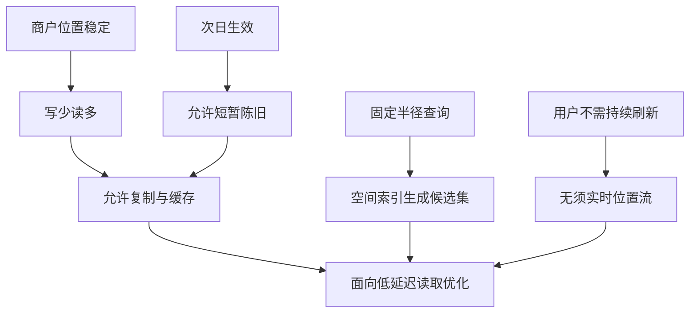
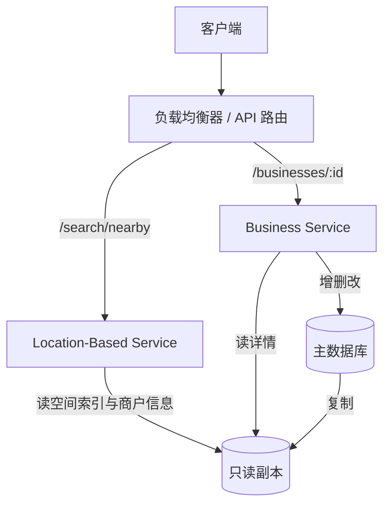
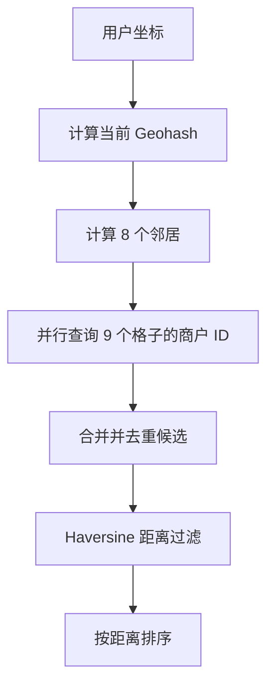
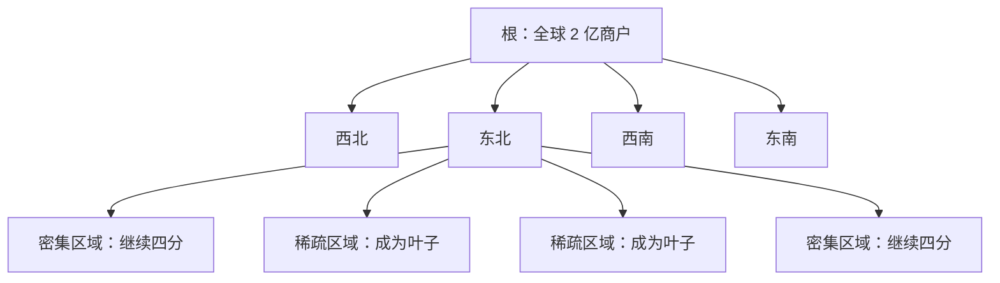
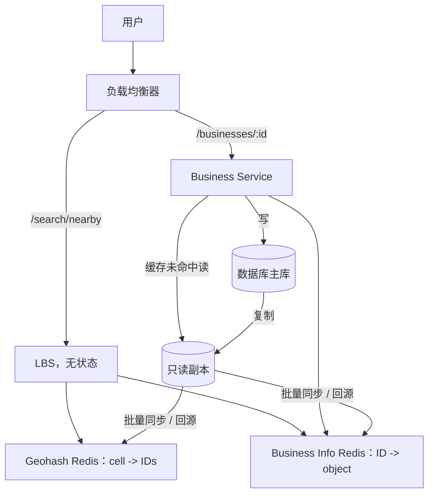
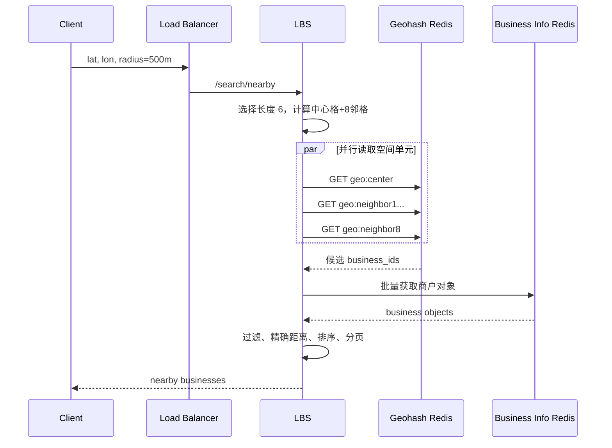
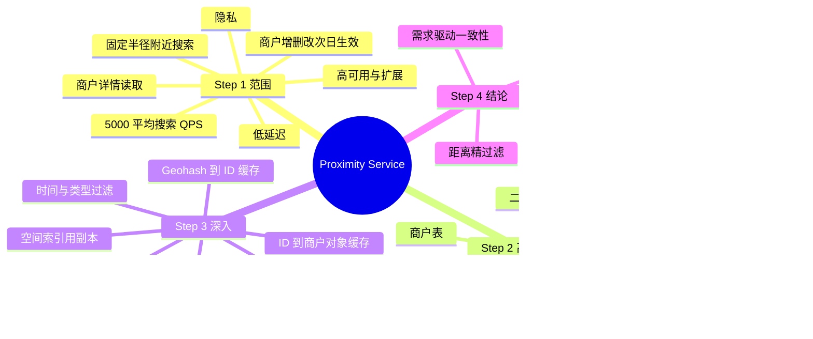

> 原书：Alex Xu、Sahn Lam，*System Design Interview: An Insider's Guide, Volume 2*（2022）
> 范围：Chapter 1: Proximity Service（PDF 第 9～42 页）
> 目标：设计一个类似 Yelp 附近搜索的系统，根据用户经纬度与搜索半径，低延迟地返回附近商户，并支持商户信息的查看、添加、更新和删除。

## 0. 本章解决什么问题

邻近服务（proximity service）是位置服务（Location-Based Service，LBS）的一种典型形态。它回答的问题是：

> 给定用户位置 $(\varphi_u,\lambda_u)$ 和半径 $r$，怎样从全球数亿商户中快速找出距离不超过 $r$ 的商户？

其中：

- $\varphi_u$ 是纬度；
- $\lambda_u$ 是经度；
- $r$ 是用户选择的搜索半径；
- 商户包括餐厅、酒店、影院、博物馆等具有相对稳定地理坐标的地点。

从功能上看，这像一条简单的数据库查询；真正困难的是，经纬度是二维数据，而普通数据库索引最擅长一维有序查找。若直接扫描 2 亿商户并逐个计算距离，即使每次计算都很快，总体也无法支撑高并发与低延迟。

本章的核心思路是：

1. 把地球表面划分为许多较小空间单元；
2. 用 Geohash、Quadtree 或 Google S2 建立空间索引；
3. 根据用户位置快速取回少量候选商户；
4. 对候选集计算真实球面距离，过滤、排序后返回；
5. 再用数据库复制、缓存和多地域部署解决吞吐、延迟、可用性与合规问题。


这里最重要的正确性边界是：**空间网格是候选集生成器，不是精确距离判定器。** 网格覆盖的是矩形或层级单元，用户要求的是圆形半径；两者不可能天然完全重合，所以最终距离过滤不可省略。

### 0.1 作者的四步分析框架

本章沿系统设计面试常用的四步法推进：

| 步骤 | 主要任务 | 本章输出 |
|---|---|---|
| Step 1 | 理解问题并限定范围 | 功能/非功能需求、规模估算 |
| Step 2 | 提出高层设计并取得共识 | API、数据模型、服务划分、五种空间查找方案 |
| Step 3 | 深入关键设计 | 数据库扩展、缓存、多地域、过滤与最终架构 |
| Step 4 | 收束总结 | 回顾方案、选择依据和核心权衡 |

作者的解题路线不是开场就说“使用 Redis GEO”或“使用 PostGIS”，而是先从最直观的二维查询出发，暴露其性能问题，再逐步推导出空间索引。这种推导方式展示了技术选择与问题之间的因果关系。

---

## 1. Step 1：理解问题并确定设计范围

Yelp 一类产品包含搜索、地图、推荐、评论、评分、图片、广告等大量功能。一场面试不可能覆盖全部，因此作者先通过候选人与面试官的对话缩小范围。

### 1.1 澄清问题及其设计影响

#### 问题一：用户能否指定半径？结果不足时是否自动扩大？

双方先约定：核心功能只返回指定半径内的商户；若时间允许，再把“结果不足时扩大范围”作为附加问题讨论。

这个问题区分了两种不同查询语义：

- **半径查询（radius search）**：返回所有满足 $d(u,b)\leq r$ 的商户；
- **k 近邻查询（k-nearest neighbors，kNN）**：无论多远，都尽量返回距离最近的 $k$ 个商户。

二者不能混为一谈。半径查询可能返回 0 个结果，kNN 则通常会扩大范围直到凑足 $k$ 个。Geohash 很自然地服务固定半径查询，Quadtree 则更容易逐层扩展完成 kNN。

#### 问题二：最大半径是多少？

双方把最大半径设为 20 km。客户端可选：

- 0.5 km；
- 1 km；
- 2 km；
- 5 km；
- 20 km。

最大半径会决定需要支持的空间索引精度、要读取多少相邻单元，以及最坏情况下候选集有多大。若半径可以无限扩大，局部索引最终可能退化成大范围扫描。

#### 问题三：商户怎样新增、删除和更新？是否实时生效？

商户所有者可以写入信息，但双方约定：新增或更新内容在第二天生效，不要求实时反映。

这个业务约定非常关键，因为它允许：

- 主库到只读副本存在复制延迟；
- 缓存和空间索引按夜间任务更新；
- Quadtree 逐批重建，而不必支持复杂的实时并发修改；
- 系统以最终一致性换取更简单、更稳定的读取架构。

“第二天生效”不是工程团队擅自接受陈旧数据，而是业务明确提供的一致性预算。架构简化必须有需求依据。

#### 问题四：用户移动时是否持续刷新？

本章假设用户移动较慢，不需要不断刷新页面。因此系统处理的是一次性位置查询，而不是连续位置流。

这把本章与“附近好友”等动态位置系统区分开：

| 邻近商户服务 | 动态附近好友服务 |
|---|---|
| 商户位置基本静态 | 用户位置持续变化 |
| 写少读多 | 位置更新写入频繁 |
| 可按天更新索引 | 常需秒级甚至更快更新 |
| 一次请求返回结果 | 常有持续推送或周期刷新 |

如果忽略这个差异，容易为本章引入不必要的位置流处理、长连接和实时索引更新。

### 1.2 功能需求

根据澄清结果，本章聚焦三个功能：

1. 根据用户经纬度和半径，返回范围内的全部商户；
2. 商户所有者可以添加、删除或更新商户，变更无需实时生效；
3. 客户可以查看某个商户的详细信息。

明确不作为核心范围的内容包括：

- 地图瓦片渲染；
- 评论、评分和图片系统的内部设计；
- 实时跟踪移动用户；
- 路网驾驶距离与路线规划；
- 个性化推荐排序。

本章讨论的“距离”主要是经纬度之间的地理直线距离，不是实际驾驶距离。道路距离需要路网图和最短路径算法，是另一类系统问题。

### 1.3 非功能需求

#### 低延迟

附近搜索往往发生在移动端交互中。用户拖动地图、切换半径或打开应用后，希望迅速看到结果。因此空间候选集生成、商户对象读取和距离计算都必须控制延迟，尤其要关注高分位尾延迟。

#### 数据隐私

用户位置属于敏感数据，设计时要考虑 GDPR、CCPA 等隐私法规。最低限度应包含：

- 只收集完成查询所需的坐标；
- 明确授权和用途；
- 避免在日志、追踪和缓存键中长期暴露精确坐标；
- 控制保留期和访问权限；
- 根据法规实施数据驻留与删除要求；
- 传输和存储时采用适当保护。

Geohash 只是位置编码，不是加密或匿名化。高精度 Geohash 仍可以反推出很小的地理区域。

#### 高可用与可扩展

系统要承受人口密集区域在午餐、晚餐等时段的流量尖峰。峰值并不均匀分布：纽约市中心某些网格可能远热于海洋或沙漠网格。因此既要考虑全球总 QPS，也要考虑地域流量和热点空间单元。

### 1.4 粗略估算

作者假设：

- 1 亿日活跃用户；
- 全球 2 亿商户；
- 每位用户每天进行 5 次附近搜索；
- 为便于心算，一天秒数 $86{,}400$ 近似为 $10^5$。

每日搜索次数为：

$$
Q_{day}=10^8\times5=5\times10^8
$$

平均搜索 QPS 为：

$$
Q_{avg}=\frac{5\times10^8}{10^5}=5{,}000
$$

若使用精确秒数，则：

$$
Q_{avg}=\frac{500{,}000{,}000}{86{,}400}\approx5{,}787
$$

作者使用 5,000 QPS 是数量级估算，不是容量承诺。生产设计还需要乘以峰均比，并预留故障容量。若峰值是平均值的 5 倍，则仅搜索入口就约为：

$$
Q_{peak}\approx25{,}000\text{ QPS}
$$

估算在本章中的作用是确认三件事：

1. 请求规模足以要求水平扩展；
2. 商户总量足以排除逐条扫描；
3. 业务写入远少于用户读取，因此系统整体是读密集型。

### 1.5 Step 1 的方法论

作者没有为了显得“完整”而设计整个 Yelp，而是用会改变架构的问题切范围：查询语义、半径上限、更新时效和位置刷新频率。由此得到一条清晰决策链：



---

## 2. Step 2：提出高层设计并取得共识

Step 2 按原书顺序讨论 API、数据模型、高层架构和附近搜索算法。

## 2.1 API 设计

### 2.1.1 附近搜索 API

```http
GET /v1/search/nearby?latitude=37.776720&longitude=-122.416730&radius=500
```

请求参数：

| 字段 | 类型 | 含义 |
|---|---|---|
| `latitude` | decimal | 用户纬度 |
| `longitude` | decimal | 用户经度 |
| `radius` | int | 可选，单位为米，原书默认 5,000 m |

简化响应：

```json
{
  "total": 10,
  "businesses": [
    {
      "business_id": "b_123",
      "name": "Example Cafe",
      "latitude": 37.7759,
      "longitude": -122.4178,
      "distance_meters": 132
    }
  ]
}
```

真实应用通常还需要分页。分页虽不是本章重点，但面试中应主动说明，因为一个 20 km 圆内可能包含大量商户。

分页还涉及排序稳定性：如果第一页和第二页之间商户数据或排序分数改变，仅使用偏移量可能造成重复或遗漏。实际系统通常会定义稳定的次级排序键，例如 `(distance, business_id)`，并考虑游标分页。

### 2.1.2 商户 API

| API | 作用 |
|---|---|
| `GET /v1/businesses/:id` | 获取商户详情 |
| `POST /v1/businesses` | 新增商户 |
| `PUT /v1/businesses/:id` | 更新商户 |
| `DELETE /v1/businesses/:id` | 删除商户 |

附近结果页所需的摘要对象与详情页对象可以不同。搜索接口只返回渲染列表所需字段，详情 API 再返回图片、评论、星级、营业时间等较大对象，可减少搜索响应体和扇出成本。

## 2.2 数据模型

### 2.2.1 读写比

高频读取包括：

- 搜索附近商户；
- 查看商户详情。

低频写入包括：

- 新增商户；
- 删除商户；
- 修改地址、营业时间或其他信息。

作者据此选择关系型数据库（如 MySQL）作为商户数据存储。理由不是“读多就一定用关系型数据库”，而是：

- 商户对象结构明确；
- 需要稳定主键和事务性更新；
- 写入量低；
- 读取可通过副本和缓存扩展；
- 空间访问另有专门索引解决。

### 2.2.2 商户表

核心字段可表示为：

```sql
CREATE TABLE business (
    business_id BIGINT PRIMARY KEY,
    address VARCHAR(512),
    city VARCHAR(128),
    state VARCHAR(128),
    country VARCHAR(128),
    latitude DECIMAL(9, 6),
    longitude DECIMAL(9, 6)
);
```

原书强调 `business_id` 是主键。经纬度保存在商户表中，用于最终精确距离计算；空间索引表则用于快速找到候选 `business_id`。

### 2.2.3 地理空间索引表

地理空间索引（geo index）不是第二份完整商户数据，而是位置单元到商户 ID 的倒排关系：

$$
\mathrm{cell\_id}\longrightarrow\{\mathrm{business\_id}\}
$$

它解决“从位置到对象”的查找，商户表解决“从 ID 到详情”的读取。二者分离后，空间索引可以保持紧凑，详情数据也可以独立分片和缓存。

## 2.3 高层架构



### 2.3.1 负载均衡器

负载均衡器分发请求，并按 URL 路径把附近搜索路由到 LBS，把商户相关 API 路由到 Business Service。对外可以只有一个 DNS 入口，内部服务仍然按职责分开。

### 2.3.2 Location-Based Service（LBS）

LBS 是本章核心服务，输入经纬度和半径，输出附近商户。其特点是：

- 只有读取请求；
- QPS 高，密集地区和用餐时段更高；
- 本身不保存会话状态；
- 可以通过增加实例水平扩展。

无状态不等于系统没有状态。商户数据、空间索引和缓存仍然有状态，只是 LBS 实例不依赖本地会话，因此请求可以路由到任意健康实例。

### 2.3.3 Business Service

Business Service 承担两类负载：

- 商户所有者发起的低 QPS 写入；
- 普通用户发起的高 QPS 详情读取。

把它与 LBS 分开，可以独立扩容、隔离写入逻辑，也避免附近查询服务承担商户管理职责。

### 2.3.4 数据库集群

数据库采用主库加只读副本：

1. 写请求进入主库；
2. 主库把数据复制到多个副本；
3. LBS 和商户详情读取主要访问副本。

复制会产生延迟，因此副本上的结果可能暂时落后于主库。本章已经约定商户变更次日生效，这种不一致通常可以接受。

### 2.3.5 服务扩展与部署

LBS 和 Business Service 都是无状态服务，可以在高峰时自动增加实例，在低峰时缩减。部署到多个可用区可降低单个数据中心故障的影响，部署到多个地域还能降低跨洲网络延迟。

---

## 2.4 如何查找附近商户：从朴素方法到空间索引

本章最重要的推导从一个朴素问题开始：普通经纬度列为什么不够，怎样把二维位置转换为高效索引？

### 2.4.1 必要背景：矩形预筛选与圆形精确过滤

半径查询的几何目标是圆：

$$
\{b\mid d(u,b)\leq r\}
$$

数据库更容易先查询包围圆的矩形：

$$
\varphi\in[\varphi_u-\Delta\varphi,\varphi_u+\Delta\varphi]
$$

$$
\lambda\in[\lambda_u-\Delta\lambda,\lambda_u+\Delta\lambda]
$$

在地球半径为 $R$、搜索距离相对较小时，可近似：

$$
\Delta\varphi\approx\frac{r}{R}\cdot\frac{180}{\pi}
$$

$$
\Delta\lambda\approx\frac{r}{R\cos\varphi_u}\cdot\frac{180}{\pi}
$$

经度每一度对应的实际距离随纬度变化，因此不能简单把“1 km”直接加到经纬度上。矩形内四个角还位于圆外，必须做精确距离过滤。

### 2.4.2 精确距离：Haversine 公式

对两个经纬度点 $(\varphi_1,\lambda_1)$ 和 $(\varphi_2,\lambda_2)$，先把角度转为弧度，定义：

$$
\Delta\varphi=\varphi_2-\varphi_1,\qquad
\Delta\lambda=\lambda_2-\lambda_1
$$

$$
a=\sin^2\left(\frac{\Delta\varphi}{2}\right)
+\cos\varphi_1\cos\varphi_2
\sin^2\left(\frac{\Delta\lambda}{2}\right)
$$

$$
c=2\operatorname{atan2}(\sqrt{a},\sqrt{1-a})
$$

$$
d=Rc
$$

取地球平均半径 $R\approx6{,}371{,}000$ m，即可得到两点的大圆距离。

Haversine 的作用是最终精排与过滤，不适合对 2 亿行逐条执行。正确组合是：

$$
\text{空间索引粗召回}\rightarrow\text{Haversine 精确判定}
$$

下面的 Python 代码可直接运行，它对应最终查询流程中的“计算距离、过滤、排序”：

```python
from math import atan2, cos, radians, sin, sqrt

EARTH_RADIUS_METERS = 6_371_000.0

def haversine_meters(lat1, lon1, lat2, lon2):
    phi1, phi2 = radians(lat1), radians(lat2)
    delta_phi = radians(lat2 - lat1)
    delta_lambda = radians(lon2 - lon1)

    a = (
        sin(delta_phi / 2) ** 2
        + cos(phi1) * cos(phi2) * sin(delta_lambda / 2) ** 2
    )
    central_angle = 2 * atan2(sqrt(a), sqrt(1 - a))
    return EARTH_RADIUS_METERS * central_angle

def filter_and_rank(origin, radius_meters, businesses):
    results = []
    for business in businesses:
        distance = haversine_meters(
            origin[0],
            origin[1],
            business["latitude"],
            business["longitude"],
        )
        if distance <= radius_meters:
            results.append({**business, "distance_meters": round(distance)})
    return sorted(results, key=lambda item: (item["distance_meters"], item["id"]))

if __name__ == "__main__":
    origin = (37.776720, -122.416730)
    candidates = [
        {"id": 1, "name": "Nearby Cafe", "latitude": 37.7759, "longitude": -122.4178},
        {"id": 2, "name": "Farther Shop", "latitude": 37.7860, "longitude": -122.4300},
    ]
    print(filter_and_rank(origin, 500, candidates))
```

适用边界：Haversine 把地球近似为球体，对于几百米到几十公里的附近搜索通常足够。若业务要求厘米级测量、复杂椭球精度或驾驶距离，需要更专业的测地或路网算法。

## 2.5 方案一：直接二维搜索

最直观的伪 SQL 是分别限制纬度和经度：

```sql
SELECT business_id, latitude, longitude
FROM business
WHERE latitude BETWEEN :min_latitude AND :max_latitude
  AND longitude BETWEEN :min_longitude AND :max_longitude;
```

若没有索引，只能全表扫描。给纬度和经度分别建立普通索引，也不会从根本上解决问题：

1. 纬度索引能快速得到一条横向带状区域的数据集；
2. 经度索引能快速得到一条纵向带状区域的数据集；
3. 数据库还要对两个可能很大的集合求交集；
4. 求交后仍只是矩形候选集，还要计算圆形距离。

普通 B-tree 的有序性是一维的。即使使用 `(latitude, longitude)` 复合索引，第一个字段执行范围查询后，第二个字段通常也难以同时获得理想选择性。问题由此自然转化为：

> 能否把二维经纬度映射为具有空间局部性的一维键？

专用空间数据库或扩展，例如 Redis GEO、PostGIS，已经提供成熟实现。但作者强调，面试中比报出产品名更重要的是解释空间索引为什么需要、如何工作、有哪些边界。

## 2.6 空间索引的两大类

本章把常见方案粗分为：

- **哈希/编码类**：均匀网格、Geohash、Cartesian Tiers；
- **树结构类**：Quadtree、Google S2、R-tree。

底层实现不同，但高层思想一致：

$$
\text{连续二维空间}\rightarrow\text{较小空间单元}\rightarrow\text{可索引标识}
$$

查询不再面对全部商户，而只面对与搜索区域相交的少数单元。

## 2.7 方案二：均匀网格

均匀网格把世界按固定经纬度间隔切成大小相同的格子，每个商户属于一个格子。查询时读取用户所在格及邻近格。

优点是概念和实现简单，主要问题是商户分布极不均匀：

- 纽约市中心一个格子可能有大量商户；
- 沙漠和海洋格子可能完全为空；
- 固定格子无法同时适合密集和稀疏区域；
- 热门格子会产生超大候选集和热点；
- 还需要正确计算边界处的相邻格子。

理想分区应该在密集区域使用更小格子，在稀疏区域使用更大格子。这正是 Quadtree 自适应划分的动机。

## 2.8 方案三：Geohash

### 2.8.1 Geohash 是什么

Geohash 把二维经纬度递归二分，并编码成由字母和数字组成的一维字符串。字符串越长，表示的空间单元越小、精度越高。

它解决两个问题：

1. 把二维位置转成可用于数据库键、前缀查询和缓存键的一维表示；
2. 通过前缀表达层级关系：短前缀表示大区域，增加字符表示继续细分。

### 2.8.2 编码过程

经度初始范围是 $[-180,180]$，纬度初始范围是 $[-90,90]$。算法交替对经度和纬度区间二分：

1. 坐标位于当前区间上半部分，记录 1；
2. 位于下半部分，记录 0；
3. 把区间缩到对应一半；
4. 交替处理经度和纬度，持续产生比特；
5. 每 5 bit 编码为一个 Base32 字符。

因此长度为 $p$ 的 Geohash 含约 $5p$ bit 空间信息。增加一个字符，单元数量理论上增加 32 倍，但经纬度交替位数导致格子的宽高并非始终相等。

```text
世界
└── 第 1 个字符：很大区域
    └── 第 2 个字符：更小区域
        └── 第 3 个字符：继续细分
            └── ...
```

原书示例：

- Google 总部，长度 6：`9q9hvu`；
- Facebook 总部，长度 6：`9q9jhr`。

共同前缀 `9q9` 表明二者处于同一较大区域，但不能直接把字符串差值当作真实距离。

### 2.8.3 精度与网格大小

原书给出的近似映射如下：

| Geohash 长度 | 网格宽 × 高（约） |
|---:|---|
| 1 | 5,009.4 km × 4,992.6 km |
| 2 | 1,252.3 km × 624.1 km |
| 3 | 156.5 km × 156 km |
| 4 | 39.1 km × 19.5 km |
| 5 | 4.9 km × 4.9 km |
| 6 | 1.2 km × 609.4 m |
| 7 | 152.9 m × 152.4 m |
| 8 | 38.2 m × 19 m |
| 9 | 4.8 m × 4.8 m |
| 10 | 1.2 m × 59.5 cm |
| 11 | 14.9 cm × 14.9 cm |
| 12 | 3.7 cm × 1.9 cm |

本题主要使用长度 4～6：小于 4 时格子过大，候选集太多；大于 6 时格子过小，为覆盖同一半径要读取过多网格。

网格实际宽度会随纬度变化，所以表中尺寸是近似值，不能把它当全球任意位置都严格相同的物理尺寸。

### 2.8.4 半径与精度选择

原书表 1.5 给出：

| 搜索半径 | Geohash 长度 |
|---:|---:|
| 0.5 km | 6 |
| 1 km | 5 |
| 2 km | 5 |
| 5 km | 4 |
| 20 km | 4 |

直觉是选择与搜索尺度相近的最细可用层级，在控制候选集大小的同时，避免读取过多网格。由于用户可能位于格子边缘，不能只读中心格，仍要读取相邻格并做精确过滤。

> 原书勘误提示：缓存小节有一句把 0.5、1、2、5 km 依次写成长度 4、5、5、6，这与表 1.5 及最终 500 m 使用长度 6 的示例相反。本文按表 1.5 和最终流程采用 6、5、5、4。

### 2.8.5 边界问题一：位置很近，却没有共同前缀

Geohash 具有层级分割边界。两个点即使物理距离很近，只要分处某条高层边界两侧，共同前缀就可能很短，甚至完全不同。

原书举例：法国 La Roche-Chalais 的 `u000` 与相距约 30 km 的 Pomerol 的 `ezzz` 没有共同前缀，因为它们跨越了高层划分边界。

因此仅执行下面的前缀查询会漏掉边界另一侧的附近商户：

```sql
SELECT business_id
FROM geospatial_index
WHERE geohash LIKE '9q8zn%';
```

### 2.8.6 边界问题二：用户靠近格子边缘

即使搜索半径很小，圆也可能跨过当前格子的边或角。只查用户所在格会漏掉相邻格中实际更近的商户。

通用修复是查询：

- 当前 Geohash；
- 上、下、左、右四个邻格；
- 四个对角邻格。

邻格 Geohash 可以在常数时间内根据编码与边界规则计算。得到最多 9 个格子的候选后，再用真实距离去掉圆外假阳性。



这里有两个容易混淆的逻辑命题：

- 长共同前缀通常意味着两个点位于同一较小区域；
- 两个点距离很近，不保证它们具有长共同前缀。

第二个命题正是边界问题。

### 2.8.7 结果不足时怎样扩大搜索

原书给出两种选择：

1. 严格遵守半径，只返回半径内结果；实现简单，但可能无法满足用户想看到足够结果的体验。
2. 删除 Geohash 最后一个字符，转到父级大网格；若仍不足，再继续缩短前缀。

若原 Geohash 为 `9q8zn6`，第一次扩展为 `9q8zn`，覆盖范围扩大约一个层级。这个过程可以持续到结果数量达到目标或最大半径用尽。

必须明确：一旦自动扩大，查询语义已从“严格半径内全部商户”接近“寻找足够多近邻”。API 应告诉用户实际搜索范围，且最终仍要按距离排序和限制最大距离。

### 2.8.8 Geohash 的优缺点

优点：

- 易理解、易实现；
- 不需要构建内存树；
- 可用字符串前缀表达层级；
- 易存入关系表、KV 存储和缓存；
- 商户增删只涉及对应 `(geohash, business_id)` 记录；
- 适合指定半径的附近搜索。

局限：

- 固定精度下格子大小固定，不能自动适应商户密度；
- 热门格子可能包含大量商户；
- 边界会破坏“附近一定有相同前缀”的逆命题；
- 网格是矩形，必须精确距离过滤；
- 越高精度越可能需要查询更多相邻格；
- 地球投影与纬度会影响格子物理尺寸。

## 2.9 方案四：Quadtree

### 2.9.1 Quadtree 是什么

四叉树（Quadtree）递归地把二维空间划分为四个象限。只有当一个区域中的商户数超过阈值时才继续细分。

本章设每个叶子最多存 100 个商户。这个数字不是算法常数，应由业务的候选集大小、内存、查询延迟和更新成本共同决定。

与均匀网格相比，Quadtree 的关键优势是自适应：

- 商户密集区域持续细分，格子更小；
- 稀疏区域较早停止，格子更大；
- 每个叶子的候选数量大致有上界。



原书采用内存 Quadtree：每个 LBS 服务器启动时从数据库读取商户并构建树。它是一种内存数据结构，不等同于数据库。

### 2.9.2 构建算法

原书伪代码的清晰版本如下：

```text
build(node):
    if node.business_count <= MAX_BUSINESSES_PER_LEAF:
        return

    node.subdivide_into_four_children()
    distribute_node_businesses_to_children()

    for child in node.children:
        build(child)
```

为什么有效：每次细分都把当前二维区域缩小，直到叶子商户数满足阈值。查询点从根开始，每层只进入包含该点的子区域，因此不需要检查所有叶子。

必须设置退化保护，例如最大深度或最小格子尺寸。若大量商户坐标完全相同，仅靠“商户数不超过 100”可能无法通过继续细分终止。

### 2.9.3 内存估算

作者假设 2 亿商户，每个叶子最多 100 个商户。

叶子节点存储：

| 内容 | 估算大小 |
|---|---:|
| 左上、右下共 4 个坐标 | $4\times8=32$ bytes |
| 最多 100 个商户 ID | $100\times8=800$ bytes |
| 合计 | 832 bytes |

内部节点存储：

| 内容 | 估算大小 |
|---|---:|
| 4 个边界坐标 | 32 bytes |
| 4 个子指针 | $4\times8=32$ bytes |
| 合计 | 64 bytes |

近似叶子数：

$$
L\approx\frac{200{,}000{,}000}{100}=2{,}000{,}000
$$

对于每个内部节点都有 4 个孩子的满四叉树，边数既等于 $4I$，又等于总节点数减 1：

$$
4I=I+L-1
$$

所以：

$$
I=\frac{L-1}{3}\approx\frac{2{,}000{,}000}{3}\approx670{,}000
$$

总内存：

$$
M\approx L\times832+I\times64
$$

$$
M\approx2{,}000{,}000\times832+670{,}000\times64
\approx1.71\text{ GB}
$$

这个估算的结论是数量级很小，可放入一台现代服务器内存。它不是精确生产内存：对象头、容器容量、分配器碎片、指针对齐和未满叶子都会改变结果。

### 2.9.4 为什么“能放进一台服务器”仍不能只部署一台

容量只是一个维度。单机还可能受限于：

- CPU：树遍历与距离计算；
- 网络：返回大量候选 ID；
- QPS：并发查询；
- 可用性：单机故障会让服务不可用。

因此可以在多个 LBS 实例上复制同一棵树，以副本分担读负载并消除单点。这里复制解决吞吐和可用性，不是因为数据放不下。

### 2.9.5 构建复杂度

原书给出的简化复杂度为：

$$
\frac{n}{100}\log\frac{n}{100}
$$

其中 $n$ 是商户总数，100 是每叶阈值。作者估计 2 亿商户的树需要几分钟构建。

应把这个式子理解为数量级说明，而非对所有实现严格成立的复杂度。实际成本取决于：

- 是逐点插入还是批量分区构建；
- 树高与空间分布；
- 是否重复扫描节点中的点；
- 数据读取和内存分配成本；
- 热点坐标导致的树退化。

常见逐点插入可近似为 $O(nh)$，其中 $h$ 是树高；分布较均匀时 $h$ 近似对数级。

### 2.9.6 查询附近商户

原书流程是：

1. 在内存中构建 Quadtree；
2. 从根向下找到包含查询点的叶子；
3. 若候选不足，继续读取相邻叶子；
4. 直到获得足够商户。

若需求是严格半径查询，更一般的算法不是只看“相邻叶子”，而是遍历所有与查询圆相交的节点：

```text
radius_search(node, circle, output):
    if node.rectangle does not intersect circle:
        return

    if node is a leaf:
        for business in node.businesses:
            if exact_distance(circle.center, business) <= circle.radius:
                output.add(business)
        return

    for child in node.children:
        radius_search(child, circle, output)
```

矩形与圆不相交的节点可以整棵剪枝；相交叶子中的商户再计算精确距离。对于 kNN，则可按节点到查询点的最小可能距离使用优先队列扩展，直到已找到的第 $k$ 个结果足以剪掉其余节点。

### 2.9.7 运维问题

Quadtree 的算法并不算复杂，真正难点在生命周期管理。

#### 启动时间

服务器构树期间不能接流量。若同时重启大量实例，会造成服务降级。作者建议滚动发布，每次只替换少量实例。

蓝绿发布也可行，但整套新集群同时从数据库读取 2 亿商户，会形成启动风暴，给数据库和网络带来巨大压力。可以通过快照、对象存储分发、限速与错峰缓解，但系统会更复杂。

#### 索引更新

最简单做法是逐批重建各实例的树。过渡期间不同实例可能返回略旧数据，但“次日生效”的业务约定允许这种短暂不一致。夜间批量更新还可能同时使大量缓存键失效，造成缓存和数据库负载尖峰。

另一做法是在线修改树。它能提高新鲜度，却需要处理：

- 多线程读写锁；
- 叶子分裂与合并；
- 树再平衡；
- 更新与查询的一致视图；
- 多实例之间的版本同步。

本章需求不要求实时更新，因此作者选择更简单的批量重建。这体现了“用业务时效换实现简单”的权衡。

### 2.9.8 Quadtree 的优缺点

优点：

- 根据商户密度自动调整格子大小；
- 密集区格子小、稀疏区格子大；
- 适合 kNN 和可剪枝的范围查询；
- 整棵索引可放内存，读取快。

局限：

- 要构建和维护树；
- 启动时间长，发布更复杂；
- 在线更新需要锁、分裂、合并或重平衡；
- 多实例各自持树，需要版本与更新策略；
- 极端数据分布需要退化保护。

## 2.10 方案五：Google S2

### 2.10.1 核心思想

Google S2 Geometry Library 把球面划分为层级单元，并借助 Hilbert 空间填充曲线把球面位置映射到一维 Cell ID。

Hilbert 曲线尽量保持空间局部性：曲线上相近的单元在二维空间中通常也相近，于是很多空间问题可以转化为一维 ID 的范围与集合操作。

要注意，空间填充曲线无法完美保持所有二维距离关系。它提供的是良好局部性，不是“两个 ID 数值接近就必然物理最近”的严格等价。

### 2.10.2 Geofencing

S2 擅长地理围栏（geofence）：用虚拟边界描述学校区域、社区、多边形服务区或某点周围半径，并判断用户进入、离开或位于区域内。

这比简单的“附近商户”更一般，因为目标区域可以是不规则多边形，而非只围绕一点的圆。

### 2.10.3 Region Cover

S2 的 Region Cover 算法可使用不同层级的单元近似覆盖任意区域。调用方可指定：

- 最小层级；
- 最大层级；
- 最大单元数。

与固定精度 Geohash 相比，S2 可以组合大小不同的单元，在覆盖精度和单元数量之间做权衡。单元越多，边界拟合越精细，但查询、存储和集合运算成本也越高。

### 2.10.4 为什么面试中通常不首选 S2

S2 功能强大，但内部机制较复杂。作者建议面试中优先选择 Geohash 或 Quadtree，因为更容易在有限时间内解释清楚。若题目强调球面几何、不规则区域或 geofence，S2 才更可能显示明显优势。

现实采用示例：

| 索引 | 示例 |
|---|---|
| Geohash | Bing Maps、Redis、MongoDB、Lyft |
| Quadtree | Yext |
| 两者均支持 | Elasticsearch |
| S2 | Google Maps、Tinder |

产品采用情况只能证明方案可行，不能代替针对当前需求的选型论证。

## 2.11 Geohash 与 Quadtree 对比

| 维度 | Geohash | Quadtree |
|---|---|---|
| 结构 | 层级字符串编码 | 内存树 |
| 划分方式 | 同一精度固定格子 | 按商户密度递归细分 |
| 实现复杂度 | 较低 | 较高 |
| 指定半径查询 | 适合，需邻格与精确过滤 | 适合，以相交节点剪枝 |
| kNN | 需逐级扩展 | 更自然地逐步搜索邻近叶子 |
| 热点适应 | 固定精度不能自动适应 | 密集区域自动变细 |
| 更新 | 插入/删除索引记录简单 | 遍历、锁、分裂与再平衡更复杂 |
| 启动 | 无需构建整棵树 | 需构建或加载树 |
| 运维 | 表和缓存较直接 | 需管理树版本与滚动更新 |

本章最终选择 Geohash，不是因为它在所有维度最好，而是因为当前需求是固定半径搜索、商户更新不频繁，Geohash 已足够，并且实现与面试解释成本更低。

---

## 3. Step 3：深入设计

作者在高层设计达成共识后，依次深入数据库扩展、缓存、地域与可用区、结果过滤和最终架构。

## 3.1 扩展数据库

系统有两类关键数据：

- 商户详情表；
- 地理空间索引表。

二者的大小、访问方式和扩展瓶颈不同，不能使用同一种扩展策略。

### 3.1.1 商户表：按 `business_id` 分片

2 亿商户的完整详情、图片元数据、营业时间等未必适合一台数据库，因此商户表是分片候选。

作者建议按 `business_id` 分片。实践中通常使用哈希或分片函数：

$$
\mathrm{shard}=h(\mathrm{business\_id})\bmod N
$$

目标是让数据和请求在 $N$ 个分片间较均匀分布。若直接按连续 ID 范围分片，新 ID 只写最后一个范围，未必均匀；因此“按 ID 分片”仍需说明具体路由方式。

按 ID 分片的优点：

- 详情读取天然带 `business_id`，路由简单；
- 写入和存储较均匀；
- 运维规则清晰。

限制是跨多个 ID 的批量读取会形成扇出。最终 LBS 拿到许多候选 ID 后，通常应批量分组到各分片或优先从缓存获取，避免每个 ID 一次网络调用。

### 3.1.2 Geohash 索引表的两种结构

#### 方案一：每个 Geohash 一行，值为 JSON ID 数组

| geohash | list_of_business_ids |
|---|---|
| `32feac` | `[343, 347, ...]` |

问题包括：

- 删除或修改要读取并扫描整个数组；
- 插入前为防重复也要扫描；
- 并发写需要锁住整行；
- 热门网格会形成超大行；
- 单个 ID 更新会重写较大值。

#### 方案二：每个商户一行，使用复合键

| geohash | business_id |
|---|---:|
| `32feac` | 343 |
| `32feac` | 347 |
| `f31cad` | 112 |
| `f31cad` | 113 |

定义复合主键：

```sql
CREATE TABLE geospatial_index (
    geohash VARCHAR(12) NOT NULL,
    business_id BIGINT NOT NULL,
    PRIMARY KEY (geohash, business_id)
);
```

这样做的收益：

- 同一 Geohash 的记录按键聚集，便于前缀或等值范围读取；
- 复合主键天然防止同一商户重复插入；
- 新增和删除是一条记录级操作；
- 不需要为了修改 JSON 数组而锁整行。

作者推荐方案二。它用更规范化的行结构换取简单并发语义。

### 3.1.3 空间索引：先问大小，再决定是否分片

面试中的常见错误是听到“2 亿商户”就立刻分片。作者先估算空间索引：Quadtree 约 1.71 GB，Geohash 索引也处于类似的可控数量级，完全能进入现代数据库服务器的工作集。

这意味着它的潜在瓶颈更可能是：

- 读取 QPS；
- CPU；
- 网络带宽；

而不是存储容量。

可选方案：

1. **读副本**：每个副本保存完整索引，分担读请求；
2. **分片**：每个节点只保存一部分索引，应用负责路由与跨分片查询。

由于完整索引能放进单机工作集，作者推荐读副本：

- 开发与运维更简单；
- 不需要在应用层加入分片路由；
- 查询邻格不会频繁跨多个分片；
- 每个副本都能独立回答查询。

本节体现的通用原则是：

$$
\text{容量不足}\Rightarrow\text{考虑分片}
$$

$$
\text{数据可放下但读取吞吐不足}\Rightarrow\text{优先考虑复制}
$$

复制和分片都能增加机器，但解决的问题并不相同。

## 3.2 缓存

### 3.2.1 不要默认缓存一定有收益

作者先提出反问：系统真的需要缓存吗？

反对立即加缓存的理由：

- 系统虽读密集，但空间索引很小；
- 数据可驻留数据库内存工作集，查询不一定受磁盘 I/O 限制；
- 数据库读副本也能增加吞吐；
- 缓存会增加一致性、失效、成本与运维复杂度。

因此要用基准测试与成本分析验证：缓存是否显著降低 P95/P99 延迟，是否减少数据库 CPU/网络，收益是否高于维护成本。

后续设计假设缓存确实符合业务目标，于是继续讨论缓存键和数据内容。

### 3.2.2 为什么不能用精确经纬度作缓存键

直接使用 `(latitude, longitude)` 会导致缓存碎片：

- 手机定位本身有误差，同一地点连续读数会轻微漂移；
- 用户移动几米后坐标变化，但附近商户集合可能几乎相同；
- 浮点字符串格式也可能产生不同键；
- 命中率低，键数量巨大。

理想键应把“业务上无意义的小位置变化”映射到同一单元。Geohash 或 Quadtree 单元正好完成空间量化：

$$
(\varphi,\lambda)\longrightarrow\mathrm{geohash\_prefix}
$$

这是一种有意降低位置精度、换取缓存复用的过程。

### 3.2.3 缓存两类数据

| 缓存键 | 缓存值 | 用途 |
|---|---|---|
| `geohash` | 网格内商户 ID 列表 | 快速生成候选集 |
| `business_id` | 完整或摘要商户对象 | 快速加载页面数据 |

二者对应两阶段读取：先通过位置找到 ID，再通过 ID 得到对象。把两个缓存分开，空间索引更新不会迫使所有详情对象一起重写。

### 3.2.4 Geohash ID 列表：Cache-Aside

读取流程：

1. 用 Geohash 构造缓存键；
2. 查询 Redis；
3. 命中则直接返回 ID 列表；
4. 未命中则查数据库；
5. 把结果写入 Redis，设置 TTL；
6. 返回结果。

```text
get_business_ids(geohash):
    key = "geo:" + geohash
    ids = redis.get(key)
    if ids exists:
        return ids

    ids = database.query(geohash)
    redis.set(key, ids, ttl = 1 day)
    return ids
```

商户新增、更新或删除时更新数据库并使对应缓存失效。由于写入量低，Geohash 索引又使用每商户一行，更新路径相对简单。

仍需处理缓存击穿：热门 Geohash 过期时，大量并发请求可能同时查数据库。常见办法包括请求合并、互斥重建、TTL 抖动和后台刷新。

### 3.2.5 多精度缓存与内存估算

本章半径会使用 Geohash 长度 4、5、6，因此可为三个精度分别缓存商户 ID。每个商户在一个给定精度只属于一个网格。

若每个 ID 8 bytes、2 亿商户、3 个精度，则值的理论最小空间：

$$
M=8\times200{,}000{,}000\times3
=4{,}800{,}000{,}000\text{ bytes}
\approx4.8\text{ GB}
$$

原书近似为 5 GB，并认为键空间可忽略。这个估算用于证明数量级较小，但真实 Redis 内存还包括：

- Key 和 Value 对象头；
- 容器与哈希表开销；
- 指针和内存对齐；
- 复制、副本和持久化缓冲；
- 内存碎片。

所以生产容量不能只按 5 GB 配置。

从纯容量看一台现代 Redis 能放下，但为高可用、读取吞吐和跨洲延迟，作者仍把缓存集群部署到全球多个地域，并因数据集较小而在各地保存完整副本。

### 3.2.6 商户对象缓存

第二类缓存以 `business_id` 为键，值包含名称、地址、图片 URL 等页面渲染信息。详情读取采用 Cache-Aside：命中直接返回，未命中查数据库并回填。

这类缓存和 Geohash 缓存失效原因不同：

- 地址或坐标变化：商户对象缓存与新旧空间单元都可能需要更新；
- 名称或图片变化：只更新商户对象缓存即可；
- 删除：详情缓存和空间索引缓存都必须失效。

“次日生效”的约定允许使用夜间任务统一发布新版本，但要避免所有键同一时刻过期造成负载尖峰。

## 3.3 Region 与 Availability Zone

作者把 LBS 部署到多个地域（Region）和可用区（Availability Zone，AZ）。

### 3.3.1 两个概念的区别

- Region 是相距较远的地理区域，例如欧洲、美国西部；
- AZ 是同一 Region 内相互隔离的数据中心或故障域。

多 AZ 主要防单个数据中心故障；多 Region 还涉及全球延迟、灾难恢复和数据驻留。

### 3.3.2 多地域的三个收益

#### 降低网络延迟

欧洲用户访问欧洲 Region，而不是跨大西洋访问美国。用户与服务在物理网络上更近，往返时延更低。

#### 按人口与流量分布容量

日本、韩国等人口密集区域可以拥有独立 Region，或在 Region 内部署更多 AZ 与实例，避免全球平均容量掩盖局部热点。

#### 满足隐私与数据驻留

某些国家要求数据在本地使用和存储。系统可在当地设 Region，并用 DNS 或全球流量路由把请求限制到合规区域。

DNS 路由只是入口控制的一部分；生产系统还要确保日志、备份、复制链路、监控数据和故障转移不会把受限数据带出地域。

## 3.4 追问：按营业时间或商户类型过滤

面试官可能要求：

- 只返回当前营业的商户；
- 只返回餐厅等指定类型。

作者的回答是先做空间过滤。一个小网格及邻格返回的商户数相对有限，因此可以：

1. 先取候选商户 ID；
2. 批量加载商户对象；
3. 根据营业时间和类型过滤；
4. 计算距离并排序。

这是一种“选择性最高且已有索引的条件优先”的策略。它成立的前提是空间预筛选后的候选集足够小。

局限包括：

- 超密集区域候选仍可能很大；
- 类型或营业状态过滤后可能不足一页；
- 营业时间涉及时区、跨午夜、节假日和临时停业；
- 若过滤条件很多且选择性高，可能需要复合索引、按类型分桶或搜索引擎。

为了填满一页，系统可以过量召回候选，再过滤；若仍不足，则在业务允许时扩大空间范围。

## 3.5 最终架构



最终设计把高频搜索读取放在 LBS 与两类 Redis 上，把低频商户写入集中到 Business Service 和主库。数据库副本提供持久数据读取与缓存回源。

## 3.6 完整读路径：查找 500 m 内餐厅

原书使用坐标：

```text
latitude  = 37.776720
longitude = -122.416730
radius    = 500 m
```

流程如下：

1. 客户端把位置与半径发送到负载均衡器；
2. 负载均衡器把 `/search/nearby` 转给 LBS；
3. LBS 根据半径选择 Geohash 长度，500 m 对应长度 6；
4. LBS 计算当前位置 Geohash 与 8 个邻格；
5. LBS 并行查询 9 个 Geohash Redis 键，取得商户 ID；
6. 合并并去重 ID；
7. 从 Business Info Redis 批量加载完整商户对象；
8. 根据需要按营业时间、类型过滤；
9. 计算用户到每个候选商户的 Haversine 距离；
10. 删除半径外候选，按距离排序并分页；
11. 返回客户端。



并行查询能把 9 个缓存读取的总延迟从近似相加变为接近最慢一次调用，但也增加瞬时并发和尾延迟暴露。生产实现应批量读取或设置超时，避免一个邻格故障拖住整个请求。

## 3.7 商户查看、更新、新增与删除路径

### 查看详情

1. 请求进入 Business Service；
2. 先查 Business Info Redis；
3. 命中则返回；
4. 未命中则从数据库副本读取；
5. 回填缓存并返回。

### 新增、更新、删除

1. Business Service 写主库；
2. 数据复制到副本；
3. 根据次日生效约定，由夜间任务更新空间索引与缓存；
4. 新版本生效后，读取路径看到新数据。

若商户坐标改变，需要把 `business_id` 从旧 Geohash 删除并加入新 Geohash。只更新商户详情而不更新空间索引，会造成商户在错误地点被召回。

---

## 4. Step 4：收束与作者结论

作者最后回顾了五种空间搜索方案：

1. 直接二维搜索；
2. 均匀网格；
3. Geohash；
4. Quadtree；
5. Google S2。

其中 Geohash、Quadtree 和 S2 都有成熟工业应用。本章选择 Geohash 作为最终示例，是因为它足以满足指定半径附近搜索，而且容易实现和解释。

深入设计部分形成了三组关键结论：

- **数据库扩展**：商户详情容量大，按 ID 分片；空间索引小而读多，用副本扩读取更简单；
- **缓存**：先验证是否必要，再缓存 Geohash 到 ID 列表和 ID 到商户对象；
- **全球部署**：多 Region/AZ 同时服务低延迟、高可用、局部扩容和隐私法规。

本章最终方案不是“Geohash + Redis”两个名词，而是一条完整因果链：


---

## 5. 容易混淆的概念与常见误区

### 5.1 “同一个 Geohash”不等于“在搜索半径内”

同格只表示位于同一矩形单元。格子角落之间的距离可能大于半径，所以仍需精确距离过滤。

### 5.2 “不同 Geohash”不等于“不相邻”

两个点可能仅隔一条网格边界，却拥有不同甚至很短的共同前缀。必须查询相邻格，不能只做当前前缀查询。

### 5.3 Geohash 是索引编码，不是距离函数

不能通过字符串相减得到米数，也不能只按字符串排序替代 Haversine。Geohash 用于粗召回，球面距离用于最终判定。

### 5.4 Geohash 不是隐私保护

Geohash 可以解码为空间区域。精度越高，暴露的位置越精确。把经纬度换成 Geohash 不等于完成匿名化或加密。

### 5.5 半径查询与 kNN 不同

- 半径查询可能返回不足 $k$ 个甚至 0 个；
- kNN 会继续扩大范围寻找最近 $k$ 个。

自动扩大 Geohash 前缀会改变原本的严格半径语义，应由产品需求明确。

### 5.6 经纬度差值不是米数

纬度一度对应距离大致稳定，经度一度对应距离随纬度缩小。直接执行 `longitude ± radius` 在单位上就是错误的；半径必须先转换为角度范围，并最终使用球面距离。

### 5.7 空间索引不是权威商户数据

空间索引只保存位置单元到 ID 的关系。名称、地址、营业时间等权威信息仍在商户表。索引和主数据更新必须协调，否则会出现幽灵结果或漏结果。

### 5.8 数据能放进内存，不等于一台服务器足够

容量、吞吐、网络和可用性是不同维度。1.71 GB Quadtree 或约 5 GB 的理论缓存值能放入单机，仍需要多实例分担读取并容错。

### 5.9 复制与分片不是同义词

- 复制保存同一份数据的多个副本，主要提高读取能力和可用性；
- 分片把数据拆开，主要突破单机容量或写吞吐上限。

空间索引可放单机工作集，因此本章优先复制；商户详情更大，因此适合分片。

### 5.10 读密集不等于必须加缓存

若数据库工作集完全驻内存，读副本已经足够，缓存可能只增加复杂度。应以压测、尾延迟和成本数据决定，而不是按固定模板添加 Redis。

### 5.11 精确坐标不是好缓存键

定位漂移和微小移动会制造大量几乎相同的键。空间单元键牺牲无意义的精度，换取更高复用率。

### 5.12 Quadtree 是数据结构，不是数据库

本章的 Quadtree 在 LBS 内存中构建。持久化来源、实例启动、版本切换和更新传播仍需单独设计。

### 5.13 Quadtree 自适应，不代表没有热点

它能把密集区切细，控制每叶对象数，但热门区域的查询流量仍可能集中。需要多个树副本、负载均衡与热点监控。

### 5.14 Region 与 AZ 不同

多 AZ 主要隔离同地域基础设施故障；多 Region 还解决全球延迟、区域灾难和数据驻留。只部署多 AZ 不能让欧洲用户自动获得本地跨洲延迟。

### 5.15 最终一致性不是“数据随便旧”

本章有明确的次日生效 SLA。系统要在这个边界内完成复制、索引重建和缓存切换，并监控批任务是否成功。超过约定窗口仍然是故障。

### 5.16 后置类型过滤并非永远适合

只有空间预筛选后的候选集较小时，加载对象再按营业时间和类型过滤才经济。高密度区域或复杂筛选需要更有选择性的索引。

### 5.17 原书半径映射存在局部排版矛盾

表 1.5 与最终示例明确表示 500 m 使用长度 6；缓存段却把 500 m 写成长度 4。按网格尺寸和上下文判断，后者顺序颠倒。阅读系统设计材料时，应检查前后约束和数量级，而不是机械接受孤立数字。

---

## 6. 本章知识结构



## 7. 核心结论

1. **邻近搜索的本质是二维空间检索。** 普通单列 B-tree 难以同时高效处理经纬度两个范围，因此需要专用空间索引。
2. **空间索引负责缩小候选集，不负责最终正确性。** 中心格与邻格避免漏召回，Haversine 距离过滤去掉圆外候选。
3. **Geohash 用层级字符串把二维位置编码为一维键。** 它简单、易缓存、易更新，适合本章的固定半径、静态商户场景。
4. **Geohash 的边界问题不可忽略。** 物理相近不保证前缀相同，只查当前格必然可能漏结果。
5. **Quadtree 用数据密度驱动自适应划分。** 它更适合密度差异大和 kNN，但构建、在线更新与发布运维更复杂。
6. **S2 更擅长球面层级单元、不规则区域覆盖和 geofence。** 能力强但解释和实现复杂，普通面试可优先选 Geohash 或 Quadtree。
7. **数据大小决定分片是否必要，访问量决定是否需要副本。** 商户表大，可按 ID 分片；空间索引小而读多，优先完整复制。
8. **缓存必须经过收益验证。** 本章缓存空间单元到 ID 和 ID 到对象，使用 Geohash 而非精确坐标作键。
9. **业务时效约定直接决定一致性设计。** 次日生效允许复制延迟、夜间同步和 Quadtree 分批重建。
10. **多 Region/AZ 同时服务性能、可用性和合规。** 全球系统不能只按总流量设计，还要看物理距离、地域热点和数据驻留。

## 8. 解决位置邻近问题的一般思路

从本章可提炼出一套可迁移的方法：

### 第一步：先固定查询语义

确认是固定半径、kNN、地图视口查询还是不规则地理围栏；确认距离指直线距离还是道路距离。语义不同，索引和算法就不同。

### 第二步：区分动态对象与静态对象

商户位置按天变化，可以批量构建；车辆和好友位置按秒变化，需要高频写入与实时索引。更新频率是选型核心变量。

### 第三步：做数量级估算

估算对象总量、平均/峰值 QPS、热点分布、候选集大小与索引内存。先判断真正瓶颈是容量、读取吞吐、写入频率还是网络。

### 第四步：用空间索引做粗筛

把二维空间划成可索引单元，只读取与查询区域相交的单元。根据需求比较：

- 固定规则、简单更新：Geohash；
- 密度自适应、kNN：Quadtree；
- 球面几何与任意区域：S2；
- 已有数据库能力：PostGIS、Redis GEO、Elasticsearch 等成熟实现。

### 第五步：补齐边界与精确计算

查询相邻单元防止漏召回，对候选计算真实距离防止假阳性。任何空间量化方案都要同时回答“会不会漏”和“会不会多”。

### 第六步：按数据角色分别扩展

- 大而按 ID 访问的详情数据：分片；
- 小而高频读取的索引：复制；
- 稳定且复用高的热点数据：经验证后缓存；
- 全球用户：多地域部署。

### 第七步：让更新模型服从业务时效

若允许延迟生效，采用批量重建和版本切换；若必须实时，才承担在线索引更新、并发控制和一致性成本。

### 第八步：回到端到端正确性

最终必须验证：

- 半径内商户是否可能漏掉；
- 半径外商户是否被精确过滤；
- 更新后主数据、空间索引和缓存是否一致；
- 热门地域、单机故障和 Region 故障时是否仍满足目标；
- 精确位置是否按隐私要求处理。

可以把整套方法压缩为：

$$
\boxed{
\text{明确空间查询语义}
\rightarrow
\text{按尺度划分空间}
\rightarrow
\text{索引召回候选}
\rightarrow
\text{精确距离过滤}
\rightarrow
\text{按真实瓶颈扩展}
\rightarrow
\text{用业务时效管理更新}
}
$$

本章最值得迁移的不是某个 Geohash 长度，而是作者形成方案的方式：**从查询正确性出发，用空间划分控制搜索规模，再让数据大小、读写比例、更新时效和地域约束分别决定索引、复制、分片、缓存与部署。**
