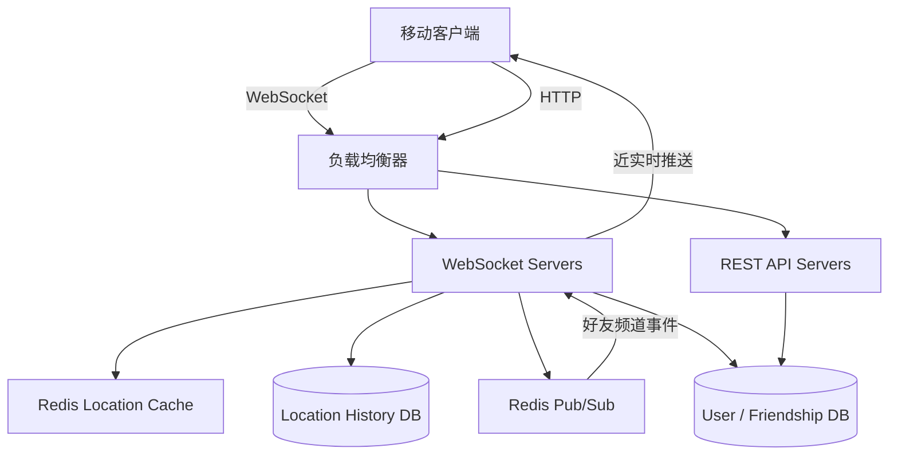
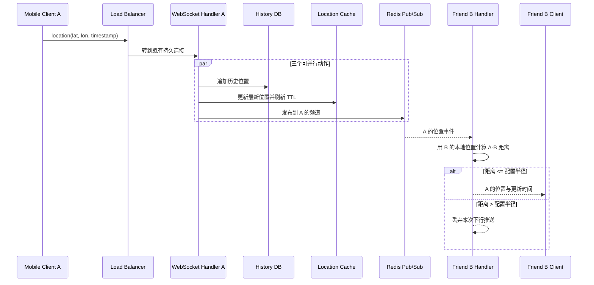
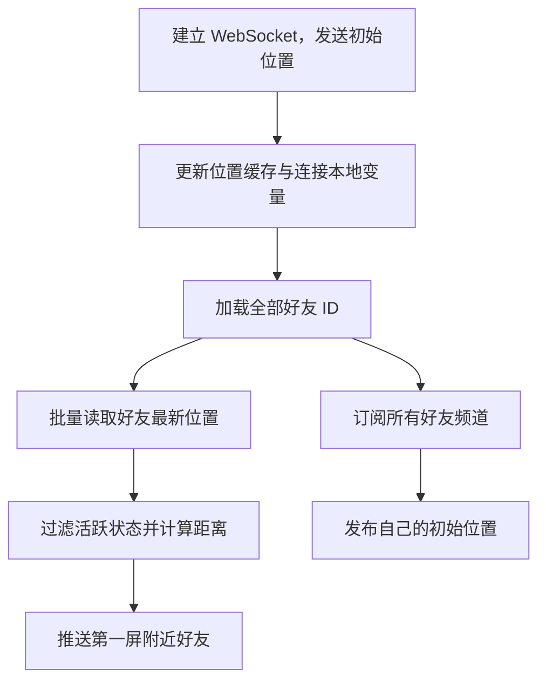
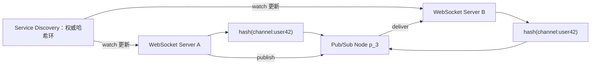
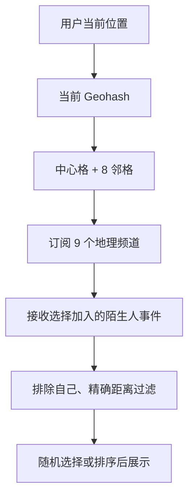
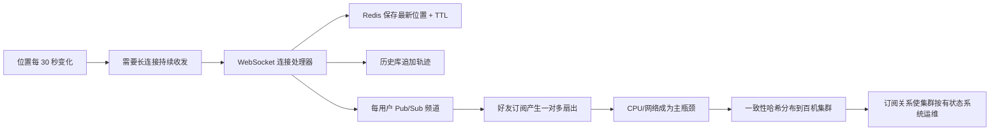
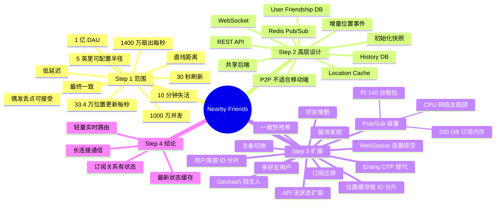

> 原书：Alex Xu、Sahn Lam，*System Design Interview: An Insider's Guide, Volume 2*（2022）
> 范围：Chapter 2: Nearby Friends（PDF 第 43～66 页）
> 目标：设计一个可扩展的移动端后端，让用户近实时看到一定半径内的好友、双方距离与位置更新时间。

## 0. 本章解决什么问题

“附近好友”表面上与第 1 章“邻近服务”相似：两者都根据经纬度判断目标是否位于某个半径内。但二者的数据性质完全不同：

| 维度 | 第 1 章：附近商户 | 第 2 章：附近好友 |
|---|---|---|
| 目标位置 | 商户地址基本静态 | 用户位置持续变化 |
| 写入频率 | 低，允许次日生效 | 每个活跃用户约 30 秒一次 |
| 核心操作 | 从空间索引查询附近对象 | 把一个用户的位置事件扇出给好友 |
| 通信方式 | 请求后返回一次结果 | 长连接持续双向收发 |
| 当前状态 | 可由稳定索引读取 | 必须维护在线用户最新位置 |
| 历史数据 | 不是核心 | 另行持久化供分析或机器学习 |
| 主要瓶颈 | 空间查询与对象读取 | 长连接、写入和一对多消息扇出 |

因此，本章不是重复设计一个 Geohash 搜索系统，而是在设计一个**动态位置事件分发系统**：

$$
\text{用户位置更新}
\rightarrow
\text{找到该用户的在线好友订阅者}
\rightarrow
\text{计算双方距离}
\rightarrow
\text{只向半径内好友推送}
$$

系统每秒收到约 33.4 万次原始位置更新，却要产生约 1400 万次订阅者推送。真正放大负载的不是坐标本身，而是社交关系图上的一对多扇出。


本章仍沿四步系统设计框架展开：

| 步骤 | 本章重点 |
|---|---|
| Step 1 | 明确“附近”、刷新频率、在线判定、规模与一致性要求 |
| Step 2 | 先设计消息流，再定义 WebSocket API 与数据模型 |
| Step 3 | 逐一解决 API、长连接、位置缓存、Pub/Sub 与运维瓶颈 |
| Step 4 | 总结动态位置从一个用户高效传到许多好友的方案 |

---

## 1. Step 1：理解问题并确定设计范围

Facebook 规模的完整后端非常复杂。作者没有立即挑选消息队列，而是先用澄清问题固定距离语义、用户规模、历史需求、失活规则与隐私范围。

## 1.1 澄清问题

### 1.1.1 多近才算“附近”

双方约定默认半径为 5 英里，并且这个值应可配置。

5 英里约为：

$$
5\times1.609344\approx8.05\text{ km}
$$

“可配置”意味着后端不能把阈值散落在代码中。它可以来自产品配置、实验参数或用户设置，并应在一次会话内保持明确语义。

### 1.1.2 使用直线距离还是实际出行距离

本章使用两点间直线地理距离。即使中间有河流、山脉或道路绕行，系统仍按球面最短距离判断。

这个澄清排除了路网图、地图匹配和路径规划。若产品要求“步行 10 分钟内的好友”，则必须引入道路或步行网络，算法与成本会完全改变。

### 1.1.3 用户规模

假设应用有 10 亿用户，其中 10%，即 1 亿日活用户使用附近好友功能。

原书进一步假设并发用户是日活的 10%：

$$
U_{concurrent}=10^8\times10\%=10^7
$$

也就是峰值附近约 1000 万人同时保持功能在线。

### 1.1.4 是否保存位置历史

需要。历史位置可用于机器学习等其他用途。

由此产生两种不同数据：

- **当前位置**：只关心每位活跃用户的最后一个坐标，服务在线功能；
- **位置历史**：保留时间序列，服务离线分析、机器学习或审计需求。

两者不能共用同一个简单缓存替代，因为生命周期、可靠性和访问模式不同。

### 1.1.5 好友多久不活跃后消失

若好友超过 10 分钟没有活动，不再显示其最后位置。

这是一个在线状态语义：

$$
\text{active}(u,t)=
\begin{cases}
1,&t-t_{last}(u)\leq600\text{ s}\\
0,&t-t_{last}(u)>600\text{ s}
\end{cases}
$$

系统用 Redis TTL 实现这条规则。每次位置更新刷新 TTL，过期后键自动删除。

### 1.1.6 是否考虑 GDPR、CCPA 等隐私法规

面试官为简化讨论把隐私排除在本章范围外。这只是题目边界，不代表现实系统可以忽略。

生产设计至少还需考虑：

- 用户主动选择加入与随时退出；
- 谁能看到位置，以及好友关系变化后的授权撤销；
- 精确坐标、历史轨迹与日志的访问控制和加密；
- 数据保留期、删除权和数据驻留；
- 防止通过高频位置推送跟踪敏感活动；
- 屏蔽、骚扰防护与未成年人保护。

## 1.2 功能需求

本章聚焦两个功能：

1. 移动端能看到附近好友；每条结果包含距离和最后更新时间；
2. 附近好友列表每隔几秒更新一次。

这里的“每隔几秒更新”不意味着每位客户端每几秒都上报。原书采用 30 秒位置上报间隔，但好友事件经过后端后应以较低额外延迟推送。

每页显示 20 位附近好友，用户可以继续加载更多。排序与分页不是本章主线，实际可按距离、更新时间或产品相关性排序。

## 1.3 非功能需求

### 1.3.1 低延迟

好友移动后，其他在线好友应尽快收到变化。端到端延迟包含：

$$
L_{e2e}=L_{uplink}+L_{route}+L_{fanout}+L_{distance}+L_{downlink}
$$

其中上报间隔带来的数据年龄是另一层延迟：即使处理链只用 100 ms，一个刚移动的用户也可能要等接近 30 秒才发送下一次位置。

### 1.3.2 可靠性

系统整体应可靠，但偶尔丢失单个位置点可以接受。原因是位置会周期性重发，下一次更新可以修复短暂缺口。

这允许使用不持久化消息的 Redis Pub/Sub，而不必为每条事件提供重放和至少一次交付。但“偶尔可丢”不等于可以长时间中断或持续丢失某一用户的更新。

### 1.3.3 最终一致性

位置存储不要求强一致，各副本相差几秒可以接受。附近好友是环境感知信息，不是余额扣款；为每个位置点执行跨节点同步共识会增加延迟和可用性成本，却无法消除 GPS 本身的误差。

仍需注意事件顺序。若较旧的位置晚到，客户端或服务端应按时间戳/序列号拒绝倒退更新：

$$
\text{accept}(e_{new})\iff
e_{new}.timestamp>e_{stored}.timestamp
$$

## 1.4 为什么刷新间隔设为 30 秒

人平均步行速度约 3～4 英里/小时。30 秒内移动距离为：

$$
d=v\times\frac{30}{3600}
$$

当 $v=3$ mph：

$$
d=3\times\frac{30}{3600}=0.025\text{ mile}\approx40.2\text{ m}
$$

当 $v=4$ mph：

$$
d=4\times\frac{30}{3600}=0.0333\text{ mile}\approx53.6\text{ m}
$$

相对 5 英里阈值，这个误差通常不显著。刷新越频繁，位置越新，但会线性增加：

- 手机定位和无线传输耗电；
- WebSocket 上行消息；
- Redis 写入；
- 历史库写入；
- Pub/Sub 扇出；
- 服务端距离计算。

所以 30 秒是新鲜度、电量和后端成本之间的折中，不是所有移动场景都适用。车辆高速移动或室内短距离功能可能需要不同策略，例如根据速度自适应刷新。

## 1.5 粗略估算

原书假设：

- 1 亿附近好友 DAU；
- 1000 万并发用户；
- 每 30 秒上报一次位置；
- 每位用户平均 400 位好友；
- 暂按全部好友都使用附近好友功能；
- 约 10% 好友同时在线且在附近。

### 1.5.1 原始位置更新 QPS

$$
Q_{location}=\frac{10{,}000{,}000}{30}
\approx333{,}333\text{ 次/秒}
$$

作者取整为约 334,000 QPS。

### 1.5.2 扇出后的推送速率

每个位置事件平均需要推给：

$$
F=400\times10\%=40\text{ 位好友}
$$

于是：

$$
Q_{push}=Q_{location}\times F
$$

$$
Q_{push}\approx334{,}000\times40
=13{,}360{,}000\text{ 次/秒}
\approx1400\text{ 万次/秒}
$$

这个乘法揭示了本章的主导成本：

$$
\boxed{Q_{push}=\frac{U_{concurrent}}{T_{refresh}}\times F_{avg}\times p_{eligible}}
$$

任一变量变化都会放大系统：刷新间隔减半，推送翻倍；好友数翻倍，扇出也近似翻倍。

### 1.5.3 估算的前提与局限

- 400 是平均好友数，真实分布可能长尾；
- 10% 把“在线且附近”合并成一个比例，实际与地区、时间和社交图有关；
- 1400 万是平均近似，不是峰值容量；
- Pub/Sub 实际先向在线订阅者广播，再由连接处理器计算距离，因而中间层推送量未必严格等于最终附近结果数；
- 连接初始化、重连和订阅迁移还会产生额外负载。

容量规划必须通过真实流量分布和压测校准，面试估算的作用是定位数量级和主瓶颈。

---

## 2. Step 2：提出高层设计并取得共识

本章与其他章节不同：作者先讨论高层设计，再讨论 API 和数据模型。原因是通信协议不是普通的单次 HTTP 请求响应。只有先确定服务器怎样向客户端主动推送，才能知道 API 应是 WebSocket 消息还是 REST 端点。

## 2.1 从 P2P 直觉到共享后端

### 2.1.1 理论上的点对点方案

最直接的想法是：每台手机与每位在线好友维持一条持久连接，好友之间直接交换位置。

若有 $n$ 个用户形成全连接，连接边数为：

$$
E=\frac{n(n-1)}{2}=O(n^2)
$$

即使实际只连接好友，移动端仍要维护数百条连接。问题包括：

- 蜂窝网络和 NAT 环境不稳定；
- 手机后台运行受操作系统限制；
- 持续保活耗电；
- 身份认证、离线状态与重连复杂；
- 难以统一执行权限、过滤、风控与审计；
- 发送方上行带宽随好友数增长。

因此 P2P 不适合本题，但它暴露了正确抽象：一个用户的位置要传给许多好友。

### 2.1.2 共享后端的职责

更可行的方案由后端承担中介：

1. 接收所有活跃用户的位置更新；
2. 找到应该接收该更新的在线好友；
3. 把事件路由到这些好友所在的 WebSocket 连接；
4. 计算双方距离，超过阈值则不向客户端发送；
5. 保存最新位置和历史位置。

共享后端把移动端的多连接问题变成：客户端只维持一条 WebSocket，后端承担大规模扇出与路由。

## 2.2 低规模高层设计

作者先给出一个满足功能但尚未解决全部规模问题的版本，再在 Step 3 逐个暴露瓶颈。



### 2.2.1 负载均衡器

负载均衡器位于 REST API 与 WebSocket 集群之前，分发两类流量：

- 短生命周期 HTTP 请求；
- 长生命周期 WebSocket 连接。

对 WebSocket 而言，建立连接后同一 TCP 连接会固定到某台服务器。负载均衡器不能在每条消息上随意改投其他实例。

### 2.2.2 REST API Servers

REST API 集群是无状态 HTTP 服务，处理辅助业务：

- 添加或删除好友；
- 更新用户资料；
- 认证等普通请求。

这些不是本章难点，所以不展开内部设计。

### 2.2.3 WebSocket Servers

每个客户端与某台 WebSocket 服务器保持一条双向持久连接。该集群负责：

- 接收客户端位置上报；
- 向客户端主动推送好友位置；
- 在连接处理器中保存本用户当前坐标；
- 订阅所有好友的 Pub/Sub 频道；
- 收到好友事件后计算距离；
- 初始化客户端的第一屏附近好友。

WebSocket 解决的是服务端主动推送与低开销双向通信。若使用短轮询，1000 万客户端频繁请求会产生大量空响应；长轮询虽减少部分空请求，但连接管理和双向上报仍不如 WebSocket 自然。

本章把“WebSocket connection”与“WebSocket connection handler”近似互换使用。严格说：

- connection 是网络连接；
- handler 是服务器上维护该连接状态并处理消息的执行实体。

### 2.2.4 Redis Location Cache

位置缓存保存每位活跃用户的最新位置：

$$
user\_id\rightarrow(latitude,longitude,timestamp)
$$

每次更新刷新 TTL，10 分钟无更新后键自动消失。它同时表达“最新位置”和“是否活跃”。其他支持高吞吐、TTL 和按用户键访问的 KV 存储也可以替代 Redis。

### 2.2.5 User Database

用户库保存：

- 用户资料；
- 好友关系。

附近好友只向已授权好友传播，所以社交图是路由逻辑的基础。数据库可用关系型或 NoSQL，具体取决于已有平台和访问模式。

### 2.2.6 Location History Database

历史库追加保存用户位置时间序列。它不直接服务当前附近好友列表，却承接需要持久化的历史数据，把在线低延迟状态与离线分析状态分离。

### 2.2.7 Redis Pub/Sub

Redis Pub/Sub 是轻量消息总线。设计为每位使用附近好友的用户创建一个逻辑频道：

```text
channel(user_id) = "location:" + user_id
```

当用户 $A$ 更新位置：

1. WebSocket 服务器把位置发布到 $A$ 的频道；
2. $A$ 的在线好友连接处理器订阅该频道；
3. Pub/Sub 向所有订阅处理器广播；
4. 每个接收处理器用本地保存的接收方位置计算距离；
5. 只有半径内事件才继续发到移动端。

这种模型把社交图扇出转成发布者频道上的订阅列表。频道创建很轻，且无订阅者时发布的消息会直接丢弃。

## 2.3 周期性位置更新的完整流程



按原书编号展开：

1. 移动客户端向负载均衡器发送位置；
2. 负载均衡器把消息送到持有该客户端连接的 WebSocket 服务器；
3. WebSocket 服务器把位置写入历史数据库；
4. 更新位置缓存、刷新 TTL，并把本用户位置保存到连接处理器变量；
5. 把新位置发布到本用户 Pub/Sub 频道；步骤 3～5 可并行；
6. Pub/Sub 广播给该频道全部订阅者，即发送者的在线好友连接处理器；
7. 接收方所在服务器计算发送者与接收方距离；
8. 若不超过阈值，将位置和更新时间推到接收方客户端，否则丢弃。

### 2.3.1 为什么在接收方连接处理器计算距离

接收方处理器已经保存自己的最新位置，因此只需要消息中的发送者位置即可计算距离。这避免发布者为所有朋友逐个读取朋友位置。

代价是 Pub/Sub 可能先把消息发给在线但不在附近的好友，之后才过滤。这样简化了路由，却增加中间扇出与距离计算。原书用“轻量频道 + 接收端过滤”换取架构简单。

### 2.3.2 三个并行写动作的语义

历史库写入、当前缓存更新和 Pub/Sub 发布可并行以降低关键路径延迟，但它们不是原子事务：

- 发布成功、历史写失败：好友看到事件，但历史缺一个点；
- 缓存成功、发布失败：初始化能读到新位置，在线好友错过一次推送；
- 发布成功、缓存失败：在线好友收到位置，新连接初始化可能暂时读不到。

本章允许偶发点丢失，因此可以接受这种松耦合。若需求改为每个位置点都必须持久化再投递，应引入持久日志、重试和幂等，延迟与复杂度都会增加。

## 2.4 具体扇出示例

原书假设：

- User 1 的好友是 User 2、User 3、User 4；
- User 5 的好友是 User 4、User 6。

因此：

- User 2、3、4 的连接处理器订阅 User 1 频道；
- User 4、6 的处理器订阅 User 5 频道；
- User 4 同时订阅两个频道。

User 1 更新位置时，事件先到 User 1 频道，再广播给 2、3、4；每个处理器独立计算与 User 1 的距离，满足半径才发送到各自客户端。

这个例子表明订阅关系与 WebSocket 服务器位置无关：User 2、3、4 可以连接到不同服务器，Redis Pub/Sub 负责跨服务器路由。

## 2.5 API 设计

高层消息流确定后，作者把接口分为 WebSocket 消息与普通 HTTP API。

### 2.5.1 周期性位置更新

客户端发送：

```json
{
  "type": "location_update",
  "latitude": 37.776720,
  "longitude": -122.416730,
  "timestamp": 1723248000000
}
```

响应：无业务响应。传输层可有必要的确认，但不要求每次返回一份业务对象。

### 2.5.2 客户端接收好友位置

服务器推送：

```json
{
  "type": "friend_location",
  "friend_id": "u_42",
  "latitude": 37.781000,
  "longitude": -122.411000,
  "timestamp": 1723248001000
}
```

客户端使用时间戳显示“多久前更新”，也可拒绝晚到的旧事件。

### 2.5.3 WebSocket 初始化

请求：客户端发送自己的初始经纬度和时间戳。
响应：服务器返回当前在线且在半径内的好友资料、位置和更新时间。

初始化解决“连接建立前已经存在的状态”，后续 Pub/Sub 只负责增量变化。没有初始化，客户端必须等每位好友下一次上报才会逐渐填满列表。

### 2.5.4 订阅新好友

WebSocket 服务器收到新好友 ID，订阅其频道，并在该好友活跃时返回其最新位置和时间戳。

### 2.5.5 取消订阅好友

WebSocket 服务器收到好友 ID，从其频道取消订阅；无需业务响应。

退出位置共享也可以沿用相同的订阅/取消订阅机制。

### 2.5.6 普通 HTTP 请求

添加/删除好友、修改资料、认证等继续由 REST API 服务处理。WebSocket 不应因为已经存在就吞并所有普通 CRUD 请求。

## 2.6 数据模型

### 2.6.1 位置缓存

| Key | Value |
|---|---|
| `user_id` | `{latitude, longitude, timestamp}` |

Redis 合适的原因：

- 只需每用户一个最新位置；
- 读写延迟低；
- 支持 TTL 自动清除失活用户；
- 当前位置不要求持久耐久；
- 故障后可以用空实例重建，等待后续位置流重新填充。

若 Redis 故障并从空实例恢复，用户可能漏掉一两个 30 秒周期的好友位置。需求允许这种降级。Step 3 会用主备复制进一步缩短影响。

### 2.6.2 位置历史数据库

基本记录：

| 字段 | 含义 |
|---|---|
| `user_id` | 用户 ID |
| `latitude` | 纬度 |
| `longitude` | 经度 |
| `timestamp` | 采样时间 |

历史库承受约 33.4 万次追加/秒，适合水平扩展、写吞吐高的存储，例如 Cassandra。关系型数据库也可使用，但数据不能放入单实例时要按 `user_id` 分片。

按用户 ID 分片的好处：

- 写入较均匀；
- 查询某个用户的轨迹只访问一个分片；
- 运维规则简单。

常见主键可以围绕 `(user_id, time_bucket, timestamp)` 设计，时间桶避免单个活跃用户的分区无限增长。历史保留期和降采样策略虽未在原书展开，却会直接决定容量。

---

## 3. Step 3：深入设计与规模化

Step 2 的方案在较小规模可工作。Step 3 的方法是逐个组件问：在 1000 万长连接、33.4 万原始更新和 1400 万扇出/秒下，哪里先坏？

## 3.1 REST API Servers

API 服务器无状态，可以根据 CPU、请求负载或 I/O 自动扩缩容。请求不绑定某台实例，新增和移除节点风险较低。

作者没有花时间重复通用的无状态扩展知识，而把讨论预算留给长连接与 Pub/Sub。这体现了面试中的重点管理：成熟常规部分点到为止，深入题目特有瓶颈。

## 3.2 WebSocket Servers

### 3.2.1 为什么它是有状态服务

WebSocket 服务器持有：

- 活跃 TCP/WebSocket 连接；
- 每个连接的用户身份；
- 本用户最新位置变量；
- 好友频道订阅列表；
- 向客户端发送消息所需的连接句柄。

因此一台服务器不能像无状态 API 节点那样直接终止。实例消失会同时断开许多用户，并引发重连和重新订阅风暴。

### 3.2.2 缩容与发布：连接排空

移除服务器时：

1. 在负载均衡器把节点标记为 `draining`；
2. 不再向它建立新 WebSocket；
3. 允许既有连接自然关闭或等待合理超时；
4. 剩余连接由客户端重连迁移；
5. 连接清空后再终止节点。

发布新版本也需要同样谨慎。优秀的负载均衡器应支持健康检查、长连接排空和有界终止时间。

### 3.2.3 连接容量不是只看 CPU

WebSocket 节点容量至少受以下因素限制：

- 每连接内存；
- 文件描述符和端口；
- TLS 与心跳 CPU；
- 网络带宽；
- 每秒入站位置事件；
- Pub/Sub 回调和距离计算；
- 下行好友推送。

因此扩容指标不应只有平均 CPU，还应监控连接数、消息率、事件循环延迟、发送缓冲积压与重连率。

## 3.3 客户端初始化

移动端启动后与某个 WebSocket 实例建立长连接，并发送初始位置。连接处理器执行七步：

1. 更新用户在位置缓存中的位置；
2. 把位置保存到当前连接处理器变量，供后续距离计算；
3. 从用户数据库读取全部好友；
4. 批量从位置缓存读取所有好友位置；因 TTL 与失活阈值一致，不活跃好友不会有键；
5. 对每个返回位置计算距离，半径内好友的资料、位置和更新时间发送给客户端；
6. 订阅每位好友的 Pub/Sub 频道，包括当前活跃和不活跃好友；
7. 把自己的当前位置发布到自己的频道，让在线好友收到更新。



### 3.3.1 为什么要批量读取

若平均 400 位好友，逐个请求位置缓存会产生 400 次网络往返。批量 `MGET` 或按缓存分片分组的批量请求，可把往返次数降低到涉及的分片数。

缓存分片后不能假设一次全局 `MGET` 完成所有读取。WebSocket 服务应：

1. 按 `hash(friend_id)` 把好友分组；
2. 对各 Redis 分片并行批量读取；
3. 合并结果；
4. 设置超时，允许部分结果。

### 3.3.2 为什么订阅离线好友频道

频道创建和空闲订阅的 CPU/I/O 成本很低。提前订阅所有好友后，好友上线并开始发布时，无需额外协调一次“现在去订阅”的事件。

收益：

- 上下线状态机更简单；
- 避免竞态窗口；
- 好友一上线即可接收；
- CPU/I/O 只在频道有消息时消耗。

代价是保留更多订阅关系，占用内存。作者明确选择“多用内存，减少控制面复杂度”。

### 3.3.3 初始化风暴

原书给出流程，但其规模含义值得指出。若网络波动导致大量用户同时重连，每个连接都要：

- 查好友图；
- 批量查位置；
- 建立数百订阅；
- 发布自己的位置。

这会形成重连风暴。生产中常使用指数退避与随机抖动、分批订阅、连接恢复令牌、限速和过载保护。

## 3.4 User Database

用户资料和好友关系在 10 亿用户规模下不能依赖单个关系数据库实例。作者建议按用户 ID 水平分片。

现实大公司通常由专门团队提供用户/社交图内部 API。WebSocket 服务通过 API 而不是直接查询数据库。对本章功能而言两者输出相同，但服务化可以封装：

- 分片路由；
- 权限与屏蔽规则；
- 好友关系一致性；
- 缓存和限流；
- 数据模型演进。

友情是双向关系，不是单向关注者模型。这一点会影响热点分析：本章假设好友数有硬上限，而不是名人拥有数百万订阅者。

## 3.5 Location Cache

### 3.5.1 容量估算

峰值 1000 万活跃用户，每条最新位置不超过 100 bytes：

$$
M_{location}=10{,}000{,}000\times100
=1{,}000{,}000{,}000\text{ bytes}
\approx1\text{ GB}
$$

即使算上 Redis 对象头、键、复制与碎片，容量仍可由少量现代服务器承载。TTL 又把最大活跃键数限制在最近 10 分钟有更新的用户范围内。

### 3.5.2 真正瓶颈是写吞吐

单台 Redis 若保存全部位置，要处理约 334,000 次更新/秒，可能超过可靠范围。数据能放进内存，不代表单机 CPU、网络和每秒操作数足够。

因为每个用户的位置相互独立，可按用户 ID 分片：

$$
\mathrm{shard}(u)=h(u.user\_id)\bmod N
$$

若均匀分到 $N$ 个分片，每片平均写入约：

$$
Q_{shard}=\frac{334{,}000}{N}
$$

例如 10 个分片约 33,400 写/秒/片，再根据峰值、复制和压测保留余量。

### 3.5.3 高可用

每个位置分片可配置一个备用副本。主节点故障时快速提升副本，减少空缓存重建造成的一两个更新周期缺失。

由于位置数据允许最终一致，复制可以异步。切换时仍可能丢掉最后少量更新，但后续周期会修复。

### 3.5.4 TTL 的语义边界

TTL 表示“最近收到位置更新”，它只是活跃状态的近似：

- 客户端可能在线但定位权限关闭；
- 网络中断会让活跃用户被判失活；
- 应用关闭后旧键最多保留 10 分钟；
- 服务器时间和客户端时间不能混用决定 TTL。

TTL 应由服务器在收到事件时刷新，事件中的客户端时间戳用于位置新旧排序，两者职责不同。

## 3.6 Redis Pub/Sub：为什么适合本题

Pub/Sub 在本章充当路由层，不是持久事件日志。

### 3.6.1 每用户一个频道

每位使用功能的用户拥有唯一频道。连接初始化时，每个用户订阅所有好友频道。

设计选择：

- 发布者不需要知道好友连接在哪台服务器；
- 订阅关系由 Pub/Sub 维护；
- 无订阅者时消息直接丢弃，几乎不产生额外工作；
- 离线好友频道没有发布时，空闲订阅只占少量内存。

### 3.6.2 交付语义

Redis Pub/Sub 消息不保存到内存队列或磁盘日志供以后重放：

- 在线订阅者即时收到；
- 没有订阅者则丢弃；
- 订阅迁移窗口可能漏消息；
- 消费者故障后不能回放错过事件。

这近似“至多一次、实时尽力而为”。本题位置每 30 秒刷新且允许偶发丢点，因此语义匹配。

若业务改为“每个事件必须处理”“离线后必须补发”，Redis Pub/Sub 就不合适，应考虑持久消息日志、消费位点、重试和幂等。

## 3.7 需要多少 Pub/Sub 服务器

作者分别从内存与推送能力估算，结论是 CPU/网络扇出而非频道内存主导机器数。

### 3.7.1 内存估算

假设：

- 10 亿用户的 10% 使用功能，即 1 亿用户频道；
- 每个频道平均有 100 个使用该功能的好友订阅者；
- 每个订阅者在内部哈希表和链表中约占 20 bytes。

总订阅内存：

$$
M_{sub}=100{,}000{,}000\times100\times20
$$

$$
M_{sub}=200{,}000{,}000{,}000\text{ bytes}
\approx200\text{ GB}
$$

若每台服务器有 100 GB 可用内存，从纯内存看约 2 台即可。

这只是理想化下界，未计频道名、哈希表扩容、连接结构、进程开销、复制、故障余量和内存碎片。它的目的不是主张只部署两台，而是证明内存不是最终瓶颈。

### 3.7.2 CPU/网络推送估算

系统约有 1400 万次订阅者推送/秒。作者保守假设一台带千兆网络的 Redis 服务器处理 100,000 次订阅者推送/秒：

$$
N_{pubsub}=\frac{14{,}000{,}000}{100{,}000}=140
$$

因此需要数量级约 140 台服务器。

这个数字必须通过真实基准测试校准，因为性能取决于：

- 消息大小；
- 每频道订阅者数；
- 网络带宽；
- Redis 版本和硬件；
- TLS 与跨机架通信；
- WebSocket 消费速度。

关键结论不依赖精确机器数：

$$
\boxed{N_{required}=\max(N_{memory},N_{cpu},N_{network},N_{availability})}
$$

本题中 $N_{cpu/network}\gg N_{memory}$，所以必须建设分布式 Pub/Sub 集群。

### 3.7.3 两组好友数假设不要混淆

原书扇出估算使用“400 位好友 × 10% 在线且附近 = 40 次最终附近推送”；Pub/Sub 内存估算使用“每频道平均 100 个使用功能的好友订阅者”。

这两组数面向不同集合：

- 40 是一次位置更新后最终符合在线/附近条件的粗略接收数；
- 100 是容量估算中的平均频道订阅数，包含附近与不附近的订阅者。

书中的数字都是粗略假设，未给出统一概率模型。真实设计应从社交图、功能启用率、在线率和地域共现数据分别测量，不能把 40 与 100 当成严格推导出的同一指标。

## 3.8 分布式 Redis Pub/Sub 集群

数百台服务器带来新问题：某个用户频道究竟在哪台 Pub/Sub 节点？发布方和订阅方必须得到同一个答案。

### 3.8.1 服务发现

作者引入 etcd 或 ZooKeeper 一类服务发现/配置组件，提供：

1. 保存当前 Pub/Sub 节点列表或哈希环；
2. 提供 UI/API 修改配置；
3. 让 WebSocket 服务器订阅配置变化。

示例：

```text
key:   /config/pub_sub_ring
value: ["p_1", "p_2", "p_3", "p_4"]
```

服务发现是权威配置源。WebSocket 服务器把哈希环缓存到本地内存，以避免每次发布都远程查配置，并通过 watch 机制保持更新。

### 3.8.2 一致性哈希路由

把 Pub/Sub 节点和频道名都哈希到同一个环上。频道由顺时针方向遇到的第一个节点负责：

$$
owner(c)=\operatorname{successor}_{ring}(h(c))
$$

发布过程：

1. WebSocket 服务器用本地哈希环计算用户频道所属节点；
2. 把位置事件发布到该节点的用户频道。

订阅过程使用完全相同的函数。只要双方哈希环版本一致，就会连接同一个 Pub/Sub 节点。



### 3.8.3 为什么不用简单取模

简单取模：

$$
node=h(channel)\bmod N
$$

当节点数从 $N$ 变为 $N+1$ 时，大量频道映射变化，几乎所有订阅都可能迁移。一致性哈希只移动环上受新增/删除节点影响的一段键空间。

理想均匀情况下，向 $N$ 个节点增加 1 个节点，迁移键比例约为：

$$
\frac{1}{N+1}
$$

虚拟节点可以改善负载均衡与迁移粒度。原书未深入虚拟节点，但实际一致性哈希通常需要它。

## 3.9 Pub/Sub 集群为何应按有状态集群运维

这是本章最重要、也最容易误判的结论。

### 3.9.1 消息本身是短暂的

Pub/Sub 消息不持久化，发送后立即消失；无订阅者时直接丢弃。从消息数据角度看，它没有需要迁移的历史状态。

### 3.9.2 订阅关系是状态

每个频道的订阅者列表保存在具体 Pub/Sub 节点。频道迁移后：

- 旧节点上的订阅不会自动出现在新节点；
- 每个 WebSocket 连接处理器必须知道环已变化；
- 它要取消旧订阅并在新节点重新订阅；
- 迁移窗口可能漏掉位置事件。

所以：

$$
\text{瞬时消息无状态}\not\Rightarrow\text{Pub/Sub 集群无状态}
$$

控制面上的订阅拓扑让集群具有状态，应像存储集群一样谨慎扩缩容，而不是每天随流量频繁伸缩。

### 3.9.3 容量策略

作者建议为每日峰值预留充足余量，避免频繁调整节点。扩缩容的风险包括：

- 大量频道重新映射；
- WebSocket 集群收到配置变更后发起海量重订阅；
- 重订阅增加 CPU 和网络尖峰；
- 短暂窗口内可能丢位置事件。

本题允许偶发丢点，但仍应把迁移安排在低峰并监控影响。

## 3.10 Pub/Sub 扩容与缩容流程

原书流程：

1. 确定新哈希环大小；扩容时先准备新服务器；
2. 更新服务发现中的哈希环配置；
3. WebSocket 服务器收到变更；
4. 各连接处理器重新计算自己订阅频道的归属；
5. 对迁移频道在新节点重订阅；
6. 监控 WebSocket 集群 CPU，预期会出现尖峰。

例如：

```text
old: ["p_1", "p_2", "p_3", "p_4"]
new: ["p_1", "p_2", "p_3", "p_4", "p_5", "p_6"]
```

更稳健的迁移可使用版本化配置和短暂双订阅：

1. 新节点就绪；
2. 连接处理器先订阅新归属；
3. 发布方切换到新环；
4. 等待传播窗口；
5. 再取消旧订阅。

双订阅降低漏消息，但可能造成重复事件；客户端要按 `(friend_id, timestamp/sequence)` 去重。这个方案是对原书运维逻辑的自然延伸。

## 3.11 Pub/Sub 节点故障替换

单节点替换比改变整个环规模风险更低，因为只处理故障节点负责的频道。

原书流程：

1. 监控发现 `p_1` 故障并告警；
2. 值班人员或自动化准备 `p_1_new`；
3. 在服务发现中把 `p_1` 替换为 `p_1_new`；
4. WebSocket 服务器收到配置通知；
5. 每个处理器检查自身订阅列表；
6. 属于该区间的频道在新节点重新订阅。

```text
old: ["p_1",     "p_2", "p_3", "p_4"]
new: ["p_1_new", "p_2", "p_3", "p_4"]
```

处理器必须保留自己订阅的频道列表，否则无法在拓扑变化时恢复关系。这里再次说明订阅关系才是关键状态。

## 3.12 添加、删除好友与位置共享开关

好友关系发生变化时，已有 WebSocket 连接的订阅集合必须同步变化。

### 添加好友

1. 大应用中的好友模块触发客户端回调；
2. 客户端通过 WebSocket 通知连接处理器；
3. 处理器订阅新好友频道；
4. 若新好友当前活跃，从位置缓存取最新坐标；
5. 计算距离并按需立即返回。

### 删除好友

1. 客户端收到好友删除回调；
2. 通知 WebSocket 处理器；
3. 处理器取消该好友频道订阅；
4. 客户端移除其位置。

### 开启或关闭位置共享

可复用同一套订阅/取消订阅消息。

生产系统不能只信客户端回调，因为恶意或离线客户端可能不执行。服务端应由权威好友/权限事件校验订阅资格，并在断线重连时从权威关系重新初始化。

## 3.13 好友很多的用户

作者假设好友数有硬上限，例如 Facebook 上限 5000，且友情双向。它不是名人拥有数百万粉丝的单向关注模型。

为什么一般不会形成单点热点：

- 数千好友的 WebSocket 连接分散在许多服务器；
- 距离计算和客户端推送由各接收方服务器分担；
- 这些“大户”频道通过哈希分散到 100 多台 Pub/Sub 节点；
- 单个大户只会额外增加其频道所在节点负载。

仍要监控频道级扇出分布。如果好友上限取消或模型改为单向关注，就会出现名人热点，需要频道分片、树形扇出或专用广播系统。

## 3.14 附加功能：附近的随机陌生人

初始需求只看好友。如果要显示已选择公开位置的附近陌生人，社交图频道就不够，因为双方没有好友订阅关系。

作者复用第 1 章 Geohash，为每个空间网格创建 Pub/Sub 频道：

$$
channel_{geo}=\text{"geo:"}+geohash(location)
$$

### 3.14.1 发布与订阅

1. 用户更新位置时，连接处理器计算当前 Geohash；
2. 把事件发布到该网格频道；
3. 网格内选择加入的用户订阅同一频道；
4. 订阅者收到陌生人位置后排除自己，并计算精确距离。

### 3.14.2 边界问题

用户靠近网格边缘时，附近的人可能位于相邻 Geohash。每个客户端应订阅：

- 当前网格；
- 上下左右四个邻格；
- 四个对角邻格。

共 9 个频道。Geohash 只生成候选，最终仍要计算真实距离。



### 3.14.3 用户跨网格移动

原书重点讲 9 格订阅。完整实现还应在 Geohash 变化时：

1. 计算新旧 9 格集合差；
2. 先订阅新增频道；
3. 再取消离开的频道；
4. 对短暂重复消息去重。

“随机陌生人”还必须严格执行用户授权、可见性、屏蔽和反滥用规则，风险明显高于好友共享。

## 3.15 Redis Pub/Sub 的替代方案：Erlang/OTP

作者认为 Erlang 生态在技术上可能比 Redis Pub/Sub 更适合该问题，但团队人才与技术栈也是选型约束。

这里的 Erlang 生态包括：

- Erlang 或 Elixir 语言；
- BEAM 虚拟机；
- OTP 运行库与设计模式。

### 3.15.1 为什么合适

BEAM 的轻量进程：

- 创建成本远低于操作系统进程；
- 最小进程约数百 bytes，原书给出约 300 bytes；
- 单机可承载数百万轻量进程；
- 空闲进程几乎不消耗 CPU；
- 消息传递和进程监督是平台原生能力；
- 跨 Erlang 节点分布和故障恢复工具成熟。

因此可以把 1000 万活跃用户分别建模为轻量进程：

$$
user\_id\longleftrightarrow Erlang\ process
$$

每个用户进程：

- 接收其 WebSocket 上报的位置；
- 订阅好友进程的更新；
- 向订阅自己的好友进程传播位置。

这样 WebSocket 服务和 Redis Pub/Sub 路由层可合并成分布式 Erlang 应用。

### 3.15.2 内存直觉

若只按原书最小 300 bytes 估算 1000 万用户进程：

$$
10{,}000{,}000\times300\text{ bytes}=3\text{ GB}
$$

真实进程还要保存状态、邮箱、堆和订阅关系，远高于 3 GB，但这个数量级说明“每用户一个执行实体”并非不可想象。

### 3.15.3 局限

- Erlang/OTP 人才更少；
- 团队缺少经验时，生产调试和运维风险可能抵消技术收益；
- 分布式进程注册、跨节点消息、邮箱积压和分区恢复仍需设计；
- 技术优雅不等于组织可持续。

作者的通用判断是：**架构选型不仅由理论性能决定，也由团队能力和招聘市场决定。**

---

## 4. 位置计算与事件处理的可运行示例

原书把距离计算放在接收方 WebSocket 处理器。本例同时演示：

- Haversine 直线距离；
- 5 英里阈值；
- 10 分钟失活；
- 丢弃乱序旧位置。

```python
from dataclasses import dataclass
from math import atan2, cos, radians, sin, sqrt

EARTH_RADIUS_MILES = 3_958.8
NEARBY_RADIUS_MILES = 5.0
INACTIVE_AFTER_SECONDS = 10 * 60

@dataclass(frozen=True)
class Location:
    latitude: float
    longitude: float
    timestamp: int

def distance_miles(first: Location, second: Location) -> float:
    first_latitude = radians(first.latitude)
    second_latitude = radians(second.latitude)
    latitude_delta = radians(second.latitude - first.latitude)
    longitude_delta = radians(second.longitude - first.longitude)

    haversine = (
        sin(latitude_delta / 2) ** 2
        + cos(first_latitude)
        * cos(second_latitude)
        * sin(longitude_delta / 2) ** 2
    )
    central_angle = 2 * atan2(sqrt(haversine), sqrt(1 - haversine))
    return EARTH_RADIUS_MILES * central_angle

def accept_newer(current: Location | None, incoming: Location) -> bool:
    return current is None or incoming.timestamp > current.timestamp

def should_push(
    sender: Location,
    receiver: Location,
    server_time: int,
    radius_miles: float = NEARBY_RADIUS_MILES,
) -> bool:
    if server_time - sender.timestamp > INACTIVE_AFTER_SECONDS:
        return False
    if server_time - receiver.timestamp > INACTIVE_AFTER_SECONDS:
        return False
    return distance_miles(sender, receiver) <= radius_miles

if __name__ == "__main__":
    now = 1_700_000_000
    user = Location(37.776720, -122.416730, now)
    nearby_friend = Location(37.786000, -122.410000, now - 5)
    far_friend = Location(37.900000, -122.500000, now - 5)

    print(round(distance_miles(user, nearby_friend), 2))
    print(should_push(user, nearby_friend, now))
    print(should_push(user, far_friend, now))
```

代码与架构的对应关系：

- `Location.timestamp` 对应位置缓存和 WebSocket 消息中的更新时间；
- `accept_newer` 防止最终一致与网络抖动导致位置倒退；
- `INACTIVE_AFTER_SECONDS` 对应 Redis 10 分钟 TTL；
- `should_push` 对应订阅处理器收到好友频道消息后的过滤；
- `distance_miles` 只对好友集合计算，而不是对 10 亿用户做全局空间扫描。

Haversine 把地球近似为球面，5 英里尺度足够。它计算的是直线大圆距离，不含道路、桥梁和交通时间。

---

## 5. Step 4：收束与作者结论

作者把本章的概念目标概括为：高效地把一个用户的位置更新传给其好友。

三个核心组件分别承担不同职责：

- **WebSocket**：客户端与服务器的近实时双向通信；
- **Redis Location Cache**：快速读写活跃用户最新位置，并用 TTL 表示失活；
- **Redis Pub/Sub**：把一个用户的位置事件路由到其在线好友连接处理器。

本章先构造低规模方案，再随规模增长逐一解决：

- 无状态 REST API 扩容；
- 有状态 WebSocket 连接排空；
- 用户和历史数据分片；
- 最新位置缓存按用户分片与主备；
- Pub/Sub 的内存与 CPU/网络容量；
- 一致性哈希、服务发现与订阅迁移；
- 好友增删、多好友用户和附近陌生人；
- Erlang/OTP 替代路由架构。

完整因果链如下：



---

## 6. 容易混淆的概念与常见误区

### 6.1 附近好友不是静态邻近搜索

商户索引可以按天更新，好友位置每 30 秒变化。本章核心是事件分发，而不是从稳定空间索引执行一次查询。

### 6.2 好友频道不是 Geohash 频道

- 好友功能按 `user_id` 建频道，路由由社交关系决定；
- 附近陌生人按 Geohash 建频道，路由由地理网格决定。

两者都用 Pub/Sub，但索引维度和权限边界完全不同。

### 6.3 WebSocket 服务器不是无状态 API 服务器

它持有连接、本地位置、订阅列表和发送句柄。缩容前必须排空，故障会引发重连与重订阅。

### 6.4 Pub/Sub 消息不持久，不等于集群无状态

消息发完即失效，但频道订阅关系驻留在具体节点。节点迁移必须协调所有订阅者，所以集群有运维状态。

### 6.5 Redis Location Cache 与 Location History DB 不可互换

- 缓存只保存每用户最后位置，可丢失并重建；
- 历史库保存长期时间序列，需要耐久与水平写扩展。

把全部历史写 Redis 会丢失耐久性并让内存无限增长；用历史数据库承担每次在线读取又会增加延迟和成本。

### 6.6 TTL 不等于精确在线状态

TTL 表示服务器最近是否收到位置，不知道应用是否仍在前台、用户是否关闭定位或网络是否中断。它是符合本题需求的近似活跃判定。

### 6.7 客户端时间戳不能直接决定 TTL

客户端时钟可能漂移或被修改。服务器接收时间用于 TTL；客户端采样时间或单调序列用于判断事件新旧。

### 6.8 最终一致性不等于接受位置倒退

副本延迟和消息重排可以接受几秒差异，但旧坐标晚到时应按版本拒绝，避免地图上的好友突然倒退。

### 6.9 偶尔丢点不等于无需监控

单个更新丢失会被下一周期修复；持续丢失、某个分片全丢或重订阅长期失败仍是故障。应监控事件年龄、推送成功率、订阅恢复时间与分片缺口。

### 6.10 位置缓存能放单机不等于单机足够

约 1 GB 原始位置数据很小，但 33.4 万写/秒可能超过单机吞吐。容量与操作速率必须分别估算。

### 6.11 Pub/Sub 内存够不等于两台服务器够

200 GB 理论订阅内存只需约两台 100 GB 服务器，而扇出能力估算需要约 140 台。机器数取各资源约束的最大值。

### 6.12 “订阅所有好友”不等于向所有好友客户端推送

订阅者处理器先收到事件，再根据距离过滤。在线但不在 5 英里内的好友不会收到客户端下行消息，但中间 Pub/Sub 和距离计算仍有成本。

### 6.13 初始化快照与增量事件缺一不可

- 只用缓存快照：列表不会持续更新；
- 只用 Pub/Sub：连接建立前的当前状态缺失，必须等好友下一次更新。

初始化读取建立基线，Pub/Sub 负责后续增量。

### 6.14 P2P 减少后端不等于更可行

它把连接、耗电、NAT、权限和可靠性问题转嫁给移动端，并使每用户连接数随好友数增长。

### 6.15 Redis Pub/Sub 不是持久消息队列

它没有离线积压、消费位点和重放。其语义之所以可接受，是因为位置周期性覆盖、允许偶发丢失。

### 6.16 一致性哈希只解决路由和迁移范围

它不会自动复制订阅关系、重建频道或防止迁移窗口漏消息。服务发现、配置 watch 和重订阅协议仍然必需。

### 6.17 替换节点与改变集群大小的风险不同

原位替换只影响故障节点的频道；增删节点改变环分区，会迁移更多频道并触发大规模重订阅。

### 6.18 双向好友模型不能直接套到粉丝模型

好友数有上限，单频道扇出可控；名人粉丝可达数百万，需要热点频道拆分、分层广播或其他专用设计。

### 6.19 5 英里直线距离不是 5 英里可达距离

河流、道路和交通都会改变实际出行距离。本章明确选择直线距离以控制范围。

### 6.20 30 秒刷新不是普适常数

它针对步行速度和 5 英里尺度。高速车辆、室内短距离或低电量场景应按速度、前后台状态与电量自适应。

### 6.21 Geohash 相同不代表确实在附近

地理频道只做候选路由。跨边界要订阅 9 格，收到后仍需 Haversine 精确过滤。

### 6.22 原书暂不讨论隐私不代表系统可忽略隐私

附近好友涉及持续共享精确位置和历史轨迹，生产系统必须把授权、撤销、屏蔽、保留期和访问审计放在核心设计中。

---

## 7. 本章知识结构



## 8. 核心结论

1. **附近好友的本质是动态位置事件在社交图上的一对多分发。** 它与静态商户空间查询的负载模型不同。
2. **刷新周期是产品体验、电量与后端成本的共同变量。** 30 秒适合步行与 5 英里尺度，但不是固定真理。
3. **WebSocket 让每个移动端只维持一条双向连接。** 后端集中处理身份、在线状态、扇出和距离过滤。
4. **初始化快照与实时增量必须结合。** 位置缓存提供当前基线，Pub/Sub 提供后续变化。
5. **当前位置与历史位置必须分离。** Redis 保存可重建最新状态，历史数据库承载耐久高写入时间序列。
6. **TTL 用非常简单的机制实现失活淘汰。** 每次更新续期，10 分钟无更新自动消失。
7. **负载主要来自扇出放大。** 33.4 万原始位置事件经好友关系放大到约 1400 万订阅者推送/秒。
8. **容量与吞吐要分开估算。** 位置和订阅数据内存可控，CPU 与网络却要求分片和百机级路由集群。
9. **每用户一个轻量频道简化了好友上下线。** 提前订阅离线好友，用内存换掉复杂订阅状态机。
10. **Redis Pub/Sub 适合允许偶发丢点的实时场景。** 它不是需要重放和可靠交付的持久队列。
11. **消息短暂不代表系统无状态。** 订阅者列表需要迁移恢复，因此 Pub/Sub 集群应按有状态系统谨慎扩缩容。
12. **一致性哈希统一发布和订阅路由。** 服务发现保存权威环，WebSocket 节点本地缓存并监听更新。
13. **有状态扩缩容的难点是协调，而不是启动机器。** WebSocket 要排空连接，Pub/Sub 要重建订阅。
14. **好友上限使热点可控。** 若改成粉丝模型，原方案的单用户频道可能成为超级热点。
15. **团队能力也是架构约束。** Erlang/OTP 技术上非常适合海量轻量进程与消息传递，但人才和运维经验决定能否采用。

## 9. 解决动态位置分发问题的一般思路

### 第一步：确定位置语义

明确半径、距离类型、更新频率、失活阈值、是否保存历史、是否允许丢点，以及谁有权看到位置。

### 第二步：估算原始事件与扇出事件

不要只算位置上报 QPS。使用：

$$
Q_{input}=\frac{U_{concurrent}}{T_{refresh}}
$$

$$
Q_{fanout}=Q_{input}\times F_{average}\times p_{eligible}
$$

社交关系或订阅关系往往才是系统的放大器。

### 第三步：分离三种状态

- 连接状态：WebSocket 处理器；
- 当前最新位置：带 TTL 的 KV 缓存；
- 历史位置：可水平扩展的持久数据库。

不同生命周期的数据不要强行放在同一系统。

### 第四步：先建立基线，再传播增量

连接初始化批量读取好友当前状态；建立后通过 Pub/Sub 接收增量。这个“snapshot + stream”模式也适用于行情、协作编辑和在线状态系统。

### 第五步：选择与可靠性要求匹配的消息语义

- 周期覆盖、偶发丢失可接受：轻量 Pub/Sub；
- 必须处理、需要重放：持久日志/队列；
- 业务效果不能重复：增加幂等键、去重和事务边界。

不要先选消息产品，再反向解释语义。

### 第六步：按独立键分片

最新位置按 `user_id` 分片，用户频道按 `user_id/channel_name` 一致性哈希。发布者和订阅者必须使用同一版本路由规则。

### 第七步：识别隐藏状态

检查网络连接、订阅列表、本地缓存的哈希环和处理器内变量。即使业务消息不持久，这些控制面状态也会让节点迁移需要协调。

### 第八步：把重连与迁移当成一等流量

正常稳态 QPS 之外，还要设计：

- 节点故障后的批量重连；
- 哈希环变化后的重订阅；
- 缓存主备切换；
- 网络恢复后的初始化风暴；
- 事件重复、漏失与乱序。

### 第九步：根据关系类型判断热点

双向且有上限的好友图可按用户频道分散；单向无上限的粉丝图需要专门处理超级节点。

### 第十步：端到端验证

最终回到需求逐项检查：

- 好友位置是否在几个更新周期内到达；
- 失活用户是否在 10 分钟后消失；
- 旧事件是否不会覆盖新位置；
- 单次丢点是否能由下一周期恢复；
- 节点故障时连接和订阅能否重建；
- 用户撤销权限后是否停止共享并清除历史；
- 峰值扇出、重连风暴和大频道是否仍有余量。

本章可压缩为一条通用设计链：

$$
\boxed{
\text{动态位置采样}
\rightarrow
\text{长连接接入}
\rightarrow
\text{最新状态与历史分离}
\rightarrow
\text{按关系订阅扇出}
\rightarrow
\text{接收端距离过滤}
\rightarrow
\text{按用户分片}
\rightarrow
\text{有状态地管理连接与订阅迁移}
}
$$

本章最值得迁移的方法不是“使用 Redis Pub/Sub”这一产品答案，而是：**先识别动态事件如何被关系图放大，再让时效、可靠性、状态生命周期和运维协调分别决定长连接、缓存、历史库、消息语义与分片方式。**
