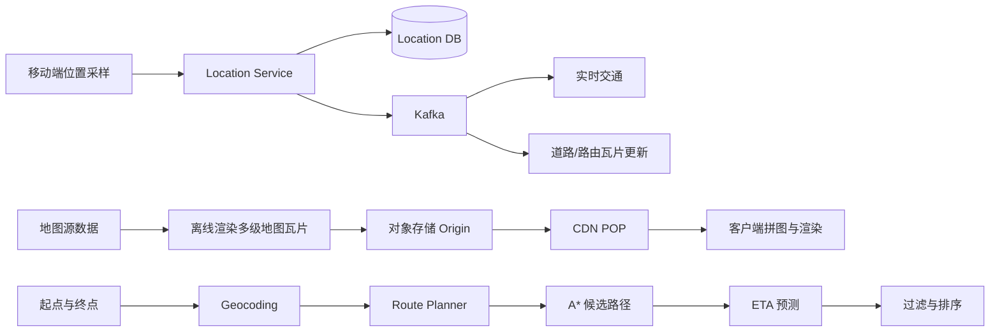
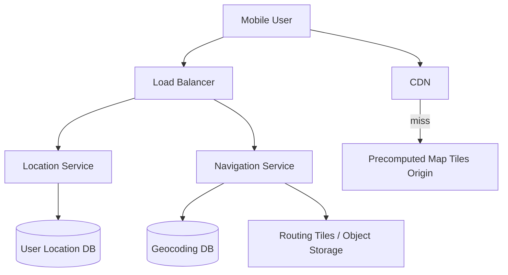
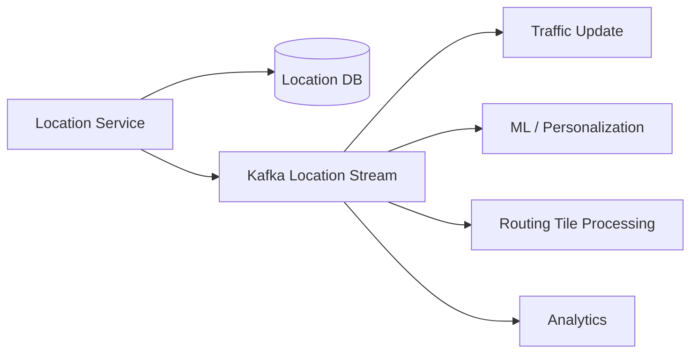
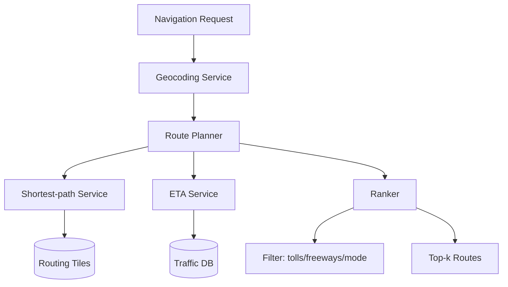
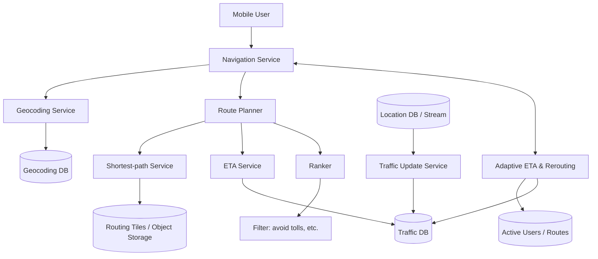
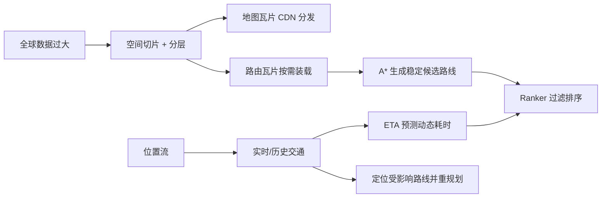
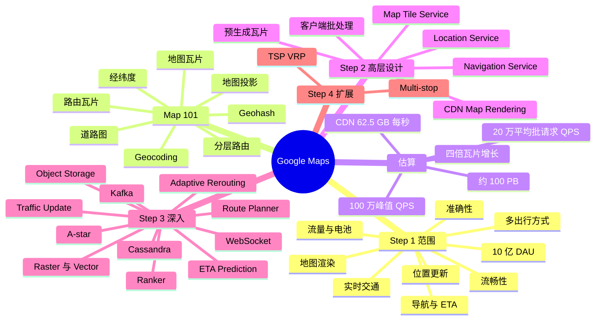

> 原书：Alex Xu、Sahn Lam，*System Design Interview: An Insider's Guide, Volume 2*（2022）
> 范围：Chapter 3: Google Maps（PDF 第 67～96 页）
> 目标：设计一个简化版 Google Maps，支持用户位置更新、导航与 ETA，以及流畅的移动端地图渲染。

## 0. 本章要解决的三个不同问题

Google Maps 不是一个单一的“最短路径服务”。本章实际组合了三条性质不同的数据路径：

1. **位置数据路径**：移动端持续采样位置，批量上传，保存后通过 Kafka 供交通、道路更新、个性化和分析使用。
2. **地图渲染路径**：把世界地图离线切成多缩放级别的静态瓦片，通过 CDN 就近下发，由客户端拼接显示。
3. **导航路径**：把道路建模为图，按地理区域和道路层级切成路由瓦片；A* 找候选路线，ETA 服务结合实时与历史交通预测耗时，Ranker 再按用户约束排序。



三条路径共享经纬度和空间分块思想，却不能混成一套数据：

- 地图瓦片是给人看的图像或矢量；
- 路由瓦片是给算法遍历的图节点、边与跨瓦片引用；
- 位置记录是随时间追加的事件；
- 实时交通是根据位置流推断出的动态边权信息。

作者的整体方法是先建立地理与地图基础，再做数量级估算，随后提出三个核心服务的高层设计，最后分别深入数据、渲染、导航和动态重规划。

---

## 1. Step 1：理解问题并确定设计范围

现实 Google Maps 包含卫星图、街景、地点搜索、公共交通、离线地图、路线规划、实时交通等大量能力。作者先通过澄清问题把面试范围收束到可完成的子集。

## 1.1 需求澄清

### 1.1.1 用户规模

系统按 10 亿日活跃用户设计。如此规模意味着即使单用户行为很轻，汇总后的位置写入、瓦片流量和导航计算都会非常大。

### 1.1.2 核心功能

双方最终聚焦：

- 用户位置更新；
- 导航服务；
- ETA（Estimated Time of Arrival，预计到达时间）；
- 地图渲染。

主要终端是手机。

### 1.1.3 道路数据

假设已经从不同数据源与管理机构获得 TB 级原始道路数据。面试不设计采集合同或测绘系统，但要负责把原始道路记录转换成路线算法可消费的图。

“已有数据”不等于“可直接寻路”。源数据可能只是道路几何、名称、坐标、行政区和规则，仍需离线清洗、拓扑构建、连通性校验和切片。

### 1.1.4 实时交通

路线和 ETA 必须考虑交通。静态道路结构回答“哪些路能走”，交通状态回答“现在以及到达那里时需要多久”。二者变化频率不同，适合分离：

$$
G_{road}=(V,E)\quad\text{变化较慢}
$$

$$
w_e(t,mode)\quad\text{随时间和出行方式变化}
$$

### 1.1.5 出行方式

支持驾车、步行、公交等多种模式。不同模式不是简单修改平均速度：

- 高速公路允许驾车但不允许步行；
- 单行道方向限制车辆；
- 公交依赖班次与换乘；
- 步行可经过车辆禁行通道；
- 转弯、收费、坡度和无障碍规则不同。

因此图边需要模式权限和模式相关成本。

### 1.1.6 多站导航

允许用户定义多个站点是有价值的，但不作为本章重点。单起点到单终点主要是最短路径问题；需要决定多个站点访问顺序时，会进入旅行商问题（TSP）或带容量、时间窗的车辆路径问题（VRP），复杂度显著上升。

## 1.2 功能需求

本章最终保留三项：

1. 用户位置更新；
2. 导航服务，包括 ETA；
3. 地图渲染。

地图渲染负责“看见地图”，导航负责“获得可行路线”，位置服务负责“让地图和交通随现实演进”。三个功能形成反馈闭环：


## 1.3 非功能需求

### 1.3.1 准确性

不能向用户提供错误方向。路线计算可以容忍少量计算延迟，也不必证明是全局最快，但必须是道路上可执行、符合交通规则的路线。

这里要区分：

- **路线正确性**：路连通、方向和限制正确；
- **距离最优性**：总几何距离最短；
- **时间最优性**：考虑未来交通后 ETA 最短；
- **ETA 准确性**：预计时间接近实际时间。

正确性是硬约束，是否绝对最快可以是软目标。

### 1.3.2 流畅导航

客户端缩放、平移和移动时应平滑显示地图。流畅性不仅取决于后端延迟，还取决于：

- 瓦片是否预取和缓存；
- CDN 距离；
- 图片/矢量解码；
- 客户端 GPU 渲染；
- 新旧缩放层级切换方式；
- 网络波动时的降级。

### 1.3.3 数据与电池用量

手机的蜂窝流量、电量和后台执行能力有限。客户端需要在位置采样精度、上传频率、瓦片细节和缓存之间权衡。

### 1.3.4 可用性与可扩展性

地图瓦片读取、位置写入和路线规划要分别扩展。CDN 故障、位置流延迟或交通数据库短暂不可用时，系统应尽量退化到缓存地图和静态路线，而不是完全失去导航。

---

## 2. Map 101：进入设计前的地图基础

作者在估算和架构之前先介绍定位、投影、地理编码、Geohash、地图瓦片和道路图。这些概念决定后续数据模型。

## 2.1 经纬度定位

- 纬度（latitude）表示相对赤道向北或向南的位置，范围通常为 $[-90^\circ,90^\circ]$；
- 经度（longitude）表示相对本初子午线向东或向西的位置，范围通常为 $[-180^\circ,180^\circ]$。

经纬度描述球面位置，不是平面笛卡尔坐标。相同的经度差在高纬度对应更短物理距离，这会影响投影、距离和启发式函数。

## 2.2 从 3D 地球到 2D 地图：地图投影

地图投影（map projection）把球面点映射到平面：

$$
P:(\varphi,\lambda)\rightarrow(x,y)
$$

由于球面不能无失真展开到平面，投影通常会在面积、角度、距离或方向中牺牲一部分。原书列举 Mercator、Peirce quincuncial、Gall-Peters 和 Winkel tripel 等投影。

因此屏幕上的平面距离不能在所有尺度和纬度直接当真实地表距离。地图渲染选择投影是视觉与切片问题，路线算法则应使用适合道路图的距离/时间权重。

## 2.3 Geocoding 与 Reverse Geocoding

地理编码（geocoding）把人类地址转成经纬度：

```text
"1600 Amphitheatre Parkway, Mountain View, CA"
    -> (37.423021, -122.083739)
```

反向地理编码（reverse geocoding）把经纬度转成人类可读地址。

地理编码可利用 GIS 中道路和门牌范围做插值。例如一段街道门牌从 100 到 200，目标 150 可粗略放在中点。但现实还要处理：

- 地址拼写与别名；
- 行政区歧义；
- 门牌单双号；
- 部分匹配；
- 地点名称而非标准地址；
- 地址更新与国际格式差异。

地理编码解决“文字指向哪里”，路线规划解决“坐标之间如何走”，两者职责不同。

## 2.4 Geohashing

Geohash 递归地把平面区域划成子网格，并为网格编码。原书用 00、01、10、11 描述四分过程：每增加一层，宽高各减半，面积变为四分之一。

本章主要使用它完成空间到对象键的映射：

- 经纬度 + 缩放层级 -> 地图瓦片标识；
- 经纬度 -> 路由瓦片标识；
- 路由瓦片按空间键组织到对象存储。

Geohash 在这里是空间寻址方法，不是道路最短路径算法。

## 2.5 地图渲染与 Tiling

若把全世界渲染成一张巨大图片，客户端无法只下载视口附近的小部分，也无法按缩放级别获取合适细节。因此把地图切成固定大小瓦片：

1. 服务端离线生成多套缩放级别；
2. 客户端只下载当前视口需要的瓦片；
3. 客户端像马赛克一样拼接；
4. 平移时加载邻格，缩放时切换瓦片集合。

最低缩放级别用一张 $256\times256$ 图片代表整个世界。用户放大后才下载高细节瓦片，避免在全球视图浪费带宽。

## 2.6 道路如何变成图

大多数路线算法是 Dijkstra 或 A* 的变体。道路网络建模为有向加权图：

$$
G=(V,E,w)
$$

- $V$：路口、道路端点或状态节点；
- $E$：可通行道路段；
- $w(e)$：距离、预计时间、费用或组合成本；
- 有向边表达单行道；
- 边/转向属性表达限行、收费和模式权限。

若整张全球道路图一次性装入内存并遍历，图太大，延迟和内存都不可控。作者由地图切片类比出**路由瓦片（routing tile）**：

- 世界按地理网格切开；
- 每块包含区域内节点与边的邻接表；
- 边界节点引用相邻瓦片；
- 算法只按需装入搜索触达的瓦片；
- 已装入瓦片保存在本地缓存。

## 2.7 地图瓦片与路由瓦片的区别

| 维度 | 地图瓦片 | 路由瓦片 |
|---|---|---|
| 消费者 | 地图客户端/渲染引擎 | Shortest-path Service |
| 内容 | PNG 图片或道路/多边形矢量 | 图节点、边、权重、限制与跨瓦片引用 |
| 目标 | 视觉显示 | 图搜索 |
| 存放/分发 | Origin + CDN | 对象存储 + 路由服务本地缓存 |
| 更新 | 地图样式/道路内容更新后重生成 | 道路拓扑与限制变化后重处理 |
| 缩放层级意义 | 屏幕细节 | 搜索图的道路层级与范围 |

二者都使用空间分块，但共享的是方法，不是文件。

## 2.8 分层路由瓦片

长距离路线若始终在街道级图上搜索，会访问大量局部道路。作者使用三组不同细节：

1. 小瓦片：本地道路，细节最高；
2. 中瓦片：连接地区的主干道；
3. 大瓦片：跨城市、州的主要高速公路。

不同层级之间存在连接。例如从本地道路 A 的节点可进入大瓦片中的高速 F。典型长途路线形成：

$$
\text{本地道路}\rightarrow\text{主干道}\rightarrow\text{高速网络}
\rightarrow\text{主干道}\rightarrow\text{目的地本地道路}
$$

直觉上，这与人类规划长途出行相同：不会枚举沿途每条小巷，而是尽快进入高速骨架，到目的地附近再恢复街道细节。

分层图通过减少搜索状态提升性能，但必须保留足够跨层连接，否则可能错过更优或唯一可行路径。

---

## 3. 粗略估算

作者关注移动场景下的三类存储与两类请求，并把流量和电量作为设计约束。

## 3.1 存储类型

1. 世界地图瓦片；
2. 瓦片元数据，单条很小，估算中忽略；
3. TB 级原始道路数据转换出的路由瓦片，预计仍为 TB 级。

## 3.2 每级瓦片数

缩放级别 0 有 1 张瓦片。每升一级，横向与纵向各翻倍：

$$
N_z=(2^z)^2=4^z
$$

例如：

| Zoom $z$ | 每边瓦片数 | 总瓦片数 $4^z$ |
|---:|---:|---:|
| 0 | 1 | 1 |
| 1 | 2 | 4 |
| 2 | 4 | 16 |
| 10 | 1,024 | 1,048,576 |
| 20 | 1,048,576 | 1,099,511,627,776 |
| 21 | 2,097,152 | 4,398,046,511,104 |

增长是指数级，而不是“多 21 倍”。

## 3.3 最高层瓦片存储

Zoom 21 约有 $4.4$ 万亿张瓦片。若每张 $256\times256$ 压缩 PNG 平均 100 KB：

$$
S_{21}\approx4.398\times10^{12}\times100\text{ KB}
\approx440\text{ PB}
$$

原书认为世界约 90% 是海洋、沙漠、湖泊、山地等自然或无人区域，图像高度可压缩，保守减少 80%～90%：

$$
S_{21}\approx44\sim88\text{ PB}
$$

随后取整为 50 PB，作为最高层估算起点。

这个估算有意粗略：不是每个逻辑瓦片都必须以独立 100 KB 文件物化；空白复用、对象打包、矢量化、压缩率、版本数和多种地图样式都会改变真实值。

## 3.4 所有缩放层级总存储

每降低一级，瓦片数和存储约变为四分之一：

$$
S_{all}=50+\frac{50}{4}+\frac{50}{16}+\frac{50}{64}+\cdots
$$

这是公比 $r=1/4$ 的几何级数：

$$
S_{all}=\frac{50}{1-1/4}=\frac{200}{3}\approx66.7\text{ PB}
$$

作者随后把结论提升到工程量级“约 100 PB”，为粗估误差、元数据、版本和冗余留余地。应区分：

- 67 PB 是基于“最高层 50 PB、每层四分之一”的数学和；
- 100 PB 是容量规划数量级，不是同一公式的精确结果。

## 3.5 位置更新吞吐

假设：

- 10 亿 DAU；
- 每用户平均每周导航 35 分钟；
- 每周总导航 $35$ billion 分钟；
- 每日平均 $5$ billion 分钟。

若每秒发送一个请求：

$$
R_{day}=5\times10^9\text{ min/day}\times60
=3\times10^{11}\text{ requests/day}
$$

原书以 $10^5$ 秒近似一天：

$$
Q_{1s}=\frac{3\times10^{11}}{10^5}=3\times10^6\text{ QPS}
$$

客户端仍每秒采样，但每 15 秒把 15 个点作为一个 HTTP 请求批量上传：

$$
Q_{batch}=\frac{3{,}000{,}000}{15}=200{,}000\text{ QPS}
$$

峰值取平均的 5 倍：

$$
Q_{peak}=200{,}000\times5=1{,}000{,}000\text{ QPS}
$$

批处理降低的是请求次数、TLS/HTTP 头和无线唤醒，不是采样点总数。每个批请求约含 15 个位置点，后端仍要处理约 300 万点/秒的平均数据量。

刷新频率还可按速度自适应：堵车静止时降低上报频率，高速移动或偏航时提高，以平衡新鲜度、电池和网络。

---

## 4. Step 2：提出高层设计并取得共识

高层架构把三个功能拆成 Location Service、Navigation Service 和地图瓦片分发。



## 4.1 Location Service

### 4.1.1 职责

记录用户位置，并让位置流服务多个目的：

- 构建实时交通；
- 检测新道路和封路；
- 改进地图；
- 个性化与行为分析；
- 更新 ETA 与必要时重规划。

### 4.1.2 客户端批处理

客户端每秒采样但缓存 15 秒后批量发送。这样既保留轨迹粒度，又把请求 QPS 降低约 15 倍。

网络失败时应有有限本地队列、重试和幂等事件 ID；否则重发批次可能重复写入。位置事件应携带采样时间，而不是只记录服务器收到时间。

### 4.1.3 API 与协议

原书选择 HTTP Keep-Alive，复用连接以减少握手开销：

```http
POST /v1/locations
Content-Type: application/json

{
  "locs": [
    {"latitude": 37.77, "longitude": -122.42, "timestamp": 1635740977},
    {"latitude": 37.78, "longitude": -122.41, "timestamp": 1635740978}
  ]
}
```

该路径以客户端上行为主，不必因为导航后面需要服务器推送就一律使用 WebSocket。

### 4.1.4 存储初选

即使批量上传，写入仍极高，因此选择可水平扩展、写吞吐高的 Cassandra；同时可把事件写入 Kafka 供下游流处理。具体在 Step 3 深入。

## 4.2 Navigation Service

导航服务寻找 A 到 B 的合理快速路线：

- 可以容忍少量计算延迟；
- 不强求证明返回绝对最快路线；
- 路线准确性是硬要求；
- 最终考虑交通和用户过滤条件。

简化 API：

```http
GET /v1/nav?origin=1355+Market+Street,SF&destination=Disneyland&mode=DRIVING
```

输入地址先通过 Geocoding 转成坐标。响应可包含：

- 总距离与预计时长；
- 每步起终坐标；
- 文字指令；
- 路线 polyline；
- 地理编码匹配状态；
- 出行方式。

此时高层设计尚未解决实时重规划，作者把它留到 Adaptive ETA 深入。

## 4.3 Map Rendering

客户端需要地图瓦片的两类场景：

- 用户平移或缩放视口；
- 导航移动到当前瓦片之外。

### 4.3.1 方案一：请求时动态生成瓦片

服务器根据位置和缩放级别实时渲染。问题是：

- 组合数量巨大，计算负载高；
- 同一瓦片会被重复生成；
- 输出不稳定或键空间过细时难以高效缓存；
- 尾延迟会直接造成地图空白。

它适合强动态、强个性化叠加层，但不适合作为基础底图主路径。

### 4.3.2 方案二：预生成静态瓦片

离线为每个缩放层生成固定网格瓦片，每张由唯一空间标识定位。客户端根据位置和 zoom 计算 URL，直接从 CDN 获取。

CDN miss 时从 Origin 拉取并缓存；之后同一 POP 的所有用户复用副本。优势：

- 静态资源高度可缓存；
- POP 靠近用户，降低延迟；
- Origin 只承受 miss；
- 热点地图由边缘自然吸收；
- 服务器无需为每次浏览重新渲染。

因此作者选择方案二。

## 4.4 移动端瓦片数据量

假设：

- 每张瓦片覆盖 $200\text{ m}\times200\text{ m}$；
- 每张 $256\times256$，平均 100 KB；
- 用户速度 30 km/h。

$1\text{ km}\times1\text{ km}$ 区域每边需要 $1000/200=5$ 张，共：

$$
N=5\times5=25\text{ tiles}
$$

数据量：

$$
D_{1km}=25\times100\text{ KB}=2.5\text{ MB}
$$

原书按每前进 1 km 需要一个 $1\text{ km}\times1\text{ km}$ 带状区域粗估：

$$
D_{hour}=30\times2.5=75\text{ MB/hour}
$$

$$
D_{minute}=\frac{75}{60}=1.25\text{ MB/min}
$$

这是上界式粗估，未考虑客户端缓存、瓦片重叠、预取命中和路线重复。用户每天走相似路线时，本地缓存可显著降低流量。

## 4.5 CDN 总流量

每天 50 亿导航分钟：

$$
D_{day}=5\times10^9\times1.25\text{ MB}
=6.25\times10^9\text{ MB/day}
$$

按原书 $10^5$ 秒/天近似：

$$
B_{CDN}=\frac{6.25\times10^9}{10^5}
=62{,}500\text{ MB/s}
$$

约为 62.5 GB/s。若有 200 个 POP 且简单均分：

$$
B_{POP}=\frac{62{,}500}{200}=312.5\text{ MB/s}
$$

真实流量不会均匀：大城市、通勤时段和地区人口会制造热点，CDN 还需按峰值、缓存命中率和回源带宽规划。

## 4.6 谁来计算瓦片 URL

### 客户端计算

客户端用 `(lat, lng, zoom)` 直接算瓦片标识，例如：

```text
https://cdn.map-provider.com/tiles/9q9hvu.png
```

优点是少一次服务请求、延迟低、后端简单。缺点是编码规则硬编码在 iOS、Android、Web 等客户端；移动版本发布慢，未来更换编码、URL 或版本策略风险高。

### Map Tile Service 计算

增加一个很薄的服务，输入位置与 zoom，返回中心瓦片和 8 个邻格共 9 个 CDN URL：

1. 客户端请求 URL 列表；
2. 负载均衡器转发；
3. 服务返回 9 个 URL；
4. 客户端直接从 CDN 下载。

收益是服务端可快速切换编码、版本、CDN 域名和灰度策略；代价是多一次控制面网络请求和服务可用性依赖。

这是一种典型权衡：

$$
\text{客户端直接计算的低延迟}
\quad vs.\quad
\text{服务中介的演进灵活性}
$$

---

## 5. Step 3：深入设计

作者先分析四类数据，再分别深入 Location Service、地图渲染和 Navigation Service。

## 5.1 数据模型总览

| 数据 | 特性 | 适合的存储/分发 |
|---|---|---|
| Routing Tiles | TB 级、二进制邻接表、按地理键读取、变化较慢 | 对象存储 + 路由服务本地缓存 |
| User Location | 百万级峰值请求、追加写、按用户时间查询 | Cassandra 等分布式宽列/KV |
| Geocoding Data | 地点到坐标、读多写少 | Redis/KV 读优化存储 |
| Precomputed Map Tiles | PB 级、静态、全球高读 | 对象存储 Origin + CDN |

选择存储应服从访问方式，不能因为四者都与“地图”有关就放入一个数据库。

## 5.2 Routing Tiles

原始道路数据来自多个来源，不能直接给 A* 使用。周期性离线 Routing Tile Processing Service 执行：

1. 规范化道路与坐标；
2. 构建路口和道路边；
3. 写入方向、模式、限行等元数据；
4. 建立瓦片边界连接；
5. 生成本地/主干/高速三套分辨率；
6. 序列化成二进制邻接表文件；
7. 按 Geohash/瓦片 ID 写对象存储；
8. 新道路或封路出现后周期性重建受影响瓦片。

为何不用数据库逐行保存节点与边：

- 服务主要按整瓦片读取，不需要复杂查询；
- 数据库只会被当成昂贵文件系统；
- 二进制邻接表更紧凑，反序列化后可直接遍历；
- 对象存储适合 TB 级不可变版本文件。

为何不把全球图全放内存：总量太大，而且一次路线只触达一小部分。路由服务按需加载并积极缓存热点瓦片。

## 5.3 User Location Data

位置记录示例：

| user_id | timestamp | user_mode | driving_mode | location |
|---:|---:|---|---|---|
| 101 | 1635740977 | active | driving | (20.0, 30.5) |

原书建议 Cassandra：

- 支持高写入；
- 水平扩展；
- 在网络分区下优先可用性；
- 位置很快被新值覆盖，可接受最终一致。

更精确地说，CAP 不是平时任意“三选二”。网络分区发生时，本题愿意接受副本短暂不一致，以保持写入可用，即偏向 AP。

### 5.3.1 分区键与聚簇键

使用 `user_id` 作 partition key，`timestamp` 作 clustering key：

```text
PRIMARY KEY ((user_id), timestamp)
```

同一用户记录共置并按时间排序，便于：

- 读取最新位置；
- 查询某用户一段时间轨迹。

长期数据应再加时间桶，例如 `(user_id, day)`，否则单个用户分区会无限增长。

### 5.3.2 Kafka 扩展位置流

只写 Location DB 会让每个下游轮询数据库。改进方案把位置事件同时写入 Kafka，让不同消费者独立订阅：

- Traffic Update Service -> Traffic DB；
- 个性化/机器学习 -> Personalization DB；
- Routing Tile Processing -> 更新道路图；
- Analytics -> Analytics DB。



Kafka 在这里负责解耦、缓冲和多消费者重放；Cassandra 负责按用户保存查询状态。二者不是替代关系。

## 5.4 Geocoding Database

Geocoding DB 保存地点/地址及其坐标。导航先把 origin 和 destination 转为经纬度，再交给 Route Planner。

原书用 Redis/KV 表示读多写少的快速读取。现实地理编码通常还需要全文检索、前缀、模糊匹配和排序，仅用精确 KV 可能不够；但本章把它简化为已规范化地点到坐标的读取。

## 5.5 Precomputed Map Tiles

底图由离线流程根据道路、地名、边界和样式预渲染，存入 Origin，再由 CDN 分发。更新时应使用版本化 URL：

```text
/tiles/{style_version}/{zoom}/{tile_id}.png
```

新版本生成完成后切换清单，旧缓存自然过期，避免原地覆盖导致不同 POP 显示混合版本。

## 5.6 深入 Location Service

峰值约 100 万批请求/秒要求写优化存储和水平扩展。服务优先接受位置，即使副本暂时不一致；下游交通和道路更新异步完成。

位置数据的用途：

- 多用户在道路上的速度聚合为实时交通；
- 大量轨迹持续经过未知区域可提示新道路；
- 轨迹突然不再经过某道路可辅助发现封路；
- 历史数据训练 ETA 模型；
- 用户行为支持个性化和分析。

这些推断不能依赖单个 GPS 点。GPS 噪声、平行道路和漂移要求地图匹配、聚合、异常检测及隐私保护。原书主要讨论数据管道，不深入这些算法。

## 5.7 深入地图渲染

### 5.7.1 多缩放层级

Zoom 0 用一张 $256\times256$ 瓦片；每升一级，横纵瓦片各翻倍，但单瓦片仍是 $256\times256$：

$$
\text{world pixels per side at zoom }z=256\times2^z
$$

客户端按视口 zoom 选择对应集合，只下载足够细节。低 zoom 不加载街道级巨量瓦片，高 zoom 不把低分辨率全球图无限放大。

### 5.7.2 栅格瓦片

栅格瓦片是服务端已经画好的像素：

优点：

- 客户端渲染简单；
- 各端视觉一致；
- CDN 缓存直接。

缺点：

- 图片体积大；
- 从一个层级放大时会先像素化/模糊，再等待新层级图片；
- 样式、语言或重点变化通常要生成另一套图片；
- 旋转、倾斜和连续缩放灵活性差。

### 5.7.3 矢量瓦片

借助 WebGL，可下发压缩的道路路径、多边形和属性，由客户端绘制。

优势：

- 几何数据通常比图片更易压缩，节省带宽；
- 连续缩放更平滑，不会出现栅格像素放大；
- 可在客户端动态换颜色、语言、图层和样式；
- 同一几何可适配不同分辨率。

代价：

- 客户端需要更多 CPU/GPU、内存和复杂渲染代码；
- 低端设备可能卡顿；
- 样式兼容与跨平台一致性更难；
- 敏感或授权图层仍需服务端控制。

这不是“矢量一定更好”，而是用客户端计算换网络带宽与交互流畅度。

## 5.8 Navigation Service 的内部拆分



拆分的关键思想是把稳定结构与动态预测分开：

1. Shortest-path 根据道路结构产生 top-k 候选；
2. ETA 用实时和历史交通预测每条候选的时间；
3. Ranker 应用用户约束并排序。

若直接把所有实时因素塞入一次全球图搜索，缓存复用降低，模型更新和路线正确性也更难隔离。

## 5.9 Shortest-path Service

### 5.9.1 职责

输入起终点经纬度，返回不考虑当前交通的 top-k 较短路径。道路图很少变化，因此候选路径或热点瓦片可缓存。

### 5.9.2 按需加载分层路由瓦片

1. 起终点坐标转成空间键，定位起点/终点路由瓦片；
2. 从起点瓦片开始遍历图；
3. 扩展边界时从对象存储或本地缓存加载邻瓦片；
4. 长距离阶段通过跨层边进入只含主干道/高速的粗粒度瓦片；
5. 接近终点时回到细粒度本地道路；
6. 继续扩展直到找到一组最佳候选路径。

### 5.9.3 Dijkstra 与 A*

Dijkstra 按从起点到当前节点的已知最小成本扩展：

$$
g(n)=\text{cost(start}\rightarrow n)
$$

A* 加入到目标的启发式估计：

$$
f(n)=g(n)+h(n)
$$

- $g(n)$：已经付出的真实成本；
- $h(n)$：从 $n$ 到终点的估计剩余成本；
- 每次优先扩展 $f$ 最小节点。

当 $h(n)=0$，A* 退化为 Dijkstra。若 $h$ **可采纳**：

$$
0\leq h(n)\leq h^{\ast}(n)
$$

其中 $h^{\ast}(n)$ 是真实最小剩余成本，则不会因高估而跳过最优路线。按距离寻路可用两点直线距离作下界，因为道路路径不可能比直线更短；按时间寻路可用：

$$
h_{time}(n)=\frac{d_{straight}(n,goal)}{v_{max}}
$$

使用全网允许的最大速度得到不高估的时间下界。

### 5.9.4 可运行 A* 示例

下面用邻接表展示原理。真实服务把图分散在路由瓦片，`neighbors` 在扩展到新区域时会触发瓦片加载。

```python
from heapq import heappop, heappush
from math import hypot

def astar(graph, coordinates, start, goal):
    frontier = [(0.0, start)]
    came_from = {start: None}
    cost_so_far = {start: 0.0}

    while frontier:
        _, current = heappop(frontier)
        if current == goal:
            break

        for neighbor, edge_cost in graph[current]:
            new_cost = cost_so_far[current] + edge_cost
            if neighbor not in cost_so_far or new_cost < cost_so_far[neighbor]:
                cost_so_far[neighbor] = new_cost
                x1, y1 = coordinates[neighbor]
                x2, y2 = coordinates[goal]
                heuristic = hypot(x2 - x1, y2 - y1)
                heappush(frontier, (new_cost + heuristic, neighbor))
                came_from[neighbor] = current

    if goal not in came_from:
        return None, float("inf")

    path = []
    current = goal
    while current is not None:
        path.append(current)
        current = came_from[current]
    path.reverse()
    return path, cost_so_far[goal]

if __name__ == "__main__":
    road_graph = {
        "A": [("B", 2.0), ("C", 5.0)],
        "B": [("C", 1.0), ("D", 4.0)],
        "C": [("D", 1.0)],
        "D": [],
    }
    points = {"A": (0, 0), "B": (2, 0), "C": (3, 0), "D": (4, 0)}
    print(astar(road_graph, points, "A", "D"))
```

输出路线 `A -> B -> C -> D`，总成本 4。代码中的欧氏距离只用于教学图；全球道路应使用与成本单位匹配且不高估的地理启发式。

### 5.9.5 A* 的适用边界

- 非负边权是基本前提；
- 不可采纳启发式可能失去最优保证；
- 静态最短距离不等于最快 ETA；
- top-k 不只是重复跑一次 A*，需使用 k-shortest paths 等变体并控制路线多样性；
- 转弯限制有时需要把“到达节点的入边状态”纳入图状态，而不是只把路口视为节点。

## 5.10 ETA Service

Route Planner 对每条候选路线调用 ETA Service。ETA 不只是：

$$
ETA=\frac{distance}{current\ speed}
$$

因为一条 30 分钟路线需要预测 10～20 分钟后尚未到达路段的交通。可抽象为：

$$
ETA(route,t_0)=\sum_{e\in route}
\widehat{T}_e(t_0+arrival\_offset_e)
$$

$\widehat{T}_e$ 依赖：

- 当前实时速度与拥堵；
- 同路段历史时间模式；
- 星期、节假日和天气；
- 事故、施工与活动；
- 上下游路段的传播关系；
- 出行方式。

原书用机器学习预测 ETA，但不展开模型算法。系统设计重点是确保 Traffic DB 和历史流能及时、可靠地成为模型输入。

## 5.11 Ranker Service

Ranker 接收候选路线及 ETA，应用用户过滤，例如：

- 避开收费路；
- 避开高速；
- 指定出行模式。

然后按预计耗时等目标从快到慢排序，返回 top-k。

硬约束应在不可行路线产生或进入排名前过滤；软偏好可进入评分函数：

$$
score(r)=ETA(r)+\alpha\cdot toll(r)+\beta\cdot turns(r)
$$

$\alpha,\beta$ 表示用户/产品对收费和复杂转向的惩罚。最快路线不一定是用户最愿意走的路线。

## 5.12 Updater Services

异步消费者从 Kafka 读取位置流并更新关键数据：

- Routing Tile Processing Service 结合新路、封路更新路由瓦片，提高路线结构准确性；
- Traffic Update Service 聚合活跃用户速度，更新 Traffic DB，提高 ETA 准确性。

这两个更新时效不同：交通可能分钟甚至秒级变化，道路拓扑通常慢得多。不能因都来自位置流就用同一刷新周期。

## 5.13 Adaptive ETA 与动态重规划

初始路线只是一张出发时快照。交通变化后，服务器要：

1. 跟踪当前正在导航的用户；
2. 找出哪些路线受某交通事件影响；
3. 重新计算相关 ETA 或候选路线；
4. 把更优路线推给客户端。

### 5.13.1 朴素方案

对每个活跃用户保存完整路由瓦片序列：

```text
user_1: r_1, r_2, r_3, ..., r_k
user_2: r_4, r_6, r_9, ..., r_n
```

交通事件发生在 `r_2` 时，扫描所有 $n$ 个用户的平均 $m$ 个瓦片：

$$
T(n,m)=O(nm)
$$

数百万活跃路线下不可扩展。

### 5.13.2 分层包围瓦片粗筛

作者为每位用户保存：

```text
current_tile,
super(current_tile),
super(super(current_tile)), ...
```

持续上升到某个粗粒度瓦片同时包含当前位置与目的地。交通事件瓦片若不在该最终包围瓦片内，可快速排除该用户；若在其中，再进入更精确检查。

这是空间层级的 broad-phase filter：先用很便宜的包围关系排除大量不可能用户。它会有假阳性，因为事件在包围区域内不代表就在用户路线中，所以仍要检查细路线或建立倒排索引：

$$
tile\_id\rightarrow\{active\ user/route\ ids\}
$$

原书强调层级粗筛，没有完整展开倒排索引与更新成本。生产方案通常把二者结合，避免仍然遍历全部用户。

### 5.13.3 交通恢复的问题

只在当前路线受阻时重算不够。拥堵消失后，旧路线可能再次更快，却不会自动触发“当前路线受影响”。作者建议保留多个候选路线，周期性重算 ETA；若发现显著更短路线，再通知用户。

为避免频繁左右横跳，应设置重规划门槛与滞回：

$$
ETA_{current}-ETA_{new}>\Delta_{min}
$$

只有节省时间超过阈值才切换，并考虑用户已走过路段、转向成本和路线稳定性。

## 5.14 下行协议选择

导航期间服务器需要推送 ETA 与改道信息，原书比较：

| 协议 | 判断 |
|---|---|
| Mobile Push | iOS 载荷约 4096 bytes，实时性/控制有限，不支持 Web 应用 |
| Long Polling | 能实现推送感，但反复请求开销较大 |
| SSE | 服务器到客户端单向流，简单且可用 |
| WebSocket | 持久、轻量、双向，适合实时导航最后一公里 |

作者倾向 WebSocket，因为后续可能需要客户端确认、偏航上报等双向实时通信。若严格只有服务端单向 ETA 更新，SSE 也完全可行。

## 5.15 最终导航设计



端到端流程：

1. 地址经 Geocoding 转坐标；
2. Shortest-path 在分层路由瓦片中生成候选；
3. ETA 为每条候选预测动态耗时；
4. Ranker 应用用户约束并返回 top-k；
5. 导航期间位置流持续更新交通；
6. Adaptive ETA 根据交通变化定位受影响用户；
7. 新路线显著更优时通过 WebSocket 推送。

---

## 6. Step 4：收束与扩展方向

作者最终完成了简化 Google Maps 的四项关键能力：

- 位置批量更新；
- 路线规划；
- ETA 与动态重规划；
- 多层级地图渲染。

可继续扩展多站导航。给定多个目的地，不仅要计算点对点路线，还要决定访问顺序，并根据实时交通动态调整。对配送业务还会加入车辆容量、时间窗、司机班次和取送顺序，问题从最短路径升级为 TSP/VRP 类组合优化。

本章的因果主线是：



---

## 7. 容易混淆的概念与常见误区

### 7.1 地图瓦片不等于路由瓦片

前者供视觉渲染，后者是图算法二进制数据。空间范围可以一致，内容和消费者完全不同。

### 7.2 Geohash 不等于 A*

Geohash 负责从坐标定位瓦片；A* 在瓦片拼成的道路图上搜索路线。空间寻址不能替代图遍历。

### 7.3 Geocoding 不等于定位

Geocoding 把地址转坐标；GPS/定位系统估计设备坐标；reverse geocoding 再把坐标转地址。

### 7.4 地图投影不保持所有几何性质

平面图上的视觉距离、面积和方向可能失真。不能不加判断地用屏幕像素距离作为道路距离。

### 7.5 最短距离不等于最短时间

Shortest-path Service 给道路结构候选；ETA 才把实时与未来交通加入时间预测。距离更长的高速路线可能更快。

### 7.6 ETA 不是当前速度的简单除法

用户到达后续路段时交通已经变化，必须预测未来 10～20 分钟的边耗时。

### 7.7 A* 不保证在任意启发式下最优

启发式高估真实剩余成本时可能错误剪掉最优路线。要保留最优保证，需满足可采纳性等条件。

### 7.8 Dijkstra 与 A* 不是无关算法

A* 的 $h=0$ 就是 Dijkstra。A* 用目标方向信息减少无关扩展。

### 7.9 批量 15 秒上传不等于每 15 秒只采一个点

客户端仍可每秒采样 15 个点，只把 15 个点合并为一个请求。请求 QPS 降低，但数据点处理量不同比例下降。

### 7.10 Cassandra 与 Kafka 不可互换

Cassandra 保存可查询位置历史；Kafka 让多个下游按流消费和重放。一个是状态存储，一个是事件骨干。

### 7.11 CAP 不是普通情况下任意“三选二”

分区发生时，本章愿意以短暂副本不一致换写入可用。没有网络分区时仍可同时提供一致和可用服务。

### 7.12 CDN 不是永久权威存储

Origin/对象存储是权威瓦片来源，CDN 是边缘副本。缓存 miss、失效和版本切换仍要回源。

### 7.13 预生成瓦片不等于地图永不更新

地图更新通过离线重生成、版本化 URL 和 CDN 切换发布，而不是每次请求实时绘图。

### 7.14 矢量瓦片不一定在所有设备更快

它节省带宽并改善缩放，但把绘制成本转给客户端。低端设备可能受 CPU/GPU 和内存限制。

### 7.15 最高层 50 PB 与总量 100 PB 不矛盾

50 PB 是压缩后最高 zoom 的取整假设；67 PB 是几何级数；100 PB 是更保守的工程数量级。

### 7.16 逻辑瓦片数不等于必须存在同样多独立文件

空白瓦片复用、对象打包、矢量存储和稀疏物化都会改变物理对象数。

### 7.17 客户端缓存与 CDN 缓存解决不同问题

- 客户端缓存减少用户重复下载与离线失败；
- CDN 缓存让同一区域大量用户共享边缘副本并保护 Origin。

### 7.18 客户端直接算 URL 不是零成本架构

它省掉服务请求，却把编码协议变成移动客户端长期契约，迁移速度受应用发布周期限制。

### 7.19 分层路由不是简单降低地图图片精度

它会在粗层只保留主干路/高速图骨架，减少搜索状态；必须用跨层边连接细节与骨架。

### 7.20 包围瓦片命中不等于路线一定受影响

Adaptive ETA 的层级瓦片是粗筛，会产生假阳性。仍需核对实际路线或用 `tile -> active routes` 倒排索引。

### 7.21 交通变坏与交通恢复都要触发评估

只监控当前路线事故会错过旧路线恢复后的更优选择。候选 ETA 应周期重算，并设置切换门槛避免抖动。

### 7.22 Mobile Push、SSE、WebSocket 不是按“新旧”排序

选择取决于载荷、实时性、平台、方向和连接成本。本章因双向实时导航倾向 WebSocket；纯单向流可选 SSE。

### 7.23 多站导航不只是多调用几次单点导航

访问顺序组合随站点数快速增长，并可能包含容量和时间窗，属于 TSP/VRP 类问题。

### 7.24 准确路线不等于永远不变路线

道路结构正确与实时最优是两层目标。交通变化后改道不是前一次路线“错误”，而是动态边权变化。

---

## 8. 本章知识结构



## 9. 核心结论

1. **全球地图问题首先要分解数据路径。** 位置事件、视觉瓦片、道路图和交通状态的生命周期与访问模式不同。
2. **空间切片是控制全球数据规模的共同方法。** 渲染侧按需下载地图瓦片，导航侧按需装载路由瓦片。
3. **缩放层级呈指数增长。** Zoom $z$ 有 $4^z$ 张瓦片，多一级就多四倍像素与存储。
4. **预生成静态瓦片 + CDN 是底图分发主路径。** 它把重复渲染变成高命中静态读取，并让边缘 POP 吸收全球流量。
5. **批量上传降低请求与无线开销。** 每秒采样、15 秒一批把请求 QPS 降低 15 倍，但不丢失轨迹粒度。
6. **位置库与事件流承担不同职责。** Cassandra 存状态，Kafka 解耦交通、道路更新、个性化和分析消费者。
7. **道路图需要离线转换成分层路由瓦片。** 对象存储保存二进制邻接表，路由服务只加载搜索需要的局部。
8. **A* 用 $f=g+h$ 引导搜索。** 可采纳启发式在保留最优保证的同时减少无关图扩展。
9. **候选路径与动态耗时应分离。** 道路结构变化慢、可缓存；ETA 结合实时与历史交通预测未来边权。
10. **Ranker 把算法最优转成用户可接受。** 收费、模式和偏好可能让“最快”不是最终首选。
11. **位置流反哺地图形成数据闭环。** 用户轨迹帮助推断交通、新路和封路，持续改善路线与 ETA。
12. **动态重规划的难点是反向定位受影响用户。** 全表路线扫描是 $O(nm)$，要用空间层级粗筛与倒排关系缩小集合。
13. **下行协议要服从交互方向。** 本章因导航需要双向实时通信而倾向 WebSocket。
14. **工程估算关注数量级而非伪精确。** 67 PB 的数学和可上调到约 100 PB 作为真实容量规划起点。

## 10. 解决全球地图与导航问题的一般思路

### 第一步：分开“显示、位置、路线、时间”

- 显示：用户需要哪些视觉资源；
- 位置：设备怎样采样与上传；
- 路线：道路结构中哪些路径可行；
- 时间：动态交通下哪条候选更快。

### 第二步：把全球数据空间分块并分层

固定瓦片支持寻址、缓存和按需装载；层级让系统在全局概览与局部细节间切换。

### 第三步：先做数量级估算

使用：

$$
N_z=4^z
$$

$$
Q_{batch}=\frac{navigation\ seconds/day}{seconds/day\times batch\ size}
$$

$$
Bandwidth=navigation\ minutes\times MB/minute
$$

分别识别 PB 存储、百万写入 QPS 和全球 CDN 带宽。

### 第四步：静态重计算，动态流式更新

- 底图和道路拓扑离线生成版本化瓦片；
- 位置和交通走在线事件流；
- 路线候选复用静态图；
- ETA 和重规划响应动态边权。

### 第五步：让存储匹配读取单位

- 整文件读取的路由瓦片 -> 对象存储；
- 全球静态资源 -> CDN；
- 按用户时间追加 -> 宽列数据库；
- 多下游事件 -> Kafka；
- 高频地点查询 -> Geocoding KV/索引。

### 第六步：用分层 A* 生成有限候选

细层处理起终点街道，粗层处理长距离高速；启发式指向目标，按需加载瓦片，避免全球全图搜索。

### 第七步：把实时预测放到候选之后

对少量候选做未来交通 ETA，随后应用硬过滤和软偏好，降低模型计算量并保持模块可演进。

### 第八步：为运行中路线建立反向影响索引

交通事件必须快速找到相关活跃路线。使用层级空间粗筛、`tile -> routes/users` 倒排索引和周期 ETA 复算，而不是扫描所有路线。

### 第九步：端到端验证

检查：

- 道路规则错误时是否会给出不可执行路线；
- 位置批次丢失、重复、乱序怎样处理；
- CDN miss 或 Origin 故障怎样降级；
- 路由瓦片版本更新是否原子可见；
- Traffic DB 陈旧时是否退化到历史 ETA；
- 改道是否节省足够时间且不会频繁抖动；
- 精确轨迹是否满足隐私、保留和授权要求。

整章可以压缩为：

$$
\boxed{
\text{全球空间分块分层}
\rightarrow
\text{静态瓦片离线生成与边缘分发}
\rightarrow
\text{道路图按需装载并用 A* 找候选}
\rightarrow
\text{位置流生成动态交通}
\rightarrow
\text{ETA 预测与排序}
\rightarrow
\text{影响索引驱动持续重规划}
}
$$

本章最值得迁移的方法是：**先按数据变化速度和消费方式分离系统，再用空间切片、层级图、边缘缓存与事件流分别控制规模，最后把稳定的可行路线和动态的时间预测组合起来。**
