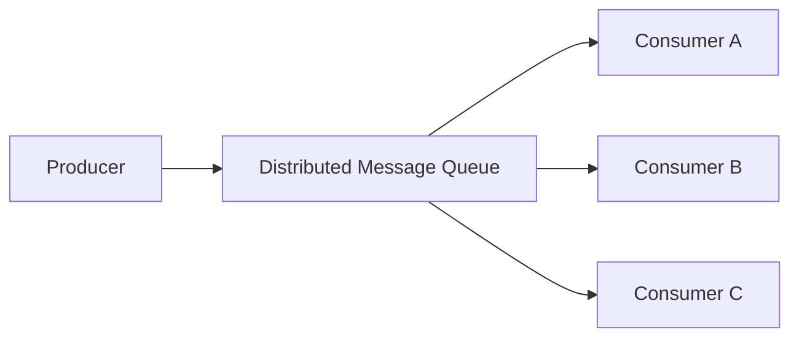
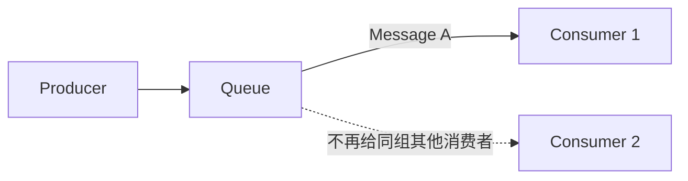
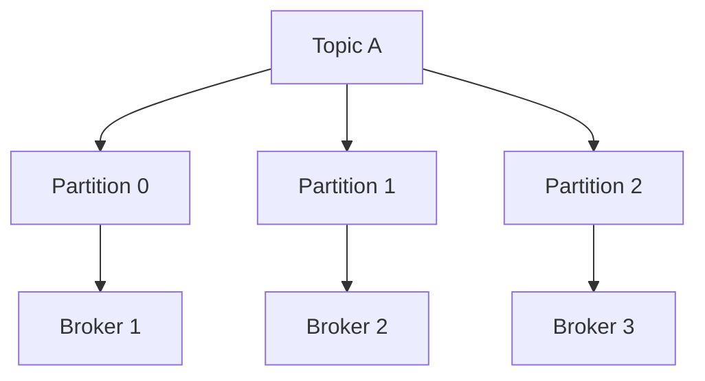
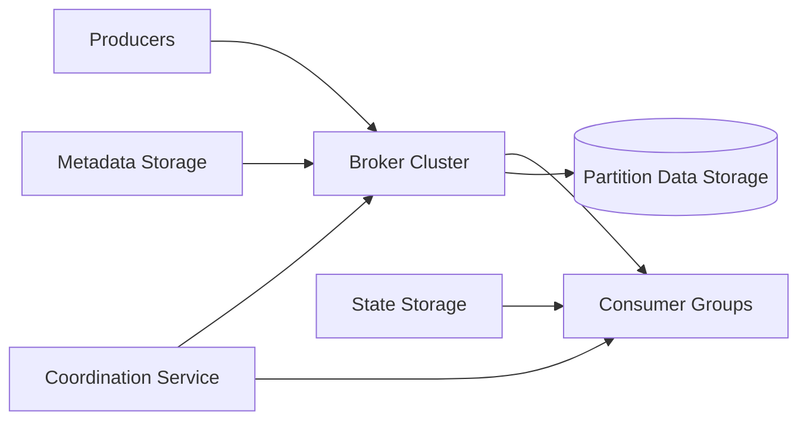
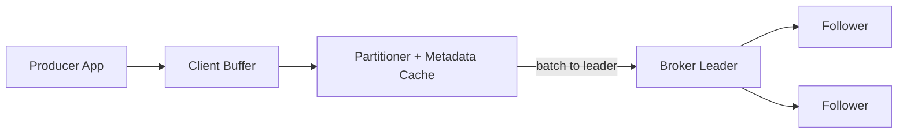
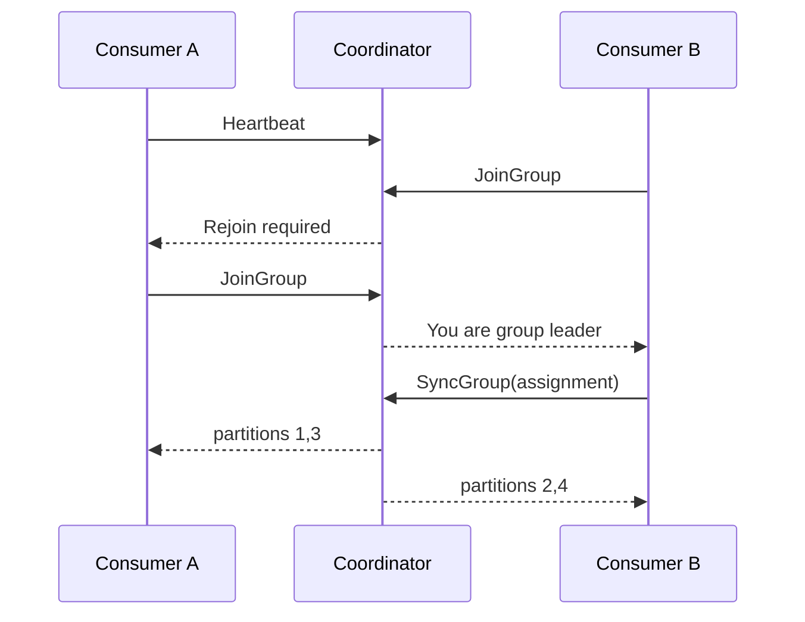
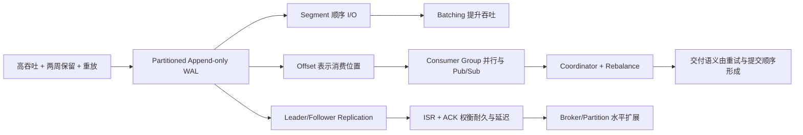
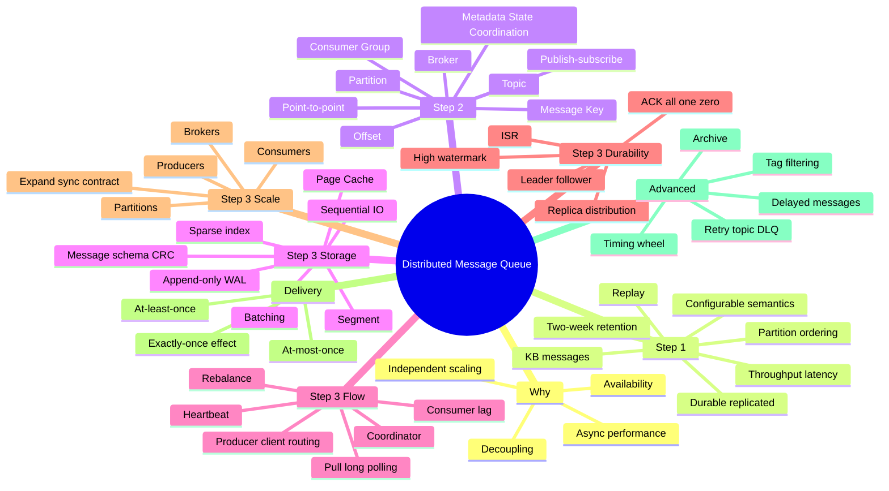

> 原书：Alex Xu、Sahn Lam，*System Design Interview: An Insider's Guide, Volume 2*（2022）
> 范围：Chapter 4: Distributed Message Queue（PDF 第 97～134 页）
> 目标：设计一个可水平扩展、高吞吐、持久化的分布式消息系统，并支持长时间保留、重复消费、分区内顺序、Consumer Group、可配置确认与交付语义。

## 0. 为什么需要消息队列

现代系统常被拆成许多职责明确、可独立部署的组件。若生产者同步调用每个下游，双方会在接口、容量、故障和发布时间上紧密耦合。消息队列在中间提供异步通信与协调：



作者概括了四项主要收益：

1. **解耦**：生产者只遵守消息契约，不必知道每个消费者的地址、部署和处理细节。
2. **独立扩展**：生产端与消费端可按各自负载扩缩容。
3. **提高可用性**：某个消费者暂时离线时，生产者仍能写入队列；消费者恢复后追赶积压。
4. **提高性能**：生产者不必等待下游业务完成，消费者按自身节奏异步处理。

这四项收益不是免费的。队列把同步调用中的问题转化为：

- 消息是否持久；
- 是否重复、丢失或乱序；
- 积压如何度量与清理；
- Schema 如何演进；
- 分区、复制与再平衡怎样协调；
- 下游副作用如何与 Offset 一致提交。

本章的系统可抽象为：

$$
\text{Producer}
\xrightarrow{\text{append}}
\text{Partitioned Replicated Log}
\xrightarrow{\text{pull by offset}}
\text{Consumer Group}
$$

## 0.1 传统消息队列与事件流平台

原书标题叫“Distributed Message Queue”，但实际加入了 Kafka/Pulsar 式事件流能力：

| 维度 | 传统消息队列 | 事件流平台/本章设计 |
|---|---|---|
| 消费后数据 | ACK 后通常删除 | 按保留策略继续存在 |
| 重复消费 | 通常不强调 | 不同 Group 可独立重放 |
| 数据保留 | 短暂，磁盘多用于积压溢出 | 两周等长期保留 |
| 顺序 | 常不作严格保证 | 分区内 FIFO |
| 消费位置 | Broker 管待处理消息 | Consumer Group 持有 Offset |
| 存储模型 | Queue | 分区追加日志 |

Kafka、Pulsar 严格说主要是事件流平台；RabbitMQ、RocketMQ、ActiveMQ、ZeroMQ 更接近传统消息系统。不过产品能力正在融合，例如传统队列也可能增加 Stream 功能。

本章的复杂度主要来自三项附加要求：

- 长时间保留；
- 可重放；
- 有序分区日志。

如果面试题只要求传统一次性消费队列，可以删除大量 Offset、历史保留和重放机制，设计会显著简化。

---

## 1. Step 1：理解问题并确定设计范围

“生产者写、消费者读”只是最小定义。消息大小、保留、顺序、吞吐和交付语义会改变整个存储与协议设计，作者先逐项澄清。

## 1.1 澄清问题

### 1.1.1 消息格式和大小

只支持文本消息，通常为 KB 级，不在队列中直接承载大型多媒体。

大对象若直接进入日志会：

- 拉长网络与磁盘占用时间；
- 放大副本同步流量；
- 使批次被单条消息支配；
- 增加消费者内存压力。

常见做法是把大文件存对象存储，消息只携带 URI、校验和与元数据。

### 1.1.2 能否重复消费

需要。不同 Consumer Group 可以维护各自 Offset，从同一日志独立读取；同一 Group 也可重置 Offset 后重放。

这要求消费不能物理删除消息，Broker 必须把“消息生命周期”与“某消费者是否读过”分开。

### 1.1.3 是否按生产顺序消费

需要有序。后续架构实际能保证的是：

> **同一分区内，按 Offset 顺序消费。**

多个分区并行时不存在低成本的全局总序。若业务要求同一订单或用户事件有序，应让相同 Key 始终进入同一分区。

### 1.1.4 是否持久化、保留多久

消息持久化到磁盘并复制，保留两周；历史数据可以按时间或容量截断。

若平均入口速率为 $q$ 条/秒，平均消息连同开销为 $s$ bytes，保留 $T$ 秒，复制因子为 $r$，理论原始容量为：

$$
S=q\times s\times T\times r
$$

例如教学化假设 $q=10^6$ msg/s、$s=1$ KB、$T=14$ 天、$r=3$：

$$
S=10^6\times1000\times(14\times86{,}400)\times3
\approx3.63\text{ PB}
$$

这还不含索引、文件系统预留、峰值、再复制和故障恢复余量。长保留把问题从内存队列提升为 PB 级日志存储。

### 1.1.5 生产者和消费者数量

越多越好，意味着客户端、Broker、分区和 Consumer Group 都要水平扩展，不能依赖单节点协调或全局锁。

### 1.1.6 交付语义

至少必须支持 At-least-once，理想情况下 At-most-once、At-least-once、Exactly-once 都可配置。

交付语义不只由 Broker 决定，还取决于：

- Producer 是否重试；
- Broker ACK 条件；
- Consumer 何时提交 Offset；
- 下游写入是否幂等/事务化。

### 1.1.7 吞吐与延迟

- 日志聚合等场景需要高吞吐；
- 传统队列场景需要低延迟；
- 批大小、刷盘、ACK、副本数和分区数要可调。

二者常存在张力：批得越大，单位消息成本越低，但第一条消息等待凑批的时间越长。

## 1.2 功能需求

1. Producer 向队列发送消息；
2. Consumer 从队列消费消息；
3. 消息可重复消费，也可只处理一次；
4. 历史数据可截断；
5. 消息为 KB 级；
6. 保证可定义范围内的消息顺序；
7. At-most-once、At-least-once、Exactly-once 可配置。

## 1.3 非功能需求

### 可配置的高吞吐或低延迟

系统不承诺同一配置同时达到两者极值，而是暴露批大小、等待时间、ACK 等参数适配业务。

### 可扩展性

分布式部署，能够通过增加 Broker、分区、Producer 和 Consumer 应对流量突增。

### 持久性与耐久性

消息写磁盘并跨多个 Broker 复制。单节点故障不能让已承诺的消息消失。

## 1.4 传统队列的简化边界

若只设计 RabbitMQ 式传统队列：

- 成功 ACK 后可删除消息；
- 磁盘容量主要吸收短期积压；
- 不必支持任意 Offset 重放；
- 可以放宽分区顺序；
- 存储量通常远小于长期事件流平台。

需求澄清的价值正在这里：同叫“消息队列”，不同语义会导出完全不同的系统。

---

## 2. Step 2：提出高层设计并取得共识

作者先从 Producer、Queue、Consumer 三元组开始，再引入消息模型、Topic、Partition、Broker 和 Consumer Group。

## 2.1 基本角色

- **Producer**：向特定 Topic 发布消息；
- **Consumer**：订阅并拉取消息；
- **Message Queue Service**：在中间持久化、路由和复制，解耦两端。

Producer 和 Consumer 是客户端，Broker 是服务端；双方通过网络协议交换批次、ACK、Offset 和心跳。

## 2.2 两种消息模型

### 2.2.1 Point-to-point

一条消息由且仅由一个消费者处理。队列可以有多个竞争消费者，但成功处理者只有一个。



传统实现常在 Consumer ACK 后删除消息。本章因保留两周，不立刻删除，而用同一 Group 内的分区独占与 Offset 模拟该语义。

### 2.2.2 Publish-subscribe

消息发送到一个 Topic，多个独立订阅者都能获得一份逻辑副本。例如 Billing Group 和 Analytics Group 各自读取同一消息。

这里不是物理复制两份消息，而是：

$$
\text{同一分区日志}+\text{多组独立 Offset}
$$

## 2.3 Topic、Partition 与 Broker

### Topic

Topic 是消息类别的逻辑名称，整个服务中唯一。Producer 写 Topic，Consumer Group 订阅 Topic。

### Partition

一个 Topic 数据太大或吞吐太高，无法由单服务器承载，于是分成多个 Partition。每个 Partition 是独立的追加 FIFO 日志。

### Broker

Broker 是保存 Partition 副本的服务器。多个 Topic 的分区副本均匀放在 Broker 集群，达到容量和流量分摊。



## 2.4 Offset 与顺序

每条消息在 Partition 内获得单调递增 Offset：

```text
Topic A / Partition 0:
offset 0, 1, 2, 3, ...
```

消息由三元组定位：

$$
(topic,partition,offset)
$$

Offset 是日志位置，不是全局消息 ID，也不保证跨 Partition 可比较。

顺序保证可以表述为：

$$
m_i,m_j\in p\land offset(m_i)<offset(m_j)
\Rightarrow consume(m_i)\prec consume(m_j)
$$

只有两条消息在同一 Partition 时，该关系才成立。

## 2.5 Message Key 与分区选择

消息可携带 Key，例如 `user_id`、`order_id`：

$$
partition=h(key)\bmod P
$$

相同 Key 映射到相同 Partition，从而获得该 Key 内顺序。没有 Key 时可轮询、随机或粘性批次分发，以均衡负载。

Key 不等于 Partition 编号，也不要求唯一。它承载业务分组语义，Partition 是队列内部存储单元。

风险包括：

- 某个超级热门 Key 让单分区过热；
- 分区数变化会改变 `hash % P` 映射；
- Producer 算法或版本不一致会破坏同 Key 共置。

## 2.6 Consumer Group

Consumer Group 是协作消费一组 Topic 的消费者集合。每个 Group：

- 独立维护各 Partition 的 Offset；
- 可订阅多个 Topic；
- Group 内 Consumer 并行分担 Partition；
- 不同 Group 分别获得同一消息。

核心约束：

> 同一 Partition 在同一 Consumer Group 内，只能分配给一个 Consumer。

它同时实现：

- 分区内顺序；
- Point-to-point 式组内竞争；
- 不同 Group 间 Publish-subscribe。

若一个 Topic 有 $P$ 个 Partition，Group 有 $C$ 个 Consumer，有效并行度为：

$$
parallelism=\min(P,C)
$$

当 $C>P$ 时，至少 $C-P$ 个 Consumer 空闲。增加 Consumer 无法突破 Partition 数上限。

## 2.7 高层架构



### 客户端

- Producer：选择 Topic/Partition，批量发送；
- Consumer Group：订阅 Topic，按分配拉取并提交 Offset。

### 核心服务与存储

- Broker：承载多个 Partition 副本；
- Data Storage：保存消息日志；
- State Storage：保存 Group 分区分配和消费 Offset；
- Metadata Storage：保存 Topic 配置、分区数、保留期、Replica Distribution Plan；
- Coordination Service：Broker 存活发现、Leader 选举、Consumer 协调与分区分配。

把消息、元数据和消费状态分开，是因为它们的访问模式不同：

| 数据 | 规模 | 模式 | 一致性重点 |
|---|---:|---|---|
| 消息日志 | 极大 | 顺序追加/读取 | 高吞吐、耐久 |
| Topic 元数据 | 很小 | 少量随机读写 | 强一致 |
| Consumer Offset | 较小 | 高频随机更新 | 正确恢复 |

---

## 3. Step 3：深入设计

作者先解释存储与磁盘性能，再依次分析 Producer、Consumer、状态、复制、扩展、交付语义和高级功能。

## 3.1 性能设计的两根支柱

### 顺序 I/O

分区日志只追加，不原地更新消息。即使机械磁盘随机 I/O 较慢，大块顺序写仍可获得很高吞吐；SSD 同样受益于连续批量访问。

### Batching

Producer、Broker、Follower 和 Consumer 都使用批处理：

- 一次系统调用处理多条消息；
- 一次网络往返摊销协议与 TLS 成本；
- Broker 形成更大的顺序写；
- Consumer 一次拉取连续 Offset 范围；
- 压缩对一批相似记录通常更有效。

若单次固定开销为 $c_f$，每消息成本为 $c_m$，批大小为 $B$，平均每消息成本约：

$$
C_{per-message}=\frac{c_f}{B}+c_m
$$

$B$ 增大时固定成本被摊薄，但等待凑批增加延迟。可用“双阈值”发送：达到 `batch_size` 或 `linger_ms` 任一条件即发送。

## 3.2 Data Storage：为什么不用普通数据库

消息日志访问模式是：

- 写密集且读密集；
- 主要是 Append 和顺序读；
- 消息本身不更新；
- 事件流平台只按保留期删除旧数据；
- 数据规模很大。

关系型数据库把消息当行保存，会引入 B-tree、页更新、事务和随机访问等本题不需要的成本；NoSQL 虽能扩展，但未必针对纯顺序日志达到最简单高效。

数据库不是绝对不能实现，而是与特定访问模式不匹配，容易成为吞吐和成本瓶颈。

## 3.3 WAL 与 Segment

### 3.3.1 Append-only Log

WAL（Write-Ahead Log）是只追加文件。MySQL Redo Log、ZooKeeper WAL 等都使用类似思想。本章直接把消息持久化为分区 WAL。

新消息获得单调 Offset 并追加到末尾：

```text
0 1 2 3 4 5 6 7 ...
                  ^ append here
```

### 3.3.2 为什么切 Segment

单文件不能无限增长，因此把 Partition 切成多个 Segment：

```text
partition-0/
  00000000000000000000.log
  00000000000001000000.log
  00000000000002000000.log  <- active
```

- 只有 Active Segment 接收写入；
- 旧 Segment 只读；
- 文件到大小/时间阈值后滚动；
- 超过保留期的完整旧 Segment 可直接删除。

Segment 带来：

- 文件大小可控；
- 按 Segment 清理，无需逐条删除；
- 恢复与索引构建范围更小；
- 冷 Segment 可归档；
- Active 与历史读写路径分离。

### 3.3.3 Offset 如何定位到文件

原书用“日志行号”说明 Offset 直觉；二进制变长消息不能直接按行号寻址。实际可为每个 Segment 建稀疏索引：

```text
relative_offset -> byte_position
```

查询 Offset 时：

1. 根据 Segment Base Offset 二分找到文件；
2. 在稀疏索引找不大于目标的最近位置；
3. 从该字节顺序扫描到目标。

索引不必覆盖每条消息，以较少内存换少量顺序扫描。

## 3.4 为什么磁盘也能高吞吐

作者强调两点：

1. 顺序读写避开昂贵随机寻道；
2. 现代操作系统积极用空闲内存缓存文件页。

热消息通常已在 Page Cache 中，Consumer 读取不必触盘。Broker 可通过零拷贝式文件传输路径减少用户态复制：

```text
传统：disk/page cache -> app buffer -> socket buffer
优化：page cache -------------------> socket
```

“数据在磁盘”不等于每次读都访问物理盘；反过来，也不能把 OS Cache 当耐久副本。ACK 是否表示真正落盘，要由刷盘与复制策略定义。

## 3.5 消息数据结构

原书示例字段：

| 字段 | 类型 | 作用 |
|---|---|---|
| `key` | `byte[]` | 业务分组与分区选择 |
| `value` | `byte[]` | 消息载荷 |
| `topic` | string | 逻辑类别 |
| `partition` | integer | 所属分区 |
| `offset` | long | 分区内位置 |
| `timestamp` | long | Broker 存储时间 |
| `size` | integer | 长度 |
| `crc` | integer | 原始数据完整性校验 |

Producer、Broker、Consumer 应尽量共享稳定二进制契约，避免中间解码、修改再编码导致内存复制和 CPU 成本。

### Key 与 KV Store Key 的区别

- KV Key 通常唯一，用来查询 Value；
- Message Key 可重复、可缺省，主要影响分区和业务关联；
- 不能按 Message Key 直接随机读取任意历史消息。

### CRC 的作用边界

CRC 可检测传输或存储位翻转，不提供防恶意篡改的密码学真实性。安全场景还需认证、TLS、ACL 或数字签名。

## 3.6 Batching 的吞吐与延迟权衡

大 Batch：

- 网络/系统调用更少；
- 压缩率更高；
- 顺序块更大；
- 吞吐更高；
- 等待和重试单位更大，延迟更高。

小 Batch：

- 低流量时更快发出；
- 单次失败重试数据少；
- 固定开销占比高；
- 磁盘与网络吞吐较低。

传统低延迟队列可减小 Batch；日志平台可增加 Batch 和 Partition 数提升吞吐。不能脱离消息率和延迟 SLO 只说“越大越好”。

## 3.7 Producer Flow

### 3.7.1 独立路由层

初始方案：

1. Producer 把消息交给 Routing Layer；
2. Routing Layer 从 Metadata Storage 读取并缓存 Replica Distribution Plan；
3. 找到目标 Partition Leader；
4. Leader 追加消息；
5. Follower 从 Leader 拉取；
6. 足够副本同步后 Leader Commit 并 ACK。

缺点：

- 多一次网络跳数；
- 路由层成为额外扩展与故障组件；
- 不方便 Producer 自定义 Key 分区；
- 不利于本地凑批。

### 3.7.2 把路由与 Buffer 下沉到 Producer Library

改进：客户端库缓存元数据、选择 Partition、按目标 Broker 缓冲批次后直发 Leader。



收益：

- 减少网络跳；
- Producer 可按 Key/业务选择 Partition；
- 相同 Broker/Partition 的消息批量发送；
- Broker 路由层压力消失。

代价是客户端库更复杂，必须处理元数据过期、Leader 变更、重试和背压。

### 3.7.3 Producer 可靠性细节

超时不代表 Broker 没有写成功。Producer 重试可能产生重复消息。常见补强：

- 为 Producer 分配 ID；
- 每个 Partition 使用单调 Sequence Number；
- Broker 记录最近序列并拒绝重复；
- 限制同时在途请求，避免重试造成顺序反转。

这些是 Exactly-once/幂等 Producer 的基础，原书在交付语义部分只作高层说明。

## 3.8 Consumer Flow：按 Offset 拉取

Consumer 请求某 Partition 从 Offset $o$ 开始的一段消息：

```text
Fetch(topic, partition, offset=o, max_bytes=B, wait_ms=t)
```

Broker 返回从 $o$ 起连续且已提交的消息批次。不同 Group 可以在同一 Partition 位于不同 Offset，因此快慢互不影响。

### Consumer Lag

若日志末端为 $LEO$，Group 已提交下一读取位置为 $C$，可用：

$$
lag=LEO-C
$$

若按“最后已处理 Offset”记录，则定义会差 1，监控系统必须统一语义。Lag 持续增长说明消费能力小于生产速率。

当生产速率为 $\lambda$、单 Consumer 处理率为 $\mu$，需要的 Consumer 下界近似：

$$
C\geq\left\lceil\frac{\lambda}{\mu}\right\rceil
$$

同时必须满足 $C\leq P$ 才能全部忙碌；若所需 $C>P$，先增加 Partition 或提高单 Consumer 吞吐。

## 3.9 Push 与 Pull

### Push Model

优点：Broker 收到消息即可推送，理论延迟低。

缺点：

- Broker 决定速度，慢 Consumer 容易被压垮；
- 不同 Consumer 能力不同，流控复杂；
- 批处理困难，Broker 不知道 Consumer 何时准备好；
- 每个 Consumer 要维护发送缓冲和背压状态。

### Pull Model

优点：

- Consumer 控制节奏；
- 实时组与批处理组可使用不同拉取大小；
- 落后时可扩容或随后追赶；
- 一次拉取 Offset 后所有可用消息，便于 Aggressive Batching。

缺点：无消息时频繁轮询会浪费资源。

解决：Long Polling 让 Broker 在无数据时等待最多 `wait_ms`，有消息立即返回。它兼顾 Pull 控制与低空轮询开销，所以作者选择 Pull。

## 3.10 Consumer Group 协调与 Rebalance

### 3.10.1 Coordinator 的职责

- 接收 Group 成员 Join/Leave；
- 用心跳判断存活；
- 触发 Generation 变化；
- 选择一个 Consumer Leader；
- 协调 Partition Assignment；
- 向成员下发分配结果。

这里的 Consumer Leader 只负责生成分配方案，不是 Partition Replica Leader。

### 3.10.2 新 Consumer 加入

原书流程：

1. Consumer A 原本消费全部 Partition，并向 Coordinator 心跳；
2. Consumer B 发 `JoinGroup`；
3. Coordinator 在 A 下次心跳时要求重新加入；
4. 所有成员加入后，Coordinator 选 B 为 Group Leader；
5. B 生成 Partition Dispatch Plan 并提交，A 等待；
6. Coordinator 告知 A 消费 1、3，B 消费 2、4；
7. 两者从各自 Group Offset 继续消费。



### 3.10.3 Consumer 主动离开

1. A 发 `LeaveGroup`；
2. Coordinator 确认离开；
3. B 心跳时收到 Rebalance 指令；
4. B 重新 Join，成为 Leader；
5. B 接管全部 Partition。

主动离开比突然崩溃快，因为不必等待 Session Timeout。

### 3.10.4 Consumer 崩溃

1. A、B 原本心跳；
2. A 崩溃，不再心跳；
3. 超时后 Coordinator 标记 A 死亡；
4. 触发 Rebalance；
5. B 接管 A 的 Partition。

故障检测时间越短，恢复越快，但 GC Pause、网络抖动更容易误判，造成频繁 Rebalance。

### 3.10.5 Rebalance 的代价

- 旧分配暂停消费；
- Partition Ownership 转移；
- Cache 变冷；
- 未提交消息可能重复；
- 大 Group 会形成协调尖峰。

生产系统可采用 Sticky/Cooperative Rebalance 减少不必要迁移，但本章使用全组重新加入的概念模型。

## 3.11 State Storage

保存两类数据：

1. Partition -> Consumer 的当前映射；
2. 每个 Consumer Group 在每个 Partition 的最后消费/下一消费 Offset。

访问特征：

- 读写频繁但数据量小；
- 经常更新，很少删除；
- 随机读写；
- 一致性重要。

原书用 ZooKeeper 作简化选择；Kafka 后来把 Consumer Offset 从 ZooKeeper 移到内部 Topic/Broker。无论存在哪里，Offset 必须能在 Consumer 故障后被新 Owner 读取。

## 3.12 Metadata Storage

保存：

- Topic 属性；
- Partition 数；
- Retention；
- Replica Distribution Plan；
- Leader 信息。

数据量小、变化少，但要求高一致性。错误元数据会让两个客户端把同一 Partition 指向不同 Leader，或造成副本计划冲突。

## 3.13 ZooKeeper 与控制面

原书用 ZooKeeper 统一：

- Metadata Storage；
- State Storage；
- Broker Leader Election；
- 服务发现与协调。

这样 Broker 主要专注消息数据。但 ZooKeeper 本身不是消息日志，不能存 PB 消息；它只承载小而强一致的控制面状态。

现代实现可能用 Broker 内部的共识元数据日志替代 ZooKeeper，但“数据面与控制面分离”的思想不变。

## 3.14 Replication

每个 Partition 配置多个副本，分布在不同 Broker：

- 一个 Leader；
- 多个 Follower；
- Producer 只写 Leader；
- Follower 从 Leader 拉取；
- 足够副本同步后消息进入 Committed 范围；
- Leader 故障时从合格 Follower 选新 Leader。

Replica Distribution Plan 要把 Leader 和副本均匀分散，避免某台 Broker 承担过多 Leader 或同一 Partition 副本共置。

## 3.15 In-Sync Replicas（ISR）

ISR 是跟 Leader 保持在允许滞后范围内的副本集合，Leader 默认在 ISR。

原书示例：Leader 有 Offset 10～15，Committed Offset 为 13：

- Replica 2 到 14，仍在 ISR；
- Replica 3 到 13，仍在 ISR；
- Replica 4 只到 11，落后太多，被移出 ISR；
- ISR = {1, 2, 3}。

Committed Offset/High Watermark 表示其前消息已达到提交条件，Consumer 不应读取尚未提交、可能在 Leader 切换后消失的尾部。

ISR 解决“等待所有配置副本”与“只写 Leader”之间的权衡：

- 永远等待所有副本：一个慢副本拖慢或阻塞整个 Partition；
- 只等 Leader：Leader 故障可能丢已 ACK 消息；
- 只对健康 ISR 设确认门槛：隔离落后节点，同时保留耐久副本。

ISR 判定指标和配置名称与具体产品版本有关。原书使用消息数/时间滞后作概念示例，不能机械套作所有 Kafka 版本的当前配置。

## 3.16 ACK=all、ACK=1、ACK=0

### ACK=all

Leader 等所有当前 ISR 收到消息后 ACK。

- 耐久性最强；
- 延迟取决于最慢 ISR；
- ISR 太小时即使 `all` 也可能只有 Leader，因此还需 Minimum ISR 门槛。

### ACK=1

Leader 自己持久化后立即 ACK，不等待 Follower。

- 延迟较低；
- Leader ACK 后、复制前故障可能丢消息。

### ACK=0

Producer 发出后不等 ACK。

- 吞吐和延迟最佳；
- Producer 不知道 Broker 是否收到；
- 网络、Leader 变化或 Broker 故障均可能静默丢失；
- 适合可容忍少量丢失的遥测/日志。

这三个值调节的是 Producer 到 Broker 的确认耐久性，不直接等同于端到端 Exactly-once。

## 3.17 为什么通常从 Leader 消费

原书给出：

- 设计和运维简单；
- 同 Group 每 Partition 只有一个 Consumer，连接数可控；
- 热 Topic 可增加 Partition 和 Consumer；
- 避免 Follower 可见范围和延迟差异。

跨数据中心时，Leader 很远会增加延迟和流量，可允许从最近 ISR 读取，但必须定义允许的陈旧度与 Committed 边界。

## 3.18 Scalability

### Producer

Producer 无 Group 协调，可直接增减实例。真正风险是热点 Key、客户端元数据风暴和重试放大。

### Consumer

不同 Group 相互隔离；Group 内通过 Rebalance 增减 Consumer 并恢复故障。最大有效并行度受 Partition 数限制。

### Broker 故障恢复

以 4 Broker、3 副本为例：Broker 3 故障后：

1. 受影响 Partition 从剩余 ISR 选 Leader；
2. Replica Distribution Plan 暂时少一个副本；
3. Controller 在其他 Broker 创建新 Follower；
4. 新 Follower 从 Leader Catch Up；
5. 恢复配置副本数。

额外原则：

- 提交最少需要多少同步副本应可配置；
- 同一 Partition 副本不能在同一 Broker；
- 跨机架/可用区分散故障域；
- 跨数据中心同步更安全但延迟和成本高；
- 所有副本都失效时数据永久丢失，可另做异地 Mirror/Archive。

### 添加 Broker：先加副本，再删旧副本

安全迁移使用“临时超额副本”：

1. 新 Broker 加入；
2. 在新节点创建目标 Partition Follower；
3. 保留旧副本，不立即删除；
4. 新副本追上 Leader；
5. 加入 ISR 后再删除冗余旧副本。

这相当于 Expand -> Sync -> Contract，避免迁移中降低副本数或丢数据。移除 Broker 同理，先迁走再下线。

## 3.19 Partition 数变化

### 增加 Partition

- 旧消息不迁移，仍在旧 Partition；
- 新消息开始分到全部 Partition；
- Producer 刷新元数据；
- Consumer Group Rebalance。

作者认为存储层因此可直接扩展。但要特别注意：若使用 `hash(key) % P`，$P$ 变化后同一 Key 可能转到新 Partition，跨变化点的 Key 顺序会被破坏。需要：

- 预先分配足够 Partition；
- 使用稳定虚拟桶映射；
- 在 Producer 侧版本化路由；
- 或接受扩容边界前后的顺序变化。

### 减少 Partition

- 停止向待下线 Partition 写新消息；
- Consumer 仍读取其历史数据；
- 等保留期结束后才能删除 Segment；
- 最后 Rebalance 并释放存储。

减少 Partition 不能立即回收空间，也不能把旧 Offset 简单合并进其他 Partition，因为有序日志无法无歧义拼接。

## 3.20 如何估算 Partition 数

本章没有固定容量数字，可用多约束下界：

$$
P\geq\max\left(
\left\lceil\frac{Q_{write}}{q_{write/partition}}\right\rceil,
\left\lceil\frac{Q_{read}}{q_{read/partition}}\right\rceil,
C_{target},
\left\lceil\frac{S_{topic}}{s_{partition,target}}\right\rceil
\right)
$$

还要考虑：

- Key 分布与热点；
- 副本恢复时间；
- 每 Broker 文件句柄和内存；
- 元数据/Leader 数；
- 未来扩展余量。

Partition 太少限制并行，太多会增加元数据、文件、选主和 Rebalance 成本。

## 3.21 Data Delivery Semantics

交付语义由 Producer 侧与 Consumer 侧共同形成。

### 3.21.1 At-most-once

语义：最多处理一次，可能丢失，不重投。

原书高层流程：

- Producer `ACK=0`，失败不重试；
- Consumer 在处理前提交 Offset；
- 提交后若崩溃，消息不会再次消费。

适合少量丢失可接受的监控指标等场景。

```text
commit offset -> process
                 ^ crash here means loss
```

### 3.21.2 At-least-once

语义：不希望丢失，但允许重复。

- Producer 使用 `ACK=1/all` 并在失败或超时后重试；
- Consumer 成功处理后才提交 Offset；
- 处理成功但提交前崩溃，恢复后会再次处理。

```text
process -> commit offset
   ^ crash after side effect, before commit means duplicate
```

它通常是最实用默认值，因为重复可通过业务幂等解决：

- 消息有唯一 `event_id`；
- 下游表以 `event_id` 建唯一键；
- Upsert/条件写；
- 保存已处理 ID；
- API 使用 Idempotency Key。

### 3.21.3 Exactly-once

语义：每条消息的业务效果恰好发生一次。它最难、开销最大。

“Broker 只投递一次”不够，因为 Consumer 可能在外部副作用成功后、Offset 提交前崩溃。严格端到端需要把：

$$
\text{业务结果提交}+\text{消费位置提交}
$$

放入同一原子边界，常见方案：

- 队列内部事务，把输入 Offset 与输出消息一起提交；
- 下游数据库事务，同时写业务结果与 Inbox Offset；
- 幂等处理，把多次执行折叠成一次效果；
- Transactional Outbox/Inbox；
- 生产端 Sequence 去重。

若第三方系统不支持事务或幂等，真正 Exactly-once 可能不可实现，只能通过查询、补偿和对账逼近业务正确性。

### 3.21.4 对比

| 语义 | Offset 时机 | Producer 重试 | 结果 |
|---|---|---|---|
| At-most-once | 处理前 | 通常不重试 | 可丢、不重复 |
| At-least-once | 处理后 | 重试 | 不轻易丢、可重复 |
| Exactly-once effect | 与副作用原子/幂等 | 幂等重试 | 业务效果一次 |

## 3.22 可运行示例：稳定分区与幂等消费

Python 内置 `hash()` 默认跨进程随机化，不适合分布式路由。下面用稳定 SHA-256，并模拟 At-least-once 重投后用 `event_id` 去重。

```python
from hashlib import sha256

def partition_for(key: str, partition_count: int) -> int:
    digest = sha256(key.encode("utf-8")).digest()
    return int.from_bytes(digest[:8], "big") % partition_count

class IdempotentConsumer:
    def __init__(self):
        self.processed_event_ids = set()
        self.effects = []

    def handle(self, message):
        event_id = message["event_id"]
        if event_id in self.processed_event_ids:
            return False

        # In production, the business write and event-id insert need one transaction.
        self.effects.append(message["value"])
        self.processed_event_ids.add(event_id)
        return True

if __name__ == "__main__":
    assert partition_for("order-42", 16) == partition_for("order-42", 16)

    consumer = IdempotentConsumer()
    event = {"event_id": "evt-100", "value": "charge-order-42"}
    print(consumer.handle(event))
    print(consumer.handle(event))
    print(consumer.effects)
```

代码对应：

- `partition_for`：同 Key 进入同 Partition，获得订单内顺序；
- `event_id`：Producer 重试或 Consumer 重放时识别重复；
- `processed_event_ids`：Inbox/Dedup Store 的简化模型；
- 注释中的同一事务：防止“业务写成功、去重标记失败”仍然重复。

## 3.23 Message Filtering

一个 Topic 可包含同类事件的多个子类型，例如订单创建、结账、退款。Payment Consumer 只关心结账和退款。

### 每个消费者建专属 Topic 的问题

- 新需求不断增加 Topic；
- 同一消息重复存储；
- Producer 每次为新消费者修改路由；
- 生产与消费重新耦合。

### Consumer 端过滤

最简单，但所有消息都经过网络，浪费 Broker/Consumer 带宽与 CPU。

### Broker 端 Tag 过滤

消息元数据带 Tag，订阅时声明条件；Broker 在不反序列化 Payload 的情况下过滤。

原则：过滤字段必须是轻量、可直接读取的 Metadata。若 Broker 为任意表达式解压和解析业务 Payload，会变成昂贵通用计算层，伤害主链路吞吐。

## 3.24 Delayed 与 Scheduled Messages

### Delayed Message

延迟指定时长后投递。例如订单 30 分钟未支付则关闭：

1. 下单时发 30 分钟延迟检查消息；
2. 消息先进入临时存储；
3. 到期后进入正式 Topic；
4. Consumer 检查支付状态；
5. 未支付则关闭，已支付则忽略。

### Scheduled Message

在绝对时间点投递，整体设计与 Delay 类似。

### 两种 Timing 实现

1. **预定义 Delay Level Topic**：1s、5s、10s、30s、1m 等固定档位；简单高效，但不能任意精度。
2. **Hierarchical Timing Wheel**：多个不同刻度的环形槽管理大量计时器，插入/推进成本低，适合海量延时任务。

延迟队列仍需处理：

- Broker 重启后计时状态恢复；
- 到期批量尖峰；
- 重复投递；
- 时钟漂移；
- 取消或修改延迟任务；
- 过期消息。

---

## 4. Step 4：收束与补充讨论

作者最后给出三个可继续讨论的工程方向。

## 4.1 Protocol

协议定义节点之间交换信息的语法、规则和 API，应覆盖：

- Produce/Fetch；
- Metadata；
- Heartbeat；
- Join/Leave/Sync Group；
- Offset Commit；
- Replica Fetch；
- 错误码、版本协商和认证。

还应：

- 高效传输大批量二进制数据；
- 支持 CRC 完整性校验；
- 兼容客户端版本演进；
- 支持压缩、限流和超时。

常见协议有 AMQP 和 Kafka Protocol。

## 4.2 Retry Consumption

Consumer 处理失败时，若一直卡在当前 Offset，会阻塞后续消息。可把失败消息发送到专用 Retry Topic，延迟后再次消费：

```text
main topic -> failure -> retry-1m -> failure -> retry-10m -> DLQ
```

必须避免 Poison Message 无限循环：

- 记录重试次数；
- 指数退避；
- 达到上限进入 Dead-letter Queue；
- 保留原 Topic、Partition、Offset 和错误上下文；
- 提供人工检查与重放。

Retry Topic 改变同 Key 事件的相对顺序。若业务必须严格顺序，不能简单跳过失败消息，需要暂停该 Key/Partition 或设计业务补偿。

## 4.3 Historical Data Archive

两周 Retention 后 Segment 被删除。若消费者还要重放更久历史，可在截断前把冷 Segment 归档到 HDFS 或对象存储。

归档层适合：

- 更低成本；
- 较高读取延迟；
- 批量回放；
- 合规与审计。

恢复流程需把归档数据映射回 Topic/Partition/Offset 或新 Replay Topic，不能只保存无法定位的裸文件。

## 4.4 全章因果链



---

## 5. 容易混淆的概念与常见误区

### 5.1 队列与事件流平台不是完全相同

传统 Queue 常在 ACK 后删除；本章日志按 Retention 保留，由 Group Offset 决定读取位置。

### 5.2 Topic、Partition、Broker 是三个层次

- Topic：逻辑类别；
- Partition：有序存储/并行单元；
- Broker：承载副本的机器。

### 5.3 Message Key 不是唯一主键

它可重复，主要用于分区和业务关联；不能像 KV Key 一样随机查询 Value。

### 5.4 Offset 不是全局消息 ID

Offset 只在 `(topic, partition)` 内有意义。两个 Partition 的 Offset 10 没有先后关系。

### 5.5 多分区不保证全局顺序

本章能扩展的顺序是 Partition 内顺序。同 Key 要有序就必须稳定路由到同一 Partition。

### 5.6 增加 Partition 可能破坏 Key 顺序

`hash(key) % P` 在 $P$ 改变后重新映射。旧消息不迁移虽简化存储，却不自动保留跨扩容边界的 Key 顺序。

### 5.7 Consumer 数不等于并行度

同 Group 每 Partition 只能给一个 Consumer，有效并行度是 $\min(P,C)$。

### 5.8 不同 Consumer Group 不会竞争同一逻辑消息

每组有独立 Offset，各自处理一次；只有同组成员竞争 Partition Ownership。

### 5.9 Consumer Group Leader 不是 Broker/Partition Leader

前者生成 Group 分区分配；后者处理某 Partition 的生产和复制。

### 5.10 Rebalance 不只是重新平均一下

它会暂停、迁移 Ownership、使缓存变冷并制造重复消费窗口，应监控频率与时长。

### 5.11 WAL 不等于“只要写文件就耐久”

数据可能仍在 Page Cache。耐久承诺取决于刷盘、复制和 ACK 条件。

### 5.12 Page Cache 不等于消息只在内存

日志有磁盘权威副本，内存缓存加速热读；内存压力时可淘汰并从磁盘重读。

### 5.13 Segment 删除不等于逐条删除

日志按完整冷 Segment 截断，这正是 Append-only 设计能高效 Retention 的原因。

### 5.14 Batching 不总是越大越好

大 Batch 提升吞吐，却增加凑批延迟、内存和失败重试范围。应同时设置大小和时间阈值。

### 5.15 Pull 不一定延迟高

Long Polling 在新消息到达时立即返回，同时由 Consumer 控制节奏。

### 5.16 ACK=all 不等于绝对不丢

若 ISR 只剩 Leader，或所有故障域同时丢失，仍可能失败。要结合 Minimum ISR、副本位置和刷盘语义。

### 5.17 ISR 不等于所有配置副本

ISR 是当前跟得上的健康子集；落后 Follower 会被移出，追上后可重新加入。

### 5.18 Committed Offset 有两种常见语境

- Broker 日志的 Committed/High Watermark：已复制、可安全读取的消息上界；
- Consumer Group Committed Offset：该组已处理到哪里。

二者不能混用。

### 5.19 Producer ACK 与交付语义不是一回事

ACK 只覆盖 Producer -> Broker。端到端语义还取决于 Consumer 处理和 Offset 提交。

### 5.20 At-most-once 不是 Exactly-once 的简化叫法

前者用“不重试”避免重复，代价是丢失；Exactly-once 要在重试存在时仍保证业务效果一次。

### 5.21 At-least-once 不等于消息绝不丢

它依赖 Retention 足够、ACK/副本配置正确、Producer 持续重试和 Consumer 不越过失败消息。配置错误仍会丢。

### 5.22 Exactly-once 不能只靠 Broker 宣称

若 Consumer 写外部数据库后崩溃，Broker 不知道副作用是否发生。需要事务、幂等或 Inbox/Outbox。

### 5.23 幂等不等于去重集合永不清理

Dedup Retention 至少覆盖消息最大重试/重放窗口；太早删除会让旧重复重新生效，永不删除则无限增长。

### 5.24 复制与分区解决不同问题

- Partition 增加容量与并行度；
- Replica 增加耐久和可用性；
- Replica 会放大存储/网络，不增加同分区写并行。

### 5.25 添加 Broker 不会自动让 Topic 变快

必须迁移 Partition Replica/Leader 并平衡流量；空 Broker 本身不承接已有数据。

### 5.26 减少 Partition 不能立即释放空间

旧 Partition 仍需给 Consumer 读到 Retention 结束，之后才能删除。

### 5.27 Broker Tag 过滤不应解析任意 Payload

复杂业务过滤会消耗主链路 CPU，并让 Broker 与 Schema 强耦合。过滤字段应放轻量 Metadata。

### 5.28 Delayed Message 与 Consumer Retry 不完全相同

Delay 是业务指定未来投递；Retry 是失败恢复策略。底层计时机制可复用，但语义、监控和终止条件不同。

### 5.29 Retry Topic 可能破坏顺序

失败消息被移走后，后续同 Key 消息可能先处理。严格顺序业务要暂停相关流或设计状态机。

### 5.30 Retention 与 Consumer ACK 解耦

事件流中所有 Group 都读完也不一定删除；到期时某 Group 没读完也可能被截断。

---

## 6. 本章知识结构



## 7. 核心结论

1. **需求决定它是 Queue 还是 Log。** 长保留、重放和分区顺序使本章更接近事件流平台。
2. **Partition 是扩展、顺序和消费并行的共同边界。** 容量与吞吐随 Partition 增长，但顺序只存在于 Partition 内。
3. **Consumer Group 用一份日志同时模拟两种消息模型。** 组内每 Partition 单 Consumer，组间独立 Offset。
4. **Append-only WAL 与 Segment 匹配消息访问模式。** 顺序 I/O、Page Cache 和整段截断带来高吞吐与低成本。
5. **Batching 是贯穿端到端的性能核心。** Producer、复制和 Consumer 都用批次摊销网络、系统调用和磁盘开销。
6. **客户端路由减少一跳并支持凑批。** Producer Library 缓存元数据，直接向 Partition Leader 发批次。
7. **Pull + Long Polling 让 Consumer 掌控背压。** 不同速度消费者可独立拉取并批处理。
8. **Offset 把消费进度从消息生命周期中分离。** 消息按 Retention 保存，各 Group 自己决定读到哪里。
9. **Rebalance 提供 Consumer 弹性和容错，也会暂停与重复。** 心跳、Coordinator、Generation 和 Assignment 是必要控制面。
10. **Replication 与 ISR 在耐久、延迟和可用间折中。** 落后副本被隔离，ACK 门槛决定 Producer 看到成功的条件。
11. **Broker 扩缩容应先复制、追平，再删除旧副本。** 临时超额副本避免迁移时降低安全性。
12. **增加 Partition 容易，减少 Partition 延迟很长。** 旧数据不迁移，退役分区要等 Retention 后释放。
13. **交付语义由端到端提交顺序形成。** At-most-once 先提交，At-least-once 后提交，Exactly-once 要原子副作用或幂等。
14. **Exactly-once 是业务效果，不只是投递次数。** 外部系统没有事务/幂等时要靠补偿和对账。
15. **高级功能不应破坏主日志路径。** Tag 用元数据过滤，Delay 用独立计时存储，Retry 用专用 Topic/DLQ，历史用冷归档。

## 8. 解决分布式消息系统问题的一般思路

### 第一步：明确消息语义

先问：消息大小、保留、重放、顺序范围、消费模型、交付语义、峰值吞吐和延迟。不要先报 Kafka/RabbitMQ 名称。

### 第二步：找出并行与顺序的业务 Key

定义哪些事件必须同序，例如同订单；用稳定 Key 共置到 Partition。接受不同 Key 间并行无全局序。

### 第三步：用容量和吞吐共同估算 Partition

计算入口字节率、Retention、复制后容量、单 Partition 读写能力、目标 Consumer 并行度和热点分布。

### 第四步：按访问模式选择追加日志

消息不更新、主要顺序读写，就用 Segment WAL、稀疏索引、Page Cache 和整段 Retention，而不是强行套通用数据库。

### 第五步：把路由与批处理放到边缘

Producer 缓存元数据、按 Key 选分区、凑批直发 Leader；Consumer 按 Offset 拉批次并控制自己的速度。

### 第六步：分离数据面与控制面

- 数据面：消息日志、复制、Fetch；
- 控制面：Topic 元数据、Leader、Consumer Membership、Assignment、Offset。

控制面数据小但必须一致，不能放入无约束的普通缓存。

### 第七步：定义故障下的成功条件

选择 Replica Factor、故障域、ISR、Minimum ISR、ACK 和刷盘策略。逐个演练 Leader、Follower、Broker、Coordinator 和 Consumer 故障。

### 第八步：从副作用反推交付语义

确定丢失与重复哪个更危险，再决定 Producer 重试、Offset 提交和下游幂等/事务。默认优先 At-least-once + 幂等。

### 第九步：把扩容当数据迁移

新增 Broker 后先建副本、追平、切 Leader，再删旧副本；Partition 数变化前评估 Key 顺序和 Consumer Rebalance。

### 第十步：补齐运维闭环

监控：

- Producer 错误、重试与批次延迟；
- Broker 磁盘、网络、Leader 倾斜；
- Under-replicated Partition 与 ISR Shrink；
- Consumer Lag 与 Rebalance；
- Retention/Segment 清理；
- Retry Topic 和 DLQ 增长；
- 热 Key 与热 Partition。

整章可以压缩为：

$$
\boxed{
\text{明确语义}
\rightarrow
\text{按 Key 分区}
\rightarrow
\text{WAL 顺序持久化}
\rightarrow
\text{批处理与 Pull}
\rightarrow
\text{Consumer Group 管进度}
\rightarrow
\text{ISR 复制保耐久}
\rightarrow
\text{以幂等/事务闭合交付语义}
}
$$

本章最值得迁移的方法是：**把消息系统看成“分区、复制、可定位的追加日志”，再分别用 Offset、Consumer Group 和提交顺序解决重放、并行与交付语义；每一项更强保证都会在吞吐、延迟、容量或协调复杂度上付费。**
