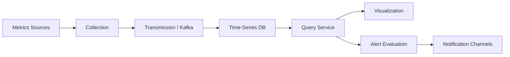
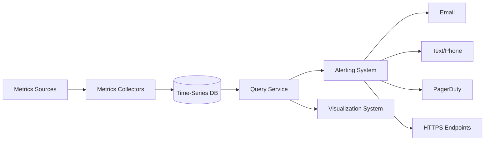
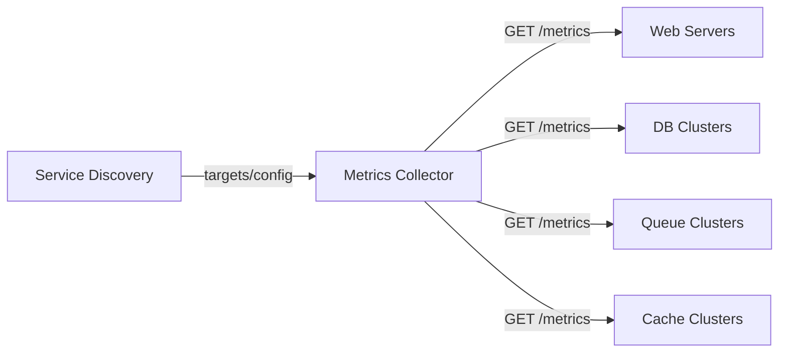
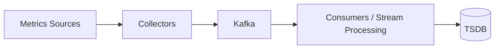
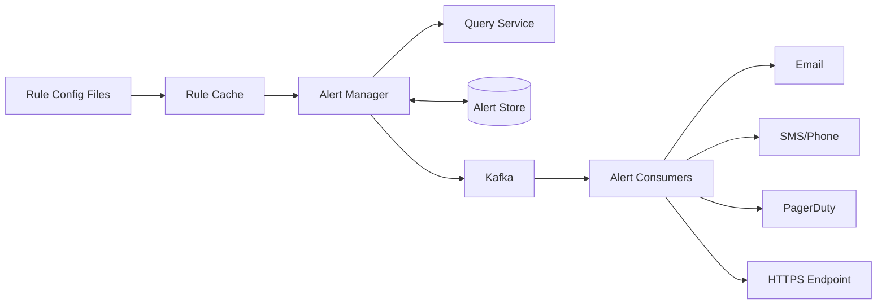
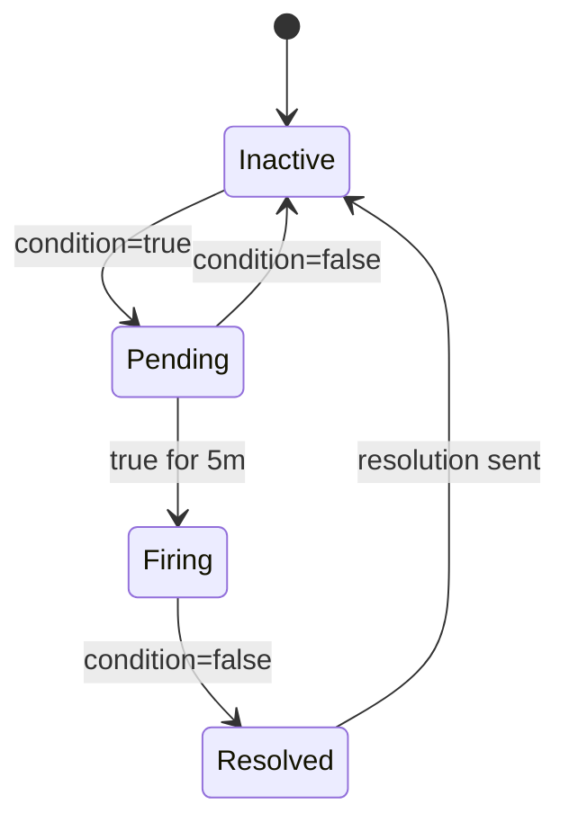
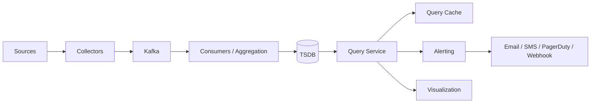
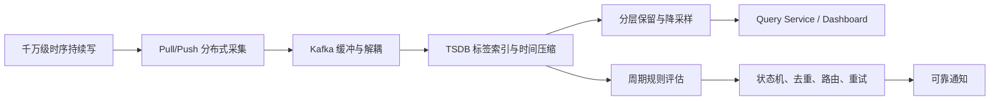
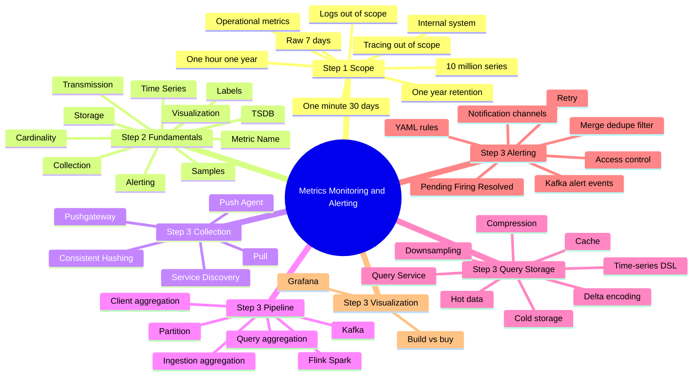

> 原书：Alex Xu、Sahn Lam，*System Design Interview: An Insider's Guide, Volume 2*（2022）
> 范围：Chapter 5: Metrics Monitoring and Alerting System（PDF 第 135～161 页）
> 目标：为大型公司内部设计可扩展的指标监控与告警系统，完成指标采集、传输、时序存储、查询、告警和可视化。

## 0. 监控系统解决的不是“存几个数字”

指标监控系统持续回答三类问题：

1. **现在发生了什么？** CPU、内存、请求率、错误率、队列深度是否正常？
2. **过去发生了什么？** 故障前后趋势、周期、相关指标怎样变化？
3. **什么时候需要行动？** 某条件持续多久后，应向谁、通过什么渠道告警？

在本章规模下，约有：

$$
1000\text{ 个服务器池}\times100\text{ 台/池}\times100\text{ 指标/台}
=10{,}000{,}000\text{ 条时序}
$$

每条时序持续产生 Sample。即使一个 Sample 很小，千万级时序、高频采样和一年保留也会形成巨量写入与存储。与此同时，故障期间大量工程师打开相同 Dashboard，告警规则同时查询，读取呈突发性。

本章系统可概括为：



最核心的工程矛盾是：

$$
\text{高频原始数据的诊断价值}
\quad vs.\quad
\text{长期保存、查询和成本}
$$

作者用压缩、分层保留和降采样解决；用 Kafka 隔离采集与存储；用状态化 Alert Manager 把“阈值命中”变成可靠、去重、可路由的通知。

---

## 1. Step 1：理解问题并确定设计范围

“监控”可能指指标、日志、链路追踪或业务分析。作者先确认使用者、数据类型、规模、保留策略、通知渠道和范围外能力。

## 1.1 为谁设计

系统仅供大公司内部使用，不做 Datadog/Splunk 式多租户 SaaS。

这排除了或弱化：

- 外部租户计费；
- 客户自助注册；
- 跨租户硬隔离；
- 公网产品 SLA；
- 每租户配额与品牌化 UI。

内部系统仍需团队/服务维度的访问控制、配额和成本归属，但设计重点转向大规模基础设施可观测性。

## 1.2 采集哪些指标

只采集 Operational/System Metrics：

- CPU Load；
- 内存使用；
- 磁盘空间；
- 每秒请求数；
- Server Pool 运行实例数；
- Message Queue 消息数等。

Business Metrics 不在本章范围。例如收入、订单转化率与广告点击属于业务分析，往往有不同精确性、治理和延迟要求。

## 1.3 基础设施规模

原书假设：

- 产品有 1 亿 DAU，用于说明内部基础设施规模；
- 1000 个服务器池；
- 每池 100 台机器；
- 每台 100 个指标；
- 约 1000 万条指标时序。

注意“1000 万 metrics”更准确地应理解为约 1000 万个活跃 Time Series，而非每天只写 1000 万个数据点。每条时序随采样间隔持续产生数据点。

## 1.4 保留与分辨率

保留一年，并采用分层策略：

- 最近 7 天：原始分辨率；
- 7～30 天：1 分钟分辨率；
- 30 天～1 年：1 小时分辨率。

“30 天保留 1 分钟分辨率”在工程上通常解释为：最近 30 天可查分钟 Rollup，其中前 7 天还额外保留 Raw；30 天后只保留小时 Rollup。

## 1.5 告警渠道

- Email；
- 电话/短信；
- PagerDuty；
- Webhook/HTTPS Endpoint。

不同渠道拥有不同重试、速率、载荷和确认语义，需由独立通知消费者适配。

## 1.6 范围外能力

### 日志监控

日志是离散文本/结构事件，典型方案为 ELK/Elastic Stack。它与数值时序的索引、存储和查询不同。

### 分布式追踪

Trace 记录一次请求跨服务的 Span 因果链，解决“请求经过哪里、哪段最慢”。本章不设计 Dapper/Zipkin 类系统。

三种可观测信号应区分：

| 信号 | 核心问题 | 数据形态 |
|---|---|---|
| Metrics | 系统趋势与聚合是否异常 | 低维数值时序 |
| Logs | 某个离散事件具体发生了什么 | 文本/结构事件 |
| Traces | 一次请求跨服务怎样传播 | Span 图/因果链 |

## 1.7 非功能需求

### 可扩展性

指标数、Sample 速率、规则数和 Dashboard 都会增长。采集、传输、存储和查询必须独立扩展。

### 低延迟

Dashboard 与告警查询要快。若采集正常但规则查询需几分钟，告警已经失去时效性。

### 可靠性

系统不能轻易漏掉关键告警；但也要控制重复和告警风暴。监控系统本身故障时应可被另一路径监控，避免“监控盲区”。

### 灵活性

技术和指标来源持续变化，管道应通过标准协议、Kafka、查询抽象和插件化工具减少耦合。

## 1.8 容量估算：原书未给采样周期时怎样处理

原书明确时序数但未指定 Raw Sampling Interval，无法得出唯一写 QPS。应写成参数：

设：

- $N=10^7$ 条时序；
- 每 $\Delta s$ 秒一个 Sample；
- 每点压缩后 $b$ bytes；
- 副本因子 $r$。

写入点率：

$$
Q_{samples}=\frac{N}{\Delta s}
$$

入口字节率：

$$
B=\frac{N}{\Delta s}\times b
$$

教学化假设 Raw 每 10 秒采一次，则：

$$
Q_{samples}=\frac{10^7}{10}=10^6\text{ samples/s}
$$

若每点压缩后 16 bytes，则不含索引/副本的入口约：

$$
16\text{ MB/s}\approx1.38\text{ TB/day}
$$

### 分层保留点数

每条时序保留点数：

$$
P_{series}
=\frac{7\times86{,}400}{\Delta s}
+23\times1{,}440
+335\times24
$$

取 $\Delta s=10$ 秒：

$$
P_{series}=60{,}480+33{,}120+8{,}040=101{,}640
$$

全部时序约：

$$
P_{total}=10^7\times101{,}640
=1.0164\times10^{12}\text{ points}
$$

若全年都保留 10 秒 Raw：

$$
P_{raw-year}=10^7\times\frac{365\times86{,}400}{10}
=3.1536\times10^{13}
$$

分层保留点数约降为：

$$
\frac{1.0164\times10^{12}}{3.1536\times10^{13}}
\approx3.22\%
$$

即减少约 96.8% 的点数。代价是旧数据无法恢复到原始 10 秒细节。

---

## 2. Step 2：提出高层设计并取得共识

作者依次介绍五个基本组成、时序数据模型、访问模式、存储选型和高层架构。

## 2.1 五个基本组成

1. **Data Collection**：从服务器、数据库、队列、缓存等来源采样；
2. **Data Transmission**：把 Sample 可靠传到监控系统；
3. **Data Storage**：按 Time Series 组织并保存；
4. **Alerting**：执行规则、检测异常、生成通知；
5. **Visualization**：用图表展示趋势、相关性和异常。

这是一条端到端链路：采不到、传丢、存不下、查太慢或通知失败，都会让“告警可靠”失效。

## 2.2 时序数据模型

一个 Sample 可表示为：

```text
metric_name = cpu.load
labels      = {host: i631, env: prod}
timestamp   = 1613707265
value       = 0.29
```

一条 Time Series 由 Metric Name 与完整 Label Set 唯一标识：

$$
series\_id=(metric\_name,sorted(labels))
$$

该 Series 随时间产生：

$$
[(t_1,v_1),(t_2,v_2),\ldots]
$$

### 四个概念不要混淆

- **Metric Name**：如 `http_error_count`；
- **Label/Tag**：如 `servicepool=s1`、`method=GET`；
- **Time Series**：一个名称 + 一组固定标签；
- **Sample/Data Point**：某时刻的值。

例如：

```text
http_error_count{servicepool="s1",method="GET",machine="m1"}
http_error_count{servicepool="s1",method="GET",machine="m2"}
```

是两条不同 Series。查询可选择 `servicepool=s1, method=GET`，跨所有机器聚合时间 $t_4$ 到 $t_7$ 的点。

## 2.3 Line Protocol

原书给出类似：

```text
CPU.load host=webserver02,region=us-west 1613707265 53
CPU.load host=webserver01,region=us-west 1613707265 76
```

Line Protocol 把 Metric、Labels、Timestamp、Value 编码成紧凑行。Prometheus/OpenTSDB 等系统虽具体格式不同，但都围绕同一时序模型。

## 2.4 Label Cardinality

若标签 $L_i$ 有 $c_i$ 个可能值，理论 Series 数上界接近：

$$
Cardinality\approx\prod_i c_i
$$

例如 `region=10`、`method=5`、`host=100000`：

$$
10\times5\times100000=5{,}000{,}000\text{ series}
$$

标签索引虽让过滤快速，却可能产生 Cardinality Explosion。`user_id`、`request_id`、完整 URL 等高基数字段不适合作 Label；应进日志/Trace，或先归一化。

## 2.5 数据访问模式

### 持续重写入

每条 Time Series 周期性追加 Sample，系统长期承受稳定高写负载。

### 突发读取

平时 Dashboard 访问可控；事故时工程师、告警规则和自动化同时查询最近数据，读取突然放大。

### 典型查询

- 选取 Metric Name；
- 按 Labels 过滤 Series；
- 选择时间范围；
- 按时间窗口聚合；
- 跨实例执行 `sum/avg/max/rate/quantile`。

这不是按主键查一行，而是“标签倒排选 Series + 时间范围扫描 + 向量聚合”。

## 2.6 为什么选择 TSDB

### 不优先选择关系型数据库

理论上可以，但在本章规模下：

- 每个 Label 需要索引；
- 持续高写会使索引维护昂贵；
- 时间窗口、移动平均等 SQL 冗长；
- Retention、Rollup、压缩要自行实现；
- 水平分片与 Series Cardinality 管理复杂。

### 不优先自己用通用 NoSQL 拼装

需要深入理解底层键模型，自己实现时序索引、压缩、Retention 和查询引擎。已有成熟 TSDB 时收益不高。

### TSDB 的价值

- 针对按时间追加优化；
- 标签倒排索引；
- 时间范围压缩与扫描；
- Retention/Rollup；
- 时序查询语言；
- 热内存缓存 + 冷磁盘块。

原书举例 OpenTSDB、Twitter MetricsDB、Amazon Timestream、InfluxDB、Prometheus。某 8 核 32 GB InfluxDB 基准可超过 250,000 writes/s，但机器数必须由自己的 Cardinality、Batch、查询、Retention 和硬件压测决定。

## 2.7 高层架构



- Metrics Collector：采集、校验、可选聚合后写 TSDB；
- TSDB：按 Metric/Labels/Time 保存与查询；
- Query Service：封装统一查询接口；
- Alerting：周期查询并管理告警状态/通知；
- Visualization：Dashboard 展示。

---

## 3. Step 3：深入设计

作者按 Metrics Collection、Transmission Pipeline、Query、Storage、Alerting、Visualization 展开。

## 3.1 Metrics Collection：Pull 与 Push

### 3.1.1 Pull Model

Collector 周期性通过 HTTP 拉每个目标的 `/metrics`。

完整流程：

1. Collector 从 Service Discovery 获取 Endpoint、采样间隔、Timeout、Retry 等；
2. Collector 请求目标 `/metrics`；
3. Collector Watch Service Discovery，或周期轮询 Endpoint 变化。



Service Discovery 很关键：机器频繁扩缩容，静态配置会漏采新实例并继续采已删除实例。

### 多 Collector 去重

若多个 Collector 同时拉同一目标，会产生重复 Sample 和双倍目标负载。作者用一致性哈希：

$$
owner(target)=successor_{ring}(hash(target\_id))
$$

每个 Collector 负责环上一个范围。节点增减只迁移部分 Target。实际还要处理：

- Collector 短暂双 Owner；
- 故障检测期间采集空洞；
- 环版本不一致；
- 热目标不均衡；
- 使用虚拟节点改善分布。

### 3.1.2 Push Model

每台主机安装 Collection Agent，收集本机服务指标并周期 Push 到 Collector。

Agent 可以先聚合简单 Counter，减少网络流量；Collector 集群前放 Load Balancer，根据 CPU/吞吐自动扩缩。

Agent 应有小型缓冲，Collector 短暂落后时减少丢点，但缓冲必须有限并暴露 Drop Metrics，避免磁盘被监控数据占满。

## 3.2 Pull 与 Push 的对比

| 维度 | Pull | Push |
|---|---|---|
| 调试 | 直接访问 `/metrics`，简单 | 需查看 Agent/Collector 路径 |
| 健康检查 | 拉不到本身就是可用性信号 | 没收到可能是源、Agent 或网络故障 |
| 短任务 | 可能结束前未被拉到，需 Pushgateway | 天然可在结束前推送 |
| 网络 | Collector 必须能访问所有目标 | 目标只需能访问 LB/Collector |
| 性能 | 常用 HTTP/TCP，连接可复用 | 可用 UDP 降延迟，也可用可靠协议 |
| 数据真实性 | Target 在 SD 白名单内较自然 | 必须认证、授权与限流 |
| Serverless | 无固定 Agent/Endpoint 时困难 | 平台可 Push，但应用侧也有限制 |

真实例子：Prometheus 偏 Pull；CloudWatch、Graphite 偏 Push。

结论不是“哪种永远更好”，而是根据网络拓扑、任务寿命、调试与身份模型选择，必要时混合。

## 3.3 Scale the Metrics Transmission Pipeline

Collector 直写 TSDB 会紧耦合：数据库慢或不可用时，Collector 堵塞并丢数据。作者加入 Kafka：



收益：

- 可靠、可扩展缓冲；
- 解耦采集与写库；
- TSDB 故障时保留积压；
- Consumer 可重放；
- Flink/Spark 可做清洗和聚合。

代价：Kafka 运维、额外延迟、重复事件和积压容量。Facebook Gorilla 表明也可让 TSDB 自身在部分网络故障下保持高可用写入，不一定必须有中间队列。

### Kafka 分区

- Partition 数按吞吐设置；
- 可按 Metric Name 分区，使同类数据在同 Consumer 聚合；
- 可进一步包含低基数 Label；
- 关键 Metric 与普通 Metric 分 Topic/优先级，防止噪声淹没告警信号。

分区键必须避免热点。所有 `cpu.load` 都进一个 Partition 会过热；通常对 Series ID 做 Hash，在聚合时再并行归并。

## 3.4 Aggregation 在哪里做

### Collection Agent

适合本机简单 Counter/Sum。优点是最早减流量，缺点是丢失细粒度和跨主机视角。

### Ingestion Pipeline

用 Flink 等在写库前窗口聚合：

- 显著减少写量；
- 告警查询更快；
- 要处理迟到事件、Watermark 与重算；
- Raw 未保存时失去精度和未来查询灵活性。

### Query Side

保存 Raw，查询时聚合：

- 无精度损失，规则灵活；
- 大时间范围查询慢、CPU 贵；
- 故障时并发查询容易压垮 TSDB。

合理组合是：近期保留 Raw，同时预计算常用 Rollup；查询按时间范围选择合适分辨率。

## 3.5 Query Service

Query Service 是 Visualization、Alerting 与 TSDB 之间的适配层：

- 统一查询 API；
- 隔离具体 TSDB；
- 做认证、限流、超时；
- 路由 Raw/1m/1h 数据；
- 可做结果缓存；
- 防止昂贵查询拖垮存储。

### Cache Layer

缓存相同 Dashboard/规则查询可降低 TSDB 压力。但时间序列查询不断向“现在”滑动，键应包含：

```text
(normalized_query, start, end, resolution, tenant/version)
```

最近窗口 TTL 短，历史不变窗口 TTL 长。缓存不能让告警读到超过 SLO 的陈旧值。

### 反对自建 Query Service 的理由

成熟 Grafana/Alertmanager 插件可直连主流 TSDB；选对 TSDB 后可能不需自建抽象和 Cache。额外服务会带来维护、语义差异和新故障点。

是否引入取决于：多 TSDB、访问控制、查询治理、兼容层和规模，而不是架构图是否“完整”。

## 3.6 TSDB Query Language

时序查询常用：

- Range Selection；
- Label Filter；
- Window/Rolling Aggregate；
- Rate；
- Moving Average；
- Group By Labels。

这些用 SQL Window Function 能表达，但较冗长。PromQL、Flux 等 DSL 更贴近时序操作。DSL 的价值是表达领域语义，不表示 SQL 无法计算。

### Rate 与 Counter Reset

Counter 只增但进程重启会归零，不能简单执行：

$$
rate=\frac{v_{end}-v_{start}}{\Delta t}
$$

需要识别 Reset，并对每段正增量求和。成熟 TSDB 的 `rate()` 通常封装这类边界。

## 3.7 Storage Layer

### 3.7.1 热数据优先

Facebook Gorilla 论文显示至少 85% 的 Operational Store 查询访问过去 26 小时数据。因此 TSDB 应让最新块驻内存/Page Cache，把旧块放更便宜层级。

这个分布不是普适常数，但说明应测量 Query Recency，而不是让全年数据使用同一介质和索引策略。

### 3.7.2 Encoding 与 Compression

时间戳通常接近固定间隔。原书示例：

```text
absolute: 1610087371, 1610087381, 1610087391, 1610087400, 1610087411
delta:             10,         10,          9,         11
```

存一个 Base Timestamp，再存较小 Delta。严格说图题为 Double-delta，但展示文字主要是 First Delta；Double-delta 还会存相邻 Delta 的差：

```text
first delta:      10, 10, 9, 11
delta-of-delta:       0, -1, 2
```

固定采样时 Delta-of-delta 常为 0，压缩效果更好。

Value 也可用 XOR、RLE、Dictionary 等编码。压缩有效是因为同一 Series 的 Timestamp/Value 往往有局部相关性。

## 3.8 Downsampling

Downsampling 把高分辨率窗口聚合成低分辨率点：

$$
bucket(t)=\left\lfloor\frac{t}{W}\right\rfloor W
$$

每个 Bucket 保存 `avg/min/max/sum/count` 等，而不是只保存 Avg；这样未来还能组合：

$$
avg_{combined}=\frac{\sum_i sum_i}{\sum_i count_i}
$$

不能直接平均各 Bucket 的 Avg，除非每桶 Count 相同。

### 原书示例

10 秒点：

```text
19:00:00 -> 10
19:00:10 -> 16
19:00:20 -> 20
19:00:30 -> 30
19:00:40 -> 20
19:00:50 -> 30
```

按 30 秒 Bucket 平均：

$$
avg_0=\frac{10+16+20}{3}=15.33
$$

$$
avg_1=\frac{30+20+30}{3}=26.67
$$

但原书表 5.5 写为 19 和 25，与表 5.4 的输入算术不一致。本文保留原表事实并明确勘误；正确平均应为 15.33 与 26.67。

### 降采样的局限

- 平均值会隐藏尖峰；
- P99 不能从 P99 的平均恢复；
- Counter Rollup 需保存 Sum/Increase；
- Gauge 可保存 Min/Max/Avg/Last；
- Histogram 应合并 Bucket Count，而不是平均 Quantile；
- Late Sample 需要修正已经关闭的 Bucket。

## 3.9 Cold Storage

很少访问的旧数据迁移到低成本存储。Cold Tier 延迟更高，不服务实时告警；查询服务可异步读取或要求用户缩小范围。

Downsampling 与 Cold Storage 不同：

- Downsampling 减少数据点，改变分辨率；
- Cold Storage 改变介质，数据可以仍是原精度。

## 3.10 可运行示例：窗口 Rollup

```python
from collections import defaultdict

def rollup_average(samples, window_seconds):
    buckets = defaultdict(lambda: {"sum": 0.0, "count": 0})
    for timestamp, value in samples:
        bucket_start = timestamp - timestamp % window_seconds
        bucket = buckets[bucket_start]
        bucket["sum"] += value
        bucket["count"] += 1

    return [
        {
            "timestamp": bucket_start,
            "sum": bucket["sum"],
            "count": bucket["count"],
            "avg": bucket["sum"] / bucket["count"],
        }
        for bucket_start, bucket in sorted(buckets.items())
    ]

if __name__ == "__main__":
    raw = [(0, 10), (10, 16), (20, 20), (30, 30), (40, 20), (50, 30)]
    print(rollup_average(raw, 30))
```

代码对应：

- `timestamp % window_seconds`：对齐 Bucket；
- `sum/count`：保留可组合聚合状态；
- 排序：输出可直接作为低分辨率 Time Series；
- 输出 Avg 15.33 与 26.67，验证原表算术差异。

## 3.11 Alerting System



### 3.11.1 规则配置

YAML 示例：

```yaml
name: instance_down
rules:
  - alert: instance_down
    expr: up == 0
    for: 5m
    labels:
      severity: page
```

`for: 5m` 表示条件连续成立 5 分钟才 Firing，用于过滤短暂抖动；不只是“查询过去 5 分钟任意一点为 0”。

### 3.11.2 告警状态机

Alert Store（如 Cassandra）保存：



状态化的必要性：

- 防止每次规则评估都发通知；
- 支持 `for` 持续时间；
- 合并、去重、静默、抑制；
- 记录通知重试和恢复通知；
- Manager 重启后继续正确状态。

### 3.11.3 七步告警流程

1. Rule Config 加载到 Cache；
2. Alert Manager 获取规则；
3. 按间隔调用 Query Service，阈值违反时创建/更新事件；
4. Alert Store 持久化 Inactive/Pending/Firing/Resolved；
5. 符合通知条件的事件写 Kafka；
6. Alert Consumers 拉事件；
7. 按渠道发送 Email、Text、PagerDuty、Webhook。

### 3.11.4 Alert Manager 职责

- Filter：按 Severity、环境、维护窗口过滤；
- Merge/Group：同一实例短时间多个相同事件合成一条；
- Deduplicate：相同 Fingerprint 不重复通知；
- Access Control：限制规则、静默和路由修改；
- Retry：确保通知至少一次。

Fingerprint 常由：

$$
fingerprint=hash(alert\_name,relevant\ labels)
$$

生成。不能包含每次变化的 Timestamp，否则无法去重。

### 3.11.5 “至少一次通知”的真实含义

Kafka 与 Retry 可让通知尝试至少一次，但第三方收到后 ACK 丢失会导致重复。渠道调用应携带 Idempotency Key；值班系统不能假设绝不重复。

可靠告警还要监控：

- Rule Evaluation Lag/Failure；
- Kafka Lag；
- Notification Success/Retry；
- Alert Store Error；
- Dead-letter Queue；
- 端到端“金丝雀告警”。

## 3.12 告警质量：阈值之外的工程补充

### 告警风暴

共享依赖故障可触发数千实例告警。应按 Service/Region/Root Cause Group，并用抑制规则：上游故障 Firing 时，压制下游症状。

### Flapping

值在阈值附近反复切换会不断 Firing/Resolved。可使用：

- `for` 持续时间；
- 触发和恢复使用不同阈值（Hysteresis）；
- 最小通知间隔；
- Missing Data 明确语义。

### Missing Data

“没有 Sample”不等于数值 0。可能是目标下线、Collector 故障、网络分区或查询延迟。Pull 模式更容易把 Scrape Failure 作为独立 Health Signal。

## 3.13 Build vs Buy：Alerting

成熟系统已经提供 TSDB 集成、通知渠道、静默、路由和去重。现实中自建完整 Alerting 很难证明收益。

只有在以下情况更可能自建：

- 超大规模带来显著成本；
- 特殊规则/路由语义；
- 强内部权限与合规；
- 现有系统无法满足延迟或可用性；
- 团队有长期维护能力。

## 3.14 Visualization System

Dashboard 在不同时间尺度展示请求、内存/CPU、页面加载、流量和登录等指标。作者推荐 Grafana 类现成系统：

- 支持多 TSDB 插件；
- Dashboard、变量和共享成熟；
- 避免重复开发图表、权限和查询编辑器。

视觉系统不是只画线，还应：

- 根据时间范围自动选择 Resolution；
- 限制最大 Series/Points；
- 对齐时区和 Bucket；
- 显示 Gap 而不是补 0；
- 标注部署、事故和告警事件。

---

## 4. Step 4：收束与最终设计

作者最终强调：

- Pull 与 Push 没有绝对赢家；
- Kafka 可扩展并解耦传输管道，但不是唯一方案；
- TSDB 要按时序模式选型；
- Compression/Encoding/Downsampling/Cold Storage 控制空间；
- Alerting 与 Visualization 优先评估成熟产品。



全章形成一条清晰因果链：



---

## 5. 容易混淆的概念与常见误区

### 5.1 Metric Name 不等于 Time Series

同一个 Name 配不同 Label Set 会产生许多 Series。容量和索引压力由 Series Cardinality 主导。

### 5.2 “1000 万指标”不等于每天 1000 万点

更合理的理解是约 1000 万活跃 Series，每条按频率持续写。原书该句表述容易误导。

### 5.3 Label 不是任意上下文容器

高基数 `request_id/user_id` 会造成 Series Explosion。它们通常应进 Logs/Traces。

### 5.4 Metrics、Logs、Traces 不是一种数据的三种 UI

三者数据模型和核心查询不同。本章明确只设计 Metrics。

### 5.5 Pull 不等于不能扩展

Collector Pool 可通过一致性哈希分担 Target；难点是 Target 发现、Ownership 和网络可达性。

### 5.6 Push 不等于自动知道目标健康

没收到指标可能是服务故障、Agent 故障或网络故障，需要 Heartbeat/Deadman Signal 区分。

### 5.7 Push 常用 UDP 不表示只能用 UDP

可以使用 HTTP/gRPC/TCP。协议要按丢点容忍、延迟和网络选择。

### 5.8 Service Discovery 不只是地址簿

Pull 模式还需要采样间隔、Timeout、Retry、Labels 和变更通知。

### 5.9 Kafka 不是必需组件

它提高解耦、缓冲和重放能力，也增加运维与延迟。能直接高可用写的 TSDB 可省略。

### 5.10 Kafka Partition Key 不应只用热门 Metric Name

所有同名 Metric 进入一个 Partition 会热点。更常用 Series Hash，并在下游并行聚合。

### 5.11 Aggregation 与 Downsampling 相关但不完全相同

- Aggregation 可跨 Series 或时间窗口；
- Downsampling 专指降低时间分辨率以减少长期数据。

### 5.12 Downsampling 不等于 Sampling

Downsampling 通常对窗口内全部点聚合；Random Sampling 只保留部分原始点，统计性质不同。

### 5.13 Avg of Avg 不总等于全局 Avg

必须保存 `sum/count`，除非所有子桶 Count 相同。

### 5.14 原书 30 秒 Rollup 表存在算术错误

输入 `[10,16,20]` 和 `[30,20,30]` 的平均分别是 15.33、26.67，不是 19、25。

### 5.15 原书“Double-delta”图文字主要展示 First Delta

`10,10,9,11` 是 Timestamp Delta；Double-delta 还应是 `0,-1,2`。

### 5.16 平均值会隐藏尖峰

告警或 SLO 需要 Min/Max、Histogram 或 Quantile。只保留 Avg 会让短故障消失。

### 5.17 Quantile 不能直接平均

实例 P99 的平均不是集群 P99。要聚合可合并 Histogram Bucket 或 Sketch。

### 5.18 Counter、Gauge、Histogram 不能用同一 Rollup

- Counter 看 Increase/Rate；
- Gauge 看 Avg/Min/Max/Last；
- Histogram 合并 Bucket Count。

### 5.19 Cold Storage 不等于 Downsampling

一个改变介质，一个改变分辨率，可同时使用。

### 5.20 Cache 命中不一定适合告警

告警必须控制数据陈旧度。Dashboard 历史查询可长缓存，实时规则不应盲目复用旧结果。

### 5.21 Query Service 不是必备“中间层”

单 TSDB + 成熟插件时可直连；多存储、复杂权限和查询治理时才更有价值。

### 5.22 阈值命中不等于立即通知

规则可能先进入 Pending，持续 `for` 时间后才 Firing；还要合并、静默、抑制和路由。

### 5.23 `for: 5m` 不等于“过去五分钟出现过一次异常”

它要求条件连续成立。查询窗口和状态持续时间是两层语义。

### 5.24 Missing Data 不等于 0

补 0 可能制造假告警或掩盖采集故障。应使用 Stale/Unknown 状态。

### 5.25 至少一次通知会重复

Alert Consumer 重试可能让 Email/PagerDuty 收到两次。要用 Fingerprint/Idempotency Key 去重。

### 5.26 告警状态与通知状态不是同一状态

Alert 可以 Firing，但某渠道仍 Pending Retry。Alert Store 要分别记录规则状态与 Delivery 状态。

### 5.27 监控系统也需要被监控

若 Collector、TSDB 或 Alert Manager 失效而无人知晓，主系统再健康也失去可观测性。需外部金丝雀与独立通知路径。

### 5.28 Build vs Buy 不是技术能力展示题

成熟 TSDB、Grafana、Alertmanager 通常更经济。自建必须有规模、语义、合规或成本上的明确理由。

---

## 6. 本章知识结构



## 7. 核心结论

1. **先区分可观测信号。** 本章只设计 Operational Metrics，不把日志、Trace 和业务指标混入同一模型。
2. **Time Series 由 Name + Label Set 唯一标识。** Sample 才是某时刻的值。
3. **Cardinality 是时序系统首要容量变量。** 高基数标签可让 Series 数呈乘法爆炸。
4. **负载是持续重写、突发读取。** TSDB 必须同时优化顺序时序写和故障期范围聚合查询。
5. **成熟 TSDB 优于自行拼装通用数据库。** 它内建标签索引、时间压缩、Retention、Rollup 和 DSL。
6. **Pull 与 Push 各有适用条件。** Pull 易调试并天然检测目标可达性；Push 适合短任务和复杂网络。
7. **Pull 集群可用一致性哈希分配 Target。** 目标应由一个 Collector 负责，节点变化时只迁移部分 Ownership。
8. **Kafka 提供缓冲、解耦和重放，但不是绝对必需。** 应比较其可靠性收益和运维成本。
9. **Aggregation 位置决定精度、写量与查询成本。** 越早聚合越省资源，越晚聚合越灵活。
10. **分层保留是控制一年数据成本的关键。** 近期保 Raw，中期分钟级，长期小时级。
11. **Delta/Double-delta 利用采样规律压缩 Timestamp。** 相邻点局部相关性是 TSDB 高压缩率来源。
12. **Rollup 必须匹配 Metric 类型。** Sum/Count 可组合；P99、Counter、Gauge、Histogram 语义不同。
13. **告警是状态机，不是一次布尔查询。** `for`、Pending、Firing、Resolved 让系统过滤抖动并可靠恢复。
14. **Alert Manager 的核心是降低噪声并保证送达。** 合并、去重、抑制、访问控制、Retry 和渠道路由缺一不可。
15. **成熟 Alerting/Visualization 通常应购买或复用。** 自建需明确不可替代的理由。

## 8. 解决指标监控与告警问题的一般思路

### 第一步：定义信号、规模和时效

明确是 Metrics 还是 Logs/Traces；计算 Series Cardinality、Sampling Interval、峰值点率、保留和告警延迟。

### 第二步：控制指标模型

制定 Naming/Label 规范和基数预算；拒绝把无界 ID 放 Label。Schema 治理必须早于 TSDB 扩容。

### 第三步：选择 Pull、Push 或混合

根据 Target 生命周期、网络方向、调试、身份和 Serverless 决定；Pull 用 Service Discovery，Push 用 Agent/LB/认证。

### 第四步：隔离采集与存储故障

规模和可靠性需要时加入 Kafka，按 Series Hash 分区并设置优先级；同时监控 Lag 和容量。

### 第五步：让 TSDB 承担时序专长

使用标签索引、时间块、压缩、Retention 和领域查询语言，不重复实现通用能力。

### 第六步：设计 Raw、Rollup 和 Cold Tier

为不同 Metric 类型选择可组合聚合状态；近期 Raw，旧数据降采样，极冷数据迁低成本介质。

### 第七步：治理查询

统一 Resolution Routing、Series/Points Limit、Timeout、Cache 与权限；防止事故期间 Dashboard 查询压垮 TSDB。

### 第八步：把告警设计成持久状态机

规则评估产生状态转移，Alert Store 保存状态；Kafka 解耦渠道；Fingerprint 去重；Retry 至少一次；DLQ 处理永久失败。

### 第九步：减少噪声而不是只增加规则

使用 `for`、Hysteresis、Grouping、Silence、Inhibition、Severity 和 Maintenance Window，让每条 Page 都可行动。

### 第十步：验证监控链路本身

持续检查：

- Scrape/Push 成功率；
- Sample Ingestion Lag；
- Kafka Lag；
- TSDB 写入和查询延迟；
- Rule Evaluation Lag；
- Notification 成功与重复；
- Cardinality 增长；
- Downsampling 正确性；
- 端到端 Canary Alert。

整章可以压缩为：

$$
\boxed{
\text{控制时序基数}
\rightarrow
\text{Pull/Push 可靠采集}
\rightarrow
\text{Kafka 解耦缓冲}
\rightarrow
\text{TSDB 压缩存储}
\rightarrow
\text{分层降采样}
\rightarrow
\text{受治理的查询}
\rightarrow
\text{状态化告警与可靠通知}
}
$$

本章最值得迁移的方法是：**从 Time Series Cardinality 和 Sampling Rate 而非“机器数”估算规模；让成熟 TSDB 处理时间索引与压缩，再围绕采集故障、查询突发和告警状态建立可靠管道。**
