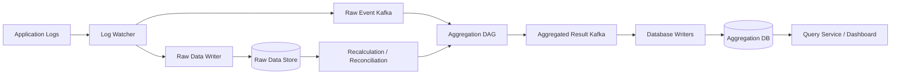
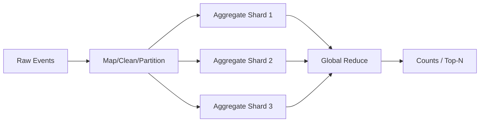
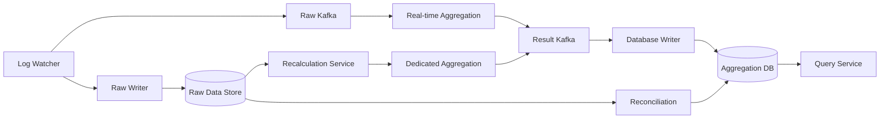
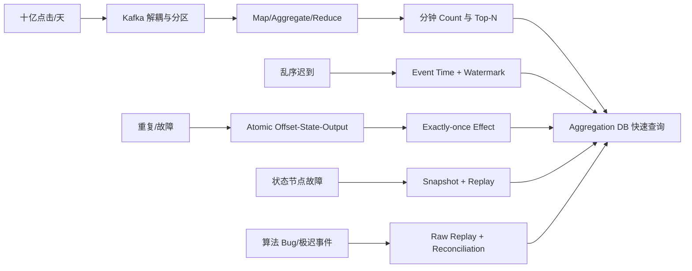
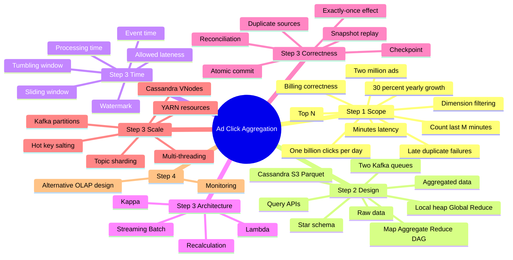

> 原书：Alex Xu、Sahn Lam，*System Design Interview: An Insider's Guide, Volume 2*（2022）
> 范围：Chapter 6: Ad Click Event Aggregation（PDF 第 163～198 页）
> 目标：在 Facebook/Google 规模下，近实时聚合广告点击数与 Top-N 热门广告，并正确处理迟到、重复、局部故障、历史重算和热点。

## 0. 为什么广告点击聚合比普通计数难

数字广告通过实时竞价（Real-Time Bidding，RTB）购买和出售广告库存。点击聚合结果用于：

- 广告效果分析；
- 预算与竞价调整；
- 广告主报表；
- 计费与结算；
- 用户响应、相关性和反欺诈分析。

“每来一个点击就给计数加一”在单机中很简单。在分布式流处理中，事件会：

- 分散在多台应用服务器日志；
- 经网络和消息队列乱序到达；
- 因客户端重试或服务故障重复；
- 在窗口结束后迟到；
- 在状态尚未持久化时遇到 Aggregator 崩溃；
- 由热门广告造成 Key 热点。

而结果又用于计费，少算、重算几个百分点都可能造成巨额差异。系统因此同时追求：

$$
\text{高吞吐}+\text{分钟级时效}+\text{可恢复}+\text{可重算}+\text{业务正确性}
$$

本章的核心流水线是：



原始数据是事实来源，聚合数据是查询优化后的派生视图。Kafka 不只是缓冲，还用于把“处理输入 Offset”和“提交输出结果”纳入流处理事务边界。

---

## 1. Step 1：理解问题并确定设计范围

作者先问数据格式、规模、查询、异常与延迟。这些问题分别决定 Schema、Partition、窗口、状态和交付语义。

## 1.1 输入数据

点击事件追加在不同应用服务器的日志尾部，字段包括：

| 字段 | 含义 |
|---|---|
| `ad_id` | 广告标识 |
| `click_timestamp` | 点击发生时间 |
| `user_id` | 用户标识 |
| `ip` | 来源 IP |
| `country` | 国家/地区 |

原始日志是分散源，Log Watcher 负责 Tail、解析并写入统一消息流。

生产系统还应有唯一 `event_id`、Schema Version、Source Server 和 Ingestion Timestamp。仅用现有字段拼接去重键会误伤同一用户真实多次点击，或漏掉字段完全相同的重复上报。

## 1.2 数据规模

- 每天 10 亿次广告点击；
- 总计 200 万个广告；
- 点击事件每年增长 30%。

30% 年增长的倍增时间为：

$$
T_{double}=\frac{\ln2}{\ln1.3}\approx2.64\text{ 年}
$$

作者近似为每 3 年翻倍。容量不能只按当前平均值设计。

## 1.3 三类查询

1. 返回某 `ad_id` 最近 $M$ 分钟的点击数；
2. 每分钟返回最近 $M$ 分钟点击最多的 Top $N$ 广告，默认可取 Top 100/最近 1 分钟；
3. 上述查询支持按 IP、`user_id`、`country` 等条件过滤。

第一类是按 Key 的窗口 Sum，第二类是所有广告的窗口 Top-N，第三类引入维度组合与 Cardinality。

## 1.4 必须处理的异常

- 迟到事件；
- 重复事件；
- 任意组件局部故障与恢复。

这三项不是“边界优化”，而是流处理正常状态。设计若只描述稳态 Happy Path，计费正确性无法成立。

## 1.5 延迟目标

端到端允许数分钟。要区分：

- RTB 在广告展示前实时决策，通常低于 1 秒；
- 点击聚合主要供账单和报表，分钟级可接受。

这个宽松延迟预算允许一分钟窗口、15 秒 Watermark、Kafka、批量写库和状态 Snapshot，以正确性换少量等待。

## 1.6 功能需求

- 聚合某广告最近 $M$ 分钟点击；
- 每分钟返回最近 $M$ 分钟 Top $N$；
- 按不同属性过滤聚合；
- 支持 Facebook/Google 规模。

## 1.7 非功能需求

### 正确性

结果用于 RTB 分析与广告计费，不能接受百分比级系统误差。

### 迟到与重复处理

使用 Event Time、Watermark、Deduplication、Exactly-once State Transition 与 Batch Reconciliation。

### 鲁棒性

Kafka、Aggregator、Writer、DB 任一处故障都应可恢复，不永久丢状态。

### 数分钟延迟

正确、完整优先于亚秒级，但应监控每阶段 Lag。

## 1.8 粗略估算

原书假设 10 亿 DAU，每用户每天平均点一次广告：

$$
E_{day}=10^9\text{ events/day}
$$

以 $10^5$ 秒近似一天：

$$
Q_{avg}=\frac{10^9}{10^5}=10{,}000\text{ QPS}
$$

以真实 86,400 秒计算：

$$
Q_{avg}\approx11{,}574\text{ QPS}
$$

峰值取平均 5 倍：

$$
Q_{peak}=50{,}000\text{ QPS}
$$

每事件 0.1 KB：

$$
S_{day}=10^9\times0.1\text{ KB}=100\text{ GB/day}
$$

$$
S_{month}\approx3\text{ TB/month}
$$

这是十进制粗估，未含 Kafka 副本、数据库副本、索引、压缩差异、文件元数据和 Raw 长期归档。

峰值字节率约：

$$
B_{peak}=50{,}000\times100\text{ bytes}=5\text{ MB/s}
$$

纯吞吐不算夸张，难点更多在有状态窗口、热点、Exactly-once 和查询读写混合。

---

## 2. Step 2：提出高层设计并取得共识

作者按 Query API、数据模型、数据库、高层异步架构、聚合 DAG 和三个用例展开。

## 2.1 Query API

这里的客户端不是广告浏览者，而是数据科学家、产品经理、广告主等 Dashboard 用户。

### 2.1.1 某广告的聚合点击数

```http
GET /v1/ads/{ad_id}/aggregated_count?from=...&to=...&filter=001
```

| 参数 | 含义 |
|---|---|
| `from` | 开始分钟，默认当前分钟前一分钟 |
| `to` | 结束分钟，默认当前分钟 |
| `filter` | 预定义过滤策略 ID |

响应：

```json
{"ad_id":"ad001","count":98765}
```

时间边界必须规定半开区间，例如 $[from,to)$，避免相邻查询重复计算边界分钟。

### 2.1.2 Top-N 热门广告

```http
GET /v1/ads/popular_ads?count=100&window=1&filter=001
```

- `count`：Top $N$；
- `window`：最近 $M$ 分钟；
- `filter`：过滤策略。

响应应包含 `ad_ids`，实际还应返回 Count、窗口边界、数据更新时间和是否 Final，以免 Dashboard 把 Watermark 前的临时结果当最终账单。

## 2.2 Raw Data

```text
[AdClickEvent] ad001, 2021-01-01 00:00:01, user1, 207.148.22.22, USA
```

Raw 的价值：

- Bug 修复后重算；
- 审计与对账；
- 数据科学/机器学习；
- 欺诈检测；
- 回溯未知维度。

Raw 体积大、正常查询慢，旧数据可迁 Cold Storage。

## 2.3 Aggregated Data

按分钟计数：

| ad_id | click_minute | count |
|---|---|---:|
| ad001 | 202101010001 | 7 |

支持 Filter：

| ad_id | click_minute | filter_id | count |
|---|---|---|---:|
| ad001 | 202101010001 | 0012 | 1 |

Top-N：

| update_time_minute | most_clicked_ads |
|---|---|
| 202101010001 | JSON list of ad IDs/counts |

聚合数据小、查询快，但丢失了事件细节且算法 Bug 会污染结果。

## 2.4 Raw 与 Aggregated 为什么都存

| 维度 | Raw | Aggregated |
|---|---|---|
| 完整性 | 全量事实 | 有损派生结果 |
| 查询 | 慢 | 快 |
| 存储 | 大 | 小 |
| 过滤/重算 | 灵活 | 仅预计算维度 |
| 角色 | Backup/Source of Truth | Serving/Active Data |

两者组合体现 CQRS/Materialized View 思想：写入事实流，读取预计算视图；视图损坏可从事实重建。

## 2.5 Filter Table 与 Star Schema

原书用 `filter_id` 预定义维度组合，如国家、IP、用户。聚合表按：

$$
(ad\_id,click\_minute,dimension/filter)
$$

存 Count。

按 Country 展开：

| ad_id | minute | country | count |
|---|---|---|---:|
| ad001 | 00:01 | USA | 100 |
| ad001 | 00:01 | GBR | 200 |
| ad001 | 00:01 | others | 3000 |

这借鉴 Star Schema：中心 Fact 是 Click Count，Country/IP/User 等是 Dimension。

优点：

- 简单；
- 查询快；
- 复用同一聚合流程。

限制：维度组合会产生 Bucket Explosion。若维度基数分别为 $c_i$，组合上界近似：

$$
B\approx A\times W\times\prod_i c_i
$$

$A$ 为广告数，$W$ 为分钟数。`user_id`、完整 IP 是高基数维度，不宜把所有组合都物化；应预定义常用 Filter、使用 OLAP 下钻或限制查询。

## 2.6 数据库选择

### Raw

- 平均 10K、峰值 50K 写 QPS；
- 正常读取少，重算/分析时范围扫描；
- Cassandra/InfluxDB 等更适合高写和时间范围；
- 或把 10 GB 左右滚动文件写入 S3，使用 ORC/Parquet/Avro。

原书选择 Cassandra 作为讲解例子。

### Aggregated

- 200 万广告每分钟产生聚合写；
- Dashboard/告警持续读最新结果；
- 同时读写密集；
- 具有时序与 OLAP 特征。

可使用 Cassandra/TSDB，也可用 ClickHouse/Druid 等 OLAP Serving Store。选型取决于查询维度和更新方式。

## 2.7 从同步处理到两级消息队列

同步路径中，突发流量超过 Consumer 能力会导致内存溢出和连锁故障。Kafka 解耦后：

- Log Watcher 与 Aggregator 独立扩展；
- Aggregator 与 DB Writer 独立扩展；
- 过载变为可观测 Lag；
- TSDB/DB 短暂故障时结果仍在 Kafka；
- 可重放恢复。

第一 Kafka 存 Raw Event；第二 Kafka 存：

1. 每广告每分钟 Count；
2. 每分钟 Top-N。

为什么 Aggregator 不直接写 DB：输出到 Kafka 可把流处理结果与消费进度做原子提交，也让 Database Writer 独立批量、重试和适配 Schema。

## 2.8 Aggregation DAG

作者用 Map/Aggregate/Reduce 小计算单元构造 DAG：



### Map Node

- 解析、清洗、标准化；
- 按 `ad_id` 路由；
- 保证同 Key 进入同 Aggregate Node。

若 Kafka 已按 `ad_id` 正确分区，可直接消费；但输入可能需清洗，或 Producer Partition 不可控，所以保留 Map。

### Aggregate Node

按 `ad_id` 在内存维护一分钟窗口 Count。它是第一层 Reduce/Combine，把大量事件压缩成较少局部聚合。

### Reduce Node

合并多个局部结果得到全局结果。例如每个 Aggregate 输出 Local Top-3，Reduce 从最多 $3k$ 个候选中求 Global Top-3。

中间状态可在进程内 Shared Memory 或进程间 TCP 传递。

## 2.9 用例一：每广告点击数

1. Map 按 `ad_id` 分发；
2. Aggregate 对一分钟 Tumbling Window 计数；
3. 输出 `(ad_id, minute, count)`。

若同 `ad_id` 被拆到多个 Aggregate，再加 Reduce 做 Sum；若分区完全按 Key，局部结果已是全局结果。

## 2.10 用例二：Top-N

每个 Aggregate Node 维护大小 $N$ 的 Min Heap：

- Heap 未满直接插入；
- 新 Count 大于堆顶，替换堆顶；
- 每次更新 $O(\log N)$；
- 空间 $O(N)$。

Reduce 合并 $k$ 个 Local Top-N，候选最多 $kN$，再求 Global Top-N。

为什么 Local Top-N 足够：若某元素连所属 Shard 的 Top-N 都进不去，则该 Shard 已有至少 $N$ 个元素不小于它，它不可能成为全局 Top-N（处理 Tie 时要定义稳定规则）。

## 2.11 用例三：维度过滤

Map/Aggregate 根据预定义 Dimension 分桶，例如 `(ad_id, minute, country)`。查询无需扫 Raw，直接读 Materialized Bucket。

成本是写放大：一个事件可能同时更新 All、Country、Device 等多个视图。维度必须由真实查询驱动。

---

## 3. Step 3：深入设计

作者依次讨论 Stream/Batch、历史重算、时间与窗口、交付保证、扩展、热点、容错、监控与对账。

## 3.1 Online、Batch 与 Streaming

| 系统 | 输入 | 输出 | 优先指标 | 例子 |
|---|---|---|---|---|
| Online Service | 用户请求 | 立即响应 | 可用性、延迟 | 电商请求 |
| Batch | 有界大数据集 | Materialized View | 吞吐 | MapReduce |
| Streaming | 无界事件流 | 近实时 View | 吞吐、延迟 | Flink |

本章实时聚合用 Stream Processing，Raw Backup/Reconciliation 具有 Batch 特征。

## 3.2 Lambda 与 Kappa

### Lambda Architecture

- Batch Layer 从完整 Raw 重算准确 View；
- Speed Layer 处理实时增量；
- Serving Layer 合并两者。

问题：同一业务逻辑维护 Batch/Stream 两套代码，容易语义漂移。

### Kappa Architecture

只有一套 Stream Engine；历史重算把 Raw 重新作为 Stream 输入同一 Aggregator。

原书高层设计选择 Kappa。这里的“批量从 Raw 读取”不等于另有 Batch Aggregation Code；它只是 Recalculation Source，后续仍走同一实时聚合服务。

## 3.3 Data Recalculation

发现 Aggregator Bug 后：

1. Recalculation Service 从 Raw Store 批量读取 Bug 起点后的事件；
2. 发送给专用 Aggregation Service，不挤占实时主路径；
3. 输出进入第二 Kafka；
4. Database Writer 以版本化/幂等方式覆盖 Aggregation DB。

专用 Recalculation Cluster 必须限流。历史重放速度若远高于实时，会压垮输出 Kafka/DB。

输出最好携带 `job_id/version/is_final`，避免旧实时结果覆盖修正结果。

## 3.4 Event Time 与 Processing Time

### Event Time

点击实际发生时间。优点是业务窗口准确；缺点是客户端时钟可能错或恶意伪造。

### Processing Time

Aggregator 处理事件的服务器时间。优点是可信、简单；缺点是网络/Kafka 延迟会把旧点击放到错误窗口。

因为计费准确性优先，原书选择 Event Time，并用 Ingestion Time、时钟校验、反欺诈和 Watermark 控制风险。

三个时间最好同时保留：

```text
event_time     点击发生
ingestion_time 平台首次接收
processing_time 当前算子处理
```

它们的差值本身就是延迟与异常监控信号。

## 3.5 Watermark

Event Time 窗口 $[s,e)$ 在处理时间到 $e$ 时不能立即确定完整，因为事件可能稍晚到达。原书用额外 15 秒延迟容忍。

更一般地，可定义：

$$
watermark=max\_observed\_event\_time-L
$$

$L$ 是允许乱序/迟到时长。当：

$$
watermark\geq window\_end
$$

窗口可关闭并输出 Final Result。

长 $L$：捕获更多迟到事件、准确度高、延迟和状态内存更大。
短 $L$：结果快、状态小、超晚事件更多。

Watermark 只处理“常见小延迟”，五小时等极迟事件可进 Late Side Output，最终由日终 Reconciliation 修正。试图无限等待会让窗口永不 Final。

## 3.6 Aggregation Window

### Tumbling Window

固定、等长、不重叠：

$$
window(t)=\left[\left\lfloor\frac{t}{W}\right\rfloor W,
\left(\left\lfloor\frac{t}{W}\right\rfloor+1\right)W\right)
$$

一分钟 Count 适用。每事件只属于一个窗口，状态成本低。

### Sliding/Hopping Window

窗口长度为 $M$ 分钟，每分钟计算一次：

$$
[t-M,t),[t-M+1,t+1),\ldots
$$

相邻窗口重叠，适合“最近 $M$ 分钟 Top-N”。

高效方法不是为每个滑窗重算 Raw，而是保存最近 $M$ 个一分钟 Bucket：

$$
count_M(ad,t)=\sum_{i=0}^{M-1}count_{1m}(ad,t-i)
$$

新分钟加入、过期分钟减去即可增量维护。

### 其他窗口

- Hopping：窗口长度大于步长，是离散 Sliding；
- Session：按用户活动间隙划分，本章不适合主聚合。

## 3.7 Delivery Guarantees：为什么要 Exactly-once

At-least-once 对一般分析常够用，但几个百分点误差在广告账单中可能是数百万美元，因此作者推荐 Exactly-once Processing。

这里的目标是：

> 每个输入事件对最终 Aggregation View 的业务效果恰好一次。

不是要求网络只传一次。网络和任务都可以重试，关键是 State/Output/Offset 原子一致。

## 3.8 重复数据来源

### Client-side

客户端重发、双击或恶意点击。恶意重复属于 Ad Fraud/Risk Control；传输重试重复应通过 `event_id` 去重。

### Aggregator Outage

原书失败窗口：

1. 从 Upstream Kafka Offset 100 读到 110；
2. 聚合；
3. 输出到 Downstream Kafka 成功；
4. 提交 Upstream Offset 110 前崩溃；
5. 新 Aggregator 从 100 重读并再次输出。

结果重复。

## 3.9 为什么单独存 Offset 仍不够

### 先存 Offset，再输出

若存 110 后、输出前崩溃，恢复看到 110 会跳过 100～110，造成丢失。

### 先输出，再存 Offset

若输出成功后、存 110 前崩溃，恢复重放 100～110，造成重复。

这是经典 Atomicity Gap：

$$
\text{write output}\quad\text{与}\quad\text{commit input offset}
$$

只调整顺序无法同时消除丢失与重复。

## 3.10 Atomic Commit / Checkpoint

原书提出把输出、状态/Offset 与 ACK 放入分布式事务。现代流引擎通常通过 Barrier + Checkpoint：

1. 一致性 Snapshot 保存 Operator State 和 Input Offset；
2. 输出 Sink 支持事务或两阶段提交；
3. Checkpoint 完成时一起 Commit；
4. 故障后恢复 Snapshot，从对应 Offset 重放；
5. 未提交 Output 被 Abort，已提交 Output 不重复。

若 Source/Sink 都是 Kafka，可用 Kafka Transaction 原子提交 Downstream Records 与 Consumer Offsets。若 Sink 是外部 DB，则需 Idempotent Upsert、Two-phase Commit 或 Transactional Sink。

Exactly-once 的边界必须写清：Kafka 内可保证不等于 Email、第三方计费 API 等外部副作用也自动 Exactly-once。

## 3.11 可运行示例：Event-time、Watermark、Dedup 与 Top-N

下面模拟一分钟 Tumbling Window：

- `event_id` 去重；
- Event Time 分桶；
- `max_event_time - allowed_lateness` 形成 Watermark；
- Watermark 越过窗口末端才 Final；
- 每窗输出 Top-N。

```python
from collections import Counter, defaultdict

class ClickAggregator:
    def __init__(self, window_seconds=60, allowed_lateness=15):
        self.window_seconds = window_seconds
        self.allowed_lateness = allowed_lateness
        self.max_event_time = float("-inf")
        self.seen_event_ids = set()
        self.counts = defaultdict(Counter)

    def add(self, event):
        if event["event_id"] in self.seen_event_ids:
            return "duplicate"

        self.max_event_time = max(self.max_event_time, event["event_time"])
        watermark = self.max_event_time - self.allowed_lateness
        window_start = event["event_time"] // self.window_seconds * self.window_seconds
        window_end = window_start + self.window_seconds
        if window_end <= watermark:
            return "too_late"

        self.seen_event_ids.add(event["event_id"])
        self.counts[window_start][event["ad_id"]] += 1
        return "accepted"

    def close_ready_windows(self, top_n):
        watermark = self.max_event_time - self.allowed_lateness
        ready = []
        for window_start in sorted(list(self.counts)):
            if window_start + self.window_seconds <= watermark:
                counts = self.counts.pop(window_start)
                top = sorted(counts.items(), key=lambda item: (-item[1], item[0]))[:top_n]
                ready.append((window_start, dict(counts), top))
        return ready

if __name__ == "__main__":
    aggregator = ClickAggregator(window_seconds=60, allowed_lateness=15)
    events = [
        {"event_id": "e1", "ad_id": "ad1", "event_time": 10},
        {"event_id": "e2", "ad_id": "ad2", "event_time": 20},
        {"event_id": "e1", "ad_id": "ad1", "event_time": 10},
        {"event_id": "e3", "ad_id": "ad1", "event_time": 70},
        {"event_id": "e4", "ad_id": "ad3", "event_time": 90},
    ]
    for event in events:
        print(aggregator.add(event))
    print(aggregator.close_ready_windows(top_n=2))
```

这是教学化简化：生产 Watermark 通常基于各 Source Partition 的最小进度，Dedup State 要有 TTL/Checkpoint，不能无限增长。

## 3.12 Scale the System

消息队列、Aggregation Service 和 Database 已解耦，可以分别扩展。

### 3.12.1 Message Queue

#### Producer

Log Watcher 可水平扩展。

#### Consumer

Consumer Group 通过增加成员与 Rebalance 扩展；有效并行度不超过 Partition 数。数百 Consumer 的 Rebalance 可能持续数分钟，应在低峰调整并使用 Cooperative Rebalance 等机制。

#### Hashing Key

以 `ad_id` 分区，保证同一广告事件在一个 Partition，便于局部计数和顺序状态。

#### Partition 数

Partition 数变化会让同 `ad_id` 映射改变，因此作者建议预先分配足够 Partition。现代方案也可用稳定虚拟桶，但仍要处理状态迁移。

#### Topic Physical Sharding

按 Geography：North America/Europe/Asia；或按 Business Type：Web/Mobile Ads 分 Topic。

优点：

- 提高总吞吐；
- 单 Topic Consumer 少，Rebalance 更快；
- 故障域与合规隔离。

缺点：

- Topic/Schema/运维数量增加；
- Global Top-N 需再跨 Topic Reduce；
- 数据迁移与跨地域查询复杂。

## 3.13 Scale the Aggregation Service

### Multi-threading

单节点不同线程处理不同 `ad_id`，实现简单、不依赖资源管理器；受单机 CPU/内存限制。

### Multi-processing / Resource Provider

部署到 YARN 等资源管理器，由系统动态分配 Task/Container。工业上更常见，能通过加计算资源水平扩展。

吞吐近似受：

$$
Q_{agg}\leq\min(Q_{input},C\times q_{task},Q_{shuffle},Q_{sink})
$$

不能只加 Task 而忽略 Kafka Partition、Shuffle 和 Sink。

## 3.14 Scale the Database

原书用 Cassandra Virtual Nodes：一致性哈希环上每个物理节点承担多个 VNode，数据按 Hash 分散并复制。新增节点后重新分配部分 VNode，无需人工全量 Reshard。

优点：分布和迁移更均匀。限制：热点 Key 不会因为 Hash 均匀自动消失，同一 `ad_id` 状态仍集中。

## 3.15 Hotspot Issue

大广告主预算高，热门广告点击远超平均；按 `ad_id` 分区会让其 Kafka Partition/Aggregator 热点。

作者方案：检测某 Aggregate 超容量后向 Resource Manager 申请额外节点，将该广告事件拆成多个子组并行局部聚合，最后 Reduce 回原节点。

通用模式是 Key Salting / Global-Local Aggregation：

$$
(ad\_id,salt)\rightarrow local\ count
$$

$$
ad\_id\rightarrow\sum local\ count
$$

它把单 Key 拆为 $k$ 个子 Key，代价是多一层 Shuffle/Reduce 和状态协调。

## 3.16 Fault Tolerance

窗口 Count、Sliding Bucket、Top-N Heap 都在内存；节点故障后若从 Kafka 起点全重放太慢。

Checkpoint/Snapshot 必须保存：

- Upstream Partition Offset；
- 每窗口每广告 Count；
- 最近 $M$ 分钟 Bucket；
- Local Top-N Heap；
- Dedup State/Watermark；
- Timer 等待触发状态。

恢复：

1. 启动新 Aggregator；
2. 加载最近成功 Snapshot；
3. 从 Snapshot Offset 后拉 Kafka 增量；
4. 恢复到故障前状态。

Checkpoint 越频繁，恢复重放越少但正常开销越高：

$$
RPO\approx checkpoint\ interval
$$

流系统的实际数据 RPO 可通过重放为 0，但恢复工作量随间隔增加。

## 3.17 Continuous Monitoring

应记录事件经过各阶段的时间戳：

```text
event_time
log_watched_time
kafka_ingested_time
aggregated_time
db_visible_time
```

分段延迟：

$$
L_{e2e}=L_{source}+L_{queue}+L_{compute}+L_{sink}
$$

还需监控：

- Kafka Lag/Throughput；
- Watermark Lag 与 Late-event Rate；
- Duplicate/Drop Rate；
- Aggregator CPU/Memory/JVM/Checkpoint；
- Hot Partition/Key；
- DB Write Error/Query Latency；
- Recalculation Progress；
- Real-time vs Batch 差异。

## 3.18 Reconciliation

广告聚合没有银行对账单式第三方真值。作者采用独立 Batch Job：

1. 日终按 Event Time 排序/分区 Raw；
2. 用更完整的迟到数据重算；
3. 与 Real-time Aggregation 对比；
4. 差异超过阈值时修正并告警。

若准确性更高，可每小时对账。Batch 结果也可能因对账截止后还有极迟事件而与实时不完全一致，因此要定义 Finalization Cutoff。

对账差异：

$$
diff=\frac{|count_{batch}-count_{stream}|}
{\max(1,count_{batch})}
$$

Exactly-once 减少技术重复，对账发现实现 Bug、极迟事件、反欺诈修正和外部数据问题；两者不能互相替代。

## 3.19 Final Design



## 3.20 Alternative Design

原书还给出成熟大数据技术组合：

- Raw -> Hive；
- 快速检索 -> Elasticsearch；
- 聚合/OLAP -> ClickHouse、Druid；
- Risk Control 在入口过滤欺诈；
- Merchant-facing Analytics 查询 Serving 层。

面试不要求掌握每个产品内部实现，重点是解释数据生命周期、正确性和权衡。

---

## 4. Step 4：收束

作者最后回顾：

- API 与 Raw/Aggregated 数据模型；
- MapReduce/DAG 聚合；
- Kafka、Aggregator、Database 独立扩展；
- Hotspot 缓解；
- Continuous Monitoring；
- Reconciliation；
- Snapshot 与 Fault Tolerance。

全章因果链：



---

## 5. 容易混淆的概念与常见误区

### 5.1 RTB 延迟不等于点击聚合延迟

RTB 要亚秒响应；点击账单可数分钟。不能把两者混成同一实时 SLO。

### 5.2 Raw Data 与 Aggregated Data 不是二选一

Raw 提供事实与重算，Aggregated 提供查询性能。只存后者无法修 Bug，只存前者 Dashboard 太慢。

### 5.3 Event Time、Ingestion Time、Processing Time 不同

业务窗口用 Event Time；平台延迟和可信校验还需另两个时间。

### 5.4 Watermark 不是窗口本身

窗口决定 Event 属于哪个 Bucket；Watermark 决定何时相信该窗口足够完整并 Final。

### 5.5 Watermark 不会捕获所有迟到事件

超过 Allowed Lateness 的事件仍需 Side Output/Reconciliation；无限增大只会无限推迟结果。

### 5.6 Tumbling 与 Sliding Window 不同

Tumbling 不重叠、每事件一个窗口；Sliding 重叠，一个事件参与多个查询窗口。

### 5.7 Sliding Window 不应每分钟重扫全部 Raw

用一分钟 Bucket 增量加新减旧，或维护环形缓冲。

### 5.8 Top-N Local Reduce 需要 Tie 规则

Count 相同要用 `ad_id` 等稳定次序，否则重放结果可能排序不同。

### 5.9 Heap 只适合从完整局部 Count 选 Top-N

若 Count 持续变化，需要更新/重建 Heap 或使用支持 Key Update 的结构，不能只盲目 Push 新值。

### 5.10 Star Schema 预聚合不是任意过滤

只支持预定义 Dimension；维度组合越多，Bucket/写放大越大。

### 5.11 Kappa 不等于没有 Batch 读取

历史可批量从 Raw 读，但复用同一 Stream Aggregation Code，不维护第二套聚合逻辑。

### 5.12 第二 Kafka 不只是削峰

它解耦 DB Writer，并允许流引擎原子提交 Output 与 Input Offset，是 Exactly-once 边界的一部分。

### 5.13 先存 Offset 会丢，后存 Offset 会重

顺序调整不能解决跨系统 Atomicity Gap；必须事务化或使 Output 幂等。

### 5.14 Exactly-once Delivery 不等于 Exactly-once Effect

网络可重传；关键是同一事件对状态和数据库只产生一次业务效果。

### 5.15 Kafka Exactly-once 不自动覆盖外部数据库

Sink 必须支持事务/幂等。把 Kafka Output Exactly-once 再随意 INSERT DB 仍可能重复。

### 5.16 Dedup State 不能无限增长

应按最大重试/乱序窗口设置 TTL，并写入 Checkpoint；太短会接受旧重复，太长耗尽状态。

### 5.17 Ad Fraud 与技术重复不是一回事

同一事件重传由 Dedup 解决；用户恶意产生多个不同事件需要 Risk Control。

### 5.18 同 `ad_id` 分区能简化聚合，也会制造热点

热门广告单 Key 无法靠普通 Hash 打散，要 Salting + 二阶段 Reduce。

### 5.19 增加 Kafka Partition 可能改变 Key 映射

状态化算子迁移复杂，作者建议预分配；不能当作无状态 Topic 随意扩。

### 5.20 Topic Physical Sharding 会影响 Global Top-N

地域/业务 Topic 各自产生 Local Top-N 后仍需 Global Reduce。

### 5.21 Snapshot 不能只存 Offset

还要存窗口 Count、Top-N、Watermark、Dedup、Timer；否则 Offset 恢复了，内存状态却丢失。

### 5.22 Snapshot 与 Reconciliation 不同

Snapshot 快速故障恢复；Reconciliation 独立重算校验业务正确性。

### 5.23 Exactly-once 与 Reconciliation 不互相替代

Exactly-once 防技术重试重复；对账发现 Bug、迟到、欺诈与逻辑差异。

### 5.24 Batch 结果也不是绝对真值

若截止后仍有超晚事件，Batch 也会变化。必须定义账单 Finalization Policy。

### 5.25 Cassandra VNode 解决均衡迁移，不解决热门 Key

Hash 环可均匀放普通 Key，但一个超热 `ad_id` 仍集中访问一个逻辑分区。

### 5.26 30% 年增长并非严格三年翻倍

精确约 2.64 年，三年是粗估。

### 5.27 Query 的“最近 M 分钟”要定义 Final/Provisional

当前窗口尚未越过 Watermark，结果可能更新。账单与 Dashboard 对数据稳定性要求不同。

---

## 6. 本章知识结构



## 7. 核心结论

1. **广告聚合的核心不是 Count，而是窗口状态在乱序、重复和故障下的正确演进。**
2. **Raw 与 Aggregated 都必须保存。** 前者可审计重算，后者服务分钟级查询。
3. **两级 Kafka 把采集、计算和写库解耦。** Output Kafka 还参与 Exactly-once Atomic Boundary。
4. **Map/Aggregate/Reduce 把全局大数据转成局部状态和小结果。** Local Top-N 再 Global Reduce 显著减少 Shuffle。
5. **Kappa 用一套流计算代码处理实时与历史重放。** 避免 Lambda 双代码路径漂移。
6. **计费窗口应使用 Event Time。** Processing Time 更可信却会把迟到事件放错业务分钟。
7. **Watermark 是准确性、延迟和状态成本的显式权衡。** 常见小迟到在线处理，极迟事件离线对账。
8. **Tumbling Window 适合每分钟 Count，Sliding Window 适合最近 M 分钟 Top-N。**
9. **单独保存 Offset 无法实现 Exactly-once。** Output、Operator State 和 Input Offset 必须原子提交或幂等闭合。
10. **Exactly-once 指业务效果一次，不是网络只传一次。** 外部 Sink 的事务能力决定端到端边界。
11. **Stateful Scaling 受 Partition 与 Key 分布约束。** 增 Consumer、Partition 或 Topic 都可能触发状态迁移/Rebalance。
12. **热门 `ad_id` 需要 Salting + 二阶段聚合。** 普通 Hash 无法拆一个超热 Key。
13. **Snapshot 保存完整 Operator State，并从 Kafka 增量重放。** 只存 Offset 不足以恢复窗口。
14. **Reconciliation 是财务级数据最后防线。** 它补足超晚事件并发现实时逻辑错误，但自身也要定义截止时间。

## 8. 解决流式事件聚合问题的一般思路

### 第一步：先定义业务时间与结果稳定性

明确 Event Time、窗口类型、Allowed Lateness、Provisional/Final、账单截止和修正策略。

### 第二步：同时设计事实层与服务层

- Raw Immutable Events：重放、审计、训练；
- Aggregated Materialized Views：Count、Top-N、维度过滤。

### 第三步：用消息日志隔离速率

入口与输出分别缓冲；为 Peak、Retention、Replay 配置 Partition 和副本；监控 Lag。

### 第四步：按 Key 组织状态，用 DAG 局部压缩

Map 清洗/重分区，Aggregate 维护局部窗口，Reduce 合并全局结果。Top-N 用局部候选缩小 Shuffle。

### 第五步：把迟到视为正常输入

用 Watermark 关闭窗口，Late Side Output 保存极迟事件；不要假设队列 FIFO 等于 Event Time 有序。

### 第六步：从失败窗口反推 Exactly-once

逐一检查崩溃发生在：读后、状态更新后、输出后、Offset 后。使 State/Output/Offset 同一 Checkpoint/Transaction，或让 Sink 幂等。

### 第七步：为状态建立 Snapshot + Replay

保存 Offset、Window、Heap、Dedup 和 Timer；恢复后只重放增量。根据恢复 SLO 选择 Checkpoint 周期。

### 第八步：按增长和热点分别扩展

- 普通增长：加 Partition、Consumer、Aggregator、DB Node；
- 热门 Key：Salt、Local Aggregate、Global Reduce；
- 地域/业务隔离：Physical Topic Sharding。

### 第九步：独立重算与对账

历史任务走专用资源、复用同一聚合代码、版本化输出；定期比较 Stream 与 Batch，量化差异并修正。

### 第十步：监控正确性而不仅是机器

监控 Watermark Lag、Late/Duplicate Rate、Window Finalization、Checkpoint、Kafka Lag、Hot Key、Sink Commit、Reconciliation Diff 和账单版本。

整章可压缩为：

$$
\boxed{
\text{不可变点击事实}
\rightarrow
\text{Kafka 分区缓冲}
\rightarrow
\text{Event-time 窗口聚合}
\rightarrow
\text{Watermark 处理常见迟到}
\rightarrow
\text{Atomic State-Output-Offset}
\rightarrow
\text{Snapshot 恢复}
\rightarrow
\text{Raw 重算与对账闭环}
}
$$

本章最值得迁移的方法是：**不要把流计算正确性寄托在“事件只来一次且按时到达”；应把重放视为常态，用不可变 Raw、Event Time、Watermark、原子 Checkpoint 和独立 Reconciliation 共同定义可解释、可恢复的最终结果。**
