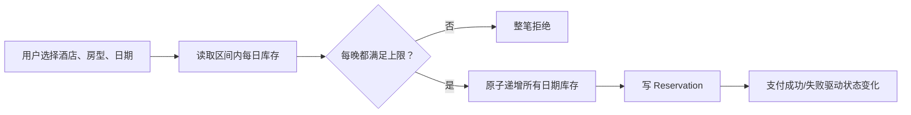
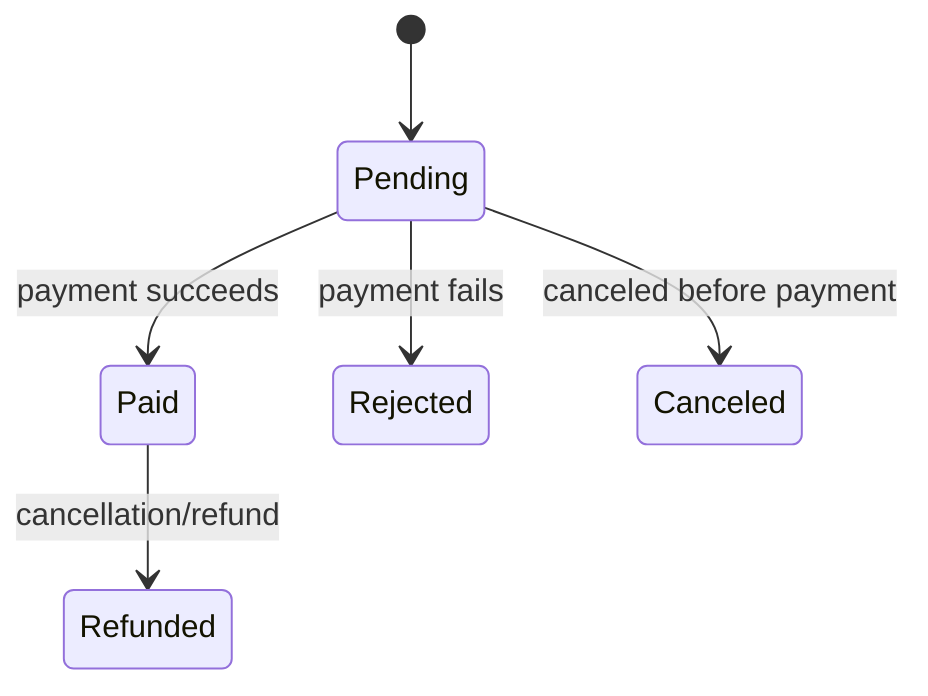
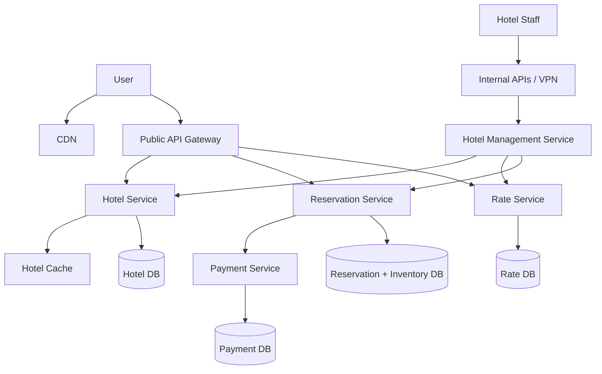
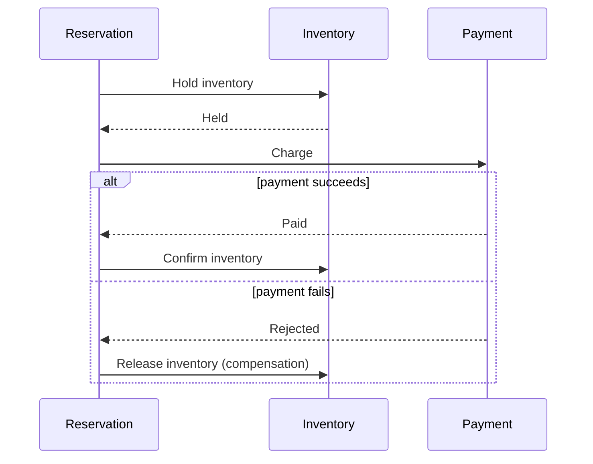
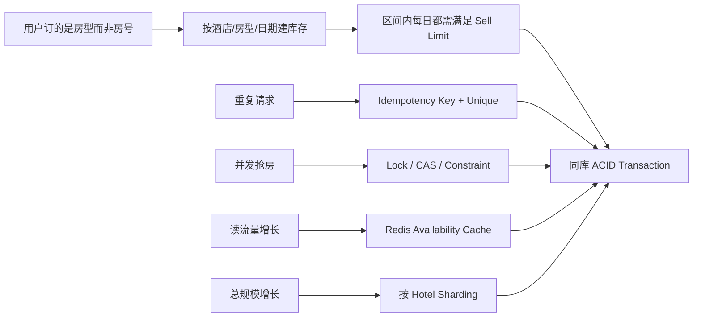
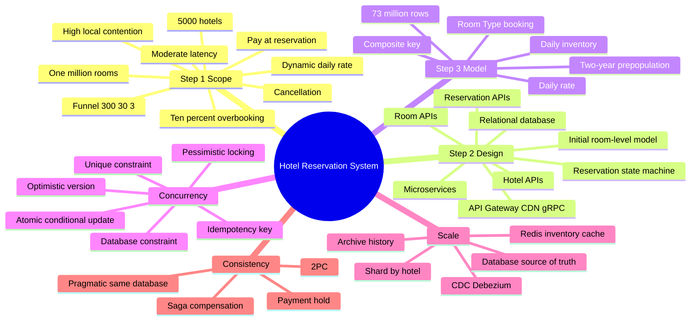

> 原书：Alex Xu、Sahn Lam，*System Design Interview: An Insider's Guide, Volume 2*（2022）
> 范围：Chapter 7: Hotel Reservation System（PDF 第 199～227 页）
> 目标：为大型连锁酒店设计支持酒店/房间展示、房型预订、取消、管理端、动态价格与 10% 超订的系统，重点保证并发下库存正确。

## 0. 本章真正要守住的不变量

酒店预订表面上是 CRUD，真正难点是：多个用户并发争抢同一酒店、同一房型、同一日期范围内的有限库存。

对于酒店 $h$、房型 $r$、住宿日期 $d$，设：

- $I(h,r,d)$：可售基础库存；
- $R(h,r,d)$：已预订数量；
- $\alpha$：允许超订比例，本章为 $10\%=0.1$；
- $q$：本次预订房间数。

系统必须原子保持：

$$
R(h,r,d)+q\leq \left\lfloor(1+\alpha)I(h,r,d)\right\rfloor
$$

而且该条件要对整个入住区间的每一个 Night 同时成立：

$$
\forall d\in[check\_in,check\_out),\quad
R(h,r,d)+q\leq C(h,r,d)
$$

$C$ 是含超订政策的可销售上限。只要某一天不足，整笔预订都必须失败，不能出现前两晚成功、第三晚失败的部分预订。



本章的分析主线是：

1. 先根据业务语义把“具体房间”改成“房型按日库存”；
2. 用 `reservation_id` 唯一约束解决同一请求重复提交；
3. 用悲观锁、乐观锁或数据库约束解决不同用户并发抢库存；
4. 用分片和缓存扩展读取，但让数据库继续做最终库存判定；
5. 谨慎决定是否把库存与预订单拆到不同微服务数据库。

这些方法也可迁移到航班座位、电影票、活动名额和短租库存。

---

## 1. Step 1：理解问题并确定设计范围

酒店预订系统随业务规则变化很大。作者先确认规模、支付时机、渠道、取消、超订和价格，再排除复杂搜索。

## 1.1 需求澄清

### 1.1.1 规模

- 5,000 家酒店；
- 共 100 万间实体房间。

这是连锁酒店官网/应用，而非汇聚全球供应商的 OTA。平均预订 TPS 很低，但热门酒店在节庆或活动期间会形成局部高争用。

### 1.1.2 支付时机

为简化，本章假设预订时全额支付。Reservation 先进入 Pending，Payment 成功后变为 Paid，失败则 Rejected。

现实还可能有预授权、到店付款、免费取消、押金和部分退款，这些会扩展状态机。

### 1.1.3 预订渠道

只支持酒店网站或 App。电话、线下前台、第三方 OTA 渠道不在核心范围。

若多渠道同时卖同一库存，所有渠道必须通过同一权威库存或有配额同步，否则更容易超卖。

### 1.1.4 取消

允许用户取消。取消不仅改变 Reservation Status，还要按政策退款并释放每晚库存。两个动作必须幂等且可恢复。

### 1.1.5 10% 超订

酒店基于历史取消/No-show 预测，允许售出超过物理房数的 10%。这不是并发 Bug，而是显式业务政策。

若基础库存是 100：

$$
C=\lfloor1.1\times100\rfloor=110
$$

业务超订与技术超卖必须区分：超过 100 但不超过 110 是允许；超过 110 才是库存不变量被破坏。

### 1.1.6 动态价格

房价可按日期不同，受预期入住率影响。因此 Rate 需要 `(hotel_id, room_type_id, date)` 级别，而不是房型永久固定价。

预订时应保存价格快照和币种，不能日后用最新 Rate 重算历史账单。

### 1.1.7 搜索不在范围

不设计按城市、设施、价格、评分等复杂酒店搜索。核心聚焦详情、库存和 Transactional Booking。

## 1.2 功能需求

1. 展示酒店详情页；
2. 展示酒店房间/房型详情；
3. 预订房间；
4. 管理端新增、删除、更新酒店或房间；
5. 支持 10% 超订；
6. 取消与查看历史；
7. 每日动态价格。

## 1.3 非功能需求

### 高并发

不是全球平均 TPS 高，而是热门 `(hotel_id, room_type_id, date)` 行在短时间内被大量用户争用。

### 中等延迟

预订最好快，但为正确性等待几秒可以接受。不能为了亚毫秒返回而把最终库存判定交给不一致缓存。

### 正确性与耐久性

虽然原书未在列表中单列，它由业务自然要求：不能重复预订、无故丢预订单、越过超订上限或重复收费。

## 1.4 粗略估算

假设：

- 100 万房间；
- 平均入住率 70%；
- 平均住 3 天。

每天需要补充的预订约：

$$
N_{daily}=\frac{1{,}000{,}000\times0.7}{3}
\approx233{,}333
$$

作者向上取整到约 240,000。

按 $10^5$ 秒/天：

$$
TPS_{reservation}=\frac{240{,}000}{10^5}\approx2.4\approx3
$$

用 86,400 秒为约 2.78 TPS。平均并不高。

### 转化漏斗

假设每一步只有 10% 用户进入下一步，最终预订 TPS 为 3：

| 步骤 | QPS/TPS |
|---|---:|
| 酒店/房型详情 | 300 |
| 订单确认页 | 30 |
| 最终预订 | 3 |

这说明系统总体读多写少，详情与库存查询可缓存；但最终 3 TPS 不能掩盖局部热点，容量规划还要看 Peak 与 Key Skew。

---

## 2. Step 2：提出高层设计并取得共识

原书按 API、第一版数据模型、高层微服务架构展开。

## 2.1 API 设计

### 酒店 API

| API | 作用 |
|---|---|
| `GET /v1/hotels/{id}` | 查看酒店详情 |
| `POST /v1/hotels` | 管理员新增酒店 |
| `PUT /v1/hotels/{id}` | 管理员更新酒店 |
| `DELETE /v1/hotels/{id}` | 管理员删除酒店 |

### 房间 API

| API | 作用 |
|---|---|
| `GET /v1/hotels/{hotelId}/rooms/{roomId}` | 查看具体房间详情 |
| `POST /v1/hotels/{hotelId}/rooms` | 新增房间 |
| `PUT /v1/hotels/{hotelId}/rooms/{roomId}` | 更新房间 |
| `DELETE /v1/hotels/{hotelId}/rooms/{roomId}` | 删除房间 |

管理写操作必须有 RBAC、审计和 Internal API/VPN 保护。

### 预订 API

| API | 作用 |
|---|---|
| `GET /v1/reservations` | 当前用户预订历史 |
| `GET /v1/reservations/{id}` | 预订详情 |
| `POST /v1/reservations` | 新建预订 |
| `DELETE /v1/reservations/{id}` | 取消预订 |

初版请求：

```json
{
  "startDate": "2021-04-28",
  "endDate": "2021-04-30",
  "hotelID": "245",
  "roomID": "U12354673389",
  "reservationID": "13422445"
}
```

`reservationID` 兼作 Idempotency Key，后续模型会把 `roomID` 改为 `roomTypeID`。

### 日期边界

住宿应使用半开区间：

$$
[startDate,endDate)
$$

4 月 28 日入住、4 月 30 日退房，占用 28、29 两晚，不占用 30 日。原书伪 SQL 使用 `BETWEEN` 会包含两端，若直接照抄容易多扣一晚；实现应使用：

```sql
date >= :start_date AND date < :end_date
```

## 2.2 数据访问模式与关系型数据库

需要：

1. 查酒店详情；
2. 查某日期范围可用房型；
3. 写预订；
4. 查预订与历史。

作者选择 Relational Database：

- 读多写少；
- Hotel/Room/Rate/Reservation 关系稳定；
- ACID 简化扣库存、写订单和状态变化；
- 唯一约束、Check Constraint、行锁和条件更新可表达不变量。

“NoSQL 通常优化写”不是普适定律；真正选择依据是本章需要多行事务、约束和明确关系。

## 2.3 初版 Schema

主要表：

- `hotel`；
- `room`；
- `room_type_rate`；
- `guest`；
- `reservation`。

初版 `reservation` 保存 `room_id`。Reservation Status：



状态转移必须受规则限制，不能从 `Refunded` 再变 `Paid`。每个 Transition 还要幂等。

## 2.4 初版模型的根本问题

Airbnb 用户通常预订具体 Listing；酒店用户预订 Room Type：King、Queen、双床等，具体房号到 Check-in 才分配。

如果按 `room_id` 预订：

- 提前绑定实体房号，降低调房灵活性；
- 房间维护/清洁变化时难处理；
- 同房型库存不能自然汇总；
- Overbooking 很难表达。

因此 API 和 Schema 必须改成按 Room Type/Date 计库存。

## 2.5 高层微服务架构



### 组件职责

- User：浏览、预订、取消；
- Admin：退款、取消、更新房间/酒店；
- CDN：JS、图片、视频、HTML 等静态资源；
- Public API Gateway：认证、限流、路由；
- Internal API：员工专用，VPN/RBAC/审计；
- Hotel Service：静态酒店/房间资料，适合缓存；
- Rate Service：按房型/日期维护动态价格；
- Reservation Service：查库存、预订、取消；
- Payment Service：支付成功置 Paid，失败置 Rejected；
- Hotel Management Service：将管理员动作转发到数据 Owner。

Reservation Service 要调用 Rate Service 计算总价；生产环境可用 gRPC 等 RPC 框架。架构图省略箭头不等于依赖不存在。

---

## 3. Step 3：深入设计

作者依次改进数据模型，讨论两个并发问题及三种控制方式，再扩展数据库/缓存，最后处理微服务一致性。

## 3.1 改进 API：预订 Room Type

```http
POST /v1/reservations
```

```json
{
  "startDate": "2021-04-28",
  "endDate": "2021-04-30",
  "hotelID": "245",
  "roomTypeID": "12354673389",
  "reservationID": "13422445",
  "numberOfRooms": 1
}
```

具体 Room Assignment 延迟到入住办理，与库存承诺解耦。

## 3.2 改进 Schema

### `room`

保存实体房号、楼层、所属 Room Type 和是否可用。维护中的房间从可售库存中扣除。

### `room_type_rate`

主键可为 `(hotel_id, room_type_id, date)`，保存某房型某天价格。

### `reservation`

保存：

- `reservation_id`；
- `hotel_id`；
- `room_type_id`；
- `[start_date,end_date)`；
- Status；
- Guest；
- Number of Rooms；
- Price Snapshot/币种。

### `room_type_inventory`

核心主键：

$$
(hotel\_id,room\_type\_id,date)
$$

字段：

- `total_inventory`：实体库存减维护下架房；
- `total_reserved`：该日期已预订数；
- 可加 `version` 做乐观锁。

每个日期一行，使区间查询、取消和逐日库存校验直接。

## 3.3 预填未来两年库存

每日作业向前补一日，保证未来两年行已存在。

假设每酒店 20 个房型：

$$
5000\times20\times2\times365=73{,}000{,}000\text{ rows}
$$

7300 万行不算大，单数据库容量可承载；但单机仍是单点，需要主备/多可用区、备份和恢复。

预填简化 Transaction：不必在高并发 Booking Path 临时创建缺失日期行。每日 Job 要幂等，使用唯一主键/Upsert。

## 3.4 区间库存检查

输入：Hotel、Room Type、Start、End、预订数量 $q$。

查询：

```sql
SELECT date, total_inventory, total_reserved, version
FROM room_type_inventory
WHERE hotel_id = :hotel_id
  AND room_type_id = :room_type_id
  AND date >= :start_date
  AND date < :end_date
ORDER BY date;
```

先确认行数等于 Nights：

$$
nights=endDate-startDate
$$

缺一行不能默认有库存，应失败或修复数据。

对每晚检查：

$$
R_d+q\leq\lfloor1.1I_d\rfloor
$$

所有行通过后，在一个事务中更新全部行并写 Reservation。

## 3.5 超订上限的取整

若直接用浮点 `1.1 * inventory`，不同语言/数据库可能有边界问题。可用整数：

$$
C=I+\left\lfloor\frac{I\times10}{100}\right\rfloor
$$

或存 `sell_limit`，由 Revenue Management 计算。小库存时必须明确政策：3 间房的 10% 是仍卖 3 间，还是四舍五入卖 3/4 间？不能让浮点隐式决定。

## 3.6 扩展数据策略

若 Reservation 太大：

- Online DB 只保留当前与未来 Reservation；
- 历史归档到 Archive/Cold Storage；
- 按 `hotel_id` 分片：

$$
shard=hash(hotel\_id)\bmod N
$$

预订与查库存都先确定酒店，按 Hotel 共置能把日期范围事务留在单分片。

按 Guest 查全局历史会跨分片，可建立异步 Guest Reservation Index/查询服务。不能只说“Hotel ID 是所有查询的天然 Key”。

---

## 4. 并发问题一：同一用户重复点击

客户端可能双击，或第一次请求成功但响应丢失后重试。

## 4.1 客户端禁用按钮

发送后灰掉按钮能改善体验，但不能作为正确性保证：JS 可关闭、网络可重试、恶意客户端可绕过。

## 4.2 Idempotent API

Reservation Service 先生成 `reservation_id` 并在确认页返回；提交时带同一 ID。数据库以它作 Primary/Unique Key：

```sql
INSERT INTO reservation (...)
VALUES (...)
ON CONFLICT (reservation_id) DO NOTHING;
```

第二次提交命中唯一约束，不会再扣库存。

### 幂等必须覆盖库存事务

正确顺序不是“先扣库存，再尝试插 Reservation”。应在同一 Transaction 内：

1. 按 `reservation_id` 查询已有结果；
2. 存在则返回原响应；
3. 不存在才检查/更新库存；
4. 插入 Reservation；
5. Commit。

否则响应丢失重试仍可能重复扣库存。

### 请求参数冲突

同一 Idempotency Key 若携带不同 Hotel/Date，应返回冲突，而不是悄悄返回旧结果。可保存 Request Hash：

$$
request\_hash=H(hotel,roomType,start,end,rooms,guest)
$$

## 4.3 幂等与并发库存是两类问题

- 幂等解决**同一业务请求重复执行**；
- 锁/约束解决**不同请求争用同一库存**。

即使每个用户都有唯一 Reservation ID，两位用户仍可能同时抢最后一间房。

---

## 5. 并发问题二：多人抢最后库存

初始：$I=100,R=99$。Transaction 1/2 都先读到 99，都判断可订，然后各自写 100。若使用 Read-Modify-Write 的绝对值覆盖，就发生 Lost Update：两笔 Reservation 都成功，库存 Counter 却只增加 1。

这不只是“隔离让 Transaction 看不到别人未提交数据”；关键是“检查”和“写入”没有被一个 Serialization Mechanism 保护。

## 5.1 基础 Transaction

原书流程：

```text
BEGIN
  read all nightly inventory rows
  if any row exceeds sell limit: ROLLBACK
  increment total_reserved for every night
  insert reservation
COMMIT
```

作者比较悲观锁、乐观锁、数据库约束。

## 5.2 方案一：悲观锁

```sql
SELECT ...
FROM room_type_inventory
WHERE ...
ORDER BY date
FOR UPDATE;
```

Transaction 1 锁住区间行；Transaction 2 等待。1 Commit 后，2 重新看到 $R=100$，发现不足并 Rollback。

### 优点

- 冲突在进入更新前串行化；
- 实现直观；
- 高争用下避免大量乐观重试。

### 缺点

- 长事务阻塞；
- 多行锁可能死锁；
- DB 连接占用；
- 热门房型吞吐受单行/区间串行限制。

### 避免死锁

所有事务必须按统一顺序锁：`date ASC`。不要一笔从入住日向后锁，另一笔从退房日前向前锁。

作者不推荐作为本系统默认，因为平均争用低；但在极热门事件短窗口，悲观锁可能比反复乐观重试更稳定。

## 5.3 方案二：乐观锁

每行加 `version`。读取 `(R,v)` 后执行 Compare-And-Swap：

```sql
UPDATE room_type_inventory
SET total_reserved = total_reserved + :q,
    version = version + 1
WHERE hotel_id = :hotel_id
  AND room_type_id = :room_type_id
  AND date = :date
  AND version = :old_version
  AND total_reserved + :q <= :sell_limit;
```

只有 `row_count=1` 成功；任一日期失败则整个事务 Rollback，重新读取并有限重试。

### 为什么 Version 优于 Timestamp

Version 是数据库原子递增的逻辑序列，不依赖应用服务器时钟同步和时间精度。

### 优点

- 不在读取阶段持锁等待；
- 防止 Stale Write；
- 低冲突时吞吐高；
- 与应用版本控制自然结合。

### 缺点

- 高冲突时只有一个成功，其余重试；
- 重试放大 DB 负载并恶化体验；
- 多晚多行 Transaction 任一冲突就要整体重试；
- 必须设置 Retry Limit、Backoff/Jitter。

作者认为酒店 Reservation QPS 通常低，乐观锁是好选择。

## 5.4 方案三：数据库约束

原书无超订示例使用：

```sql
CHECK (total_inventory - total_reserved >= 0)
```

第二个更新到 101 时违反约束，Transaction Rollback。

### 与 10% 超订的冲突

该约束会禁止允许的 101～110。支持超订时应保存 `sell_limit` 并约束：

```sql
CHECK (total_reserved >= 0 AND total_reserved <= sell_limit)
```

`sell_limit` 可等于 $\lfloor1.1I\rfloor$，并在维护下架或政策变化时重新计算。

### 优点

- 不变量由 Source of Truth 强制；
- 所有写路径都受保护；
- 实现简单；
- 与原子自增搭配可避免 Application Check-then-act Race。

### 缺点

- 高争用下失败率高；
- 用户可能刚看到 Available 就失败；
- Schema Constraint 演进/迁移需要治理；
- 不同数据库支持差异。

原书认为低争用酒店系统适合此方案。

## 5.5 更直接的条件更新

单晚库存可把 Check 与 Update 合并：

```sql
UPDATE room_type_inventory
SET total_reserved = total_reserved + :q
WHERE hotel_id = :hotel_id
  AND room_type_id = :room_type_id
  AND date = :date
  AND total_reserved + :q <= sell_limit;
```

受影响行为 1 才成功。多晚预订仍必须在一个事务中逐行按序执行，任一行 0 则 Rollback 全部。

这避免应用“先读再写”的竞态，但仍依赖 DB 行锁/事务隔离来实现原子条件更新。

## 5.6 三种方案对比

| 维度 | 悲观锁 | 乐观锁 | DB 约束/条件更新 |
|---|---|---|---|
| 冲突处理 | 先等待 | 写时检测并重试 | 写入越界则失败 |
| 低争用 | 有锁开销 | 很好 | 很好 |
| 高争用 | 串行但稳定 | 重试风暴 | 大量失败 |
| 死锁 | 可能 | 少 | 视多行更新顺序 |
| 不变量位置 | Transaction Code | App + Version | DB Source of Truth |
| 本章建议 | 非默认 | 推荐 | 推荐 |

最佳实践常是组合：Unique Idempotency Key + Atomic Conditional Update/Constraint + 低冲突乐观重试，而不是只选一个标签。

---

## 6. 可运行示例：区间库存、超订、幂等与乐观锁

下面的内存模型把本章关键语义放在一个原子方法中。真实并发正确性应由数据库事务/CAS 保证，Python 锁只用于让示例可运行。

```python
from dataclasses import dataclass
from datetime import date, timedelta
from threading import Lock

@dataclass
class NightInventory:
    total_inventory: int
    total_reserved: int = 0
    version: int = 0

    @property
    def sell_limit(self):
        return self.total_inventory + self.total_inventory * 10 // 100

class ReservationBook:
    def __init__(self, inventory):
        self.inventory = inventory
        self.reservations = {}
        self.lock = Lock()

    @staticmethod
    def stay_dates(check_in, check_out):
        if check_out <= check_in:
            raise ValueError("check_out must be after check_in")
        current = check_in
        while current < check_out:
            yield current
            current += timedelta(days=1)

    def reserve(self, reservation_id, check_in, check_out, rooms):
        with self.lock:
            dates = list(self.stay_dates(check_in, check_out))
            request = (check_in, check_out, rooms)

            if reservation_id in self.reservations:
                if self.reservations[reservation_id] != request:
                    raise ValueError("idempotency key reused with different request")
                return "idempotent_replay"

            nights = [self.inventory[day] for day in dates]
            if any(night.total_reserved + rooms > night.sell_limit for night in nights):
                return "sold_out"

            for night in nights:
                night.total_reserved += rooms
                night.version += 1
            self.reservations[reservation_id] = request
            return "reserved"

if __name__ == "__main__":
    inventory = {
        date(2026, 8, 11): NightInventory(100, 109),
        date(2026, 8, 12): NightInventory(100, 108),
    }
    book = ReservationBook(inventory)
    assert book.reserve("r-1", date(2026, 8, 11), date(2026, 8, 13), 1) == "reserved"
    assert book.reserve("r-1", date(2026, 8, 11), date(2026, 8, 13), 1) == "idempotent_replay"
    assert book.reserve("r-2", date(2026, 8, 11), date(2026, 8, 13), 1) == "sold_out"
```

对应关系：

- `stay_dates`：实现 `[check_in,check_out)`；
- `sell_limit`：整数 10% 超订上限；
- `reservation_id`：Idempotency Key；
- 相同 Key 不同请求：拒绝；
- `any(...)`：任一晚不足，整笔失败；
- 同一锁内 Check + Update：教学化模拟一个 DB Transaction；
- `version`：对应 Optimistic Lock 字段。

---

## 7. Scalability

酒店链平均负载低，但若扩成 Booking.com/Expedia 规模，QPS 可高 1000 倍。无状态服务易扩，Database 是重点。

## 7.1 Database Sharding

多数关键查询先确定 Hotel，按 `hotel_id` 分 16 Shards：

$$
shard=hash(hotel\_id)\bmod16
$$

若总 QPS 30,000：

$$
QPS_{shard}=\frac{30{,}000}{16}=1{,}875
$$

这在单 MySQL 负载范围内只是原书粗估，实际还取决于事务复杂度、锁等待和热点 Hotel。

### Hotel Sharding 的优势

- Inventory、Rate、Reservation 可共置；
- 一次预订留在单 Shard Transaction；
- 地理与业务隔离自然。

### 局限

- 热门酒店形成 Hot Shard；
- Guest 跨酒店历史需 Secondary Index；
- Shard 数变化需要路由迁移；
- `mod N` 扩容会大量重映射，可用 Virtual Shard/Directory Mapping。

## 7.2 Inventory Cache

库存只关心当前与未来日期，旧库存可过期/归档。Redis 提供 TTL 和 LRU，适合读缓存。

Key：

```text
inventory:{hotel_id}:{room_type_id}:{date}
```

Value：可用房数或 `{total_reserved, sell_limit, version}`。

### 读写路径

1. Availability Query 主要读 Redis；
2. Booking 请求即使 Cache 显示有房，也进入 Inventory DB；
3. DB 在 Transaction 内 Final Validation + Update；
4. DB Commit 后异步更新/失效 Cache。

Cache 是提示与削峰层，DB 是 Source of Truth。

## 7.3 Cache 为什么能接受短暂不一致

Cache 可能显示有房，DB 已售罄：用户提交时得到“刚被别人订走”。体验不完美，但库存正确。

Cache 可能显示售罄，DB 又因取消恢复：造成短暂 False Negative、损失转化。可缩短 TTL、CDC 快速刷新或对 Sold-out Key 更积极回源。

一致性不“无所谓”，而是其错误被限制为短暂可用性展示误差，不能越过 DB 最终写入不变量。

## 7.4 Cache 更新方式

### Application Update

DB 成功后应用更新 Cache。简单，但应用在 Commit 后崩溃会漏更新。

### CDC

Debezium 读取数据库 Binlog/Change Log，把变更写 Redis。优点是所有写路径统一捕获；代价是异步延迟、重复事件、顺序和运维复杂度。

Cache Sink 应按 DB Version 只接受更新版本，避免 CDC 重排让 Cache 回退。

## 7.5 Cache 不能承担权威扣库存

若 Redis 先 `DECR`、DB 后写失败，需要补偿；若补偿失败就不一致。除非使用明确 Reservation Hold 架构和可恢复 Saga，否则本章保留 DB 最终判定更简单。

预过滤可在 Redis 做，但不能把“Redis 有房”当成功承诺。

---

## 8. 微服务间数据一致性

## 8.1 Pragmatic Hybrid

原书让 Reservation Service 同时拥有 Reservation 与 Inventory API/表，并放在同一 Relational DB Transaction。这样可原子：

```text
increment nightly inventory
insert reservation
commit
```

虽然不像“每概念一个微服务”纯粹，却大幅降低并发正确性复杂度。服务边界应围绕 Transactional Invariant，而不只是名词。

## 8.2 纯微服务拆分的问题

若 Inventory Service/DB 与 Reservation Service/DB 分开：

1. Inventory 扣减成功；
2. Reservation Insert 失败；
3. 必须释放库存；
4. 释放又可能失败。

一个逻辑原子操作跨数据库后，单库 ACID 不再覆盖。Happy Path 只有一个，失败排列很多。

## 8.3 Two-phase Commit（2PC）

Coordinator 先 Prepare 所有 Participant，再统一 Commit/Rollback。

优点：提供跨节点原子提交，接近强一致。
缺点：阻塞、Coordinator/Participant 故障会卡住、锁持有时间长、性能和可用性差。

适合参与者少、基础设施支持且强一致压倒可用性的场景，不适合长链路/高延迟外部 Payment。

## 8.4 Saga

Saga 把大事务拆成本地事务和消息：



优点：无长时间分布式锁，服务自治、可用性较高。
缺点：最终一致、补偿不是物理回滚、消息幂等/顺序/重试/人工修复复杂。

本章认为为当前规模引入这些复杂度不值得，选择同库事务。

## 8.5 Payment 与 Inventory 的现实闭环

原书假设预订时付款。若持库事务等待外部支付网络，会长时间锁库存。更现实的设计是短期 Hold：

1. DB Transaction 创建 Pending Reservation 并扣/锁库存；
2. Hold 有过期时间；
3. 异步/同步支付；
4. 成功 -> Paid/Confirmed；
5. 失败/超时 -> Rejected/Expired，幂等释放库存。

这超出原书主线，却解释为何 Reservation 状态机与 Saga 常一起出现。

---

## 9. Step 4：收束

作者最终回顾：

- 从需求和漏斗估算理解读写规模；
- REST API、关系数据模型和微服务架构；
- 从具体 Room 改成 Room Type + Daily Inventory；
- 同一用户重复点击用 Idempotency；
- 多用户争库存用 Pessimistic Lock、Optimistic Lock 或 DB Constraint；
- 大规模用 Hotel Sharding 和 Redis Cache；
- 微服务跨库一致性可用 2PC/Saga，但本题选择 Reservation + Inventory 同库事务。



---

## 10. 容易混淆的概念与常见误区

### 10.1 酒店预订的是 Room Type，不是具体 Room

房号在 Check-in 分配；Airbnb Listing 才更接近具体资源预订。

### 10.2 Search Availability 不等于 Booking Guarantee

查询到有房只是 Snapshot；提交时必须重新原子验证。

### 10.3 Business Overbooking 不等于 Technical Overselling

100 间允许卖 110 是政策；卖第 111 间才是正确性故障。

### 10.4 `BETWEEN start AND end` 可能多扣退房日

住宿是 `[check_in,check_out)`，SQL 应 `date < end_date`。

### 10.5 `reservation_id` 不能只作为普通字段

必须有 DB Unique/Primary Key，并让库存更新与 Reservation Insert 同事务。

### 10.6 Idempotency 不解决不同用户并发

每个请求 ID 都不同，仍会争同一库存；要额外并发控制。

### 10.7 禁用按钮不是幂等

它只是 UX 优化，无法防网络重试和恶意客户端。

### 10.8 同一 Idempotency Key 不同参数不能复用

应校验 Request Hash 并返回冲突。

### 10.9 ACID 不会自动修复错误的 Check-then-act

若隔离级别/SQL 没有锁、CAS 或条件更新，两事务仍可读同一旧值。Transaction 只是工具，必须正确使用。

### 10.10 Isolation 不等于 Serialization

普通隔离可隐藏未提交值，却不一定让多个业务事务等价于串行执行。Serializable、行锁或原子条件写才建立相应顺序。

### 10.11 `SET total_reserved=100` 与 `total_reserved=total_reserved+1` 不同

前者容易 Lost Update；后者是原子递增，但仍需库存上限条件。

### 10.12 Pessimistic Lock 不是永远最慢

高争用下等待一次可能比大量乐观 Retry 更稳定；低争用时锁开销才显得不划算。

### 10.13 Optimistic Lock 并非数据库完全不加内部锁

业务方案不在读取时持悲观行锁，但 UPDATE 本身仍使用数据库内部并发机制；原书“数据库角度没有锁”是概念化表述。

### 10.14 Version 优于 Timestamp，不是说时间永远无用

Version 用于 CAS 更可靠；Timestamp 仍用于审计、过期和状态时间。

### 10.15 DB Constraint 必须与超订政策一致

`total_reserved <= total_inventory` 会错误禁止 10% 超订；应约束 `sell_limit`。

### 10.16 多晚预订不能逐晚独立 Commit

任一晚失败必须全部 Rollback，否则产生无法入住完整区间的部分预订。

### 10.17 73M 行“单库放得下”不等于单机足够

还要考虑 HA、备份、事务吞吐、索引、故障恢复与增长。

### 10.18 `hash(hotel_id) % N` 不利于在线扩容

$N$ 变化会大量重映射。可用 Virtual Shard/Directory 保持稳定路由。

### 10.19 Hotel Sharding 不能自动解决 Hot Hotel

热门酒店的库存行仍在一个 Shard，需限流、队列、专用分片或热点控制。

### 10.20 Cache 可陈旧不等于一致性不重要

它只允许展示短暂误差；最终 DB 写绝不能越界。

### 10.21 Redis 有库存不代表预订成功

DB Source of Truth 必须 Final Check。反之 Redis 售罄可能暂时漏卖，需要 CDC/TTL 控制。

### 10.22 CDC 通常是 At-least-once

Cache Consumer 要按 Version 幂等，处理重复与乱序。

### 10.23 取消不是简单 DELETE Reservation

应保留状态历史，原子/幂等释放每晚库存，并协调退款。

### 10.24 动态 Rate 不能覆盖历史价格

Reservation 保存 Price Snapshot，否则房价变化后账单不可重现。

### 10.25 微服务边界不应破坏核心不变量

Inventory 与 Reservation 强事务耦合，放同服务/同库可能比“纯粹拆分”更正确。

### 10.26 2PC 与 Saga 不是同一种保证

2PC 追求一次原子 Commit；Saga 由本地事务与补偿实现最终一致。

### 10.27 Saga Compensation 不是真正回滚时间

支付退款、释放库存可能有费用、延迟和外部可见副作用，不能假设世界回到从未发生。

### 10.28 平均 3 TPS 不代表不需要并发控制

争用看同一 Inventory Key 的瞬时并发，不看全球平均。

---

## 11. 本章知识结构



## 12. 核心结论

1. **先建模业务承诺，再选并发技术。** 酒店承诺的是某房型在每个 Night 的容量，不是具体房号。
2. **每日库存行把区间预订拆成明确不变量。** `(hotel, room_type, date)` 是最小库存竞争单元。
3. **日期范围应是半开区间。** Check-out Day 不占房，避免多扣一晚。
4. **超订是可配置 Sell Limit。** 应用、条件更新与 DB Constraint 必须使用同一政策。
5. **Reservation ID 提供请求幂等。** Unique Key、原参数校验和原结果重放共同形成正确语义。
6. **幂等与库存并发是正交问题。** 前者防同请求重放，后者防不同请求争抢越界。
7. **Check 与 Increment 必须同一原子边界。** 多晚中任一失败，整个 Transaction Rollback。
8. **悲观锁、乐观锁、约束各有争用区间。** 本章低平均争用适合 Optimistic/Constraint，热点时可能需 Pessimistic/Queue。
9. **关系数据库的价值在于 ACID、约束和稳定关系模型。** 不只是因为“读多写少”。
10. **按 Hotel Sharding 保持核心 Transaction 单分片。** Guest 全局查询需额外索引。
11. **Redis 只加速 Availability Query。** DB 继续做 Final Validation，缓存错误只能影响短暂体验。
12. **CDC 统一同步 Cache，但需幂等和 Version。** 它降低漏更新，不提供同步一致。
13. **服务边界应尊重 Transactional Invariant。** Reservation 与 Inventory 同库是务实设计。
14. **拆库后需 2PC 或 Saga。** 强原子和最终一致各有可用性/复杂度成本。

## 13. 解决有限库存预订问题的一般思路

### 第一步：明确卖的资源粒度

是具体 Seat/Room，还是可互换的 Room Type/Capacity？粒度决定唯一键和库存模型。

### 第二步：把时间区间离散为库存 Bucket

酒店按 Night，航班按 Flight，影院按 Showtime。为每个 Bucket 保存 Sell Limit 与 Reserved。

### 第三步：写出业务不变量

$$
\forall bucket:\ reserved+requested\leq sell\_limit
$$

再决定 Lock/CAS/Constraint，而不是反过来。

### 第四步：把重复请求与并发请求分开

- Idempotency Key + Unique + Request Hash；
- Atomic Conditional Update/Optimistic/Pessimistic Control。

### 第五步：让跨 Bucket 操作原子

整个日期范围在同一事务/分片，固定锁顺序，任一不足全部回滚。

### 第六步：把读优化与写正确性分层

Cache/CDN/Replica 服务详情和 Availability；权威主库完成最终承诺。明确陈旧读的 UX。

### 第七步：按交易自然归属分片

选择能让核心写事务留在单分片的 Key，例如 Hotel/Event/Flight；为其他访问模式建立异步索引。

### 第八步：谨慎拆微服务数据库

先识别必须原子的表。如果拆开，明确使用 2PC 还是 Saga，并设计补偿、重试、幂等和人工修复。

### 第九步：为支付设计 Hold 与过期

不要在外部支付期间长期持 DB 锁；短事务创建 Hold，支付状态机最终 Confirm 或 Release。

### 第十步：验证极端场景

- 双击与响应丢失重试；
- 两人抢最后库存；
- 多晚中间一天售罄；
- Transaction Deadlock/Timeout；
- Cache 显示有、DB 无；
- CDC 重复/乱序；
- Payment 成功、Reservation 更新失败；
- Cancel 重试与重复退款；
- Hot Hotel/Flash Sale；
- Shard/Region 故障。

整章可以压缩为：

$$
\boxed{
\text{房型按日建库存}
\rightarrow
\text{定义 Sell Limit}
\rightarrow
\text{Idempotency 防重放}
\rightarrow
\text{Transaction + Lock/CAS/Constraint 防越界}
\rightarrow
\text{Cache 只做读加速}
\rightarrow
\text{按 Hotel 分片}
\rightarrow
\text{围绕核心不变量选择服务边界}
}
$$

本章最值得迁移的方法是：**把预订正确性写成“对一组库存 Bucket 的原子条件更新”，再用幂等处理同一请求重放、用并发控制处理不同请求竞争；缓存、分片和微服务都必须服从这条不变量，而不能取代它。**
