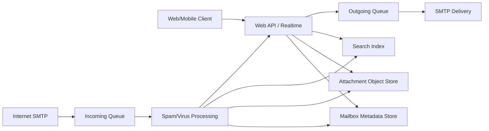
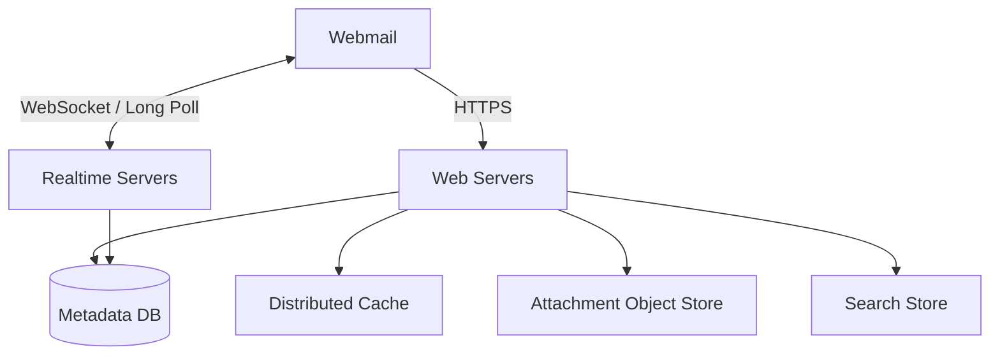
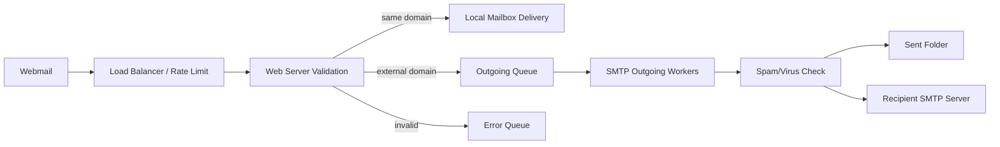
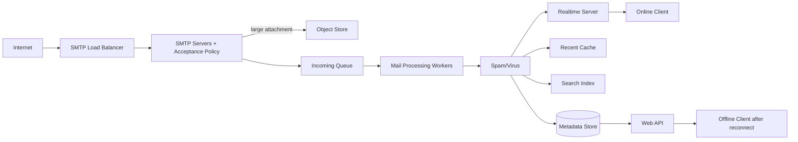
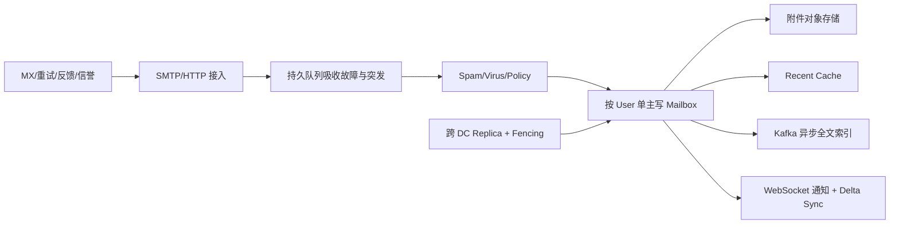
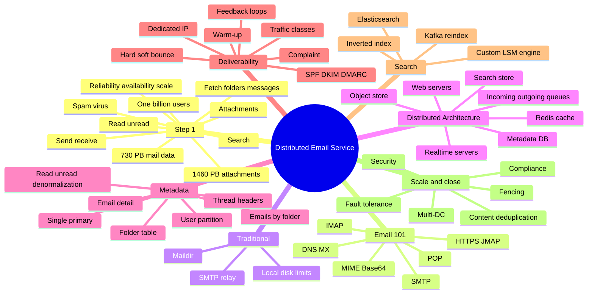

> 原书：Alex Xu、Sahn Lam，*System Design Interview: An Insider's Guide, Volume 2*（2022）
> 范围：Chapter 8: Distributed Email Service（PDF 第 228～254 页）
> 目标：设计类似 Gmail、Outlook、Yahoo Mail 的大规模邮件服务，支持收发、邮箱读取、已读/未读过滤、全文搜索、附件、反垃圾和防病毒，并保证数据可靠。

## 0. 邮件系统不是“把文本发给另一个用户”

一封现代邮件同时涉及：

- 跨域 SMTP 投递；
- DNS/MX 路由与重试；
- 用户邮箱中的 Folder/Read/Label 状态；
- 邮件正文与附件存储；
- Web/移动端实时同步；
- 反垃圾、防病毒与发件信誉；
- 全文倒排索引；
- 多数据中心复制、合规和安全。

系统可分成四条相互关联的路径：



关键设计思想是按数据属性拆开：

- Mail Metadata/Body：以用户邮箱为访问边界，要求强一致、低 I/O 和高可靠；
- Attachment：大 Blob，放对象存储；
- Recent Mail：热点，放分布式缓存；
- Search：写多读少的异步派生索引，可从 Primary Store 重建；
- SMTP Delivery State：通过持久队列、重试和 Feedback Loop 管理。

## 0.1 本章与普通消息队列的区别

邮件也使用 Queue，但 Queue 不是最终产品语义：

- SMTP 有外部域、MX、Bounce 和 Reputation；
- 消息要长期保存在用户 Mailbox；
- 同一邮件在不同用户邮箱有不同 Folder/Read 状态；
- Search 和 Threading 要从内容建立派生结构；
- 发出不等于送达 Inbox，可能 Soft Bounce、Hard Bounce 或 Spam。

因此“Kafka/RabbitMQ + DB”只是零件，不是完整邮件系统。

---

## 1. Step 1：理解问题并确定设计范围

作者先限定用户规模、功能、客户端协议和附件，再提炼可靠性、可用性、扩展性与灵活性。

## 1.1 用户规模

系统按 10 亿用户设计。即使单用户每天只发送 10 封，入口也达到十万级 QPS；接收邮件和多年保留会产生 PB 级存储。

## 1.2 功能需求

- 发送和接收邮件；
- 获取全部邮件；
- 按已读/未读过滤；
- 按 Subject、Sender、Body 搜索；
- 反垃圾、反病毒；
- 支持附件。

Authentication 不在本章范围，但任何生产 API/SMTP Submission 都必须认证与授权。

## 1.3 客户端通信

传统 Native Client 使用 SMTP、POP、IMAP 和厂商协议。本章简化为客户端与服务端主要通过 HTTP/Web API；跨邮件服务仍需 SMTP。

不能因 Webmail 使用 HTTP 就删除 SMTP：不同域之间的联邦投递依赖 SMTP/DNS MX。

## 1.4 非功能需求

### Reliability

不丢邮件。发送请求成功后，即使某节点、磁盘或网络故障，也要能恢复投递/邮箱状态。

### Availability

部分故障时仍尽可能收发与读取。某 Mailbox Primary 切换时可短暂停写，以防分叉。

### Scalability

用户、邮件、附件和搜索索引都要水平扩展。

### Flexibility/Extensibility

邮件从纯文本演进到附件、Thread、Search、Label 和安全能力。架构要便于增加处理 Stage，而不是让 SMTP Server 承担所有逻辑。

## 1.5 粗略估算

### 发送 QPS

10 亿用户，每人每天发 10 封：

$$
E_{send}=10^9\times10=10^{10}\text{ emails/day}
$$

作者用 $10^5$ 秒/天：

$$
Q_{send}=\frac{10^{10}}{10^5}=100{,}000\text{ QPS}
$$

用 86,400 秒约为 115,741 QPS。峰值和重试还会更高。

### 元数据/正文存储

每用户每天接收 40 封，平均“Metadata”50 KB。原书把除附件外的邮件内容都归到 Metadata，这实际上包含 Header/Body，不只是通常意义上的小元数据。

一年：

$$
10^9\times40\times365\times50\text{ KB}
=730\text{ PB}
$$

### 附件存储

20% 邮件带附件，平均 500 KB：

$$
10^9\times40\times365\times0.2\times500\text{ KB}
=1460\text{ PB}
$$

总逻辑数据一年约 2.19 EB，未含副本、索引、版本、压缩、删除和附件去重。

### Base64 放大

跨 SMTP/MIME 传二进制附件常用 Base64，每 3 bytes 变 4 字符，理论放大约：

$$
\frac{4}{3}\approx1.333
$$

500 KB Attachment 编码后约 667 KB（另有换行/Header）。对象存储内部应保存原二进制，不必永久保留 Base64 形态。

---

## 2. Step 2：邮件基础知识

作者先解释 SMTP/POP/IMAP、DNS MX、Attachment/MIME，再从传统 Mail Server 推导分布式架构。

## 2.1 SMTP

SMTP（Simple Mail Transfer Protocol）用于发送邮件：

- Client -> 发件 Mail Server；
- 发件 Mail Server -> 收件 Mail Server。

它是 Store-and-forward 协议。目标 Server 暂不可用时，发件侧 Queue 保留邮件并稍后重试，而不是要求用户一直在线。

现代系统通常区分：

- Submission：认证用户提交邮件；
- Relay/Transfer：服务器之间传递邮件。

## 2.2 POP

POP3 把远端邮件下载到本地，传统模式可能下载后从 Server 删除。

特点：

- 适合单设备离线归档；
- 通常下载整封邮件，大附件慢；
- 多设备同步与 Folder/Read 状态能力弱。

“POP 一定删除服务器邮件”不是协议强制的唯一模式，Client 可配置保留副本；原书是在解释经典使用方式。

## 2.3 IMAP

IMAP 让邮件继续保存在 Server，Client 按需下载 Header/Body，并同步 Folder、Read 等状态。

优点：

- 多设备访问同一 Mailbox；
- 慢连接下先取 Header；
- Server 作为状态权威。

因此现代个人账户更常用 IMAP/JMAP/厂商 HTTPS API，而非纯 POP。

## 2.4 HTTPS/Webmail

HTTPS 不是传统邮件传输协议，但 Webmail/移动端可以通过 REST/JMAP/ActiveSync 类协议操作 Mailbox。它更适合 Pagination、Search、Label 和实时同步等现代功能。

## 2.5 DNS MX Record

发件 Server 先查询 Recipient Domain 的 MX Record。MX 有 Preference/Priority，数值越小越优先：

```text
gmail.com MX 5  gmail-smtp-in...
gmail.com MX 10 alt1...
gmail.com MX 20 alt2...
```

流程：

1. 按 Priority 升序选择；
2. 同 Priority 可随机/轮询；
3. 首选连接失败，尝试下一 MX；
4. DNS TTL 到期前缓存结果；
5. 全部临时失败，进入 Retry Queue。

MX 记录决定域级入口，不决定具体用户 Mailbox Shard；收件 SMTP 集群内部还要路由。

## 2.6 Attachment 与 MIME

MIME 扩展邮件格式，使文本之外可携带 HTML、图片和附件；二进制常用 Base64。

Gmail/Outlook 等会限制附件大小，原书示例约 20/25 MB。大附件不应直接塞 Message Queue；应先存 Object Store，Queue 仅携带 Object ID、Hash、Size 和 MIME Type。

## 2.7 传统 Mail Server

Alice 发到 Bob 的四步：

1. Alice Client 通过 SMTP 发给 Outlook Server；
2. Outlook 查 Gmail MX，通过 SMTP Relay；
3. Gmail 存入 Bob Mailbox；
4. Bob Client 用 IMAP/POP 获取。

### Maildir

传统服务器为每用户建目录，每邮件一个文件：

```text
home/user1/Maildir/
  cur/
  new/
  tmp/
```

小规模简单可靠；十亿用户时：

- 数十亿小文件与目录 Metadata；
- Backup/Recovery 很慢；
- Random Disk I/O；
- 单机磁盘损坏；
- 无法水平分片、跨 DC 复制；
- Search/Thread/Label 难扩展。

因此必须分布式 Metadata/Data Layer。

---

## 3. 分布式 Mail Server：API 与高层架构

## 3.1 Webmail API

### Send Message

```http
POST /v1/messages
```

发送到 To/Cc/Bcc。应支持 `client_message_id`/Idempotency Key，避免请求超时重试发两封。

### List Folders

```http
GET /v1/folders
```

默认 Folder 包括 All、Archive、Drafts、Flagged、Junk、Sent、Trash。

### List Folder Messages

```http
GET /v1/folders/{folder_id}/messages?cursor=...&limit=50
```

原书强调真实系统必须 Pagination。Cursor 应基于 `(email_timeuuid,email_id)`，避免 Offset Pagination 在新邮件插入时重复/漏项。

### Get Message

```http
GET /v1/messages/{message_id}
```

返回 Owner、From、To、Subject、Body、Read Status、Attachment References 等。

## 3.2 高层架构



### Web Servers

Public Request/Response 层，处理 Login/Profile（虽非本章重点）和邮件 API：Send、Folder、List、Get、Read/Unread。

### Real-time Servers

维护 Stateful Persistent Connections，把新邮件变更推给在线 Client。优先 WebSocket，浏览器不支持时 Long Polling Fallback。

现代 JMAP over WebSocket 是一种实例。Realtime 只通知 Change，不应成为唯一存储；Client 断线重连后仍从 Mailbox State Token/REST 补齐。

### Metadata DB

保存 Subject、Body、From/To、Folder、Read Status、Thread Header 等。选型在 Deep Dive 分析。

### Attachment Store

S3 类对象存储适合大文件。Cassandra 虽理论支持大 Blob，但实践中大值会造成 Compaction、Repair、Network 和 Cache 压力；原书指出实用 Blob 通常应小于约 1 MB。

### Distributed Cache

用户反复加载最近邮件，Redis List/KV 缓存 Recent Mailbox View，降低 Metadata DB 热读。

### Search Store

分布式 Document Store + Inverted Index，支持 Subject/Body/From/Unread 等全文与属性搜索。

---

## 4. Email Sending Flow



按原书步骤：

1. 用户 Compose 并 Send，HTTPS 到 Load Balancer；
2. LB 限流并路由 Web Server；
3. Web Server 校验大小、地址和基本规则；
4. 同域邮件通过 Spam/Virus 后直接写 Sender Sent + Recipient Inbox，不必出公网 SMTP；
5. 外域有效邮件入 Outgoing Queue，大附件先存 Object Store；无效邮件入 Error Queue；
6. SMTP Worker 拉取，执行 Spam/Virus 检查；
7. 写 Sender Sent Folder；
8. 通过 DNS/MX 向 Recipient Mail Server 发送。

## 4.1 为什么要 Outgoing Queue

- Web API 快速返回“已接受”，不等待远端 SMTP；
- SMTP Worker 独立扩展；
- 远端临时故障可重试；
- 突发邮件被缓冲；
- 不同域可独立限速，保护 Reputation。

Queue Size/Age 是关键指标。积压原因可能是远端不可用，也可能是 Worker 不足。

## 4.2 SMTP 重试

Temporary Failure（4xx/连接失败）使用 Exponential Backoff：

$$
d_n=\min(d_{max},d_0\times2^n)+jitter
$$

Permanent Failure（5xx、Invalid Recipient）不应无限重试，应生成 Hard Bounce/DSN。

### 重试幂等

SMTP 连接可能在 Remote 已接受后、本地未收到确认时断开，重试会导致 Recipient 收到重复。SMTP 本身不提供普遍端到端 Exactly-once；可保留稳定 `Message-Id` 帮助去重，但不能假设所有远端都去重。

## 4.3 同域本地投递的原子性

同域邮件需要 Sender Sent 与 Recipient Inbox 两个 Mailbox View。若不在同一 Shard/Transaction：

- 先写 Sent 后 Inbox 失败；
- 或 Inbox 成功 Sent 失败。

可把 Canonical Message Blob 先持久化，再用 Outbox Event 异步物化两个 Mailbox Entry；每个 Entry 用 `(mailbox_id,message_id)` Unique 幂等。API 返回“Accepted”与“Delivered”应区分。

---

## 5. Email Receiving Flow



原书流程：

1. Incoming SMTP 到 Load Balancer；
2. SMTP Server 应用 Acceptance Policy，Invalid Address 尽早 Bounce；
3. 大附件写 Object Store；
4. 邮件入 Incoming Queue，解耦 SMTP 与处理 Worker，吸收突发；
5. Worker 过滤 Spam/Virus；
6. 通过后写 Mail Storage、Cache、Attachment Store/Search；
7. Recipient 在线则通知 Realtime Server；
8. WebSocket 推送新邮件；
9. Recipient 离线时邮件仍存 Storage；
10. 上线后通过 REST 拉取新邮件。

## 5.1 SMTP 接受点与耐久承诺

服务向远端返回 SMTP Success 前，应至少把邮件或接收任务持久化到可恢复存储/Queue。否则 ACK 后节点崩溃会永久丢信。

$$
SMTP\ 250\ OK\Rightarrow durable\ acceptance
$$

后续 Spam 判定可进 Junk/Quarantine，但不能无记录丢弃已接受邮件。

## 5.2 Online Push 与 Offline Sync

WebSocket 是低延迟通知，不是可靠历史日志。Client 应保存 Mailbox Sync Token：

1. Push 告知 Mailbox Changed；
2. Client 调 Delta API 获取自 Token 之后 Change；
3. 断线也不会漏；
4. Token 过旧时 Full Resync。

这比把完整邮件正文直接塞 WebSocket 更可靠、节省带宽。

---

## 6. Step 3：Metadata Database

## 6.1 邮件数据特征

- Header 小且频繁访问；
- Body 大小变化大，通常只读一次；
- 操作大多局限于单用户 Mailbox；
- 新邮件访问最热，原书数据称 82% 读取是 16 天内邮件；
- 不能丢数据；
- Read/Folder 状态可变，邮件内容大多不可变。

这提示：按 User 分区、冷热分层、内容与 Mutable Mailbox State 分离。

## 6.2 数据库候选

### Relational DB

可索引 Header 和关系，但 100KB+ HTML Body/BLOB、PB 级容量和持续写不适配普通单机关系库。BLOB 内全文搜索也不高效。

关系数据库可服务小规模系统或账户/配置，但原书不选作 Gmail 规模 Mail Store。

### Object Storage

适合 Raw Email Backup/Attachment，但不擅长 Mark Read、Folder List、Thread 和关键词查询。

### NoSQL/Custom Store

Bigtable 已用于 Gmail；Cassandra 在模型上可行，但原书未见大型邮件商公开采用。大厂常定制以降低 IOPS。

目标 Store 特征：

- 单 Column 可达个位数 MB；
- Strong Consistency；
- 减少 Disk I/O；
- HA/Fault Tolerant；
- 易做 Incremental Backup。

“强一致”主要针对单 Mailbox 状态。全球复制仍要在 Failover 时以暂停写入换取不产生双主分叉。

## 6.3 为什么按 `user_id` 分区

绝大多数查询只访问自己的 Mailbox：

$$
shard=H(user\_id)\rightarrow mailbox\ primary
$$

优点：

- Folder/List/Read 操作局部；
- ACL 自然；
- 单用户顺序与一致性容易；
- 缓存和副本归属明确。

限制：超大 Mailbox 可能成为大分区；同一邮件发给多人会复制内容；跨用户管理/搜索不自然。

可用 `(user_id,time_bucket)`/Folder Bucket 避免分区无限增长，但保留 User Routing。

## 6.4 Query 1：用户 Folder

`folders_by_user`：

```text
Partition Key: user_id
Columns: folder_id, folder_name
```

同一用户 Folder 共置，数据小、读取快。

## 6.5 Query 2：Folder 内邮件列表

`emails_by_folder`：

```text
Partition Key: (user_id, folder_id)
Clustering Key: email_id TIMEUUID DESC
Columns: from, subject, preview, is_read
```

TIMEUUID 同时近似表达时间和唯一性，使最近邮件自然排前。真实系统应防止单 Inbox Partition 无界，可按月份/Sequence Bucket。

## 6.6 Query 3：邮件详情和附件

`emails_by_user`：

```text
Partition Key: user_id
Clustering Key: email_id
Columns: from, to, subject, body, attachment refs
```

`attachments`：

```text
Key: (email_id, filename/object_id)
Value: metadata/reference, not necessarily blob bytes
```

附件实际 Payload 在 Object Store；Metadata 表只保存引用、Hash、Size、MIME、Encryption Key Ref。

## 6.7 Query 4：已读/未读

NoSQL 通常只能高效按 Partition/Clustering Key 查，`is_read` 不是 Key，不能扫描整个 Folder 再 Filter。

作者用 Denormalization：

- `read_emails`；
- `unread_emails`。

Mark Unread -> Read：从 `unread_emails` 删除并插入 `read_emails`。

优点：查询快。
代价：写放大、跨表一致性和恢复复杂。

生产上也可把 Read State 独立存为 `(user_id,message_id)->flags`，Folder List 合并；或维护 Unread ID Index。选择取决于读写比和 Transaction 能力。

## 6.8 Conversation Thread

邮件 Header：

- `Message-Id`：当前消息唯一标识；
- `In-Reply-To`：直接 Parent；
- `References`：祖先链。

客户端/服务端用它们构建 Thread Tree。不能只按 Subject 分组，因为 Subject 可相同或被修改。

简化算法：

1. 为所有 Message-Id 建 Node；
2. References 中缺失消息建 Placeholder；
3. In-Reply-To/References 最后元素作为 Parent；
4. 防环；
5. Root 按时间排序，Child 按引用/时间排序。

JWZ Threading 处理缺失 Parent、重复 ID 和 Subject Merge 等复杂情况。

## 6.9 可运行示例：线程重建与 MX/退避

```python
from collections import defaultdict

def choose_mx(records):
    """Return hosts in SMTP attempt order: lower MX preference first."""
    return [host for preference, host in sorted(records, key=lambda item: (item[0], item[1]))]

def retry_delay(attempt, base_seconds=60, max_seconds=3600):
    return min(max_seconds, base_seconds * 2**attempt)

def build_threads(messages):
    by_id = {message["message_id"]: message for message in messages}
    children = defaultdict(list)
    roots = []

    for message in messages:
        parent_id = message.get("in_reply_to")
        if parent_id in by_id and parent_id != message["message_id"]:
            children[parent_id].append(message["message_id"])
        else:
            roots.append(message["message_id"])

    for parent_id in children:
        children[parent_id].sort()
    return sorted(roots), dict(children)

if __name__ == "__main__":
    assert choose_mx([(20, "mx2"), (5, "mx1"), (10, "mx-backup")]) == [
        "mx1",
        "mx-backup",
        "mx2",
    ]
    assert [retry_delay(i) for i in range(4)] == [60, 120, 240, 480]

    messages = [
        {"message_id": "m1"},
        {"message_id": "m2", "in_reply_to": "m1"},
        {"message_id": "m3", "in_reply_to": "m1"},
    ]
    print(build_threads(messages))
```

示例只演示核心关系；真实 JWZ 还使用 `References`、Placeholder 和 Subject Merge。Retry 也应加入随机 Jitter，避免大量域同时恢复时形成重试风暴。

## 6.10 Consistency Trade-off

每个 Mailbox 使用 Single Primary。故障时 Client 暂停 Sync/Update，等待 Failover，而不是同时向两个 Primary 写。

选择：

$$
\text{Mailbox Consistency} > \text{Failover Window Write Availability}
$$

理由：重复、丢失、Read/Folder 状态分叉比短暂停写更难修复。Read 可从已确认同步 Replica 提供，但要定义 Staleness。

Single Primary 不代表整个服务单机：不同用户 Primary 分散在许多 Shard/DC。

---

## 7. Email Deliverability

“SMTP Accepted”不等于“进入 Inbox”。全球超过一半邮件可能是 Spam，新的发件 IP 没 Reputation，容易被 ISP 丢弃或进 Junk。

## 7.1 Dedicated IP

使用专用发件 IP，隔离 Reputation；共享 IP 上其他租户 Spam 会连带影响。

## 7.2 分类发件流量

Marketing 与 Transactional/Security Email 使用不同 IP Pool/Domain。促销投诉不能拖累密码重置和账单通知。

## 7.3 IP Warm-up

新 IP 逐步增加量，建立历史信誉；原书引用约 2～6 周。突然发送大规模邮件会触发 Spam Filter。

## 7.4 快速封禁 Spammer

检测异常发送率、Complaint、Bounce 和账户劫持，快速限流/封禁，避免污染域/IP Reputation。

## 7.5 Feedback Loop

ISP 返回：

- Hard Bounce：无效地址等永久失败，不再重试并进入 Suppression List；
- Soft Bounce：临时拥堵/配额，退避重试；
- Complaint：用户点击 Report Spam，立即抑制该 Recipient/Sender 并调查。

三类事件用独立 Queue/Policy，不能统一“重试三次”。

## 7.6 SPF、DKIM、DMARC

### SPF

DNS 声明哪些 IP 可代表 Domain 发信，收件方验证 Envelope Sender 来源。

### DKIM

发件方用私钥签名 Header/Body，收件方从 DNS 获取公钥验证内容与 Domain。

### DMARC

规定 SPF/DKIM Alignment、失败策略和报告，让 Domain Owner 抵御 Spoofing。

三者互补：SPF 看授权来源，DKIM 看签名完整性，DMARC 看域对齐/策略；它们不等于邮件内容无病毒。

---

## 8. Search

## 8.1 邮件搜索的特性

每次 Send/Receive/Delete/Move/Read 都可能触发 Index 更新，Search 仅用户主动执行，所以写远多于读。

与 Web Search：

| 维度 | Web Search | Email Search |
|---|---|---|
| Scope | 全互联网 | 单用户 Mailbox |
| 排序 | Relevance 为主 | Time/From/Attachment/Unread 等 |
| 新鲜度 | 可容忍部分延迟 | 要近实时且准确 |
| ACL | 公开页面为主 | 严格按 User 隔离 |

邮件 Search 结果不能泄露其他用户文档，`user_id` 必须是 Query Filter/Shard Boundary，不只是一个可选字段。

## 8.2 Inverted Index

倒排索引：

```text
token -> [(user_id, message_id, field, positions), ...]
```

Query 对 Token Posting List 求交/并，再按 Time/Relevance/Flags 过滤排序。

Body、Subject、From 的 Analyzer 不同；Encrypted/Compressed 内容要在受控环境解析。

## 8.3 方案一：Elasticsearch

流程：

1. Primary Mail Store 完成 Send/Receive/Delete；
2. 产生 Index Change Event 到 Kafka；
3. Indexer 异步 Upsert/Delete Elasticsearch；
4. 用户 Search 同步查询 ES；
5. 结果可回 Primary 验证 ACL/最新状态。

按 `user_id` Routing，让同 Mailbox 文档共置，减少 Scatter/Gather。

优点：成熟全文搜索、易集成、较易扩展。
缺点：Primary + ES 双副本、异步不一致、运维复杂、Gmail 规模需专门团队。

ES 不是 Source of Truth；损坏时从 Mail Store/Kafka 重建，所以 Search 短暂不可用不应丢邮件。

## 8.4 方案二：Custom/Native Search

超大邮件服务可将 Search 与 Mail Store 深度整合，减少双写和 I/O。原书提到 LSM Tree：

- Level 0 Memory 接收高频变更；
- 后台 Flush/Compaction 到磁盘多层；
- 顺序写降低 Random I/O；
- 可把几乎不变的 Email Content 与常变 Folder/Flag 分开，状态变更无需重写正文索引。

优点：按邮件场景极致优化、单份数据/一致性更好。
缺点：研发和长期维护成本极高。

### 选择

- 小/中规模：Elasticsearch 更务实；
- 超大规模：可有专门 ES 团队或 Native Search；
- Gmail/Outlook 规模：嵌入存储的定制方案可能更合适。

---

## 9. Scalability 与 Availability

用户之间数据访问大多独立，因此可按 `user_id` 水平切分：Web、Metadata、Cache、Search Routing 都可扩展。

## 9.1 Multi-data Center

邮件数据跨 DC 复制：

- 用户访问网络更近的 DC；
- 单 DC 故障可切换；
- 灾难恢复；
- 区域流量分担。

但要与 Mailbox Single Primary 协调：最近 DC 不一定是写 Primary。可在 Home Region 写，Edge/Replica 读；Failover 通过 Lease/Fencing 确保旧 Primary 不再写。

## 9.2 Fencing

网络分区时不能只“选新 Primary”而不阻止旧 Primary。使用 Epoch/Term：

$$
write\ accepted\iff request.epoch=current\ mailbox\ epoch
$$

新 Primary 提升 Epoch，旧 Primary 的写被拒绝，防 Split Brain。

## 9.3 Hot Mailbox

大多数 User 独立不代表绝无热点：企业共享邮箱、名人、Mailing List 可能超热。可用：

- 单 Mailbox Rate Limit；
- Time-bucket Partition；
- Read Replica/Cache；
- Mailing List Fan-out Queue；
- Canonical Content + Per-user Reference，减少多收件人正文复制。

## 9.4 多收件人优化

原书收尾提到：同一邮件发给多人，可只存一次 Immutable Email Content，每个 Recipient Mailbox 保存引用与独立状态：

```text
message_blob_id -> MIME content
(user_id, message_id) -> folder/read/labels/blob_ref
```

收益是附件/正文 Dedup；代价是引用计数、删除语义、加密 Key、跨租户隔离和 Legal Hold 更复杂。

---

## 10. Step 4：Fault Tolerance、Compliance、Security 与收束

## 10.1 Fault Tolerance

应演练：

- SMTP Server ACK 前后崩溃；
- Incoming/Outgoing Queue 积压；
- Metadata Primary 故障；
- Object Store 写成功但 Metadata 失败；
- Search Index Lag/损坏；
- WebSocket 断线；
- DNS/MX/Remote Domain 超时；
- Feedback Consumer 重复；
- 跨 DC 网络分区。

通用策略：Durable Queue、Idempotency Key、At-least-once + Dedup、Snapshot/Replica、Retry/Backoff/DLQ、Reconciliation 和监控。

## 10.2 Compliance

- 欧洲 PII/GDPR 数据驻留、访问、删除；
- Retention 与用户删除；
- Legal Hold：即使用户删除也依法保留；
- Legal Intercept；
- 审计与最小权限。

“删除权”与“Legal Hold”可能冲突，需要 Policy Engine，而不是直接物理删除所有 Blob。

## 10.3 Security

- TLS：Client/API 与 SMTP Transport；
- Encryption at Rest；
- Per-tenant/User Key 管理；
- Phishing/Malware/Safe Browsing；
- Account Safety 与异常登录；
- Confidential Mode；
- Attachment Sandboxing；
- SPF/DKIM/DMARC；
- Bcc 不得泄露给 To/Cc Recipient。

## 10.4 Final Summary

本章从传统 Maildir 推导到：

- Web API + Realtime；
- SMTP Incoming/Outgoing Queues；
- User-sharded Strong-consistency Metadata Store；
- Object Attachment Store；
- Recent Cache；
- Async Search Index；
- Deliverability/Feedback/Auth；
- Multi-DC Replication。



---

## 11. 容易混淆的概念与常见误区

### 11.1 SMTP、IMAP、POP 职责不同

SMTP 发，IMAP/POP 取。Webmail HTTP API 不能替代跨域 SMTP。

### 11.2 POP 不一定强制删除服务器邮件

删除是经典默认行为/客户端策略，不是所有 POP 使用方式的硬规则。

### 11.3 MX Priority 数字越小越优先

它是 Preference，不是“数字越大性能越高”。

### 11.4 SMTP Accepted 不等于进入 Inbox

可能进入 Spam、Soft Bounce、Hard Bounce 或延迟投递。

### 11.5 API 返回 Accepted 不等于外域 Delivered

异步投递需要独立状态：Queued、Sending、Delivered/Accepted Remote、Bounced。

### 11.6 Attachment 不应直接塞消息队列/Metadata DB

大 Blob 放 Object Store，队列和数据库保存引用。

### 11.7 Base64 增加约三分之一传输体积

对象存储内部不必继续保存 Base64。

### 11.8 原书“50 KB Metadata”包含正文

通常 Metadata 会远小于 Body；容量估算实际上是“非附件邮件数据”。

### 11.9 WebSocket 不是可靠 Mailbox History

Push 只提示 Change，断线后用 REST/JMAP Delta Token 补齐。

### 11.10 Cache 不是 Mailbox Source of Truth

最近邮件 Cache 丢失可从 Metadata Store 重建，不能因 Cache Miss 判邮件不存在。

### 11.11 Search Index 不是 Primary Store

异步 Index 可短暂落后；邮件不能因 ES 故障丢失，Index 应可重建。

### 11.12 Email Search 写多读少

每次收发删改都更新索引，用户 Search 相对少；与 Web Search 的 Query-heavy 印象不同。

### 11.13 按 User 分片不等于永远一个物理分区

大 Mailbox 需 Time Bucket，但 Routing/Consistency 仍按 User。

### 11.14 TIMEUUID 提供时间排序，不等于业务全局顺序

跨节点时钟、同时间事件仍要用 Sequence/唯一 Tie-breaker。

### 11.15 NoSQL Denormalization 不是免费索引

Read/Unread 双表提高读性能，却增加状态迁移、写放大和一致性修复。

### 11.16 Read/Unread 是用户视图状态，不是邮件内容属性

同一 Canonical Message 在不同 Recipient 中状态不同。

### 11.17 Thread 不能只按 Subject

应用 `Message-Id`、`In-Reply-To`、`References`；Subject 只可作为辅助。

### 11.18 单 Primary 是每个 Mailbox，不是全系统

十亿用户分散在许多 Primary Shard；局部 Failover 暂停局部写。

### 11.19 Multi-DC Active-Active 不自动更可用

若同 Mailbox 双写而无冲突协议，会造成 Folder/Read/Message 分叉。需要 Single Writer 或严格冲突模型。

### 11.20 SPF、DKIM、DMARC 不防病毒

它们验证发送授权、签名和域策略；恶意但合法签名附件仍需扫描。

### 11.21 Soft Bounce 与 Hard Bounce 不能同样重试

Soft 退避，Hard 抑制；Complaint 需保护 Reputation。

### 11.22 Exponential Backoff 必须有上限和 Jitter

否则远端恢复时所有邮件同时重试形成 Thundering Herd。

### 11.23 同域邮件也不应绕过 Spam/Virus

内部账户可能被攻陷；原书同域路径仍要求安全检查。

### 11.24 Sent 与 Recipient Inbox 不是天然一个原子写

跨 Shard 时要先持久化 Canonical Message，并用幂等事件物化各 Mailbox Entry。

### 11.25 多收件人内容去重不等于状态共享

Body/Attachment 可共享；Read、Folder、Delete、Label 必须每用户独立。

### 11.26 用户删除邮件不一定立即删 Blob

其他收件人、Retention、Legal Hold 和引用计数可能仍需保留。

### 11.27 Elasticsearch 与 Custom Search 不只是 Build vs Buy

还涉及双份数据一致性、IOPS、ACL、新鲜度和重建时间。

### 11.28 Reliability 不等于没有重复

At-least-once 重试会重复。应依赖稳定 Message ID、Mailbox Entry Unique Key 和幂等 Worker。

---

## 12. 本章知识结构



## 13. 核心结论

1. **客户端协议与服务器间协议要分开。** Webmail 可用 HTTP/WebSocket，跨域仍由 SMTP + DNS MX 完成。
2. **成功接受邮件前必须完成耐久落点。** SMTP 250/API Accepted 应对应可恢复 Queue/Store，而非内存。
3. **异步 Queue 是收发两条链路的隔离层。** 它吸收远端故障、流量尖峰并让 SMTP/Processing 独立扩展。
4. **按数据类型选存储。** Mailbox Metadata/Body、Attachment、Recent Cache、Search Index 不应强塞一个数据库。
5. **附件适合 Object Storage。** 队列和 Mail Store 保存引用，避免大 Blob 拖垮 Cache/Compaction。
6. **邮件访问天然按 User 隔离。** `user_id` 是 Sharding、ACL、Cache 和 Search Routing 的核心 Key。
7. **单 Mailbox 使用 Single Primary。** Failover 短暂停写换取 Read/Folder/Message 不分叉。
8. **NoSQL Schema 由 Query 驱动。** Folder List、Recent Messages、Read/Unread 需要不同表或索引。
9. **Denormalization 用写复杂度换读性能。** 必须设计幂等更新与修复。
10. **Threading 依赖标准 Header 图关系。** `Message-Id/In-Reply-To/References` 比 Subject 可靠。
11. **Deliverability 是邮件产品的核心功能。** Dedicated IP、Warm-up、Feedback、Reputation 和 SPF/DKIM/DMARC 决定是否进入 Inbox。
12. **Search 是写多读少的派生系统。** ES 易集成但双写不一致；超大规模可做 Native Search。
13. **Search/Cache/WebSocket 都可重建或补齐。** Primary Mail Store 才是权威事实。
14. **多 DC 复制必须配合 Mailbox Ownership/Fencing。** 最近访问与唯一写者是两个问题。
15. **多收件人可共享 Immutable Content，但用户状态独立。** 这能大幅降低正文/附件存储，代价是引用生命周期复杂。

## 14. 解决分布式邮件问题的一般思路

### 第一步：明确协议边界

区分 Client Submission、Mailbox Access、Server-to-server SMTP、Realtime Notification 和 Sync Recovery。

### 第二步：写清耐久接受点

定义何时向 Client/Remote SMTP 返回成功。此前邮件必须已进入跨故障可恢复的 Queue/Store。

### 第三步：分离 Canonical Content 与 Mailbox State

- Immutable MIME/Body/Attachment；
- Per-user Folder/Read/Label/Delete；
- Search/Cache 作为派生视图。

### 第四步：按 User 建立一致性边界

User Sharding、Single Primary、Epoch Fencing；大 Mailbox 再 Time Bucket，而不打破 Ownership。

### 第五步：用 Queue 驱动幂等工作流

Incoming/Outgoing/Index/Feedback Worker 都按 At-least-once 设计，使用 Message ID 与 Unique Entry 去重。

### 第六步：为外域投递设计状态机

Queued -> Sending -> Remote Accepted / Soft Bounce Retry / Hard Bounce / Complaint，按 MX Priority、Backoff/Jitter 和 Domain Rate Limit 执行。

### 第七步：把 Search 当可重建派生系统

Primary Change -> Kafka -> Index；监控 Index Lag，损坏时全量/增量重建，Query 严格带 User ACL。

### 第八步：把 Push 与 Sync 结合

WebSocket 提醒变化，Delta Token 可靠补齐；断线/离线不能丢 Mailbox Event。

### 第九步：把 Deliverability 纳入架构

IP Pool、流量分类、Warm-up、Suppression、Feedback Loop、SPF/DKIM/DMARC 和 Fraud Control 必须与发送链路同级设计。

### 第十步：验证故障、法规与生命周期

- ACK 后节点崩溃是否丢信；
- Queue 重试是否重复；
- Attachment/Metadata 部分成功如何清理；
- Search 延迟是否泄露/遗漏；
- Mailbox Failover 是否 Split Brain；
- User Delete、Legal Hold 与 Recipient Reference 如何协调；
- Multi-DC 数据驻留是否合规。

整章可以压缩为：

$$
\boxed{
\text{HTTP/SMTP 接入}
\rightarrow
\text{耐久队列}
\rightarrow
\text{安全与策略处理}
\rightarrow
\text{按 User 单主邮箱存储}
\rightarrow
\text{附件对象化}
\rightarrow
\text{缓存/搜索派生}
\rightarrow
\text{实时通知 + 可靠同步}
\rightarrow
\text{反馈与信誉闭环}
}
$$

本章最值得迁移的方法是：**围绕“邮件被接受后不能丢”确定耐久边界，再把可变的用户邮箱状态、大型不可变附件、可重建全文索引和不可靠外部 SMTP 投递拆成不同子系统；它们通过持久事件与稳定 ID 协作，而不是共享一个脆弱的大数据库。**
