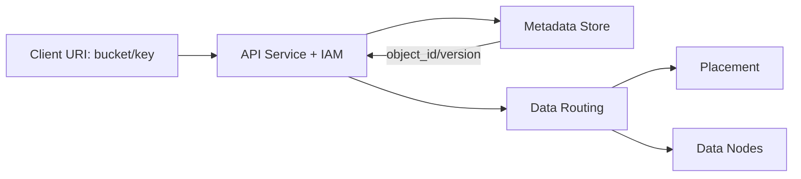
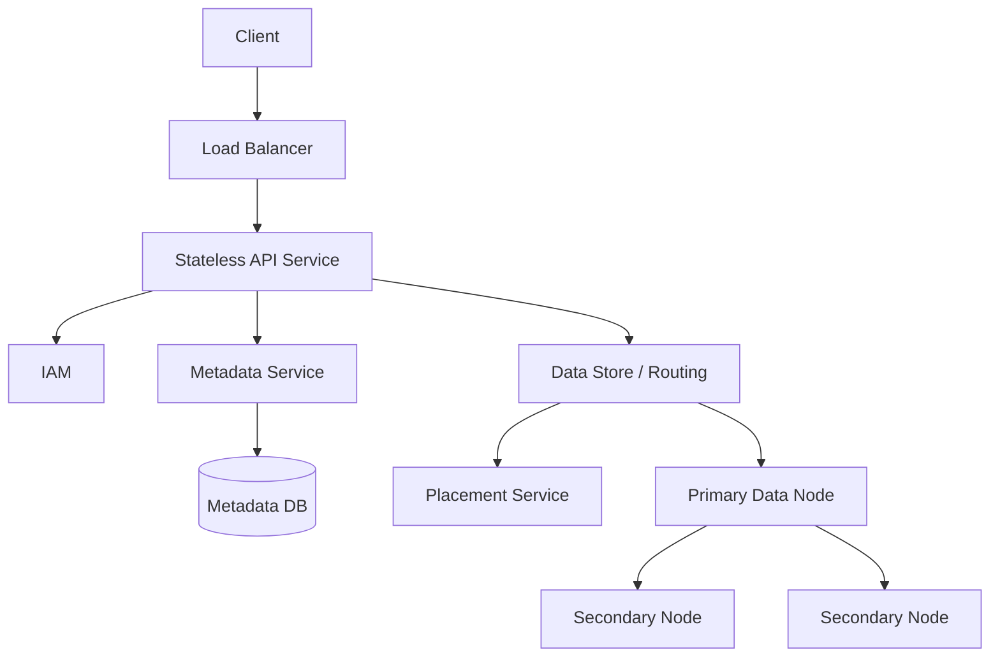
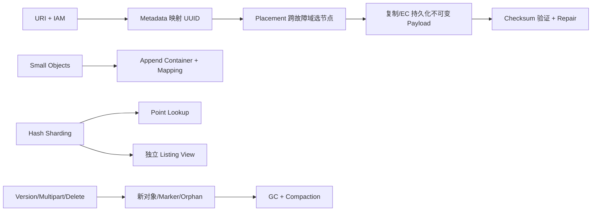
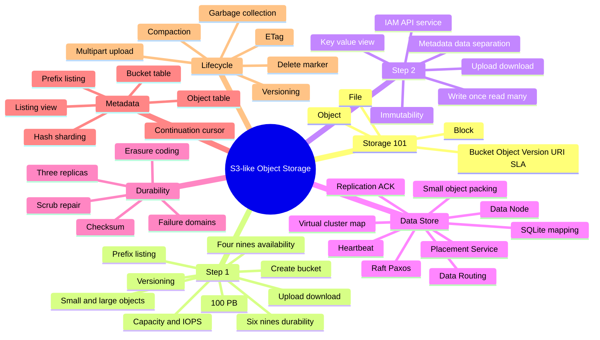

> 原书：Alex Xu、Sahn Lam，*System Design Interview: An Insider's Guide, Volume 2*（2022）
> 范围：Chapter 9: S3-like Object Storage（PDF 第 255～289 页）
> 目标：设计支持 Bucket、对象上传/下载、版本控制和前缀列表的对象存储，在 100 PB 规模下兼顾 6 个 9 的耐久性、4 个 9 的可用性与存储效率。

## 0. 对象存储的核心拆分

对象存储通过 REST API 提供一个看似简单的抽象：

```text
PUT /bucket/key   -> store bytes
GET /bucket/key   -> retrieve bytes
```

但内部要同时解决两类完全不同的问题：

1. **Metadata Plane**：`bucket/key -> object_id/version/policy/location`，小而可变，要支持 URI 查询、前缀列表、权限与版本。
2. **Data Plane**：`object_id -> immutable bytes`，大而几乎不可变，要低成本、耐久、可校验和修复。



拆分带来的关键收益：

- Metadata 可按查询优化，Payload 可按容量/顺序 I/O 优化；
- Bucket/ACL/Version 更新不重写大对象；
- Data Node 只认 UUID，不必解析用户 Key；
- Replication/Erasure Coding 可在 Data Plane 独立演进。

同时带来 Atomicity Gap：Payload 已成功写入，但 Metadata 写失败会形成 Orphan；Metadata 已发布而数据未足够复制会形成 Dangling Reference。设计必须规定可见性边界并用 GC/Reconciliation 修复。

---

## 1. Storage System 101

作者先对比 Block、File 与 Object Storage，再定义 Bucket/Object/Versioning/URI/SLA。

## 1.1 Block Storage

向主机暴露固定大小 Raw Blocks/Volume。主机可格式化文件系统，也可由数据库/虚拟机直接管理。

- 接口：SAS、iSCSI、Fibre Channel 等；
- 优点：低延迟、高 IOPS、灵活；
- 缺点：大规模共享、Metadata 和跨地域耐久需上层实现；
- 适用：数据库、VM、高性能应用。

网络连接的块存储对主机仍表现为 Raw Blocks，不因远程连接就变成 File/Object Storage。

## 1.2 File Storage

在 Block Storage 上构建文件/目录层次，通过 NFS、SMB/CIFS 等共享。

- 路径和目录语义直观；
- 支持原地修改文件；
- 适合组织内共享与通用文件系统；
- 容量和 Metadata Scale 高于单机，但通常不如对象存储达到海量规模。

## 1.3 Object Storage

对象由：

$$
Object=(ID,Metadata,Payload)
$$

组成，放在扁平 Bucket 中，通过 REST URI 访问。

它有意牺牲部分延迟/随机修改能力，换取：

- 海量扩展；
- 极高耐久；
- 低成本；
- 适合 Binary/Unstructured/Cold Data。

对象不可原地修改：只能删除，或用新 Payload 替换/创建新 Version。这让 Data Plane 成为 Append/Immutable Workload，显著简化复制、Checksum 和缓存。

## 1.4 三类存储对比

| 维度 | Block | File | Object |
|---|---|---|---|
| 访问 | Block Protocol | 文件路径/NFS/SMB | REST API/Key |
| 修改 | 原地 | 原地 | 整对象替换/Version |
| 性能 | 高/很高 | 中/高 | 低/中 |
| 成本 | 高 | 中/高 | 低 |
| 一致性 | 通常强 | 通常强 | 现代系统可强一致，设计依语义 |
| 扩展 | 中 | 高 | 海量 |
| 典型用途 | DB/VM | 共享文件 | Archive/Backup/Blob |

“对象存储慢”是相对块设备的泛化，不意味着所有 GET 都低性能；CDN、并行读和本地 Cache 可提供很高吞吐。

## 1.5 核心术语

### Bucket

对象逻辑容器，Bucket Name 全局唯一。它持有 Owner、Policy、Lifecycle、Versioning 等配置。

### Object

Payload 是任意 Byte Sequence，Metadata 是描述它的 Name-value Pairs。

### Versioning

Bucket 级功能，保留同一 Key 的多个 Version，支持恢复误删/覆盖。

### URI

每个 Bucket/Object 通过 URL/URI 唯一访问。Key 中的 `/` 只是字符串字符，可模拟目录但不是真目录。

### SLA

耐久性与可用性不同：

- Durability：已写数据在长期不丢失的概率；
- Availability：请求在某时刻成功服务的概率。

例如 99.999999999% Durability 不代表 99.999999999% 请求都能即时访问。

---

## 2. Step 1：理解问题并确定设计范围

## 2.1 功能需求

- 创建 Bucket；
- 上传对象；
- 下载对象；
- Object Versioning；
- 按 Bucket/Prefix 列出对象。

对象分布跨度很大：几十 KB 的大量 Small Object，以及几 GB 以上的大 Object。

## 2.2 非功能需求

- 一年约 100 PB；
- 数据耐久性 99.9999%（6 Nines）；
- 服务可用性 99.99%（4 Nines）；
- 在可靠性/性能前提下降低存储成本。

四个 9 Availability 的理论年停机预算：

$$
(1-0.9999)\times365\times24\times60\approx52.56\text{ minutes/year}
$$

## 2.3 粗略估算：Capacity 与 IOPS

对象比例：

- 20% Small，取中值 0.5 MB；
- 60% Medium，取 32 MB；
- 20% Large，取 200 MB。

原书假设仅 40% 的 100 PB 由这组估算占用：

$$
100\text{ PB}=10^{11}\text{ MB}
$$

平均对象大小：

$$
\bar{s}=0.2\times0.5+0.6\times32+0.2\times200
=59.3\text{ MB}
$$

对象数：

$$
N=\frac{10^{11}\times0.4}{59.3}
\approx6.745\times10^8
\approx0.68\text{ billion}
$$

每对象 Metadata 1 KB：

$$
S_{meta}=0.68\times10^9\times1\text{ KB}
\approx0.68\text{ TB}
$$

单 7200 RPM HDD 约 100～150 Random IOPS。Small Object 即使容量不大，也可能先耗尽 IOPS/Inode，所以 Data Node 不能简单“一对象一文件”。

### 估算边界

原书的 40% Storage Usage Ratio 未详细说明，属于教学假设；若完整 100 PB 都按该分布，Object Count 会约 1.69 Billion。生产容量要同时计副本/EC、Headroom、GC、Metadata Index 和 Repair Traffic。

---

## 3. Step 2：设计原则与高层架构

## 3.1 Object Immutability

对象不可增量修改。替换 Key 时写新 Object ID，再原子切 Metadata Current Version。

收益：

- Data Node Append-only；
- Reader 不与 Writer 修改同一字节；
- Replica/Cache 容易校验；
- Old Version/Lazy Delete 可异步 GC。

## 3.2 Key-value 视角

外部：

$$
URI=(bucket,key)\rightarrow payload
$$

内部：

$$
(bucket,key)\rightarrow object\_id
$$

$$
object\_id\rightarrow replicated/encoded\ bytes
$$

外部 Key 可变映射，内部 UUID 指向不可变数据。

## 3.3 Write Once, Read Many

原书引用 LinkedIn Ambry：约 95% Request 是 Read。设计应优化：

- Payload 不更新；
- Mapping 读快；
- 热对象可 Cache/CDN；
- Small Object Packing 减少随机 I/O；
- Upload 可接受比 Read 更多编码/复制成本。

## 3.4 类比 UNIX inode

UNIX：Filename -> inode -> Block Pointers。
Object Store：Object Name -> Metadata -> Object ID -> Network Data Node。

差异是后者跨网络、分布式 Placement、Replication/EC 和独立 Failure Domain。

## 3.5 高层架构



### Load Balancer

分发 REST 请求。

### API Service

无状态 Orchestrator，调用 IAM、Metadata 与 Data Store，可水平扩展。大对象生产设计常用 Pre-signed URL/Direct-to-Data-Plane，避免所有 Byte 双穿 API；原书使用 API 转发简化说明。

### IAM

Authentication 识别“你是谁”，Authorization 判断“允许什么操作”。Bucket Policy、ACL、Owner 与 Signed Request 都在此边界。

### Data Store

只按 Object UUID 存取 Payload。

### Metadata Store

保存 Bucket/Object Name、Object ID、Version、Expiration、ACL 等。Ceph RGW 等实现可把 Metadata 也存为 RADOS Object，逻辑拆分不要求物理独立服务。

---

## 4. Upload 与 Download

## 4.1 创建 Bucket 与上传对象

创建 Bucket：

1. Client `PUT bucket`；
2. API 调 IAM 验证 Write；
3. Metadata Store 创建 Bucket Entry；
4. 成功返回。

上传 Object：

1. Client `PUT /bucket-to-share/script.txt`；
2. IAM 验证 Bucket Write；
3. API 把 Payload 写 Data Store；
4. Data Store 持久化并返回 UUID；
5. API 创建 `(bucket_id,object_name)->object_id` Metadata；
6. 成功返回。

```http
PUT /bucket-to-share/script.txt HTTP/1.1
Content-Type: text/plain
Content-Length: 4567
x-amz-meta-author: Alex

[4567 bytes]
```

### 可见性提交点

必须先让 Payload 达到 Durability ACK 条件，再发布 Metadata；这样 GET 不会看到未完成对象。若 Metadata 写失败，Payload 成为不可见 Orphan，由 GC 删除。

客户端重试应带 Request ID/Expected Checksum；相同 Request 的重复写不能无限制造 Orphan。

## 4.2 下载对象

Bucket 没真实目录，`bucket-to-share/script.txt` 的 Slash 只是 Key 字符。

流程：

1. Client `GET /bucket/key`；
2. IAM 验证 Read；
3. Metadata Service 将 `(bucket,key,current_version)` 映射为 Object UUID；
4. Data Store 按 UUID 读取；
5. 返回 Payload、Metadata、Checksum/ETag。

数据路径可由 Data Node/CDN 直接 Stream 到 Client，控制面只返回位置/Token，减少 API 带宽瓶颈。

---

## 5. Step 3：Data Store 深入设计

Data Store 包含 Data Routing、Placement Service 和 Data Nodes。

## 5.1 Data Routing Service

无状态 REST/gRPC 层：

- 查询 Placement，选择写入节点；
- 向 Data Node 写；
- 从健康 Data Node 读并返回；
- 处理重试、Checksum、Replica Fallback。

它不应保存唯一 Placement State，因此可水平扩展。

## 5.2 Placement Service

维护 Virtual Cluster Map：

```text
Region/DC -> AZ -> Rack -> Host -> Disk/Partition
```

职责：

- 决定 Primary/Replica；
- 把副本分散到独立 Failure Domain；
- 监控 Heartbeat；
- 维护节点容量和健康；
- 节点增删后提供确定性 Routing/Repair Plan。

原书设 15 秒 Grace，超时标记节点 Down。阈值太短会因网络抖动误判并制造 Repair Storm，太长则恢复慢。

## 5.3 Placement Service 的一致性

这是 Critical Control Plane，建议 5 或 7 节点，用 Paxos/Raft。多数派健康即可服务：

$$
quorum=\left\lfloor\frac{n}{2}\right\rfloor+1
$$

7 节点多数派 4，可容忍 3 节点故障；5 节点可容忍 2。

共识保证 Cluster Map/Leader 不分叉，不代表 Data Object 本身由 Raft 复制。

## 5.4 Data Node

每节点运行 Data Service Daemon，Heartbeat 上报：

- 管理的 HDD/SSD 数；
- 各盘已用/可用容量；
- 节点健康/负载。

首次注册时 Placement 返回 Node ID、Cluster Map 和 Replication Instructions。

## 5.5 Data Persistence Flow

1. API 把 Object 发 Data Routing；
2. Routing 生成 UUID；
3. Placement 根据 Map 选 Primary；
4. Routing 向 Primary 写；
5. Primary 本地持久化并复制两 Secondary；
6. 达到 ACK 策略后返回 UUID；
7. API 再提交 Metadata。

Object ID -> Placement 必须在节点增删时仍可定位。可用 Consistent Hashing/Placement Map Version，不能简单依赖易变化的 `hash % node_count`。

## 5.6 Write ACK 权衡

3 Replica：

| 成功条件 | 延迟 | 数据安全/一致性 |
|---|---|---|
| 3/3 都落盘 | 最高 | 最强 |
| Primary + 1 Secondary | 中 | 中 |
| Primary 落盘 | 最低 | Leader 故障窗口可丢 |

2/3 与 1/3 后台补齐属于 Eventual Replication。若 SLA 承诺写成功后极高耐久，应明确最低同步副本、Failure Domain 和 Fsync 语义。

## 5.7 Small Object：为何不能一对象一文件

问题一：Internal Fragmentation。4 KB Block 上，小于 4 KB 仍占一整块。
问题二：Inode 数固定/Metadata Cache 压力，大量 Small File 会耗尽 Inode 并产生 Random I/O。

解决：把多个 Small Object 顺序 Append 到大 Container File。

```text
/data/a [object1][object2][...checksum]  read-only
/data/b [object3][object4][...checksum]  read-only
/data/c [object5][free...]               read-write
```

### 写串行瓶颈

一个 Active File 只能按顺序 Append，多核会争同一锁。作者建议每 Core 一个 Active File，使各 Core 独立顺序写。

还可按 Size Class 区分：Large Object 独立 extent/part，Small Object Packing，避免一个巨大对象阻塞 Small 写。

## 5.8 Object Mapping

Container 中按 UUID 查 Object 需要：

| 字段 | 含义 |
|---|---|
| `object_id` | UUID |
| `file_name` | Container File |
| `start_offset` | 起始字节 |
| `object_size` | 长度 |

读取：

$$
pread(file,start\_offset,object\_size)
$$

Mapping 仅对本 Data Node 有意义，无需全局共享。作者比较 RocksDB（LSM/SSTable，写强）与 Relational B+ Tree（读强），因 Write Once/Read Many 选择每节点 SQLite。

这是教学取舍；实际系统还要评估 SQLite 单写者、Crash Recovery、Mapping 数和与 Data File 的 Atomicity。

## 5.9 Data File 与 Mapping 原子性

Append Payload 后、Insert Mapping 前崩溃会留下不可达尾部；先 Mapping 后 Payload 完成会指向坏数据。

可采用：

1. Append Record Header + Payload + Checksum；
2. Fsync/达到本地持久条件；
3. SQLite Transaction Insert Mapping；
4. Commit 后可读；
5. Startup Scanner 截断不完整尾部并回收无 Mapping Record。

不可跨两个系统真正单事务时，利用 Append-only + Recovery/Reconciliation 达到可恢复一致。

---

## 6. Durability：Replication、Failure Domain 与 Erasure Coding

## 6.1 三副本粗略耐久估算

原书假设单 HDD 年故障率：

$$
p=0.0081
$$

假设三份独立且在修复前同时永久失败：

$$
P_{loss}\approx p^3=0.0081^3\approx5.31\times10^{-7}
$$

Reliability：

$$
1-p^3\approx0.999999469\approx6\text{ nines（粗略）}
$$

独立假设非常强。真实耐久取决于 Repair Time、相关故障、Silent Corruption、软件 Bug、操作误删和灾难。因此副本必须跨 Failure Domain，并持续 Scrub/Repair。

## 6.2 Failure Domain

- Disk：单盘；
- Node：主板、电源、CPU；
- Rack：交换机、电源；
- AZ：独立电力/网络；
- Region：区域灾难。

三份在同 Rack 不能防 Rack 断电。Placement 应约束 Rack/AZ Anti-affinity。

原书说 Failure Domain Choice 不直接改变独立盘故障公式，但会大幅降低相关故障风险，实际耐久评估不可忽略。

## 6.3 Erasure Coding

$(k+m)$ EC：把数据分成 $k$ 个 Data Chunk，计算 $m$ 个 Parity Chunk，总共 $k+m$ 份，任意 $k$ 份可恢复原数据（取决于具体 Code）。

### 4+2 示例

原书给出简化线性方程：

$$
p_1=d_1+2d_2-d_3+4d_4
$$

$$
p_2=-d_1+5d_2+d_3-3d_4
$$

丢 $d_3,d_4$ 时，用已知 $d_1,d_2,p_1,p_2$ 解二元方程恢复。真实 Reed-Solomon 在有限域运算，不是普通整数加减。

### 8+4

8 Data + 4 Parity 分布到 12 个 Failure Domain，可容忍最多 4 份丢失，并从任意 8 份恢复。

## 6.4 存储开销

3-copy 总物理空间为 $3D$：

$$
overhead=\frac{3D-D}{D}=200\%
$$

4+2 EC 总空间为 $1.5D$：

$$
overhead=\frac{2}{4}=50\%
$$

8+4 同样 50%。

## 6.5 复制与 EC 对比

| 维度 | 3-copy | EC |
|---|---|---|
| 耐久 | 高，原书粗估 6 nines | 更高，原书引用 11 nines |
| 存储开销 | 200% | 50%（4+2/8+4） |
| 写 | 复制即可 | 计算 Parity，延迟/CPU 高 |
| 正常读 | 一份 Replica | 至少读 $k$ Chunk |
| 故障读 | 换健康 Replica | 读取多节点并重建 |
| 实现 | 简单 | Placement/Repair 复杂 |

Latency-sensitive Hot Tier 常用 Replication；Cold/Capacity Tier 常用 EC。可先三副本接收，再后台转 EC，兼顾写延迟与长期成本。

本章主要实现三副本，EC 用于取舍讨论。

---

## 7. Correctness Verification：Checksum 与 Repair

硬盘彻底失效易检测，Silent Corruption 更危险：数据可读取但 Byte 已错误。

## 7.1 Checksum

写入时计算：

$$
c=H(payload)
$$

跨进程/网络/磁盘边界读取后重算并比较：

- 不同：确定 Corrupt；
- 相同：极高概率正确，但不是数学 100%。

原书列 MD5、SHA-1、HMAC 并选择 MD5 作简单 Checksum。现代系统不应把 MD5/SHA-1 用于对抗恶意碰撞；非对抗 Bit Rot 可用高速 CRC/xxHash，安全完整性用 SHA-256/HMAC。

## 7.2 Object 与 Container Checksum

- 每个 Object Record 后存 Checksum，支持局部验证；
- Read-only Container 尾部再存整文件 Checksum，支持 Scrub。

Checksum 本身也要受 Record Header/Replica/Metadata 保护。

## 7.3 读取与修复

复制模式：

1. 从 Replica A 读并验 Checksum；
2. 失败则从 B/C 读；
3. 返回健康副本；
4. 后台重写坏 Replica。

EC 模式：

1. 读取 Chunk + Checksum；
2. 收集至少 $k$ 个健康 Chunk；
3. 重建 Object；
4. 返回并修复坏/缺 Chunk。

若只 Fallback 不 Repair，冗余会逐渐耗尽。系统需要 Periodic Scrubber、Repair Queue、Priority 和 Bandwidth Throttling。

---

## 8. Metadata Data Model 与 Sharding

## 8.1 三类查询

1. 按 Object Name 找 Object ID；
2. 按 Name Insert/Delete；
3. 按 Bucket + Prefix List。

## 8.2 Schema

`bucket`：

```text
bucket_name, bucket_id, owner_id, enable_versioning, policy...
```

`object`：

```text
bucket_name/id, object_name, object_version, object_id, delete_marker...
```

逻辑唯一键：

$$
(bucket,object\_name,version)
$$

Current Version 可用最新 TIMEUUID 或显式 Current Pointer。

## 8.3 Bucket Table

100 万客户，每人 10 Bucket，每记录 1 KB：

$$
10^6\times10\times1\text{ KB}=10\text{ GB}
$$

容量单机可放，但 CPU/Network Read 可能不足，可加 Read Replica。Bucket Name 全局唯一需要强一致 Unique Registry，不能让两个 Region 同时创建同名 Bucket。

## 8.4 Object Table Sharding

### 按 `bucket_id`

同 Bucket 共置，Listing 简单；但一个 Bucket 可有十亿对象，形成容量/流量 Hot Shard，不可取。

### 按 `object_id`

均匀，但外部所有操作先给 `(bucket,key)`，无法高效定位 URI 查询；不适合作主 Metadata Key。

### 按 `hash(bucket_name,object_name)`

URI Lookup/Put/Delete 可确定路由，分布均匀，所以作者选择。

缺点：同 Prefix 被打散到所有 Shard，Listing 变 Scatter/Gather。

这揭示不可同时免费满足的两种访问：

- Hash 分片优化 Point Lookup；
- Range/Prefix 分片优化 Ordered Listing。

## 8.5 Prefix 不是 Directory

Key：`abc/d/e/f/file.txt`。Prefix 可为 `abc/d/e/f/`，Slash 只是 Delimiter 约定。

三种 List：

1. List 用户 Buckets；
2. 非递归 List：按 Delimiter 把更深 Key Roll Up 为 Common Prefix；
3. Recursive List：返回 Prefix 下所有 Key。

例如 Keys：

```text
CA/cities/losangeles.txt
CA/cities/sanfrancisco.txt
NY/cities/ny.txt
federal.txt
```

根级非递归返回：

```text
CA/
NY/
federal.txt
```

## 8.6 单数据库 Listing

可按 `(bucket_id,object_name)` B+ Tree Range Scan：

```sql
WHERE bucket_id = :bucket
  AND object_name >= :prefix
  AND object_name < :prefix_upper_bound
ORDER BY object_name
LIMIT :page_size
```

原书用 `LIKE 'prefix%'`；有合适索引时可 Range Scan。

Pagination 不应使用大 OFFSET，深页会扫描丢弃前行且并发 Insert 造成重复/漏项。更合适 Keyset Cursor：

```sql
AND object_name > :last_seen_name
ORDER BY object_name
LIMIT 10
```

## 8.7 Sharded Listing 的难点

Hash Shard 后每个 Shard 返回有序子流，Metadata Service 做 K-way Merge。Cursor 必须记录各 Shard 进度/Buffer；数百 Shard 会很大，拓扑变化也复杂。

原书接受 List 性能次优，因为对象存储优先海量 Scale/Durability，而非目录遍历。

## 8.8 Denormalized Listing Table

作者提出独立 Listing Table，按 `bucket_id` 分片，专门维护 `(bucket,prefix/object_name)` 有序视图。这样单 Bucket Listing 落到一个逻辑数据库，简化分页；即使 Bucket 有十亿对象，也可专用分区/子分片。

代价：

- Put/Delete 双写；
- 最终一致窗口；
- 热 Bucket；
- 额外存储与修复。

实践可由 Metadata Change Log/CDC 异步维护，List API 返回 Continuation Token 并定义一致性。

## 8.9 可运行示例：前缀 Listing 与 Cursor

```python
from base64 import urlsafe_b64decode, urlsafe_b64encode

def encode_cursor(last_key):
    return urlsafe_b64encode(last_key.encode("utf-8")).decode("ascii")

def decode_cursor(cursor):
    return urlsafe_b64decode(cursor.encode("ascii")).decode("utf-8")

def list_objects(keys, prefix="", delimiter=None, limit=1000, cursor=None):
    start_after = decode_cursor(cursor) if cursor else None
    matching = [key for key in sorted(keys) if key.startswith(prefix)]
    if start_after is not None:
        matching = [key for key in matching if key > start_after]

    entries = []
    seen = set()
    for key in matching:
        suffix = key[len(prefix):]
        if delimiter and delimiter in suffix:
            entry = prefix + suffix.split(delimiter, 1)[0] + delimiter
        else:
            entry = key
        if entry in seen:
            continue
        seen.add(entry)
        entries.append(entry)
        if len(entries) == limit:
            break

    next_cursor = encode_cursor(entries[-1]) if len(entries) == limit else None
    return entries, next_cursor

if __name__ == "__main__":
    keys = [
        "CA/cities/losangeles.txt",
        "CA/cities/sanfrancisco.txt",
        "NY/cities/ny.txt",
        "federal.txt",
    ]
    print(list_objects(keys, delimiter="/"))
    print(list_objects(keys, prefix="CA/", delimiter=None))
```

这是单有序视图的教学代码。真实分布式 Cursor 还需 Snapshot/Shard Version、签名、防篡改和 Expiration。

---

## 9. Object Versioning

Bucket 启用 Versioning 后，同 Key PUT 不覆盖旧 Metadata，而是：

1. Data Store 写新 Immutable Payload，返回新 UUID；
2. Metadata Insert 同 `(bucket,key)` 的新 Row；
3. `object_version=TIMEUUID`；
4. 最大 Version 成为 Current。

```text
script.txt / v3 -> object_id C (current)
script.txt / v2 -> object_id B
script.txt / v1 -> object_id A
```

TIMEUUID 便于时间排序，但全球并发 PUT 的时钟可能冲突/偏移。更稳妥可由 Metadata Primary 分配单调 Version ID 或 Commit Sequence。

## 9.1 Delete Marker

启用 Versioning 时 DELETE 不删旧版本，而插入新 Delete Marker。Current 是 Marker 时普通 GET 返回 404；指定旧 Version ID 仍可恢复。

Delete Marker 是 Metadata Version，没有 Payload。永久删除某指定 Version 才让对应 Payload 在无引用后进入 GC。

## 9.2 Versioning 的成本

- 每次覆盖保存完整新对象；
- Listing Current 与 List Versions 语义不同；
- Lifecycle 需清理 Non-current Version；
- Object Reference/GC 要确认无 Version 指向；
- 并发 PUT/DELETE 要线性化 Current Pointer。

版本不是 Delta Patch，仍符合 Object Immutability。

---

## 10. Multipart Upload

大文件单次 PUT 中途失败需重来。Multipart：

1. Initiate，返回 `upload_id`；
2. Client 分 Part，可并行上传；
3. 每 Part 返回 ETag/Checksum；
4. Client `Complete(upload_id, [(part_no,etag),...])`；
5. Store 验证所有 Part 并按编号组装/建立 Manifest；
6. 原子发布最终 Object Metadata。

原书例：1.6 GB 分 8 个 200 MB Part。

## 10.1 为什么有效

- 失败只重传一个 Part；
- 并行利用带宽；
- Client 可断点续传；
- Part Checksum 做完整性验证。

## 10.2 不一定要物理重写组装

原书说 Data Store Reassemble，可能需数分钟。优化是最终 Object 保存 Manifest：

```text
part1_ref, part2_ref, ..., total_size
```

GET 时按序 Stream Parts，后台再合并。这样 Complete 是 Metadata Operation，避免再复制 1.6 GB；代价是读要访问多个 Chunk，需控制 Part 数。

## 10.3 ETag 不总等于 MD5

原书把 Part ETag 解释为 MD5。具体产品中加密、Multipart 或新 Checksum 算法下 ETag 未必是 Payload MD5；API 应把 ETag 当 Opaque Validator，并显式支持 SHA-256/CRC Checksum。

## 10.4 Multipart 幂等与状态

状态：Initiated -> Uploading -> Completing -> Completed/Aborted/Expired。Complete 必须 Idempotent：重复请求返回同一 Object Version，不能生成多个对象。

未完成 Part 有 TTL/Lifecycle，避免永远占空间。

---

## 11. Garbage Collection 与 Compaction

Garbage 来源：

- Lazy Delete；
- 无 Version 引用的旧 Payload；
- Abandoned Multipart Part；
- Metadata 写失败留下 Orphan；
- Checksum Corrupted Data；
- Replica/EC 迁移后的旧 Chunk。

## 11.1 为什么不立即物理删除

对象 Packing 在 Container 中，删除中间 Object 无法原地收缩文件；立即 Rewrite 成本高。先 Tombstone，批量 Compaction 摊销 I/O。

## 11.2 Compaction

1. 从多个 Read-only File 顺序复制 Live Object 到新 File；
2. 跳过 Tombstone/Garbage；
3. 在 DB Transaction 中更新 `file_name/start_offset`；
4. 确认 Reader 不再引用旧 File；
5. 删除旧 File。

新 File 更紧凑，回收空洞。

## 11.3 并发 Reader 安全

不能更新 Mapping 后立刻删旧 File，因为已有 Reader 可能持旧位置。可使用：

- File Generation/Epoch；
- Reference Count；
- Read-copy-update；
- Grace Period。

## 11.4 Replica/EC 一致清理

- 3-copy：所有 Replica 都要删；
- 8+4：12 Chunk 都要删；
- 删除任务要幂等、可重试；
- Metadata/Lifecycle/Legal Hold 决定何时真正可删。

GC 错删是灾难性故障，因此通常采用 Mark-and-sweep、延迟删除和 Audit Log，宁可短期泄漏空间，不可过早删有效数据。

---

## 12. Step 4：收束

作者最终完成：

- Block/File/Object 对比；
- Bucket/Object/URI/Version/SLA；
- Upload、Download、List、Versioning；
- Metadata/Data Plane 分离；
- Routing/Placement/Data Node；
- 3-copy 与 Erasure Coding；
- Checksum；
- Small Object Packing + Local Mapping；
- Metadata Sharding 与 Listing View；
- Multipart；
- GC/Compaction。



---

## 13. 容易混淆的概念与常见误区

### 13.1 Durability 不等于 Availability

数据没丢但服务暂不可访问，是高耐久低可用事件；请求成功率不能代替丢失概率。

### 13.2 Object Key 不等于 Internal Object ID

外部 `(bucket,key)` 可覆盖/版本化；内部 UUID 指向不可变 Payload。

### 13.3 Slash Prefix 不是真实 Directory

无目录 inode，Rename Prefix 通常意味着 Copy/Delete 大量 Key，而非元数据移动一个目录。

### 13.4 Object Immutability 不等于 Key 不能覆盖

覆盖写创建新 Payload/Version，再切 Metadata；旧 Bytes 不原地修改。

### 13.5 Metadata/Data 分离不等于必有两套物理数据库

它是逻辑职责；Ceph 可都存为 RADOS Object。

### 13.6 写完 Data 不代表对象已对用户可见

只有 Metadata Commit 后 URI 才可读；此前失败 Payload 是 Orphan。

### 13.7 Metadata 先发布更危险

会让 GET 看见不存在/未复制完成的 Payload。应 Data Durable First、Metadata Publish Second。

### 13.8 3 个副本不等于所有故障下都有 6 Nines

粗公式假设独立故障；同 Rack/AZ、软件 Bug、误删会相关失效。

### 13.9 Failure Domain 分散不是“只提高可用性”

它降低相关数据丢失风险，是耐久设计的重要部分。

### 13.10 EC 不是备份

它防 Chunk/节点故障，不防用户误删、恶意覆盖和软件逻辑错误；Version/Backup/Lifecycle 仍需。

### 13.11 4+2 EC 不是两个完整副本

它是 4 Data + 2 Parity，需任意 4 健康块恢复；Read/Repair 要跨多节点。

### 13.12 EC 的 50% 是额外开销，不是总占用

总占用是原数据的 150%；3-copy 额外 200%、总占用 300%。

### 13.13 Checksum 不会自动修复

它只检测；必须结合 Replica/Parity、Repair Queue 和 Scrubber。

### 13.14 MD5 不适合对抗恶意篡改

原书作简单完整性例子。安全验证用 SHA-256/HMAC/签名。

### 13.15 Small Object 容量小不代表成本低

它会耗 Inode、随机 IOPS、Metadata 和 Request CPU，常比字节容量更难。

### 13.16 Packing Small Object 会引入 Mapping/Compaction

它解决 Inode/Block 浪费，却把删除变成 Tombstone，并要求 Offset Index。

### 13.17 每 Core 一个 Active File 不等于无限扩写

磁盘带宽、Fsync、SQLite Mapping 和 Replication 仍是共享瓶颈。

### 13.18 RocksDB 写快/B+ Tree 读快只是概括

真实选择取决于 Cache、Batch、Compaction、Range Query 和设备；不能机械套用。

### 13.19 Hash Sharding 与 Prefix Listing 天然冲突

均匀点查会打散顺序；要 Scatter/Gather 或维护第二个有序 Listing View。

### 13.20 OFFSET Pagination 不适合大列表

深页慢且并发写会漂移。应使用 Keyset/Continuation Token。

### 13.21 Denormalized Listing Table 会陈旧

它是派生视图，要用 Change Log、Version 和 Repair 管理双写不一致。

### 13.22 Delete Marker 不是物理删除

它是新 Current Version，让普通 GET 404；旧 Version 仍存在。

### 13.23 Versioning 不使用 Delta Patch

每次 PUT 是完整新 Immutable Object，存储成本按版本累积。

### 13.24 TIMEUUID 不一定提供严格全球提交顺序

时钟偏移/并发需要 Metadata Primary Sequence 或显式 Current Pointer。

### 13.25 Multipart Complete 不应非幂等

网络重试必须返回同一完成结果，不能重复组装/创建版本。

### 13.26 ETag 不总是 MD5

应当作 Opaque Token；完整性算法通过显式 Checksum 字段协商。

### 13.27 GC 不能看到 Tombstone 就立即删

Version、Replica、并发 Reader、Legal Hold 和异步 Metadata 都可能仍引用。

### 13.28 对象存储强一致与内部异步复制可以共存

只要 API 在满足规定 Commit 条件后才返回/发布，并由协议隐藏未提交状态。

### 13.29 可用容量不等于原始磁盘容量

要扣 Replica/EC、Headroom、GC、Repair、坏盘和文件系统开销。

---

## 14. 本章知识结构



## 15. 核心结论

1. **对象存储的根本取舍是牺牲原地修改与部分延迟，换海量、耐久和低成本。**
2. **Metadata 与 Payload 必须按不同工作负载优化。** 前者小而可变，后者大而不可变。
3. **外部 Key 和内部 UUID 分离。** Version/Overwrite 只改变 Metadata 映射，不原地改 Bytes。
4. **Upload 应先让 Data 达到耐久条件，再发布 Metadata。** 失败残留 Orphan 比可见坏引用更容易安全回收。
5. **Placement 是强一致控制面。** Raft/Paxos 维护唯一 Cluster Map，副本跨 Disk/Node/Rack/AZ。
6. **Small Object 的瓶颈常是 IOPS/Inode，不是容量。** Container Append + Local Mapping 解决碎片和文件数。
7. **三副本适合低延迟，EC 适合成本/耐久。** 4+2/8+4 用 50% 额外空间换计算和多节点读取。
8. **Checksum 负责检测，冗余负责恢复。** Scrub/Repair 才能维持长期冗余。
9. **URI Hash Sharding 优化 Point Lookup，却破坏 Prefix Locality。** Listing 需要 Scatter/Gather 或独立有序视图。
10. **Cursor Pagination 应基于 Key/Shard State，不应依赖深 OFFSET。**
11. **Versioning 用新 Row + 新 Object ID 保存完整历史。** Delete Marker 是版本，不是物理删。
12. **Multipart 把大失败域缩到 Part。** Complete 必须校验、幂等并原子发布。
13. **Lazy Delete + Compaction 是 Packed Storage 的自然结果。** GC 宁可延迟回收，也不能错删。
14. **Durability、Availability、Consistency、Latency 和 Storage Cost 是不同维度。** 每个 ACK/Replica/EC 决策都在它们之间取舍。

## 16. 解决对象存储问题的一般思路

### 第一步：明确外部语义

对象是否不可变、PUT/GET/List/Delete/Version 的一致性、最大大小、Multipart、Retention 和 SLA。

### 第二步：分别估算 Capacity 与 IOPS

按 Size Distribution 算 Object Count、Byte Capacity、Metadata；按 Small Object Request 算 IOPS/CPU，不只算 PB。

### 第三步：拆 Metadata Plane 与 Data Plane

URI/Policy/Version 在 Metadata；UUID/Bytes 在 Data。定义两者提交顺序、Orphan 和 GC。

### 第四步：设计 Placement 与 Failure Domain

Control Plane 用共识，Data 副本/Chunk 跨 Rack/AZ；明确 Heartbeat、Fencing、Repair 和 Rebalance。

### 第五步：按冷热/大小选择冗余

Hot/New Object 可 Replication，Cold Object 转 EC；计算存储放大、Write/Read/Repair 成本。

### 第六步：设计 Silent Corruption 防线

End-to-end Checksum、Periodic Scrub、Replica Fallback、Read Repair 和 Corruption Metrics。

### 第七步：专门处理 Small 与 Large Object

- Small：Packing、Mapping、Compaction；
- Large：Multipart、并行、Resume、Manifest。

### 第八步：为每种 Metadata Query 选索引

Point Lookup 与 Prefix Listing 需要不同布局。不要假设一个 Hash Shard 同时高效支持 Range Scan。

### 第九步：把生命周期做成状态机

Current/Old Version、Delete Marker、Incomplete Upload、Tombstone、GC Candidate、Physically Deleted；每次转换幂等可审计。

### 第十步：验证最危险失败窗口

- Data 写成功、Metadata 失败；
- Replica ACK 后节点/AZ 故障；
- Mapping 与 Container 不一致；
- Checksum 失败且部分 Replica 不可用；
- Listing View 落后；
- Multipart Complete 重试；
- Compaction 更新 Mapping 时 Reader 并发；
- GC 与 Version/Legal Hold 竞态。

整章可压缩为：

$$
\boxed{
\text{URI 元数据寻址}
\rightarrow
\text{UUID 不可变数据}
\rightarrow
\text{跨故障域复制/EC}
\rightarrow
\text{Checksum + Scrub + Repair}
\rightarrow
\text{Small/Large Object 专用布局}
\rightarrow
\text{Point/List 双索引}
\rightarrow
\text{Version/Multipart/GC 生命周期}
}
$$

本章最值得迁移的方法是：**先把用户可变命名空间与不可变字节分离，再围绕 Failure Domain、校验和修复定义耐久性；对 Small Object、Prefix Listing、Multipart 和 Versioning 分别承认其特殊访问模式，不试图用一个通用数据库或一种文件布局解决所有问题。**
