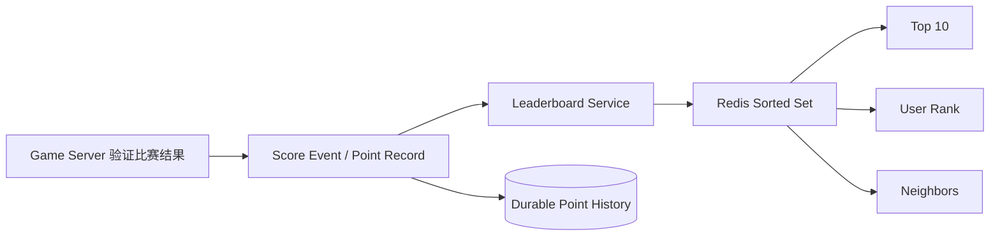
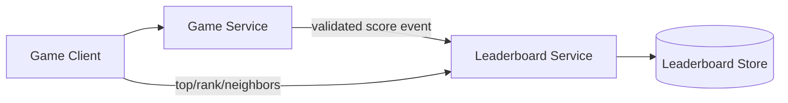
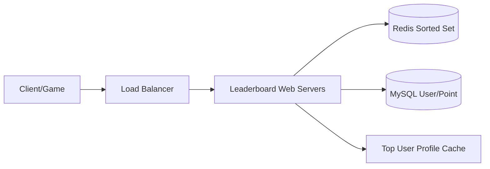
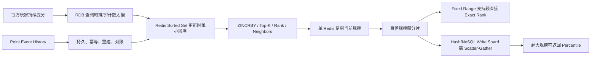
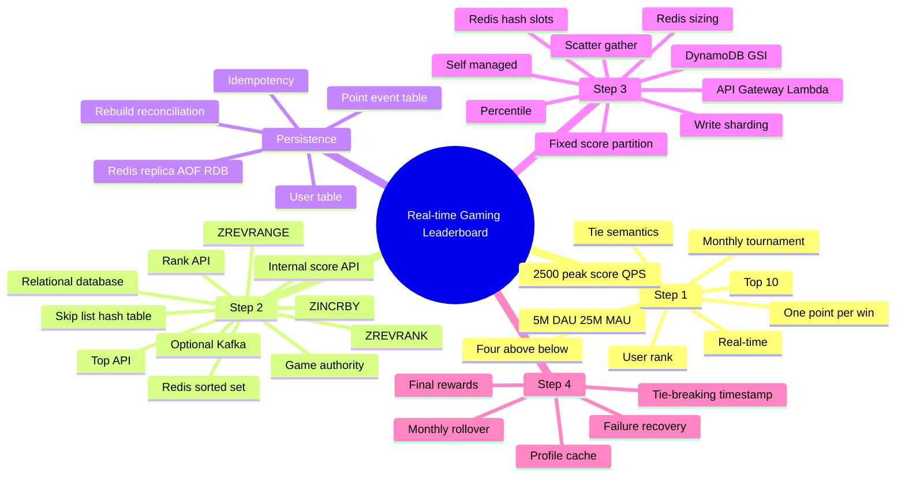

> 原书：Alex Xu、Sahn Lam，*System Design Interview: An Insider's Guide, Volume 2*（2022）
> 范围：Chapter 10: Real-time Gaming Leaderboard（PDF 第 290～315 页）
> 目标：为在线移动游戏设计月度实时排行榜，支持分数原子递增、Top 10、用户排名和用户附近排名，并讨论 Redis/NoSQL 扩展、并列、持久化与恢复。

## 0. 排行榜的本质：动态有序集合

每位玩家有一个不断变化的 Score，系统需要持续维护：

$$
user\_id\longrightarrow score
$$

以及 Score 降序对应的顺序统计：

$$
rank(user)=1+\#\{v\mid score(v)>score(user)\}
$$

这不是普通 Key-value 查询，因为一次 Score Update 会改变玩家在全体成员中的位置；Top-K、任意用户排名和附近玩家都依赖同一个动态排序结构。



本章先否决每次查询临时排序关系表，再使用 Redis Sorted Set 让“更新时维护顺序、查询时直接取排名”；规模扩大后比较 Score Range Fixed Partition、Redis Hash Slot 和 DynamoDB Write Sharding。

## 0.1 三种容易混淆的“排名”

假设分数是 `[100, 90, 90, 80]`：

| 语义 | 名次 |
|---|---|
| Ordinal/唯一序位 | 1, 2, 3, 4 |
| Competition Rank | 1, 2, 2, 4 |
| Dense Rank | 1, 2, 2, 3 |

原书需求说同分同名次，更接近 Competition/Dense Rank；但 Redis `ZREVRANK` 返回 0-based 唯一序位，同分 Member 会按内部 Tie Order 排开。系统必须先定义业务语义，不能把命令名 `rank` 直接等同于“同分同名次”。

---

## 1. Step 1：理解问题并确定设计范围

## 1.1 计分规则

玩家赢一场得 1 分：

$$
score_{new}(u)=score_{old}(u)+1
$$

加分必须由可信 Game Server 发起。客户端只能报告操作/请求，不能直接提交 Score，否则可通过修改请求、代理或重放作弊。

## 1.2 参与者与赛季

- 所有玩家都进入排行榜；
- 每月新 Tournament，创建新 Leaderboard；
- 旧月份转 Historical Storage。

Key 应包含 Game/Tournament/Month：

```text
leaderboard:{game_id}:{yyyy-mm}
```

不能只用月份，否则多游戏/多区服冲突。赛季边界还要统一时区和 Cutoff，避免月末事件写错榜。

## 1.3 查询功能

1. Top 10；
2. 某用户准确名次；
3. Bonus：该用户上、下各 4 位玩家。

附近玩家的语义依赖 Rank 定义。若 50 人同分，“上四位/下四位”更适合唯一序位；若业务坚持同分同名次，则一个名次可能对应多人，API 应定义返回数量还是 Rank Band。

## 1.4 用户规模与比赛量

- 500 万 DAU；
- 2500 万 MAU；
- 每玩家每天 10 场比赛；
- Worst Case：2500 万 MAU 都至少赢一场，全部进入月榜。

## 1.5 Tie 语义

初始要求：同分同名次。作者在收尾又给出可选 Tie-breaker：先达到该分数者排名更高。

两者是不同产品规则：

- 同分同名次：只比较 Score；
- Tie-break：比较 `(-score, reached_score_at, user_id)`，名次唯一。

若采用 Tie-break，就不再满足“同分同名次”，应与面试官明确变更。

## 1.6 实时要求

- Score Update 近实时；
- 更新应立即反映在 Leaderboard；
- 不接受定时 Batch 生成的历史榜；
- 仍需一般 Scalability、Availability、Reliability。

“实时”应进一步量化，例如 99% 更新在 1 秒内可见。若 Redis 同步更新失败但 Point 已持久化，系统可能短暂落后，但不能永久丢分。

## 1.7 粗略估算

作者用一天 $10^5$ 秒近似：

### 活跃用户进入速率

$$
Q_{users}=\frac{5{,}000{,}000}{10^5}\approx50/s
$$

峰值取 5 倍：

$$
Q_{users,peak}=250/s
$$

### Score Update QPS

作者保守假设每场都产生得分事件：

$$
Q_{score}=50\times10=500/s
$$

$$
Q_{score,peak}=500\times5=2500/s
$$

若只有胜者加分且平均胜率 $p$，更精确为：

$$
Q_{score}=\frac{DAU\times games/day\times p}{seconds/day}
$$

原书未引入胜率，2500 QPS 是偏安全上界。

### Top 10 Query QPS

假设每位用户每天首次打开游戏加载一次：

$$
Q_{top10}\approx50/s
$$

未计自动刷新和玩家 Rank 查询。真实读 QPS 可能更高，但 Top 10 极易缓存。

---

## 2. Step 2：API 与高层架构

## 2.1 Score Update API

```http
POST /v1/scores
```

| 字段 | 含义 |
|---|---|
| `user_id` | 获胜玩家 |
| `points` | 增加分数 |

此 API 只能由 Game Server 调用，需 Service Authentication、Authorization、Rate Limit 和 Audit。

### 必须补充的 Idempotency

网络超时重试 `ZINCRBY` 会重复加分。请求应携带唯一 `match_id/score_event_id`：

```json
{
  "score_event_id": "match-20260811-abc:winner:u42",
  "user_id": "u42",
  "points": 1,
  "tournament_id": "gameA:2026-08"
}
```

Durable Point Table 以 `score_event_id` Unique；只有首次插入才改变榜分。仅靠 Redis Increment 无法识别重试。

## 2.2 Top 10 API

```http
GET /v1/scores?tournament_id=gameA:2026-08&limit=10
```

返回 User ID、Display Name、Rank、Score。Rank 对外通常 1-based，而 Redis 是 0-based，要加 1。

## 2.3 User Rank API

```http
GET /v1/scores/{user_id}?tournament_id=gameA:2026-08
```

返回 Score 和 Rank。若玩家还未得分，需定义：未上榜、0 分榜尾，或所有注册玩家初始入榜。本章 Worst Case 只存至少赢一场者。

Bonus 可加入：

```http
GET /v1/scores/{user_id}/neighbors?above=4&below=4
```

## 2.4 高层架构



流程：

1. Client 发比赛行为/胜利请求到 Game Service；
2. Game Service 验证结果并调用 Leaderboard；
3. Leaderboard 原子更新 Score；
4. Client 直接查询 Top/Rank。

## 2.5 为什么 Client 不能直接更新榜分

Client 是不可信环境，可能：

- 改 Points；
- 重放获胜请求；
- 伪造 User；
- 中间人修改流量；
- 修改本地游戏状态。

Server-authoritative Game 应由 Server 自己产生 Score Event，甚至无需 Client 再显式上报。

## 2.6 是否需要 Kafka

本章没有显式要求多下游，因此初版不用 Kafka，保持低延迟和简单。

若同一 Score Event 还供：

- Analytics；
- Push Notification；
- Achievement；
- Fraud Detection；
- 多人实时广播；

则可发布 Durable Event。更稳健的写路径是 Point DB + Transactional Outbox -> Kafka -> Redis Projection。代价是 Leaderboard 最终一致而非同步立即更新。

---

## 3. Data Model 方案一：Relational Database

小规模可建：

```sql
CREATE TABLE leaderboard (
    tournament_id VARCHAR(64),
    user_id VARCHAR(64),
    score INT NOT NULL,
    PRIMARY KEY (tournament_id, user_id)
);
```

赢一场用 Atomic Upsert/Increment。Top 10 可：

```sql
SELECT user_id, score
FROM leaderboard
WHERE tournament_id = :t
ORDER BY score DESC
LIMIT 10;
```

有 `(tournament_id,score DESC)` Index 时 Top 10 不一定要全表排序；原书的主要反对点是“任意用户实时 Rank”与持续更新排序索引在百万级下成本高。

## 3.1 User Rank 查询

Competition Rank：

```sql
SELECT 1 + COUNT(*)
FROM leaderboard
WHERE tournament_id = :t
  AND score > :user_score;
```

即使有 Score Index，也会扫描/计数大量 Higher Score Entry；高频 Rank Query 成本高。Window Function 每次对全榜 Rank 更慢。

## 3.2 RDB 何时可行

- 玩家很少；
- Rank 用 Batch；
- 只查 Top-K；
- 使用专门 Order-statistics/Materialized View；
- 实时性要求低。

本题要百万用户任意 Rank 近实时，因此选择维护顺序的内存结构。

## 3.3 “缓存不适合”的准确理解

原书说数据持续变化，普通 Query Result Cache 很快失效。但不是所有缓存都无效：Top 10 可短 TTL，用户 Profile 可缓存；Redis Sorted Set 本身是主排名索引，而非被动缓存一次 SQL 结果。

---

## 4. Redis Sorted Set

## 4.1 结构

Sorted Set 中 Member 唯一，Score 可重复。内部通常结合：

- Hash Table：`member -> score`，快速找当前值；
- Skip List：按 `(score,member)` 排序，支持 Range/Rank。

## 4.2 Skip List 直觉

普通有序链表 Search/Insert 要从头走，$O(n)$。Skip List 增加多级稀疏索引，先在高层大步跳，再下沉到 Base List，期望：

$$
Search/Insert/Delete=O(\log n)
$$

它类似概率化平衡树，更新时无需昂贵全局重平衡。Redis Sorted Set 还用 Span 支持 Rank 计算。

## 4.3 关键命令

### `ZADD`

插入/更新 Member Score，$O(\log n)$。

### `ZINCRBY`

原子增加 Score，不存在则从 0 开始：

```redis
ZINCRBY leaderboard:gameA:2026-08 1 user42
```

复杂度 $O(\log n)$。

### `ZREVRANGE`

按 Score 从高到低取索引范围：

```redis
ZREVRANGE leaderboard:gameA:2026-08 0 9 WITHSCORES
```

复杂度：

$$
O(\log n+m)
$$

$m$ 是返回数。

### `ZREVRANK`

返回 Member 0-based 降序唯一序位，$O(\log n)$。

```redis
ZREVRANK leaderboard:gameA:2026-08 user42
```

对外序位 = 返回值 + 1。

## 4.4 四个主要 Workflow

### 更新 Score

`ZINCRBY`。前提是 Score Event 已去重，否则 Retry 重复加分。

### Top 10

`ZREVRANGE 0 9 WITHSCORES`。

### User Position

唯一序位使用 `ZREVRANK`。

### 附近 4 人

设 Redis Index 为 $i$，范围：

$$
[\max(0,i-4),\min(n-1,i+4)]
$$

然后 `ZREVRANGE start stop WITHSCORES`。原书示例 Rank 361 是 1-based，因此请求 357～365；换成 Redis 0-based 要减 1。

## 4.5 同分同名次如何实现

Redis 会给同分 User 不同 Unique Index。Competition Rank 应计算：

$$
rank(u)=1+count(score>score(u))
$$

Redis 可先 `ZSCORE`，再用 `ZCOUNT (score,+inf]` 统计严格更高分。整数 Score 时可查询 `score+1` 到 `+inf`。

```text
score=90, higher_count=1 -> rank=2
```

同分所有 User 都得 Rank 2。

若要求 Dense Rank，则需统计“严格更高的不同 Score 数”，单 Sorted Set 不直接提供，需要额外 `score -> count` 结构。

## 4.6 Tie-breaker：先达到分数者优先

作者建议 Redis Hash 保存 User 最近获胜时间，同分时较早者更高。但仅存 Hash 不会自动改变 Sorted Set 的顺序；要么：

1. Query 后对同分组按 Timestamp 二次排序；
2. 把 Score/Time 编码成 Composite Score；
3. 使用支持复合 Sort Key 的结构。

Composite Score 必须避免 Double Precision 丢失。例如：

$$
composite=score\times B+(B-1-timeBucket)
$$

要求 $B$ 足够大且总整数不超过 Redis Double 的精确整数范围 $2^{53}$。更稳妥是保持 Score 为主结构，Tie Group 单独排序。

## 4.7 Redis 排名与业务排名的结论

| 需求 | 直接命令/结构 |
|---|---|
| 唯一序位 | `ZREVRANK + 1` |
| Competition Rank | `1 + ZCOUNT(scores strictly higher)` |
| Dense Rank | 额外维护 Distinct Score Index |
| 先到者优先 | Score + Timestamp 复合顺序 |

原书初始“同分同名次”与后文 `ZREVRANK`/Tie-breaker 不能同时无条件成立，笔记必须明确选择。

---

## 5. Redis 容量、持久化与 Source of Truth

## 5.1 内存粗估

Worst Case 2500 万 MAU 全上榜：

- User ID 24 bytes；
- Score 2 bytes；
- 最小原始数据 26 bytes/Entry。

$$
25{,}000{,}000\times26=650{,}000{,}000\text{ bytes}
\approx650\text{ MB}
$$

作者将 Skip List/Hash Overhead 粗略翻倍，约 1.3 GB，单现代 Redis 足够。

实际 Redis Member、Dict Entry、Skiplist Node、Pointer、Allocator Fragmentation 往往远高于 2 倍，必须用真实 ID/版本压测。还要为 Fork Snapshot/Replication Buffer 预留内存。

## 5.2 CPU/QPS

Peak 2500 Score Update/s，单 Redis 通常可承受。Top 10 Query 也轻。当前规模无需过早分片。

## 5.3 Persistence 与 Replica

Redis 支持 RDB/AOF，但大实例从 Disk 冷启动慢。常见：

- Primary + Replica；
- Primary 故障时 Promote Replica；
- 新 Replica 后补；
- AOF/RDB 用于更大故障恢复。

异步复制仍可能丢 Primary 最后更新。若榜分不能丢，Redis 不应是唯一事实来源。

## 5.4 MySQL User 与 Point Tables

- `user`：User ID、Display Name、Profile；
- `point_event`：Score Event ID、User、Points、Timestamp、Tournament/Match。

Point Event Log 的作用：

- 幂等；
- Game History；
- Audit/Fraud Investigation；
- Redis 灾难后重建。

可靠路径可为：

1. DB Transaction Insert Unique Score Event；
2. Outbox 发布；
3. Consumer 幂等更新 Redis；

或者同步 Redis 后异步记录，但后者更难保证不丢/不重。

## 5.5 Top 10 User Profile Cache

Sorted Set 只存 ID/Score，显示 Name/Avatar 要查 User Store。Top 10 高频且很小，可缓存 Profile；也可批量 `MGET`，避免 N+1 Query。

---

## 6. Step 3：自管服务与 Cloud Serverless

## 6.1 自管方案



每月建 Sorted Set，旧榜归档。应用负责 Capacity、HA、Deployment、Failover 和 Redis Maintenance。

## 6.2 AWS Serverless 方案

API Gateway 映射 Lambda：

| API | Function |
|---|---|
| `GET /v1/scores` | FetchTop10 |
| `GET /v1/scores/{user_id}` | FetchPlayerRank |
| `POST /v1/scores` | UpdateScore |

Lambda 调 Redis/MySQL，自动按请求扩展，减少 Server 运维。原书建议从零构建且已在 AWS 时可采用。

## 6.3 Serverless 的隐藏约束

- VPC/Redis Connection 数；
- Cold Start；
- Lambda 并发洪峰压垮 Redis；
- Connection Pool 不能像常驻进程自然复用；
- Timeout/Retry 可能重复 Increment；
- DB Connection Proxy；
- Vendor Lock-in 和成本。

Serverless 只自动扩 Compute，不会自动扩 Redis/DB，也不会自动提供 Score Event Idempotency。

---

## 7. Scaling Redis：500 Million DAU

原书假设规模增大 100 倍：

- Leaderboard 原始内存约 65 GB；
- Peak QPS 约 250,000；
- 需要分片。

这里 500M DAU 是原 5M DAU 的 100 倍，但若 MAU 比例保持，成员也约 2.5B，65GB 只是仍按 26 bytes 的理想下界，真实内存会更大。

## 7.1 Fixed Score-range Partition

假设月分数 1～1000，切 10 Shards：

```text
[1,100], [101,200], ..., [901,1000]
```

每个 Shard 是 Sorted Set。

### 前提

Score Distribution 要相对均匀，否则高分/低分段热点。Range Boundary 需按历史 Quantile 调整，而非等宽一定均衡。

### 更新

通过 User -> Current Score Cache 找旧 Shard。加分跨边界时：

1. 从旧 Sorted Set 删除；
2. 加到新 Sorted Set；
3. 更新 Score Mapping。

三个动作跨 Redis Key/Node，必须幂等/原子协调。可由 Durable Score Event 驱动，Lua 只在同 Node/Slot 内原子；跨 Shard 要 Saga/Retry/Reconciliation。

### Top 10

从最高 Score Shard 开始取；若该 Shard 不足 10 人，继续向下 Shard，直到凑足。原书简单说最高 Shard 包含 Top 10，实际依赖人数。

### Exact Competition Rank

设用户在 Shard $j$，Score 为 $s$：

$$
rank=1+\sum_{k>j}|S_k|+\#\{v\in S_j\mid score(v)>s\}
$$

高分 Shard Member Count 应用 `ZCARD`（$O(1)$），不是 `INFO keyspace`：后者统计 Key 数，若每 Shard 只有一个 Sorted Set，不能得到 Set Member 数。原书此处表述值得校正。

同 Score 都落同 Range，严格大于计数可保证 Competition Rank。

### 附近排名

若 Unique Ordinal 跨 Shard 边界，要从当前 Shard 取附近，不足时向相邻 Range 补；Competition Rank 同分组可能返回超过 9 人。

### 优点

- Top-K 主要查最高 Range；
- Exact Rank 可由高分 Shard Count + Local Count 得到；
- 适合 Score 范围已知且可均衡。

### 缺点

- Boundary/分布管理复杂；
- Score Migration 跨 Shard；
- 热分段；
- Score 无上限时要动态扩 Range。

## 7.2 Hash Partition / Redis Cluster

Redis Cluster 把 Key 映射到 16,384 Hash Slots：

$$
slot=CRC16(key)\bmod16384
$$

它不是 Consistent Hashing；Slot 可在 Node 之间迁移。每 Node 有 Primary/Replica。

### 一个关键结构问题

若整个月榜只有一个 Redis Key（一个 Sorted Set），Redis Cluster 不会自动把该 Set 的 Member 跨 Slot 分片；一个 Key 只属于一个 Slot/Node。要 Hash Partition，应用必须创建多个 Key：

```text
leaderboard:month:shard0
leaderboard:month:shard1
...
```

按 User Hash 选择 Shard。原书图示应理解为应用级多 Sorted Set，再由 Redis Cluster 放置 Key。

### Top-K：Scatter-Gather

从每个 $S$ Shard 并行取 Local Top-K，合并最多 $S\times K$ 条，再求 Global Top-K。

正确性：全局 Top-K 的任何元素必在其所属 Shard Local Top-K 中。

复杂度约：

$$
Network=O(SK),\quad Merge=O(SK\log K)
$$

### 限制

- 大 $K$ 返回多；
- Shard 多时 Tail Latency 由最慢 Shard 决定；
- Exact User Rank 很难：必须知道所有 Shard 中 Score 更高的人数；
- 适合 Top-K，不适合高频任意 Exact Rank。

因此原书倾向 Fixed Partition。

## 7.3 分片数权衡

更多 Shard：

- 单 Shard 内存/QPS 降低；
- Scatter-Gather、Metadata、Failover 和 Reconciliation 增加；
- Exact Rank 更复杂。

需用真实 Benchmark 选择，不能只按总内存平均除。

## 7.4 Redis Node Sizing

写密集应用要为 RDB Fork Copy-on-write、AOF Rewrite、Replication Buffer 和 Failover 留余量。原书建议安全起见分配约数据两倍内存，并用 `redis-benchmark` 在目标 Hardware/Command/Value Size/Pipeline 下测。

通用 Benchmark 数字不能替代自己的 Sorted Set、Persistence 和 Tail Latency 测试。

---

## 8. Alternative：DynamoDB/NoSQL

理想 NoSQL：

- 写优化；
- 同 Partition 内按 Score 高效排序；
- 自动扩展与托管。

## 8.1 初始表为何不够

以 `user_id` 为 Primary Key，存 Score、Profile、Leaderboard Name。要 Top 10 仍需全表 Scan，不能接受。

## 8.2 Global Secondary Index

GSI：

- Partition Key：`leaderboard_name`；
- Sort Key：`score`。

可以在一个榜内按 Score Query。但整月所有玩家同 Partition Key，会成为 Hot Partition。

## 8.3 Write Sharding

把 GSI Partition Key 改为：

```text
{game}#{year-month}#p{partition_number}
```

User Hash/随机落到 $n$ 个 Write Shard，每个内部按 Score 排序。

### Top 10

对每个 GSI Partition Query Top 10（Scatter），应用合并（Gather）。逻辑与 Hash-sharded Redis 相同。

### Partition 数

更多 Partition 降低单分区 Write Load，却增加 Query Fan-out。必须结合 DynamoDB Partition Throughput 与 Top-K Latency Benchmark。

## 8.4 Exact Rank 与 Percentile

Write-sharded GSI 难给 Exact Rank。原书建议大规模时返回 Percentile，往往比“1,200,001 名”更有意义。

Cron Job 统计各 Shard Score Distribution，Cache 阈值：

```text
10th percentile: score < 100
20th percentile: score < 500
...
90th percentile: score < 6500
```

给用户 Relative Rank。

### 前提与误差

不能简单假设各 Shard 分布相同；应对 Global Histogram/Quantile Sketch 合并。Percentile 是近似产品语义，不等于 Exact Rank。若奖励按精确名次发放，近似不可用。

## 8.5 Redis 与 DynamoDB 对比

| 维度 | Redis Sorted Set | DynamoDB GSI |
|---|---|---|
| 单榜 Exact Rank | 原生 Unique Rank，Competition 可计数 | 不原生 |
| Top-K | 原生 Range | GSI Query/Scatter |
| 更新 | 内存低延迟 | 持久托管、延迟更高 |
| 容量 | 内存贵 | 磁盘型托管 |
| 分片 | Sorted Set 跨分片复杂 | Write Sharding 仍需 Scatter |
| 持久性 | 需 AOF/Replica/Source Log | 内建持久性 |

本章百万级实时 Exact Rank 更适合 Redis。

---

## 9. 可运行示例：三种排名与固定分片

下面代码展示：

- 唯一序位；
- Competition Rank；
- Dense Rank；
- 固定 Score Range 下的 Competition Rank 公式；
- Top-K Scatter-Gather。

```python
from heapq import nlargest

def ordered_players(scores):
    return sorted(scores.items(), key=lambda item: (-item[1], item[0]))

def ordinal_rank(scores, user_id):
    players = ordered_players(scores)
    return next(index for index, (user, _) in enumerate(players, start=1) if user == user_id)

def competition_rank(scores, user_id):
    target = scores[user_id]
    return 1 + sum(score > target for score in scores.values())

def dense_rank(scores, user_id):
    target = scores[user_id]
    return 1 + len({score for score in scores.values() if score > target})

def top_k_from_hash_shards(shards, k):
    local_candidates = []
    for shard in shards:
        local_candidates.extend(nlargest(k, shard.items(), key=lambda item: (item[1], item[0])))
    return sorted(local_candidates, key=lambda item: (-item[1], item[0]))[:k]

def fixed_partition_rank(shards_low_to_high, shard_index, user_id):
    current = shards_low_to_high[shard_index]
    target = current[user_id]
    users_in_higher_shards = sum(len(shard) for shard in shards_low_to_high[shard_index + 1:])
    higher_in_current = sum(score > target for score in current.values())
    return 1 + users_in_higher_shards + higher_in_current

if __name__ == "__main__":
    scores = {"alice": 100, "bob": 90, "carol": 90, "dave": 80}
    assert ordinal_rank(scores, "carol") == 3
    assert competition_rank(scores, "carol") == 2
    assert dense_rank(scores, "dave") == 3

    shards = [
        {"dave": 80},
        {"bob": 90, "carol": 90},
        {"alice": 100},
    ]
    assert fixed_partition_rank(shards, 1, "carol") == 2
    print(top_k_from_hash_shards(shards, 3))
```

代码的 `user_id` 是 Tie 的稳定显示顺序，不改变 Competition Rank。真实 Redis Fixed Shard 用 `ZCARD` 求高分 Shard 人数、`ZCOUNT` 求当前 Shard 严格高分人数。

---

## 10. Step 4：Tie、Profile 与故障恢复

## 10.1 Faster Profile Retrieval

Redis Hash 可缓存：

```text
user_id -> {display_name, avatar_url}
```

Top 10 无需每次查 MySQL。Profile 更新要 Cache Invalidate/TTL，不能永久陈旧。

## 10.2 Tie-breaking

作者建议保存 User 最近赢得分数的 Timestamp，同分时先达到者优先。完整实现需要 Atomic Update Score + Timestamp，并明确：

- 是达到当前分数的时间，不是最后登录/创建时间；
- Redis Failover/Replay 后排序可重现；
- Server Time/Sequence，而非 Client Clock；
- 相同时间再用 User ID。

## 10.3 System Failure Recovery

Redis Cluster 大故障时，从 MySQL Point Table 离线重建：对每条获胜记录调用/批量等价执行 `ZINCRBY`。

更高效：

```sql
SELECT tournament_id, user_id, SUM(points)
FROM point_event
GROUP BY tournament_id, user_id;
```

批量 `ZADD` 最终 Score，而不是对数亿 Event 逐条网络调用。然后从 Event Log Checkpoint 后追增量。

## 10.4 双写一致性

若 Game Service 同时写 Redis 与 MySQL：

- Redis 成功、DB 失败：榜有分但无法恢复/审计；
- DB 成功、Redis 失败：事实正确但榜落后；
- Retry 可能重复加分。

推荐：

1. Point Event DB/Kafka 是 Source of Truth；
2. `score_event_id` 去重；
3. Redis 是 Materialized View；
4. Consumer 用 Event ID/Sequence 幂等；
5. 定期 Reconciliation：`SUM(point_event)` vs Redis Score。

若强制同步“赢后立即可见”，可在 DB Commit 后同步更新 Redis并异步修复，但不能宣称跨系统原子。

## 10.5 Monthly Rollover

月初不是简单 Delete Old Key：

1. 预创建 New Tournament Key；
2. 用权威 Server Time 将 Score Event 路由到对应 Season；
3. 冻结 Old Leaderboard；
4. 保存 Final Snapshot/奖励结果；
5. Archive；
6. 设置 Redis TTL 或删除。

月末比赛晚到/重放需按 Match End Time 和 Tournament ID 路由，不能按处理时间写新榜。

## 10.6 Reward Correctness

展示榜可接受短暂最终一致，发奖必须基于冻结、对账后的 Final Leaderboard，且奖励发放幂等。不能直接读取仍变化的 Redis Top 10 发放高价值奖励。

---

## 11. 全章收束

作者的选择路径：



---

## 12. 容易混淆的概念与常见误区

### 12.1 Score 与 Rank 不同

Score 是累计值；Rank 是相对全体的顺序统计。更新一个 Score 可能改变许多人的 Rank。

### 12.2 Redis `ZREVRANK` 不满足“同分同名次”

它返回唯一 0-based 序位。同分 Rank 要统计严格高分人数。

### 12.3 Competition Rank 与 Dense Rank 不同

`1,2,2,4` 与 `1,2,2,3`。API/奖励必须明确。

### 12.4 Tie-breaker 会改变原始同分规则

先达到者优先产生唯一名次，不再是同分同名次。

### 12.5 Redis Rank 是 0-based

用户 UI 通常 1-based，必须加 1；附近范围也要转换。

### 12.6 Top 10 快不代表任意 Rank 快

RDB 有 Score Index 时 Top 10 可快，但个人 Rank 仍需 Count Higher Scores。

### 12.7 Redis Sorted Set 不只是普通 Query Cache

它是持续更新的有序物化索引，内部维护 Member -> Score 和 Order。

### 12.8 Client 不能决定 Score

TLS 也不能让恶意 Client 可信；Game Server 必须验证结果。

### 12.9 `ZINCRBY` 原子不等于业务幂等

单次命令原子，但请求重试执行两次会加两分。需要 Score Event ID。

### 12.10 Redis Persistence 不等于零数据丢失

AOF 策略、异步 Replica 和 Failover 均有窗口。Durable Point Log 才提供重建依据。

### 12.11 650 MB 只是 Payload 下界

Redis Object/Dict/Skiplist/Pointer/Fragmentation 和 Snapshot Headroom 会大幅放大。

### 12.12 增加 Lambda 不会扩展 Redis

Compute 自动扩展可能把后端打爆，必须限流/连接复用。

### 12.13 一个 Sorted Set Key 不会被 Redis Cluster 自动拆 Member

Redis Cluster 按 Key 分 Slot。要分榜必须应用创建多个 Shard Key。

### 12.14 Fixed Partition 应按人数分布调 Boundary

等宽 Score Range 不等于等负载。

### 12.15 Fixed Shard Top 10 不一定只查最高 Shard

最高 Range 可能不足 10 人，要依次向下补。

### 12.16 跨 Fixed Shard 移动不是单命令原子

旧删、新加、Mapping 更新会部分失败，需要 Event-driven Idempotency/Reconciliation。

### 12.17 原书 `INFO keyspace` 不能直接给 Sorted Set Member 数

应使用 `ZCARD`；`INFO keyspace` 主要给 DB Key 数和 Expiration 信息。

### 12.18 Hash Shard 的 Exact Rank 不是把 Local Rank 相加

必须统计每个 Shard 中分数严格高于目标的人数。

### 12.19 Scatter-Gather 延迟取决于最慢 Shard

Shard 越多，Tail Latency/Partial Failure 越显著；需 Timeout 和 Result Completeness 语义。

### 12.20 Local Top-K 合并可得 Global Top-K

任何 Global Top-K 元素必属于所在 Shard 的 Local Top-K；这不等于 Local Rank 能直接得 Global Rank。

### 12.21 DynamoDB GSI 单一 Leaderboard Key 会热点

需要 Write Sharding；代价是 Read Fan-out。

### 12.22 Percentile 不等于 Exact Rank

可改善超大规模 UX，但不能用于精确奖励边界。

### 12.23 Profile Cache 与 Score Store 生命周期不同

Avatar/Name 可陈旧几分钟；Score/Rank 实时性更严格，不应绑在同 Value 更新。

### 12.24 月榜切换要用事件归属时间

处理延迟不能把上月 Match 写入新月。

### 12.25 展示实时榜与最终发奖榜不是同一一致性要求

发奖应冻结、对账、幂等；实时 UI 可短暂落后。

---

## 13. 本章知识结构



## 14. 核心结论

1. **实时排行榜是动态有序集合，不是普通 Counter 表。** 更新、Top-K、Rank 和 Neighborhood 共享顺序统计结构。
2. **Score 必须由 Server-authoritative Game 产生。** Client 不能直接更新。
3. **业务幂等必须靠 Score Event ID。** `ZINCRBY` 原子但不可防重试重复。
4. **RDB 可做事实日志和小榜，但不适合百万成员高频任意 Rank。**
5. **Redis Sorted Set 以 $O(\log n)$ 更新/排名和 $O(\log n+k)$ Range 匹配本题。**
6. **先定义 Rank 语义。** `ZREVRANK` 是唯一序位；同分 Competition Rank 是 $1+严格高分人数$。
7. **当前 25M MAU/2500 Update QPS 单 Redis 可行，但内存必须按真实结构压测。**
8. **Redis 不应是唯一事实来源。** Point Event Table/Log 提供审计、幂等、重建和对账。
9. **Fixed Score Partition 更容易算 Exact Rank。** 高分 Shard 人数 + 当前 Shard 严格高分数。
10. **Hash/Write Sharding 更均匀，却把 Top-K 变 Scatter-Gather，并让 Exact Rank 困难。**
11. **Redis Cluster 按 Key 而非 Sorted Set Member 分片。** 应用必须显式拆多个榜 Key。
12. **超大规模可以用 Percentile 替代 Exact Rank，但必须符合产品/奖励语义。**
13. **Tie-break、月榜切换和发奖都需可重现的 Durable Event/Server Time。**
14. **展示榜可最终一致，最终奖励榜必须 Freeze + Reconcile。**

## 15. 解决实时排名问题的一般思路

### 第一步：定义 Ranking Contract

明确赛季、Score、是否负分、Tie、Rank 类型、更新可见延迟和奖励边界。

### 第二步：从可信事件产生 Score

Game Server 验证 Match，写唯一 Score Event；不要把 Client Request 当事实。

### 第三步：选择 Order-statistics 结构

小规模可 RDB；百万级 Top/Rank/Range 用 Sorted Set/Order-statistics Tree；只需 Top-K 可考虑 Heap + DB。

### 第四步：分开事实与物化榜

- Durable Event/Point DB：Source of Truth；
- Redis/NoSQL Index：实时 Materialized View；
- Rebuild/Reconciliation 保证长期正确。

### 第五步：按 Rank 查询决定分片

- Exact Rank 高频：Score Range Partition；
- Top-K 为主：Hash/Write Shard + Scatter-Gather；
- 极大规模 UX：Approximate Percentile。

### 第六步：处理跨 Shard 更新

Score 跨 Range 时使用幂等 Event、状态机和 Reconciliation，不能假设跨 Key 原子。

### 第七步：把 Profile 与 Ranking 解耦

榜只存 User ID/Score/Tie Metadata，Profile 批量读取/缓存，避免大对象放 Sorted Set。

### 第八步：设计故障与赛季生命周期

Replica/AOF、灾难重建、月榜预创建/冻结/归档、晚到 Event 和 Final Reward Snapshot。

### 第九步：监控正确性和热点

- Score Event Duplicate/Reject；
- Redis Update Lag/Error；
- Top/Rank Latency；
- Shard Size/QPS/Score Distribution；
- Scatter Partial Failure；
- Redis vs Point DB Score Diff；
- Rollover/Reward Job。

### 第十步：验证极端场景

- Score API 超时重试；
- 同一 Match 重复回调；
- 玩家跨 Fixed Range 时节点故障；
- 同分千人；
- Redis Primary Failover 丢最后写；
- 月末晚到 Match；
- Hash Shard 一个节点超时；
- 重建期间仍有实时事件；
- 发奖任务重复执行。

整章可以压缩为：

$$
\boxed{
\text{可信唯一 Score Event}
\rightarrow
\text{Durable Point History}
\rightarrow
\text{Sorted Set 实时有序视图}
\rightarrow
\text{明确 Tie/Rank 语义}
\rightarrow
\text{按查询选择 Range 或 Hash 分片}
\rightarrow
\text{Rebuild/Reconcile}
\rightarrow
\text{冻结最终榜并幂等发奖}
}
$$

本章最值得迁移的方法是：**不要只问“怎样快速取 Top 10”，而要把更新幂等、任意 Rank、Tie 语义、分片后的全局顺序和故障重建放进同一个 Ranking Contract；Redis Sorted Set 解决的是有序索引，持久事实与业务正确性仍需独立闭环。**
