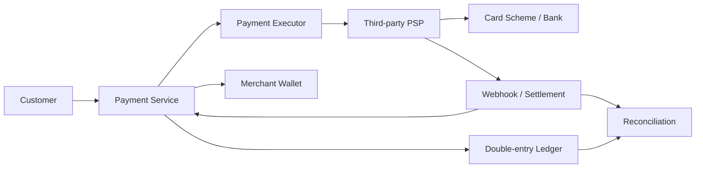
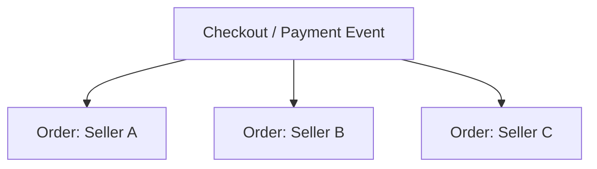
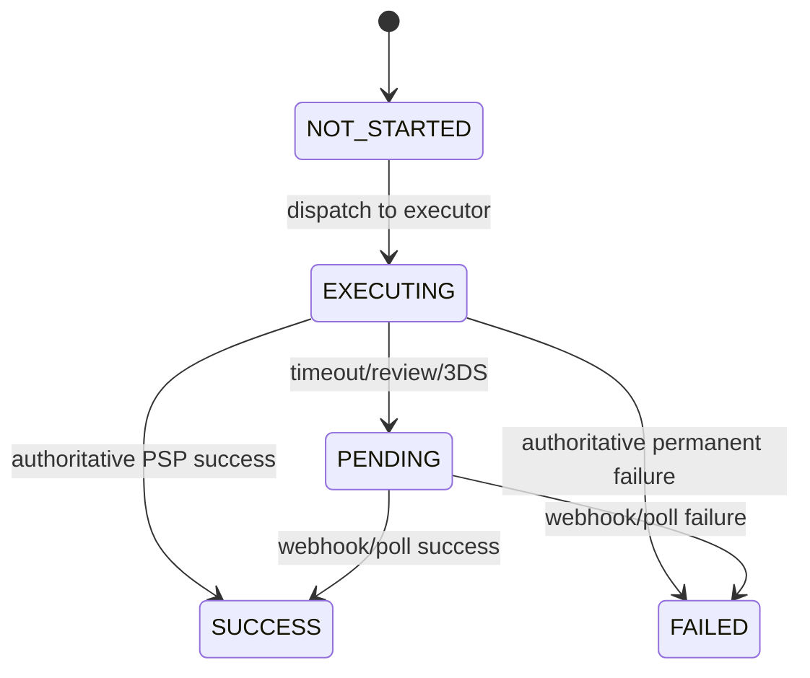
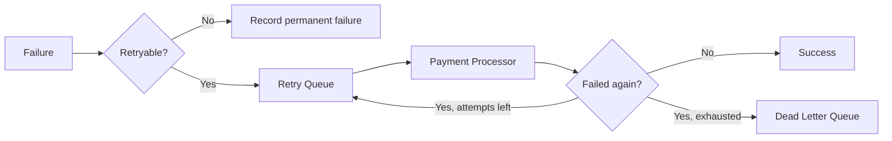
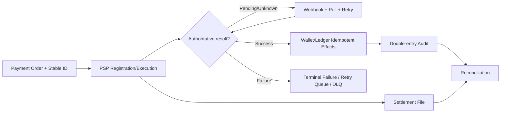
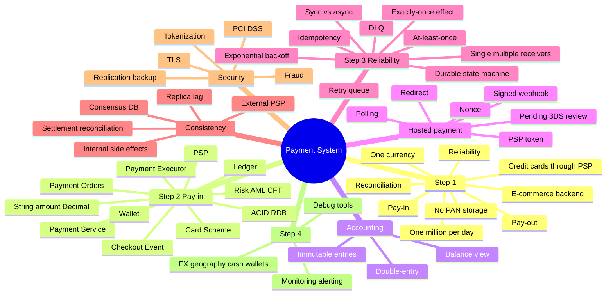

> 原书：Alex Xu、Sahn Lam，*System Design Interview: An Insider's Guide, Volume 2*（2022）
> 范围：Chapter 11: Payment System（PDF 第 315～341 页）
> 目标：为电商平台设计 Pay-in 与 Pay-out 后端，借助第三方 PSP 处理信用卡，在低 TPS 下重点保证资金正确、幂等、可追踪、可恢复和可对账。

## 0. 支付系统的核心不是吞吐，而是不确定性下的资金正确性

本章系统每天只有 100 万笔支付，平均约 10 TPS。普通关系数据库足以承载。真正困难的是一次支付跨越：

- Client；
- Payment Service/Executor；
- 第三方 PSP；
- Card Scheme/Bank；
- Wallet；
- Immutable Ledger；
- Notification/Analytics/Accounting。

任意 RPC 都可能出现三种结果：成功、明确失败、**结果未知**。网络超时只说明调用方没收到答复，不说明 PSP 没扣款。



本章的可靠性闭环是：

$$
\text{Durable State Machine}
+\text{Retry}
+\text{Idempotency}
+\text{Double-entry Ledger}
+\text{Reconciliation}
$$

- Retry 提供 At-least-once Attempt；
- Idempotency 把重复 Attempt 折叠为一次业务效果；
- Ledger 提供不可变会计轨迹；
- Reconciliation 发现内部/外部仍存在的差异。

---

## 1. Step 1：理解问题并确定设计范围

## 1.1 系统类型

设计 Amazon 类电商 Payment Backend，负责订单对应的 Money Movement，不是 Apple Pay 类前端 Wallet。

## 1.2 支付方式

现实应支持 Credit Card、PayPal、Bank Card 等；本章以信用卡为例。

## 1.3 第三方 PSP

不直接连接 Visa/Mastercard/银行，而使用 Stripe、Braintree、Square 等 PSP。直接接 Card Scheme 需要清算、风控、认证、合规和长期运营能力，通常只有大型机构值得投入。

## 1.4 不保存卡号

平台不直接存 PAN 等敏感卡数据，由 PSP Hosted Page/SDK 收集并保存。平台持有 Payment Token，以缩小 PCI DSS 范围和泄漏风险。

Tokenization 降低风险，但不能自动免除所有 PCI/安全义务；Integration、日志和 Redirect 仍需审查。

## 1.5 Currency 与全球范围

应用面向全球，但面试只处理一种 Currency，不讨论 FX。即使如此，所有金额记录仍必须带 ISO 4217 Currency，禁止把不同 Currency 相加。

## 1.6 交易规模

每天 1,000,000 笔：

$$
TPS_{book}=\frac{1{,}000{,}000}{10^5}=10
$$

按 86,400 秒：

$$
TPS_{exact}\approx11.57
$$

低 TPS 意味着面试重点是 Transaction Semantics、故障与对账，而不是先分库百台。

## 1.7 功能需求

### Pay-in

平台代表 Seller 从 Buyer 收款。资金先进入电商平台/托管账户，不立刻进 Seller Bank。

### Pay-out

满足发货/结算条件后，平台扣除费用，把应付款发送到 Seller Bank Account。

Pay-in 与 Pay-out 是两个独立 Money Movement，有不同 Provider、监管、Schedule、Failure 和 Reconciliation。

## 1.8 非功能需求

### Reliability/Fault Tolerance

失败支付要明确分类、可重试、可人工调查，不能因 Timeout 随意再扣。

### Reconciliation

内部 Payment/Wallet/Ledger 与外部 PSP/Bank 定期比较并修正不一致。它是异步最后防线，不是实时 Transaction 的替代品。

---

## 2. Step 2：Pay-in 高层设计

## 2.1 组件职责

### Payment Service

接受 Payment Event，协调流程。第一步通常调用专业 Risk Service 做 AML/CFT、Fraud 和合规检查；未通过不执行付款。

### Payment Executor

执行一个 Payment Order，经 PSP 移动资金。一个 Checkout/Payment Event 可因多个 Seller 被拆成多个 Payment Order。

### PSP

连接 Bank/Card Scheme，执行 Authorization/Capture/Charge 等外部操作。本章简化为从 Buyer Card 扣款到电商账户。

### Card Scheme

Visa、Mastercard、Discover 等处理 Card Network Operation。现实链路还有 Issuer、Acquirer、Gateway，本章不展开。

### Ledger

记录不可变财务分录，支持 Audit、收入计算、预测和 Reconciliation。Ledger 是资金事实轨迹，不只是日志。

### Wallet

保存 Merchant 可用/待结算 Balance 等派生账户状态。Wallet Balance 应可由 Ledger Entries 重建或至少对账。

## 2.2 Pay-in 九步流程

1. 用户 Place Order，生成 Payment Event；
2. Payment Service 持久化 Event；
3. 一个 Checkout 拆成多个 Seller Payment Orders；
4. Executor 持久化各 Order；
5. Executor 调 PSP；
6. 成功后 Payment Service 更新 Seller Wallet；
7. Wallet 保存 Balance；
8. Payment Service 调 Ledger；
9. Ledger 追加 Entries；全部 Orders 成功后 Event Done。

原书把 Wallet 后 Ledger 描述成顺序 RPC，并假设 Wallet 一定成功。生产系统中这会产生 Partial Failure，宜由 Payment Success Event 驱动幂等 Wallet/Ledger Consumer，并用 Reconciliation 修复。

## 2.3 Payment Event 与 Payment Order



- `checkout_id`：一次 Buyer Checkout；
- `payment_order_id`：某 Seller 的单笔支付执行，也是 PSP Idempotency Key；
- 一个 Checkout Done 必须基于所有 Orders Terminal/Success Policy。

## 2.4 Payment API

```http
POST /v1/payments
```

字段：

- `buyer_info`；
- `checkout_id`，全局唯一；
- `credit_card_info` 或 PSP Token；
- `payment_orders[]`。

每个 Order：

- `seller_account`；
- `amount`；
- `currency`；
- `payment_order_id`，全局唯一。

查询：

```http
GET /v1/payments/{payment_order_id}
```

返回执行状态。POST 遇到 Pending 应返回 Accepted/Pending，而非把网络 Timeout 假装成 Failed。

## 2.5 金额为什么不用 Float/Double

二进制浮点不能精确表示 0.1：

$$
0.1+0.2\neq0.3\quad\text{（二进制浮点常见结果）}
$$

协议可用 String，内部解析为：

- Decimal；或
- Currency Minor Unit Integer（分、厘等）。

$$
minor=Decimal(amount)\times10^{currency\_scale}
$$

String 只是无损传输格式，不能直接做算术。还要校验 Scale、Range、正负号和 ISO Currency。

## 2.6 数据库选型

作者优先成熟 ACID RDB，不把吞吐放第一：

1. 大型金融机构长期验证；
2. Monitoring/Investigation/Backup 工具成熟；
3. DBA 人才市场成熟；
4. ACID/Constraint/Transaction 便于推理。

新技术理论性能更高，不代表适合不可丢资金记录。

## 2.7 Payment Event Table

| 字段 | 作用 |
|---|---|
| `checkout_id` PK | Checkout 幂等/关联 |
| `buyer_info` | Buyer 信息 |
| `seller_info` | Seller 信息 |
| `credit_card_info` | 实际应为 Token/Provider Ref |
| `is_payment_done` | 所有 Order 是否完成 |

Boolean `is_payment_done` 信息不足，生产中更适合 Event Status + Version + Timestamps。

## 2.8 Payment Order Table

| 字段 | 作用 |
|---|---|
| `payment_order_id` PK | Order 幂等 Key |
| `buyer_account` | 付款方 |
| `amount`, `currency` | 金额 |
| `checkout_id` FK | 所属 Event |
| `payment_order_status` | NOT_STARTED/EXECUTING/SUCCESS/FAILED |
| `wallet_updated` | Wallet Side Effect |
| `ledger_updated` | Ledger Side Effect |

状态：



原书 Enum 没列 `PENDING/UNKNOWN`，但 Deep Dive 明确有长耗时支付；实现必须有非终态，不能把 Timeout 直接写 FAILED。

状态更新应单调/Versioned。Late Webhook 不能把 SUCCESS 回退成 EXECUTING。

## 2.9 In-flight Monitor

Scheduled Job 扫描超时 EXECUTING/PENDING Order：

- 查询 PSP；
- 重试安全步骤；
- 告警人工调查；
- 推进 Wallet/Ledger Side Effect；
- 不直接重复 Charge。

---

## 3. Double-entry Ledger

每笔 Transaction 至少两条 Entry，Debit 与 Credit 等额。用 Signed Amount 表示：

$$
\sum_{e\in transaction}amount(e)=0
$$

例如 Buyer -$1、Platform Clearing +$1；Seller Wallet 增长可能是后续 Liability Reclassification，而非简单“Buyer 直接给 Seller”。原书用 Buyer Debit/Seller Credit 简化说明。

## 3.1 为什么有效

- 每分钱有来源和去向；
- Transaction 不平衡可立即拒绝；
- Balance 可由 Entries Sum 重建；
- Adjustment 用反向/补充分录，不修改历史；
- Reconciliation 能定位差异。

## 3.2 Ledger 不变量

同一 Currency 内：

$$
DebitTotal=CreditTotal
$$

不同 Currency 不能直接相加。FX 要通过 Exchange/Clearing Accounts 记录两种 Currency 和 Rate。

## 3.3 Wallet 与 Ledger 区别

- Ledger：不可变、可审计事实；
- Wallet：当前 Balance/Availability 的派生视图，服务快速查询。

Wallet 不能成为唯一财务事实，否则修正一次 Balance 会抹掉原因。

---

## 4. Hosted Payment Page 与 Pay-out

## 4.1 Hosted Payment Page

PSP 以 Iframe/Widget/SDK 页面直接收 Card Data，平台只接 Token 和状态，降低 PCI 风险。

## 4.2 Hosted Flow 九步

1. Client Checkout 调 Payment Service；
2. Service 用 Order UUID/Nonce 向 PSP 注册 Amount、Currency、Expiration、Redirect URL；
3. PSP 返回唯一 Token；
4. **先持久化 Token**；
5. Client 展示 PSP Hosted Page；
6. 用户在 PSP 页面输入 Card 并 Pay；
7. PSP 页面收到状态；
8. Browser Redirect 到 Completion Page；
9. PSP 异步 Webhook 通知 Payment Service，更新 Order Status。

### 为什么 Token 要先存

页面跳转后本地必须能用 Token 对应 Order；若未持久化就 Redirect，Callback/Webhook 到来时无法关联。

### Redirect 与 Webhook 不同

- Redirect 来自用户 Browser，可关闭、篡改、重复，不能作为资金真相；
- Webhook 是 PSP Server-to-server 通知，应验签、重放保护和幂等；
- 最终仍可主动 Query PSP/Reconcile。

Client Success Page 应根据自己的 Server Order Status 展示，而不是相信 URL `payResult`。

## 4.3 PSP API Integration 与 Hosted Page

### Direct API

平台收/存敏感信息，控制力强，但 PCI/Security 成本极高。

### Hosted Page

PSP 收 Card，平台 Tokenized，绝大多数公司选择。代价是 UX 受 PSP、Redirect/Webhook 异步和 Provider Lock-in。

## 4.4 Pay-out

组件与 Pay-in 类似，但使用 Tipalti 等 Pay-out Provider，把 Platform Bank Account 的钱发到 Seller Bank。

额外复杂性：

- Seller KYC/Tax；
- Payout Schedule/Hold；
- Fees/Reserve；
- Bank Account Validation；
- Batch/Bank Cutoff；
- Return/Reject；
- 不同国家法规。

Pay-in Success 不代表立刻 Pay-out；平台在中间是 Custodian/Liability Holder。

---

## 5. Step 3：PSP Integration 与 Reconciliation

## 5.1 Reconciliation 是什么

定期比较多个独立系统记录，验证它们一致：

```text
Internal Payment Orders
Internal Ledger/Wallet
PSP Transaction API/Settlement File
Bank Statement
```

PSP/Bank 每夜发送 Settlement File，包含余额和当日 Transactions。Reconciliation 将其与 Ledger 匹配。

## 5.2 为什么必须有

异步消息、Webhook、网络和人工处理都可能丢/重复/迟到；即使内部 Exactly-once，也不能假设外部永远正确。

它是 Last Line of Defense，不应等日终才第一次发现所有问题。在线监控 + 日终对账共同使用。

## 5.3 匹配键与金额

优先使用：

- `payment_order_id/nonce`；
- PSP Token/Transaction ID；
- Amount/Currency；
- Event Time/Settlement Date；
- Status。

对账必须按 Currency/Timezone/Business Day 规范化，手续费、Chargeback 和 Partial Capture 需要独立 Entry。

## 5.4 三类 Mismatch

1. 可分类、可自动修：程序分类并 Adjustment；
2. 可分类、修复不值得自动化：进入 Finance Job Queue；
3. 无法分类：Special Queue，人工 Investigation。

修复不应删改原 Ledger Entry，而应创建可审计 Adjustment Entry。

## 5.5 内部对账

Payment Success 但 `wallet_updated=false`、`ledger_updated=false`，或 Wallet Balance 与 Ledger Sum 不同，均可由 Internal Reconciliation 检出并补齐。

---

## 6. Handling Payment Processing Delays

支付可能因 PSP Risk Review、3D Secure/Strong Customer Authentication 等持续数小时/天。

## 6.1 正确 UX

- PSP 返回 Pending；
- Client 显示“处理中”，提供 Status Page；
- 不承诺失败/成功；
- Webhook 更新最终状态；
- 若 Provider 无 Webhook，则定期 Poll。

## 6.2 状态查询和超时

业务 Timeout 不等于支付失败。可定义：

- Technical Timeout：当前调用无答复，状态 UNKNOWN/PENDING；
- Expiration：PSP Registration 到期不可继续；
- Business Cancellation：用户请求取消，但需确认 PSP 是否已成功；
- Terminal FAILED：PSP 权威拒绝。

## 6.3 Webhook 与 Poll 双通道

Webhook 低延迟，Poll 用于通知丢失和恢复；二者可能同时到达，必须用同一 `payment_order_id/token` 幂等更新。

Webhook 必须：

- 验证 Signature、Timestamp；
- 防 Replay；
- 快速 ACK，异步处理；
- 保留 Raw Payload；
- 不信 Client Redirect。

---

## 7. Internal Communication：同步与异步

## 7.1 Synchronous

HTTP/RPC 直观，但长 Dependency Chain 有：

- 低性能：Latency 相加；
- Poor Failure Isolation；
- Tight Coupling；
- 缺 Queue Buffer，突发难扩。

关键 Read/Command 可同步，但不应让 Client Request 等 Analytics/Notification 全部完成。

## 7.2 Async Single Receiver

一个 Message 由一个 Worker 处理，适合 Job Queue/Payment Execution Task。同 Queue 可有多个 Competing Consumer。

## 7.3 Async Multiple Receivers

Kafka/Event Log 保留消息，不同 Consumer Group 分别处理：

- Analytics；
- Billing；
- Notification；
- Accounting；
- Fraud。

这种模式匹配 Payment Success 触发多个 Side Effect。每个 Consumer 必须幂等，并监控 Lag。

## 7.4 取舍

同步简单、强即时，但耦合；异步提高弹性/隔离，却引入 Eventual Consistency、Duplicate、Ordering、Outbox 和 Reconciliation。

大规模支付系统通常让核心 Command 持久化后，通过 Durable Events 推进副作用。

---

## 8. Handling Failed Payments

## 8.1 Durable Append-only State History

每次状态变化追加：

```text
order_id, old_status, new_status, reason, source, timestamp, version
```

当前状态可物化，但 History 不能覆盖。故障后用它判断 Retry/Refund/Manual Review。

## 8.2 Retry Queue 与 DLQ



Retryable：Network Timeout、5xx、Rate Limit、Temporary Unavailable。
Non-retryable：Invalid Input、Unsupported Currency、Card Definitively Declined（视 Reason Code）。

DLQ 是隔离与调查工具，不是墓地；要有 Owner、Alert、Replay Tool 和 Runbook。

## 8.3 Retry 策略

- Immediate；
- Fixed Interval；
- Incremental；
- Exponential Backoff；
- Cancel。

一般：

$$
d_n=\min(d_{max},d_0\times2^n)+jitter
$$

遵守 PSP `Retry-After`。无 Jitter 会在恢复时 Thundering Herd。Retry Budget/Deadline 防无限重试。

---

## 9. Exactly-once：Retry + Idempotency

原书把业务 Exactly-once 分解为：

$$
ExactlyOnce=AtLeastOnce\land AtMostOnce
$$

- At-least-once：Retry；
- At-most-once Effect：Idempotency。

网络层不可能保证 Request 只到一次；目标是重复 Request 不产生第二次 Charge。

## 9.1 Client 双击

Client 在 Header 带：

```http
Idempotency-Key: <UUID/checkout_id>
```

Payment DB 以 Key Unique：

1. 首次 Insert 成功，Owner 执行；
2. 重复 Insert 冲突，不再执行；
3. 已完成返回原 Response；
4. 正在执行可返回 409/202，原书示例 429。

HTTP 429 通常表示 Rate Limit，不一定是最语义化选择；关键是 Concurrent Duplicate 只有一个 Owner。

## 9.2 Idempotency Record 必须保存什么

- Key；
- Request Hash；
- Status（IN_PROGRESS/COMPLETED/FAILED）；
- Original Response/Resource ID；
- Expiration；
- Owner/Lease Version。

同 Key 不同 Request Hash 必须拒绝，不能返回旧支付结果。

## 9.3 PSP 成功但 Response 丢失

平台向 PSP 注册时传稳定 Nonce = `payment_order_id`；PSP 返回 Token 并以 Nonce/Token 幂等。Retry 使用**同一个** Key，PSP 返回原 Execution Status，不再 Charge。

绝不能每次 Retry 生成新 UUID，否则 PSP 认为新付款。

## 9.4 幂等保留期

Key TTL 至少覆盖 Client/Queue/PSP 最大重试窗口与业务调查期。过早删除会让旧 Retry 重新扣款；永久保留则需要 Archive/Partition。

## 9.5 Exactly-once 的边界

Payment API 幂等不自动让 Wallet/Ledger/Notification 幂等。每个 Side Effect 使用 `payment_order_id + effect_type` Unique：

```text
(order123, ledger_posted)
(order123, wallet_credited)
```

这样 At-least-once Event 可安全重放。

---

## 10. 可运行示例：金额、双式账本、幂等状态机

```python
from dataclasses import dataclass
from decimal import Decimal, ROUND_HALF_EVEN

CURRENCY_SCALE = {"USD": 2, "JPY": 0}

def to_minor_units(amount_text, currency):
    amount = Decimal(amount_text)
    scale = CURRENCY_SCALE[currency]
    quantum = Decimal(1).scaleb(-scale)
    normalized = amount.quantize(quantum, rounding=ROUND_HALF_EVEN)
    if normalized != amount or amount <= 0:
        raise ValueError("invalid amount precision or sign")
    return int(normalized * (10**scale))

@dataclass(frozen=True)
class Entry:
    account: str
    amount_minor: int
    currency: str

def post_double_entry(transaction_id, entries, posted_ids):
    if transaction_id in posted_ids:
        return "idempotent_replay"
    currencies = {entry.currency for entry in entries}
    if len(currencies) != 1 or sum(entry.amount_minor for entry in entries) != 0:
        raise ValueError("unbalanced transaction")
    posted_ids.add(transaction_id)
    return "posted"

class PaymentBook:
    def __init__(self):
        self.requests = {}

    def start(self, idempotency_key, request_hash):
        previous = self.requests.get(idempotency_key)
        if previous:
            if previous["request_hash"] != request_hash:
                raise ValueError("idempotency key reused for different request")
            return previous["status"]
        self.requests[idempotency_key] = {
            "request_hash": request_hash,
            "status": "EXECUTING",
        }
        return "EXECUTING"

    def transition(self, key, new_status):
        allowed = {
            "EXECUTING": {"PENDING", "SUCCESS", "FAILED"},
            "PENDING": {"SUCCESS", "FAILED"},
            "SUCCESS": set(),
            "FAILED": set(),
        }
        current = self.requests[key]["status"]
        if new_status == current:
            return current
        if new_status not in allowed[current]:
            raise ValueError("invalid status transition")
        self.requests[key]["status"] = new_status
        return new_status

if __name__ == "__main__":
    cents = to_minor_units("10.25", "USD")
    assert cents == 1025

    posted = set()
    entries = [Entry("buyer", -cents, "USD"), Entry("clearing", cents, "USD")]
    assert post_double_entry("pay-1", entries, posted) == "posted"
    assert post_double_entry("pay-1", entries, posted) == "idempotent_replay"

    payments = PaymentBook()
    assert payments.start("checkout-1", "hash-a") == "EXECUTING"
    assert payments.transition("checkout-1", "PENDING") == "PENDING"
    assert payments.transition("checkout-1", "SUCCESS") == "SUCCESS"
    assert payments.start("checkout-1", "hash-a") == "SUCCESS"
```

代码对应：String -> Decimal -> Minor Unit；同 Currency Entries Sum 为 0；Transaction ID 防 Ledger 重复；Idempotency Key + Request Hash 防双击；状态机防 Late Callback 回退。

真实 DB 中 `posted_ids`、Entries 和状态必须同一 ACID Transaction/Unique Constraint，不能只靠进程内 Set。

---

## 11. Consistency

状态分布在：

1. Payment Service（Nonce、Token、Order、Status）；
2. Ledger；
3. Wallet；
4. PSP；
5. Database Replicas。

## 11.1 内部服务

确保 Exactly-once Effect：

- Transactional Outbox；
- At-least-once Consumer + Unique Effect Key；
- Append-only Ledger；
- State Transition CAS/Version；
- Reconciliation。

不能依赖跨多个 Service 的同步 RPC 全成功。

## 11.2 外部 PSP

同一 Payment Retry 使用同一 Idempotency Key；Webhook/Poll 幂等；即便 PSP 支持幂等，仍要 Reconcile，因为 Provider/Integration 也可能有 Bug。

## 11.3 Replica Lag

方案一：Payment Status Read/Write 都走 Primary，简单但 Read Scale 差。
方案二：Consensus-based DB（Paxos/Raft/CockroachDB/YugabyteDB）提供强一致 Replica Read/Write，但 Latency/Cost 更高。

还可 Session Read-your-writes：刚创建 Order 的 Client 读 Primary/Quorum，历史列表读 Replica。

## 11.4 Wallet/Ledger 更新顺序

原书字段 `wallet_updated`、`ledger_updated` 是 Recovery Marker，但 Boolean 不能替代幂等 Side-effect Table。Worker 崩溃可能发生在 Side Effect 成功后、Flag 更新前；Retry 必须由目标服务按 Order ID 去重。

---

## 12. Payment Security

| 威胁 | 控制 |
|---|---|
| 窃听 | HTTPS/TLS |
| 数据篡改 | Encryption + Integrity/MAC/Audit |
| MITM | TLS Validation，移动端可谨慎 Certificate Pinning |
| 数据丢失 | 跨 Region Replication + Backup/Snapshot/Restore Test |
| DDoS | Rate Limit、WAF/Firewall、Admission Control |
| Card Theft | Tokenization，不存 PAN |
| PCI | PCI DSS Controls/Scope Reduction |
| Fraud | AVS、CVV、3DS、行为/风险模型 |

## 12.1 补充原则

- Secret/Token 不写 Log；
- Webhook 验签和防 Replay；
- Least Privilege、Key Rotation、HSM/KMS；
- PII/Data Retention；
- Admin Adjustment 双人审批；
- Ledger 追加不可变与审计；
- Backup 必须演练恢复，而非只宣称存在。

Certificate Pinning 有运维/证书轮换风险，不应作为所有 Web 场景的默认万能解。

---

## 13. Step 4：收束与扩展话题

作者回顾 Pay-in/Pay-out、Retry、Idempotency、Consistency、Failed Payment 和 Security，并列出：

- Monitoring：Acceptance Rate、PSP Latency、CPU 等；
- Alerting；
- Debugging Tool：查看全 Transaction Timeline/PSP Record；
- Currency Exchange；
- Geography/Local Payment Method；
- Cash Payment；
- Google/Apple Pay Integration。



---

## 14. 容易混淆的概念与常见误区

### 14.1 Pay-in 不等于 Seller 已收到钱

资金先到平台/托管账户；Pay-out 条件满足后才到 Seller Bank。

### 14.2 Payment Event 不等于 Payment Order

一次 Checkout 可拆多个 Seller Order；每个 Order 独立执行/幂等。

### 14.3 PSP、Card Scheme、Bank 不是同一角色

PSP 聚合连接，Card Scheme 路由卡交易，Issuer/Acquirer/Bank 实际持账户。

### 14.4 Amount 用 String 不等于字符串算术

传输无损，内部转 Decimal/Minor Unit。Float/Double 不适合资金。

### 14.5 Tokenization 不等于 Encryption

Token 是替代标识；Encryption 是可逆保护。两者可同时使用。

### 14.6 Hosted Page 不等于无需 PCI/Security

它缩小 Scope，不消除 Redirect、Webhook、Token 和配置风险。

### 14.7 Redirect 不等于支付真相

Browser 可关闭/伪造；以 Signed Webhook、PSP Query、Reconciliation 为准。

### 14.8 Timeout 不等于 Failed

它通常是 UNKNOWN/PENDING。贸然重试新 Payment ID 会双扣。

### 14.9 Retryable 与 Declined 不同

网络/5xx 可退避；卡号无效/明确拒绝通常不应自动重试。

### 14.10 Retry 提供 At-least-once，不提供 Exactly-once

必须结合 Idempotency。

### 14.11 Idempotency Key 不应每次 Retry 重新生成

同业务 Operation 始终同 Key；新 Key 会被 PSP 当新 Charge。

### 14.12 同 Key 不同 Payload 必须冲突

否则可能把 A 订单结果误返回给 B 金额请求。

### 14.13 Unique Key 只防首次所有权竞争

还要持久化 Status/Response；Concurrent Duplicate 不能都执行外部 PSP。

### 14.14 HTTP 429 不是唯一正确的重复进行中响应

可用 202/409；重点是 API Contract 与 Retry Guidance 清楚。

### 14.15 Exactly-once Delivery 不等于 Exactly-once Effect

网络可重复；业务扣款、Ledger/Wallet 更新各自幂等才是目标。

### 14.16 PSP Idempotency 不自动覆盖内部 Side Effects

Ledger/Wallet/Notification 仍要自己的 Effect Key。

### 14.17 Ledger 与 Wallet 不同

Ledger 是不可变事实，Wallet 是当前 Balance View。不能只改 Wallet 修账。

### 14.18 Double-entry Sum 为 0 要按 Currency

不同 Currency 不可混加；FX 需要中间账户和 Rate。

### 14.19 Reconciliation 不是实时 Transaction

它事后检测/修正，不应作为平时重复扣款的借口。

### 14.20 Reconciliation 不是只比较总金额

总数相同仍可能一笔重复、一笔遗漏；应逐 Order/Provider Transaction 匹配。

### 14.21 Settlement File 与 Webhook 用途不同

Webhook 近实时状态；Settlement 是独立批量财务证据与最后对账。

### 14.22 DLQ 不是最终成功状态

要有人工/自动 Replay、Owner、Alert 和 Audit。

### 14.23 异步通信提高弹性，也增加一致性成本

Queue/Kafka 不自动解决 Duplicate、Ordering、Outbox 和 Side Effect。

### 14.24 Replica Read 可能读到旧支付状态

刚支付后的 Client 要 Read-your-writes/Primary/Quorum。

### 14.25 `wallet_updated=true` 不能证明 Wallet 只更新一次

Flag 与外部写之间仍有崩溃窗口，目标 Wallet API 必须按 Order ID 幂等。

### 14.26 Payment SUCCESS 不等于订单 Fulfillment 一定成功

库存/发货是另一 Saga；失败可能 Refund，而不是修改支付历史为不存在。

### 14.27 低 10 TPS 不代表系统简单

复杂度来自跨组织状态和资金 Correctness，不是 CPU。

---

## 15. 本章知识结构



## 16. 核心结论

1. **支付设计优先 Correctness，不优先吞吐。** 10 TPS 仍需完整状态、幂等、账本和对账。
2. **Pay-in 与 Pay-out 是分开的资金运动。** 中间平台持有 Custodial Liability。
3. **一次 Checkout 可拆多个 Payment Order。** Order ID 是 PSP/内部幂等与对账的最小执行标识。
4. **金额传 String、算 Decimal/Minor Unit。** 始终携带 Currency，禁止 Float。
5. **成熟 ACID RDB 的运营工具与人才同样重要。** 金融系统不只看 Benchmark。
6. **Double-entry Ledger 用零和分录建立可审计不变量。** Wallet 是派生余额，不是唯一事实。
7. **Hosted Page 把 Card Data 交给 PSP。** Token 必须先持久化，Redirect 不能作为真相。
8. **长耗时支付必须有 PENDING/UNKNOWN。** Webhook + Poll 最终推进状态。
9. **Retry 与 Idempotency 共同形成 Exactly-once Effect。** 同业务 Operation 重试必须复用 Key。
10. **每个 Side Effect 都要独立幂等。** PSP、Wallet、Ledger、Notification 不能只依赖入口 Key。
11. **Retry Queue 与 DLQ 让失败可分类、隔离、调查。** 不可无限盲重试。
12. **异步 Event 提高扩展与故障隔离。** 同时引入 Eventual Consistency、Duplicate 和 Outbox 问题。
13. **Reconciliation 是内部外部不一致的最后防线。** 即使 PSP 幂等、内部 Exactly-once，仍不可省略。
14. **安全与合规是架构主体。** Tokenization、PCI、Webhook 验签、TLS、Fraud、Backup/Restore 都必须设计。

## 17. 解决支付问题的一般思路

### 第一步：定义 Money Movement 和事实来源

画清 Buyer、Platform Clearing、Seller、PSP/Bank 之间资金所有权，区分 Pay-in/Pay-out/Refund/Chargeback。

### 第二步：为每个业务动作分配稳定 ID

Checkout ID、Payment Order ID、PSP Nonce/Token、Ledger Transaction ID。Retry 永远复用原 ID。

### 第三步：建立 Durable State Machine

NOT_STARTED/EXECUTING/PENDING/SUCCESS/FAILED，Terminal State 不回退；所有 Transition 留 History/Version。

### 第四步：用 Decimal 与 Double-entry 表达资金

Amount -> Minor Unit；每 Transaction Entries Sum 为 0；历史不可修改，纠错追加 Adjustment。

### 第五步：把外部调用当成不确定结果

Timeout -> Query/Pending，而非 Failed；Webhook/Poll/Settlement 三条证据最终收敛。

### 第六步：用 Retry + Idempotency 闭合 Exactly-once

At-least-once Attempt + At-most-once Effect；入口、PSP、Wallet、Ledger、Consumer 每层都有 Unique Effect Key。

### 第七步：异步推进非核心 Side Effect

持久化核心 Payment Order 后用 Transactional Outbox/Event 触发 Wallet/Ledger/Analytics/Notification；每个 Consumer 可重放。

### 第八步：按错误语义分类

Retryable/Non-retryable/Unknown；Backoff + Jitter + Retry-After；耗尽进 DLQ/人工处理。

### 第九步：建立独立 Reconciliation

逐 Transaction 比 Internal Ledger、PSP API/Settlement、Bank Statement；分类、自动或人工 Adjustment，全程 Audit。

### 第十步：验证所有崩溃窗口

- PSP 成功、Response 丢；
- Token 返回、DB 未存；
- DB 成功、PSP 未调用；
- Wallet 成功、Flag 未更新；
- Ledger 成功、Event 重放；
- Webhook 重复/乱序/伪造；
- Replica 返回旧 Status；
- Reconciliation Job 重复修正；
- Pay-out Provider Pending 多天。

整章可以压缩为：

$$
\boxed{
\text{稳定 Payment Order ID}
\rightarrow
\text{Durable State Machine}
\rightarrow
\text{PSP 幂等执行}
\rightarrow
\text{Double-entry Ledger}
\rightarrow
\text{At-least-once Side Effects + Idempotency}
\rightarrow
\text{Webhook/Poll 收敛}
\rightarrow
\text{Settlement Reconciliation}
}
$$

本章最值得迁移的方法是：**不要尝试消灭网络重试和异步状态，而要让每一步都能被唯一标识、重复执行、查询和审计；支付正确性来自“可恢复状态机 + 零和账本 + 端到端幂等 + 独立对账”，而不是某次 RPC 恰好成功。**
