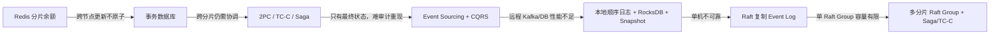
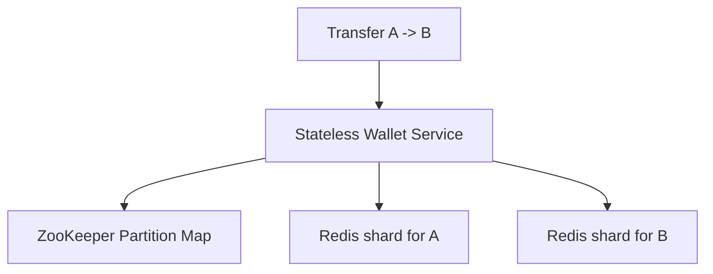
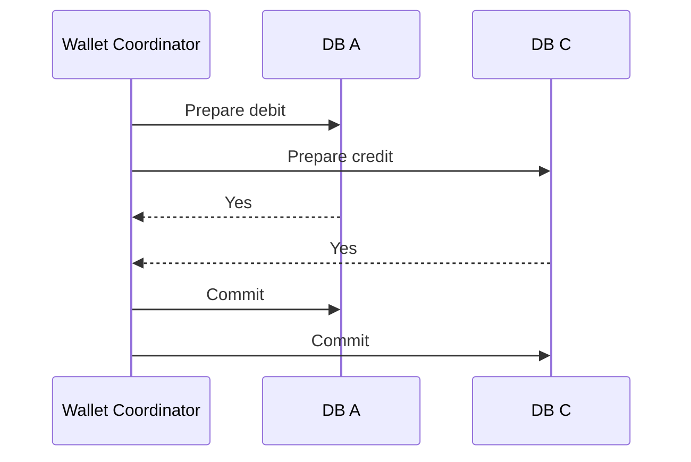
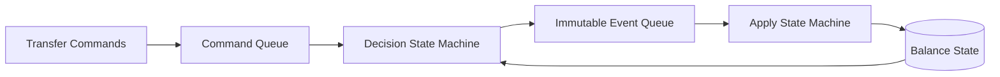
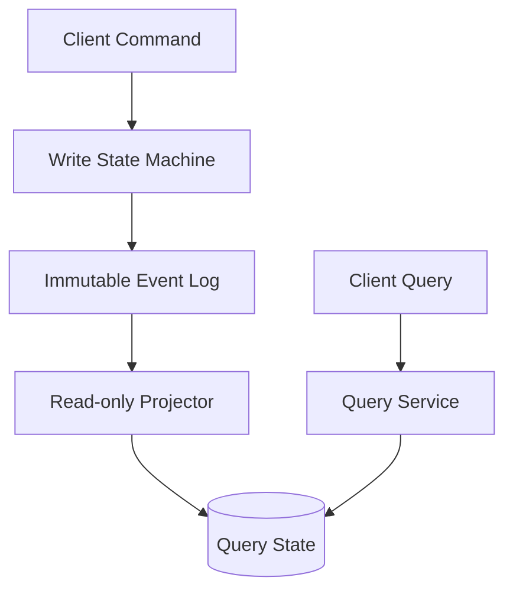
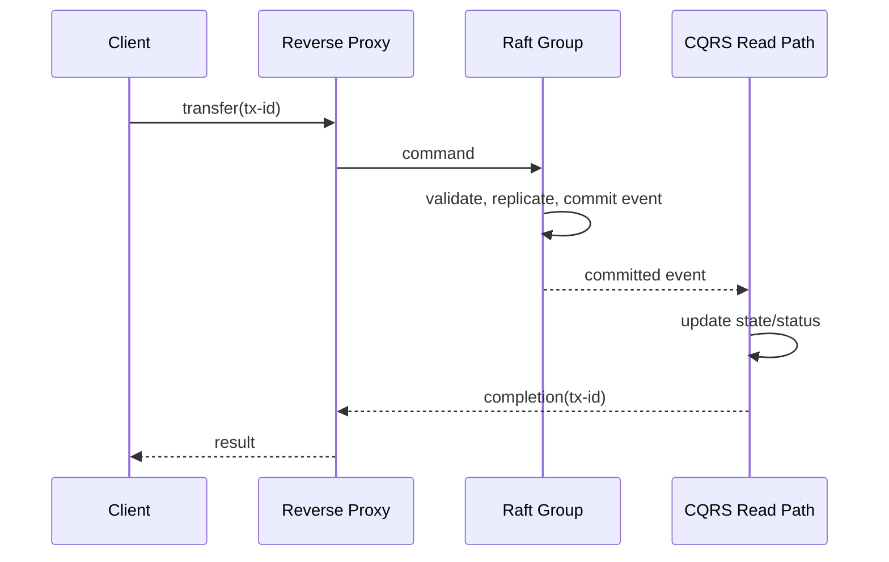
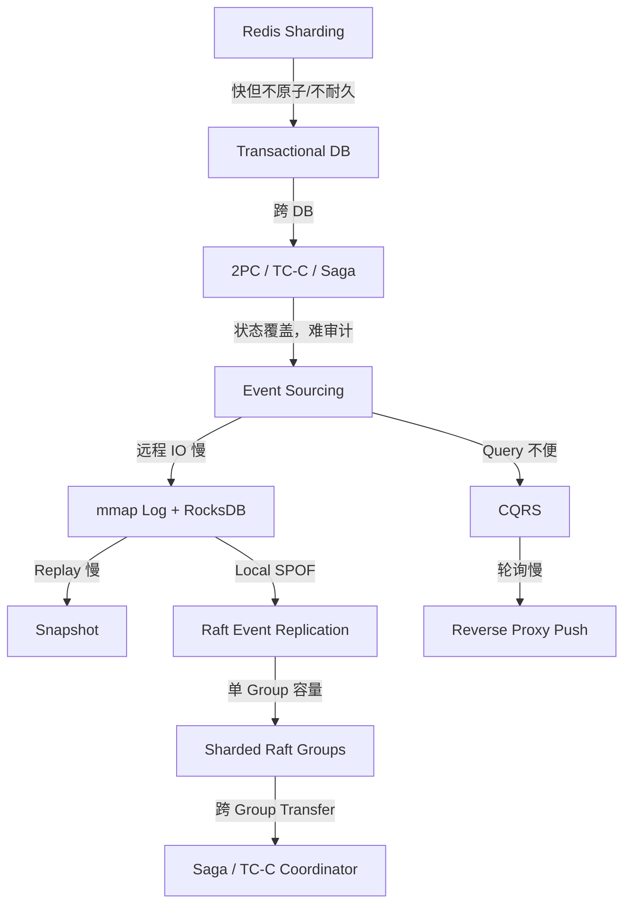
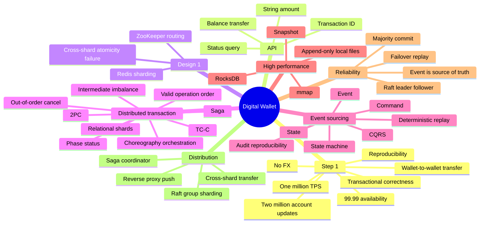

> 原书：Alex Xu、Sahn Lam，*System Design Interview: An Insider's Guide, Volume 2*（2022）
> 范围：Chapter 12: Digital Wallet（PDF 第 342～378 页）
> 目标：设计支持钱包间余额转账的后端，在 100 万 TPS 下保证事务正确、99.99% 可用，并能通过不可变事件重放任意历史余额。

## 0. 本章解决的核心问题

数字钱包允许用户先存入资金，再消费或直接向同一平台的另一钱包转账。本章只设计：

> 从账户 $A$ 向账户 $C$ 转移金额 $x$。

最基本的不变量是：

$$
balance_A\geq x
$$

$$
balance_A'=balance_A-x,\qquad balance_C'=balance_C+x
$$

$$
balance_A'+balance_C'=balance_A+balance_C
$$

扣款和入账必须表现为一个业务原子操作：不能只扣不加、只加不扣，也不能因重试执行两次。

本章比普通转账设计多一个关键要求：**Reproducibility（可重现性）**。系统不只要给出当前余额，还要解释余额为什么变成这样，并能够从不可变历史重建任意时刻状态。

作者通过四次演进形成最终架构：



最终系统把几类问题分开处理：

- **原子性**：2PC、TC/C 或 Saga；
- **审计与重建**：Event Sourcing；
- **读写分离**：CQRS；
- **单分片可靠顺序**：Raft Replicated Event Log；
- **百万 TPS**：许多独立 Raft Group 水平分片；
- **跨分片转账**：Saga/TC-C Coordinator。

---

## 1. Step 1：理解问题并确定设计范围

## 1.1 功能范围

只支持同一支付平台内两个 Digital Wallet 之间的余额转移，不讨论：

- 银行卡充值与提现；
- 商户支付；
- 外汇；
- 信用额度；
- 利息、手续费和退款。

缩小范围后，问题仍包含高并发资金事务、分片、审计和重放。

## 1.2 吞吐目标

支持：

$$
1{,}000{,}000\text{ transfers/s}
$$

每笔 Transfer 至少包含一次 Debit 和一次 Credit，所以底层账户写操作速率可达到：

$$
2{,}000{,}000\text{ account updates/s}
$$

还未计 Command/Event Log、幂等记录、Phase Status、复制和 Read Model 更新。

## 1.3 Transactional Guarantee

转账要满足：

- Atomicity：扣款与入账全部成功或业务上补偿；
- Consistency：余额不能越过规则，资金守恒；
- Isolation：并发转账不能基于相互覆盖的旧余额；
- Durability：成功后不能丢失。

跨分片后，单库 ACID 不再自动覆盖整笔 Transfer。

## 1.4 Reproducibility

Reconciliation 只能发现“账不一致”，往往不能解释差异怎样产生。可重现系统要做到：

1. 重放历史得到任意时刻 Balance；
2. 由 Event List 重新验证当前余额；
3. Code Change 后用同一 Event History 对比新旧结果；
4. 追踪每一次余额变化的根因。

这直接引出 Event Sourcing。

## 1.5 Availability

目标 99.99%，理论年停机预算：

$$
(1-0.9999)\times365\times24\times60
\approx52.56\text{ minutes/year}
$$

资金正确性优先于在网络分区时接受不安全写入。某个 Shard 丧失多数派时应暂停该 Shard Transfer，而不是双主写。

## 1.6 粗略容量估算

原书假设一个事务数据库节点约 1,000 TPS。若按账户更新操作计：

$$
N=\frac{2{,}000{,}000}{1{,}000}=2{,}000\text{ nodes}
$$

若单节点能力分别为 100、1,000、10,000 TPS：

| 单节点 TPS | 节点理论下界 |
|---:|---:|
| 100 | 20,000 |
| 1,000 | 2,000 |
| 10,000 | 200 |

这是理想均分下界，未计：

- Raft Follower；
- 跨分片事务协调；
- 热账户；
- 故障余量；
- Snapshot/Compaction；
- Network/Storage Bandwidth。

通用表达：

$$
N_{leaders}\geq
\left\lceil\frac{transfer\_tps\times operations\_per\_transfer}
{effective\_tps\_per\_leader}\right\rceil
$$

---

## 2. Step 2：API 设计

本章只需一个核心 API：

```http
POST /v1/wallet/balance_transfer
```

请求：

```json
{
  "from_account": "wallet-A",
  "to_account": "wallet-C",
  "amount": "10.25",
  "currency": "USD",
  "transaction_id": "01589980-2664-11ec-9621-0242ac130002"
}
```

响应：

```json
{
  "status": "success",
  "transaction_id": "01589980-2664-11ec-9621-0242ac130002"
}
```

## 2.1 `transaction_id`

它是 Deduplication/Idempotency Key：

- 同 ID、同请求：返回原状态；
- 同 ID、不同请求内容：拒绝；
- 并发重复：只有一个执行 Owner；
- Event、Saga Phase、Ledger Entry 都可追踪该 ID。

不能每次网络 Retry 生成新 ID，否则会重复转账。

## 2.2 金额用 String

传输层不用 Binary Float，内部转换为 Decimal 或最小货币单位：

$$
minor=Decimal(amount)\times10^{scale(currency)}
$$

例如：

$$
\$10.25=1025\text{ cents}
$$

String 本身不能做算术；还要校验 Amount > 0、Currency 一致、Scale 和上限。

## 2.3 状态查询

原书只列 Transfer API，实际异步/跨分片系统还需要：

```http
GET /v1/wallet/transfers/{transaction_id}
```

返回 `PENDING/SUCCEEDED/FAILED/COMPENSATING` 等，Client Timeout 不能被解释为 Transfer Failed。

---

## 3. 第一版：In-memory Sharding

余额是天然 KV：

$$
account\_id\rightarrow balance
$$

使用多个 Redis Node，按 Hash 分片：

$$
partition=H(account\_id)\bmod n
$$

ZooKeeper 保存 Partition Count 和 Node Address，Stateless Wallet Service 定位账户。



## 3.1 优点

- Redis 内存读写快；
- Wallet Service 易水平扩展；
- Hash 可把普通账户均匀分散；
- 架构简单。

## 3.2 致命问题：跨节点不原子

流程：

1. Redis A 扣款成功；
2. Wallet Service 崩溃；
3. Redis B 尚未入账。

总资金减少，无法由两个独立 Redis Command 自动回滚。

Redis Cluster Transaction/Lua 也通常只原子覆盖同 Hash Slot。把两个 Account 强制同 Slot 会破坏均匀分片，且任意账户对不可能全部共置。

## 3.3 其他问题

- Redis Durability/Failover Window；
- `hash % n` 在 $n$ 变化时大量重映射；
- 语言默认 Hash 可能跨进程不稳定/负数；
- Hot Wallet；
- 没有完整审计历史。

结论：它性能好，但不满足资金正确性。

---

## 4. 第二版：Transactional Database Sharding

把每个 Redis Shard 替换为事务关系数据库。单账户本地更新可 ACID，但 A/C 位于不同 DB 时仍是两个 Local Transaction，Wallet Service 崩溃仍可能部分成功。

因此需要 Distributed Transaction：

- 2PC；
- Try-Confirm/Cancel；
- Saga。

---

## 5. Two-phase Commit（2PC）

2PC 由 Coordinator 和多个 Participant 组成。

## 5.1 Phase 1：Prepare

1. Coordinator 在 A、C 执行读写；
2. Participant 锁定资源并写 Prepare Record；
3. Coordinator 询问能否 Commit；
4. 各 Participant 回 Yes/No。

## 5.2 Phase 2：Commit/Abort

- 全部 Yes：Coordinator 通知 Commit；
- 任一 No：通知 Abort；
- Participant 完成后释放锁。



## 5.3 为什么能原子

Participant 在 Prepare 后不能自行改变决定；Coordinator 的最终 Decision 让各节点一致 Commit 或 Abort。Coordinator Decision 必须持久化并可恢复。

## 5.4 问题

- Prepared Transaction 长时间持锁；
- Coordinator 故障时 Participant 可能阻塞；
- 跨网络延迟进入 Critical Path；
- XA/异构 DB 支持复杂；
- 高 TPS 下 Lock/Coordinator 成瓶颈。

“Coordinator 是单点故障”可通过复制 Coordinator Log 缓解，但 Blocking 特性仍存在。

2PC 是 Database-level Low-level Solution：参与数据库必须支持 Prepare/Commit Protocol。

---

## 6. Try-Confirm/Cancel（TC/C）

TC/C 是 Application-level Compensating Transaction。各 Phase 是独立 Local Transaction，不像 2PC 从第一阶段一直持锁。

## 6.1 原书的 A -> C 示例

| 阶段 | A | C |
|---|---|---|
| Try | -$1 | NOP |
| Confirm | NOP | +$1 |
| Cancel | +$1 | NOP |

### Try

A 扣 $1 并 Commit；C 检查接收资格/NOP。Try 结束后锁已释放。

### Confirm

两侧 Try 都成功，给 C 加 $1。

### Cancel

若 Try 失败，补偿 A：+$1；C NOP。

## 6.2 与标准 TCC 的关系

经典 TCC 常把 Try 设计为“预留资源”：

- A 冻结/保留 $1；
- C 验证可接收；
- Confirm 将冻结款正式扣除并入账；
- Cancel 解冻。

原书为简化直接在 Try 扣 A，因而出现中间总余额下降。实际 Wallet 更推荐 `available_balance` 与 `reserved_balance`，让资金进入明确的 In-transit/Clearing Account，而非看似消失。

## 6.3 Phase Status Table

Coordinator 可能在任意 Phase 崩溃，必须持久化：

- Transaction ID/内容；
- 每 Participant Try 状态：未发送/已发送/已响应；
- 第二阶段 Decision：Confirm/Cancel；
- 第二阶段各 Participant 状态；
- Out-of-order Flag；
- Retry Count/Version。

通常放在 Debit Account 所在 DB，使创建 Transfer 与 Coordinator State 同 Local Transaction。

## 6.4 幂等要求

网络 Retry 会重复发送：

```text
Try(tx), Confirm(tx), Cancel(tx)
```

每个 Participant 以 `(transaction_id, phase)` Unique：

- 重复 Try 不重复扣；
- 重复 Confirm 不重复加；
- 重复 Cancel 不重复补偿。

没有 Phase Idempotency，TC/C 比原问题更危险。

## 6.5 中间不平衡状态

原书示例：

```text
Before: A + C = $1
After Try: A + C = $0
After Confirm: A + C = $1
```

这不是最终资金丢失，而是 Application 可观察到 Partial State。更准确的账本应包含 Clearing/In-transit：

$$
A+C+clearing=constant
$$

CQRS Read Model 可只发布 Final Transfer，避免用户误读中间状态。

## 6.6 Valid Operation Order

原书比较：

1. 先从 A 扣，C NOP；
2. A NOP，先给 C 加；
3. 同时 A 扣/C 加。

选择 1。原因：先 Credit C 后若 Debit A 失败，C 可能把钱花掉，补偿时无法扣回。先锁定/扣除 Source 资金更安全。

通用原则：

> 先确保不可凭空创造资金，再发布可花费的 Credit。

## 6.7 Out-of-order Execution

可能发生：Cancel 先到，迟到的 Try 后到。Participant 应：

1. 收到未知 Transaction 的 Cancel 时写 Tombstone/Out-of-order Flag；
2. 后续 Try 看到 Flag，拒绝执行；
3. 重复 Cancel 幂等成功。

这与消息系统的 Tombstone 思想相同：必须记住已结束 Decision，不能因没见过 Try 就忽略 Cancel。

## 6.8 TC/C 优缺点

优点：

- Database-agnostic；
- 不长时间持 DB Lock；
- 某些 Try 可并行；
- 高层业务可控制补偿。

缺点：

- Application State Machine 复杂；
- 中间状态可见；
- Compensation 可能失败；
- Out-of-order、Duplicate、Recovery 均需自行处理；
- “Undo”不是时光倒流，外部副作用可能不可逆。

---

## 7. Saga

Saga 将一个 Distributed Transaction 拆成按顺序执行的 Local Transactions：

```text
T1 -> T2 -> ... -> Tn
```

失败时逆序执行 Compensation：

```text
Cn -> ... -> C2 -> C1
```

若有 $n$ 个正常 Operation，通常要准备最多 $n$ 个 Compensation，共 $2n$ 类操作。

## 7.1 钱包示例

正常：

```text
A - $1 -> C + $1
```

若 C Credit 失败：

```text
A + $1
```

仍必须先 Debit Source，再 Credit Destination。

## 7.2 Choreography

服务订阅彼此 Event，去中心协调。

优点：松耦合、无中央 Orchestrator。
缺点：流程分散在多个 State Machine，服务多时难理解、调试和变更。

## 7.3 Orchestration

中央 Saga Coordinator 明确发送每一步 Command，保存 Phase Status。

优点：流程和 Recovery 集中、适合资金 Transaction。
缺点：Coordinator 复杂且关键，需要高可用、持久状态和幂等。

作者倾向 Digital Wallet 使用 Orchestration。

## 7.4 TC/C 与 Saga 对比

| 维度 | TC/C | Saga |
|---|---|---|
| Compensation | Cancel Phase | Rollback Phase |
| 中央协调 | 是 | Orchestration 模式是 |
| Operation 顺序 | 可并行/任意 | 通常线性 |
| 中间不一致 | 可见 | 可见 |
| 实现层 | Application | Application |

原书建议：少步骤/低延迟要求时都可；服务多且延迟敏感，TC/C 可并行可能更好；微服务常用 Saga。

要注意：Saga 并非本质禁止所有并行，存在 DAG Saga；原书比较的是线性 Saga 教学模型。

## 7.5 2PC、TC/C、Saga 的本质区别

- 2PC：参与者保留未完成 Transaction/Lock，最终一次 Commit/Abort；
- TC/C：Try 已 Commit Local State，Confirm/Cancel 是新 Transaction；
- Saga：一串已 Commit Local Transaction，失败后执行 Compensation。

后两者提供的是业务层最终原子效果，不提供全程 Isolation；其他请求可能看到中间状态。

---

## 8. Event Sourcing：为什么仅有分布式事务还不够

2PC/TC-C/Saga 能让 Transfer 正确完成，却通常只保存最新 Balance。若 Application Bug 传错 Amount，数据库会“正确地执行错误命令”，难以回答：

1. 某时刻 Balance 是多少？
2. 当前/历史 Balance 为什么正确？
3. Code Change 后新逻辑是否改变历史结果？

Event Sourcing 把不可变 Event History 设为 Source of Truth，State 只是 Event Fold 的结果。

---

## 9. Command、Event、State、State Machine

## 9.1 Command

外部世界的意图，例如：

```text
Transfer $1 from A to C
```

Command 可能无效（余额不足、账户冻结、重复 ID），所以不是事实。Command 要有全局/分区内顺序，通常进入 FIFO Queue。

## 9.2 Event

验证后已经发生的事实，使用过去式：

```text
MoneyTransferred(A, C, $1, transaction_id)
```

或原书拆为：

```text
AccountDebited(A, $1)
AccountCredited(C, $1)
```

一个 Command 可产生 0 到多个 Event。余额不足时产生 Rejected Event 或不产生资金 Event。

## 9.3 Event 必须包含决定结果

Command Validation 可能读取外部数据或涉及随机决策，但一旦 Event 生成，重放不能重新调用外部 I/O/随机数。Event 必须把已决定结果固化。

例如手续费由外部规则决定，应写：

```text
TransferAccepted(amount=100, fee=2, rule_version=v7)
```

重放时不能重新查询“今天的手续费规则”。

## 9.4 State

账户余额是 State：

```text
account_id -> balance
```

它可以在 Memory、RocksDB 或 RDB 中，是 Event Log 的 Materialized View。

## 9.5 State Machine 的两个函数

1. `decide(state, command) -> events`：验证 Command、产生 Event；
2. `evolve(state, event) -> new_state`：应用 Event。

重放所依赖的 `evolve` 必须 Deterministic：

$$
evolve(s,e)=s'\quad\text{每次都相同}
$$

原书说 State Machine 不得含随机/I/O，最严格地说这是对 Event Application/Replay Path 的要求；Command Decision 若需外部输入，应先把结果捕获进 Event。

## 9.6 Event 顺序

Command 与 Event 必须有确定顺序。同账户并发 Command 应进入同 Partition/Leader 顺序处理，避免两笔都基于同一旧 Balance。

跨账户 Transfer 的两个分录应作为一个 Atomic Event Batch 或单一 `TransferCommitted` Event 复制，不能只 Append Debit 后崩溃而永远缺 Credit。

---

## 10. Wallet Event Sourcing Flow

原书使用 Kafka Command Queue 和 Event Queue，RDB 保存 State。



流程：

1. 读 Command；
2. 读取账户 State；
3. 验证余额/账户/幂等；
4. 产生 Event；
5. 读 Event；
6. Deterministic Apply 更新 State。

## 10.1 Reproducibility

设初始状态为 $S_0$，有有序 Event：$e_1,\ldots,e_n$：

$$
S_n=fold(evolve,S_0,[e_1,\ldots,e_n])
$$

任意历史状态：

$$
S_k=fold(evolve,S_0,[e_1,\ldots,e_k])
$$

Event 不变且 `evolve` Deterministic，则每次重放结果相同。

## 10.2 Code Change 验证

用同一 Event Corpus 分别运行旧版和新版 Projector：

```text
old_state = replay(old_code, events)
new_state = replay(new_code, events)
diff(old_state, new_state)
```

但“结果相同”不自动证明新代码正确；Schema Evolution、Bug Fix 可能有意改变 Projection。应 Version Event/Projector 并由财务不变量和 Golden Data 验证。

## 10.3 Event Schema Evolution

不可变 Event 会活很久。必须：

- `event_type` + `schema_version`；
- Upcaster 把旧 Schema 转当前内存模型；
- 不原地 Rewrite 历史；
- Event Consumer 向前/向后兼容；
- 记录业务 Rule Version。

---

## 11. CQRS

CQRS（Command Query Responsibility Segregation）把 Write Model 与 Read Model 分开：

- Write Path：Command -> Validate -> Event；
- Read Path：消费 Event，构建 Balance/History Query View。



## 11.1 为什么引入

Event Log 适合顺序 Append，不适合每次查询都全量 Replay。Read Model 预计算：

- 当前 Balance；
- Transaction History；
- 某日 Snapshot；
- 审计/对账 View。

## 11.2 Eventual Consistency

Read Projector 落后 Event Log：

$$
read\_model\_offset\leq committed\_event\_offset
$$

Client 刚转账后读 Balance 可能暂时旧。可用：

- 返回 Command Result 中的新 Balance；
- Read-your-writes Token/Offset；
- 等待 Read Model 至少消费到目标 Offset；
- Reverse Proxy Push Completion。

## 11.3 Rebuild

Read Model 损坏或 Schema 改变时，从 Event Log 重建。Projection 必须 Idempotent，保存 Last Applied Offset，避免重复 Event 再加钱。

---

## 12. 可运行示例：Event Sourcing、幂等与重放

下面用单个 `TransferCommitted` Event 原子表达一笔 Transfer，避免把 Debit/Credit 分成可永久部分提交的两条事实。

```python
from dataclasses import dataclass

@dataclass(frozen=True)
class TransferCommand:
    transaction_id: str
    source: str
    destination: str
    amount_minor: int

@dataclass(frozen=True)
class TransferCommitted:
    transaction_id: str
    source: str
    destination: str
    amount_minor: int

def decide(balances, processed_ids, command):
    if command.transaction_id in processed_ids:
        return []
    if command.amount_minor <= 0:
        raise ValueError("amount must be positive")
    if command.source == command.destination:
        raise ValueError("accounts must differ")
    if balances.get(command.source, 0) < command.amount_minor:
        raise ValueError("insufficient funds")
    return [
        TransferCommitted(
            command.transaction_id,
            command.source,
            command.destination,
            command.amount_minor,
        )
    ]

def evolve(balances, processed_ids, event):
    if event.transaction_id in processed_ids:
        return
    balances[event.source] -= event.amount_minor
    balances[event.destination] = balances.get(event.destination, 0) + event.amount_minor
    processed_ids.add(event.transaction_id)

def replay(initial_balances, events):
    balances = dict(initial_balances)
    processed_ids = set()
    for event in events:
        evolve(balances, processed_ids, event)
    return balances

if __name__ == "__main__":
    initial = {"A": 500, "B": 400, "C": 300}
    state = dict(initial)
    processed = set()
    event_log = []

    command = TransferCommand("tx-1", "A", "C", 100)
    events = decide(state, processed, command)
    event_log.extend(events)
    for event in events:
        evolve(state, processed, event)

    assert state == {"A": 400, "B": 400, "C": 400}
    assert sum(state.values()) == sum(initial.values())
    assert decide(state, processed, command) == []
    assert replay(initial, event_log) == state
```

对应关系：

- Command 是意图，可拒绝；
- Event 是已验证事实；
- `evolve` 不读时钟、网络和随机数；
- Transaction ID 提供幂等；
- 重放恢复 Balance；
- 总余额不变量可自动检查。

真实系统还要把 Event Append 与 Transaction ID Dedup 原子 Commit，并按 Currency 分账。

---

## 13. Step 3：High-performance Event Sourcing

初版使用远程 Kafka + RDB，每个 Command/Event/State 都跨网络，延迟和吞吐受限。作者把数据移到 Local Disk，利用顺序 I/O 和 OS Cache。

## 13.1 File-based Command/Event List

- Command/Event Append-only；
- 顺序磁盘 I/O；
- 最近尾部留 Page Cache；
- 处理后无需再次远程读取。

现代磁盘顺序访问吞吐很高；瓶颈不等同于“磁盘一定慢”。

## 13.2 mmap

`mmap` 将 File 映射成 Virtual Memory：

- Application 像访问 Array 一样访问；
- OS 负责 Page Cache/Flush；
- 最近 Append Page 通常在内存；
- 减少显式 Copy/System Call。

但 `mmap write` 返回不等于 Durable Commit。金融 Event 在 ACK 前仍需明确 `fsync/msync` 或 Raft Quorum Persistence Policy，处理 Partial Page/Crash Recovery 和 Checksum。

## 13.3 File-based State

把远程 RDB State 改为 Local SQLite/RocksDB。作者选择 RocksDB：

- LSM 适合高写；
- WAL + MemTable + SSTable；
- Recent State Cache 提高读；
- Local Call 避免网络。

State 是 Derived View，损坏可从 Event Log 重建。

## 13.4 Snapshot

从 Genesis Replay 越来越慢，定期保存 Immutable State Snapshot：

```text
snapshot = (last_event_offset, state_image, checksum, schema_version)
```

恢复：

1. 加载最新有效 Snapshot；
2. 校验 Checksum/Version；
3. 从 `last_event_offset + 1` 重放；
4. 得到当前 State。

财务团队常要求每日 00:00 Snapshot。大 Snapshot 可存 HDFS/Object Store。

## 13.5 Snapshot 正确性

Snapshot 必须对应 Event Log 的一致 Prefix。不能一边 State 更新一边无版本复制，得到混合时刻。可用：

- Stop-the-world；
- RocksDB Consistent Checkpoint；
- MVCC Snapshot；
- Event Offset Barrier。

Snapshot 是性能优化，不是新的 Source of Truth。

---

## 14. Reliable High-performance Event Sourcing

Local File 性能高，但 Node 成为 Stateful Single Point of Failure。作者先分析四类数据：

1. Command File；
2. Event File；
3. State；
4. Snapshot。

## 14.1 哪类数据必须最高可靠

State/Snapshot 可由 Event 重建。Command 看似可生成 Event，但 Command Decision 可能依赖外部 I/O/随机结果，重新执行未必生成同 Event。

因此真正不可替代的是：

> **Committed Event Log。**

不过生产系统仍应保留 Command/Request Record 供幂等、审计和拒绝原因；“只有 Event 需高可靠”是从状态可重建角度的最小结论，不表示 Command 可随意丢失。

## 14.2 Raft 复制 Event Log

要求：

1. Committed Event 不丢；
2. 所有 Node 的 Log Relative Order 一致。

Raft 角色：Leader、Candidate、Follower。Leader 接收 Command，生成/Append Event，复制到 Follower；达到 Majority 后 Commit。

多数派：

$$
quorum=\left\lfloor\frac{n}{2}\right\rfloor+1
$$

5 Node 需要 3，可容忍 2 故障；3 Node 需要 2，可容忍 1。

## 14.3 为什么相同 Event Log 导出相同 State

若：

- Event Sequence 完全相同；
- `evolve` Deterministic；
- 初始 State/Code Version 兼容；

则每个 Replica 的 State 相同：

$$
State_i=fold(events)=State_j
$$

Follower 也 Apply Committed Events，维护 Hot Standby Read Model。

## 14.4 Leader Failure

1. Client 请求旧 Leader Timeout；
2. Raft 选新 Leader；
3. 只 Committed Event 被保证保留；
4. Client 用同 `transaction_id` Retry；
5. 新 Leader 查 Dedup/Log，返回旧结果或执行一次。

如果旧 Leader 在 Event 达多数派前崩溃，Event 可能未 Commit；Client Retry 是必要的。Exactly-once Effect 仍依赖幂等 ID。

## 14.5 Follower Failure

Leader 只要仍有 Majority 可继续；Follower 恢复后 Catch Up。长时间落后需 Install Snapshot，避免从最早 Log 逐条追。

## 14.6 Raft 不自动解决的事

- 跨 Raft Group Transaction；
- Hot Account；
- Event Schema Evolution；
- Business Rule Correctness；
- 外部 PSP/Bank Side Effect；
- Exactly-once Client Retry。

Raft 解决单 Group 内 Log Consensus，不是通用分布式事务。

---

## 15. Distributed Event Sourcing

单 Raft Group 容量有限，需要按 Account Key 划分多个 Group：

$$
partition=H(account\_id)\rightarrow RaftGroup
$$

同账户所有 Command 必须到同 Group Leader，保持顺序。

## 15.1 Pull 的问题

CQRS Read Model 可能滞后，Client 周期 Poll Status：

- 非实时；
- 高 QPS Poll；
- Client 不知道何时完成。

## 15.2 Reverse Proxy + Push

Client 把 Command 交 Reverse Proxy，Proxy 路由到 Group Leader并等待/注册 Correlation ID。Read Projector Apply Event 后，把执行状态推回 Proxy，Proxy 回 Client。



Proxy Timeout 后 Client 仍可按 Transaction ID Query；Push 不能成为唯一可靠状态渠道。

## 15.3 跨分片 Transaction

A 在 Group 1、C 在 Group 2，单 Raft Log 无法原子覆盖两组。复用 TC/C 或 Saga Coordinator，Phase Status 持久化。

本章最终用 Orchestrated Saga Happy Path：

1. Coordinator 接收 `A -> C`；
2. 写 Phase Status；
3. 向 Group 1 发送 `A - x` Command；
4. Group 1 Leader 验证、生成 Event、Raft Commit；
5. CQRS Read Path Apply 并 Push Success；
6. Coordinator 记录 Step 1 Success；
7. 向 Group 2 发送 `C + x`；
8. Group 2 Raft Commit/Apply；
9. Coordinator 记录 Step 2 Success；
10. Transfer Completed。

失败时逆序 Compensation：若 Debit 已完成、Credit 失败，则向 Group 1 发送唯一 Compensation Command。

## 15.4 Coordinator 幂等与恢复

Phase Status：

```text
transaction_id
source_group, destination_group
debit_status, credit_status
compensation_status
overall_status
version
```

每一步 Command ID 可用：

```text
tx-123:debit
tx-123:credit
tx-123:refund-debit
```

Coordinator 重启后扫描非终态并继续，不从头盲目重做。

## 15.5 Hot Account

按 Account Shard 后，热门 Merchant/System Account 可能单 Group Hotspot。资金账户不能随意拆余额而不改语义。可用：

- 按业务建立多个 Clearing Sub-account；
- Aggregate/Batch Transfer；
- Separate Inbound/Outbound Ledger；
- Escrow/Token Allocation；
- 业务层限流。

任何拆分都要保持可合并账本和全局限额。

## 15.6 跨分片比例

随机 Hash 下，多数任意 A/C Transfer 会跨 Shard。仅提高 Group 数会增加跨组协调比例。可根据 Social/Geographic Locality 分区，但会负载不均和迁移复杂。架构必须把跨分片 Transaction 当常态，不是 Rare Edge Case。

---

## 16. Step 4：全章收束

作者的演进逻辑：



最终系统并非某一个 Algorithm，而是不同层次的组合：

- Event Log：不可变事实；
- Raft：单分片事实顺序与耐久；
- Projector/RocksDB：可重建余额；
- Snapshot：缩短恢复；
- CQRS：高效查询；
- Saga/TC-C：跨分片业务 Transaction；
- Idempotency：安全 Retry；
- Audit/Reconciliation：验证正确性。

---

## 17. 容易混淆的概念与常见误区

### 17.1 钱包转账不只是两个 Counter Update

跨 Shard 后两个 Update 不是同一原子操作，还需要协调、幂等、恢复和审计。

### 17.2 100 万 TPS 是 Transfer TPS，不只是单行写 TPS

每 Transfer 至少两账户 Operation，还要乘复制/日志/Projection 成本。

### 17.3 Redis 单命令原子不等于跨 Redis 原子

Lua/MULTI 也通常不能覆盖不同 Cluster Slot。

### 17.4 ZooKeeper 保存 Partition Map，不保存资金 Transaction

它解决路由配置，不提供跨 Shard Balance Atomicity。

### 17.5 关系数据库替换 Redis不自动解决跨分片

每个 DB 只保证 Local ACID；跨 DB 仍需 2PC/TC-C/Saga。

### 17.6 2PC 与 TC/C 的“两个阶段”不是同一语义

2PC 第一阶段保留未完成事务/锁；TC/C Try 已 Commit Local Transaction。

### 17.7 Compensation 不是真正 Rollback

它是新的业务 Operation，可能失败，也可能无法消除外部已观察副作用。

### 17.8 原书 TC/C 示例的资金“消失”是中间状态

最终 Confirm/Cancel 恢复；生产账本宜用 Reserved/Clearing 显式表示 In-transit Money。

### 17.9 先 Credit 再 Debit 很危险

Credit 可被花掉，后续 Compensation 可能无款可扣。先锁定 Source Funding。

### 17.10 Cancel 可能先于 Try 到达

需要 Tombstone/Out-of-order Flag，让迟到 Try 永久失败。

### 17.11 Saga 不提供全程 Isolation

其他请求可能看到中间 Local Commit；Read Model/Business Rule 要理解 Pending State。

### 17.12 Saga 不一定只能串行

原书采用 Linear Saga；一般 Saga 可 DAG 并行，但 Compensation 依赖更复杂。

### 17.13 Command 不是事实

它可能因余额不足被拒；只有已验证 Event 进入事实历史。

### 17.14 Event 不应在重放时重新做外部 I/O

外部查询/随机结果必须固化进 Event，否则重放不确定。

### 17.15 Event Sourcing 不等于“把所有日志都存下来”

Event 是领域事实、版本化、可按确定状态机重放，不是 Debug Text Log。

### 17.16 两条 Account Event 需要 Transaction Boundary

Debit/Credit 若分别 Append 且中间崩溃，会留下永久半笔交易。可用单 Transfer Event 或 Atomic Event Batch。

### 17.17 State 是 Event 的 View，不是唯一事实

RocksDB Balance 丢失可重建；Event Log 丢失则历史无法恢复。

### 17.18 Snapshot 不是 Source of Truth

它是 Event Prefix 的缓存。Checksum/Offset 不匹配时应丢弃并从更早点重放。

### 17.19 Reproducibility 不等于业务逻辑天然正确

它让错误可重放/定位；错误 Command 或 Bug 仍会稳定地产生错误结果，需要不变量、审计和修正 Event。

### 17.20 Code Change 后结果相同不等于完全证明正确

有意 Bug Fix 可能应改变结果；需 Event Version、Golden Test 和财务不变量。

### 17.21 CQRS 不等于 Event Sourcing

两者常组合，但 CQRS 只是分离读写模型；也可不使用 Event Source。

### 17.22 CQRS Read Lag 不等于资金未提交

Write Model/Raft Event 已 Commit，Read Projection 只是尚未追上。API 要暴露 Offset/Status。

### 17.23 mmap 不等于 Durable

Page 在 Memory 不代表已稳定落盘；成功 ACK 条件要包含 Fsync/Quorum Policy。

### 17.24 Sequential Disk 快不等于 Local Disk 可靠

性能与耐久是两个维度，后者靠 Raft Replication/Backup。

### 17.25 只复制 Command 不足以保证重现 Event

Command Decision 可能依赖外部 I/O；Committed Event 才是最终事实。

### 17.26 Raft 只保证单 Group 共识

它不原子协调两个账户所在 Group，跨 Group 仍需 Saga/TC-C。

### 17.27 Majority 在线不等于所有 Read 都最新

Follower Read 可能滞后；强一致查询应走 Leader/ReadIndex/Lease 等正确路径。

### 17.28 Leader Failover 仍可能让 Client 重试

Retry 必须复用 Transaction ID，不能因 Raft 存在就忽略 API 幂等。

### 17.29 Push Completion 不能成为唯一状态记录

Proxy/Client 可能断线，终态仍要可按 Transaction ID Query。

### 17.30 Hash Sharding 会产生 Hot Account 与跨分片常态

均匀账户数不等于均匀交易量，也不减少任意账户对跨 Group 的概率。

---

## 18. 本章知识结构



## 19. 核心结论

1. **钱包转账的第一不变量是资金守恒。** Debit/Credit 必须形成一次业务原子效果。
2. **百万 Transfer/s 意味着至少两百万账户更新/s。** 节点估算还要加复制、日志和故障余量。
3. **Redis 分片性能好，但跨节点不能天然原子。** Routing Metadata 解决不了 Transaction。
4. **2PC、TC/C、Saga 处于不同抽象层。** 2PC 持 Prepared Lock；后两者 Commit Local State 后补偿。
5. **TC/C/Saga 的每个 Phase 都必须幂等、可恢复、可处理乱序。**
6. **先锁定/扣 Source，再 Credit Destination。** 防止凭空产生可花费资金。
7. **Phase Status Table 让 Coordinator 崩溃后继续，而非猜测。**
8. **Event Sourcing 用不可变事实取代仅保存当前余额。** 任意历史 State 可由 Event Prefix 重建。
9. **Command 是意图，Event 是事实，State 是 Projection。** Replay 只应用 Deterministic Event。
10. **CQRS 为 Event Log 构建可查询余额视图。** Read Lag 需要 Token/Push/Read-your-writes 语义。
11. **本地 Append Log + mmap + RocksDB 提升单节点性能。** Snapshot 缩短 Replay，但不替代 Event。
12. **Event Log 是最关键可靠数据。** State/Snapshot 可重建；Command 不能替代已决定 Event。
13. **Raft 保证单分片 Event Order 和耐久。** Majority Commit 后所有确定性 Replica 最终导出同 State。
14. **单 Raft Group 无法支持百万 TPS。** 水平分成许多 Group，跨 Group 用 Saga/TC-C。
15. **Raft、Event Sourcing 和 Saga 解决不同问题。** 共识、审计重建、跨分片事务不能互相替代。

## 20. 解决高吞吐资金转移问题的一般思路

### 第一步：写出资金不变量和一致性边界

余额非负、同 Currency 总额守恒、Transaction ID 唯一、Debit/Credit 状态关系明确。

### 第二步：先做单分片正确模型

让一个账户的全部 Command 串行进入同 Leader；Local Transaction/State Machine 防并发透支。

### 第三步：选择跨分片协议

- DB 原生强原子、能承受锁：2PC；
- Resource Reservation/可并行：TC/C；
- 微服务线性业务流程：Orchestrated Saga。

逐 Phase 设计幂等、补偿、乱序 Tombstone 和 Coordinator Recovery。

### 第四步：把不可变 Event 作为事实

Event 固化所有外部/随机决定，版本化 Schema；State/Balance 由 Deterministic Fold 得出。

### 第五步：用 CQRS 服务查询

Read Model 保存 Current Balance/History；暴露 Event Offset，让 Client 区分“已提交”和“Projection 尚未追上”。

### 第六步：优化单节点顺序路径

Append-only File、Batch、mmap/Page Cache、本地 RocksDB；明确 Fsync 和 Checksum，不混淆快与耐久。

### 第七步：用 Snapshot 控制恢复时间

Snapshot 绑定 Event Offset/Schema/Checksum，加载后只 Replay Tail，并定期验证可从 Event 重建。

### 第八步：用 Raft 复制事实日志

按 Failure Domain 部署 3/5 Node Group；只在 Majority Commit 后确认；Leader Failure 后按相同 Transaction ID Retry。

### 第九步：分片并接受跨组事务为常态

Account -> Raft Group；Coordinator 持久化 Saga Phase；处理 Hot Account、Rebalance 和 Group Migration。

### 第十步：验证所有失败窗口

- Debit Commit 后 Coordinator 崩溃；
- Cancel 先于 Try；
- Compensation 重复/失败；
- Event 达 Leader 未达 Majority；
- Client 未收到已 Commit 响应；
- Snapshot 与 Event Offset 不一致；
- Read Model 落后；
- Group Migration 中收到 Command；
- Code/Event Schema 升级后 Replay；
- Reconciliation 发现总额不守恒。

整章可压缩为：

$$
\boxed{
\text{幂等 Transfer Command}
\rightarrow
\text{分片内顺序验证}
\rightarrow
\text{不可变 Transfer Event}
\rightarrow
\text{Raft 多数派复制}
\rightarrow
\text{确定性 State/CQRS Projection}
\rightarrow
\text{Snapshot 加速恢复}
\rightarrow
\text{Saga/TC-C 协调跨分片}
}
$$

本章最值得迁移的方法是：**把“当前余额”降级为可重建视图，把“有序不可变事件”提升为系统事实；单分片用共识保证事实顺序，跨分片用可恢复补偿协议协调，再以 Transaction ID 和确定性状态机让所有重试、故障和重放都得到同一业务结果。**
