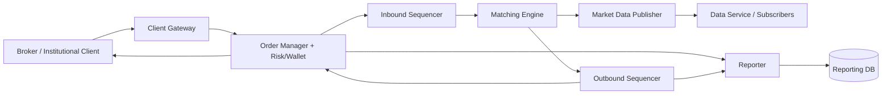
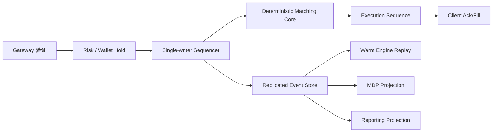
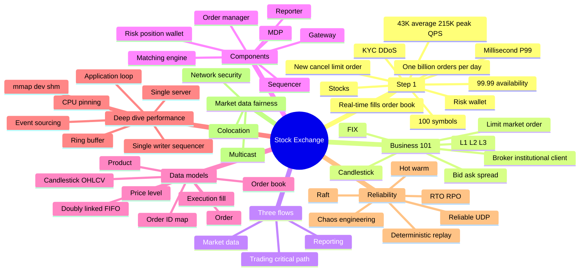

> 原书：Alex Xu、Sahn Lam，*System Design Interview: An Insider's Guide, Volume 2*（2022）
> 范围：Chapter 13: Stock Exchange（PDF 第 380～415 页）
> 目标：设计支持股票限价单提交/撤销、价格时间优先撮合、实时成交回报、L1/L2/L3 市场数据和监管报告的中等规模交易所，并重点保证毫秒乃至微秒级稳定延迟、确定性、公平性和近零数据丢失。

## 0. 交易所设计的第一原则：先区分三条路径

交易所不是“把买单和卖单放进数据库做 JOIN”。它有三条时延和正确性要求不同的路径：

1. **Trading/Critical Path**：订单进入、风控、资金检查、排序、撮合、成交回报；必须极低且稳定延迟。
2. **Market Data Flow**：由订单/成交事件重建 Order Book、L1/L2/L3 与 Candlestick，再公平分发。
3. **Reporting Flow**：合并订单与成交属性，服务清算、税务、监管和审计；可以稍慢，但准确完整。



最关键的设计思想是：

> **只有必须决定成交结果的工作进入 Critical Path；市场数据、报告和持久分析都从确定的事件流异步派生。**

核心正确性来自确定性：

$$
same\ ordered\ inputs+same\ deterministic\ state\ machine
\Rightarrow same\ executions
$$

Sequencer 给输入建立唯一顺序，Matching Engine 单线程按规则推进 Order Book；Event Store 让 Warm Replica 和故障恢复重放同一顺序。

---

## 1. Step 1：理解问题并确定设计范围

## 1.1 交易品种

只交易股票，不考虑期权、期货、债券和衍生品。不同产品有不同 Tick Size、Lot Size、保证金与到期规则，不能不澄清就共用模型。

## 1.2 Order Operation 与类型

支持：

- New Order；
- Cancel Order；
- Limit Order。

不重点支持 Replace、Market、Conditional Order 和盘后交易。

Limit Order 指定最高买价或最低卖价，可能立即、部分或从不成交。虽然原书 Order Book 示例用一笔大 Market Buy 解释跨价位吃单，核心实现范围仍是 Limit Order；Market Order 可视为没有价格保护、跨所有可用对手价的特殊订单。

## 1.3 基本能力与规模

- Client 提交/取消 Limit Order；
- 实时收到 Fill；
- 查看实时 Order Book；
- 至少数万并发用户；
- 至少 100 Symbols；
- 每天 10 亿 Orders；
- 受监管，必须做 Risk Check。

## 1.4 Risk 与 Wallet

示例风控：某用户每天最多交易 100 万股 Apple。还要验证：

- 用户/账户状态；
- Symbol 是否可交易；
- Price/Quantity 是否符合 Tick/Lot；
- Daily Volume/Notional Limit；
- 买单资金、卖单持仓；
- 重复 Client Order ID；
- 自成交/异常交易策略。

新 Buy Order 进入 Book 前，应冻结可能使用的 Cash；Sell Order 冻结 Shares，防止多个 Open Order 重复花同一资产。Cancel/Unfilled Remainder 释放冻结。

## 1.5 非功能需求

### Availability

至少 99.99%。理论日停机预算：

$$
(1-0.9999)\times24\times3600=8.64\text{ seconds/day}
$$

### Fault Tolerance

需要秒级 Recovery、确定性 Replay、Warm Standby 和灾难场景降级。

### Latency

Round-trip 到 Fill 为毫秒级，重点看 P99/P99.99，而非平均值。少数客户持续长尾也违反公平和质量目标。

端到端：

$$
L_{e2e}=\sum_{i\in critical\ path}(L_{queue,i}+L_{compute,i}+L_{network,i}+L_{storage,i})
$$

### Security

- KYC；
- Account Security；
- Public Market Data 防 DDoS；
- Private Trading Gateway 认证、限流、隔离；
- 完整 Audit Trail。

## 1.6 粗略估算

NYSE Normal Hours 为 6.5 小时：

$$
T=6.5\times3600=23{,}400\text{ seconds}
$$

每天 10 亿 Orders：

$$
QPS_{avg}=\frac{10^9}{23{,}400}\approx42{,}735\approx43{,}000
$$

Peak 取 5 倍：

$$
QPS_{peak}\approx215{,}000
$$

开盘、收盘流量集中，不能按全天均匀设计。每个 Order 还可能生成多个 Fill、Market Data Event 和 Report Record，所以内部 Event Rate 高于入口 QPS。

若平均每 Order 产生 $f$ 个 Execution Event：

$$
Q_{events}\approx Q_{orders}\times(1+f+report/market\ derivatives)
$$

---

## 2. Step 2：Business Knowledge 101

## 2.1 Broker 与 Institutional Client

Retail Client 通常通过 Charles Schwab、Robinhood、E*Trade、Fidelity 等 Broker 访问 Exchange。Broker 提供 UI、Account、Suitability 和 Order Routing。

Institutional Client 使用专用 Trading Software：

- Pension Fund：低频大单，需要拆单降低 Market Impact；
- Hedge Fund/Market Maker：需要低延迟、Market Data Depth、Colocation；
- 不适合普通 Web/Mobile REST Path。

## 2.2 Limit Order 与 Market Order

### Limit Buy

愿意支付不高于 Limit Price：

$$
execution\ price\leq buy\ limit
$$

### Limit Sell

愿意接受不低于 Limit Price：

$$
execution\ price\geq sell\ limit
$$

### Market Order

优先保证尽快执行，不指定价格保护，可能产生 Slippage。原书范围不实现，但用它解释扫过多个 Ask Level。

## 2.3 Bid、Ask 与 Spread

- Best Bid：最高买价；
- Best Ask/Offer：最低卖价；
- Spread：

$$
spread=best\ ask-best\ bid
$$

正常未交叉 Book：

$$
best\ bid<best\ ask
$$

可成交 Buy 到来且 $buy\ price\geq best\ ask$ 时，先与 Best Ask 匹配。

## 2.4 L1、L2、L3 Market Data

| Level | 内容 |
|---|---|
| L1 | Best Bid/Ask 与对应聚合 Quantity |
| L2 | 多个 Price Level 的聚合 Quantity |
| L3 | 每个 Price Level 内各 Order Queue 的明细 |

L3 可重建价格时间优先 Queue，数据量最大、最昂贵。

## 2.5 Candlestick / OHLCV

一个时间窗口：

- Open：首笔成交价；
- High：最高成交价；
- Low：最低成交价；
- Close：末笔成交价；
- Volume：成交量之和。

常见窗口 1m、5m、1h、1d、1w、1M。Candlestick 由 Execution Stream 聚合，不由当前 Order Book 价格直接生成。

## 2.6 FIX

FIX（Financial Information eXchange）是金融交易中立协议，用 Tag-value 表达 Order/Execution。适合 Broker/Institutional Gateway，但 Text Encoding 较大；Exchange Internal Trading Domain 可转换为 SBE 等紧凑 Binary Format。

协议转换应在边缘 Gateway 完成，Matching Core 不解析复杂 FIX String。

---

## 3. High-level Design：三条数据流

## 3.1 Trading Flow（Critical Path）

1. Client 通过 Broker 下单；
2. Broker 发送 Exchange；
3. Client Gateway 做 Auth、Validation、Rate Limit、Normalization；
4. Order Manager 做 Risk Check；
5. Wallet/Holding 检查并冻结资产；
6. Inbound Sequencer 分配连续 Sequence；
7. Matching Engine 按 Sequence 处理；
8. Match 生成 Buy/Sell 两侧 Execution；
9. Outbound Sequencer 给 Execution 排序；
10. Order Manager 更新 Order State/资产；
11. 经 Gateway/Broker 返回 Client。

只有会改变接受、顺序和成交结果的任务留在 Critical Path。

## 3.2 Market Data Flow

1. Matching Engine 产生 Order/Execution Stream；
2. MDP 重建 Order Book 与 Candlestick；
3. Data Service 保存到实时分析存储并向 Broker 分发。

它不应反向阻塞 Matching。MDP 落后时 Trading 可继续，但要监控 Lag 并明确数据 Staleness。

## 3.3 Reporting Flow

Reporter 合并：

- 入站 Order：Client、Type、Price、Quantity；
- 出站 Execution：Order ID、Fill Price/Quantity/Status。

输出 Clearing、Settlement、Books/Records、Tax 与 Compliance DB。它不在 Trading Critical Path，Latency 次于 Accuracy/Completeness。

---

## 4. Trading Flow 组件

## 4.1 Matching Engine

职责：

1. 每 Symbol 维护 Order Book；
2. 匹配 Buy/Sell；
3. 每次 Match 生成 Buy/Sell 两条 Execution；
4. 发布 Execution Stream。

可用性基础是 Functional Determinism：同样有序输入必须产生同样 Fill Sequence。

## 4.2 Sequencer

Inbound/Outbound 各维护连续 Sequence：

```text
100, 101, 102, ...
```

缺号可检测丢消息/乱序。用途：

- Timeliness/Fairness；
- Fast Replay/Recovery；
- Dedup/Exactly-once Effect；
- Audit Correlation。

高层方案中 Sequencer 同时是 Message Queue/Event Store，类似低延迟 Kafka；Kafka 若 Latency/Predictability 足够也可替代。

Sequence ID 不等于 Wall-clock Timestamp。公平性依赖 Exchange 接受顺序，而不是不可信 Client Time。

## 4.3 Order Manager

接收入站 Order：

- Risk；
- Wallet/Holding；
- 精简 Matching Message；
- 发 Sequencer。

接收出站 Execution：

- 更新 `filled_quantity/remaining/status`；
- 释放/结算冻结资产；
- 返回 Broker；
- 保留复杂 Order State Machine。

真实状态迁移极多，Event Sourcing 适合：NewAccepted、PartiallyFilled、Filled、CancelAccepted、CancelRejected 等不可变 Event 重建当前 State。

## 4.4 Client Gateway

Gatekeeper：

- Auth；
- Syntax/Schema Validation；
- Rate Limit；
- Protocol Normalization；
- FIX Support；
- Routing。

要轻量。复杂 Risk 放 Order Manager/Risk Engine。Retail Web Gateway、Institutional FIX Gateway 和 Colo Gateway 可分开，满足不同 Latency/Security。

## 4.5 Colocation

Broker/Hedge Fund 在 Exchange Data Center 租 Server，使物理距离和 Network Hop 最小。它是公开付费服务时可视为公平规则的一部分，但仍需对接口、Market Data 和 Queue Policy 一致。

## 4.6 Market Data Publisher

订阅 Order/Fill Event，独立维护：

- L1/L2/L3 Order Book；
- 1m/1h/1d Candlestick；
- Subscriber Feed；
- Real-time Persistence。

MDP 不是 Matching Engine 的同步 Query Client，而是确定 Event Stream 的投影器。

## 4.7 Reporter

用 Order ID/Execution ID Join 入站与出站 Event，形成完整报表。必须处理：

- Event 重复；
- 两条流乱序；
- 缺失 Sequence；
- Correction/Cancel；
- Trading Day Boundary。

Reporter 可较慢，但不能“最终大概正确”。

---

## 5. API 设计

原书在 High-level 之后才讲 API，因为资源语义依赖前述交易知识。

## 5.1 Place Order

```http
POST /v1/order
```

字段：`symbol`、`side`、`price`、`orderType`、`quantity`。响应含 Order ID、Creation Time、Filled/Remaining Quantity、Status。

生产 API 还应有：

- `client_order_id` Idempotency；
- Account/Broker ID；
- Time-in-force；
- Protocol Sequence；
- Currency/Product Version。

Price 不应使用 Float/Double。使用 Integer Tick：

$$
price\_ticks=price/tick\_size
$$

## 5.2 Cancel Order

原书功能需求含 Cancel，但 API 表未单列。可设计：

```http
DELETE /v1/orders/{order_id}
```

Cancel 是进入同一 Sequencer 的 Command。它与 Match 的先后完全由 Sequence 决定；“Client 先按取消”不保证来得及取消。

## 5.3 Query Execution

```http
GET /v1/execution?symbol=...&orderId=...&startTime=...&endTime=...
```

用于查询 Fill History，不在撮合 Critical Path。

## 5.4 Query L2 Order Book

```http
GET /v1/marketdata/orderBook/L2?symbol=AAPL&depth=10
```

返回 Bids/Asks Price + Aggregate Size。

## 5.5 Query Candles

```http
GET /v1/marketdata/candles?symbol=AAPL&resolution=60&startTime=...&endTime=...
```

返回 OHLCV。

REST 适合 Retail/历史查询。Institutional Critical Order Entry 通常使用 FIX/Binary Persistent Session，不走普通 HTTP Request Stack。

---

## 6. Data Models

## 6.1 Product

相对静态：Product ID、Symbol、Display Symbol、Lot Size、Tick Size、Quote/Settlement Currency。可用数据库 + Cache，但 Trading Core 要用 Versioned Local Snapshot，避免每单 RPC 查 Product。

## 6.2 Order

核心字段：Order ID、Product、Price Ticks、Quantity、Side、Status、Type、Time-in-force、User/Account、Client Order ID、Entry/Transaction Time。

## 6.3 Execution/Fill

一个 Order 可有 0～N 个 Fill。每次 Match 生成 Buy/Sell 两侧 Execution，含 Execution ID、Order ID、Price、Quantity、Side、Fee、Status、Transaction Time。

数量不变量：

$$
filled\_quantity+remaining\_quantity=original\_quantity
$$

## 6.4 Critical Path 数据不直接写普通 DB

Order/Execution 在 Memory 中处理，经 Sequencer/Event Store 持久化/共享，收市后归档。同步 DB Transaction 会引入不可预测 Network/Disk Tail Latency。

Reporter 异步写 DB，MDP 异步构建 Market Data。

---

## 7. Order Book 数据结构

每 Symbol 有 Buy/Sell Book。要求：

- Price Level Lookup/Volume 快；
- Add/Cancel/Execute 尽量 $O(1)$；
- Best Bid/Ask 快；
- 按价格遍历；
- 同价 FIFO。

## 7.1 结构

```text
OrderBook
  buyBook: ordered map price -> PriceLevel
  sellBook: ordered map price -> PriceLevel
  orderMap: order_id -> OrderNode

PriceLevel
  total_volume
  doubly_linked_fifo_orders
```

- Ordered Price Map 可为 Tree、Skip List 或价格范围有限时 Array；
- PriceLevel 内 Doubly Linked List；
- `orderMap` 直接定位节点。

## 7.2 操作复杂度

| 操作 | 复杂度 |
|---|---|
| 同价尾部 Add | $O(1)$ |
| 价位头部 Match/Remove | $O(1)$ |
| 已知 Order Cancel | $O(1)$（找到节点后） |
| Price Level 查找/创建 | Tree 时 $O(\log P)$ |
| Best Price | 保持指针 $O(1)$ |

原书说 Add/Cancel/Match $O(1)$，这是对 Price Level 队列操作；若 Price Map 是平衡树，新 Price Level 仍 $O(\log P)$。应明确层次。

## 7.3 为什么必须双向链表

Cancel 先用 Hash Map $O(1)$ 找 Node。单链表删除还需找 Previous，$O(n)$；双链表 Node 自带 Prev/Next，可 $O(1)$ unlink。

## 7.4 Price-Time Priority

Incoming Buy：从最低 Ask 开始，只要：

$$
bestAsk\leq buyLimit
$$

Incoming Sell：从最高 Bid 开始，只要：

$$
bestBid\geq sellLimit
$$

同价先处理 Sequence 更小/更早进入队列的 Order。

Execution Price 常取 Resting Order Price，具体由 Exchange Rule 决定，必须确定且可重放。

## 7.5 部分成交

$$
matched=\min(incoming\ remaining,resting\ remaining)
$$

Resting 用尽则移除；Incoming 用尽则完成；Incoming 仍剩且不再 Crossing，则作为 Resting Order 入自身 Book。

原书伪代码写 `min(resting.quantity, order.quantity)`，严谨实现应使用双方 **Remaining Quantity**，否则多次部分成交可能过量。

---

## 8. 可运行撮合算法

下面实现单 Symbol Limit Book，使用整数 Price Tick、Sequence、Price-Time Priority、部分成交和 Cancel。为简洁用有序列表找 Price，真实实现换 Tree/Array。

```python
from collections import defaultdict, deque
from dataclasses import dataclass

@dataclass
class Order:
    order_id: str
    side: str
    price: int
    quantity: int
    sequence: int
    remaining: int = 0

    def __post_init__(self):
        self.remaining = self.quantity

class OrderBook:
    def __init__(self):
        self.bids = defaultdict(deque)
        self.asks = defaultdict(deque)
        self.orders = {}
        self.next_sequence = 1

    def _best_price(self, side):
        book = self.asks if side == "BUY" else self.bids
        if not book:
            return None
        return min(book) if side == "BUY" else max(book)

    @staticmethod
    def _crosses(order, opposite_price):
        return (
            order.side == "BUY" and opposite_price <= order.price
        ) or (
            order.side == "SELL" and opposite_price >= order.price
        )

    def add(self, order_id, side, price, quantity):
        if order_id in self.orders or quantity <= 0:
            raise ValueError("invalid or duplicate order")
        order = Order(order_id, side, price, quantity, self.next_sequence)
        self.next_sequence += 1
        fills = []
        opposite = self.asks if side == "BUY" else self.bids

        while order.remaining > 0:
            best = self._best_price(side)
            if best is None or not self._crosses(order, best):
                break
            level = opposite[best]
            resting = level[0]
            matched = min(order.remaining, resting.remaining)
            order.remaining -= matched
            resting.remaining -= matched
            fills.append((order.order_id, resting.order_id, best, matched))
            if resting.remaining == 0:
                level.popleft()
                self.orders.pop(resting.order_id)
                if not level:
                    del opposite[best]

        if order.remaining > 0:
            own = self.bids if side == "BUY" else self.asks
            own[price].append(order)
            self.orders[order_id] = order
        return fills

    def cancel(self, order_id):
        order = self.orders.pop(order_id, None)
        if order is None:
            return False
        book = self.bids if order.side == "BUY" else self.asks
        level = book[order.price]
        level.remove(order)  # 教学实现 O(n)；生产使用双向链表节点 O(1)
        if not level:
            del book[order.price]
        return True

if __name__ == "__main__":
    book = OrderBook()
    book.add("sell-1", "SELL", 10010, 200)
    book.add("sell-2", "SELL", 10010, 400)
    book.add("sell-3", "SELL", 10011, 900)
    fills = book.add("buy-1", "BUY", 10011, 700)
    assert fills == [
        ("buy-1", "sell-1", 10010, 200),
        ("buy-1", "sell-2", 10010, 400),
        ("buy-1", "sell-3", 10011, 100),
    ]
    assert book.orders["sell-3"].remaining == 800
```

代码中 `deque.remove` 不满足原书 Cancel $O(1)$，注释明确指出生产结构需 Intrusive Doubly Linked Node + `order_id -> node`。撮合路径本身始终从 Level Head 取，体现 FIFO。

---

## 9. Candlestick Data Model

每个 Candle：Open、Close、High、Low、Volume、Window Start、Interval。

更新一笔成交 $(p,q)$：

```text
if first trade: open = high = low = close = p
else: high=max(high,p), low=min(low,p), close=p
volume += q
```

窗口：

$$
window\_start=\left\lfloor\frac{timestamp}{interval}\right\rfloor interval
$$

多 Symbol × 多 Resolution 会耗大量 Memory。作者建议：

- Preallocated Ring Buffer，避免频繁 Object Allocation/GC；
- Memory 只保留最近 Candle；
- 旧数据持久化到 Disk/Columnar DB（如 kdb+）；
- 收市后归 Historical Store。

不同 Resolution 可直接从 Execution 生成，或由 1m Candle Rollup；Rollup 必须保持 Open 首、Close 末、High Max、Low Min、Volume Sum。

---

## 10. Step 3：Performance Deep Dive

## 10.1 降低 Critical Path Latency 的两种方法

1. 减少 Critical Path Task 数量；
2. 缩短每个 Task：减少 Network/Disk、优化 Execution。

一条 Network Round Trip 约数百微秒，多个 Microservice Hop 累积到毫秒；同步 Disk Persist 进一步到十毫秒。现代 Exchange 追求几十微秒，于是把 Critical Components 放一台大 Server/单 Process Boundary 内。

这与通用“所有系统都拆微服务”相反：物理共置减少 Tail Latency，逻辑 Component 仍可保持边界。

## 10.2 Single-server Low-latency Design

同机部署：

- Order Manager；
- Matching Engine；
- Risk/Position Keeper；
- Sequencer/Event Store；
- MDP/Reporter（非关键工作仍不应阻塞 Core）。

通过 Shared Memory/mmap 通信，消除 Network Hop。

单机设计提高性能但不是单副本：其他 Machine 可运行 Warm Replica，接受相同 Event。

## 10.3 Application Loop

每 Component 用 Single-thread Busy Poll Loop：

```text
while running:
    event = poll()
    process(event)
```

Thread Pin 到固定 CPU Core：

- 避免 Context Switch；
- State 只有一线程写，无锁/无 Lock Contention；
- Cache Locality 好；
- P99 更稳定。

代价：

- Busy Spin 占 Core；
- 任一长 Task 阻塞后续；
- 禁止在 Loop 内 Network/Disk/GC-heavy Operation；
- 编码与 Capacity 分析更难。

Single-thread 并非吞吐低：消除锁和协调后，简单状态机单核可处理极高 Event Rate；Scale 可按 Symbol 分到多个 Independent Engine。

## 10.4 mmap Event Bus

`mmap(2)` 把 File 映射到 Process Address Space，多个 Process 通过 Memory-mapped Ring/Log 通信。Backing File 在 `/dev/shm` 时是 Memory-backed，不访问磁盘，单消息可 Sub-microsecond。

但 `/dev/shm` 不耐久。Durability 要由：

- 另一份 Durable Journal；
- 跨机器 Event Replication；
- Raft Quorum；
- 收市 Archive；

保证。不能把“Event Store”名称等同于已落稳定磁盘。

---

## 11. Event Sourcing 与 Domain Separation

传统 DB 只存当前 Order Status，难解释如何到达；Event Sourcing 保存 NewOrder、Fill、Cancel 等不可变 Event。

## 11.1 Domain Encoding

- External Domain：FIX；
- Trading Domain：SBE 紧凑 Binary；
- Reporting Domain：可选更丰富 Schema。

Gateway 做 FIX -> SBE，只把 Matching 必需字段带入 Critical Path，降低 Byte/Parse Cost。

## 11.2 Event Store Entry

```text
sequence_id
event_type
schema_version
payload_length
SBE payload
checksum
```

Sequence 连续，Payload Deterministic，支持 Gap Detection/Dedup/Replay。

## 11.3 每个 Component 维护自己的 Projection

Order Manager、Matching、MDP、Reporter 都从同一 Event Store 构建所需 State，不同步查询中央 Order Manager。这样避免 Cross-component RPC 延迟。

代价是多个 Projection 可能短暂 Lag，必须按 Sequence 检测 Gap 并重放。

## 11.4 精简 Sequencer：Single Writer

Event Sourcing 后，一个 Event Store 统一 Message/History；Sequencer 只负责：

1. 从各 Component Local Ring Buffer Pull Event；
2. 分配 Sequence；
3. 写 Event Store。

每 Event Store 只有一个 Sequencer Writer。多个 Writer 会竞争 Sequence/Lock，破坏延迟和确定顺序。

可有 Backup Sequencer，但同一时刻只能一个 Active Writer，需要 Epoch/Fencing，防 Primary 恢复后双写。

---

## 12. High Availability 与 Fault Tolerance

## 12.1 Hot-Warm Matching Engine

- Hot Primary 处理 Event 并输出 Fill；
- Warm Replica 接收相同 Event、运行同一 Deterministic Engine，但不向外输出；
- Hot 故障，Warm 立即 Promote；
- Warm 重启可从 Event Store Replay。

Warm State 已追平，RTO 低；只有 Hot 对外输出，避免 Duplicate Fill。

## 12.2 Failure Detection

Hardware/Process Metrics + Heartbeat。难点：

- False Positive 引发不必要 Failover；
- Software Bug 可能同时击倒 Hot/Warm；
- Network Partition 可能让双方都以为自己 Active。

初期可 Manual Failover，积累信号和 Chaos Engineering 经验后自动化。

## 12.3 Cross-machine Replication

同机 Hot-Warm 不能防 Server/AZ 故障。把 Event Store 从 Hot Server 广播到 Warm Servers，可用 Reliable UDP/Aeron 风格协议提高吞吐和低延迟。

Reliable UDP 需要 Sequence、NACK/Retransmit、Gap Recovery 和 Slow Consumer 策略。普通 UDP 本身不可靠。

## 12.4 Raft

5 Server Event Store Group：Leader 通过 AppendEntries 复制 Event，Majority 3 Commit；Follower 超过 Election Timeout 未收到 Heartbeat 发起 Election。

$$
quorum=\left\lfloor\frac{n}{2}\right\rfloor+1
$$

Raft 保证 Committed Prefix 一致和唯一 Leader Term。只有 Commit 后才能向外确认 Order Accepted/Fill Durable，否则 Leader 崩溃可能丢已回复 Event。

## 12.5 RTO 与 RPO

- RTO：故障后恢复服务需要多久；Exchange 要秒级甚至更低；
- RPO：可接受丢多少数据；Exchange 近 0。

99.99% 只给 8.64 秒/日，Recovery 需要预热 Warm Replica、自动/快速 Election、Client Session Recovery 和 Degraded Mode。

Raft 多副本降低 RPO，但跨城同步会增加 Critical Latency。现实可用本地同步 Majority + 异地异步 Disaster Copy，明确 Region Disaster 下 RPO Trade-off。

## 12.6 Common-mode Bug

同一 Binary/配置 Bug 可击倒所有 Replica，复制不能解决。需要：

- Canary；
- Version Diversity/快速 Rollback；
- Immutable Event Replay；
- Kill Switch；
- Chaos/Test Corpus；
- Manual Safe Mode。

---

## 13. Matching Algorithm Deep Dive

## 13.1 Sequence Validation

Engine 期望 `next_sequence`。若收到其他值：

- 小于：Duplicate，按结果缓存/幂等忽略；
- 大于：Gap，停止并请求 Replay；
- 正好：处理并递增。

不能跳过 Gap 继续撮合，否则 Replica Order Book 分叉。

## 13.2 New Order

1. Validate Symbol/Price/Quantity；
2. 创建 Order；
3. BUY 匹配 Sell Book，SELL 匹配 Buy Book；
4. 按 Best Price、同价 FIFO；
5. 每 Match 生成两侧 Fill；
6. Remainder 入 Book。

## 13.3 Cancel

Cancel 也由 Sequencer 排序：

- Order 仍在 Book：移除，Status Canceled；
- 已 Filled/已 Cancel：返回确定 Reject；
- Cancel Sequence 在 Fill 后，即使 Client 更早发送也无法撤销已成交部分。

## 13.4 Price-Time Fairness

更优 Price 优先，同 Price 先进入 Exchange 的 Sequence 优先。公平性基于 Sequencer，而非 Broker Clock/Packet Timestamp。

## 13.5 其他 Matching Rule

原书提到 FIFO + Lead Market Maker Allocation、期货算法、Dark Pool。Matching Rule 是 Product/Market Policy，必须版本化、可审计，并保证 Replay 使用当日 Rule Version。

---

## 14. Determinism

## 14.1 Functional Determinism

同 Event Sequence -> 同 Order State/Book/Fill。禁止在 Matching Logic 中使用：

- 当前 Wall Clock 决定顺序；
- Random；
- 外部 RPC；
- 非确定 Hash Iteration；
- 浮点不稳定运算；
- Thread Race。

所需时间/规则/随机结果写入 Input Event。

Replay 不需要按原始间隔等待，只按 Sequence 快速连续处理，所以恢复可远快于实时。

## 14.2 Latency Determinism

相同类型请求应有稳定 Latency。P99/P99.99 监控长尾，用 HdrHistogram 等高动态范围结构。

常见抖动：

- JVM Stop-the-world GC/Safepoint；
- Page Fault；
- Context Switch；
- Cache Miss/False Sharing；
- Network Interrupt；
- Background Compaction/Logging；
- NUMA Remote Memory。

Preallocation、Ring Buffer、CPU Pinning、No Allocation Critical Loop 和 Cache-line Padding 都是为降低 Tail，而非只提高平均吞吐。

---

## 15. Market Data Publisher 优化

## 15.1 Ring Buffer

固定大小 Circular Buffer：Preallocated、Producer/Consumer Sequence 协调、无频繁 Allocation，可设计 Lock-free。

Padding 防止 Hot Sequence 与其他变量在同 Cache Line，减少 False Sharing。

“Lock-free”不等于所有 Ring Buffer 自动线程安全；必须使用正确 Memory Ordering/Sequence Protocol。

## 15.2 Memory Bound

每 Symbol 保持 Recent N Ticks/Candles；旧数据持久化。不能让 1m/1h/1d Candle 链表无限增长。

## 15.3 Market Data Fairness

若 MDP 按 Subscriber Connection List 顺序单播，第一个总先收到，Client 会争连接位置。

改进：

- Reliable Multicast：同组近同时接收；
- 随机化发送顺序；
- 标准化 Feed Handler/Network Distance；
- Sequence + Recovery Channel，让丢包可补。

## 15.4 Unicast、Broadcast、Multicast

- Unicast：一源一目的；
- Broadcast：一源整个 Subnet；
- Multicast：一源指定 Host Group，可跨 Subnet（取决于网络）。

Multicast 可避免为每 Subscriber 重复序列化/发送同份 Market Data，适合 Exchange Feed。

Colocation 提供更短 Cable Latency，但规则公开且同等级客户条件一致时不必然违反公平。

---

## 16. Network Security

原书建议：

1. Public Website/Data 与 Private Institutional Gateway 隔离；
2. Public Read 使用 Replica/Cache，不影响 Trading Core；
3. URL 设计可缓存，如 `/data/recent`，避免无限 Query 参数绕 Cache；
4. Allowlist/Blocklist；
5. Rate Limiting；
6. CDN/WAF/DDoS Scrubbing。

还应：Mutual TLS/FIX Session Key、Message Sequence、Replay Protection、Network Segmentation 和审计。Security Check 必须轻量且放在 Gateway，不把 Public Attack Traffic 引入 Matching Host。

---

## 17. Step 4：收束与架构取舍

大型 Exchange 把 Critical Components 放一台巨大 Server/Process 并不落后，而是为了避免 Network/Disk Hop 与分布式协调。高可用通过整机 Event Replication 和 Warm Replica 实现，而不是把每个函数都远程微服务化。

Cloud 降低进入门槛，Crypto Exchange 可采用不同部署；DeFi AMM 甚至无需传统 Order Book。但 Central Limit Order Book 的公平、低延迟和监管目标仍适合本章架构。



---

## 18. 容易混淆的概念与常见误区

### 18.1 Broker 不是 Exchange

Broker 面向客户并路由订单；Exchange 集中维护 Book 和撮合。

### 18.2 Limit Order 不保证成交

只约束最差价格；可能部分或永不成交。

### 18.3 Market Order 不保证价格

保证尽快尝试执行，深度不足会 Slippage/部分成交。

### 18.4 Best Bid 与 Best Ask 方向相反

Bid 取最高，Ask 取最低。

### 18.5 L2 与 L3 不同

L2 是 Price Level Aggregate；L3 含 Order Queue 明细。

### 18.6 Candlestick 来自成交，不是挂单

无成交窗口的 Candle 处理要定义；不能用 Best Bid/Ask 冒充 Close。

### 18.7 REST 不适合所有交易入口

零售/查询可用；机构低延迟通常 FIX/Binary Persistent Session。

### 18.8 Price 不能用 Double

用 Integer Tick/Fixed Decimal，避免比较与重放差异。

### 18.9 Sequence 不等于 Timestamp

Sequence 建立总顺序；Timestamp 用审计/Latency，时钟并发不能替代 Sequencer。

### 18.10 Sequencer 不只是自增 ID

它还提供 Gap Detection、Fairness、Replay 和 Dedup Boundary；高层版本兼 Message Store。

### 18.11 多 Sequencer 不会自动更快

同一 Event Store 多 Writer 要协调 Sequence，产生 Lock Contention。按 Symbol Shard 才能有独立 Sequencer。

### 18.12 Matching Engine 不能异步并发处理同一 Book

Thread Race 会破坏 Price-Time Priority 和 Replay Determinism。按 Symbol Partition 并行更安全。

### 18.13 Cancel Click 在前不等于 Cancel Sequence 在前

只有 Exchange Sequencer 的顺序决定 Fill/Cancel 结果。

### 18.14 同价 FIFO 与 Price Priority 是两层规则

先最佳 Price，再该 Price Level 内按时间/Sequence。

### 18.15 原书 Add/Cancel $O(1)$ 有前提

Price Map 查找可能 $O(\log P)$；PriceLevel 内 Queue 操作和已定位 Node 删除才 $O(1)$。

### 18.16 `orderMap` 不足以让单链表删除 $O(1)$

还需 Prev Pointer，因此使用 Doubly Linked List/Intrusive Node。

### 18.17 部分成交要用 Remaining Quantity

不能每轮用 Original Quantity，否则会 Overfill。

### 18.18 Order Manager 与 Order Book 不同

前者管理风控、资产与 Lifecycle；后者是 Matching Core 的挂单结构。

### 18.19 Trading DB 不在 Critical Path 不等于不持久化

Sequencer/Event Store 是低延迟事实日志，Reporter 后写查询/监管 DB。

### 18.20 Event Sourcing 不等于 Kafka 必须存在

严格低延迟时可用 mmap/Raft Journal；Kafka 适合延迟要求宽松路径。

### 18.21 mmap `/dev/shm` 不等于 Durable

它是内存共享。Durability 靠复制/Journal/Quorum。

### 18.22 Single Server 不等于 Single Point of Failure

Critical Path 可单机执行，整机状态由 Warm/跨机 Event Replica 保护。

### 18.23 Hot-Warm 不能让两者同时发布 Fill

需要 Leader Epoch/Fencing，防 Split Brain/Duplicate Execution。

### 18.24 Heartbeat Timeout 不总说明 Primary 真故障

Network Pause/GC 会 False Positive；自动 Failover 要多信号和 Operational Maturity。

### 18.25 Raft Majority 不等于 5 台都确认

5 台 3 票 Commit，可容忍 2 台故障；仍要考虑地理 Latency 和 Failure Domain。

### 18.26 RTO 与 RPO 不同

RTO 是恢复时间；RPO 是可丢数据。Exchange 要秒级 RTO、近零 RPO。

### 18.27 Replica 不能防 Common Software Bug

同 Binary Bug 可击倒全部，需要 Canary/Rollback/Chaos/Version Strategy。

### 18.28 Functional Determinism 与 Latency Determinism 不同

一个保证相同输出，一个保证稳定耗时；都重要。

### 18.29 Multicast 不自动绝对同时

Network Path/NIC 仍有差异，但比 Subscriber 顺序单播更公平；Sequence 支持补包。

### 18.30 Colocation 不等于无条件不公平

若规则、价格和接入对同类参与者公开一致，它是合法低延迟服务；监管仍需审查。

---

## 19. 本章知识结构



## 20. 核心结论

1. **先分 Critical Trading、Market Data 和 Reporting。** 三条路径不能共享同一 Latency Budget。
2. **Exchange Fairness 依赖 Sequencer 顺序。** Client Timestamp/Network Arrival Guess 不能替代。
3. **Matching 必须 Price Priority，再同价 Time Priority。** 部分成交用双方 Remaining Quantity。
4. **Order Book 以 Ordered Price Map + Doubly Linked FIFO + Order ID Map 满足快速 Best/Add/Cancel/Match。**
5. **整数 Tick 保证价格比较与重放确定。** Float 不适合交易核心。
6. **Matching Core 采用 Single-thread State Machine。** 按 Symbol 分片并行，而非同 Book 多线程加锁。
7. **Event Sourcing 把 Order/Fill Sequence 变成 Golden Source。** Order State、Book、Market Data 和 Report 都是 Projection。
8. **功能确定性是高可用基础。** Warm Replica 重放相同 Event 得相同 Book/Fill。
9. **Tail Latency 比平均值更重要。** CPU Pinning、Preallocation、No Lock/No IO Critical Loop 都为 P99/P99.99。
10. **把 Critical Components 共置单机可比网络微服务更合理。** 逻辑模块化不要求物理远程化。
11. **mmap `/dev/shm` 提供超低延迟通信，但不提供耐久。** Event Replication/Raft 才保护事实。
12. **Hot-Warm + Fencing 实现快速 Failover。** 两副本不能同时输出 Execution。
13. **Raft 以 Majority 复制 Committed Event，支撑近零 RPO。** RTO 还依赖预热 State/Session Recovery。
14. **MDP 由 Event Stream 重建 Book/Candle，不能阻塞撮合。** Ring Buffer 控内存和 Allocation。
15. **Market Data Fairness 需要 Multicast/Sequence/Recovery Channel。** 不能按连接顺序逐个发送。
16. **Reporting 可慢但必须完整准确。** 它支撑 Clearing、Settlement、Tax、Compliance 和 Reconciliation。

## 21. 解决低延迟撮合系统的一般思路

### 第一步：定义 Market Rule 与公平顺序

明确产品、Order Type、Tick/Lot、Price-Time、Cancel/Replace、Trading Hours 和 Tie/Execution Price。

### 第二步：估算 Peak Event Rate 而非只算 Order QPS

入口 Order、两侧 Fill、Market Data 和 Report 都会放大；按开收盘 Peak 和 Burst 设计。

### 第三步：隔离 Critical Path

Gateway 轻量验证，Risk/Wallet 必要检查，Sequencer/Match/Execution Ack；其他异步订阅。

### 第四步：用单写者确定性 State Machine

同 Symbol Event 严格 Sequence，单线程更新 Book；价格整数化，禁止 Clock/Random/RPC 影响 Match。

### 第五步：为 Book 选符合操作的结构

Ordered Price Levels、FIFO Doubly Linked Orders、Order ID Direct Map；逐项证明 Complexity 与边界。

### 第六步：把所有状态变化写不可变 Event

New/Cancel/Fill/Reject 带 Sequence/Schema/Checksum；Projection 可重建，Gap 必须停机补齐。

### 第七步：减少 Network、Disk 和 Allocation

同机 Component、CPU Pinning、Busy Loop、mmap Ring、Preallocation、Cache-line Padding；任何慢任务移出 Loop。

### 第八步：复制 Event，而不是复制不可解释内存

Warm Engine 消费同 Event；跨机 Reliable Transport/Raft；Epoch Fencing；Snapshot + Tail Replay。

### 第九步：独立建设 Market Data 和 Reporting

MDP 重建 L1/L2/L3/OHLCV并公平 Multicast；Reporter Join Order/Execution，持久化监管事实。

### 第十步：验证最危险场景

- Duplicate/Gap/Out-of-order Sequence；
- New 与 Cancel 竞态；
- 部分成交后再次匹配；
- Primary 输出 Fill 后崩溃；
- Warm 已处理但未获输出权；
- Network Partition 双主；
- Common Code Bug；
- MDP 丢 Event/Subscriber 丢包；
- Market Open Burst；
- GC/Safepoint Long Tail；
- Final Report 与 Execution Stream 不一致。

整章可压缩为：

$$
\boxed{
\text{Gateway/Risk}
\rightarrow
\text{Single-writer Sequence}
\rightarrow
\text{Deterministic Price-Time Match}
\rightarrow
\text{Sequenced Executions}
\rightarrow
\text{Replicated Event Source}
\rightarrow
\text{Warm Replay/Failover}
\rightarrow
\text{Market Data 与 Reporting Projections}
}
$$

本章最值得迁移的方法是：**低延迟交易系统不靠把数据库和线程堆得更多，而靠缩短并固定 Critical Path：用单写者 Sequencer 建立公平顺序，用确定性内存状态机撮合，用不可变事件复制和重放保证恢复，再把市场数据与报告作为异步投影从核心路径剥离。**
