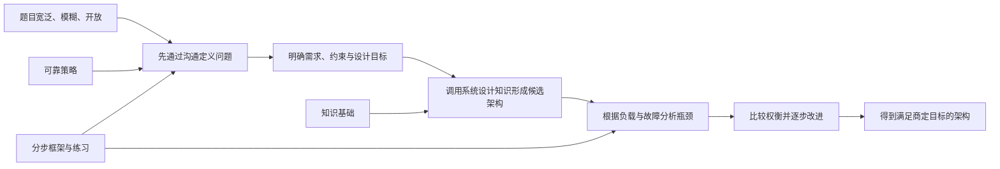
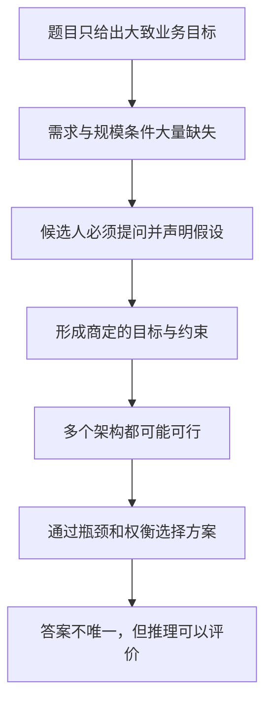
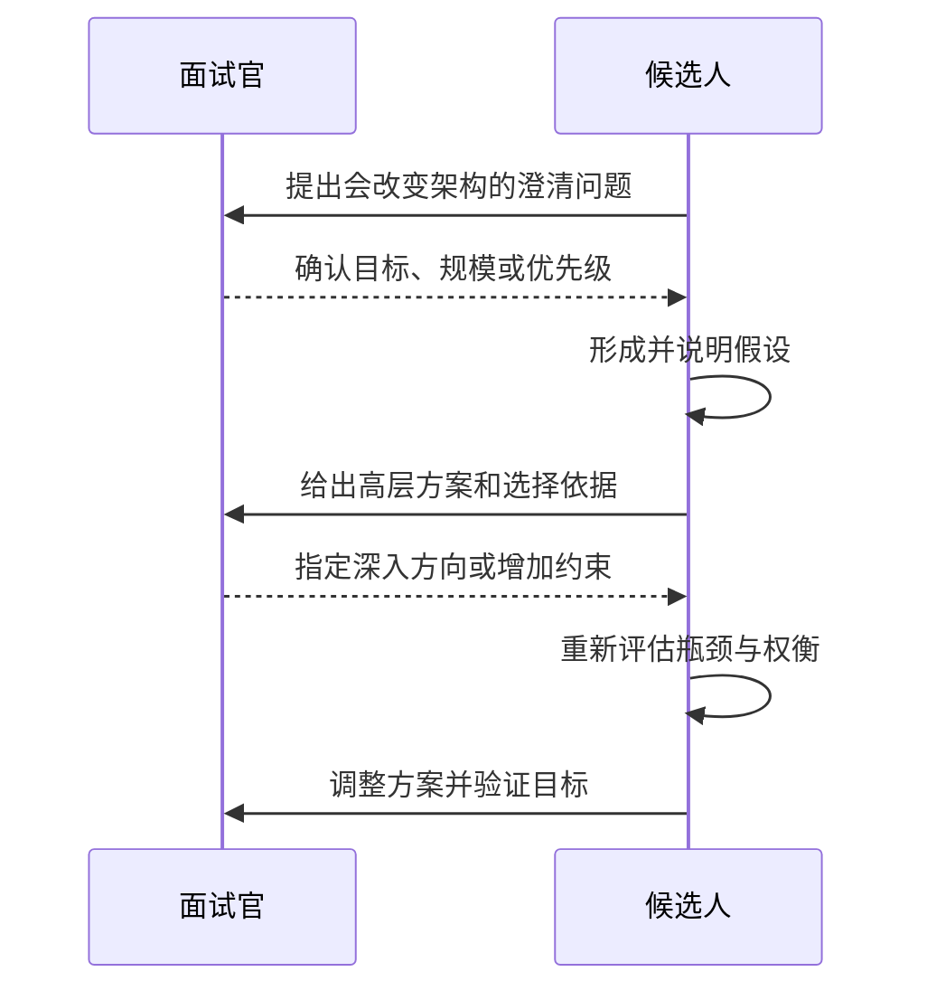
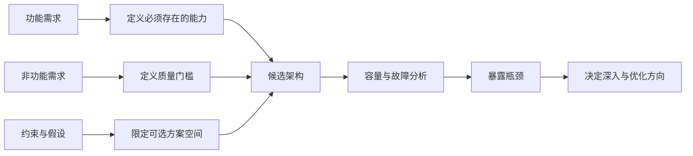
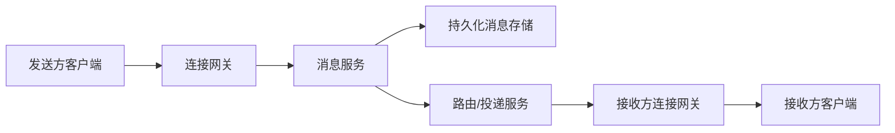
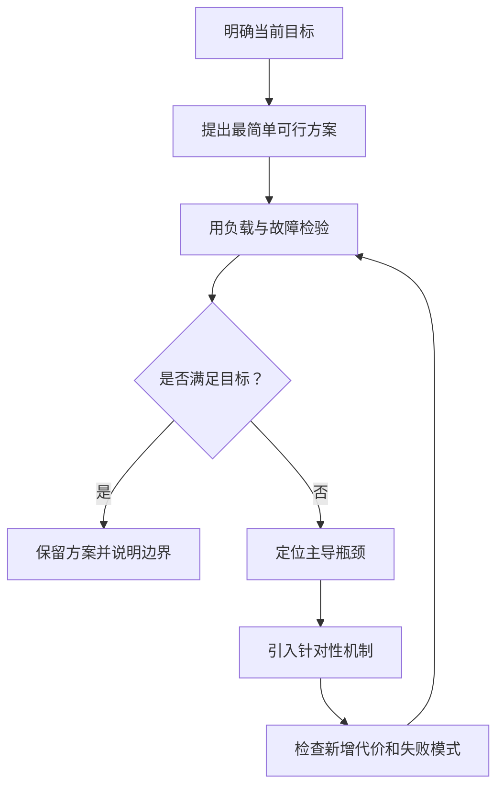
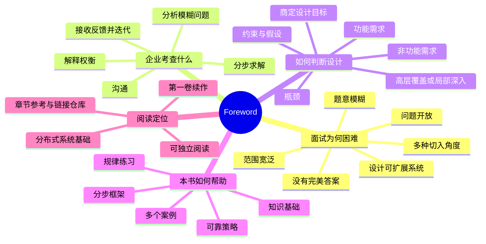

> 原书：Alex Xu、Sahn Lam，*System Design Interview: An Insider's Guide, Volume 2*（2022）
> 范围：Foreword 与紧随其后的 Additional Resources（PDF 第 5～6 页）
> 本节定位：解释系统设计面试为什么困难、企业究竟在考查什么、开放式设计如何仍然得到可靠评价，以及本书将以什么方式帮助读者准备面试。

## 0. 阅读边界与全篇主线

Foreword 很短，没有给出某个具体系统的完整架构，也没有直接列出公式或算法。它的价值在于先建立一套理解全书的**元框架**：

1. 系统设计题要求设计可扩展的软件系统，因此比边界明确的技术题更难。
2. 题目通常宽泛、模糊、开放，没有固定套路，也往往没有完美答案。
3. 企业真正观察的是候选人如何沟通、如何分析模糊问题，以及如何一步步形成方案。
4. 开放式不等于随意；最终架构必须满足双方商定的设计目标。
5. 需求、约束和瓶颈决定讨论方向，也决定应该保持高层覆盖还是深入局部。
6. 应对这类题需要“可靠策略 + 知识基础 + 分步框架 + 反复练习”。
7. 第二卷虽是续作，但可以独立阅读；读者具备基本的分布式系统知识即可开始。

为了把这些简短论述讲透，本文会加入形式化表达、数值示例、伪代码和图表。它们用于展开作者的方法论，不是 Foreword 原文声称存在的固定评分公式或万能答题模板。

全篇的因果链如下：



一句话概括前言的核心：**系统设计面试不是默写标准架构，而是在不完整信息下，通过协作式讨论逐步构造、解释并检验工程决策。**

---

## 1. 系统设计面试为什么格外困难

前言首先指出，系统设计面试是技术面试中最难应对的一类。它要求候选人设计一个可扩展的软件系统，例如新闻信息流、Google 搜索、聊天应用或其他大型系统。

### 1.1 考查对象是“完整系统”，不是孤立函数

算法题往往已经提供：

- 明确的输入与输出；
- 可判定的正确性条件；
- 给定的数据规模；
- 可以比较的时间、空间复杂度。

系统设计题可能只说一句：“设计一个聊天系统。”这句话连完整需求都不是。至少还有以下变量未知：

- 支持一对一聊天、群聊，还是两者都支持？
- 日活跃用户、同时在线用户和峰值消息量是多少？
- 是否支持多设备同步、离线消息、已读回执和消息搜索？
- 是否包含图片、视频与大文件？
- 消息要全局有序、会话内有序，还是只需尽力排序？
- 可以重复吗？允许暂时丢失吗？
- 延迟、可用性、数据保留期和合规要求是什么？

因此，候选人的第一项任务不是立刻画组件图，而是把一句模糊的业务目标转化成一个**可设计、可估算、可验证**的问题。

### 1.2 “可扩展的软件系统”是什么意思

可扩展性（scalability）是指负载增长时，系统能够通过增加资源或调整架构继续满足目标。负载可以来自不同维度：

- 用户数增长；
- 请求率增长；
- 数据量增长；
- 单个对象规模增长，例如超大群聊；
- 地理覆盖范围增长；
- 功能和组织复杂度增长。

设当前峰值请求率为 $Q_0$，预计增长倍数为 $g$，则目标峰值为：

$$
Q_{target}=gQ_0
$$

若单个实例在保留安全余量后可稳定处理 $q_s$ 个请求/秒，则实例数的粗略下界为：

$$
N\geq \left\lceil\frac{Q_{target}}{q_s}\right\rceil
$$

例如峰值为 $120{,}000$ QPS，每实例安全吞吐为 $4{,}000$ QPS，则至少需要：

$$
N\geq\left\lceil\frac{120{,}000}{4{,}000}\right\rceil=30
$$

这只是计算层面的容量下界，尚未计入故障冗余、流量倾斜、扩容时间和下游容量。它说明了一个关键直觉：**“使用了分布式组件”不等于“可扩展”，可扩展必须对应明确的负载维度与验证指标。**

### 1.3 难点一：题目范围很宽

一个完整系统可能同时涉及客户端、网络接入、API、计算、缓存、数据库、消息队列、搜索、监控、安全、跨地域部署和灾难恢复。面试时间有限，不可能把每个部分都讲到实现级别。

这形成一组基本矛盾：

$$
\text{系统覆盖面大}\quad\text{vs.}\quad\text{讨论时间有限}
$$

候选人必须主动分配注意力：

1. 先闭合核心业务的数据流；
2. 再用规模、质量目标和失败风险识别关键部分；
3. 最后把时间投入最有区分度的局部。

平均介绍所有组件，容易变成没有决策依据的名词清单；开场就深入数据库索引，又可能设计得很细却答非所问。系统设计中的“深度”必须建立在正确的范围和优先级之上。

### 1.4 难点二：题目表述模糊

模糊意味着题目还没有变成完整规格。消除模糊性的正确方式是**提问并确认假设**，而不是自行脑补。

面对“设计新闻信息流”，低信息量的开场是：

> 我会使用微服务、Kafka、Redis 和 Cassandra。

更有效的开场是：

> 我先确认范围：本次重点是发布内容和浏览关注对象的信息流吗？是否需要推荐、广告与评论？按时间排序还是个性化排序？大致的日活、峰值读取量和单个用户关注数是多少？

前者先选技术，尚未证明技术与问题相关；后者先寻找会改变架构的变量。澄清问题不是拖延，而是在降低后续方案建立在错误前提上的风险。

可以把这个过程看成逐步缩小解空间：

$$
\mathcal{A}_0
\supseteq \mathcal{A}_1(R_f)
\supseteq \mathcal{A}_2(R_n)
\supseteq \mathcal{A}_3(C)
$$

其中：

- $\mathcal{A}_0$ 是尚未澄清时几乎无限的架构集合；
- $R_f$ 是功能需求；
- $R_n$ 是非功能需求；
- $C$ 是规模、预算、法规和时间等约束。

每确认一个真正会影响设计的问题，就排除一批不合适的方案。提问的价值不在数量，而在**信息增益**。

### 1.5 难点三：题目开放，没有固定模式

前言说没有固定模式可循，指的是不存在一套组件组合，可以不看条件地套在所有题目上。

以信息流为例：

- 普通用户的关注者较少，可以在发布时把内容写入每位关注者的信息流，即写扩散（fan-out on write）；
- 名人拥有数千万关注者时，同样策略会造成巨大的写放大；
- 若读延迟最重要，可以接受更多预计算和缓存；
- 若内容删除必须立即生效，副本与缓存越多，失效协调就越困难。

因此，架构不是由题目名称唯一决定的，而是多个条件共同作用的结果：

$$
\text{Architecture}
=f(\text{requirements},\text{scale},\text{constraints},\text{priorities})
$$

这个表达式不是一个可直接执行的算法，而是一条检查原则：右侧条件发生变化时，应重新检查左侧架构是否仍然合理。

### 1.6 难点四：存在多种攻击角度，没有完美答案

同一题目可以从 API、数据模型、高层组件、读写路径、一致性、容灾或成本等不同角度切入。每个方案通常都在优化某些目标的同时付出代价：

| 设计选择 | 主要收益 | 常见代价 |
|---|---|---|
| 增加缓存 | 降低读延迟和源站压力 | 陈旧数据、失效复杂度、缓存击穿 |
| 增加副本 | 提高读能力和可用性 | 复制延迟、一致性与故障转移复杂度 |
| 数据分片 | 突破单机容量和吞吐上限 | 跨分片查询、热点、再平衡 |
| 异步队列 | 削峰、解耦、隔离短暂故障 | 处理延迟、重复消息、积压 |
| 多地域部署 | 降低远距离延迟、提高容灾能力 | 成本、数据冲突、运维复杂度 |

“没有完美答案”源于多目标之间常常无法同时达到最优。例如，为所有写操作执行跨地域同步确认能增强一致性，却会增加延迟并降低故障期间的可写性。

一个教学化的决策模型是：在所有满足硬约束的架构中，根据业务优先级寻找效用更高的方案。

$$
\mathcal{F}=\{A\mid A\text{ 满足全部硬约束}\}
$$

$$
A^{\ast}=\arg\max_{A\in\mathcal{F}}
\left(
w_lU_l(A)+w_aU_a(A)+w_cU_c(A)+w_mU_m(A)-w_kK(A)
\right)
$$

其中：

- $U_l$：低延迟方面的效用；
- $U_a$：可用性方面的效用；
- $U_c$：一致性方面的效用；
- $U_m$：可维护性方面的效用；
- $K$：成本或复杂度；
- $w$：各目标的相对权重。

实际面试不会真的计算这个函数，因为指标难以归一化，权重也未必精确。它的直觉意义是：

1. 先用硬约束淘汰不可行方案；
2. 再依据优先级比较可行方案的收益与代价；
3. 所谓“最佳设计”只在当前目标和假设下成立。

这也解释了为什么没有唯一答案，却仍然可以严谨评价。

### 1.7 本节小结：困难来自不确定性，而不仅是知识量

前言列出的“宽泛、模糊、开放、多种角度、没有完美答案”是一条相互连接的因果链：



真正困难的不是记住多少组件，而是能否在不确定性中持续做出有依据、可解释、可修正的决策。

---

## 2. 企业为什么使用系统设计面试

前言接着解释，许多公司采用系统设计题，是因为它考查的沟通能力和问题解决能力，与软件工程师日常工作中使用的能力相似。面试官关注候选人如何分析一个模糊问题，以及如何一步步解决它。

### 2.1 模糊问题正是真实工作的常态

真实需求很少以完整规格到达工程师手中。团队收到的输入可能只是：

- “首页太慢了”；
- “消息不能再丢了”；
- “这个服务要支持十倍流量”；
- “我们要服务多个国家和地区”；
- “做一个类似某产品的功能”。

这些话表达了痛点或方向，但没有定义成功条件。工程师还要继续询问：

- 慢的是平均延迟还是 P99 延迟？
- 哪些用户、地区和请求路径受到影响？
- “不能丢”是指至少一次投递，还是业务效果恰好一次？
- 十倍增长是平均流量、峰值流量，还是存储量？
- 国际化只涉及语言，还是包括数据驻留、时区、货币与法规？

系统设计面试把这种现实压缩到有限时间里，观察候选人能否把不完整输入逐步转化为共享的问题定义。

### 2.2 候选人被评价的是过程，而不只是一张图

前言明确强调“如何分析”以及“如何一步步解决”。因此，可观察的能力链通常是：

| 能力 | 面试中的行为 | 解决的问题 |
|---|---|---|
| 澄清 | 确认用户、功能、规模、质量目标和边界 | 防止解决错误的问题 |
| 分解 | 把大问题拆成接口、数据、核心路径和关键风险 | 降低一次处理全部复杂性的难度 |
| 估算 | 将用户量转成 QPS、带宽、存储等数量级 | 让扩展机制有数字依据 |
| 建模 | 画出组件关系并讲清请求与数据流 | 让架构完整且可检查 |
| 权衡 | 解释选择、替代方案及代价 | 证明方案由目标驱动，而非背诵 |
| 验证 | 检查容量、热点、故障、一致性和可观测性 | 找到方案在什么条件下失效 |
| 迭代 | 根据新要求或面试官提示调整设计 | 展示协作与适应能力 |

系统图只是推理过程的中间产物。即使最终画出的组件相似，能够解释“为什么如此设计、何时会失效、条件变化后如何调整”的候选人，展示出的工程能力也完全不同。

### 2.3 沟通不是包装，而是设计机制

在需求尚未确定时，沟通本身就在产生设计输入：



如果双方对“实时”“高可用”或“严格顺序”的理解不同，候选人即使表达流畅，也可能设计错误。因此，高质量沟通至少要做到：

1. **准确**：术语对应明确语义和指标；
2. **双向**：询问、倾听、确认，而非单向演讲；
3. **可追踪**：把架构决定连接到已确认的需求；
4. **可修正**：新信息出现时，愿意调整而不是维护原答案。

### 2.4 为什么必须“逐步”解决

复杂系统无法从空白一步跳到最终形态。更可靠的方式是先构造一个简单但闭合的版本，再让新增复杂度由实际压力触发：

1. 明确核心功能和成功标准；
2. 给出能够完成核心路径的最简方案；
3. 用数量级估算和失败场景找出最先出现的问题；
4. 针对问题引入缓存、复制、分片、队列等机制；
5. 重新检查新机制带来的故障模式和运维成本。

例如：

- 读流量超过主库承载能力，才考虑缓存或只读副本；
- 单节点容量或吞吐成为上限，才考虑分片；
- 同步调用使延迟和故障传播不可接受，才考虑异步队列；
- 跨地域延迟或灾难恢复成为明确目标，才引入多地域架构。

这体现了一个重要原则：

$$
\text{新增机制的收益} > \text{它引入的复杂度与风险}
$$

这里同样不是精确计算式，而是决策门槛。没有需求、数字或瓶颈支撑的复杂组件，只会增加新的数据语义、成本和失败方式。

### 2.5 一条完整的解释链

每个重要技术选择都应能回答四个问题：

1. **决定**：选择了什么？
2. **依据**：对应哪个需求、数字或风险？
3. **代价**：牺牲了什么，增加了什么复杂度？
4. **验证**：如何判断它确实有效？

例如：

> 为降低热门信息流的读取延迟，我会缓存已经生成的首页结果。依据是读请求远多于写请求，并且业务允许几十秒的新鲜度延迟。代价是缓存与源数据可能短暂不一致，因此删除内容时要主动失效，并设置较短 TTL 兜底。上线后用缓存命中率、P95/P99 延迟和陈旧数据比例验证效果。

它比“这里加 Redis”更完整，因为建立了：

$$
\text{问题}\rightarrow\text{决策}\rightarrow\text{代价}\rightarrow\text{验证}
$$

### 2.6 本节小结

企业不是在寻找一位能猜中面试官脑中架构图的人，而是在有限时间内采样候选人的工程行为：能否澄清目标、组织复杂问题、使用数据、解释权衡、识别风险，并与他人协作推进设计。

---

## 3. 开放式设计如何得到可靠评价

前言第三部分再次强调开放性：现实中的设计存在许多变体。期望结果不是某张标准图，而是一个满足**商定设计目标**的架构。讨论可以走向覆盖全局的高层架构，也可以聚焦一两个具体区域；候选人应理解需求、约束和瓶颈，由此塑造面试方向。

### 3.1 “开放式”不等于“没有标准”

系统设计答案可以不同，但至少可以从以下方面检验：

- 是否解决了双方约定的功能问题；
- 是否在目标规模下可行；
- 是否满足延迟、可用性、一致性、耐久性等质量目标；
- 核心读写路径是否闭合；
- 是否识别并处理关键瓶颈和故障；
- 技术选择是否有依据，权衡是否自洽；
- 是否控制了不必要的复杂度。

形式化地说，架构 $A$ 至少应满足：

$$
A\models R_f\land R_n\land C
$$

这里 $R_f$ 是功能需求，$R_n$ 是非功能需求，$C$ 是约束。符号 $\models$ 表示“满足”。设计可以有多个，但不满足这些条件的方案不能因为题目开放就被视为合理。

### 3.2 需求、约束、目标与瓶颈的区别

这几个概念相互关联，但不能混用。

| 概念 | 它回答的问题 | 示例 |
|---|---|---|
| 功能需求 | 系统必须做什么？ | 用户能发送和接收消息 |
| 非功能需求 | 系统要以什么质量完成？ | 会话内消息延迟 P99 小于 500 ms |
| 约束 | 方案不能越过什么边界？ | 必须保留数据七年；预算固定；不能更换既有数据库 |
| 设计目标 | 本次讨论优先优化什么？ | 优先保证消息不丢失，其次降低延迟 |
| 假设 | 暂无事实时暂定什么条件？ | 预计 10% 的日活用户同时在线 |
| 瓶颈 | 哪个资源或路径首先限制目标？ | 单分片写吞吐、热点键、跨地域往返延迟 |

它们之间的关系是：



常见错误是把实现手段当需求。例如“必须使用 Kafka”通常不是业务需求，而是技术约束或提前选定的方案。真正的需求可能是“入口短时故障时仍接收事件”“生产者和消费者解耦”或“支持每秒百万条事件”。只有拆回真正目标，才能比较 Kafka 与其他方案。

### 3.3 为什么要“商定”设计目标

“商定”意味着目标不是候选人单方面猜测的，也不是面试官留在心里的隐藏答案。双方应共同建立评价基准。

例如“高可用”至少要继续量化。若一年按 $365$ 天计算，可用性目标 $p$ 对应的理论停机预算为：

$$
T_{down}=(1-p)\times365\times24\times60
$$

| 可用性目标 | 每年理论停机预算（约） |
|---|---:|
| 99% | 87.6 小时 |
| 99.9% | 8.76 小时 |
| 99.99% | 52.56 分钟 |
| 99.999% | 5.26 分钟 |

从 99.9% 提升到 99.99% 不是多写一个 9，而是把全年停机预算从数小时压缩到不到一小时，可能要求冗余、自动故障转移、更严格的变更控制和灾难恢复能力。

同理，“低延迟”必须说明：

- 衡量平均值、P95 还是 P99？
- 从客户端到服务端，还是服务内部处理时间？
- 哪条接口、哪个地区、什么负载条件？

未量化的形容词不能稳定地指导设计，也无法在结尾验证。

### 3.4 约束如何塑造架构

约束会直接排除部分候选方案。例如：

- 数据必须留在特定地区，会限制跨地域复制拓扑；
- 强一致余额更新，会限制完全异步的写入路径；
- 低成本优先，会限制多地域全量热备；
- 必须兼容旧客户端，会影响 API 演进；
- 团队规模小，会提高复杂基础设施的维护风险。

约束并不总是负面的。它们减少了解空间，使设计更聚焦。真正危险的是隐含约束：候选人未询问，直到设计后期才发现整个方案的基础不成立。

### 3.5 瓶颈是什么，为什么它决定深入方向

瓶颈是限制系统继续满足目标的最紧张资源或环节。它可能是：

- CPU、内存、磁盘 IOPS 或网络带宽；
- 数据库单分片吞吐；
- 热门键或热点用户；
- 下游服务限额；
- 锁竞争与串行执行；
- 跨地域网络往返；
- 人工操作和部署流程。

对串联系统，一个环节吞吐不足就会限制整体吞吐。若核心路径各阶段最大稳定处理率分别为 $q_1,q_2,\ldots,q_n$，则在没有并行扩展和缓冲改善的简化模型下：

$$
Q_{system}\leq\min(q_1,q_2,\ldots,q_n)
$$

但“最慢组件”不一定就是唯一瓶颈：队列可以暂时吸收突发流量，却不能长期修复消费能力不足；平均吞吐足够，也可能因热点导致单分片过载。因此应同时检查稳态、峰值、倾斜和故障降级。

瓶颈分析让深入讨论有明确原因：不是因为某项技术熟悉，而是因为它最可能让系统无法满足已商定目标。

### 3.6 高层覆盖与局部深入

前言指出，不同面试官可能选择不同讨论方向：有人希望覆盖整个高层架构，有人希望聚焦一个或多个区域。

#### 高层覆盖适合回答

- 系统边界是什么？
- 核心组件如何协作？
- 请求和数据怎样流动？
- 主要存储、缓存和异步路径在哪里？
- 故障会怎样传播？

#### 局部深入适合回答

- 分片键为什么这样选？
- 消息如何保证顺序、重试和幂等？
- 热点用户如何处理？
- 多地域冲突怎样解决？
- 缓存如何失效？

合理顺序通常是：**先建立足以定位局部的整体，再深入最关键的局部。** 没有全局骨架，局部选择缺乏上下文；没有关键深入，高层图又可能只是一组未经验证的方框。

候选人可以主动提出方向并邀请校准：

> 核心读写路径已经闭合。当前最大风险是名人用户引发的写入热点，我建议接下来深入信息流生成策略；如果您更关注数据分片或容灾，我也可以转向那部分。

这既体现判断力，也维持了协作。

### 3.7 一个贯穿示例：从“设计聊天系统”到可评价方案

下面的例子不是 Foreword 中给出的标准答案，而是用来演示其“需求、约束、瓶颈塑造讨论”的逻辑。

#### 第一步：原始题目

> 设计一个聊天系统。

此时范围过大，不能直接判断要不要群聊、WebSocket、消息队列或特定数据库。

#### 第二步：澄清并商定目标

假设双方确认：

- 支持一对一文本消息；
- 1 亿日活用户；
- 每位用户平均每天发送 40 条消息；
- 峰值是平均值的 5 倍；
- 会话内消息有序；
- 消息不能丢失，允许客户端偶尔收到重复消息；
- 在线消息端到端延迟 P99 小于 500 ms；
- 暂不讨论群聊、图片和搜索。

这一步同时明确了范围外内容，避免讨论无限扩张。

#### 第三步：数量级估算

每日消息数：

$$
M_{day}=10^8\times40=4\times10^9
$$

平均写入率：

$$
Q_{avg}=\frac{4\times10^9}{86{,}400}\approx46{,}300\text{ 条/秒}
$$

峰值写入率：

$$
Q_{peak}\approx5\times46{,}300\approx231{,}500\text{ 条/秒}
$$

若每条消息连同元数据平均占 1 KB，则未考虑副本和索引的每日新增数据约为：

$$
D_{day}=4\times10^9\times1\text{ KB}\approx4\text{ TB/天}
$$

估算不追求虚假的精确度，它要证明：单机存储和单点写入显然不足，后续设计必须讨论分区、复制和长期容量。

#### 第四步：形成最简核心路径



这张图先回答“消息怎样从发送方可靠地到达接收方”，尚未堆入所有可选组件。

#### 第五步：让约束触发机制

- 峰值超过 23 万条/秒且数据长期增长，触发消息存储分片；
- “消息不能丢失”要求先可靠持久化，再向发送方确认；
- 允许重复但不能丢失，可以采用至少一次投递，并用消息 ID 去重；
- 会话内有序可使用会话 ID 作为分区或路由依据，并在会话内分配单调序号；
- P99 小于 500 ms 要求长连接、快速路由，并监控尾延迟；
- 接收方离线时，投递失败不能删除持久化消息，待上线后补拉。

#### 第六步：识别新问题

- 某些超活跃会话是否成为热点？
- 会话分片迁移期间如何保持顺序？
- 持久化成功但投递服务故障时如何恢复？
- 客户端确认丢失导致重发时如何幂等？
- 一个地域故障时是否仍要满足写入和投递目标？

到这里，讨论方向由最初的模糊题目逐步收敛到了与目标直接相关的风险。即使另一位候选人的组件不同，只要其方案也能满足商定目标并合理解释权衡，就可能是有效答案。

---

## 4. 本书的第一个目标：提供可靠策略与知识基础

前言随后说明，本书旨在为广泛的系统设计题提供可靠策略和知识基础。作者强调，正确的策略与知识对面试成功都至关重要。

### 4.1 策略解决“按什么顺序思考”

策略负责管理解题过程，例如：

- 先澄清什么，后设计什么；
- 如何控制范围与时间；
- 如何从简单方案逐步演进；
- 如何选择值得深入的瓶颈；
- 如何让面试官看见自己的推理；
- 新约束出现时如何调整。

只有知识而没有策略，常见表现是知道很多技术，却在题目开始后随机跳转，无法形成闭合方案。

### 4.2 知识基础解决“有哪些机制可选”

知识基础包括：

- 网络、存储、缓存和数据库原理；
- 复制、分片、一致性和事务；
- 消息传递、重试、幂等和顺序；
- 负载均衡、故障转移与多地域架构；
- 容量估算、可观测性、安全和成本；
- 不同机制的适用条件与失败模式。

只有策略而没有知识，候选人也许知道“现在该讨论扩展性”，却无法提出并比较有效机制。

### 4.3 两者的关系

|  | 知识基础弱 | 知识基础强 |
|---|---|---|
| 策略弱 | 问题难以收敛，也缺少可行方案 | 容易堆技术名词、遗漏主线、时间失控 |
| 策略强 | 流程清楚，但方案深度和可行性不足 | 能把需求映射到机制，并清楚解释权衡 |

可以把面试表现抽象为：

$$
P\approx S\times K\times C\times V
$$

其中：

- $S$：策略（strategy）；
- $K$：知识（knowledge）；
- $C$：沟通（communication）；
- $V$：验证与迭代能力（validation）。

乘法只是表达“明显短板会限制整体表现”的直觉，不是作者给出的评分公式。知识再丰富，如果完全不澄清目标，仍可能精确地解决错误问题；流程再熟练，如果不了解分片和复制的代价，也无法完成可靠设计。

### 4.4 “可靠策略”不等于“固定架构”

这是最容易混淆的一点：

- **固定架构**规定答案里必须出现哪些组件；
- **可靠策略**规定如何获取信息、形成决策并检查方案。

开放题没有万能架构，但可以有稳定的思考动作，例如先确认目标、估算规模、闭合核心路径、识别瓶颈、比较权衡。这些动作能迁移到不同题目，而输出架构应随条件变化。

---

## 5. 本书的第二个目标：用分步框架和案例训练系统方法

前言进一步说明，本书会给出处理系统设计题的分步框架，并通过许多案例展示这种系统方法。读者可以跟随详细步骤，通过规律练习逐渐具备应对面试的能力。

### 5.1 前言承诺的是框架，不是背诵脚本

框架的作用包括：

- 降低遗漏关键环节的概率；
- 在压力下提供稳定的起点；
- 让思考顺序对面试官可见；
- 帮助控制广度、深度和时间；
- 让练习结果可以复盘和比较。

但框架不能机械执行。同样的步骤，在支付系统中应把资金正确性、账本和幂等放在中心；在附近好友系统中则要优先讨论位置更新、空间索引、隐私与实时性。

### 5.2 如何理解“系统化方法”

Foreword 没有在本节列出框架的具体步骤。结合它反复强调的“商定目标、需求、约束、瓶颈和逐步求解”，可以把阅读全书时应观察的方法链整理为：

```text
输入：一句宽泛的系统设计题

1. 澄清范围、用户与核心用例
2. 商定功能需求、非功能需求与约束
3. 声明关键假设，并做数量级估算
4. 定义 API、数据模型与核心数据流
5. 构造最简可行的高层架构
6. 用容量和故障场景识别瓶颈
7. 针对关键瓶颈逐步演进设计
8. 比较替代方案及其权衡
9. 回到最初目标，验证是否满足
10. 总结限制、风险与后续演进方向
```

这不是要求每道题都平均花十段时间。它是一条因果顺序：后面的复杂机制应能追溯到前面的需求、数字或风险。

### 5.3 一个可复用的设计循环

上述过程还可以压缩成循环：



这个循环有效，是因为它让复杂度具有来源：每次演进都对应一个被发现的问题。它也便于面试官介入，在任一步增加约束或指定深入方向。

### 5.4 为什么案例不能只记最终架构

本书用许多案例说明系统化方法。学习案例时，最重要的不是记住最终图，而是提取以下关系：

| 阅读问题 | 应提取的内容 |
|---|---|
| 为什么先问这个问题？ | 它会改变哪个设计决定 |
| 为什么做这个估算？ | 它要验证哪个容量假设 |
| 为什么引入这个组件？ | 它解决哪个已出现的瓶颈 |
| 为什么不用替代方案？ | 当前目标下的收益与代价比较 |
| 该方案何时失效？ | 适用范围与隐含前提 |
| 条件改变怎么办？ | 设计是否能继续演进 |

如果只背“某题需要 CDN、Redis、Kafka、Cassandra”，一旦面试官改变规模或一致性要求，记忆中的架构就会失去依据。理解决策链，才具备迁移能力。

### 5.5 规律练习为什么有效

练习不是重复朗读答案，而是训练几种需要自动化的能力：

- 在几分钟内发现最关键的未知量；
- 快速把日流量换算成平均和峰值 QPS；
- 用清晰图示表达组件与数据流；
- 为每个重要选择说明依据和代价；
- 在提示或新约束下及时修正；
- 在有限时间内收束并验证结论。

一个有效练习闭环是：


每次练习可用以下检查项复盘：

- 是否在选技术前确认了问题？
- 是否明确区分需求、约束和假设？
- 估算是否真的影响了设计？
- 核心读写路径是否闭合？
- 每个复杂组件是否有明确触发原因？
- 是否讨论了最关键的失败模式？
- 结尾是否回到商定目标验证方案？

### 5.6 框架的适用范围与局限

分步框架适合：

- 在有限时间中组织开放式问题；
- 降低遗漏并提高沟通透明度；
- 为案例练习提供统一复盘基准；
- 帮助初学者把零散知识串成决策过程。

它不能替代：

- 对数据库、网络和分布式系统机制的真实理解；
- 对具体业务语义的判断；
- 生产数据、实验和压测；
- 安全、法规、成本和组织能力的完整评审；
- 真实系统中的长期演进与运维经验。

面试框架是在不完整信息和有限时间下构造合理方案的方法，不是生产架构评审的全部。

---

## 6. 第二卷与第一卷的关系，以及阅读前提

前言最后说明，本书可视为 *System Design Interview: An Insider's Guide, Volume 1* 的续作。先读第一卷有帮助，但不是阅读第二卷的必要条件；具备分布式系统基本理解的读者即可阅读。

### 6.1 “续作”与“可独立阅读”并不矛盾

- **续作**说明第二卷延续相同主题，并增加新的系统设计案例和训练材料；
- **可独立阅读**说明第二卷不会把第一卷当成不可跳过的强依赖。

因此，读者不需要因为没有完成第一卷而推迟第二卷，但遇到基础概念薄弱时，仍应及时补齐。

### 6.2 “基本理解分布式系统”至少意味着什么

前言没有列出先修清单。为了顺利理解后续案例，建议至少能解释：

- 客户端、服务端、请求、响应和 API；
- 延迟、吞吐、带宽、容量和尾延迟；
- 负载均衡与水平扩展；
- 缓存及其命中、失效和一致性问题；
- 关系型与非关系型存储的基本差异；
- 数据复制、分片和故障转移；
- 同步与异步通信、消息队列；
- 一致性、可用性、耐久性和容错的基本含义；
- 单点故障、重试、超时和幂等。

“基本理解”不等于已经能推导所有分布式协议。读者只需能理解这些机制解决什么问题、付出什么代价，随后再借助各章案例深化。

### 6.3 建议的阅读方式

对每个后续案例，可以保持三遍视角：

1. **第一遍看问题如何被定义**：作者问了什么，哪些条件改变了架构空间；
2. **第二遍看设计如何演进**：每个组件由哪个需求、数字或瓶颈触发；
3. **第三遍看权衡与边界**：方案牺牲了什么，在什么条件下需要改变。

这样能把“读懂一个案例”转化为“获得可迁移的解题能力”。

---

## 7. Additional Resources：如何使用补充资源

Foreword 后的 Additional Resources 页面说明：

- 每章末尾包含参考资料；
- GitHub 仓库汇集了可点击链接：<https://bit.ly/systemDesignLinks>；
- 作者 Alex Xu 会在社交媒体分享系统设计面试技巧：
  - X/Twitter：<https://twitter.com/alexxubyte>
  - LinkedIn：<https://bit.ly/linkedinaxu>

这些资源与正文承担不同作用：

| 资源 | 主要用途 | 使用建议 |
|---|---|---|
| 章节正文 | 建立完整的问题分析和设计主线 | 先独立思考，再阅读作者方案 |
| 章末参考资料 | 深挖具体机制、产品实践和事实依据 | 带着本章未解决的问题定向阅读 |
| 链接仓库 | 降低扫描版或纸质书访问链接的成本 | 结合对应章节使用，不必一次读完 |
| 持续更新内容 | 接触新案例、新技术与面试技巧 | 用原理和约束判断，不机械追逐新名词 |

参考资料最有效的用法不是无限扩展收藏，而是闭合知识缺口。例如不理解为何广告点击聚合需要处理迟到事件，就沿该问题阅读流处理资料；读完后再回到案例重做相关决策。

---

## 8. 容易混淆的概念与常见误区

### 8.1 没有唯一答案，不等于任何答案都可以

架构可以不同，但必须满足商定需求和约束，并能解释关键权衡。无法承受目标流量、破坏核心数据语义或存在明显单点的方案，不能用“开放题”辩护。

### 8.2 没有固定模式，不等于不需要结构

不能套固定组件，不代表可以随意跳跃。稳定的分析框架仍然有价值：澄清、估算、建模、定位瓶颈、权衡和验证可以复用，具体架构则应随题目变化。

### 8.3 可扩展性不等于高可用

- 可扩展性关心负载增长后是否继续满足目标；
- 高可用关心组件故障或维护期间是否继续提供服务。

增加服务器可能提高吞吐，却未必消除共享数据库单点；增加副本可能提高可用性，却可能带来一致性和故障转移问题。

### 8.4 需求不等于技术方案

“需要 Kafka”“需要 NoSQL”通常已经是方案。应继续追问背后的目标：削峰、解耦、事件回放、高写吞吐还是灵活数据模型。先还原问题，才有可能正确选型。

### 8.5 约束不等于瓶颈

- 约束是设计必须遵守的边界；
- 瓶颈是限制系统达到目标的环节。

“数据不能离开某地区”是约束；“区域内单个数据库的写吞吐不足”是瓶颈。约束可能制造或加剧瓶颈，但二者不是同一概念。

### 8.6 平均值不等于容量目标

按日流量计算出的平均 QPS 只用于数量级起点。真实容量设计还要考虑：

- 峰均比；
- 流量突发；
- 热点与倾斜；
- 单机故障后的剩余容量；
- 扩容所需时间；
- 下游限额。

用平均值证明系统“扛得住”，是常见的容量误判。

### 8.7 高层设计不等于罗列组件

高层设计至少要讲清组件职责、接口边界与核心数据流。方框之间没有明确数据语义和调用方向，再多组件也没有形成架构。

### 8.8 深入细节不等于表现更好

深入必须服务于关键风险。若核心需求还未确认，就讨论 B+ 树页分裂或共识协议实现，可能展示了局部知识，却没有推进当前问题。

### 8.9 沟通能力不等于“说得多”

有效沟通关注信息质量：问题是否改变设计、假设是否明确、决定是否有依据、反馈是否被吸收。持续输出术语但不确认对方目标，只是单向陈述。

### 8.10 分步框架不等于背诵脚本

脚本追求在每道题中重复相同内容；框架帮助根据题目选择下一步。支付、地图、消息队列和股票交易所的重点不会相同，顺序和时间分配也应调整。

### 8.11 第二卷是续作，不等于必须先完成第一卷

作者明确说第一卷有帮助但非必需。真正的门槛是分布式系统基础，而不是阅读卷册的形式顺序。

---

## 9. 一份从前言推导出的面试自检表

这份自检表将前言的方法论转换成可操作问题，可用于后续每章练习。

### 9.1 问题定义

- 我是否确认了核心用户和核心用例？
- 哪些功能明确在范围内，哪些暂不讨论？
- 功能需求与非功能需求是否分开？
- 模糊词是否被量化或明确语义？
- 关键假设是否得到面试官确认？

### 9.2 规模与约束

- 用户量、QPS、读写比、数据量和带宽是否达到数量级即可？
- 是否考虑峰值、热点和故障余量？
- 哪个数字真正影响了架构？
- 是否存在预算、法规、地域、兼容性或团队能力约束？

### 9.3 架构与数据流

- 核心请求能否从入口走到最终结果？
- 每个组件的职责和状态是否清楚？
- 数据的权威来源在哪里？
- 同步与异步边界在哪里？
- 失败时重试、去重、降级和恢复怎样处理？

### 9.4 权衡与瓶颈

- 最可能先到达上限的是哪条路径或哪个资源？
- 新增组件解决了哪个明确问题？
- 它引入了什么一致性、成本和运维代价？
- 是否存在更简单的替代方案？
- 负载或目标变化后，设计会怎样改变？

### 9.5 收束与验证

- 架构是否逐项满足最初商定的目标？
- 哪些限制仍然存在？
- 监控什么指标才能知道设计有效？
- 如果再有时间，最值得深入或改进什么？

---

## 10. 全章知识结构



## 11. 核心结论

1. **系统设计面试的核心对象是决策过程。** 最终架构重要，但面试官同样观察候选人怎样把模糊问题逐步变成可验证设计。
2. **开放式不代表随意。** 方案不必唯一，却必须满足双方商定的需求、约束和质量目标。
3. **问题定义先于技术选型。** 需求、规模、约束和优先级改变，合理架构也会改变。
4. **沟通是设计过程的一部分。** 候选人通过提问获得设计输入，通过解释让假设和权衡可检查，通过反馈及时校准方向。
5. **瓶颈连接分析与优化。** 它解释了为什么需要引入某种机制，也决定有限时间应深入哪里。
6. **高层覆盖和局部深入不是二选一。** 先用高层设计闭合核心路径，再沿关键风险深入，才能同时保持完整性与技术深度。
7. **策略与知识缺一不可。** 策略决定如何推进，知识决定有哪些可行机制，练习则让两者能在压力下稳定结合。
8. **框架应复用，架构不应照抄。** 可迁移的是澄清、估算、建模、权衡和验证的方法，不是某个案例的组件清单。
9. **第二卷可以独立阅读。** 第一卷是有益背景而非强制前置，基本的分布式系统理解才是作者给出的实际门槛。

## 12. 解决系统设计问题的一般思路

将本前言压缩成一条可执行原则，就是：

$$
\boxed{
\text{模糊问题}
\xrightarrow{\text{沟通与澄清}}
\text{商定目标}
\xrightarrow{\text{知识与估算}}
\text{候选架构}
\xrightarrow{\text{瓶颈与权衡}}
\text{逐步演进}
\xrightarrow{\text{验证}}
\text{满足目标的设计}
}
$$

实际解题时，始终追问五句话：

1. **我们真正要解决什么问题？**
2. **在什么规模、质量目标和约束下解决？**
3. **当前最简单的可行方案是什么？**
4. **它最先会在哪里失效，改进要付出什么代价？**
5. **最终方案是否确实满足了最初商定的目标？**

前言没有给出某道题的答案，而是给出了理解整本书的钥匙：**系统设计能力不是记忆静态架构，而是持续建立“目标—约束—方案—瓶颈—权衡—验证”之间的因果关系。**
