> 原书：Alex Xu，*System Design Interview: An Insider's Guide*（Second Edition）
> 原章：Chapter 1, *Scale From Zero to Millions of Users*
> 本章主线：从一个所有组件都部署在同一台服务器上的最小系统出发，每次只针对已经出现的容量、延迟、可用性或耦合问题增加必要机制，逐步演进到能够服务数百万用户的分布式架构。

## 0. 学习目标、阅读边界与总览

本章不是某个真实产品的完整架构，也不是一份照抄即可支撑百万用户的固定模板。作者采用的是一种**渐进式架构演进**方法：先建立最简单的可运行系统，再观察它在用户增长时最先出现的问题，然后针对该问题做局部改造。

读完本章，应当能够回答：

1. 为什么小规模系统应当从单机开始，而不是一开始就上复杂的分布式架构？
2. Web 层、数据层、缓存层、CDN 和消息队列分别解决什么问题？
3. 垂直扩展与水平扩展有何区别，为什么大型系统更依赖水平扩展？
4. 负载均衡、数据库复制和多数据中心分别消除了哪个范围的单点故障？
5. 缓存为什么能降低延迟与数据库压力，又为何引入一致性、过期和淘汰问题？
6. 为什么 Web 层必须尽量无状态，状态究竟应放在哪里？
7. 消息队列如何解耦生产者与消费者，异步化又带来哪些新语义？
8. 分片为什么能扩展数据库容量和吞吐，分片键又为何决定成败？
9. 为什么日志、指标和自动化不是附属工具，而是规模化系统的一部分？
10. 如何把本章的组件清单还原成一套可迁移的系统扩展方法？

本章的完整演进路径如下：

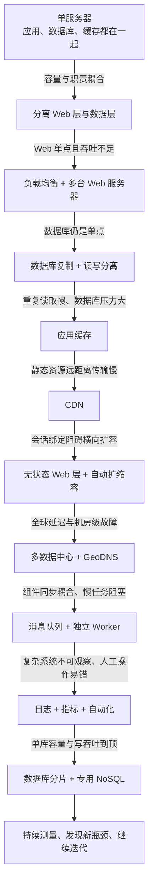

原章包含少量 API 与分片函数示例，但没有系统性的数学推导。本文加入的容量、可用性、缓存和队列公式用于解释作者的直觉，均属于教学化补充，不应误认为原书逐式提出的模型。原书使用 `master/slave` 描述数据库复制；本文在解释原意时保留对应关系，同时优先采用现代常用的 `leader/follower`（主库/从库）术语。

---

## 1. 核心方法：扩展是持续精化，而不是一步到位

作者开章先给出一个方法论判断：支持数百万用户不是一次设计完成的结果，而是一段持续精化、不断改进的旅程。全章随后用同一系统逐步演进来证明这一点。

### 1.1 为什么先从最简单的系统开始

系统复杂度本身有成本：

- 更多组件意味着更多部署、监控和故障组合；
- 跨进程与跨网络通信比本地调用更慢、更容易失败；
- 数据副本越多，一致性和恢复越难；
- 团队必须具备相应的运维知识；
- 尚未出现的瓶颈很可能被错误预测。

因此，初始设计的目标不是预先解决所有未来问题，而是用最低成本验证核心业务。只有当监控或规模估算表明某个边界即将被触及时，才引入下一层复杂度。

可以把一次架构改造写成以下决策链：

$$
\text{观测到的问题}
\rightarrow\text{识别受限资源}
\rightarrow\text{提出候选机制}
\rightarrow\text{比较收益与代价}
\rightarrow\text{局部改造}
\rightarrow\text{重新测量}
$$

如果缺少第一步“观测到的问题”，后面的技术选择就容易变成过度设计。

### 1.2 本章隐含的四类扩展目标

架构不断增加组件，但它们并非都只为“更多 QPS”。本章实际上交替处理四类目标：

| 目标 | 典型问题 | 本章机制 |
|---|---|---|
| 容量与吞吐 | 单机 CPU、内存、磁盘或连接数到顶 | 水平扩展、复制、分片、Worker 扩容 |
| 响应延迟 | 数据库重复查询、用户离资源太远 | 缓存、CDN、就近数据中心 |
| 可用性与可靠性 | 服务器、数据库或整个机房故障 | 冗余、故障转移、多数据中心、持久队列 |
| 可演进性与可运维性 | 组件互相阻塞、系统不可观察、人工部署易错 | 无状态、消息队列、日志、指标、自动化 |

这四类目标可能互相冲突。例如增加跨地域同步副本能提高灾难恢复能力，却可能增加写延迟；缓存能降低读延迟，却增加数据陈旧风险。扩展系统的关键不是只追求某一指标，而是在明确优先级后做权衡。

### 1.3 先估算工作负载，再决定是否升级

用户数不是直接的机器容量指标。更有用的是将业务活动转成请求、数据与带宽：

设：

- $U_d$：日活跃用户数；
- $a$：每位日活用户每天平均操作次数；
- $T=86400$：一天的秒数；
- $p$：峰值相对平均值的倍数；
- $s$：每次操作产生的数据大小。

则平均请求率和峰值请求率可粗略估为：

$$
QPS_{avg}=\frac{U_d\cdot a}{T},\qquad
QPS_{peak}=p\cdot QPS_{avg}
$$

每天新增数据量为：

$$
D_{day}=U_d\cdot a\cdot s
$$

例如有 100 万日活用户，每人每天发起 20 次核心请求，峰值是平均值的 5 倍：

$$
QPS_{avg}=\frac{10^6\times20}{86400}\approx231
$$

$$
QPS_{peak}\approx231\times5\approx1155
$$

这个数量级也许一组不大的服务器就能处理；若每次操作还产生 10 MB 视频，则每日新增数据却约为 200 TB，存储和带宽会先成为主要问题。**不同资源的增长速度不同，不能仅凭“百万用户”选择架构。**

本章没有为演进节点规定固定用户数。实际何时升级，取决于请求复杂度、数据大小、热点、SLO、硬件和团队能力。

---

## 2. 单服务器架构：建立最小可运行闭环

作者首先让 Web 应用、数据库、缓存等全部运行在同一台服务器上。这个方案不具备高可用或大规模能力，但它有一个重要优点：简单。

### 2.1 单机系统是什么

单机架构把主要职责放在一台机器上：

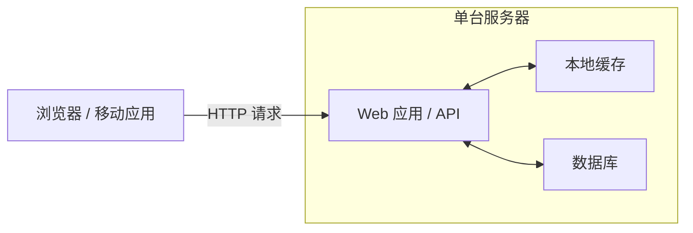

它适合原型、小流量服务和业务验证，因为：

- 部署与调试路径短；
- 本地组件通信简单；
- 基础设施与运维成本低；
- 团队可以优先验证用户是否真的需要产品。

它的限制也很直接：所有资源共享同一台机器，任何一个组件过载都可能拖垮其他组件；机器故障会让整个系统不可用；各层无法独立扩容。

### 2.2 一次请求如何完成

原书依次描述了 DNS、IP、HTTP 和响应，流程如下：

1. 用户在浏览器或移动应用中访问域名，例如 `api.mysite.com`。
2. 客户端向 DNS 查询该域名对应的 IP 地址。DNS 通常由第三方托管，不运行在应用服务器内。
3. DNS 返回服务器 IP。
4. 客户端向该 IP 发出 HTTP 请求。
5. Web 服务器执行业务逻辑，必要时访问缓存或数据库。
6. 服务器返回 HTML 页面或 JSON 等响应，客户端据此渲染界面。

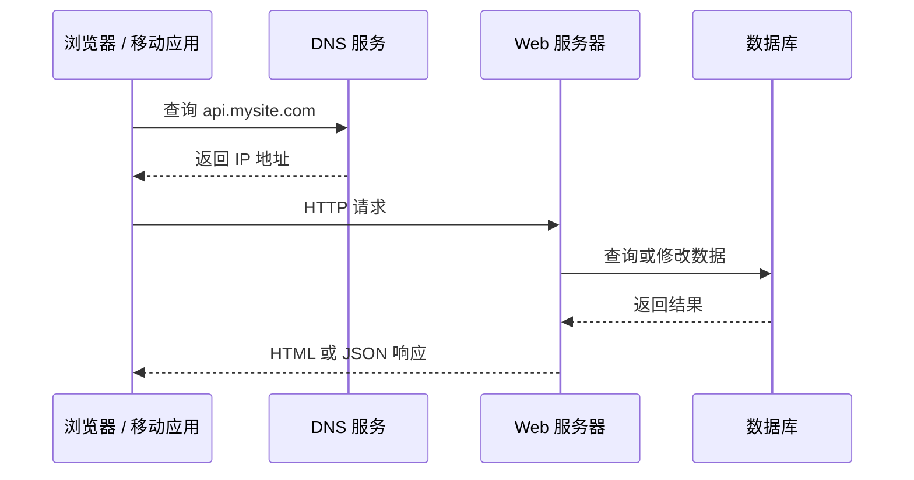

DNS 解决“名字如何找到网络地址”；HTTP 解决“客户端与服务器如何交换请求和响应”。两者职责不同，DNS 查询也不一定每次请求都发生，因为操作系统、浏览器和递归解析器会缓存结果。

### 2.3 Web 流量与移动端流量

原书把流量来源分为 Web 应用和移动应用：

- Web 应用通常由服务器端代码处理业务与存储，由 HTML、CSS、JavaScript 等客户端技术负责展示和交互。
- 移动应用也常通过 HTTP 访问服务端 API，并使用 JSON 交换结构化数据。

例如：

```http
GET /users/12 HTTP/1.1
Host: api.mysite.com
Accept: application/json
```

可能得到：

```json
{
  "id": 12,
  "name": "Ada"
}
```

这里的关键不是 JSON 比所有格式都优越，而是客户端与服务端通过稳定接口解耦。浏览器、iOS 和 Android 客户端可以共享同一业务 API；服务端也可以在不改变外部契约的前提下重构内部实现。

### 2.4 单机的第一个失效点

随着用户增加，单机通常会遇到两类问题：

1. **资源竞争**：Web 请求消耗 CPU，数据库占用内存和磁盘 I/O，一个层的高峰影响其他层。
2. **无法独立扩展**：即使只有数据库需要更大内存，也必须整体升级机器；即使只需增加 Web 处理能力，也无法单独增加 Web 实例。

因此，作者下一步不是马上引入所有分布式组件，而是先拆开最明显的两个职责：Web 层与数据层。

---

## 3. 分离数据库：让 Web 层与数据层独立扩展

### 3.1 为什么要把数据库移出 Web 服务器

当用户增长后，作者将系统拆为两台服务器：一台处理 Web/移动端流量，一台运行数据库。这个变化解决的是**资源与生命周期耦合**：

- Web 层偏 CPU、连接数和短时请求处理；
- 数据层偏内存、磁盘 I/O、持久性和数据恢复；
- 两层扩容方式不同；
- 两层故障和维护窗口也不同。


拆分后，Web 流量增长可以单独增加计算资源，数据量增长可以单独升级数据库。拆分并未自动带来高可用，因为每层仍只有一台服务器，但它建立了后续水平扩展所需的层次边界。

### 3.2 关系型数据库是什么

关系型数据库（RDBMS，也常称 SQL 数据库）把数据组织为具有模式的表、行和列，并可通过主键、外键和 `JOIN` 表达实体关系。典型产品包括 MySQL、PostgreSQL 和 Oracle Database。

它适合：

- 数据关系明确；
- 需要事务约束；
- 需要灵活查询和关联；
- 模式相对稳定；
- 团队重视成熟工具、生态和运维经验。

例如用户与订单可以分别存放，通过用户 ID 关联：

```sql
SELECT users.name, orders.total
FROM users
JOIN orders ON users.id = orders.user_id
WHERE users.id = 12;
```

关系型数据库的价值不只是“有表”，更在于事务、约束、查询优化器和成熟的恢复机制。

### 3.3 非关系型数据库是什么

NoSQL 不是单一数据模型，而是一组不以传统关系表和跨表关联为核心的系统。原书列出四类：

| 类型 | 主要抽象 | 适合的访问模式 | 例子 |
|---|---|---|---|
| 键值存储 | `key -> value` | 已知键的高速读取 | DynamoDB、Redis |
| 文档存储 | JSON-like 文档 | 按文档读取、字段可演化 | MongoDB、CouchDB |
| 宽列/列族存储 | 分区键 + 排序列 | 大规模稀疏数据、范围读取 | Cassandra、HBase |
| 图数据库 | 点、边、属性 | 多跳关系遍历 | Neo4j |

原书概括说 NoSQL 通常不支持 `JOIN`。更准确地说，许多 NoSQL 系统不把跨实体、任意关联查询作为核心能力，应用往往要按访问模式预先组织或冗余数据；不同产品能力仍有差异。

### 3.4 如何在 SQL 与 NoSQL 之间选择

作者建议多数开发者优先考虑成熟的关系型数据库，只有在具体需求不匹配时再选择 NoSQL。原章列出的 NoSQL 倾向条件包括：

- 需要极低延迟；
- 数据缺乏固定结构或没有关系查询；
- 主要操作只是按键序列化和反序列化对象；
- 数据规模巨大。

这些条件是启发式而非充分条件。现代关系型数据库也能处理 JSON、分区和大规模数据，NoSQL 也不天然更快。真正应比较的是：

1. 核心读写模式是什么？
2. 是否需要跨记录事务和约束？
3. 查询是否必须灵活变化？
4. 数据如何分区，是否存在热点？
5. 延迟、吞吐、可用性和一致性目标是什么？
6. 团队能否可靠运维该系统？

**误区：SQL 与 NoSQL 不是互斥阵营。** 同一系统可以让交易数据进入关系库，让会话进入键值存储，让搜索索引进入搜索引擎。后文把部分非关系型功能迁入 NoSQL，正是在使用“按访问模式选择专用存储”的思想。

---

## 4. 垂直扩展与水平扩展

数据库分离后，作者引出两种基本扩容方式。

### 4.1 垂直扩展：让单机更强

垂直扩展（scale up）是给现有服务器增加 CPU、内存、磁盘或网络能力。

优点：

- 架构变化小；
- 应用通常无需理解分片或分布式协调；
- 小流量阶段最简单、最快；
- 单机事务和查询仍然容易。

局限：

- 硬件存在上限；
- 高端机器价格通常非线性上升；
- 单机仍可能是单点故障；
- 升级过程可能需要停机；
- 无法仅靠“机器更强”获得跨故障域冗余。

### 4.2 水平扩展：增加更多机器

水平扩展（scale out）是把负载分给更多服务器。

若有 $N$ 台同等服务器，每台在目标延迟下最多处理 $q$ 个请求/秒，理想总吞吐为：

$$
Q_{ideal}=Nq
$$

现实中还存在负载不均、共享资源、协调和复制开销，可用效率系数 $0<\eta\le1$ 表示：

$$
Q_{actual}=\eta Nq
$$

$\eta$ 越接近 1，横向扩展越接近线性。若所有节点仍争用同一个数据库、锁或网络出口，增加 Web 服务器并不会线性增加端到端吞吐，瓶颈只是向下游转移。

### 4.3 两者不是非此即彼

大型系统通常同时使用两者：

- 先选择合理规格的单机，避免过早分布式化；
- 到达单机经济或容量边界后水平扩展；
- 水平集群中的单个节点仍可能按工作负载升级；
- 数据库在分片前往往也会先做硬件升级和查询优化。

作者强调大型应用更偏向水平扩展，因为它能突破单机上限并提供冗余。下一节先对最容易横向扩展的 Web 层动手。

---

## 5. 负载均衡：扩展 Web 层并消除服务器单点

### 5.1 原架构的问题

用户直接连接唯一 Web 服务器会产生两个问题：

- 服务器离线时，服务整体不可用；
- 流量超过单机能力时，请求变慢或连接失败。

单纯再启动一台服务器还不够，客户端需要一个稳定入口来选择健康实例，这就是负载均衡器（load balancer）的职责。

### 5.2 负载均衡器是什么

负载均衡器接收外部流量，再把请求分配到后端服务器池：

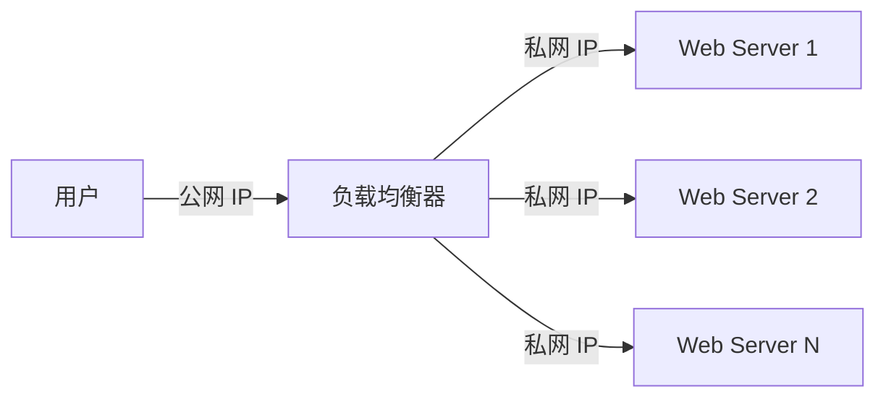

原书让用户只访问负载均衡器的公网 IP，后端服务器使用仅在内部网络可达的私网 IP。这样做的关系是：

- 负载均衡器提供稳定外部入口；
- 后端节点可动态增加、删除或替换；
- 客户端不直接接触后端地址，攻击面更小；
- 健康检查可以把故障节点移出服务池。

私网 IP 并不自动等于安全，还需要网络访问控制、身份认证、补丁和最小权限等措施。

### 5.3 它如何同时处理故障与容量

若 Server 1 故障：

1. 健康检查发现异常；
2. 负载均衡器停止向它发送新请求；
3. 流量转移到其他健康节点；
4. 自动化系统补充新实例，恢复容量余量。

若整体流量增长，只要 Web 层能够横向扩展，就可向服务器池增加节点。负载均衡器因此解决了“客户端如何找到当前健康计算资源”的问题。

### 5.4 常见分配策略及边界

原章未展开算法，但理解其选择有助于掌握机制：

| 策略 | 直觉 | 适用与局限 |
|---|---|---|
| 轮询 | 依次分给每台服务器 | 节点同质、请求成本接近时简单有效 |
| 加权轮询 | 强节点获得更多请求 | 适合节点规格不同 |
| 最少连接 | 发给当前连接较少的节点 | 长连接或请求时长差异较大时更合理 |
| 一致性哈希 | 同一键尽量落到同一节点 | 有局部状态或缓存亲和性时有用，但会增加热点风险 |

负载均衡并不保证高可用：若它自身只有一个实例，就把单点从 Web 服务器上移到了负载均衡器。生产系统通常让负载均衡层本身冗余，或使用云厂商托管的高可用服务。

### 5.5 新瓶颈转移到数据层

Web 层有多台服务器后，计算入口具备了冗余，但所有节点仍访问同一个数据库。该数据库同时承担全部读写，并且故障时没有替代者。因此作者下一步引入数据库复制。

---

## 6. 数据库复制：提高读性能、可靠性与可用性

### 6.1 复制模型

原书使用一主多从模型：主库处理数据修改，从库复制主库数据并承担读取。用现代术语可表示为 leader/follower：

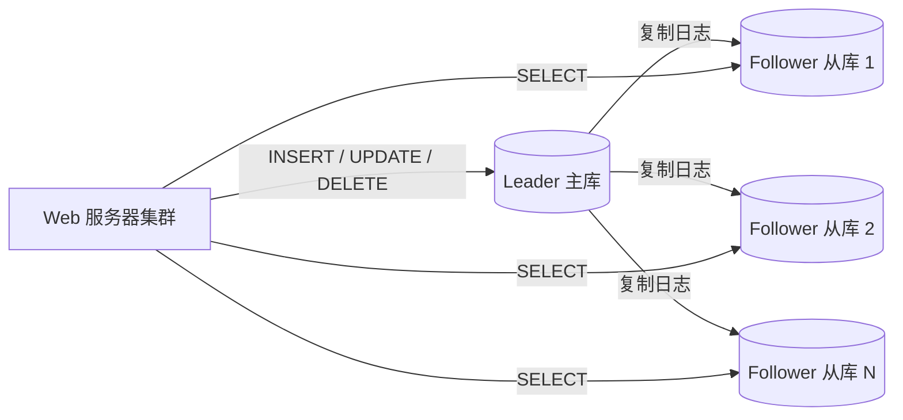

典型请求路径变为：

1. 用户通过 DNS 获得负载均衡器地址；
2. 请求被分给某台 Web 服务器；
3. 读取请求访问从库；
4. 写入、更新和删除访问主库；
5. 主库将变化复制到从库。

许多互联网应用读多写少，因此可以增加从库分散读取。复制并不能同样扩展单主写入吞吐，所有写入仍经过主库。

### 6.2 性能、可靠性与可用性的区别

原书列出复制的三个收益，它们容易混淆：

- **性能（performance）**：多个从库并行处理读取，降低单库压力并增加读吞吐。
- **可靠性（reliability/durability）**：多个位置保存数据副本，单台机器损坏不一定导致数据永久丢失。
- **可用性（availability）**：某个数据库实例离线时，系统仍能通过其他副本提供服务。

数据有副本不代表一定高可用。如果故障切换需要人工数小时，数据可靠但服务恢复慢；系统可以很快切到旧副本而保持在线，却丢失最新写入，此时可用性高但恢复点较差。

常用的两个恢复目标可以帮助理解：

- **RPO（Recovery Point Objective）**：最多允许丢失多新的数据；
- **RTO（Recovery Time Objective）**：故障后最多允许多久恢复服务。

异步复制通常降低正常写延迟，但主库突然故障时可能丢失尚未复制的数据，即 RPO 不一定为 0；同步复制能改善 RPO，却增加写延迟，并可能在副本不可达时影响可用性。

### 6.3 从库故障如何处理

若只有一个从库且它离线：

- 读取可以暂时回到主库；
- 新从库从现有数据快照和复制日志重建；
- 重建完成后再恢复读写分离。

若有多个从库：

- 读取转移到其他健康从库；
- 后台补充新副本。

此时要注意容量余量。若平时每个从库已接近满载，少一个副本后剩余节点可能被流量压垮，形成级联故障。冗余不仅要求“有多个实例”，还要求故障后剩余容量足以承载流量。

### 6.4 主库故障为什么更复杂

原书说明可以把一个从库提升为新主库，再创建新从库。但生产故障切换还要回答：

1. 如何确认旧主库真的失效，而不是仅与部分节点网络隔离？
2. 哪个从库数据最新？
3. 尚未复制的写入如何恢复？
4. 如何防止旧主库恢复后继续接受写入，产生双主（split brain）？
5. 应用如何发现新主库地址？

安全切换通常需要租约、共识、仲裁、fencing token 或托管数据库控制面等机制。原章只建立高层直觉，并明确多主、环形复制等更复杂模式超出范围。

### 6.5 复制延迟与“读己之写”

在异步复制中，写入主库后，从库可能稍后才看到更新。如果用户刚修改昵称，下一次请求却从滞后的从库读取，就可能看到旧值。

常见缓解方法包括：

- 修改后的短时间内让该用户读主库；
- 使用带版本号或时间戳的会话一致性；
- 对关键读取使用同步副本；
- 接受最终一致性，并在产品交互中说明处理中状态。

这说明复制不是免费的数据拷贝，而是把单点问题转换成了**副本一致性和故障协调问题**。

### 6.6 为什么下一步是缓存与 CDN

数据库复制改善了读扩展和容错，但重复查询仍然要访问数据库，静态资源也仍由 Web 服务器远距离传输。于是作者分别从“动态数据重复读取”和“静态资源传输”两条路径降低延迟与源站压力。

---

## 7. 缓存层：用空间换时间，减少重复工作

### 7.1 缓存是什么，为什么有效

缓存把昂贵计算结果或高频数据临时放在更快的存储中，后续请求直接复用。常见缓存使用内存，因此读取延迟远低于磁盘数据库。

缓存有效依赖两个局部性假设：

- **时间局部性**：刚访问的数据近期可能再次访问；
- **热点分布**：少量对象承担大量访问。

若所有请求都读取从未重复的新对象，缓存命中率会很低；若数据频繁修改，维护缓存新鲜度的成本也可能抵消收益。

### 7.2 独立缓存层的三个收益

作者把缓存做成独立层，而不是仅使用 Web 进程本地内存：

1. 数据读取更快，降低响应延迟；
2. 相同查询不必反复打到数据库，降低数据层负载；
3. 缓存容量与吞吐可以独立扩展。

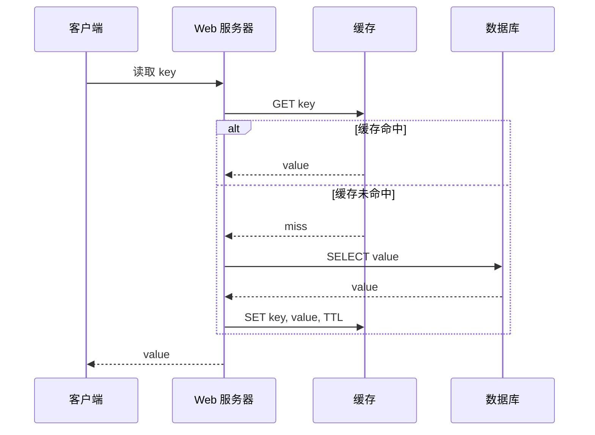

### 7.3 原书所述流程更准确地叫 cache-aside

原书把“应用先查缓存，未命中时查数据库并写入缓存”的流程称作 read-through cache。工程术语中通常有更细的区别：

- **Cache-aside（旁路缓存）**：应用显式读取缓存；未命中时应用读取数据库并回填缓存。
- **Read-through（读穿）**：应用只向缓存请求，缓存组件或其加载器负责从数据库加载。

原图描述的控制权在 Web 应用，因此更接近 cache-aside。两者都表现为“命中直接返回，未命中访问后端”，但负责回源的组件不同。阅读原章时应理解其核心意图，不必把术语差异误认为不同的性能原理。

缓存伪代码如下：

```text
function get_user(user_id):
    key = "user:" + user_id
    value = cache.get(key)
    if value exists:
        return value

    value = database.query_user(user_id)
    if value exists:
        cache.set(key, value, ttl)
    return value
```

它与原理的对应关系是：第一次读取承担数据库成本并建立副本，后续读取在 TTL 内复用副本。

### 7.4 命中率如何影响平均延迟

设：

- $h$：缓存命中率；
- $L_c$：缓存查询延迟；
- $L_d$：数据库查询延迟；
- $L_w$：未命中后回填缓存的延迟。

简化的平均读取延迟为：

$$
E[L]=hL_c+(1-h)(L_c+L_d+L_w)
$$

若 $L_c=1\text{ ms}$、$L_d=20\text{ ms}$、$L_w=1\text{ ms}$：

- 命中率 90% 时，$E[L]=0.9\times1+0.1\times22=3.1\text{ ms}$；
- 命中率 50% 时，$E[L]=0.5\times1+0.5\times22=11.5\text{ ms}$。

高命中率不仅降低延迟，还降低数据库 QPS。若总读流量为 $Q$，忽略预热等因素，数据库承受的缓存未命中流量约为：

$$
Q_{DB}\approx(1-h)Q
$$

这说明“加入缓存”本身不是目标，**命中率、未命中成本和失效行为**才决定收益。

### 7.5 什么数据适合缓存

原书建议缓存“读得多、改得少”的数据。判断时还应考虑：

- 读取是否昂贵或高频；
- 可否容忍短暂陈旧；
- 对象大小是否适合内存；
- 是否存在明显热点；
- 缓存丢失后能否从权威数据源重建。

缓存通常不是持久化真相来源。内存缓存重启后可能丢失数据，因此关键数据仍应存入持久数据库。把缓存当数据库使用，除非产品明确提供持久化、复制和恢复保证，否则会把性能优化变成数据丢失风险。

### 7.6 TTL：新鲜度与回源压力的权衡

TTL（Time to Live）规定对象可在缓存中保留多久：

- TTL 太短：对象频繁过期，命中率下降，数据库反复加载；
- TTL 太长：陈旧数据存在更久，修改和删除难以及时生效；
- 没有过期：冷数据持续占内存，也难以兜底修复失效遗漏。

TTL 应根据数据更新频率、陈旧容忍度和回源成本选择，而不是全局使用一个数字。用户权限、价格和普通内容列表的陈旧风险显然不同。

### 7.7 缓存与数据库一致性

数据库和缓存不是同一个事务域时，更新两者可能部分失败。常见 cache-aside 写路径是：

1. 更新数据库；
2. 删除缓存；
3. 下一次读取从数据库回填新值。

删除通常比直接更新缓存更稳妥，因为并发写入时，旧请求可能最后完成缓存写入。但这仍有竞态：数据库更新后、缓存删除前可能有请求读到旧值；删除失败时旧值会保留到 TTL。

需要根据业务选择：

- 允许短暂最终一致；
- 重试失效操作；
- 使用消息或变更数据捕获异步失效；
- 对关键数据绕过缓存或使用版本校验；
- 使用 TTL 作为最终兜底，而不是唯一一致性机制。

多地域环境中，每个区域都可能有缓存副本，失效消息传播和网络分区会使问题更复杂。

### 7.8 缓存故障与单点

只有一个缓存节点时，它会成为单点故障。即使缓存数据可重建，缓存宕机也可能让所有流量突然回到数据库，形成**缓存雪崩**。

原书建议：

- 部署多个缓存服务器，必要时跨故障域；
- 预留一定内存余量，应对增长和节点故障后的迁移。

进一步常见措施包括：

- TTL 加随机抖动，避免大量键同时过期；
- 对热点键使用请求合并，避免同一时刻重复回源；
- 对不存在的数据短暂负缓存，缓解缓存穿透；
- 数据库限流与熔断，防止缓存故障拖垮权威存储。

### 7.9 淘汰策略：容量满时删除谁

缓存容量有限，写入新对象时可能需要删除旧对象：

| 策略 | 规则 | 优点 | 局限 |
|---|---|---|---|
| LRU | 淘汰最久未使用的对象 | 利用时间局部性，通用性强 | 扫描流量可能污染缓存 |
| LFU | 淘汰访问频率最低的对象 | 能保留长期热点 | 需维护频率，旧热点可能迟迟不降温 |
| FIFO | 淘汰最早进入的对象 | 实现简单 | 不考虑对象是否仍然热门 |

策略应与访问分布匹配。原书称 LRU 最流行，但并不表示它对所有业务最优。

---

## 8. CDN：把静态内容放到离用户更近的位置

### 8.1 CDN 与应用缓存解决的问题不同

CDN（Content Delivery Network）是一组地理分布的边缘服务器，用于缓存和交付图片、视频、CSS、JavaScript 等内容。

- 应用缓存主要减少后端计算和数据库读取；
- CDN 主要减少用户到内容的网络距离，并降低源站出口流量；
- 两者都利用缓存，但位置、对象和失效方式不同。

原章聚焦静态内容。现代 CDN 也能依据路径、查询参数、Cookie 或请求头缓存动态响应，但个性化、鉴权和缓存键设计会显著增加复杂度。

### 8.2 CDN 回源与命中流程

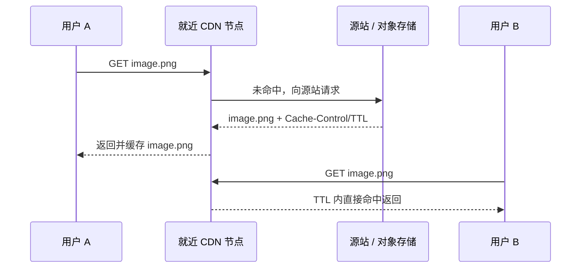

原书的六步流程可以归纳为：

1. 用户通过 CDN 域名请求对象；
2. 边缘节点检查本地缓存；
3. 未命中时向源站或对象存储回源；
4. 源站返回对象与可选 TTL；
5. 边缘节点缓存并返回对象；
6. 后续附近用户在 TTL 内直接命中。

用户到边缘节点的物理距离和网络路径通常更短，因此往返时间降低。与此同时，同一对象只需偶尔回源，源站带宽和请求压力下降。

### 8.3 CDN 的成本与缓存选择

CDN 通常按请求和流量收费。低频对象放入 CDN 可能几乎没有命中收益，却仍增加传输与管理成本。因此应观察：

- 边缘命中率；
- 回源请求和回源流量；
- 各地区延迟；
- 单对象大小与受欢迎程度；
- CDN 成本相对源站带宽和计算节省。

### 8.4 CDN 过期时间

与应用缓存相同，过期时间存在两难：

- 太长：用户长时间看到旧内容；
- 太短：边缘节点频繁回源，失去缓存价值。

带内容哈希或版本号的不可变静态文件可设置很长 TTL。例如：

```text
/assets/app.4f12c9.js
/images/logo.png?v=2
```

文件内容变化时生成新 URL，而不是等待旧对象过期。这种**版本化失效**把“同一 URL 的内容何时更新”转换成“新内容使用新地址”，逻辑更简单，也允许积极缓存。

### 8.5 主动失效与降级

原书给出两种提前失效方式：

- 调用 CDN 厂商 API 清除对象；
- 使用新版本 URL。

还必须考虑 CDN 故障：客户端或 DNS 能否切换到源站，源站是否有足够容量承受回退流量，回退是否绕过必要的安全控制。降级路径若从未演练，故障时可能并不可靠。

### 8.6 加入缓存与 CDN 后的架构变化

至此，请求被分流为两类：

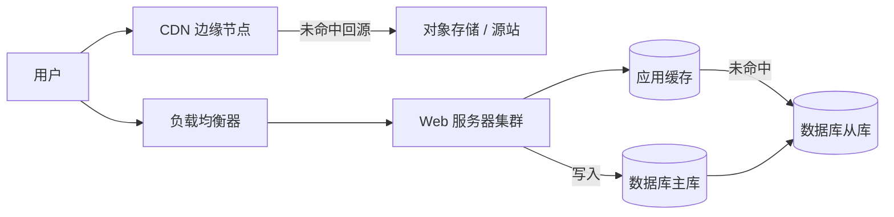

静态资源不再占用 Web 服务器带宽；动态热点数据优先从缓存获取；数据库主要承担未命中读取和权威写入。下一问题是：Web 服务器虽然有多个，但如果会话还保存在本机，请求仍不能任意路由。

---

## 9. 无状态 Web 层：解除用户与服务器的绑定

### 9.1 什么是服务器端状态

状态是跨请求需要保留的信息，例如：

- 登录会话；
- 购物车；
- 工作流进度；
- 用户上传中的临时信息。

“无状态 Web 服务器”不是系统完全没有状态，而是**Web 计算节点不在本地保存下一次请求必须依赖的会话状态**。状态仍然存在，只是被移到所有节点都可访问的外部存储，或被编码在经过签名的客户端令牌中。

### 9.2 有状态架构为何阻碍扩展

原书示例中，用户 A 的会话在 Server 1，用户 B 的会话在 Server 2。A 的后续请求若到 Server 2，认证就会失败。因此负载均衡器必须使用 sticky session（会话粘滞）把同一用户持续路由到同一节点。

问题包括：

- 节点故障时，本地会话丢失，用户被迫重新登录；
- 新增节点后，已有会话不会自然均衡过去；
- 某些用户负载更高时，粘滞会造成热点；
- 滚动发布和缩容必须等待会话排空或迁移；
- 自动扩缩容更难。

粘滞会话并非永远错误，它可以减少会话存储读取，也可用于某些长连接或局部缓存场景；但它不应成为关键状态唯一副本。

### 9.3 无状态架构如何工作

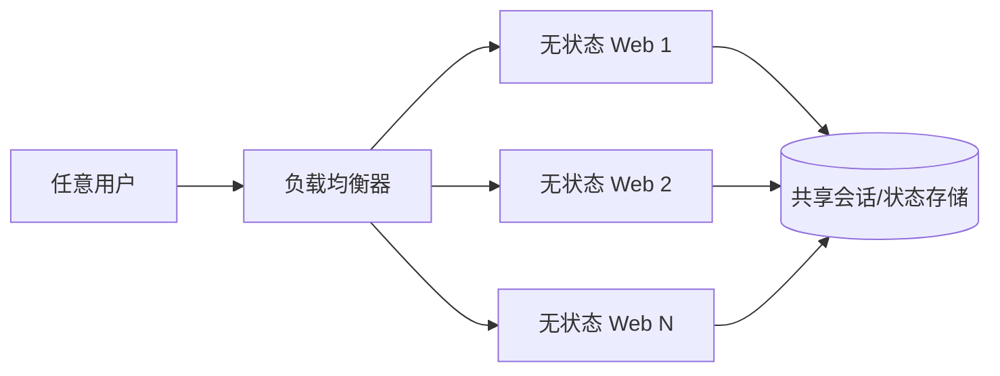

任意 Web 节点都可以：

1. 从请求中获得会话标识；
2. 到共享存储读取状态；
3. 完成业务处理；
4. 必要时更新共享状态。

原书提出关系库、NoSQL 或 Memcached/Redis 都可承载共享状态，并在示例中选择易水平扩展的 NoSQL。实际选择要看持久性、TTL、一致性、延迟和容量；缓存若没有足够持久性保证，不应保存无法重建的唯一会话数据。

### 9.4 为什么无状态利于自动扩缩容

新增 Web 节点无需迁移用户会话，只要注册进负载均衡池就能处理任意请求；缩容时停止分配新请求并等待在途请求结束即可。

简化的自动扩缩容策略可能是：

```text
if CPU > 65% for 5 minutes or request_queue is growing:
    add web instances
if CPU < 25% for 20 minutes and spare_capacity_is_safe:
    remove web instances gradually
```

实际不能只看 CPU。I/O 密集服务可能 CPU 很低却已耗尽连接池；应结合请求延迟、并发、队列长度、错误率和下游容量。缩容阈值与时间窗口还应留出滞后，避免负载在边界附近导致实例反复增删。

### 9.5 新的瓶颈：共享状态存储

无状态化让 Web 层容易扩容，却把会话压力集中到共享存储。该存储必须：

- 具备足够低的延迟和吞吐；
- 自身高可用并可扩展；
- 设置合理 TTL；
- 防止会话固定攻击与未授权访问；
- 在故障时定义用户体验。

这再次体现本章规律：消除一层的耦合，通常会把压力转移到新的共享依赖，后者也必须纳入容量与容错设计。

---

## 10. 多数据中心：降低全球延迟并容忍机房级故障

### 10.1 为什么单数据中心不够

当用户遍布全球，所有请求访问同一地区会遇到：

- 远距离网络往返延迟；
- 跨洲链路抖动和故障；
- 单个数据中心断电、断网或灾害导致整体不可用；
- 某些地区的数据驻留要求。

因此作者把系统扩展到多个数据中心，同时改善就近访问与故障隔离。

### 10.2 GeoDNS 与正常流量分配

GeoDNS 根据用户位置或网络信息返回不同数据中心的地址。原书用两个美国数据中心举例：正常时，$x\%$ 流量进入 US-East，$(100-x)\%$ 进入 US-West。

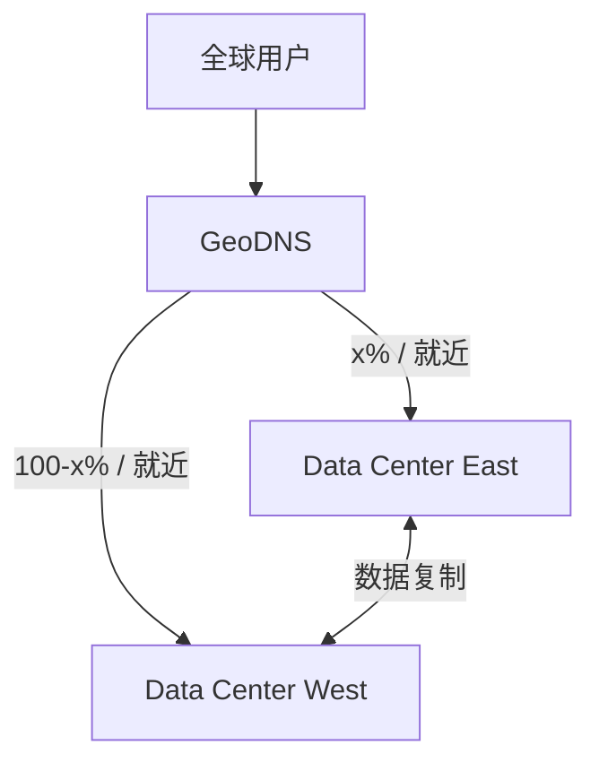

“就近”不一定只按地理距离，还可能参考网络拓扑、延迟、法规、容量和成本。DNS 记录有缓存和 TTL，因此故障切换也不一定瞬时传播到所有客户端。

### 10.3 数据中心故障转移的容量条件

若 West 故障，原书把 100% 流量转向 East。这个动作成立有一个常被忽略的前提：East 必须有能力接管 West 的流量。

设两个中心正常各承担总流量的一半，每个中心容量为总峰值的 60%。正常时余量充足，但任一中心故障后，另一中心无法承载 100%。若目标是无降级接管，单中心容量至少要覆盖故障时的目标流量，或系统必须能快速扩容并启用限流、降级。

这也是为什么“部署两个数据中心”不自动等于能容忍一个数据中心故障。

### 10.4 挑战一：流量重定向

需要能够：

- 根据位置把用户送到合理区域；
- 根据健康状态停止向故障区域分配流量；
- 控制切换速度，避免 DNS 缓存拖延；
- 防止误判造成大规模来回切换；
- 在剩余区域容量不足时进行限流或功能降级。

GeoDNS 是一种工具，全球负载均衡、Anycast、客户端重试和流量管理平台也可参与，但每种机制都有传播与失败边界。

### 10.5 挑战二：数据同步

若两个数据中心各有本地数据库和缓存，用户在 East 写入的数据必须在故障时能从 West 访问。常见方案是跨中心复制。

关键权衡是：

- **同步跨地域写入**：数据更一致、RPO 更好，但每次写入承担广域网延迟，并受远端故障影响；
- **异步跨地域复制**：本地写入快，区域相对独立，但存在复制延迟与冲突；
- **单主区域**：写入顺序简单，但远端写入延迟高，主区域故障切换复杂；
- **多主区域**：各地写入快，但同一数据并发修改时必须检测和解决冲突。

缓存也要考虑失效传播。故障流量进入另一区域时，目标区域可能既缺数据又是冷缓存，产生延迟与数据库负载双重尖峰。

### 10.6 挑战三：测试与部署一致性

多数据中心增加了环境组合：

- 不同地区是否运行同一版本？
- 配置、密钥和数据库模式是否一致？
- 单区域、跨区域网络或复制失败是否演练过？
- 发布是否能逐区域进行并快速回滚？
- 监控能否区分局部故障和全局故障？

原书强调自动化部署以保持各中心一致，并要求从不同地理位置测试。只在主中心验证成功，不能证明故障切换路径可用。

### 10.7 多数据中心与多可用区不要混淆

- **多可用区**通常位于同一地域，网络延迟较低，主要隔离机房级电力和网络故障；
- **多地域/多数据中心**距离更远，可处理地域级灾害并服务全球用户，但复制延迟和运维复杂度更高。

容灾设计必须先说明要防御哪一层故障，再决定副本距离和切换方式。

---

## 11. 消息队列：解耦组件并吸收流量波动

### 11.1 为什么同步调用会限制扩展

如果 Web 服务器收到图片后同步完成裁剪、锐化和模糊处理：

- 用户请求必须等待耗时任务结束；
- Web 服务器在任务期间占用线程和连接；
- 图片处理服务故障会直接导致上传失败；
- Web 层和处理层必须按相同节奏扩容。

这些任务不需要在 HTTP 响应前全部完成，因此作者引入消息队列，把“接受任务”与“执行任务”分开。

### 11.2 队列的角色

消息队列在生产者和消费者之间保存消息：

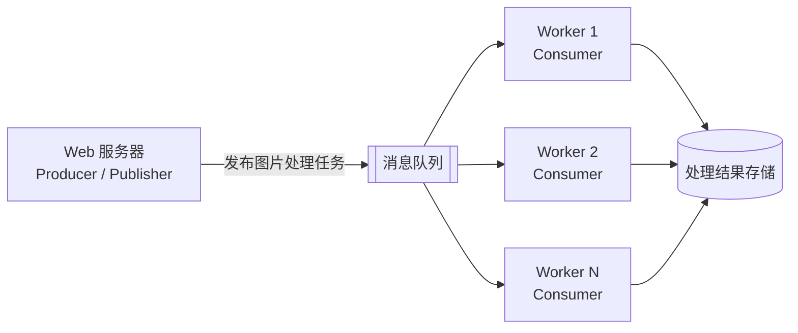

- 生产者创建消息并发布；
- 队列持久保存或缓冲待处理任务；
- 消费者拉取或接收消息并执行工作；
- 生产者和消费者可以独立扩容与短暂离线。

原书将队列描述为存储在内存中的持久组件。更准确地说，不同队列产品可能同时使用内存、磁盘和副本；“durable” 是否成立取决于消息持久化、确认、复制和保留配置，不能由“使用队列”自动保证。

### 11.3 解耦体现在哪里

加入队列后：

- 消费者暂时不可用时，生产者仍可接受任务并写入队列；
- 生产者暂时离线时，消费者仍可处理已积压任务；
- 图片处理 Worker 可按队列积压独立扩容；
- Web 层只需遵守消息契约，不必知道具体哪个 Worker 执行。

这是一种**时间解耦**和**容量解耦**。但它没有消除依赖，只是把直接同步依赖变成了消息格式、队列可用性和处理语义依赖。

### 11.4 队列如何削峰，而不是消灭工作量

设生产速率为 $\lambda$ 条/秒，消费速率为 $\mu$ 条/秒：

- $\lambda<\mu$：长期看消费者能追上，队列会回落；
- $\lambda=\mu$：没有应对波动的余量；
- $\lambda>\mu$：积压持续增长，最终耗尽保留空间或超过时延目标。

在一段持续 $t$ 秒的突发中，简化积压量为：

$$
B(t)=\max(0,(\lambda-\mu)t)
$$

若生产 1000 个任务/秒，Worker 总共处理 700 个/秒，突发持续 10 分钟：

$$
B=300\times600=180000\text{ 个任务}
$$

队列使 Web 请求不必立即失败，但 18 万个任务仍然需要处理。扩容决策不能只看 CPU，还应看队列长度、最老消息年龄和预计清空时间。

若每个 Worker 每秒处理 $r$ 个任务，希望在目标时间内维持消费速率 $\mu_{target}$，粗略所需 Worker 数为：

$$
N=\left\lceil\frac{\mu_{target}}{r}\right\rceil
$$

原书据此建议：队列变长时增加 Worker，长期为空时减少 Worker。

### 11.5 异步化引入的新问题

原章重点讲收益，但完整设计还需明确：

- **投递语义**：最多一次、至少一次，还是业务上追求恰好一次效果？
- **重复处理**：消费者处理成功但确认丢失时，消息可能再次出现；处理逻辑应幂等。
- **顺序**：全局顺序成本高，是否只需同一用户或同一对象内有序？
- **失败重试**：瞬时失败如何退避，永久失败何时进入死信队列？
- **积压与过期**：旧任务是否仍有业务价值？
- **背压**：消费者追不上时，是否限制生产者或降级功能？
- **消息模式演化**：新旧消费者如何兼容字段变化？

因此，消息队列适合可异步、可重试的工作，不适合所有同步查询。用户登录校验等必须即时返回的路径，不能仅为了“解耦”就无条件异步化。

---

## 12. 日志、指标与自动化：让大系统可观察、可操作

作者指出，小网站只有几台服务器时，这些能力只是良好实践；业务和系统规模扩大后，它们会变成必需品。原因不是工具更时髦，而是人工观察和操作无法随节点数线性扩展。

### 12.1 日志：回答具体事件发生了什么

日志记录离散事件，例如请求失败、依赖超时、权限拒绝和任务重试。多服务器环境中，应集中采集，以便统一搜索和关联。

高质量日志通常包含：

- 时间戳；
- 服务与实例；
- 请求 ID 或 trace ID；
- 用户/对象标识的安全形式；
- 错误类型与关键上下文；
- 延迟和结果状态。

日志不应记录密码、令牌或敏感个人数据。集中化也需要保留周期、采样、访问控制和成本管理。

### 12.2 指标：回答系统整体是否健康

指标是随时间聚合的数值序列，适合仪表盘、趋势和告警。原书分三层：

| 层次 | 示例 | 回答的问题 |
|---|---|---|
| 主机级 | CPU、内存、磁盘 I/O | 单个资源是否饱和？ |
| 聚合/服务级 | 数据库层 QPS、缓存命中率、P99 延迟 | 某一层整体是否健康？ |
| 业务级 | 日活、留存、收入 | 技术系统是否仍在交付业务价值？ |

仅看平均值容易隐藏尾延迟和局部故障。常见服务健康指标可归纳为：

- 流量（traffic）；
- 延迟（latency），尤其 P95/P99；
- 错误（errors）；
- 饱和度（saturation）。

例如缓存平均延迟正常，但命中率骤降会把压力转移到数据库；业务指标“下单成功数”下降，可能比 CPU 告警更快揭示用户影响。

### 12.3 日志、指标和追踪不要混淆

- **日志**适合查看某个具体事件的上下文；
- **指标**适合观察整体趋势并触发告警；
- **分布式追踪**适合跟随一次请求经过多个服务，定位延迟在哪一跳产生。

原章主要列出日志与指标，现代微服务通常还需追踪。三者互补，不能用无限量日志替代结构化指标。

### 12.4 自动化：把重复、易错操作变成可验证流程

原书强调持续集成（CI）以及构建、测试、部署自动化：每次代码提交通过自动检查，尽早发现错误。

规模增长后，自动化还可包括：

- 基础设施配置；
- 实例扩缩容与故障替换；
- 数据库迁移；
- 分批发布、金丝雀和回滚；
- 证书与密钥轮换；
- 备份恢复演练；
- 容量预测和告警响应。

自动化的本质不是“少点几次按钮”，而是让操作可重复、可审计、可测试，并减少不同服务器和数据中心之间的配置漂移。

### 12.5 可观测性如何支撑本章的迭代方法

没有观测，就无法知道下一个瓶颈在哪里：


因此，日志、指标和自动化不是架构完成后的附件，而是“持续精化”能够成立的反馈系统。

---

## 13. 数据库扩展：从升级单机到数据分片

随着数据每天增长，复制和缓存仍无法解决主库的容量与写吞吐上限。作者最后把注意力转回数据层。

### 13.1 数据库垂直扩展

数据库垂直扩展是给单机增加 CPU、内存和磁盘。原书以当时可获得 24 TB 内存的高配实例，以及 2013 年 Stack Overflow 在千万级月独立访客下仍使用单主库为例，说明强大单机可以走得很远。

这些例子要正确理解：

- 用户数不能直接推导数据库规模；
- 良好索引、查询优化、缓存和读副本能显著延长单库寿命；
- 先把单库用好，常比过早分片更经济；
- 原书给出的硬件和网站数字具有历史时点，不应作为今天的固定容量基准。

垂直扩展最终仍受三项限制：硬件上限、单点风险和高端设备成本。

### 13.2 水平扩展：分片是什么

分片（sharding）把一个大数据库拆成多个较小数据库。各分片通常有相同模式，但保存互不相同的数据子集。

原书以 `user_id % 4` 为路由函数：

$$
shard(user\_id)=user\_id\bmod4
$$

- 结果 0 进入 Shard 0；
- 结果 1 进入 Shard 1；
- 结果 2 进入 Shard 2；
- 结果 3 进入 Shard 3。

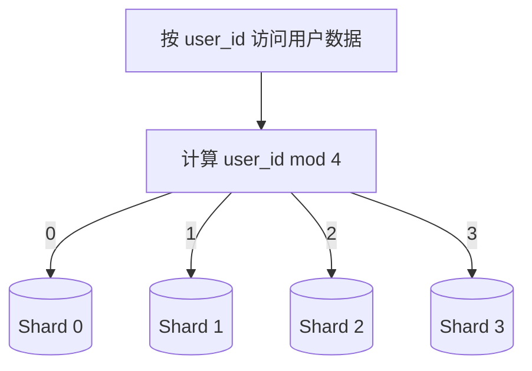

分片带来两种水平扩展：

- 数据容量分散到多台机器；
- 针对不同分片的读写可并行执行。

它与复制不同：

- **复制**保存同一份数据的多个副本，主要提高读取能力和容错；
- **分片**保存不同数据子集，主要提高总容量和总吞吐；
- 生产系统通常“先分片，再让每个分片拥有副本”。

### 13.3 分片键为何是最重要的选择

分片键（partition key）由一个或多个字段构成，决定数据放到哪个分片。好键需要兼顾：

1. **分布均匀**：数据量和请求量不要集中在少数分片；
2. **路由明确**：常见查询能根据键直接找到目标分片；
3. **稳定性**：键值不应频繁改变，否则数据不断迁移；
4. **局部性**：经常一起访问的数据尽量位于同一分片；
5. **可扩展性**：增加分片时迁移成本可控。

“数据条数均匀”不代表“负载均匀”。每个分片各有 25% 用户，但某个分片恰好包含多个名人账号，读流量仍可能远高于其他分片。

### 13.4 可运行示例：观察取模分片与热点

下面的 Python 代码只使用标准库，可观察均匀 ID 在四个分片的分布，以及热点请求如何破坏负载均衡：

```python
from collections import Counter

def shard_for(user_id: int, shard_count: int) -> int:
    """对应原书的 user_id % N 路由。"""
    return user_id % shard_count

shard_count = 4

# 1 万个连续用户的数据条数分布很均匀。
data_distribution = Counter(
    shard_for(user_id, shard_count) for user_id in range(10_000)
)

# 普通用户各访问一次，但 user_id=42 的热点用户额外被访问 20 万次。
requests = list(range(10_000)) + [42] * 200_000
traffic_distribution = Counter(
    shard_for(user_id, shard_count) for user_id in requests
)

print("data:", dict(sorted(data_distribution.items())))
print("traffic:", dict(sorted(traffic_distribution.items())))
```

预期输出：

```text
data: {0: 2500, 1: 2500, 2: 2500, 3: 2500}
traffic: {0: 2500, 1: 2500, 2: 202500, 3: 2500}
```

代码说明：

- 连续 ID 对 4 取模，数据条数完全均匀；
- `42 % 4 = 2`，所以热点用户的 20 万次请求都进入 Shard 2；
- 这证明分片键必须根据**访问频率**而不仅是记录数量评估。

### 13.5 挑战一：重新分片

原书给出两个触发条件：

- 某个分片因数据增长无法继续容纳；
- 数据或流量分布不均，某些分片更早耗尽。

简单取模在分片数变化时会迁移大量键。原本：

$$
shard_4(k)=k\bmod4
$$

增加到 5 个分片后：

$$
shard_5(k)=k\bmod5
$$

绝大多数键的结果会改变，需要移动大量数据，并在迁移期间处理双写、读取路由和一致性。作者预告第 5 章会用一致性哈希降低节点变化时的迁移范围。

一致性哈希不是“无需迁移”，也不自动解决热点；它主要减少成员变化时需要重新映射的键比例。

### 13.6 挑战二：名人/热点键问题

原书设想多个名人恰好落在同一分片，导致该分片读过载。解决方向包括：

- 为超热点实体配置专用分片；
- 把单个热点实体的数据进一步拆分；
- 使用多级缓存和 CDN 分散读取；
- 对热点数据建立只读副本；
- 在分片键中加入可控散列后缀，再在读取时聚合。

最后一种方法把一个逻辑键打散到多个物理分区，可提高写吞吐，但读取需要扇出查询并合并结果。所有热点方案都在“负载均匀”和“查询简单”之间做权衡。

### 13.7 挑战三：跨分片 JOIN 与事务

单库中的 `JOIN` 可以由数据库优化器完成；数据分布到多台服务器后，跨分片查询需要：

1. 向多个分片发送请求；
2. 等待最慢分片；
3. 在应用或中间层合并；
4. 处理某些分片失败或结果版本不一致。

原书提出反规范化（denormalization）：把读取所需字段冗余到同一记录或同一分片，避免跨分片 JOIN。

例如订单中冗余下单时的用户昵称，读取订单时无需访问用户分片。代价是昵称修改后，历史订单中的副本如何更新；系统需要接受快照语义、异步更新或维护变更传播。

反规范化不是取消数据模型，而是用额外存储和写入复杂度换取读取局部性。

### 13.8 分片的其他实践边界

原章未展开但设计时必须考虑：

- 全局唯一 ID 如何生成；
- 跨分片事务是否必要；
- 全局排序、分页和聚合如何执行；
- 每个分片如何复制和备份；
- 单个分片故障影响多少用户；
- 路由映射如何配置、缓存和更新；
- 迁移期间如何校验数据完整性。

因此，分片通常是单库优化、缓存、读副本等手段不足后的重大架构选择，而不是默认起点。

### 13.9 使用专用 NoSQL 分担非关系型访问

原书最终架构还把部分非关系型功能迁入 NoSQL，以降低关系库压力。这体现了 polyglot persistence（多模型持久化）：

- 关系库处理需要事务和关系约束的数据；
- 键值存储处理高频按键读取；
- 文档或宽列存储处理特定大规模访问模式；
- 对象存储保存图片和视频；
- 搜索引擎支持全文检索。

代价是数据会出现在多个系统中，需要明确每份数据的权威来源、同步方式、一致性预期和故障恢复流程。

---

## 14. 到达数百万用户后的总体架构

把原章的所有演进合并，可得到如下高层结构：

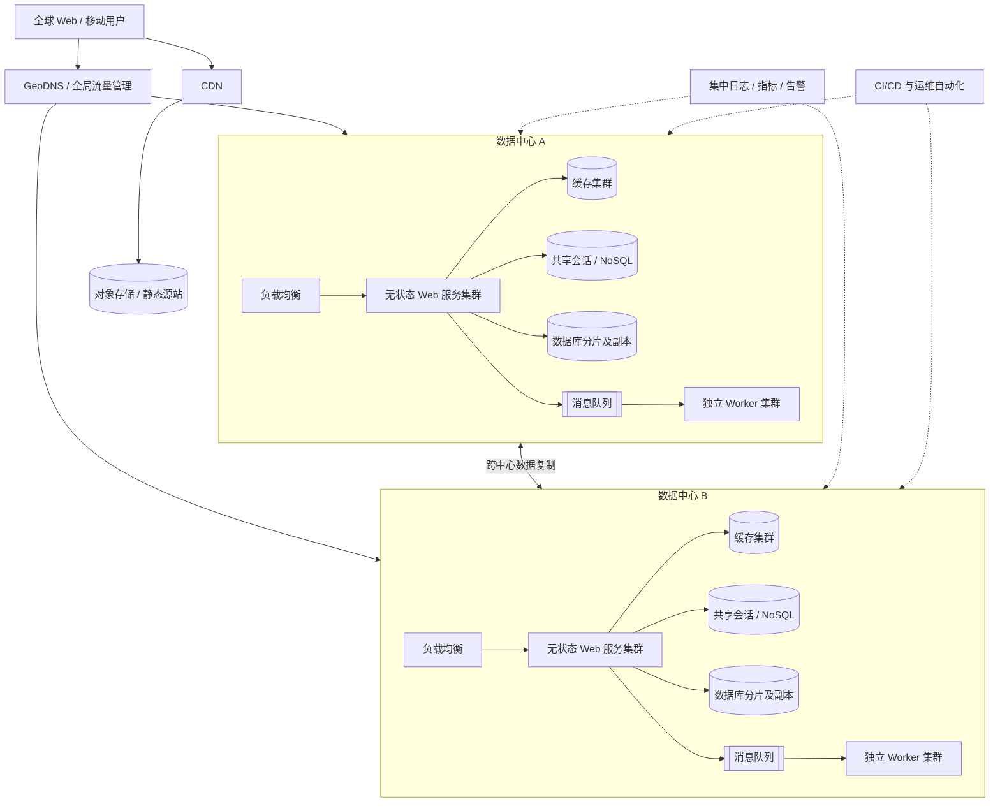

这张图不是要求所有系统都同时具备全部组件。它表达的是各职责边界：

- CDN 承担静态内容分发；
- 全局流量层选择数据中心；
- 区域负载均衡器选择无状态计算节点；
- 缓存吸收热点读取；
- 关系库与 NoSQL 按访问模式存储数据；
- 分片扩展容量，复制提供冗余；
- 队列连接异步生产者与 Worker；
- 可观测性和自动化形成运行反馈闭环。

### 14.1 原书的八条总结及其因果含义

原章最后给出八项原则。逐项还原如下：

1. **保持 Web 层无状态**：解除用户与单台服务器的绑定，使负载均衡、故障转移和自动扩缩容真正有效。
2. **每一层建立冗余**：避免单台 Web、数据库、缓存或机房成为整体单点，但同时要验证故障后的剩余容量。
3. **尽可能缓存数据**：对高频、可容忍陈旧的数据减少重复计算和数据库访问；“尽可能”不意味着无差别缓存。
4. **支持多个数据中心**：降低全球访问延迟并容忍区域故障，同时承担流量切换、数据同步和部署一致性的复杂度。
5. **静态资源托管到 CDN**：让内容就近交付，减少源站延迟和带宽压力。
6. **通过分片扩展数据层**：突破单数据库容量和写吞吐上限，但谨慎选择分片键并准备重新分片。
7. **把不同层拆为独立服务**：让职责、发布和扩容相对独立；拆分必须有明确边界，不能为了“微服务”而拆。
8. **监控系统并使用自动化工具**：用真实数据发现瓶颈，用可重复流程发布、扩容和恢复。

### 14.2 “数百万用户”之后仍需继续演进

作者明确说，超过数百万用户后仍要进一步优化和拆分。原因是：

- 用户行为与内容大小会变化；
- 热点可能突然出现；
- 单个服务会形成新瓶颈；
- 成本、合规和团队组织也会成为约束；
- 某些通用层需要按业务边界进一步拆分。

因此，最终架构不是终点，而是目前工作负载下的一组暂时合理决策。

---

## 15. 关键概念辨析与常见误区

### 15.1 “百万用户”与“百万并发”

注册用户、日活用户、同时在线用户和每秒请求数完全不同。架构容量必须基于具体负载和操作成本，不能把用户总数直接当作 QPS。

### 15.2 垂直扩展与水平扩展

- 垂直扩展增强一台机器，简单但有硬件和单点上限；
- 水平扩展增加机器，突破单机边界但引入协调、分布和故障复杂度；
- 实际系统通常先合理纵向扩展，再在必要层水平扩展。

### 15.3 复制与分片

- 复制：同一数据有多份，主要改善读取和容错；
- 分片：不同节点保存不同数据，主要改善总容量和吞吐；
- 复制不会自动扩展单主写入，分片也不会自动提供冗余。

### 15.4 可靠性、持久性与可用性

- 持久性关注已确认数据是否会丢失；
- 可靠性更广，关注系统在条件变化下能否持续正确工作；
- 可用性关注用户能否及时获得服务；
- 快速切到旧数据副本可能可用但损害数据完整性。

### 15.5 缓存与数据库

缓存是可重建的加速副本，数据库通常是权威数据源。缓存速度快不代表适合保存唯一关键数据；数据库也不意味着每次读取都应直达磁盘。

### 15.6 应用缓存与 CDN

- 应用缓存位于后端附近，主要缓存查询或计算结果；
- CDN 位于网络边缘，主要缓存可向用户直接交付的内容；
- 两者都需要命中率、TTL、失效与故障回退设计。

### 15.7 Stateful 与 stateless

无状态不是没有状态，而是计算节点不保存后续请求必须依赖的本地会话。状态被移到共享存储、客户端令牌或其他权威系统。

### 15.8 高可用与负载均衡

负载均衡只有在后端存在多个健康实例、负载均衡层自身冗余、健康检查正确且故障后容量足够时，才能支撑高可用。

### 15.9 数据冗余与备份

复制会把误删除、数据损坏或恶意修改迅速传播到副本。备份提供历史恢复点，不能被在线副本完全替代；副本也不能被仅离线备份替代，因为备份恢复通常较慢。

### 15.10 异步与更快

队列常让用户请求更快返回，但任务本身不一定更快完成。异步化改变的是等待关系和故障传播，需要明确完成通知、重试、积压和一致性。

### 15.11 解耦与没有依赖

消息队列解除了生产者对特定消费者在线状态和处理速度的直接依赖，但双方仍依赖消息模式、队列可用性和业务语义。解耦是改变依赖形式，不是消灭依赖。

### 15.12 反规范化与“随意重复数据”

反规范化是为明确读取模式主动增加冗余，并配套更新和一致性策略；没有权威来源和同步机制的任意复制只是数据混乱。

### 15.13 NoSQL 与无限扩展

NoSQL 产品仍有分区、热点、索引、事务和运维边界。选择 NoSQL 应由访问模式与目标驱动，而不是因为名称里含有“分布式”。

### 15.14 微服务与可扩展性

把代码拆成更多服务不自动提高吞吐。只有当边界允许独立扩容、独立发布、故障隔离或团队自治，并且收益大于网络与运维成本时，拆分才有价值。

### 15.15 “尽可能缓存”与“缓存一切”

原书总结中的“cache data as much as you can”应结合正文条件理解：读多写少、可重建、可容忍一定陈旧且有重复访问的数据才适合。权限、余额等高风险数据不能只为命中率牺牲正确性。

---

## 16. 本章知识结构

本章知识可以组织为五层：

### 16.1 请求与职责层

- DNS 把域名解析为网络地址；
- HTTP 连接客户端与 Web 服务；
- Web 层处理业务；
- 数据层保存权威状态；
- API 让不同客户端共享服务端能力。

### 16.2 计算扩展层

- Web 与数据库分离后可独立扩展；
- 负载均衡把请求分给多个实例；
- 无状态解除会话绑定；
- 自动扩缩容根据负载增减节点。

### 16.3 数据与性能层

- 复制增加副本、读吞吐与容错；
- 缓存复用热点数据；
- CDN 就近交付静态资源；
- 分片分散容量与写入；
- 多种数据库按访问模式协作。

### 16.4 解耦与容灾层

- 消息队列把同步工作变成异步任务；
- 多数据中心隔离地域故障；
- 冗余避免单点；
- 故障切换需要容量、数据和路由共同成立。

### 16.5 运行反馈层

- 日志解释具体事件；
- 指标反映整体健康；
- 自动化保证操作可重复；
- 观测结果驱动下一轮架构精化。

整体关系如下：

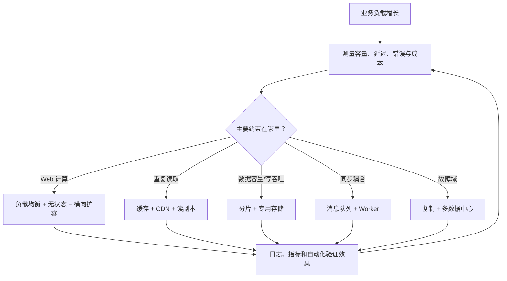

---

## 17. 核心结论与解决扩展问题的一般方法

### 17.1 核心结论

1. **扩展是迭代过程。** 不存在脱离工作负载的“百万用户标准架构”；先建立简单系统，再依据真实瓶颈演进。
2. **每个机制都对应一个主要问题。** 负载均衡解决计算节点选择，复制解决副本与读扩展，缓存解决重复读取，分片解决数据分布，队列解决时间和容量耦合。
3. **分离职责是独立扩展的前提。** Web 与数据、静态与动态、同步与异步、关系型与专用访问模式分离后，资源才能按不同速率增长。
4. **无状态是计算层弹性的关键。** 状态没有消失，而是进入可共享、可扩展、可恢复的数据层。
5. **冗余必须与故障域和容量一起设计。** 多一个实例不等于高可用；要保证故障检测、切换、数据完整性和剩余容量。
6. **性能优化会引入数据语义。** 缓存产生陈旧与失效，复制产生延迟，队列产生重复与顺序，分片产生跨分区查询和迁移。
7. **分片键决定数据层的长期形态。** 要同时考虑数据均匀、访问均匀、查询路由、局部性与重新分片。
8. **可观测性与自动化是扩展闭环。** 没有测量就无法找到瓶颈，没有自动化就难以可靠地操作大量节点与多个数据中心。
9. **简单性始终是设计目标。** 只有当收益被需求或瓶颈证明时，才值得承担新的分布式复杂度。

### 17.2 一般解题方法

面对“系统如何支撑下一数量级”的问题，可以按以下步骤推导：

#### 第一步：明确目标与工作负载

- 核心功能是什么？
- 日活、峰值 QPS、读写比、对象大小和保留期是多少？
- 延迟、可用性、持久性和成本目标是什么？
- 热点和突发流量如何分布？

#### 第二步：画出最简单的端到端路径

从客户端到计算、缓存、数据库或对象存储，确认读写路径闭合。不要先画与核心请求无关的基础设施。

#### 第三步：寻找第一个受限资源或故障点

检查 CPU、内存、磁盘、网络、连接、数据库写入、热点键、同步依赖与单点。瓶颈必须从规模或观测推导，而不是凭技术偏好猜测。

#### 第四步：选择最小的针对性机制

| 问题 | 优先考虑 |
|---|---|
| 单个计算节点过载 | 负载均衡、无状态、水平扩展 |
| 数据库读取过载 | 索引优化、缓存、读副本 |
| 静态内容延迟或源站带宽高 | CDN、对象存储 |
| 单库容量或写入到顶 | 分片、按访问模式拆存储 |
| 慢任务阻塞请求 | 消息队列、异步 Worker |
| 单实例/单机房故障 | 复制、冗余、多故障域 |
| 全球用户延迟高 | 多地域部署、就近路由 |
| 系统问题不可定位 | 日志、指标、追踪 |

#### 第五步：显式写出新代价

每引入一个机制，都追问：

- 新的权威数据源是谁？
- 一致性、顺序、重复和重试语义是什么？
- 新组件自身如何扩展和容错？
- 故障后剩余容量是否足够？
- 如何监控它是否有效？
- 若收益不足，能否回退？

#### 第六步：验证并继续迭代

用负载测试、故障演练、容量指标和业务指标验证改造。若瓶颈转移到下游，进入下一轮，而不是继续盲目扩展已经不再受限的层。

最终可把本章方法压缩成一句话：

$$
\boxed{
\text{从简单可行开始}
\rightarrow\text{用数据找到当前瓶颈}
\rightarrow\text{只增加能解决该瓶颈的机制}
\rightarrow\text{承担并管理它带来的新复杂度}
\rightarrow\text{持续验证与演进}
}
$$

这比记住一张“百万用户架构图”更重要。组件会变化，产品负载会变化，但由目标、瓶颈、机制、代价和验证组成的推理链可以迁移到几乎所有系统设计题。

### 17.3 章末自检

- [ ] 能否从 DNS 开始讲清一次请求的完整路径？
- [ ] 能否说明 Web 层与数据层为何要独立扩展？
- [ ] 能否区分 SQL/NoSQL、复制/分片、缓存/CDN？
- [ ] 能否说明负载均衡器和共享会话存储各自的职责？
- [ ] 能否解释异步复制下主库切换为何可能丢失最新数据？
- [ ] 能否用命中率推导缓存对数据库 QPS 和平均延迟的影响？
- [ ] 能否列出 TTL、缓存一致性、淘汰和缓存故障的权衡？
- [ ] 能否说明无状态并不等于没有状态？
- [ ] 能否解释多数据中心故障转移为何需要预留接管容量？
- [ ] 能否根据队列生产/消费速率判断积压是否持续增长？
- [ ] 能否解释好分片键为什么既要数据均匀，也要流量均匀？
- [ ] 能否为每个新增组件说清“触发问题、收益、代价和验证指标”？

若这些问题都能独立回答，就不只是记住了本章列出的扩展技术，而是掌握了作者真正要训练的能力：让架构复杂度随着已知问题逐步增长，并始终能解释每一步为什么发生。
