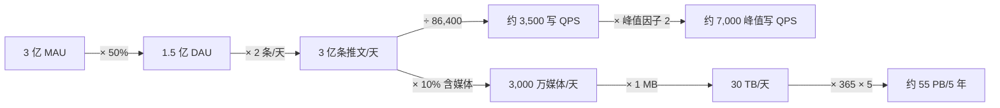
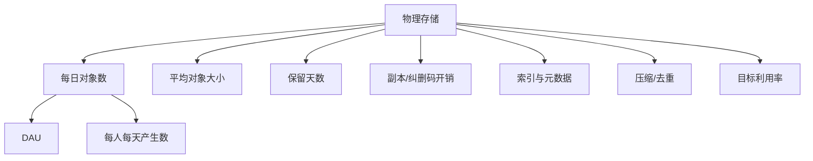
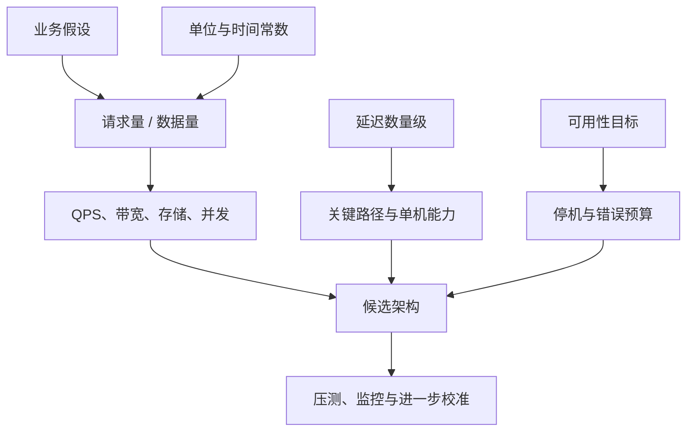

> 原书：Alex Xu，*System Design Interview: An Insider's Guide*（Second Edition）
> 原章：Chapter 2, *Back-of-the-Envelope Estimation*
> 本章主线：用少量明确假设、常见性能数量级和量纲分析，快速估算系统的吞吐、存储、延迟与可用性，判断候选架构是否可能满足需求。

## 0. 学习目标、边界与全章主线

“Back-of-the-envelope estimation”直译是“信封背面估算”，通常指**粗略估算、数量级估算或费米估算**：不追求小数点后的精确结果，而是通过思想实验、已知常数和简单算术，判断答案大约是 $10^3$、$10^6$ 还是 $10^9$。

本章很短，原书依次介绍：

1. 二的幂与数据单位；
2. 程序员应熟悉的延迟数量级；
3. 可用性与“几个 9”；
4. Twitter 发推 QPS 和媒体存储估算；
5. 面试中的估算技巧。

读完后，应当能够回答：

- 为什么系统设计需要粗略估算，而不是直接画架构图？
- bit、byte、KB、KiB、MB、MiB 之间有什么区别？
- 如何把用户数转换为平均 QPS、峰值 QPS、带宽和存储量？
- 为什么内存、SSD、磁盘寻道、同机房网络和跨洲网络必须按不同数量级看待？
- 延迟如何串行相加、并行取最大值，尾延迟又为什么重要？
- 99.9% 与 99.99% 可用性分别允许多少停机时间？
- SLA、SLO、SLI 和错误预算是什么关系？
- 原书 Twitter 案例每一步如何得到，哪些结论不能从它推出？
- 如何在信息不全时写假设、保留单位、近似计算并做合理性校验？

本章方法可以概括为：


本文严格沿原章顺序展开。Little's Law、串并联系统可用性、SLA/SLO/SLI、服务器数与带宽公式等内容是为理解和应用而补充的标准背景，不是作者在本章逐式给出的推导。原书的性能数字来自特定年代与硬件，只应用于建立相对快慢直觉，不应被当作今天所有机器的基准测试结果。

---

## 1. 什么是粗略估算，为什么系统设计需要它

原书引用 Jeff Dean 的解释：粗略估算把思想实验与常见性能数字结合起来，帮助判断哪些设计可能满足需求。

### 1.1 它回答的不是“精确是多少”，而是“方案是否可行”

系统设计早期通常缺少完整实现、生产流量和基准测试。此时仍需要回答：

- 单台服务器是否足够，还是必须水平扩展？
- 数据能否放在内存，还是必须落到磁盘或对象存储？
- 单个数据库能否承受峰值写入？
- 跨地域同步是否会突破延迟预算？
- 一天、五年会产生多少数据？
- 目标可用性允许多长故障恢复时间？

粗略估算的结果不是采购清单，而是**架构筛选器**。例如估算出峰值只有 500 QPS，并不能证明一台服务器一定足够，因为每个请求的计算成本未知；但若估算出峰值为 500 万 QPS，就足以排除“所有请求由一台普通服务器同步处理”的方案。

### 1.2 为什么数量级比伪精确更可靠

假设日活、每人操作次数、峰值因子和对象大小本身都只是估计，却计算出 `3,472.2222 QPS`，后四位小数没有信息价值。输入只有一到两位有效数字，输出也应保持类似精度：

$$
3472\ \text{QPS}\approx3500\ \text{QPS}\approx3.5\times10^3\ \text{QPS}
$$

数量级估算允许快速区分：

$$
10^3\ll10^6\ll10^9
$$

若两个方案差 1000 倍，输入误差 20% 通常不会改变决策；若两个方案只差 5%，粗略估算不够，应当进一步测量和压测。

### 1.3 估算对象、输入和输出

一次完整估算应先声明：

| 部分 | 需要回答的问题 | 示例 |
|---|---|---|
| 决策 | 为什么算？ | 判断是否需要数据库分片 |
| 输入 | 哪些量已知或假设？ | 1 亿 DAU、每人每天写 2 次 |
| 模型 | 输入如何组合？ | $QPS=\text{每日请求}/86400$ |
| 输出 | 得到什么数量级？ | 平均写入约 2300 QPS |
| 不确定性 | 哪个输入最可能改变结果？ | 峰值可能是平均值的 2–10 倍 |
| 架构含义 | 结果排除或支持什么？ | 需要按峰值压测，尚不能仅凭平均值分片 |

如果没有“架构含义”，计算就只是算术练习；如果没有显式输入和单位，别人无法复核结论。

### 1.4 量纲分析：最便宜的正确性检查

量纲分析是检查公式两边单位是否一致。例如：

$$
\frac{\text{users}}{\text{day}}
\times
\frac{\text{requests}}{\text{user}}
\times
\frac{\text{day}}{86400\ \text{seconds}}
=
\frac{\text{requests}}{\text{second}}
$$

`user` 和 `day` 被约掉，结果才是 QPS。若最后得到 `requests × seconds`，公式方向已经错了。面试中把单位写在每一步旁边，既能减少错误，也能让面试官直接检查推理。

### 1.5 粗略估算与基准测试的关系

- **粗略估算**用于设计早期，便宜、快速、误差大，适合排除明显不可行方案。
- **微基准测试**测量某个操作或组件，能校准单机吞吐和延迟，但可能脱离真实调用链。
- **负载测试**在接近真实的流量分布下验证整个系统，成本更高但证据更强。
- **生产观测**反映真实用户行为，却只能在系统运行后获得。

正确顺序通常是：先估算选择候选方案，再用基准测试和负载测试校准，而不是把估算当作上线承诺。

---

## 2. 二的幂：把海量数据还原为基本单位

原书首先讲二的幂，因为容量估算的常见错误并不在复杂算法，而在 bit/byte、KB/MB、十进制/二进制单位和时间单位换算。

### 2.1 bit、byte 与字符

- bit（位）是二进制信息的基本单位，值为 0 或 1；
- 1 byte（字节）通常等于 8 bit；
- ASCII 的基本字符可用 1 byte 表示；
- 网络速率常用 bit/s，文件和内存容量常用 byte。

基本换算：

$$
1\ \text{byte}=8\ \text{bits}
$$

因此，100 MB/s 的数据吞吐约等于 800 Mb/s，尚未计算协议开销：

$$
100\ \text{MB/s}\times8=800\ \text{Mb/s}
$$

**字符不恒等于 1 byte。** 原书的“ASCII 字符占 1 byte”对 ASCII 成立；UTF-8 中英文 ASCII 字符通常占 1 byte，中文常用字符通常占 3 bytes，emoji 常占 4 bytes，组合字符还可能由多个 Unicode code point 构成。估算文本存储时，应从真实编码和平均字节数出发。

### 2.2 原书的二的幂表

原书用下表建立近似记忆：

| 幂 | 精确二进制值 | 近似十进制值 | 原书名称 | 原书缩写 |
|---:|---:|---:|---|---|
| $2^{10}$ | 1,024 | 约 1 千 | 1 Kilobyte | 1 KB |
| $2^{20}$ | 1,048,576 | 约 1 百万 | 1 Megabyte | 1 MB |
| $2^{30}$ | 1,073,741,824 | 约 10 亿 | 1 Gigabyte | 1 GB |
| $2^{40}$ | 1,099,511,627,776 | 约 1 万亿 | 1 Terabyte | 1 TB |
| $2^{50}$ | 1,125,899,906,842,624 | 约 1 千万亿 | 1 Petabyte | 1 PB |

记忆规律是指数每增加 10，近似增加 1000 倍：

$$
2^{10}\approx10^3
$$

所以：

$$
2^{20}\approx10^6,\quad
2^{30}\approx10^9,\quad
2^{40}\approx10^{12},\quad
2^{50}\approx10^{15}
$$

这种近似适合心算，但误差会逐级累积。$2^{10}$ 比 $10^3$ 大约 2.4%，到了 $2^{50}$ 与 $10^{15}$ 已相差约 12.6%。只做数量级判断时可接受，做账单或容量边界时必须统一单位。

### 2.3 KB 与 KiB：十进制和二进制不要混用

国际单位制与 IEC 标准区分：

| 十进制单位 | 字节数 | 二进制单位 | 字节数 |
|---|---:|---|---:|
| 1 KB | $10^3$ | 1 KiB | $2^{10}$ |
| 1 MB | $10^6$ | 1 MiB | $2^{20}$ |
| 1 GB | $10^9$ | 1 GiB | $2^{30}$ |
| 1 TB | $10^{12}$ | 1 TiB | $2^{40}$ |
| 1 PB | $10^{15}$ | 1 PiB | $2^{50}$ |

原书沿用工程口语，把 $2^{10}$ 写成 KB、$2^{20}$ 写成 MB。实际面试可以这样处理：

> 为方便心算，下面统一使用十进制：1 MB = $10^6$ bytes；若按 MiB 计，结果约有几个百分点差异，不影响当前数量级判断。

关键不是坚持某一种，而是声明并全程一致。

### 2.4 容量估算的通用公式

设：

- $N_d$：每天新增记录数；
- $S_r$：每条记录平均大小；
- $R$：保留天数；
- $f_{rep}$：副本因子；
- $f_{index}$：索引和元数据相对原始数据的乘数；
- $c$：压缩后/压缩前的比例，$0<c\le1$。

总物理存储可粗略写为：

$$
Storage=N_d\cdot S_r\cdot R\cdot f_{rep}\cdot f_{index}\cdot c
$$

注意 $f_{index}$ 的定义必须说清。若“索引额外占原始数据的 30%”，则总乘数是 $1.3$，不是 $0.3$。

例：每天 2 亿条事件，每条 500 bytes，保留 365 天，3 副本，索引与元数据使总量变为原始数据的 1.25 倍，压缩后为原来的 40%：

$$
2\times10^8\times500\times365\times3\times1.25\times0.4
=5.475\times10^{13}\ \text{bytes}
$$

按十进制约为：

$$
54.75\ \text{TB}
$$

每个乘数都对应一项可讨论的设计条件。若只算原始业务字段而漏掉副本、索引、WAL、备份和容量余量，结果会系统性偏小。

### 2.5 常用时间常数

系统估算经常在“每天”和“每秒”之间转换，建议记住：

| 时间 | 精确秒数 | 心算近似 |
|---|---:|---:|
| 1 分钟 | 60 | 60 |
| 1 小时 | 3,600 | $3.6\times10^3$ |
| 1 天 | 86,400 | $10^5$ |
| 30 天 | 2,592,000 | $2.5\times10^6$ |
| 1 年（365 天） | 31,536,000 | $3.15\times10^7$ |

用 1 天约 $10^5$ 秒做心算，会让 QPS 比精确除以 86,400 低约 13.6%，通常适合第一轮数量级判断。若结果贴近容量边界，应回到 86,400 复算。

### 2.6 一个数据量直觉

若有 10 亿个对象，每个对象只保存一个 64-bit ID：

$$
10^9\times64\ \text{bits}
=64\times10^9\ \text{bits}
=8\times10^9\ \text{bytes}
\approx8\ \text{GB}
$$

这还没有对象头、索引、分配器碎片和副本。它说明“字段定义”与“物理占用”是两层概念；粗略估算要根据目的决定算逻辑数据还是实际部署容量。

---

## 3. 程序员应熟悉的延迟数量级

原书第二项基础是典型计算机操作的延迟。作者明确提醒：数字会随硬件进步而过时，但相对快慢仍能帮助判断设计。

### 3.1 时间单位

$$
1\ \text{ns}=10^{-9}\ \text{s}
$$

$$
1\ \mu\text{s}=10^{-6}\ \text{s}=1000\ \text{ns}
$$

$$
1\ \text{ms}=10^{-3}\ \text{s}=1000\ \mu\text{s}=10^6\ \text{ns}
$$

从 1 ns 到 1 ms 相差 100 万倍。把它们换成更直观的比例：若 1 ns 被放大为 1 秒，那么 1 ms 就相当于约 11.6 天。

### 3.2 原书 2020 延迟图中的数量级

下表按原图整理。它们代表特定设备与测试假设下的示意值，不是跨环境承诺：

| 操作 | 原图近似延迟 | 主要层级 |
|---|---:|---|
| L1 cache reference | 1 ns | CPU 片上缓存 |
| Branch mispredict | 3 ns | CPU 流水线 |
| L2 cache reference | 4 ns | CPU 片上缓存 |
| Mutex lock/unlock | 17 ns | 同进程同步示意 |
| Main memory reference | 100 ns | DRAM |
| Compress 1 KB with Zippy | 2 µs | CPU 计算 |
| Read 1 MB sequentially from memory | 3 µs | 内存带宽 |
| SSD random read | 16 µs | 固态存储 |
| Send 2,000 bytes over commodity network | 44 µs（图中文字较小，按量级理解） | 网络发送 |
| Read 1 MB sequentially from SSD | 49 µs | 固态存储带宽 |
| Round trip in same datacenter | 500 µs | 机房网络 RTT |
| Read 1 MB sequentially from disk | 825 µs | 机械磁盘顺序读 |
| Disk seek | 2 ms | 机械磁盘随机定位 |
| Packet round trip CA to Netherlands | 150 ms | 跨洲网络 RTT |

这里最重要的不是背下 `49 µs`，而是记住层级：

$$
\text{CPU cache}
<\text{memory}
<\text{local SSD}
<\text{same-datacenter network}
<\text{disk seek}
\ll\text{cross-continent network}
$$

真实值会受 CPU、NUMA、存储介质、I/O 深度、数据大小、网络拥塞、TLS、虚拟化和软件栈影响。面试中应说“数量级约为”，并优先使用题目提供或团队实测的数据。

### 3.3 结论一：内存快，磁盘慢

一次内存访问约 100 ns，而机械磁盘寻道约 2 ms：

$$
\frac{2\ \text{ms}}{100\ \text{ns}}
=\frac{2\times10^{-3}}{10^{-7}}
=2\times10^4
$$

按原图量级，机械寻道约慢 2 万倍。这解释了：

- 热数据缓存到内存可以显著降延迟；
- 数据库用 buffer pool 把高频页保留在内存；
- 批量顺序 I/O 往往比大量小随机 I/O 高效；
- 索引的作用之一是减少需要读取的数据，但随机访问模式也必须考虑。

“磁盘慢”不能推导出“所有数据都放内存”。内存更贵且通常易失，系统仍需要持久存储；正确设计常是内存缓存 + SSD/磁盘权威数据的分层。

### 3.4 结论二：尽量避免机械磁盘寻道

机械磁盘读取包含定位磁头和等待盘片旋转。若读取大量连续数据，一次定位后能持续传输；若访问散落的小块，每次都支付寻道成本。

设读取 $n$ 个小块，每次寻道延迟为 $L_s$，单块传输为 $L_t$：

$$
L_{random}\approx n(L_s+L_t)
$$

若将数据顺序组织，只需一次寻道：

$$
L_{sequential}\approx L_s+nL_t
$$

当 $L_s\gg L_t$ 时，两者差异巨大。这是日志结构存储、批处理、预读和合并小 I/O 的重要直觉。SSD 没有机械磁头，但随机 I/O 仍受控制器、闪存页、队列和软件栈影响，不能把“避免 seek”机械理解为 SSD 上访问模式无关紧要。

### 3.5 结论三：简单压缩很快

原图给出压缩 1 KB 约 2 µs。其意义不是所有压缩算法都一样快，而是：在某些网络或存储路径中，花少量 CPU 减少字节数，可能降低整体时间和成本。

设：

- 原始大小 $S$ bytes；
- 压缩比 $r=S_c/S$，$0<r<1$；
- 压缩时间 $C$；
- 有效带宽 $B$ bytes/s；
- 解压时间 $D$。

不压缩的传输时间：

$$
T_{raw}=\frac{S}{B}
$$

压缩后的时间：

$$
T_{compressed}=C+\frac{rS}{B}+D
$$

压缩值得做的条件是：

$$
C+D<\frac{(1-r)S}{B}
$$

右边是减少字节所节省的网络时间。低带宽、对象大、可压缩性强时更有利；对象极小、高速局域网、数据已压缩或 CPU 紧张时，压缩可能得不偿失。

### 3.6 结论四：跨地域网络很慢

同机房 RTT 约 500 µs，跨洲 RTT 可达 150 ms，两者相差约：

$$
\frac{150\ \text{ms}}{0.5\ \text{ms}}=300
$$

跨地域延迟部分受光速下界约束，不能仅靠更快 CPU 消除。这推动了：

- CDN 把内容放到用户附近；
- 多地域服务就近处理请求；
- 避免用户请求路径中多次串行跨洲往返；
- 在一致性要求允许时异步复制；
- 批量合并跨地域调用。

同时，多地域并不是免费优化：数据复制、一致性、冲突、成本和故障切换都会更复杂。

### 3.7 串行延迟相加，并行延迟取关键路径

若一次请求依次经过认证、数据库和远程服务，粗略总延迟为：

$$
L_{serial}\approx L_{auth}+L_{db}+L_{remote}+L_{overhead}
$$

若三个互不依赖的下游请求并行发出，总等待时间接近最慢者：

$$
L_{parallel}\approx\max(L_1,L_2,L_3)+L_{coordination}
$$

并行可以降低关键路径，但会增加并发、下游负载和失败组合。只有无依赖操作才能安全并行。

### 3.8 平均延迟与尾延迟

用户体验和容量设计不能只看平均值。若 99 次请求用 10 ms，1 次用 2 s：

$$
L_{avg}=\frac{99\times10+1\times2000}{100}=29.9\ \text{ms}
$$

平均值看似不高，但约 1% 用户等待 2 秒。常见指标：

- P50：一半请求不超过该值；
- P95：95% 请求不超过该值；
- P99：99% 请求不超过该值。

扇出会放大尾延迟。一个页面并行调用 100 个分片，只要任一分片很慢，整个页面就可能慢。假设每个分片独立地有 1% 概率成为慢请求，至少一个慢分片的概率为：

$$
1-(1-0.01)^{100}\approx63.4\%
$$

独立性是假设，现实故障常有关联，但公式足以说明大规模扇出为何必须关注尾部而非均值。

### 3.9 Little's Law：从延迟和吞吐推导在途并发

标准排队论关系为：

$$
L=\lambda W
$$

其中：

- $L$：系统中平均在途请求数；
- $\lambda$：平均到达率（requests/s）；
- $W$：请求在系统中的平均停留时间（s）。

直觉推导：若每秒进入 1000 个请求，每个请求平均停留 0.2 秒，那么任意时刻大约有：

$$
L=1000\times0.2=200
$$

个在途请求。它帮助估算连接池、线程、协程和队列容量。

前提是系统在观察窗口内近似稳定，即长期到达率不持续高于处理率。若队列无限增长，不存在稳定平均值，不能用该式掩盖过载。

---

## 4. 可用性数字：把“高可用”变成停机预算

原书第三项基础是可用性。高可用表示系统在期望时间内持续可操作，通常以百分比表示。

### 4.1 可用性的基本公式

在一个统计窗口内：

$$
A=\frac{T_{total}-T_{down}}{T_{total}}
=1-\frac{T_{down}}{T_{total}}
$$

反过来，允许停机时间为：

$$
T_{down}=(1-A)T_{total}
$$

例如一年按 365 天计算，99.9% 可用性允许：

$$
(1-0.999)\times365\times24
=8.76\ \text{hours/year}
$$

原书表中因取整为 8.77 小时。一个 9 的差异看似只有 0.09 个百分点，停机预算却缩小 10 倍。

### 4.2 原书“几个 9”表

| 可用性 | 每日允许停机 | 每年允许停机 |
|---:|---:|---:|
| 99% | 14.40 分钟 | 3.65 天 |
| 99.9% | 1.44 分钟 | 8.77 小时 |
| 99.99% | 8.64 秒 | 52.60 分钟 |
| 99.999% | 864 毫秒 | 5.26 分钟 |
| 99.9999% | 86.4 毫秒 | 31.56 秒 |

通用规律：每增加一个 9，不可用比例缩小 10 倍。


这些是预算，不代表故障必须平均分布。99.9% 可以是一年一次持续 8.76 小时的故障，也可以是许多短故障；两者对业务的影响可能完全不同。

### 4.3 MTTF、MTTR 与稳态可用性

在“运行一段时间后故障，再修复恢复”的简化模型中：

$$
A=\frac{MTTF}{MTTF+MTTR}
$$

- MTTF：平均无故障运行时间；
- MTTR：平均修复/恢复时间。

推导来自一个运行周期：周期总长度约为 $MTTF+MTTR$，其中可用时间约为 $MTTF$。

若 MTTF 为 1000 小时，MTTR 为 1 小时：

$$
A=\frac{1000}{1001}\approx99.9001\%
$$

提高可用性有两条方向：让故障更少（提高 MTTF），或让恢复更快（降低 MTTR）。自动故障转移、回滚和演练往往主要降低 MTTR。

该公式假设故障与修复过程可用长期平均描述，不适合直接表达相关故障、部分降级或复杂状态。

### 4.4 SLA、SLO、SLI 与错误预算

原书重点介绍 SLA，完整关系如下：

- **SLI（Service Level Indicator）**：实际测量指标，如成功请求比例、P99 延迟达标比例。
- **SLO（Service Level Objective）**：团队希望 SLI 达到的内部目标，如每 30 天成功请求率 99.95%。
- **SLA（Service Level Agreement）**：对客户的正式协议，未达成可能触发赔偿或其他后果。
- **Error budget（错误预算）**：SLO 允许的不可靠份额。

若 30 天请求可用性 SLO 为 99.9%，错误预算比例为：

$$
1-0.999=0.001=0.1\%
$$

如果按时间近似，30 天允许约：

$$
30\times24\times60\times0.001=43.2\ \text{minutes}
$$

错误预算让“可靠性 vs. 发布速度”变成可管理的权衡：预算消耗过快时减少高风险发布并优先修复；预算充足时可以承担适当变更风险。

### 4.5 时间可用性与请求可用性

可用性不一定按“服务进程是否在线”计算。常见定义包括：

- **时间可用性**：统计窗口内服务可访问的时间比例；
- **请求可用性**：成功处理的合格请求数 / 总合格请求数；
- **功能可用性**：核心功能是否正常，次要功能降级是否算故障。

例如低流量时停机 10 分钟与高峰时停机 10 分钟，时间可用性相同，受影响请求数和业务损失却不同。SLA 必须明确统计窗口、请求范围、排除项、成功条件和测量位置。

### 4.6 串联系统：依赖越多，端到端可用性越低

若请求必须依次依赖两个组件，且二者故障独立，可用性近似为：

$$
A_{series}=A_1A_2
$$

两个 99.9% 的必需依赖：

$$
0.999\times0.999=0.998001\approx99.8001\%
$$

十个 99.9% 的串行必需服务：

$$
0.999^{10}\approx99.0045\%
$$

这解释了为什么微服务调用链越长，端到端 SLO 越难维持。可以通过减少同步必需依赖、缓存、降级和异步化缩短关键路径。

### 4.7 并联冗余：独立副本可提高可用性

若两个副本任一可用即可服务，并假设故障独立，则系统不可用必须是两者同时故障：

$$
A_{parallel}=1-(1-A_1)(1-A_2)
$$

两个 99.9% 的副本理论上可达：

$$
1-(0.001)^2=0.999999=99.9999\%
$$

现实中独立性往往不成立：相同软件缺陷、错误配置、共享数据库、同一电源或同一网络会造成相关故障；负载均衡器也必须正确检测并切换。因此公式给出的是理想上界，不是部署两个实例后的自动结果。

### 4.8 “更多的 9”为什么越来越贵

从 99.9% 提升到 99.99% 可能需要：

- 跨故障域冗余；
- 自动检测与切换；
- 数据复制和一致性机制；
- 无中断发布与快速回滚；
- 容量余量；
- 24×7 值班、演练和事件响应；
- 减少依赖与降级路径。

高可用不是一个负载均衡器开关，而是架构、流程和组织能力的共同结果。目标应来自业务损失，而不是盲目追求尽可能多的 9。

---

## 5. 原书案例：估算 Twitter 的 QPS 与存储

作者明确说明：以下数字只为练习，不是 Twitter 的真实数据。案例价值在于展示“用户假设 → 活跃用户 → 每日操作 → 每秒吞吐 → 长期存储”的推导链。

### 5.1 假设

| 假设 | 数值 |
|---|---:|
| 月活跃用户（MAU） | 3 亿 |
| 每日使用比例 | 50% |
| 每位日活用户平均每天发推 | 2 条 |
| 含媒体的推文比例 | 10% |
| 数据保留时间 | 5 年 |
| tweet ID | 64 bytes（原书写法） |
| 文本 | 140 bytes（原书简化） |
| 每条媒体 | 1 MB |

将假设写出来有三个作用：

1. 面试官可以修改任一数字；
2. 计算可以复查；
3. 最后能判断哪个假设最敏感。

### 5.2 第一步：由 MAU 推导 DAU

$$
DAU=MAU\times\text{每日使用比例}
$$

代入：

$$
DAU=3\times10^8\times50\%
=1.5\times10^8
$$

即 1.5 亿日活用户。

这里假设“每日使用比例”可直接乘 MAU，并且用户活跃分布在统计日内近似稳定。它不描述时区、周末或事件突发。

### 5.3 第二步：计算每日发推数

$$
Tweets_{day}=DAU\times\text{tweets/user/day}
$$

$$
Tweets_{day}=1.5\times10^8\times2
=3\times10^8\ \text{tweets/day}
$$

即每天 3 亿条。

### 5.4 第三步：把每天转换为平均每秒

$$
QPS_{avg}=\frac{3\times10^8}{24\times3600}
=\frac{3\times10^8}{86400}
\approx3472
$$

原书取整为：

$$
QPS_{avg}\approx3500
$$

也可以在面试中用一天约 $10^5$ 秒先心算：

$$
\frac{3\times10^8}{10^5}=3\times10^3
$$

得到约 3000 QPS，数量级相同；再用 86,400 细化为 3500。

### 5.5 第四步：估算峰值 QPS

原书假设峰值是平均值的 2 倍：

$$
QPS_{peak}=2\times QPS_{avg}
\approx7000
$$

峰值因子不是物理常数。全球产品可能因时区较平缓，突发新闻、体育比赛或名人事件却可能使瞬时写入远超 2 倍。正确表达是：

> 暂取峰均比为 2；若产品受突发事件影响，我会同时评估 5 倍和 10 倍场景。

### 5.6 这个 QPS 究竟是什么

案例计算的是**发推写入速率**，不是 Twitter 全站总 QPS。它没有计算：

- 刷新信息流的读请求；
- 点赞、转发、评论；
- 搜索；
- 图片和视频下载；
- 内部服务调用；
- 重试和后台任务。

若每位用户每天刷新 20 次信息流，则仅该读取的平均 QPS 为：

$$
\frac{1.5\times10^8\times20}{86400}
\approx34722
$$

约为发推 QPS 的 10 倍。因此，原书小标题中的 “Twitter QPS” 应结合公式理解为该练习所选操作的 QPS。

### 5.7 第五步：计算每天含媒体的推文数

$$
MediaTweets_{day}=Tweets_{day}\times10\%
$$

$$
MediaTweets_{day}=3\times10^8\times0.1
=3\times10^7
$$

即每天 3000 万条媒体推文。

### 5.8 第六步：计算每日媒体存储

每条媒体按 1 MB：

$$
Storage_{day}=3\times10^7\times1\ \text{MB}
=3\times10^7\ \text{MB}
$$

若使用十进制：

$$
3\times10^7\ \text{MB}
=3\times10^{13}\ \text{bytes}
=30\ \text{TB/day}
$$

### 5.9 第七步：计算五年媒体存储

$$
Storage_{5y}=30\ \text{TB/day}\times365\times5
$$

$$
Storage_{5y}=54750\ \text{TB}
=54.75\ \text{PB}
\approx55\ \text{PB}
$$

这正是原书结论。



### 5.10 tweet ID 的 64 bytes 需要怎样理解

原书表述为 `tweet_id 64 bytes`。若作者本意是常见的 64-bit 整数，则原始值应为 8 bytes：

$$
64\ \text{bits}\div8=8\ \text{bytes}
$$

本例最终只计算媒体存储，因此这个疑点不影响 30 TB/天和 55 PB 的结论。做真实估算时应向面试官确认是 64 bits 还是 64 bytes，而不应默默修正输入。

同样，140 个字符不总是 140 bytes；UTF-8、多语言文本、字段编码、记录头和索引都会改变实际占用。

### 5.11 原例没有计算的物理容量

55 PB 是简化的媒体原始逻辑容量。生产容量还可能乘上：

- 多副本或纠删码开销；
- 缩略图、转码版本；
- 对象元数据；
- 备份；
- 文件系统或对象存储开销；
- 未使用容量余量；
- 压缩或去重收益；
- 删除和生命周期策略。

例如 3 副本且预留 20% 空闲容量，忽略其他因素，需要采购的总容量约为：

$$
\frac{55\ \text{PB}\times3}{0.8}
=206.25\ \text{PB}
$$

这不是原书答案，只是说明“业务逻辑数据”和“部署物理容量”必须区分。

### 5.12 可运行复算代码

下面代码只使用 Python 标准库，直接对应原书每一步，并增加单位清晰的输出：

```python
from dataclasses import dataclass

SECONDS_PER_DAY = 24 * 60 * 60
BYTES_PER_MB = 1_000_000
BYTES_PER_TB = 1_000_000_000_000
BYTES_PER_PB = 1_000_000_000_000_000

@dataclass(frozen=True)
class TwitterEstimate:
    monthly_active_users: int = 300_000_000
    daily_active_ratio: float = 0.50
    tweets_per_user_per_day: int = 2
    media_ratio: float = 0.10
    media_bytes: int = BYTES_PER_MB
    retention_years: int = 5
    peak_factor: float = 2.0

def estimate(values: TwitterEstimate) -> dict[str, float]:
    daily_active_users = values.monthly_active_users * values.daily_active_ratio
    tweets_per_day = daily_active_users * values.tweets_per_user_per_day
    average_qps = tweets_per_day / SECONDS_PER_DAY
    peak_qps = average_qps * values.peak_factor

    media_objects_per_day = tweets_per_day * values.media_ratio
    media_bytes_per_day = media_objects_per_day * values.media_bytes
    media_bytes_retained = (
        media_bytes_per_day * 365 * values.retention_years
    )

    return {
        "daily_active_users": daily_active_users,
        "tweets_per_day": tweets_per_day,
        "average_qps": average_qps,
        "peak_qps": peak_qps,
        "media_tb_per_day": media_bytes_per_day / BYTES_PER_TB,
        "media_pb_retained": media_bytes_retained / BYTES_PER_PB,
    }

result = estimate(TwitterEstimate())
for name, value in result.items():
    print(f"{name}: {value:,.2f}")
```

运行输出：

```text
daily_active_users: 150,000,000.00
tweets_per_day: 300,000,000.00
average_qps: 3,472.22
peak_qps: 6,944.44
media_tb_per_day: 30.00
media_pb_retained: 54.75
```

代码保留未取整值，所以峰值为 6944.44；原书先把平均值取整为 3500，再乘 2 得约 7000。两者没有实质冲突。

### 5.13 敏感性分析：哪个假设最重要

原公式为：

$$
QPS_{peak}
=\frac{MAU\cdot r_{DAU}\cdot tweets_{user/day}\cdot f_{peak}}{86400}
$$

媒体存储为：

$$
Storage
=MAU\cdot r_{DAU}\cdot tweets_{user/day}\cdot r_{media}
\cdot S_{media}\cdot365\cdot years
$$

这些变量均为乘法关系，因此任一变量增加 10%，输出也增加 10%。但“不确定性”可能不同：保留年限通常明确，峰值因子和平均媒体大小可能波动很大，所以后两者更值得做上下界。

例如媒体平均大小为 0.5–5 MB，则五年原始存储范围为：

$$
27.4\ \text{PB}\sim273.8\ \text{PB}
$$

这个范围足以影响对象存储成本、生命周期策略和转码设计，说明单一平均值可能掩盖重要风险。

---

## 6. 原书技巧：估算过程比精确结果重要

作者最后强调，面试官更关心解决问题的过程。原书依次给出四类建议。

### 6.1 取整与近似

原书示例：

$$
99987\div9.1
$$

无需做复杂长除法，可以近似为：

$$
100000\div10=10000
$$

精确结果约为 10,987，近似误差约 9%。若目标只是判断 $10^4$ 数量级，这已经足够。

常用技巧：

- 把 86,400 秒近似为 $10^5$；
- 把 365 天近似为 360 天或先用 400 做上界；
- 把 1,024 近似为 1,000；
- 将复杂数字拆成科学计数法；
- 保留 1–2 位有效数字。

近似应“可见”：说明把什么改成了什么。若结果接近容量边界，再用精确数字或上下界复算。

### 6.2 写下假设

不要把所有数字藏在脑中。建议使用假设表：

| 变量 | 假设 | 来源/理由 | 不确定范围 |
|---|---:|---|---:|
| DAU | 1 亿 | 面试官给定 | 固定 |
| 每人每日读取 | 20 | 产品行为假设 | 10–50 |
| 峰均比 | 3 | 全球流量且有日周期 | 2–10 |
| 平均响应 | 5 KB | 不含图片 | 3–8 KB |

当面试官说“峰值其实是 10 倍”时，只需替换一个变量，不必重做整个推理。显式假设也能区分“题目事实”和“候选人选择”。

### 6.3 标注单位

写 `5` 没有意义，必须写 `5 MB`、`5 requests/s` 或 `5 servers`。推荐每一行保留单位：

$$
10^6\ \text{users}
\times20\ \frac{\text{requests}}{\text{user}\cdot\text{day}}
=2\times10^7\ \frac{\text{requests}}{\text{day}}
$$

$$
\frac{2\times10^7\ \text{requests/day}}
{86400\ \text{seconds/day}}
\approx231\ \text{requests/second}
$$

单位不仅给读者看，也会主动暴露乘除方向错误。

### 6.4 练习常见估算

原书列出：

- QPS；
- 峰值 QPS；
- 存储；
- 缓存；
- 服务器数量。

下面把这些项目补全为可直接使用的公式工具箱。

---

## 7. 常见估算公式工具箱

### 7.1 平均 QPS 与峰值 QPS

设日活 $U$，每人每天操作 $a$ 次：

$$
QPS_{avg}=\frac{Ua}{86400}
$$

峰值因子 $p$：

$$
QPS_{peak}=pQPS_{avg}
$$

若读写行为不同，应分别计算：

$$
QPS_{read}=QPS_{total}\cdot r_{read}
$$

$$
QPS_{write}=QPS_{total}\cdot r_{write}
$$

读写比会影响缓存、读副本、分片和存储选择。

### 7.2 网络带宽

若峰值 QPS 为 $Q$，平均请求输入 $S_{in}$ bytes，响应 $S_{out}$ bytes：

$$
Bandwidth_{in}=Q\cdot S_{in}\cdot8
$$

$$
Bandwidth_{out}=Q\cdot S_{out}\cdot8
$$

结果单位为 bit/s。还需考虑 TLS、HTTP、TCP/IP 头部、重传、复制流量和容量余量。

例：峰值 20,000 QPS，平均响应 50 KB：

$$
20000\times50000\times8
=8\times10^9\ \text{bit/s}
=8\ \text{Gb/s}
$$

这说明网络出口可能比 CPU 更早成为瓶颈。

### 7.3 每日与长期存储

$$
Records_{day}=QPS_{write,avg}\times86400
$$

$$
RawStorage=Records_{day}\times S_{record}\times RetentionDays
$$

物理容量再加入副本、索引、压缩和空闲率：

$$
ProvisionedStorage=
\frac{RawStorage\times f_{rep}\times f_{metadata}\times c}
{targetUtilization}
$$

若目标利用率 70%，应除以 0.7，而不是乘 0.7。

### 7.4 缓存容量

缓存容量不能只由 QPS 推出，还需要热点集合和对象大小。若目标缓存 $N_h$ 个热点对象，平均序列化大小 $S_h$，内存元数据乘数 $f_o$，目标利用率 $u$：

$$
CacheMemory=\frac{N_hS_hf_o}{u}
$$

例如 1000 万个热点对象，平均 2 KB，元数据与碎片乘数 1.3，目标利用率 80%：

$$
\frac{10^7\times2000\times1.3}{0.8}
=3.25\times10^{10}\ \text{bytes}
\approx32.5\ \text{GB}
$$

还要验证命中率。命中率为 $h$ 时，后端读取 QPS 约为：

$$
QPS_{backend}\approx(1-h)QPS_{read}
$$

### 7.5 服务器数量

若压测显示一台服务器在目标 P99 延迟和安全利用率下可处理 $q_s$ QPS，峰值为 $Q_p$，故障与发布余量乘数为 $f_h>1$：

$$
N=\left\lceil\frac{Q_p}{q_s}f_h\right\rceil
$$

例：峰值 50,000 QPS，单机安全处理 4000 QPS，预留 30% 余量：

$$
N=\left\lceil\frac{50000}{4000}\times1.3\right\rceil
=\lceil16.25\rceil=17
$$

单机 QPS 必须来自接近真实请求的压测，而不是 CPU 核数的主观猜测。还要检查连接数、内存、网络和下游瓶颈。

### 7.6 队列积压与清空时间

生产速率为 $\lambda$，消费速率为 $\mu$：

$$
\Delta backlog=(\lambda-\mu)\Delta t
$$

若已有积压 $B$，并且 $\mu>\lambda$，预计清空时间：

$$
T_{drain}=\frac{B}{\mu-\lambda}
$$

这能判断消息队列是在吸收短时峰值，还是长期过载。若 $\mu\le\lambda$，队列无法自行清空。

### 7.7 在途并发和连接数

由 Little's Law：

$$
Concurrency\approx QPS\times LatencySeconds
$$

峰值 10,000 QPS、平均请求时间 200 ms：

$$
10000\times0.2=2000
$$

平均约 2000 个在途请求。实际连接池应考虑 P99、长连接、重试和安全余量。

### 7.8 可用性预算

给定 SLO $A$ 和窗口 $T$：

$$
DowntimeBudget=(1-A)T
$$

若按请求统计，允许失败请求数为：

$$
FailedRequestBudget=(1-A)N_{eligibleRequests}
$$

不要同时把时间和请求口径混在同一个 SLA 计算中。

---

## 8. 一套可重复使用的估算算法

粗略估算没有复杂算法，但有稳定流程。

### 8.1 第一步：先问“这个数字将改变什么决定”

例如：

- 算写 QPS，是为了判断数据库写入方案；
- 算五年存储，是为了选择存储层与分片规模；
- 算跨地域延迟，是为了判断同步复制能否进入用户关键路径；
- 算可用性，是为了分配依赖和故障恢复预算。

没有决策目标时，不必把所有数字都算一遍。

### 8.2 第二步：定义口径

明确：

- 用户是注册、月活、日活还是并发在线？
- QPS 是外部请求、数据库查询还是内部调用？
- 存储是原始、逻辑、压缩后还是含副本的物理容量？
- 峰值窗口是 1 秒、1 分钟还是 1 小时？
- 可用性按时间还是请求统计？

不同口径的数字不能直接比较。

### 8.3 第三步：列假设并标注来源

优先使用面试官给定数据；其次使用产品常识；最后才使用明确声明的经验假设。对不确定量给上下界，而不是伪装成确定值。

### 8.4 第四步：画依赖树

以存储为例：



依赖树能暴露遗漏变量，也方便面试官修改输入。

### 8.5 第五步：统一单位，按科学计数法计算

例如：

$$
300\ \text{million}=3\times10^8
$$

$$
1\ \text{MB}=10^6\ \text{bytes}\quad\text{（本次采用十进制）}
$$

先合并指数，再处理前面的系数，能显著减少零的个数错误。

### 8.6 第六步：做三种校验

1. **单位校验**：结果是否真的是 QPS、bytes 或 seconds？
2. **上下界校验**：若每人至少一次、最多十次，结果是否落在对应范围？
3. **反向校验**：把 QPS 乘回 86,400，是否接近每日总量？

Twitter 例中：

$$
3472\ \text{tweets/s}\times86400\ \text{s/day}
\approx3\times10^8\ \text{tweets/day}
$$

反向结果与输入一致。

### 8.7 第七步：做敏感性分析

选择最不确定或影响最大的 1–2 个变量，计算低、中、高三种情景：

| 情景 | 峰值因子 | 媒体大小 | 架构含义 |
|---|---:|---:|---|
| 低 | 2 | 0.5 MB | 常规容量即可 |
| 中 | 5 | 1 MB | 需要明显余量与对象存储规划 |
| 高 | 10 | 5 MB | 带宽、突发写入和成本成为首要风险 |

敏感性分析比多算几位小数更能提高决策质量。

### 8.8 第八步：用结论驱动架构

估算完成后应说出：

> 平均写入约 3500 QPS，但峰值因子不确定，我会按 7000–35000 QPS 压测。五年媒体原始容量约 55 PB，不能放在普通数据库，应使用对象存储，并把副本、转码和生命周期成本单独建模。

这才完成了“数字 → 架构”的闭环。

### 8.9 伪代码

```text
function estimate(decision, assumptions):
    define_metric_scope(decision)
    normalize_all_units(assumptions)
    formula = build_minimal_dependency_formula()
    result = calculate_with_rounded_numbers(formula)

    assert dimensions_are_correct(result)
    assert result_is_within_obvious_bounds(result)
    reverse_check(result)

    scenarios = vary_most_uncertain_inputs(result)
    return map_scenarios_to_design_constraints(scenarios)
```

它不是自动给出架构的程序，而是约束思考顺序：先定义、再计算、后验证，最后才作设计判断。

---

## 9. 容易混淆的概念与常见误区

### 9.1 平均 QPS 与峰值 QPS

平均 QPS 用每日总量除以一天秒数；峰值 QPS 取决于时间分布和突发事件。按平均值配置容量会在高峰过载。

### 9.2 QPS、并发数和吞吐

- QPS 是单位时间完成或到达的请求数；
- 并发数是同一时刻在途请求数；
- 吞吐可指请求、字节或任务的处理速率；
- 三者通过延迟相关，但不相等。

### 9.3 bit 与 byte

网络商常用 Gb/s，存储对象常用 GB。忘记乘除 8 会产生 8 倍误差。

### 9.4 KB 与 KiB

KB 按标准是 $10^3$ bytes，KiB 是 $2^{10}$ bytes；很多工程资料仍把 $2^{10}$ 口语化为 KB。必须声明口径并一致使用。

### 9.5 字符数与字节数

ASCII 字符常为 1 byte，但 Unicode 文本不是。数据库还可能有长度前缀、行头、编码和索引开销。

### 9.6 逻辑存储与物理存储

业务字段相加得到逻辑原始量；生产容量还包括压缩、副本、纠删码、索引、日志、备份和空闲空间。

### 9.7 延迟与带宽

延迟是完成一次操作的等待时间，带宽是单位时间可传输的数据量。高带宽链路仍可能因距离有高 RTT；小请求主要受延迟影响，大文件传输更受带宽影响。

简化传输时间为：

$$
T\approx RTT+\frac{S}{B}
$$

实际还受握手、拥塞控制和协议影响。

### 9.8 平均延迟与 P99

平均值会掩盖少量极慢请求。面向用户和大规模扇出的系统必须同时估计尾延迟。

### 9.9 可用性与持久性

可用性表示服务能否响应，持久性表示已确认数据是否丢失。一个服务可以在线返回旧数据而可用，却不满足正确性或持久性目标。

### 9.10 SLA 与实际架构极限

SLA 是正式承诺及其测量规则，不等于系统永远不会超过该水平，也不等于每个内部组件都必须采用相同 SLA。端到端目标需要合理分解到依赖。

### 9.11 两个 99.9% 实例与 99.9999% 系统

只有在任一实例都能独立服务、故障相互独立、流量能正确切换、共享依赖不失败且剩余容量足够时，并联公式才近似成立。

### 9.12 粗略估算与随便猜

粗略估算可以近似，但必须有假设、公式、单位和校验。随便报一个“行业常见值”而不说明适用条件，不是估算。

### 9.13 精确计算与准确结论

计算可以非常精确，但输入假设错误时，结论仍不准确。粗略估算优先提高模型和假设质量，而不是增加小数位。

### 9.14 单机 QPS 与服务器数量

单机能力取决于请求逻辑、数据命中率、下游依赖和目标 P99。不能拿另一个系统的“每台 1 万 QPS”直接套用。

### 9.15 缓存容量与数据集大小

缓存不一定要装下全部数据，只需覆盖有价值的工作集。但 QPS 本身不能告诉你需要多少内存，还要知道对象基数、大小和访问分布。

### 9.16 原书延迟数字与今天的硬件

数字会过时，也会因环境相差几个数量级。应记层级关系并用实测校准，不要在设计评审中把历史表格当作供应商保证。

---

## 10. 本章知识结构

本章知识可以组织为四层：

### 10.1 基础单位层

- bit、byte、字符编码；
- 二的幂与十的幂；
- KB/KiB 等容量单位；
- ns、µs、ms 和秒；
- 一天与一年的秒数。

### 10.2 系统直觉层

- CPU cache、内存、SSD、磁盘和网络的相对延迟；
- 串行关键路径与并行扇出；
- 平均值与尾延迟；
- 可用性、停机预算与冗余边界。

### 10.3 业务换算层

- MAU → DAU；
- DAU × 每人操作 → 每日请求；
- 每日请求 ÷ 86,400 → 平均 QPS；
- 平均 QPS × 峰值因子 → 峰值 QPS；
- 对象数 × 大小 × 保留期 → 存储；
- QPS × 字节数 → 带宽；
- QPS × 延迟 → 在途并发。

### 10.4 决策方法层

- 明确估算目的；
- 写出假设；
- 保留单位；
- 使用近似；
- 做反向与上下界校验；
- 对高不确定变量做敏感性分析；
- 把数量级转换为架构约束。



---

## 11. 核心结论与一般解题思路

### 11.1 核心结论

1. **粗略估算用于判断可行性，不用于替代基准测试。** 它优先排除数量级上不成立的方案。
2. **过程比末位数字重要。** 假设、公式、单位和架构含义都比小数点精度更有价值。
3. **量纲分析是最便宜的纠错工具。** 单位无法约成目标单位时，公式通常有误。
4. **二的幂帮助建立容量直觉，但必须区分十进制与二进制单位。**
5. **延迟应按层级而非固定数字记忆。** 内存、本地存储、机房网络和跨洲网络处于不同数量级。
6. **关键路径决定响应时间。** 串行延迟相加，并行调用由最慢分支主导；大规模扇出会放大尾延迟。
7. **每增加一个可用性的 9，停机预算缩小 10 倍。** 更高目标需要更强冗余、更快恢复和更成熟的运维。
8. **平均值不能代表峰值。** 峰均比、热点和事件突发往往是容量风险最大的假设。
9. **逻辑数据量不等于物理容量。** 副本、索引、压缩、备份和目标利用率必须按估算目的纳入。
10. **数字的最终用途是推动设计。** 估算结束时要明确它支持、排除或要求验证哪些架构选择。

### 11.2 一般解题思路

面对任何系统估算题，可以使用以下顺序：

$$
\boxed{
\text{定义决策与口径}
\rightarrow\text{列出假设}
\rightarrow\text{统一单位}
\rightarrow\text{建立最小公式}
\rightarrow\text{近似计算}
\rightarrow\text{单位/上下界/反向校验}
\rightarrow\text{敏感性分析}
\rightarrow\text{映射为架构约束}
}
$$

一段成熟的面试表达可以是：

> 我先估算峰值写入与五年存储，目的是判断单库是否可能承载、媒体是否应进入对象存储。假设 1 亿 DAU、每人每天写 2 次、峰均比 5、10% 请求产生 1 MB 媒体，单位统一按十进制。算得平均约 2300 写 QPS、峰值约 1.2 万 QPS，媒体每天约 20 TB、五年约 36.5 PB 原始容量。结果对媒体大小和峰值因子最敏感，所以我会评估 0.5–5 MB 与 2–10 倍峰值，并用压测校准单机吞吐。媒体显然应与事务元数据分离到对象存储，物理容量还要加入编码冗余和转码版本。

这段话包含了目的、假设、单位、公式结果、不确定性和架构含义，正是本章要训练的完整能力。

### 11.3 章末自检

- [ ] 能否解释粗略估算与随便猜、精确预测的区别？
- [ ] 能否在 bit/s 与 byte/s 之间正确换算？
- [ ] 能否说明 KB 与 KiB 的不同，并在计算前声明口径？
- [ ] 能否把每天请求量快速换算为平均 QPS？
- [ ] 能否区分平均 QPS、峰值 QPS 与并发数？
- [ ] 能否按数量级排列内存、SSD、机械磁盘和跨洲网络？
- [ ] 能否判断压缩在什么条件下节省总时间？
- [ ] 能否由 99.99% 计算年度停机预算？
- [ ] 能否解释串行依赖与并联冗余对可用性的不同影响？
- [ ] 能否完整复算原书 3500 QPS、7000 峰值 QPS 和 55 PB？
- [ ] 能否指出原例 QPS 只是发推写入，不是全站请求量？
- [ ] 能否把逻辑存储扩展为含副本、索引和余量的物理容量？
- [ ] 能否对最不确定的输入做低、中、高情景分析？
- [ ] 能否在计算结束后明确说明架构含义和下一步验证？

掌握这些问题后，本章留下的就不再是一组容易过时的数字，而是一种长期有效的工程思维：**用单位约束推理，用数量级筛选方案，用不确定性决定验证重点。**
