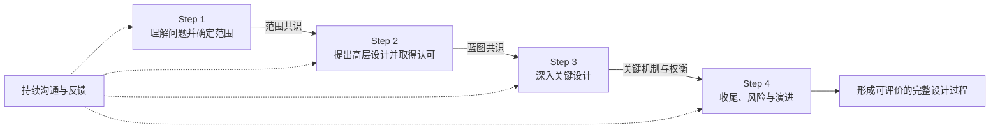
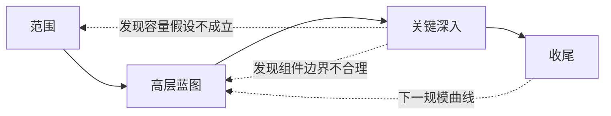
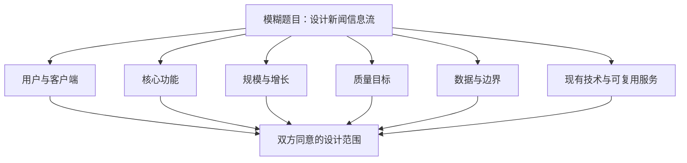
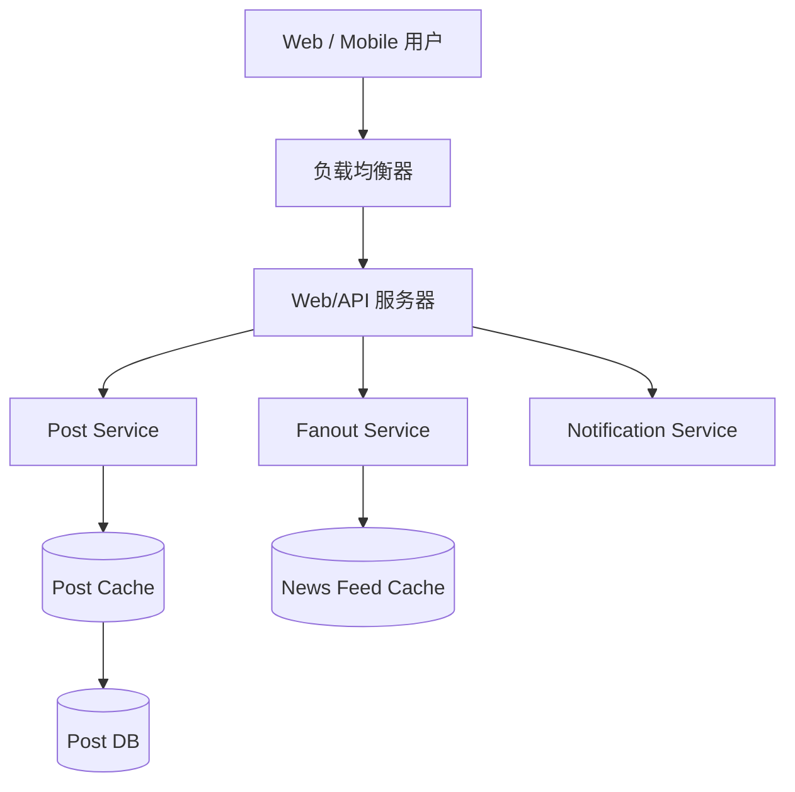
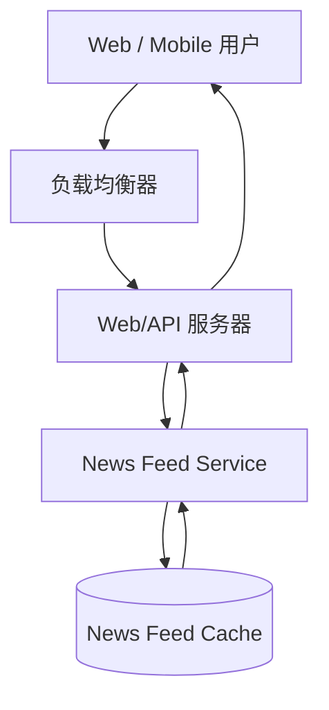
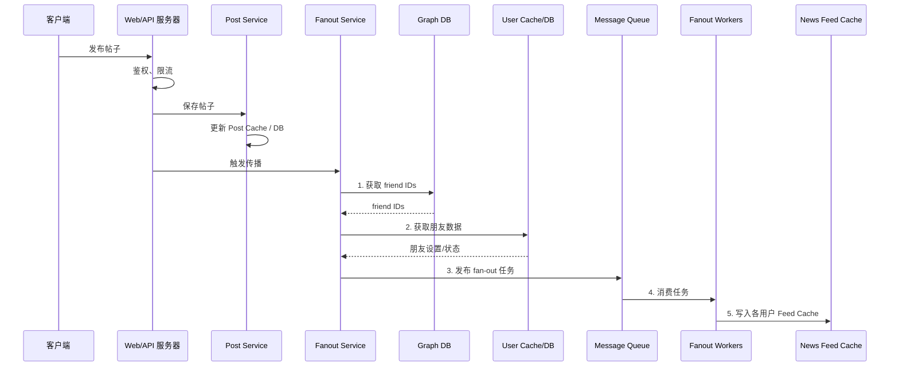
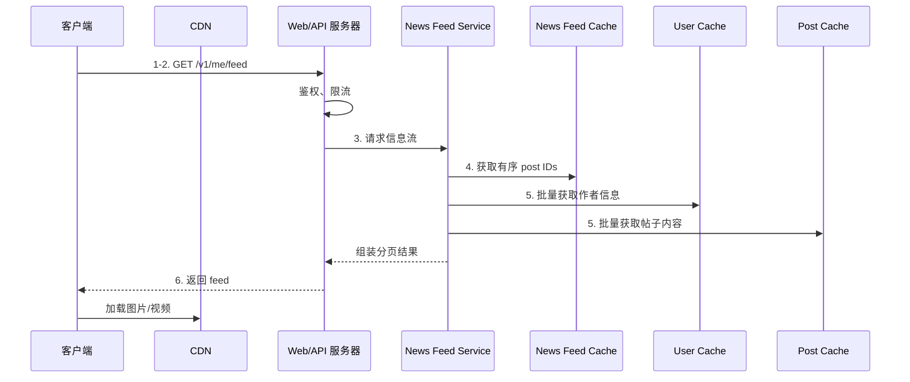
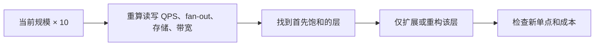
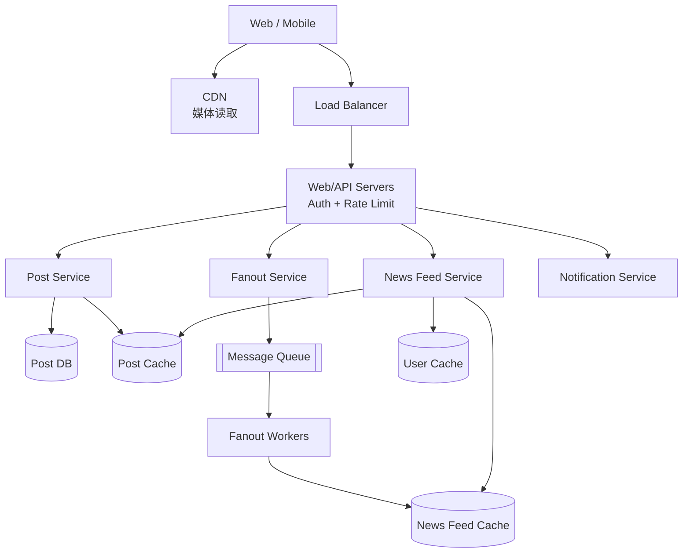
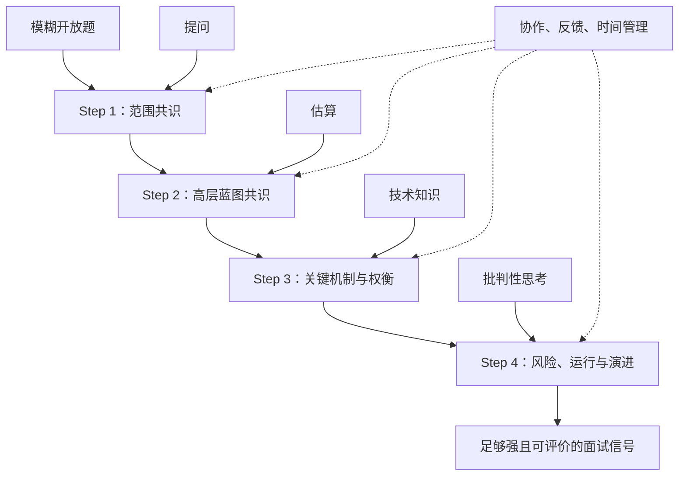

> 原书：Alex Xu，*System Design Interview: An Insider's Guide*（Second Edition）
> 原章：Chapter 3, *A Framework for System Design Interviews*
> 本章主线：系统设计面试不是在一小时内复刻真实产品，而是候选人与面试官围绕一个模糊问题协作，在有限时间内依次建立问题范围、高层架构共识、关键细节与风险复盘，从而让候选人的分析、设计、沟通和反馈能力变得可观察。

## 0. 学习目标、边界与框架总览

本章解决的不是某一项分布式技术，而是“面对一道开放的系统设计题，怎样组织一场有效的技术讨论”。作者先解释面试为什么令人畏惧、面试官究竟观察什么，随后给出四步流程，最后列出 Dos/Don'ts 和 45 分钟时间分配。

读完后，应当能够回答：

1. 为什么面试官不期待候选人在一小时内设计出真实 Google 搜索？
2. 最终架构为什么没有设计过程重要？
3. 面试官除了技术知识，还在收集哪些评价信号？
4. 为什么抢答和过度设计都是危险信号？
5. 第一步应该问什么，怎样把模糊题目收敛成双方同意的范围？
6. 第二步的高层设计应包含什么，为什么必须先取得面试官认可？
7. 第三步如何选择深入点，而不是平均展开所有组件？
8. 第四步为什么仍然属于设计，而不只是礼貌性总结？
9. 新闻信息流示例中的发布路径和读取路径分别如何工作？
10. 如何根据题目、职级和面试官反馈动态分配 45 分钟？

四步框架如下：



四步不是一套固定架构，也不是只能向前、不能回看的瀑布流程。它们是四个连续的**共识关口**：

| 步骤 | 双方要形成的共识 | 主要产物 |
|---|---|---|
| Step 1 | 我们究竟在解决什么问题？ | 范围、需求、规模、约束、假设 |
| Step 2 | 端到端方案是否合理？ | API/核心数据、高层组件、关键数据流、粗略估算 |
| Step 3 | 哪些部分最值得用剩余时间深入？ | 关键机制、数据结构、算法、瓶颈与权衡 |
| Step 4 | 方案的风险、运行方式与下一步是什么？ | 总结、故障、监控、扩展、遗留问题 |

原章没有数学算法或正式评分公式。本文加入的时间预算、问题价值、深入优先级和容量公式均是教学化模型，用于解释作者的方法为何有效，不应误认为原书给出的招聘评分标准。

---

## 1. 系统设计面试真正模拟什么

原章先从候选人的紧张感讲起：题目可能只有“设计一个知名产品 X”，范围大得不合理。一个真实产品往往由数百乃至数千名工程师多年建设，一小时显然不可能复刻。

### 1.1 面试目标不是复现生产系统

以 Google 搜索为例，用户看到的只是一个搜索框和结果页，背后却涉及：

- 大规模网页抓取；
- 内容解析、去重和索引；
- 分布式存储与查询；
- 排名、拼写纠正和反作弊；
- 全球流量、缓存与容灾；
- 持续更新、监控和成本控制。

面试官不可能要求候选人在一小时内覆盖所有生产细节。若把目标理解成“画出真实公司内部架构”，候选人只能依赖记忆和猜测，也无法公平评价没有见过该系统的人。

作者给出的正确定位是：**面试模拟两位同事如何协作解决一个目标明确之前仍很模糊的问题。**

### 1.2 最终图为什么没有设计过程重要

系统设计题通常有多个可行解。面试官更关心：

- 候选人如何发现缺失需求；
- 如何声明和修正假设；
- 如何把业务目标转成技术约束；
- 如何建立简单的端到端方案；
- 如何选择关键问题深入；
- 如何为技术选择辩护；
- 如何听取反馈并调整方案；
- 如何识别当前设计的局限。

一张最终架构图只能显示“选了什么”，设计过程还能显示“为什么这样选、替代方案是什么、条件变化后会怎样”。后者更接近真实工程工作。

可以把面试产出的价值写成一个教学化表达：

$$
\text{Evaluation Signal}
\approx
\text{Decision Quality}
\times
\text{Reasoning Visibility}
\times
\text{Responsiveness to Feedback}
$$

乘法表达一个直觉：

- 决策可能不错，但思考过程完全不可见，面试官难以判断是推导还是碰巧；
- 解释清晰但技术决策不满足需求，沟通不能代替正确性；
- 坚持原方案、不吸收新信息，说明协作和修正能力不足。

这不是实际评分公式，只是帮助理解为什么“说出推理”和“根据反馈调整”与技术设计同样重要。

### 1.3 开放题为什么仍然可以评价

“没有完美答案”不等于“任何答案都对”。评价依据来自双方在 Step 1 约定的目标与约束：

$$
Architecture\models Requirements\cup Constraints
$$

先判断架构是否满足功能、规模、延迟、可用性和成本等条件，再比较复杂度与权衡。两个设计可以都合理，但适用条件不同；一个设计若违背明确需求，就不能用开放性为其辩护。

### 1.4 面试是一场协作，不是单向答辩

作者把场景描述为两位同事共同解决问题。候选人的角色因此不是：

- 猜面试官脑中的标准图；
- 连续演讲 45 分钟；
- 对每个提示进行防御；
- 等到最后才展示完整答案。

而是：

- 用问题建立共享上下文；
- 提出判断并邀请校准；
- 把面试官反馈当作新需求或风险信号；
- 在分歧处解释取舍；
- 共同决定讨论深度。

一个成熟的表达通常包含“建议 + 依据 + 校准”：

> 高层读写路径已经闭合。由于最大好友数为 5000，发布时扇出可能是最明显的扩展风险，我建议接下来深入 fan-out 策略；您希望先看这里，还是先讨论存储分片？

候选人没有把方向选择完全推给面试官，也没有无视面试官，而是先展示自己的风险判断，再邀请协作。

---

## 2. 面试官在寻找哪些信号

作者随后切换到面试官视角。面试官的主要任务是准确判断候选人的能力；最不希望得到的是一场缺少有效信号、最终无法下结论的面试。

### 2.1 技术设计能力只是其中一部分

原书特别强调以下信号：

| 信号 | 可观察行为 | 为什么与工作相关 |
|---|---|---|
| 协作 | 主动确认、接收反馈、共同选择深入点 | 真实设计需要跨团队讨论 |
| 压力下工作 | 时间有限仍保持结构，卡住时能恢复 | 事故、评审和截止期都存在压力 |
| 建设性消除歧义 | 提出高价值问题并记录假设 | 产品需求很少天然完整 |
| 提问能力 | 问题能改变范围或架构，而非机械清单 | 好问题可避免解决错误问题 |
| 技术判断 | 机制与需求、规模、风险相对应 | 设计不是组件堆叠 |
| 沟通 | 推理、图和术语可被跟踪 | 决策必须能被团队检查 |
| 适应性 | 新条件出现后能调整而不慌乱 | 真实需求会变化 |

面试官不是只能看候选人“知道多少数据库”。即使候选人忘记某个产品名，只要能从访问模式推导需要的存储特征，仍然能提供强信号。

### 2.2 什么是“信号”

信号是能支持能力判断的具体行为。例如：

- “我先澄清信息流是时间排序还是推荐排序，因为这决定是否需要在线排名服务”；
- “峰值写入大约 1000 QPS，单从这个数字尚不能证明需要分片，我先保留单主库并准备水平分区的演进路径”；
- “消息队列使发布响应不再等待 fan-out，但会引入重复投递，所以 Worker 要按 `(post_id, recipient_id)` 幂等写入”。

这些表达同时暴露需求意识、数量级判断和分布式语义。相反，只说“用 Kafka、Redis、Cassandra”提供的评价信号很弱，因为没有说明它们为何存在。

### 2.3 为什么要让思考过程可见

面试官无法读取候选人的脑内推理。如果候选人沉默数分钟后画出一张图，面试官看不到：

- 候选人考虑过哪些替代方案；
- 哪些假设支撑了选择；
- 是否意识到方案的失败边界；
- 能否与团队共同形成决策。

“Think out loud”不等于把每个未经整理的念头都说出来。更有效的方式是持续报告当前决策状态：

> 我正在比较写时扇出和读时聚合。前者降低读取延迟但对名人用户有巨大写放大；后者写入简单但每次读取要聚合最多 5000 个朋友。根据题目把读取体验设为优先，我先用写时扇出作为普通用户基线，再单独处理名人。

### 2.4 红旗一：过度设计

作者把 over-engineering 称为工程师的常见“疾病”：追求设计纯粹性，却忽略复杂度会复合增长。

过度设计常见表现：

- 尚未确认规模就引入多地域多主；
- 没有异步需求就加入多层消息系统；
- 为一个简单服务拆出大量微服务；
- 只谈理论上的最佳模式，不谈团队与迁移成本；
- 每个故障都设计最高等级容灾，却没有业务优先级；
- 用复杂算法解决题目明确排除的问题。

组件数量增加后，复杂度并非简单相加。若有 $n$ 个组件，潜在两两交互数量为：

$$
\frac{n(n-1)}{2}
$$

5 个组件最多有 10 对交互，10 个组件最多有 45 对。真实依赖不是完全图，但这个教学化模型说明：服务、协议、部署和数据所有权增加后，测试与故障组合会快速增长。

**避免过度设计不等于拒绝复杂方案。** 当需求确实要求全球低延迟、跨地域容灾或巨量写入时，复杂机制可能是必要复杂度。关键是让每一项复杂度都能追溯到需求、规模或风险。

### 2.5 红旗二：狭隘和固执

作者还列出 narrow-mindedness 和 stubbornness。具体表现包括：

- 只接受自己熟悉的数据库；
- 面试官改变需求后仍重复原方案；
- 把替代方案描述成“错误”，却说不出适用条件；
- 面对提示立即辩解，而不是先检查假设；
- 为保住前面的话拒绝修正明显问题。

技术立场坚定与固执不同。成熟候选人可以坚持某项选择，但要说明证据和可证伪条件：

> 在当前“帖子按时间排序、10M DAU、好友上限 5000”的范围内，我仍倾向预计算信息流；如果面试官把一致性改为严格实时，或名人占比很高，我会切换为混合扇出。

### 2.6 红旗三：把面试当知识竞赛

抢答、背诵标准图、猜产品内部实现，都把开放设计题错误地当成 trivia contest。系统设计的核心不是第一个说出“Redis”的人，而是能否确定 Redis 要缓存什么、命中率是否有价值、失效和故障如何处理。

---

## 3. 四步框架为什么有效

作者承认每场面试不同、没有 one-size-fits-all 答案，但认为所有有效面试都需要覆盖一些共同基础。四步框架提供的是**顺序和检查点**，不是固定组件。

### 3.1 四步依次降低四种风险

| 步骤 | 主要降低的风险 | 若跳过会怎样 |
|---|---|---|
| Step 1 范围 | 解决错误问题 | 架构与真实要求错位 |
| Step 2 高层设计 | 局部细节没有完整系统承载 | 深入一个组件却没有端到端路径 |
| Step 3 深入 | 方案停留在方框图 | 无法证明关键机制真的可行 |
| Step 4 收尾 | 风险、运行和演进被遗漏 | 给人“画完图就结束”的印象 |

这个顺序对应从抽象到具体：

$$
\text{Problem}
\rightarrow\text{Scope}
\rightarrow\text{Blueprint}
\rightarrow\text{Critical Mechanisms}
\rightarrow\text{Risks and Evolution}
$$

### 3.2 为什么不能从 Step 3 开始

假设题目是“设计新闻信息流”，候选人一开始就解释复杂排名算法。但面试官随后说明只需倒序时间排列。此前讨论全部无效，而且还错过了发布、读取、容量和容错等更重要问题。

局部技术的价值依赖上下文。先确定范围和蓝图，才能判断哪一个局部值得深入。

### 3.3 框架不是严格瀑布

深入时可能发现高层假设有误，需要回到前一步：



返回不代表失败。候选人明确说“这个估算推翻了我前面的单队列假设，我会把 fan-out 按用户 ID 分区”，反而展示了用证据修正设计的能力。

---

## 4. Step 1：理解问题并确定设计范围

### 4.1 “不要像 Jimmy”讲的是什么

原书用 Jimmy 抢答的故事提醒：课堂上回答快可能受奖励，系统设计面试中未经思考就给方案不会加分。原因是题目没有唯一答案，且初始描述故意不完整。

作者强调三件事：

1. 放慢速度，先思考；
2. 提问以澄清需求和假设；
3. 面试官若不提供答案，就明确写下自己的假设。

最危险的不是暂时不知道，而是在未理解问题时表现出虚假的确定性。

### 4.2 Step 1 的目标

Step 1 要把一句模糊题目转换为可设计的合同：



产物不需要是正式需求文档，但至少要让双方对“做什么、不做什么、做到多大”有共同理解。

### 4.3 作者建议的四类起始问题

原书列出：

1. 要构建哪些具体功能？
2. 产品有多少用户？
3. 未来 3 个月、6 个月和 1 年预计增长到什么规模？
4. 公司技术栈是什么，可以复用哪些现有服务？

这四类问题分别解决：

- **功能边界**：防止设计无关能力；
- **当前规模**：确定容量数量级；
- **增长轨迹**：区分当前方案与演进路径；
- **组织约束**：避免脱离实际环境重新发明基础设施。

### 4.4 功能需求、非功能需求和约束

为了使问题更完整，可以把提问组织为三类：

| 类别 | 回答什么 | 新闻信息流示例 |
|---|---|---|
| 功能需求 | 系统能做什么？ | 发布帖子、查看朋友信息流 |
| 非功能需求 | 做到什么程度？ | 读取低延迟、高可用、允许短暂最终一致 |
| 约束 | 方案在哪些边界内工作？ | 10M DAU、好友上限 5000、已有对象存储 |

“需要高性能”不是可操作的需求。应继续追问是写入延迟、信息流读取 P99、媒体加载还是吞吐，目标值大致是多少。

### 4.5 高价值问题与低价值问题

并非问题越多越好。高价值问题会改变架构或讨论优先级。可以用教学化模型表示问题价值：

$$
V(q)\approx
P(\text{answer changes design})
\times
Impact(\text{change})
-TimeCost(q)
$$

例如：

- “按时间还是个性化排序？”会决定是否需要排名逻辑，价值高；
- “按钮是什么颜色？”通常不影响后端架构，价值低；
- “好友上限多少？”会影响 fan-out 和读取聚合，价值高；
- “具体使用 MySQL 8.0.36 还是 8.0.37？”在高层阶段通常过细。

公式不是实际打分算法，而是提醒在 3–10 分钟内优先寻找**高信息增益**的问题。

### 4.6 问题清单不是审讯清单

不要机械地连续问十几个问题。更自然的方式是解释问题为何重要：

> 我先确认排序语义。若只按逆时间顺序，可以预计算 ID 列表；若需要个性化推荐，还要加入在线或离线排名。为了控制本次范围，我们采用哪一种？

这既展示知识，也让面试官知道问题与设计的关系。

### 4.7 面试官要求“你自己假设”怎么办

候选人应：

1. 选择合理且简单的假设；
2. 明确说出并写下；
3. 说明它会影响什么；
4. 后续保持一致，条件变化时主动修正。

例如：

> 我假设信息流允许秒级最终一致，优先保证读延迟和可用性。若要求发布后所有好友立刻强一致可见，fan-out 与读取路径需要重新设计。

记录假设的价值是让后续争论回到条件，而不是变成个人偏好。

### 4.8 新闻信息流示例：原书问答如何收敛范围

原书的候选人与面试官依次确认：

| 候选人提问 | 面试官回答 | 对设计的影响 |
|---|---|---|
| 移动端、Web 端还是两者？ | 两者都支持 | 需要统一后端 API，媒体交付适配多客户端 |
| 最重要功能是什么？ | 发布帖子、查看朋友信息流 | 排除大量社交功能，确定两条核心流程 |
| 信息流如何排序？ | 逆时间顺序 | 暂不深入个性化排名和 EdgeRank |
| 每个用户最多多少朋友？ | 5000 | fan-out 上界和读取聚合规模可估算 |
| 流量多大？ | 1000 万 DAU | 决定粗略吞吐、存储和缓存规模 |
| 只有文本还是也有媒体？ | 包含图片和视频 | 媒体应进入对象存储/CDN，不宜塞进帖子数据库 |

这组问题的顺序从产品边界走向数据和规模。最终得到的不是完整需求，但已足以进入高层设计。

### 4.9 从示例条件得到初步数量级

原章没有给发帖频率，必须补充假设才能计算。假设：

- 10M DAU；
- 每位用户每天发布 2 帖；
- 每位用户每天刷新信息流 20 次；
- 峰均比 5；
- 平均好友数 200，最大 5000。

平均发帖 QPS：

$$
QPS_{post,avg}
=\frac{10^7\times2}{86400}
\approx231
$$

峰值发帖 QPS：

$$
QPS_{post,peak}\approx231\times5\approx1157
$$

平均信息流读取 QPS：

$$
QPS_{read,avg}
=\frac{10^7\times20}{86400}
\approx2315
$$

峰值约 11,574 QPS。读取约为发帖的 10 倍，初步支持“读路径应高度缓存”的方向。

如果平均每帖向 200 个朋友写入信息流缓存，fan-out 写操作平均约为：

$$
231\times200\approx46200\ \text{writes/s}
$$

峰值约 23 万次/秒。这里尚未考虑名人用户、重试和批处理；数量级已提示 fan-out 值得在 Step 3 深入。

### 4.10 Step 1 完成标准

在进入高层设计前，应能用 30–60 秒复述：

> 我们设计同时支持 Web 和移动端的新闻信息流，核心功能是发帖和读取朋友帖子；按逆时间排序，每位用户最多 5000 个朋友，规模为 10M DAU，帖子可含图片和视频。优先目标暂定为低读取延迟和高可用，允许秒级最终一致。评论、广告和个性化推荐不在本次范围。接下来我会先画发布与读取两条路径，再按需要估算容量。

面试官确认后，Step 1 才真正完成。

---

## 5. Step 2：提出高层设计并取得认可

Step 2 的目标是形成端到端蓝图，并与面试官达成共识。作者强调把面试官当作队友、主动获取反馈。

### 5.1 为什么必须先取得认可

如果没有高层共识就深入：

- 候选人可能优化面试官并不关心的路径；
- 组件职责可能重叠或遗漏；
- 后续细节建立在错误边界上；
- 面试官难以跟踪设计如何演进。

“Buy-in”不是让面试官对每个细节签字，而是确认：核心用例、主要组件和数据流方向合理，可以继续深入。

### 5.2 作者建议的三个动作

原书要求：

1. 提出初始蓝图并请求反馈；
2. 画出客户端、API、Web 服务器、存储、缓存、CDN、消息队列等关键方框；
3. 必要时做粗略估算，验证蓝图能否满足规模。

组件清单是示例，不是强制模板。一个组件只有在当前数据流中有明确职责时才应出现。

### 5.3 高层设计要闭合核心路径

一张高层图至少应回答：

- 请求从哪里进入？
- 哪个服务处理？
- 数据写到哪里？
- 数据如何被其他用户读取？
- 媒体和动态数据走什么路径？
- 哪些步骤同步，哪些异步？

“客户端 → 负载均衡 → 微服务 → 数据库”仍可能过于空泛，因为没有展示发帖如何进入朋友的信息流。

### 5.4 先走具体用例

作者建议实际走几条 concrete use cases。这样做能：

- 验证组件是否真的连通；
- 发现遗漏的鉴权、数据或失败分支；
- 让抽象图对应用户行为；
- 暴露读写路径是否混淆。

对于新闻信息流，最自然的两条用例正是：

1. 用户发布一条帖子；
2. 用户打开自己的新闻信息流。

### 5.5 API 和数据库模式讲到多深

原书说取决于题目：

- “设计 Google 搜索”范围很大，过早讨论字段级模式可能浪费时间；
- “多人扑克后端”中，API 和游戏状态模式可能正是核心难点。

判断依据不是固定职级，而是 API/模式是否：

- 决定核心语义；
- 暴露重要一致性或幂等问题；
- 帮助闭合数据流；
- 是题目独特难点。

新闻信息流高层可以先用两个简化接口：

```http
POST /v1/posts
Authorization: Bearer <token>
Content-Type: application/json

{
  "text": "Hello",
  "media_ids": ["media-123"]
}
```

```http
GET /v1/me/feed?cursor=<cursor>&limit=20
Authorization: Bearer <token>
```

发布接口对应写路径；读取接口用 cursor 分页，避免深页 offset 在动态数据上的性能和重复/遗漏问题。原图把发布路径写作 `/v1/me/feed?content=Hello&auth_token={auth_token}`，本文使用更常见的资源式接口只是教学补充，不代表改写原书图的含义。

### 5.6 高层流程一：发布帖子

原书 Figure 3-1 的高层发布路径包含：

- Web/移动客户端；
- DNS 与负载均衡器；
- Web 服务器；
- Post Service；
- Post Cache 与 Post DB；
- Fanout Service；
- News Feed Cache；
- Notification Service。

可以还原为：



核心含义：

1. Post Service 保存帖子本身；
2. Fanout Service 把新帖子传播到朋友的信息流表示中；
3. Notification Service 负责通知；
4. 帖子数据与每位用户的信息流索引是不同的数据形态。

信息流缓存通常不必复制完整帖子，可主要保存有序的 post IDs；读取时再批量获取帖子和用户详情。这样能降低冗余，但读取多一次聚合。

### 5.7 高层流程二：读取信息流

原书 Figure 3-2 的读取路径更简洁：



News Feed Service 从该用户的信息流缓存取得按时间逆序排列的帖子 ID，再组装响应。高层阶段先证明读路径可以低延迟完成，具体用户缓存、帖子缓存和 CDN 可在 Step 3 展开。

### 5.8 为什么拆成发布与读取两条流

读写路径的资源特征不同：

| 维度 | 发布 | 读取 |
|---|---|---|
| 主要操作 | 保存帖子、传播 ID、通知 | 读取 ID 列表、补全帖子和作者信息 |
| 扩展风险 | fan-out 写放大、热点作者 | 高频读取、缓存命中、分页 |
| 一致性 | 可考虑异步传播 | 用户期望低延迟，可容忍多旧？ |
| 主要存储 | Post DB、队列、Feed Cache | Feed Cache、Post/User Cache |

拆开后可独立扩容和讨论，不必让一个“大而全 Feed Service”承担所有语义。

### 5.9 粗略估算怎样服务高层蓝图

估算不是独立表演，而要验证组件：

- 发帖 QPS 判断 Post Service 和数据库写入压力；
- fan-out 写次数判断是否必须异步和分区；
- 信息流读取 QPS 判断缓存规模和服务实例数；
- 媒体大小判断 CDN 与对象存储流量；
- 每用户保留的 feed IDs 数量判断缓存内存。

假设 10M DAU、每用户缓存最近 500 个 post IDs、每 ID 8 bytes，仅 ID 原始数据为：

$$
10^7\times500\times8
=4\times10^{10}\ \text{bytes}
\approx40\ \text{GB}
$$

实际缓存还包含键、排序结构、对象开销、副本和余量，可能是其数倍。该估算说明信息流缓存需要分布式部署，但仍远小于把完整媒体复制到每个用户缓存。

### 5.10 Step 2 完成标准

进入深入前，应确认：

- [ ] 两条核心用例都能端到端走通；
- [ ] 每个主要组件有单一、清楚的职责；
- [ ] 数据的权威来源和缓存大致明确；
- [ ] 同步与异步边界已经标出；
- [ ] 数量级没有明显推翻蓝图；
- [ ] 面试官已反馈并同意下一步深入方向。

---

## 6. Step 3：深入关键设计

作者规定进入 Step 3 前应已完成四件事：

1. 对整体目标和功能范围达成一致；
2. 画出高层蓝图；
3. 获得面试官对蓝图的反馈；
4. 根据反馈初步判断深入区域。

### 6.1 深入不是把所有方框都展开

时间不允许平均深入每个组件。应与面试官共同识别和排序：

- 题目最独特的机制；
- 最可能成为瓶颈的路径；
- 正确性风险最高的状态；
- 能最好展示目标职级能力的权衡；
- 面试官明确感兴趣的部分。

作者举例：

- URL 短链值得深入长 URL 到短码的哈希设计；
- 聊天系统值得深入低延迟与在线/离线状态；
- 高级候选人可能被要求分析性能、瓶颈和资源估算。

### 6.2 一个教学化的深入优先级模型

可以用以下模型组织判断：

$$
Priority(c)
=\frac{
Uniqueness(c)\times Risk(c)\times RequirementImpact(c)
}{TimeCost(c)}
$$

- `Uniqueness`：是否体现本题，而非任何系统都有；
- `Risk`：是否容易导致容量、正确性或故障问题；
- `RequirementImpact`：是否决定核心目标；
- `TimeCost`：讲清楚要花多久。

这不是原书评分公式。它解释了为什么新闻信息流的 fan-out 通常比 DNS 解析更值得深入：前者独特、风险高、直接决定读写性能，后者虽重要但较通用。

### 6.3 深入的最小结构

对每个关键组件，至少回答：

1. 输入和输出是什么？
2. 保存什么状态，权威数据在哪里？
3. 正常路径的算法或步骤是什么？
4. 容量和延迟瓶颈在哪里？
5. 并发、重复、顺序和一致性语义是什么？
6. 组件故障时怎样恢复或降级？
7. 为什么选择该方案，替代方案是什么？

这比从产品文档开始介绍组件功能更能展示设计能力。

### 6.4 新闻信息流深入一：发布路径

原书 Figure 3-3 把 Figure 3-1 展开为以下步骤：



图中还包含 Notification Service，用于向相关用户发送通知；它可以与 fan-out 异步进行，避免拖慢发帖响应。

#### 6.4.1 鉴权与限流

- 鉴权确认发帖者身份与权限；
- 限流防止滥用和突发流量耗尽资源；
- 两者应在昂贵写入和 fan-out 之前执行。

如果发帖请求可能重试，还需要幂等键，防止保存两条相同帖子：

```http
Idempotency-Key: 6f2f1b8e-...
```

#### 6.4.2 保存帖子

Post Service 把帖子写入 Post DB，并更新或失效 Post Cache。媒体通常先上传对象存储，帖子只保存媒体引用。数据库是帖子元数据的权威来源，缓存用于读取加速。

需要确认何时向用户返回成功：

- 帖子持久化后立即返回，fan-out 后台完成；
- 等待 fan-out 完成后返回。

第一种延迟低、容错更好，但发布者的朋友可能稍后才看到；第二种语义直接却被最慢朋友写入拖累。原架构引入消息队列，明显倾向第一种异步传播。

#### 6.4.3 获取朋友关系

Fanout Service 从 Graph DB 获取 friend IDs。好友上限 5000 提供 fan-out 上界，但平均数通常更重要。还要考虑：

- 关注是单向还是双向；
- 屏蔽和隐私设置；
- 好友关系在发帖到传播之间变化；
- 图数据库或社交图缓存故障。

#### 6.4.4 获取朋友数据

原图从 User Cache/DB 获取用户数据。可能用于过滤：

- 对方是否屏蔽作者；
- 是否允许该类型帖子；
- 账户是否有效；
- 通知偏好。

不应为 5000 个朋友逐个同步查询数据库。应使用批量读取、缓存或让社交图结果携带必要过滤信息，避免 N+1 查询。

#### 6.4.5 发布队列任务

消息队列把发帖服务与 fan-out Worker 解耦：

- 高峰时先积压，Web 请求不必等待全部传播；
- Worker 可独立扩容；
- 短暂故障后可以重试。

代价包括：重复投递、顺序、积压、死信和最终一致性。Worker 应幂等地执行：

```text
feed_entry_key = (recipient_user_id, post_id)
insert_if_absent(feed_entry_key, created_at)
```

同一任务重试不会产生重复信息流条目。

#### 6.4.6 Fanout Worker 写入信息流缓存

Worker 通常把 `(post_id, timestamp)` 写入收件人的有序 feed 列表，并裁剪到最近 $K$ 条。伪代码：

```text
for recipient_id in recipients:
    if is_visible(post_id, recipient_id):
        feed_cache.add(
            user_id=recipient_id,
            score=post_created_at,
            value=post_id,
        )
        feed_cache.trim_to_latest(recipient_id, K)
```

这对应写时 fan-out（fan-out on write）：发布时预先计算读取结果，换取低读取延迟。

### 6.5 写时 fan-out 与读时 fan-out

虽然完整讨论在第 11 章，本章示例已暗含关键权衡。

#### 写时 fan-out

作者发帖时，将 post ID 写入所有朋友的 feed 缓存。

优点：

- 用户读取时直接得到预计算列表；
- 读延迟低；
- 适合读远多于写的系统。

缺点：

- 写放大约等于接收者数量；
- 名人拥有数百万关注者时传播慢、成本高；
- 大量离线或不活跃用户的预计算可能浪费。

#### 读时 fan-out

用户打开 feed 时，再读取所关注对象的近期帖子并合并排序。

优点：

- 发帖写入简单；
- 不向不活跃用户预先写数据；
- 名人发帖不会立即造成巨大扇出。

缺点：

- 每次读取要访问和合并多个来源；
- 读取延迟与关注数增长；
- 高频刷新会重复计算。

如果用户关注 $F$ 个朋友，每个朋友取最近 $K$ 条，再选全局前 $K$ 条，朴素读取会接触最多 $FK$ 个候选。使用 $F$ 路归并堆，时间复杂度可近似为：

$$
O(K\log F)
$$

前提是每个朋友的帖子流已按时间有序，并且能快速访问每条流的下一项。

#### 混合策略

普通用户采用写时 fan-out，名人帖子在读取时合并，能避开最大写热点。选择依据是关注者分布、活跃度、延迟目标和一致性要求。

### 6.6 新闻信息流深入二：读取路径

原书 Figure 3-4 展开为：



#### 6.6.1 鉴权、限流与请求入口

负载均衡将请求交给 Web 服务器，后者确认用户身份并限制异常刷新频率。因为读取 QPS 通常远高于写入，限流和缓存对保护后端尤其重要。

#### 6.6.2 从 News Feed Cache 取得 ID 列表

缓存可保存每位用户的有序 post IDs，而不是完整帖子：

```text
feed:{user_id} -> [(timestamp_1, post_id_1), ...]
```

优势：

- 单条索引小；
- 同一帖子内容只需在 Post Cache 保存一份；
- 帖子更新或删除时不必改写所有完整副本。

代价是读取需要补全帖子和作者信息。

#### 6.6.3 批量补全 User 与 Post

News Feed Service 根据 IDs 批量访问 User Cache 和 Post Cache。缓存未命中时再回源 User DB/Post DB。

必须避免：

```text
for post_id in page:
    get_post(post_id)        # 20 次网络调用
    get_user(author_id)      # 再 20 次网络调用
```

应改为批量 multi-get，并行获取用户与帖子：

```text
post_ids = feed_cache.page(user_id, cursor, limit)
posts = post_cache.multi_get(post_ids)
author_ids = unique(posts.author_id)
users = user_cache.multi_get(author_ids)
return assemble(posts, users)
```

#### 6.6.4 CDN 加载媒体

API 响应包含媒体 URL，客户端再从 CDN 就近加载图片和视频。这样媒体大流量不经过 Web 服务器，也不会塞入信息流缓存。

#### 6.6.5 分页与动态数据

信息流不断插入新内容，cursor 应携带时间或稳定排序键。例如 `(created_at, post_id)`：

- `created_at` 提供逆时间排序；
- `post_id` 打破同一时间戳的平局；
- 下一页读取“小于上次末尾排序键”的内容。

offset 分页在大量新数据插入时容易重复或遗漏，也可能要求扫描深页。

### 6.7 缓存未命中和数据删除

深入设计还应说明：

- Feed Cache 丢失时是重建、读时聚合还是返回降级结果；
- Post Cache 未命中时从 Post DB 批量回源；
- 已删除帖子仍在 feed ID 列表时，组装阶段过滤并异步清理；
- 隐私关系变化后，读取时可再次做可见性检查；
- 缓存雪崩时限制回源并逐步预热。

这些是缓存提高性能后新增的一致性和恢复问题。

### 6.8 为什么不应深入 EdgeRank

作者明确举例：详细讲 Facebook EdgeRank 并不理想，因为本题已把排序简化为逆时间顺序，而且面试目标是可扩展系统设计。

这体现两个原则：

1. **范围约束深度**：Step 1 排除的内容不要在 Step 3 偷偷加回来；
2. **深度要产生评价信号**：复杂并不等于相关。

若题目明确要求个性化排序，排名特征、离线训练和在线推理才成为高价值深入点。

### 6.9 时间管理：何时停止深入

一个深入点讲到以下程度通常可以转向：

- 正常路径已清楚；
- 核心数据结构或算法已说明；
- 至少一个替代方案与权衡已比较；
- 主要瓶颈和故障语义已覆盖；
- 面试官没有继续追问。

候选人可以主动收束：

> fan-out 的正常路径、写放大、队列重试和名人热点已经覆盖。为了保留收尾时间，我接下来简要说明读取路径的缓存回源和故障降级。

### 6.10 Step 3 完成标准

- [ ] 深入点由需求、风险或面试官反馈选择；
- [ ] 不是只介绍组件，而是讲清算法、状态和数据流；
- [ ] 解释了为什么有效以及付出的代价；
- [ ] 覆盖容量、并发、一致性或故障中的关键问题；
- [ ] 没有被无关实现细节耗尽时间；
- [ ] 为 Step 4 留出至少几分钟。

---

## 7. Step 4：收尾不是重复，而是完成设计闭环

作者在最终步骤列出六个方向：瓶颈与改进、架构回顾、错误场景、运维问题、下一规模曲线和更多时间下的改进。

### 7.1 识别瓶颈并提出改进

永远不要说设计完美。任何架构都建立在假设和有限时间上。

新闻信息流可能的瓶颈：

- 名人用户造成 fan-out 热点；
- 消息队列积压导致帖子迟迟不可见；
- News Feed Cache 成为容量与热点中心；
- Post/User Cache 低命中引发数据库回源；
- 社交图查询慢；
- 媒体 CDN 回源突增；
- 单地域或单存储集群故障。

改进应继续使用“问题 → 机制 → 代价”：

> 名人用户的关注者数量使写时 fan-out 不可承受，因此改用混合策略：普通作者继续写时扇出，名人帖子在读取时合并。代价是读取服务增加一路聚合，并要保持两个来源的稳定排序。

### 7.2 回顾设计

一场长讨论中可能出现多个方案和修正。最终总结应覆盖：

1. 已确认的核心需求；
2. 最终高层结构；
3. 两三个关键选择；
4. 主要权衡；
5. 尚未解决的风险。

示例：

> 最终方案把帖子存储与用户 feed 索引分离。发布路径持久化帖子后通过队列异步 fan-out，普通用户采用写时扇出以换取低读延迟，名人可改为读时合并。读取服务从 Feed Cache 取得 IDs，并批量补全 Post/User Cache；媒体由 CDN 交付。系统接受秒级最终一致，主要风险是队列积压、热点和缓存回源。

这不是复述所有方框，而是在强调设计的因果骨架。

### 7.3 错误场景

作者点名服务器故障和网络丢失。可按关键路径快速检查：

| 故障 | 用户影响 | 应对方向 |
|---|---|---|
| Web 实例故障 | 部分请求失败 | 无状态实例、负载均衡重试、幂等写入 |
| Post DB 写失败 | 帖子未持久化 | 不返回成功、重试或错误提示 |
| 队列暂时不可用 | 无法异步传播 | outbox/重试，避免“帖子成功但事件永久丢失” |
| Worker 故障 | fan-out 延迟 | 消息重新投递、幂等处理、死信队列 |
| Feed Cache 故障 | 读取变慢或缺结果 | 副本、读时重建、降级、限流回源 |
| CDN 故障 | 媒体加载失败 | 备用域名或源站回退，确保源站容量 |
| 网络超时 | 结果未知 | 超时、重试、熔断，写请求必须幂等 |

面试时间有限，不必为每个组件列完整故障树；优先讨论会造成数据丢失、重复副作用或整体不可用的情况。

### 7.4 运维问题

原书要求考虑如何监控指标和错误日志，以及如何发布系统。可以补充：

**核心指标**

- 发帖成功率与 P99 延迟；
- 信息流读取 P99；
- 从帖子持久化到朋友可见的传播延迟；
- 队列长度与最老消息年龄；
- fan-out Worker 吞吐和失败率；
- Feed/Post/User Cache 命中率；
- 数据库 QPS、连接、复制延迟；
- CDN 命中率与回源流量。

**发布策略**

- 自动测试与模式兼容检查；
- 金丝雀发布；
- 分批扩大流量；
- 监控关键 SLI；
- 自动或人工快速回滚；
- 消息和 API 模式保持前后兼容。

运维不是设计后的附录。若系统无法观测传播延迟，就无法知道“最终一致”究竟是 2 秒还是 2 小时。

### 7.5 下一规模曲线

作者建议讨论从 100 万用户到 1000 万用户需要什么变化。关键不是把所有组件乘 10，而是重新检查哪个资源最先越界：



可能演进：

- Web/Feed 服务继续无状态水平扩展；
- 队列按用户 ID 分区，提高并行消费；
- Feed Cache 分片并为热点用户做隔离；
- Post DB 按作者或 post ID 分片；
- 社交图增加缓存与副本；
- 跨地域就近读取，异步复制；
- 普通/名人采用混合 fan-out。

### 7.6 如果还有更多时间

可以明确而诚实地列出：

- 隐私与屏蔽变化的一致性；
- 删除传播；
- 反滥用与内容审核；
- 多地域容灾；
- 成本模型；
- 容量压测；
- 推荐排序（若重新纳入范围）。

这展示范围意识：候选人知道还有哪些问题，但没有假装在 45 分钟内全部解决。

### 7.7 Step 4 完成标准

- [ ] 用一分钟回顾需求、架构和关键权衡；
- [ ] 主动指出至少一个瓶颈，不宣称完美；
- [ ] 覆盖重要故障与恢复语义；
- [ ] 提到监控、发布或容量运维；
- [ ] 说明下一数量级如何演进；
- [ ] 清楚标记未讨论内容。

---

## 8. Dos：作者建议主动展示的行为

原书最后把建议汇总。下面按原顺序解释。

### 8.1 始终澄清，不要假设自己的假设必然正确

澄清并不意味着候选人不能做假设，而是：

- 能问到就确认；
- 需要自定时显式声明；
- 新信息出现后更新；
- 不把隐含偏好伪装成需求。

### 8.2 理解问题需求

复述需求并请面试官确认，比立即画图更有效。理解包括范围、规模、优先级和明确不做的内容。

### 8.3 不存在脱离语境的唯一或最佳答案

初创公司与成熟大规模企业的合理方案不同：

| 维度 | 初创阶段 | 大规模成熟系统 |
|---|---|---|
| 主要风险 | 产品不被需要、开发过慢 | 容量、可用性、组织协作 |
| 架构倾向 | 简单单体、托管服务 | 分层、冗余、分片、自动化 |
| 优先级 | 迭代速度 | 稳定性与独立扩展 |
| 可接受复杂度 | 低 | 由业务价值证明的复杂度 |

因此不能把成熟公司的架构反向套给所有新项目。

### 8.4 让面试官知道你在想什么

说出当前假设、比较维度和决策。避免长时间沉默，也避免无结构地说出每个念头。

### 8.5 尽可能提出多种方案

替代方案用于展示权衡，而不是罗列产品：

> 信息流可以写时扇出、读时聚合或混合。根据读多写少和低读延迟，我选择混合方案；若关注关系很少且发帖极多，读时聚合会更有吸引力。

### 8.6 蓝图达成一致后，再设计最关键组件

先广后深，且优先关键部分。这里的“每个组件”不能机械理解为必须逐一讲完，而应结合紧接着的“最关键组件优先”。

### 8.7 与面试官交换想法

主动请求对高层图、深入方向和权衡的反馈。合作不是不断问“这样对吗”，而是带着判断进行校准。

### 8.8 不要放弃

卡住时可以：

1. 回到需求；
2. 画最简单基线；
3. 沿一条具体请求走；
4. 询问提示；
5. 明确自己知道与不知道的边界。

恢复过程本身也能展示压力下解决问题的能力。

---

## 9. Don'ts：作者要求避免的行为

### 9.1 不要对典型问题毫无准备

准备不是背答案，而是熟悉常见构件和权衡：缓存、复制、分片、队列、CDN、一致性、限流、唯一 ID，以及常见题目的独特难点。

### 9.2 不要在澄清前直接给方案

这是全章最反复强调的错误。没有范围就无法判断方案是否正确。

### 9.3 不要开场就陷入单个组件

先给高层设计，再逐步深入。否则面试官看不到系统边界，也无法判断局部是否重要。

### 9.4 卡住时不要害怕请求提示

请求提示不是认输。可以先暴露自己的尝试：

> 我看到两个方向：预计算降低读取延迟，但名人 fan-out 会爆炸；纯读时聚合又可能让 5000 好友读取过慢。我倾向混合，但还不确定题目希望重点优化哪一侧，能否给我一个优先级提示？

这比只说“我不会”提供更多信号。

### 9.5 不要沉默思考

把关键比较说出来。若需要短暂整理，可以明确：

> 我用半分钟检查一下写时扇出的数量级，然后把计算写出来。

### 9.6 画完设计并不代表面试结束

面试官可能继续改变条件、追问故障、要求优化或切换深入点。应尽早且频繁获取反馈，直到面试官明确结束。

---

## 10. 时间分配：45 分钟内如何完成闭环

原书给出粗略范围：

| 步骤 | 原书建议时间 |
|---|---:|
| Step 1 理解问题并确定范围 | 3–10 分钟 |
| Step 2 高层设计并取得认可 | 10–15 分钟 |
| Step 3 深入设计 | 10–25 分钟 |
| Step 4 收尾 | 3–5 分钟 |

这些区间不是同时取上限；上限相加为 55 分钟，超过 45 分钟。它们表示题目不同会动态移动时间，且 Step 3 弹性最大。

### 10.1 一个可执行的 45 分钟基线

| 时间 | 阶段 | 产物 |
|---|---|---|
| 0–5 分钟 | Step 1 | 范围、规模、优先级、假设 |
| 5–18 分钟 | Step 2 | API/数据、高层图、两条核心流、必要估算 |
| 18–40 分钟 | Step 3 | 1–2 个关键深入点与权衡 |
| 40–45 分钟 | Step 4 | 瓶颈、故障、运维、总结与演进 |

这对应 5 + 13 + 22 + 5 = 45 分钟，全部位于原书区间内。

### 10.2 时间预算的约束

设四步时间为 $t_1,t_2,t_3,t_4$，总时间为 $T$：

$$
t_1+t_2+t_3+t_4\le T
$$

并满足原书粗略边界：

$$
3\le t_1\le10,\quad
10\le t_2\le15,\quad
10\le t_3\le25,\quad
3\le t_4\le5
$$

在 45 分钟面试中，若 Step 1 用了 10 分钟、Step 2 用了 15 分钟、Step 4 预留 5 分钟，则 Step 3 只剩：

$$
45-10-15-5=15\ \text{minutes}
$$

因此不能把每一步都按最大值使用。

### 10.3 如何动态调整

**Step 1 变长的情况**

- 题目特别模糊；
- 产品语义决定架构；
- 面试官希望观察需求分析。

**Step 2 变长的情况**

- 系统组件多、核心流复杂；
- 多个用例必须闭合；
- 容量估算会显著改变蓝图。

**Step 3 变长的情况**

- 高级候选人需要深入性能与权衡；
- 题目有核心算法或状态机；
- 面试官明确追问局部。

**Step 4 不应被压成 0**

至少保留 3 分钟，以展示批判性思考、运行意识和总结能力。

### 10.4 时间检查点

可以在白板角落写：

```text
00:00 scope
00:05 blueprint
00:18 deep dive
00:40 wrap
```

到点未完成时，主动收束或请求调整：

> 我们还有约 15 分钟。我会用 10 分钟讲 fan-out 和缓存一致性，最后 5 分钟覆盖故障、监控与总结。

这种表达展示时间管理，也让面试官有机会改变优先级。

### 10.5 可运行的时间预算检查代码

下面代码验证某个计划是否满足 45 分钟总预算和原书各步骤区间：

```python
from dataclasses import dataclass

@dataclass(frozen=True)
class InterviewPlan:
    scope: int
    high_level: int
    deep_dive: int
    wrap_up: int

    @property
    def total(self) -> int:
        return self.scope + self.high_level + self.deep_dive + self.wrap_up

LIMITS = {
    "scope": (3, 10),
    "high_level": (10, 15),
    "deep_dive": (10, 25),
    "wrap_up": (3, 5),
}

def validate(plan: InterviewPlan, interview_minutes: int = 45) -> list[str]:
    errors: list[str] = []
    for field, (minimum, maximum) in LIMITS.items():
        value = getattr(plan, field)
        if not minimum <= value <= maximum:
            errors.append(
                f"{field}={value} is outside [{minimum}, {maximum}]"
            )
    if plan.total > interview_minutes:
        errors.append(
            f"total={plan.total} exceeds interview={interview_minutes}"
        )
    return errors

baseline = InterviewPlan(scope=5, high_level=13, deep_dive=22, wrap_up=5)
assert baseline.total == 45
assert validate(baseline) == []

too_long = InterviewPlan(scope=10, high_level=15, deep_dive=25, wrap_up=5)
assert too_long.total == 55
assert validate(too_long) == ["total=55 exceeds interview=45"]

print("baseline:", baseline.total, "minutes")
print("maxima:", too_long.total, "minutes", validate(too_long))
```

输出：

```text
baseline: 45 minutes
maxima: 55 minutes ['total=55 exceeds interview=45']
```

代码对应本节的两个原则：每一步有参考区间，但总时间仍是硬约束；区间必须联合使用，不能各自都取最大值。

---

## 11. 把四步串成一次完整的新闻信息流面试

### 11.1 Step 1：范围摘要

```text
客户端：Web + Mobile
核心功能：发布帖子、查看朋友信息流
排序：逆时间
规模：10M DAU
好友上限：5000
内容：文本 + 图片 + 视频
假设：低读取延迟优先，允许秒级最终一致
排除：广告、评论、推荐排名
```

### 11.2 Step 2：高层设计



说明两条核心流：

- 发布：保存 Post → 异步 fan-out → 写朋友 Feed Cache；
- 读取：读取 Feed IDs → 批量补全 Post/User → 返回，媒体走 CDN。

### 11.3 Step 3：深入选择

选择 fan-out 和读取缓存：

1. 普通用户写时 fan-out，低延迟读取；
2. 名人用户读时合并，避免巨大写放大；
3. 队列按 recipient 或 author 分区，明确顺序语义；
4. Worker 幂等写入 `(recipient_id, post_id)`；
5. Feed Cache 只保存 IDs，Post/User 批量 multi-get；
6. 删除和隐私变化在读取时过滤，并异步清理缓存。

### 11.4 Step 4：收尾

```text
主要瓶颈：名人 fan-out、队列积压、Feed Cache 热点、缓存回源
故障语义：帖子持久化与事件发布的一致性、Worker 重试幂等
监控：发布/读取 P99、传播延迟、队列最老消息、缓存命中率
下一规模：队列和缓存分片、Post DB 分片、多地域就近读取
未展开：推荐排序、内容审核、复杂隐私、跨地域冲突
```

这套答案并非第 11 章完整设计，而是展示第 3 章框架如何让一次 45 分钟讨论形成闭环。

---

## 12. 容易混淆的概念与常见误区

### 12.1 框架与模板答案

- 框架规定思考顺序与检查点；
- 模板答案预设具体组件；
- 同一框架可设计短链、聊天、网盘；最终架构不会相同。

### 12.2 最终设计不重要与技术正确性不重要

作者说过程比最终设计更重要，不代表结果可以违背需求。过程是主要评价载体，技术决策仍必须可行、连贯并能被论证。

### 12.3 提问与让面试官替你设计

高质量提问寻找需求和优先级；确认后候选人应主动提出方案。不断问“应该用什么数据库”是在转移设计责任。

### 12.4 声明假设与随意假设

声明假设使推理可检查，但假设仍应合理、简单并得到面试官认可。不能用“这是我的假设”绕过明显需求。

### 12.5 Think aloud 与无过滤独白

前者报告假设、比较和决定；后者输出所有零散念头。结构化思考更容易被跟踪。

### 12.6 High-level design 与空泛方框图

高层设计仍需闭合核心数据流、说明组件职责和数据所有权。只有名词没有请求路径，不足以取得 buy-in。

### 12.7 Deep dive 与实现所有细节

深入意味着把最关键机制讲到算法、状态、容量和故障层面，不是逐行写代码，也不是展开所有组件。

### 12.8 多方案与拒绝做决定

应提出替代方案并比较，最后根据当前条件选择。只说“都可以”没有展示判断力。

### 12.9 简单设计与幼稚设计

简单设计包含满足当前需求所需的机制，并明确演进路径；幼稚设计忽略已知规模和故障。避免过度设计不等于忽略问题。

### 12.10 沟通与迎合

协作不要求无条件接受面试官观点。候选人可以礼貌指出代价，用证据维护判断，并说明什么条件下会改变方案。

### 12.11 获取提示与能力不足

在卡住时展示已有分析、明确缺口并请求提示，通常优于沉默或虚构。如何利用提示本身也是信号。

### 12.12 反向时间排序与个性化排序

- 逆时间排序主要依赖稳定时间键；
- 个性化排序需要特征、打分与模型/规则；
- 原章明确选择前者，因此 EdgeRank 不属于本次范围。

### 12.13 Feed Cache 与 Post Cache

- Feed Cache 保存“某用户应该看到哪些帖子及顺序”；
- Post Cache 保存“某个帖子具体是什么内容”；
- 分离可以减少完整帖子向所有收件人的复制。

### 12.14 写时 fan-out 与消息通知

fan-out 更新信息流数据；通知服务向设备或用户发提示。两者可由同一事件触发，但产品语义和失败处理不同。

### 12.15 45 分钟区间与总时间

原书各步骤时间是可调整范围，不是都取上限。必须满足总时间约束，并给 Step 4 留出时间。

### 12.16 真实公司架构与面试设计

真实系统受历史、组织和迁移约束，未必是理论最优；面试设计只需在约定条件下合理。不要靠猜内部实现替代推理。

---

## 13. 本章知识结构

本章可以组织为四层。

### 13.1 面试定位层

- 模拟同事协作解决模糊问题；
- 不要求一小时复刻生产系统；
- 过程是主要评价载体；
- 技术、沟通、压力和适应能力共同构成信号。

### 13.2 设计收敛层

- Step 1 把模糊题目收敛为范围；
- Step 2 把范围收敛为端到端蓝图；
- Step 3 把蓝图收敛为关键机制与权衡；
- Step 4 把方案收敛为风险、运行和演进结论。

### 13.3 协作与信号层

- 持续说出关键推理；
- 尽早请求反馈；
- 提出替代方案并做决定；
- 根据新信息修正；
- 避免过度设计、狭隘和固执。

### 13.4 时间与范围层

- 45 分钟无法覆盖真实系统；
- 先高层后深入；
- 深入题目独特且高风险的部分；
- Step 3 弹性最大；
- Step 4 必须预留。



---

## 14. 核心结论与一般解题思路

### 14.1 核心结论

1. **系统设计面试不是产品复刻考试。** 它模拟两位同事如何在模糊条件下协作形成可行方案。
2. **过程比最终架构图更能评价能力。** 提问、假设、取舍、反馈和修正都必须可见。
3. **开放题没有唯一答案，但有明确约束。** 方案必须满足双方约定的需求、规模和优先级。
4. **Step 1 防止正确地解决错误问题。** 开始设计前先确认功能、规模、增长、质量目标和技术约束。
5. **Step 2 先建立端到端蓝图。** 具体用例必须走通，关键组件要有职责，数量级要能支撑方案。
6. **Step 3 只深入高价值部分。** 题目独特性、风险、需求影响和面试官反馈共同决定优先级。
7. **Step 4 完成工程闭环。** 瓶颈、故障、监控、发布和下一规模曲线都是设计的一部分。
8. **沟通是设计机制，不是包装。** 需求和优先级需要通过对话形成，反馈会改变方案。
9. **必要复杂度必须有来源。** 每个服务、缓存、队列和副本都应对应需求、瓶颈或故障风险。
10. **时间管理决定信号密度。** 不求覆盖全部真实系统，而要在 45 分钟内形成完整且有深度的推理闭环。

### 14.2 一般解题思路

面对任何系统设计题，可以使用：

$$
\boxed{
\text{澄清用户、功能、规模与目标}
\rightarrow
\text{声明假设和范围}
\rightarrow
\text{闭合核心 API 与数据流}
\rightarrow
\text{用估算检查蓝图}
\rightarrow
\text{选择独特且高风险部分深入}
\rightarrow
\text{比较方案、解释代价与故障}
\rightarrow
\text{总结瓶颈、运行和下一规模}
}
$$

整个过程中不断执行：

$$
\text{提出判断}
\rightarrow
\text{解释依据}
\rightarrow
\text{请求反馈}
\rightarrow
\text{吸收新信息}
\rightarrow
\text{更新设计}
$$

### 14.3 一页式面试清单

**Step 1：3–10 分钟**

- [ ] 谁使用？Web、Mobile 还是内部服务？
- [ ] 最重要的 2–3 个功能是什么？
- [ ] 明确不做什么？
- [ ] DAU、QPS、数据量、增长和热点如何？
- [ ] 延迟、可用性、一致性和持久性优先级是什么？
- [ ] 有哪些现有技术或合规约束？
- [ ] 假设是否写下并获得确认？

**Step 2：10–15 分钟**

- [ ] API 或核心交互是否明确？
- [ ] 两条主要用例能否端到端走通？
- [ ] 组件职责与数据所有权是否清楚？
- [ ] 同步/异步、缓存/权威存储是否区分？
- [ ] 必要的粗略估算是否支持蓝图？
- [ ] 是否取得面试官反馈和高层认可？

**Step 3：10–25 分钟**

- [ ] 深入点是否独特、关键或高风险？
- [ ] 输入、输出、状态和算法是否讲清？
- [ ] 是否分析容量、并发、一致性与故障？
- [ ] 是否比较替代方案并作出选择？
- [ ] 是否根据面试官提示调整深度？
- [ ] 是否避免无关细节并保留收尾时间？

**Step 4：3–5 分钟**

- [ ] 是否回顾目标、最终架构与关键决定？
- [ ] 是否指出瓶颈与改进，而非宣称完美？
- [ ] 是否讨论服务器/网络/存储故障？
- [ ] 是否提到日志、指标、发布与回滚？
- [ ] 是否说明扩展 10 倍时先改哪里？
- [ ] 是否列出有更多时间会处理的遗留问题？

这套框架最重要的价值，不是让所有候选人画出同一张图，而是把一场不可预测的开放讨论变成可管理的过程：**先确保问题正确，再确保全局完整，然后证明关键部分可行，最后诚实地说明风险与演进。**
