> 原书：Alex Xu，*System Design Interview: An Insider's Guide*（Second Edition）
> 原章：Chapter 4, *Design a Rate Limiter*
> 本章主线：先通过需求澄清确定要设计的是低延迟、高容错、可分布式部署的服务端 API 限流器；再比较五类算法并建立基于 Redis 的高层架构；随后深入规则管理、超限响应、并发原子性、多节点同步、跨地域性能与监控；最后讨论软硬限流、不同网络层的限流以及客户端如何正确退避。

## 0. 学习目标、阅读边界与全章总览

限流器（rate limiter）控制某个主体在给定时间内可以执行多少次操作。例如：

- 同一用户每秒最多发布 2 条帖子；
- 同一 IP 每天最多创建 10 个账户；
- 同一设备每周最多领取 5 次奖励；
- 整个服务每秒最多向付费第三方 API 发起 10,000 次调用。

它并不是单纯的“计数器”。生产级限流器需要同时回答：

1. 限制谁：用户、IP、设备、租户、API key，还是全局流量？
2. 限制什么：某个接口、操作类别、资源，还是组合维度？
3. 如何计数：固定窗口、滑动窗口、令牌桶还是漏桶？
4. 状态存在哪里：进程内、集中式 Redis，还是多个地域的副本？
5. 如何保证并发正确：检查与扣减能否原子完成？
6. 多个限流节点如何共享配额？
7. 被拒绝的请求是直接丢弃，还是异步排队？
8. 客户端何时重试，如何避免重试风暴？
9. 限流器自身故障时应 fail-open 还是 fail-closed？
10. 如何知道算法和规则真的有效？

原章依照第 3 章的四步框架展开：


本文严格沿原书顺序讲解。为把算法和工程边界讲透，文中补充连续时间令牌桶公式、排队稳定条件、窗口误差、内存估算、Redis 原子脚本、客户端指数退避等标准内容。这些补充不是作者在本章逐式给出的原文。

原书示例沿用 `X-Ratelimit-*` 自定义响应头。现代 HTTP 服务也常使用标准化的 `RateLimit-*` 字段或 `Retry-After`；具体名称取决于协议和 API 契约，核心语义相同。

---

## 1. 限流器是什么，为什么要引入

### 1.1 基本定义

在网络系统中，限流器控制客户端或服务发送流量的速率。在 HTTP 场景中，它依据规则判断请求是否仍有配额：

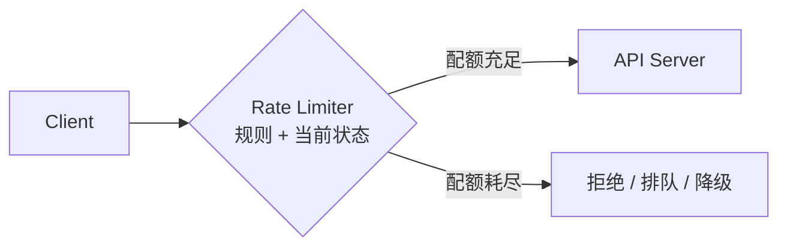

可以把最基本的策略抽象为：

$$
Decision(subject, action, t)=
\begin{cases}
allow,& usage(subject, action, window_t)<limit\\
reject,& otherwise
\end{cases}
$$

- `subject` 是受限主体，如用户 ID；
- `action` 是操作，如 `POST /posts`；
- `window_t` 是与时间 $t$ 对应的统计窗口；
- `usage` 由具体算法定义。

这个表达仍然隐藏了突发是否允许、窗口如何移动、并发如何更新等关键问题，五类算法正是在给出不同的 `usage` 与状态转移定义。

### 1.2 限流与配额的关系

二者经常混用，但侧重点不同：

- **Rate limit（速率限制）**关注短时间内的操作速度，如 100 requests/s；
- **Quota（配额）**关注较长周期的累计量，如 100 万 requests/month；
- 同一系统可以同时实施秒级突发限制和月度商业配额。

例如一个 API 套餐可以规定：

```text
短时限制：100 requests/second，允许短暂 burst
每日配额：1,000,000 requests/day
并发限制：最多 50 个在途请求
```

三者分别保护瞬时处理能力、商业用量和连接/线程资源，不能用一个计数器完全替代。

### 1.3 收益一：防止资源耗尽和 DoS

恶意攻击者、失控脚本或客户端 bug 都可能在短时间内制造大量请求。即使每个请求合法，聚合流量也会耗尽：

- CPU 与工作线程；
- 数据库连接；
- 内存与队列；
- 网络带宽；
- 下游服务配额。

限流在昂贵业务逻辑之前拒绝过量请求，将资源保留给符合策略的流量。

它只是纵深防御的一层。大规模 DDoS 可能在请求到达应用限流器之前就耗尽网络链路，还需要 CDN、Anycast、清洗中心、WAF 和网络层防护。

### 1.4 收益二：降低成本并保护稀缺依赖

若服务每调用一次第三方信用查询、支付或医疗数据 API 都付费，失控重试会直接产生账单。设：

- 单次调用成本为 $c$；
- 未限流调用量为 $N$；
- 允许调用量为 $L$。

当 $N>L$ 时，理论上可避免的直接调用成本约为：

$$
CostSaved=(N-L)c
$$

限流也可以为高优先级客户或核心 API 预留资源，避免低价值流量挤占稀缺预算。

### 1.5 收益三：防止服务器过载

服务吞吐接近饱和后，延迟通常不是线性上升，而是队列积压、超时与重试共同造成陡增。若到达率为 $\lambda$、稳定处理率为 $\mu$：

- $\lambda<\mu$：长期可稳定，短时波动可由缓冲吸收；
- $\lambda\approx\mu$：余量很小，尾延迟容易恶化；
- $\lambda>\mu$：队列持续增长，最终超时或耗尽资源。

限流把进入系统的有效到达率控制在安全容量附近。它不能创造吞吐，只能通过拒绝、延迟或排队使负载与资源匹配。

### 1.6 限流、节流、并发控制和熔断

| 机制 | 控制对象 | 典型触发条件 | 主要目标 |
|---|---|---|---|
| Rate limiting | 单位时间内请求数 | 配额用尽 | 公平、成本、容量保护 |
| Throttling | 流量速度或资源份额 | 超过目标速率 | 平滑输出，可能延迟而非拒绝 |
| Concurrency limiting | 同时在途请求数 | 并发槽位耗尽 | 保护连接、线程、内存 |
| Circuit breaker | 对故障依赖的调用 | 错误率/超时超过阈值 | 阻止失败扩散，等待依赖恢复 |
| Load shedding | 整体过载时丢弃工作 | 系统饱和 | 保住核心功能和已接收工作 |

实际系统可以组合：先限制每用户速率，再限制全局并发；下游故障时熔断，并在整体过载时优先丢弃低优先级请求。

---

## 2. Step 1：理解问题并确定设计范围

作者通过候选人与面试官的问答逐步确认需求。每个问题都排除一组完全不同的设计。

### 2.1 客户端限流还是服务端 API 限流

面试官确定设计**服务端 API 限流器**。

客户端可以主动节流，改善体验并减少无效请求，但不能作为强制安全边界，因为：

- 客户端代码可能被修改；
- 恶意请求可以绕过官方客户端；
- 服务端无法控制所有 SDK 和版本；
- 多个客户端实例无法可靠共享全局配额。

因此，可信的执行点必须位于服务端或受服务方控制的网关。客户端限流仍然有价值，但属于合作优化，不是权威决策。

### 2.2 按 IP、用户 ID 还是其他属性限流

面试官要求规则足够灵活，支持不同属性。典型维度：

- 用户 ID；
- IP 地址；
- API key；
- 设备 ID；
- 租户/组织 ID；
- 接口或 HTTP 方法；
- 资源 ID；
- 地域、套餐、用户等级；
- 多维组合，如 `(tenant_id, endpoint)`。

限流键可以表示为：

$$
key=namespace:rule\_id:subject\_dimension
$$

示例：

```text
ratelimit:login-per-ip:203.0.113.7
ratelimit:create-post:user-42
ratelimit:search:tenant-17
```

维度越精细，公平性越好，但活跃键数量和内存消耗越大。IP 也不等于一个人：NAT 后可能有大量合法用户，共享代理或移动网络会造成误伤；攻击者也可能轮换 IP。

### 2.3 系统规模

面试官要求处理大量请求。这个回答意味着：

- 限流检查必须位于每条请求的关键路径；
- 延迟要远低于业务 API 延迟预算；
- 限流服务和状态存储都要水平扩展；
- 每请求一次远程读再一次远程写可能成本过高；
- 热门租户和全局规则会形成热点键。

若入口峰值为 $Q$ requests/s，单次限流检查平均增加 $L_r$ 秒，那么平均在途限流操作约为：

$$
Concurrency\approx QL_r
$$

100 万 QPS、限流检查 1 ms 时，平均有约 1000 个检查同时在途。微小延迟也会在大规模下转化为显著并发和资源成本。

### 2.4 是否运行在分布式环境

回答是“是”。因此不能只在每个进程维护独立计数。

假设规则是每用户 100 requests/minute，有 $n$ 个独立限流节点，流量均匀但状态不共享。若每个节点都允许 100 次，总体可能错误放行：

$$
Limit_{effective}=n\times100
$$

10 个节点就可能放行 1000 次。分布式限流的核心不是启动多个相同进程，而是让它们对同一配额形成一致或有界误差的共同认识。

### 2.5 独立服务还是应用代码

面试官把它留作设计选择。可能部署位置包括：

- API 服务器内部库；
- 独立限流中间件；
- API Gateway/Ingress/Service Mesh；
- 边缘节点；
- 独立 rate limit service 供代理调用。

选择需要结合延迟、复用、规则控制、故障隔离和团队能力，Step 2 会详细比较。

### 2.6 是否通知被限流用户

回答是“需要”。这意味着设计不能只静默丢包，还要定义：

- HTTP 状态码；
- 剩余配额；
- 限制上限；
- 可重试时间；
- 可机器解析的错误体；
- SDK 的退避行为。

客户端契约是限流系统的一部分。服务端正确拒绝但客户端立刻无休止重试，会把保护机制变成重试风暴。

### 2.7 原书需求清单及其含义

#### 准确限制过量请求

“准确”不是对所有场景都要求数学上零误差。应先定义：

- 任意滚动窗口绝不能超过上限，还是允许短暂 burst？
- 多地域间能否有小幅超发？
- 计数失败时宁可误杀还是漏放？

登录防爆破、账单配额可能要求严格；一般内容读取可接受近似。

#### 低延迟

限流位于请求前置路径，新增延迟会施加到每个请求。需要：

- 内存状态；
- 就近访问；
- 少量网络往返；
- 原子单操作或脚本；
- 避免全局锁。

#### 尽量少用内存

若每个活跃 `(主体, 规则)` 都保存状态：

$$
Memory\approx N_{active\ keys}\times Bytes_{per\ key}
$$

1000 万用户、每人 10 条规则、每状态 64 bytes，仅粗略状态就是：

$$
10^7\times10\times64=6.4\ \text{GB}
$$

真实 Redis key、对象头、哈希表、复制和碎片会进一步放大。算法状态大小因此直接影响成本。

#### 分布式限流

多个进程和服务器要共享配额，且状态存储本身必须扩容和容错。

#### 清晰的异常处理

客户端应知道为什么被拒、何时重试。服务器还要区分“业务限流”与“限流器故障”。

#### 高容错

Redis 或限流节点故障不应拖垮整个系统。需要显式选择：

- **fail-open**：限流器不可用时放行，优先业务可用性；
- **fail-closed**：限流器不可用时拒绝，优先安全、成本或合规；
- **本地降级配额**：使用保守的本地临时限制。

没有全局正确答案。公开内容读取常偏 fail-open；登录、支付和付费 API 可能偏 fail-closed 或保守降级。

### 2.8 Step 1 产物

本章要设计的是：

> 一个服务端、低延迟、内存高效、高容错的分布式 API 限流器；规则可按用户、IP 等不同维度配置；被限流客户端会收到明确响应；限流部署位置和算法将在后续权衡。

---

## 3. Step 2：限流器放在哪里

作者先从最简单的客户端—服务器模型出发，比较客户端、服务端和中间件。

### 3.1 客户端实现

客户端可以在本地维护令牌桶，减少注定失败的请求，并向用户展示等待时间。

优点：

- 不消耗服务端网络和计算；
- 用户体验更平滑；
- SDK 可自动排队和退避。

局限：

- 不可信、可绕过；
- 多设备状态不共享；
- 客户端时钟和版本不一致；
- 无法保护服务免受非官方请求。

结论：适合作为服务端限制的补充，不能作为唯一执行点。

### 3.2 API 服务器内部实现

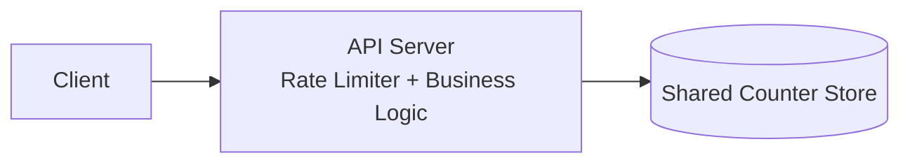

优点：

- 可访问认证后的用户和业务上下文；
- 算法完全可控；
- 可按具体业务动作定制；
- 少一个独立网络代理层。

局限：

- 多种语言和服务可能重复实现；
- 规则发布难以统一；
- 容易把限流复杂度散落在业务代码中；
- 每个服务都要处理并发和存储故障。

### 3.3 限流中间件

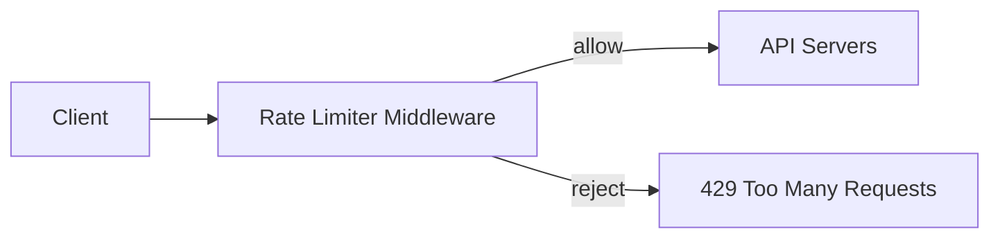

原书例子中，API 每秒允许 2 次，客户端一秒发 3 次：前两次进入 API，第三次由中间件拒绝并返回 HTTP 429。

中间件把横切策略集中化，适合多个 API 共享，但它自身进入所有请求的关键路径，必须低延迟、高可用并能水平扩展。

### 3.4 API Gateway

原书指出，微服务架构常在 API Gateway 中实现限流。Gateway 还可能承担：

- TLS 终止；
- 身份认证；
- IP allowlist/denylist；
- 路由；
- 静态内容；
- 请求转换和观测。

如果组织已经有 Gateway，在这里加入限流可以复用身份、路由和部署体系。若限流需要深层业务语义，Gateway 可能看不到所需上下文，仍要在应用层补充。

### 3.5 如何选择部署位置

作者给出四条指导：

1. 评估当前语言、缓存和技术栈是否适合服务端实现；
2. 识别业务需要的算法，第三方 Gateway 可能限制自定义能力；
3. 已使用 Gateway 处理认证等功能时，可把限流加入同一层；
4. 自建耗费工程资源，资源不足时商业 Gateway 更合适。

可以扩展为：

| 维度 | 应用内 | Gateway/中间件 | 独立限流服务 |
|---|---|---|---|
| 业务上下文 | 最丰富 | 中等 | 取决于请求描述 |
| 多语言复用 | 差 | 好 | 好 |
| 自定义算法 | 强 | 受产品能力限制 | 强 |
| 额外网络跳数 | 可较少 | 代理本就在路径上 | 通常增加 RPC |
| 统一治理 | 较难 | 强 | 强 |
| 故障隔离 | 与应用耦合 | 入口关键路径 | 可独立扩容但多依赖 |

大型系统通常是多层限流：边缘挡粗粒度攻击，Gateway 做用户/API 配额，应用层保护昂贵业务资源，下游再做并发限制。

---

## 4. 五类算法的共同问题

作者依次介绍：

1. Token bucket；
2. Leaking bucket；
3. Fixed window counter；
4. Sliding window log；
5. Sliding window counter。

选择算法前，应明确四个问题：

- 是否允许 burst？
- 是否要求任意滚动窗口都严格不超限？
- 可接受多少状态内存？
- 超限请求应立即拒绝还是排队平滑输出？

五类算法不是同一精确度下的不同写法，而是对流量语义的不同定义。

---

## 5. 令牌桶算法（Token Bucket）

### 5.1 核心直觉

令牌桶把“发送请求的权利”表示为令牌：

- 桶容量为 $B$；
- 按速率 $r$ tokens/s 补充；
- 最多保存 $B$ 个，多余令牌丢弃；
- 每个请求消耗 $c$ 个令牌，通常 $c=1$；
- 令牌够则通过，不够则拒绝或等待。

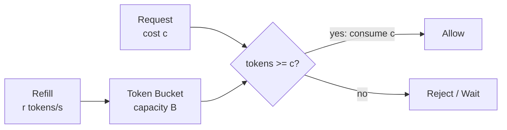

原书示例：桶容量 4，每秒补充 2 个令牌；桶满后额外令牌溢出。另一个时间线示例容量 4、每分钟补充 4 个。

### 5.2 连续时间状态公式

设上次更新时间 $t_0$ 时剩余令牌为 $T_0$，当前时刻为 $t$。补充后的令牌数：

$$
T_{refilled}=\min(B,T_0+r(t-t_0))
$$

若 $T_{refilled}\ge c$：

$$
T_{new}=T_{refilled}-c
$$

否则拒绝，请求不消耗令牌。

这个“惰性补充”无需后台定时器：每次请求到来时根据时间差计算应补多少令牌。分布式实现要保证读取旧状态、计算和写回新状态原子完成。

### 5.3 为什么它允许 burst

系统空闲时令牌积累到 $B$，随后最多可立即通过 $B$ 个单位成本请求。长期平均放行速率受 $r$ 约束，任意长度为 $\Delta t$ 的区间内，理论累计放行上界为：

$$
Allowed(\Delta t)\le B+r\Delta t
$$

$B$ 控制瞬时突发，$r$ 控制持续速率。这是令牌桶最重要的两个参数。

例：$B=20$、$r=5$/s。空闲后可以立刻通过 20 个请求；之后若持续有流量，平均只能再以约 5 QPS 通过。

### 5.4 需要多少个桶

取决于规则维度：

- 每用户每接口一个桶；
- 每 IP 一个桶；
- 每租户一个桶；
- 全局共享一个桶；
- 多层组合桶。

原书例子：每用户每秒发 1 帖、每天加 150 个朋友、每秒点赞 5 次，需要为该用户维护 3 个不同规则桶。

若 $U$ 个活跃用户、每人 $E$ 个受限接口、每桶状态 $S$ bytes：

$$
Memory\approx UES
$$

未活跃键应通过 TTL 清理，否则按注册用户总量配置会浪费大量内存。

### 5.5 参数如何调优

- $r$ 应接近下游可持续承受速率或产品配额；
- $B$ 应反映可接受 burst，而不是随意等于 $r$；
- 若 $B$ 太大，短时冲击可能压垮下游；
- 若 $B$ 太小，正常页面并行请求和网络重试也会被误杀。

可从下游安全余量推导。若服务可持续处理 $C$ QPS，并可在 $d$ 秒内吸收额外 $H$ 个请求：

$$
r\le C,\qquad B\le H
$$

还要给内部流量、重试和故障降级留余量。

### 5.6 优缺点

**优点**

- 简单、易理解；
- 每个桶只保存令牌和时间戳，内存高效；
- 支持短时 burst；
- 可以让不同请求消耗不同权重。

**缺点**

- 桶容量和补充速率不容易调；
- 严格滚动窗口语义不直观；
- 多层桶原子扣减更复杂；
- 分布式/跨地域状态可能超发。

### 5.7 适用范围

API 限流、网络整形和允许合理突发的用户操作都很合适。原书在监控部分也建议，当 flash sale 等突发导致当前算法效果差时，可以考虑令牌桶。

---

## 6. 漏桶算法（Leaking Bucket）

### 6.1 核心直觉

漏桶通常用有限 FIFO 队列实现：

1. 请求到达时，队列未满则入队；
2. 队列已满则拒绝；
3. 消费者按固定速率从队首取请求处理。

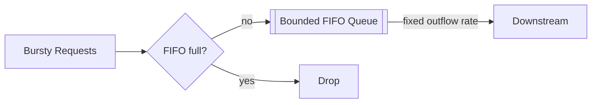

原书参数：

- bucket size：队列容量；
- outflow rate：固定处理速率。

### 6.2 与令牌桶的根本区别

- 令牌桶控制**允许进入的平均速率**，只要积累了令牌就允许瞬时 burst 直接通过；
- 漏桶把请求放入队列，以固定速率输出，主要目标是**流量整形**。

如果 API 必须立即返回结果，排队会增加用户延迟；若是可异步任务，固定输出能保护下游。

### 6.3 稳定性和积压

到达率 $\lambda$、输出率 $\mu$：

$$
\frac{dB(t)}{dt}=\lambda(t)-\mu
$$

队列容量为 $Q_{max}$。短时 $\lambda>\mu$ 时积压增长；若流量回落到 $\lambda<\mu$，队列可以清空；若长期平均 $\lambda\ge\mu$，有限队列最终必满。

排队等待时间的粗略上界：

$$
W_{max}\approx\frac{Q_{max}}{\mu}
$$

队列 1000、输出 100/s，队尾请求可能等约 10 秒。若业务超时只有 2 秒，这个队列容量即使不丢请求，也没有实际价值。

### 6.4 优缺点

**优点**

- 有限队列，内存可控；
- 输出稳定，保护不擅长应对突发的下游；
- FIFO 顺序直观。

**缺点**

- 旧突发占满队列后，新请求被拒，即使新请求更重要；
- 请求会增加排队延迟；
- 队列容量和输出速率仍需调优；
- 单 FIFO 难以表达优先级和租户公平性。

### 6.5 适用范围

适合后台任务、调用速率严格受控的第三方依赖、需要平滑输出的场景。对用户交互 API，常需结合超时、优先队列和快速拒绝。

---

## 7. 固定窗口计数器（Fixed Window Counter）

### 7.1 算法步骤

把时间轴切成长度 $W$ 的不重叠窗口，每个 `(key, window_id)` 保存一个计数：

$$
window\_id=\left\lfloor\frac{t}{W}\right\rfloor
$$

请求到达时：

1. 计算当前窗口；
2. 原子增加计数；
3. 若新计数不超过阈值 $L$，放行；否则拒绝；
4. 窗口结束后计数自然过期。

原书例子：每秒最多 3 次，每个 1 秒窗口中前 3 次通过，之后拒绝，下一秒重置。

### 7.2 窗口边界问题

规则“每分钟最多 5 次”，客户端可在 `2:00:59` 附近发送 5 次，又在 `2:01:00` 后发送 5 次。两个固定窗口分别合法，但任意滚动的 60 秒区间可能观察到 10 次：

$$
Burst_{rolling}\le2L
$$

更严格地说，在窗口边界附近可以接近 $2L$，而不是永远恰好两倍。

固定窗口定义的是“每个整齐对齐的日历窗口”，不是“任意连续 $W$ 时间”。若产品就是“每天零点重置配额”，这种边界行为可能完全符合语义。

### 7.3 状态与 Redis 实现

key 可包含窗口编号：

```text
rate:{rule_id}:{subject}:{window_id}
```

第一次创建时设置 TTL。检查、递增和设置过期应原子化，避免 `INCR` 成功而 `EXPIRE` 失败留下永久 key。

### 7.4 优缺点

**优点**

- 只保存一个计数，内存高效；
- 容易理解和实现；
- 日历配额语义自然；
- Redis 的原子计数非常适合。

**缺点**

- 边界可产生接近两倍的滚动窗口 burst；
- 同一时刻大量 key 重置可能形成突发；
- 不适合严格的任意滑动窗口限制。

---

## 8. 滑动窗口日志（Sliding Window Log）

### 8.1 为什么引入

固定窗口的缺陷来自窗口边界。滑动日志直接保存最近 $W$ 时间内每个请求的时间戳，因此可以精确回答：

$$
count\{t_i\mid t-W<t_i\le t\}\le L
$$

### 8.2 算法步骤

原书流程：

1. 保存请求时间戳，常用 Redis Sorted Set；
2. 新请求到来时删除窗口起点之前的旧时间戳；
3. 把新时间戳加入日志；
4. 日志大小不超过上限则接受，否则拒绝。

原书特别说明，即使被拒绝的请求，其时间戳也可能暂时留在日志中。这会提高内存占用，也使算法表达“所有尝试”而非只计成功请求。不同实现可以在拒绝后删除新时间戳，但必须保持原子性和明确语义。

### 8.3 原书时间线

限制：每分钟最多 2 次。

| 时刻 | 清理后 + 插入后的日志 | 结果 |
|---|---|---|
| 1:00:01 | `[1:00:01]` | 通过 |
| 1:00:30 | `[1:00:01, 1:00:30]` | 通过 |
| 1:00:50 | `[1:00:01, 1:00:30, 1:00:50]` | 拒绝，但时间戳保留 |
| 1:01:40 | 删除早于 1:00:40 的两项，剩 `[1:00:50]`，插入 1:01:40 后为 2 项 | 通过 |

窗口边界要严格定义开闭区间。原书使用 `[1:00:40, 1:01:40)` 描述当前时间框架，而决策时又包含当前请求；工程实现应统一为如 `(t-W,t]`，避免边界多算或少算。

### 8.4 Redis Sorted Set 思路

以时间戳为 score、唯一请求 ID 为 member：

```text
ZREMRANGEBYSCORE key -inf (now-window)
ZADD key now request_id
ZCARD key
EXPIRE key window
```

这些命令必须通过 Lua 或事务原子组合，否则并发请求仍会都看到未超限并放行。

### 8.5 复杂度与内存

若窗口内保存 $m$ 个时间戳：

- 插入有序集合约 $O(\log m)$；
- 删除旧项与删除数量相关；
- 计数通常可快速获取；
- 每个请求都占一条状态，内存约 $O(m)$。

若 100 万活跃主体、每个窗口允许 100 次，就可能保存约 1 亿条成员，远大于每主体一个计数器。

### 8.6 优缺点

**优点**

- 任意滚动窗口都能严格控制；
- 语义直观，适合安全敏感操作；
- 可保留详细请求时间分布。

**缺点**

- 内存消耗大；
- 每请求需要有序集合操作和旧项清理；
- 热点 key 的单分区负载高；
- 被拒请求也保留时成本更高。

---

## 9. 滑动窗口计数器（Sliding Window Counter）

### 9.1 为什么需要混合方案

它结合：

- 固定窗口计数器的低内存；
- 滑动日志对滚动窗口的近似。

不保存每个时间戳，只保存当前和前一个固定窗口的总计数，再按重叠比例估算前窗口对当前滚动区间的贡献。

### 9.2 推导公式

设：

- 窗口长度为 $W$；
- 当前固定窗口已经过去比例为 $p\in[0,1)$；
- 当前窗口计数为 $C_{curr}$；
- 前一窗口计数为 $C_{prev}$。

最近 $W$ 时间与前一窗口重叠比例为 $1-p$，估算滚动计数：

$$
\widehat C=C_{curr}+(1-p)C_{prev}
$$

原书例子：上一个窗口 5 次，当前窗口 3 次，当前已走到 30%，则：

$$
\widehat C=3+(1-0.3)\times5=3+3.5=6.5
$$

原书正文写成 `3 + 5 * 0.7% = 6.5`，从结果可知应理解为 `3 + 5 × 0.7`，即 70% 重叠比例，而不是 0.7%。这是排版/符号错误。

若阈值是 7，对 6.5 向下取整为 6，则当前请求通过；再来一次后达到限制。向上还是向下取整取决于误放和误杀哪个代价更高。

### 9.3 为什么只是近似

公式假设前一窗口的请求均匀分布。若前窗口 5 次全部发生在其开头，当前滚动窗口可能一个都不包含；若全部发生在末尾，可能全部包含。算法却统一估为 $0.7\times5=3.5$。

估计误差来自**窗口内部时间分布未知**，而不是浮点计算不精确。

### 9.4 优缺点

**优点**

- 每主体只需两个计数与时间窗口信息，内存高效；
- 比固定窗口平滑边界突发；
- 每请求计算简单；
- 大规模场景中近似误差可能很低。

原书引用 Cloudflare 实验：4 亿请求中约 0.003% 被错误放行或错误限制。该结果与其工作负载和实现有关，不能直接承诺所有系统都有相同误差。

**缺点**

- 不是严格滚动窗口；
- 请求分布不均时误差增大；
- 取整策略会引入偏差；
- 跨节点更新仍需原子性。

### 9.5 适用范围

适合高吞吐、内存敏感、允许小幅误差的 API 限流。严格账单、安全尝试次数等场景应谨慎使用。

---

## 10. 五种算法如何选择

| 算法 | 状态量 | Burst | 滚动窗口精确性 | 超限行为 | 主要优点 | 主要局限 |
|---|---:|---|---|---|---|---|
| Token bucket | 每桶令牌 + 时间 | 允许，最多由桶容量控制 | 不直接定义严格窗口 | 通常拒绝/等待 | 平均速率 + 突发兼顾 | 参数调优 |
| Leaking bucket | 有限 FIFO | 输入可突发，输出被平滑 | 不以窗口计数为核心 | 排队，满后丢弃 | 固定输出速率 | 排队延迟、旧请求占位 |
| Fixed window | 每窗口一个计数 | 边界可接近 $2L$ | 低 | 拒绝 | 最简单、内存低 | 边界突发 |
| Sliding log | 窗口内每个时间戳 | 严格受限 | 高 | 拒绝 | 任意滚动窗口准确 | 内存和操作成本高 |
| Sliding counter | 当前/前窗计数 | 较平滑 | 近似 | 拒绝 | 低内存、边界更平滑 | 假设均匀分布 |

### 10.1 选择问题树

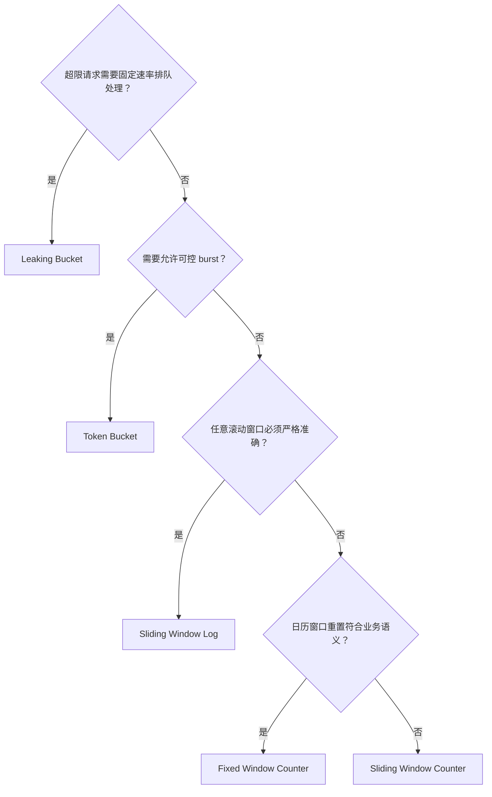

实际系统可组合：用户层令牌桶 + 租户固定日配额 + 全局并发限制。

### 10.2 可运行的算法示例

下面代码使用 Python 标准库实现四种“立即判定”算法，并实现漏桶队列。它用于验证状态转移，不模拟线程安全或分布式 Redis。

```python
from collections import defaultdict, deque
from dataclasses import dataclass, field

@dataclass
class TokenBucket:
    capacity: float
    refill_rate: float
    tokens: float
    updated_at: float = 0.0

    def allow(self, now: float, cost: float = 1.0) -> bool:
        elapsed = max(0.0, now - self.updated_at)
        self.tokens = min(
            self.capacity,
            self.tokens + elapsed * self.refill_rate,
        )
        self.updated_at = now
        if self.tokens < cost:
            return False
        self.tokens -= cost
        return True

@dataclass
class FixedWindowCounter:
    limit: int
    window: float
    counts: dict[int, int] = field(default_factory=lambda: defaultdict(int))

    def allow(self, now: float) -> bool:
        window_id = int(now // self.window)
        self.counts[window_id] += 1
        return self.counts[window_id] <= self.limit

@dataclass
class SlidingWindowLog:
    limit: int
    window: float
    timestamps: deque[float] = field(default_factory=deque)

    def allow(self, now: float) -> bool:
        boundary = now - self.window
        while self.timestamps and self.timestamps[0] <= boundary:
            self.timestamps.popleft()
        self.timestamps.append(now)
        return len(self.timestamps) <= self.limit

@dataclass
class SlidingWindowCounter:
    limit: int
    window: float
    counts: dict[int, int] = field(default_factory=lambda: defaultdict(int))

    def estimated_count(self, now: float) -> float:
        window_id = int(now // self.window)
        elapsed_fraction = (now % self.window) / self.window
        return (
            self.counts[window_id]
            + (1.0 - elapsed_fraction) * self.counts[window_id - 1]
        )

    def allow(self, now: float) -> bool:
        window_id = int(now // self.window)
        estimate_after_request = self.estimated_count(now) + 1
        if estimate_after_request > self.limit:
            return False
        self.counts[window_id] += 1
        return True

@dataclass
class LeakyBucket:
    capacity: int
    outflow_rate: float
    queue: deque[str] = field(default_factory=deque)

    def submit(self, request_id: str) -> bool:
        if len(self.queue) >= self.capacity:
            return False
        self.queue.append(request_id)
        return True

    def drain(self, seconds: float) -> list[str]:
        count = min(len(self.queue), int(seconds * self.outflow_rate))
        return [self.queue.popleft() for _ in range(count)]

# Token bucket: capacity 4, refill 2/s. Four immediate requests pass,
# the fifth fails; after 0.5 seconds one token has returned.
token_bucket = TokenBucket(4, 2, 4)
assert [token_bucket.allow(0) for _ in range(5)] == [True] * 4 + [False]
assert token_bucket.allow(0.5) is True

# Fixed-window boundary: 5 requests just before and 5 just after
# the boundary all pass, despite fitting in a short rolling interval.
fixed = FixedWindowCounter(limit=5, window=60)
assert all(fixed.allow(59.9) for _ in range(5))
assert all(fixed.allow(60.1) for _ in range(5))

# Sliding log rejects the third request within one minute.
log = SlidingWindowLog(limit=2, window=60)
assert [log.allow(t) for t in [1, 30, 50]] == [True, True, False]
assert log.allow(100) is True

# Sliding counter: previous window=5, current window=3, 30% elapsed.
counter = SlidingWindowCounter(limit=7, window=60)
counter.counts[0] = 5
counter.counts[1] = 3
assert counter.estimated_count(78) == 6.5

# Leaky bucket accepts only up to capacity and drains at a fixed rate.
leaky = LeakyBucket(capacity=3, outflow_rate=2)
assert [leaky.submit(str(i)) for i in range(4)] == [True, True, True, False]
assert leaky.drain(1) == ["0", "1"]

print("all rate-limiting examples passed")
```

注意：示例滑动日志沿用原书“拒绝时间戳仍保留”的语义，因此 1:01:40 时会把 1:00:50 的被拒记录计入窗口。若业务只统计已放行请求，应在拒绝时移除刚插入记录。

---

## 11. 高层架构：为什么选择 Redis

算法的共同需求是保存计数、令牌、时间戳或队列状态。作者先提出最简单的高层模型：

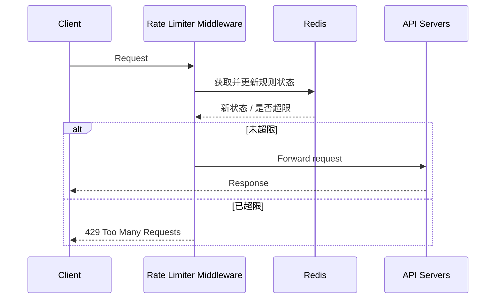

### 11.1 为什么不直接用关系数据库

限流检查是高频、低延迟、短生命周期状态：

- 每个请求都要读写；
- 计数通常只在一个窗口内有价值；
- 不需要复杂关系查询；
- 磁盘数据库的延迟和连接成本较高；
- 热点计数行会产生锁竞争。

这不代表数据库永远不能做限流，而是它通常不适合大规模请求关键路径中的瞬时计数。配置规则可以持久化在数据库/文件中，运行时状态放内存存储。

### 11.2 Redis 的两个基础命令

原书介绍：

- `INCR key`：原子把整数值加 1；
- `EXPIRE key seconds`：设置 TTL，到期自动删除。

固定窗口的直觉实现：

```text
count = INCR(key)
if count == 1:
    EXPIRE(key, window_seconds)
allow = count <= limit
```

但 `INCR` 与 `EXPIRE` 是两个命令：客户端在二者之间崩溃会留下无 TTL key。生产实现应使用 Lua、事务或支持原子带过期计数的数据结构。

### 11.3 高层流程

原书 Figure 4-12：

1. 客户端请求进入限流中间件；
2. 中间件从 Redis 相应 bucket 读取计数；
3. 达到限制则拒绝；
4. 未达到则转发到 API，同时增加计数并保存。

从并发正确性看，“先读、再检查、再增加”不能实现为分离的客户端往返。应把**检查 + 修改 + TTL**作为一个原子状态转换，并先成功获取配额，再把请求交给 API。

### 11.4 状态 key 的设计

一个常见结构：

```text
rl:{rule_version}:{rule_id}:{subject_hash}:{window_or_bucket}
```

需要考虑：

- 不把敏感用户信息直接放 key；
- 规则版本变化时如何迁移或隔离旧状态；
- Redis Cluster hash tag 是否导致热点；
- 多维规则的 key 基数；
- TTL 要覆盖状态需要的最长窗口；
- 全局规则会形成单热点 key。

---

## 12. Step 3：规则如何创建与存储

高层架构没有回答：规则从哪里来，以及超限后怎么办。作者先讨论规则。

### 12.1 原书规则示例

营销消息每天最多 5 条：

```yaml
domain: messaging
descriptors:
  - key: message_type
    value: marketing
    rate_limit:
      unit: day
      requests_per_unit: 5
```

登录每分钟最多 5 次：

```yaml
domain: auth
descriptors:
  - key: auth_type
    value: login
    rate_limit:
      unit: minute
      requests_per_unit: 5
```

原书借鉴 Lyft 开源限流组件，并说明规则通常写在配置文件、保存在磁盘。

### 12.2 规则包含什么

生产规则通常还要包括：

```text
rule_id
match dimensions / descriptors
algorithm
limit and window or refill rate and capacity
priority / tier overrides
hard or soft behavior
drop / queue / degrade action
effective time and version
owner and audit metadata
```

规则是策略，计数/令牌是运行时状态。二者应分离：修改规则不应要求部署业务代码，运行状态也不应写回配置系统。

### 12.3 规则冲突与组合

一个请求可能同时匹配：

- 每 IP 登录 5/min；
- 每用户登录 10/min；
- 全局登录 100k/s。

常见语义是所有适用规则都必须有配额：

$$
allow=allow_{ip}\land allow_{user}\land allow_{global}
$$

需要定义扣减顺序和原子性。若先扣用户桶，随后发现全局桶不足，是否退还用户令牌？可采用预检查后原子多桶扣减，或接受保守消耗。跨 Redis 分片的多 key 原子事务会显著复杂。

### 12.4 规则发布

原书详细图中：

1. 规则持久化在磁盘；
2. Worker 定期拉取；
3. Worker 把规则写入规则缓存；
4. 限流中间件从缓存读取。

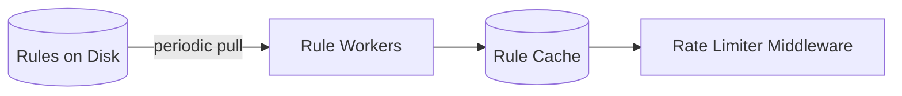

定期拉取简单但有传播延迟。设计要说明：

- 新规则多久全局生效？
- 规则缓存不可用时使用最近版本还是拒绝？
- 各节点版本不一致如何监控？
- 错误规则如何验证、灰度和回滚？
- 删除规则后旧计数何时清理？

对安全紧急封禁，普通轮询延迟可能不可接受，可用推送或缩短紧急策略路径。

---

## 13. 超过限制后如何处理

### 13.1 HTTP 429

原书要求返回：

```http
HTTP/1.1 429 Too Many Requests
```

429 表示客户端在给定时间发送了过多请求。它不同于：

- 401：未认证；
- 403：已识别但无权限；
- 503：服务暂时不可用；
- 509：非标准带宽超限码，不应作为通用替代。

响应体可包含稳定错误码：

```json
{
  "error": "rate_limit_exceeded",
  "rule": "login-per-ip",
  "retry_after_seconds": 42
}
```

不要泄露攻击者可利用的敏感内部规则细节。

### 13.2 丢弃还是进入消息队列

原书说根据用例选择：

- 普通交互请求可拒绝，由客户端稍后重试；
- 因系统过载被限的订单等高价值工作可暂存队列，稍后处理。

排队前必须满足：

- 请求仍有时效价值；
- 用户能收到“已接收、处理中”而非同步成功假象；
- 请求有幂等键；
- 队列容量、保留期和优先级明确；
- 异步完成有查询或通知机制。

不能把所有超限请求都入队，否则持续过载只会把拒绝问题变成无界积压。

### 13.3 原书响应头

```http
X-Ratelimit-Limit: 100
X-Ratelimit-Remaining: 0
X-Ratelimit-Retry-After: 42
```

- `X-Ratelimit-Limit`：窗口上限；
- `X-Ratelimit-Remaining`：当前窗口剩余次数；
- `X-Ratelimit-Retry-After`：等待多少秒后可再次请求。

原书在 429 时返回 Retry-After。实际 HTTP 中常见标准字段：

```http
Retry-After: 42
```

剩余量在高并发、跨地域和近似算法下可能只是快照，不应让客户端把它当强事务承诺。

### 13.4 如何计算重试时间

固定窗口：

$$
retry\_after=window\_end-now
$$

令牌桶若请求成本为 $c$、当前令牌为 $T<c$、补充速率为 $r$：

$$
retry\_after=\frac{c-T}{r}
$$

漏桶可根据队列位置和输出速率估算，但若队列已满通常直接拒绝。

---

## 14. 详细架构与端到端数据流

原书 Figure 4-13 把控制面和数据面组合起来：

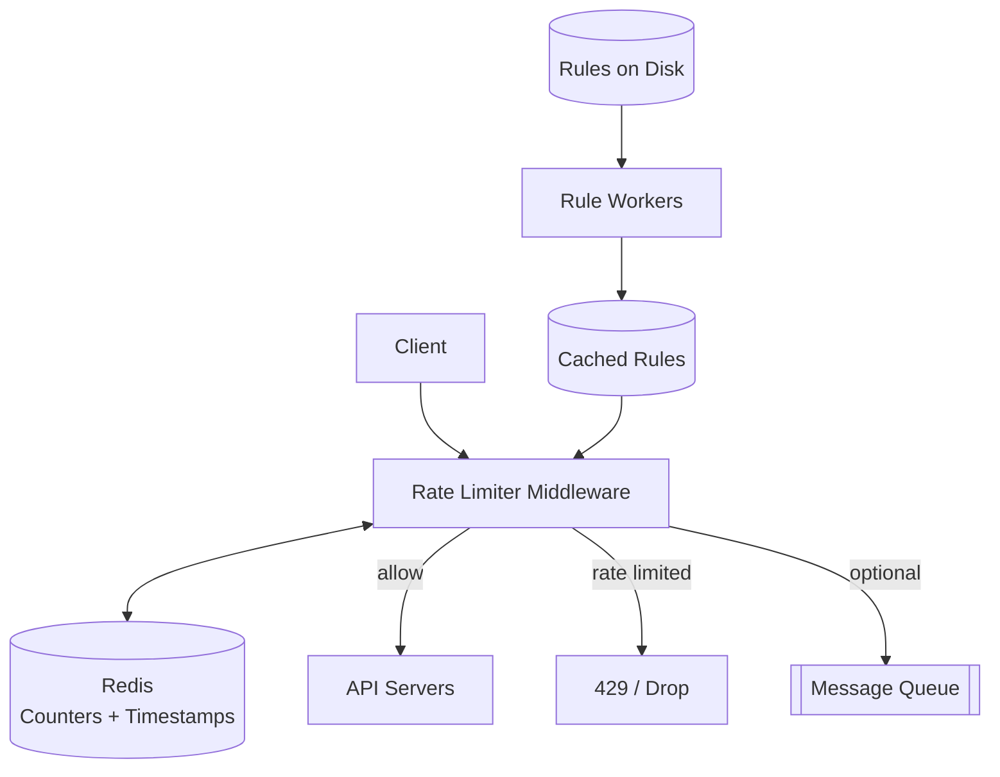

### 14.1 控制面与数据面

- **控制面**：规则创建、验证、持久化、版本、分发；变化相对低频。
- **数据面**：每个请求匹配规则、读取/更新状态并作决定；高频且延迟敏感。

分离后，规则系统可以强调审计与正确性，数据路径强调本地缓存和原子快速操作。

### 14.2 一次请求的详细步骤

1. 客户端发送请求；
2. 限流中间件识别主体和操作；
3. 从规则缓存匹配适用规则；
4. 构造一个或多个状态 key；
5. 在 Redis 原子执行算法状态转换；
6. 若允许，转发 API；
7. 若拒绝，返回 429 和头字段；
8. 根据业务丢弃或投递队列；
9. 发出允许/拒绝/错误指标。

### 14.3 认证与限流顺序

- 按 IP 的粗粒度防护可在认证前执行；
- 按用户/套餐限流需要认证后身份；
- 认证本身也可能昂贵，不能只在认证后防护；
- 可采用前置 IP 限流 + 认证后用户限流。

### 14.4 热点与分片

按用户 key 可以较均匀分片，但全局 10,000 QPS 配额只有一个热点状态。处理方向：

- 为全局配额预分配本地令牌批次；
- 使用分层令牌桶；
- 按地域或节点拆子配额，定期再平衡；
- 接受有界超发；
- 使用单分区高性能原子执行。

子配额提高吞吐，却可能在某节点空闲、另一节点耗尽时降低利用率；动态借用又增加协调。

---

## 15. 分布式环境挑战一：竞态条件

### 15.1 原书的错误流程

高层伪代码：

```text
counter = read_from_redis(key)
if counter + 1 <= limit:
    write_to_redis(key, counter + 1)
    allow
else:
    reject
```

若初值为 3，两个请求同时读取 3，各自写 4。最终计数是 4，但真实请求数是 5，这叫 lost update（丢失更新）。更严重的是，两者可能都被错误放行。

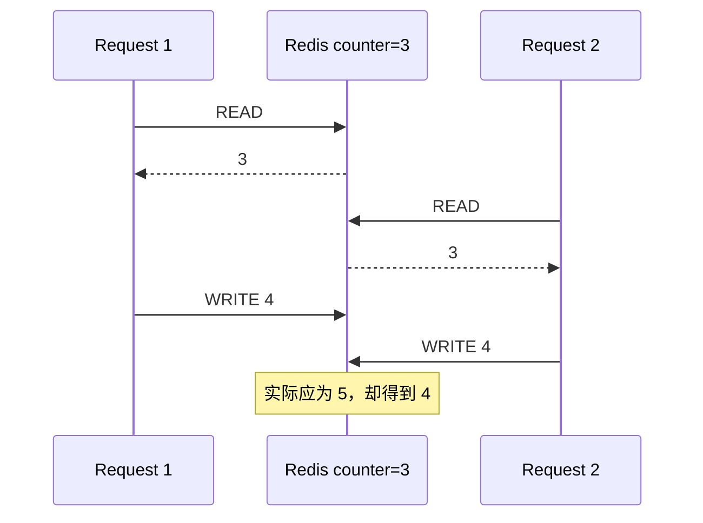

问题不是 `INCR` 本身不原子，而是“读取 → 检查 → 修改”整体不是一个原子决策。

### 15.2 为什么锁不理想

分布式锁可以串行化同一 key，但：

- 每请求增加获取/释放锁的往返；
- 热点 key 所有请求串行；
- 锁超时、持有者崩溃和 fencing 更复杂；
- 限流器本来就是保护关键路径，锁可能成为新瓶颈。

原书推荐 Redis Lua 脚本或 Sorted Set 技巧。

### 15.3 Lua 脚本为何有效

Redis 在执行 Lua 脚本期间原子地运行脚本内命令，不会被其他命令穿插。固定窗口示意：

```lua
local current = redis.call('INCR', KEYS[1])
if current == 1 then
    redis.call('EXPIRE', KEYS[1], ARGV[2])
end

local limit = tonumber(ARGV[1])
if current <= limit then
    return {1, limit - current}
end
return {0, 0}
```

调用参数：

- `KEYS[1]`：状态 key；
- `ARGV[1]`：阈值；
- `ARGV[2]`：TTL 秒数。

脚本把递增、首次 TTL 和决策绑定成一个原子操作。脚本要短小，避免阻塞 Redis 事件循环；在 Redis Cluster 中，多 key 脚本通常要求 key 位于同一 hash slot。

### 15.4 Sorted Set 如何支持精确滑动窗口

Lua 中原子完成：

1. 删除过期 score；
2. 统计当前成员；
3. 未达上限才加入当前唯一 request ID；
4. 设置过期；
5. 返回允许与剩余量。

若多个请求时间戳相同，member 不能只用时间戳，否则后者会覆盖前者；应加入 request ID 或随机后缀。

### 15.5 原子性仍有边界

Redis 原子脚本解决单实例/单分片内部竞态，但不能自动解决：

- 主从异步复制后主节点故障导致的计数回退；
- 多地域各自写入；
- 多个状态 key 跨分片原子扣减；
- 请求获批后 API 未执行，配额是否退回；
- Redis 超时但脚本其实成功，客户端结果未知。

限流通常允许保守消耗令牌，不必在业务失败后补偿；若配额等同计费，就需要更严格的账本语义。

---

## 16. 分布式环境挑战二：多节点同步

### 16.1 本地状态为何错误

原书 Figure 4-15：Client 1 最初访问 Rate Limiter 1，Client 2 访问 Rate Limiter 2；无状态 Web 层会让后续请求落到不同节点。若每个节点只知道本地计数，就无法识别同一客户端的总使用量。

### 16.2 Sticky session 为什么不推荐

把同一客户端始终路由到同一限流节点可暂时避免状态同步，但：

- 节点故障会丢状态或改变配额；
- 新增/删除节点导致重映射；
- 热用户造成节点热点；
- 多设备和多个入口仍难以聚合；
- 自动扩缩容和多地域不灵活。

粘滞只能隐藏共享状态问题，不能可靠解决。

### 16.3 集中式 Redis

原书更好的方案：所有限流节点读写同一集中状态存储。

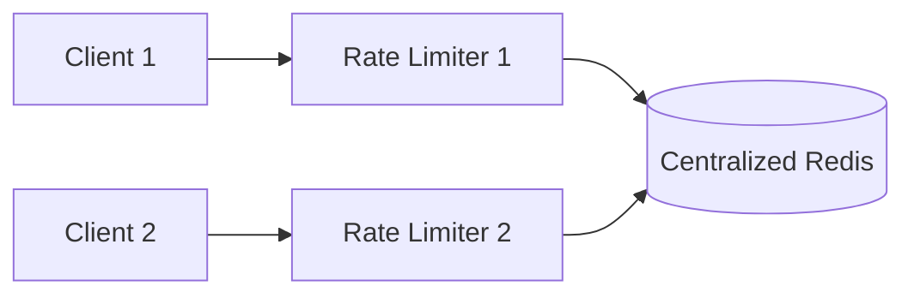

优点：

- 节点无状态，可任意路由和扩缩容；
- 同一 key 有权威计数；
- Redis 提供原子命令、TTL 和高吞吐。

新的问题：

- Redis 延迟进入每个请求；
- Redis 集群分片与热点；
- 故障转移期间计数可能回退；
- 状态存储不可用时的 fail-open/closed；
- 单地域 Redis 无法低延迟服务全球。

### 16.4 本地租约/令牌批次优化

高 QPS 系统可让中央服务一次分配一批令牌给每个节点：

1. 全局桶有 10,000 个令牌；
2. 每个边缘节点租用 100 个；
3. 节点在本地无网络往返地扣减；
4. 用完再申请。

最大潜在超发/浪费与未归还租约有关。若 $n$ 个节点、每批 $b$ 个，故障或分区时未使用配额上界约为：

$$
WastedOrUncoordinated\le nb
$$

批次大则中央压力小但误差大；批次小则精确但频繁协调。这是精确性与性能的直接权衡。

---

## 17. 性能优化：就近处理与最终一致

作者给出两条：多数据中心/边缘部署，以及用最终一致性同步数据。

### 17.1 为什么要靠近用户

限流器位于每个请求的前置路径。若亚洲用户每次都去美国 Redis 检查，跨洲 RTT 可能远高于业务服务本身。

边缘部署可：

- 减少用户到执行点延迟；
- 在流量进入核心网络前挡掉过量请求；
- 降低源站和跨地域带宽。

原书引用历史时点：截至 2020-05-20，Cloudflare 有 194 个地理分布的边缘位置。这个数字具有时间性，方法论不依赖具体数量。

### 17.2 跨地域精确全局配额的物理代价

如果全球所有请求都必须严格共享一个配额，每次决策需要：

- 访问单一权威地域，承担跨洲 RTT；或
- 通过跨地域共识同步写入，承担多数副本网络延迟；或
- 提前分配区域子配额，接受利用率/精确性折损。

无法同时获得零延迟、零超发和完全动态的全球共享配额。需求必须选择优先级。

### 17.3 最终一致性意味着什么

不同地域先在本地作决定，再异步同步计数。短时间内各地看不到对方最新请求，因此全局可能超发。

假设 $R$ 个地域，各自允许完整上限 $L$ 且网络分区，则极端有效上限可达：

$$
L_{effective}\le RL
$$

更合理的是分配子配额 $L_i$：

$$
\sum_{i=1}^{R}L_i\le L
$$

这样即使分区也不超全局上限，但某区域用完、其他区域空闲时会拒绝合法流量。可以周期性再平衡，仍有传播延迟。

### 17.4 选择一致性模型

| 场景 | 倾向 |
|---|---|
| 登录爆破保护 | 地域本地严格 + 风险聚合，宁可保守 |
| 计费硬配额 | 中央权威或严格子配额 |
| 内容读取防滥用 | 最终一致、允许小幅超发 |
| 保护单地域下游 | 每地域独立限流最自然 |
| 全球营销消息总量 | 子配额 + 周期协调 |

原书提到最终一致是性能优化，必须连同“精确性下降”一起理解。

### 17.5 其他关键路径优化

- 规则缓存在限流节点本地，避免每请求远程取规则；
- 使用 Redis Pipeline/Lua 减少往返；
- 按 key 分片状态；
- 对热点规则使用分层配额；
- 对低风险流量使用本地近似限流；
- 连接池、超时和熔断保护 Redis；
- 仅记录聚合指标，避免同步写详细日志。

---

## 18. 监控：验证算法和规则是否有效

作者要求监控两个层次：

1. 限流算法是否有效；
2. 限流规则是否有效。

### 18.1 算法有效性

应观察：

- 限流决策 QPS 和 P50/P99 延迟；
- allow/reject/error 数量；
- Redis 延迟、超时、错误和热点；
- 原子脚本执行时间；
- 跨地域同步延迟；
- 实际滚动窗口是否超发；
- 队列长度和最老请求年龄；
- 限流器故障时 fail-open 次数。

若 flash sale 突发使固定窗口边界超发或漏桶队列爆满，说明算法与流量形态不匹配。原书建议可改用支持 burst 的令牌桶。

### 18.2 规则有效性

规则太严格会拒绝合法请求，太宽松则无法保护系统。可观察：

- 每规则命中率与拒绝率；
- 不同用户等级的拒绝分布；
- 429 后重试成功率；
- 客服投诉、登录成功率、下单转化；
- 被保护下游的 CPU、延迟和错误率；
- 疑似攻击与正常流量的区分效果。

限流器的技术指标正常，不代表业务规则正确。例如营销消息严格限流可能保护发送服务，却错误阻止关键交易通知。

### 18.3 误杀与漏放

可以借用分类概念：

- **False positive（误杀）**：合法请求被限；
- **False negative（漏放）**：本应被限的请求通过。

登录安全更担心漏放，核心用户交互更担心误杀。阈值和算法需要根据两类损失调节，而不是只追求最低 429 比例。

### 18.4 监控的基数风险

不能为每个 user ID 都生成一条时序指标标签，否则会造成高基数爆炸。应：

- 按规则、接口、地域、套餐聚合；
- 对用户级问题采样日志或用专用分析存储；
- 对 top offenders 单独追踪；
- 避免把原始 IP/用户 ID 放入 Prometheus label。

### 18.5 调优闭环


规则变更应像代码一样经过评审、验证、灰度和回滚，避免一条错误全局规则造成大面积不可用。

---

## 19. Step 4：总结与延伸话题

原书回顾五类算法、系统架构、分布式环境、性能优化和监控，并提出三个可继续讨论的方向。

### 19.1 Hard vs. soft rate limiting

**硬限流（hard）**

- 请求数不能超过阈值；
- 适合安全、账单、合规和严格容量保护；
- 需要更强原子性和一致性；
- 对可用性和延迟代价更高。

**软限流（soft）**

- 短时间允许超过阈值；
- 可由令牌桶 burst、宽限额度或异步校正实现；
- 改善用户体验和系统利用率；
- 不适合“多一次就造成损失”的场景。

软限流不是“规则偶尔失效”，而是超发边界被明确设计和监控。

### 19.2 不同网络层的限流

原章主要讨论第 7 层 HTTP 限流，也提到可用 `iptables` 按 IP 在第 3 层做限制，并列出 OSI 七层：

| 层 | 名称 | 限流相关示例 |
|---:|---|---|
| 1 | Physical | 物理链路容量 |
| 2 | Data Link | 交换/队列整形 |
| 3 | Network | 按源 IP/网段限制 |
| 4 | Transport | 按连接、端口、SYN 速率限制 |
| 5 | Session | 会话级控制 |
| 6 | Presentation | 通常不单独讨论限流 |
| 7 | Application | 按用户、API、租户、业务动作限流 |

层越低：

- 越早挡住流量，成本低；
- 看到的业务上下文越少。

层越高：

- 可做精细、公平的业务规则；
- 请求已消耗更多网络、TLS 和解析资源。

最佳实践通常是多层防御，不是只选一层。

### 19.3 客户端如何避免被限流

原书建议：

1. 使用客户端缓存，减少重复 API 调用；
2. 理解限额，不在短时间发送过多请求；
3. 捕获错误并优雅恢复；
4. 重试加入足够 backoff。

### 19.4 指数退避与抖动

若所有客户端收到 429 后都在同一秒重试，会形成 thundering herd。应优先遵循服务端 `Retry-After`；否则指数退避：

$$
delay_n=\min(cap,base\times2^n)
$$

再加随机抖动，例如 full jitter：

$$
sleep_n\sim Uniform(0,delay_n)
$$

可运行示例：

```python
import random

def retry_delay(
    attempt: int,
    *,
    retry_after: float | None = None,
    base: float = 0.5,
    cap: float = 30.0,
    rng: random.Random,
) -> float:
    if retry_after is not None:
        return max(0.0, retry_after)
    maximum = min(cap, base * (2**attempt))
    return rng.uniform(0.0, maximum)

rng = random.Random(7)
delays = [retry_delay(i, rng=rng) for i in range(6)]
assert all(0 <= value <= min(30, 0.5 * (2**i)) for i, value in enumerate(delays))
assert retry_delay(3, retry_after=12, rng=rng) == 12
print([round(value, 3) for value in delays])
```

只对幂等操作自动重试，或使用幂等键保护有副作用请求。退避不能修复永久配额耗尽；若是每日配额，客户端应停止而不是持续指数重试。

### 19.5 客户端缓存的边界

缓存只适合可复用读取。对余额、权限等强新鲜度数据，缓存过久会返回错误信息。客户端还应合并相同在途请求、分页批量获取、避免轮询，并在可能时使用推送。

---

## 20. 容易混淆的概念与常见误区

### 20.1 限流与身份认证

认证回答“你是谁”，限流回答“你还能做多少次”。按用户限流依赖认证，但 IP 前置限流可在认证前保护认证服务。

### 20.2 限流与授权

授权决定能否执行某操作；限流决定被授权后以多快速度执行。没有权限的请求不应因为有剩余配额而通过。

### 20.3 Rate 与 concurrency

100 requests/s 不表示最多 100 个并发。若请求平均 2 秒，Little's Law 给出约 200 个在途请求。慢请求系统常同时需要速率和并发限制。

### 20.4 令牌桶与漏桶

- 令牌桶允许积累令牌后的 burst；
- 漏桶把输出平滑为固定速率；
- 二者都有“桶容量和速率”，但状态和用户体验不同。

### 20.5 固定窗口与滑动窗口

- 固定窗口按日历边界重置，边界附近可能接近两倍；
- 滑动日志严格查看最近 $W$；
- 滑动计数器是低内存近似，不等于日志。

### 20.6 滑动计数公式中的 0.7%

原书结果 6.5 只能由 $3+5\times0.7$ 得到。`0.7%` 是排版错误，不能按 0.007 计算。

### 20.7 Redis `INCR` 原子与整个算法原子

单个 `INCR` 原子，不代表分开的“读、检查、递增、设置 TTL”整体原子。必须用原子命令组合或脚本。

### 20.8 Redis 与绝对准确

Redis 单节点脚本能解决并发竞态，但异步复制故障切换、多地域状态和跨分片多 key 仍可能产生误差。

### 20.9 多个限流节点与水平扩展

增加无状态决策节点能扩展计算，但共享 Redis、全局热点 key 和规则缓存也必须扩展。否则只转移瓶颈。

### 20.10 Sticky session 与状态同步

粘滞把客户端固定到某节点，不能解决节点故障、多设备、再平衡和全局配额。共享状态更灵活。

### 20.11 429 与 503

- 429 表示主体违反速率策略；
- 503 表示服务整体暂时不可用或过载；
- 两者都可带 `Retry-After`，但语义和监控不同。

### 20.12 被限请求入队与延迟成功

入队表示接受异步处理，API 必须明确返回接受状态和任务 ID；不能先返回同步成功，再悄悄延迟或丢失请求。

### 20.13 Fail-open 与高容错

fail-open 保业务可用但保护失效；fail-closed 保规则但可能整体拒绝。高容错不是统一选择放行，而是按风险定义降级。

### 20.14 全局严格限流与低延迟多地域

全球严格共享配额需要协调；就近独立决策会有状态延迟。不能同时假设零协调成本和零超发。

### 20.15 剩余配额头与强承诺

响应返回后，其他并发请求可能已消耗剩余配额。`Remaining` 是观测值，不是为该客户端预留的事务额度。

### 20.16 规则越严格与系统越安全

过严会误杀合法用户、诱发重试并伤害业务。规则有效性必须由攻击阻断、下游健康和合法流量影响共同评价。

### 20.17 限流器与 DDoS 完整防护

应用层限流只能处理已经到达应用入口的请求。链路被打满时，需要更靠前的网络和边缘防护。

### 20.18 精确算法与正确业务

滑动日志可以精确执行错误阈值；算法准确不等于规则有效。监控必须同时验证二者。

---

## 21. 本章知识结构

### 21.1 需求层

- 主体、操作、窗口和上限；
- 低延迟、内存、分布式、异常响应、高容错；
- 严格/近似、burst、丢弃/排队；
- fail-open/fail-closed。

### 21.2 算法层

- 令牌桶：平均速率 + burst；
- 漏桶：有限排队 + 固定输出；
- 固定窗口：简单计数 + 边界问题；
- 滑动日志：精确滚动窗口 + 高内存；
- 滑动计数：低内存 + 近似误差。

### 21.3 架构层

- Gateway/中间件/应用部署位置；
- 规则文件、Worker 与规则缓存；
- Redis 运行状态；
- API 转发、429、丢弃或队列；
- 多限流节点和边缘部署。

### 21.4 正确性层

- 原子检查与扣减；
- Lua/Sorted Set；
- 多节点共享状态；
- Redis 故障与复制回退；
- 跨地域最终一致和有界超发。

### 21.5 运行层

- 算法和规则指标；
- 误杀与漏放；
- 规则灰度和回滚；
- 客户端 Retry-After、指数退避和 jitter；
- 多层限流与容量保护。

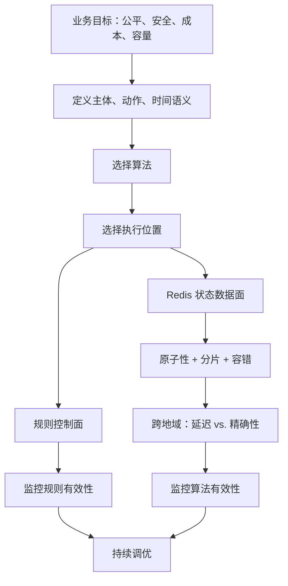

---

## 22. 核心结论与解决限流问题的一般方法

### 22.1 核心结论

1. **先定义流量语义，再选择算法。** 是否允许 burst、是否严格滚动窗口、是否排队，决定算法而非产品流行度。
2. **限流器是分布式状态机。** 计数只是表象，真正难点是原子更新、多节点共享、故障与跨地域一致性。
3. **服务端是权威执行点，客户端是合作优化。** 客户端可缓存和退避，但不可信。
4. **部署位置决定上下文与复用。** Gateway 适合统一治理，应用层适合业务语义，多层组合常最合理。
5. **Redis 适合高频短生命周期状态，但不是魔法。** 要处理 TTL 原子性、热点、分片、复制和故障模式。
6. **令牌桶和漏桶解决不同问题。** 前者允许可控 burst，后者平滑固定输出。
7. **滑动日志以内存换准确，滑动计数以小误差换规模。** 固定窗口最简单但有边界突发。
8. **单命令原子不等于业务决策原子。** 检查、扣减和过期必须作为一个原子状态转换。
9. **多地域低延迟与全局严格配额存在协调代价。** 应通过权威中心、子配额或最终一致明确权衡。
10. **超限响应是 API 契约。** 429、剩余量、Retry-After 和客户端退避共同决定系统是否真正稳定。
11. **高容错必须定义失败策略。** fail-open、fail-closed 或本地保守降级取决于业务风险。
12. **监控要同时验证算法和规则。** 精确执行过严规则仍然是失败设计。

### 22.2 一般设计流程

$$
\boxed{
\text{明确保护目标}
\rightarrow
\text{定义主体、动作和时间语义}
\rightarrow
\text{确定严格性、burst 与超限行为}
\rightarrow
\text{比较算法}
\rightarrow
\text{选择执行位置和状态存储}
\rightarrow
\text{保证原子更新与多节点共享}
\rightarrow
\text{设计故障和跨地域权衡}
\rightarrow
\text{定义客户端契约}
\rightarrow
\text{监控并调优}
}
$$

### 22.3 面试中的完整表达骨架

> 我先确认限流对象和语义：按用户与接口组合限流，允许短时 burst，但长期平均不能超过配额；超限交互请求返回 429，不排队。基于这个语义选择令牌桶，桶容量控制 burst，补充率控制持续速率。限流部署在 API Gateway 后、业务 API 前，认证前另有粗粒度 IP 限流。规则由配置服务版本化发布并缓存在节点本地，令牌状态放 Redis。检查、惰性补充、扣减和 TTL 通过 Lua 原子完成，限流节点保持无状态。多地域为降低延迟按地域分配子配额并周期再平衡，接受利用率与小幅误差的权衡。Redis 故障时，登录规则使用本地保守 fail-closed，普通读取短时 fail-open。响应带 429、Retry-After 和剩余配额，SDK 使用带 jitter 的指数退避。最后监控每规则拒绝率、误杀、Redis P99、超发和下游健康，灰度调整阈值。

这段表达从业务语义一路推导到算法、架构、正确性、容错和运行，避免只背“Redis + 令牌桶”。

### 22.4 章末自检

- [ ] 能否区分客户端建议限流与服务端权威限流？
- [ ] 能否说明用户、IP、租户和全局 key 的公平性与内存差异？
- [ ] 能否推导令牌桶 $B+r\Delta t$ 的 burst 上界？
- [ ] 能否解释漏桶为何会增加等待时间？
- [ ] 能否构造固定窗口边界接近两倍的例子？
- [ ] 能否完整走一遍滑动日志的清理、插入和判断？
- [ ] 能否推导滑动计数公式并解释均匀分布假设？
- [ ] 能否指出原书 `0.7%` 的公式排版问题？
- [ ] 能否按业务条件比较五种算法，而不是只列优缺点？
- [ ] 能否解释为什么 `INCR` 原子仍不足以保证整个限流决策原子？
- [ ] 能否说明 Lua 与 Sorted Set 分别解决什么？
- [ ] 能否解释 sticky session 为什么不适合作为多节点同步方案？
- [ ] 能否说明集中 Redis 带来的新单点、热点和延迟问题？
- [ ] 能否权衡跨地域严格配额、子配额和最终一致？
- [ ] 能否为 Redis 故障选择 fail-open、fail-closed 或本地降级？
- [ ] 能否定义 429、Retry-After 和客户端 jitter 退避？
- [ ] 能否列出算法有效性与规则有效性的不同指标？
- [ ] 能否说明第 3 层和第 7 层限流为何互补？

如果这些问题都能回答，就不仅记住了五种算法，还理解了本章真正的难点：**把一个简单的“请求次数不超过阈值”，实现为在高并发、多节点、多地域和故障条件下仍具有清晰语义、可控误差与可运维性的分布式系统。**
