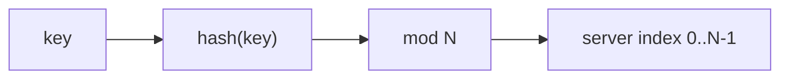
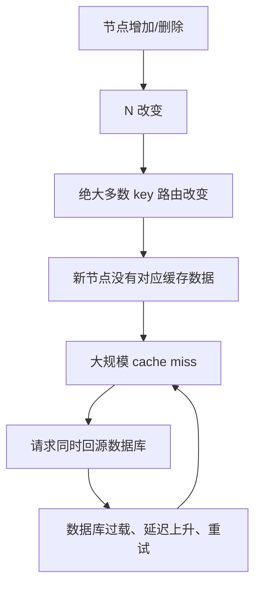
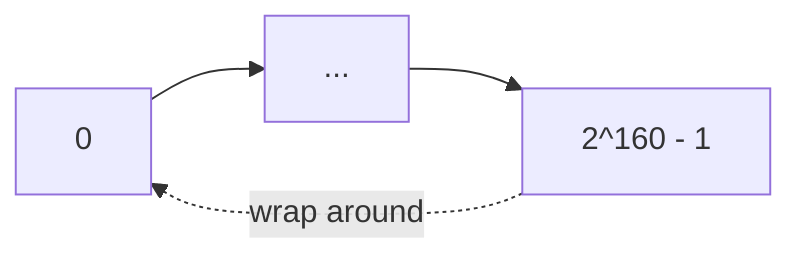
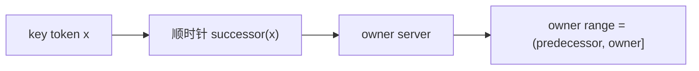
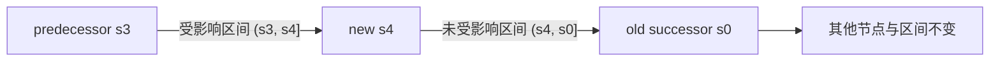
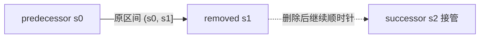
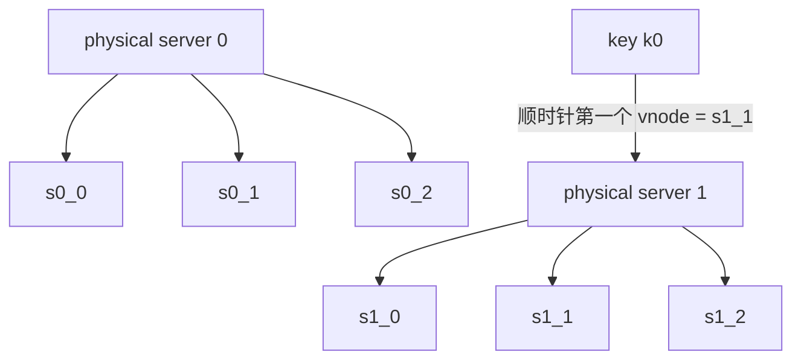
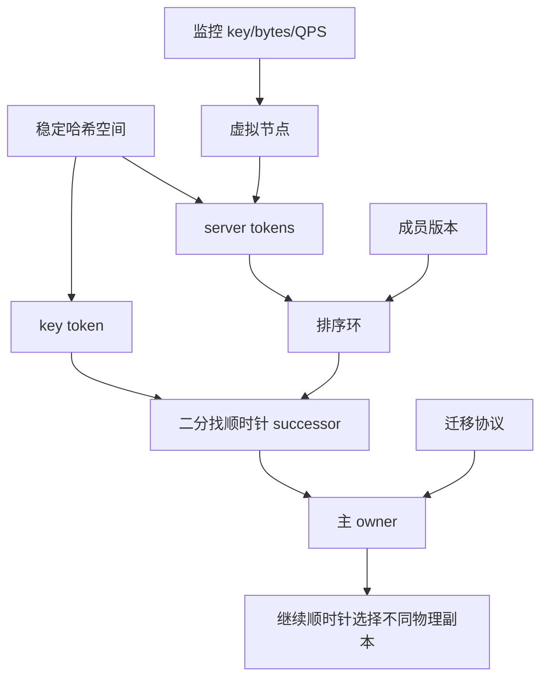

> 原书：Alex Xu，*System Design Interview: An Insider's Guide*（Second Edition）
> 原章：Chapter 5, *Design Consistent Hashing*
> 本章主线：普通取模哈希在服务器数量变化时会重映射绝大多数 key，造成缓存未命中风暴或大规模数据迁移；一致性哈希把服务器与 key 映射到同一个环形哈希空间，让增删节点只影响相邻区间；基础哈希环仍可能负载不均，因此再用虚拟节点把每台物理服务器分散到环上多个位置，以较小元数据开销换取更平衡、可加权的分布。

## 0. 学习目标、阅读边界与全章路线

一致性哈希（consistent hashing）解决的是一个动态分区问题：

> 当服务器池不断增加、删除或故障时，如何仍然把请求或数据较均匀地分配到服务器，同时尽量少移动已有 key？

读完本章，应当能够回答：

1. `hash(key) % N` 在 $N$ 固定时为什么有效，在 $N$ 变化时为什么失效？
2. 原书 4 台服务器降为 3 台时，为什么 8 个 key 中有 6 个被重映射？
3. 一致性哈希为何把线性哈希空间首尾连接成环？
4. 服务器和 key 如何映射到同一环上？
5. 为什么沿顺时针找到的第一个节点就是 key 的 owner？
6. 增加或删除节点时，究竟哪个区间的 key 会迁移？
7. 理想情况下，新增和移除一台节点分别迁移多少比例的数据？
8. 基础哈希环为何仍有分区大小和 key 分布不均的问题？
9. 虚拟节点如何降低方差，又付出哪些内存和运维成本？
10. 如何用虚拟节点数量表达异构服务器权重？
11. 如何用有序数组和二分查找实现环路由？
12. 一致性哈希能否解决单个超级热 key？
13. 缓存路由与持久化数据分片使用一致性哈希时，迁移语义有何不同？
14. 成员列表不一致、哈希函数变化和迁移中途故障如何处理？

原章按以下因果顺序展开：


本文严格沿原书“重哈希问题 → 一致性哈希定义 → 哈希空间与环 → 服务器/key 映射 → 查找 → 增删节点 → 基础方法的两个问题 → 虚拟节点 → 受影响 key → 总结”的顺序展开。

原章主要建立概念，没有给出完整代码。本文补充的概率推导、变异系数、二分查找实现、成员版本与迁移协议属于标准工程背景，不是原书逐式给出的结论。

---

## 1. 为什么水平扩展需要稳定的数据分布

### 1.1 水平扩展的前提

水平扩展通过增加服务器提高总容量或吞吐。新增机器只有真正接到一部分请求或数据，资源才会被利用；节点故障后，其工作也必须重新分配到健康节点。

一个分区方案至少要满足：

- **确定性**：同一个 key 在相同成员视图下总能找到同一节点；
- **平衡性**：数据量和请求量尽量均匀；
- **稳定性**：成员变化时尽量少重映射；
- **快速查找**：请求路径中能低成本找到 owner；
- **异构性**：高容量节点可以承担更大份额；
- **可操作性**：能定位迁移范围并安全完成交接。

“均匀”与“稳定”可能冲突。每次节点变化后重新把所有 key 完美均分，平衡性很强，却要搬迁大量数据；完全不移动 key，又无法让新节点承担负载。一致性哈希追求的是：**在近似平衡的同时，把变化局限在局部。**

### 1.2 一致性哈希分配的对象

它可以分配：

- 缓存 key；
- 数据库分区；
- 用户会话或 WebSocket 连接；
- 消息主题或分区；
- CDN 内容；
- 请求到后端节点的亲和路由。

算法只决定“某个 key 对应哪个节点”，不会自动完成复制、数据传输、故障检测、成员共识和热点消除。这些是建立在路由结果之上的系统职责。

---

## 2. 重哈希问题：`hash(key) % N` 为什么会失效

### 2.1 普通取模方案

有 $N$ 台服务器，最直接的路由是：

$$
serverIndex=hash(key)\bmod N
$$

若哈希值近似均匀，余数 $0,1,\ldots,N-1$ 的概率近似相同，每台服务器期望获得：

$$
E[K_i]=\frac{K}{N}
$$

其中 $K$ 是 key 总数，$K_i$ 是第 $i$ 台服务器上的 key 数量。



当服务器池固定、哈希分布均匀时，这个方法简单、无额外元数据、查找为 $O(1)$，完全合理。

### 2.2 原书 4 台服务器、8 个 key 的表

原书给出：

| key | hash | `hash % 4` | 原服务器 |
|---|---:|---:|---|
| key0 | 18,358,617 | 1 | server 1 |
| key1 | 26,143,584 | 0 | server 0 |
| key2 | 18,131,146 | 2 | server 2 |
| key3 | 35,863,496 | 0 | server 0 |
| key4 | 34,085,809 | 1 | server 1 |
| key5 | 27,581,703 | 3 | server 3 |
| key6 | 38,164,978 | 2 | server 2 |
| key7 | 22,530,351 | 3 | server 3 |

结果正好每台 2 个 key：

```text
server 0: key1, key3
server 1: key0, key4
server 2: key2, key6
server 3: key5, key7
```

这只是小样本恰好完全均匀。哈希函数均匀只保证统计意义上的平衡，不保证任意 8 个 key 都平均分配。

### 2.3 server 1 离线后发生什么

服务器池变成 3 台，公式改为：

$$
serverIndex'=hash(key)\bmod3
$$

原书新结果：

| key | `hash % 4` | `hash % 3` | 是否改变 |
|---|---:|---:|---|
| key0 | 1 | 0 | 是 |
| key1 | 0 | 0 | 否 |
| key2 | 2 | 1 | 是 |
| key3 | 0 | 2 | 是 |
| key4 | 1 | 1 | 否 |
| key5 | 3 | 0 | 是 |
| key6 | 2 | 1 | 是 |
| key7 | 3 | 0 | 是 |

8 个 key 中 6 个改变位置，迁移率为：

$$
\frac{6}{8}=75\%
$$

真正属于故障 server 1 的只有 key0、key4，但重算后 key2、key3、key5、key6、key7 也受影响；甚至 key4 原余数和新余数都为 1，巧合地仍在编号 1 的槽位，但“新 server 1”与故障前的物理节点身份也可能并不相同。工程实现必须区分数组槽位和稳定节点身份。

### 2.4 为什么几乎所有余数都变了

哈希值 $h$ 没变，除数从 $N$ 变成 $N-1$。在一个长度为 $N(N-1)$ 的完整余数周期中，要同时满足：

$$
h\bmod N=h\bmod(N-1)
$$

共同结果只能是 $0$ 到 $N-2$，每个结果在周期内出现一次，共 $N-1$ 个。因此保持相同数字槽位的比例为：

$$
P(unchanged)=\frac{N-1}{N(N-1)}=\frac{1}{N}
$$

重映射比例约为：

$$
P(remapped)=1-\frac{1}{N}
$$

$N=4$ 时正好是 $75\%$，与原表一致。

若从 $N$ 增加到 $N+1$，保持相同槽位的比例约为 $1/(N+1)$，重映射比例约为 $N/(N+1)$。节点越多，一次成员变化仍会影响接近全部 key。

该推导假设哈希值在完整周期上均匀，且只比较数字槽位。它用于解释数量级，不替代具体节点映射与真实 key 分布测量。

### 2.5 为什么缓存场景会形成未命中风暴

客户端按新 $N$ 计算后，会向新节点查找 key；数据却仍在旧节点：



这就是 cache miss storm。缓存节点故障本来只损失一部分缓存，取模重映射却让几乎整个缓存集群瞬间变冷，放大故障半径。

持久化存储场景更严重：新路由读不到旧数据不能简单当作 miss 回源，必须真正迁移或复制数据，并处理迁移期间的读写一致性。

### 2.6 问题的本质

取模把“key 的位置”直接绑定到“当前节点总数 $N$”。只要 $N$ 变化，全局坐标系就改变。

一致性哈希的关键创新是：

> 使用一个与节点数量无关的固定哈希空间，让节点变化只是在这个固定空间中增加或删除少数边界。

---

## 3. 一致性哈希的目标与迁移量

原书引用定义：哈希表调整大小时，一致性哈希平均只需重映射约 $k/n$ 个 key；传统哈希表改变槽位数时几乎所有 key 都会改变。

这里的 $k$ 是 key 数量，$n$ 是节点/槽位数量。更精确地区分增删：

- 从 $n$ 台中删除一台，理想均衡下被删节点拥有约 $K/n$ 个 key，因此迁移约 $K/n$；
- 在 $n$ 台基础上新增一台，新节点最终应拥有约 $K/(n+1)$ 个 key，因此迁移约 $K/(n+1)$。

与取模相比：

| 变化 | 普通取模期望重映射 | 理想一致性哈希期望重映射 |
|---|---:|---:|
| $n\rightarrow n-1$ | 约 $K(1-1/n)$ | 约 $K/n$ |
| $n\rightarrow n+1$ | 约 $Kn/(n+1)$ | 约 $K/(n+1)$ |

例：100 台缓存服务器、10 亿个 key，删除一台：

- 取模约重映射 99%：约 9.9 亿；
- 理想一致性哈希约重映射 1%：约 1000 万。

1000 万仍然不是零，但故障范围从全局降低到一个节点原有份额，系统才有机会渐进恢复。

“一致性”在这里指**节点集合变化前后映射尽量保持一致**，不是数据库中的强一致性、线性一致性或副本一致性。

---

## 4. 哈希空间与哈希环

### 4.1 固定哈希空间

原书假设使用 SHA-1。SHA-1 输出 160 bit，因此哈希值范围：

$$
0\le h(x)\le2^{160}-1
$$

记哈希空间大小：

$$
M=2^{160}
$$

工程实现不一定必须用 SHA-1。路由需要的是：

- 确定性；
- 分布近似均匀；
- 跨语言和进程结果一致；
- 计算足够快；
- 哈希空间足够大，碰撞概率可控。

安全抗碰撞通常不是分区哈希的主要目标，可以使用 xxHash、MurmurHash 等非密码哈希；但所有参与者必须统一算法、编码和种子。Python 内建 `hash()` 默认会进程随机化，不适合持久、跨进程路由。

### 4.2 从线段到环

把固定范围首尾连接：$2^{160}-1$ 后面回到 0，形成环。

数学上可理解为模 $M$ 的圆周：

$$
position(x)=h(x)\bmod M
$$

注意这里的模数 $M$ 是**固定哈希空间大小**，不是服务器数量。服务器增删不会改变 $M$。



环解决了尾部 key 的 owner 问题：若 key 位置大于最后一个服务器 token，继续顺时针会绕回第一个服务器。

### 4.3 碰撞如何处理

哈希空间很大时碰撞概率低，但服务器 token 或 key 仍可能相同。实现必须定义：

- token 相同的节点如何二次排序；
- 是否用不同盐重新生成 token；
- key token 与 server token 相等时归属哪个节点。

本文采用区间 $(predecessor, node]$，所以 key 与节点 token 相等时归该节点。生产系统应把这个边界规则写入协议并在所有语言中测试。

---

## 5. 把服务器映射到环上

原书使用相同哈希函数，根据服务器 IP 或名称生成位置：

$$
token_i=h(serverIdentity_i)
$$

四台服务器在环上形成四个边界。每台服务器负责从前一个服务器 token 之后，到自己 token 为止的区间：

$$
Range(s_i)=(token(s_{i-1}),token(s_i)]
$$

最后一台与第一台之间的区间跨越哈希空间末尾并绕回 0。

### 5.1 节点身份必须稳定

若使用临时 IP，容器重启后 IP 改变，会被视作删除旧节点并增加新节点，触发无谓迁移。更适合的身份：

- 稳定节点 ID；
- 主机名 + 固定集群 ID；
- 逻辑 shard ID；
- 由控制面分配的 token。

使用稳定身份不意味着故障节点永不移除，而是避免基础设施重建随机改变环位置。

### 5.2 随机位置与预分配 token

节点位置可以由哈希身份随机决定，也可以由控制面预先分配。随机简单，但少量节点时区间可能很不均；预分配能更可控地平衡，却需要中心元数据管理。虚拟节点是缓解随机不均的常见方案。

---

## 6. 把 key 映射到同一个环

每个 key 也计算固定哈希位置：

$$
position(key)=h(key)
$$

原书特别强调，这一步不再计算 `hash(key) % N`。key 和 server 都进入同一个固定坐标系，$N$ 只决定环上有多少节点边界，不参与 key 位置计算。

建议使用域分隔避免不同对象字符串偶然完全相同：

```text
hash("node:" + node_id + ":" + replica_index)
hash("key:" + key)
```

域分隔不是一致性哈希成立的必要条件，但能使输入命名更清楚，并减少 server identity 与业务 key 的意外语义碰撞。

---

## 7. 查找服务器：顺时针第一个节点

### 7.1 查找规则

对 key 的哈希位置 $x$：

1. 在环上从 $x$ 开始顺时针移动；
2. 遇到的第一个服务器 token 就是 owner；
3. 若越过最大 token，绕回最小 token。



原书示意中：key0 → server0、key1 → server1、key2 → server2、key3 → server3。

### 7.2 为什么规则有效

服务器 token 把环切成若干不重叠区间。定义每个区间归其顺时针终点服务器，则：

- 每个位置恰好落入一个区间；
- 没有 key 无 owner；
- 没有 key 同时有两个 owner（忽略 token 碰撞）；
- 增删一个边界只改变相邻区间。

局部变化性质正来自这一区间定义。

### 7.3 用二分查找实现

把所有服务器 token 排序为数组：

```text
[t0, t1, t2, ..., tV-1]
```

查找第一个满足 $t_i\ge x$ 的 token，即 `lower_bound(x)`：

- 找到则返回对应节点；
- 未找到则返回数组第一个节点，表示绕环。

若 token 总数为 $V$：

$$
LookupTime=O(\log V),\qquad RingMetadata=O(V)
$$

基础环每台一个 token 时 $V=N$；每台有 $v$ 个虚拟节点时 $V=Nv$。

树结构也可查找后继节点，但有序数组读多写少、缓存友好，且成员变化相对请求频率通常很低。

---

## 8. 增加服务器：只接管一个相邻区间

### 8.1 原书示例

新 server 4 插入 server 3 与 server 0 之间。新增前，该区间全部属于 server 0；新增后：

- $(server3,server4]$ 改归 server4；
- $(server4,server0]$ 仍归 server0；
- 其他区间不变。

原图只有 key0 位于被切出的区间，因此 key0 从 server0 移到 server4；key1、key2、key3 不动。



### 8.2 为什么只迁移该区间

新增前，对 $(p,x]$ 内任一 key，顺时针第一个节点是原 successor $s$；新增节点 $x$ 后，第一个节点变成 $x$。其他区间的第一个顺时针节点没有改变。

若原环理想均衡，有 $n$ 台节点，新增一台后每台期望持有 $1/(n+1)$ 哈希空间，所以新节点期望接管：

$$
E[MovedKeys]\approx\frac{K}{n+1}
$$

### 8.3 新节点上线的真实过程

只计算新 owner 不足以安全迁移持久数据。典型过程：

1. 控制面发布新环版本，但先标记节点为 joining；
2. 新节点从原 successor 复制受影响区间；
3. 复制期间捕获并同步增量写入；
4. 校验数量、校验和与副本状态；
5. 切换读写 owner；
6. 观察稳定后，原节点删除旧数据。

缓存可以更简单：允许新节点冷启动并逐步填充，但要限速回源，避免一次扩容反而压垮数据库。

---

## 9. 删除服务器：把原区间交给后继节点

### 9.1 原书示例

server 1 被删除，其原负责区间 $(server0,server1]$ 没有了终点。对该区间 key 顺时针继续查找，下一个健康节点是 server2，因此 key1 从 server1 重映射到 server2，其他 key 不受影响。



若删除前有 $n$ 台理想均衡节点，被删节点拥有约 $K/n$ 个 key：

$$
E[MovedKeys]\approx\frac{K}{n}
$$

### 9.2 计划下线与故障下线

**计划下线**可以先复制和排空，再切换 owner，风险较低。

**突然故障**时原节点可能无法提供数据：

- 缓存：后继节点从权威存储回源；
- 持久化存储：必须从副本恢复；
- 无副本的数据：一致性哈希无法避免丢失。

因此，一致性哈希最小化受影响 key 数量，但不提供数据可靠性。第 6 章会把哈希环与沿顺时针选择多个不同物理节点的复制结合起来。

---

## 10. 基础哈希环的两个问题

原书引用 Karger 等人的基础算法：

1. 用均匀哈希把服务器和 key 映射到环；
2. key 顺时针找到第一个服务器。

它解决了全局重映射，却仍有两个平衡问题。

### 10.1 问题一：分区大小不均

一个 partition 是相邻服务器 token 之间的哈希空间。随机投放少量服务器时，间距不会恰好相同。

若 server1 被移除，server2 可能同时接管 server1 的原区间，使其负责空间约为其他节点两倍。


均匀哈希表示每个 token 位置概率相同，不表示一次具体采样得到等距位置。

### 10.2 问题二：key 分布不均

即使 server 区间大小还可以，有限 key 的哈希也有随机波动；若 server tokens 聚集，可能大多数 key 都落入某个大区间，而某些节点几乎没有数据。

需要区分三类不均：

1. **token 空间不均**：物理节点在环上间距不同；
2. **key 数量不均**：有限样本随机波动或 key 哈希质量差；
3. **请求热度不均**：key 数量均匀，但某些 key 访问量极高。

虚拟节点主要改善前两类的聚合分布，对第三类只在“许多独立热点 key”时有帮助，不能拆开一个单独超级热 key。

### 10.3 负载平衡不只看 key 数

每个 key 的大小和访问成本可能不同。节点负载更接近：

$$
Load_i=\sum_{k\in node_i}
(\alpha\cdot storage_k+\beta\cdot readQPS_k+\gamma\cdot writeQPS_k)
$$

$\alpha,\beta,\gamma$ 取决于哪种资源最稀缺。一致性哈希若只按 key 哈希，默认 key 的资源成本在统计上近似独立同分布；若少量对象特别大或特别热，仍需额外机制。

---

## 11. 虚拟节点：用更多采样点降低方差

### 11.1 定义

虚拟节点（virtual node，常简称 vnode）是物理节点在环上的逻辑代表。每台服务器不再只有一个 token，而是多个：

$$
token_{i,j}=h(server_i\Vert replica_j)
$$

原书示意中：

```text
server 0 -> s0_0, s0_1, s0_2
server 1 -> s1_0, s1_1, s1_2
```

每台物理服务器因此负责环上多个互不连续的小区间。



原书只用 3 个 vnode 方便画图，真实系统通常更多。

### 11.2 为什么多个 vnode 更平衡

单 token 节点的负载取决于一个随机大区间；有 $v$ 个 vnode 时，物理节点负载是 $v$ 个分散小区间之和。一个区间偏大，其他区间可能偏小，随机误差相互平均。

在理想化的独立随机间隔模型中，聚合 $v$ 个区间的相对标准差大致随：

$$
CV=\frac{\sigma}{\mu}\propto\frac{1}{\sqrt v}
$$

因此把 vnode 数增加 4 倍，随机相对波动大约减半。这是近似直觉，真实环区间并非完全独立，key 数、权重和哈希实现也会影响结果。

原书引用实验：

- 100 个虚拟节点时，标准差约为均值的 10%；
- 200 个虚拟节点时，约为均值的 5%；
- vnode 越多，分布通常越平衡。

这些是特定实验结果，不是所有集群的固定保证。上线前应对真实节点数、key 分布和权重做模拟。

### 11.3 标准差与变异系数

有 $n$ 台服务器，负载为 $x_1,\ldots,x_n$：

$$
\mu=\frac{1}{n}\sum_{i=1}^{n}x_i
$$

总体标准差：

$$
\sigma=\sqrt{\frac{1}{n}\sum_{i=1}^{n}(x_i-\mu)^2}
$$

不同集群规模间更适合比较变异系数：

$$
CV=\frac{\sigma}{\mu}
$$

还应监控最大/平均比：

$$
Imbalance=\frac{\max_i x_i}{\mu}
$$

平均方差较低不代表没有单个严重热点，最大值更直接反映最先饱和的节点。

### 11.4 虚拟节点的代价

若 $n$ 台物理服务器、每台 $v$ 个 vnode，总 token 数：

$$
V=nv
$$

代价包括：

- 环元数据从 $O(n)$ 增至 $O(nv)$；
- 成员变更要增加/删除更多 token；
- 路由表分发更大；
- 迁移由多个小区间组成；
- 故障恢复调度和观测更复杂；
- lookup 虽仍是 $O(\log V)$，常数和缓存占用增加。

所以 vnode 并非越多越好，应根据不均衡 SLO、节点数、元数据成本和迁移并发调优。

### 11.5 异构服务器与权重

若 server A 容量约是 server B 的 2 倍，可以给 A 约 2 倍 vnode：

$$
v_i\propto capacity_i
$$

期望空间份额：

$$
share_i\approx\frac{v_i}{\sum_jv_j}
$$

例如 vnode 数 `[200, 100, 100]`，期望份额约 `[50%, 25%, 25%]`。

权重变化会改变多个区间并触发迁移，应渐进调整，避免一次把大量数据压向新节点。容量也不能只看磁盘，还可能受 CPU、网络和读写类型限制。

### 11.6 虚拟节点与副本不是同一概念

原书称 virtual nodes or replicas，但这里的 `replica` 是某物理节点在环上的多个逻辑位置，并不表示数据已有多个容灾副本。

- **vnode**：决定主分区位置和负载份额；
- **data replica**：把同一数据复制到多个不同故障域，提高可用性和可靠性。

一个节点的多个 vnode 最终仍指向同一台物理机，机器故障时它们会一起失效。

---

## 12. 如何找到受影响的 key 区间

### 12.1 增加节点

原书 Figure 5-14：server4 插入 server3 与原后继节点之间。

从新节点 server4 逆时针走到前一个节点 server3，得到受影响区间：

$$
(token(s3),token(s4)]
$$

该区间原属于 server4 的顺时针后继，现迁给 server4。


“逆时针找范围”与“key 顺时针找 owner”并不矛盾：

- 路由 key 时，从 key 顺时针找终点 owner；
- 定位某节点负责区间时，从该节点逆时针找前一个边界。

### 12.2 删除节点

原书 Figure 5-15：删除 server1。它原负责：

$$
(token(s0),token(s1)]
$$

删除后，该区间的顺时针第一个健康节点变为 server2，因此迁给 server2。

### 12.3 使用虚拟节点时

物理节点有多个 vnode，受影响范围是每个 vnode 前驱区间的并集：

$$
Affected(server_i)=
\bigcup_{j=1}^{v_i}
(predecessor(token_{i,j}),token_{i,j}]
$$

移除物理节点时，每个区间可能交给不同后继 vnode 对应的物理节点，这正是负载能被多个健康节点分担的原因。

### 12.4 环绕区间

若前驱 token 大于节点 token，区间跨过 $M-1\rightarrow0$：

$$
(p,M-1]\cup[0,x]
$$

迁移扫描、校验和监控都必须正确处理环绕，不能假设 `start < end`。

### 12.5 定位范围不等于完成迁移

数据迁移还要处理：

- 迁移期间的新写入；
- 旧客户端仍使用旧环版本；
- 失败重试和断点续传；
- 数据校验和；
- 限速，避免占满生产带宽；
- 何时删除旧副本；
- 回滚时数据如何恢复。

一致性哈希把“搬哪些数据”变得明确，却不自动提供迁移事务。

---

## 13. 可运行实现：取模重映射、哈希环和虚拟节点

下面代码使用 Python 标准库：

- 用 SHA-256 截取 64 bit，确保跨进程稳定；
- 用排序 token 数组和 `bisect_left` 查找顺时针后继；
- 为每台物理节点生成多个 vnode；
- 复算原书 8 个 key 的 75% 取模重映射；
- 测量增删节点时一致性哈希的迁移比例；
- 检查移除节点后 key 不再路由到该节点。

```python
from bisect import bisect_left, insort
from collections import Counter
from hashlib import sha256
from statistics import pstdev

HASH_BITS = 64
HASH_SPACE = 1 << HASH_BITS

def stable_hash(value: str) -> int:
    """Return a deterministic unsigned 64-bit hash."""
    digest = sha256(value.encode("utf-8")).digest()
    return int.from_bytes(digest[:8], "big")

class ConsistentHashRing:
    def __init__(self, virtual_nodes: int = 128) -> None:
        self.virtual_nodes = virtual_nodes
        self._tokens: list[tuple[int, str]] = []

    def add_node(self, node: str, weight: int = 1) -> None:
        for replica in range(self.virtual_nodes * weight):
            token = stable_hash(f"node:{node}:{replica}")
            insort(self._tokens, (token, node))

    def remove_node(self, node: str) -> None:
        self._tokens = [item for item in self._tokens if item[1] != node]

    def get_node(self, key: str) -> str:
        if not self._tokens:
            raise LookupError("the hash ring is empty")
        position = stable_hash(f"key:{key}")
        index = bisect_left(self._tokens, (position, ""))
        if index == len(self._tokens):
            index = 0
        return self._tokens[index][1]

def assignments(ring: ConsistentHashRing, keys: list[str]) -> dict[str, str]:
    return {key: ring.get_node(key) for key in keys}

def remap_ratio(before: dict[str, str], after: dict[str, str]) -> float:
    moved = sum(before[key] != after[key] for key in before)
    return moved / len(before)

# 1. Reproduce the book's modulo example exactly.
book_hashes = {
    "key0": 18_358_617,
    "key1": 26_143_584,
    "key2": 18_131_146,
    "key3": 35_863_496,
    "key4": 34_085_809,
    "key5": 27_581_703,
    "key6": 38_164_978,
    "key7": 22_530_351,
}
modulo_four = {key: value % 4 for key, value in book_hashes.items()}
modulo_three = {key: value % 3 for key, value in book_hashes.items()}
modulo_moved = sum(modulo_four[key] != modulo_three[key] for key in book_hashes)
assert modulo_moved == 6

# 2. Build a ring with four physical nodes and 128 vnodes per node.
keys = [f"key-{index}" for index in range(100_000)]
ring = ConsistentHashRing(virtual_nodes=128)
for node in ["s0", "s1", "s2", "s3"]:
    ring.add_node(node)
before = assignments(ring, keys)

# Adding one node should move only the new node's neighboring ranges.
ring.add_node("s4")
after_add = assignments(ring, keys)
add_ratio = remap_ratio(before, after_add)
assert 0.15 < add_ratio < 0.25  # ideal expectation: 1 / 5 = 20%

# Removing s1 moves only keys that were owned by s1 in the five-node ring.
before_remove = after_add
ring.remove_node("s1")
after_remove = assignments(ring, keys)
remove_ratio = remap_ratio(before_remove, after_remove)
owned_by_s1 = sum(node == "s1" for node in before_remove.values()) / len(keys)
assert abs(remove_ratio - owned_by_s1) < 1e-12
assert "s1" not in after_remove.values()

# 3. Inspect physical-node balance after removal.
loads = Counter(after_remove.values())
mean_load = len(keys) / len(loads)
coefficient_of_variation = pstdev(loads.values()) / mean_load

print("book modulo remapped:", modulo_moved, "of", len(book_hashes))
print("consistent-hash add ratio:", round(add_ratio, 4))
print("consistent-hash remove ratio:", round(remove_ratio, 4))
print("loads:", dict(sorted(loads.items())))
print("load CV:", round(coefficient_of_variation, 4))
```

代码与原理对应：

1. `stable_hash` 固定哈希空间，不依赖节点数；
2. `_tokens` 是排序后的环边界；
3. `bisect_left` 找第一个顺时针 vnode；
4. 到数组末尾后回到 0，实现环绕；
5. `node:...:replica` 生成虚拟节点；
6. 新增节点后，只有新 vnode 前驱区间改变 owner；
7. 删除节点后，迁移比例严格等于删除前由该节点拥有的测试 key 比例。

这个示例为了可读性逐个 `insort`，批量构建大环时应一次生成后排序；删除也可维护 node→tokens 索引，避免扫描全部 token。

### 13.1 算法复杂度

设物理节点数 $n$，每台 $v$ 个 vnode，总 token $V=nv$：

| 操作 | 示例实现 | 更优工程实现 |
|---|---:|---:|
| 查找 key | $O(\log V)$ | $O(\log V)$ |
| 批量建环 | 当前逐项插入最坏较高 | 生成后 $O(V\log V)$ 排序 |
| 添加一个节点 | 每次列表插入会移动元素 | 树结构 $O(v\log V)$ 或重建快照 |
| 删除一个节点 | $O(V)$ 扫描 | vnode 索引 + 平衡树 |
| 元数据 | $O(V)$ | $O(V)$ |

请求远多于成员变更时，不可变排序数组 + 原子替换环快照是常见选择：读路径无锁，成员变化时后台构建新快照。

---

## 14. 工程落地：算法之外还缺什么

原章聚焦哈希机制。真实系统要把“局部重映射”兑现为可靠扩缩容，还需要以下边界。

### 14.1 成员视图必须一致

如果客户端 A 看到 `[s0,s1,s2]`，客户端 B 看到 `[s0,s1,s2,s3]`，同一 key 可能被路由到不同 owner。

需要：

- 权威成员服务或共识系统；
- 单调递增的 ring epoch/version；
- 配置签名或校验和；
- 原子切换整个路由快照；
- 旧版本兼容和收敛机制。

可在请求中携带 ring version；服务器发现客户端过旧时返回重定向或新成员信息。

### 14.2 故障检测与成员变更不是一回事

一次超时不应立即从环上永久删除节点，否则网络抖动会造成频繁数据迁移。可以区分：

- 临时不可达：请求走副本或重试，不立刻改数据所有权；
- 确认故障：控制面变更成员并触发接管；
- 计划维护：先 drain，再下线；
- 永久替换：完成数据迁移后删除旧成员。

需要防止节点在“加入—删除”间抖动造成 rebalance storm。

### 14.3 缓存与持久化存储的迁移差异

**缓存**

- 数据可从权威存储重建；
- 可以惰性填充；
- 主要风险是 miss storm；
- 需要预热、限速回源和旧节点短暂兜底。

**持久化存储**

- 不能把 miss 当成数据不存在；
- 需要复制、增量追赶和校验；
- 迁移期间要定义读写 owner；
- 需要副本和故障恢复；
- 删除旧数据必须在切换确认后。

### 14.4 常见迁移策略

#### 双读

切换后先读新 owner，miss 时读旧 owner 并回填。适合缓存和允许短暂双路由的存储。

#### 双写

迁移期间写新旧 owner，历史数据后台复制。要处理部分成功、幂等和顺序。

#### 代理/转发

旧 owner 收到已迁移 key 时转发到新 owner；减少客户端版本不一致影响，但增加一跳。

#### Stop-the-world

暂停写入、搬迁、切换。简单但可用性差，只适合小数据或维护窗口。

### 14.5 副本选择

常见做法是 key 顺时针找到主 owner 后，继续顺时针选择后续不同物理节点作为副本：

```text
primary = first clockwise vnode
replicas = next clockwise vnodes owned by distinct physical nodes
```

必须跳过同一物理节点的其他 vnode，否则多个“副本”会一起故障。还应跨机架、可用区或地域选择，避免共享故障域。

### 14.6 哈希函数与序列化是协议

以下变化会重映射全部 key：

- 更换哈希算法；
- 改变字符串编码；
- 改变 key 规范化；
- 改变盐或种子；
- 修改 vnode 命名格式。

因此要版本化：

```text
hash_version = 2
key_bytes = canonical_encode(key)
token = hash_v2(key_bytes)
```

升级哈希函数与增删节点不同，可能是全量迁移，通常要运行双版本路由。

---

## 15. 一致性哈希、Rendezvous Hashing 与固定分片表

这是理解适用范围的补充比较。

### 15.1 Rendezvous/Highest Random Weight Hashing

对每个 `(key,node)` 计算得分，选择最高节点：

$$
owner(key)=\arg\max_{node\in Nodes}h(key,node)
$$

优点：

- 成员变化也只影响必要 key；
- 不需要环和 vnode；
- 加权形式自然。

朴素查找需要遍历所有节点 $O(n)$，可用层次结构优化。节点数不大、路由表简单时很有吸引力。

### 15.2 固定数量逻辑分片

先把 key 映射到大量固定逻辑分片：

$$
shard=hash(key)\bmod P
$$

$P$ 固定且远大于物理节点数，再由控制面维护 `logical shard -> physical node` 映射。增加节点时只移动部分逻辑分片，避免改变 $P$。

优点：迁移与观测以明确 shard 为单位；缺点：需要维护映射表，逻辑分片粒度决定平衡和元数据成本。

### 15.3 为什么仍学习哈希环

哈希环清楚展示了局部重映射、后继查找、虚拟节点和副本放置的基本思想。很多生产系统采用其变体或不同算法，但面试中应先从目标和权衡推导，而不是断言所有分布式系统都必须使用环。

---

## 16. 原章总结与现实应用

原书总结三项收益。

### 16.1 最小化增删服务器时的重分布

普通取模改变全局除数；一致性哈希只改变新增/删除 token 的前驱区间。理想迁移比例从接近全部降到约一个节点份额。

### 16.2 更容易水平扩展

节点加入后从多个后继节点接管小区间，节点删除后多个后继接管其区间；配合 vnode，负载变化更平滑。

“容易”不表示零成本，数据复制、校验、限速和成员发布仍需完整工程机制。

### 16.3 缓解热点问题

原书说一致性哈希通过更均匀分布数据缓解 hotspot key problem，并举多个名人数据落到同一 shard 的例子。

需要精确辨析：

- 如果有许多热门 key，良好哈希和 vnode 能把它们统计性分散到不同节点；
- 如果只有一个超级热 key，一致性哈希仍把它映射到一个主 owner，不能把该 key 的请求自动拆开；
- 单 key 热点需要复制读、请求合并、缓存层、多级分片或对该 key 加盐拆分等手段。

因此更准确的结论是：一致性哈希缓解**由分区不均或多个热点碰撞造成的节点热点**，不保证消除所有业务热点。

### 16.4 原书列出的应用

- Amazon Dynamo 的分区组件；
- Apache Cassandra 集群数据分区；
- Discord 聊天应用；
- Akamai CDN；
- Maglev 网络负载均衡器。

这些系统的具体实现并不都等于本章最简哈希环；它们可能使用预分配 token、复制、加权、不同查找结构或相关一致性映射思想。案例证明的是“成员变化时稳定分配”这一问题广泛存在。

---

## 17. 容易混淆的概念与常见误区

### 17.1 一致性哈希与数据一致性

- 一致性哈希：成员变化时 key→node 映射尽量稳定；
- 数据一致性：多个副本或读写对数据值的可见性保证；
- 前者不自动提供后者。

### 17.2 哈希环与环形链表

“环”是模哈希空间的逻辑模型。实现通常是排序数组或树，不必真的建立每个 token 指向下一个的链表。

### 17.3 取模消失与完全不用模运算

不再对**服务器数量 $N$**取模。哈希函数内部或把整数限制到固定 $M$ 位空间仍可使用固定模数，不会因节点变化重映射。

### 17.4 哈希均匀与负载均匀

哈希值均匀只说明 token/key 在空间中随机；真实负载还受 key 大小、读写频率和请求成本影响。

### 17.5 一致性哈希与零迁移

新增节点要获得负载，删除节点的 key 必须有新 owner，所以迁移不可避免。目标是最小化到约一个节点份额。

### 17.6 新增节点迁移 $K/n$ 还是 $K/(n+1)$

- 从 $n$ 台增加到 $n+1$ 台，新节点最终份额约 $K/(n+1)$；
- 从 $n$ 台删除一台，被删节点原份额约 $K/n$；
- 文献口语常统称约 $K/n$，应结合变化前后的 $n$ 定义理解。

### 17.7 顺时针查 owner 与逆时针找受影响范围

- key 顺时针找第一个 node；
- node 逆时针找 predecessor，以确定自己负责的起始边界；
- 两者描述同一个区间 `(predecessor, node]`。

### 17.8 虚拟节点与数据副本

vnode 是负载分布位置，不提供额外数据副本。多个 vnode 指向同一物理机，故障命运相同。

### 17.9 vnode 越多越好

更多 vnode 通常降低方差，也增加环元数据、迁移区间、控制面和查找常数。应按目标不均衡调优。

### 17.10 一致性哈希自动解决单 key 热点

错误。一个 key 通常只有一个主 owner。需要复制、拆 key 或应用级聚合等额外策略。

### 17.11 节点 IP 适合作为永久身份

临时环境中 IP 会变化，可能触发不必要迁移。应使用稳定逻辑身份或持久 token。

### 17.12 节点故障后数据自然出现在后继

算法只改变路由结果。缓存需要回源，持久化数据必须预先复制或从副本恢复。

### 17.13 所有客户端独立算环就不需要协调

客户端仍必须拥有相同成员列表、token、权重、哈希函数和版本。否则同一 key 路由不同。

### 17.14 一次超时就应移除节点

频繁成员抖动会触发迁移风暴。故障检测、临时旁路和所有权变更应分层处理。

### 17.15 平衡 key 数量等于平衡容量

大对象和小对象数量相同，存储负载不同；热门和冷门 key 数量相同，QPS 负载不同。需要按实际资源度量。

### 17.16 SHA-1 是一致性哈希的必要条件

不是。原书用 SHA-1 说明固定大空间。可替换为稳定、均匀、跨实现一致且性能合适的哈希。

### 17.17 Python `hash()` 可直接做生产路由

默认字符串哈希带随机种子，不同进程可能不同。生产路由必须使用明确、稳定的哈希协议。

### 17.18 环上相邻等于物理故障域不同

不一定。复制时应选择不同物理节点、机架和可用区，不能只取下几个 vnode 而不去重物理 owner。

---

## 18. 本章知识结构

### 18.1 问题层

- 取模哈希依赖节点数 $N$；
- $N$ 变化造成接近全量重映射；
- 缓存产生 miss storm；
- 持久数据产生大规模迁移。

### 18.2 核心算法层

- 固定哈希空间；
- 首尾相接为环；
- server 与 key 映射到同一空间；
- key 顺时针找第一个 node；
- node 拥有 `(predecessor,node]`。

### 18.3 动态变化层

- 新增节点只接管前驱到自身的区间；
- 删除节点只把自身原区间交给后继；
- 理想迁移量约为一个节点份额；
- 环绕区间要特殊处理。

### 18.4 平衡层

- 基础环随机间距不均；
- 有限 key 和访问热度进一步产生偏斜；
- vnode 把物理节点分散到多个位置；
- 更多 vnode 降低方差但增加元数据；
- vnode 数量可表达节点权重。

### 18.5 工程层

- 有序 token 数组 + 二分后继查找；
- 稳定节点身份、哈希与序列化协议；
- ring version 和成员一致性；
- 迁移、复制、校验、限速和回滚；
- 负载观测不能只看 key 数量。



---

## 19. 核心结论与解决动态分区问题的一般方法

### 19.1 核心结论

1. **普通取模的问题不是哈希不均，而是除数依赖节点数。** 节点数变化会改变几乎全部余数。
2. **一致性哈希使用与节点数无关的固定坐标系。** 节点只是在环上增加或删除边界。
3. **顺时针后继规则定义唯一 owner。** 每个节点拥有 `(前驱, 自身]` 的区间。
4. **增删节点的影响是局部的。** 新增迁移约 $K/(n+1)$，删除迁移约 $K/n$，而非接近全量。
5. **基础哈希环不自动均衡。** 少量随机 token 会产生大小不同的分区。
6. **虚拟节点通过多次随机采样降低物理节点负载方差。** 代价是更多元数据和迁移区间。
7. **vnode 数量可以表达容量权重。** 权重变化本身也会触发迁移，应渐进执行。
8. **一致性哈希缓解分区型热点，不消除单 key 热点。** 热 key 仍需复制、拆分或请求合并。
9. **算法只解决映射和影响范围。** 数据复制、迁移、故障恢复和成员共识必须由系统另行实现。
10. **所有参与者必须共享同一哈希协议与 ring version。** 否则确定性映射也会产生分裂路由。
11. **缓存与持久化存储的迁移语义不同。** 前者可重建，后者必须保证数据不丢和读写连续。
12. **一致性哈希是方案之一，不是唯一答案。** Rendezvous hashing 和固定逻辑分片表也能提供稳定映射。

### 19.2 一般设计流程

面对动态数据/请求分区问题，可以按以下顺序：

$$
\boxed{
\text{定义分区 key 与负载指标}
\rightarrow
\text{确认成员变化频率和迁移成本}
\rightarrow
\text{选择稳定映射算法}
\rightarrow
\text{设计权重与虚拟分区粒度}
\rightarrow
\text{定义 owner 与副本故障域}
\rightarrow
\text{版本化成员和哈希协议}
\rightarrow
\text{设计增量迁移与回滚}
\rightarrow
\text{监控数据量、QPS 与热点}
}
$$

### 19.3 面试中的完整表达骨架

> 普通 `hash(key) % N` 在节点数固定时简单且均匀，但 $N$ 变化会让约 $1-1/N$ 的 key 改变槽位，导致缓存未命中风暴。我要把 key 和稳定节点身份哈希到固定的 64/128-bit 空间，并按 token 排序成环；key 用二分查找找到顺时针第一个 token，复杂度 $O(\log V)$。新增节点只接管其前驱区间，删除节点只把原区间交给后继，理想迁移约一个节点份额。单 token 的随机区间可能不均，所以每台物理节点放置约 100–200 个 vnode，并按容量调整 vnode 数；代价是 $O(nv)$ 元数据和更多迁移区间。路由表由控制面带版本发布，节点故障不会因一次超时就立刻改变所有权。持久数据采用 joining→复制→增量追赶→校验→切换→清理流程，并沿环选择不同物理故障域的副本。最后监控每节点 bytes、QPS、最大/平均负载和迁移速率；单个热 key 另用读副本或拆 key 处理。

### 19.4 章末自检

- [ ] 能否复算原书 8 个 key 在 `%4` 和 `%3` 下的结果？
- [ ] 能否推导取模从 $N$ 降到 $N-1$ 时约 $1-1/N$ 被重映射？
- [ ] 能否解释固定哈希空间为什么与节点数解耦？
- [ ] 能否说明 key 与最大 token 之间的环绕查找？
- [ ] 能否用 `(predecessor,node]` 描述节点范围？
- [ ] 能否证明新增节点只影响 `(predecessor,newNode]`？
- [ ] 能否区分新增 $K/(n+1)$ 与删除 $K/n$ 的期望迁移量？
- [ ] 能否解释基础环的分区不均与 key/访问热度不均？
- [ ] 能否解释 vnode 为什么使 $CV$ 随数量增加而下降？
- [ ] 能否列出 vnode 的元数据和迁移代价？
- [ ] 能否用 vnode 数量表达异构节点权重？
- [ ] 能否区分 vnode 与数据 replica？
- [ ] 能否用 `lower_bound` 实现 $O(\log V)$ 后继查找？
- [ ] 能否说明为什么不能用 Python 默认 `hash()` 做稳定路由？
- [ ] 能否描述增加和删除节点时的完整数据迁移过程？
- [ ] 能否解释成员视图不一致为何让同一 key 出现多个 owner？
- [ ] 能否说明一致性哈希为什么不能单独解决超级热 key？
- [ ] 能否比较哈希环、Rendezvous hashing 与固定逻辑分片？

掌握这些问题后，本章的核心就不再只是“画一个圆”，而是一个可迁移的系统设计原则：**把动态成员变化从全局坐标变化改写为固定空间中的局部边界变化，再用多个细粒度逻辑分区平衡随机误差，并用明确的迁移协议把算法性质兑现为系统可靠性。**
