> 原书：Alex Xu，*System Design Interview: An Insider's Guide*（Second Edition）
> 原章：Chapter 6, *Design a Key-Value Store*
> 本章主线：从单机内存哈希表出发，因容量和可用性限制转向分布式系统；用一致性哈希分区数据，用多副本提高可用性和持久性，用 $N/W/R$ quorum 调节延迟与一致性，用版本和向量时钟检测并发冲突，用 gossip、sloppy quorum、hinted handoff 与 Merkle tree 处理故障，最后落到 Cassandra 风格的 commit log、内存表、SSTable 与 Bloom filter 读写路径。

## 0. 学习目标、阅读边界与设计总览

键值存储（key-value store）提供最小的数据抽象：

```text
put(key, value)
get(key)
```

看起来只是一个分布式字典，但只要同时要求大数据量、低延迟、高可用、自动扩缩容和可调一致性，问题就会展开为多个互相制约的子系统：

- key 应由哪个节点保存？
- 一台节点故障后数据是否仍可访问？
- 多副本返回不同值时相信谁？
- 网络分区期间继续写入还是拒绝写入？
- 两个客户端并发修改同一 key 时如何发现冲突？
- 怎样判断节点真的故障，而不是网络暂时变慢？
- 临时故障和永久损坏分别怎样恢复？
- 写入如何同时做到低延迟与崩溃不丢？
- 磁盘上有多个有序文件时，读取如何避免逐个扫描？

本章的推导链如下：

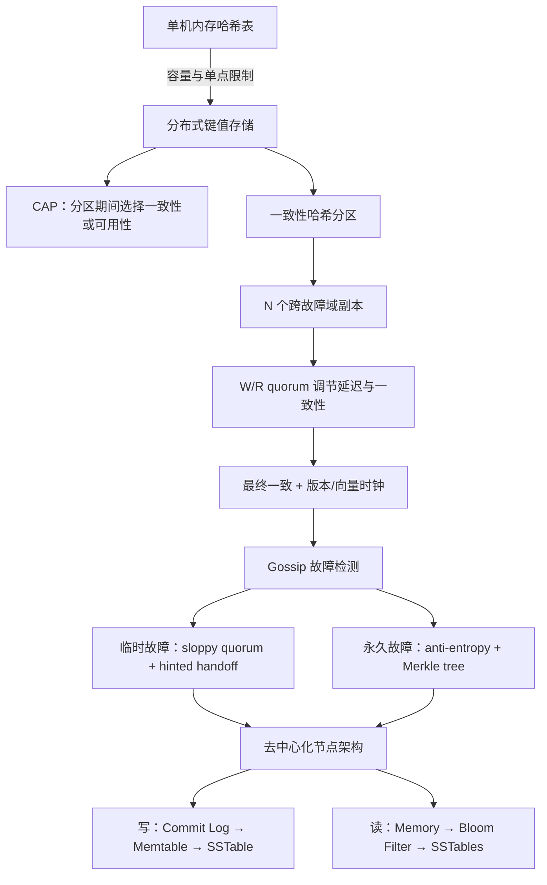

读完后，应当能够回答：

1. 为什么单机哈希表很快，却无法满足大规模高可用存储？
2. CAP 定理中的 C、A、P 分别是什么，为什么选择只在网络分区期间发生？
3. 一致性哈希如何同时支持自动扩缩容和异构节点？
4. 复制因子 $N$ 与读写 quorum $R/W$ 各控制什么？
5. 为什么 $W+R>N$ 能保证读写集合相交，它又为何不自动等同于完整线性一致性？
6. 强一致、弱一致和最终一致分别承诺什么？
7. 两个版本如何用向量时钟判断祖先、后代或并发 sibling？
8. Gossip 为什么比 all-to-all heartbeat 更可扩展，又为何不能提供绝对故障证明？
9. Sloppy quorum 和 hinted handoff 如何提高临时故障时的可用性？
10. Merkle tree 为什么只传输差异范围，而不比较全部数据？
11. commit log、内存表和 SSTable 如何共同实现低延迟持久写入？
12. Bloom filter 为什么允许 false positive，却绝不能 false negative？

原章主要借鉴 Dynamo、Cassandra 和 Bigtable。原书中的 `memory cache` 在 Cassandra/LSM 语境通常称为 **memtable**；本文在还原原意时使用“内存表（原图称 memory cache）”。原文写过 `vector locks`，结合上下文和后续定义应理解为 **vector clocks（向量时钟）**。

本文会补充 quorum 条件边界、向量时钟偏序、Bloom filter 公式、LSM 写放大等标准背景。补充内容会与原书结论连续讲解，但不冒充作者逐式给出的原文。

---

## 1. 键值存储的抽象：简单接口，复杂保证

### 1.1 Key、Value 与 opaque value

每条记录由唯一 key 和关联 value 构成：

```text
"last_logged_in_at" -> "2026-08-10T10:30:00Z"
"253DDEC4"          -> { ... serialized object ... }
```

key 可以是明文或哈希值。短 key 通常更有利，因为 key 会重复出现在：

- 内存索引；
- commit log；
- SSTable 索引；
- Bloom filter 输入；
- 网络请求；
- 副本元数据。

value 可以是字符串、列表、二进制对象或序列化文档。许多键值存储把 value 视为 opaque bytes：存储引擎只负责保存和返回，不理解字段语义。

Opaque value 带来简单、通用和高速，但也意味着：

- 服务端不能任意按 value 字段查询；
- 部分字段更新常要读改写整个 value；
- 冲突合并可能需要客户端理解业务结构；
- schema 版本兼容由应用负责。

### 1.2 最小 API

原书要求：

```text
put(key, value)  // 写入 key 对应的 value
get(key)         // 读取 key 对应的 value
```

真实 API 还需定义：

- key 不存在返回什么；
- put 是覆盖、条件写还是创建新版本；
- 是否支持 TTL；
- 是否返回版本 token/vector clock；
- 单 key 写是否原子；
- 是否支持删除，删除如何传播；
- value 最大尺寸；
- 重试是否幂等。

例如带版本上下文的 API：

```text
get(key) -> [VersionedValue]
put(key, value, context) -> new_context
```

`context` 告诉系统本次写基于哪个版本，可用于发现并发更新。

### 1.3 为什么 key-value 模型易于水平扩展

若操作主要按 key 访问，可以先计算：

$$
partition=h(key)
$$

再把请求路由到拥有该分区的节点。单 key 操作不必跨节点 JOIN，分区边界清晰。

代价是复杂查询、跨 key 事务、全局排序和二级索引不再自然。键值存储适合访问模式已知、可由 key 定位的数据，不是关系数据库的通用替代品。

---

## 2. 理解问题并确定设计范围

作者先指出：不存在完美设计。读、写、内存、延迟、一致性和可用性之间必须权衡。

### 2.1 单条 key-value 小于 10 KB

小对象意味着：

- 网络复制和 quorum 响应较轻；
- 单次随机读取成本可控；
- 内存缓存能容纳更多热点；
- commit log 与 SSTable 适合批量顺序写。

它不意味着系统总数据小。若有 $10^{12}$ 条、平均 1 KB，原始数据约为：

$$
10^{12}\times10^3=10^{15}\ \text{bytes}=1\ \text{PB}
$$

复制因子 3 后仅数据副本就约 3 PB，尚未计算索引、日志、压缩和余量。

### 2.2 能存储海量数据

单机磁盘、I/O 和恢复时间都有上限，必须：

- 把 key 空间分区；
- 将分区分布到多节点；
- 节点变化时只移动必要数据；
- 让容量随节点数近似增长。

### 2.3 高可用

节点故障和网络分区时仍应快速响应。高可用依赖：

- 多副本；
- 去中心化或高可用协调；
- 可调 quorum；
- 临时替代节点；
- 故障检测与恢复。

“返回响应”不等于“返回最新值”。AP 设计可能返回旧值或多个冲突版本，必须把语义写进 API。

### 2.4 高可扩展与自动扩缩容

新增/删除节点不应要求全量重分布或长时间停机。一致性哈希和虚拟节点支持：

- 新节点接管部分 token range；
- 故障节点的 range 由后继/副本接管；
- 高容量节点承担更多 vnode；
- 控制面依据容量自动调整成员。

自动扩容仍需数据迁移和限速，不能只把节点加入环就立即承载全部请求。

### 2.5 可调一致性

同一系统可让调用方选择：

- 低延迟写：较小 $W$；
- 低延迟读：较小 $R$；
- 较强读后写可见性：相交 quorum；
- 高可用：sloppy quorum 或较小确认数。

“可调”不代表任意配置都合理。客户端需要理解每种级别的失败与陈旧语义。

### 2.6 低延迟

设计采用：

- 内存索引/内存表；
- 顺序 commit log；
- 异步复制与可调确认；
- Bloom filter 减少无效磁盘读；
- 就近 coordinator；
- 批量、压缩与后台合并。

低延迟与持久性并不天然冲突：顺序追加日志可在相对低开销下获得崩溃恢复能力。

### 2.7 范围摘要

本章设计的是小 value、海量 key、低延迟、高可用、自动水平扩展、最终一致为默认且可调 quorum 的分布式键值存储。它不重点设计 SQL、复杂查询、跨 key ACID 事务和二级索引。

---

## 3. 单服务器键值存储

### 3.1 最直接方案：内存哈希表

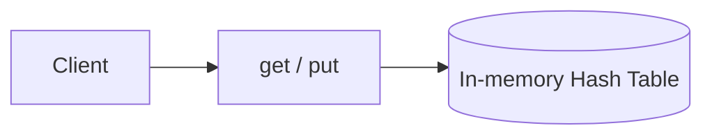

哈希表平均查找和写入可达 $O(1)$，延迟低、实现简单。适合：

- 原型；
- 小数据集；
- 单节点缓存；
- 不要求高可用的本地状态。

### 3.2 容量优化一：压缩

压缩 value 可以增加单机有效容量，但要支付 CPU 和延迟：

$$
EffectiveCapacity\approx\frac{PhysicalMemory}{compressionRatio}
$$

若压缩后为原来的 40%，理论数据容量约为 $1/0.4=2.5$ 倍。压缩比取决于数据，已经压缩的图片/视频收益很低。

### 3.3 容量优化二：冷热分层

只把高频数据放内存，其余落盘：

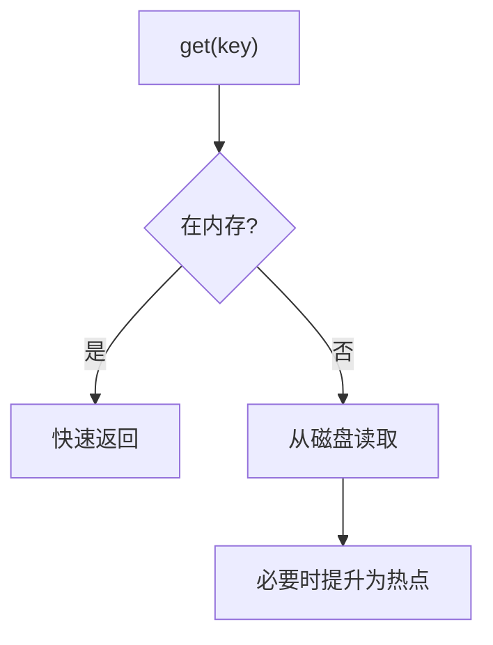

它利用访问局部性，用有限内存覆盖热点工作集。冷 miss 的延迟更高，还需淘汰策略和持久索引。

### 3.4 单机的硬边界

- 容量有上限；
- 单点故障；
- 无法横向扩展总吞吐；
- 维护/升级可能停机；
- 单机恢复大数据集耗时很长。

压缩和冷热分层延长单机寿命，却不能消除这些结构性问题，因此作者转向分布式键值存储。

---

## 4. 分布式键值存储与 CAP

分布式键值存储也可称分布式哈希表（DHT）：key-value 对分布在多台服务器上。

### 4.1 CAP 三个定义

**Consistency（C）**

原书表述为：无论连接哪个节点，所有客户端同时看到相同数据。更严格的 CAP 语境通常指线性一致性：每次操作看起来在调用与返回之间某个瞬间原子发生，读返回最近完成的写。

**Availability（A）**

每个发给非故障节点的请求最终得到非错误响应，但响应可能不是最新数据。CAP 可用性不是“全年 99.99% uptime”的同一个定义。

**Partition tolerance（P）**

节点之间的消息可能丢失或延迟，形成网络分区；系统仍要有定义明确的行为。

### 4.2 CAP 不是平时任意三选二

网络正常时，可以同时提供一致与可用。真正选择发生在分区期间：

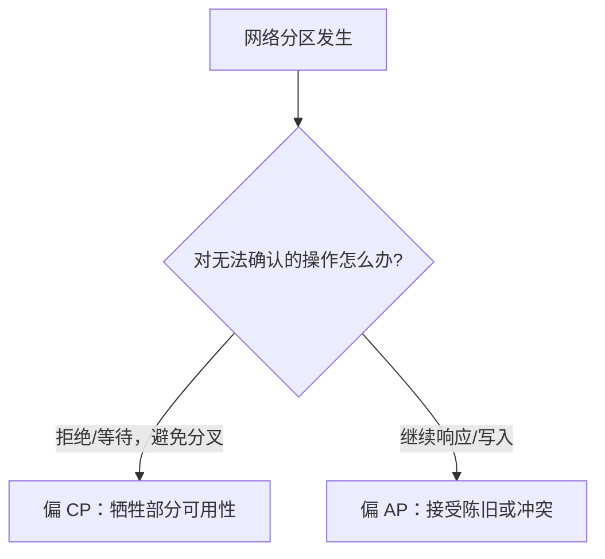

在真实分布式系统里网络故障不可完全避免，因此不能通过“选择 CA、不要 P”逃避问题。更准确的问题是：分区发生时，哪些操作等待一致，哪些操作保持可用？

### 4.3 三副本示例

数据复制在 $n1,n2,n3$：

**理想状态**

- 写入传播到全部副本；
- 任意节点读取相同值；
- 一致性与可用性同时成立。

**网络分区**

- $n3$ 与 $n1,n2$ 不能通信；
- 两侧继续写会产生不同版本；
- 停止一侧写入可避免冲突，却让部分客户端得不到成功响应。

### 4.4 偏 CP 的选择

在无法确认正确顺序或 quorum 时拒绝写入/读取，避免返回不一致数据。银行余额常要求错误也不能返回旧余额或重复扣款。

代价：网络分区或多数副本不可达时请求失败/阻塞。

“银行一定是 CP”仍是简化。真实金融系统常通过账本、幂等、补偿和分区化可用性组合，而不是一个 CAP 标签概括全部业务。

### 4.5 偏 AP 的选择

分区两侧继续响应：

- 读可能返回旧值；
- 并发写形成 sibling versions；
- 分区恢复后必须同步和解决冲突。

购物车、社交偏好等场景可选择“暂时不一致，但用户仍能操作”，前提是合并规则不会造成不可接受损失。

### 4.6 CAP 与 PACELC

CAP 只聚焦分区时。即使没有分区，复制系统仍在延迟（Latency）与一致性（Consistency）之间权衡。PACELC 的直觉是：

```text
Partition: Availability vs Consistency
Else:      Latency vs Consistency
```

本章的 $N/W/R$ 正同时影响这两类权衡。

---

## 5. 系统组件与方法来源

作者列出后续组件：

1. 数据分区；
2. 数据复制；
3. 一致性；
4. 不一致解决；
5. 故障处理；
6. 系统架构；
7. 写路径；
8. 读路径。

内容主要借鉴：

- Dynamo：一致性哈希、可调 quorum、向量时钟、sloppy quorum、hinted handoff；
- Cassandra：去中心化环、复制、LSM 风格读写路径；
- Bigtable/LSM 系列：内存表、SSTable 等存储思想。

接下来按原书顺序展开。

---

## 6. 数据分区：把海量 key 分散到节点

### 6.1 两个目标

- 数据尽量均匀分布；
- 增删节点时尽量少搬迁。

普通 `hash(key) % node_count` 在节点数变化时几乎全量重映射，第 5 章的一致性哈希正解决这个问题。

### 6.2 哈希环路由

1. 将节点放到哈希环；
2. 将 key 哈希到同一环；
3. 从 key 顺时针遇到的第一个节点是 owner。

原书示例有 $s0\ldots s7$ 八台节点，`key0` 顺时针首先遇到 $s1$，因此主 owner 是 $s1$。


### 6.3 自动扩缩容

新增节点只接管相邻 token range，删除节点只把原 range 交给后继。控制面可以依据：

- 磁盘利用率；
- QPS；
- 尾延迟；
- compaction backlog；
- repair backlog；

自动调整成员。

“自动”仍需要限速迁移、校验、成员版本和回滚。

### 6.4 异构性

原书指出：高容量服务器分配更多虚拟节点。

$$
v_i\propto capacity_i
$$

高容量节点期望承担更多 key range。容量权重应综合磁盘、CPU、网络和请求类型，不应只按机器数量均分。

### 6.5 分区与复制不要混淆

- 分区决定不同 key 分到哪里，解决容量与吞吐；
- 复制把同一 key 放到多个节点，解决可用性和可靠性；
- 系统通常先确定主 range，再为每个 range 选择多个副本。

---

## 7. 数据复制：在 $N$ 个不同故障域保存副本

### 7.1 复制因子 $N$

原书让数据异步复制到 $N$ 台服务器。对 key 的环位置：

1. 顺时针找到第一个物理节点；
2. 继续顺时针；
3. 选择前 $N$ 个**不同物理服务器**。

原图 $N=3$：`key0` 保存到 $s1,s2,s3$。

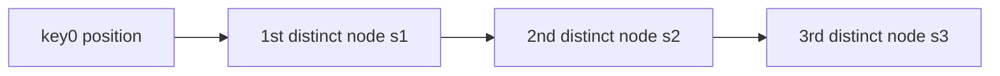

### 7.2 为什么必须去重物理节点

一台机器有多个 vnode。若只取“前 $N$ 个 vnode”，可能都属于同一物理服务器，机器一故障副本全部消失。

因此副本选择要跳过相同 physical node，并进一步跨：

- 磁盘；
- 主机；
- 机架；
- 可用区；
- 数据中心。

### 7.3 跨数据中心复制

同机房节点可能因断电、网络或灾害一起失败。跨数据中心副本提高地域容灾能力，却增加：

- 广域网延迟；
- 带宽成本；
- 复制延迟；
- 冲突概率；
- 数据驻留与合规复杂度。

客户端是否等待远端副本，由 $W$ 和一致性策略决定。

### 7.4 复制因子的权衡

若原始数据量为 $D$，忽略编码和压缩：

$$
PhysicalData\approx ND
$$

$N$ 越大：

- 可容忍更多副本故障；
- 读取选择更多；
- 存储、网络和 repair 成本更高；
- 同步所有副本更慢。

常见 $N=3$ 不是普遍定律，而是成本与故障容忍的常见折中。

---

## 8. Quorum 一致性：$N/W/R$ 如何工作

### 8.1 三个参数

- $N$：每个 key 的副本数；
- $W$：写成功前至少收到的副本确认数；
- $R$：读成功前至少等待的副本响应数；
- coordinator：客户端与副本之间的代理/协调节点。

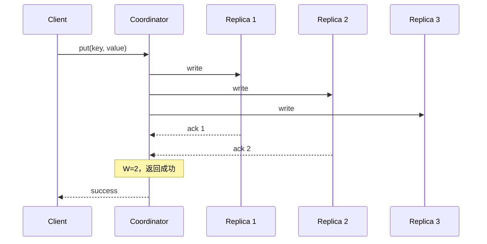

### 8.2 $W=1$ 不等于只写一份

原书特别强调：系统仍向 $N$ 个副本发送写入；$W=1$ 只表示 coordinator 收到第一份确认即可向客户端返回，其余复制可继续进行。

若第一份确认后协调者崩溃、其他副本尚未保存，已确认数据的耐久性取决于那一份副本是否存活。因此确认策略与持久性风险相关。

### 8.3 为什么 $W+R>N$ 会相交

副本全集大小为 $N$，成功写集合大小为 $W$，读集合大小为 $R$。若两者完全不相交，最多只能占 $N$ 个节点：

$$
W+R\le N
$$

其逆否命题：

$$
W+R>N\Rightarrow WriteQuorum\cap ReadQuorum\ne\varnothing
$$

至少一个读副本参与了成功写入，因此有机会返回最新版本。

### 8.4 原书典型配置

**快速读**

$$
R=1,\quad W=N
$$

写等待全部副本，之后任意一个读副本都应有最新确认写。读快，写慢且可用性低。

**快速写**

$$
W=1,\quad R=N
$$

写收到一个确认即返回，读等待全部副本并选最新。写快，读慢。

**常见折中**

$$
N=3,\quad W=2,\quad R=2
$$

因为 $W+R=4>3$，读写 quorum 必相交。

### 8.5 延迟与故障容忍

写可容忍最多：

$$
N-W
$$

个副本不可确认；读可容忍最多：

$$
N-R
$$

个副本不可响应。

但实际延迟取决于第 $W$ 快确认和第 $R$ 快响应，而不是简单“最慢副本”。只有 $W=N$ 或 $R=N$ 才必须等待全部。

### 8.6 $W+R>N$ 的重要边界

原书简化为“保证强一致”。严格地说，quorum 相交是重要条件，但完整强/线性一致还需要：

- 成功写有可比较的版本或全序；
- 读取多个响应后选择真正最新版本；
- 并发写被序列化或显式保留冲突；
- 使用同一副本集合，而非任意 sloppy 节点；
- 失败写入的残留版本被正确处理；
- 时钟/版本规则不会误判新旧；
- read repair 或后续修复传播最新值。

对于多写者 quorum，通常还需写 quorum 彼此相交：

$$
2W>N
$$

或通过单 leader/共识排序写入。否则两个成功写 quorum 可能互不相交。

所以更准确的结论是：

> $W+R>N$ 保证严格读写 quorum 至少相交，是读到最新确认版本的必要构件；它不是脱离版本、并发和故障模型的万能强一致证明。

### 8.7 可运行的 quorum 检查

```python
from dataclasses import dataclass

@dataclass(frozen=True)
class Quorum:
    replicas: int
    write: int
    read: int

    @property
    def read_write_overlap(self) -> bool:
        return self.write + self.read > self.replicas

    @property
    def write_write_overlap(self) -> bool:
        return 2 * self.write > self.replicas

    @property
    def tolerated_write_failures(self) -> int:
        return self.replicas - self.write

    @property
    def tolerated_read_failures(self) -> int:
        return self.replicas - self.read

balanced = Quorum(replicas=3, write=2, read=2)
assert balanced.read_write_overlap
assert balanced.write_write_overlap
assert balanced.tolerated_write_failures == 1
assert balanced.tolerated_read_failures == 1

fast_write = Quorum(replicas=3, write=1, read=3)
assert fast_write.read_write_overlap
assert not fast_write.write_write_overlap
assert fast_write.tolerated_write_failures == 2
assert fast_write.tolerated_read_failures == 0

weak = Quorum(replicas=3, write=1, read=1)
assert not weak.read_write_overlap

print(balanced)
print(fast_write)
print(weak)
```

代码只验证集合相交条件，不宣称模拟完整一致性协议。

---

## 9. 一致性模型

### 9.1 强一致

任何读都返回最新完成写对应的值，客户端不会看到旧数据。实现通常需要写入排序、quorum/leader/共识和读写协调。

原书说常通过阻塞读写直到副本同意来实现，并指出这对高可用系统不理想。更准确地说，不一定要求“每个副本”都同意，但必须满足所选强一致协议的 quorum/leader 条件。

### 9.2 弱一致

后续读取可能看不到最新写入，不承诺何时收敛。它是宽泛类别。

### 9.3 最终一致

弱一致的一种：若不再有新更新，经过足够时间后所有副本最终收敛。

它不保证：

- 立刻读到自己的写；
- 单调读；
- 收敛时间上界；
- 自动得到业务正确合并结果。

“最终”依赖网络恢复、repair 正常运行和冲突可解决。

### 9.4 为什么本章选择最终一致

Dynamo/Cassandra 风格系统优先：

- 分区期间继续响应；
- 低延迟写入；
- 多数据中心可用；
- 后台传播与修复。

代价是并发写会产生多个版本，客户端或服务端必须协调。下一节的版本化与向量时钟正是为此引入。

### 9.5 客户端会话保证

最终一致系统可以额外提供：

- read-your-writes；
- monotonic reads；
- monotonic writes；
- writes-follow-reads。

这些保证比全局线性一致便宜，却能避免用户刚改完资料又看到旧值。原章未展开，但设计 API 时值得说明。

---

## 10. 不一致解决：不可变版本与向量时钟

### 10.1 冲突如何产生

初始：$n1,n2$ 都有原值 `john`。

网络分区或并发写：

- server1 写 `johnSanFrancisco`，得到 $v1$；
- server2 写 `johnNewYork`，得到 $v2$。

两次修改都基于原值，原值是它们共同祖先；$v1$ 和 $v2$ 之间没有明确先后，不能仅凭到达时间安全覆盖。

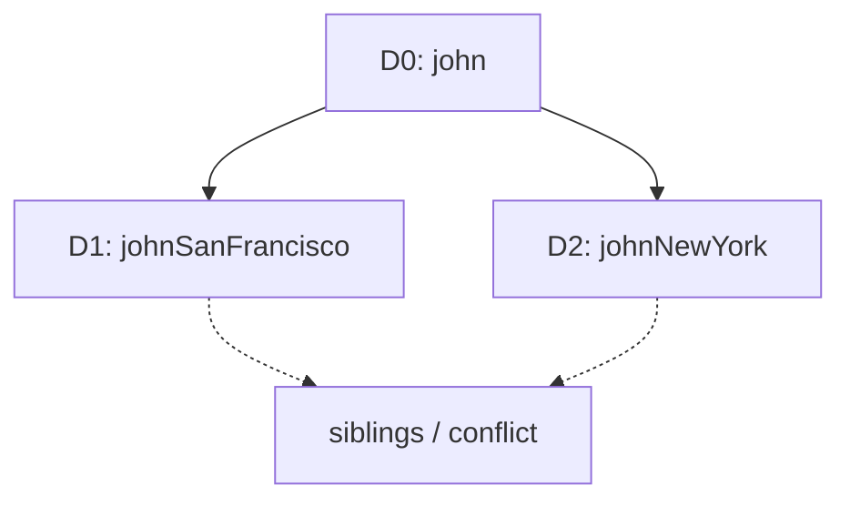

### 10.2 版本化

每次修改创建新不可变版本，而不是就地抹掉历史。这样系统能保留因果关系和并发分支，避免 last-write-wins 静默丢数据。

### 10.3 向量时钟定义

向量时钟是与数据版本关联的 `(server, counter)` 映射：

$$
VC(D)=\{S_1:v_1,S_2:v_2,\ldots,S_n:v_n\}
$$

server $S_i$ 处理写入时：

- 已有 $S_i$ 项则加 1；
- 没有则加入 $S_i:1$。

### 10.4 原书 D1 到 D5

1. $D1$ 由 $Sx$ 写入：

$$
D1[Sx:1]
$$

2. 读取 D1 后同由 $Sx$ 更新为 D2：

$$
D2[Sx:2]
$$

3. 客户端基于 D2，在 $Sy$ 写 D3：

$$
D3[Sx:2,Sy:1]
$$

4. 另一个客户端也基于 D2，在 $Sz$ 写 D4：

$$
D4[Sx:2,Sz:1]
$$

5. 读取发现 D3、D4 并发，客户端合并后由 $Sx$ 写 D5：

$$
D5[Sx:3,Sy:1,Sz:1]
$$

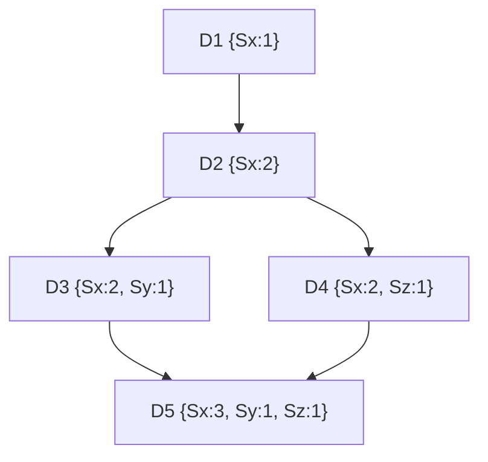

### 10.5 偏序比较

将缺失分量视为 0。定义：

$$
X\preceq Y
\iff
\forall i,\ X_i\le Y_i
$$

若 $X\preceq Y$ 且至少一项严格小于，则 X 是 Y 的祖先，Y 可以覆盖 X。

若既非 $X\preceq Y$，也非 $Y\preceq X$，则并发：

$$
X\parallel Y
$$

例如：

$$
\{s0:1,s1:1\}\preceq\{s0:1,s1:2\}
$$

无冲突。

而：

$$
\{s0:1,s1:2\}\parallel\{s0:2,s1:1\}
$$

前者在 $s1$ 大，后者在 $s0$ 大，互不支配，存在冲突。

### 10.6 可运行的向量时钟示例

```python
from dataclasses import dataclass
from enum import Enum

class Relation(Enum):
    EQUAL = "equal"
    BEFORE = "before"
    AFTER = "after"
    CONCURRENT = "concurrent"

@dataclass(frozen=True)
class VectorClock:
    counters: dict[str, int]

    def increment(self, server: str) -> "VectorClock":
        updated = dict(self.counters)
        updated[server] = updated.get(server, 0) + 1
        return VectorClock(updated)

    def merge(self, other: "VectorClock") -> "VectorClock":
        servers = self.counters.keys() | other.counters.keys()
        return VectorClock({
            server: max(
                self.counters.get(server, 0),
                other.counters.get(server, 0),
            )
            for server in servers
        })

    def compare(self, other: "VectorClock") -> Relation:
        servers = self.counters.keys() | other.counters.keys()
        less = any(
            self.counters.get(server, 0) < other.counters.get(server, 0)
            for server in servers
        )
        greater = any(
            self.counters.get(server, 0) > other.counters.get(server, 0)
            for server in servers
        )
        if not less and not greater:
            return Relation.EQUAL
        if less and not greater:
            return Relation.BEFORE
        if greater and not less:
            return Relation.AFTER
        return Relation.CONCURRENT

d1 = VectorClock({}).increment("Sx")
d2 = d1.increment("Sx")
d3 = d2.increment("Sy")
d4 = d2.increment("Sz")

assert d1.compare(d2) is Relation.BEFORE
assert d2.compare(d3) is Relation.BEFORE
assert d3.compare(d4) is Relation.CONCURRENT

# Client reconciles D3 and D4, then Sx writes the merged value.
d5 = d3.merge(d4).increment("Sx")
assert d3.compare(d5) is Relation.BEFORE
assert d4.compare(d5) is Relation.BEFORE
assert d5.counters == {"Sx": 3, "Sy": 1, "Sz": 1}

print(d1, d2, d3, d4, d5, sep="\n")
```

### 10.7 冲突如何合并

向量时钟只检测因果关系，不知道业务如何合并 value。

- 购物车：集合并集可能合理；
- 用户昵称：需要用户选择或产品规则；
- 计数器：可用 CRDT counter；
- 银行余额：简单合并不可接受，应采用有序账本/事务。

客户端合并增加复杂度，也会暴露多个 sibling。可将合并逻辑放服务端，但仍需业务语义。

### 10.8 向量时钟的两个缺点

原书指出：

1. 客户端要实现冲突解决；
2. `(server,version)` 项可能快速增长。

限制长度并删除最旧项会丢失因果信息，导致无法准确判断祖先，产生额外 sibling 或错误合并。Dynamo 经验认为实际中可接受，但不能视为理论无损。

现代系统还可能使用 dotted version vectors、混合逻辑时钟、CRDT 或 leader/共识，取决于冲突语义。

---

## 11. 故障处理总览

大规模系统中故障不是例外。作者按顺序讲：

1. 故障检测；
2. 临时故障处理；
3. 永久故障处理；
4. 数据中心故障。

这四层分别回答：

- 节点是否疑似不可用？
- 短时间不可用期间怎样继续服务？
- 节点永久损坏后怎样修复副本？
- 整个地域消失时怎样继续访问？

---

## 12. 故障检测：从 all-to-all 到 gossip

### 12.1 单点指控为什么不够

节点 A 无法联系 B，可能是：

- B 宕机；
- A 的网络坏了；
- A/B 之间链路分区；
- B 正在 GC/磁盘阻塞；
- 消息延迟。

因此，一个节点的观察不足以证明 B 全局故障。原书要求至少两个独立信息源确认。

### 12.2 All-to-all heartbeat 的成本

$n$ 个节点互相发送 heartbeat，消息边数约：

$$
n(n-1)=O(n^2)
$$

1000 节点每轮接近 100 万条定向消息，扩展性差。

### 12.3 Gossip 协议

原书步骤：

1. 每个节点维护成员列表：member ID + heartbeat counter；
2. 节点周期增加自己的 heartbeat；
3. 周期选择随机节点发送成员信息；
4. 收到后合并更新值；
5. 某成员 heartbeat 长时间不增长，则认为离线；
6. 怀疑信息继续传播，其他节点共同确认。

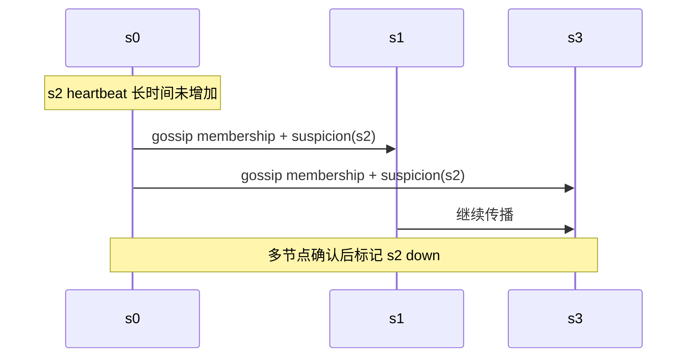

### 12.4 为什么 gossip 可扩展

每轮只联系少量随机节点，信息以流行病式扩散。理想情况下若每轮知情节点数近似翻倍，传播轮数约：

$$
O(\log n)
$$

实际受 fanout、丢包、周期和拓扑影响。它降低单轮消息数，但成员状态是最终一致的，各节点短时间可能持有不同视图。

### 12.5 故障检测器不是绝对真相

异步网络中无法仅靠超时完美区分“节点死了”和“网络很慢”。工程上通常用状态机：

```text
alive -> suspect -> down -> removed
```

不同阶段采取不同动作，避免一次抖动立即迁移大量数据。heartbeat counter 还需处理节点重启后计数回退，可加入 incarnation number/启动世代。

---

## 13. 临时故障：Sloppy Quorum 与 Hinted Handoff

### 13.1 严格 quorum 的可用性问题

严格 quorum 只在 key 的固定 $N$ 个 home replicas 中取 $W/R$。若足够多 home replica 不可用，操作阻塞或失败。

### 13.2 Sloppy quorum

原书方案：沿哈希环跳过离线节点，选择前 $W$ 个健康节点写、前 $R$ 个健康节点读。

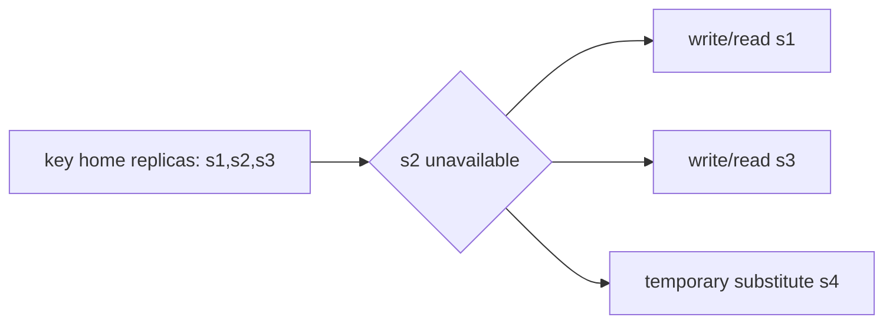

它提高可用性，因为系统不必等待固定副本恢复。

### 13.3 Sloppy quorum 的一致性边界

即使数字上 $W+R>N$，sloppy 写集合与后续读集合也可能来自不同替代节点，不保证相交。因此不能把严格 quorum 的相交证明直接套用。

这正是 AP 风格选择：优先接受操作，稍后通过 hints、read repair 和 anti-entropy 收敛。

### 13.4 Hinted handoff

替代节点保存数据时附带 hint：

```text
value belongs to home replica s2
```

当 $s2$ 恢复：

1. 替代节点检测/收到恢复信息；
2. 把带 hint 的版本交还 $s2$；
3. $s2$ 合并版本；
4. 确认后替代节点删除 hint。

原书示例：$s2$ 不可用，$s3$ 临时代管；$s2$ 上线后，$s3$ handoff 回去。

### 13.5 Hinted handoff 的局限

- 适合短期故障，不适合永久损坏；
- hint 过多会占满替代节点；
- 需要 TTL、重试、流控和监控；
- 原节点长时间离线时，hint 可能过期；
- substitute 自身故障会丢临时副本；
- 并发版本仍需向量时钟合并。

因此永久不一致由 anti-entropy 处理。

---

## 14. 永久故障：Anti-Entropy 与 Merkle Tree

### 14.1 Anti-entropy

副本周期性比较数据，找出差异，并把各自缺少的最新版本同步。若逐 key 比较 10 亿条，即使只有一个 key 不同也很昂贵。

Merkle tree 用分层哈希快速缩小差异范围。

### 14.2 Merkle tree 定义

- 叶/桶 hash 表示一组 key-value 内容；
- 每个父节点是子节点 hash 的 hash；
- 根 hash 摘要整个数据范围。

$$
H_{parent}=H(H_{left}\Vert H_{right})
$$

构建时必须使用确定的 key 排序、序列化、版本和删除标记；否则内容相同也可能得到不同 hash。

### 14.3 原书 1–12 key 的四步构造

1. 把 key space 1–12 分成 4 个 bucket；
2. 对 bucket 中每个 key/value 做均匀 hash；
3. 每个 bucket 生成一个 hash 节点；
4. 向上组合子 hash，直到 root。

示例两服务器在 key 8 处不同，因此：

- 对应 bucket hash 不同；
- 它的祖先 hash 不同；
- 无关左半树 hash 相同。

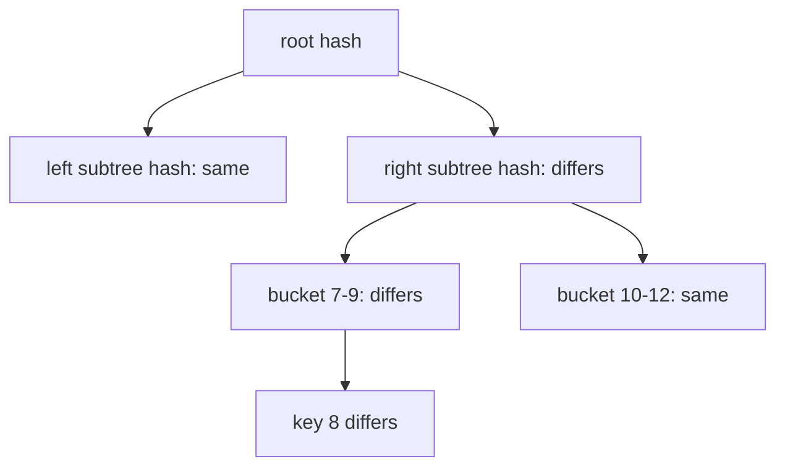

### 14.4 比较过程

1. 比 root；相同则整个范围一致；
2. root 不同，比较左右 child；
3. 相同 child 整棵跳过；
4. 只沿不同 child 下钻；
5. 到 bucket 后同步该范围的实际 key/version。

数据传输与差异量相关，而不是全量数据；仍需传输树 hash 和差异 bucket 元数据。

### 14.5 Bucket 粒度

原书例子：10 亿 key、100 万 bucket，平均每 bucket 1000 key：

$$
\frac{10^9}{10^6}=10^3
$$

- bucket 太大：一个 key 不同会同步过多数据；
- bucket 太小：树和 hash 元数据巨大；
- key 分布不均时平均 1000 不代表每 bucket 1000。

### 14.6 碰撞与安全边界

根 hash 相同只在假设 hash 无碰撞、序列化一致时说明数据相同。工程上使用足够强 hash、版本化树格式并定期全量校验。

Merkle tree 检测差异，不决定哪个版本正确；新旧判断仍依赖版本向量、时间戳或业务规则。

### 14.7 可运行的 Merkle tree 示例

```python
from hashlib import sha256

def digest(data: bytes) -> bytes:
    return sha256(data).digest()

def leaf_hash(items: list[tuple[str, str]]) -> bytes:
    payload = b"".join(
        len(key.encode()).to_bytes(4, "big")
        + key.encode()
        + len(value.encode()).to_bytes(4, "big")
        + value.encode()
        for key, value in sorted(items)
    )
    return digest(payload)

def merkle_root(leaves: list[bytes]) -> bytes:
    if not leaves:
        return digest(b"")
    level = list(leaves)
    while len(level) > 1:
        if len(level) % 2 == 1:
            level.append(level[-1])
        level = [
            digest(level[index] + level[index + 1])
            for index in range(0, len(level), 2)
        ]
    return level[0]

server_1 = {
    "bucket-1": [("1", "A"), ("2", "B"), ("3", "C")],
    "bucket-2": [("5", "E"), ("6", "F")],
    "bucket-3": [("7", "G"), ("8", "H"), ("9", "I")],
    "bucket-4": [("10", "J"), ("11", "K"), ("12", "L")],
}
server_2 = {name: list(items) for name, items in server_1.items()}
server_2["bucket-3"] = [("7", "G"), ("8", "DIFFERENT"), ("9", "I")]

names = sorted(server_1)
leaves_1 = [leaf_hash(server_1[name]) for name in names]
leaves_2 = [leaf_hash(server_2[name]) for name in names]

different_buckets = [
    name
    for name, left, right in zip(names, leaves_1, leaves_2)
    if left != right
]
assert different_buckets == ["bucket-3"]
assert merkle_root(leaves_1) != merkle_root(leaves_2)

server_2["bucket-3"] = list(server_1["bucket-3"])
repaired_leaves = [leaf_hash(server_2[name]) for name in names]
assert merkle_root(leaves_1) == merkle_root(repaired_leaves)

print("different buckets:", different_buckets)
print("roots equal after repair:", merkle_root(leaves_1) == merkle_root(repaired_leaves))
```

长度前缀防止简单拼接歧义，如 `("ab","c")` 与 `("a","bc")` 产生相同字节串。

---

## 15. 数据中心故障

整个数据中心可能因断电、网络中断或自然灾害离线。解决方向：跨数据中心复制，使其他地域仍能提供数据。


设计要回答：

- $N$ 个副本如何跨地域分配；
- 正常读写是否等待远端；
- 一个地域故障后剩余容量是否足够；
- 异步复制的 RPO；
- 恢复后如何 anti-entropy；
- 多地域并发写如何解决冲突；
- 数据驻留规则是否允许跨境。

多地域副本提高容灾，却不会自动提供零数据丢失和低延迟。

---

## 16. 系统总体架构

### 16.1 Coordinator

客户端可把请求发给任意节点，该节点成为 coordinator：

- 根据一致性哈希定位 replicas；
- 向副本并发发送读写；
- 等待 $W/R$ 响应；
- 比较版本、返回结果；
- 触发 read repair/hints。

Coordinator 是每请求角色，不一定是固定主节点。

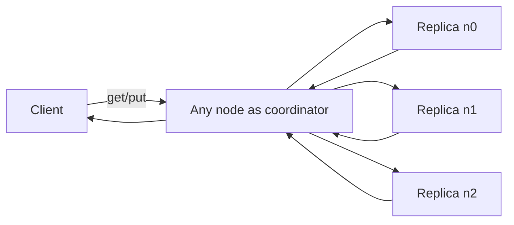

### 16.2 去中心化

原书强调所有节点职责相同，没有固定单点。节点包含：

- Client API；
- Failure detection；
- Conflict resolution；
- Failure repair mechanism；
- Replication；
- Storage engine。

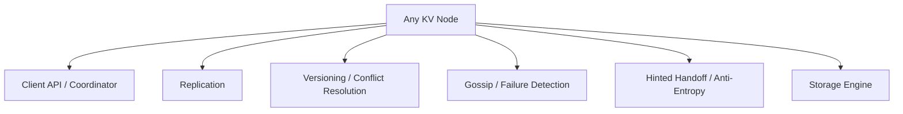

去中心化消除固定 leader 单点，但成员收敛、冲突和运维更复杂。每个节点仍可能故障，系统无单点来自角色冗余和多副本，而非“节点不会失败”。

### 16.3 一次 put 的分布式外层流程

1. 客户端选择任意节点；
2. Coordinator 哈希 key，得到 preference list；
3. 向 $N$ 个 home/healthy replicas 发送版本化写入；
4. 每个 replica 执行本地写路径；
5. 收到 $W$ 个确认后返回；
6. 未完成副本通过复制、hint 或 repair 收敛。

### 16.4 一次 get 的分布式外层流程

1. Coordinator 定位 replicas；
2. 向足够节点读；
3. 等待至少 $R$ 响应；
4. 用向量时钟删除祖先版本；
5. 单一最新版本直接返回；
6. 并发 siblings 一并返回/合并；
7. 后台修复旧副本。

---

## 17. 本地写路径：Commit Log → Memtable → SSTable

原书说明读写路径主要基于 Cassandra 架构。

### 17.1 三步写入

1. 写请求持久化到 commit log；
2. 数据保存到内存表（原书称 memory cache）；
3. 内存表满或达到阈值后，flush 为磁盘 SSTable。

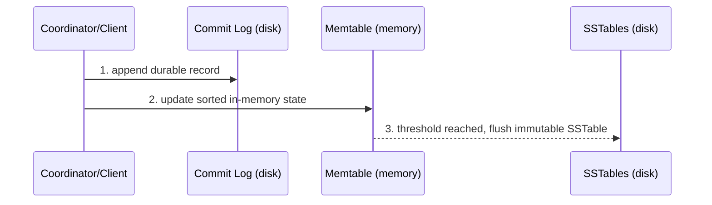

### 17.2 为什么先写 commit log

内存表快但易失。节点崩溃后可重放日志恢复尚未 flush 的写入。

日志是顺序追加：

- 避免随机磁盘 seek；
- 容易批量 fsync；
- 写延迟可预测。

何时返回本地 ack 取决于 durability 配置：

- 每次 fsync：持久性强、延迟高；
- group commit：多写共享一次 fsync；
- 仅 OS page cache：快，但断电风险高。

### 17.3 Memtable

内存表维护最新 key-version，通常有序，方便 flush 生成已排序文件。它不是普通读取缓存：它承载尚未落入 SSTable 的最新写入，是存储引擎状态的一部分。

### 17.4 SSTable

Sorted String Table 是不可变、按 key 排序的 key-value 文件。

优点：

- flush 为顺序写；
- 不可变文件易复制和校验；
- 有序支持索引与范围扫描；
- 后台合并可清理旧版本。

代价：同一 key 可能存在多个 SSTable 版本，读取要合并；后台 compaction 会产生读写放大。

### 17.5 Flush 后的日志回收

只有当对应数据已安全进入 SSTable，commit log segment 才能删除/回收。否则崩溃恢复会失去唯一持久副本。

### 17.6 删除与 tombstone

不可变 SSTable 不能原地删除，通常写入 tombstone：

```text
key -> DELETE(version)
```

读取时 tombstone 屏蔽旧值；等副本修复窗口和 compaction 条件满足后才真正清除。过早删除 tombstone 会让旧副本中的值“复活”。原章未展开，但它是最终一致 LSM 存储的重要边界。

---

## 18. 本地读路径：Memory → Bloom Filter → SSTables

### 18.1 内存命中

请求先查内存表/缓存，存在就直接返回。这里必须合并多个内存结构和版本，而不是简单认为第一项永远最新。

### 18.2 内存未命中

原书步骤：

1. 查内存；
2. 未命中则检查 Bloom filter；
3. Bloom filter 判断哪些 SSTable **可能**含 key；
4. 候选 SSTable 返回数据集；
5. 合并并返回客户端。

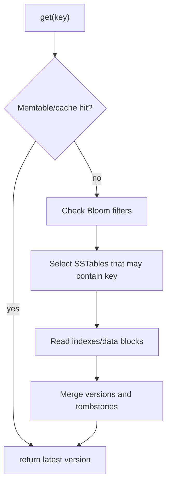

### 18.3 Bloom filter 的语义

Bloom filter 是空间高效的概率集合：

- 返回“definitely not present”时，可以跳过该 SSTable；
- 返回“possibly present”时，仍需查磁盘确认；
- 允许 false positive；
- 正确实现不允许 false negative。

它不会返回 value，也不能告诉 key 在文件中的精确偏移；SSTable 仍需索引。

### 18.4 Bloom filter 公式

插入 $n$ 个元素，bit array 长度 $m$，使用 $k$ 个哈希函数。某 bit 仍为 0 的概率近似：

$$
\left(1-\frac{1}{m}\right)^{kn}\approx e^{-kn/m}
$$

不在集合中的查询，其 $k$ 个位置都为 1 的 false positive 概率：

$$
p\approx\left(1-e^{-kn/m}\right)^k
$$

给定 $m,n$，最优哈希函数数：

$$
k_{opt}=\frac{m}{n}\ln2
$$

目标 false positive $p$ 所需 bit 数近似：

$$
m=-\frac{n\ln p}{(\ln2)^2}
$$

例如 $n=10^6$、目标 $p=1\%$：

$$
m\approx9.59\times10^6\ \text{bits}\approx1.2\ \text{MB}
$$

每元素约 9.6 bit，最优 $k\approx6.64$，取 7。

### 18.5 为什么 Bloom filter 有效

若有 20 个 SSTable，而 key 只在 1 个或不存在，没有 Bloom filter 可能要检查许多文件。1% false positive 时，不含 key 的 19 个文件平均只有：

$$
19\times0.01=0.19
$$

个额外误查，显著减少磁盘 I/O。

### 18.6 读取仍需解决版本

多个 SSTable 中可能有：

- 旧 value；
- 新 value；
- tombstone；
- 并发 sibling。

读取要依据时间戳/向量时钟选择未被支配版本，不能“找到第一条就返回”。Compaction 会减少文件数和旧版本，改善读放大。

---

## 19. 原书目标—技术对照表

原书最后总结如下：

| 目标/问题 | 对应技术 | 因果关系 |
|---|---|---|
| 存储海量数据 | 一致性哈希跨服务器分散负载 | 单机容量变为集群容量 |
| 高可用读取 | 数据复制、多数据中心 | 某副本/机房故障仍可读 |
| 高可用写入 | 版本化 + 向量时钟冲突解决 | 分区期间继续写，恢复后协调 |
| 数据集分区 | 一致性哈希 | key 稳定映射到节点 |
| 增量扩展 | 一致性哈希 | 增删节点只移动部分 range |
| 异构节点 | 一致性哈希/vnode 权重 | 强节点承担更多 range |
| 可调一致性 | Quorum consensus | 调整 $N/W/R$ |
| 临时故障 | Sloppy quorum + hinted handoff | 健康替代节点暂存并归还 |
| 永久故障 | Merkle tree | 高效检测并同步差异 |
| 数据中心故障 | 跨数据中心复制 | 地域离线后从其他地域服务 |

这张表揭示本章结构：没有一个机制同时解决全部问题；每个目标对应不同机制，机制之间通过版本和副本语义连接。

---

## 20. 容易混淆的概念与常见误区

### 20.1 Key-value store 与缓存

键值接口既可用于易失缓存，也可用于持久数据库。是否持久、高可用、可调一致取决于实现，不由接口名称决定。

### 20.2 CAP consistency 与 ACID consistency

CAP 的 C 关注分布式副本表现如单一最新副本；ACID 的 C 关注事务前后保持应用不变量。二者不是同一定义。

### 20.3 CAP availability 与 uptime SLA

CAP A 是分区模型中的每请求响应性质；99.99% SLA 是统计时间/请求指标。不能互换。

### 20.4 CAP 是永远三选二

错误。网络正常时可同时 C 和 A；分区时才必须决定是否拒绝部分操作或允许不一致。

### 20.5 分区与复制

分区拆不同数据，复制保存相同数据。前者扩容量，后者提高容错；生产系统通常组合。

### 20.6 $W=1$ 与只存一份

$W=1$ 只表示一个 ack 后返回，复制因子仍为 $N$。其他副本可能异步完成。

### 20.7 $W+R>N$ 与无条件强一致

它证明严格读写集合相交，但仍需要最新版本选择、并发写处理、固定副本集合和修复。Sloppy quorum 下数字相同也可能不相交。

### 20.8 $W=N$ 与所有时间都不可写

它要求所有 $N$ 副本确认，所以任一副本不可达就写失败；读可设 $R=1$。是否值得取决于一致性和可用性目标。

### 20.9 最终一致与“几秒后一定一致”

最终一致通常不承诺固定时间上界。若写持续发生、网络不恢复或 repair 故障，收敛会延后。

### 20.10 Last-write-wins 与真正解决冲突

按墙钟时间选最后值简单，但时钟偏差会丢失合法并发更新。向量时钟检测因果，业务仍需合并。

### 20.11 向量时钟与全局时间

向量时钟表示因果偏序，不提供可读时间，也不能把所有并发事件排成唯一顺序。

### 20.12 向量时钟能自动合并 value

不能。它只判断祖先/并发；购物车、昵称、余额的合并规则不同。

### 20.13 Gossip 与共识

Gossip 高效传播成员信息，通常最终收敛；共识对单一值/顺序达成强协议。Gossip 不自动给出线性一致成员视图。

### 20.14 超时与故障证明

超时只说明未及时收到响应，不能区分节点崩溃、网络分区和慢节点。应先 suspect，再综合多源信息。

### 20.15 Sloppy quorum 与 strict quorum

Strict quorum 从固定 home replicas 取集合；sloppy quorum 用任意健康替代节点提高可用性，可能失去相交保证。

### 20.16 Hinted handoff 与永久复制

Hint 是临时代管和归还信息，不应替代正常 $N$ 副本。永久故障由 anti-entropy/重建处理。

### 20.17 Merkle tree 与数据备份

Merkle tree 是差异摘要和定位结构，不保存完整数据，也不替代备份。

### 20.18 根 hash 相同与绝对相同

结论依赖确定序列化和哈希抗碰撞。工程上概率极高，不是数学上完全无碰撞。

### 20.19 Commit log 与数据库完整数据

日志用于崩溃恢复和追加持久化；长期查询由 SSTable 等结构提供。已 flush 的日志段可回收。

### 20.20 Memtable 与普通 cache

Memtable 保存尚未 flush 的权威最新写入，是存储路径的一部分；普通 cache 丢失通常可从后端重建。

### 20.21 SSTable 与 B-tree

SSTable 不可变、批量顺序写，靠多个文件和 compaction；B-tree 原地/页级更新。写读放大特征不同。

### 20.22 Bloom filter 与索引

Bloom filter 只告诉“可能有/一定没有”，不能定位 value。真正读取仍依赖文件索引和数据块。

### 20.23 Bloom filter false positive 与 false negative

False positive 只多一次磁盘检查；false negative 会错误跳过真实数据，不允许发生。删除和 filter 构建错误可能破坏这一保证。

### 20.24 去中心化与没有 coordinator

没有固定中央 master，但每次请求仍有一个节点临时承担 coordinator 角色。

### 20.25 跨数据中心复制与零 RPO

异步跨地域复制可能丢失尚未传播的确认写。零 RPO 通常需要同步远端确认，增加延迟和故障耦合。

---

## 21. 本章知识结构

### 21.1 接口与需求层

- `get(key)` / `put(key,value)`；
- 小对象、海量数据；
- 低延迟、高可用、自动扩展；
- 可调一致性。

### 21.2 数据放置层

- 一致性哈希分区；
- vnode 支持异构；
- $N$ 副本跨物理故障域；
- 多数据中心容灾。

### 21.3 一致性层

- $N/W/R$ quorum；
- 强、弱、最终一致；
- 版本不可变；
- 向量时钟因果偏序；
- 客户端/服务端冲突合并。

### 21.4 故障层

- Gossip 检测；
- Sloppy quorum 保可用；
- Hinted handoff 处理临时故障；
- Merkle tree/anti-entropy 修复永久差异；
- 跨地域副本处理机房故障。

### 21.5 存储引擎层

- Commit log 提供崩溃持久性；
- Memtable 提供内存写与最新读；
- SSTable 提供不可变有序磁盘存储；
- Bloom filter 避免无效文件读取；
- Compaction 合并版本、清理 tombstone。

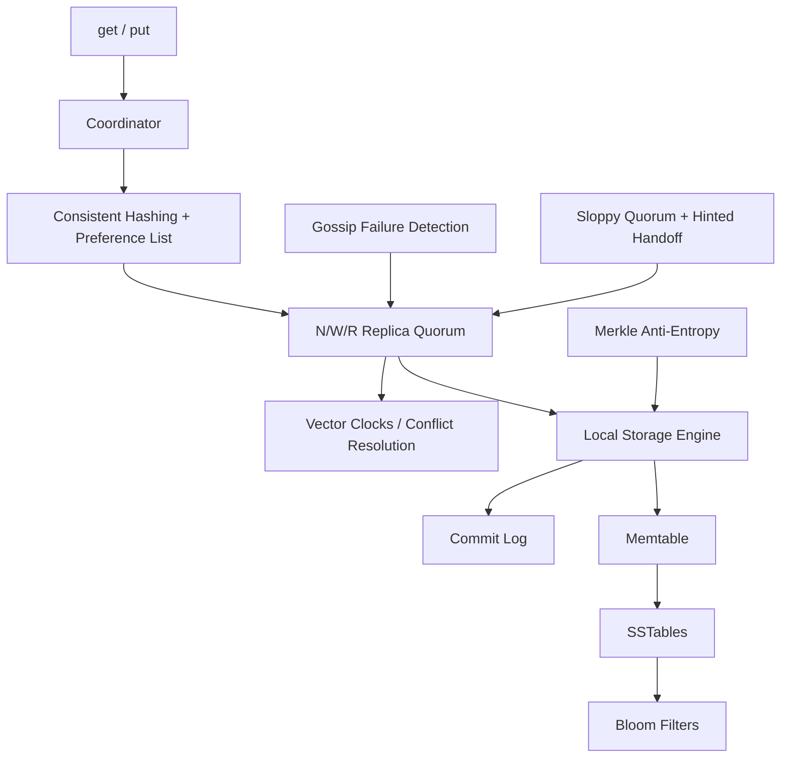

---

## 22. 核心结论与一般设计方法

### 22.1 核心结论

1. **最小 API 不等于简单系统。** 分布式语义、故障和存储路径决定真正复杂度。
2. **分区解决容量，复制解决可用性。** 二者职责不同但必须组合。
3. **CAP 选择发生在网络分区期间。** 偏 CP 拒绝不确定操作，偏 AP 接受陈旧与冲突并后续收敛。
4. **一致性哈希让扩缩容局部化。** vnode 还可表达异构容量。
5. **$N/W/R$ 同时控制延迟、故障容忍和副本可见性。** $W+R>N$ 是相交条件，不是脱离协议的万能强一致保证。
6. **最终一致把可用性问题转换为冲突问题。** 版本和向量时钟检测因果，业务逻辑负责合并。
7. **故障检测只能基于怀疑和多源证据。** Gossip 扩散成员状态，但不提供瞬时全局真相。
8. **临时和永久故障需要不同机制。** Hint 适合短暂代管，Merkle anti-entropy 适合长期副本修复。
9. **Sloppy quorum 提高可用性，也放松严格相交保证。** 不能只看 $W/R$ 数字忽略集合身份。
10. **顺序日志 + 内存表 + 不可变 SSTable 把随机写转换为顺序写。** 代价转移到读取合并和后台 compaction。
11. **Bloom filter 用小内存减少不存在 key 的磁盘 I/O。** 它允许误报但不能漏报。
12. **去中心化消除固定主节点，不消除协调。** 每次请求仍需 coordinator，成员和副本仍需协议。

### 22.2 一般设计流程

$$
\boxed{
\text{定义 API 与一致性语义}
\rightarrow
\text{估算数据/流量和故障域}
\rightarrow
\text{选择分区与副本布局}
\rightarrow
\text{配置 N/W/R}
\rightarrow
\text{定义版本和冲突合并}
\rightarrow
\text{设计检测、临时代管和永久修复}
\rightarrow
\text{设计本地持久读写路径}
\rightarrow
\text{监控陈旧、冲突、repair 与存储放大}
}
$$

### 22.3 面试中的完整表达骨架

> 我设计 `get/put` 的分布式键值存储，value 小于 10 KB，目标是海量数据、低延迟、高可用和可调一致性。key 通过一致性哈希和 vnode 分区，高容量节点获得更多 vnode；每个 key 沿环选择 $N=3$ 个不同物理/可用区节点。默认 $W=2,R=2$，严格 home quorum 读写集合相交；我会明确这还依赖版本比较和读修复，并发写用向量时钟保留 siblings。分区期间偏 AP：sloppy quorum 跳过临时故障节点，hinted handoff 在 home replica 恢复后归还数据；永久差异用按 token range 构建的 Merkle tree 做 anti-entropy。成员状态通过 gossip 最终传播，节点先 suspect 再 down，避免抖动。任意节点可作 coordinator，无固定 master。副本本地先顺序追加 commit log，再更新 memtable，阈值后 flush 不可变 SSTable；读取先查内存，再用 Bloom filter 排除不含 key 的 SSTable，并合并版本/tombstone。跨数据中心副本处理地域故障，但远端是否计入 W 由延迟和 RPO 决定。

### 22.4 章末自检

- [ ] 能否说明 opaque value 带来的优点和查询/冲突代价？
- [ ] 能否区分 CAP consistency、ACID consistency 和 SLA availability？
- [ ] 能否解释 CAP 选择为什么只在 partition 期间发生？
- [ ] 能否从 key 顺时针选择 $N$ 个不同物理副本？
- [ ] 能否解释 vnode 和 data replica 的区别？
- [ ] 能否推导 $W+R>N$ 的集合相交关系？
- [ ] 能否说明为什么还可能需要 $2W>N$ 或写入排序？
- [ ] 能否列出 $N=3$ 下快速读、快速写和 2/2 配置？
- [ ] 能否区分强、弱、最终一致及会话保证？
- [ ] 能否完整推导 D1 到 D5 的向量时钟？
- [ ] 能否用偏序判断 ancestor 与 sibling？
- [ ] 能否说明向量时钟为何不能自动合并业务 value？
- [ ] 能否推导 all-to-all heartbeat 的 $O(n^2)$ 消息量？
- [ ] 能否解释 gossip 的优势与不确定边界？
- [ ] 能否区分 strict/sloppy quorum？
- [ ] 能否描述 hinted handoff 的归还流程和局限？
- [ ] 能否按原书四步构建并比较 Merkle tree？
- [ ] 能否说明 commit log、memtable、SSTable 的职责？
- [ ] 能否推导 Bloom filter false positive 公式并说明零 false negative 要求？
- [ ] 能否解释 tombstone 过早清除为何可能让删除数据复活？

如果这些问题都能回答，就不只是记住了一组分布式术语，而是理解了本章的统一设计逻辑：**先把数据分散，再用副本承受故障；用 quorum 定义成功，用版本保留因果，用故障协议推动副本收敛，最后由日志结构存储把分布式承诺落实为每台节点上的持久字节。**
