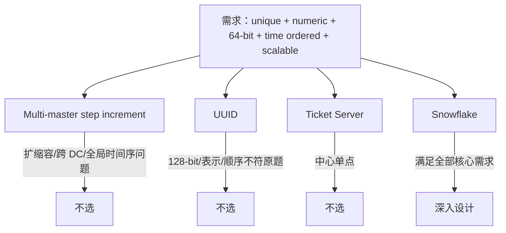
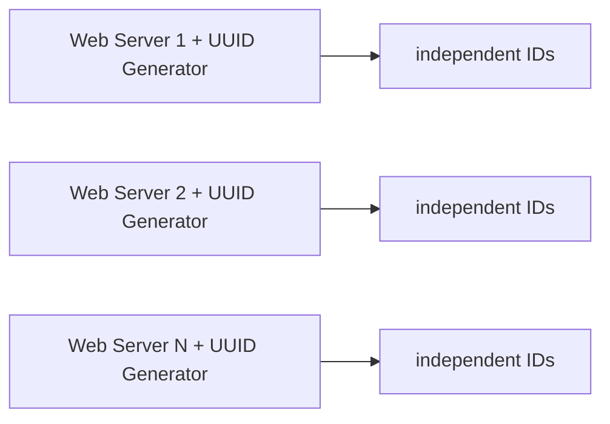
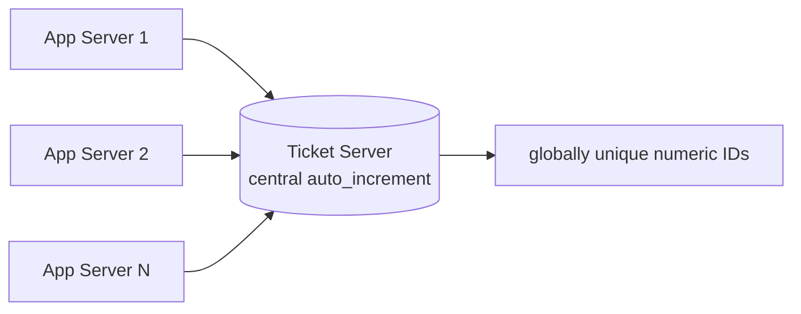
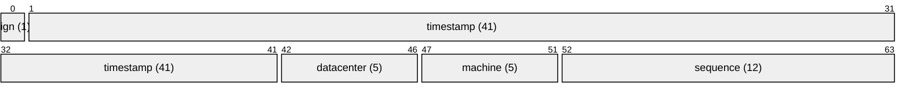
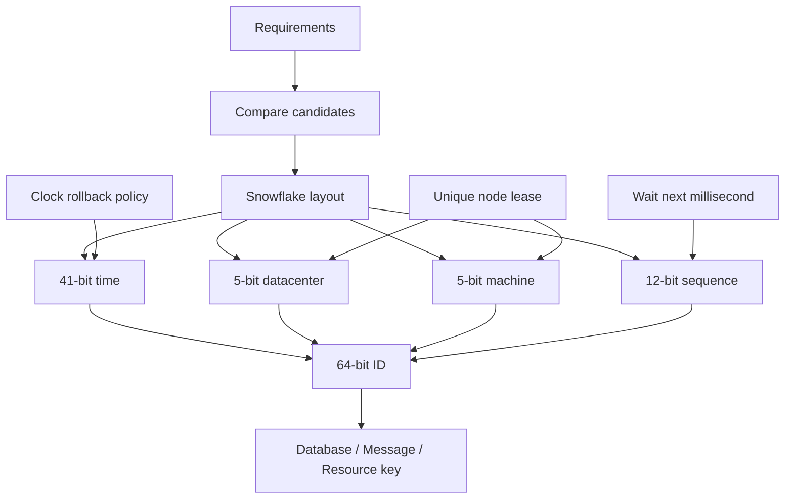

> 原书：Alex Xu，*System Design Interview: An Insider's Guide*（Second Edition）
> 原章：Chapter 7, *Design a Unique ID Generator in Distributed Systems*
> 本章主线：先澄清 ID 必须唯一、纯数字、64 bit、按时间有序且吞吐超过 10,000/s；再依次比较多主自增、UUID、Ticket Server 和 Snowflake，利用需求排除前三种方案；最后把 64 bit 拆成符号位、时间戳、数据中心、机器和序列号，推导其容量、排序与寿命，并讨论时钟回拨、位段调优和高可用。

## 0. 学习目标、阅读边界与全章路线

在单数据库中，常用自增主键生成唯一 ID：

```sql
id BIGINT AUTO_INCREMENT PRIMARY KEY
```

分布式环境中却同时存在多个写入节点。若每台机器都从 1 开始自增，就会生成相同 ID；若所有机器都访问一个数据库序列，唯一性恢复了，但吞吐、延迟和可用性又受中心节点限制。

本章要解决的问题是：

> 在多数据中心、多机器并发生成 ID 时，不进行每次全局协调，仍生成满足业务格式、顺序、容量和可用性要求的唯一 ID。

读完后，应当能够回答：

1. 唯一、连续、单调递增和按时间大致有序有什么区别？
2. 为什么单库 `auto_increment` 不能直接扩展到多写节点？
3. 多主步长自增如何避免冲突，又为何难以扩缩容和全局排序？
4. UUID 为什么易扩展，却不满足本章的 64-bit 数字与时间顺序要求？
5. Ticket Server 为什么简单，又为何成为单点？
6. Snowflake 如何用位段组合消除每次生成时的跨节点协调？
7. 41-bit 毫秒时间为什么约能使用 69 年？
8. 5-bit 数据中心和 5-bit 机器字段支持多少生成节点？
9. 12-bit 序列为什么允许每台机器每毫秒生成 4096 个 ID？
10. Snowflake ID 如何编码、解码并恢复生成时间与节点？
11. Sequence 溢出时为什么必须等待下一毫秒？
12. 时钟回拨为什么会破坏唯一性或排序，NTP 为什么不能单独证明安全？
13. 数据中心 ID 与机器 ID 如何唯一分配和回收？
14. Snowflake 是否全局严格递增、无空洞、不可预测？
15. 如何根据寿命、节点数和单节点峰值重新分配位段？

作者沿第 3 章四步框架推进：


本文严格沿原书顺序展开。原章没有给出完整实现，本文补充的编码/解码公式、可运行生成器、生日悖论、时钟回拨策略、节点租约与容量模型属于标准工程背景，不是作者逐式给出的原文。

---

## 1. 为什么分布式唯一 ID 是系统问题

### 1.1 单机自增依赖一个串行状态

单机生成器只需维护：

```text
next_id = next_id + 1
```

在同一个数据库事务中，这个状态可被锁或日志串行化，因此不会重复。

有 $n$ 台独立机器时，每台都看到自己的 `next_id`，若没有协调：

```text
machine A: 1, 2, 3, ...
machine B: 1, 2, 3, ...
```

立即冲突。若每次生成都访问中心序列，则中心序列重新成为所有写入的同步点。

### 1.2 ID 生成为什么位于关键路径

订单、消息、帖子、数据库记录通常要先有 ID 才能：

- 持久化；
- 建立外键或引用；
- 去重与幂等；
- 分区路由；
- 追踪日志和请求；
- 向客户端返回资源标识。

生成器不可用可能阻塞整个写入系统，所以它既要正确，也要低延迟、高吞吐和高可用。

### 1.3 设计目标之间存在冲突

| 目标 | 容易采用的方向 | 代价 |
|---|---|---|
| 绝对唯一 | 中心序列或全局共识 | 延迟、吞吐、单点/多数派依赖 |
| 无协调扩展 | 每节点独立随机或结构化生成 | 难以连续、严格全局排序 |
| 按时间有序 | 编码物理/逻辑时间 | 依赖时钟，暴露生成时间 |
| 短 ID | 减少 bit | 缩短寿命、节点数或单毫秒容量 |
| 无空洞 | 串行提交后分配 | 并发和故障恢复复杂 |
| 不可预测 | 随机化/加密映射 | 失去自然排序或增加索引 |

没有一个方案在所有维度都最优，必须先澄清业务真正要求什么。

---

## 2. Step 1：理解问题并确定设计范围

作者通过候选人与面试官的问答逐项确认需求。

### 2.1 ID 必须唯一并且可排序

**唯一性**：系统生命周期内，不同记录不能得到同一个 ID。

形式化表示：

$$
event_a\ne event_b\Rightarrow ID(event_a)\ne ID(event_b)
$$

**可排序**：本章进一步澄清为按生成日期/时间有序，晚上生成的 ID 大于同一天早上生成的 ID。

它不是要求：

$$
ID_{i+1}=ID_i+1
$$

即不要求连续加 1。

### 2.2 连续、单调和时间有序的区别

| 性质 | 定义 | Snowflake |
|---|---|---|
| 唯一 | 不重复 | 在时钟与节点 ID 前提成立时保证 |
| 连续无空洞 | 相邻成功记录 ID 差 1 | 不保证 |
| 单节点单调 | 同一生成器后发 ID 更大 | 正常时钟下保证 |
| 全局严格单调 | 任意节点后发生事件 ID 都更大 | 不完全保证，受时钟偏差影响 |
| 时间大致有序 | 高位时间戳使数值总体随时间增长 | 保证到时间戳精度与时钟质量 |

分布式系统中，连续无空洞通常需要知道哪些预留 ID 最终提交，故障回滚会使它很昂贵。多数主键只需要唯一和可索引，不需要无空洞。

### 2.3 只允许数字

最终 ID 是 64-bit 整数，可以十进制展示：

```text
1586451091225000000
```

“数字”应继续澄清：

- 存储为整数还是十进制字符串？
- 客户端语言能否精确表示 64-bit 整数？
- 是否允许负数？

JavaScript `Number` 只能精确表示到 $2^{53}-1$。Snowflake ID 可超过该值，JSON API 应返回字符串或客户端使用 `BigInt`，否则低位会被舍入，破坏唯一性。

### 2.4 必须放进 64 bit

原书选择 1 个符号位始终为 0，因此 ID 作为有符号 64-bit 整数仍为非负数：

$$
0\le ID\le2^{63}-1
$$

这便于使用数据库 `BIGINT`、排序索引和多数语言的有符号整数。

64 bit 的总状态空间为 $2^{64}$，但 Snowflake 只使用最高位为 0 的一半空间，并按位段施加结构约束。

### 2.5 按日期有序，不要求每次加 1

这项澄清直接排除“必须中心序列”的必要性。只要高位编码时间，较晚毫秒生成的 ID 自然更大；同一毫秒内再由节点与序列字段打破重复。

### 2.6 吞吐超过 10,000 IDs/s

这个目标本身并不高，单数据库序列也可能达到；但结合多数据中心、低延迟和高可用，中心方案不够稳健。

容量设计要区分：

- **全局平均吞吐**；
- **全局峰值吞吐**；
- **单节点每毫秒峰值**。

Snowflake 的 sequence 约束的是第三项。即使全局只有 10,000/s，若流量全在同一毫秒到达同一节点，也会短时消耗多个序列值。

### 2.7 原书需求总结

- ID 全局唯一；
- 只含数字；
- 可放入 64 bit；
- 按日期/时间有序；
- 每秒生成超过 10,000 个。

### 2.8 还应补问的工程需求

原章未全部展开，实际面试可继续问：

- 需要多少数据中心、每中心多少生成节点？
- ID 要服务多少年？
- 是否允许暴露时间与拓扑？
- 是否需要全局严格顺序，还是趋势有序？
- 时钟回拨时宁可阻塞还是临时不可用？
- 节点 ID 如何分配？
- 批量生成是否需要？
- 是否接受生成后未使用形成空洞？
- 多租户是否共享同一 ID 空间？

这些答案决定 bit 分配和故障策略。

---

## 3. Step 2：四种候选方案与需求排除法

作者依次比较：

1. Multi-master replication；
2. UUID；
3. Ticket Server；
4. Twitter Snowflake。

不是先认定 Snowflake 再介绍，而是用 Step 1 的需求逐项排除不合适方案。



---

## 4. 方案一：多主复制与步长自增

### 4.1 算法

有 $k$ 台数据库，每台使用不同起始偏移，步长为 $k$：

$$
ID_{i,m}=offset_i+m\cdot k
$$

例如 $k=2$：

```text
DB 1: 1, 3, 5, 7, ...
DB 2: 2, 4, 6, 8, ...
```

同一固定配置下，两台数据库生成的余数类不同，因此不冲突。

### 4.2 为什么能扩展一部分吞吐

每台数据库独立生成自己的序列，无需每个 ID 都访问同一中心。总吞吐近似各主库吞吐之和：

$$
QPS_{total}\approx\sum_{i=1}^{k}QPS_i
$$

### 4.3 原书指出的三个问题

#### 多数据中心扩展困难

需要在全球确保起始值、步长和节点集合不冲突，还要处理地域隔离和配置传播。

#### ID 不按时间全局增长

DB1 先生成 1，稍后 DB2 生成 2，但并发和批量情况下可能出现数值顺序与真实时间不一致。每台序列只保证本地递增。

#### 增删服务器困难

若从 $k=2$ 变成 $k=3$，旧节点何时切换步长？切换期间如何避免生成已被其他余数类使用的 ID？需要全局协调和版本化，削弱了简单性。

### 4.4 其他边界

- 多主恢复旧备份可能让序列回退；
- 跨主复制并不负责 ID 分配协议；
- 配置错误会直接生成重复 ID；
- 数值中不能自然解析时间和节点。

### 4.5 适用范围

节点数量固定、单地域、只要求唯一数字而不要求时间排序的小型系统可以使用。它不是普遍错误，而是不满足本章全部需求。

---

## 5. 方案二：UUID

### 5.1 核心思想

每台 Web 服务器独立生成 128-bit UUID，不需要中心协调。原书示例：

```text
09c93e62-50b4-468d-bf8a-c07e1040bfb2
```



### 5.2 唯一性是概率保证

以均匀随机 $b$ bit 空间为例，生成 $n$ 个 ID 的碰撞概率近似生日悖论：

$$
P(collision)\approx1-e^{-\frac{n(n-1)}{2\cdot2^b}}
$$

达到约 50% 碰撞概率时：

$$
n_{50}\approx\sqrt{2\ln2}\cdot2^{b/2}
$$

UUID v4 有 122 个随机 bit，碰撞概率在正常规模下极低。原书引用的直觉是：每秒生成 10 亿个，持续约 100 年，发生一次重复的概率才接近 50%。具体数字取决于 UUID 版本和有效随机位，重点是空间巨大。

### 5.3 原书优点

- 生成简单；
- 无节点协调；
- 易随 Web 服务器水平扩展；
- 没有同步瓶颈。

### 5.4 原书缺点

- 128 bit，不满足 64-bit；
- 原书讨论的通用 UUID 不随时间递增；
- 常用字符串表示包含十六进制字符和连字符，不满足“纯十进制数字”的展示要求。

严格地说，UUID 本质是 128-bit 数，也可转成十进制；UUID v1/v6/v7 等具有时间成分。原书是在其需求和当时常见通用 UUID 方案下做比较。即便使用时间有序 UUID，长度仍不满足 64-bit。

### 5.5 数据库索引影响

随机 UUID 插入 B-tree 聚簇索引时会分散到不同页，可能增加页分裂和缓存局部性问题。时间有序 UUID/ULID 改善局部性，但 ID 更长。

### 5.6 何时 UUID 更合适

- 不要求 64 bit；
- 希望完全本地生成；
- 不希望暴露集中式序列；
- 跨组织生成 ID；
- 冲突概率可接受；
- ID 不要求连续。

---

## 6. 方案三：Ticket Server

### 6.1 核心思想

用单个中心数据库的 `auto_increment` 作为 Ticket Server，所有系统向它申请 ID。



Flickr 曾采用此类分布式主键方案。

### 6.2 原书优点

- 纯数字；
- 易于理解和实现；
- 小中型系统可用；
- 中心序列天然全局唯一。

### 6.3 原书缺点：单点故障

单 Ticket Server 宕机，所有依赖者都无法生成 ID。增加多个 Ticket Server 又重新引入：

- 序列分片与同步；
- 主备切换后序列是否回退；
- 双主脑裂；
- 全局顺序；
- 跨地域延迟。

### 6.4 号段分配优化

中心服务可以一次分配一段：

```text
worker A gets [1, 1000]
worker B gets [1001, 2000]
```

本地消费区间，中心调用减少 $B$ 倍。若每段大小为 $B$、全局生成速率为 $Q$：

$$
RangeRequestQPS\approx\frac{Q}{B}
$$

但 Worker 故障会留下空洞；中心仍是号段权威依赖；跨地域缓存大号段则恢复时间和浪费增加。

### 6.5 适用范围

要求严格中心分配、吞吐中等、可接受中心高可用数据库和号段空洞时，Ticket/segment 方案很实用。Snowflake 不是唯一可用答案。

---

## 7. 方案四：Twitter Snowflake

前三种方案分别缺少某项需求：多主难动态扩展，UUID 过长且原题顺序/格式不符，Ticket Server 是中心单点。Snowflake 使用 divide and conquer：把一个 64-bit 整数拆成多个字段。

### 7.1 64-bit 布局

```text
| 1 bit sign | 41 bits timestamp | 5 bits datacenter | 5 bits machine | 12 bits sequence |
```

总和：

$$
1+41+5+5+12=64
$$



若 Mermaid 渲染器不支持 `packet-beta`，逻辑顺序仍可按上方文本布局理解。

### 7.2 每个字段的职责

| 字段 | bit | 取值数 | 解决的问题 |
|---|---:|---:|---|
| sign | 1 | 固定 0 | 保持有符号 BIGINT 非负，预留未来用途 |
| timestamp | 41 | $2^{41}$ ms | 时间排序与约 69 年寿命 |
| datacenter | 5 | 32 | 区分数据中心 |
| machine | 5 | 32/DC | 区分同中心生成节点 |
| sequence | 12 | 4096/ms/node | 同一机器同一毫秒内去重 |

### 7.3 为什么组合后唯一

任意两个生成事件若：

- 毫秒不同，timestamp 不同；
- 同毫秒但数据中心不同，datacenter 不同；
- 同中心同毫秒但机器不同，machine 不同；
- 同节点同毫秒，sequence 逐次不同。

因此，只要满足：

1. 每个活跃生成器的 `(datacenter_id,machine_id)` 唯一；
2. 时钟不回到已经生成过的毫秒，或有安全处理；
3. 同毫秒不复用 sequence；

位元组：

$$
(timestamp,datacenter,machine,sequence)
$$

不会重复，编码整数也不会重复。

### 7.4 编码公式

设：

- 当前毫秒 $t$；
- 自定义 epoch $E$；
- 时间差 $\Delta t=t-E$；
- 数据中心 $d$；
- 机器 $m$；
- 序列 $s$。

低位共：

$$
5+5+12=22\ \text{bits}
$$

机器左移 12 bit，数据中心左移 $5+12=17$ bit。ID：

$$
ID=(\Delta t\ll22)\ |
(d\ll17)\ |
(m\ll12)\ |
s
$$

字段范围：

$$
0\le\Delta t<2^{41},\quad
0\le d<2^5,
$$

$$
0\le m<2^5,\quad
0\le s<2^{12}
$$

符号位无需显式写入，因为最高位保持 0。

### 7.5 解码公式

掩码：

$$
mask(b)=2^b-1
$$

$$
s=ID\ \&\ (2^{12}-1)
$$

$$
m=(ID\gg12)\ \&\ (2^5-1)
$$

$$
d=(ID\gg17)\ \&\ (2^5-1)
$$

$$
\Delta t=(ID\gg22)\ \&\ (2^{41}-1)
$$

$$
t=E+\Delta t
$$

这意味着 Snowflake ID 可被反推出大致生成时间和节点拓扑。若这些信息敏感，需要外层不透明映射、加密/置换或选择随机 ID。

---

## 8. Step 3：Snowflake 深入设计

作者选择 Snowflake 后，重点解释静态节点字段、时间戳和序列号。

### 8.1 数据中心 ID 与机器 ID 在启动时确定

原书说明：

- datacenter ID 与 machine ID 在启动时选择；
- 系统运行后通常固定；
- 意外修改可能造成 ID 冲突；
- timestamp 与 sequence 在运行时产生。

为什么修改会冲突？假设机器 A 使用 `(1,7)` 生成过某毫秒的 sequence；机器 B 误配为同一 `(1,7)`，若时间重叠，就可能构造完全相同的四元组。

### 8.2 节点 ID 分配

可选方式：

- 静态配置，适合节点固定、规模小；
- 数据库/配置中心唯一注册；
- ZooKeeper/etcd 租约；
- Kubernetes StatefulSet 稳定 ordinal；
- 从机架/地域元数据映射，但必须防重。

租约模式需满足：

```text
同一 (datacenter,machine) 在任意时刻最多有一个有效持有者
```

旧节点失去租约后必须停止生成。回收 ID 前要等待旧进程确定退出和最大时钟偏差，否则旧、新持有者可能重叠。

### 8.3 为什么节点字段放在 sequence 之前

数值比较顺序为：

1. timestamp；
2. datacenter；
3. machine；
4. sequence。

同一毫秒内，不同节点 ID 按拓扑字段排序，而不是按真实生成先后排序。节点字段主要保证唯一，不代表因果顺序。

---

## 9. 41-bit 时间戳

### 9.1 使用自定义 epoch

不保存 Unix epoch 起的完整毫秒，而保存：

$$
\Delta t=nowMillis-customEpoch
$$

原书使用 Twitter Snowflake epoch：

```text
1288834974657 ms
2010-11-04 01:42:54.657 UTC
```

自定义 epoch 越接近系统上线日期，41 bit 可覆盖的未来时间越长。

### 9.2 Figure 7-7 时间解码

原图从 ID 的 41-bit timestamp 得到十进制：

```text
297616116568
```

加 Twitter epoch：

$$
297616116568+1288834974657
=1586451091225
$$

转成 UTC：

```text
2020-04-09 16:51:31.225 UTC
```

原图展示为秒级 `Apr 09 2020 16:51:31 UTC`，毫秒 `.225` 被省略。

### 9.3 41 bit 的最大值

$$
2^{41}-1=2,199,023,255,551\ \text{ms}
$$

换算年数：

$$
Years=\frac{2^{41}-1}
{1000\times60\times60\times24\times365}
$$

$$
Years\approx69.73
$$

原书取约 69 年。

若使用 Twitter epoch，溢出时间约在 2080 年；精确日期取决于最大值边界与实现。系统上线时必须记录 epoch 和格式版本，不能等到最后一年才迁移。

### 9.4 为什么时间戳放高位

当 $t_2>t_1$ 且时间差至少 1 ms：

$$
(t_2-t_1)\ll22\ge2^{22}
$$

低 22 bit 的最大组合为：

$$
2^{22}-1
$$

因此较晚毫秒的最小 ID 仍大于较早毫秒的最大 ID：

$$
((\Delta t+1)\ll22)>((\Delta t\ll22)+(2^{22}-1))
$$

这证明在使用同一时钟基准且不回拨时，跨毫秒数值严格递增。

### 9.5 时间精度的含义

时间只精确到毫秒。同一毫秒内：

- 同节点由 sequence 排序；
- 不同节点由 datacenter/machine 数值排序；
- 无法从 ID 判断两个不同节点事件的真实微秒级先后。

Snowflake 提供的是**按毫秒分组的大致全局时间排序**，不是分布式系统的完整因果时钟。

---

## 10. 12-bit 序列号

### 10.1 容量

12 bit 提供：

$$
2^{12}=4096
$$

个值，即 `0..4095`。每台机器每毫秒最多生成 4096 个 ID。

理论单节点每秒上限：

$$
4096\times1000=4,096,000\ \text{IDs/s}
$$

32 数据中心 × 每中心 32 机器 = 1024 个节点，全局理论上限：

$$
1024\times4,096,000
=4,194,304,000\ \text{IDs/s}
$$

这是位空间理论上限，不是现实服务吞吐。CPU、锁、系统时钟调用、网络、持久化和负载不均都会降低实际值。

### 10.2 状态转移

```text
if now > last_timestamp:
    sequence = 0
elif now == last_timestamp:
    sequence = sequence + 1
else:
    handle_clock_rollback()
```

同一毫秒 sequence 不能回到 0，否则同节点会重复。

### 10.3 Sequence 溢出

第 4097 个请求到达同一毫秒时，12 bit 已耗尽。最简单策略：等待时钟进入下一毫秒，再重置 sequence。

```text
while current_millis <= last_timestamp:
    current_millis = clock()
sequence = 0
```

这形成最多约 1 ms 的等待，但若时钟停滞或回拨，循环可能长时间阻塞，需要超时和健康检查。

### 10.4 原书“字段为 0”的理解

原书说该字段在同一毫秒生成超过一个 ID 之前为 0。准确地说：新毫秒第一条 ID 常用 sequence 0，随后依次为 1、2...。

### 10.5 并发线程安全

同一生成器进程中多个线程必须原子更新 `(last_timestamp,sequence)`：

- 互斥锁；
- CAS 原子状态；
- 单线程事件循环；
- 每线程预分配子序列，但会减少容量或增加字段。

只让整数 `sequence++` 原子不够，时间戳判断和重置也要与它形成原子状态转换。

---

## 11. 编码与解码的可运行实现

下面代码使用可注入时钟，便于验证：

- ID 唯一与单调；
- 同一毫秒 sequence 增长；
- 跨毫秒 sequence 重置；

- Figure 7-7 时间戳换算；
- 字段解码；
- 时钟回拨检测；
- sequence 溢出等待下一毫秒。

```python
from dataclasses import dataclass
from datetime import datetime, timezone
from threading import Lock
from typing import Callable

TWITTER_EPOCH_MS = 1_288_834_974_657

@dataclass(frozen=True)
class SnowflakeParts:
    timestamp_ms: int
    datacenter_id: int
    machine_id: int
    sequence: int

class ClockMovedBackwards(RuntimeError):
    pass

class SnowflakeGenerator:
    TIMESTAMP_BITS = 41
    DATACENTER_BITS = 5
    MACHINE_BITS = 5
    SEQUENCE_BITS = 12

    MAX_DATACENTER = (1 << DATACENTER_BITS) - 1
    MAX_MACHINE = (1 << MACHINE_BITS) - 1
    MAX_SEQUENCE = (1 << SEQUENCE_BITS) - 1
    MAX_TIMESTAMP_DELTA = (1 << TIMESTAMP_BITS) - 1

    MACHINE_SHIFT = SEQUENCE_BITS
    DATACENTER_SHIFT = MACHINE_BITS + SEQUENCE_BITS
    TIMESTAMP_SHIFT = DATACENTER_BITS + MACHINE_BITS + SEQUENCE_BITS

    def __init__(
        self,
        datacenter_id: int,
        machine_id: int,
        clock_ms: Callable[[], int],
        epoch_ms: int = TWITTER_EPOCH_MS,
    ) -> None:
        if not 0 <= datacenter_id <= self.MAX_DATACENTER:
            raise ValueError("datacenter_id is outside 5-bit range")
        if not 0 <= machine_id <= self.MAX_MACHINE:
            raise ValueError("machine_id is outside 5-bit range")
        self.datacenter_id = datacenter_id
        self.machine_id = machine_id
        self.clock_ms = clock_ms
        self.epoch_ms = epoch_ms
        self.last_timestamp = -1
        self.sequence = 0
        self.lock = Lock()

    def next_id(self) -> int:
        with self.lock:
            now = self.clock_ms()
            if now < self.last_timestamp:
                raise ClockMovedBackwards(
                    f"clock moved backwards by {self.last_timestamp - now} ms"
                )

            if now == self.last_timestamp:
                self.sequence = (self.sequence + 1) & self.MAX_SEQUENCE
                if self.sequence == 0:
                    now = self._wait_for_next_millis(self.last_timestamp)
            else:
                self.sequence = 0

            delta = now - self.epoch_ms
            if not 0 <= delta <= self.MAX_TIMESTAMP_DELTA:
                raise OverflowError("timestamp is outside 41-bit epoch range")

            self.last_timestamp = now
            return (
                (delta << self.TIMESTAMP_SHIFT)
                | (self.datacenter_id << self.DATACENTER_SHIFT)
                | (self.machine_id << self.MACHINE_SHIFT)
                | self.sequence
            )

    def _wait_for_next_millis(self, previous: int) -> int:
        now = self.clock_ms()
        while now <= previous:
            now = self.clock_ms()
        return now

    def decode(self, snowflake_id: int) -> SnowflakeParts:
        sequence = snowflake_id & self.MAX_SEQUENCE
        machine_id = (
            snowflake_id >> self.MACHINE_SHIFT
        ) & self.MAX_MACHINE
        datacenter_id = (
            snowflake_id >> self.DATACENTER_SHIFT
        ) & self.MAX_DATACENTER
        delta = (
            snowflake_id >> self.TIMESTAMP_SHIFT
        ) & self.MAX_TIMESTAMP_DELTA
        return SnowflakeParts(
            timestamp_ms=self.epoch_ms + delta,
            datacenter_id=datacenter_id,
            machine_id=machine_id,
            sequence=sequence,
        )

class ManualClock:
    def __init__(self, values: list[int]) -> None:
        self.values = iter(values)
        self.current = 0

    def __call__(self) -> int:
        self.current = next(self.values, self.current)
        return self.current

# Same-millisecond IDs differ only in sequence; the next millisecond resets it.
base = TWITTER_EPOCH_MS + 1_000
clock = ManualClock([base, base, base + 1])
generator = SnowflakeGenerator(3, 7, clock)
ids = [generator.next_id() for _ in range(3)]
assert ids[0] < ids[1] < ids[2]
assert [generator.decode(value).sequence for value in ids] == [0, 1, 0]
assert all(generator.decode(value).datacenter_id == 3 for value in ids)
assert all(generator.decode(value).machine_id == 7 for value in ids)

# Reproduce the timestamp conversion in Figure 7-7.
figure_delta = 297_616_116_568
figure_timestamp_ms = TWITTER_EPOCH_MS + figure_delta
assert figure_timestamp_ms == 1_586_451_091_225
figure_time = datetime.fromtimestamp(
    figure_timestamp_ms / 1000,
    tz=timezone.utc,
)
assert figure_time.isoformat() == "2020-04-09T16:51:31.225000+00:00"

# A clock rollback is rejected instead of risking duplicate IDs.
rollback_clock = ManualClock([base + 10, base + 9])
rollback_generator = SnowflakeGenerator(1, 1, rollback_clock)
rollback_generator.next_id()
try:
    rollback_generator.next_id()
except ClockMovedBackwards:
    pass
else:
    raise AssertionError("clock rollback was not detected")

print("ids:", ids)
print("decoded:", [generator.decode(value) for value in ids])
print("figure time:", figure_time.isoformat())
```

### 11.1 实现边界

示例 `_wait_for_next_millis` 为突出算法而忙等，生产代码不应无限占用 CPU：

- 使用短暂 sleep/yield；
- 设置最大等待；
- 记录 sequence exhaustion 指标；
- 时钟长时间不前进时摘除节点；
- 对高峰增加节点或 sequence bit。

### 11.2 为什么 ID 生成后可能不用

业务取得 ID 后事务可能失败，ID 就形成空洞。Snowflake 不回收旧 ID，因为回收需要判断全局是否曾被观察或持久化，会引入昂贵协调。唯一 ID 不等于连续票据。

---

## 12. Snowflake 的排序性质与索引行为

### 12.1 跨毫秒排序

时间位在高位，因此正常时钟下，后一个毫秒的所有 ID 大于前一个毫秒的所有 ID。这有利于：

- 数据库 B-tree 尾部附近插入；
- 按 ID 做近似时间范围扫描；
- 日志和消息粗略排序；
- 不额外存时间也可提取创建时间。

### 12.2 同一毫秒跨节点不是真实时间序

假设在同一毫秒：

- datacenter 0 最后生成；
- datacenter 31 最先生成。

数值仍按 datacenter 字段排序，不能推断真实先后。若业务需要因果或全局严格序，应使用数据库序列、共识日志、Hybrid Logical Clock 等更强协议。

### 12.3 时钟偏差破坏跨节点时间顺序

真实时刻 $T_2>T_1$，但节点 B 时钟慢，可能有：

$$
clock_B(T_2)<clock_A(T_1)
$$

于是后发生事件的 ID 反而更小。NTP 能减小偏差，不提供物理时钟绝对同步证明。

### 12.4 热点写入

时间有序 ID 使 B-tree 插入集中在索引尾部：

- 页局部性好、页分裂通常少于随机 UUID；
- 但分布式数据库若按 ID 范围分片，所有最新写入可能集中到最后一个 shard。

因此“ID 有序利于索引”与“按 ID 范围分区形成热点”可以同时成立。可用哈希分区、复合分区键或预分片分散写入。

---

## 13. Step 4：时钟同步与时钟回拨

原书把 clock synchronization 列为首要延伸话题，并指出多核与多机场景都可能存在时钟问题，NTP 是常用方案。

### 13.1 时钟问题的来源

- NTP 校时把时间向后 step；
- 虚拟机暂停/恢复；
- 宿主迁移；
- CMOS/硬件时钟异常；
- leap second 处理；
- 多核历史硬件计时源不一致；
- 人工修改系统时间。

### 13.2 回拨为什么可能重复

节点 `(d,m)` 在毫秒 $t$ 已生成 sequence `0..k`。时钟回到同一 $t$，进程若把 sequence 重置，再生成 sequence 0，就复制了旧四元组。

$$
(t,d,m,0)_{old}=(t,d,m,0)_{new}
$$

### 13.3 策略一：拒绝并等待时钟追上

若回拨幅度小：

```text
if now < last_timestamp:
    wait until now >= last_timestamp
```

优点：简单、保持格式和顺序。缺点：生成器短暂不可用；大回拨会长时间阻塞。

### 13.4 策略二：回拨即熔断节点

检测到回拨后：

- 停止生成；
- 告警并从负载均衡摘除；
- 修正时钟或重新分配新的 machine ID；
- 确保旧身份不会并发使用。

优先正确性，适合 ID 重复代价高的系统。

### 13.5 策略三：预留 clock/era bit

用额外 bit 表示时钟世代，回拨时切换世代。代价是减少时间、节点或 sequence 位；世代 bit 用完仍需处理。

### 13.6 策略四：逻辑时间

当物理时钟回拨时，继续使用：

$$
logicalTimestamp=\max(now,lastTimestamp)
$$

并消耗 sequence。若真实时钟长期落后，sequence 可能持续溢出；ID 中时间也暂时领先真实时间。需要限制最大逻辑漂移。

### 13.7 NTP 的正确作用

NTP：

- 减少节点时钟偏差；
- 长期校准频率；
- 可通过 slew 平缓调整。

但应用仍必须检测 `now < last_timestamp`。把“部署 NTP”当作回拨不可能发生，是常见误区。

---

## 14. Step 4：位段长度调优

原书指出，低并发、长寿命应用可以减少 sequence 位、增加 timestamp 位。

### 14.1 通用位预算

若保留 1 sign bit：

$$
t+d+m+s=63
$$

- $t$：timestamp bits；
- $d$：datacenter bits；
- $m$：machine bits；
- $s$：sequence bits。

容量：

$$
LifetimeMs=2^t
$$

$$
Datacenters=2^d
$$

$$
MachinesPerDC=2^m
$$

$$
IDsPerMsPerMachine=2^s
$$

### 14.2 根据需求反推 bit

需要至少 $X$ 个离散值时：

$$
bits=\lceil\log_2X\rceil
$$

例如：

- 需要 20 个数据中心：$\lceil\log_2 20\rceil=5$ bit；
- 每中心 100 台机器：$\lceil\log_2 100\rceil=7$ bit；
- 单机每毫秒峰值 500：$\lceil\log_2 500\rceil=9$ bit。

已用 $5+7+9=21$ bit，时间可用：

$$
63-21=42\ \text{bits}
$$

42-bit 毫秒时间约 139.4 年。

### 14.3 吞吐不能只按平均值

若单节点峰值 $q$ IDs/s，平均到每毫秒为 $q/1000$，但流量有 burst。可预留峰值系数 $f$：

$$
s=\left\lceil\log_2\left(\frac{q}{1000}f\right)\right\rceil
$$

还应通过压测观察最繁忙毫秒，而不是只看秒均值。

### 14.4 时间单位也可以调整

- 毫秒：约 69.7 年，单时间格粒度高；
- 10 毫秒：相同时间 bit 寿命增加 10 倍，但每格需要更多 sequence；
- 秒：寿命极长，但单秒 sequence 字段巨大；
- 微秒：时间精细，但寿命大幅缩短。

单位与 sequence 位共同决定吞吐和排序精度。

### 14.5 格式版本与迁移

位段一旦进入数据库和外部 API，改变解释会破坏解码。迁移方式：

- 预留 version bit；
- 使用新的 epoch/ID 类型；
- 让旧、新生成器并行，按版本解码；
- 外层携带 schema version；
- 提前规划 69 年后的下一格式。

不能只在代码中修改 bit 常量后继续生成，否则新旧 ID 会被错误解析甚至冲突。

---

## 15. Step 4：高可用

作者指出 ID 生成器是 mission-critical，必须高可用。

### 15.1 Snowflake 数据面天然去中心化

每台机器只依赖：

- 本地节点 ID；
- 本地时钟；
- 本地 sequence 状态。

生成每个 ID 不需要网络 RPC。某台生成器故障只损失其容量，其余节点继续工作。

### 15.2 隐藏的控制面依赖

Machine ID 分配系统可能是中心依赖。应保证：

- 租约服务本身高可用；
- 已获得租约的生成器在短时控制面故障时可继续；
- 新节点无法获得身份时不冒险启动；
- 失去租约的节点停止生成；
- 节点 ID 回收有隔离期。

### 15.3 无状态负载均衡

ID 请求可分发到任意健康生成节点。客户端重试时可能获得不同 ID，因此业务写入要用 request idempotency key 防止创建两条记录。

ID 唯一不能自动使“生成 ID + 写数据库”成为恰好一次。

### 15.4 容量余量

若每节点安全吞吐 $q$，峰值 $Q$，允许同时故障 $f$ 台：

$$
n\ge\left\lceil\frac{Q}{q}\right\rceil+f
$$

还要跨可用区部署，避免同一故障域丢失全部生成能力。

### 15.5 状态持久化与进程重启

若进程在同一毫秒内重启，sequence 状态丢失，理论上可能重复。常见保护：

- 启动后等待时钟超过持久化的最后时间；
- 持久化 `last_timestamp`；
- 重启获取新的 machine ID；
- machine ID 租约回收前等待安全窗口；
- 时钟精度为毫秒时，正常进程启动通常已跨毫秒，但不能只依赖概率。

### 15.6 监控指标

- IDs/s 与每节点分布；
- sequence 使用率和溢出次数；
- 时钟回拨次数/幅度；
- NTP offset；
- 节点 ID 租约冲突；
- 生成延迟 P99；
- 距 epoch 溢出剩余时间；
- ID 重复数据库约束错误；
- 生成器可用节点数。

数据库仍应保留唯一约束作为最后防线，不能因为算法证明就取消检测。

---

## 16. 四种方案的完整比较

| 方案 | 唯一性来源 | 位长/格式 | 顺序 | 协调 | 扩展性 | 主要风险 |
|---|---|---|---|---|---|---|
| 单库自增 | 中心事务序列 | 数字、可 64 bit | 严格递增 | 每次中心协调 | 有限 | 单点与吞吐 |
| 多主步长 | 不同余数类 | 数字、可 64 bit | 本地递增 | 配置时协调 | 中等 | 增删节点、跨 DC、全局顺序 |
| UUID | 巨大随机/结构空间 | 128 bit，常用十六进制字符串 | 依版本而定 | 无 | 很高 | 过长、索引局部性、原题格式不符 |
| Ticket Server | 中心自增 | 数字、可 64 bit | 严格/近似递增 | 每 ID 或每号段 | 中等 | 中心单点、号段空洞 |
| Snowflake | 时间 + 唯一节点 + 序列 | 64-bit 数字 | 毫秒级大致有序 | 启动分配节点 ID | 很高 | 时钟回拨、节点 ID 冲突、信息泄露 |

### 16.1 为什么本章选择 Snowflake

- 64-bit 数字满足格式；
- 时间在高位，支持日期排序；
- 每节点每毫秒 4096，吞吐远超 10,000/s；
- 节点 ID 隔离并发生成器；
- 每 ID 不需要中心 RPC；
- 可水平增加生成节点。

选择成立的前提是能够可靠管理节点 ID 和时钟。

---

## 17. 容易混淆的概念与常见误区

### 17.1 唯一与连续

唯一只要求不重复；连续要求没有空洞。Snowflake 允许业务失败、节点字段和时间跳跃造成大空洞。

### 17.2 单调递增与按时间大致有序

同一节点正常时钟下单调；跨节点受时钟偏差和节点字段影响，只保证粗粒度时间排序。

### 17.3 可排序与因果顺序

数值顺序不能证明事件 A 导致 B。因果顺序需要日志、Lamport clock、vector clock 或共识等机制。

### 17.4 64 bit 与 JavaScript 安全整数

JavaScript `Number` 只有 53-bit 整数精度。API 应用字符串传 Snowflake ID，避免舍入碰撞。

### 17.5 UUID 一定不按时间排序

不同 UUID 版本不同。原章比较的是通用 UUID 方案；UUID v6/v7 可时间排序，但仍是 128 bit，不满足原题。

### 17.6 UUID 是“非数字”

UUID 本质是 128-bit 数，常见文本采用十六进制和连字符。原书的“non-numeric”针对表示与需求，不是说其底层没有数值。

### 17.7 Ticket Server 一定吞吐低

号段分配可大幅降低中心 QPS。它的核心代价是中心权威可用性和号段管理，而非必然无法达到 10k/s。

### 17.8 Snowflake 完全无协调

每次生成无协调，但 datacenter/machine ID 分配、租约与格式版本仍需要控制面协调。

### 17.9 NTP 保证时钟永不回拨

错误。NTP 减少偏差，应用仍必须检测回拨并定义等待、熔断或逻辑时间策略。

### 17.10 12 bit 表示每秒只能 4096 个

是每**毫秒每节点** 4096 个，理论每秒约 409.6 万个。

### 17.11 32×32 只支持 64 台机器

5-bit datacenter 支持 32 个中心，每中心 5-bit machine 支持 32 台，总共 1024 个唯一节点组合。

### 17.12 Sequence 溢出可以直接回到 0

同一毫秒回到 0 会重复；必须等待下一时间格或改变其他唯一字段。

### 17.13 Sign bit 可以随便用于业务标记

把最高位设 1 后，有符号 BIGINT 变成负数并改变排序。格式升级必须全系统协调。

### 17.14 Custom epoch 越新越永远安全

它只把约 69.7 年窗口向后移动，不能延长窗口长度。还必须确保所有节点使用同一 epoch。

### 17.15 ID 可解码只是优点

便于排障，也会泄露创建时间、数据中心和机器信息，并允许估计业务量。公开资源 ID 可能需要不透明化。

### 17.16 Snowflake ID 适合作为安全令牌

不适合。它可预测且不包含认证熵。访问控制必须独立，安全令牌应使用密码学随机数。

### 17.17 ID 有序就不会形成数据库热点

B-tree 局部性可能改善，但按 ID 范围分片会让新写集中到尾 shard。索引结构和分区策略要分别分析。

### 17.18 生成成功等于业务写入成功

ID 可能生成后未使用；客户端重试也可能生成多个 ID。业务幂等性和事务仍需单独设计。

### 17.19 Machine ID 可立即复用

旧进程、网络分区或时钟区间可能仍在生成。必须通过租约 fencing、确认退出和安全等待避免重叠。

### 17.20 位段调整只改常量即可

位布局是持久协议。修改后旧 ID 会被误解码，必须版本化迁移。

---

## 18. 本章知识结构

### 18.1 需求层

- 全局唯一；
- 64-bit 纯数字；
- 时间有序但不要求连续；
- 超过 10,000 IDs/s；
- 分布式高可用。

### 18.2 方案层

- 多主步长：分散生成，动态成员困难；
- UUID：无协调、空间大，长度/格式不符；
- Ticket Server：中心序列简单，但有中心依赖；
- Snowflake：结构化本地生成，依赖时间与节点身份。

### 18.3 位布局层

- 1 sign；
- 41 timestamp；
- 5 datacenter；
- 5 machine；
- 12 sequence；
- 左移与按位或编码，掩码与右移解码。

### 18.4 正确性层

- 唯一节点组合；
- 同毫秒 sequence 不复用；
- 检测时钟回拨；
- sequence 溢出等待；
- 节点租约和 fencing；
- 数据库唯一约束兜底。

### 18.5 运维层

- 时钟同步与 offset 监控；
- 节点 ID 分配和回收；
- 高可用部署与容量余量；
- 格式版本和 epoch 迁移；
- 信息泄露与 API 序列化。



---

## 19. 核心结论与一般设计方法

### 19.1 核心结论

1. **先区分唯一、连续、单调和时间有序。** 不必要的严格顺序会引入昂贵全局协调。
2. **单库自增的正确性来自中心串行状态。** 分布式扩展必须分解或分配这份状态。
3. **多主步长把 ID 空间按余数切分。** 固定成员时简单，动态增删和跨地域困难。
4. **UUID 用巨大空间换取无协调概率唯一。** 易扩展，但本章 64-bit 数字与顺序要求不匹配。
5. **Ticket Server 用中心化换简单和严格唯一。** 号段可提高吞吐，但中心权威仍需高可用。
6. **Snowflake 把唯一性分解为时间、节点身份和局部序列。** 每次生成不再需要网络协调。
7. **41-bit 毫秒时间提供约 69.7 年。** Custom epoch 移动窗口，不延长窗口。
8. **12-bit sequence 是每节点每毫秒容量。** 溢出必须等待下一毫秒。
9. **Snowflake 不是全局严格顺序。** 同毫秒节点字段和跨节点时钟偏差会改变数值顺序。
10. **时钟与节点 ID 是正确性前提。** NTP、租约、回拨检测和 fencing 缺一不可。
11. **位布局是持久协议。** 调优要从寿命、拓扑和单节点峰值反推，并版本化迁移。
12. **高可用数据面不等于无控制面。** 节点身份分配服务也必须高可用并安全回收。

### 19.2 一般设计流程

$$
\boxed{
\text{澄清唯一/顺序/格式/吞吐/寿命}
\rightarrow
\text{判断是否允许中心协调}
\rightarrow
\text{比较随机、中心序列、号段、结构化 ID}
\rightarrow
\text{按时间/节点/序列分配 bit}
\rightarrow
\text{证明唯一性与容量}
\rightarrow
\text{设计时钟回拨和序列溢出}
\rightarrow
\text{管理节点身份与高可用}
\rightarrow
\text{版本化格式并监控}
}
$$

### 19.3 面试中的完整表达骨架

> 需求是全局唯一、纯数字、64 bit、按时间大致有序且超过 10k/s，不要求连续。多主步长在节点增删时难协调；UUID 无协调但 128 bit 且不符合格式；Ticket Server 简单但中心依赖。选择 Snowflake：1 sign + 41 timestamp + 5 datacenter + 5 machine + 12 sequence。编码为 `((now-epoch)<<22)|(dc<<17)|(machine<<12)|seq`。41-bit 毫秒约 69.7 年，32×32=1024 个节点，每节点每毫秒 4096 个。唯一性依赖活跃节点 `(dc,machine)` 不重复、同毫秒序列不复用、时钟不回到已使用区间。Sequence 溢出等待下一毫秒；小时钟回拨等待，大回拨熔断节点。节点身份由带租约和 fencing 的高可用控制面分配，失租节点停止生成。ID 对外用字符串，避免 JavaScript 53-bit 精度问题；监控时钟 offset、回拨、序列耗尽、租约冲突和 epoch 剩余寿命。若业务要求全局严格顺序，我会改用共识序列，而不把 Snowflake 的趋势有序误当成严格顺序。

### 19.4 章末自检

- [ ] 能否区分唯一、连续、单节点单调和全局严格单调？
- [ ] 能否说明为什么本章不要求 ID 每次加 1？
- [ ] 能否推导多主步长公式及增删节点问题？
- [ ] 能否用生日悖论解释随机 UUID 碰撞概率？
- [ ] 能否说明 UUID v7 与原书通用 UUID 结论的边界？
- [ ] 能否解释 Ticket Server 的优点、单点和号段优化？
- [ ] 能否写出 1/41/5/5/12 位布局并验证总和为 64？
- [ ] 能否推导 Snowflake 编码与解码公式？
- [ ] 能否证明不同毫秒的 ID 数值不会被低 22 bit 反超？
- [ ] 能否复算 Figure 7-7 的 UTC 时间？
- [ ] 能否推导 41-bit 毫秒约 69.7 年？
- [ ] 能否推导每节点每毫秒 4096、每秒 409.6 万？
- [ ] 能否说明同一毫秒跨节点不代表真实先后？
- [ ] 能否处理 sequence 溢出而不重复？
- [ ] 能否解释 NTP 为什么不能消除回拨处理？
- [ ] 能否给出等待、熔断、世代 bit 和逻辑时间的回拨策略？
- [ ] 能否设计不会重复分配 machine ID 的租约机制？
- [ ] 能否根据寿命、节点数和峰值反推 bit 数？
- [ ] 能否解释为何 Snowflake 应作为字符串发给 JavaScript 客户端？
- [ ] 能否说明 ID 唯一与业务幂等是两个问题？

如果这些问题都能回答，就不只是记住一个 64-bit 图，而是理解了本章的核心方法：**把全局唯一这份看似必须中心协调的状态，拆成共享时间、互斥节点身份和节点内序列三部分，让绝大多数生成操作变成本地计算，再把真正需要协调的工作收缩到低频的节点身份管理与时钟治理。**
