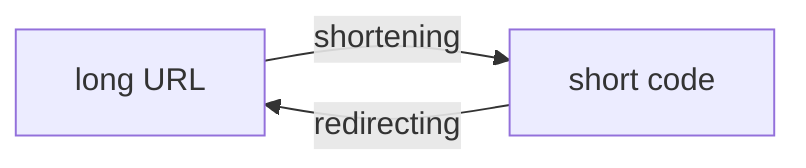
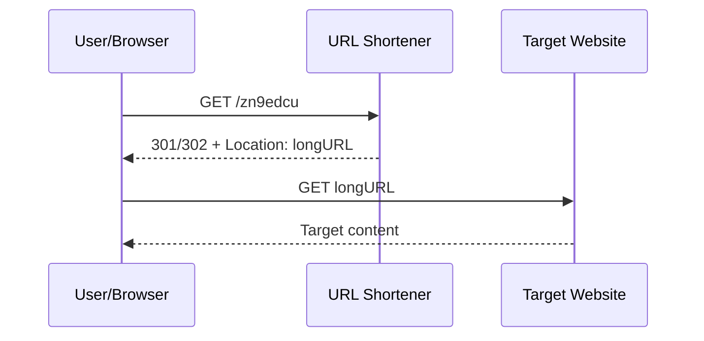
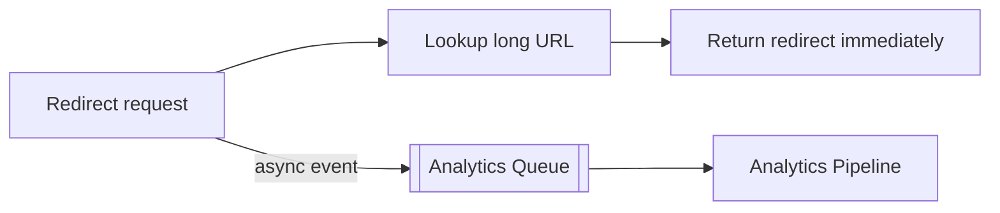
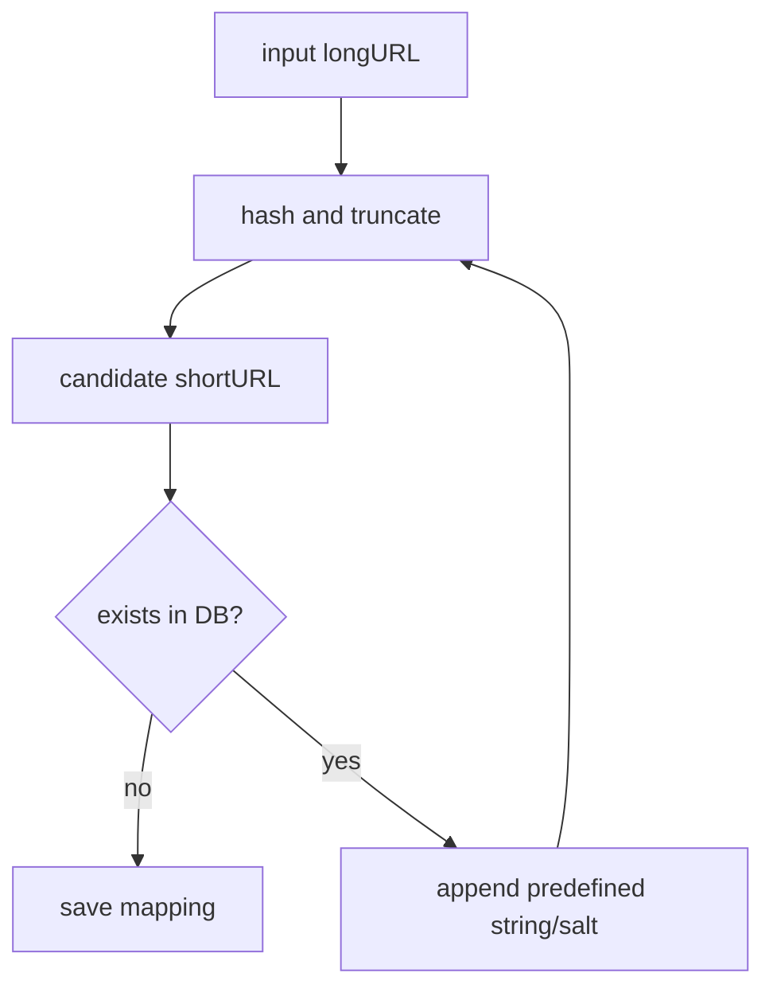
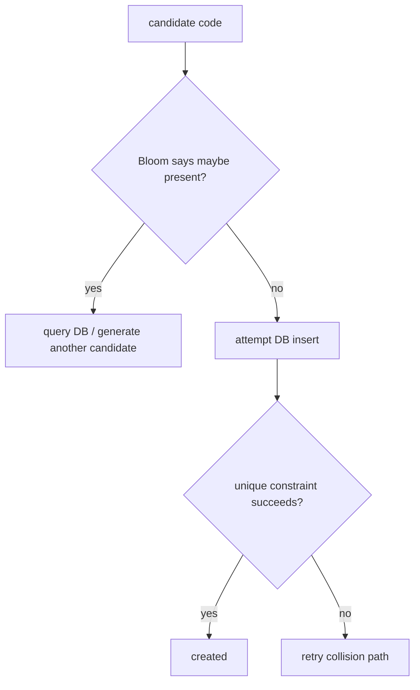
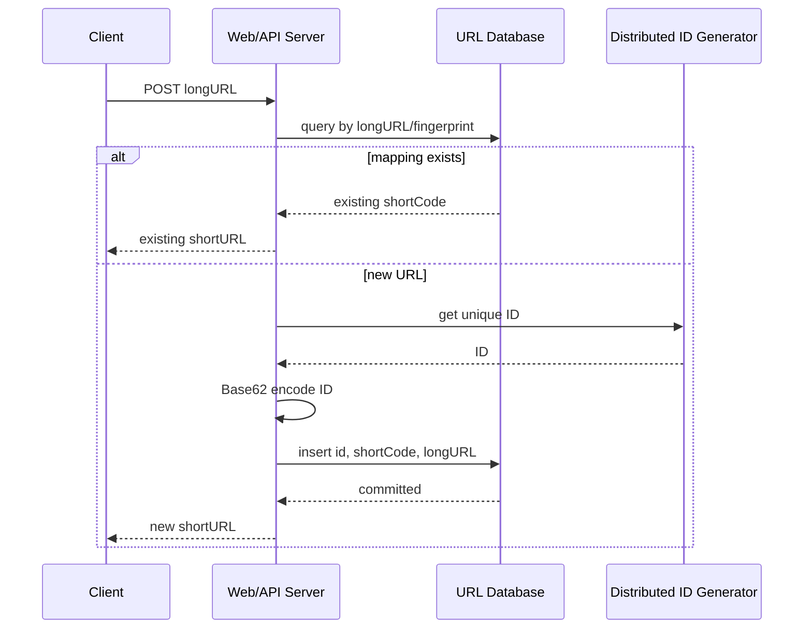
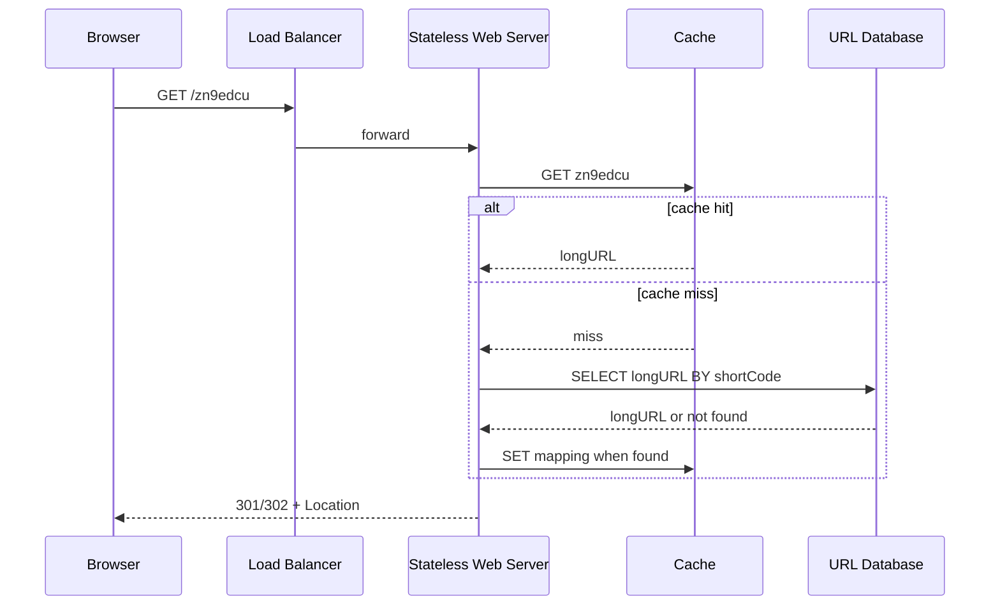
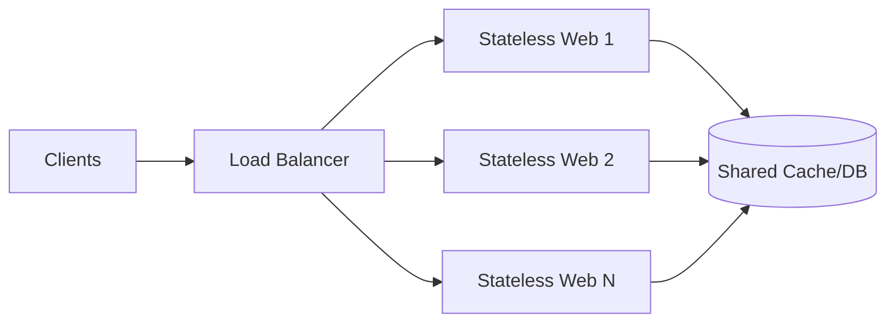
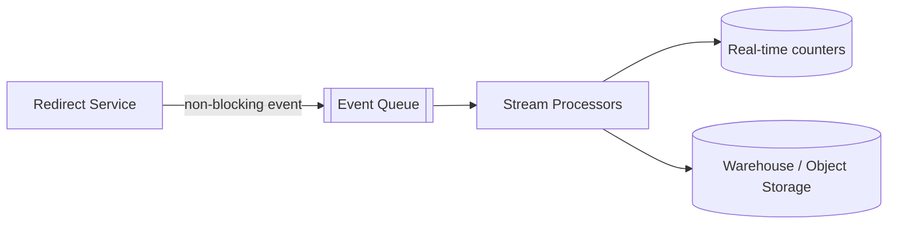
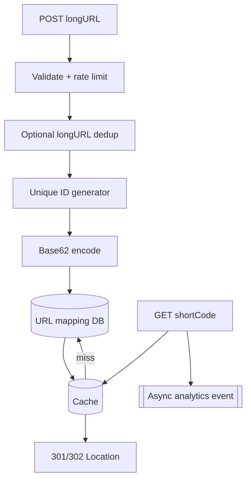

> 原书：Alex Xu，*System Design Interview: An Insider's Guide*（Second Edition）
> 原章：Chapter 8, *Design a URL Shortener*
> 本章主线：先澄清短链接创建、跳转、字符集、规模和不可修改等边界；再设计 REST API，比较 301/302 跳转语义，并用映射表建立最小方案；随后把内存映射迁入数据库，推导 7 位 Base62 短码容量，比较“哈希 + 碰撞处理”与“唯一 ID + Base62 编码”，最后深入创建和跳转两条路径，并补充限流、无状态扩容、数据库分片、统计分析和可靠性。

## 0. 学习目标、源文边界与全章路线

URL 短链接服务把长 URL 映射为更短、便于分享的别名。例如：

```text
long URL:
https://www.systeminterview.com/q=chatsystem&c=loggedin&v=v3&l=long

short URL:
https://tinyurl.com/y7keocwj
```

访问短链接时，服务查询映射并向浏览器返回 HTTP 重定向，让浏览器继续访问原始 URL。

这个系统只有两条核心业务路径：



但真正的设计问题包括：

1. 需要多长的短码才能覆盖系统生命周期内的全部 URL？
2. 同一长 URL 是否必须始终返回同一短码？
3. 如何避免两个长 URL 获得同一个短码？
4. 为什么普通密码学哈希不能直接反推出长 URL？
5. 301 与 302 分别如何影响缓存、服务负载和点击统计？
6. Base62 为什么只是进制编码，不是压缩算法或安全哈希？
7. 唯一 ID 生成器如何消除短码碰撞？
8. 创建请求并发到达时如何保证幂等？
9. 读多写少时缓存如何保护数据库？
10. 短码可预测会带来什么枚举、隐私和滥用风险？
11. 如何在多机房、分片、缓存故障和数据库故障下维持服务？
12. 点击分析如何与低延迟重定向解耦？

原章按四步框架展开：


本文严格遵循原书顺序。原页存在两处需要特别说明的边界：

1. 原书先算出 10 年共有 3650 亿条记录，又在存储公式中重复乘以 10 年，因此写成 365 TB。按原假设每条 URL 100 bytes，正确的原始 URL 数据量是 **36.5 TB**。若平均每条约 1 KB，则才接近 365 TB。
2. Base62 示例原页写的是十进制 $11157_{10}$，转换稿把下标 10 粘成了 `1115710`。正确输入是十进制 11157，输出 `2TX`。

本文会保留作者的推理主线，同时明确纠正这两个算术/排版问题。补充的碰撞概率、并发幂等、缓存一致性、安全和分片设计属于工程背景，不是原书逐式给出的原文。

---

## 1. Step 1：理解问题并确定设计范围

系统设计题故意开放。作者先通过问答把“设计 TinyURL”收敛为可以计算和验证的目标。

### 1.1 短链接如何工作

候选人先要求一个具体例子。这个问题确认了系统不是网页代理或内容压缩服务，而是维护：

$$
shortCode\longleftrightarrow longURL
$$

短链接本身不包含目标网页内容。跳转后由浏览器直接访问长 URL 所指向的站点。

### 1.2 写入规模：每天创建 1 亿条

面试官给定：

$$
Writes_{day}=100,000,000=10^8
$$

这决定：

- 平均创建 QPS；
- ID 生成吞吐；
- 数据库写入规模；
- 10 年短码命名空间；
- 防滥用与成本。

### 1.3 短链接要尽可能短

“尽可能短”不是长度为 1，而是在容量、字符集和产品可读性约束下取最小可行长度。更短意味着：

- 更易分享和手工输入；
- 二维码更紧凑；
- 命名空间更小，碰撞/耗尽更快；
- 自定义别名更容易抢占。

长度必须由生命周期内最大映射数推导，而不是凭感觉选择。

### 1.4 字符集：`0-9`、`a-z`、`A-Z`

字符数：

$$
10+26+26=62
$$

因此采用 Base62 命名空间。大小写敏感意味着：

```text
abc != Abc != ABC
```

客户端、代理、数据库 collation 和日志系统都必须保持大小写，不能把短码自动转小写。数据库唯一索引也应使用区分大小写的比较规则。

### 1.5 不支持删除和更新

原书为了简化，假设短链接不可修改或删除。这一假设带来重要简化：

- `shortCode -> longURL` 一旦创建就不可变；
- 缓存可设置很长 TTL；
- 不存在更新后缓存陈旧；
- 301 永久重定向更符合语义；
- 不需要 tombstone、失效传播和短码回收。

真实系统通常需要过期、删除、恶意链接下架和目标更新。若重新加入这些能力，缓存和重定向语义必须改变。

### 1.6 三项基本需求

原书总结：

1. 输入长 URL，返回短 URL；
2. 输入短 URL，重定向到长 URL；
3. 具备高可用、可扩展和容错能力。

### 1.7 还应澄清的工程问题

在真实面试中还可以问：

- 同一长 URL 是否返回同一短码？
- 是否允许用户自定义 alias？
- 是否有过期时间？
- 是否需要登录和所有权？
- 是否禁止恶意、钓鱼或私网 URL？
- 点击统计是否必须实时准确？
- 跳转延迟和可用性目标是什么？
- 短码是否需要不可预测？
- 创建接口是否允许客户端提供幂等键？
- 一个短链接是否能根据设备、地域做不同跳转？

原书后续创建流程会先按 long URL 查询，隐含“同一长 URL 返回同一短码”的去重语义。这个语义必须明确，否则数据库索引与并发处理会不同。

---

## 2. 粗略估算

### 2.1 平均写 QPS

每天 1 亿次创建：

$$
QPS_{write,avg}=\frac{10^8}{24\times3600}
=\frac{10^8}{86400}
\approx1157.4
$$

原书取约 1160 QPS。

这是平均值，不是容量峰值。若峰均比为 5：

$$
QPS_{write,peak}\approx1160\times5=5800
$$

### 2.2 平均读 QPS

原书假设读写比 10:1：

$$
QPS_{read,avg}\approx1160\times10=11600
$$

跳转是主要流量，系统应优先优化读路径：无状态 Web 层、缓存、只读副本和就近入口。

真实热门短链接会产生极端热点，平均 11,600 QPS 不能描述单 key 的百万级突发。

### 2.3 10 年记录数

$$
Records=10^8\times365\times10
=365,000,000,000
$$

即 3650 亿条。

### 2.4 原书存储公式的重复乘年数

原书写：

```text
365 billion records * 100 bytes * 10 years = 365 TB
```

但 `365 billion records` 已经是 10 年总量，不能再次乘 10。按十进制单位：

$$
365\times10^9\times100
=36.5\times10^{12}\ \text{bytes}
=36.5\ \text{TB}
$$

所以按“平均 URL 长度 100 bytes”的原假设，原始长 URL 数据量是 36.5 TB。

如果每条完整记录平均约 1 KB，包括：

- long URL；
- short code；
- 主键；
- 创建时间、过期时间、用户 ID；
- 行和页开销；
- 索引；

则 10 年逻辑数据约为 365 TB。再考虑 3 副本、备份和 70% 目标利用率：

$$
Provisioned\approx\frac{365\times3}{0.7}
\approx1564\ \text{TB}
\approx1.56\ \text{PB}
$$

这只是示例，真正的平均行大小必须用样本测量。

### 2.5 带宽估算

若每次跳转响应含约 500 bytes HTTP 头和 `Location`：

$$
Bandwidth_{redirect}
\approx11600\times500\times8
=46.4\ \text{Mb/s}
$$

本身不大，但热门流量、TLS、日志、分析事件和跨地域复制会增加带宽。短链接服务通常先受 QPS、缓存热点和数据库查询影响，而不是响应体带宽。

### 2.6 估算结论

- 平均创建约 1160 QPS；
- 平均跳转约 11,600 QPS；
- 10 年最多约 3650 亿映射；
- 短码空间至少覆盖 $3.65\times10^{11}$；
- 原始 100-byte URL 约 36.5 TB；
- 读路径比写路径更值得缓存；
- 设计仍需按峰值和热点压测。

---

## 3. Step 2：API 设计

作者采用 REST 风格，给出两个接口。

### 3.1 创建短链接

原书接口：

```http
POST /api/v1/data/shorten
Content-Type: application/json

{
  "longUrl": "https://example.com/a/very/long/path"
}
```

返回短 URL。

一个更完整的响应可以是：

```http
HTTP/1.1 201 Created
Content-Type: application/json

{
  "shortUrl": "https://tinyurl.com/zn9edcu",
  "shortCode": "zn9edcu",
  "longUrl": "https://example.com/a/very/long/path"
}
```

若同一长 URL 已存在并返回旧映射，可返回 200；具体状态码取决于幂等语义。

### 3.2 跳转接口

原书写：

```http
GET /api/v1/shortUrl
```

实际短链通常把 code 放路径：

```http
GET /zn9edcu HTTP/1.1
Host: tinyurl.com
```

服务返回：

```http
HTTP/1.1 302 Found
Location: https://example.com/a/very/long/path
```

浏览器收到后发起第二次请求。短链服务返回的是重定向响应，不是把目标页面内容转发给用户。

### 3.3 API 契约还需定义

- 长 URL 最大长度；
- 支持的 scheme，如只允许 `http`/`https`；
- URL 格式校验；
- 重复创建语义；
- 幂等键；
- 限流；
- 私网、`file:`、`javascript:` 等危险目标过滤；
- 错误码和不存在短码的响应；
- 是否返回预览或安全提示。

---

## 4. URL 重定向高层设计

### 4.1 浏览器流程



短链服务只参与第一次请求。第二次请求直接到目标站点。

### 4.2 301 Moved Permanently

原书解释：浏览器可缓存永久重定向，后续相同短链不再请求短链服务。

优点：

- 降低服务器负载；
- 降低跳转延迟；
- 减少数据库和缓存查询。

缺点：

- 客户端缓存后，点击不再经过服务，统计不完整；
- 若未来允许修改目标，旧缓存难以撤回；
- 恶意目标下架反应更慢。

HTTP 缓存行为还受 `Cache-Control`、浏览器实现和中间缓存影响，不能只凭状态码假设所有客户端永久缓存。

### 4.3 302 Found

原书把 302 视为临时跳转，后续请求仍先进入短链服务。

优点：

- 每次点击更容易记录；
- 可动态修改目标或应用安全策略；
- 可做地域/设备路由。

缺点：

- 每次点击增加短链服务负载和延迟；
- 短链服务故障会影响全部跳转；
- 仍要显式控制缓存头，302 并非绝对不可缓存。

### 4.4 301 与 302 的选择

| 目标 | 更倾向 |
|---|---|
| 最大限度降低短链服务负载 | 301 + 长缓存 |
| 每次点击分析 | 302/307 + 合理缓存策略 |
| 允许修改/下架 | 临时跳转或短 TTL |
| 永久不可变公开链接 | 301/308 |

307/308 是更现代的临时/永久状态码，并明确保留 HTTP 方法；短链接通常是 GET，所以原书重点比较 301/302 已足够。

### 4.5 统计不必全部同步完成

即使每次点击进入服务，也不应在响应前同步写分析数据库：



异步事件可能至少一次投递，统计端要处理重复；重定向可用性不应依赖分析系统。

---

## 5. 高层映射表与缩短函数

### 5.1 最小重定向实现

原书以哈希表保存：

```text
shortURL -> longURL
```

流程：

```text
longURL = hashTable.get(shortURL)
return HTTP redirect to longURL
```

内存哈希表平均查找 $O(1)$，适合建立概念基线。

### 5.2 高层缩短函数

短 URL：

```text
www.tinyurl.com/{hashValue}
```

原书定义函数：

$$
f(longURL)=hashValue
$$

并提出：

- 每个 longURL 应映射到一个 hashValue；
- 每个 hashValue 能映射回 longURL。

### 5.3 普通哈希不能反向恢复长 URL

密码学哈希是多对一、不可逆函数。所谓“从 hashValue 映射回 longURL”依赖数据库记录：

$$
shortCode\xrightarrow{database\ lookup}longURL
$$

不是：

$$
hash^{-1}(shortCode)=longURL
$$

若只保存短码而不保存长 URL，普通哈希无法恢复目标。

### 5.4 一对一映射需要碰撞处理或唯一 ID

固定 7 位短码空间有限，不可能从无限长 URL 集合无碰撞地直接映射。设计必须：

- 检测并处理哈希碰撞；或
- 先生成唯一整数，再做一一对应的 Base62 编码。

---

## 6. Step 3：数据模型

### 6.1 为什么不能把全部映射只放内存

3650 亿条映射远超普通内存容量，而且内存昂贵、进程重启易失。哈希表适合缓存，不适合作为唯一持久数据源。

原书改用关系数据库，简化表有三列：

```text
url_table
---------
id        PK
shortURL
longURL
```

### 6.2 更明确的 schema

```sql
CREATE TABLE url_mapping (
    id          BIGINT PRIMARY KEY,
    short_code  VARCHAR(16) NOT NULL UNIQUE,
    long_url    TEXT NOT NULL,
    created_at  TIMESTAMP NOT NULL
);
```

原题不允许更新/删除，因此不必加入 `updated_at` 和 tombstone。真实系统常增加：

```text
owner_id
expires_at
status
url_fingerprint
custom_alias
created_by_ip_hash
```

### 6.3 为什么存 short code 而不是完整 short URL

域名 `https://tinyurl.com/` 对所有记录重复。数据库只存 `zn9edcu`：

- 节省空间；
- 更小索引；
- 域名迁移更容易；
- 避免 scheme/host 表示不一致。

原书列名 `shortURL` 可理解为短码或完整短 URL，工程上应明确。

### 6.4 索引

- `PRIMARY KEY(id)`：唯一 ID；
- `UNIQUE(short_code)`：跳转查询和碰撞最终防线；
- 若同一长 URL 必须复用映射，需要长 URL 反向索引。

直接索引很长的 `TEXT` 成本高，可保存规范化 URL 的强指纹：

```text
long_url_hash = SHA-256(canonical_long_url)
```

并在命中指纹后比较完整 URL，防止理论哈希碰撞。

### 6.5 长 URL 规范化要谨慎

下列 URL 可能语义相同，也可能不同：

```text
https://example.com
https://example.com/
https://EXAMPLE.com/
https://example.com:443/
https://example.com/?a=1&b=2
https://example.com/?b=2&a=1
```

安全规范化通常可处理：

- scheme/host 大小写；
- 默认端口；
- punycode；
- 明确的路径规范。

不能随意排序/删除查询参数，因为某些服务把顺序、重复参数和跟踪参数纳入语义。若无法确定，按原始 URL 字节去重更安全。

---

## 7. 短码长度推导

### 7.1 Base62 空间

长度为 $n$ 的固定短码最多表示：

$$
M(n)=62^n
$$

原书表：

| $n$ | 最大组合数 $62^n$ |
|---:|---:|
| 1 | 62 |
| 2 | 3,844 |
| 3 | 238,328 |
| 4 | 14,776,336 |
| 5 | 916,132,832 |
| 6 | 56,800,235,584 |
| 7 | 3,521,614,606,208，约 3.5 万亿 |

需要覆盖 3650 亿：

$$
62^6\approx5.68\times10^{10}<3.65\times10^{11}
$$

$$
62^7\approx3.52\times10^{12}>3.65\times10^{11}
$$

因此最小固定长度是：

$$
n=\left\lceil\log_{62}(3.65\times10^{11})\right\rceil=7
$$

### 7.2 命名空间利用率

10 年后使用率：

$$
\alpha=\frac{365\times10^9}{62^7}
\approx10.36\%
$$

Base62 唯一 ID 编码不会随机碰撞，但随机/哈希选码时，负载因子越高，冲突重试越频繁。

### 7.3 保留字符和业务空间

若要保留：

- 自定义别名；
- 管理路径如 `/api`、`/admin`；
- 敏感词；
- 易混淆字符；

有效字母表/空间会缩小。例如删除 `0OIl1` 后不再是 Base62，必须重新计算长度。

### 7.4 可变长度与前导零

Base62 编码整数时，短码长度随 ID 增长：

- 小 ID 短；
- 超过 $62^6-1$ 后变 7 位；
- 超过 $62^7-1$ 后变 8 位。

若产品要求固定 7 位，可左侧补字符，但需定义前导零是否参与唯一性。原书选择“尽可能短”，因此可变长度合理。

---

## 8. 方案一：哈希加碰撞处理

### 8.1 原书候选哈希

对：

```text
https://en.wikipedia.org/wiki/Systems_design
```

原书表：

| 函数 | 十六进制输出 |
|---|---|
| CRC32 | `5cb54054` |
| MD5 | `5a62509a84df9ee03fe1230b9df8684e` |
| SHA-1 | `0eeae7916c06853901d9ccbefbfcaf4de57ed85b` |

即使 CRC32 也有 8 个十六进制字符，超过目标 7 字符。

### 8.2 截断前 7 字符

最直接方案：

```text
candidate = hash(longURL)[:7]
```

不同长 URL 可能共享相同前缀，因此必须查数据库是否已占用。

### 8.3 原书碰撞解决流程



每次碰撞后给输入附加预定义字符串，再次哈希，直到找到空码。

### 8.4 原书示例的十六进制空间不足

如果截取的是哈希的 7 个**十六进制**字符，空间只有：

$$
16^7=268,435,456
$$

远小于 3650 亿。因此不能用“7 个 hex 字符”承载原规模。要得到 $62^7$ 空间，应：

- 把哈希输出映射/编码为 Base62 后取 7 位；或
- 使用随机 Base62 码；或
- 改用唯一 ID + Base62。

原书用 CRC/MD5/SHA-1 的十六进制输出解释“哈希太长”和碰撞流程，但若按其前 7 hex 字符字面实现，容量不满足本章估算。这是必须纠正的设计边界。

### 8.5 生日碰撞

在大小 $M$ 的空间中均匀随机生成 $n$ 个码，至少一次碰撞概率近似：

$$
P(collision)\approx1-e^{-\frac{n(n-1)}{2M}}
$$

当 $n\approx\sqrt{2M\ln2}$ 时，碰撞概率约 50%。对 $M=62^7$：

$$
n_{50}\approx2.21\times10^6
$$

这不表示 220 万后系统不可用，只表示必须从早期就正确处理碰撞。随着占用率约 10%，一次随机候选冲突概率也接近 10%，需要重试。

### 8.6 数据库检查成本

每次创建至少查询：

- 候选短码是否存在；
- 若同一长 URL复用，还要查反向映射；
- 碰撞时重复查询。

短码列唯一索引使检查约为 $O(\log N)$ 的索引访问，但仍增加远程数据库往返和写竞争。

### 8.7 并发竞态

两个请求可能同时看到候选不存在，然后都插入。只有数据库唯一约束能决定一个成功：

```text
INSERT ... ON CONFLICT DO NOTHING
```

失败者生成新候选并重试。不能依赖“先 SELECT 再 INSERT”的应用逻辑保证唯一。

### 8.8 优缺点

**优点**

- 短码可固定长度；
- 不依赖独立唯一 ID 生成器；
- 输入相同、salt 规则固定时可确定性生成。

**缺点**

- 必须处理碰撞；
- 每次可能查数据库多次；
- 高占用率重试增加；
- 碰撞处理与并发事务复杂；
- 截断 hex 可能严重缩小空间。

---

## 9. Bloom Filter 在碰撞检查中的作用

原书建议用 Bloom filter 改善“候选 shortURL 是否存在”的查询。

### 9.1 语义

- 返回“不存在”：在 filter 完整且正确时一定不在集合；
- 返回“可能存在”：需要查数据库；
- 允许 false positive；
- 不允许 false negative。

### 9.2 正确用法



即使 Bloom filter 说“不存在”，数据库唯一约束仍是最终防线，因为：

- filter 更新可能有传播延迟；
- 另一并发请求可能刚插入；
- filter 进程可能丢状态；
- 分片间视图可能不一致。

### 9.3 删除问题

标准 Bloom filter 不支持安全删除 bit，因为多个元素共享 bit。原题没有删除，正适合 append-only filter。若支持删除，需要 Counting Bloom Filter 或定期重建。

### 9.4 规模成本

对 3650 亿 code 建单个精确低误报 Bloom filter 本身也很大。目标误报率 1% 时每元素约 9.6 bit：

$$
365\times10^9\times9.6/8
\approx438\ \text{GB}
$$

必须分片、分层或只覆盖活跃命名空间。Bloom filter 节省数据库 miss 查询，不是免费结构。

---

## 10. 方案二：Base62 转换

### 10.1 Base62 是什么

Base62 用 62 个字符表示非负整数。原书映射：

```text
0..9  -> 0..9
10..35 -> a..z
36..61 -> A..Z
```

字母表：

```text
0123456789abcdefghijklmnopqrstuvwxyzABCDEFGHIJKLMNOPQRSTUVWXYZ
```

### 10.2 十进制 11157 转换为 `2TX`

连续除 62，记录余数：

```text
11157 / 62 = 179 remainder 59 -> X
  179 / 62 =   2 remainder 55 -> T
    2 / 62 =   0 remainder  2 -> 2
```

余数逆序：

```text
2TX
```

验证：

$$
11157=2\times62^2+55\times62^1+59\times62^0
$$

$$
=7688+3410+59=11157
$$

原页写 `11157` 并带十进制下标 10，不是数字 1,115,710。

### 10.3 编码算法

```text
function base62_encode(id):
    if id == 0: return "0"
    output = []
    while id > 0:
        id, remainder = divmod(id, 62)
        output.append(ALPHABET[remainder])
    reverse(output)
    return join(output)
```

时间复杂度：

$$
O(\log_{62}ID)
$$

空间复杂度也为输出长度 $O(\log_{62}ID)$。

### 10.4 解码算法

从左到右：

$$
value_{next}=value_{current}\times62+digit(character)
$$

因此 Base62 是一一对应、可逆的数字表示，不是哈希。

### 10.5 为什么没有碰撞

只要整数 ID 唯一，标准 Base62 表示也唯一：

$$
ID_a\ne ID_b\Rightarrow encode62(ID_a)\ne encode62(ID_b)
$$

碰撞问题被转移给第 7 章的分布式唯一 ID 生成器。

### 10.6 原书具体例子

$$
ID=2,009,215,674,938
$$

Base62：

```text
zn9edcu
```

最终短链接：

```text
https://tinyurl.com/zn9edcu
```

### 10.7 可预测性

若 ID 连续加 1，用户可解码短码、加 1、重新编码，枚举附近链接。原书把它列为安全顾虑。

需要正确理解：

- 不可预测短码不能替代访问控制；
- 公开短链接本就可能被分享；
- 私密内容必须认证授权；
- 可通过随机 ID、带密钥置换、Feistel permutation 或随机 suffix 降低枚举；
- 自定义混淆算法要可版本化并避免碰撞。

### 10.8 可运行的 Base62 与最小服务示例

```python
from dataclasses import dataclass
from threading import Lock

ALPHABET = "0123456789abcdefghijklmnopqrstuvwxyzABCDEFGHIJKLMNOPQRSTUVWXYZ"
BASE = len(ALPHABET)
DECODE = {character: value for value, character in enumerate(ALPHABET)}

def base62_encode(number: int) -> str:
    if number < 0:
        raise ValueError("Base62 ID must be non-negative")
    if number == 0:
        return ALPHABET[0]
    characters: list[str] = []
    while number:
        number, remainder = divmod(number, BASE)
        characters.append(ALPHABET[remainder])
    return "".join(reversed(characters))

def base62_decode(code: str) -> int:
    if not code:
        raise ValueError("short code must not be empty")
    value = 0
    for character in code:
        try:
            digit = DECODE[character]
        except KeyError as error:
            raise ValueError(f"invalid Base62 character: {character!r}") from error
        value = value * BASE + digit
    return value

assert base62_encode(11_157) == "2TX"
assert base62_decode("2TX") == 11_157
assert base62_encode(2_009_215_674_938) == "zn9edcu"
assert base62_decode("zn9edcu") == 2_009_215_674_938
assert BASE**6 == 56_800_235_584
assert BASE**7 == 3_521_614_606_208

@dataclass(frozen=True)
class Mapping:
    identifier: int
    short_code: str
    long_url: str

class InMemoryUrlShortener:
    """A thread-safe teaching model of the book's Base62 creation flow."""

    def __init__(self, next_identifier: int = 1) -> None:
        self.next_identifier = next_identifier
        self.by_code: dict[str, Mapping] = {}
        self.by_long_url: dict[str, Mapping] = {}
        self.lock = Lock()

    def shorten(self, long_url: str) -> Mapping:
        with self.lock:
            existing = self.by_long_url.get(long_url)
            if existing is not None:
                return existing

            identifier = self.next_identifier
            self.next_identifier += 1
            short_code = base62_encode(identifier)
            mapping = Mapping(identifier, short_code, long_url)
            if short_code in self.by_code:
                raise RuntimeError("unique ID invariant was violated")
            self.by_code[short_code] = mapping
            self.by_long_url[long_url] = mapping
            return mapping

    def resolve(self, short_code: str) -> str | None:
        mapping = self.by_code.get(short_code)
        return None if mapping is None else mapping.long_url

service = InMemoryUrlShortener(next_identifier=2_009_215_674_938)
first = service.shorten("https://en.wikipedia.org/wiki/Systems_design")
second = service.shorten("https://en.wikipedia.org/wiki/Systems_design")
assert first is second
assert first.short_code == "zn9edcu"
assert service.resolve("zn9edcu") == first.long_url
assert service.resolve("missing") is None

print(first)
print("11157 ->", base62_encode(11_157))
print("62^7 ->", BASE**7)
```

内存锁只用于演示同一进程的幂等创建。分布式服务必须依赖数据库唯一约束/事务和全局唯一 ID，不能用进程锁协调所有 Web 服务器。

---

## 11. 两类方案比较

原书 Table 8-3：

| 维度 | 哈希 + 碰撞处理 | Base62 转换 |
|---|---|---|
| 短码长度 | 可固定 | 随 ID 增长，可变 |
| 唯一 ID 生成器 | 不需要 | 依赖 |
| 碰撞 | 可能，必须处理 | ID 唯一时不碰撞 |
| 预测下一个短码 | 难直接推断 | 连续 ID 时容易，存在枚举顾虑 |

补充比较：

| 维度 | 哈希 + 碰撞处理 | Base62 唯一 ID |
|---|---|---|
| 创建数据库往返 | 可能多次检查/重试 | 通常一次 ID + 一次插入 |
| 确定性 | 输入与 salt 固定时可重复 | 取决于是否先查旧映射 |
| 命名空间利用 | 随机占用 | 顺序/结构化占用 |
| 并发正确性 | 唯一 short_code 索引 | 唯一 ID 和 short_code 索引 |
| 全局依赖 | 碰撞数据库 | 分布式 ID 生成器 |
| 安全性 | 哈希截断不等于保密 | 顺序 ID 可枚举 |

本章最终选择 Base62，因为流程简单、唯一性证明清楚，并可复用第 7 章 ID 生成器。

---

## 12. URL 缩短路径深入

原书 Figure 8-7 的六步流程：

1. 输入 longURL；
2. 查询 longURL 是否已存在；
3. 已存在则返回旧 shortURL；
4. 不存在则向分布式唯一 ID 生成器取新 ID；
5. 把 ID 转为 Base62 shortURL；
6. 写入 `(id, shortURL, longURL)`。



### 12.1 具体例子

```text
longURL = https://en.wikipedia.org/wiki/Systems_design
ID      = 2009215674938
Base62  = zn9edcu
short   = https://tinyurl.com/zn9edcu
```

数据库行：

| id | short_code | long_url |
|---:|---|---|
| 2009215674938 | zn9edcu | https://en.wikipedia.org/wiki/Systems_design |

### 12.2 分布式 ID 生成器

第 7 章的 Snowflake 可生成全局唯一 64-bit ID。Base62 只改变表示，不增加或减少唯一性。

若 Snowflake ID 很大，短码可能很快达到 11 个字符：

$$
62^{10}\approx8.39\times10^{17}<2^{63}-1
$$

$$
62^{11}\approx5.20\times10^{19}>2^{63}-1
$$

所以任意非负有符号 64-bit ID 最多需要 11 个 Base62 字符。原书 7 位容量设计和第 7 章完整 Snowflake 空间并非天然完全对齐：若只想保持最多 7 位，必须保证 ID 不超过 $62^7-1$，或采用独立的紧凑序列/置换空间。

原例 Snowflake 风格 ID 约 2 万亿，仍小于 $62^7$，所以得到 7 位 `zn9edcu`。

### 12.3 并发重复创建

两个请求同时提交同一 long URL：

```text
Request A: query -> absent
Request B: query -> absent
A generates ID 100
B generates ID 101
A inserts code A
B inserts code B
```

若要求同一长 URL 只有一个短码，需要数据库唯一约束：

```text
UNIQUE(long_url_fingerprint, long_url)
```

或事务/upsert：

```sql
INSERT ... ON CONFLICT (...) DO UPDATE/NOTHING
RETURNING short_code;
```

失败请求重新读取赢家映射。ID 101 形成空洞没有问题。

### 12.4 幂等键

客户端因超时重试时可携带：

```http
Idempotency-Key: 8f57...
```

服务保存 `(client_id, idempotency_key) -> response`，避免同一业务请求生成多个短码。它与“相同 long URL 全局去重”是不同语义。

### 12.5 先查后写的成本

如果业务不要求同 URL 复用短码，可省略反向查询，直接生成新 ID 并插入，吞吐更高。同一 URL 可拥有多个短码，适合不同活动单独统计。

因此原书第 2 步不是所有短链系统的必要步骤，而是一项产品选择。

### 12.6 事务边界

分布式 ID 生成器成功但数据库写失败时：

- ID 被浪费；
- 客户端收到失败；
- 重试生成新 ID；
- 不会产生冲突。

不要尝试把 ID 归还池中复用，否则已泄露/延迟请求可能与新记录冲突。

---

## 13. URL 重定向路径深入

原书认为读多写少，因此把映射放入缓存。

### 13.1 原书五步流程

1. 用户点击 `https://tinyurl.com/zn9edcu`；
2. 负载均衡器转发给 Web 服务器；
3. 缓存命中则直接返回 longURL；
4. 缓存未命中则查数据库，不存在说明短码无效；
5. 返回 longURL 并执行重定向。



### 13.2 Cache-aside

这是典型旁路缓存：

```text
value = cache.get(code)
if not found:
    value = database.get(code)
    if found:
        cache.set(code, value, ttl)
return value
```

原题映射不可变，缓存一致性简单：写入数据库成功后可预热缓存，之后长 TTL。数据库仍是权威来源。

### 13.3 热门短码

一个病毒式短链接可能承载大量 QPS，导致：

- 单缓存 shard 热 key；
- Web 层连接和带宽突发；
- 缓存节点故障后数据库回源风暴。

缓解：

- CDN/边缘缓存重定向；
- 本地进程 L1 + 分布式 L2 缓存；
- 热 key 复制到多个 cache shard；
- 请求合并；
- 缓存预热；
- 负载均衡与自动扩容。

### 13.4 缓存穿透

攻击者不断请求随机不存在的 code，每次都落数据库。可用：

- Bloom filter；
- 短 TTL negative cache；
- 限流；
- WAF/异常检测。

Negative cache 要与未来可能创建同名 code 的窗口协调。Base62 顺序空间可让服务快速判断明显超出已分配范围的 code，但这也暴露可枚举边界。

### 13.5 不存在、过期和下架

- 从未存在：`404 Not Found`；
- 曾存在但永久删除：可用 `410 Gone`；
- 被安全下架：返回警告页/403，具体由产品与法规决定；
- 过期：404/410 或产品页面。

原书只考虑无效输入，不涉及删除和过期。

### 13.6 重定向必须防 header injection

长 URL 在写入时应解析和验证，只允许安全 scheme。返回 `Location` 时使用框架结构化 API，不能把未经验证输入拼进原始响应头，避免 CRLF/header injection。

### 13.7 Open redirect 与短链产品

短链服务的功能本来就是开放跳转，但这会被用于：

- 钓鱼；
- 恶意软件下载；
- 绕过 URL 过滤；
- 垃圾信息；
- SSRF 探测（若服务端主动抓取预览）。

需要信誉检查、恶意域名阻断、举报、预览页和创建者审计。若生成预览，抓取器必须阻止私网/metadata 地址和 DNS rebinding。

---

## 14. 数据库复制、分片与缓存布局

原书在 Step 4 提到复制和分片。这里把其因果关系补完整。

### 14.1 复制

读请求远多于写请求，可以：

- 主库写入；
- 多个只读副本承载 cache miss；
- 跨可用区复制提高可用性。

新建映射后立即跳转时，从库复制延迟可能导致短暂 404。可：

- 创建后短时间读主库；
- 写入缓存；
- 使用 read-your-writes token；
- 等待副本确认后返回，代价是写延迟。

### 14.2 按什么分片

跳转查询按 short code，创建写入按 ID/long URL。可选：

**按 short code 哈希分片**

- 跳转直接定位；
- 热门 code 仍是单 shard 热点；
- long URL 反向去重需要全局索引或同样的 hash 路由。

**Base62 解码为 ID 后按 ID 分片**

- code 可逆得到 ID；
- 可按 `hash(id)` 均匀分片；
- 若按 ID 范围分片，递增 ID 会形成尾部写热点。

**按 long URL fingerprint 分片**

- 适合全局去重创建；
- 跳转还需 short code 索引/路由。

一个访问模式很难同时完美服务两个方向，可能需要额外索引或接受“不全局去重”。

### 14.3 分片迁移

一致性哈希或固定逻辑 shard 可减少扩容迁移。映射不可变使迁移较简单，但仍要保证旧、新路由版本和数据复制完整。

### 14.4 缓存容量

不必缓存全部 3650 亿映射，只缓存热点工作集。若缓存 $H$ 条，平均 key/value/开销共 $S$ bytes，副本因子 $r$，目标利用率 $u$：

$$
CacheMemory=\frac{HSr}{u}
$$

例如 1 亿热点映射，每条 200 bytes，两副本，利用率 80%：

$$
\frac{10^8\times200\times2}{0.8}=50\ \text{GB}
$$

实际对象开销和碎片需要压测。

---

## 15. Step 4：限流与滥用防护

原书首先建议 rate limiter，防止恶意用户大量创建短链接。

### 15.1 创建接口限流

可按：

- 用户 ID；
- API key；
- IP；
- 设备；
- 租户；
- 全局容量。

组合规则示例：

```text
anonymous IP: 10 creates/hour
authenticated user: 1000 creates/day
tenant: 100 creates/second
global: 10,000 creates/second
```

仅按 IP 会误伤 NAT 用户，也容易被代理池绕过。

### 15.2 跳转接口限流

公开短链不宜对正常热门链接严格限流，但应：

- 限制随机枚举；
- 防止不存在 code 穿透；
- 对单客户端异常模式节流；
- 保护分析事件管道；
- 使用 CDN 吸收正常热点。

### 15.3 URL 安全检查

- 只允许 `http`/`https`；
- 限制 URL 长度；
- 拒绝控制字符；
- 恶意域名/内容检查；
- 防止 Unicode 同形异义欺骗；
- 预览抓取隔离；
- 支持举报和快速下架。

---

## 16. Step 4：无状态 Web 层扩展

原书指出 Web tier 无状态，因此可增删服务器。



Web 节点不在本地保存唯一映射状态，任意请求可到任意节点。可根据：

- 请求 QPS；
- P99 延迟；
- CPU；
- 连接数；
- 缓存/数据库下游饱和度；

自动扩缩容。

仅增加 Web 服务器不会扩展数据库、缓存或 ID 生成器，必须观察端到端瓶颈。

---

## 17. Step 4：点击分析

原书建议分析：多少人点击、何时点击等。

### 17.1 分析事件

```json
{
  "short_code": "zn9edcu",
  "timestamp": "2026-08-10T12:00:00Z",
  "referrer": "https://example.org/",
  "country": "US",
  "device_type": "mobile"
}
```

隐私要求决定 IP、User-Agent、地理位置的收集与保留。

### 17.2 异步管道



跳转成功优先于统计。队列故障时可以采样、缓冲或丢弃低价值事件，而不是阻断用户。

### 17.3 准确性边界

- Bot/crawler 点击；
- 浏览器预取；
- 重试和重复事件；
- 301 客户端缓存绕过服务；
- 广告拦截和隐私设置；
- 至少一次队列投递。

“点击数”必须定义口径，原始请求数不等于独立真人点击。

---

## 18. Step 4：可用性、一致性与可靠性

### 18.1 可用性

跳转服务通常比创建服务更关键：旧链接即使创建暂时不可用也应继续跳转。可分开 SLO：

```text
redirect availability: 99.99%
shorten availability: 99.9%
```

通过多可用区 Web、缓存和数据库副本实现。

### 18.2 一致性

原题映射不可变，最终一致通常足够。但必须避免：

- 新建后短时查不到；
- 同 code 对应两个 long URL；
- 同 long URL 幂等要求下产生多个 code。

`UNIQUE(short_code)` 必须强一致执行；缓存和只读副本可最终一致。

### 18.3 可靠性

数据库是映射权威来源，应有：

- 多副本；
- 备份与恢复演练；
- 跨故障域部署；
- 校验和；
- 审计和恶意操作恢复。

缓存副本不能替代备份，复制也会同步误删除。

### 18.4 降级

- 缓存故障：限流回源数据库，防止雪崩；
- 分析系统故障：跳转继续，事件暂存/丢弃；
- 创建数据库故障：创建暂不可用，旧链接继续；
- ID 生成器故障：已有跳转不受影响；
- 单地域故障：DNS/全局负载均衡切换。

这种读写路径隔离能缩小故障半径。

---

## 19. 容易混淆的概念与常见误区

### 19.1 URL shortening 与内容压缩

短链只创建别名映射，不压缩目标 URL 或网页内容。

### 19.2 短码与完整短 URL

`zn9edcu` 是 short code；`https://tinyurl.com/zn9edcu` 是完整 short URL。数据库通常只需存 code。

### 19.3 哈希与 Base62

- 哈希：多对一摘要，可能碰撞，通常不可逆；
- Base62：整数的可逆进制表示，一一对应；
- Base62 不增加熵，也不隐藏顺序 ID。

### 19.4 哈希值可直接反解长 URL

错误。恢复依赖数据库的 `shortCode -> longURL` 映射。

### 19.5 截取 7 个十六进制字符等于 7 位 Base62

错误。空间分别是：

$$
16^7\approx2.68\times10^8
$$

与：

$$
62^7\approx3.52\times10^{12}
$$

相差约 13,119 倍。

### 19.6 7 位空间足够就不会碰撞

容量足够只表示可容纳所有唯一码。随机/截断哈希仍会因生日悖论早期碰撞，必须处理。

### 19.7 Bloom Filter 能保证唯一

不能。它是概率预筛选；数据库唯一约束才是并发条件下最终防线。

### 19.8 Base62 会把任意 64-bit ID 固定压成 7 位

错误。7 位只覆盖到 $62^7-1$。有符号 64-bit 最大值需要 11 个 Base62 字符。

### 19.9 同一长 URL 必须只有一个短码

这是产品语义，不是技术定律。活动跟踪可能故意为同一目标创建多个 code。

### 19.10 301 一定不再经过服务

客户端可能缓存，但行为受缓存策略和实现影响。不能把 301 当作精确一次统计机制。

### 19.11 302 一定不缓存

错误。HTTP 缓存取决于完整响应头和客户端，需显式设置策略。

### 19.12 301 比 302 总是更好

301 降负载但削弱动态控制和统计；302 提高可观察性但增加服务依赖。选择由产品目标决定。

### 19.13 可预测短码就是越权漏洞

可预测会增加枚举风险，但真正私密资源必须认证授权。不可预测 URL 只能作为附加防护，不能代替权限。

### 19.14 顺序 ID 等于数据库写入均匀

若按 ID 范围分片，所有新写入会集中到尾 shard。可用哈希分片或逻辑 shard 分散。

### 19.15 缓存可以替代数据库

缓存故障可丢，数据库才是持久映射权威来源。不可变映射只让缓存一致性更简单。

### 19.16 只读副本总能立即读到新短码

异步复制有延迟。创建后立即跳转需要缓存、读主或会话一致性。

### 19.17 生成唯一 ID 就实现业务幂等

客户端重试可生成多个不同 ID。幂等键或 long URL 唯一约束仍需设计。

### 19.18 URL 只要语法合法就安全

合法 URL 仍可指向钓鱼、恶意软件、私网地址或危险 scheme。需要内容和网络安全策略。

### 19.19 原书 365 TB 计算正确

按其“10 年 3650 亿条、每条 100 bytes”输入应为 36.5 TB。365 TB 相当于每条约 1 KB，或重复乘了 10 年。

### 19.20 分析请求数等于真人点击数

Bot、预取、重试、缓存和重复用户都会改变口径。分析必须定义去重和过滤。

---

## 20. 本章知识结构

### 20.1 需求与容量层

- 创建与跳转两条路径；
- 1 亿 writes/day；
- 10:1 读写比；
- 10 年 3650 亿条；
- Base62 7 位空间；
- 高可用、扩展和容错。

### 20.2 HTTP 与 API 层

- POST 创建；
- GET 短码；
- 301/302 和 `Location`；
- 缓存与分析权衡；
- 输入验证和错误语义。

### 20.3 短码算法层

- 哈希截断 + 碰撞检测；
- Bloom filter 预筛选；
- 数据库唯一约束；
- 唯一 ID + Base62；
- 固定长度、可预测性和空间容量。

### 20.4 数据与请求路径层

- 持久关系表；
- long URL 反向去重；
- 分布式 ID；
- 缓存旁路读取；
- 数据库复制与分片；
- 热 key 和穿透防护。

### 20.5 运行与安全层

- 限流；
- 无状态 Web 扩容；
- 异步点击分析；
- 恶意 URL 检查；
- 多可用区与备份；
- 创建/跳转故障隔离。



---

## 21. 核心结论与一般设计方法

### 21.1 核心结论

1. **先用生命周期容量推导短码长度。** 3650 亿条需要至少 7 位 Base62。
2. **平均 QPS 只是起点。** 创建约 1160 QPS、跳转约 11,600 QPS，但热门 code 和峰值决定容量。
3. **原书存储估算重复乘了 10 年。** 100 bytes × 3650 亿是 36.5 TB，不是 365 TB。
4. **301/302 是产品和架构选择。** 前者降低负载，后者增强动态控制和点击可观察性。
5. **哈希不能反解 URL。** 短码到长 URL 的恢复依赖持久映射。
6. **截断哈希必须处理碰撞。** 7 hex 字符空间甚至无法容纳原规模；唯一索引是最终防线。
7. **Bloom filter 只减少无效查询。** 它不能替代数据库唯一约束，也有显著内存成本。
8. **Base62 是可逆编码，不是哈希。** ID 唯一则短码唯一，复杂度转移到分布式 ID 生成器。
9. **7 位不是任意 64-bit ID 的固定长度。** 完整有符号 64-bit 空间最多需要 11 位 Base62。
10. **同 URL 去重是产品语义。** 若要求幂等，必须用唯一约束/upsert 处理并发，而非只做先查后写。
11. **读多写少使缓存成为跳转路径核心。** 不可变映射简化缓存，但仍要处理热点、穿透和故障回源。
12. **统计应异步。** 分析系统故障不能阻断用户跳转。
13. **短链接是高风险公开入口。** 限流、恶意 URL 检查、举报和访问控制都不可省略。
14. **创建与跳转应隔离故障。** ID/写库故障不应影响已有链接跳转。

### 21.2 一般设计流程

$$
\boxed{
\text{澄清创建/跳转/修改/安全语义}
\rightarrow
\text{估算 QPS、记录数与命名空间}
\rightarrow
\text{定义 API 和重定向状态码}
\rightarrow
\text{选择碰撞处理或唯一 ID 编码}
\rightarrow
\text{用数据库约束保证并发正确}
\rightarrow
\text{缓存读路径并处理热点/穿透}
\rightarrow
\text{设计复制、分片和故障降级}
\rightarrow
\text{异步分析并治理滥用}
}
$$

### 21.3 面试中的完整表达骨架

> 需求是每天创建 1 亿短链、读写比 10:1、运行 10 年，字符集为 62 个且链接不可修改。平均写约 1160 QPS、读约 11,600 QPS，10 年 3650 亿条，所以 $62^6$ 不够、$62^7$ 约 3.52 万亿，固定短码至少 7 位。原始 100-byte URL 存储是 36.5 TB，原书 365 TB 重复乘了 10 年。创建 API 用 POST，跳转用 GET `/{code}`；若优先降负载用 301，若每次点击分析和动态控制更重要用 302 并显式设置缓存头。短码算法选择分布式唯一 ID + Base62，避免截断哈希的碰撞检查；编码可逆，数据库保存 `id, short_code, long_url`，`short_code` 唯一。若同 long URL 必须复用映射，使用 fingerprint 唯一约束和 upsert 解决并发。跳转采用 cache-aside，命中后直接返回 `Location`，miss 查分片数据库并回填；不存在 code 做短负缓存和限流。热门 code 用边缘/L1/L2 缓存，点击事件异步入队。Web 层无状态扩展，数据库多副本并按 short code/ID 路由；创建、ID 和分析故障不影响已有跳转。

### 21.4 章末自检

- [ ] 能否从 1 亿/天复算 1160 写 QPS？
- [ ] 能否从 10:1 复算 11,600 读 QPS？
- [ ] 能否指出 3650 亿 × 100 bytes 是 36.5 TB？
- [ ] 能否推导为什么 6 位 Base62 不够、7 位足够？
- [ ] 能否复算 $62^7=3,521,614,606,208$？
- [ ] 能否解释 301/302 对缓存、负载和统计的影响？
- [ ] 能否说明普通哈希为何不能反解 long URL？
- [ ] 能否指出 7 hex 字符只有 $16^7$ 空间？
- [ ] 能否用生日悖论解释碰撞为何很早出现？
- [ ] 能否说明 Bloom filter 与数据库唯一约束的不同职责？
- [ ] 能否手算 $11157_{10}=2TX_{62}$？
- [ ] 能否解释 Base62 为什么在唯一 ID 前提下不碰撞？
- [ ] 能否复算 `2009215674938 -> zn9edcu`？
- [ ] 能否说明完整 64-bit ID 可能需要 11 位，而非固定 7 位？
- [ ] 能否处理两个相同 long URL 并发创建？
- [ ] 能否区分 long URL 去重与客户端幂等键？
- [ ] 能否完整描述缓存命中和 miss 跳转路径？
- [ ] 能否处理热门 key、随机不存在 code 和缓存故障？
- [ ] 能否设计点击统计而不增加跳转关键路径延迟？
- [ ] 能否说明可预测短码为何不能替代权限控制？

如果这些问题都能回答，就不只是掌握了 Base62 换算，而是理解了本章的统一方法：**先把长期容量转化为命名空间，再选择能证明唯一性的短码生成方式；让数据库负责持久正确性、缓存负责高频跳转、异步事件负责分析，并把创建和跳转拆成可独立扩展与降级的两条路径。**
