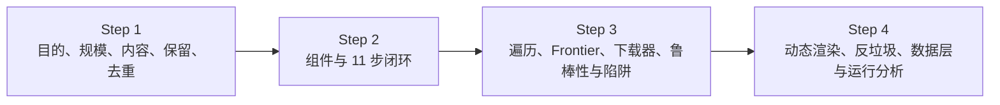
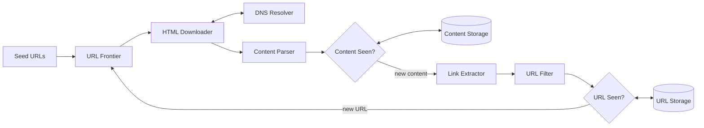
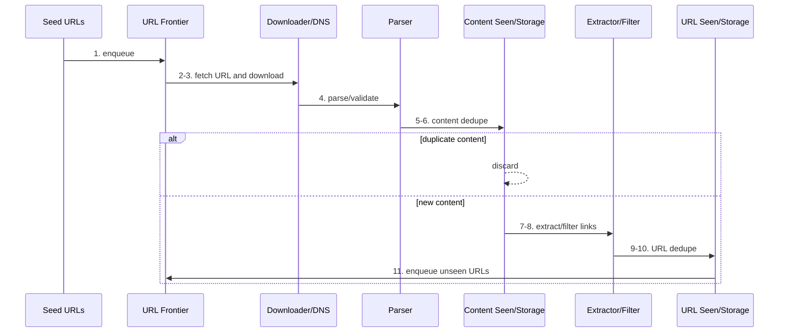
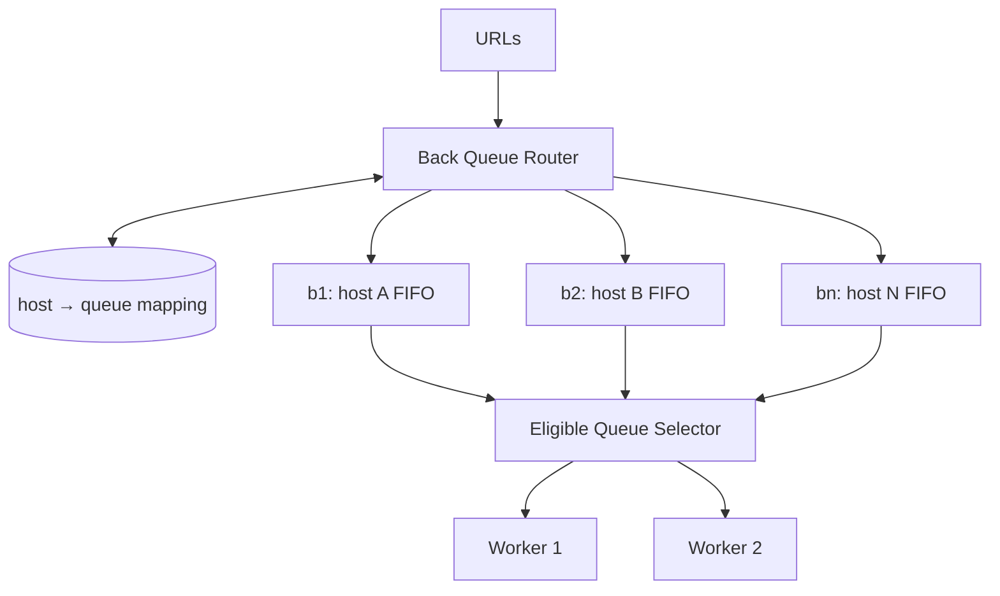
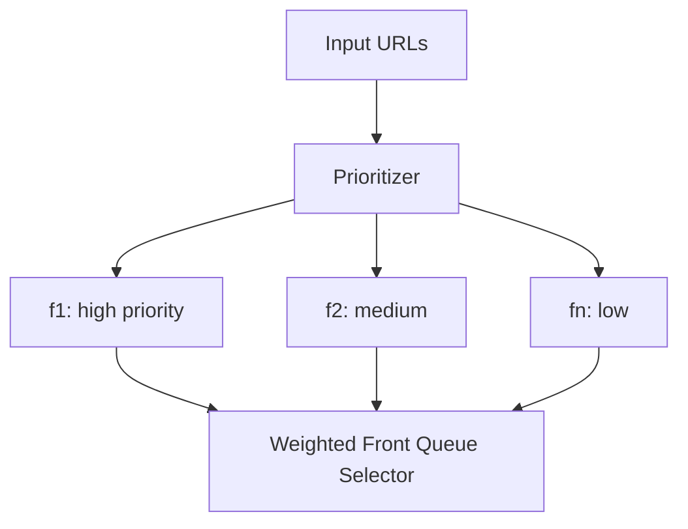
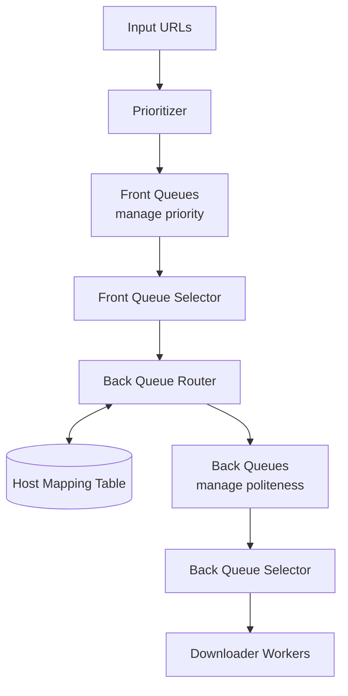
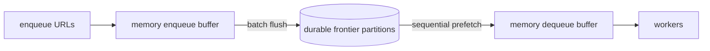
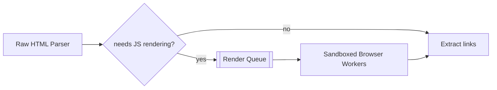
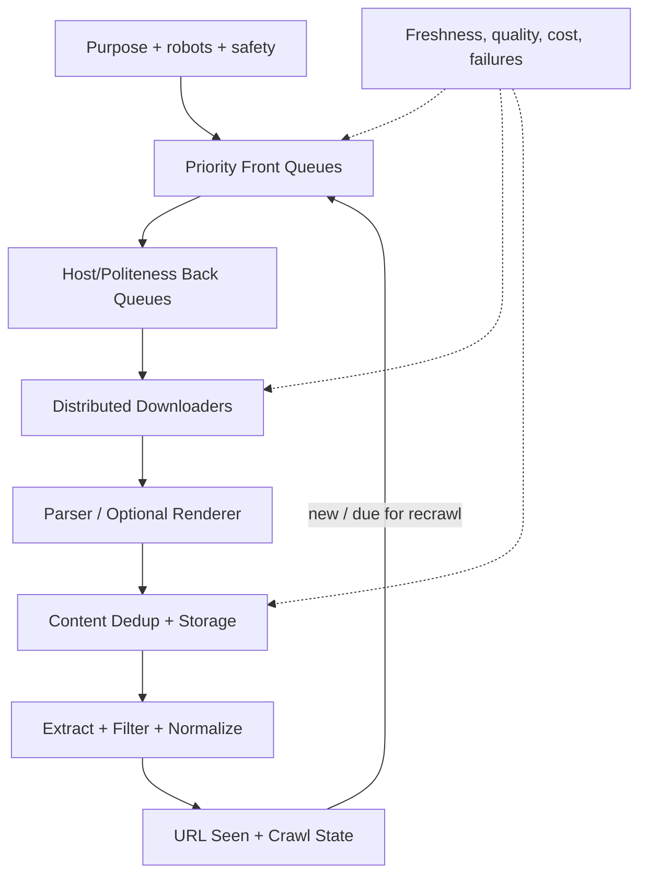

> 原书：Alex Xu，*System Design Interview: An Insider's Guide*（Second Edition）
> 原章：Chapter 9, *Design a Web Crawler*
> 本章主线：从“下载页面、提取链接、把新链接放回队列”的简单图遍历出发，逐步加入搜索引擎级爬虫必须具备的规模化、鲁棒性、礼貌性与可扩展性；先构造 Seed → Frontier → Downloader → Parser → 内容去重 → 链接提取/过滤 → URL 去重的闭环，再深入优先级与 host 礼貌调度相结合的 URL Frontier、robots.txt、分布式下载、DNS 缓存、地域局部性、故障恢复、插件扩展和陷阱治理。

## 0. 学习目标、阅读边界与全章路线

网络爬虫（web crawler，也称 robot 或 spider）从一组初始 URL 出发，下载网页，提取页面中的链接，再继续下载新链接，用于发现新内容或已更新内容。

最小算法只有三步：

```text
1. 下载给定 URL 对应的页面
2. 从页面中提取 URL
3. 把新 URL 加回待下载列表，重复执行
```

但互联网不是一个干净、有限、静态的普通图。真实系统面对：

- 数十亿页面与持续增长的 URL 空间；
- 页面更新、删除和重复内容；
- 同一 host 的访问频率约束；
- DNS、网络和远端站点的高延迟与失败；
- HTML 畸形、动态渲染和多种内容类型；
- 无限日历、组合参数等 spider traps；
- 垃圾、广告、恶意 URL 和超大响应；
- 数亿待抓 URL 的持久队列；
- 下载节点故障、重试和任务重复；
- 新内容类型与新业务目标的持续演进。

本章依照系统设计四步框架展开：



读完后，应当能够回答：

1. 搜索索引、网页归档、网页挖掘和网页监控为什么需要不同的抓取策略？
2. 为什么简单 BFS 仍然可能对单一网站造成类似 DoS 的压力？
3. URL Frontier 为什么不是一条普通 FIFO，而是优先级、礼貌性和新鲜度调度器？
4. Front queues 与 back queues 各自解决什么问题？
5. URL Seen 与 Content Seen 有何区别，为什么两者都需要？
6. 每月 10 亿页怎样得到约 400 平均 QPS、800 峰值 QPS和 30 PB 五年存储？
7. robots.txt 的作用是什么，它为什么不是身份认证或法律授权机制？
8. 为什么 DNS 会成为下载线程瓶颈，缓存时又必须遵守 TTL？
9. 如何让数百/数千下载节点扩缩容而不大规模重排任务？
10. 短超时、重试和幂等如何共同提高鲁棒性？
11. 为什么 URL 规范化既能去重，也可能错误合并不同资源？
12. 内容哈希如何识别不同 URL 下的重复页面，碰撞怎样兜底？
13. Spider trap 为什么没有一套通用自动检测算法？
14. 动态页面为什么需要浏览器渲染池，而不应让所有页面都执行 JavaScript？
15. 如何监控覆盖率、礼貌性、队列新鲜度、重复率和抓取质量？

本文严格沿原章顺序展开。补充的调度公式、URL 规范化、幂等状态机、Bloom filter 容量、条件请求、SSRF 防护和可运行 Frontier 示例属于工程背景，不是作者逐式给出的原文。

---

## 1. 网络爬虫是什么，以及为什么用途决定设计

### 1.1 把 Web 看成有向图

网页是顶点，超链接是有向边：

$$
G=(V,E)
$$

- $V$：页面/资源；
- $E$：页面 A 指向页面 B 的链接；
- Seed URLs：遍历起点；
- Crawl：从已知顶点沿边发现新顶点。

互联网图存在环、重复边、无限生成 URL、断链和不可访问节点，因此必须有去重、边界与失败策略。

### 1.2 搜索引擎索引

爬虫下载新页面和更新页面，建立本地搜索索引。目标通常强调：

- 覆盖重要网页；
- 内容新鲜；
- 高质量优先；
- 避免重复与垃圾；
- 尊重站点抓取规则。

Googlebot 是原书举例。

### 1.3 Web 归档

为长期保存网页历史版本。目标更强调：

- 时间快照和版本；
- 长期持久性；
- 可重放与证据链；
- 不一定只保留最新内容。

原书列出美国国会图书馆与 EU Web Archive。搜索爬虫可能丢弃重复旧版本，归档爬虫却可能必须保存时间上的变化。

### 1.4 Web 挖掘

下载网页以提取知识，例如金融机构分析股东会议和年报。目标通常是：

- 特定领域高召回；
- 结构化抽取；
- 可追溯来源；
- 定向站点与文档类型。

### 1.5 Web 监控

监测版权、商标侵权或页面变化。原书举 Digimarc。它比全网索引更强调：

- 高频重抓目标站点；
- 变化检测；
- 告警时效；
- 证据保存。

### 1.6 为什么必须先问目的

“抓更多页面”不是普遍目标。不同目的会改变：

| 决策 | 搜索索引 | 归档 | 监控 |
|---|---|---|---|
| 重复内容 | 通常去重 | 可能保留时间版本 | 比较变化 |
| 新鲜度 | 重要页优先 | 周期快照 | 目标页高频 |
| 存储 | 最新内容与索引 | 多版本长期保存 | 变化和证据 |
| 排序 | 质量、PageRank | 覆盖与时间 | 风险与变更概率 |

这解释了作者为什么把“主要目的是什么”放在 Step 1 第一个问题。

---

## 2. Step 1：理解问题并确定范围

### 2.1 主要目的：搜索引擎索引

面试官确认本章设计搜索索引爬虫。后续优先级、去重和新鲜度均围绕此目标。

### 2.2 规模：每月 10 亿页面

这个数字决定：

- 下载吞吐；
- URL Frontier 容量；
- Content/URL Seen 状态；
- 存储与网络；
- 分布式 Worker 数量。

### 2.3 内容类型：只抓 HTML

暂不抓 PDF、图片和视频，因此解析器、下载器和存储可以围绕 HTML。架构仍要可扩展，以便后来插入 PNG Downloader 等模块。

### 2.4 需要处理新页面和已编辑页面

爬虫不是一次性 BFS。已抓 URL 必须按更新历史重新进入 Frontier，这引出 freshness scheduling。

### 2.5 保存 HTML 五年

系统必须有 PB 级内容存储、生命周期、压缩、复制和归档策略。内存只能保存热点/索引，不能容纳全部内容。

### 2.6 重复内容忽略

不同 URL 可能返回相同页面。若只做 URL 去重，仍会重复保存内容。因此另设 Content Seen，按内容指纹识别重复页面。

### 2.7 好爬虫的四项特征

**Scalability（可扩展性）**

通过并行下载、分区和水平扩展处理巨量 Web。

**Robustness（鲁棒性）**

面对坏 HTML、无响应站点、崩溃、恶意链接和陷阱时，局部错误不能拖垮整个系统。

**Politeness（礼貌性）**

不在短时间内向同一站点发送过多请求，遵守 robots.txt 和抓取间隔。

**Extensibility（可扩展性/可演进性）**

这里是 extensibility，不是 scalability：前者指容易增加内容类型和处理模块，后者指增加资源承载更大负载。

### 2.8 还应澄清的工程边界

- 是否只抓公开互联网？
- 是否必须遵守 robots.txt 和 `Crawl-delay`？
- User-Agent 和联系信息是什么？
- 最大响应大小、重定向次数和 URL 长度？
- 是否跨域、跨协议？
- JavaScript 动态页面占比？
- 抓取失败重试次数与时间？
- 页面删除如何表示？
- 是否保存 HTTP 头和抓取时间？
- 是否允许抓取登录后页面？
- 法律、版权、隐私和数据驻留约束？

---

## 3. 粗略估算

### 3.1 平均 QPS

每月 10 亿页，按 30 天：

$$
QPS_{avg}=\frac{10^9}{30\times24\times3600}
=\frac{10^9}{2,592,000}
\approx385.8
$$

原书取约 400 pages/s。

### 3.2 峰值 QPS

假设峰均比 2：

$$
QPS_{peak}\approx2\times400=800
$$

下载器容量还取决于页面响应时间。平均下载停留时间 2 秒时，由 Little's Law：

$$
Concurrency\approx800\times2=1600
$$

峰值约需 1600 个并发在途下载；如果慢站点平均 10 秒，则约 8000。线程数不应只按 QPS 推导，异步 I/O、连接池和每 host 上限同样重要。

### 3.3 每月存储

平均页面 500 KB，按十进制：

$$
10^9\times500\times10^3
=5\times10^{14}\ \text{bytes}
=500\ \text{TB/month}
$$

### 3.4 五年存储

$$
500\ \text{TB/month}\times12\times5
=30,000\ \text{TB}
=30\ \text{PB}
$$

这是 HTML 原始逻辑容量。物理容量还包括：

- 压缩；
- 内容去重；
- 多副本/纠删码；
- HTTP 元数据、URL 和索引；
- 多版本；
- 备份和空闲余量。

若原书所引 29% 内容重复能够完美去除，忽略其他开销，逻辑内容约：

$$
30\times(1-0.29)=21.3\ \text{PB}
$$

这是理论简化，重复率和版本保留策略会变化。

### 3.5 入站网络

峰值 800 pages/s、平均 500 KB：

$$
Bandwidth=800\times500,000\times8
=3.2\ \text{Gb/s}
$$

还未计算 TLS、HTTP、重试和动态资源。多地域下载器可分担出口并降低 RTT。

### 3.6 估算如何影响架构

- 400/800 QPS 本身不算极高，但远端延迟导致并发很高；
- 30 PB 决定内容必须落分布式磁盘/对象存储；
- 数亿 Frontier URL 不能全放内存；
- URL Seen/Content Seen 需要分布式、空间高效结构；
- 平均负载掩盖单 host 礼貌性和热门域名偏斜。

---

## 4. Step 2：高层架构

原书 Figure 9-2：



这是一个反馈闭环：抓取产生新链接，新链接经过过滤和去重后重新进入 Frontier。

---

## 5. Seed URLs：遍历从哪里开始

### 5.1 单站点种子

抓大学网站时可用大学域名主页作为 seed。链接图连通性较好时，能发现大部分页面。

### 5.2 全网种子

不存在一个“完美起点”覆盖整个 Web。原书提出两类拆分：

- 按地域/国家选择热门站点；
- 按主题，如购物、体育、医疗选择种子。

还可使用：

- 公开目录；
- sitemap；
- 历史高质量域名；
- DNS/注册数据；
- 外部提交 URL。

### 5.3 Seed 的覆盖与偏差

Seed 会影响发现范围：只从热门英文站点出发，会低估其他语言和孤立站点。应监控：

- 新域发现率；
- 各地域/语言覆盖；
- 从 seed 到页面的深度；
- 不同 seed 的重复发现比例。

作者强调这是开放问题，面试中应展示拆分思路而不是声称唯一答案。

---

## 6. URL Frontier：待下载状态

现代爬虫把状态分为：

- 待下载；
- 已下载/已发现。

URL Frontier 保存待抓 URL。高层可先视为 FIFO，深挖后会扩展为优先级 + 礼貌性 + 新鲜度的调度系统。

Frontier 条目至少包含：

```text
canonical_url
host
priority
next_fetch_time
discovered_at
retry_count
source_url
crawl_policy/version
```

如果只保存字符串，就无法可靠调度重抓、失败退避和 host 间隔。

---

## 7. HTML Downloader 与 DNS Resolver

### 7.1 HTML Downloader

从 Frontier 领取 URL，通过 HTTP 下载内容。必须实施：

- robots 规则；
- host 速率限制；
- 连接/读取超时；
- 响应大小限制；
- 重定向限制；
- MIME 类型检查；
- 重试与状态记录；
- SSRF/私网地址防护。

### 7.2 DNS Resolver

把 hostname 转成 IP。原书历史示例：`www.wikipedia.org` 在 2019-03-05 解析为 `198.35.26.96`。IP 会变化，这个值不是永久配置。

DNS 是外部延迟和失败源：

- 解析可能 10–200 ms；
- 同步接口会阻塞线程；
- TTL 到期后需刷新；
- 一个域可返回多个地址；
- CNAME 链增加查询；
- 恶意 DNS 可返回私网地址。

---

## 8. Content Parser：解析与验证解耦

下载完成后解析 HTML，并检查：

- 文档是否畸形；
- 编码与字符集；
- MIME 是否真为 HTML；
- 页面是否超过大小/复杂度限制；
- DOM 深度与节点数；
- 链接、canonical、meta robots；
- 压缩炸弹或解析器漏洞。

作者把 Parser 从 crawl server 分离，因为解析 CPU 密集、异常多，若与下载线程耦合，会降低网络并发并扩大崩溃影响。

下载偏 I/O，解析偏 CPU，两者用队列解耦后可独立扩容。

---

## 9. Content Seen 与内容存储

### 9.1 为什么 URL 去重不够

以下不同 URL 可能返回相同内容：

```text
https://example.com/article
https://example.com/article?utm_source=x
https://mirror.example.net/article
```

URL Seen 只能识别地址重复，Content Seen 识别内容重复。

### 9.2 内容指纹

逐字符比较数十亿文档成本高。计算：

$$
fingerprint=H(normalizedContent)
$$

再查询指纹集合。可用 SHA-256 等强 hash；命中后若正确性要求高，可比较长度和内容，避免理论碰撞。

### 9.3 精确重复与近似重复

- 精确 hash 识别字节/规范化后完全相同；
- 页面只改广告、时间戳或导航时，hash 完全不同；
- SimHash、MinHash、分块指纹可识别近似重复；
- 近似去重可能误把不同页面合并，应按索引目标调阈值。

原章主要讨论 hash/checksum 的精确去重。

### 9.4 Content Storage

原书建议磁盘 + 内存：

- 大多数内容放磁盘/对象存储；
- 热门内容放内存降低延迟。

常见存储拆分：

```text
object storage: compressed raw HTML
metadata DB: URL, fetch time, status, headers, content hash, object key
cache: hot metadata/content
```

内容可按 hash 做 content-addressed storage，同一内容只保存一次，多个 URL 引用它。但归档系统若需保留原始响应和时间版本，不能只保留一个去重对象。

---

## 10. Link Extractor、URL Filter、URL Seen 与 URL Storage

### 10.1 Link Extractor

从解析后的 HTML 提取链接，并把相对 URL 转为绝对 URL：

```text
page:  https://en.wikipedia.org/wiki/A
href:  /wiki/B
result:https://en.wikipedia.org/wiki/B
```

解析应遵循 URL 标准和 `<base href>`，不能简单字符串拼接。

### 10.2 URL Filter

原书过滤：

- 不支持的内容类型/扩展名；
- 错误链接；
- 黑名单站点。

还可过滤：

- 非 HTTP(S) scheme；
- `mailto:`、`javascript:`、`data:`；
- 超长 URL；
- 已知 trap 参数；
- 登录/退出/购物车副作用链接；
- 私网和 link-local 地址；
- robots 禁止路径。

### 10.3 URL 规范化

为了去重，可安全考虑：

- scheme/host 小写；
- 删除默认端口；
- 解析 `.`/`..` path；
- 去除 fragment，因为不发送给服务器；
- 规范 percent encoding。

不能无条件：

- 排序 query 参数；
- 删除重复参数；
- 把 `/a` 与 `/a/` 合并；
- 删除所有 tracking 参数；

因为服务端可能赋予不同语义。规范化错误会导致漏抓。

### 10.4 URL Seen

记录已访问或已在 Frontier 的 URL，避免：

- 重复入队；
- 浪费下载资源；
- 图环导致无限循环。

可用：

- 精确 hash table/数据库；
- Bloom filter；
- 分层：内存 Bloom + 磁盘精确集合。

### 10.5 Bloom filter 的规模直觉

10 亿 URL、1% false positive，约需每元素 9.6 bit：

$$
m\approx9.6\times10^9\ \text{bits}
\approx1.2\ \text{GB}
$$

空间很省，但 false positive 会把真正未抓 URL 误判为 seen，损失覆盖率。搜索爬虫要根据召回损失选择误报率，并可用精确存储二次确认。

### 10.6 URL Storage

持久保存已访问 URL 及状态：

```text
DISCOVERED -> QUEUED -> FETCHING -> FETCHED / FAILED
```

还应记录：

- last fetch；
- next fetch；
- HTTP 状态；
- ETag/Last-Modified；
- retry count；
- content hash；
- canonical URL；
- robots/policy version。

---

## 11. 高层工作流：原书 11 步闭环

1. Seed URLs 加入 URL Frontier；
2. HTML Downloader 从 Frontier 取 URL；
3. Downloader 通过 DNS 得到 IP 并下载；
4. Content Parser 解析并验证 HTML；
5. 合法内容交给 Content Seen；
6. Content Seen 查询内容存储：重复则丢弃，新内容继续；
7. Link Extractor 提取链接；
8. URL Filter 过滤链接；
9. 合法 URL 交给 URL Seen；
10. URL Seen 查询 URL Storage：已处理则停止；
11. 未处理 URL 加回 URL Frontier。



### 11.1 原流程的一个设计选择

原图在重复内容时不继续 Link Extractor。这样节省计算，但如果两个相同内容通过不同 base URL 提供，解析出的相对链接绝对地址可能不同；完全跳过可能损失发现。

工程上可选择：

- 重复内容不存储，但仍提取链接；
- 只对 canonical 内容提取；
- 根据页面 base URL 和业务覆盖目标决定。

这不是原书错误，而是去重收益与链接发现召回之间的取舍。

---

## 12. Step 3：DFS 与 BFS

### 12.1 DFS

深度优先沿一条链接链不断深入。问题：

- Web 深度近似无界；
- 容易陷入单站点/日历 trap；
- 重要的浅层页面迟迟不抓；
- 递归栈和恢复困难。

### 12.2 BFS

广度优先用 FIFO，先抓距离 seed 较近的页面。图遍历复杂度在有限图上：

$$
O(|V|+|E|)
$$

但 Web 无法完整装入内存，也持续变化，实际是受预算约束的在线遍历。

### 12.3 普通 BFS 的两个问题

**不礼貌**

一个 Wikipedia 页面多数链接仍指向 Wikipedia。并行 FIFO 会连续抓同一 host，可能压垮对方。

**无优先级**

Apple 官网和随机论坛帖子都按发现顺序排队，无法优先抓重要、热门或常更新页面。

因此生产 Frontier 是带约束的调度器，不是纯 BFS。

---

## 13. URL Frontier：礼貌性

### 13.1 基本规则

同一 host 一次抓一页，两次抓取之间加入延迟。设 host $h$ 的最小间隔为 $d_h$：

$$
nextAllowed_h=lastFetch_h+d_h
$$

只有当前时间满足：

$$
now\ge nextAllowed_h
$$

才能调度该 host。

### 13.2 原书组件

- Queue Router：保证同一 back queue 只含同 host URL；
- Mapping Table：`host -> queue`；
- FIFO queues $b1\ldots bn$：host 队列；
- Queue Selector：把可运行队列分给 Worker；
- Worker threads：逐个下载并加入间隔。



### 13.3 Host、域名与 IP 限制

仅按 hostname 限制时，多个子域可能指向同一服务器 IP；仅按 IP 又可能误伤共享 CDN/虚拟主机。可组合：

- eTLD+1/domain 规则；
- hostname 并发与间隔；
- IP 全局连接上限；
- robots 针对 User-Agent 的规则。

### 13.4 自适应礼貌性

根据站点反馈调整：

- 429/503：指数退避；
- `Retry-After`：优先遵守；
- 延迟升高：降低并发；
- 连续成功且规则允许：谨慎提高；
- robots 更新：重新计算。

礼貌性是对外部系统的容量保护，不只是爬虫内部公平。

---

## 14. URL Frontier：优先级

### 14.1 为什么需要优先级

Web 近似无限，资源有限，不可能同等抓取所有 URL。优先级可考虑：

- PageRank/链接权威；
- 网站流量；
- 更新频率；
- 内容质量；
- 距 seed 深度；
- 业务领域；
- 上次抓取时间；
- 抓取成本和失败率。

### 14.2 原书组件

- Prioritizer：计算 priority；
- Front queues $f1\ldots fn$：不同优先级；
- Front Queue Selector：偏向高优先级队列随机选择。



### 14.3 为什么是“偏向”，不是只抓最高优先级

若一直取最高优先级，低优先级 URL 可能永远饥饿。加权随机或 weighted fair queue 可保证：

- 高质量页更快；
- 低优先级仍有非零机会；
- 新域仍能被探索。

可用 aging：等待越久，动态提高优先级。

### 14.4 一个教学化评分

$$
score(u)=
w_qQuality(u)+w_fFreshnessNeed(u)+w_aAuthority(u)
-w_cCost(u)-w_rRisk(u)
$$

权重来自业务，不是原书固定算法。评分需要防 spam 操纵，不能只信站点自报更新频率。

---

## 15. Front queues + Back queues：完整 Frontier

原书 Figure 9-8：



处理顺序：

1. 新 URL 进入 Prioritizer；
2. 放入相应 front priority queue；
3. Front selector 按权重选 URL；
4. Back router 按 host 路由；
5. Back selector 只选到达 `nextAllowed` 的 host queue；
6. Worker 下载一个 URL并更新时间。

### 15.1 两类约束不能互相替代

- Priority 回答“哪个页面更有价值”；
- Politeness 回答“哪个 host 现在允许访问”；
- 高优先级 URL 也不能违反 host 间隔；
- 某 host 冷却时，Worker 应抓其他 host，而不是空等。

### 15.2 可运行 Frontier 示例

下面代码演示：

- URL 规范化；
- 优先级 front heap；
- 按 host back queues；
- `next_allowed_at` 礼貌性；
- 同一规范 URL 去重；
- 高优先级不会绕过 host 延迟。

```python
from collections import defaultdict, deque
from dataclasses import dataclass, field
from heapq import heappop, heappush
from itertools import count
from urllib.parse import urljoin, urlsplit, urlunsplit

def canonicalize(url: str, base: str | None = None) -> str:
    absolute = urljoin(base, url) if base else url
    parts = urlsplit(absolute)
    scheme = parts.scheme.lower()
    hostname = (parts.hostname or "").lower()
    if scheme not in {"http", "https"} or not hostname:
        raise ValueError("only absolute HTTP(S) URLs are supported")

    port = parts.port
    default_port = (scheme == "http" and port == 80) or (
        scheme == "https" and port == 443
    )
    host = hostname if port is None or default_port else f"{hostname}:{port}"
    path = parts.path or "/"

    # Fragment is client-side and is not sent in an HTTP request.
    return urlunsplit((scheme, host, path, parts.query, ""))

@dataclass(frozen=True)
class CrawlTask:
    url: str
    priority: int

@dataclass
class Frontier:
    politeness_delay: float
    seen: set[str] = field(default_factory=set)
    front_heap: list[tuple[int, int, CrawlTask]] = field(default_factory=list)
    back_queues: dict[str, deque[CrawlTask]] = field(
        default_factory=lambda: defaultdict(deque)
    )
    next_allowed_at: dict[str, float] = field(default_factory=dict)
    serial: count = field(default_factory=count)

    def discover(
        self,
        url: str,
        priority: int,
        base: str | None = None,
    ) -> bool:
        normalized = canonicalize(url, base)
        if normalized in self.seen:
            return False
        self.seen.add(normalized)
        task = CrawlTask(normalized, priority)
        # heapq is a min-heap, so negate priority.
        heappush(self.front_heap, (-priority, next(self.serial), task))
        return True

    def route_front_queues(self) -> None:
        while self.front_heap:
            _, _, task = heappop(self.front_heap)
            host = urlsplit(task.url).netloc
            self.back_queues[host].append(task)

    def schedule(self, now: float) -> CrawlTask | None:
        eligible = [
            (self.next_allowed_at.get(host, 0.0), host)
            for host, queue in self.back_queues.items()
            if queue and self.next_allowed_at.get(host, 0.0) <= now
        ]
        if not eligible:
            return None
        _, host = min(eligible)
        task = self.back_queues[host].popleft()
        self.next_allowed_at[host] = now + self.politeness_delay
        return task

frontier = Frontier(politeness_delay=5.0)
assert frontier.discover("HTTPS://Example.com:443/a#section", priority=10)
assert not frontier.discover("https://example.com/a", priority=10)
assert frontier.discover("/b", priority=100, base="https://example.com/a")
assert frontier.discover("https://other.example/x", priority=1)
frontier.route_front_queues()

first = frontier.schedule(now=0.0)
second = frontier.schedule(now=0.0)
third_too_early = frontier.schedule(now=0.0)
third = frontier.schedule(now=5.0)

assert first is not None and first.url == "https://example.com/b"
assert second is not None and second.url == "https://other.example/x"
assert third_too_early is None
assert third is not None and third.url == "https://example.com/a"

print(first, second, third, sep="\n")
```

该简化实现先把 priority heap 全部路由到 host FIFO，因此同一 host 内保留 front selector 输出顺序；真实系统会流式路由、持久化分片，并用最小堆直接按各 host 的 `next_allowed_at` 选择，避免扫描所有 host。

---

## 16. Frontier 的新鲜度调度

页面不断新增、编辑和删除，必须重抓。全部 URL 同频重抓成本过高。

原书策略：

- 根据页面历史更新频率安排重抓；
- 重要 URL 更早、更频繁。

### 16.1 变化概率

若页面历史平均每 $T_u$ 更新一次，可初始设置：

$$
recrawlInterval\propto T_u
$$

频繁变动页面缩短间隔，长期不变页面指数延长。仍要设置最小/最大间隔，防止噪声和永久遗忘。

### 16.2 条件请求

保存响应头：

```http
ETag: "abc123"
Last-Modified: ...
```

重抓时发送：

```http
If-None-Match: "abc123"
If-Modified-Since: ...
```

若未变，站点返回 `304 Not Modified`，节省内容传输和解析。服务器不一定提供可靠 ETag/Last-Modified，因此仍需内容指纹兜底。

### 16.3 新鲜度指标

- `age = now - last_successful_fetch`；
- 高优先级页面超期比例；
- 变化发现延迟；
- 304 命中率；
- 重抓后真正变化比例。

---

## 17. Frontier 的存储：内存 + 磁盘混合

原书指出数亿 URL：

- 全内存不持久、昂贵且难扩展；
- 全磁盘随机 enqueue/dequeue 太慢；
- 采用磁盘主体 + 内存缓冲。

### 17.1 混合路径



批量顺序 I/O 摊薄磁盘成本，内存提供快速调度。

### 17.2 持久性语义

如果 buffer 未 flush 就崩溃，URL 可能丢失。可选择：

- Write-ahead log；
- 复制消息队列；
- 上游可重放发现事件；
- 至少一次入队，允许重复；
- 定期 checkpoint。

爬虫通常宁可重复抓，也不愿永久漏掉重要 URL，因此常采用 at-least-once + 幂等去重。

### 17.3 分区

Frontier 可按 host hash 分区，确保同 host 礼貌状态集中。扩容时用一致性哈希减少 host 重映射。迁移期间要避免两个 Worker 同时认为自己拥有同一 host，否则会违反礼貌性。

---

## 18. HTML Downloader：robots.txt

### 18.1 定义

Robots Exclusion Protocol 由网站通过 `/robots.txt` 告诉 crawler 哪些路径允许/禁止抓取。原书 Amazon 示例对 Googlebot 禁止若干目录。

```text
User-agent: Googlebot
Disallow: /creatorhub/*
Disallow: /rss/people/*/reviews
```

### 18.2 正确流程

1. 首次抓某 host 前获取 robots.txt；
2. 按 crawler User-Agent 解析；
3. 缓存规则与过期时间；
4. 调度前检查 URL；
5. 周期刷新。

### 18.3 为什么缓存

每个页面都重新下载 robots.txt：

- 增加对站点压力；
- 增加自身延迟；
- 形成重复流量。

缓存应有 TTL，并处理：

- 404；
- 5xx/超时；
- 重定向；
- 规则更新；
- 解析失败。

故障时 fail-open 还是 fail-closed 取决于政策；保守搜索爬虫常暂缓抓取，而不是假设全部允许。

### 18.4 robots.txt 不是访问控制

- 它是自愿协议，不阻止恶意客户端；
- 文件公开，不能放秘密路径；
- 允许抓取不等于拥有版权或法律授权；
- 禁止抓取也不是 HTTP 认证；
- 页面级 `meta robots`/`X-Robots-Tag` 还会控制索引行为。

“允许抓取”和“允许索引”也不是完全相同语义。

---

## 19. Downloader 性能优化

原书按四项展开。

### 19.1 分布式抓取

把 URL 空间拆给多台服务器，每台运行多个线程/异步任务。

分区 key 倾向 host，而不是完整 URL：

- 同 host 礼貌状态集中；
- 连接和 DNS 缓存复用；
- 避免多节点同时轰击一个站点。

热点 host 可能成为单分区瓶颈，但礼貌性本就限制其最大抓取速率，不能简单加节点绕过对方容量。

### 19.2 DNS 缓存

原书指出 DNS 约 10–200 ms，许多接口同步，会阻塞线程。缓存 `hostname -> addresses`，周期更新。

现代实现应：

- 遵守 DNS TTL，而非固定 cron 无限缓存；
- 使用异步 resolver；
- negative cache NXDOMAIN；
- 连接时再次防止地址变为私网；
- 处理多 A/AAAA 记录；
- DNS 失败独立退避。

### 19.3 地域局部性

下载节点靠近目标 host 可降低 RTT。队列、缓存和存储也应考虑地域。

但目标站点的实际位置不总等于域名国家；CDN 和 Anycast 会动态路由。可用实测 RTT 和法规约束调度。

### 19.4 短超时

慢/不响应站点不应长期占连接与 Worker。分别设置：

- DNS timeout；
- connect timeout；
- TLS timeout；
- first-byte timeout；
- total/read timeout；
- max response bytes。

超时后抓其他页面，并按错误类型重试。过短会误杀慢但有效站点，需按历史延迟或站点策略自适应。

### 19.5 HTTP 连接复用与压缩

原章未展开，但同 host 合理复用 keep-alive 可减少 TCP/TLS 握手；接受 gzip/br 可降低带宽。必须受 host 并发和响应解压上限约束，防压缩炸弹。

---

## 20. 鲁棒性

### 20.1 一致性哈希

把 host/URL 分散给 Downloader，增删节点时减少重映射。它只解决稳定分配，不自动保存任务状态或提供副本。

### 20.2 保存抓取状态和数据

持久保存 Frontier、Seen 集合、重试状态、robots 缓存和内容元数据。崩溃后从 checkpoint/WAL 恢复，而不是从 seed 全部重来。

### 20.3 异常处理

错误分类：

| 类型 | 示例 | 处理 |
|---|---|---|
| 暂时网络 | timeout、reset、5xx | 有界重试 + 退避 |
| 永久 HTTP | 404、410 | 记录状态，降低/停止重抓 |
| 限流 | 429、Retry-After | 严格退避 |
| 解析错误 | malformed HTML | 隔离、记录、继续 |
| 安全异常 | 私网 IP、超大响应 | 立即拒绝/封禁 |
| 系统错误 | Worker crash | lease 超时后重新投递 |

### 20.4 数据验证

- Content-Length 与实际大小；
- MIME sniffing；
- 字符编码；
- URL scheme；
- hash/checksum；
- parser 输出；
- 最大 DOM/链接数；
- 对象存储写后校验。

### 20.5 至少一次与幂等

Worker 下载成功但未确认就崩溃，任务会重投。想避免永久漏抓，通常接受重复：

```text
at-least-once task delivery
+ URL/content idempotency
```

Content Seen、URL 状态版本和条件写防止重复任务造成错误副作用。

### 20.6 重试预算

无限重试会让坏站点占满 Frontier。应设置：

$$
delay_k=\min(cap,base\times2^k)+jitter
$$

并限制次数、累计时间，最终进入 dead-letter/人工检查。站点级 circuit breaker 能在持续故障时暂停整个 host。

---

## 21. 可扩展性：插件化内容处理

原书 Figure 9-10 增加：

- PNG Downloader；
- Web Monitor。

### 21.1 为什么模块化

HTML、PNG、PDF、视频需要不同：

- 下载限制；
- parser；
- 去重指纹；
- 存储；
- 下游处理。

若都写进一个 Downloader，新增类型会修改核心抓取路径并增加崩溃半径。

### 21.2 插件接口

```text
can_handle(content_type, url)
fetch_policy()
parse(bytes, metadata)
fingerprint(parsed_content)
extract_links(parsed_content)
store(parsed_content)
```

模块应通过版本化消息契约和队列连接。插件失败不应阻塞 HTML 核心路径。

### 21.3 Extensibility 与鲁棒性的关系

隔离模块既方便扩展，也能：

- 独立限流；
- 独立扩容；
- 独立部署/回滚；
- 将高风险 parser 沙箱化；
- 防止一种内容拖垮全系统。

---

## 22. 检测和避免问题内容

原书按三类展开。

### 22.1 重复内容

接近 30% 页面可能重复。用 hash/checksum：

- 降低存储；
- 减少解析/索引；
- 避免重复结果。

应明确 hash 的输入：原始 bytes、解压内容、DOM 规范化文本会得到不同去重语义。

### 22.2 Spider traps

示例：

```text
www.spidertrapexample.com/foo/bar/foo/bar/foo/bar/...
```

页面不断生成更深 URL，形成无限空间。

原书建议：

- 最大 URL 长度；
- 观察某站点异常多页面；
- 人工确认后排除/自定义过滤。

还可检测：

- 路径片段周期重复；
- 参数组合爆炸；
- 日历无限 next day/month；
- session ID 每次变化；
- 同内容不同 URL 比率异常；
- 单 host URL 发现速率异常。

没有一刀切算法，因为合法电商筛选、分页和文档路径也可能很深。规则过严会损失覆盖。

### 22.3 Data noise

广告、代码片段、spam URL 等对搜索索引价值低。过滤可发生在：

- URL 阶段；
- DOM 区块阶段；
- 内容质量分类；
- 索引阶段。

“无价值”取决于业务。代码搜索引擎不能把代码片段当噪声，广告监测系统也不能删除广告。

### 22.4 安全陷阱

抓取器能访问网络，必须防 SSRF：

- 拒绝 loopback、private、link-local、metadata IP；
- DNS 解析后和连接前都检查；
- 限制重定向次数并逐跳检查；
- 禁止非 HTTP(S) scheme；
- 下载器运行在隔离网络/沙箱；
- 限制响应大小、解压比例和解析资源。

外部 HTML 与 parser 都是不可信输入。

---

## 23. Step 4：动态渲染

原书指出 JavaScript/AJAX 动态生成链接，直接下载原始 HTML 可能看不到。先执行动态渲染，再解析 DOM。

### 23.1 渲染池



### 23.2 为什么不渲染所有页面

Headless browser 消耗远高于 HTTP 下载：

- CPU/内存大；
- 页面脚本可能长时间运行；
- 外部资源多；
- 安全风险高；
- 吞吐低。

只对检测到动态必要的高价值页面渲染，并限制：

- 执行时间；
- 网络请求数；
- 内存；
- DOM 大小；
- 下载域名；
- 浏览器版本和沙箱。

原书称 server-side/dynamic rendering；这里指爬虫侧执行页面脚本，不是网站开发中的 SSR 架构概念。

---

## 24. Step 4：过滤低质量和 Spam 页面

存储与抓取预算有限，anti-spam 组件过滤：

- 关键词堆砌；
- 隐藏文本/链接农场；
- 自动生成薄内容；
- 恶意重定向；
- 复制站点；
- 垃圾参数页面。

过滤位置越早越节省资源，但误判损失覆盖。可采用：

```text
cheap URL/domain rules
→ lightweight content signals
→ expensive ML classifier
→ manual review for uncertain/high-impact cases
```

质量模型必须持续用分析数据调优，防对抗演化。

---

## 25. Step 4：数据层、水平扩展与系统保证

### 25.1 复制与分片

- Content Storage 按 content hash/URL 分片；
- URL Storage 按 canonical URL hash 分片；
- Frontier 按 host 分片；
- 多副本提高可用性；
- 对象存储跨故障域保存 HTML。

### 25.2 无状态下载节点

原书强调数百/数千服务器时保持 Worker 无状态。任务、lease、重试和结果写入共享持久系统，节点可随时替换。

Downloader 仍有本地 DNS/robots/连接缓存，但这些是可重建加速状态，不是唯一任务真相。

### 25.3 可用性、一致性与可靠性

- Frontier 至少一次投递，允许重复；
- URL Seen 可能最终一致，短暂重复抓可接受；
- host 礼貌 owner 需要较强租约一致性，避免并发抓同站；
- 内容对象写入需要持久确认；
- Seen 更新与 Frontier enqueue 之间需要 outbox/幂等，避免发现 URL 永久丢失。

不同数据使用不同一致性等级，不能给整个爬虫贴一个统一标签。

---

## 26. Step 4：分析与监控

原书把 analytics 视为持续 fine-tuning 的关键。

### 26.1 吞吐与延迟

- fetched pages/s；
- download P50/P95/P99；
- DNS/TLS/TTFB；
- parse/render latency；
- bytes/s；
- Worker 利用率。

### 26.2 Frontier

- 总 backlog；
- 按 priority/host/region 的 backlog；
- oldest URL age；
- enqueue/dequeue rate；
- 重抓超期比例；
- retry/dead-letter 数量。

### 26.3 礼貌性

- 每 host QPS/并发；
- 429/503；
- robots deny 次数；
- `Retry-After` 遵守率；
- host lease 冲突；
- 站点投诉/封禁。

### 26.4 质量

- URL duplicate rate；
- content duplicate rate；
- parse failure；
- spam/noise rate；
- dynamic rendering yield；
- new domain/page discovery；
- content change rate；
- indexable page ratio。

### 26.5 可靠性与成本

- task retry；
- state recovery time；
- storage growth/compression；
- bandwidth and render cost；
- data loss/audit gaps；
- checksum failures。

指标要按域、地域和优先级聚合，但避免把每个 URL/host 都作为高基数时序标签。

---

## 27. 容易混淆的概念与常见误区

### 27.1 Crawler 与 Scraper

Crawler 重点发现和遍历 URL；scraper 重点从页面提取结构化数据。一个系统可以同时包含两者。

### 27.2 URL Seen 与 Content Seen

- URL Seen：地址是否已发现/抓取；
- Content Seen：内容是否已存储；
- 不同 URL 可同内容，同一 URL 也会随时间变内容。

### 27.3 URL Frontier 与普通 FIFO

高层可类比 FIFO，生产 Frontier 还负责 priority、host politeness、freshness、retry 和持久性。

### 27.4 BFS 与礼貌性

BFS 只规定图层次顺序，不限制同 host 速率。必须增加 host queues 和延迟。

### 27.5 高优先级与绕过 robots

优先级不能绕过礼貌和访问策略。允许性约束先于价值排序。

### 27.6 Politeness 与系统内部限流

两者都控制速率；politeness 保护外部站点并尊重协议，内部限流保护自身资源。

### 27.7 robots.txt 与访问授权

robots 是自愿抓取协议，不是认证、版权许可或安全屏障。

### 27.8 允许抓取与允许索引

页面可被抓取但 `noindex`；禁止抓取时 crawler 甚至无法读取页面 meta。两者策略需分开。

### 27.9 URL 规范化与语义等价

规范化只能做有把握的变换。Query 顺序、重复参数、尾斜杠可能影响服务端语义。

### 27.10 Bloom Filter 误报与漏抓

URL Seen 的 false positive 会把新 URL 当旧 URL，降低覆盖率。它不是只有性能代价。

### 27.11 内容哈希与近似去重

密码学 hash 识别精确相同；小改动会完全不同。近似重复要用 SimHash/MinHash 等，并接受误判。

### 27.12 Consistent hashing 与完全负载均衡

它减少节点变化重映射；host 礼貌限制、页面大小和响应速度仍会造成负载偏斜。

### 27.13 无状态 Worker 与没有缓存

Worker 可有可重建本地缓存；关键任务和抓取状态不能只保存在本机。

### 27.14 Timeout 与失败

超时表示未按期限响应，不证明资源永久不存在。需要按状态分类和有界重试。

### 27.15 Retry 与鲁棒性

无限重试会放大故障和违反礼貌性。鲁棒性需要退避、jitter、预算和 dead-letter。

### 27.16 Exactly once 抓取

在崩溃和消息重投下很难且不必要。常用 at-least-once + 去重/幂等。

### 27.17 动态渲染与网站 SSR

原章 dynamic rendering 指 crawler 用浏览器执行 JS；网站 SSR 是站点服务端预先渲染 HTML，概念不同。

### 27.18 页面更新与重新入队重复

已抓 URL 为 freshness 重抓是计划行为，不应被永久 Seen 集合完全阻止。Seen 要与 `next_fetch_time` 状态结合。

### 27.19 30 PB 与物理容量

30 PB 是原始逻辑 HTML。去重/压缩降低，复制/索引/版本/余量增加，需分项计算。

### 27.20 抓得越多越好

资源有限时，应优化有价值、合法、及时、低噪声的覆盖，而非无差别最大页面数。

---

## 28. 本章知识结构

### 28.1 目标层

- 搜索索引；
- 规模化、鲁棒性、礼貌性、可扩展性；
- 新页面和更新页面；
- 五年保存、内容去重。

### 28.2 发现闭环层

- Seed URLs；
- Frontier；
- Downloader + DNS；
- Parser；
- Content Seen/Storage；
- Extractor/Filter；
- URL Seen/Storage；
- 回灌 Frontier。

### 28.3 调度层

- Front queues 管优先级；
- Back queues 管 host 礼貌性；
- Freshness 决定重抓时间；
- 磁盘 + 内存 buffer 持久 Frontier。

### 28.4 执行层

- robots.txt；
- 分布式下载；
- DNS cache；
- 地域局部性；
- timeout、retry、校验；
- 一致性哈希与状态恢复。

### 28.5 质量与安全层

- 内容/URL 去重；
- spider traps；
- spam/noise；
- 动态渲染；
- SSRF 与解析隔离；
- 分析驱动调优。



---

## 29. 核心结论与一般设计方法

### 29.1 核心结论

1. **爬虫不是简单 BFS。** Web 无限、动态、有环且包含陷阱，调度与治理比遍历本身更难。
2. **目的决定策略。** 搜索、归档、挖掘和监控对去重、新鲜度和存储要求不同。
3. **Frontier 是系统核心。** 它把页面价值、host 礼貌性、重抓新鲜度、重试和持久状态统一为可调度工作。
4. **Front queues 和 back queues 分工明确。** 前者决定优先级，后者保证 host 访问间隔；高优先级不能越过礼貌约束。
5. **URL Seen 与 Content Seen 不可互换。** 一个去重地址，一个去重页面内容。
6. **下载、解析和渲染应解耦。** 它们的资源类型、失败模式和扩展速度不同。
7. **磁盘主体 + 内存缓冲适合数亿 Frontier URL。** 全内存不持久，全磁盘随机 I/O 太慢。
8. **robots.txt 要缓存并遵守，但不是访问控制。** 抓取、索引、法律授权是不同层次。
9. **分布式下载按 host 分区更利于礼貌性。** 一致性哈希减少扩缩容重映射，但不能消除慢站点和热点。
10. **鲁棒性偏向至少一次 + 幂等。** 有界重试、退避、状态持久化和数据验证比追求 exactly once 更实际。
11. **动态渲染昂贵且危险。** 只给必要的高价值页面进入受限浏览器池。
12. **Spider trap 没有通用完美检测。** 需要 URL/站点预算、启发式、指标和人工规则共同治理。
13. **规模数字要转成不同资源。** 400 QPS 不高，但远端延迟带来高并发，30 PB 带来长期存储问题。
14. **Analytics 是控制回路。** 覆盖、新鲜度、礼貌性、重复、失败和成本指标共同决定下一轮调优。

### 29.2 一般设计流程

$$
\boxed{
\text{明确抓取目的和边界}
\rightarrow
\text{估算页面、并发、带宽和存储}
\rightarrow
\text{闭合发现/下载/解析/去重反馈环}
\rightarrow
\text{用优先级选择价值}
\rightarrow
\text{用 host 队列保证礼貌}
\rightarrow
\text{持久化 Frontier 与 Seen 状态}
\rightarrow
\text{分布式执行并隔离失败}
\rightarrow
\text{治理动态内容、陷阱、垃圾和安全}
\rightarrow
\text{用质量与新鲜度指标持续调优}
}
$$

### 29.3 面试中的完整表达骨架

> 我先确认本爬虫用于搜索索引，每月抓 10 亿 HTML，处理新增和更新，HTML 保存 5 年并忽略重复内容。平均约 386，取 400 pages/s，峰值约 800；500 KB/页是 500 TB/月、30 PB/5 年，峰值入站约 3.2 Gb/s。高层闭环是 Seed → Frontier → Downloader/DNS → Parser → Content Seen/Storage → Extract/Filter → URL Seen/Storage → Frontier。Frontier 不是单 FIFO：front queues 按 PageRank、更新需求等管理优先级；back queues 按 host 路由并维护 `next_allowed_at`，遵守 robots 和抓取间隔。主体 URL 存磁盘，内存做 enqueue/dequeue buffer。下载器按 host hash 分区、无状态扩展，使用 TTL-aware DNS/robots cache、短超时、有界退避和地域局部性。任务至少一次投递，URL/内容指纹保证幂等；Content Seen 与 URL Seen 分别处理同内容多 URL 和图环。动态页面按需进入沙箱浏览器池，超长 URL、参数爆炸、异常页面数和重复路径用于识别 trap。最后监控 Frontier age、每 host QPS/429、下载 P99、重复率、变化率、动态渲染收益、存储和新页面发现率。

### 29.4 章末自检

- [ ] 能否说明四类爬虫用途如何改变设计？
- [ ] 能否复算平均约 386/400 QPS、峰值 800？
- [ ] 能否复算 500 TB/月和 30 PB/5 年？
- [ ] 能否由 QPS 和平均延迟估算下载并发？
- [ ] 能否完整讲出高层 11 步工作流？
- [ ] 能否区分 URL Seen 与 Content Seen？
- [ ] 能否解释普通 BFS 的礼貌性和优先级问题？
- [ ] 能否说明 front/back queues 的数据流与职责？
- [ ] 能否设计 host `next_allowed_at` 和 429 退避？
- [ ] 能否说明为什么 priority 不能绕过 robots/politeness？
- [ ] 能否设计页面更新历史驱动的重抓计划？
- [ ] 能否解释 Frontier 为什么采用磁盘 + 内存 buffer？
- [ ] 能否说明 robots.txt 的能力和边界？
- [ ] 能否解释 DNS 缓存为什么要遵守 TTL？
- [ ] 能否用一致性哈希扩缩 Downloader 并保持 host owner 唯一？
- [ ] 能否设计 at-least-once 抓取下的幂等状态？
- [ ] 能否区分精确与近似内容去重？
- [ ] 能否列出 spider trap 的启发式与误判风险？
- [ ] 能否说明为何只选择性动态渲染？
- [ ] 能否设计防 SSRF、超大响应和压缩炸弹的边界？
- [ ] 能否列出覆盖、新鲜度、礼貌性、质量和成本指标？

如果这些问题都能回答，就不只是会写一个递归下载脚本，而是理解了本章的核心方法：**把开放 Web 的无限遍历转化为一个受预算、价值、时间与外部站点约束的持久调度问题，再用去重反馈环、分布式执行、失败隔离和质量监控，使抓取系统能够长期、礼貌且可恢复地运行。**
