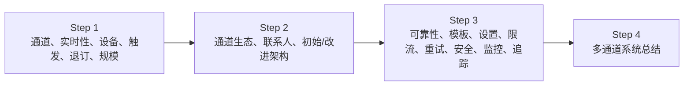
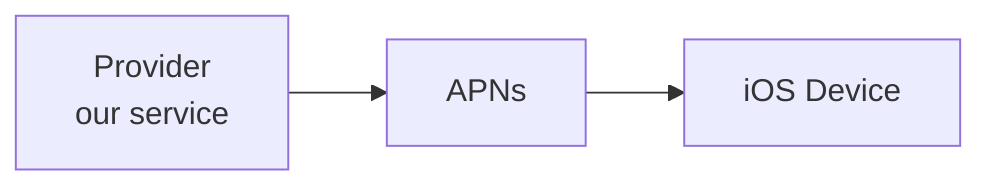
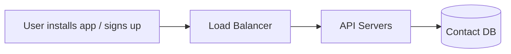
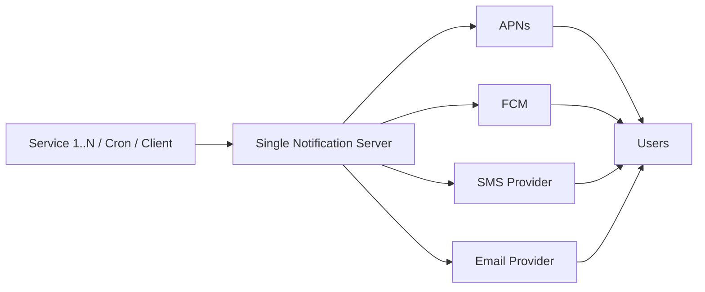
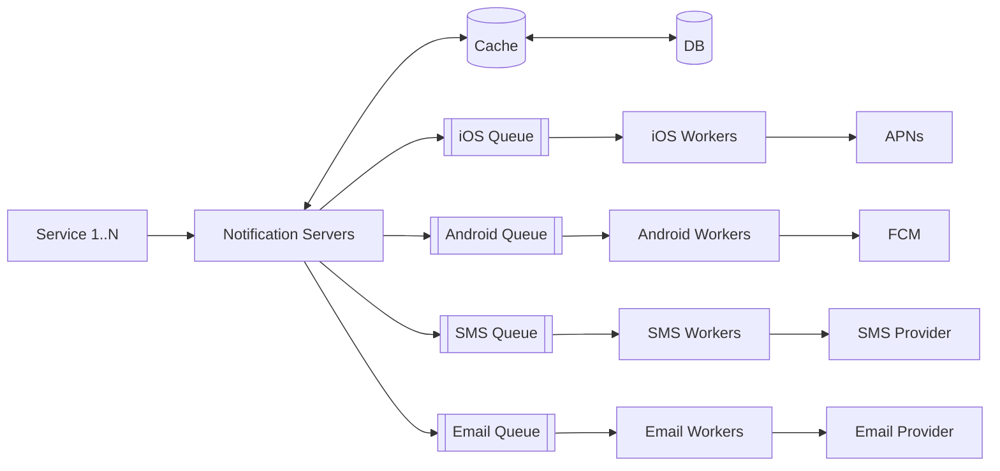
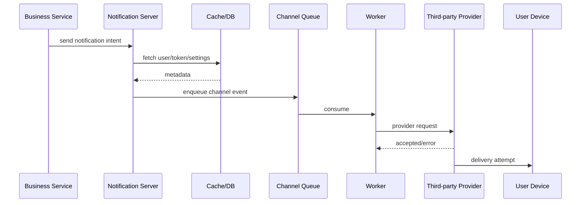
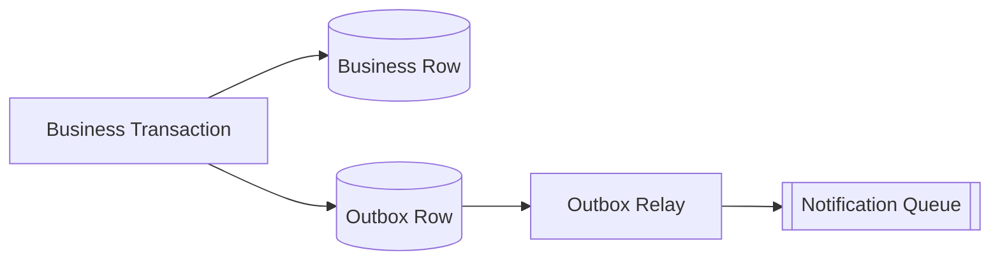
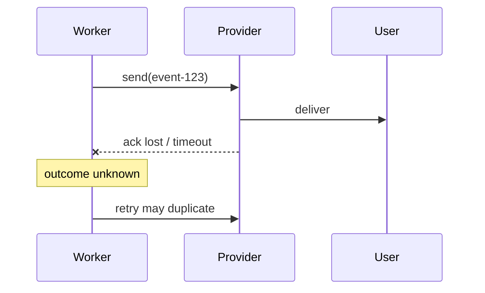
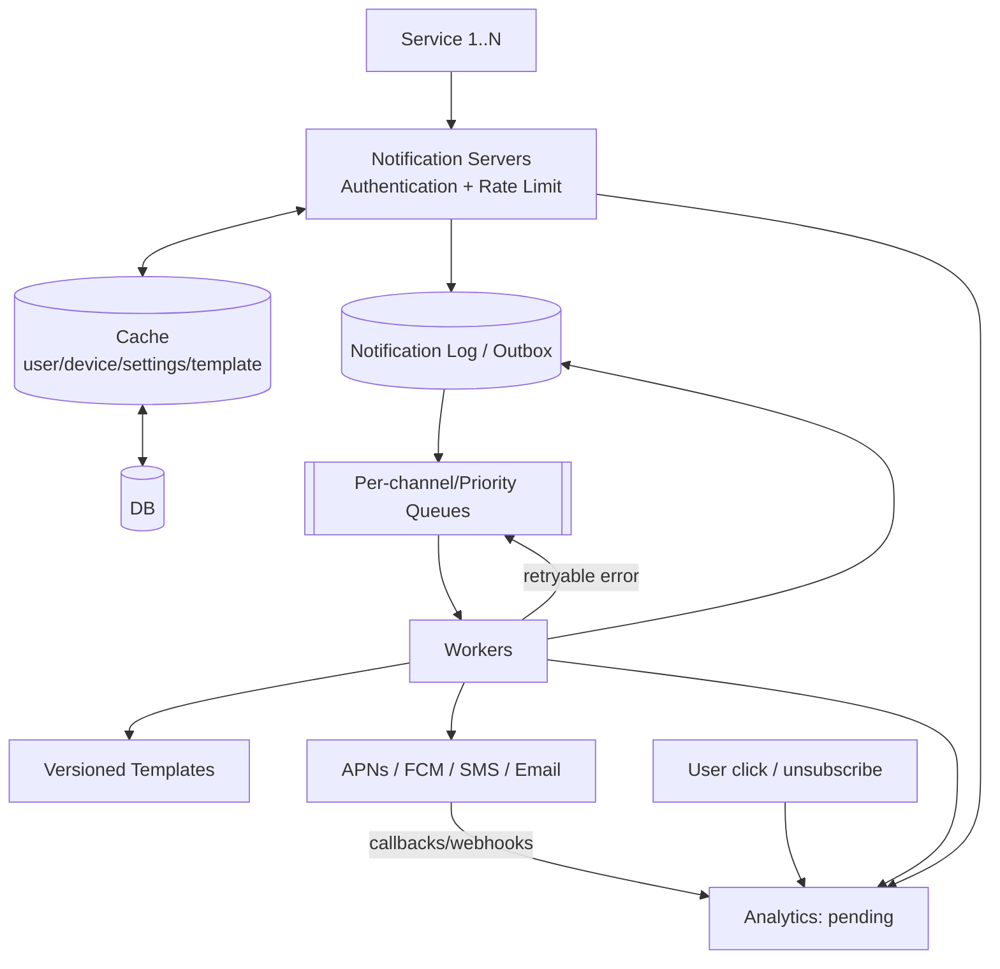
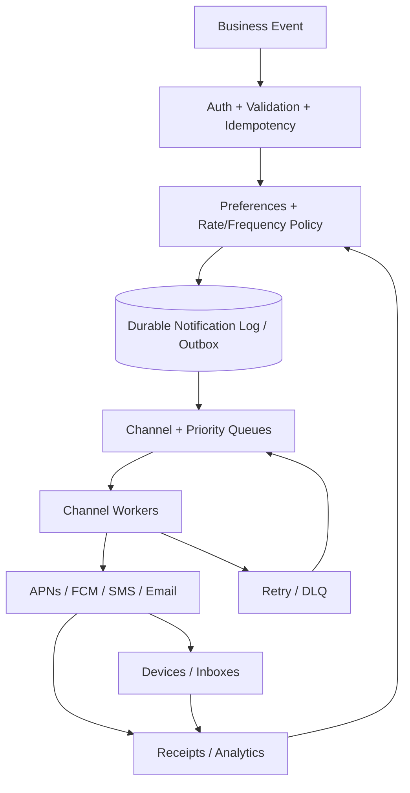

> 原书：Alex Xu，*System Design Interview: An Insider's Guide*（Second Edition）
> 原章：Chapter 10, *Design a Notification System*
> 本章主线：先澄清通知通道、实时性、终端、触发方式、用户退订和每日规模；再分别理解 APNs、FCM、SMS 与 Email 的外部通道，并从单通知服务器逐步拆出数据库、缓存、水平扩展的通知服务器、按通道隔离的消息队列和 Worker；最后用通知日志、重试和事件 ID 去重降低丢失与重复，用模板、用户设置、频控、认证、队列监控和事件追踪把“能发出去”扩展为可治理、可观察、尊重用户的生产系统。

## 0. 学习目标、阅读边界与全章总览

通知系统把一个业务事件转换成面向用户的消息，并经某种通道交付：

```text
业务事件
→ 判断用户是否应收到
→ 选择通道和目标地址
→ 渲染内容
→ 排队
→ 调用第三方服务
→ 跟踪发送、送达、点击或失败
```

通知不只是手机 push。本章支持：

- iOS/Android 移动推送；
- SMS；
- Email。

读完后，应当能够回答：

1. “软实时”与硬实时、批处理有什么区别？
2. APNs、FCM、SMS 网关和邮件服务分别承担什么职责？
3. Device token、手机号和 Email 地址为什么属于不同生命周期的联系信息？
4. 为什么一个用户要对应多条 device records？
5. 单通知服务器为什么同时产生单点、扩展困难和性能瓶颈？
6. 为什么要按通知通道拆分消息队列和 Worker？
7. 如何避免业务数据库提交成功，但通知事件没有进入队列？
8. 为什么分布式通知无法简单承诺端到端 exactly-once？
9. Event ID 去重解决什么，不能解决什么？
10. 通知模板、用户偏好和频控在发送前应按什么顺序生效？
11. 第三方返回成功是否表示用户设备已经展示通知？
12. 临时错误、永久错误和未知结果如何采用不同重试策略？
13. Queue depth、oldest message age 和生产/消费速率如何判断积压？
14. `pending/sent/delivered/click/unsubscribe/error` 状态如何解释？
15. 如何把营销通知和交易/安全通知隔离，避免相互阻塞或错误退订？
16. App key/secret、内部认证和第三方凭据怎样安全管理？
17. 如何在成本、送达率、延迟和用户疲劳之间做权衡？

原章按四步框架展开：



本文严格沿原书顺序展开。补充的 QPS/积压公式、outbox、投递语义、状态机、重试分类、幂等实现、优先级与隐私治理属于标准工程背景，不是作者逐式给出的原文。

---

## 1. 通知系统的边界：它交付的是意图，不是最终控制权

### 1.1 一条通知涉及多个系统


自己的系统通常只能直接控制：

- 接收业务请求；
- 检查偏好和频控；
- 持久化通知意图；
- 渲染和排队；
- 调用第三方；
- 记录回执。

第三方接受请求以后，运营商、操作系统、省电策略、垃圾过滤、设备离线和用户行为都可能影响最终结果。因此要区分：

- **accepted**：本系统已持久接收；
- **sent/provider accepted**：第三方 API 接受；
- **delivered**：有送达回执；
- **displayed**：终端展示，很多通道无法可靠知道；
- **opened/clicked**：用户交互；
- **read**：用户真正阅读，通常无法证明。

### 1.2 通知类型影响可靠性目标

| 类型 | 示例 | 主要目标 | 可接受行为 |
|---|---|---|---|
| 安全 | 登录验证码、风险告警 | 低延迟、严格权限、时效 | 过期后不应发送 |
| 交易 | 支付结果、订单状态 | 不丢、可审计、去重 | 可稍延迟，不应静默丢失 |
| 提醒 | 到期、日程 | 准时、尊重时区 | 可在小窗口重试 |
| 营销 | 促销、召回 | 用户偏好、频控、成本 | 可降级、批处理或丢弃过期消息 |

不能用同一优先级、重试次数和退订策略处理全部通知。

---

## 2. Step 1：理解问题并确定设计范围

### 2.1 支持的通知通道

面试官确认：

- Push notification；
- SMS；
- Email。

这要求系统抽象共同流程，同时保留每个通道的地址、模板、限制、错误和回执差异。

### 2.2 软实时系统

原书定义：希望尽快送达，高负载时轻微延迟可接受。

**硬实时**要求在截止时间前完成，否则结果失效或危险；**软实时**允许偶发超时，但延迟会降低价值。

可以为通知定义：

$$
DeliveryLatency=t_{providerAccepted}-t_{eventCreated}
$$

以及 SLO：

```text
99% 高优先级通知在 10 秒内提交第三方
99% 普通通知在 5 分钟内提交第三方
```

这不是原书固定数字。重点是“尽快”必须转成按类别可测量的时间目标。

### 2.3 支持的终端

- iOS；
- Android；
- Laptop/Desktop。

桌面端可通过 Email、Web Push 或站内通知接收。本章主要展开 iOS/Android push、SMS 和 Email。

### 2.4 触发方式

- 客户端应用触发；
- 服务端定时任务触发；
- 业务微服务触发；
- 分布式系统事件触发。

调用方可能是同步 API、cron job 或消息消费者，因此入口要有统一契约、认证、幂等与审计。

### 2.5 用户可退订

用户 opt-out 后不再接收相应通知。实际应比单一布尔值更细：

```text
user × notification category × channel × locale/quiet hours
```

还要区分：

- 营销可退订；
- 交易通知可选择通道但可能不能完全关闭；
- 法律/安全强制通知；
- 全局退订与单类别退订。

用户偏好不是发送后的装饰，而是决定是否创建发送任务的策略输入。

### 2.6 每日规模

原书给定：

| 通道 | 每日数量 |
|---|---:|
| Mobile push | 10,000,000 |
| SMS | 1,000,000 |
| Email | 5,000,000 |
| 合计 | 16,000,000 |

### 2.7 平均吞吐估算

$$
QPS_{push}=\frac{10^7}{86400}\approx115.7
$$

$$
QPS_{sms}=\frac{10^6}{86400}\approx11.6
$$

$$
QPS_{email}=\frac{5\times10^6}{86400}\approx57.9
$$

$$
QPS_{total}=\frac{16\times10^6}{86400}\approx185.2
$$

平均不高，但营销活动、突发新闻和定时任务会产生尖峰。若 1000 万 push 要在 10 分钟内发完：

$$
QPS_{campaign}=\frac{10^7}{600}\approx16,667
$$

这远高于日均值。队列、Worker 和第三方配额必须按峰值/截止时间设计。

### 2.8 第三方成本

SMS 和 Email 常按量计费。若通道单价 $c_i$、发送量 $n_i$：

$$
Cost=\sum_i n_i c_i
$$

去重、偏好检查和频控应尽量在付费调用前完成。

### 2.9 Step 1 范围总结

设计一个软实时、多通道、支持多终端、可由客户端/服务端触发、尊重退订、日发送 1600 万条且能承受活动尖峰的通知系统。

---

## 3. Step 2：不同通知通道

作者先分别建立每类通知的外部生态，再构造统一平台。

---

## 4. iOS Push Notification

### 4.1 三个角色



- Provider：本系统构造并发送请求；
- APNs：Apple Push Notification service；
- iOS Device：接收终端。

### 4.2 Device token

Device token 标识某个应用在某个设备/安装实例上的推送目标。它不是永久用户 ID：

- 用户重装应用可能变化；
- APNs 可判定 token 无效；
- 一个用户有多个设备/token；
- 同一设备上的不同 App 有不同 token；
- 登出后 token 与用户关系要解除。

发送失败返回无效 token 时，应停用该记录，避免永久重试。

### 4.3 Payload

原书示例 payload 包含：

- title；
- body；
- action；
- badge。

Payload 应小而安全：不要放密码、完整敏感记录或可信业务状态。Push 内容可能显示在锁屏；客户端点击后应通过认证 API 拉取最新数据。

### 4.4 APNs 接受不等于终端展示

APNs API 成功只表示 Apple 接受请求。设备可能：

- 离线；
- 关闭通知；
- 处于省电/勿扰；
- App 已卸载；
- 通知过期或被折叠。

状态模型必须避免把 provider accepted 直接写成 delivered/read。

---

## 5. Android Push、SMS 与 Email

### 5.1 Android Push

流程与 iOS 类似，以 FCM 代替 APNs：

```text
Provider → FCM → Android Device
```

不同市场可能不可用。原书指出中国市场可能使用 JPush、Pushy 等替代服务，所以通道适配器必须可插拔，不能把 FCM 语义写死在核心域模型中。

### 5.2 SMS

通常调用 Twilio、Nexmo/Vonage 等商业服务：

```text
Our Worker → SMS Provider → Carrier → Phone
```

需要考虑：

- E.164 电话格式；
- 国家/地区覆盖；
- 发送方号码/模板注册；
- 单价；
- 长短信分段；
- 运营商过滤；
- delivery receipt；
- 退订关键字与法规。

### 5.3 Email

可自建邮件服务器，但许多公司使用 SendGrid、Mailchimp 等提高送达率和分析能力。

需要：

- 域名信誉；
- SPF/DKIM/DMARC；
- bounce/complaint；
- unsubscribe；
- HTML/text 两种版本；
- 链接追踪与隐私；
- provider 配额和区域。

### 5.4 统一抽象与差异

统一命令可表示：

```text
NotificationIntent {
  event_id,
  user_id,
  category,
  channels,
  template_id,
  template_data,
  priority,
  expires_at
}
```

通道 Worker 再转换为 APNs/FCM/SMS/Email 请求。统一的是业务意图、策略和状态；通道地址、payload、错误码和回执必须由 adapter 处理。

---

## 6. 联系信息收集流程

原书 Figure 10-7：



### 6.1 数据模型

原书简化：

- User table：Email、phone number；
- Device table：device token；
- 一个用户可有多个 device rows。

可扩展模型：

```text
user_contact
  user_id
  email
  phone_e164
  email_verified_at
  phone_verified_at

device
  device_id
  user_id
  platform
  push_token
  token_status
  locale
  timezone
  last_seen_at
```

### 6.2 为什么一对多

同一用户可同时登录手机、平板和多个浏览器。Push 通知可：

- 发给所有活跃设备；
- 只发最近设备；
- 按平台或设备偏好；
- 用户在一个设备完成动作后取消其余设备通知。

### 6.3 联系信息验证与生命周期

- Email/phone 要验证所有权；
- token 要接收客户端刷新；
- 无效 token 要停用；
- 用户登出解除绑定；
- 手机号转售后旧绑定必须清理；
- 敏感数据加密并限制访问；
- 用户删除账户时按政策清除。

错误或陈旧联系信息会造成隐私泄露，而不只是送达失败。

---

## 7. 初始通知架构

### 7.1 组件



Service 1..N 可以是账单服务、购物服务、cron job 或其他系统。单 Notification Server：

- 提供 API；
- 查询用户信息；
- 构造 payload；
- 同步调用第三方。

### 7.2 问题一：单点故障

通知服务器宕机，全部通道停止。即使第三方和数据库健康，系统仍不可用。

### 7.3 问题二：难以独立扩展

数据库查询、模板渲染、APNs 连接、SMS 发送和 Email HTML 构建都在同一节点，无法按通道负载独立扩容。

### 7.4 问题三：性能瓶颈

构造 HTML、等待第三方网络响应等慢操作占用线程。某一提供商变慢会拖累其他通道，峰值时出现：

$$
arrivalRate>processingRate
$$

但单机没有持久缓冲和独立 Worker 池，只能超时、丢请求或整体过载。

### 7.5 作者的分析方法

先建立最简单可行方案，再按：

- 单点；
- 扩展边界；
- 慢依赖；

识别问题，下一步只引入针对性复杂度。

---

## 8. 改进的高层架构

作者作三项改造：

1. 数据库和缓存移出通知服务器；
2. 增加多个无状态通知服务器并自动水平扩展；
3. 引入消息队列解耦各组件。



### 8.1 Notification Servers 职责

原书列出：

- 为内部/已验证客户端提供 API；
- 验证 Email、电话等基础格式；
- 从缓存/数据库取得用户、设备、设置和渲染数据；
- 把通知事件放入相应消息队列。

Notification Server 应快速完成“接受与编排”，不等待第三方交付。

### 8.2 Cache 与 DB

缓存：

- 用户信息；
- device 信息；
- 通知模板；
- 设置。

数据库保存权威数据：

- 用户联系信息；
- 通知意图/日志；
- 模板版本；
- 用户设置；
- 幂等记录。

缓存失效时可以回源，不能成为唯一通知真相。

### 8.3 为什么每通道独立队列

- APNs 故障不阻塞 Email；
- SMS 活动峰值不挤占安全 Push；
- 每通道可独立扩容和限速；
- provider 重试策略不同；
- payload 和成本不同；
- 故障隔离更清晰。

必要时还要按优先级细分：

```text
push-critical
push-transactional
push-marketing
```

否则一场营销活动会让验证码/支付告警排在数百万消息之后。

### 8.4 Worker

Worker 从队列拉取事件，渲染通道 payload，调用第三方，处理响应并记录状态。Worker 可根据队列 backlog 独立扩缩容。

### 8.5 六步发送流程

1. 业务服务调用 Notification API；
2. Notification Server 从缓存/数据库取用户、token、设置；
3. 事件进入对应通道队列；
4. Worker 拉取事件；
5. Worker 调用第三方；
6. 第三方把通知交付给用户终端。



---

## 9. API 契约与请求接受语义

原书图示的 API 文本存在 `email` 标题与 `/sms/send` 路径不一致的排版/示意问题。工程上建议统一通道无关入口：

```http
POST /v1/notifications
Idempotency-Key: event-123
Content-Type: application/json

{
  "event_id": "event-123",
  "user_id": 42,
  "category": "order_shipped",
  "channels": ["push", "sms"],
  "template_id": "order-shipped-v3",
  "template_data": {"order_id": "A100"},
  "priority": "transactional",
  "expires_at": "2026-08-10T12:05:00Z"
}
```

如果意图已持久化并入队，可返回：

```http
HTTP/1.1 202 Accepted
```

`202` 表示接受异步处理，不表示已送达。返回 notification ID 供查询状态。

### 9.1 验证顺序

```text
认证/授权
→ schema 与大小校验
→ 幂等检查
→ 类别/通道策略
→ 用户偏好与频控
→ 持久化意图
→ 入队
```

安全和成本高的步骤应尽早挡住无效请求。

---

## 10. Step 3：可靠性——如何防止数据丢失

原书提出：通知可以延迟或乱序，但不能丢；使用通知日志数据库和重试。

### 10.1 仅有队列为何仍可能丢

经典双写：

```text
1. 业务数据库提交订单
2. 发送通知消息
```

若进程在 1 和 2 之间崩溃，订单存在但通知永远没有创建。

或者 Notification Server：

```text
1. 写 notification log
2. publish queue
```

在两步之间崩溃也会形成“日志 pending 但未入队”。

### 10.2 Transactional Outbox

业务变更与 outbox event 在同一数据库事务提交：



Relay 可重复发布，因此消费者必须幂等，但不会因进程在双写间崩溃而永久丢事件。

若通知平台本身通过 API 接受意图，则可先持久化 notification log，再由后台扫描/relay 保证所有 `pending` 最终入队。

### 10.3 通知日志

```text
notification_id
event_id
user_id
category
channel
status
attempt_count
provider_message_id
created_at
next_attempt_at
expires_at
last_error
```

日志用于：

- 审计；
- 故障恢复；
- 重试；
- 状态查询；
- 对账；
- 去重。

### 10.4 “不丢”的准确边界

系统能保证的是：持久化的通知意图最终被处理或明确进入终态。无法保证：

- 手机一定联网；
- 运营商一定投递；
- 用户一定查看；
- 第三方永不丢消息。

应把“never lost”解释为内部可审计和有界重试，而不是控制所有外部系统。

---

## 11. Exactly-once 为什么无法简单承诺

### 11.1 不确定结果场景

Worker 调用 provider：

1. Provider 接收并发送；
2. Worker 在收到响应前网络超时；
3. Worker 不知道发送是否成功；
4. 不重试可能丢；重试可能重复。



这不是简单代码 bug，而是分布式系统在丢失确认后的知识边界。

### 11.2 Event ID 去重

原书逻辑：

```text
if event_id already seen:
    discard
else:
    send
```

它必须原子实现：

```sql
INSERT INTO processed_event(event_id)
VALUES (?)
ON CONFLICT DO NOTHING;
```

只有成功插入者继续处理。

### 11.3 去重位置

- Notification Server：防调用方重试重复创建；
- Queue consumer：防消息重复投递；
- Provider：若支持 idempotency key，可防网络重试重复发送；
- Client：可按 notification ID 避免重复展示，但不能依赖所有终端实现。

### 11.4 为什么本地去重仍不够

若标记 `processed` 后、调用 provider 前崩溃，重试会被丢弃，造成未发送；若先发送后标记，又可能重复。

更实用的状态：

```text
PENDING -> SENDING -> PROVIDER_ACCEPTED / RETRYABLE / FAILED
```

配合 lease：超时的 `SENDING` 可重新处理。外部调用若无幂等支持，仍只能在丢失与重复之间权衡。

### 11.5 目标是 effectively-once

通过：

- 稳定 event ID；
- 幂等入口；
- 持久日志；
- 至少一次队列；
- 原子状态转换；
- provider idempotency；
- 客户端去重；

把重复概率和影响降到可接受，而不是宣称物理世界端到端 exactly-once。

---

## 12. 通知模板

### 12.1 为什么引入

每天数百万通知格式相似。模板提供固定结构与变量：

```text
title: Your order {{order_id}} has shipped
body: Estimated arrival: {{arrival_date}}
cta: Track package
```

原书收益：

- 格式一致；
- 减少错误；
- 节省构建时间。

### 12.2 模板应版本化

通知事件应引用：

```text
template_id + template_version + locale + data
```

如果只引用“最新模板”，事件排队期间模板变化会导致重试内容不同，审计无法复现。

### 12.3 渲染安全

- 缺少变量要失败或使用明确默认值；
- HTML Email 要转义不可信输入；
- Push/SMS 限制长度；
- 链接签名和追踪参数要安全；
- 模板发布要评审、预览、灰度和回滚；
- 不把 secret 写入模板数据。

### 12.4 何时渲染

**入队前渲染**：内容稳定、Worker 简单，但多通道/locale 产生较大消息。

**Worker 时渲染**：消息小、适配通道方便，但模板变化和缓存故障影响重试。

折中：事件固定模板版本和参数，由 Worker 渲染。

---

## 13. 用户通知设置

原书简化表：

```text
user_id  BIGINT
channel  VARCHAR   # push/email/SMS
opt_in   BOOLEAN
```

发送前检查用户是否 opt-in。

### 13.1 细粒度模型

```text
notification_preference
  user_id
  category
  channel
  enabled
  quiet_hours
  timezone
  frequency_cap
  updated_at
```

### 13.2 何时检查设置

只在入队前检查存在竞态：用户入队后退订，Worker 仍发送。只在 Worker 检查会让大量无效消息占队列。

可两次检查：

1. 入口快速过滤；
2. 真正发送前再次读取最新设置。

高价值交易通知是否绕过营销退订，必须由分类策略显式定义。

### 13.3 Quiet hours 与时区

营销通知可延迟到用户当地允许时段；安全告警通常不延迟。调度必须使用用户时区和夏令时规则，而不是固定 UTC 偏移。

### 13.4 退订事件

Email/SMS 退订应快速、持久、可审计，并传播到缓存。缓存陈旧可能导致合规违规，偏好更新应主动失效而非只依赖长 TTL。

---

## 14. Rate Limiting 与频率上限

原书目的：避免通知过多导致用户彻底关闭通知。

### 14.1 两种限流

**入口限流**

- 防调用服务失控；
- 按 service/API key/tenant；
- 保护队列和成本。

**用户频控**

- 按 user/category/channel；
- 保护用户体验；
- 如营销 push 每日最多 3 条。

### 14.2 多窗口规则

```text
per user: 1 marketing push / hour
per user: 3 marketing pushes / day
per tenant: 1000 SMS / minute
global provider: 5000 requests / second
```

令牌桶适合 burst，固定/滑动窗口适合周期配额。

### 14.3 超限行为

- 交易通知：延迟或改用备用通道；
- 营销通知：丢弃、合并摘要或安排次日；
- Provider 配额：排队并按 `Retry-After` 调度；
- 安全通知：高优先级保留容量。

频控不是无差别 drop，必须结合通知价值和过期时间。

---

## 15. Retry 机制

原书：第三方发送失败时重新放入消息队列，持续失败则告警。

### 15.1 错误分类

| 错误 | 示例 | 处理 |
|---|---|---|
| 瞬时 | timeout、5xx、连接重置 | 指数退避重试 |
| 限流 | 429 | 遵守 Retry-After |
| 永久地址错误 | invalid token、bad phone、hard bounce | 不重试，停用地址 |
| 内容/认证错误 | invalid payload、401/403 | 配置/代码告警，不盲重试 |
| 结果未知 | 请求可能已接受但 ack 丢失 | 幂等 key 或接受重复风险 |

### 15.2 指数退避与 jitter

$$
delay_k=\min(cap,base\times2^k)+jitter
$$

Jitter 防大量 Worker 同时重试。还应限制：

- 最大尝试次数；
- 最大累计时长；
- `expires_at`；
- 单 provider 熔断；
- dead-letter queue。

### 15.3 过期通知

验证码、临时促销过期后继续重试比丢弃更糟：

```text
if now >= expires_at:
    mark EXPIRED
    do not call provider
```

### 15.4 Retry Queue

不要把立即可发送和 1 小时后重试的消息混在一个 FIFO 队首。可用：

- 延迟队列；
- 按 `next_attempt_at` 排序；
- 多级 retry topics；
- 定时扫描 notification log。

### 15.5 Dead-letter 与人工修复

超过预算后进入 DLQ，保留：

- event/notification ID；
- payload 引用；
- 错误分类；
- 尝试历史；
- provider response；
- 模板和凭据版本。

修复后可有审计地重放，避免人工直接重复发送。

---

## 16. Push 安全

原书使用 appKey/appSecret 保护 Push API，只允许认证/验证客户端发送。

### 16.1 内部调用认证

- mTLS / service identity；
- OAuth2 service token；
- 签名请求；
- API key；
- RBAC：哪个服务能发送哪些 category/channel；
- 审计调用者、模板和收件人规模。

仅知道 appKey 不应自动获得全局广播权限。

### 16.2 凭据管理

APNs/FCM/provider secret：

- 存 Secret Manager/HSM；
- 不写日志/队列 payload；
- 定期轮换；
- 按环境/应用/地域隔离；
- 最小权限；
- 泄漏后快速吊销。

### 16.3 数据安全

- 联系信息静态加密；
- 日志脱敏；
- 队列传输加密；
- 锁屏 payload 不放敏感内容；
- 租户隔离；
- 用户删除和保留策略；
- 防模板注入和恶意链接。

---

## 17. 队列监控与容量推导

原书强调 queued notifications 总数：高说明 Worker 处理不够快，应扩容。

### 17.1 生产与消费速率

生产率 $\lambda$、消费率 $\mu$：

$$
\Delta backlog=(\lambda-\mu)\Delta t
$$

若 $\lambda>\mu$ 持续，队列必然增长。增加 Worker 只在瓶颈确实是 Worker，且 provider 配额仍有余量时有效。

### 17.2 清空时间

已有积压 $B$，且 $\mu>\lambda$：

$$
T_{drain}=\frac{B}{\mu-\lambda}
$$

例如积压 1,000,000，生产 1000/s，消费 1500/s：

$$
T_{drain}=\frac{10^6}{500}=2000\ \text{s}\approx33.3\ \text{min}
$$

### 17.3 Worker 数

单 Worker 安全处理 $r$ notifications/s，目标总消费率 $\mu_t$：

$$
Workers=\left\lceil\frac{\mu_t}{r}\right\rceil
$$

但 provider 每秒只允许 $L$ 时：

$$
\mu_t\le L
$$

盲目加 Worker 只会制造 429 和更多重试。

### 17.4 Queue depth 不够

还应监控：

- oldest message age；
- 按 priority/channel 的 backlog；
- enqueue/dequeue rate；
- processing P95/P99；
- retry/DLQ rate；
- provider 429/5xx；
- expired before send；
- Worker utilization；
- notification end-to-end latency。

100 万条积压若都是新营销消息，影响与一条 20 分钟未发送的安全告警不同。Oldest age 和 SLO 更有意义。

---

## 18. 事件追踪与状态模型

原书追踪 open rate、click rate、engagement，Figure 10-13 显示：

```mermaid
stateDiagram-v2
    [*] --> Pending: start
    Pending --> Sent
    Pending --> Error
    Sent --> Delivered
    Sent --> Error
    Delivered --> Click
    Delivered --> Unsubscribe
```

### 18.1 状态语义

- Pending：意图已接受、尚未 provider accepted；
- Sent：第三方接受/已提交；
- Delivered：收到通道送达回执；
- Click/Open：用户交互；
- Unsubscribe：用户退订；
- Error：当前尝试或通知进入错误路径。

“Error”应区分 retryable、permanent、expired；否则无法自动处理。

### 18.2 状态不一定是单一线性值

同一通知多设备、多通道时，每个 delivery attempt 有自己的状态：

```text
notification intent
  ├─ push device A: delivered
  ├─ push device B: invalid token
  └─ email: clicked
```

顶层状态是聚合结果，不能用一个枚举覆盖所有通道细节。

### 18.3 指标公式

$$
DeliveryRate=\frac{delivered}{providerAccepted}
$$

$$
OpenRate=\frac{uniqueOpens}{delivered\ or\ sent}
$$

$$
ClickRate=\frac{uniqueClicks}{delivered\ or\ sent}
$$

分母必须明确。不同通道回执能力不同，跨通道直接比较会误导。

### 18.4 事件去重与乱序

Provider webhook 可能重复、延迟或乱序：

- webhook event ID 去重；
- 按 provider timestamp/version 合并；
- 状态只允许合法转换；
- 晚到 `sent` 不应覆盖已知 `delivered`；
- 验证 webhook 签名和重放窗口。

### 18.5 隐私

Open pixel 和 click tracking 涉及用户隐私、法规和客户端拦截。指标不是绝对真实：Email 隐私代理可能预取图片，Push click 也不代表阅读完整内容。

---

## 19. 可运行示例：幂等、状态机与重试

下面代码使用标准库，演示：

- event ID 幂等接收；
- 用户退订检查；
- provider 超时后延迟重试；
- 永久 invalid token 停止重试；
- 过期消息不发送；
- 合法状态转换；
- 重复事件不创建第二条通知。

```python
from dataclasses import dataclass, field
from enum import Enum
from heapq import heappop, heappush

class Status(Enum):
    PENDING = "pending"
    SENT = "sent"
    DELIVERED = "delivered"
    RETRYABLE = "retryable"
    FAILED = "failed"
    EXPIRED = "expired"
    SUPPRESSED = "suppressed"

@dataclass
class Notification:
    event_id: str
    user_id: int
    category: str
    channel: str
    expires_at: float
    status: Status = Status.PENDING
    attempts: int = 0
    history: list[Status] = field(default_factory=lambda: [Status.PENDING])

    def transition(self, status: Status) -> None:
        self.status = status
        self.history.append(status)

class NotificationEngine:
    def __init__(self) -> None:
        self.by_event: dict[str, Notification] = {}
        self.disabled: set[tuple[int, str, str]] = set()
        self.retry_heap: list[tuple[float, str]] = []

    def disable(self, user_id: int, category: str, channel: str) -> None:
        self.disabled.add((user_id, category, channel))

    def accept(self, notification: Notification) -> Notification:
        existing = self.by_event.get(notification.event_id)
        if existing is not None:
            return existing
        self.by_event[notification.event_id] = notification
        preference = (
            notification.user_id,
            notification.category,
            notification.channel,
        )
        if preference in self.disabled:
            notification.transition(Status.SUPPRESSED)
        return notification

    def send(self, event_id: str, now: float, provider_result: str) -> None:
        notification = self.by_event[event_id]
        if notification.status in {
            Status.SENT,
            Status.DELIVERED,
            Status.FAILED,
            Status.EXPIRED,
            Status.SUPPRESSED,
        }:
            return
        if now >= notification.expires_at:
            notification.transition(Status.EXPIRED)
            return

        notification.attempts += 1
        if provider_result == "accepted":
            notification.transition(Status.SENT)
        elif provider_result == "retryable":
            notification.transition(Status.RETRYABLE)
            delay = min(60.0, 2.0 ** notification.attempts)
            heappush(self.retry_heap, (now + delay, event_id))
        elif provider_result == "invalid_destination":
            notification.transition(Status.FAILED)
        else:
            raise ValueError(f"unknown provider result: {provider_result}")

    def due_retries(self, now: float) -> list[str]:
        due: list[str] = []
        while self.retry_heap and self.retry_heap[0][0] <= now:
            _, event_id = heappop(self.retry_heap)
            due.append(event_id)
        return due

    def delivered(self, event_id: str) -> None:
        notification = self.by_event[event_id]
        if notification.status is Status.SENT:
            notification.transition(Status.DELIVERED)

engine = NotificationEngine()
notification = Notification(
    event_id="order-123:shipped:push",
    user_id=42,
    category="order_shipped",
    channel="push",
    expires_at=100.0,
)

# Duplicate acceptance returns the same durable notification.
assert engine.accept(notification) is notification
assert engine.accept(Notification(
    "order-123:shipped:push", 42, "order_shipped", "push", 100.0
)) is notification

# First attempt is ambiguous/retryable; retry is due after 2 seconds.
engine.send(notification.event_id, now=10.0, provider_result="retryable")
assert notification.status is Status.RETRYABLE
assert engine.due_retries(11.9) == []
assert engine.due_retries(12.0) == [notification.event_id]

# Provider accepts the retry and later reports delivery.
engine.send(notification.event_id, now=12.0, provider_result="accepted")
assert notification.status is Status.SENT
engine.delivered(notification.event_id)
assert notification.status is Status.DELIVERED
assert notification.attempts == 2

# A disabled marketing channel is suppressed before any provider call.
engine.disable(7, "marketing", "sms")
marketing = engine.accept(Notification(
    "campaign-9:user-7:sms", 7, "marketing", "sms", 100.0
))
assert marketing.status is Status.SUPPRESSED
assert marketing.attempts == 0

# An expired notification is not sent.
expired = engine.accept(Notification(
    "otp-1", 9, "otp", "sms", expires_at=5.0
))
engine.send("otp-1", now=6.0, provider_result="accepted")
assert expired.status is Status.EXPIRED

print(notification.history)
print(marketing.history)
print(expired.history)
```

这只是单进程教学模型。生产环境中的 event ID 唯一性、状态迁移、lease 和 retry schedule 必须持久化并使用条件更新；进程内字典和 heap 不能跨崩溃恢复。

---

## 20. 更新后的最终架构

把原章组件组合：



原书 Figure 10-14 以 iOS 路径代表各通道，新增：

- Authentication；
- Rate limit；
- Retry；
- Notification template；
- Notification log；
- Analytics/monitoring。

### 20.1 一次完整路径

1. 业务服务携带 event ID 调用 API；
2. 入口认证、授权、限流、schema 校验；
3. 检查用户设置、目标地址、频控和过期；
4. 持久化 notification log/outbox；
5. 返回 202；
6. Relay 把事件写入通道/优先级队列；
7. Worker 再检查最新偏好，渲染固定版本模板；
8. 调用 provider；
9. 临时错误延迟重试，永久错误终止并清理地址；
10. 状态和 provider ID 写日志；
11. 回执、点击、退订进入 Analytics；
12. 指标驱动扩容、规则和模板优化。

---

## 21. 扩展设计：优先级、调度与渠道回退

### 21.1 优先级队列

```text
P0: OTP / security
P1: transactional
P2: reminders
P3: marketing
```

高优先级获得保留容量，但要防低优先级永久饥饿。可用 weighted fair scheduling 和 aging。

### 21.2 定时通知

未来发送不能长期占普通 FIFO：

- 持久 schedule table；
- 按 `scheduled_at` 分桶；
- 近时间窗口移入 ready queue；
- 时区/DST 正确转换；
- 取消或修改任务有版本控制。

### 21.3 渠道回退

例：Push 未送达是否改发 SMS？必须考虑：

- 用户同意的通道；
- 通知重要性；
- SMS 成本；
- 失效时间；
- 防止多个通道造成骚扰；
- 回退触发是 provider error 还是真正未读。

Provider accepted 但设备未展示时，系统未必及时知道，不能轻易自动回退。

### 21.4 多 Provider

SMS/Email 可配置主备 Provider：

- 按地域和成本路由；
- 熔断故障 Provider；
- 灰度切换；
- 统一错误分类；
- 防切换后重复发送；
- 按 provider 维护信誉和配额。

---

## 22. 容易混淆的概念与常见误区

### 22.1 Notification intent 与 delivery attempt

一个业务通知意图可产生多个通道、设备和重试 attempt。不能把它们都塞进一行单状态。

### 22.2 Provider accepted 与 delivered

第三方 API 成功只表示接受，终端实际送达/展示取决于通道回执能力。

### 22.3 Sent 与用户已读

发送、送达、打开、点击、阅读是不同阶段。很多通道无法可靠证明“已读”。

### 22.4 At-least-once 与 exactly-once

至少一次通过重试减少丢失，却可能重复。端到端 exactly-once 在第三方副作用和 ack 丢失时无法仅靠内部队列保证。

### 22.5 Dedupe 与永久不重复

去重受保留窗口、存储一致性、event ID 稳定性和 provider 支持限制。过早删除去重记录会让迟到消息再次发送。

### 22.6 Event ID 与 Notification ID

- Event ID：业务事件幂等键；
- Notification ID：通知意图记录；
- Delivery Attempt ID：某通道某次尝试；
- Provider Message ID：第三方返回标识。

四者用途不同。

### 22.7 Queue durability 与绝不丢

队列持久不自动解决“数据库提交后还没 publish 就崩溃”的双写问题。需要 outbox/relay。

### 22.8 Retry 与可靠性

对 invalid token、错误 payload 无限重试只会制造积压。可靠性要求错误分类、有界预算和 DLQ。

### 22.9 多 Worker 与更高发送速率

若瓶颈是 provider 配额，增加 Worker 会增加 429 和重试。必须同时看消费率和外部限制。

### 22.10 Queue depth 与延迟

队列 100 万不一定坏，若消费很快；队列 10 条也可能坏，若最老安全通知等了 20 分钟。要看 age 和 SLO。

### 22.11 用户 opt-out 与所有通知关闭

营销退订不一定阻止支付、安全和法律通知。Category 和 channel 必须分开建模。

### 22.12 入口检查设置就足够

排队后用户可能退订。发送前应再次检查高风险偏好，避免陈旧缓存违规。

### 22.13 Template 与最终内容

模板是版本化规则，最终内容由 locale、变量和通道渲染产生。重试要能复现同一版本。

### 22.14 Push payload 可放完整敏感数据

锁屏可能展示，第三方会处理 payload。只放最小必要信息，点击后经认证拉取详情。

### 22.15 App secret 写入客户端

客户端包可被逆向。用于服务端 Provider API 的 secret 必须留在可信服务端。

### 22.16 一个队列更简单也更可靠

单队列让通道故障和营销洪峰影响所有通知。按通道/优先级隔离可缩小故障半径。

### 22.17 Soft real-time 等于无延迟目标

软实时仍需要 P95/P99 延迟和过期时间，只是偶发超时可接受。

### 22.18 Open/click 指标绝对准确

隐私代理、图片缓存、Bot 和重复 webhook 会造成误差。必须定义口径和去重。

### 22.19 多设备等于多次业务通知

一个 notification intent 可 fan-out 到多个设备，但分析和频控应区分用户级与设备级，避免把多设备误算为多个用户触达。

### 22.20 发送成功后可以删除日志

日志还用于回执、审计、去重、统计和争议处理。应按合规和业务设置保留周期，而不是立即删除。

---

## 23. 本章知识结构

### 23.1 需求层

- Push/SMS/Email；
- 软实时；
- 多终端；
- 客户端/服务端触发；
- 用户 opt-out；
- 日发送 1600 万与活动尖峰。

### 23.2 通道层

- Provider → APNs → iOS；
- Provider → FCM → Android；
- SMS Provider → Carrier → Phone；
- Email Provider → Mailbox；
- 通道 Adapter 隔离差异。

### 23.3 编排层

- 联系信息和多设备；
- Authentication；
- Notification API；
- Cache/DB；
- Template、settings、frequency cap；
- 按通道/优先级队列与 Worker。

### 23.4 可靠性层

- Notification log/outbox；
- At-least-once queue；
- Event ID 去重；
- Provider idempotency；
- Retry/expiry/DLQ；
- 状态机和审计。

### 23.5 运行与反馈层

- Queue depth/age；
- 生产和消费率；
- provider 配额与错误；
- sent/delivered/click/unsubscribe；
- 用户疲劳、成本和业务效果；
- Analytics 驱动调优。



---

## 24. 核心结论与一般设计方法

### 24.1 核心结论

1. **通知是多阶段异步流程。** 接受、发送、送达和用户交互不能合并成一个“成功”。
2. **通道生态决定边界。** APNs/FCM/SMS/Email 都是外部依赖，接受请求不等于用户看到。
3. **联系信息有生命周期。** Device token、手机和 Email 要验证、更新、停用和安全存储。
4. **单服务器方案暴露单点、扩展和慢依赖问题。** 拆数据库/缓存、无状态服务器、队列和 Worker 后才能独立扩展。
5. **按通道和优先级隔离队列。** 一种 Provider 故障或营销洪峰不应阻塞安全/交易通知。
6. **持久日志 + outbox 解决内部不丢。** 单独使用队列不能消除数据库与消息的双写窗口。
7. **端到端 exactly-once 不能轻易承诺。** 采用 event ID、幂等状态、至少一次处理和 provider 支持实现 effectively-once。
8. **模板必须版本化，偏好必须在发送前生效。** 内容一致和用户同意都是正确性要求。
9. **频控同时保护系统、成本和用户。** 超限行为应按通知类别决定，不是统一丢弃。
10. **重试必须分类、退避、有界且感知过期。** 永久错误不重试，未知结果要处理重复风险。
11. **队列监控要看速率和年龄。** Queue depth 只是一个信号，oldest age 更直接反映 SLO。
12. **分析是异步反馈环。** 不能阻断发送关键路径，指标也必须承认通道和隐私带来的测量误差。
13. **安全覆盖调用权限、凭据、联系信息和 payload。** App secret 不进入客户端或队列明文。
14. **软实时仍需明确 SLO。** 高负载可稍延迟，不等于没有截止时间和优先级。

### 24.2 一般设计流程

$$
\boxed{
\text{澄清通道、时效、触发、规模与用户同意}
\rightarrow
\text{抽象通知意图与通道适配器}
\rightarrow
\text{持久化联系人、偏好、模板和通知日志}
\rightarrow
\text{用 outbox 可靠入队}
\rightarrow
\text{按通道/优先级异步消费}
\rightarrow
\text{幂等发送、有界重试、过期与 DLQ}
\rightarrow
\text{记录多层状态和回执}
\rightarrow
\text{用延迟、送达、成本和用户反馈调优}
}
$$

### 24.3 面试中的完整表达骨架

> 系统支持 iOS/Android push、SMS、Email，是软实时，用户可按类别和通道退订，每天约 1600 万条，平均 185/s，但活动峰值可能超过 1.6 万/s。业务服务提交带 event ID、模板版本、优先级和过期时间的通知意图。入口认证、授权、限流、幂等检查，并两阶段检查用户偏好和频控。意图与 outbox 在同一事务持久化，relay 写入按通道和优先级隔离的队列；无状态 Worker 独立扩容，渲染固定模板版本并通过 adapter 调 APNs、FCM、SMS 或 Email provider。通知日志区分 pending、provider accepted、delivered、click 和 error；provider accepted 不等于展示。队列至少一次，因此消费者和 provider 请求使用稳定幂等键；ack 丢失时无法绝对 exactly-once，只能降低重复。临时错误指数退避加 jitter，429 遵守 Retry-After，invalid token/hard bounce 停止重试并停用地址，过期消息丢弃，超预算进 DLQ。监控每通道 queue age、生产/消费率、P99 延迟、provider 错误/配额、送达/点击/退订和成本，确保营销流量不能挤占交易与安全通知。

### 24.4 章末自检

- [ ] 能否复算 push/SMS/Email 和总平均 QPS？
- [ ] 能否说明软实时仍需延迟 SLO 和过期时间？
- [ ] 能否完整描述 APNs/FCM/SMS/Email 的外部链路？
- [ ] 能否解释一个用户为什么有多个 device token？
- [ ] 能否列出单通知服务器的三个问题？
- [ ] 能否说明数据库、缓存、队列和 Worker 拆分后的职责？
- [ ] 能否解释为什么每个通道应有独立队列？
- [ ] 能否完整讲出改进架构的六步发送流程？
- [ ] 能否用 outbox 解决数据库与消息双写丢失？
- [ ] 能否构造 ack 丢失导致重复/丢失二选一的例子？
- [ ] 能否区分 event ID、notification ID、attempt ID 和 provider ID？
- [ ] 能否说明 event ID 去重为何仍不能单独保证 exactly-once？
- [ ] 能否设计模板版本和渲染失败策略？
- [ ] 能否在入队和发送前两次检查用户偏好？
- [ ] 能否区分入口限流和用户频控？
- [ ] 能否按 temporary/permanent/unknown 分类 provider 错误？
- [ ] 能否设计指数退避、过期、最大尝试和 DLQ？
- [ ] 能否由 $B/(\mu-\lambda)$ 推导积压清空时间？
- [ ] 能否解释 queue age 为什么常比 depth 更重要？
- [ ] 能否区分 sent、delivered、opened/clicked 和 read？
- [ ] 能否说明 App secret 为什么不能放客户端？
- [ ] 能否让分析系统故障时通知发送继续？

如果这些问题都能回答，就不只是会接入几个第三方 SDK，而是理解了本章的核心方法：**把一次业务通知拆成持久意图、策略决策、通道任务、外部副作用和可观测状态，用队列隔离速度与故障，用幂等和重试管理不确定结果，并始终把用户偏好、时效、成本与通道真实能力纳入正确性定义。**
