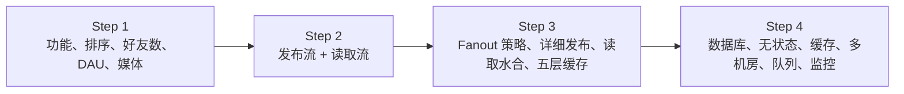
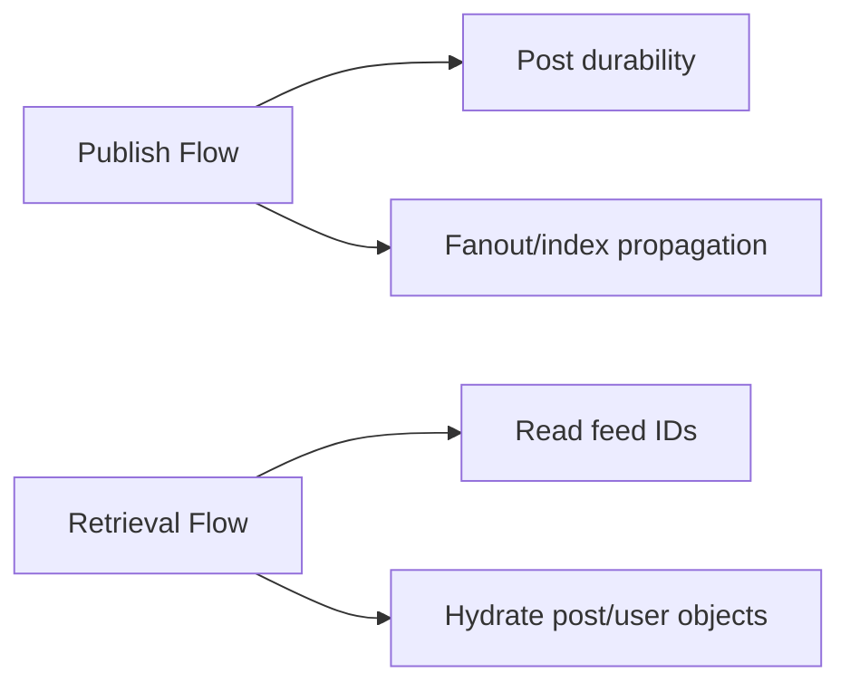
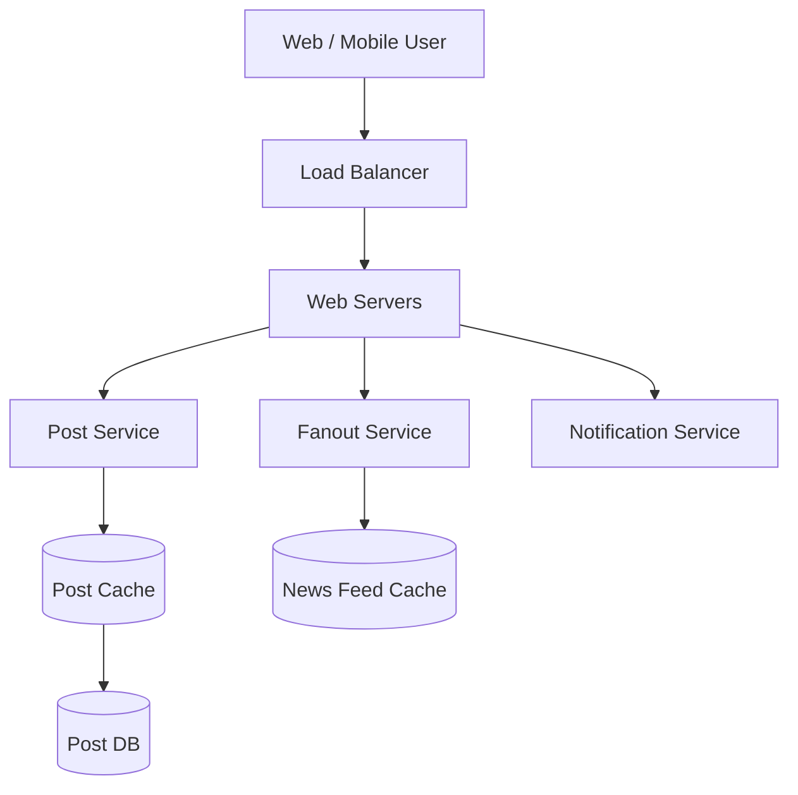
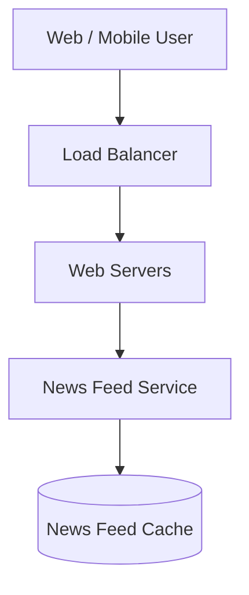
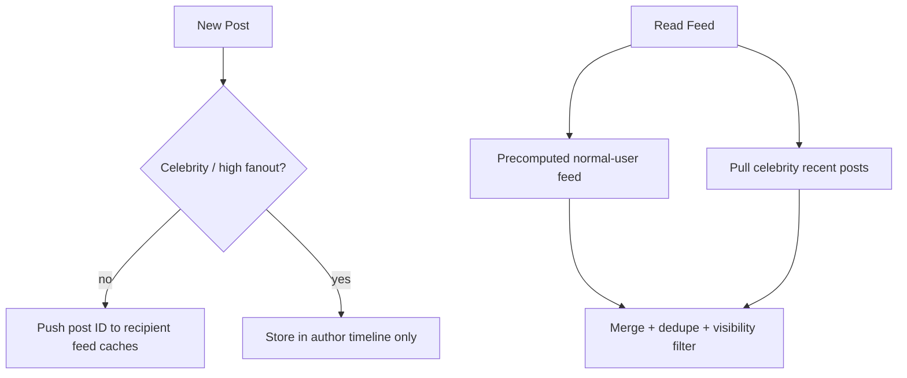
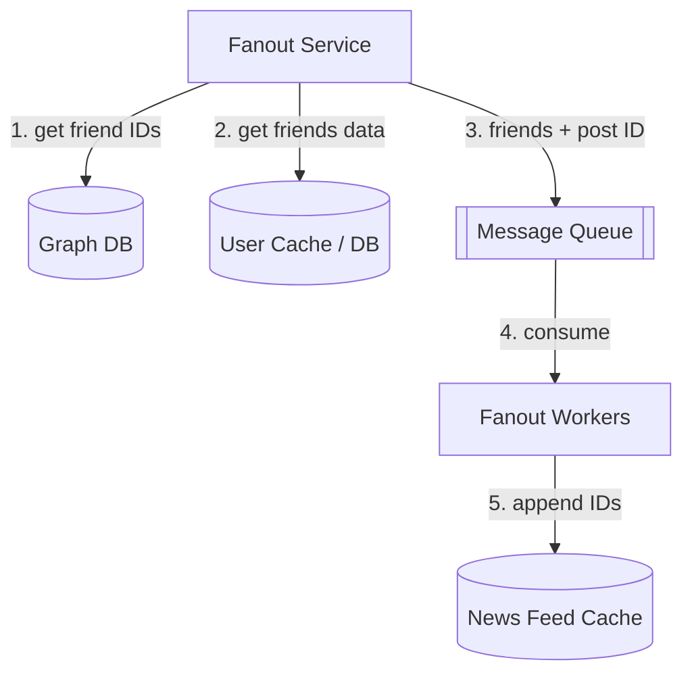
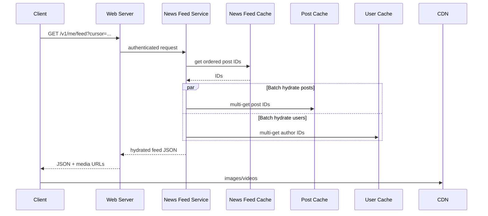
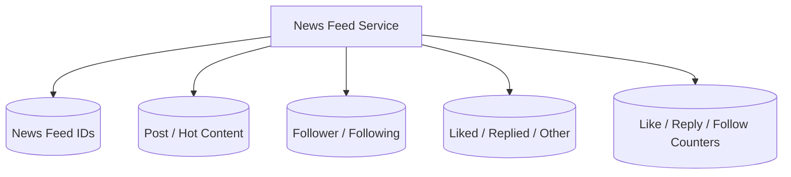
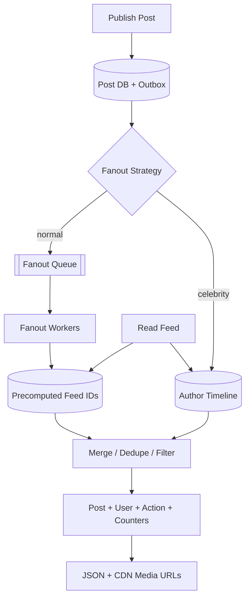

> 原书：Alex Xu，*System Design Interview: An Insider's Guide*（Second Edition）
> 原章：Chapter 11, *Design a News Feed System*
> 本章主线：先把新闻信息流问题收敛为 Web/移动端、发帖与查看朋友帖子、逆时间排序、最多 5000 个朋友、1000 万 DAU 和支持媒体；再把系统拆成发布与读取两条流；深入时比较写时 fanout 与读时 fanout，并选择“普通用户推、名人用户拉”的混合模式；发布侧通过社交图、用户设置、消息队列和 Fanout Worker 预计算每个用户的 post ID 列表，读取侧再从 Feed/Post/User Cache 批量水合 JSON，媒体由 CDN 交付，最终以五层缓存和可观测扩展完成系统闭环。

## 0. 学习目标、阅读边界与全章总览

新闻信息流（news feed）是持续更新的故事列表，可包含：

- 状态；
- 图片和视频；
- 链接；
- App 活动；
- 来自用户、页面和群组的互动。

类似面试题包括 Facebook News Feed、Instagram Feed、Twitter Timeline 等。

本章只设计一个简化版本：朋友帖子按逆时间顺序排列，不讨论复杂个性化排序。系统的核心矛盾是：

> 发帖很少、刷新很多；提前给每个收件人写好列表能让读取很快，却会产生巨大写放大，尤其是名人用户。

原章沿四步框架展开：



读完后，应当能够回答：

1. 为什么要把 feed publishing 与 feed retrieval 分成两条数据流？
2. 逆时间排序与个性化排序在系统复杂度上有何差异？
3. 写时 fanout 和读时 fanout 分别把计算成本放在哪里？
4. 为什么普通用户适合 push，而名人适合 pull？
5. 如何量化 fanout 写放大和读时多路归并成本？
6. Graph DB、User Cache、Message Queue 和 Fanout Worker 分别承担什么职责？
7. 隐私、mute 和分享范围为什么必须在 fanout/读取路径中检查？
8. Feed Cache 为什么只保存 ID，不保存完整 Post/User 对象？
9. 如何用 cursor 稳定分页，避免新帖子插入导致重复或遗漏？
10. 混合模式如何把预计算 feed 与名人实时帖子归并？
11. 删除、屏蔽和权限变化如何从数百万 Feed Cache 中撤销？
12. Queue 重试怎样避免同一 post ID 重复写入 feed？
13. News Feed、Content、Social Graph、Action、Counters 五层缓存为何分开？
14. 一致性哈希能解决什么热点，不能解决什么热点？
15. 如何监控“发布成功但朋友一直看不到”的异步传播问题？

本文严格沿原书顺序展开。原章没有正式容量估算与代码；本文补充的 QPS、fanout 写放大、缓存容量、$k$ 路归并、cursor、outbox、幂等、删除传播和可运行混合 feed 示例属于标准工程背景，不是作者逐式给出的原文。

---

## 1. Step 1：理解问题并确定范围

### 1.1 支持 Web 和移动端

两类客户端共享 HTTP API。媒体加载、分页和响应体要适应移动网络；后端核心业务不应绑定某一种客户端。

### 1.2 核心功能只有两项

原书确定：

1. 用户发布帖子；
2. 用户查看朋友帖子组成的信息流。

评论、广告、推荐、搜索、群组、故事和内容审核不在核心范围。范围越明确，深入方向越不会被无关功能稀释。

### 1.3 排序：逆时间顺序

设帖子排序键为：

$$
sortKey=(createdAt,postId)
$$

按二者降序：时间越新越靠前；`postId` 用于打破同毫秒平局。

个性化排序则需要：

- 用户/内容特征；
- 候选召回；
- 模型/规则打分；
- 在线推理；
- 实验与反馈。

原章明确选逆时间，因此不应在本次设计中深入 EdgeRank。

### 1.4 好友上限 5000

这个上限直接影响：

- 单次写 fanout 最大收件人数；
- 读时拉取的来源数；
- Graph DB 查询；
- 消息任务大小；
- 隐私过滤成本。

上限不代表平均值。容量估算必须同时假设平均好友数和名人关注者长尾。

### 1.5 1000 万 DAU

DAU 是活跃用户，不等于同时在线和 QPS。还需假设每人发帖/刷新频率。

为了建立数量级，本文采用教学假设：

```text
DAU = 10,000,000
posts/user/day = 2
feed reads/user/day = 20
peak factor = 5
average friends = 200
```

原书只给 DAU 与好友上限，这些补充数字不属于原文。

### 1.6 支持图片和视频

Post DB 保存媒体 metadata/URL，二进制对象放对象存储并经 CDN 交付。不能把完整视频复制进每位朋友的 Feed Cache。

### 1.7 还应澄清的问题

- 朋友关系是双向还是关注关系？
- Feed 可接受多少秒传播延迟？
- 发布者是否必须立刻看到自己的帖子？
- 删除/屏蔽后多久不可见？
- 是否支持私密、好友分组和地域限制？
- 用户可有多少关注者，是否存在名人？
- Feed 保留最近多少条？
- 是否跨数据中心？
- 是否允许重复或短暂旧数据？

这些条件决定 fanout、缓存一致性和故障降级。

---

## 2. 数量级估算：为什么读路径优先

### 2.1 发帖 QPS

$$
QPS_{post,avg}=\frac{10^7\times2}{86400}\approx231.5
$$

$$
QPS_{post,peak}\approx231.5\times5\approx1157.4
$$

### 2.2 Feed 读取 QPS

$$
QPS_{read,avg}=\frac{10^7\times20}{86400}\approx2314.8
$$

$$
QPS_{read,peak}\approx2314.8\times5\approx11574
$$

按假设，读取约是发布 10 倍，所以用写时计算换低读延迟有价值。

### 2.3 Fanout 写放大

平均朋友数 $F=200$：

$$
FeedWrites_{avg}\approx QPS_{post,avg}\times F
$$

$$
\approx231.5\times200\approx46,296\ \text{entries/s}
$$

峰值约：

$$
1157.4\times200\approx231,481\ \text{entries/s}
$$

用户有 5000 个朋友时，一条帖子就是 5000 次 feed append。名人若有 1000 万关注者，一条帖子产生 1000 万次写，说明统一 push 模式不可行。

### 2.4 Feed Cache 原始 ID 容量

若每位 DAU 缓存最近 $K=500$ 条，ID 8 bytes：

$$
10^7\times500\times8=40\ \text{GB}
$$

实际还包含：

- Redis key；
- sorted-set/list 结构；
- score/timestamp；
- allocator 碎片；
- 副本和余量。

物理内存可能是原始 ID 的数倍，但仍远小于复制完整帖子对象。

### 2.5 估算结论

- 读取多于发布，应优化低延迟读；
- 普通用户 push 可承受，但产生显著写放大；
- 名人必须特殊处理；
- Feed Cache 应保存紧凑 ID；
- Queue/Worker 必须承受数十万 entry writes/s；
- 平均 QPS 掩盖名人和热点内容。

---

## 3. Step 2：两条高层数据流

作者把系统分成：

### 3.1 Feed publishing

```text
用户发帖
→ Post Service 持久化帖子
→ Fanout Service 把 post ID 放入朋友 Feed Cache
→ Notification Service 可选提醒朋友
```

### 3.2 News feed building/retrieval

```text
用户刷新
→ News Feed Service 读取该用户的 feed IDs
→ 补全用户和帖子对象
→ 返回 JSON
```



分离的原因：

- 读写负载不同；
- 存储模型不同；
- 写入允许异步传播；
- 读取要求低延迟；
- 两条路径可独立扩容和降级。

---

## 4. News Feed APIs

### 4.1 Feed publishing API

原书：

```http
POST /v1/me/feed

content: post text
auth_token: authentication token
```

现代接口可把 token 放 Authorization header：

```http
POST /v1/me/feed
Authorization: Bearer <token>
Idempotency-Key: <request-id>
Content-Type: application/json

{
  "content": "Hello",
  "media_ids": ["media-123"],
  "visibility": "friends"
}
```

Token 不应放 query string，因为 URL 可能进入日志、浏览器历史和代理。

### 4.2 News feed retrieval API

原书：

```http
GET /v1/me/feed
auth_token: authentication token
```

补充分页：

```http
GET /v1/me/feed?cursor=<opaque>&limit=20
Authorization: Bearer <token>
```

响应包含 `next_cursor`。无限滚动不能一次返回全部 feed。

### 4.3 Cursor 而不是 offset

Offset 在新帖子插入时会移动：第 1 页加载后有新帖，`offset=20` 可能重复或遗漏。

Keyset cursor 保存上一页最后排序键：

$$
next: (createdAt,postId)<lastCursor
$$

Cursor 应签名/加密为不透明值，防客户端篡改内部排序状态。

---

## 5. Feed publishing 高层架构

原书 Figure 11-2：



### 5.1 Web Servers

- 认证；
- 限流；
- schema/媒体引用校验；
- 请求幂等；
- 路由到内部服务。

### 5.2 Post Service

- 分配 post ID；
- 持久化帖子 metadata；
- 更新/失效 Post Cache；
- 记录创建时间和可见性；
- 媒体只保存对象引用。

### 5.3 Fanout Service

把新 post ID 传播到符合可见性规则的收件人 feed index。

### 5.4 Notification Service

提醒朋友有新内容，但“Feed 中可见”和“发送 Push”是两个不同副作用：

- 用户可能关闭 Push，却仍应在 Feed 看到；
- Push 失败不应回滚帖子；
- 不应给每条普通帖子都推送通知；
- 通知有独立频控和偏好。

---

## 6. News feed building 高层架构

原书 Figure 11-3：



News Feed Cache 保存渲染所需 post IDs。高层图故意省略水合，在 Step 3 才加入 User/Post Cache 和 CDN。

### 6.1 为什么先返回 IDs

Feed 是排序/成员关系：

```text
user_id -> [(score, post_id), ...]
```

Post 内容与作者资料分别缓存。这样：

- 一份帖子内容供所有 Feed 共用；
- 作者头像更新无需改写所有 Feed；
- 删除可由 post 状态统一过滤；
- Feed entry 更小。

---

## 7. Step 3：Web 层认证与限流

原书先说明 Web Server：

- 只有有效 `auth_token` 用户可发帖；
- 限制用户在时间窗口内的发帖数量；
- 防 spam 和 abusive content。

还应增加：

- 幂等键防超时重试创建重复帖子；
- 内容大小与媒体数限制；
- 权限/账号状态；
- 反滥用和内容审核事件；
- 上传媒体必须先完成或处于可追踪状态。

认证回答“是谁”，限流回答“能多快”，内容审核回答“内容是否允许”，三者不能互相替代。

---

## 8. Fanout on write（Push model）

### 8.1 算法

发布时预计算：

```text
for each eligible follower/friend:
    append(post_id, created_at) to feed_cache[recipient]
```

### 8.2 原书优点

- 发布后可很快进入朋友 Feed；
- 读取只查预计算列表，延迟低。

### 8.3 原书缺点

- 好友/关注者很多时，获取列表和写所有 Feed 很慢，形成 hotkey/fanout hotspot；
- 为不活跃用户预计算浪费资源。

### 8.4 成本模型

作者 $a$ 的合格收件人数为 $F_a$：

$$
WriteAmplification(a)=F_a
$$

系统写入率：

$$
FeedEntryWrites=\sum_a PostRate_a\times F_a
$$

关注者分布通常是长尾，平均数无法描述最大值。一个名人发帖可能瞬间制造百万/千万任务。

### 8.5 适用场景

- 读多写少；
- 用户关系规模中等；
- 低读取延迟优先；
- 收件人活跃；
- 可接受秒级异步传播。

---

## 9. Fanout on read（Pull model）

### 9.1 算法

用户读取时：

1. 获取其关注源；
2. 各源读取近期帖子；
3. 多路归并；
4. 过滤可见性；
5. 选前 $K$ 条。

### 9.2 原书优点

- 不给不活跃用户预计算；
- 发布者无巨大 fanout 写热点。

### 9.3 原书缺点

- 读取慢，因为每次都要聚合。

### 9.4 $k$ 路归并

有 $F$ 个已按时间降序的帖子流，要取全局前 $K$ 条。用最大堆：

1. 每个流首项入堆；
2. 弹出最大项；
3. 把该流下一项入堆；
4. 重复 $K$ 次。

复杂度：

$$
O(F+K\log F)
$$

若先取每个源的 $K$ 条再全排序，候选可达 $FK$，成本更高。

### 9.5 适用场景

- 发布多、读取少；
- 用户大量不活跃；
- 名人关注者极多；
- 读取可承受更多计算；
- 需要高度实时、不愿维护大量 materialized feed。

---

## 10. 混合 Fanout

原书最终选择：

- 大多数用户：Push；
- 名人/高关注用户：Pull；
- 读取时把两类结果合并。



### 10.1 如何定义名人阈值

可基于：

- follower count；
- 估计 fanout cost；
- 发帖频率；
- follower 活跃率；
- Worker 当前负载；
- 传播 SLO。

教学化决策：当预计算成本超过预期读取聚合成本时改 pull：

$$
PostRate_a\times ActiveFollowers_a
>
FollowerReadRate_a\times MergeCost_a
$$

真实系统还要考虑延迟目标与缓存命中，不仅比较操作数。

### 10.2 切换策略的风险

用户从普通变名人时：

- 旧帖子已在部分 Feed；
- 新帖子改为 pull；
- 读取合并必须去重；
- 策略版本需随事件传递；
- 回切时不能重新推送重复内容。

因此 Feed entry key 应包含 `(recipient_id,post_id)` 并幂等。

### 10.3 一致性哈希的准确边界

原书说一致性哈希有助缓解 hotkey，因为能均匀分布请求/数据。准确地说：

- 能把不同用户 Feed key 分到不同 cache shard；
- 节点扩缩时减少重映射；
- 多个热点用户可统计分散。

但它不能把**一个名人的单次千万 fanout**自动变小，也不能拆散一个超级热 Feed key。仍需：

- 混合 fanout；
- 任务分片；
- 热 key 复制；
- 分页批处理；
- 局部缓存。

---

## 11. Fanout Service 详细流程

原书 Figure 11-5 的五步：



### 11.1 获取 friend IDs

Graph DB 适合管理关系与朋友推荐。对单向关注模型，更准确是 follower IDs。

需要：

- 分页读取超大关系列表；
- 关系版本；
- 屏蔽/删除；
- Graph Cache；
- 避免一次构造巨大消息。

### 11.2 从 User Cache 获取朋友信息并过滤

原书过滤：

- mute；
- 选择性分享；
- 对特定用户隐藏。

还可有：

- 封禁；
- 年龄/地域限制；
- 私密账户；
- 用户状态；
- 关系变化。

不要对 5000 个用户逐一 RPC，使用批量 multi-get 或把必要策略投影到关系缓存。

### 11.3 发消息队列

消息不应直接携带任意大的完整 friend list。可以拆批：

```text
FanoutTask {
  post_id,
  author_id,
  recipient_ids[0:batch_size],
  created_at,
  visibility_version,
  strategy_version
}
```

批次大小平衡：

- 消息开销；
- 重试粒度；
- Worker 内存；
- 单任务尾延迟。

### 11.4 Fanout Workers

Worker：

- 消费批次；
- 再次验证关键可见性或使用版本化快照；
- 批量写 Feed Cache；
- 裁剪每用户最近 $K$ 条；
- 记录传播指标；
- 重试失败分片。

### 11.5 Feed Cache 真实结构

原书称 `<post_id,user_id>` mapping，图中是两列关系。路由/读取角度更自然的结构：

```text
feed:{user_id} -> ordered [(created_at, post_id), ...]
```

即 `user_id` 是分区 key，post ID 是有序成员。可用 sorted set/list，自定义 score 处理同时间平局。

### 11.6 只保存 ID 和限制长度

原书理由：

- 完整 User/Post 对象重复导致巨大内存；
- 用户很少滚动数千条；
- 只保留最近内容，miss 概率低。

如果滚动超过缓存窗口，可：

- 从持久化 Feed Store 读取；
- 读时重建；
- 返回历史边界；
- 降级为作者 timeline 聚合。

---

## 12. 发布可靠性：Post 与 Fanout 的双写

原书图中 Post Service 持久化，Fanout Service 异步传播。潜在窗口：

```text
1. Post DB commit
2. publish fanout event
```

步骤 1 后崩溃会出现帖子存在却永不传播。

### 12.1 Transactional Outbox

在同一事务写：

```text
post row + outbox event
```

Relay 后台可靠发布队列。队列至少一次，Worker 必须幂等。

### 12.2 幂等 Feed 写入

唯一键：

$$
(recipientId,postId)
$$

重复任务执行 `insert-if-absent` 或 sorted-set add，不产生重复条目。

### 12.3 何时向发布者返回成功

合理边界：Post DB 与 outbox 持久化后返回，不等待所有 fanout 完成。

这意味着：

- 发布者快速成功；
- 朋友稍后可见；
- 系统需监控传播延迟；
- 发布者自己的 Feed 可同步插入，提供 read-your-writes。

---

## 13. 删除、屏蔽与权限变化

写时 fanout 产生大量派生索引。源帖子删除后不能只删 Post DB。

### 13.1 删除流程

```text
mark post deleted in authoritative store
→ invalidate Post Cache/CDN
→ publish delete event
→ asynchronously remove feed entries
```

读取水合时若发现 deleted，立即过滤，所以即使 Feed Cache 尚未清理也不展示。

### 13.2 Tombstone 与永久删除

短期保留删除标记，避免旧缓存/延迟任务把帖子“复活”。满足保留和复制窗口后才物理清除。

### 13.3 取消好友/屏蔽/隐私变化

预计算 Feed 可能含过去合法、现在不合法的条目。可组合：

- 关系变化事件异步清理；
- 读取时最终权限检查；
- 策略版本；
- 敏感内容不做长期预计算；
- 短 Feed Cache 窗口。

“fanout 时检查过”不能代替读取时的当前授权，尤其是封禁和私密内容。

---

## 14. Newsfeed retrieval 深入

原书 Figure 11-7 六步：

1. 用户请求 `/v1/me/feed`；
2. 负载均衡分配 Web Server；
3. Web Server 调 News Feed Service；
4. 从 News Feed Cache 取 post IDs；
5. 从 User/Post Cache 取完整对象，构造 fully hydrated feed；
6. 返回 JSON，媒体从 CDN 加载。



### 14.1 批量水合

错误 N+1：

```text
for each post:
  get post
  get author
```

20 条可能 40 次远程调用。应：

```text
post_ids = feed_cache.page(...)
posts = post_cache.multi_get(post_ids)
author_ids = unique(posts.author_id)
authors = user_cache.multi_get(author_ids)
```

Post/User Cache miss 再批量回源数据库。

### 14.2 过取候选

部分条目会因删除、屏蔽、权限而过滤。请求 20 条时可先取 30–40 个 IDs，过滤后补足 20，设最大扫描预算防异常 feed 无限回源。

### 14.3 混合 Feed 合并

读取时：

- 预计算 Feed IDs；
- 用户关注的名人近期帖子；
- 可选置顶/广告（原题不含）；
- 去重；
- 可见性过滤；
- 按 `(created_at,post_id)` 归并。

### 14.4 媒体走 CDN

API 只返回 media URL/metadata，客户端从 CDN 下载。这样：

- JSON 小；
- Web/Feed Service 不承担视频带宽；
- 边缘缓存降低延迟；
- 媒体可独立转码和权限签名。

私密媒体需短时签名 URL 或边缘鉴权，不能因为在 CDN 就公开。

---

## 15. 可运行示例：混合 Feed 的归并、去重与分页

下面代码演示：

- 普通作者帖子已在 precomputed feed；
- 名人帖子读取时拉取；
- 多路按 `(created_at,post_id)` 降序归并；
- 重复 post 去重；
- deleted/blocked 过滤；
- cursor 稳定读取下一页。

```python
from dataclasses import dataclass
from heapq import heappop, heappush
from typing import Iterable

@dataclass(frozen=True)
class PostRef:
    post_id: int
    author_id: int
    created_at: int
    deleted: bool = False

    @property
    def sort_key(self) -> tuple[int, int]:
        return (self.created_at, self.post_id)

def merge_feed_streams(
    streams: list[list[PostRef]],
    *,
    limit: int,
    cursor: tuple[int, int] | None = None,
    blocked_authors: set[int] | None = None,
) -> tuple[list[PostRef], tuple[int, int] | None]:
    blocked = blocked_authors or set()
    heap: list[tuple[int, int, int, int, PostRef]] = []

    for stream_index, stream in enumerate(streams):
        if stream:
            post = stream[0]
            heappush(
                heap,
                (-post.created_at, -post.post_id, stream_index, 0, post),
            )

    result: list[PostRef] = []
    seen_post_ids: set[int] = set()

    while heap and len(result) < limit:
        _, _, stream_index, item_index, post = heappop(heap)
        next_index = item_index + 1
        if next_index < len(streams[stream_index]):
            next_post = streams[stream_index][next_index]
            heappush(
                heap,
                (
                    -next_post.created_at,
                    -next_post.post_id,
                    stream_index,
                    next_index,
                    next_post,
                ),
            )

        if cursor is not None and post.sort_key >= cursor:
            continue
        if post.post_id in seen_post_ids:
            continue
        seen_post_ids.add(post.post_id)
        if post.deleted or post.author_id in blocked:
            continue
        result.append(post)

    next_cursor = None if not result else result[-1].sort_key
    return result, next_cursor

# Precomputed normal-user feed. Post 104 also appears in a celebrity stream,
# which can happen during a strategy transition and must be deduplicated.
precomputed = [
    PostRef(105, 10, 1005),
    PostRef(104, 20, 1004),
    PostRef(102, 30, 1002, deleted=True),
    PostRef(100, 40, 1000),
]
celebrity_a = [
    PostRef(106, 99, 1006),
    PostRef(104, 20, 1004),
    PostRef(101, 99, 1001),
]
celebrity_b = [
    PostRef(107, 77, 1007),
    PostRef(103, 77, 1003),
]

page_1, cursor = merge_feed_streams(
    [precomputed, celebrity_a, celebrity_b],
    limit=4,
    blocked_authors={77},
)
assert [post.post_id for post in page_1] == [106, 105, 104, 101]
assert cursor == (1001, 101)

page_2, next_cursor = merge_feed_streams(
    [precomputed, celebrity_a, celebrity_b],
    limit=4,
    cursor=cursor,
    blocked_authors={77},
)
assert [post.post_id for post in page_2] == [100]
assert next_cursor == (1000, 100)

print("page 1:", [post.post_id for post in page_1], "cursor:", cursor)
print("page 2:", [post.post_id for post in page_2], "cursor:", next_cursor)
```

复杂度：有 $F$ 个流，返回 $K$ 条：

$$
O(F+S\log F)
$$

$S\ge K$ 是为过滤/去重实际扫描的候选数。若大量候选无效，必须设置扫描上限并继续取下一批。

---

## 16. 五层缓存架构

原书 Figure 11-8 把缓存分为五层。

### 16.1 News Feed Cache

保存每用户有序 post IDs：

```text
feed:{user_id} -> [(score,post_id), ...]
```

优化分页和读取，不保存完整对象。

### 16.2 Content Cache

- 普通 Post Cache；
- 热内容 Hot Cache。

同一热门帖子被大量用户水合，Hot Cache 可复制到多个节点或本地缓存，避免单 key 热点。

### 16.3 Social Graph Cache

- follower；
- following；
- friend relationship；
- mute/block/visibility 投影。

服务 fanout 和读取权限。关系写入频率低于读取，但变更后的隐私传播要求高。

### 16.4 Action Cache

保存某用户是否：

- liked；
- replied；
- 采取其他动作。

这是 user-post 二元状态，不能仅靠全局计数推导。

### 16.5 Counters Cache

- like count；
- reply count；
- follower/following count。

计数可异步聚合、短暂最终一致。必须防热门帖子单计数 key 写热点，可分片计数后汇总。

### 16.6 为什么分层

| 层 | Key 形态 | 一致性/TTL | 访问模式 |
|---|---|---|---|
| Feed | user → ordered post IDs | 秒级传播 | 分页范围读/append |
| Content | post → object | 删除需失效 | 高频 point read |
| Graph | user → relations | 隐私变化敏感 | 批量关系读 |
| Action | user+post → state | 用户交互更新 | 多 key point read |
| Counter | post/user → number | 可短暂旧 | 高频增量/读 |

不同数据生命周期和数据结构不同，拆层便于独立扩容、淘汰和一致性策略。



---

## 17. 缓存故障与降级

### 17.1 Feed Cache miss

可选：

- 从持久 Feed Store 恢复；
- 读时聚合近期作者 timeline；
- 返回部分 Feed；
- 后台异步重建。

不能让所有 miss 同时全量扫描 5000 个好友，需限流和请求合并。

### 17.2 Post/User Cache miss

批量查数据库并回填，设置回源并发上限。不存在/删除对象短期负缓存，避免重复穿透。

### 17.3 Cache 节点故障

- 多副本/分片；
- 一致性哈希减少重映射；
- 热 key 复制；
- TTL 抖动；
- 数据库熔断；
- 预热和渐进流量。

### 17.4 缓存是派生状态

Post DB、Graph DB、用户设置等是权威来源；Feed Cache 可重建。只有缓存没有持久源时，节点故障会永久丢 Feed。

---

## 18. 排序、分页与一致性边界

### 18.1 逆时间排序不是全局时钟真相

多数据中心时钟有偏差，`created_at` 可能乱序。可使用：

- 具有时间成分的全局 ID；
- 服务端统一时间；
- Hybrid Logical Clock；
- `(timestamp,post_id)` 稳定排序。

Feed 产品通常接受小幅时间排序误差，但不能出现页面内不稳定重复。

### 18.2 Cursor 的一致性

Cursor 后插入的新帖子不应出现在下一页旧区间；用户刷新顶部时再获取新内容。

若帖子删除，下一页条数不足可过取候选。Cursor 不能仅用非唯一 timestamp。

### 18.3 最终一致

发布后传播需要队列时间，朋友可能数秒后看到。应定义：

- 发布者 read-your-writes；
- P99 fanout propagation lag；
- 删除/屏蔽传播 SLO；
- Queue backlog 时的降级。

### 18.4 重复与顺序

至少一次消息可能重复；队列分区可能乱序。Feed entry 幂等且按 score 排序，不依赖消息到达顺序。

---

## 19. Step 4：数据库扩展

原书列出：

- Vertical vs Horizontal scaling；
- SQL vs NoSQL；
- Master-slave replication；
- Read replicas；
- Consistency models；
- Sharding。

### 19.1 Post Store

按 post ID 或 author ID 分片：

- post ID point lookup 适合水合；
- author ID 共置 timeline，适合 pull；
- 可维护 `author timeline` 专用索引。

### 19.2 Graph Store

关系查询、分页 follower list、共同好友和推荐可使用图数据库或分片 adjacency lists。Graph DB 不是因为名字叫“图”就自动适合所有规模，需按核心查询和运维能力选择。

### 19.3 Feed Store

Feed Cache 之外可有持久 Feed Store，按 recipient user ID 分片。写时 fanout 是 materialized view，允许通过源 Post/Graph 重建。

### 19.4 复制和一致性

- Post 创建需持久确认；
- Feed 索引可最终一致；
- 计数可更弱一致；
- 隐私/屏蔽读取应强于普通 Feed 新鲜度；
- 只读副本延迟不能导致已删除敏感内容持续展示。

---

## 20. Step 4：系统级扩展与运行

### 20.1 无状态 Web/Feed Service

会话和 Feed 状态放共享存储，节点可自动扩缩。客户端任意路由。

### 20.2 尽可能缓存

应理解为缓存高价值、可重建、读多写少数据，而不是无差别缓存一切。隐私状态和删除必须有主动失效。

### 20.3 多数据中心

- 就近读取；
- Post/Graph 跨地域复制；
- Feed Cache 可地域本地重建；
- 用户 home region 降低写冲突；
- 全球名人帖子在各地域 pull/cache；
- 机房故障需剩余容量。

### 20.4 Message Queue 松耦合

原书原文写 “Lose couple”，应理解为 **loosely couple**。队列解耦 Post Commit 与 Fanout，但引入：

- 至少一次；
- 幂等；
- backlog；
- retry/DLQ；
- 分区顺序；
- 传播延迟。

### 20.5 监控关键指标

原书点名峰值 QPS 和刷新延迟。完整指标：

**发布**

- post success/error；
- P99 publish latency；
- outbox 未发布数；
- fanout tasks/s；
- fanout recipients/s；
- propagation lag P50/P99；
- Queue oldest age/DLQ。

**读取**

- feed read QPS；
- P50/P95/P99；
- Feed/Post/User Cache hit；
- hydration batch size；
- 候选过滤率；
- empty/partial feed rate；
- cursor errors。

**热点与成本**

- top author fanout；
- hot feed/content key；
- per-shard CPU/memory/QPS；
- celebrity pull merge latency；
- CDN hit；
- cache bytes/user。

**正确性**

- duplicate feed entries；
- deleted/blocked leakage；
- publish-to-visible lag；
- missing feed audit sample；
- strategy transition duplicate rate。

---

## 21. Step 4：没有完美方案

原书强调每家公司约束不同。设计必须回答：

- 用户关系分布；
- 活跃率；
- 读写比；
- 新鲜度目标；
- 个性化需求；
- 隐私与法规；
- 成本和团队能力。

只背“混合 fanout + Redis”不是完整答案。混合阈值、持久源、删除、幂等和监控才把它变成可运行系统。

---

## 22. 容易混淆的概念与常见误区

### 22.1 News Feed 与 Notification

Feed 是用户主动打开的内容列表；Notification 是主动提醒。帖子可进入 Feed 而不发 Push。

### 22.2 Fanout on write 与同步等待

写时 fanout 表示发布阶段预计算，不要求 HTTP 请求同步等全部收件人写完。通常由队列异步完成。

### 22.3 Fanout on read 与完全不缓存

Pull 结果、作者 timeline 和热门帖子仍可缓存。区别是何时计算收件人 Feed。

### 22.4 Push model 与移动 Push Notification

Fanout push 指推送 post ID 到 Feed Cache，不是 APNs/FCM 通知。

### 22.5 Hotkey 与名人 fanout

名人问题既可能是一个作者关系 key 很热，也可能是单事件产生巨大写放大。只做一致性哈希不能消除后者。

### 22.6 Consistent hashing 与单 key 分散

一致性哈希把不同 key 分到节点，并减少扩缩容迁移；同一个 key 通常仍有一个 owner。超级热 key 需复制/拆分。

### 22.7 Feed Cache 的 `<post_id,user_id>`

原书用关系表表达 fanout entry；实际读取通常按 `user_id` 分区，保存有序 post IDs，不是按 post ID 扫全表。

### 22.8 Feed Cache 与 Post Cache

- Feed Cache：谁该看到哪些帖子及顺序；
- Post Cache：帖子具体内容；
- 分开避免完整内容复制到每个用户。

### 22.9 只存 ID 就没有一致性问题

删除、屏蔽、隐私变化仍会让旧 ID 留在 Feed；读取水合必须过滤，后台再清理。

### 22.10 Reverse chronological 与严格事件顺序

物理时钟偏差会造成轻微乱序。稳定排序键不等于分布式因果顺序。

### 22.11 Offset 与 Cursor

动态 Feed 中 offset 容易重复/遗漏；cursor 按稳定 keyset 继续。Cursor 也需版本和签名。

### 22.12 平均好友数与最大 fanout

平均值用于总容量，长尾/名人决定峰值和故障风险。只看平均会严重低估热点。

### 22.13 Queue 就保证不丢

Post DB 与 publish queue 有双写窗口。需要 outbox；队列重复又要求 Worker 幂等。

### 22.14 发布成功与所有朋友立即可见

成功通常表示 Post/outbox 持久化；朋友可见是异步 SLO。API 要定义语义。

### 22.15 用户设置只在 fanout 时检查

关系和隐私会变化。敏感内容读取时仍需当前权限检查。

### 22.16 预计算所有不活跃用户总是值得

不活跃用户可能永不读取，浪费写和内存。可按活跃度选择 push/pull 或让 Feed 过期。

### 22.17 完整对象放 Feed Cache 更快

读取少一步，但内存和失效成本巨大，作者资料/帖子更新需复制修改。ID + 批量水合更平衡。

### 22.18 五层缓存等于五个物理集群

这是逻辑职责划分。可共享基础设施，也可因数据结构、SLO 和热点拆为物理集群。

### 22.19 Counter 等于 Action

Counter 是聚合数；Action 是某用户对某帖是否操作。`like_count=100` 不能回答“用户 42 是否点赞”。

### 22.20 CDN 可以缓存私密媒体而无需鉴权

错误。私密内容需要签名 URL、边缘鉴权和正确缓存 key。

### 22.21 混合策略自动最优

阈值错误、策略切换、去重和读时合并都增加复杂度。小系统可能纯 push 或纯 pull 更简单。

### 22.22 缓存越多越好

缓存增加陈旧、失效、成本和故障回源风险。应按命中收益和正确性选择。

---

## 23. 本章知识结构

### 23.1 需求层

- Web + Mobile；
- 发帖 + 查看朋友 Feed；
- 逆时间排序；
- 最多 5000 朋友；
- 10M DAU；
- 图片/视频。

### 23.2 两条流

- Publishing：Post durability → fanout → optional notification；
- Retrieval：Feed IDs → Post/User hydration → JSON/CDN。

### 23.3 Fanout 层

- Push：写放大换低读延迟；
- Pull：低写成本换读时聚合；
- Hybrid：普通用户 push，名人 pull；
- Queue + Worker 异步批量和幂等。

### 23.4 数据与缓存层

- Post DB/Cache；
- Graph DB/User Cache；
- Feed Store/Cache；
- Content/Social Graph/Action/Counters；
- Object Storage/CDN。

### 23.5 正确性与运行层

- Outbox；
- read-your-writes；
- 删除/屏蔽/隐私过滤；
- cursor；
- cache failure/rebuild；
- propagation lag、热点和成本监控。



---

## 24. 核心结论与一般设计方法

### 24.1 核心结论

1. **新闻信息流应拆成发布和读取两条流。** 二者负载、延迟和数据模型不同。
2. **范围决定复杂度。** 逆时间排序不需要个性化排名系统，但仍需要稳定排序和分页。
3. **写时 fanout 用写放大换低读延迟。** 适合读多写少和普通关系规模。
4. **读时 fanout 避免不活跃预计算和名人写爆炸。** 代价是多路归并和较高读延迟。
5. **混合 fanout 针对长尾关系分布。** 普通用户 push、名人 pull，读取时归并和去重。
6. **一致性哈希不能单独解决名人 fanout。** 它分散不同 key，不减少单事件收件人数。
7. **Feed Cache 应保存有序 ID，而非完整对象。** 水合时批量读取 Post/User Cache，媒体走 CDN。
8. **Queue 解耦发布和传播，但引入至少一次与传播延迟。** Outbox 和幂等 entry 是可靠性基础。
9. **可见性不是一次性判断。** Mute、block、删除和隐私变化要求异步清理加读取时过滤。
10. **Cursor 是动态 Feed 分页的正确基础。** 必须使用唯一稳定排序键。
11. **五层缓存对应五种数据语义。** Feed、Content、Graph、Action、Counter 的 key、TTL 和一致性不同。
12. **Cache 是派生加速状态。** 必须能从 Post/Graph/Feed Store 重建并控制故障回源。
13. **发布成功与朋友可见是不同 SLO。** 应监控 publish-to-visible propagation lag。
14. **没有脱离业务分布的最佳方案。** 活跃度、关系长尾、新鲜度、隐私和成本共同决定策略。

### 24.2 一般设计流程

$$
\boxed{
\text{澄清关系、排序、规模、媒体与新鲜度}
\rightarrow
\text{拆分发布和读取路径}
\rightarrow
\text{估算读写比与 fanout 放大}
\rightarrow
\text{选择 push/pull/hybrid}
\rightarrow
\text{持久化帖子并可靠发布 fanout 事件}
\rightarrow
\text{幂等维护每用户 Feed IDs}
\rightarrow
\text{读取时归并、过滤、批量水合和分页}
\rightarrow
\text{分层缓存、删除传播和故障重建}
\rightarrow
\text{监控传播延迟、热点、命中率与正确性}
}
$$

### 24.3 面试中的完整表达骨架

> 需求是 Web/Mobile、发帖和查看朋友 Feed、逆时间排序、10M DAU、最多 5000 朋友并支持媒体。假设每人每天发 2 帖、刷新 20 次，平均写约 231 QPS、读约 2315 QPS，读写比约 10:1；平均 200 朋友使 fanout 约 4.6 万 entries/s，名人则可能一帖千万写。因此 Post Service 先把 Post 与 outbox 原子持久化，普通作者事件进入 Queue，由 Worker 批量、幂等地把 `(created_at,post_id)` 写入各 `feed:{user_id}`；名人只写 author timeline，读取时拉取并与预计算 Feed 做 $k$ 路归并、去重和权限过滤。Feed Cache 只存最近 $K$ 个 IDs，News Feed Service 用 cursor 分页，批量 multi-get Post/User/Action/Counter Cache，媒体由 CDN 加载。发布者同步插入自己的 Feed 提供 read-your-writes，朋友看到由 P99 propagation lag 约束。删除/屏蔽先更新权威状态和失效 Post Cache，读取立即过滤，后台再清 Feed。Queue 至少一次，所以 entry 以 `(recipient_id,post_id)` 幂等。最后监控发布/读取 P99、Queue oldest age、fanout recipients/s、缓存命中、名人 merge 延迟、deleted leakage 和热点 shard。

### 24.4 章末自检

- [ ] 能否复述 Step 1 的六项需求？
- [ ] 能否分别推导发帖/读取 QPS 和 fanout entry rate？
- [ ] 能否解释为何发布与读取要拆成两条流？
- [ ] 能否列出原书发布和读取 API？
- [ ] 能否比较 push/pull 的成本与适用条件？
- [ ] 能否用 $O(F+K\log F)$ 解释读时归并？
- [ ] 能否说明混合策略如何处理名人？
- [ ] 能否解释一致性哈希为什么不能消除单名人 fanout？
- [ ] 能否完整讲出 Fanout Service 的五步？
- [ ] 能否说明 Graph DB 和 User Cache 的不同职责？
- [ ] 能否设计批量 FanoutTask 和幂等 Feed entry？
- [ ] 能否解释为什么 Feed Cache 只保存 ID？
- [ ] 能否处理 Post DB 与 Queue 的双写窗口？
- [ ] 能否设计删除、屏蔽和隐私变化的即时过滤与后台清理？
- [ ] 能否完整描述读取的六步水合流程？
- [ ] 能否用 cursor 避免动态 Feed 的 offset 问题？
- [ ] 能否列出五层缓存及其数据语义？
- [ ] 能否处理 Feed/Post/User Cache miss 和故障回源？
- [ ] 能否设计多数据中心下的 Feed Cache 与名人内容策略？
- [ ] 能否列出传播延迟、热点、命中率和正确性指标？

如果这些问题都能回答，就不只是记住了“推模式和拉模式”，而是理解了本章的核心方法：**把信息流视为由权威帖子与社交关系派生出的、面向每个收件人的有序索引；根据关系分布和活跃度决定在写时还是读时计算，再用异步物化、批量水合、权限校验和分层缓存，在写放大、读延迟、新鲜度与成本之间取得可观察的平衡。**
