> 原书：Alex Xu，*System Design Interview: An Insider's Guide*（Second Edition）
> 原章：Chapter 12, *Design a Chat System*
> 本章主线：先把开放题收敛为 5000 万 DAU、Web/移动端、低延迟 1 对 1、小群聊、多设备、在线状态、Push 通知、纯文本和永久历史；再比较 polling、long polling 与 WebSocket，选择持久双向 WebSocket 承担实时消息，并让登录/资料等仍走 HTTP；高层上分离无状态 API、有状态 Chat/Presence 服务、通知服务和 KV 历史存储；深入时通过服务发现选择连接节点，依次走通 1 对 1、多设备增量同步、小群 inbox fanout 与 heartbeat Presence，最后讨论媒体、端到端加密、客户端缓存、地域边缘和故障重连。

## 0. 学习目标、阅读边界与全章总览

聊天系统看似只是“用户 A 发一句话给用户 B”，但必须同时管理：

- 数百万长期连接；
- 低延迟双向通信；
- 消息持久化与离线补拉；
- 同一账户多设备游标；
- 会话内顺序与重复重试；
- 小群 fanout；
- 在线/离线状态的抖动与广播；
- Chat Server 故障后的重连；
- Push 通知；
- 永久历史和冷热数据。

本章最关键的概念边界是五个不同状态：

| 状态 | 含义 |
|---|---|
| Connected | 某设备与 Chat Server 的 WebSocket 存在 |
| Online | Presence 策略判断用户当前在线 |
| Persisted | 消息已进入持久存储 |
| Delivered | 某设备已收到消息 |
| Read | 用户已确认读到消息 |

它们不能用一个 `status=online/sent` 覆盖。

原章按四步框架展开：

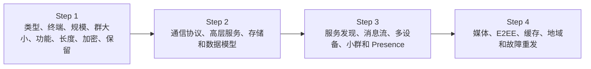

读完后，应当能够回答：

1. Polling、long polling 和 WebSocket 分别如何工作，为什么最终选 WebSocket？
2. 为什么不是所有 API 都改成 WebSocket？
3. Chat Server 为什么是有状态服务，API Server 为什么可无状态扩展？
4. 5000 万 DAU 怎样转化为并发连接、内存、心跳和消息吞吐？
5. 为什么聊天历史适合 KV/宽列存储，而用户资料仍适合关系库？
6. 1 对 1 与群聊应怎样选择 partition key 和排序键？
7. 为什么 `created_at` 不能单独决定消息顺序？
8. 全局 Snowflake 与会话内 local sequence 各适合什么语义？
9. 服务发现如何按地域和容量选择 Chat Server？
10. 一条消息在持久化、在线转发和离线 Push 间如何流动？
11. 多设备 `cur_max_message_id` 有什么前提和局限？
12. 小群为什么适合每用户 inbox fanout，大群为什么不适合？
13. 网络抖动时为什么不能断开一次就立即显示离线？
14. Heartbeat 间隔和离线阈值怎样影响负载与检测延迟？
15. Presence fanout 为什么对好友列表可行，却不能直接扩展到 10 万人大群？
16. Chat Server 宕机后如何避免丢消息、重复消息和顺序混乱？
17. “发送成功”应定义在 WebSocket 收到、服务器持久化还是对端收到？

本文严格沿原书顺序展开。补充的连接/存储估算、消息状态机、幂等、outbox、ack/read receipt、session cursor、租约/fencing、背压与可运行示例属于标准工程背景，不是作者逐式给出的原文。

---

## 1. Step 1：理解问题并确定范围

作者先强调：聊天产品差异很大，必须明确是 1 对 1、办公群聊还是低延迟大群语音。本章最终设计类似 Facebook Messenger。

### 1.1 支持 1 对 1 和群聊

- 1 对 1：每条消息只面向一个对端用户，但双方可能各有多台设备；
- 小群：每组最多 100 人，可将消息 fanout 到各成员 inbox；
- 超大群/频道：本章不设计，不能沿用逐成员复制。

### 1.2 Web 与移动端

都要支持：

- 长连接；
- 断线重连；
- 离线同步；
- 多设备游标；
- Push（移动端）；
- 客户端缓存。

移动网络更频繁切换、休眠与断连，Presence 不能只看 TCP 断开事件。

### 1.3 5000 万 DAU

DAU 不等于并发连接。若峰值 10% DAU 在线：

$$
ConcurrentUsers=50,000,000\times10\%=5,000,000
$$

若平均每在线用户 1.4 个设备连接：

$$
Connections=5,000,000\times1.4=7,000,000
$$

这些是教学假设，不属于原书。

### 1.4 小群最多 100 人

发送者以外最多 99 个收件人，因此每消息 inbox fanout 上界约：

$$
FanoutCopies=G-1\le99
$$

这个产品限制是原书选择逐成员 inbox 模型的重要前提。

### 1.5 功能范围

原书重点：

- 低延迟 1 对 1；
- 小群；
- 在线状态；
- 多设备；
- Push 通知；
- 纯文本。

暂不支持媒体，端到端加密只在收尾讨论。

### 1.6 文本上限 100,000 characters

字符数不等于 bytes。UTF-8 中：

- ASCII 常 1 byte；
- 中文常 3 bytes；
- emoji 常 4 bytes；
- 组合字符更复杂。

最坏按 4 bytes/code point，100,000 字符约 400 KB，已经不像普通短消息。API 需同时限制：

```text
max Unicode scalars / grapheme clusters
max UTF-8 bytes
max compressed/decompressed size
```

原书只给字符上限，实际容量必须按 bytes 估算。

### 1.7 暂不要求端到端加密

这使服务端可以：

- 读取/审核内容；
- 服务端搜索；
- 多设备历史直接从服务器恢复；
- Push 显示消息预览。

若加入 E2EE，密钥、设备信任、群成员变化、搜索和多设备恢复都会改变，Step 4 再讨论。

### 1.8 聊天历史永久保存

“Forever”意味着数据只增不减，必须：

- 分区；
- 冷热分层；
- 压缩；
- 生命周期和隐私删除例外；
- 备份/复制；
- 历史随机访问。

法律上的删除权可能与“永久保存”冲突，实际需求应澄清。

### 1.9 还应补问的边界

- 每用户每天消息数和峰值？
- 消息送达/已读回执？
- 是否允许编辑、撤回、删除？
- 会话内严格顺序还是最终顺序？
- 消息是否允许重复？
- 离线多久、历史分页大小？
- Push 内容能否显示明文？
- 多数据中心和数据驻留？
- 群成员变化的消息可见范围？
- 允许多少设备同时登录？

---

## 2. 容量与数量级

原书在高层部分给出一个连接内存示例：100 万连接，每连接约 10 KB，需要约 10 GB。

### 2.1 连接内存

$$
Memory=Connections\times BytesPerConnection
$$

原书：

$$
10^6\times10\ \text{KB}=10\ \text{GB}
$$

前述教学假设 700 万连接：

$$
7\times10^6\times10\ \text{KB}=70\ \text{GB}
$$

但连接容量不只看内存，还受：

- 文件描述符；
- event loop；
- TLS 状态；
- socket buffer；
- 心跳；
- 出站队列；
- CPU 与网络；
- GC 和语言运行时。

即使一台超大服务器“装得下”，单点故障、发布和容量余量仍不可接受。

### 2.2 消息吞吐教学估算

假设 5000 万 DAU，每人每天发送 40 条：

$$
Messages_{day}=50\times10^6\times40=2\times10^9
$$

$$
QPS_{avg}=\frac{2\times10^9}{86400}\approx23,148
$$

峰均比 5：

$$
QPS_{peak}\approx115,741
$$

原书引用历史研究：Messenger + WhatsApp 合计约 600 亿消息/天，用于说明真实聊天数据量极大，不是本题系统的精确输入。

### 2.3 存储教学估算

若平均消息记录（文本、索引和元数据的逻辑大小）为 500 bytes：

$$
Storage_{day}=2\times10^9\times500
=10^{12}\ \text{bytes}=1\ \text{TB/day}
$$

一年约 365 TB，三副本约 1.095 PB，尚未算索引、备份和大消息。若平均接近上限，容量会完全不同，因此必须按真实分布而不是最大值估算平均存储。

### 2.4 心跳吞吐

700 万连接，每 5 秒心跳：

$$
HeartbeatQPS=\frac{7,000,000}{5}=1,400,000
$$

Presence 心跳可能比聊天消息 QPS 更高。应尽量：

- 在连接节点本地聚合；
- 批量更新 Presence；
- 避免每次 heartbeat 同步写持久数据库；
- 使用 TTL/租约语义。

---

## 3. Step 2：聊天服务的三项基本职责

客户端不直接互连，而是连接 Chat Service。服务必须：

1. 接收客户端消息；
2. 找到正确收件人并转发；
3. 收件人离线时持久保存，待上线同步。

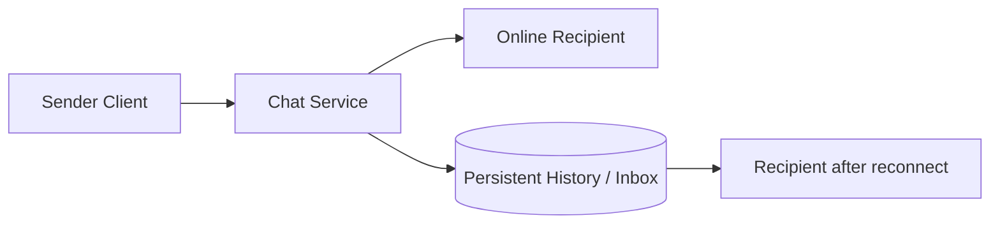

这三项分别对应入口协议、连接路由和持久化同步。

---

## 4. Sender 侧：HTTP 为什么可以工作

发送消息是客户端发起，请求/响应 HTTP 很自然：

```http
POST /v1/messages
Authorization: Bearer <token>
Idempotency-Key: <client_message_id>

{
  "conversation_id": "c-123",
  "content": "hello"
}
```

HTTP keep-alive 减少 TCP 握手。原书指出 Facebook 早期曾用 HTTP 发送。

但接收侧需要服务器主动推送；传统 HTTP 是客户端发起，因此要比较 polling、long polling 和 WebSocket。

---

## 5. Polling

### 5.1 工作方式

客户端每隔 $T$ 秒询问：

```text
GET /messages?after=cursor
```

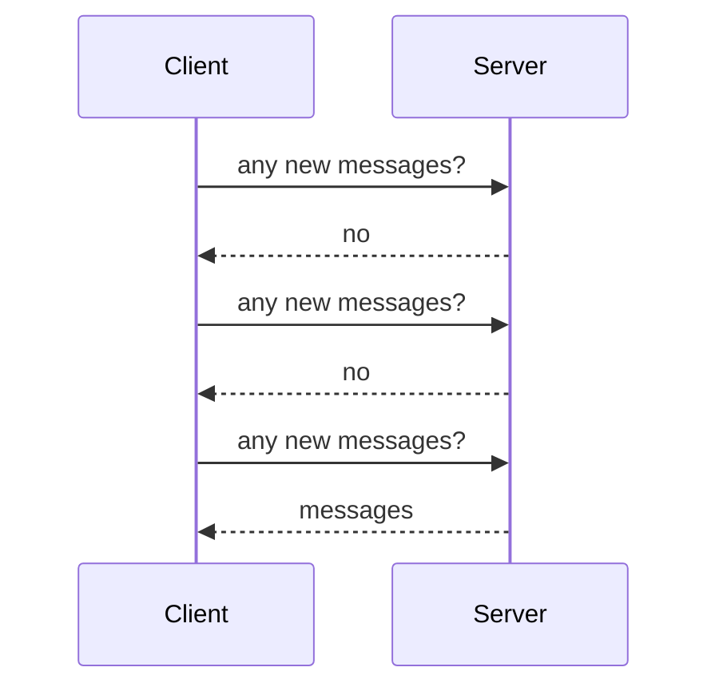

### 5.2 请求成本

$N$ 个在线客户端，间隔 $T$：

$$
PollingQPS=\frac{N}{T}
$$

500 万在线、每 5 秒轮询：

$$
PollingQPS=1,000,000
$$

大多数响应可能是空，浪费连接、CPU、带宽和电量。

### 5.3 延迟

消息随机到达轮询区间，平均额外等待约：

$$
E[delay]\approx\frac{T}{2}
$$

缩短 $T$ 降低延迟，却按反比增加请求量。

### 5.4 适用范围

低频更新、客户端数量小、实现简单优先时可用，不适合 5000 万 DAU 低延迟聊天。

---

## 6. Long Polling

### 6.1 工作方式

客户端发请求后，服务器保持连接，直到：

- 有新消息；或
- 超时。

响应后客户端立即再建立下一次 long poll。

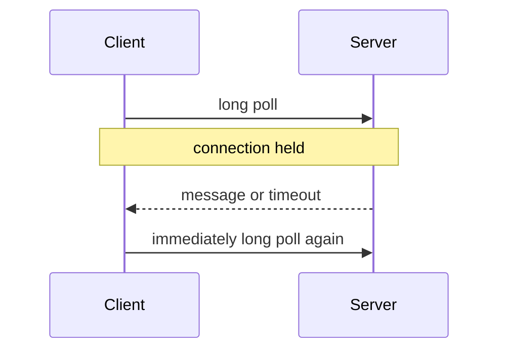

空响应比短轮询少，但仍有周期重连和连接状态。

### 6.2 原书三个缺点

**发送与接收落在不同服务器**

Round-robin 无状态 HTTP 路由下，收到消息的服务器未必持有收件人的 long-poll connection，需要额外 connection registry/消息路由。

**难判断断连**

连接等待中，客户端是否真正离线需要超时/心跳，不能只看请求存在。

**低活跃用户仍周期重连**

每次 timeout 后继续连接，仍有开销。

### 6.3 不是“不能扩展”

Long polling 可通过异步服务器和路由系统大规模部署，在单向低频通知中很合适（如第 15 章文件变化通知）。本题是持续双向聊天，WebSocket 更自然。

---

## 7. WebSocket

### 7.1 握手与性质

WebSocket 由客户端从 HTTP 发起 Upgrade：

```text
HTTP connection
→ Upgrade handshake
→ persistent bidirectional WebSocket
```

使用 80/443，通常可穿过防火墙和代理。连接建立后，客户端和服务器都能主动发送 frame。

### 7.2 为什么发送和接收都用 WebSocket

发送侧虽然可用 HTTP，但 WebSocket 已存在且双向：

- 统一消息协议；
- 减少两套发送路径；
- 复用连接；
- 低延迟 ack；
- 简化客户端状态。

原书最终用 WebSocket 同时发送/接收。

### 7.3 持久连接的新成本

- Chat Server 有状态；
- 连接不能任意 round-robin 迁移；
- 发布/扩容要 drain；
- 需要 connection registry；
- 慢客户端出站 buffer 会增长；
- heartbeat 与 idle timeout；
- 重连与 resume cursor；
- 单节点故障会断开大量连接。

### 7.4 背压

服务器产生消息速度大于客户端网络发送速度时：

$$
\Delta buffer=(productionRate-consumptionRate)\Delta t
$$

必须限制每连接 buffer：

- 超过阈值断开并让客户端补拉；
- 合并可丢 Presence 事件；
- 消息正文先持久化，WebSocket 只推通知/引用；
- 不让一个慢客户端拖垮 event loop。

### 7.5 WebSocket 不替代所有 HTTP

登录、注册、资料、好友管理等天然 request/response，继续用 HTTP。协议按交互模式选择，不为技术统一而统一。

---

## 8. 高层架构：无状态、有状态与第三方

原书将系统分三类。

### 8.1 Stateless Services

- 登录；
- 注册；
- 用户资料；
- 好友管理；
- Service Discovery API。

位于 Load Balancer 后，可单体或微服务。无本地会话依赖，可水平扩展。

### 8.2 Stateful Chat Service

每个客户端与某 Chat Server 维持 WebSocket；只要服务器健康，通常不切换。

状态包括：

- socket；
- user/device/session；
- 鉴权上下文；
- 出站 buffer；
- heartbeat；
- last acknowledged cursor。

Service Discovery 要考虑连接数和容量，避免过载节点。

### 8.3 Third-party Push

App 未运行或用户离线时，通过 Notification Server/APNs/FCM 提醒。Push 不是消息正文的权威传输：用户上线后仍从 KV Store 同步历史。

### 8.4 调整后的总体架构

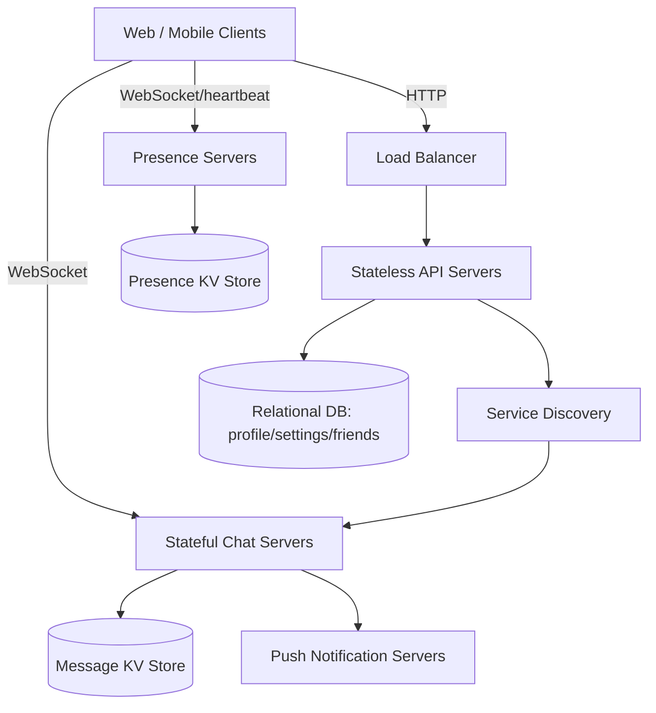

原图中多个 KV Store 表示不同数据职责/分区，不必理解为每个服务固定只有一个独立数据库。

---

## 9. 为什么不能用一台服务器承载全部连接

原书说明理论内存可能装得下 100 万连接，但仍是面试 red flag：

- 单点故障；
- 无滚动升级；
- 网络/CPU/FD 上限；
- 一次崩溃造成百万重连风暴；
- 无多地域；
- 无容量余量。

从单机开始建立流程可以，但必须演进到集群。

### 9.1 服务器数量估算

峰值连接 $C$，单节点安全连接 $c$，故障/发布余量 $f>1$：

$$
Servers=\left\lceil\frac{C}{c}f\right\rceil
$$

700 万连接、每节点安全 100,000、30% 余量：

$$
\left\lceil70\times1.3\right\rceil=91
$$

还应跨可用区部署，并限制单节点重连速率。

---

## 10. 存储选型：通用数据与聊天历史分开

### 10.1 通用数据

用户资料、设置、好友列表适合成熟关系数据库：

- schema/约束；
- 事务；
- 复制与分片；
- 灵活查询。

### 10.2 聊天历史的访问模式

原书列出：

- 数据量巨大；
- 最近消息访问最频繁；
- 仍需随机访问：搜索、mentions、跳转特定消息；
- 1 对 1 读写比约 1:1。

这是一条按会话分区、按消息顺序范围读取的 append-heavy 工作负载。

### 10.3 为什么推荐 KV/宽列存储

- 易水平扩展；
- 低延迟 point/range access；
- 按 conversation/channel 分区；
- 适合时间排序行；
- 可冷热分层；
- HBase/Cassandra 有成熟案例。

“关系库不处理长尾”是原书概括。现代关系库也可分区和冷热存储；真正依据应是规模、访问模式、团队能力和一致性要求。

### 10.4 热冷分层

```text
recent messages -> SSD / hot KV / cache
old history     -> compacted cold store / object storage
search index    -> separate inverted index
```

永久历史不应让在线热索引无限增长。Search 是派生索引，不应成为消息权威源。

---

## 11. 1 对 1 消息数据模型

原书 Figure 12-9：

```text
message
  message_id    bigint  PK
  message_from  bigint
  message_to    bigint
  content       text
  created_at    timestamp
```

### 11.1 分区键边界

只以 `message_id` 作为主键适合按 ID 查找，却不直接支持“加载会话最近 50 条”。实际常加入：

```text
conversation_id (partition key)
message_id      (clustering/sort key)
sender_id
content
created_at
```

1 对 1 conversation ID 可由双方用户 ID 规范化生成，或单独分配。

### 11.2 时间戳不能单独排序

两条消息可同毫秒生成，时钟也有偏差。需要唯一可排序 `message_id` 或 `(conversation_seq,message_id)`。

### 11.3 记录还需什么

- client_message_id；
- message_type/version；
- server_received_at；
- edit/delete state；
- reply_to；
- encryption metadata；
- attachment references（若扩展媒体）。

---

## 12. 群聊数据模型

原书 Figure 12-10：

```text
group_message
  channel_id    bigint  PK(partition)
  message_id    bigint  PK(sort)
  user_id       bigint
  content       text
  created_at    timestamp
```

复合主键：

$$
(channelId,messageId)
$$

`channel_id` 是 partition key，因为群聊查询都围绕 channel；`message_id` 在分区内排序。

### 12.1 大频道分区问题

小群最多 100，人和消息量有限。若扩展到超大频道，单 channel partition 会过大/过热，可按：

```text
(channel_id, time_bucket) + message_id
```

分桶，读取跨相邻桶归并。原题小群无需提前复杂化。

---

## 13. Message ID 与消息顺序

原书要求：

- 唯一；
- 按时间可排序，新消息 ID 更大。

### 13.1 MySQL auto_increment

单库可用，但 NoSQL 通常没有全局自增，中心序列还会成为扩展/可用瓶颈。

### 13.2 全局 64-bit Snowflake

优点：

- 全局唯一；
- 时间大致有序；
- 可跨会话统一标识。

局限：

- 时钟回拨；
- 跨节点同毫秒不是严格真实顺序；
- 全局顺序强于业务真正需要。

### 13.3 会话内 local sequence

只需在 1 对 1 conversation 或 group channel 内唯一、递增。由该会话的 leader/partition owner 分配：

$$
seq_{conversation}=seq_{conversation}+1
$$

优点：

- 语义正好匹配；
- 实现和索引简单；
- 不要求所有会话全局协调。

代价：

- `(conversation_id,seq)` 才全局唯一；
- owner 切换要持久化/fencing，防两个 leader 分配相同 sequence；
- 全局事件追踪可另有 Snowflake ID。

### 13.4 “消息顺序”的层次

| 顺序 | 是否需要 |
|---|---|
| 同一发送者发送顺序 | 通常需要 |
| 同一会话统一顺序 | 本章需要 |
| 所有会话全局顺序 | 通常不需要 |
| 与真实物理时间严格一致 | 难且不必要 |

可同时保存：

```text
global_message_id + conversation_sequence
```

前者定位/追踪，后者定义会话顺序。

---

## 14. Step 3：Service Discovery

### 14.1 职责

根据：

- 地理位置；
- 当前连接数；
- CPU/内存；
- 网络延迟；
- 可用区；
- 版本/健康；

为客户端推荐 Chat Server。

原书以 ZooKeeper 举例：注册健康 Chat Servers 并按规则选最优节点。

### 14.2 四步登录连接

1. User A 登录；
2. Load Balancer 转发给 API Server；
3. 认证成功后 Service Discovery 返回最佳 Chat Server（例 server 2）；
4. User A 与 server 2 建立 WebSocket。

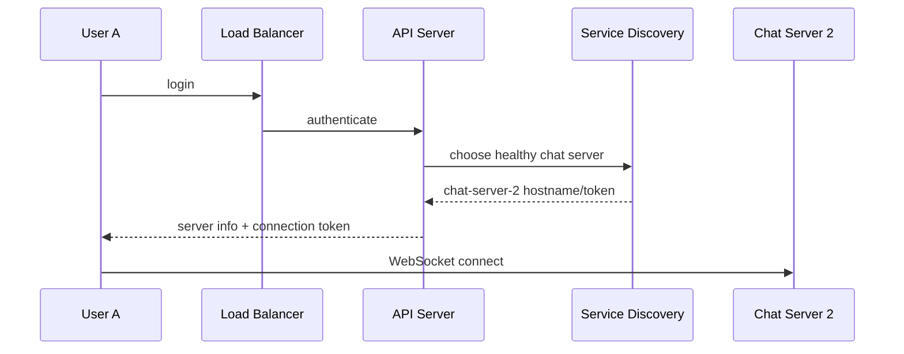

### 14.3 连接令牌

返回短时签名 token，包含 user/device/session/expiry/audience，Chat Server 验证，避免攻击者绕过 API 直接伪造身份。

### 14.4 负载选择不是简单最少连接

每连接成本不同：群聊活跃度、出站流量和设备网络速度会影响负载。可综合：

$$
score_i=w_1Connections_i+w_2CPU_i+w_3Outbound_i+w_4Latency_i
$$

加入随机化和容量阈值，避免所有新客户端同时涌向当前最空节点。

### 14.5 Chat Server 故障

发现故障后不可能无缝迁移 TCP/WebSocket 本身。客户端：

1. 检测断开；
2. 指数退避 + jitter；
3. 重新调用 discovery；
4. 建新 WebSocket；
5. 携带 last ack/cursor 补拉消息。

外部化历史和游标是恢复的基础。

---

## 15. 1 对 1 消息流

原书 Figure 12-12：

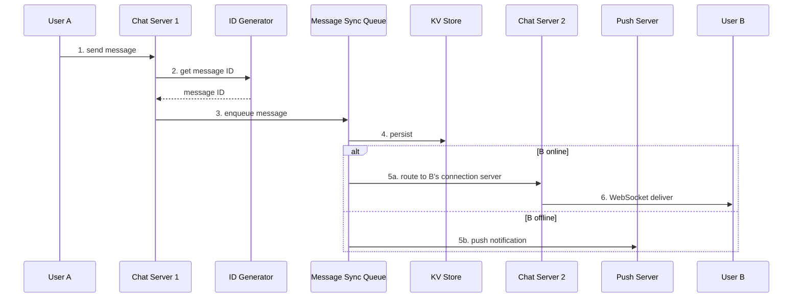

### 15.1 发送成功的定义

可以分级 ack：

```text
client accepted by Chat Server
server persisted
recipient device delivered
recipient read
```

通常发送者看到“已发送”应至少在消息持久化后；只写入内存/队列就 ack，服务器崩溃可能丢消息。

### 15.2 Queue 与 KV 的可靠双写

图中 Queue consumer 写 KV。若队列持久、至少一次，则：

- 重复消费要求 `message_id` 幂等写；
- 存储成功但 ack 丢失会重放；
- 消息应在持久化后再在线转发，避免收件人看到随后消失的消息。

也可先事务写 Message Store + outbox，再转发。关键是有一个明确持久性边界。

### 15.3 在线路由

Presence/connection registry 维护：

```text
user_id -> [(device_id, chat_server_id, session_id), ...]
```

B 在线时消息发到所有/指定设备所在 Chat Servers；不能只假设一个用户一个连接。

### 15.4 离线 Push

Push 只是提醒：

- 可能延迟/重复；
- 不应替代消息存储；
- 敏感内容不应直接显示；
- 用户上线后按 cursor 拉取权威消息。

### 15.5 幂等发送

客户端生成 `client_message_id`：

```text
UNIQUE(sender_id, client_message_id)
```

超时重试返回同一 server message ID，避免重复消息。

---

## 16. 多设备消息同步

原书 Figure 12-13：User A 手机与笔记本各有 WebSocket，分别维护：

```text
phone  cur_max_message_id = 653
laptop cur_max_message_id = 842
```

新消息条件：

- recipient ID 等于当前登录 user ID；
- KV Store 中 message ID 大于设备 `cur_max_message_id`。

### 16.1 每设备游标

```text
device_cursor(user_id, device_id, conversation_id) -> max_seq
```

每台设备独立推进，所以离线较久的手机不会影响笔记本。

### 16.2 单一全局 `cur_max_message_id` 的前提

若使用全局单调 message ID，可查询：

```text
recipient=user AND message_id > cursor
```

但 Snowflake 只大致时间有序，多个分片写入时全局 ID 可能有小幅乱序；如果 cursor 跳到更大 ID，迟到的小 ID 可能被漏掉。

更稳妥：

- 每会话 sequence 游标；
- 同步日志/用户 inbox 的单一单调 offset；
- watermark + overlap 重读并去重；
- 服务端 sync token。

原书模型适合假定 message ID 对该用户同步流严格递增的设计。

### 16.3 多设备发送者同步

User A 用手机发送，笔记本也应收到自己的新消息。收件人集合通常包括：

- 对端所有设备；
- 发送者其他设备；
- 发送设备收到 server ack，而非重复正文也可。

### 16.4 游标何时推进

- 收到消息即推进：设备崩溃前未落本地可能漏显示；
- 持久保存本地后推进：更可靠；
- 用户已读后推进：混淆 sync cursor 与 read receipt。

应分开：

```text
sync_cursor / delivered_cursor / read_cursor
```

---

## 17. 小群聊消息流

原书假设 A、B、C 三人，A 发消息后把引用复制到 B 和 C 的 Message Sync Queue（inbox）。

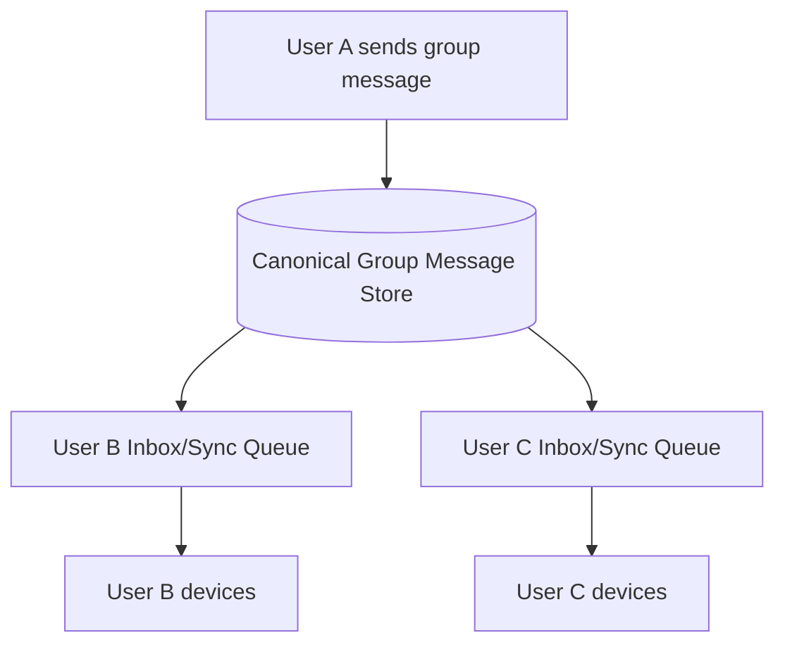

### 17.1 为什么适合小群

- 客户端只读自己的 inbox；
- 1 对 1 和群聊统一同步路径；
- 离线补拉简单；
- 100 人以内 fanout 成本可控。

### 17.2 复制什么

最好复制 message reference/inbox entry，不必复制完整正文：

```text
inbox_entry(user_id, channel_id, message_id)
```

正文存一份 canonical group message。这样减少存储，但读取多一次批量水合。

### 17.3 写放大

群大小 $G$，每消息 inbox 写：

$$
Writes\approx G-1
$$

上限 100 时约 99；10 万人大群则约 99,999，不能接受。

大群应：

- 只写 channel log；
- 在线订阅者实时转发；
- 用户读取时按 channel cursor 拉取；
- 分区频道和热点缓存。

### 17.4 群成员变化

需要定义：

- 新成员能否看历史；
- 被移除成员能否看已收历史；
- 发送瞬间的 membership version；
- fanout 过程中成员变化；
- E2EE 群密钥轮换。

事件应带 membership version，避免异步 Worker 使用错误成员集合。

---

## 18. 可运行示例：幂等发送、会话顺序、多设备游标与小群 Inbox

下面代码演示：

- 同一 `(sender,client_message_id)` 重试只生成一条消息；
- 每个 channel 独立递增 sequence；
- 一条群消息只存一份正文，向成员 inbox 写引用；
- 每台设备独立 sync cursor；
- 重复 inbox entry 不会重复展示。

```python
from collections import defaultdict
from dataclasses import dataclass

@dataclass(frozen=True)
class Message:
    channel_id: str
    sequence: int
    message_id: str
    sender_id: int
    content: str

class ChatModel:
    def __init__(self) -> None:
        self.next_sequence: dict[str, int] = defaultdict(int)
        self.messages: dict[tuple[str, int], Message] = {}
        self.idempotency: dict[tuple[int, str], Message] = {}
        self.inboxes: dict[int, list[tuple[str, int]]] = defaultdict(list)
        self.inbox_seen: set[tuple[int, str, int]] = set()
        self.device_cursors: dict[tuple[int, str, str], int] = defaultdict(int)

    def send(
        self,
        *,
        channel_id: str,
        sender_id: int,
        recipient_ids: set[int],
        client_message_id: str,
        content: str,
    ) -> Message:
        idempotency_key = (sender_id, client_message_id)
        existing = self.idempotency.get(idempotency_key)
        if existing is not None:
            return existing

        self.next_sequence[channel_id] += 1
        sequence = self.next_sequence[channel_id]
        message = Message(
            channel_id=channel_id,
            sequence=sequence,
            message_id=f"{channel_id}:{sequence}",
            sender_id=sender_id,
            content=content,
        )
        self.messages[(channel_id, sequence)] = message
        self.idempotency[idempotency_key] = message

        for recipient_id in recipient_ids:
            inbox_key = (recipient_id, channel_id, sequence)
            if inbox_key in self.inbox_seen:
                continue
            self.inbox_seen.add(inbox_key)
            self.inboxes[recipient_id].append((channel_id, sequence))
        return message

    def sync_device(
        self,
        *,
        user_id: int,
        device_id: str,
        channel_id: str,
    ) -> list[Message]:
        cursor_key = (user_id, device_id, channel_id)
        cursor = self.device_cursors[cursor_key]
        references = [
            (candidate_channel, sequence)
            for candidate_channel, sequence in self.inboxes[user_id]
            if candidate_channel == channel_id and sequence > cursor
        ]
        references.sort(key=lambda item: item[1])
        messages = [self.messages[reference] for reference in references]
        if messages:
            self.device_cursors[cursor_key] = messages[-1].sequence
        return messages

chat = ChatModel()
members = {1, 2, 3}

first = chat.send(
    channel_id="group-7",
    sender_id=1,
    recipient_ids=members,
    client_message_id="phone-local-1",
    content="hello",
)
retry = chat.send(
    channel_id="group-7",
    sender_id=1,
    recipient_ids=members,
    client_message_id="phone-local-1",
    content="hello",
)
second = chat.send(
    channel_id="group-7",
    sender_id=2,
    recipient_ids=members,
    client_message_id="laptop-local-9",
    content="hi back",
)

assert retry is first
assert first.sequence == 1 and second.sequence == 2
assert len(chat.messages) == 2

# User 3's phone and laptop synchronize independently.
phone_messages = chat.sync_device(
    user_id=3, device_id="phone", channel_id="group-7"
)
assert [message.sequence for message in phone_messages] == [1, 2]
assert chat.sync_device(
    user_id=3, device_id="phone", channel_id="group-7"
) == []

laptop_messages = chat.sync_device(
    user_id=3, device_id="laptop", channel_id="group-7"
)
assert [message.sequence for message in laptop_messages] == [1, 2]

third = chat.send(
    channel_id="group-7",
    sender_id=1,
    recipient_ids=members,
    client_message_id="phone-local-2",
    content="third",
)
assert third.sequence == 3
assert [message.sequence for message in chat.sync_device(
    user_id=3, device_id="phone", channel_id="group-7"
)] == [3]

print(first, second, third, sep="\n")
print("phone cursor:", chat.device_cursors[(3, "phone", "group-7")])
print("laptop cursor:", chat.device_cursors[(3, "laptop", "group-7")])
```

该模型把 sequence 分配放单进程。真实分布式系统必须让每个 channel partition 有唯一 leader/lease，使用 conditional write/fencing，防两个 owner 同时分配相同 sequence。

---

## 19. Online Presence：登录

WebSocket 建立后：

```text
presence[user_id,device_id] = {
  status: online,
  session_id,
  chat_server_id,
  last_active_at,
  expires_at
}
```

原书简化为把用户 online 和 `last_active_at` 写 KV Store。

### 19.1 多设备聚合

用户级在线定义：

$$
userOnline=\bigvee_{device\in user}deviceOnline
$$

一台设备下线但另一台仍在线，用户不应显示 offline。

### 19.2 TTL/租约

Presence 是易变派生状态，可存内存 KV 并设置 TTL。Heartbeat 续租，过期自动离线。不能把每次状态当永久强一致数据库事务。

---

## 20. Online Presence：显式登出

原书流程：

```text
User logout
→ API Server
→ Presence Server
→ KV status=offline
```

多设备下应只删除该 session/device；最后一个活跃 session 退出时用户级状态才 offline。

显式登出比网络断开更确定，可立即发布状态变化并吊销 session token。

---

## 21. Online Presence：断连与 Heartbeat

### 21.1 为什么不能断开即离线

隧道、电梯、Wi-Fi/蜂窝切换会短暂断连。每次立即 flip：

```text
online → offline → online
```

会让朋友看到状态闪烁，并产生大量广播。

### 21.2 原书 heartbeat

- 客户端每 5 秒发送；
- 若 $x=30$ 秒内收到 heartbeat，认为在线；
- 超过 30 秒未收到才离线。

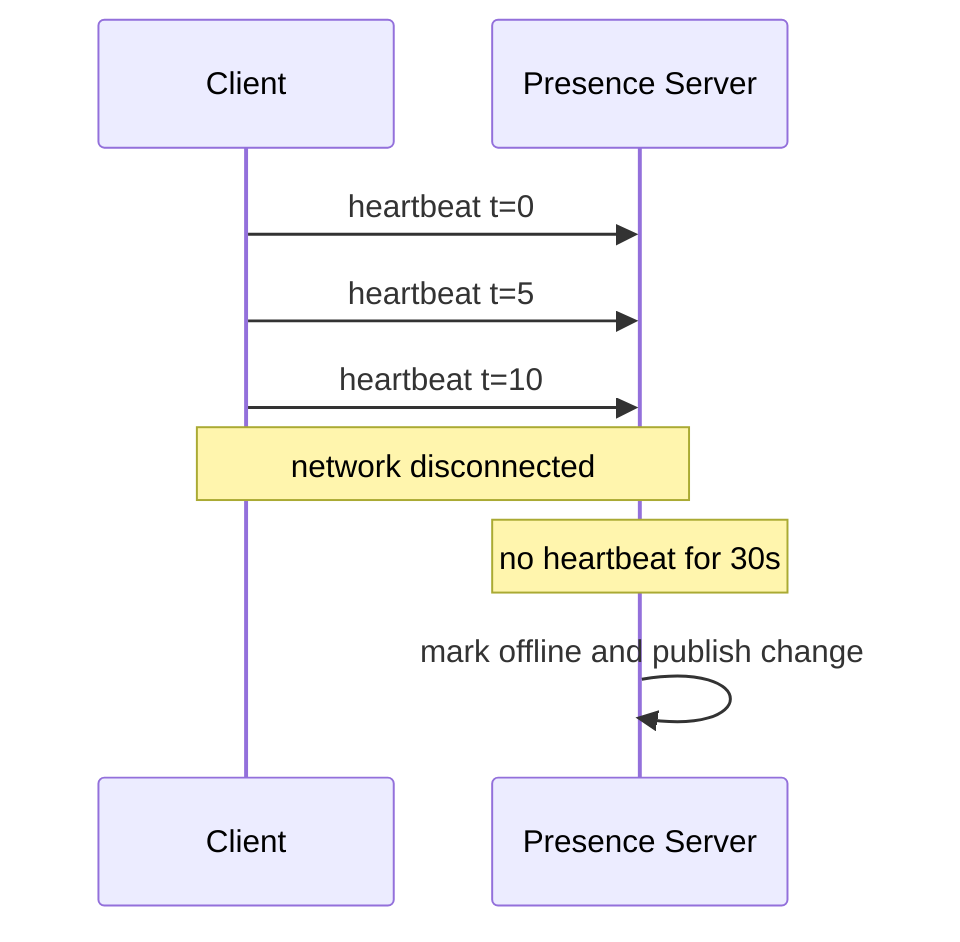

### 21.3 检测延迟与误判

Heartbeat 间隔 $h$，离线阈值 $x$：

- 检测延迟最多约 $x$；
- $x$ 太小：网络抖动误判；
- $x$ 太大：幽灵在线；
- $h$ 太小：流量、电量和服务器负载高；
- $h$ 太大：难快速确认健康。

通常 $x$ 是 $h$ 的若干倍，允许丢失数个 heartbeat。

### 21.4 Heartbeat 负载

如前述 700 万连接、5 秒间隔，约 140 万 heartbeat/s。可优化：

- WebSocket ping/pong 与应用 heartbeat 合并；
- Chat Server 本地维护 session 并批量上报；
- 仅状态变化时写共享 KV；
- KV 使用 TTL refresh pipeline；
- 移动后台延长间隔或视为 away。

原书数字用于讲状态逻辑，生产系统不一定每 5 秒集中写 KV。

---

## 22. Online Status Fanout

原书使用 Pub/Sub：A 状态变化时发布到 A-B、A-C、A-D channel，B/C/D 订阅并通过 WebSocket 接收。

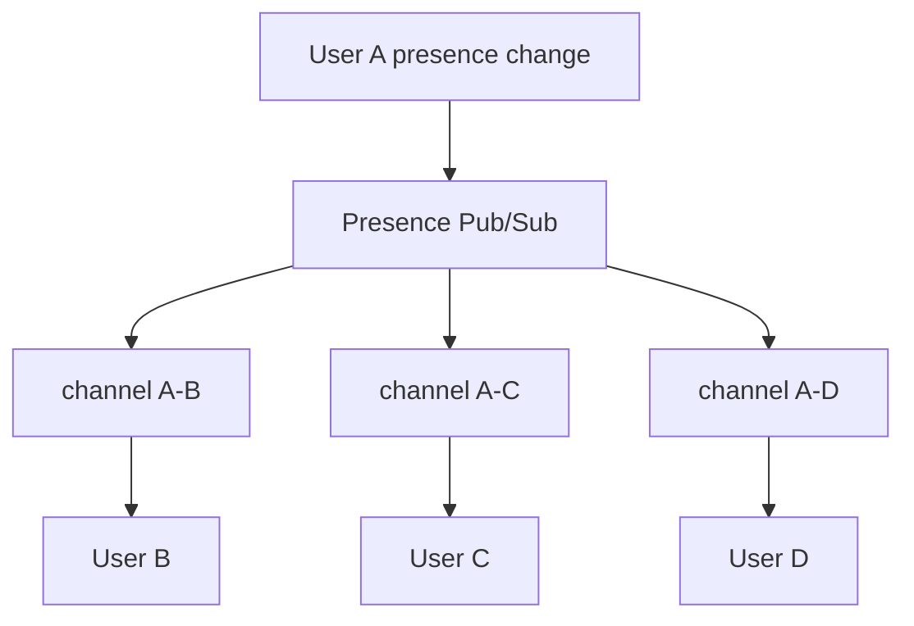

### 22.1 小好友组适用

好友数有限，状态变化扇出可控。接收端实时更新绿色状态点。

### 22.2 大群不适用

10 万人群，每次状态变化产生 10 万事件：

$$
FanoutEvents=GroupSize=100,000
$$

所有成员频繁上下线会形成巨大事件风暴。原书建议：

- 用户进入群时批量查询 Presence；
- 手动刷新时查询；
- 不实时广播全部大群成员状态。

### 22.3 Presence 是提示，不是事务事实

状态有传播延迟、TTL 和网络不确定性。UI 应允许 “online recently / last seen”，不能用在线点决定消息能否发送；消息永远先持久化，在线转发只是优化。

### 22.4 Presence 隐私

- 用户可隐藏在线状态；
- block/mute 影响谁能看；
- “last seen” 可能敏感；
- 状态查询和订阅需授权；
- 不能允许任意枚举用户在线情况。

---

## 23. 消息可靠性、重复与回执

原章将重发放 Step 4 延伸。生产设计需要明确状态。

### 23.1 消息状态

```text
CLIENT_PENDING
→ SERVER_PERSISTED
→ DEVICE_DELIVERED
→ USER_READ
```

不同收件设备有不同 delivered cursor；用户级 read receipt 由产品定义。

### 23.2 客户端重发

超时后重发同 `client_message_id`。服务器幂等返回同一 `message_id`，不能再插一条。

### 23.3 至少一次内部处理

Queue 消息会重复，KV Store 以 message ID 条件写；在线转发也可重复，客户端按 `(channel_id,sequence)` 去重。

### 23.4 ack 丢失

服务器已持久但 ack 丢，客户端重发。幂等键解决重复。Exactly-once 不是网络天然属性，而是业务层去重效果。

### 23.5 顺序恢复

客户端发现 sequence gap：

```text
received 101, then 103; missing 102
```

不要直接显示 103 为最终顺序；可缓冲短时间并按 cursor 补拉 102。永久缺口需超时降级并重新同步。

---

## 24. Step 4：媒体消息

若支持照片/视频：

```text
client → pre-signed upload → object storage
client → send message with media metadata/reference
recipient → CDN download thumbnail/media
```

需要：

- 压缩；
- 缩略图；
- 转码；
- 病毒扫描；
- 对象存储；
- CDN；
- 上传断点续传；
- 权限签名；
- 内容审核。

大文件不应通过 Chat Server WebSocket 转发，避免占用长连接和内存 buffer。

---

## 25. Step 4：端到端加密

E2EE 目标：只有发送者和接收设备可解密，服务器只见密文。

它改变：

- 每设备密钥；
- 身份验证；
- session key 协商；
- 多设备 fanout 加密；
- 群成员加入/退出密钥轮换；
- 历史恢复；
- 搜索；
- 内容审核；
- Push 预览。

服务器仍可保存密文、路由和 sequence，但不能读取 content。Metadata（谁和谁、何时、大小）仍可能暴露。

E2EE 不是“数据库字段加密”，它要求端点持有解密密钥和完整协议。

---

## 26. Step 4：客户端缓存与地域加速

### 26.1 客户端缓存

- 最近会话和消息；
- 离线阅读；
- 减少重复下载；
- 快速首屏；
- 本地全文搜索（E2EE 尤其重要）。

需要本地加密、容量限制、注销清理和 schema 迁移。

### 26.2 地域网络

原书提到 Slack 的地域边缘缓存。可：

- Chat Server 就近接入；
- Service Discovery 按 RTT/地域；
- 缓存用户和 channel metadata；
- 消息 home region 持久化并跨地域复制；
- 跨地域用户通过骨干路由。

不能让边缘缓存成为消息唯一权威源。

---

## 27. Step 4：错误处理与 Chat Server 故障

### 27.1 单 Chat Server 故障

可能断开数十万连接。恢复：

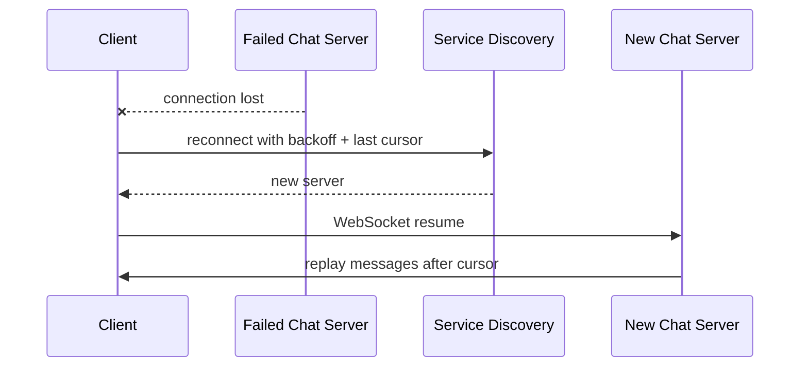

### 27.2 防重连风暴

- 指数退避 + jitter；
- Service Discovery 分散节点；
- 每节点 admission control；
- 逐步恢复 Presence；
- 缓存/存储保护；
- 客户端保持离线队列。

### 27.3 Drain 与发布

计划发布时：

- 停止接收新连接；
- 通知客户端重连；
- 等待/迁移有限会话；
- 超时关闭；
- 保证消息历史外置。

WebSocket 不能像普通短 HTTP 请求一样瞬间滚动替换。

### 27.4 消息重发

原书建议 retry + queue。必须配合：

- client_message_id；
- server message ID；
- 有界退避；
- 幂等持久化；
- 过期/撤回策略；
- DLQ 和告警。

---

## 28. 监控与 SLO

### 28.1 连接层

- active WebSockets；
- connection success；
- reconnect rate；
- per-server connections；
- handshake/TLS latency；
- heartbeat rate；
- slow-client buffer；
- disconnect reasons。

### 28.2 消息层

- accepted/persisted/delivered/read latency；
- send QPS；
- queue lag；
- duplicate/idempotency hit；
- sequence gaps；
- offline Push rate；
- KV read/write P99；
- storage growth。

### 28.3 同步层

- messages replayed after reconnect；
- device cursor lag；
- sync failures；
- multi-device convergence；
- missing message audit。

### 28.4 Presence

- heartbeat QPS；
- online users/sessions；
- stale Presence；
- state flip rate；
- fanout events；
- Pub/Sub lag；
- privacy authorization failures。

### 28.5 SLO 示例

```text
P99 sender → persisted < 200 ms
P99 persisted → online recipient < 500 ms
P99 reconnect resume < 5 s
Presence offline detection < 30 s
```

数字需结合产品和地域，不是原书固定要求。

---

## 29. 容易混淆的概念与常见误区

### 29.1 WebSocket 与 TCP

WebSocket 是构建在 TCP 上的应用层双向消息协议，提供 frame 和握手；不等于裸 TCP。

### 29.2 WebSocket 与 WebRTC

WebSocket 适合 client-server 文本/事件；WebRTC 偏点对点媒体和实时音视频。原题纯文本无需 WebRTC。

### 29.3 Persistent connection 与消息持久化

连接持久只表示网络会话长期存在，不表示消息已写磁盘。二者完全不同。

### 29.4 Stateful Chat Server 与聊天历史只存在内存

Stateful 指持有连接；历史仍必须外置到 KV Store，服务器故障后才能恢复。

### 29.5 用户在线与消息可达

Presence 可能陈旧，在线设备也可能慢/断开。消息先持久化，再尝试实时转发。

### 29.6 Polling 与 Long Polling

Polling 固定间隔立即响应；long polling 持有请求到消息/超时。两者都是 HTTP，但连接生命周期不同。

### 29.7 WebSocket 适合所有 API

登录、资料等 request/response 用 HTTP 更简单、可缓存、易观测。实时双向部分才用 WebSocket。

### 29.8 DAU 与 Concurrent Connections

DAU 是一天内活跃人数；连接数取决于峰值在线率和每人设备数，不能直接等同 5000 万。

### 29.9 Characters 与 Bytes

100,000 字符在 UTF-8 中可能远超 100 KB。网络和存储必须按 bytes 限制。

### 29.10 created_at 与消息顺序

时间戳可相同/偏移，不能单独作为唯一排序键。使用会话 sequence 或可排序 ID。

### 29.11 全局 Message ID 与会话顺序

全局 ID 便于追踪，但业务只需会话内顺序。Snowflake 大致有序不一定替代严格 conversation sequence。

### 29.12 Message Sync Queue 与只有内存队列

它是收件人同步/inbox 抽象，必须有持久状态或可从 Message Store 重建，不能把未消费消息只留易失内存。

### 29.13 Push Notification 与消息交付

Push 是离线提醒，不是权威消息。用户上线后从 KV Store 拉取。

### 29.14 Inbox fanout 与完整正文复制

小群可复制 inbox reference，不一定复制完整消息正文。后者存储成本更高。

### 29.15 小群方案可直接扩到大群

逐成员写为 $O(G)$，10 万人每消息 10 万 writes。大群应共享 channel log + pull。

### 29.16 `cur_max_message_id` 与已读回执

同步游标表示设备已持久接收/处理到哪里，不等于用户已读。应分开保存 read cursor。

### 29.17 断开一次就离线

网络抖动会频繁闪烁。Heartbeat + grace period 降低误判。

### 29.18 Heartbeat 越频繁越好

更快检测却增加服务器、网络和电量成本。阈值还要容忍丢包。

### 29.19 Presence 必须强一致

Presence 是短生命周期提示，通常最终一致和 TTL 足够；消息持久性要求更高。

### 29.20 ZooKeeper 承载所有连接数据

ZooKeeper 适合协调/服务发现，不应把数百万高频 session/heartbeat 全部作为细粒度写入。

### 29.21 Exactly-once 消息天然由 WebSocket 保证

WebSocket/TCP 提供连接内有序字节，不处理断线边界、应用 ack 丢失和重试。需要业务幂等。

### 29.22 E2EE 与 TLS

TLS 保护传输到服务器；E2EE 使服务器也不能解密内容。安全边界不同。

---

## 30. 本章知识结构

### 30.1 需求层

- 1 对 1 + 100 人小群；
- Web + Mobile；
- 50M DAU；
- 低延迟文本；
- Presence；
- 多设备；
- Push；
- 永久历史。

### 30.2 通信层

- Sender HTTP 可行；
- Polling 浪费空查询；
- Long polling 降低空轮询但路由/断连复杂；
- WebSocket 双向持久，适合实时聊天；
- 非实时 API 仍用 HTTP。

### 30.3 服务层

- Stateless API；
- Stateful Chat；
- Presence；
- Service Discovery；
- Notification；
- Connection Registry；
- Message Queue/KV Store。

### 30.4 数据与顺序层

- 通用数据关系库；
- 消息历史 KV/宽列；
- `(conversation/channel,sequence)`；
- 全局 ID 与 local sequence；
- 每设备 sync/delivered/read cursor。

### 30.5 消息流层

- 1 对 1：ID → queue → persist → online route/offline Push；
- 多设备：独立 cursor 补拉；
- 小群：canonical message + recipient inbox references；
- 大群：共享 channel log + pull。

### 30.6 Presence 与运行层

- 登录/登出；
- Heartbeat + grace period；
- Pub/Sub 好友 fanout；
- 大群按需查询；
- 重连、补拉、幂等与监控。

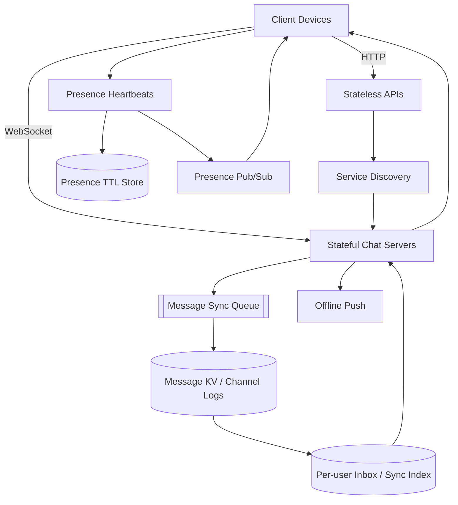

---

## 31. 核心结论与一般设计方法

### 31.1 核心结论

1. **先确认聊天类型与规模。** 1 对 1、小群和超大频道的 fanout、顺序和存储完全不同。
2. **WebSocket 解决低延迟双向通信，不解决持久化、幂等和离线同步。**
3. **实时连接服务天然有状态。** 连接不能任意迁移，需 Service Discovery、drain 和重连恢复。
4. **非实时功能仍用 HTTP。** 协议应匹配交互模式，不应所有功能统一成 WebSocket。
5. **单机内存装得下不代表架构可行。** 单点、发布、网络和重连风暴要求集群化。
6. **通用数据和聊天历史应按访问模式选择存储。** 关系数据进 RDBMS，消息按会话分区进 KV/宽列存储。
7. **消息顺序只需在会话内成立。** Local sequence 常比全局严格序更符合需求，全球 ID 可用于追踪。
8. **消息先持久化，再实时转发。** 在线路由是低延迟优化，KV 历史是恢复真相。
9. **多设备需要独立同步游标。** Sync、delivered、read 三类 cursor 不应混淆。
10. **小群可写时 fanout 到每用户 inbox。** 大群必须改共享 channel log + pull，避免 $O(G)$ 写放大。
11. **Presence 是带 TTL 的近似状态。** Heartbeat/grace period 平衡检测速度、误判和资源成本。
12. **在线状态 fanout 也有规模边界。** 好友组可 Pub/Sub，大群应进入时按需查询。
13. **至少一次处理需要端到端幂等。** Client message ID、server ID、唯一约束和客户端去重共同控制重复。
14. **Chat Server 故障恢复依赖重连 + cursor 补拉。** WebSocket 本身无法无缝迁移。
15. **媒体与 E2EE 会重塑架构。** 对象存储/CDN 和密钥协议不能只是文本消息的字段扩展。

### 31.2 一般设计流程

$$
\boxed{
\text{澄清会话类型、顺序、设备、历史与加密}
\rightarrow
\text{估算连接、消息、心跳和存储}
\rightarrow
\text{选择实时协议并分离 HTTP 功能}
\rightarrow
\text{外置连接路由、历史和 Presence}
\rightarrow
\text{设计会话分区与 sequence}
\rightarrow
\text{走通 1 对 1、离线和多设备同步}
\rightarrow
\text{按群规模选择 push inbox 或 pull log}
\rightarrow
\text{设计 heartbeat、Presence fanout 与隐私}
\rightarrow
\text{用幂等、重连、补拉和监控处理故障}
}
$$

### 31.3 面试中的完整表达骨架

> 本系统支持 Web/Mobile、50M DAU、低延迟 1 对 1、最多 100 人小群、多设备、Presence、Push 和永久文本历史。发送侧 HTTP 可用，但接收需要服务器主动推送；Polling 空请求多、long polling 仍有重连和连接路由问题，因此实时消息统一用双向 WebSocket，登录/资料仍用 HTTP。Chat Server 因持有连接而有状态，API 无状态；Service Discovery 按地域、连接和容量返回 Chat Server。消息历史按 conversation/channel 分区存 KV/宽列，`conversation_sequence` 定义会话顺序，另用全局 ID 追踪。客户端携带 `client_message_id`，服务器幂等持久化后 ack，再在线转发；离线用户发 Push，上线后按设备独立 sync cursor 补拉。小群正文存一次、向最多 99 个成员 inbox 写引用；超大群改共享 channel log + pull。Presence 用每设备 TTL/heartbeat，用户级 online 是任一 session 在线，断连 30 秒 grace 后才 offline；好友状态 Pub/Sub，大群进入时批量查询。Chat Server 宕机后客户端 jitter 重连、重新 discovery，并从 last cursor replay。监控连接数、heartbeat、persist/deliver latency、queue lag、重复、sequence gap、cursor lag 和 Presence 抖动。

### 31.4 章末自检

- [ ] 能否完整复述 Step 1 的规模和功能范围？
- [ ] 能否区分 DAU、在线用户、设备数和连接数？
- [ ] 能否用 $N/T$ 推导 polling QPS？
- [ ] 能否比较 polling、long polling 与 WebSocket？
- [ ] 能否解释为什么只让实时通信使用 WebSocket？
- [ ] 能否说明 Chat Server 有状态但历史必须外置？
- [ ] 能否从连接内存和安全容量估算服务器数？
- [ ] 能否解释为什么聊天历史适合 KV/宽列存储？
- [ ] 能否写出 1 对 1 和群聊的分区/排序键？
- [ ] 能否区分全局 message ID 与 conversation sequence？
- [ ] 能否完整讲出 Service Discovery 四步连接流程？
- [ ] 能否完整讲出 1 对 1 消息六步路径？
- [ ] 能否定义 sender ack 的持久性边界？
- [ ] 能否用 client_message_id 处理重发？
- [ ] 能否解释每设备 cursor 的前提和乱序风险？
- [ ] 能否区分 sync、delivered 和 read cursor？
- [ ] 能否说明小群 inbox fanout 为什么可行，大群为什么不可行？
- [ ] 能否处理群成员变化和 membership version？
- [ ] 能否解释断开即 offline 为什么体验差？
- [ ] 能否推导 heartbeat QPS 并权衡间隔/阈值？
- [ ] 能否解释 Presence Pub/Sub 的群规模边界？
- [ ] 能否设计 Chat Server 故障后的重连与补拉？
- [ ] 能否说明 E2EE 与 TLS 的差异及架构影响？

如果这些问题都能回答，就不只是知道“聊天要用 WebSocket”，而是理解了本章的核心方法：**把易失的实时连接与持久的消息事实分开，把全局问题缩小为会话内顺序和设备内游标，再根据收件人规模选择写时 inbox 或读时 channel log，并用服务发现、心跳、幂等和补拉把网络断连从数据丢失问题降级为可恢复的短暂实时性问题。**
