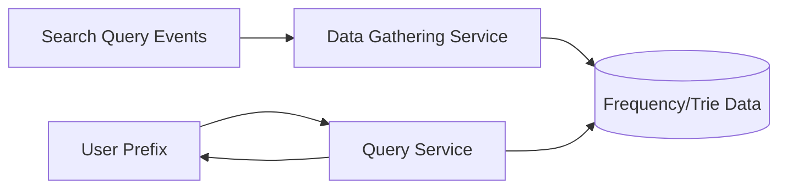
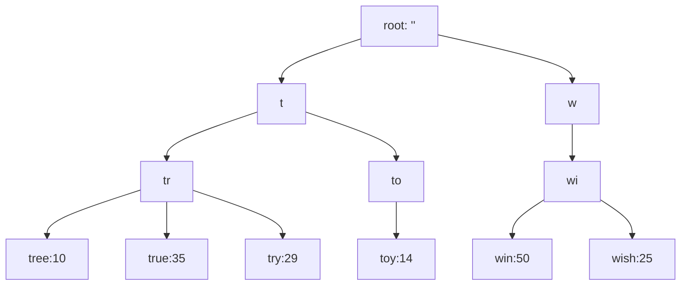
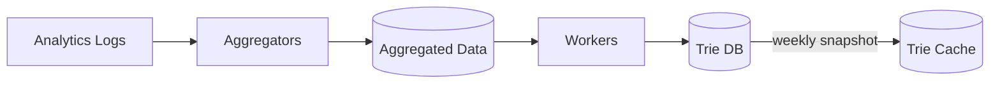
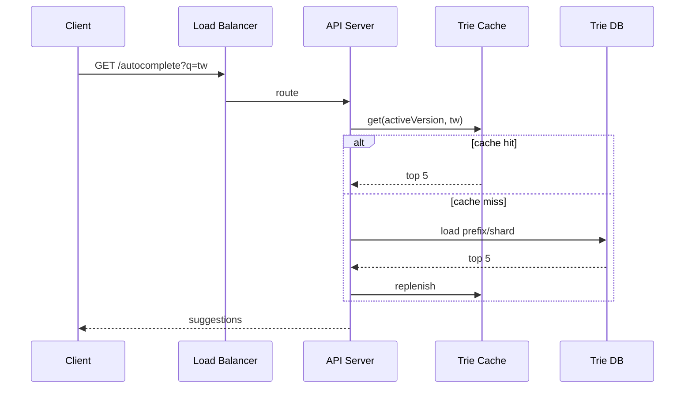
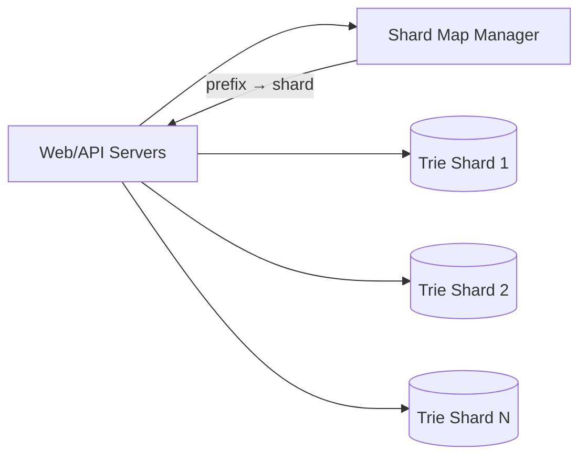
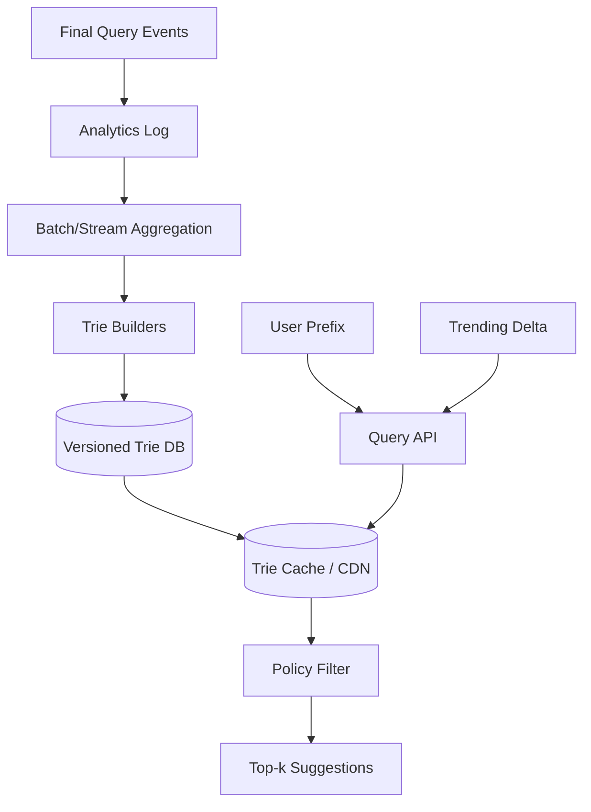

> 原书：Alex Xu，*System Design Interview: An Insider's Guide*（Second Edition）
> 原章：Chapter 13, *Design a Search Autocomplete System*
> 本章主线：先把自动补全收敛为“英文小写前缀 → 按历史频率返回 Top 5”，并估算每次按键造成的高读 QPS；再用频率表和 SQL 建立可行基线；由于大表前缀扫描和排序太慢，改用 Trie，并把每个前缀的 Top-k 结果预计算在节点上，以空间和离线更新成本换在线低延迟；写侧从逐请求实时更新改为 append-only 日志、周期聚合和每周 Trie 快照，读侧通过 Trie Cache、浏览器缓存和采样提速，最后用过滤层处理不良建议、用历史分布驱动 shard map，并讨论 Unicode、地域化和实时趋势流处理。

## 0. 学习目标、阅读边界与全章总览

Search autocomplete 又称：

- typeahead；
- search-as-you-type；
- incremental search；
- top-k most searched queries。

用户输入 `din` 时，系统在极短时间内返回若干以 `din` 开头的候选，并按历史查询频率排序。

本章核心不是基础 Trie 定义，而是将其改造成高读低写、可离线构建、可缓存和可分片的生产查询索引。


读完后，应当能够回答：

1. 为什么前缀匹配比任意子串匹配更适合 Trie？
2. 1000 万 DAU 为什么会产生约 24,000 平均 QPS和 48,000 峰值 QPS？
3. 原书 0.4 GB/day 的新数据估算隐含了什么假设，和前缀请求日志有什么区别？
4. `LIKE 'prefix%' ORDER BY frequency DESC LIMIT 5` 为什么在大表上仍可能慢？
5. Trie 的 prefix 查找、子树遍历和排序复杂度如何推导？
6. 在每个节点缓存 Top 5 后，查询为什么变为 $O(p+k)$，原书为什么可写作 $O(1)$？
7. 预计算 Top-k 会带来多少额外空间和更新成本？
8. 为什么不能在每次用户查询时同步修改在线 Trie？
9. Analytics Log、Aggregator、Worker、Trie DB 和 Trie Cache 如何串成一条离线构建管道？
10. Snapshot 如何原子替换，防止用户看到半棵新 Trie、半棵旧 Trie？
11. Document Store 与 KV 表示 Trie 各有什么优缺点？
12. 浏览器 `Cache-Control: private, max-age=3600` 的语义是什么？
13. 1/N 采样后如何恢复频率估计，方差和稀有查询会怎样？
14. 更新一个词的频率为什么要更新其所有祖先节点？
15. 为什么删除不良建议要“同步过滤 + 异步物理删除”两步？
16. 按首字母均分为什么会数据倾斜，Shard Map Manager 如何修正？
17. 多语言、地域化和实时趋势为什么会改变 key、Trie 和排名模型？

本文严格沿原书顺序展开。补充的参数化复杂度、采样估计、指数衰减、snapshot 版本、cache stampede、防滥用与可运行 Trie 代码属于标准工程背景，不是作者逐式给出的原文。

---

## 1. Step 1：理解问题并确定范围

### 1.1 只支持前缀匹配

输入 `tw`，候选必须从开头匹配：

```text
twitter
twitch
twilight
```

不要求中间子串、模糊拼写和同义词匹配。Trie 的路径天然表示前缀；若要任意子串，需 n-gram、倒排索引、suffix structure 或搜索引擎。

### 1.2 返回 5 条

$$
k=5
$$

$k$ 很小，使每节点缓存 Top-k 可行。若 $k$ 可任意增大，存储和返回复杂度不再近似常数。

### 1.3 排名依据：历史查询频率

$$
score(query)=count(query)
$$

按 score 降序。频率只是一种相关性代理：它可能被 bot/spam 操纵，也不包含用户、地域和时效。原章后面再引入地域和 recent trend。

### 1.4 不支持拼写纠正

排除 edit distance、候选召回和纠错模型。输入 `twiter` 不会自动匹配 `twitter`。

### 1.5 英文、小写、仅字母

每个节点最多 26 个子边，字符处理简单。不需要大小写折叠、Unicode 归一化、分词和 locale。本章收尾再讨论多语言。

### 1.6 1000 万 DAU

结合每次搜索多个按键请求，查询流量远高于最终搜索次数。系统是典型：

```text
read-heavy, latency-sensitive, update-lag-tolerant
```

### 1.7 非功能需求

原书总结：

- Fast：约 100 ms 内返回，否则输入卡顿；
- Relevant：与前缀相关；
- Sorted：按 popularity/排名模型排序；
- Scalable：承受高流量；
- Highly available：部分节点故障仍可服务。

### 1.8 还应澄清的问题

- 是否个性化？
- 是否按国家/语言/设备区分？
- 空前缀是否返回热门榜？
- 最短几字符后才请求？
- Trending 更新需要秒、分钟还是周？
- 不良内容下架 SLA？
- 用户查询日志保留和隐私？
- 是否允许重复请求乱序覆盖 UI？
- 结果是否包含实体、类别和 URL？

---

## 2. 粗略估算

### 2.1 用户搜索量

$$
DAU=10,000,000
$$

每人每日 10 次搜索：

$$
Searches_{day}=10^7\times10=10^8
$$

### 2.2 Query string 大小

原书假设：

- ASCII，1 字符 1 byte；
- 4 个词；
- 每词平均 5 字符；
- 简化为 20 bytes。

这里忽略了词间空格；严格按 4 个 5 字符词加 3 个空格应是 23 bytes。数量级不变。

### 2.3 每次搜索产生 20 个 autocomplete 请求

每输入一个字符发一次，如 `d,di,din,dinn,dinne,dinner`。

$$
Requests_{day}=10^7\times10\times20=2\times10^9
$$

$$
QPS_{avg}=\frac{2\times10^9}{86400}\approx23,148
$$

原书取约 24,000 QPS。

峰值假设 2 倍：

$$
QPS_{peak}\approx48,000
$$

### 2.4 前端防抖可显著降流量

原书按每字符都请求估算。生产客户端常：

- debounce 50–150 ms；
- 少于 2 个字符不请求；
- 取消旧请求；
- 本地/browser cache；
- 复用前缀结果。

若平均实际只发 8 个请求/搜索，QPS 降为原来的 40%。容量仍应按旧客户端和异常流量保守设计。

### 2.5 新查询数据 0.4 GB/day

原书假设 20% 最终查询是新查询：

$$
10^7\times10\times20\ \text{bytes}\times20\%
=0.4\times10^9\ \text{bytes}=0.4\ \text{GB/day}
$$

这计算的是**新最终 query string 的文本 bytes**，不是全部按键请求日志。完整日志还包含：

- timestamp；
- user/session/region；
- request ID；
- prefix；
- result/click；
- schema 与存储开销。

所以真实 Analytics Log 远大于 0.4 GB/day。

### 2.6 响应带宽

假设 Top 5 JSON 共 500 bytes：

$$
Bandwidth_{peak}=48,000\times500\times8
=192\ \text{Mb/s}
$$

网络不一定是首要瓶颈，P99、缓存和热点前缀更关键。

### 2.7 延迟预算

总目标 100 ms，可教学化分配：

```text
network + LB: 25 ms
API/cache lookup: 10 ms
serialization: 5 ms
client render: 20 ms
remaining jitter budget: 40 ms
```

跨地域数据库查询很难稳定满足，应把 Trie 放内存/边缘缓存。

---

## 3. Step 2：高层设计——读写分离

作者把系统拆成：

### 3.1 Data Gathering Service

收集用户最终查询并聚合频率。基线实时更新频率表，后续改为离线日志管道。

### 3.2 Query Service

输入 prefix，返回 Top 5 高频完整 query。读路径必须极快且高可用。



写侧可延迟聚合，读侧始终使用稳定快照。这是 CQRS 风格：更新模型与查询模型不同。

---

## 4. 频率表基线

### 4.1 数据模型

```text
frequency_table
  query
  frequency
```

用户输入 `twitch, twitter, twitter, twillo` 后，分别累加。

### 4.2 SQL 查询

原书：

```sql
SELECT *
FROM frequency_table
WHERE query LIKE 'prefix%'
ORDER BY frequency DESC
LIMIT 5;
```

原图实际使用占位示意 `prefix%`。输入 `tw` 时应是 `LIKE 'tw%'` 或参数化 range。

### 4.3 原书 `tw` 样例

| Query | Frequency |
|---|---:|
| twitter | 35 |
| twitch | 29 |
| twilight | 25 |
| twin peak | 21 |
| twitch prime | 18 |
| twitter search | 14 |
| twillo | 10 |
| twin peak sf | 8 |

Top 5：

```text
twitter, twitch, twilight, twin peak, twitch prime
```

### 4.4 为什么大表变慢

B-tree 能通过范围：

$$
[prefix,prefixUpperBound)
$$

找到前缀记录，但仍可能匹配 $c$ 条并排序：

$$
O(\log N+c\log c)
$$

即使使用 `(prefix/frequency)` 特殊索引，所有可能长度前缀和频率更新仍复杂。高 QPS 下直接数据库查询会成为瓶颈。

### 4.5 基线价值

小数据集可用，且帮助明确正确性。优化不是因为 SQL “不能前缀查询”，而是 100 ms、48k peak QPS 和大候选集要求预计算/缓存。

---

## 5. Step 3：Trie 基础

Trie（读作 “try”）来自 retrieval。

### 5.1 结构

- 根表示空字符串；
- 边/节点表示字符；
- 路径表示 prefix；
- 终止节点表示完整 query；
- 英文小写最多 26 children；
- 空 child 不实际分配以省空间。



### 5.2 频率信息

只有字符无法排名。完整 query 的 terminal 节点保存 frequency。内部 prefix 节点稍后缓存子树 Top-k。

### 5.3 空间复杂度

若所有字符串总字符数为 $L$，基础 Trie 节点数最坏 $O(L)$，共享前缀能减少实际节点。若每节点固定 26 指针会很浪费，可用 sparse map、压缩边/Radix Tree、LOUDS 等优化。

---

## 6. 基础 Trie Top-k 算法

原书定义：

- $p$：prefix 长度；
- $n$：Trie 总节点数；
- $c$：prefix 子树中可形成有效 query 的候选数（原文称 valid children，实际是有效后代查询数）。

### 6.1 三步

1. 沿 prefix 找节点：$O(p)$；
2. 遍历该节点子树找所有完整 query：$O(c)$（若计算经过所有节点，更严格是子树节点数）；
3. 排序候选取 Top-k：$O(c\log c)$。

总计：

$$
O(p+c+c\log c)=O(p+c\log c)
$$

### 6.2 原书 `tr` 示例

候选：

```text
tree:10, true:35, try:29
```

$k=2$：

```text
true:35, try:29
```

### 6.3 可以用 heap 改善排序

遍历 $c$ 个候选时维护大小 $k$ 的最小堆：

$$
O(c\log k)
$$

但仍必须遍历整个子树，热门前缀如 `a`、`s` 可能对应数百万 query，无法满足低延迟。

---

## 7. 优化一：限制 prefix 最大长度

原书取：

$$
p\le50
$$

在固定产品约束下，$O(p)$ 上界为常数，可写 $O(1)$。

参数化分析仍是：

$$
O(p)
$$

限制长度还可：

- 防恶意超长输入；
- 限制 CPU 与日志；
- 控制浏览器/UI；
- 简化缓存 key。

超过长度时可停止补全或截断查询，但截断要明确 UI 语义。

---

## 8. 优化二：每节点缓存 Top-k

### 8.1 结构

每个 prefix 节点保存：

```text
top_k = [(query,frequency), ...]
```

原书节点 `be`：

```text
best:35, bet:29, bee:20, be:15, beer:10
```

### 8.2 查询

1. 沿 prefix 走到节点：$O(p)$；
2. 直接返回缓存列表：$O(k)$（若只引用固定数组，也常口语视作 $O(1)$）。

参数化总复杂度：

$$
O(p+k)
$$

在原书 $p\le50,k=5$ 固定时：

$$
O(1)
$$

原书写法是基于产品常数，不应理解为 Trie 查找对任意 prefix/k 都与长度无关。

### 8.3 空间换时间

有 $n$ 个节点，每节点缓存 $k$ 条，每条引用/score 成本 $s$ bytes：

$$
ExtraMemory\approx nks
$$

若 1 亿节点、$k=5$、每项 16 bytes：

$$
10^8\times5\times16=8\ \text{GB}
$$

还未算节点、字符串、对象头、分片副本。可存 query ID 而不是重复完整字符串。

### 8.4 构建成本

离线自底向上：

- terminal 提供自身 query/score；
- internal node 合并 children top-k 与自身 terminal；
- 只保留 Top-k。

若节点平均 $b$ children，合并小列表成本约 $O(bk\log k)$；离线可并行。

### 8.5 排名平局

必须定义稳定规则：

```text
frequency DESC, query ASC
```

否则不同 Worker/副本可能返回顺序抖动，缓存与测试不稳定。

---

## 9. 可运行示例：构建、查询、更新与过滤 Top-k Trie

```python
from dataclasses import dataclass, field

@dataclass
class TrieNode:
    children: dict[str, "TrieNode"] = field(default_factory=dict)
    frequency: int | None = None
    query: str | None = None
    top_k: list[tuple[str, int]] = field(default_factory=list)

class TopKTrie:
    def __init__(self, k: int = 5, max_prefix_length: int = 50) -> None:
        self.root = TrieNode()
        self.k = k
        self.max_prefix_length = max_prefix_length
        self.frequencies: dict[str, int] = {}

    def set_frequency(self, query: str, frequency: int) -> None:
        if not query or not query.isalpha() or not query.islower():
            raise ValueError("queries must contain lowercase alphabetic characters")
        if frequency < 0:
            raise ValueError("frequency must be non-negative")
        self.frequencies[query] = frequency

    def rebuild(self) -> None:
        self.root = TrieNode()
        for query, frequency in self.frequencies.items():
            node = self.root
            for character in query:
                node = node.children.setdefault(character, TrieNode())
            node.query = query
            node.frequency = frequency
        self._compute_top_k(self.root)

    def _compute_top_k(self, node: TrieNode) -> list[tuple[str, int]]:
        candidates: list[tuple[str, int]] = []
        if node.query is not None and node.frequency is not None:
            candidates.append((node.query, node.frequency))
        for child in node.children.values():
            candidates.extend(self._compute_top_k(child))
        candidates.sort(key=lambda item: (-item[1], item[0]))
        node.top_k = candidates[: self.k]
        return node.top_k

    def autocomplete(
        self,
        prefix: str,
        blocked: set[str] | None = None,
    ) -> list[tuple[str, int]]:
        normalized = prefix.lower()
        if len(normalized) > self.max_prefix_length:
            return []
        node = self.root
        for character in normalized:
            node = node.children.get(character)
            if node is None:
                return []
        blocked_queries = blocked or set()
        return [item for item in node.top_k if item[0] not in blocked_queries]

trie = TopKTrie(k=5)
for query, frequency in {
    "twitter": 35,
    "twitch": 29,
    "twilight": 25,
    "twinpeak": 21,
    "twitchprime": 18,
    "twittersearch": 14,
    "twillo": 10,
    "tree": 10,
    "true": 35,
    "try": 29,
    "best": 35,
    "bet": 29,
    "bee": 20,
    "be": 15,
    "beer": 10,
}.items():
    trie.set_frequency(query, frequency)
trie.rebuild()

assert trie.autocomplete("tw") == [
    ("twitter", 35),
    ("twitch", 29),
    ("twilight", 25),
    ("twinpeak", 21),
    ("twitchprime", 18),
]
assert trie.autocomplete("tr") == [("true", 35), ("try", 29), ("tree", 10)]
assert trie.autocomplete("be") == [
    ("best", 35), ("bet", 29), ("bee", 20), ("be", 15), ("beer", 10)
]

# Weekly rebuild after beer frequency increases from 10 to 30.
trie.set_frequency("beer", 30)
trie.rebuild()
assert trie.autocomplete("be") == [
    ("best", 35), ("beer", 30), ("bet", 29), ("bee", 20), ("be", 15)
]

# Synchronous filter removes a query immediately without waiting for rebuild.
assert trie.autocomplete("be", blocked={"beer"}) == [
    ("best", 35), ("bet", 29), ("bee", 20), ("be", 15)
]

print("tw:", trie.autocomplete("tw"))
print("be updated:", trie.autocomplete("be"))
print("be filtered:", trie.autocomplete("be", blocked={"beer"}))
```

示例为清晰而用递归汇总整个子树，适合离线构建；在线查询只走 prefix 并读取 `top_k`。生产构建会避免深递归、共享字符串 ID，并按 shard 并行。

---

## 10. 为什么不能每次查询实时更新 Trie

原书给两个理由：

1. 每天可能数十亿查询，逐次更新会拖慢 Query Service；
2. Top 建议通常变化不快，频繁更新没有价值。

### 10.1 读写耦合问题

每次查询若同步修改频率：

- 同一热门 query 形成写热点；
- 更新叶节点后所有 prefix ancestors 的 Top-k 可能变化；
- 锁/复制/缓存失效进入读关键路径；
- 读延迟和可用性受写系统影响。

### 10.2 新鲜度是产品参数

- Twitter/trending：分钟/秒级；
- 通用搜索热门词：日/周可能足够；
- 商品库存/节日词：小时级；
- 敏感内容删除：必须近实时。

不能统一“每周更新”所有场景。原章假设每周重建，是为展示离线系统。

---

## 11. 重构后的 Data Gathering Service

原书 Figure 13-9：



### 11.1 Analytics Logs

- append-only；
- 原始 query + time；
- 不为在线查询建立昂贵索引；
- 可分区到对象存储/日志平台；
- 需隐私、访问控制和保留策略。

不要把每个按键 prefix 当成最终搜索频率；一般只统计用户提交/选择的最终 query，防一个长词被计 20 次不同前缀。

### 11.2 Aggregators

把巨大原始日志转换成：

```text
(time_bucket, query) -> frequency
```

实时要求高则短窗口；变化慢则周聚合。Aggregator 要处理：

- 重复事件；
- 迟到事件；
- bot/spam；
- 大小写/Unicode 规范化；
- 地域维度；
- 采样权重。

### 11.3 Aggregated Data

原书 weekly 表的 `time` 是周起点，`frequency` 是该周总次数。它是构建 Trie 的稳定输入，不是在线增量状态。

### 11.4 Workers

周期异步：

1. 读取聚合数据；
2. 构建 Trie；
3. 为每节点计算 Top-k；
4. 验证结果；
5. 存 Trie DB；
6. 发布新 snapshot。

### 11.5 Snapshot 原子发布

不能原地覆盖在线 Trie。使用：

```text
build version v43
→ validate checksum/count/top queries
→ load/warm cache v43
→ atomically switch active_version v42 → v43
→ retain v42 for rollback
```

否则用户可能查询到部分新、部分旧节点。

### 11.6 Trie Cache

分布式内存缓存保存在线快照。原书说从 Trie DB 每周 snapshot。Cache miss 时从 Trie DB 回填。

---

## 12. Trie DB 的两种存储

### 12.1 Document Store

序列化整棵/分片 Trie 为 snapshot 文档：

**优点**

- 版本发布和回滚简单；
- 顺序加载快；
- 结构完整；
- 适合周重建。

**缺点**

- 大文档加载和更新粒度粗；
- 单文档大小限制；
- 需按 shard 拆 snapshot；
- 单 prefix cache miss 可能不宜加载整棵。

### 12.2 Key-value Store

每个 prefix 是 key，节点数据为 value：

```text
"b"    -> top5 + child refs
"be"   -> top5 + child refs
"bee"  -> top5 + child refs
"beer" -> top5
```

**优点**

- 按 prefix point lookup；
- 独立分片和缓存；
- 适合大 Trie。

**缺点**

- 一次查询可能多跳（可直接按完整 prefix 查节点）；
- snapshot 版本要进入 key：`v43:be`；
- 大量小对象元数据开销；
- 原子版本切换仍需 manifest。

### 12.3 Prefix Hash Table 表示

原书 Figure 13-10 正是 `prefix -> node top queries`。这种表示已经把树指针结构扁平化为 key-value 索引。

---

## 13. 改进后的 Query Service

原书 Figure 13-11：

1. Prefix 请求到 Load Balancer；
2. 路由到 API Server；
3. API 从 Trie Cache 取得节点并构造建议；
4. Miss 时从 Trie DB 回填，后续命中。



### 13.1 Cache stampede

热门 prefix `a` 的 cache node 同时故障，大量请求一起回源。需要：

- request coalescing/singleflight；
- stale-while-revalidate；
- 热 prefix 预热；
- 多副本；
- Trie DB 限流；
- 客户端/browser cache。

### 13.2 负缓存

不存在 prefix 短 TTL 缓存空结果，避免随机字符攻击回源。但新 snapshot 可能新增该 prefix，TTL 不宜过长，version key 可自然隔离。

### 13.3 无状态 API

API 不保存唯一 Trie 状态，可水平扩展。可有进程内 L1 cache，但它必须可重建且带 snapshot version。

---

## 14. Query Service 优化一：AJAX 与前端请求治理

原书指出 AJAX 不刷新整页，适合输入时异步请求。

现代前端还应：

- debounce；
- AbortController 取消旧请求；
- 给请求编号，只应用最新响应；
- 最短 prefix；
- 本地缓存；
- 输入法 composition 结束后再请求。

### 14.1 乱序响应

```text
request "t"  slow
request "tw" fast → returns first
request "t"  returns later
```

若不检查 prefix/request sequence，旧结果会覆盖新输入。客户端只接收与当前输入匹配的响应。

---

## 15. Query Service 优化二：浏览器缓存

原书 Google 示例：

```http
Cache-Control: private, max-age=3600
```

- `private`：只允许单用户浏览器缓存，不由共享 proxy/CDN 缓存；
- `max-age=3600`：1 小时有效。

### 15.1 为什么有效

热门 prefix 会反复输入，建议在短时间变化不大。浏览器缓存减少：

- 网络 RTT；
- API QPS；
- Trie Cache 压力。

### 15.2 个性化与地域化 cache key

若结果按用户/国家/语言不同，必须包含变体：

```text
cache key = version + locale + country + prefix + experiment
```

含个人化结果不应误放共享 CDN。`Vary` 和 API key 设计要正确。

### 15.3 Snapshot 变化

用版本化 URL：

```text
/v43/autocomplete?q=tw
```

或 TTL/ETag，使客户端在新 snapshot 后逐步刷新。

---

## 16. Query Service 优化三：数据采样

原书建议只记录每 $N$ 个请求中的 1 个，降低处理和存储。

### 16.1 无偏频率估计

采样概率：

$$
q=\frac{1}{N}
$$

某 query 实际频率 $f$，样本计数 $X\sim Binomial(f,q)$。估计：

$$
\hat f=\frac{X}{q}=NX
$$

$$
E[\hat f]=f
$$

是无偏估计。

### 16.2 方差

$$
Var(\hat f)=\frac{f(1-q)}{q}
$$

相对误差对高频 query 小，对稀有 query 大。Autocomplete 关注 Top 查询，因此采样通常可接受；长尾分析则可能失真。

### 16.3 一致采样

可按稳定 hash：

```text
sample if hash(request_id) % N == 0
```

防多节点随机偏差，便于重复处理。Bot 过滤和隐私在采样前后都要考虑。

---

## 17. Trie 操作：Create

原书：Worker 从 Analytics Log/DB 的聚合数据创建 Trie。

完整构建：

1. 规范化 query；
2. 过滤非法/低频/不良内容；
3. 插入 terminal frequency；
4. 自底向上计算每节点 Top-k；
5. 分片序列化；
6. 校验总 query、Top 示例、checksum；
7. 写入新版本 Trie DB；
8. 预热 Cache；
9. 原子切换 manifest。

离线构建允许昂贵计算，不阻塞在线查询。

---

## 18. Trie 操作：Update

原书两种方案。

### 18.1 方案一：每周整棵替换

优点：

- 在线 Trie 不变、读简单；
- snapshot 一致；
- 容易回滚；
- 批处理吞吐高。

缺点：

- 新鲜度最多滞后一周；
- 构建/加载资源高；
- Trending 无法及时出现。

### 18.2 方案二：直接更新单节点

例如 `beer:10 → beer:30`。沿路径：

```text
root → b → be → bee → beer
```

每个祖先的 Top-k 都可能变化，因此要向根更新。

若 query 长度 $L$，每节点重算涉及 children top-k：

$$
UpdateCost\approx O(L\cdot b\cdot k\log k)
$$

小 Trie 可接受，大规模频繁更新会产生写放大、锁和缓存失效。

### 18.3 增量层 + 基础快照

补充折中：

```text
weekly immutable base trie
+ small real-time delta/trending index
→ query-time merge top-k
```

Delta 小、更新快；定期 compaction 进基础 Trie。查询增加一次 merge，但支持趋势。

---

## 19. Trie 操作：Delete 与过滤层

原书要求移除仇恨、暴力、色情或危险建议：

1. Trie Cache 前同步 Filter Layer；
2. 立即过滤结果；
3. 后台异步从 DB 物理删除；
4. 下次构建得到干净 Trie。

```mermaid
flowchart LR
    C[("Trie Cache") ] --> F["Policy Filter Layer"]
    F --> API["API Servers"]
    P["Async physical removal"] --> DB[("Trie DB / next build")]
```

### 19.1 为什么两阶段

每周 rebuild 无法满足紧急下架。Filter 提供低延迟策略覆盖；物理删除保证长期数据正确并减少每次过滤成本。

### 19.2 Filter 要版本化

- exact query；
- prefix/regex；
- locale/country；
- 年龄/安全级别；
- 法律下架；
- allowlist exception。

策略更新应原子、可审计、可回滚。Filter 不应只在客户端，否则可绕过。

### 19.3 删除后的 Top-k 补足

若节点只缓存 5 条，过滤 2 条后只剩 3 条。可：

- 节点缓存 Top $k+r$；
- 从 Trie DB 取更多候选；
- 接受少于 5 条；
- 构建时应用稳定策略，紧急 filter 仅兜底。

这是安全即时性与缓存空间的权衡。

---

## 20. Scale the Storage：按字符分片

### 20.1 原书朴素方案

两台：

```text
a-m | n-z
```

三台：

```text
a-i | j-r | s-z
```

最多一级 26 shards；继续按第二、三字符细分：

```text
aa-ag, ah-an, ao-au, av-az
```

### 20.2 为什么不均

以 `c` 开头 query 远多于 `x`。等字符范围不等数据量/QPS：

$$
Load(shard)=\sum_{prefix\in shard}(
storage(prefix)+queryQPS(prefix)+buildCost(prefix))
$$

词典分布、热点和地域会变化。

### 20.3 Shard Map Manager

分析历史分布，维护不等长 prefix range → shard：

```text
s      -> shard A
u-z    -> shard B
```

原书例子说 `s` 历史 query 数可与 `u..z` 总和相近。



### 20.4 Query 路由

请求 prefix 通常落一个 shard。短 prefix（空或 `a`）可能跨多个子 shard，需要：

- 为高层 prefix 单独保存全局 Top-k；
- fanout 到多个 shard 并 merge；
- Shard Manager 路由到汇总 shard。

不能只说按第二字符分片而忽略单字符查询。

### 20.5 Rebalance

历史分布变化后：

1. 构建新 shard map version；
2. 复制受影响 prefix ranges；
3. 预热 Cache；
4. 原子切换 map；
5. 保留旧版本回滚；
6. 清理旧数据。

客户端/API 必须使用一致 map version，防同 prefix 路由分裂。

---

## 21. Step 4：多语言与 Unicode

原书建议 Trie 节点存 Unicode 字符。

但 Unicode 支持不仅把 `char` 扩大：

- UTF-8/UTF-16 编码；
- Unicode normalization（NFC/NFKC）；
- 大小写折叠；
- combining marks；
- emoji grapheme clusters；
- CJK 不以空格分词；
- 从右到左文字；
- locale-specific 排序。

建议 key：

```text
(locale, normalized_prefix)
```

不同语言建独立 Trie/shard，避免超大字符分支和排名混淆。Normalization 要保留原显示文本，不应把所有视觉差异强行合并。

---

## 22. Step 4：不同国家的热门结果

原书方案：

- 每国家构建不同 Trie；
- Trie 放 CDN 改善延迟。

### 22.1 地域维度

```text
country + language + prefix -> top-k
```

小流量国家可回退到：

```text
country -> region -> global
```

避免数据稀疏导致质量差。

### 22.2 CDN 的边界

只读 snapshot 很适合边缘分发：

- immutable version；
- 高缓存命中；
- 低延迟；
- 源站故障时继续服务旧版本。

个性化结果不能公开共享缓存；CDN key 必须包含 country/language/version，发布时预热并保留旧 snapshot。

---

## 23. Step 4：Trending / 实时查询

原书说周构建不适用突发新闻：

- Worker 尚未到调度时间；
- 即使开始，整棵 Trie 构建太慢。

### 23.1 原书方向

- 分片缩小 working set；
- 排名增加 recent query 权重；
- 采用 stream processing；
- 技术示例：Hadoop MapReduce、Spark Streaming、Storm、Kafka。

Hadoop MapReduce 更偏批处理，Kafka 是日志/流平台，Spark Streaming/Storm 是流处理；原书将它们列为相关生态，不表示职责相同。

### 23.2 时间衰减排名

历史全量频率会让旧热门永远占据顶部。可用指数衰减：

$$
score(q,t)=\sum_{event\ i}e^{-\lambda(t-t_i)}
$$

半衰期 $H$：

$$
\lambda=\frac{\ln2}{H}
$$

综合稳定与趋势：

$$
score=\alpha\cdot historicalPopularity
+\beta\cdot recentVelocity
$$

### 23.3 实时 Delta Index

```mermaid
flowchart LR
    E["Query Events"] --> K["Kafka / Stream Log"]
    K --> SP["Stream Processor"]
    SP --> D[("Trending Delta Top-k")]
    B[("Weekly Base Trie") ] --> Q["Query Service"]
    D --> Q
    Q --> M["Merge / Filter / Rank"]
```

Query Service 合并 base Top-k 与 delta Top-k。Delta 要：

- 去 bot/spam；
- 按地域/语言；
- watermark 处理迟到事件；
- 窗口和衰减；
- 快速下架；
- 定期合并进 base。

### 23.4 Trending 的安全风险

攻击者可通过重复查询操纵建议。需要：

- 用户/IP/设备去重或限权；
- bot 过滤；
- 最小独立用户数；
- 突增异常检测；
- 敏感策略过滤；
- 审计与人工干预。

---

## 24. 高可用与故障降级

### 24.1 Trie Cache 故障

- 多副本；
- 一致性哈希/分片；
- L1 进程缓存；
- Trie DB 回填；
- stale snapshot；
- singleflight 防 stampede。

### 24.2 Trie DB 故障

在线 Cache 仍可用旧 snapshot。构建/更新延迟，但查询服务应继续。Snapshot 不可变使降级简单。

### 24.3 Data Gathering 故障

日志可积压，在线查询使用旧 Trie。写侧短时故障不应拖垮读侧。

### 24.4 Filter 故障

不良内容风险高时应 fail-closed 或使用最近策略快照；不能因 filter 服务故障直接绕过安全策略。

### 24.5 Client 降级

- 超时不显示建议；
- 使用浏览器旧缓存；
- 不阻塞正式搜索提交；
- 不让 autocomplete 失败破坏主搜索功能。

---

## 25. 监控与评估

### 25.1 延迟和可用性

- end-to-end P50/P95/P99；
- Cache hit；
- Trie DB fallback；
- timeout/error；
- browser cache hit；
- shard latency/imbalance。

### 25.2 质量

- suggestion click-through；
- keystrokes saved；
- MRR/NDCG；
- zero-result prefix；
- suggestions shown but ignored；
- bad-content leakage；
- diversity。

仅按频率离线正确，不保证用户觉得相关。

### 25.3 新鲜度

- analytics lag；
- aggregate completion；
- build duration；
- snapshot age；
- cache rollout version；
- trending detection latency。

### 25.4 成本与安全

- logged event volume/sample rate；
- Trie nodes/top-k bytes；
- cache memory；
- build CPU/storage；
- bot query rate；
- filter hit/false-positive review。

---

## 26. 容易混淆的概念与常见误区

### 26.1 Autocomplete 与 Search

Autocomplete 返回候选 query；Search 返回文档/商品。前者失败不应阻止后者。

### 26.2 Prefix 与 Substring

Trie 天然前缀；中间子串需要不同索引。原题只支持 prefix。

### 26.3 Trie node children 与候选数 $c$

原书把 $c$ 称 children，但复杂度中的 $c$ 实际更接近整个子树有效 query 数，不是直接 child 最多 26。

### 26.4 Top-k 缓存与普通外部 Cache

节点内 Top-k 是索引预计算；Trie Cache 是存放 Trie snapshot 的外部内存层。两者不同。

### 26.5 $O(1)$ 与真正不依赖输入

原书固定 $p\le50,k=5$ 后视为常数。一般算法仍为 $O(p+k)$，不能对任意长度/k 宣称 O(1)。

### 26.6 高频等于相关

频率是基线，可能被 spam、历史惯性和地域差异影响。生产排序还需质量和策略。

### 26.7 每按键请求等于最终查询事件

前缀请求用于 serving；频率统计通常使用最终提交/选择，否则长 query 的所有前缀都会污染榜单。

### 26.8 实时写 Trie 等于实时趋势

逐请求更新整棵 Trie 成本高且易热点。趋势需要窗口、衰减、反作弊和增量索引。

### 26.9 Trie 只能存内存

在线热 Trie 在内存；持久 snapshot 可在 document/KV store，冷 shard 可按需加载。

### 26.10 整棵周替换必须停机

通过版本化 snapshot、预热和原子 manifest 切换可零停机。

### 26.11 删除只需等下周 rebuild

安全下架不能等待一周。先在线 filter，后异步物理删除。

### 26.12 Filter 删除后一定返回 5 条

若只缓存 Top 5，过滤后可能不足。需缓存更多候选或接受少结果。

### 26.13 `private` 表示响应是秘密

`Cache-Control: private` 只表示不应由共享缓存保存，不是加密或访问控制。

### 26.14 1/N 采样后直接使用样本次数

应乘采样权重 $N$ 估频率；不同采样率需分别加权。稀有 query 相对误差大。

### 26.15 按首字符分片天然均匀

语言分布不均，`c` 与 `x` 负载差异很大；要按历史数据生成不等范围。

### 26.16 Shard Map Manager 不会成为依赖

在线路由依赖 map，应本地缓存版本化快照；不能每次请求都远程查询单点 manager。

### 26.17 Unicode 支持只需换成 UTF-8

还需 normalization、locale、分词、大小写和 grapheme 处理。

### 26.18 国家 Trie 与语言 Trie 完全相同

国家和语言维度不同。一个国家多语言，一种语言跨多国，cache key 和回退需分别建模。

### 26.19 CDN 适合个人化建议

CDN 适合共享地域 snapshot。个人化结果会导致 cache key 爆炸和隐私风险，通常在 API 层合并。

### 26.20 Trending 只需缩短 rebuild 周期

全量 Trie 即使每分钟触发也可能构建不完。需要流式增量 working set 和 query-time merge。

---

## 27. 本章知识结构

### 27.1 需求层

- 英文小写前缀；
- Top 5；
- 历史频率；
- 无拼写纠正；
- 10M DAU；
- <100 ms、相关、排序、可扩展、高可用。

### 27.2 基线层

- Frequency Table；
- `LIKE prefix%`；
- 聚合频率；
- 大表范围扫描/排序瓶颈。

### 27.3 索引层

- Trie prefix path；
- terminal frequency；
- 基础子树遍历；
- 每节点预计算 Top-k；
- $O(p+k)$ 在线查询；
- 空间换时间和祖先更新。

### 27.4 数据管道层

- Append-only Analytics Logs；
- Aggregators；
- Aggregated Data；
- Offline Workers；
- Versioned Trie DB/Snapshot；
- Trie Cache。

### 27.5 在线服务层

- Load Balancer/API；
- L1/Trie Cache/DB fallback；
- AJAX/debounce/cancel；
- Browser cache；
- Sampling；
- Filter Layer。

### 27.6 扩展层

- 历史分布 Shard Map；
- Unicode/locale；
- Country Trie/CDN；
- Streaming delta/trending；
- Monitoring and rollback。



---

## 28. 核心结论与一般设计方法

### 28.1 核心结论

1. **先限制匹配与排名范围。** 前缀、Top 5、英文小写和历史频率使 Trie 方案成立。
2. **按键流量远高于最终搜索量。** 10M DAU 在每字符请求假设下约 24k 平均、48k 峰值 QPS。
3. **SQL 是有价值的正确性基线。** 真正瓶颈是大候选范围排序与高 QPS，不是关系库完全不能前缀查。
4. **基础 Trie 仍可能慢。** 找到 prefix 后遍历整个子树是热门前缀瓶颈。
5. **每节点缓存 Top-k 是核心优化。** 将在线查询降到 $O(p+k)$，固定 $p,k$ 时可视作 O(1)。
6. **低读延迟来自离线预计算。** 代价是 $O(nk)$ 额外空间、构建和祖先更新写放大。
7. **数据采集和查询服务应解耦。** Append log + 聚合 + snapshot 让写侧故障不拖垮读侧。
8. **不可变版本快照简化发布和回滚。** 新 Trie 预热后原子切换，避免半更新。
9. **Trie 可存 document snapshot 或 prefix KV。** 选择由加载粒度、更新模式和分片决定。
10. **Query Service 需要多层缓存与客户端治理。** AJAX、debounce、取消旧请求、browser cache 和 singleflight 共同降低延迟和负载。
11. **删除是同步策略与异步数据修复的组合。** 安全内容不能等周期 rebuild。
12. **固定字符范围分片会倾斜。** Shard Map 应根据历史 storage/QPS 形成不等 range 并版本化发布。
13. **多语言和地域化改变索引维度。** Unicode 规范化、locale 和 country 必须进入 key/ranking。
14. **实时趋势不能只缩短全量重建周期。** 需要流式 delta、时间衰减、反作弊与在线合并。

### 28.2 一般设计流程

$$
\boxed{
\text{澄清匹配、k、排名、语言、新鲜度与延迟}
\rightarrow
\text{估算按键 QPS 和日志规模}
\rightarrow
\text{建立频率表查询基线}
\rightarrow
\text{用 Trie 表达 prefix}
\rightarrow
\text{在节点预计算 Top-k}
\rightarrow
\text{把事件采集与在线查询解耦}
\rightarrow
\text{构建、验证、预热并原子切换 snapshot}
\rightarrow
\text{多层缓存、过滤和分片}
\rightarrow
\text{按地域/语言/趋势扩展并持续评估}
}
$$

### 28.3 面试中的完整表达骨架

> 需求是英文小写前缀匹配，返回历史频率最高的 5 条，不做拼写纠正，10M DAU，目标 100 ms。每人 10 搜索/天、每搜索 20 字符且每字符请求，平均约 23.1k QPS，取 24k，峰值约 48k。先用 `LIKE 'prefix%' ORDER BY frequency DESC LIMIT 5` 建基线，但大 prefix 候选范围需扫描排序。改用 Trie：基础查询是 $O(p+c\log c)$；每节点预计算 Top 5 后在线变为 $O(p+k)$，因 $p\le50,k=5$ 可视作 O(1)，代价是节点额外 Top-k 内存和更新祖先写放大。写侧不逐请求更新在线 Trie，而把最终 query 写 append-only log，按周聚合，Worker 离线构建版本化 Trie snapshot，校验和预热后原子切换，旧版本保留回滚。Trie DB 可存序列化 shard 或 `version:prefix -> top5` KV，查询走 L1/Trie Cache，miss singleflight 回源。浏览器用 `private,max-age`，客户端 debounce/cancel；日志可 1/N 稳定采样并加权。紧急不良建议在 Cache 前同步过滤，后台物理删除。Trie 按历史 prefix 分布用版本化 shard map，不按 a-m/n-z 硬均分。实时趋势另建 stream delta，以 recent decay 排名后与周快照合并。

### 28.4 章末自检

- [ ] 能否复述匹配、Top 5、排名、语言和 DAU 范围？
- [ ] 能否复算约 23,148/24,000 平均和 48,000 峰值 QPS？
- [ ] 能否解释 0.4 GB/day 只是什么数据？
- [ ] 能否说明 SQL 前缀范围查询为何大规模仍慢？
- [ ] 能否画出基础 Trie 并解释 terminal frequency？
- [ ] 能否推导基础算法 $O(p+c\log c)$？
- [ ] 能否用 heap 把排序改为 $O(c\log k)$ 并说明遍历仍是瓶颈？
- [ ] 能否解释 Top-k 节点缓存如何把查询变为 $O(p+k)$？
- [ ] 能否说明原书 O(1) 的固定参数前提？
- [ ] 能否估算每节点 Top-k 的额外空间？
- [ ] 能否完整讲出 Analytics Log → Aggregate → Worker → Trie DB → Cache？
- [ ] 能否设计 snapshot 原子发布与回滚？
- [ ] 能否比较 Document Store 与 prefix KV？
- [ ] 能否处理 Trie Cache stampede 和 stale snapshot？
- [ ] 能否解释 AJAX、debounce、取消旧请求和 browser cache 的不同作用？
- [ ] 能否推导 1/N 采样频率估计与长尾误差？
- [ ] 能否解释更新一个词为何影响所有 ancestors？
- [ ] 能否设计紧急 Filter + 异步物理删除？
- [ ] 能否解释 filter 后为何可能不足 5 条？
- [ ] 能否说明按首字符分片为什么倾斜？
- [ ] 能否处理单字符 prefix 跨多个二级 shard？
- [ ] 能否说明 Unicode 支持不只是换编码？
- [ ] 能否设计 country/language Trie 的回退与 CDN key？
- [ ] 能否用 base Trie + streaming delta 支持 trending？

如果这些问题都能回答，就不只是会写一棵 Trie，而是理解了本章的核心方法：**把“每次输入都扫描和排序历史查询”的在线计算，转换成由日志管道周期构建的版本化前缀物化视图；把昂贵排名预计算到每个 prefix 节点，再用缓存、过滤、分片和小型实时增量层，在延迟、新鲜度、空间、治理与更新成本之间取得可控制的平衡。**
