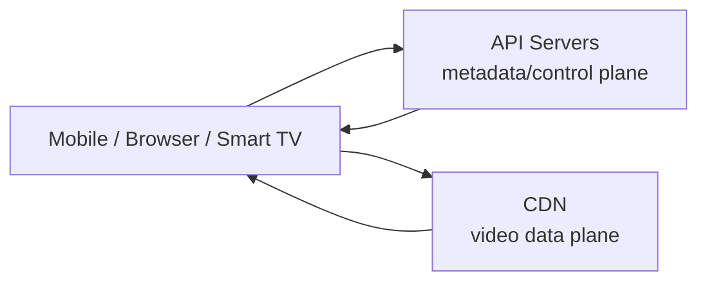
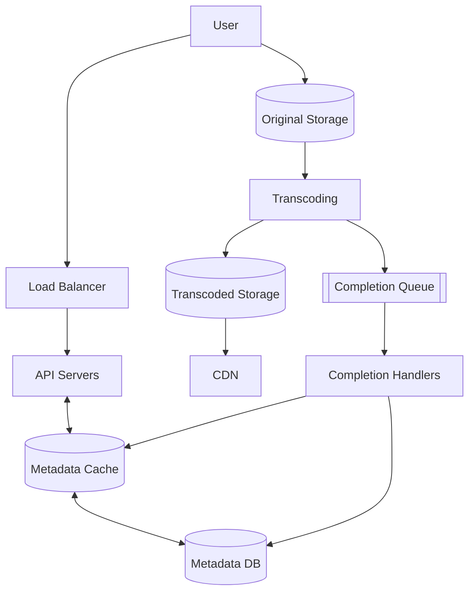
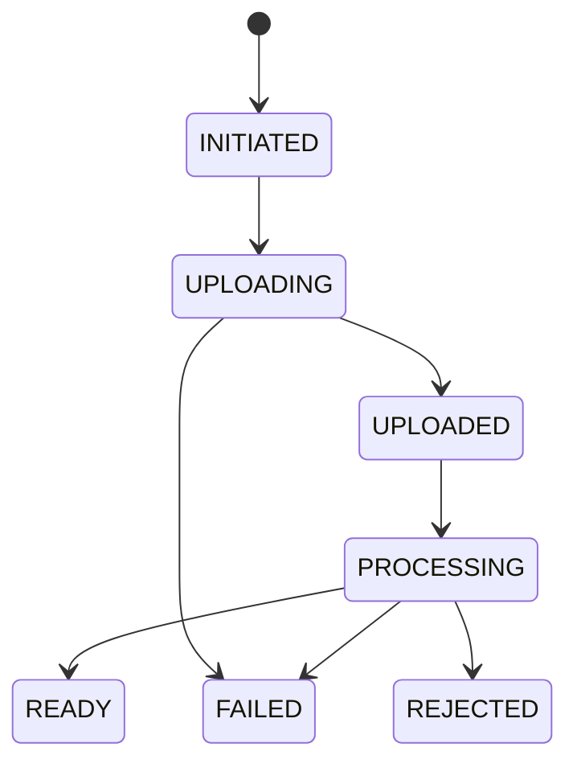
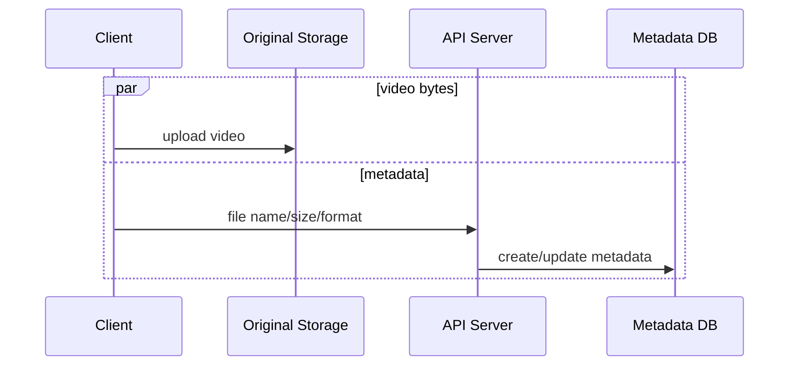
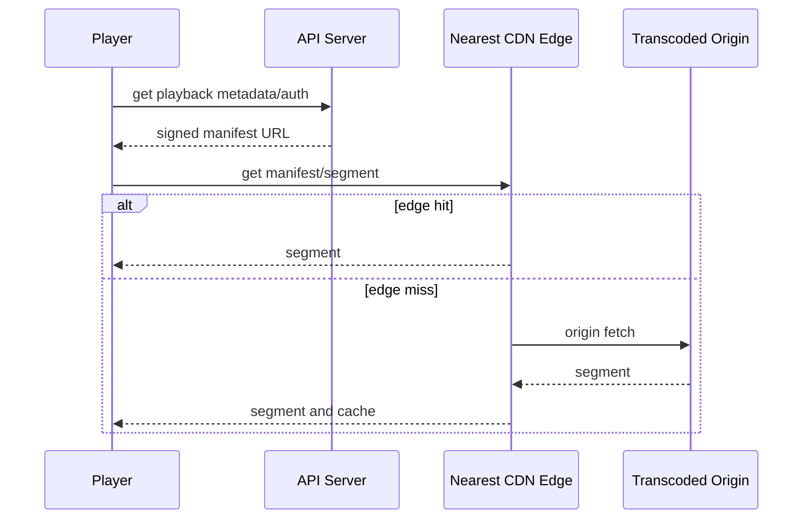
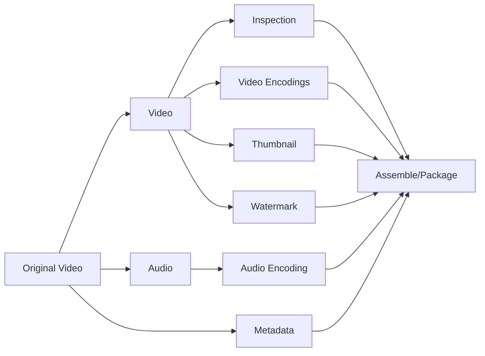
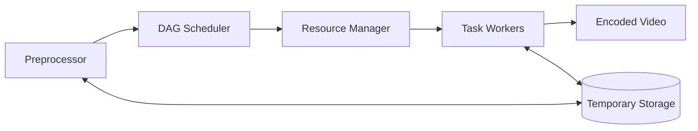
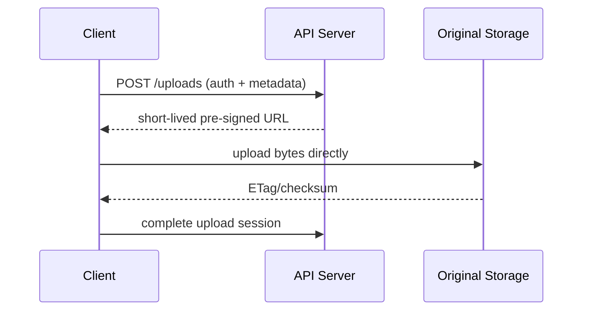
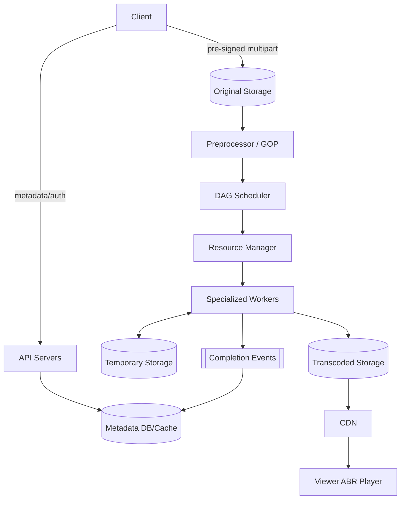

> 原书：Alex Xu，*System Design Interview: An Insider's Guide*（Second Edition）
> 原章：Chapter 14, *Design YouTube*
> 本章主线：先把巨大的 YouTube 问题收敛为上传和观看视频，并确定全球用户、多终端、多格式/分辨率、加密、1 GB 上限、成本与可靠性要求；再复用云对象存储和 CDN，把上传拆成原片与 metadata 两条并行流，把播放变成客户端从就近 CDN 按流媒体协议渐进获取分片；深入时用 GOP 和 DAG 将检查、音视频编码、缩略图、水印与组装拆成可并行任务，由 Preprocessor、DAG Scheduler、Resource Manager、Worker 和临时存储协作；最后围绕分块上传、地域接入、消息队列、预签名 URL、DRM、长尾 CDN 成本和分层错误恢复优化系统。

## 0. 学习目标、边界与全章路线

视频平台表面只有两个动作：创作者上传、观众点击播放。背后却同时包含：

- 大对象上传和断点续传；
- 原片持久化；
- 视频检查与内容安全；
- 多编解码器、多分辨率、多码率转码；
- 音视频和 metadata 处理；
- DAG 任务依赖与资源调度；
- 全球 CDN 分发；
- 自适应码率播放；
- 加密、DRM 与水印；
- 以 PB 计的存储和出口成本；
- 异步流程中的状态、重试、幂等与下架。

原章按四步框架展开：


读完后，应当能够回答：

1. 为什么上传成功、转码完成、CDN 可用和视频 ready 是不同状态？
2. 为什么视频二进制绕过 API Server 直传对象存储，而 metadata 走 API？
3. 原始存储、临时存储、转码存储和 CDN 分别保存什么？
4. Container、codec、resolution、bitrate 与流媒体协议有什么区别？
5. 为什么同一原片要产生多个 rendition，客户端如何自适应切换？
6. GOP 为什么是切分、并行转码和断点上传的重要边界？
7. DAG 如何表达串行依赖和并行任务，关键路径怎样决定转码时长？
8. Preprocessor、DAG Scheduler、Resource Manager 与 Task Worker 的职责为何不能混在一起？
9. Task/Worker/Running 三个队列如何支持资源调度与失败恢复？
10. 预签名 URL 解决授权问题时，还有哪些安全边界没有解决？
11. CDN 长尾优化为什么不能只看命中率，还要比较回源成本和首播延迟？
12. 为什么低热视频适合少转码或按需转码，热门视频适合提前生成完整码率梯？
13. 可恢复错误与不可恢复错误如何分类，重试为什么必须幂等、有界？
14. 直播为什么不能简单复用点播的大规模并行批处理？
15. 视频下架如何快速穿透 metadata、CDN、缓存和下载 URL？

本文严格沿原书顺序展开。补充的状态机、码率/存储推导、关键路径、分块上传协议、幂等任务、ABR 缓冲、内容安全和可运行 DAG 示例属于工程背景，不是作者逐式给出的原文。

---

## 1. 问题背景：全球视频系统的规模

原书列出 2020 年 YouTube 的历史统计，用来建立规模直觉：

- 20 亿 MAU；
- 每天观看 50 亿视频；
- 73% 美国成年人使用；
- 5000 万创作者；
- 2019 年广告收入 151 亿美元；
- 占移动互联网流量 37%；
- 支持 80 种语言。

这些数字不是本题的容量输入。本章随后采用简化的 500 万 DAU。背景数字表达的是：视频系统全球化、流量巨大、成本敏感，不能把它看成普通文件 CRUD。

---

## 2. Step 1：理解问题并确定范围

### 2.1 核心功能

只设计：

1. 快速上传视频；
2. 平滑观看视频。

评论、点赞、分享、播放列表、订阅、推荐等暂不深入。45–60 分钟内先闭合最难的媒体数据面。

### 2.2 客户端

- Mobile App；
- Web Browser；
- Smart TV。

它们在 codec、屏幕、CPU、网络和播放器能力上不同，因此需要多种编码输出和 manifest 能力协商。

### 2.3 规模与使用时长

$$
DAU=5,000,000
$$

平均每天使用 30 分钟。原书后续估算另假设每人观看 5 个视频。

### 2.4 全球用户

要求：

- 就近上传；
- 就近播放；
- 跨地域 metadata；
- 全球 CDN；
- 地域版权和下架；
- 多语言 metadata；
- 故障切换。

### 2.5 多分辨率和格式

接受多数输入格式，并生成适合不同终端和带宽的输出。上传格式不是最终播放格式。

### 2.6 加密

原书要求加密，后续讨论：

- AES 媒体加密；
- DRM；
- 授权策略；
- 水印。

还应区分传输 TLS、静态加密和端到端内容授权。

### 2.7 文件大小上限

最大 1 GB，目标为中小视频。上限影响：

- 分块数量；
- 上传超时；
- 存储配额；
- 安全扫描；
- 客户端重试；
- 预签名 URL 条件。

### 2.8 复用云服务

面试官建议使用云对象存储、CDN 等。系统设计不等于从零实现所有基础设施；关键是选对抽象、理解边界和故障语义。

### 2.9 功能/非功能总结

- 快速上传；
- 平滑播放；
- 手动/自动切换质量；
- 低基础设施成本；
- 高可用、可扩展、可靠；
- Mobile/Web/TV。

### 2.10 还应补问

- 点播还是直播？本章是点播；
- 视频平均时长和码率？
- 转码 ready SLO？
- 是否允许上传后立刻播放原片？
- 是否有私密/付费视频？
- 保留原片多久？
- 需要多少码率和 codec？
- 内容审核在发布前还是发布后？
- 是否允许断点续传和多端上传？
- 视频修改后是新版本还是覆盖？

---

## 3. 粗略估算

### 3.1 每日上传数

10% DAU 每天上传一条：

$$
Uploads_{day}=5,000,000\times10\%=500,000
$$

平均上传请求率：

$$
QPS_{upload}=\frac{500,000}{86400}\approx5.79
$$

上传 QPS 很低，但每条 300 MB，瓶颈是字节、并发时长和转码计算，不是 API request count。

### 3.2 每日原片容量

$$
Storage_{original/day}=500,000\times300\ \text{MB}=150\ \text{TB}
$$

一年约：

$$
150\times365=54.75\ \text{PB}
$$

还未计算多副本、转码版本、缩略图、音轨、备份和日志。

### 3.3 平均上传字节率

$$
Ingress=\frac{150\ \text{TB}}{86400\ \text{s}}
\approx1.736\ \text{GB/s}
\approx13.9\ \text{Gb/s}
$$

活动/时区峰值可能数倍。上传中心和对象存储吞吐要按 bytes/s 而非 5.79 QPS 规划。

### 3.4 每日播放量与 CDN 出口

每人 5 个视频：

$$
Views_{day}=5,000,000\times5=25,000,000
$$

按每次平均传输 0.3 GB：

$$
Egress_{day}=25,000,000\times0.3=7,500,000\ \text{GB}=7.5\ \text{PB}
$$

平均约 694 Gb/s；实际有大量未看完、不同码率和缓存命中，必须用真实观看时长/bitrate 估算。

### 3.5 原书 CDN 成本

假设美国出口单价 $0.02/GB$：

$$
Cost_{day}=5,000,000\times5\times0.3\times0.02
=\$150,000/day
$$

一年约 5475 万美元。原书据此把 CDN 成本优化列为重点。

### 3.6 转码存储放大

若原片大小 $S$，生成 rendition 大小比例为 $r_1,...,r_m$：

$$
StoragePerVideo=S\left(1+\sum_{i=1}^{m}r_i\right)
$$

例如 5 个版本合计为原片 1.8 倍，连原片共 2.8 倍：150 TB/day 变 420 TB/day。Codec 压缩率和视频时长决定真实值。

---

## 4. Step 2：复用云基础设施

原书强调：

- 面试重在选择合适技术，不必深挖对象存储/CDN 内部；
- 自建全球 Blob Storage/CDN 极其复杂昂贵；
- Netflix 使用 AWS，Facebook 使用 Akamai 等外部能力。

高层三组件：



API 处理上传 URL、metadata、用户、推荐等；视频播放数据不穿过 API Server。

---

## 5. 上传高层组件

### 5.1 User 与 Load Balancer

客户端上传/管理，LB 分发控制面请求到无状态 API。

### 5.2 API Servers

除视频二进制流外的请求：

- 认证授权；
- 创建 upload session；
- 生成预签名 URL；
- metadata；
- 状态查询；
- 通知客户端 ready。

### 5.3 Metadata DB/Cache

Metadata DB 分片复制，保存：

```text
video_id, owner_id, title, source object key,
size, format, duration, processing_status,
renditions, manifest, visibility, created_at
```

Cache 保存热点 video/user metadata。二进制不放关系数据库。

### 5.4 Original Storage

Blob/Object Storage 保存原始上传。原片是重新转码和审计的源，但保留周期可按成本策略调整。

### 5.5 Transcoding Servers

把原格式转换为不同：

- codec；
- container；
- resolution；
- bitrate；
- streaming segment/manifest。

### 5.6 Transcoded Storage 与 CDN

前者是转码制品的权威对象存储，后者是全球边缘缓存。CDN miss 回源 Transcoded Storage。

### 5.7 Completion Queue/Handler

转码完成事件进入持久队列；Handler 更新 Metadata DB/Cache。至少一次投递要求状态更新幂等。



---

## 6. 上传 Flow A：视频二进制

原书步骤：

1. 视频上传 Original Storage；
2. Transcoding Server 取原片并转码；
3. 完成后并行：
   - 3a. 制品写 Transcoded Storage；
   - 3b. 完成事件入 Completion Queue；
4. Transcoded Storage 内容分发到 CDN；
5. Completion Handler 更新 metadata；
6. API 通知客户端视频 ready。

### 6.1 “完成事件”顺序边界

只有制品已持久化、manifest 完整且可读，metadata 才能切 `READY`。若先发 completion、后写制品，用户会看到 ready 却 404。

安全顺序：

```text
write all required artifacts
→ verify checksums/manifests
→ publish completion event
→ conditional metadata READY
```

### 6.2 状态机



“上传成功”和“可播放”分别是 `UPLOADED` 与 `READY`。

---

## 7. 上传 Flow B：Metadata

客户端上传视频时，并行向 API 发送文件名、大小、格式、用户信息等。API 更新 Metadata Cache/DB。



### 7.1 并行流的协调

Metadata 先成功、文件失败：状态留 `UPLOADING/FAILED` 并清理超时 session。

文件先成功、metadata 失败：对象存储事件/后台 reconciler 可恢复，避免孤儿对象。

两条流通过 `video_id/upload_session_id` 关联，并由状态机而非执行先后决定业务完成。

---

## 8. 视频播放：Streaming 与 Downloading

- Download：完整文件复制到设备后使用；
- Streaming：边接收小块边播放，无需等待全片。

播放器维持 buffer，持续下载 segment。若 segment 下载速度低于播放消耗，buffer 下降并卡顿。

设 segment 时长 $d$、大小 $s$：

$$
bitrate=\frac{8s}{d}
$$

为稳定播放，有效吞吐应留余量：

$$
networkThroughput>bitrate\times safetyFactor
$$

网络变化时切换 rendition。

---

## 9. Streaming Protocol

原书列出：

- MPEG-DASH；
- Apple HLS；
- Microsoft Smooth Streaming；
- Adobe HDS。

协议控制 manifest、segment、编码和播放器交互。不同协议支持不同容器/codec/播放器。

### 9.1 HLS/DASH 的共同直觉

```text
manifest
  ├─ 360p / low bitrate segments
  ├─ 720p / medium bitrate segments
  └─ 1080p / high bitrate segments
```

客户端：

1. 下载 manifest；
2. 根据带宽/屏幕/buffer 选 rendition；
3. 下载若干秒 segment；
4. 播放时动态升降质量。

### 9.2 CDN 播放路径



视频数据不经过 API。私密/付费视频使用签名 URL/cookie/边缘鉴权。

---

## 10. Step 3：为什么需要转码

原书四个原因：

1. 原始视频巨大；
2. 设备/浏览器只支持部分格式；
3. 高带宽用户需要高质量，低带宽用户需要低码率；
4. 移动网络会变化，需要自动/手动切换质量。

### 10.1 Bitrate 与 Resolution

- Resolution：像素尺寸，如 1920×1080；
- Bitrate：单位时间传输 bit；
- 同分辨率可有不同 bitrate/质量；
- 高分辨率不必然高主观质量，codec 和源质量也重要。

### 10.2 Container 与 Codec

**Container** 是封装：视频轨、音轨、字幕、metadata，如 MP4/MOV/AVI。

**Codec** 是压缩/解压算法，如 H.264、VP9、HEVC。

`.mp4` 不表示一定使用 H.264；container 与 codec 不能混为一谈。

### 10.3 编码梯（encoding ladder）

原图生成：360p、480p、720p、1080p、4K。实际还要为 codec/bitrate/audio 组合生成 rendition。源片分辨率低时不应盲目上采样到 4K。

---

## 11. DAG：表达依赖与并行

原书 DAG：原片拆为 Video、Audio、Metadata；Video 可并行 Inspection、多个转码、Thumbnail、Watermark；Audio 单独编码；最终 Assemble。



### 11.1 为什么必须无环

任务依赖形成有向图。若有环 A→B→A，任何任务都等待对方，无法完成。构建时用拓扑排序检测环。

### 11.2 关键路径

任务时长 $t(v)$，DAG 总时长下界为最长依赖路径：

$$
T_{critical}=\max_{path}\sum_{v\in path}t(v)
$$

无限 Worker 也不能短于关键路径；优化非关键并行任务可能不改善总 ready 时间。

### 11.3 DAG 的价值

- 可配置不同创作者 pipeline；
- 独立任务类型；
- 依赖就绪后并行；
- 单任务重试；
- 资源按 CPU/GPU/codec 分配；
- 复用中间产物；
- 可观察每阶段延迟。

---

## 12. Transcoding Architecture 六组件



### 12.1 Preprocessor

原书四项职责：

1. 按 GOP 切分；
2. 为不能客户端切分的旧设备在服务端切分；
3. 根据配置生成 DAG；
4. 缓存 segmented video，并把 GOP/metadata 持久到临时存储以便重试。

### 12.2 GOP

Group of Pictures 是从关键帧开始的一组相关帧，通常几秒。按 GOP 边界切分：

- chunk 可独立解码；
- 支持 seek 和 ABR 切换；
- 并行转码；
- 失败只重做 chunk。

并非任意字节分块都可独立播放。

### 12.3 DAG Scheduler

将图分解为 stages，把依赖已满足任务放入 Resource Manager Task Queue。原书示例：

- Stage 1：Video/Audio/Metadata；
- Stage 2：Video Encoding、Thumbnail、Audio Encoding；
- 后续 Assemble。

### 12.4 Resource Manager

包含：

- Task Queue：待执行优先任务；
- Worker Queue：Worker 可用性/利用率；
- Running Queue：task-worker 绑定；
- Task Scheduler：选择任务和最佳 Worker。

流程：取最高优先任务 → 取最适 Worker → 下发 → 写 Running → 完成后移除。

### 12.5 Task Workers

不同 Worker 可专门：

- CPU/GPU encoding；
- thumbnail；
- audio；
- inspection；
- watermark；
- package。

Worker 无状态，输入输出在对象/临时存储，失败后可换节点重试。

### 12.6 Temporary Storage

- 小且频繁 metadata：内存/缓存；
- 视频/音频中间产物：Blob Storage；
- 完成后清理；
- 保留到重试/审计窗口结束。

清理必须引用计数/状态安全，不能某分支刚完成就删掉其他分支仍需的输入。

### 12.7 Encoded Video

最终输出如 `funny_720p.mp4`，生产中还包括 segments、manifest、字幕、音轨、校验和与加密 metadata。

---

## 13. 可运行示例：DAG 调度、关键路径、幂等重试与 Ready 状态

```python
from dataclasses import dataclass, field
from enum import Enum
from heapq import heappop, heappush

class VideoStatus(Enum):
    UPLOADED = "uploaded"
    PROCESSING = "processing"
    READY = "ready"
    FAILED = "failed"

@dataclass(frozen=True)
class Task:
    name: str
    duration: int
    dependencies: frozenset[str] = frozenset()

@dataclass
class Pipeline:
    tasks: dict[str, Task]
    completed: set[str] = field(default_factory=set)
    attempts: dict[str, int] = field(default_factory=dict)
    artifacts: set[str] = field(default_factory=set)
    status: VideoStatus = VideoStatus.UPLOADED

    def topological_order(self) -> list[str]:
        indegree = {name: len(task.dependencies) for name, task in self.tasks.items()}
        children: dict[str, list[str]] = {name: [] for name in self.tasks}
        for name, task in self.tasks.items():
            for dependency in task.dependencies:
                if dependency not in self.tasks:
                    raise ValueError(f"unknown dependency: {dependency}")
                children[dependency].append(name)

        ready = [name for name, degree in indegree.items() if degree == 0]
        order: list[str] = []
        while ready:
            name = ready.pop()
            order.append(name)
            for child in children[name]:
                indegree[child] -= 1
                if indegree[child] == 0:
                    ready.append(child)
        if len(order) != len(self.tasks):
            raise ValueError("DAG contains a cycle")
        return order

    def critical_path_duration(self) -> int:
        longest: dict[str, int] = {}
        for name in self.topological_order():
            task = self.tasks[name]
            predecessor = max(
                (longest[dependency] for dependency in task.dependencies),
                default=0,
            )
            longest[name] = predecessor + task.duration
        return max(longest.values(), default=0)

    def runnable(self) -> list[str]:
        return sorted(
            name
            for name, task in self.tasks.items()
            if name not in self.completed
            and task.dependencies <= self.completed
        )

    def run_task(self, name: str, *, succeed: bool = True) -> None:
        if name in self.completed:
            return  # idempotent duplicate delivery
        if name not in self.runnable():
            raise RuntimeError(f"task is not ready: {name}")
        self.status = VideoStatus.PROCESSING
        self.attempts[name] = self.attempts.get(name, 0) + 1
        if not succeed:
            return  # durable scheduler may retry the same task
        self.artifacts.add(f"artifact:{name}")
        self.completed.add(name)
        if self.completed == self.tasks.keys():
            required = {f"artifact:{task_name}" for task_name in self.tasks}
            if required <= self.artifacts:
                self.status = VideoStatus.READY

tasks = {
    "split": Task("split", 2),
    "inspect": Task("inspect", 3, frozenset({"split"})),
    "video_360": Task("video_360", 8, frozenset({"inspect"})),
    "video_720": Task("video_720", 12, frozenset({"inspect"})),
    "audio": Task("audio", 4, frozenset({"split"})),
    "thumbnail": Task("thumbnail", 2, frozenset({"inspect"})),
    "package": Task(
        "package",
        2,
        frozenset({"video_360", "video_720", "audio", "thumbnail"}),
    ),
}
pipeline = Pipeline(tasks)
assert pipeline.critical_path_duration() == 19  # split + inspect + 720p + package

pipeline.run_task("split")
pipeline.run_task("inspect")
pipeline.run_task("audio", succeed=False)
pipeline.run_task("audio", succeed=True)
pipeline.run_task("audio")  # duplicate delivery does nothing
pipeline.run_task("thumbnail")
pipeline.run_task("video_360")
pipeline.run_task("video_720")
assert pipeline.status is VideoStatus.PROCESSING
pipeline.run_task("package")
assert pipeline.status is VideoStatus.READY
assert pipeline.attempts["audio"] == 2

cyclic = Pipeline({
    "a": Task("a", 1, frozenset({"b"})),
    "b": Task("b", 1, frozenset({"a"})),
})
try:
    cyclic.topological_order()
except ValueError:
    pass
else:
    raise AssertionError("cycle was not detected")

print("critical path:", pipeline.critical_path_duration())
print("attempts:", pipeline.attempts)
print("status:", pipeline.status)
```

示例把任务完成和 artifact 持久化绑定；真实系统还需条件写、lease/fencing、artifact checksum 和队列 ack，进程内 set 不能跨崩溃恢复。

---

## 14. 速度优化一：并行/可恢复上传

整文件失败后重传 1 GB 代价高。客户端按 GOP/可上传 part 切分并并行上传：

$$
T_{ideal}\approx\frac{S}{\min(B,kb)}
$$

- $S$：总大小；
- $B$：网络总带宽；
- $k$：并发块数；
- $b$：单连接吞吐。

并发不会突破总带宽 $B$，但可利用多连接并隐藏单连接延迟。

### 14.1 Multipart 状态

```text
upload_id
part_number
offset/size
checksum
etag
status
```

完成时验证所有 part、顺序、总大小和 hash，再原子 commit。失败只重传缺失 part。

### 14.2 GOP 与上传块

GOP 对齐便于边上传边转码和独立处理；若客户端不支持，原书让服务端接收整片后切分。上传协议 part 不一定必须等于播放 segment，但对齐可减少重切分。

---

## 15. 速度优化二：就近上传中心

美国用户上传北美中心，中国用户上传亚洲中心。原书提出可使用 CDN upload center。

优势：

- 更低 RTT；
- 更稳定吞吐；
- 减少公网长距离丢包；
- 上传后通过骨干进入原始存储/转码地域。

需考虑：

- 数据驻留；
- upload session 路由；
- 区域故障；
- 跨地域复制成本；
- 同一用户重试仍命中同 session；
- 边缘临时数据清理。

---

## 16. 速度优化三：全链路并行与消息队列

原始串行：

```text
download → encode → store → CDN
```

每一步等前一步全量完成。拆 chunk、DAG 和队列后：

- chunk 1 编码时 chunk 2 下载；
- 多 rendition 并行；
- audio/thumbnail 并行；
- 存储/通知并行；
- 不同视频并行。


队列使模块时间解耦，但不自动消除依赖：后续仍要等对应 artifact，且要处理至少一次、幂等、积压、DLQ 和背压。

---

## 17. 安全优化一：预签名上传 URL

原书三步：

1. Client 向 API 请求预签名 URL；
2. API 返回 URL；
3. Client 直传 Original Storage。



Azure 类似能力称 Shared Access Signature。

### 17.1 预签名 URL 应限制

- 过期时间；
- HTTP method；
- object key/prefix；
- 最大大小；
- content type；
- checksum；
- multipart part；
- 单次/有限使用策略。

Object key 由服务器生成，不能信任客户端路径。

### 17.2 它没有解决什么

- 恶意/违法内容；
- 声称 MIME 与真实内容不符；
- 压缩炸弹；
- 重复/盗版；
- 上传完成通知伪造；
- 泄漏 URL 在有效期内被滥用。

上传后仍需校验对象 metadata、hash、安全扫描和用户配额。

---

## 18. 安全优化二：保护视频

原书三种方式。

### 18.1 DRM

- Apple FairPlay；
- Google Widevine；
- Microsoft PlayReady。

播放器向 License Server 取得解密许可，可实施设备、时间和账号策略。DRM 提高盗取成本，不保证无法录屏。

### 18.2 AES 加密

Segment 加密，授权播放时发密钥/许可。密钥不能与视频同样公开缓存；需要轮换、KMS 和访问控制。

### 18.3 Visual Watermark

叠加 Logo/身份信息。静态水印标版权，动态/取证水印可追踪泄漏。水印任务可在 DAG 中按产品策略启用。

### 18.4 三者关系

- 传输 TLS：防链路窃听；
- 静态加密：防存储泄漏；
- DRM/AES 授权：控制播放；
- 水印：威慑和追踪；
- 都不能替代用户鉴权和下架机制。

---

## 19. 成本优化：长尾分布

少数视频频繁观看，大量视频很少/无人观看。原书提出四项。

### 19.1 只让热门视频常驻 CDN

冷视频由高容量 origin/video server 提供，或首次请求回源后缓存。

决策不能只看 popularity，还要比较：

$$
CDNCost(v)\quad vs\quad OriginCost(v)+MissLatencyPenalty(v)
$$

冷视频第一次播放会更慢，应设置分层阈值和预热。

### 19.2 冷内容减少 rendition，短视频按需编码

提前转码成本：

$$
Cost_{eager}=\sum_r EncodeCost_r+Storage_r
$$

按需成本：

$$
E[Cost_{ondemand}]=P(view)\times(EncodeCost+LatencyPenalty)
$$

低 $P(view)$ 时按需划算。并发首播需 singleflight，防同一冷视频重复转码。

### 19.3 只在热门地域分发

地域热度不同，避免全球预热。播放请求进入新地域后再动态复制/缓存。

### 19.4 自建 CDN 与 ISP 合作

规模巨大时在 ISP 附近部署 Open Connect 类节点可降低出口费和延迟。代价是硬件、调度、运维、容量预测和多 ISP 合作，只有超大平台合理。

### 19.5 历史分析是前提

需要：

- view count/velocity；
- region；
- watch time；
- bitrate；
- video size；
- cache hit/miss；
- origin egress；
- encoding/storage cost。

“长尾”是统计规律，不代表新上传视频永远冷。新内容需探索/预热策略。

---

## 20. Error Handling：分类原则

### 20.1 Recoverable

如 segment 转码瞬时失败：有界重试。必须：

- 任务幂等；
- 指数退避 + jitter；
- 最大次数/时间；
- 换 Worker；
- 保留中间产物；
- 超预算进入 DLQ/FAILED。

### 20.2 Non-recoverable

如格式损坏/不支持：停止该视频相关任务，标 FAILED/REJECTED，返回明确错误，清理临时资源。

不要把确定性坏输入无限重试。

---

## 21. 原书逐组件错误 Playbook

### 21.1 Upload error

重试若干次；分块上传只重传失败 part。客户端请求需 upload ID 和 checksum。

### 21.2 Split error

旧客户端不能 GOP 切分时上传整片，由服务端切分。服务端仍要限制资源和超时。

### 21.3 Transcoding error

重试。若特定 codec/源组合永久失败，可降级少一个 rendition，但 metadata 必须准确标记可用集合。

### 21.4 Preprocessor error

根据持久配置重新生成 DAG。DAG generation 必须确定性并版本化。

### 21.5 DAG Scheduler error

重新调度 task。任务状态和依赖不能只在 scheduler 内存。

### 21.6 Resource Manager queue down

使用副本。队列要持久、多副本，故障切换防重复分配和丢任务。

### 21.7 Task Worker down

Lease 超时后在新 Worker 重试；fencing 防旧 Worker 恢复后覆盖新产物。Artifact key 包含 task/version，条件提交。

### 21.8 API Server down

无状态，请求转其他节点。上传 bytes 已直传对象存储，不随 API 节点丢失。

### 21.9 Metadata Cache down

副本服务读取，补新节点，miss 回源 DB。防缓存故障造成 DB 雪崩。

### 21.10 Metadata DB down

- Primary down：提升 replica；
- Replica down：其他 replica 读并补副本。

故障切换要考虑复制延迟、双主和 `READY` 状态一致性。

---

## 22. 幂等、对账与孤儿清理

异步视频系统会产生：

- 有 object 无 metadata；
- 有 metadata 无 object；
- artifact 已写但 completion 丢失；
- metadata READY 但 artifact 缺失；
- pipeline FAILED 但临时对象残留。

需要 periodic reconciler：

```text
scan stale UPLOADING/PROCESSING
compare object manifests and metadata
republish missing events
repair state or mark failed
garbage-collect unreferenced objects after grace period
```

所有任务以 `(video_id,pipeline_version,task_id,input_hash)` 幂等，输出不可变/版本化。

---

## 23. Step 4：API Tier 与 Database 扩展

### 23.1 API

无状态水平扩展，LB 路由。认证/session 外置；大文件不经过 API；热点 metadata 缓存。

### 23.2 Metadata DB

- 复制提高可用和读吞吐；
- 按 video ID/owner 分片；
- 唯一 ID；
- 状态条件更新；
- Read replica 延迟不能返回错误 READY；
- Search/analytics 走派生系统。

### 23.3 二进制存储

对象存储按 video/artifact key 分布，多副本/纠删码，生命周期迁移冷层。DB 只存引用和校验和。

---

## 24. Step 4：Live Streaming

点播：完整原片可大规模切块并行，等待数分钟转码可接受。

直播：

- 端到端延迟更严格；
- chunk 连续产生，不能等待未来数据；
- 并行窗口更小；
- 编码、package、分发在线流水；
- 慢重试不可接受，常跳过坏 segment/降级质量；
- 需要 ingest protocol、直播转码、实时 manifest、DVR 和断流处理。

原书指出直播对“批量并行”的需求更低，因为小 chunk 实时处理，更强调低关键路径与快速错误决策。

---

## 25. Step 4：Video Takedown

违规版权、色情或非法视频需删除。来源：

- 上传检查；
- 自动内容识别；
- 用户举报；
- 法律请求。

### 25.1 下架顺序

```text
authoritative metadata status = BLOCKED
→ playback authorization denies
→ CDN purge / short TTL / denylist
→ search/feed/index removal
→ cancel processing tasks
→ retention/legal policy decides physical deletion
```

先阻止播放，再异步清理所有副本。只删 DB 行可能让 CDN 继续播放；只 purge CDN 可能从 origin 再回源。

### 25.2 Region-specific takedown

版权可能只在部分地区受限，metadata/edge policy 需要按地域判定，不能全局物理删除替代访问策略。

---

## 26. 监控与 SLO

### 26.1 上传

- upload initiation/success；
- bytes/s；
- part retry；
- time to upload；
- checksum mismatch；
- abandoned sessions；
- regional ingress。

### 26.2 转码

- queue depth/oldest age；
- time-to-ready P50/P99；
- critical path/stage duration；
- Worker CPU/GPU utilization；
- retry/DLQ；
- rendition success；
- temporary storage age；
- artifact checksum。

### 26.3 播放

- startup time；
- rebuffer ratio；
- bitrate/resolution；
- quality switches；
- CDN hit；
- origin egress；
- playback errors；
- completion/watch time。

### 26.4 成本与安全

- CDN $/view/hour；
- storage/video；
- encode cost/minute；
- cold on-demand hit rate；
- DRM/license errors；
- unauthorized upload；
- moderation/takedown latency。

### 26.5 SLO 示例

```text
P99 upload session API < 200 ms
P95 300MB upload on target network < product threshold
P95 time-to-ready < 5 min
P95 playback startup < 2 s
rebuffer ratio < target
takedown playback block < minutes
```

数字应按产品和网络确定，不是原书固定要求。

---

## 27. 容易混淆的概念与常见误区

### 27.1 Upload complete 与 Ready

Upload complete 只表示原片持久化；Ready 要所有必需转码制品、manifest、CDN/Origin 可读且 metadata 已切换。

### 27.2 Streaming 与 Downloading

Streaming 边收边播；Download 完整复制。Streaming 仍会在客户端缓存数据。

### 27.3 Container 与 Codec

MP4 是 container；H.264/HEVC 是 codec。扩展名不能完整说明编码能力。

### 27.4 Resolution 与 Bitrate

像素数和每秒 bit 不同。相同 1080p 可有多个质量/码率。

### 27.5 Transcoding 与 Packaging

Transcoding 改 codec/bitrate/resolution；packaging 切 segment、建 manifest、封装协议。可在 DAG 中分开。

### 27.6 GOP 与任意 Chunk

GOP 从关键帧开始、可独立解码；任意字节 chunk 未必可播放或独立转码。

### 27.7 DAG 与普通队列

队列存 ready task；DAG 表达依赖。没有 DAG，Worker 不知道 Assemble 必须等哪些产物。

### 27.8 增加 Worker 一定缩短转码

只到关键路径下界；依赖串行、存储 I/O 或特定 GPU 资源仍限制。

### 27.9 Message Queue 自动保证 exactly once

通常至少一次。Task、artifact 和 metadata 更新必须幂等。

### 27.10 Completion event 等于制品可用

事件必须在 artifact 持久化/校验后发布；消费者还应验证 manifest。

### 27.11 Blob Storage 与数据库 BLOB 列

原书借 BLOB 定义说明大二进制对象；系统设计中的云 Blob/Object Storage 通常是独立对象服务，不应把视频塞进 Metadata DB 的 BLOB 列。

### 27.12 CDN 是权威存储

CDN 是缓存/分发层，Transcoded Storage 是权威 origin。Edge 可淘汰内容。

### 27.13 预签名 URL 表示文件安全

它只授权特定上传操作，不能证明内容安全、格式正确或用户拥有版权。

### 27.14 DRM 等于无法盗版

DRM 提高门槛，无法阻止录屏和所有攻击。可结合水印和风控。

### 27.15 所有视频都应该完整转码并全球 CDN

长尾内容可能无人看。Popularity 驱动 rendition/region/cache 可显著降成本。

### 27.16 On-demand encoding 总是省钱

冷视频省预计算，但首播慢、突发并发可能重复计算，需要 singleflight 和最小基础版本。

### 27.17 视频上传 QPS 低所以系统简单

5.79 QPS 对应约 1.736 GB/s 平均 ingress 和巨大转码，不可只看请求数。

### 27.18 Metadata Cache 可决定 Ready

权威状态在 DB/状态服务；Cache 可能旧。条件更新和 artifact manifest 决定 Ready。

### 27.19 Retry 所有错误

Malformed/unsupported input 是确定性错误，应停止；瞬时网络/Worker 故障才重试。

### 27.20 Live 是点播加更短 segment

直播还改变 ingest、调度、错误预算、延迟和状态；不能仅改 segment 时长。

---

## 28. 本章知识结构

### 28.1 需求与成本层

- 上传/观看；
- 全球多终端；
- 多格式、质量切换、加密；
- 1 GB 上限；
- 500k uploads/day、150 TB/day；
- 25M views/day、$150k CDN/day。

### 28.2 控制面与数据面

- API/Metadata 是控制面；
- Original/Transcoded Storage、CDN 是媒体数据面；
- 视频 bytes 绕过 API；
- 状态机连接两条并行流。

### 28.3 转码层

- GOP；
- Container/Codec/Bitrate/Resolution；
- DAG；
- Preprocessor；
- Scheduler；
- Resource Manager；
- Worker/Temporary/Encoded artifacts。

### 28.4 优化层

- Multipart/GOP 并行上传；
- 全球 Upload Center；
- Queue/DAG 全链路并行；
- Pre-signed URL；
- DRM/AES/Watermark；
- 长尾 CDN、地域和按需转码。

### 28.5 可靠性与运行层

- 可恢复/不可恢复错误；
- 幂等任务与 artifact；
- Queue replica、Worker lease；
- Metadata DB/cache failover；
- Reconciler/garbage collection；
- 直播与下架；
- SLO、质量与成本监控。



---

## 29. 核心结论与一般设计方法

### 29.1 核心结论

1. **先把 YouTube 缩小为上传和播放。** 媒体数据面已足够覆盖最关键系统难点。
2. **大对象 bytes 不应经过 API Server。** API 发预签名权限并管理 metadata，客户端直传对象存储。
3. **上传完成不等于可播放。** Ready 必须建立在必需 artifact 持久、校验和 metadata 原子发布之上。
4. **播放应从就近 CDN 直接获得 segments。** API 只提供授权、manifest 和 metadata。
5. **多 rendition 是兼容性和 ABR 的基础。** Container、codec、resolution 和 bitrate 是不同维度。
6. **GOP 是独立处理的媒体边界。** 支持切分、并行、seek、质量切换和局部重试。
7. **DAG 把可配置 pipeline 和并行性显式化。** 总时长由关键路径决定，不是 Worker 越多越无限加速。
8. **调度与执行要分离。** Scheduler 管依赖，Resource Manager 管资源，Worker 只执行幂等任务。
9. **临时存储使失败重试不必从原片重做。** 清理必须等所有依赖结束并保留恢复窗口。
10. **队列带来解耦和并行，也带来至少一次、积压与幂等要求。**
11. **预签名 URL 只解决有限上传授权。** 内容验证、配额、恶意文件和版权仍需后处理。
12. **长尾是 CDN/转码成本优化依据。** 热门内容预转码/全球缓存，冷内容减少版本、地域分发或按需编码。
13. **错误要按可恢复性分类。** 重试必须有界，坏输入立即终止，状态和制品由 reconciler 对账。
14. **直播和下架不是小附加项。** 直播重塑延迟/错误模型，下架要求从授权层先快速阻断再清理副本。

### 29.2 一般设计流程

$$
\boxed{
\text{澄清上传、播放、终端、格式、规模、安全和成本}
\rightarrow
\text{分离 metadata 控制面与媒体数据面}
\rightarrow
\text{设计原片/转码存储和 CDN 播放}
\rightarrow
\text{用状态机定义可播放边界}
\rightarrow
\text{按 GOP 构造转码 DAG}
\rightarrow
\text{分离调度、资源和幂等 Worker}
\rightarrow
\text{分块/就近上传并全链路并行}
\rightarrow
\text{加入预签名、DRM 和内容安全}
\rightarrow
\text{按热度优化转码、存储和 CDN}
\rightarrow
\text{分类错误、对账、监控和下架}
}
$$

### 29.3 面试中的完整表达骨架

> 需求是 5M DAU、上传/观看、多终端、全球、多格式、1GB、加密和低成本。10% 用户日传 300MB，约 500k uploads/day、150TB/day 原片和 1.736GB/s 平均 ingress；每天 25M 次观看、若每次 0.3GB 则 7.5PB egress，按 $0.02/GB 是 $150k/day。API 只做认证、metadata、upload session 和预签名 URL，客户端分块直传 Original Storage；Metadata 与 bytes 并行，以 video ID 状态机关联。对象持久后 Preprocessor 按 GOP 切分并生成 DAG，Scheduler 只释放依赖就绪任务，Resource Manager 按 codec/GPU/负载匹配 Worker，Worker 把不可变 artifact 写临时/转码存储。全部必需 rendition/manifest 校验后才发 completion 并条件更新 READY。播放器从 CDN 读 HLS/DASH manifest 和 segment，按带宽/buffer 自适应码率。上传用 multipart、就近中心；安全用短时受限预签名、扫描、DRM/AES/水印。热门视频完整预转码并全球 CDN，冷视频少版本、区域缓存或 singleflight 按需转码。队列至少一次，所以 task/artifact/metadata 更新幂等；瞬时错误退避重试，坏格式停止，Worker 用 lease/fencing，后台 reconciler 修复孤儿状态。监控 time-to-ready、关键路径、队列 age、CDN hit/egress、startup、rebuffer、成本和下架延迟。

### 29.4 章末自检

- [ ] 能否复算 500k uploads/day、150TB/day 和 $150k CDN/day？
- [ ] 能否解释上传 QPS 低但字节吞吐很高？
- [ ] 能否区分 API 控制面、对象存储和 CDN？
- [ ] 能否完整讲出上传两条并行流？
- [ ] 能否说明 completion event 的安全发布顺序？
- [ ] 能否区分 Streaming 与 Downloading？
- [ ] 能否解释 manifest、segment 和 ABR？
- [ ] 能否区分 container、codec、resolution 和 bitrate？
- [ ] 能否列出转码的四个必要性？
- [ ] 能否画出原书 Inspection/Encoding/Thumbnail/Watermark/Assemble DAG？
- [ ] 能否用最长路径推导 DAG 完成下界？
- [ ] 能否说明 Preprocessor 的四项职责？
- [ ] 能否区分 DAG Scheduler 与 Resource Manager？
- [ ] 能否说明 Task/Worker/Running Queue 如何协作？
- [ ] 能否设计幂等 Task、artifact 和 completion？
- [ ] 能否说明 GOP 与任意字节 chunk 的区别？
- [ ] 能否设计 multipart 断点续传和 checksum？
- [ ] 能否列出预签名 URL 的限制与未解决问题？
- [ ] 能否区分 TLS、静态加密、DRM 和水印？
- [ ] 能否用长尾判断 CDN/转码/地域策略？
- [ ] 能否区分可恢复与不可恢复错误并逐组件处理？
- [ ] 能否设计 reconciler 和临时对象清理？
- [ ] 能否说明直播为什么需要不同关键路径和错误模型？
- [ ] 能否设计先阻断播放、后清理副本的视频下架流程？

如果这些问题都能回答，就不只是知道“视频放 CDN”，而是理解了本章的核心方法：**把不可预测的大对象上传、昂贵的媒体处理和全球播放拆成由状态机连接的独立数据面；用 GOP 与 DAG 将重计算变成可并行、可重试的不可变任务，再由热度、地域、设备能力和错误类别决定哪些制品提前计算、保存和分发。**
