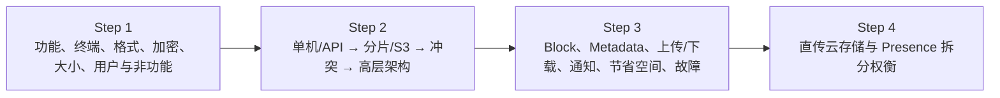
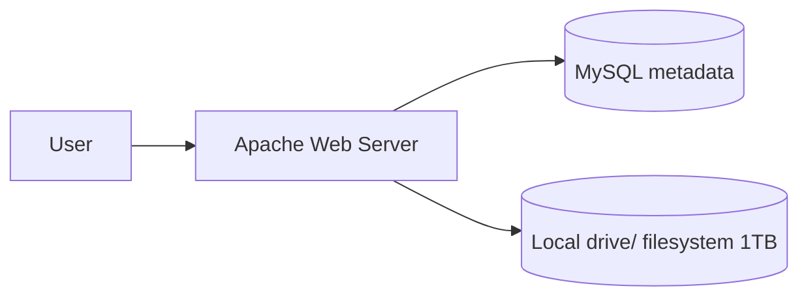
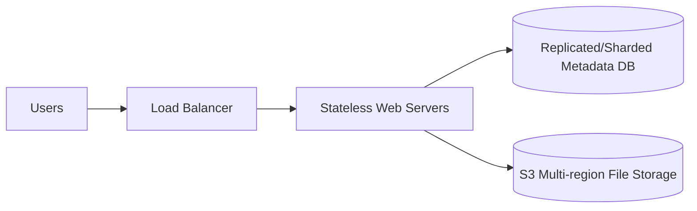
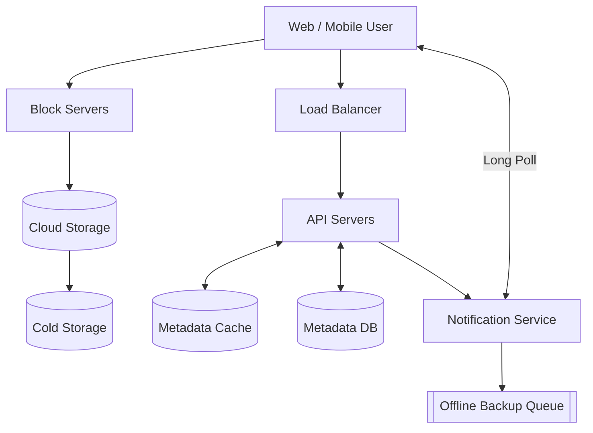
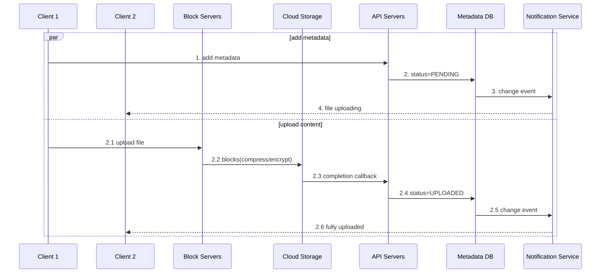
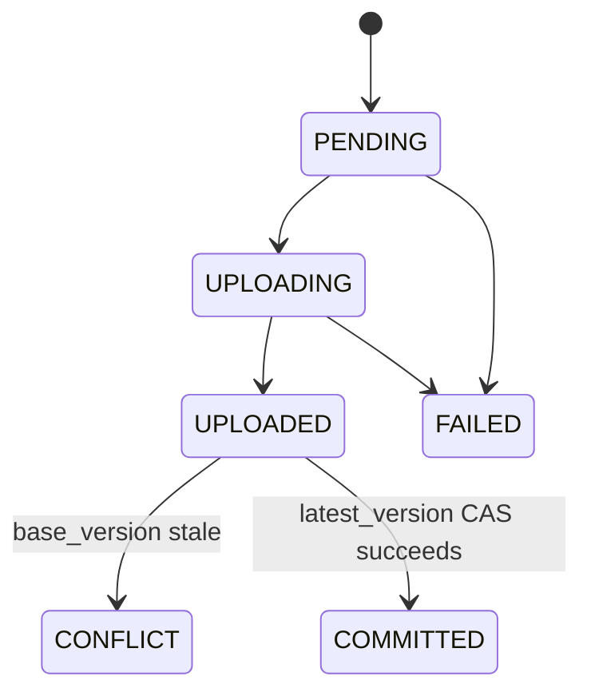
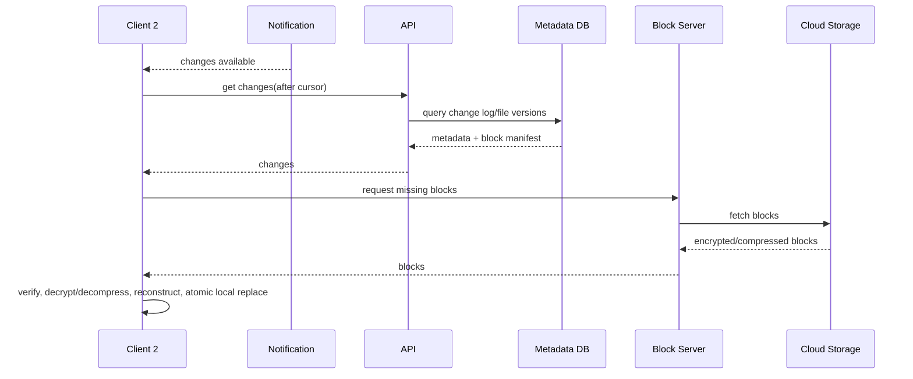
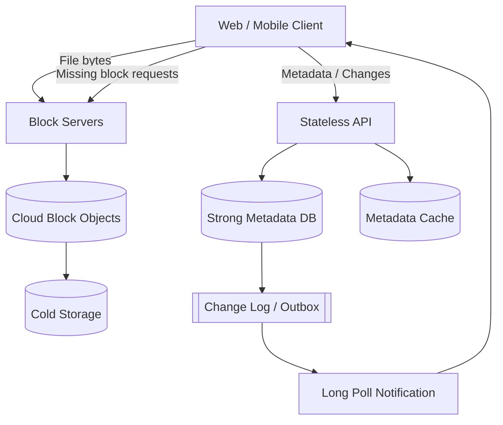

> 原书：Alex Xu，*System Design Interview: An Insider's Guide*（Second Edition）
> 原章：Chapter 15, *Design Google Drive*
> 本章主线：先把 Google Drive 收敛为上传/下载、跨设备同步、版本历史、共享和变化通知，并明确可靠性、快速同步、低带宽、高可用；再从 Apache + MySQL + 本地目录的单机原型出发，由容量告警逐步引入按用户分片、S3、多地域复制、负载均衡、无状态 Web 和独立 Metadata DB；同步正确性通过不可变版本与乐观条件写处理冲突，带宽通过 4 MB 内容块、压缩和 delta sync 降低；最终用 Block Server、Metadata、Cloud/Cold Storage、Long Poll Notification 和离线变更队列构造上传/下载闭环，并逐项处理组件故障、存储成本以及客户端直传的权衡。

## 0. 学习目标、边界与全章总览

Google Drive 类系统不是“把文件放到 S3”这么简单。它要同时维护：

- 文件二进制块；
- 文件/文件夹命名空间；
- 当前版本与历史版本；
- 多设备本地副本；
- 分享与权限；
- 变更通知；
- 冲突副本；
- 上传中间状态；
- 去重、压缩、加密和冷热分层；
- 数据丢失不可接受的持久性保证。

最重要的边界是：

```text
Metadata 决定“文件是什么、最新版本是哪一个、由哪些块组成”
Block/Object Storage 保存“实际 bytes”
Notification 只提示“有变化”，客户端仍要拉取权威 Metadata
```

原章沿以下路径推进：



读完后，应当能够回答：

1. 为什么本地路径不能作为稳定文件身份？
2. Simple upload 与 resumable upload 应怎样选择？
3. 为什么 240 upload QPS 看起来很低，实际每天仍产生约 10 TB 新数据？
4. 单服务器从容量、持久性和独立扩展上如何逐步失效？
5. S3 多副本、版本历史和备份分别解决什么问题？
6. 为什么元数据必须强一致，文件块却可以不可变、最终复制？
7. “first version wins” 如何用 `base_version` 条件写实现，而不是靠到达时间猜测？
8. 4 MB block 如何支持 delta sync、并行上传和断点续传？
9. 内容 hash 在块身份、去重和完整性校验中各是什么角色？
10. 压缩、hash、加密的顺序怎样影响去重和安全？
11. `File`、`File_version` 与 `Block` 三层如何重建任意版本？
12. 两条并行上传流如何防止 metadata 已显示 uploaded、但块尚未完整？
13. Notification 为什么只需要 Long Poll，而聊天更适合 WebSocket？
14. 离线设备怎样用 change cursor 补拉，而不是依赖易失 cache？
15. 块去重、版本保留和 Cold Storage 怎样分别节省空间？
16. 客户端直传为什么更快，却会复制跨平台逻辑并扩大可信边界？
17. 任一 Block/API/DB/Notification 节点故障后怎样恢复且不丢数据？

本文严格沿原书顺序展开。补充的乐观并发控制、内容寻址、Merkle/manifest、outbox/change log、租约与可运行同步模型属于标准工程背景，不是作者逐式给出的原文。

---

## 1. Step 1：理解问题并确定设计范围

### 1.1 核心功能

面试官要求：

- 上传与下载文件；
- 文件同步；
- 通知。

原书进一步列出：

- Drag & drop 添加文件；
- 多设备同步；
- 查看修订历史；
- 分享文件；
- 编辑、删除、分享时通知。

不设计 Google Docs 多人实时协作。后者需要 OT/CRDT、光标状态和细粒度操作日志，不能等同于整文件同步。

### 1.2 Web 与移动端

要求：

- 不稳定网络断点续传；
- 后台同步；
- 本地文件监听；
- 离线变更；
- 多设备 cursor；
- 移动流量节省；
- 平台一致的块/加密语义。

### 1.3 任意文件类型

系统不能依赖文本 merge。二进制冲突通常保留两个副本，由用户选择。压缩算法应按文件类型选择，已压缩图片/视频再次 gzip 收益有限。

### 1.4 静态加密

原书要求存储中文件加密。需区分：

- TLS：传输中；
- Server-side encryption：云存储静态加密；
- 应用层 block encryption；
- 客户端端到端加密。

原章 Block Server 集中加密，不是 E2EE；服务器仍可解密/处理内容。

### 1.5 文件最大 10 GB

按 4 MB block，十进制近似块数：

$$
Blocks_{max}=\left\lceil\frac{10,000\ \text{MB}}{4\ \text{MB}}\right\rceil=2500
$$

若 10 GiB/4 MiB 也是 2560 块。必须声明十进制还是二进制单位。

### 1.6 用户规模

- 5000 万注册用户；
- 1000 万 DAU；
- 每用户 10 GB 免费配额。

### 1.7 非功能需求

**Reliability**：数据丢失不可接受。

**Fast sync**：修改后尽快同步。

**Bandwidth efficiency**：只传变化，尤其移动网络。

**Scalability**：承受大规模用户与数据。

**High availability**：局部故障仍可使用。

### 1.8 还应澄清

- 删除进入回收站多久？
- 版本保留策略？
- 共享 ACL 与链接分享？
- 离线双方修改如何冲突？
- 文件名大小写/Unicode/路径规则？
- 是否支持符号链接？
- 是否跨组织去重？
- RPO/RTO？
- 恶意文件扫描？
- 一致性要求是 metadata 还是所有本地 bytes 同时一致？

---

## 2. 粗略估算

### 2.1 分配配额

$$
50,000,000\times10\ \text{GB}
=500,000,000\ \text{GB}=500\ \text{PB}
$$

这是可售/承诺容量，不是已使用物理容量。实际容量取决于利用率、去重、压缩、副本和版本。

### 2.2 Upload API QPS

每 DAU 每天 2 文件：

$$
QPS_{avg}=\frac{10^7\times2}{86400}\approx231.5
$$

原书取约 240；峰值 2 倍约 480。

### 2.3 每日新增数据

平均 500 KB：

$$
Data_{day}=10^7\times2\times500\ \text{KB}
=10\ \text{TB/day}
$$

一年原始新增约：

$$
10\times365=3.65\ \text{PB/year}
$$

QPS 低不代表字节和存储小。

### 2.4 平均上传带宽

$$
Ingress=\frac{10\ \text{TB}}{86400\ \text{s}}
\approx115.7\ \text{MB/s}\approx926\ \text{Mb/s}
$$

按峰值、跨地域复制和版本会更高。

### 2.5 读写比

原书假设 1:1，平均下载 API 也约 240 QPS。但下载文件大小分布和 block cache 命中决定字节流量，不能只看请求数。

---

## 3. Step 2：从单服务器开始

原书初始：

- Apache Web Server；
- MySQL Metadata；
- 本地 `drive/` 目录，1 TB；
- 每用户 namespace；
- 服务器文件名与原名相同；
- `namespace + relative path` 唯一定位。



### 3.1 原型价值

- 快速验证 API；
- 文件和 metadata 同机易调试；
- 小团队低成本；
- 建立路径语义。

### 3.2 路径不是稳定文件 ID

文件可重命名/移动，路径变化但文件身份不应改变。更稳妥：

```text
file_id: stable identity
workspace_id + parent_id + file_name: current path
```

路径唯一约束仅表示当前命名空间位置，不应作为版本、分享和 block 的永久主键。

### 3.3 单机问题

- 1 TB 很快满；
- 磁盘/服务器故障丢文件；
- Web、DB、文件 I/O 争资源；
- 无独立扩展；
- 单点；
- 无多地域和滚动升级。

---

## 4. 三个初始 API

### 4.1 Upload

两类：

- Simple：小文件，一次请求；
- Resumable：大文件/网络易断。

原书：

```text
https://api.example.com/files/upload?uploadType=resumable
```

Resumable 三步：

1. 初始化取得 resumable URL；
2. 上传并监控状态；
3. 中断后从已确认位置恢复。

生产 session 应保存：

```text
upload_id, file_id, base_version,
expected_size, received_parts, checksums,
expires_at, status
```

### 4.2 Download

原书按 path：

```http
GET /files/download
{"path":"/recipes/soup/best_soup.txt"}
```

实际可按稳定 file ID/version，path 先解析为 ID。下载支持 Range/block 并行、checksum 和断点续传。

### 4.3 List revisions

```http
GET /files/list_revisions
{"path":"/...", "limit":20}
```

应支持 cursor 分页和不可变版本 ID。

### 4.4 安全

全部 API 鉴权并用 HTTPS。原书称 SSL，现代实际使用 TLS。还需 ACL、配额、审计和防路径穿越。

---

## 5. 离开单服务器：分片与 S3

### 5.1 第一步：按 user_id 分片文件

本地磁盘满后，把用户数据分散到多个存储服务器：

$$
server=hash(userId)\bmod N
$$

能扩容量，但仍需处理：

- 节点故障；
- 扩容重映射；
- 热用户；
- 复制与恢复。

### 5.2 第二步：对象存储

原书选择 Amazon S3，获得：

- 高扩展；
- 高持久性/可用性；
- 同地域和跨地域复制；
- 安全与性能能力。

Bucket 类似逻辑容器，不等于传统文件系统目录。

### 5.3 复制与备份

- 同地域副本：机盘/可用区故障；
- 跨地域副本：地域灾难；
- 版本历史：用户修改/误操作；
- 备份：独立恢复点和灾难恢复。

在线复制会同步误删除，不能替代备份/版本保留。

### 5.4 解耦后的架构



- LB 故障转移和分流；
- Web 可增删；
- Metadata DB 外置、复制、分片；
- 文件进 S3，多地域冗余。

---

## 6. Sync Conflict：版本条件写

### 6.1 冲突场景

User 1 和 User 2 基于相同旧版本并发修改：

```text
server latest = v7
user1 base = v7 → update wins, latest=v8
user2 base = v7 → server now v8, conflict
```

### 6.2 First processed wins

原书策略：先处理的版本成功，后处理收到 conflict。用户 2 看到：

- 本地副本；
- 服务器最新版本；
- 可手动 merge 或覆盖。

### 6.3 乐观并发控制

原子条件更新：

```sql
UPDATE file
SET latest_version = :new_version
WHERE id = :file_id
  AND latest_version = :base_version;
```

影响行数 1 表示赢；0 表示冲突。不能先 SELECT 再无条件 UPDATE，否则两个并发请求都可能覆盖。

### 6.4 “First” 是提交顺序，不是真实编辑顺序

网络更快的请求可能赢，即使用户更晚编辑。系统只定义可序列化提交，不判断哪份内容更正确。

### 6.5 冲突副本

二进制文件通常不能自动 merge。保留：

```text
filename (conflicted copy from device at timestamp)
```

文本可尝试三方 merge，但 Google Docs 实时协作超出本章。

---

## 7. 高层设计组件

原书 Figure 15-10：



### 7.1 Block Servers

- 接收/下载文件；
- 分块；
- 压缩；
- 加密；
- hash/checksum；
- 上传/读取 Cloud Storage；
- delta sync。

### 7.2 Cloud/Cold Storage

Cloud Storage 保存活跃 block；Cold Storage 保存长期不访问版本/块。迁移要保持 metadata object location 可解析。

### 7.3 API/Metadata

API 负责认证、用户、文件 metadata 和状态，不传大文件。Metadata DB 只存用户、文件、block、版本等引用；Cache 加速读取。

### 7.4 Notification/Offline Queue

Notification 告诉客户端“有变化，请拉取”。离线设备通过持久 change log/offline queue 在上线后补拉。

原文一处称离线变化保存在 cache；为“不丢变更”，权威游标/日志必须持久，cache 只能加速。

---

## 8. Step 3：Block Servers 与 4 MB 分块

原书参考 Dropbox 最大 block size 4 MB。

### 8.1 分块收益

- 大文件并行；
- 中断只重传缺块；
- 局部修改只传变化块；
- 跨版本去重；
- 每块独立 hash/校验；
- 冷热与复制粒度更小。

### 8.2 块大小权衡

文件大小 $S$、block $B$：

$$
BlockCount=\left\lceil\frac{S}{B}\right\rceil
$$

$B$ 小：delta 精细，但 metadata/hash/请求多。

$B$ 大：metadata 少，但小改动重传更多。4 MB 是经验折中，不是普遍最优。

### 8.3 Block manifest

```text
file_version_id
block_order
block_hash
plain_size
stored_size
compression
encryption_key_version
object_key
```

按 `block_order` 连接才能重建文件。Hash 还应覆盖长度，防拼接/截断问题。

---

## 9. Delta Sync

修改文件后，不上传全文件，只上传 hash 不同的块。

原书示例 5 块中 block 2、5 变化：

$$
TransferredRatio=\frac{2}{5}=40\%
$$

节省 60%（忽略协议开销）。

### 9.1 固定块边界的局限

文件开头插入 1 byte 会移动之后所有固定块边界，导致大量 hash 变化。Rsync/内容定义分块通过 rolling checksum 找相似块，能重同步边界。

### 9.2 Delta 算法基本思路

1. 服务端/旧版本保存 block signatures；
2. 客户端/Block Server 对新文件计算块；
3. 已存在 hash 复用；
4. 仅传新块；
5. 写新 immutable file version manifest；
6. 原子更新 latest pointer。

### 9.3 Delta Sync 与 patch

本章主要是块复用，不一定生成“旧 bytes → 新 bytes”的二进制 patch。新版本通过旧/新块组合表达。

---

## 10. Compression 与 Encryption

原书处理顺序：分块 → 压缩 → 加密 → 云存储。

### 10.1 为什么先压缩

加密后的 ciphertext 接近随机，几乎不可压缩。因此：

```text
plaintext → compress → encrypt
```

而不是 encrypt → compress。

### 10.2 按文件类型

- Text：gzip/bzip2 等；
- 图片/视频：通常已压缩，收益小；
- 小 block 压缩头开销可能超过收益；
- 只在压缩后明显变小时保存压缩版本。

### 10.3 Hash 放在哪里

用途不同：

- plaintext hash：跨版本相同内容去重；
- compressed plaintext hash：特定压缩版本去重；
- ciphertext hash：传输/存储完整性；
- MAC/AEAD tag：防篡改。

若随机 nonce 加密，同一 plaintext ciphertext 不同，无法按 ciphertext 去重。

### 10.4 去重与隐私

原书建议账户级去重，边界较安全。跨用户去重会泄露“某内容是否存在”，且密钥/权限/删除复杂。Convergent encryption 可保留去重但带确认攻击风险，不应轻率采用。

### 10.5 加密正确性

使用 AEAD（如 AES-GCM），每块唯一 nonce，密钥版本化并存 KMS。不能重复 nonce，也不能只加密不认证。

---

## 11. Strong Consistency Requirement

原书认为同一文件不能在不同客户端显示不同 metadata，选择关系数据库 ACID，并要求：

- Cache replicas 与 master 一致；
- DB write 时 invalidate cache。

### 11.1 ACID 的准确边界

关系 DB ACID 能原子维护 File/latest_version/File_version/Block 引用，但不能自动让外部 Cache 原子一致。DB commit 与 cache invalidate 仍有双写窗口。

### 11.2 Cache 策略

可：

- DB commit 后删除 cache；
- Change Data Capture/outbox 可靠失效；
- versioned cache key：`file:{id}:v8`；
- 读取比较 version；
- 对冲突写绕过 Cache。

Metadata cache 短暂旧应不能让客户端无条件覆盖新版本；写入始终带 `base_version` 到 DB 条件检查。

### 11.3 Metadata 强一致、Block 不可变

无需让所有 bytes 与 metadata 做一个跨系统 ACID 事务。安全发布：

```text
upload immutable blocks
→ verify complete manifest
→ DB transaction inserts immutable file_version + block refs
→ CAS latest_version
→ publish change event
```

上传块可在 metadata commit 前存在为临时孤儿，后台清理；但 metadata 不能引用不存在的 block。

---

## 12. Metadata Schema

原图实际表：

### 12.1 User

```text
user_id, user_name, created_at
```

### 12.2 Device

```text
device_id, user_id, last_logged_in_at
```

原文说 push_id，图中简化未展示该字段。一个用户多设备。

### 12.3 Workspace（原文称 Namespace）

```text
id, owner_id, is_shared, created_at
```

作为用户/共享空间根。

### 12.4 File

```text
id, file_name, relative_path, is_directory,
latest_version, checksum, workspace_id,
created_at, last_modified
```

保存当前文件 metadata 与 latest pointer。

### 12.5 File_version

```text
id, file_id, device_id, version_number, last_modified
```

历史行不可变，保证 revision integrity。实际还需 size、status、created_by、content hash。

### 12.6 Block

```text
block_id, file_version_id, block_order
```

实际 `block_id` 可指内容 hash/object ID。同一物理 block 被多版本复用时，应拆：

```text
block_object(block_hash, object_key, ref_count,...)
file_version_block(file_version_id, block_hash, block_order)
```

否则原图 `Block.file_version_id` 难表达跨版本去重。

---

## 13. Upload Flow：Metadata 与 Blocks 并行

原书 Figure 15-14 两条请求来自 Client 1。



### 13.1 PENDING 的意义

其他客户端知道目标文件正在上传，但不能下载不完整版本。UI 可显示 placeholder/progress。

### 13.2 Completion callback 安全

不能只信一个 HTTP callback。API 验证：

- upload session；
- expected blocks/count/size；
- object exists；
- checksum/MAC；
- caller signature；
- base version 仍可提交。

### 13.3 状态机



原书把 uploaded 视为完成。若编辑要做条件提交，更精细地把 bytes uploaded 与 metadata committed 分开。

### 13.4 可靠事件

DB 状态与 Notification publish 有双写窗口。使用 transactional outbox：同事务写 metadata + change log，relay 再通知，客户端按 change sequence 幂等补拉。

---

## 14. Download/Sync Flow

在线 Client 由 Notification 提醒；离线 Client 上线后从持久 change log/queue 拉取。

原书九步：

1. Notification 告诉 Client 2 有变化；
2. Client 请求 changes metadata；
3. API 查 Metadata DB；
4. DB 返回；
5. API 给 Client metadata；
6. Client 向 Block Server 请求 blocks；
7. Block Server 从 Cloud Storage 下载；
8. Cloud Storage 返回；
9. Block Server 把新 blocks 给 Client，客户端重建。



### 14.1 只下载缺失块

客户端用本地 block hashes 与新 manifest 比较，复用相同块，只拉变化。下载完成后校验整文件 checksum，再原子替换本地文件，避免崩溃留下半文件。

### 14.2 Change cursor

```text
GET /changes?after=cursor
```

响应新 cursor。Notification 只唤醒，真正变化来自持久日志。事件重复/丢失时 cursor 补拉仍正确。

### 14.3 删除和重命名

Change log 还包含 tombstone、move/rename、ACL change。客户端按版本顺序应用，不能只处理新 bytes。

---

## 15. Notification Service：为什么选 Long Poll

原书比较：

- Long polling；
- WebSocket。

选择 Long Poll，因为：

- Server → Client 单向提示；
- 变化不频繁、无 burst；
- 客户端收到提示后另走 Metadata API；
- 不需要聊天式双向实时消息。

### 15.1 工作方式

1. 客户端建立 long poll；
2. 有变化时服务返回/关闭连接；
3. 客户端拉 metadata changes；
4. 处理后立即新建 long poll；
5. 超时也重建。

### 15.2 Notification 不携带真相

提示可以重复/合并/丢失。客户端定期或重连时用 change cursor 对账。这样通知服务可以弱一致，Metadata 强一致。

### 15.3 百万连接故障

原书引用 2012 Dropbox：单机超过 100 万 long poll connections。节点故障时所有连接断开，不能瞬间一起重连。

客户端应：

- 指数退避 + jitter；
- 重新 Service Discovery/LB；
- 带 cursor；
- admission control；
- 旧变更批量补拉。

---

## 16. 节省空间一：Block 去重

原书采用账户级：相同 hash 表示相同 block。

$$
Saved=LogicalReferencedBytes-UniqueStoredBytes
$$

### 16.1 Hash 碰撞

使用强 hash（SHA-256），还可比较长度/二次 hash。Metadata DB 唯一约束 block hash，写入并发用 upsert。

### 16.2 Reference counting

删除一个版本不能立即删 block，因为其他版本仍引用。维护 ref count 或做 mark-and-sweep：

```text
delete physical block only if no live manifest references it
and grace/replication window passed
```

Ref count 更新与版本 commit 要事务化，否则误删。

### 16.3 账户级与全局去重

账户级减少信息泄露和跨租户删除/密钥复杂度。共享文件可在同 workspace/ACL 域去重。全局去重收益高但安全边界复杂。

---

## 17. 节省空间二：版本保留策略

原书两项：

### 17.1 限制版本数

超过 $V_{max}$ 清最老版本。需保留用户 pin、法律 hold 和共享引用。

### 17.2 只保留有价值版本

高频编辑文件不保存每个瞬时版本。更多权重给近期版本。可：

```text
last hour: every version
last day: hourly
last month: daily
older: weekly/monthly milestones
```

这类似分层保留。必须明确被丢版本是否仍可审计/恢复。

### 17.3 Snapshot 与块复用

每个 File_version 保存完整 block manifest，但物理块共享；不需要存“从前一版的 patch 链”，避免恢复第 1000 版必须依次应用 999 个 patch。

---

## 18. 节省空间三：Cold Storage

数月/数年未访问数据迁移 S3 Glacier 等低价层。

权衡：

- 成本低；
- 读取延迟高；
- 恢复可能收费；
- 版本预览慢；
- 下架/删除仍要传播；
- Metadata 标记 storage class/location。

热点判断应按 block/version 引用和访问，不只是文件最后修改时间。

---

## 19. 可运行示例：内容块、Delta Sync、去重、版本冲突与重建

下面代码使用小 block 便于演示，生产可替换为 4 MB。它验证：

- 相同块按 SHA-256 去重；
- 新版本只上传缺失块；
- Block order 能重建 bytes；
- `base_version` 过期时产生冲突，不覆盖赢家；
- 同一 upload request ID 幂等；
- 旧版本仍可读取。

```python
from dataclasses import dataclass
from hashlib import sha256

def digest(data: bytes) -> str:
    return sha256(data).hexdigest()

def split_blocks(data: bytes, block_size: int) -> list[bytes]:
    return [data[offset : offset + block_size] for offset in range(0, len(data), block_size)]

@dataclass(frozen=True)
class FileVersion:
    version: int
    block_hashes: tuple[str, ...]
    checksum: str

class Conflict(RuntimeError):
    pass

class VersionedBlockStore:
    def __init__(self, block_size: int = 4) -> None:
        self.block_size = block_size
        self.blocks: dict[str, bytes] = {}
        self.versions: dict[int, FileVersion] = {}
        self.latest_version = 0
        self.idempotency: dict[str, FileVersion] = {}

    def upload(
        self,
        *,
        request_id: str,
        base_version: int,
        data: bytes,
    ) -> tuple[FileVersion, int]:
        existing = self.idempotency.get(request_id)
        if existing is not None:
            return existing, 0
        if base_version != self.latest_version:
            raise Conflict(
                f"base={base_version}, latest={self.latest_version}"
            )

        chunks = split_blocks(data, self.block_size)
        hashes = tuple(digest(chunk) for chunk in chunks)
        uploaded_blocks = 0
        for block_hash, chunk in zip(hashes, chunks):
            if block_hash not in self.blocks:
                self.blocks[block_hash] = chunk
                uploaded_blocks += 1

        new_version = self.latest_version + 1
        manifest = FileVersion(new_version, hashes, digest(data))
        self.versions[new_version] = manifest
        self.latest_version = new_version
        self.idempotency[request_id] = manifest
        return manifest, uploaded_blocks

    def download(self, version: int | None = None) -> bytes:
        selected = self.latest_version if version is None else version
        manifest = self.versions[selected]
        data = b"".join(self.blocks[block_hash] for block_hash in manifest.block_hashes)
        if digest(data) != manifest.checksum:
            raise IOError("file checksum mismatch")
        return data

store = VersionedBlockStore(block_size=4)
v1, uploaded_v1 = store.upload(
    request_id="device-a:upload-1",
    base_version=0,
    data=b"AAAABBBBCCCCDDDD",
)
assert uploaded_v1 == 4
assert store.download(v1.version) == b"AAAABBBBCCCCDDDD"

# Only blocks BBBB and DDDD change. AAAA and CCCC are reused.
v2, uploaded_v2 = store.upload(
    request_id="device-a:upload-2",
    base_version=1,
    data=b"AAAAXXXXCCCCYYYY",
)
assert uploaded_v2 == 2
assert store.download() == b"AAAAXXXXCCCCYYYY"
assert store.download(1) == b"AAAABBBBCCCCDDDD"

# Retrying the same request is idempotent and uploads nothing.
retry, uploaded_retry = store.upload(
    request_id="device-a:upload-2",
    base_version=1,
    data=b"AAAAXXXXCCCCYYYY",
)
assert retry is v2
assert uploaded_retry == 0

# A second device edited from stale v1 and receives a conflict.
try:
    store.upload(
        request_id="device-b:upload-9",
        base_version=1,
        data=b"AAAAZZZZCCCCDDDD",
    )
except Conflict:
    pass
else:
    raise AssertionError("stale update should conflict")

assert store.latest_version == 2
assert len(store.blocks) == 6  # 4 original + 2 changed unique blocks
print("v1 uploaded blocks:", uploaded_v1)
print("v2 uploaded blocks:", uploaded_v2)
print("latest bytes:", store.download())
```

示例把 blocks 与 metadata 放同一内存对象。真实系统先上传不可变块，再在关系 DB 事务中写 manifest 与 CAS latest pointer；冲突上传的孤儿块由后台 GC 清理。

---

## 20. Failure Handling：Load Balancer

原书：主 LB 故障时 secondary 激活，互相 Heartbeat 检测。

实际可用托管/Anycast 多实例，防：

- LB 自身单点；
- 健康检查误判；
- state/config 不一致；
- DNS 切换延迟。

### 20.1 Block Server Failure

其他节点接管 pending jobs。要求：

- upload session/任务外置；
- block 操作幂等；
- lease 超时；
- 客户端重试同 request/part ID；
- 临时文件可清理。

### 20.2 Cloud Storage Failure

跨地域副本读取。仍需定义：

- 地域路由；
- metadata 指向可用副本；
- 写入是否同步跨地域；
- RPO；
- 故障后回切和修复。

### 20.3 API Server Failure

无状态，LB 转移。客户端对非幂等请求重试必须带 idempotency key。

### 20.4 Metadata Cache Failure

读其他 replica、回源 DB、补节点。防大量 miss 雪崩，写仍由 DB version 条件保证。

### 20.5 Metadata DB Failure

- Primary down：提升 replica，并防 split-brain/丢失未复制事务；
- Replica down：其余副本读，重建新副本。

上传 commit 期间故障，客户端通过 idempotency/request status 查询结果，不能盲目创建新版本。

### 20.6 Notification Service Failure

单节点可有百万 Long Poll；故障造成重连风暴。客户端 jitter backoff，服务端 admission control；持久 change log 确保重连后不漏变更。

### 20.7 Offline Backup Queue Failure

队列多副本，消费者切 backup/re-subscribe。消息可重复，客户端按 change sequence 幂等；不能只依赖一条通知，cursor 对账是最终正确性。

---

## 21. Step 4：客户端直传 Cloud Storage 的权衡

### 21.1 优点

原设计：

```text
Client → Block Server → Cloud Storage
```

直传：

```text
Client → Cloud Storage
```

bytes 只传一次：

- 更低延迟；
- Block Server 带宽成本低；
- 水平扩展更简单；
- 可用预签名 URL/multipart。

### 21.2 原书缺点一：跨平台重复逻辑

iOS/Android/Web 都要实现：

- chunking；
- compression；
- encryption；
- checksum；
- retry/resume。

版本不一致和 bug 风险高。Block Server 中央实现更一致。

### 21.3 原书缺点二：客户端不可信

客户端可被修改，不能信任它：

- 正确加密；
- 正确 hash；
- 不越权 object key；
- 不绕过扫描；
- 不伪造完成。

### 21.4 现代折中

Client 可本地 chunk/hash 以节省带宽，再用预签名 URL 直传；服务器：

- 限定 key/size/checksum；
- 验证 manifest；
- 服务端/KMS 静态加密；
- 异步安全扫描；
- 不信任客户端声明；
- 关键 dedupe/版本 commit 在服务端。

“逻辑在客户端”与“安全信任客户端”不是同一件事。

---

## 22. Step 4：拆分 Presence Service

原书建议把在线/离线逻辑从 Notification Server 拆出，供其他服务复用。

Presence 管：

- 设备连接；
- last seen；
- online/offline；
- session TTL。

Notification 只管理长轮询和 change wakeup。职责分离便于其他聊天/协作服务复用，也避免通知节点既维护连接又承担用户状态权威。

Presence 不是文件同步真相；离线判定错误最多影响提示时机，change log 仍保证补拉。

---

## 23. 监控与 SLO

### 23.1 上传/块

- upload QPS/bytes；
- simple/resumable success；
- part retry；
- delta ratio；
- compression ratio；
- dedupe ratio；
- Block Server P99；
- orphan block count；
- checksum failure。

### 23.2 Metadata/一致性

- CAS conflict rate；
- DB commit P99；
- cache hit/stale detection；
- pending upload age；
- uploaded-but-uncommitted；
- change log lag；
- latest pointer audit。

### 23.3 同步

- mutation → notification；
- notification → metadata pull；
- metadata → blocks downloaded；
- end-to-end device convergence；
- cursor lag；
- reconnect rate；
- duplicate/missing change audit。

### 23.4 存储/成本

- logical vs unique physical bytes；
- version amplification；
- hot/cold bytes；
- replica/backup cost；
- GC lag；
- retrieval from cold；
- quota utilization。

### 23.5 SLO 示例

```text
P99 metadata mutation < 300 ms
P95 small file sync < seconds
no acknowledged committed version data loss
P99 notification wakeup < 30 s
conflict never silently overwrites latest
```

具体数字由产品决定，不是原书固定值。

---

## 24. 容易混淆的概念与常见误区

### 24.1 File 与 File Version

File 是稳定逻辑身份/最新指针；File Version 是不可变历史内容。不能每次修改都换掉逻辑 file ID。

### 24.2 Path 与 File ID

Path 可重命名/移动，不是稳定身份。分享、版本和同步应引用 file ID。

### 24.3 Block Storage 与云块设备

原书“block server”将文件切为应用层对象块存 S3，不等同于 EBS 这类底层块设备。

### 24.4 Delta Sync 与只传二进制 patch

本章主要是复用未变块、上传新块。Patch 算法是另一种实现。

### 24.5 Hash 相同与绝对相同

强 hash 碰撞概率极低但非数学不可能。关键系统可比较长度/二次校验。

### 24.6 Compression 与 Encryption 顺序

应先压缩后加密；密文近随机，之后无法有效压缩。

### 24.7 去重与加密天然兼容

随机加密破坏相同 ciphertext；跨用户去重还泄露存在性。账户级边界更安全。

### 24.8 ACID 自动保证 Cache 强一致

ACID 只覆盖数据库事务。外部 Cache 需失效、版本检查或 CDC。

### 24.9 Metadata 强一致等于全球所有 bytes 同时一致

不可变 block 可异步复制；关键是 Metadata 只引用完整、可用版本，并定义地域故障语义。

### 24.10 Notification 携带完整变化

通知只提示；客户端按 cursor 拉权威 metadata。这样重复/丢通知仍可恢复。

### 24.11 Online client 一定已同步

在线只表示连接；device cursor 可能落后。必须跟踪变化应用进度。

### 24.12 Long Poll 比 WebSocket 更先进

没有绝对优劣。单向低频变化 Long Poll 简单；双向高频聊天用 WebSocket 更合适。

### 24.13 Offline backup queue 可以只用 Cache

易失 Cache 无法保证离线设备不漏变化。权威 change log/queue 必须持久。

### 24.14 复制等于备份

复制同步错误/删除；备份提供历史恢复点。版本历史又是用户功能，三者不同。

### 24.15 First writer wins 不会丢用户工作

赢家更新 latest，输家不能静默覆盖，但仍要保存冲突副本/让用户合并，否则输家工作会丢。

### 24.16 先查版本再写就能防冲突

必须在 DB 中原子条件更新；分开的 SELECT/UPDATE 有竞态。

### 24.17 Direct upload 天然不安全

可用受限预签名、server-side encryption 和完成校验安全直传。问题是不能信任客户端处理结果。

### 24.18 4 MB 是唯一正确块大小

这是 Dropbox 参考。最佳大小取决于文件分布、修改粒度、请求开销和网络。

### 24.19 冷存储只影响成本

还影响恢复延迟、版本体验和删除/法律请求处理。

### 24.20 每个版本都完整复制文件

逻辑版本有完整 manifest，但物理块可跨版本复用；这正是块级版本存储的价值。

---

## 25. 本章知识结构

### 25.1 需求层

- 上传、下载、同步、通知；
- 版本、分享；
- Web/Mobile、任意格式、10GB、加密；
- 10M DAU；
- 可靠、快速、低带宽、扩展、高可用。

### 25.2 演进层

- Apache/MySQL/local drive；
- user_id 分片；
- S3 多地域；
- Load Balancer/无状态 Web；
- 独立、复制、分片 Metadata。

### 25.3 数据层

- Stable File ID；
- immutable File Version；
- ordered Block Manifest；
- content hash/object；
- latest pointer CAS；
- Change Log/Cursor。

### 25.4 同步层

- 4MB block；
- delta sync；
- compression/encryption；
- pending/uploaded/committed；
- Long Poll wakeup；
- metadata pull + missing block download；
- conflict copy。

### 25.5 成本/可靠性层

- block dedupe；
- intelligent version retention；
- cold storage；
- component failover；
- resumable/idempotent jobs；
- orphan reconciliation/GC；
- direct upload tradeoff。



---

## 26. 核心结论与一般设计方法

### 26.1 核心结论

1. **文件同步的核心是 Metadata 与不可变 Blocks 的组合。** File/latest pointer 定义当前状态，File Version manifest 定义内容。
2. **从单机开始能暴露真正瓶颈。** 容量、单点和职责耦合依次引出对象存储、复制和无状态服务。
3. **路径不是身份。** File ID 必须稳定，rename/move 只改 Metadata。
4. **Resumable upload 是大文件和移动网络的基本能力。** 通过 upload session、part checksum 和幂等恢复。
5. **4 MB 分块是带宽与元数据的折中。** Delta sync 只上传变化块，内容定义分块可进一步处理边界位移。
6. **先压缩、后加密。** Hash 位置决定去重和完整性语义，账户级去重减少跨用户泄漏。
7. **Metadata 冲突靠乐观条件写。** 后到的 stale base 不能静默覆盖，应保留冲突副本。
8. **关系 DB ACID 不自动覆盖 Cache/Object Storage。** 用不可变块、完整 manifest、CAS、versioned cache 和 outbox 连接系统。
9. **上传 bytes 和 Metadata 可并行，但提交必须有状态机。** PENDING 不能被其他客户端当作完整文件。
10. **Notification 只是 wakeup。** 持久 change log + cursor 才保证在线/离线设备最终不漏变更。
11. **Long Poll 匹配低频单向通知。** 它不是对 WebSocket 的普遍替代。
12. **版本历史不等于物理全量复制。** Manifest 完整、Block 共享，版本保留与 Cold Storage 控制成本。
13. **组件故障恢复依赖外置状态和幂等。** Block/API/Notification 节点都可替换，权威 Metadata 与 Blocks 必须持久。
14. **客户端直传是性能与信任边界的权衡。** 可把数据面下沉客户端，但服务端仍须授权、校验、加密和提交。

### 26.2 一般设计流程

$$
\boxed{
\text{澄清文件、版本、分享、设备、大小和一致性}
\rightarrow
\text{估算 QPS、bytes、配额与历史放大}
\rightarrow
\text{建立单机 API/路径基线}
\rightarrow
\text{分离 Web、Metadata 和 Object Storage}
\rightarrow
\text{定义 File/Version/Block 不可变模型}
\rightarrow
\text{用分块、压缩和 Delta 降低带宽}
\rightarrow
\text{用 base_version CAS 处理冲突}
\rightarrow
\text{用状态机提交完整版本}
\rightarrow
\text{用 Change Log + Long Poll 驱动设备补拉}
\rightarrow
\text{去重、版本保留、冷存储与故障对账}
}
$$

### 26.3 面试中的完整表达骨架

> 需求是 Web/Mobile、任意文件、10GB、静态加密、上传/下载/多设备同步/版本/分享/通知，10M DAU，强调零数据丢失、快速同步和低带宽。50M 注册用户 ×10GB 是 500PB 配额；日上传 20M 文件、平均 500KB，约 231 QPS、10TB/day。先以单机 Apache/MySQL/local drive 建基线，再把 Web 无状态化，Metadata DB 独立复制分片，文件进跨地域对象存储。稳定 file ID 与 path 分离；File 保存 latest pointer，File_version 不可变，manifest 按顺序引用 4MB content-hash blocks。Block Server 分块、按类型压缩、AEAD 加密，只上传缺失/变化块。编辑携带 base_version，DB 用 CAS：赢家原子提交新 manifest/latest，输家收到 conflict 并保留本地冲突副本。上传 metadata 与 bytes 并行，先 PENDING；所有块和 checksum 验证后事务写 File_version、CAS latest，再 outbox 通知 COMMITTED。Notification 用 Long Poll 只做 wakeup，设备按持久 change cursor 拉 metadata，再只下载缺块并校验重建。账户级 block 去重、分层版本保留和 Cold Storage 控制成本。所有队列/回调/上传 part 幂等，后台 reconciler 修复孤儿块和卡住状态；Long Poll 节点故障时客户端 jitter 重连并从 cursor 恢复。

### 26.4 章末自检

- [ ] 能否复述功能与非功能需求？
- [ ] 能否复算 500PB 配额、231/240 QPS、10TB/day？
- [ ] 能否解释单机路径方案的价值和边界？
- [ ] 能否区分 Simple 与 Resumable upload？
- [ ] 能否说明 Path 与 File ID 的区别？
- [ ] 能否区分复制、版本历史和备份？
- [ ] 能否用 base_version 条件更新证明冲突检测？
- [ ] 能否设计冲突副本而不丢输家工作？
- [ ] 能否列出高层 Block/Cloud/Cold/API/Metadata/Notification 组件？
- [ ] 能否推导 10GB 文件约有多少 4MB blocks？
- [ ] 能否解释固定块与内容定义块的 delta 差异？
- [ ] 能否说明压缩、hash、加密顺序及去重边界？
- [ ] 能否用 File/File_version/Block 重建任意历史版本？
- [ ] 能否说明关系 DB ACID 为什么不自动保证 Cache 一致？
- [ ] 能否完整讲出上传的两条并行流程？
- [ ] 能否定义 pending/uploaded/committed 的安全边界？
- [ ] 能否完整讲出九步下载/同步流程？
- [ ] 能否解释 Notification 为什么只提示、Cursor 才防漏？
- [ ] 能否比较 Long Poll 与 WebSocket 在本题的适用性？
- [ ] 能否设计 block ref count/mark-sweep 防误删？
- [ ] 能否解释三种存储成本优化？
- [ ] 能否逐项处理 LB、Block、Storage、API、Cache、DB、Notification 和 Queue 故障？
- [ ] 能否比较 Block Server 中转与客户端直传？
- [ ] 能否说明 Presence 拆分后仍不承担同步真相？

如果这些问题都能回答，就不只是会“把文件上传到 S3”，而是理解了本章的核心方法：**把可变文件抽象为稳定身份、原子最新指针和不可变块清单；用块级内容寻址把带宽、版本和去重统一起来，再用强一致 Metadata 提交、持久变更游标和弱耦合通知，让多设备在断网、并发修改和组件故障下仍能恢复到同一已提交版本。**
