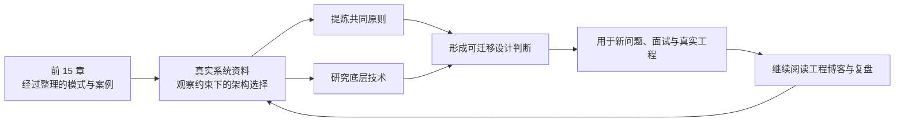
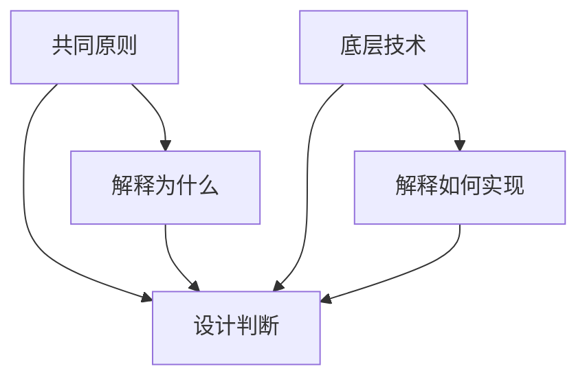
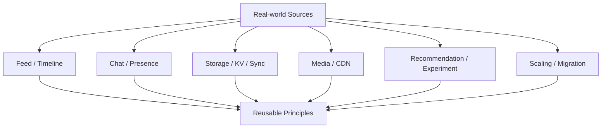
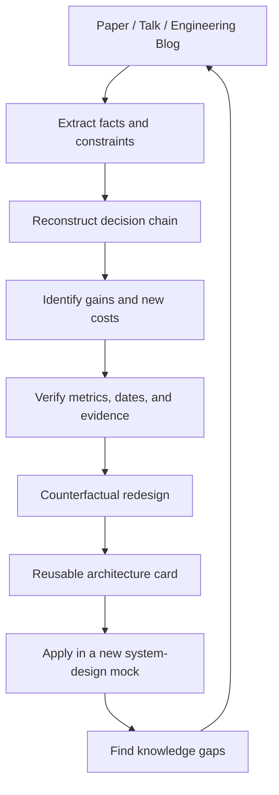

> 原书：Alex Xu，*System Design Interview: An Insider's Guide*（Second Edition）
> 原章：Chapter 16, *The Learning Continues*
> 本章定位：不再给出新的系统设计题，而是把读者从“学习整理好的面试案例”引向“持续研究真实系统”。作者提供两组入口：真实系统架构资料，以及公司工程博客。

## 0. 阅读边界、目标与本章主线

本章只有 5 页，正文没有新公式、算法或完整架构推导，主要包含：

- 1 段学习方法说明；
- 33 项真实系统架构资料；
- 37 个工程博客或长期学习入口。

因此，完整读书笔记不能只是再次抄写链接，也不应假装这些标题本身已经构成知识。真正要回答的是：

1. 作者为什么在全书结尾不再讲新模式，而是要求读真实系统？
2. “共同原则”和“底层技术”为什么必须同时学习？
3. 如何从一篇公司案例中区分事实、约束、方案、权衡和历史偶然性？
4. 33 项资料分别连接前十五章的哪些知识？
5. 37 个博客适合持续观察什么领域？
6. 如何把阅读转化为可复用的设计判断，而不是公司技术栈背诵？
7. 如何处理旧链接、旧版本、幸存者偏差和营销性工程文章？
8. 怎样形成“阅读 → 复原问题 → 验证推理 → 迁移到新题”的长期训练闭环？

本章主线可以压缩为：



原书链接反映成书时的历史资料入口。短链接、公司博客域名、产品名称和实现细节可能已经迁移或过时。阅读时应按标题查找原文、存档、论文或后续版本，并核验发布日期和适用背景。本笔记解释学习价值，不把旧架构描述成 2026 年仍在使用的现行实现。

---

## 1. 作者的核心判断：优秀系统设计来自长期积累

原章开头先否定一种速成幻觉：设计好系统需要多年知识积累。这里的“知识”不是记住更多产品名称，而是逐渐建立三种能力。

### 1.1 机制知识：一个技术为什么有效

例如知道“使用缓存”不够，还要理解：

- 缓存命中为什么降低延迟；
- 一致性和失效为什么变难；
- 热点、雪崩和穿透如何出现；
- 哪些数据不应缓存；
- 缓存故障时权威数据源如何承压。

机制知识使技术可以迁移到不同系统。

### 1.2 条件知识：什么时候应当使用

同一个消息队列：

- 在通知系统中隔离第三方通道；
- 在信息流中吸收 fanout 峰值；
- 在视频系统中连接转码 DAG 阶段；
- 在文件同步中承载变化通知。

但强一致、低延迟同步事务可能不适合异步化。条件知识回答“何时值得付出复杂度”。

### 1.3 权衡知识：它解决问题时又制造了什么

| 引入的机制 | 解决的问题 | 新问题 |
|---|---|---|
| 分片 | 容量与吞吐 | 跨分片查询、再平衡、热点 |
| 复制 | 可用性与读取 | 延迟、一致性、故障切换 |
| 反规范化 | 读取局部性 | 冗余、更新传播 |
| 异步队列 | 解耦与削峰 | 重复、积压、顺序、延迟 |
| CDN | 全球内容延迟 | 失效、成本、回源与权限 |
| 多地域 | 灾难恢复与就近访问 | 冲突、跨地域延迟、运维 |

真实系统文章的价值，正是展示这些机制在具体约束下怎样组合。

---

## 2. 为什么真实系统架构是一条“捷径”

作者所说的捷径，不是复制大公司的架构图，而是利用他人已经付出的实验和故障成本，快速观察设计决策的因果链。

### 2.1 教科书模式只给出压缩后的答案

例如“使用一致性哈希”很简洁，真实系统却还要处理：

- 成员视图；
- 虚拟节点；
- 权重；
- 数据迁移；
- 副本放置；
- 热点；
- 运维与回滚。

公司案例能补足从算法到生产系统之间的距离。

### 2.2 真实案例暴露历史路径

生产架构常由以下因素共同形成：

- 当时的流量与业务；
- 团队技能；
- 已有数据库和语言；
- 迁移成本；
- 事故；
- 时间压力；
- 供应商与预算。

所以真实并不等于理论最优。它更像一个带约束的决策样本。

### 2.3 应学习决策函数，而不是最终图

可把架构理解为：

$$
Architecture=f(
workload,
SLO,
dataSemantics,
cost,
team,
legacy,
time
)
$$

读一篇文章时，不只记录 $Architecture$，还要尽量恢复右侧输入。否则把 Facebook、Netflix 或 Google 的方案套给小型创业公司，只是在复制结论。

---

## 3. 同时关注共同原则与底层技术

这是原章唯一明确给出的阅读方法，也是全章核心。

### 3.1 共同原则是什么

跨公司重复出现的思想：

- 从简单方案开始；
- 明确权威数据源；
- 按访问模式建模；
- 把状态与计算分离；
- 通过缓存、复制和分片扩展；
- 用异步队列隔离速度和故障；
- 用幂等、版本和日志恢复；
- 让系统可观测并自动化运行；
- 依据成本和热点，而不是平均值优化。

### 3.2 底层技术是什么

实现原则的具体机制：

- Memcache、Cassandra、HBase、Bigtable；
- TAO、Dynamo；
- Erlang/OTP；
- Snowflake；
- GFS；
- CDN、对象存储；
- 反规范化、fanout、边缘缓存；
- 差分同步、内容寻址。

### 3.3 为什么只看原则不够

“高可用”无法直接实施。必须知道 quorum、复制日志、超时、故障检测和恢复怎样工作，才能判断承诺是否成立。

### 3.4 为什么只看技术也不够

知道 Cassandra API，不代表知道为何该场景应牺牲哪些一致性、如何选择 partition key、如何处理热点。技术会更新，问题与权衡更长寿。



---

## 4. 一篇真实系统资料应该怎样读

### 4.1 第一次：恢复问题，不急着记方案

记录：

- 用户/业务流程；
- 请求和数据规模；
- 读写比、对象大小、热点；
- 延迟、可用性、一致性和成本目标；
- 原方案最先坏在哪里。

如果文章没有给数字，明确标记未知，不自行补成事实。

### 4.2 第二次：还原决策链

```text
症状
→ 根因
→ 约束
→ 候选方案
→ 最终选择
→ 代价
→ 验证指标
```

例如“采用反规范化”不能停在方案名，要问是跨服务读取太慢、关系遍历太频繁，还是写少读多。

### 4.3 第三次：寻找系统边界

- 什么不在本文范围？
- 哪些组件被视作托管服务？
- 哪些数据允许最终一致？
- 哪些错误由客户端解决？
- 哪些代价文章没有量化？

### 4.4 第四次：做反事实

- 流量只有 $1/1000$ 时还需要吗？
- 写多读少时会怎样？
- 跨地域变成单地域时会怎样？
- 业务要求强一致时哪个机制失效？
- 团队只有 5 人时怎样简化？

反事实训练把公司故事转化为可迁移判断。

---

## 5. 阅读价值的辅助模型

原书没有给公式。下面是教学化的优先级模型，用于在 70 个入口中选下一篇，而不是评价文章的绝对质量。

设材料 $r$：

$$
Priority(r)=
\frac{
Relevance(r)\times Evidence(r)\times Transfer(r)
}{Effort(r)}
$$

- `Relevance`：与当前目标的关系；
- `Evidence`：是否有数据、实验、事故或论文依据；
- `Transfer`：思想能否迁移到多个系统；
- `Effort`：阅读和补前置知识成本。

乘法意味着证据接近 0 的纯宣传文，即使相关也应降权。该公式只用于排期；一篇高成本基础论文可能短期分低，却是长期必须阅读。

### 5.1 覆盖矩阵

为了避免只读喜欢的领域，可维护：

```text
rows: consistency, storage, cache, messaging, networking,
      observability, cost, security, migration, organization
columns: papers/articles read
```

目标不是篇数，而是每个关键能力都有机制、案例和失败模式证据。

---

## 6. 原书真实系统资料一：Facebook 时间线与大规模演进

下面严格按原书顺序整理。短链接保留作为历史索引，阅读时应按标题检索原文或存档。

### 6.1 Facebook Timeline: Brought To You By The Power Of Denormalization

原书链接：[Facebook Timeline: Brought To You By The Power Of Denormalization](https://goo.gl/FCNrbm)

**重点问题**：复杂时间线如何在高读取压力下组织数据。

**应提炼**：

- 反规范化为何减少运行时 JOIN；
- 写入冗余如何换取读取局部性；
- Timeline 是权威数据还是派生视图；
- 数据变更如何传播到冗余副本；
- 历史数据如何组织和恢复。

**关联章节**：第 11 章 News Feed、第 1 章缓存/扩展、第 6 章数据一致性。

**误区**：不要把“反规范化”理解为不需要数据模型。它要求更明确的权威源和更新策略。

### 6.2 Scale at Facebook

原书链接：[Scale at Facebook](https://goo.gl/NGTdCs)

**重点问题**：大型社交平台跨 Web、缓存、数据库和基础设施扩展。

**阅读问题**：

- 哪个规模阶段出现哪个瓶颈？
- 哪些优化属于架构，哪些属于运营？
- 热点、数据分布和跨机房如何处理？
- 组织和自动化怎样影响技术演进？

**关联章节**：第 1 章从零到百万用户，是该章方法的真实系统扩展版。

### 6.3 Building Timeline: Scaling up to hold your life story

原书链接：[Building Timeline: Scaling up to hold your life story](https://goo.gl/8p5wDV)

**重点问题**：长期时间线不仅是实时 Feed，还要保存和检索用户历史。

**应比较**：

- 实时 fanout 与长期归档；
- 热数据与冷历史；
- 排序、分页和重建；
- 大量历史对象的索引。

**关联章节**：第 11 章 Feed Cache 只保留最近内容，这篇资料补足“更久以前的内容在哪里”。

---

## 7. 原书真实系统资料二：Facebook Chat 与 Erlang

### 7.1 Erlang at Facebook (Facebook Chat)

原书链接：[Erlang at Facebook](https://goo.gl/zSLHrj)

**重点问题**：大量长期连接、并发会话和故障隔离为什么适合 actor/轻量进程模型。

**应研究的底层机制**：

- 进程隔离和消息传递；
- 监督树与容错；
- 长连接调度；
- 热升级和运行时特性；
- 语言选择如何匹配工作负载。

**关联章节**：第 12 章 Chat Server 有状态连接管理。

**误区**：不要得到“聊天必须用 Erlang”的结论。应学习运行时属性为何匹配问题。

### 7.2 Facebook Chat

原书链接：[Facebook Chat](https://goo.gl/qzSiWC)

**重点问题**：实时消息如何路由、持久化并支持在线状态。

**阅读检查**：

- 发送成功的持久性边界；
- 在线路由与离线历史如何分离；
- 重连、消息顺序和重复如何处理；
- Presence 是否强一致；
- 推送和聊天正文的职责区别。

**关联章节**：第 12 章几乎全部主题。

---

## 8. 原书真实系统资料三：Facebook 存储、Feed、缓存与社交图

### 8.1 Finding a needle in Haystack: Facebook's photo storage

原书链接：[Finding a needle in Haystack](https://goo.gl/edj4FL)

**重点问题**：海量小图片在传统文件系统中为何 metadata lookup 成为瓶颈。

**应提炼**：

- 对象数据与 metadata 的访问成本；
- 顺序/聚合存储小对象；
- CDN、缓存和 origin 的分工；
- 删除、复制和恢复；
- 针对工作负载定制存储布局。

**关联章节**：第 14 章 Blob/CDN、第 15 章块存储。

### 8.2 Serving Facebook Multifeed: Efficiency, performance gains through redesign

原书链接：[Serving Facebook Multifeed](https://goo.gl/adFVMQ)

**重点问题**：聚合多个 Feed 来源时，如何降低计算和服务成本。

**阅读方向**：

- 候选召回、合并和排序；
- 预计算与读时计算；
- 扇出与缓存；
- 关键路径和容量收益；
- 重构如何灰度验证。

**关联章节**：第 11 章混合 fanout 和 $k$ 路归并。

### 8.3 Scaling Memcache at Facebook

原书链接：[Scaling Memcache at Facebook](https://goo.gl/rZiAhX)

**重点问题**：缓存扩展不仅是增加节点，还要处理热点、失效、冷启动、多集群和数据库保护。

**应研究**：

- cache-aside；
- lease/request coalescing；
- invalidation；
- regional cache；
- cache miss storm；
- 缓存与数据库一致性。

**关联章节**：第 1、11、13 章的缓存层。

### 8.4 TAO: Facebook's Distributed Data Store for the Social Graph

原书链接：[TAO](https://goo.gl/Tk1DyH)

**重点问题**：社交图的对象和关联查询如何在全球低延迟服务。

**应提炼**：

- 图访问模式是否真的需要通用图数据库；
- Object/Association 数据模型；
- 缓存层和权威数据库；
- 读多写少与最终一致；
- 地域复制和故障语义。

**关联章节**：第 11 章 Graph DB/User Cache、第 12 章好友和 Presence fanout。

---

## 9. 原书真实系统资料四：Amazon 与 Dynamo

### 9.1 Amazon Architecture

原书链接：[Amazon Architecture](https://goo.gl/k4feoW)

**重点问题**：电商大规模服务如何按业务能力拆分，并通过服务接口演进。

**阅读问题**：

- 服务边界如何形成；
- 共享数据库如何拆解；
- 同步调用和异步事件如何选择；
- 组织结构如何影响架构；
- 失败、重试和幂等如何管理。

**关联章节**：第 1 章独立服务、第 3 章设计框架。

### 9.2 Dynamo: Amazon's Highly Available Key-value Store

原书链接：[Dynamo](https://goo.gl/C7zxDL)

**重点问题**：面向购物车等“高可用优先”场景，如何在网络分区时继续服务。

**核心机制**：

- 一致性哈希；
- 虚拟节点；
- $N/W/R$；
- vector clocks；
- sloppy quorum；
- hinted handoff；
- Merkle tree/anti-entropy；
- gossip。

**关联章节**：第 5、6 章的直接理论与案例来源。

**阅读重点**：区分论文模型、产品使用场景与后续系统实现，不把 $W+R>N$ 简化为无条件线性一致。

---

## 10. 原书真实系统资料五：Netflix Stack、实验与推荐

### 10.1 A 360 Degree View Of The Entire Netflix Stack

原书链接：[A 360 Degree View Of The Entire Netflix Stack](https://goo.gl/rYSDTz)

**重点问题**：全球流媒体从客户端、API、数据、编码、CDN 到运维如何组成完整系统。

**关联章节**：第 14 章视频上传/播放，以及第 1 章多数据中心。

**阅读方法**：先画控制面/数据面，不要被大量产品名淹没。

### 10.2 It's All A/Bout Testing: The Netflix Experimentation Platform

原书链接：[Netflix Experimentation Platform](https://goo.gl/agbA4K)

**重点问题**：架构与产品优化如何用实验验证，而不是只看离线技术指标。

**应研究**：

- 实验分流和稳定分桶；
- 指标定义；
- 统计与业务显著性；
- Guardrail metrics；
- 实验平台的可重复性。

**关联章节**：第 13 章建议质量、第 14 章播放体验，以及所有监控调优环节。

### 10.3 Netflix Recommendations: Beyond the 5 stars (Part 1)

原书链接：[Netflix Recommendations Part 1](https://goo.gl/A4FkYi)

### 10.4 Netflix Recommendations: Beyond the 5 stars (Part 2)

原书链接：[Netflix Recommendations Part 2](https://goo.gl/XNPMXm)

**共同重点**：推荐系统不是一个模型，而是候选、排名、上下文、展示和反馈闭环。

**应关注**：

- 数据收集；
- 离线/在线特征；
- 多种推荐行；
- 低延迟服务；
- 个性化缓存；
- 实验评价。

**关联章节**：本书没有专门推荐系统章，可作为 News Feed/Autocomplete 排名扩展。

---

## 11. 原书真实系统资料六：Google 基础设施、同步与 YouTube

### 11.1 Google Architecture

原书链接：[Google Architecture](https://goo.gl/dvkDiY)

**重点问题**：搜索和数据基础设施如何通过分布式存储、计算、调度与全球服务支撑。

**阅读策略**：区分总览中的历史组件和当代演进，重点提炼服务化、数据局部性、自动化和故障容忍。

### 11.2 The Google File System

原书链接：[The Google File System](https://goo.gl/xj5n9R)

**重点问题**：大文件、顺序追加、廉价机器故障频繁的工作负载如何塑造分布式文件系统。

**核心问题**：

- Master/Chunkserver；
- 大 chunk；
- 副本与 lease；
- metadata；
- append；
- 故障恢复。

**关联章节**：第 15 章文件块、metadata 与副本。

### 11.3 Differential Synchronization

原书链接：[Differential Synchronization](https://goo.gl/9zqG7x)

**重点问题**：客户端与服务器反复交换差异，如何使可编辑状态逐步收敛。

**应区分**：

- 整文件块级 delta sync；
- 文本操作级协作；
- 冲突副本；
- OT/CRDT。

**关联章节**：第 15 章明确排除的多人实时协作扩展。

### 11.4 YouTube Architecture

原书链接：[YouTube Architecture](https://goo.gl/mCPRUF)

### 11.5 Seattle Conference on Scalability: YouTube Scalability

原书链接：[YouTube Scalability](https://goo.gl/dH3zYq)

**共同重点**：上传、转码、metadata、CDN、热点和成本的真实演进。

**关联章节**：第 14 章。

**阅读问题**：哪些结论属于早期 YouTube 的规模与技术条件，哪些原则仍可迁移？

### 11.6 Bigtable: A Distributed Storage System for Structured Data

原书链接：[Bigtable](https://goo.gl/6NaZca)

**重点问题**：海量稀疏有序数据怎样按 row key 分区和提供范围读取。

**应研究**：

- row key 设计；
- tablet；
- SSTable；
- memtable/log；
- compaction；
- locality groups。

**关联章节**：第 6 章 LSM 读写路径、第 12 章消息历史。

---

## 12. 原书真实系统资料七：Instagram

### 12.1 Instagram Architecture: 14 Million Users, Terabytes Of Photos, 100s Of Instances, Dozens Of Technologies

原书链接：[Instagram Architecture](https://goo.gl/s1VcW5)

**重点问题**：小团队怎样通过简单、成熟组件扩展图片社交产品。

**应提炼**：

- 简单优先；
- 关系数据库、缓存和任务队列；
- 图片对象存储/CDN；
- 团队规模与运维成本；
- 何时才拆分或替换组件。

**关联章节**：第 1 章渐进演进。不要因文章标题的用户数和技术已过时而忽略其决策方法。

---

## 13. 原书真实系统资料八：Twitter 架构、Snowflake 与时间线

### 13.1 The Architecture Twitter Uses To Deal With 150M Active Users

原书链接：[Twitter Architecture](https://goo.gl/EwvfRd)

### 13.2 Scaling Twitter: Making Twitter 10000 Percent Faster

原书链接：[Scaling Twitter](https://goo.gl/nYGC1k)

**共同重点**：社交时间线、缓存、消息、数据库和运行时如何随用户增长演进。

**应关注**：

- 早期瓶颈；
- Ruby/服务拆分等历史迁移背景；
- fanout/read path；
- cache；
- 性能数字如何验证。

### 13.3 Announcing Snowflake

原书链接：[Announcing Snowflake](https://goo.gl/GzVWYm)

**重点问题**：分布式生成大致按时间有序的 64-bit ID。

**关联章节**：第 7 章。阅读时重点核对位布局、时钟回拨、节点 ID 和排序保证边界。

### 13.4 Timelines at Scale

原书链接：[Timelines at Scale](https://goo.gl/8KbqTy)

**重点问题**：读多写少时间线怎样在 push/pull、名人热点和缓存之间权衡。

**关联章节**：第 11 章混合 fanout。

---

## 14. 原书真实系统资料九：Uber 实时市场

### 14.1 How Uber Scales Their Real-Time Market Platform

原书链接：[Uber Real-Time Market Platform](https://goo.gl/kGZuVy)

**重点问题**：司机/乘客位置、匹配、实时状态和地域分区怎样组合。

**应研究**：

- 地理索引；
- 实时事件流；
- 城市/地域分区；
- 最终状态与交易状态的一致性差异；
- 高峰和热点；
- 移动网络故障。

**前十五章映射**：Chat Presence、通知、多地域、消息队列和 KV 状态。

---

## 15. 原书真实系统资料十：Pinterest

### 15.1 Scaling Pinterest

原书链接：[Scaling Pinterest](https://goo.gl/KtmjW3)

### 15.2 Pinterest Architecture Update

原书链接：[Pinterest Architecture Update](https://goo.gl/w6rRsf)

**共同重点**：图片内容、Feed、缓存、数据库和任务系统怎样随增长重构。

**阅读方式**：把两篇按时间比较，寻找：

- 哪些原假设失效；
- 哪些组件替换；
- 迁移怎样进行；
- 性能/可靠性是否有量化改进。

**关联章节**：第 11 章 Feed、第 14 章 CDN/媒体、第 1 章演进。

---

## 16. 原书真实系统资料十一：LinkedIn

### 16.1 A Brief History of Scaling LinkedIn

原书链接：[A Brief History of Scaling LinkedIn](https://goo.gl/8A1Pi8)

**重点问题**：单体、服务化、数据平台和消息基础设施怎样随业务成长。

**应提炼**：

- 事件日志作为系统边界；
- 服务与数据库拆分；
- 组织/部署影响；
- 分阶段迁移；
- 平台化的时机。

**关联章节**：第 1 章和消息队列模式。

---

## 17. 原书真实系统资料十二：Flickr

### 17.1 Flickr Architecture

原书链接：[Flickr Architecture](https://goo.gl/dWtgYa)

**重点问题**：照片分享系统如何处理 metadata、图片存储、缓存和全球分发。

**关联章节**：URL/ID、CDN、对象存储、缓存。

**阅读提醒**：架构年代较早，重点看当时约束下的简化与演进，不复制具体容量数字。

---

## 18. 原书真实系统资料十三：Dropbox

### 18.1 How We've Scaled Dropbox

原书链接：[How We've Scaled Dropbox](https://goo.gl/NjBDtC)

**重点问题**：文件块、同步、通知、metadata、长连接和存储怎样扩展。

**关联章节**：第 15 章的直接案例来源。

**重点追问**：

- Block size 为何这样选；
- Delta sync 和 hash；
- Long Poll 承载多少连接；
- 离线 cursor 如何补拉；
- Metadata 强一致边界；
- 版本与去重。

---

## 19. 原书真实系统资料十四：WhatsApp

### 19.1 The WhatsApp Architecture Facebook Bought For $19 Billion

原书链接：[WhatsApp Architecture](https://bit.ly/2AHJnFn)

**重点问题**：小团队如何用适合长期连接和消息传递的技术支撑大规模聊天。

**应提炼**：

- 连接密度；
- Erlang/BEAM；
- 消息路由与离线；
- 简单组织和技术约束；
- 高可用与运维。

**关联章节**：第 12 章。

**证据提醒**：标题带收购金额，文章可能具有媒体叙事；应优先核对技术演讲、官方资料和时间点。

---

## 20. 33 项真实系统资料的知识地图

| 学习主题 | 优先资料 |
|---|---|
| News Feed / Timeline | Facebook Timeline、Building Timeline、Multifeed、Timelines at Scale、Pinterest |
| Chat / Long connections | Erlang at Facebook、Facebook Chat、WhatsApp |
| Cache | Scaling Memcache、Instagram、Twitter |
| Social graph | TAO |
| KV / Availability | Dynamo、Bigtable |
| File sync/storage | GFS、Differential Sync、Dropbox |
| Media/CDN | Haystack、YouTube、Netflix Stack、Flickr |
| Unique ID | Snowflake |
| Recommender/experimentation | Netflix Recommendations、A/B Platform |
| Platform evolution | Scale at Facebook、Amazon、LinkedIn、Instagram、Pinterest、Twitter |
| Real-time location/market | Uber |



---

## 21. Company Engineering Blogs：为什么还要持续阅读

单篇架构资料给出某个时间点的快照，工程博客提供长期序列：

- 新系统上线；
- 事故与复盘；
- 迁移；
- 成本优化；
- 性能与可靠性；
- 团队和平台实践。

作者特别建议：面试某公司前阅读其工程博客，了解该公司采用和实现的技术。正确目的不是在面试中背产品名，而是：

- 理解业务特有问题；
- 使用对方熟悉的约束语言；
- 提出更相关的问题；
- 区分通用能力和岗位领域知识。

---

## 22. 原书工程博客清单一：Airbnb 到 Dropbox

以下继续严格按原书顺序。

| 入口 | 原书链接 | 适合长期观察 |
|---|---|---|
| Airbnb Engineering | [medium.com/airbnb-engineering](https://medium.com/airbnb-engineering) | 搜索、数据、实验、服务平台、旅行市场 |
| Amazon Developer Blogs | [developer.amazon.com/blogs](https://developer.amazon.com/blogs) | AWS/设备/服务生态；需区分产品文档与架构案例 |
| Asana Engineering | [blog.asana.com/category/eng](https://blog.asana.com/category/eng) | 协作产品、前端性能、数据与开发效率 |
| Atlassian Developer Blog | [developer.atlassian.com/blog](https://developer.atlassian.com/blog) | SaaS 平台、插件、开发者生态、多租户 |
| BitTorrent Engineering | [engineering.bittorrent.com](https://engineering.bittorrent.com) | P2P、内容分发、协议与网络 |
| Cloudera Blog | [blog.cloudera.com](https://blog.cloudera.com) | Hadoop、大数据平台、存储和流处理 |
| Docker Blog | [blog.docker.com](https://blog.docker.com) | 容器、镜像、构建与开发平台；文章也含产品内容 |
| Dropbox Tech | [blogs.dropbox.com/tech](https://blogs.dropbox.com/tech) | 文件同步、块存储、通知、可靠性、数据库 |

阅读时先确认入口是否迁移。公司博客首页常混合招聘、产品和教程，需要筛选含约束、指标和架构细节的文章。

---

## 23. 原书工程博客清单二：eBay 到 Instacart

| 入口 | 原书链接 | 适合长期观察 |
|---|---|---|
| eBay Tech Blog | [ebaytechblog.com](https://www.ebaytechblog.com) | 电商搜索、推荐、数据、风控、可用性 |
| Facebook Engineering | [code.facebook.com/posts](https://code.facebook.com/posts) | 社交图、缓存、Feed、AI、存储和网络 |
| GitHub Engineering | [githubengineering.com](https://githubengineering.com) | Git 托管、数据库、可用性、开发工具、事故 |
| Google Developers Blog | [developers.googleblog.com](https://developers.googleblog.com) | 广泛开发技术；基础设施论文需结合 Research/Cloud 博客 |
| Groupon Engineering | [engineering.groupon.com](https://engineering.groupon.com) | 电商、本地市场、服务与数据平台 |
| High Scalability | [highscalability.com](https://highscalability.com) | 跨公司架构聚合；证据质量需逐篇核验 |
| Instacart Tech | [tech.instacart.com](https://tech.instacart.com) | 配送市场、实时库存、调度、数据和增长 |

High Scalability 是二手聚合入口，不等于官方博客。应追到原始演讲、论文和官方文章。

---

## 24. 原书工程博客清单三：Instagram 到 Pinterest

| 入口 | 原书链接 | 适合长期观察 |
|---|---|---|
| Instagram Engineering | [engineering.instagram.com](https://engineering.instagram.com) | 图片/视频、Feed、推荐、移动性能、数据 |
| LinkedIn Engineering | [engineering.linkedin.com/blog](https://engineering.linkedin.com/blog) | Kafka、数据平台、图、搜索、服务化 |
| Mixpanel Blog | [mixpanel.com/blog](https://mixpanel.com/blog) | 产品分析、事件数据、指标；筛选工程深度文章 |
| Netflix TechBlog | [medium.com/netflix-techblog](https://medium.com/netflix-techblog) | 流媒体、CDN、韧性、微服务、数据、实验 |
| Nextdoor Engineering | [engblog.nextdoor.com](https://engblog.nextdoor.com) | 地域社交、推荐、信任安全、数据 |
| PayPal Engineering | [paypal-engineering.com](https://www.paypal-engineering.com) | 支付、一致性、安全、风控、全球可用性 |
| Pinterest Engineering | [engineering.pinterest.com](https://engineering.pinterest.com) | Feed、图片、推荐、缓存、数据平台 |

支付类文章尤其要区分“系统可用”和“账务正确”；社交推荐文章要区分在线 serving 与离线训练。

---

## 25. 原书工程博客清单四：Quora 到 Slack

| 入口 | 原书链接 | 适合长期观察 |
|---|---|---|
| Quora Engineering | [engineering.quora.com](https://engineering.quora.com) | Feed、排序、搜索、产品工程 |
| Reddit Blog | [redditblog.com](https://redditblog.com) | 社区、Feed、反滥用、基础设施；工程入口可能迁移 |
| Salesforce Engineering | [developer.salesforce.com/blogs/engineering](https://developer.salesforce.com/blogs/engineering) | 多租户 SaaS、数据库、平台与可靠性 |
| Shopify Engineering | [engineering.shopify.com](https://engineering.shopify.com) | 大促流量、电商、Ruby、数据库和容量 |
| Slack Engineering | [slack.engineering](https://slack.engineering) | 实时协作、边缘缓存、消息、搜索、客户端性能 |

多租户系统重点观察 noisy neighbor、隔离和公平；大促系统重点看容量计划、降级和重试风暴。

---

## 26. 原书工程博客清单五：SoundCloud 到 Twitter

| 入口 | 原书链接 | 适合长期观察 |
|---|---|---|
| SoundCloud Developers Blog | [developers.soundcloud.com/blog](https://developers.soundcloud.com/blog) | 音频流媒体、服务和 API；入口可能含开发者产品内容 |
| Spotify Labs | [labs.spotify.com](https://labs.spotify.com) | 音频、推荐、数据、平台、组织工程 |
| Stripe Engineering | [stripe.com/blog/engineering](https://stripe.com/blog/engineering) | 支付 API、幂等、账本、数据库、可靠性 |
| System Design Primer | [github.com/donnemartin/system-design-primer](https://github.com/donnemartin/system-design-primer) | 概念索引、复习清单、练习；不是公司工程博客 |
| Twitter Engineering | [blog.twitter.com/engineering](https://blog.twitter.com/engineering/en_us.html) | Timeline、消息、存储、ID、缓存和规模化 |

System Design Primer 适合补概念和导航，不应替代原始论文与实践案例。

---

## 27. 原书工程博客清单六：Thumbtack 到 Zoom

| 入口 | 原书链接 | 适合长期观察 |
|---|---|---|
| Thumbtack Engineering | [thumbtack.com/engineering](https://www.thumbtack.com/engineering) | 本地服务市场、匹配、数据、Web/移动工程 |
| Uber Engineering | [eng.uber.com](https://eng.uber.com) | 实时市场、地理系统、数据、存储、移动与可靠性 |
| Yahoo Engineering | [yahooeng.tumblr.com](https://yahooeng.tumblr.com) | 搜索、广告、大数据和基础设施；历史入口需查存档 |
| Yelp Engineering | [engineeringblog.yelp.com](https://engineeringblog.yelp.com) | 搜索、推荐、本地数据、数据平台和 Web 性能 |
| Zoom Developer Blog | [medium.com/zoom-developer-blog](https://medium.com/zoom-developer-blog) | 实时通信、SDK 和开发者平台；筛选架构深度文章 |

至此完整覆盖原书 37 个博客/入口。

---

## 28. 如何选择某公司面试前的阅读材料

### 28.1 岗位优先，而不是公司名优先

例如同一家公司：

- Storage 岗：复制、分片、compaction、恢复；
- Realtime 岗：连接、消息顺序、Presence；
- ML Platform：特征、训练、serving、实验；
- Product Backend：API、缓存、数据库和业务一致性。

### 28.2 三层阅读组合

```text
1 篇公司架构总览
+ 2 篇岗位领域深挖
+ 1 篇事故/迁移/成本文章
```

总览给地图，深挖给机制，事故/迁移给真实权衡。

### 28.3 面试中怎样使用

合适表达：

> 我看到贵司曾公开讨论过按地域缓存来降低加载延迟。对当前题目，我会先确认地域一致性要求；若内容可短暂陈旧，可以采用类似的就近缓存思想，但具体实现仍取决于这里的流量和数据语义。

不合适表达：

> 你们公司就是用 Cassandra，所以这题必须用 Cassandra。

公开文章可能已经过时，题目也可能有不同约束。

---

## 29. 从阅读到能力的六步训练法

### 29.1 先不看方案，独立设计

根据文章标题和问题背景，用 20–30 分钟画自己的方案。

### 29.2 阅读并建立决策表

| 问题 | 原方案 | 新方案 | 证据 | 代价 |
|---|---|---|---|---|
| 示例：读延迟高 | DB 直读 | 缓存/预计算 | P99、QPS | 失效、一致性 |

### 29.3 画数据流和故障流

不仅画正常路径，还画：

- 节点故障；
- 网络超时；
- 消息重复；
- 缓存全失；
- 地域离线；
- 发布回滚。

### 29.4 复算数字

文章给出 QPS、延迟、存储或成本时，独立计算单位和数量级。第 8 章原书存储估算的重复乘年数说明，材料本身也应被核验。

### 29.5 做反事实重设计

把一个条件改 10 倍：

- QPS ×10；
- 写比例 ×10；
- value ×100；
- 强一致；
- 全球多地域；
- 团队缩为 5 人。

重新判断原方案是否仍合理。

### 29.6 口头复述

用 3 分钟回答：

```text
问题是什么？
为什么旧方案不行？
核心机制怎样工作？
付出什么代价？
什么条件下不应使用？
```

这直接训练系统设计面试表达。

---

## 30. 一份可复用的架构阅读卡片

```markdown
# 标题 / 公司 / 日期

## 业务与工作负载
- 用户流程：
- QPS / 数据量 / 读写比：
- 热点与峰值：

## 目标与约束
- 延迟：
- 可用性：
- 一致性：
- 成本：
- 团队 / 遗留：

## 原方案与瓶颈
- 原方案：
- 症状：
- 根因：

## 新方案
- 数据流：
- 权威数据源：
- 分区 / 复制 / 缓存：
- 故障与恢复：

## 权衡
- 得到：
- 失去：
- 未覆盖：

## 证据
- 指标：
- 实验：
- 事故：

## 迁移
- 灰度：
- 回滚：
- 双写 / 对账：

## 可迁移结论
- 适用条件：
- 不适用条件：
- 可用于哪些面试题：
```

卡片强迫阅读从“文章摘要”升级为“可验证设计论证”。

---

## 31. 可执行的阅读优先级示例

下面代码只使用标准库，演示如何按当前学习目标排列资料。评分模型是教学补充，不是原书算法。

```python
from dataclasses import dataclass

@dataclass(frozen=True)
class Reading:
    title: str
    topics: frozenset[str]
    evidence: float
    transfer: float
    effort_hours: float

def priority(reading: Reading, goals: set[str]) -> float:
    overlap = len(reading.topics & goals)
    relevance = overlap / max(1, len(goals))
    return relevance * reading.evidence * reading.transfer / reading.effort_hours

readings = [
    Reading(
        "Dynamo",
        frozenset({"kv", "availability", "consistency", "failure"}),
        evidence=1.0,
        transfer=1.0,
        effort_hours=5.0,
    ),
    Reading(
        "Scaling Memcache at Facebook",
        frozenset({"cache", "availability", "hotspot", "failure"}),
        evidence=1.0,
        transfer=0.95,
        effort_hours=4.0,
    ),
    Reading(
        "How We've Scaled Dropbox",
        frozenset({"storage", "sync", "notification", "failure"}),
        evidence=0.9,
        transfer=0.9,
        effort_hours=3.0,
    ),
    Reading(
        "Timelines at Scale",
        frozenset({"feed", "cache", "hotspot", "fanout"}),
        evidence=0.85,
        transfer=0.85,
        effort_hours=2.0,
    ),
]

goals = {"cache", "hotspot", "failure"}
ranked = sorted(readings, key=lambda item: priority(item, goals), reverse=True)

assert ranked[0].title == "Timelines at Scale"
assert all(priority(item, goals) >= 0 for item in ranked)
print([(item.title, round(priority(item, goals), 3)) for item in ranked])
```

模型的局限：

- 主观分值可能偏见；
- 高 effort 基础论文会被短期低估；
- 当前目标会造成局部最优；
- 不应用于证明文章质量。

它只解决“今天先读哪篇”，不能替代覆盖计划。

---

## 32. 建议的十二周持续学习路线

### 第 1–2 周：缓存与读取路径

- Scaling Memcache at Facebook；
- Facebook Timeline；
- Instagram Architecture。

输出：缓存失效、热点、冷启动和数据库保护对照表。

### 第 3–4 周：分布式存储

- Dynamo；
- Bigtable；
- GFS。

输出：分区、复制、一致性、故障恢复和本地存储引擎对照图。

### 第 5 周：社交图与 Feed

- TAO；
- Multifeed；
- Timelines at Scale。

输出：Graph read、push/pull fanout 与 materialized view 的选择条件。

### 第 6 周：实时通信

- Erlang at Facebook；
- Facebook Chat；
- WhatsApp Architecture。

输出：连接状态、消息持久性、离线同步和 Presence 边界。

### 第 7 周：文件与同步

- Dropbox；
- Differential Synchronization；
- GFS 回顾。

输出：Block、版本、冲突、cursor 与通知架构。

### 第 8 周：媒体与 CDN

- Haystack；
- YouTube Architecture/Scalability；
- Netflix Stack。

输出：Metadata、对象、转码、CDN、长尾成本图。

### 第 9 周：ID 与时间线

- Snowflake；
- Twitter Scaling；
- Building Timeline。

输出：顺序、ID、时钟、Feed 和历史存储边界。

### 第 10 周：实验与推荐

- Netflix A/B；
- Recommendations Part 1/2。

输出：离线指标、在线实验、Serving 和反馈回路。

### 第 11 周：架构演进

- LinkedIn；
- Pinterest 两篇；
- Scale at Facebook。

输出：每篇“旧方案 → 瓶颈 → 迁移 → 新代价”的时间线。

### 第 12 周：综合模拟

任选一个未见题目，先独立设计，再引用至少三个真实案例验证/反驳决策。进行 45 分钟口头模拟和 15 分钟复盘。

---

## 33. 常见误区与概念辨析

### 33.1 真实系统与最佳实践

真实只说明它在某时某地运行过，不代表适合当前条件，也不证明没有技术债。

### 33.2 公司技术栈与问题答案

公司用 Cassandra，不意味着面试所有题都应使用 Cassandra。先分析访问模式和一致性。

### 33.3 共同原则与相同架构

共同原则可以相同，最终组件不同。例如“就近服务”可由 CDN、边缘缓存、地域副本或 home region 实现。

### 33.4 底层技术与产品名称

“Kafka”是产品；日志抽象、分区、顺序和消费者语义才是可迁移技术知识。

### 33.5 架构图与完整系统

图通常省略部署、权限、迁移、监控、备份和人。必须追问运行方式。

### 33.6 成功案例与因果证据

系统成功不表示每项技术都是成功原因。寻找前后指标、对照实验和事故证据。

### 33.7 大公司方案与大规模必需方案

有些复杂度来自组织、遗留和多产品，不只来自 QPS。小团队应选择最小必要复杂度。

### 33.8 历史文章与当前实现

公司可能已经迁移。文章仍可学习问题和推理，但不要用现在时陈述未核验实现。

### 33.9 工程博客与论文

- 博客：背景丰富、易读，但可能省略负面结果；
- 论文：模型和评估更严格，但可能简化生产运维；
- 演讲：直观，但细节/可检索性较少。

三类证据互补。

### 33.10 论文机制与产品保证

理解 Dynamo 机制不等于所有 Dynamo 风格产品都有相同 API、一致性和故障语义。检查具体实现。

### 33.11 阅读数量与能力

读完 100 篇但不能复原约束、解释权衡和设计故障路径，提升有限。输出和反事实比收藏数量重要。

### 33.12 博客链接与知识资产

链接会失效。保存标题、作者、日期、摘要、关键图和原始出处，而不是只收藏 URL。

### 33.13 面试准备与背公司内幕

面试评价推理，不要求知道未公开内部实现。公开材料用于提高判断，不用于猜标准答案。

### 33.14 模式复用与机械套用

“缓存、队列、分片”不是默认三件套。每个组件必须由需求、瓶颈或故障触发。

### 33.15 技术过时与文章无价值

产品版本过时不等于问题和权衡过时。区分长寿原则与历史实现。

---

## 34. 本章知识结构

### 34.1 元方法层

- 系统设计需要长期积累；
- 真实架构是高密度案例；
- 同时学习共同原则和底层技术；
- 研究技术解决的问题。

### 34.2 资料层

- 33 项真实系统资料；
- 覆盖 Feed、Chat、Cache、KV、Storage、Sync、Media、ID、Recommendation、Experiment 和迁移；
- 37 个工程博客/入口；
- 支持面试前定向研究和长期更新。

### 34.3 证据层

- 约束与工作负载；
- 原方案和瓶颈；
- 机制与权衡；
- 指标、实验、事故；
- 迁移和回滚；
- 历史时点与未覆盖边界。

### 34.4 训练层

- 独立设计；
- 决策表；
- 故障图；
- 数字复算；
- 反事实；
- 口头复述；
- 新题迁移。



---

## 35. 核心结论与解决新问题的一般方法

### 35.1 核心结论

1. **全书结束不代表学习结束。** 十五个案例提供词汇和框架，真实工程继续提供新约束和失败证据。
2. **真实系统资料的价值在决策链，不在最终架构图。** 必须恢复工作负载、目标、遗留和团队条件。
3. **共同原则和底层技术缺一不可。** 原则解释为什么，技术解释如何和边界。
4. **真实不等于最佳。** 生产方案包含历史偶然、迁移成本和技术债。
5. **阅读必须核验证据和时间。** 链接、技术版本和公司实现都会变化。
6. **大公司复杂度不能机械下放。** 先选择满足当前目标的最小方案，再保留演进路径。
7. **事故、迁移和成本文章通常比发布公告提供更多权衡信号。**
8. **阅读输出比收藏输入重要。** 架构卡片、复算、反事实和口头复述将材料转成能力。
9. **公司博客适合岗位定向准备。** 但不能用公司现有技术替代题目需求分析。
10. **最可迁移的问题是：它解决什么、为什么现在需要、代价是什么、什么条件下失效。**

### 35.2 面对陌生系统的一般研究方法

$$
\boxed{
\text{定义业务流程与 SLO}
\rightarrow
\text{量化工作负载和热点}
\rightarrow
\text{建立最简单基线}
\rightarrow
\text{寻找首先失效的资源/语义}
\rightarrow
\text{研究对应真实案例与底层机制}
\rightarrow
\text{比较条件和权衡}
\rightarrow
\text{设计迁移、故障和可观测性}
\rightarrow
\text{用实验/指标验证}
\rightarrow
\text{复盘并沉淀可迁移原则}
}
$$

### 35.3 一段成熟的阅读复述

> 这篇文章不是因为“公司用了某数据库”而重要。它面对的是读多写少、热点明显且跨地域的访问模式；原方案在数据库随机读和缓存冷启动时失效。新方案把权威数据和派生缓存分离，引入区域缓存、请求合并和失效协议，换取更低 P99 和更小数据库压力，但增加了陈旧窗口、缓存元数据和故障恢复复杂度。若我的系统只有单地域、低 QPS，我会先使用托管缓存而不是复制整套架构；若数据要求强一致，我还需要重新设计读取和失效边界。文章中的技术版本可能已过时，但“先识别重复读取、再保护权威存储、最后验证故障时回源容量”的推理可以迁移。

### 35.4 章末自检

- [ ] 能否解释为什么系统设计无法真正速成？
- [ ] 能否区分共同原则、底层机制和产品名称？
- [ ] 能否从一篇文章恢复业务、负载、SLO 和遗留约束？
- [ ] 能否列出原方案、瓶颈、新方案和新代价？
- [ ] 能否判断文章证据来自指标、实验、事故还是叙述？
- [ ] 能否说明架构发布日期和技术版本？
- [ ] 能否做流量、写比或一致性变化的反事实设计？
- [ ] 能否将 Facebook Feed、Dynamo、Dropbox 等资料映射到前十五章？
- [ ] 能否完整说出 33 项真实系统资料覆盖的主要领域？
- [ ] 能否说明工程博客与论文的证据差异？
- [ ] 能否为目标公司按岗位选择 4 篇高价值材料？
- [ ] 能否避免把目标公司技术栈当成面试标准答案？
- [ ] 能否用阅读卡片保留链接之外的知识资产？
- [ ] 能否独立复算文章中的容量、延迟和成本数字？
- [ ] 能否画正常数据流和至少两个故障流？
- [ ] 能否解释方案在小团队/低规模下应该怎样简化？
- [ ] 能否把一个真实案例迁移到从未见过的设计题？

如果这些问题都能回答，就掌握了本章真正要传达的能力：**把系统设计从有限题库变成持续研究过程。每读一个真实系统，都先还原它所处的约束，再理解机制如何解决问题、如何失败和怎样演进，最终把公司特有的实现提炼为自己能够重新推导的工程判断。**
