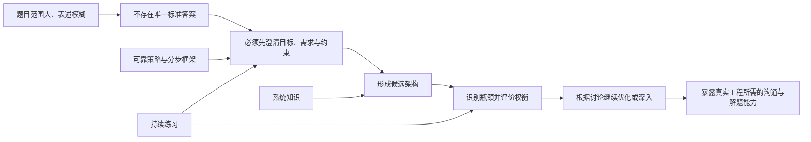
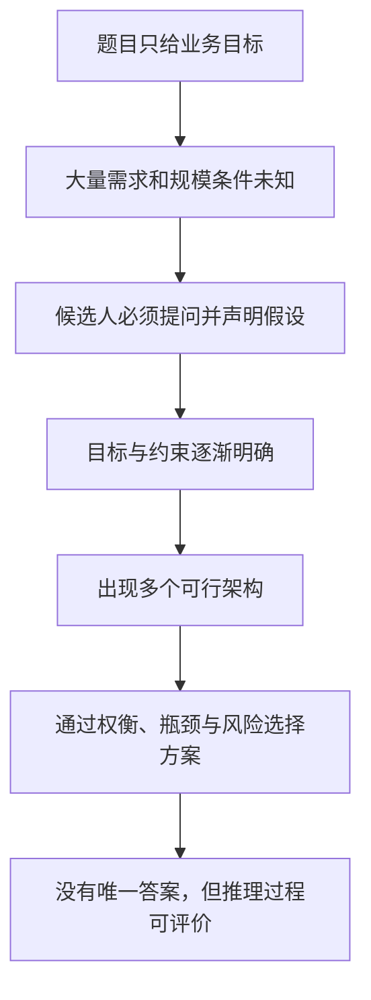
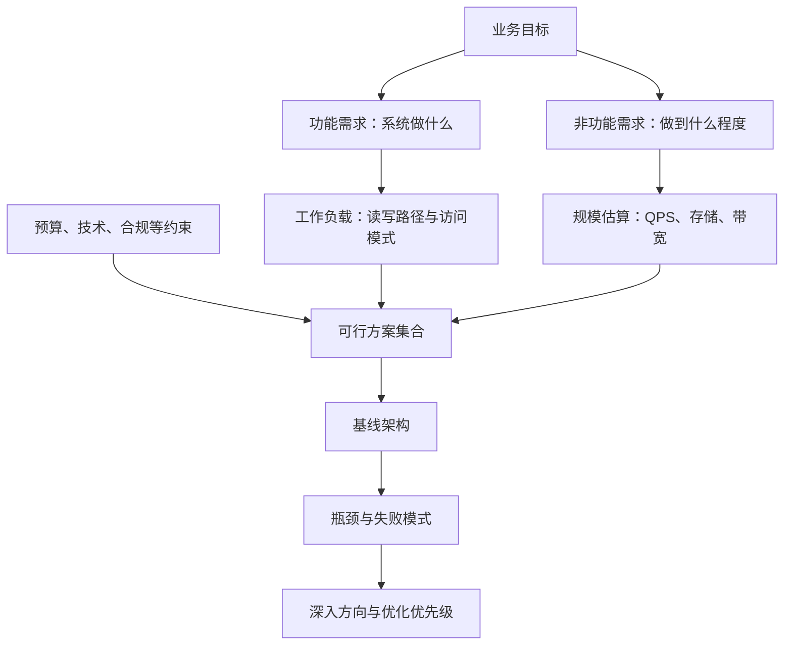
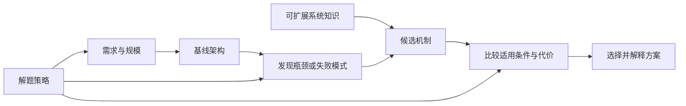
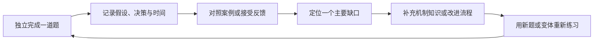
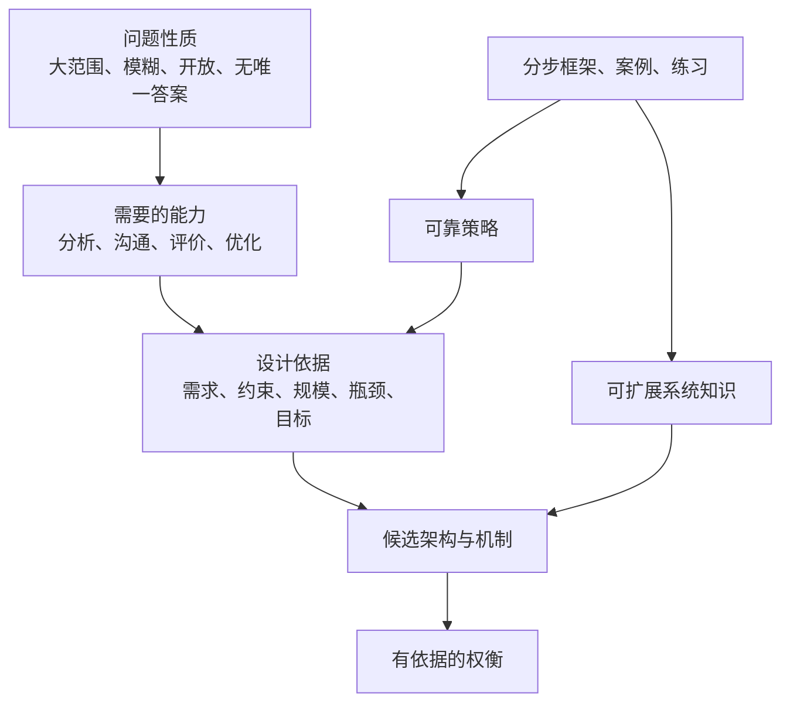

> 原书：Alex Xu，*System Design Interview: An Insider's Guide*（Second Edition）
> 范围：`FORWARD`（原书标题如此；通常“前言”写作 `Foreword`）
> 本章定位：解释系统设计面试为什么困难、企业为什么采用它、面试真正考查什么，以及本书准备如何帮助读者建立可重复使用的解题方法。

## 0. 阅读边界、目标与主线

FORWARD 只有一页，也没有公式、算法或完整设计案例。它不是提前讲某一种架构，而是在全书开始前建立一套**理解系统设计面试的元框架**：系统设计题为什么没有标准答案，却仍然可以被评价；候选人为什么不能只背架构；需求、约束和瓶颈为什么必须先于技术选型；知识、策略与练习又分别解决什么问题。

本笔记严格沿原文段落顺序展开。为把作者的短论述讲透，文中会加入形式化模型、示例和图表。这些内容均是**辅助理解的教学化补充**，不是作者在 FORWARD 中给出的公式或固定模板。

读完后，应当能够回答以下问题：

1. 系统设计面试与算法题、知识问答的根本区别是什么？
2. “开放式、没有唯一正确答案”是否意味着答案可以随意发挥？
3. 企业为什么把沟通、分析、评价和优化都纳入技术面试？
4. 为什么需求、约束和瓶颈决定了设计讨论的方向？
5. 面对同一道题，什么时候应当覆盖全局，什么时候应当深入局部？
6. 策略、可扩展系统知识、分步框架和持续练习如何共同构成面试能力？

全章的逻辑主线可以压缩为：

作者真正想传达的不是“记住一个万能架构”，而是：**在不确定信息下，通过对话逐步定义问题，再用可解释的权衡形成满足目标的架构。**

---

## 1. 为什么系统设计面试最难应对

原文首先把系统设计面试称为各类技术面试中最难处理的一类，并用新闻信息流、Google 搜索、聊天系统等例子说明题目对象：候选人要为一个完整软件系统设计架构。

### 1.1 它考查的不是一个孤立函数，而是整个系统

算法题通常已经给定：

- 明确输入与输出；
- 可以直接判断的正确性条件；
- 相对封闭的数据规模；
- 可比较的时间、空间复杂度。

系统设计题则可能只给一句“设计一个聊天系统”。这句话没有说明：

- 是一对一聊天、群聊，还是都要支持？
- 日活跃用户数、峰值并发和消息量是多少？
- 是否要求多设备同步、离线消息、已读回执和搜索？
- 文本之外是否支持图片、视频和文件？
- 消息是否必须严格有序？允许重复或短暂丢失吗？
- 延迟、可用性、数据保留期和合规要求是什么？

这些缺失信息并不是题目出坏了，而是题目的一部分。候选人的第一项工作不是立即画图，而是把模糊业务目标转化为可设计、可验证的工程问题。

### 1.2 “设计架构”具体意味着什么

这里的架构不是一张画满方框和箭头的图，而是一组彼此关联的决策：

| 决策层次 | 典型问题 | 设计结果 |
|---|---|---|
| 系统边界 | 谁使用系统？哪些能力在范围内？ | 功能需求、非功能需求、明确不做的部分 |
| 规模模型 | 请求量、数据量、峰值有多大？ | 吞吐、存储、带宽等数量级 |
| 接口与数据 | 客户端如何访问？核心实体是什么？ | API、数据模型、读写路径 |
| 高层组件 | 请求经过哪些服务和存储？ | 客户端、网关、服务、缓存、数据库、队列等 |
| 分布式机制 | 如何扩容、容错和保持数据语义？ | 分片、复制、一致性、重试、幂等、故障转移 |
| 权衡与演进 | 为什么这样选？规模变化后哪里先坏？ | 瓶颈分析、替代方案、后续优化路径 |

这些决策存在依赖关系。例如，若消息只需最终送达，系统可以接受异步队列和短暂延迟；若要求端到端低延迟且严格顺序，连接管理、路由和存储设计都会改变。因此，“会某项技术”和“能完成系统设计”不是同一件事。后者要求把技术放入一条由目标和约束驱动的因果链中。

### 1.3 难点一：范围很大

一个成熟系统可以同时包含客户端、网络、计算、存储、缓存、消息、搜索、监控、安全和跨地域容灾。面试时间却有限，不可能把所有部分都设计到实现级别。

这形成了第一个核心矛盾：

$$
\text{系统覆盖面很大}\quad \text{vs.}\quad \text{可用讨论时间很少}
$$

候选人必须主动管理讨论范围：先建立全局骨架，再依据风险和面试官反馈选择值得深入的部分。试图平均讲完所有内容，往往只能得到没有关键决策的组件清单；一开始就钻入某个细节，又可能设计得很深却答非所问。

### 1.4 难点二：题目模糊

“模糊”意味着自然语言题目还没有变成完整规格。解决它的方式不是私自补齐假设，而是通过澄清问题形成双方共享的题目版本。

例如面对“设计新闻信息流”，一个有效的开场不是：

> 我会使用微服务、Kafka、Redis 和 Cassandra。

而是：

> 我先确认范围：本次重点是用户发布内容并查看关注对象的信息流吗？是否需要广告、推荐和评论？信息流按时间排序，还是需要个性化排序？预计日活和用户关注数大致是多少？

第一种回答从技术名词出发，尚未证明技术与问题有关；第二种回答先寻找会改变架构的变量。澄清不是拖延，而是在降低后续设计建立在错误假设上的风险。

### 1.5 难点三：过程开放，没有固定模式

原文说没有确定的模式可遵循，这里的重点是**不存在机械套用后必然正确的组件组合**。同样是信息流系统：

- 普通用户关注者较少时，可以在写入时预先生成其粉丝的信息流；
- 名人拥有数千万关注者时，写入时向所有粉丝扩散可能造成巨大写放大；
- 若读延迟是首要目标，可能愿意增加预计算和缓存；
- 若内容必须立即删除，冗余副本与缓存越多，失效处理越难。

设计是目标、负载和约束的函数，而不是题目名称的函数。可以用一个教学化表达表示：

$$
\text{Architecture}=f(\text{requirements},\ \text{scale},\ \text{constraints},\ \text{priorities})
$$

这个式子不是可计算的算法，而是在提醒：只要右侧条件变化，合理架构就可能变化。背下“新闻信息流标准答案”，却不询问这些条件，恰好违背了系统设计的本质。

### 1.6 难点四：没有唯一标准答案

没有唯一答案，不等于没有评价标准。系统设计往往是多目标问题：

$$
\max_A\ U(A)=w_L L(A)+w_A A_v(A)+w_C C_s(A)+w_M M(A)
$$

其中：

- $A$ 表示某个候选架构；
- $L(A)$ 表示低延迟方面的效用；
- $A_v(A)$ 表示可用性方面的效用；
- $C_s(A)$ 表示一致性方面的效用；
- $M(A)$ 表示可维护性方面的效用；
- $w_L,w_A,w_C,w_M$ 表示业务对各目标的相对重视程度。

与此同时，架构必须满足硬约束：

$$
\begin{aligned}
\text{吞吐}(A)&\ge Q_{\text{peak}}\\
\text{存储容量}(A)&\ge D_{\text{retained}}\\
\text{成本}(A)&\le B\\
\text{合规性}(A)&=\text{满足}
\end{aligned}
$$

这些公式是教学化模型，作用不是精确打分，而是区分两件事：

1. **硬约束决定方案是否可行**。峰值吞吐无法满足，再漂亮的架构也不合格。
2. **目标权重决定可行方案中哪个更合适**。支付系统与社交点赞系统对一致性、延迟和可用性的权重通常不同。

因此，面试官并不需要脑中只有一张标准图。她可以根据候选人是否澄清关键条件、决策是否有依据、架构是否满足目标、能否发现风险并处理权衡来评价答案。

### 1.7 本节结论：真正困难的是在不确定性中做决策

原文列出的“大范围、模糊、开放、无标准答案”并非四个互不相关的抱怨，而是一条因果链：

系统设计面试最核心的能力，可概括为：**把不确定问题逐步变成有依据的工程决策。**

---

## 2. 企业为什么广泛采用系统设计面试

第二段把面试形式与软件工程师的日常工作联系起来。企业采用它，并非因为工程师每天都要在白板上设计 Google 搜索，而是因为这种面试暴露的沟通与问题解决行为，与真实工作高度相似。

### 2.1 模糊问题正是真实工作的常态

真实需求很少以完整规格到达工程师手中。常见输入可能是：

- “首页太慢了，想办法优化”；
- “我们需要支持国际化”；
- “消息不能再丢了”；
- “把这个服务扩到十倍流量”；
- “做一个类似某产品的功能”。

这些陈述只表达痛点或方向，没有给出完整验收条件。工程师需要继续询问：慢的是哪个百分位？哪些地区？当前瓶颈在哪里？“不能丢”是要求至少一次、至多一次，还是业务层恰好一次效果？增长十倍指平均值还是峰值？

系统设计面试用压缩后的场景模拟这种工作：观察候选人是否能从不完整输入中识别关键未知量，并通过对话收敛问题。

### 2.2 面试官评价的是一条完整能力链

原文依次列出了分析、逐步解决、解释、讨论、评价和优化。这个顺序很重要，它构成从“理解问题”到“改进方案”的闭环。

| 能力 | 面试中的可观察行为 | 它解决的问题 |
|---|---|---|
| 分析模糊问题 | 澄清用户、功能、规模、质量目标和边界 | 防止解决错误的问题 |
| 逐步求解 | 先给简单可行方案，再定位压力点 | 控制复杂度，使推理可跟踪 |
| 解释想法 | 说清组件职责、数据流和选择依据 | 让决策可以被检查 |
| 与他人讨论 | 听取提示、确认分歧、调整方向 | 把个人假设变成共享理解 |
| 评价系统 | 检查容量、故障、一致性、热点和成本 | 发现方案何时失效 |
| 优化系统 | 针对已识别瓶颈做局部改进 | 避免无目标地堆叠复杂技术 |

这里最值得注意的是：**沟通不是设计完成后的包装，而是产生正确设计所需的机制。** 如果需求只能通过对话确定，那么不会沟通就不只是“表达不好”，还会直接导致架构建立在错误前提上。

### 2.3 为什么强调“逐步”解决

复杂系统无法一次从空白跳到最终架构。一个可审查的设计过程通常是：

1. 先明确问题边界和成功标准；
2. 给出满足核心路径的最简高层设计；
3. 用流量和数据估算寻找最可能的瓶颈；
4. 针对瓶颈引入分片、缓存、复制、异步化等机制；
5. 重新检查新增机制带来的复杂度和失败模式。

这是一种**渐进式精化**。每一步都回答“为什么现在需要增加这个组件”。例如：

- 单机数据库无法承受读流量，才引入只读副本或缓存；
- 单分区出现容量或吞吐上限，才引入分片；
- 同步调用链使写入延迟和故障传播不可接受，才考虑消息队列；
- 跨地域延迟或灾难恢复成为明确要求，才讨论多地域部署。

如果没有被需求或瓶颈触发，复杂组件只是增加了新的运维成本、数据语义和故障模式。

### 2.4 “解释”不是复述组件名称

有效解释至少包含四层：

1. **决定**：我选择了什么？
2. **依据**：它对应哪个需求、数字或风险？
3. **代价**：它引入了什么复杂度或牺牲？
4. **验证**：如何判断它确实满足目标？

例如：

> 为降低热门内容的读延迟，我会缓存已生成的信息流页面。依据是读请求远多于写请求，且允许几十秒的新鲜度延迟。代价是缓存与源数据可能短暂不一致，因此删除内容时需要主动失效，并设置较短 TTL 兜底。之后可通过缓存命中率、P95 延迟和陈旧数据比例验证效果。

这段话比“这里加 Redis”更有信息量，因为它建立了**问题 → 决策 → 代价 → 验证**的完整链条。

### 2.5 “讨论”意味着共同设计，而非单向演讲

系统设计面试是一场协作式技术讨论。候选人需要不断确认：

- 当前假设是否被面试官接受；
- 面试官希望保持高层覆盖，还是深入某个部分；
- 新提示是否改变了原来的优先级；
- 双方使用的术语是否指同一语义。

一个成熟的转向方式是：

> 高层数据流已经闭合。接下来我可以深入信息流生成策略，也可以讨论存储分片和容灾；考虑到名人用户可能产生写入热点，我建议先分析生成策略，您希望沿这个方向继续吗？

这不是把选择丢给面试官，而是先给出自己的判断，再邀请对方校准方向。

### 2.6 “评价并优化”为什么必须排在架构之后

优化必须针对具体指标和瓶颈，否则无法判断是否有效。可以把优化过程写成一个循环：

$$
\text{目标}\rightarrow\text{基线设计}\rightarrow\text{压力分析}\rightarrow\text{瓶颈}\rightarrow\text{局部改进}\rightarrow\text{重新评价}
$$

例如，若基线设计在峰值时数据库读吞吐不足，候选方案可能包括缓存、只读副本、数据预计算或改变产品语义。选择哪一种，要看读模式、新鲜度要求、成本和一致性要求。先说“加缓存”，再找缓存能解决的问题，是把因果关系倒置了。

### 2.7 原文的代词说明应如何理解

原书说明，为避免反复使用 “he or she” 或来回切换，全文统一使用阴性代词 “she”，并明确这不表示对男性工程师不尊重。这是一项写作约定，不是系统设计概念，也不影响任何技术结论。阅读时应将其理解为泛指候选人或工程师。

---

## 3. 开放式问题如何形成可评价的设计

第三段进一步解释开放性：现实系统本来就有许多差异和变体；设计的目标不是复现某个唯一实现，而是得到一个能够实现系统设计目标的架构。

### 3.1 开放式不等于任意

开放式问题允许多个方案，前提是它们满足双方约定的设计目标。可以把问题形式化为：

- $R_f$：功能需求集合，例如发消息、收消息、查看历史记录；
- $R_n$：非功能需求集合，例如 P99 延迟、可用性、持久性；
- $C$：约束集合，例如预算、已有技术栈、监管要求；
- $A$：候选架构；
- $V(A)$：对架构的验证结果。

一个方案首先要满足：

$$
A\models R_f\cup R_n\cup C
$$

即架构 $A$ 满足功能需求、非功能需求和约束。若有多个方案满足条件，再比较成本、复杂度、演进性等软目标。

这里的关键不是数学符号本身，而是评价顺序：**先判断是否满足约定目标，再比较方案优劣。** 不先约定目标，就无法有意义地争论 SQL 还是 NoSQL、同步还是异步、强一致还是最终一致。

### 3.2 功能需求、非功能需求与约束的区别

这三类内容容易混在一起：

| 类别 | 回答的问题 | 聊天系统示例 |
|---|---|---|
| 功能需求 | 系统要做什么？ | 一对一消息、群聊、离线消息、多设备同步 |
| 非功能需求 | 系统要做到什么程度？ | 低延迟、高可用、消息持久、不乱序 |
| 约束 | 方案必须在哪些边界内工作？ | 预算上限、数据驻留地区、必须兼容旧客户端 |

非功能需求必须尽量量化。“低延迟”若不说明是 100 ms、1 s 还是 5 s，就无法指导设计；“高可用”若不说明目标和故障范围，也无法判断需要单机重启、可用区容灾还是跨地域容灾。

### 3.3 设计目标如何塑造架构

同一个系统可能因目标不同产生合理但不同的方案：

| 首要目标 | 倾向的设计选择 | 可能付出的代价 |
|---|---|---|
| 极低读延迟 | 缓存、预计算、数据复制 | 数据陈旧、失效复杂、更多存储 |
| 强一致性 | 单写入序列、共识或同步复制 | 延迟上升、可用性或吞吐受限 |
| 高写吞吐 | 分区、批处理、异步化 | 读取聚合、顺序和错误恢复更复杂 |
| 高可用 | 冗余、故障转移、多地域 | 成本、数据一致性和运维复杂度上升 |
| 低成本 | 简化架构、按需扩展、减少副本 | 容量余量与故障隔离能力下降 |

所以“最佳架构”不是脱离语境的绝对概念。更准确的说法是：在给定目标与约束下，某个方案比其他方案更合适。

### 3.4 为什么面试讨论可能走向不同方向

原文指出，有的面试官选择高层架构并覆盖各方面，有的会专注一两个区域。这并非评价标准不统一，而是系统设计能力可以从不同切面观察：

- **广度路径**检验候选人能否完整划分系统、闭合端到端数据流，并识别主要风险；
- **深度路径**检验候选人能否把一个局部问题分析到数据结构、分布式语义、故障和容量层面。

两者关系是“先有全局地图，再选择高价值区域深入”，而不是二选一。即使面试官很快要求深入，也应先用几句话确认该局部在整个系统中的输入、输出和职责。

### 3.5 如何选择值得深入的部分

可以使用三个判断标准：

1. **它是否决定核心需求能否实现？** 例如聊天系统的实时连接与消息投递路径。
2. **它是否最可能成为瓶颈或故障中心？** 例如名人信息流的高扇出、热门键、单分区写热点。
3. **它是否体现题目的独特性？** 例如 URL 短链的编码与重定向、网盘的文件分块与同步冲突。

通用登录、普通负载均衡等组件可以交代但不必喧宾夺主。系统设计题不是比谁能画更多通用基础设施，而是看候选人能否抓住决定本题难度的部分。

### 3.6 需求、约束与瓶颈如何共同“塑造方向”

原文最后强调，双方必须充分理解系统需求、约束和瓶颈，以此决定讨论方向。三者并不是并列清单，而是一条逐步收敛的关系：

- **需求**定义系统必须提供的价值；
- **约束**排除不可行方案；
- **瓶颈**指出基线方案最先失效的位置；
- **讨论方向**应优先落在高风险且影响目标的部分。

这也解释了为什么不能一上来就“解决瓶颈”：没有需求和规模，就不知道什么会成为瓶颈；没有基线方案，也没有可供分析的资源路径。

### 3.7 一个简化案例：同一道聊天系统题如何分叉

假设题目是“设计一个聊天系统”，经过澄清可能得到两组不同条件。

**场景 A：公司内部协作工具**

- 10 万员工；
- 强调消息历史、搜索和合规留存；
- 允许数秒内送达；
- 每个组织有明确边界。

**场景 B：全球消费者即时通信**

- 数亿日活用户；
- 强调低延迟、高并发和跨地域可用；
- 大量移动设备会频繁掉线重连；
- 需要离线推送与多设备同步。

两者都叫聊天系统，但主要难点不同：

| 维度 | 场景 A | 场景 B |
|---|---|---|
| 首要问题 | 合规、搜索、租户隔离 | 长连接、路由、跨地域、离线同步 |
| 规模压力 | 单组织数据管理 | 全球连接数与消息吞吐 |
| 可能深入处 | 保留策略、索引、审计 | 连接网关、消息 ID、顺序与重试 |
| 合理取舍 | 可接受略高延迟换取治理能力 | 可按会话或地区放宽全局一致性 |

如果候选人没有澄清条件，只背一种架构，就可能对场景 A 过度设计实时链路，也可能对场景 B 严重低估连接规模。这正是开放题要求先塑造问题的原因。

---

## 4. 本书的第一个承诺：提供可靠的解题策略

第四段明确本书目标：提供应对系统设计问题的可靠策略；作者认为，正确的策略与知识对面试成功都至关重要。

### 4.1 “策略”解决什么问题

策略不是具体技术，而是组织有限时间和不完整信息的方法。它回答：

- 先做什么，后做什么？
- 何时从需求转向架构？
- 如何决定估算哪些数字？
- 何时保持高层，何时深入？
- 怎样把面试官的提示纳入设计？
- 如何在结束前完成总结和风险检查？

没有策略时，候选人即使知道很多技术，也可能：

- 开场就陷入数据库选型；
- 忘记澄清规模与质量目标；
- 花太久进行无关估算；
- 不说明取舍，只罗列技术；
- 设计尚未闭合就耗尽时间。

策略的价值是让候选人在压力下仍有稳定的推进顺序。

### 4.2 “可靠”不等于“固定答案”

面对开放题，可靠策略应当具备两种特征：

1. **稳定骨架**：需求、估算、高层设计、深入、复盘等阶段可以重复使用。
2. **适应能力**：每一阶段的内容和时间根据题目、风险与面试官方向改变。

因此，框架像导航程序，不像预制路线。它规定需要持续确认目标和当前位置，却不会要求所有题都经过相同组件。

### 4.3 策略与知识为什么缺一不可

可以把两者关系类比为：

- **策略**负责搜索过程：如何拆题、排序、验证和推进；
- **知识**提供候选动作：缓存、复制、分片、队列、一致性模型等机制及其代价。

只有策略，没有知识，会知道“这里存在吞吐瓶颈”，却不知道可用什么机制处理；只有知识，没有策略，会在还没确认问题时就堆叠熟悉的组件。

为了建立直觉，可以写成教学化模型：

$$
\text{有效表现}\approx \text{策略质量}\times\text{知识可用度}\times\text{沟通清晰度}
$$

使用乘法而非加法，是为了表达明显短板会限制整体表现：知识很多但无法解释，面试官无法检查；表达流畅但设计不满足规模，也不能靠沟通补救。这个公式不是测评分数，也不能用于实际预测。

### 4.4 策略如何降低认知负担

面试时，候选人同时要理解题目、计算数量级、画架构、听取反馈并控制时间。分步策略把复杂任务切成若干有明确产出的阶段：

| 阶段 | 核心问题 | 阶段产物 |
|---|---|---|
| 澄清 | 我们究竟设计什么？ | 范围、关键需求、优先级 |
| 估算 | 系统大约承受多大压力？ | 数量级与关键假设 |
| 高层设计 | 核心路径如何闭合？ | 组件图、API、数据流 |
| 深入 | 哪些位置最难或最危险？ | 机制选择与权衡 |
| 评价 | 方案何时失效？ | 瓶颈、故障、替代方案 |
| 收束 | 最终设计满足了什么？ | 总结、遗留风险与演进方向 |

每完成一个阶段，双方就拥有一份可检查的中间结果。即使后续需要修正，也能定位是哪项假设或决策发生了变化，而不必推翻一场无结构的讨论。

---

## 5. 本书的第二个承诺：建立可扩展系统知识

第五段说，本书提供构建可扩展系统的扎实知识；掌握得越多，解决系统设计问题时准备得越充分。

### 5.1 什么是“可扩展”

可扩展性（scalability）指工作负载增长时，系统能够通过增加或调整资源继续满足目标。它不是“当前能承受很多用户”的同义词。

可以用资源效率建立简化直觉。若工作负载从 $W$ 增长到 $kW$，投入资源从 $R$ 增长到接近 $kR$，且延迟、错误率等仍在目标范围内，系统具有较好的扩展特性。若资源增加十倍只能支持两倍流量，或协调开销导致性能下降，扩展性就较差。

一个教学化的扩展效率可写为：

$$
E_s=\frac{\Delta W/W}{\Delta R/R}
$$

- $E_s\approx1$：负载与资源近似同比增长；
- $E_s<1$：增加资源的收益递减；
- $E_s>1$：可能出现批处理、缓存升温或固定开销被摊薄等阶段性超线性收益。

该指标高度简化，真实系统还必须同时观察延迟、可用性、成本和数据规模，不能仅凭吞吐判断扩展性。

### 5.2 “用户数”不是唯一规模指标

“支持一百万用户”信息不足，因为一百万注册用户与一百万同时在线用户完全不同。系统设计通常需要区分：

- 日活跃用户与月活跃用户；
- 平均 QPS 与峰值 QPS；
- 读写比例；
- 单次请求的计算量；
- 每条记录或媒体对象的大小；
- 数据保留时间；
- 长连接数量；
- 热点分布和突发流量。

例如，若有 1000 万日活用户，每人每天平均发送 20 条消息，则平均消息写入率约为：

$$
QPS_{avg}=\frac{10^7\times20}{86400}\approx2315
$$

若峰值是平均值的 5 倍，则峰值约为：

$$
QPS_{peak}\approx2315\times5\approx11575
$$

这个估算仍未包含群聊扇出、重试、附件和多设备同步，但它已把“很多用户”转成了可以讨论的数量级。所有数字都是示例假设，不来自 FORWARD 原文。

### 5.3 知识不是产品名称，而是机制与权衡

可迁移的系统知识应回答：

- 缓存为何降低读延迟，又为何带来失效和一致性问题？
- 复制如何改善读扩展性和可用性，又为何引入复制延迟与故障转移问题？
- 分片如何分散容量和吞吐，又为何使跨分片查询、事务和再平衡变难？
- 消息队列如何解耦生产者与消费者，又为何要求处理重复、积压和顺序？
- 负载均衡如何分发请求，又需要怎样的健康检查与会话策略？

若只记“Redis 很快”“Kafka 吞吐高”，知识难以适配新问题。理解机制后，才能从负载特征与语义要求推导是否应使用它们。

### 5.4 知识的作用是扩大候选方案集合

面对一个瓶颈，熟悉更多机制意味着能提出更多候选方案；理解更深入，则意味着能更准确地淘汰不合适的方案。例如降低数据库读压力，可以考虑：

- 应用缓存；
- 数据库只读副本；
- 预计算结果；
- 搜索或分析专用存储；
- 改变查询模式或数据模型；
- 降低产品的新鲜度要求。

但方案多并不自动带来好设计。仍要回到第 4 节的策略：根据目标、约束和代价选择，而不是把全部机制同时加入架构。

### 5.5 本书知识与解题策略的关系

系统知识回答“有什么工具、它们如何工作”；解题策略回答“当前应该用哪个、为什么、先讨论到什么深度”。两者通过瓶颈分析连接：

知识并不是与面试流程平行的背诵材料，而是在流程识别出具体问题后被调用。

---

## 6. 本书的第三个承诺：分步框架、示例与持续练习

最后一段说明，本书还会提供逐步处理系统设计问题的框架，并用大量案例演示可遵循的系统化方法。作者最后强调持续练习。

### 6.1 框架为什么必要

开放题没有唯一答案，但可以有稳定的工作过程。框架把隐性的专家习惯显式化，让学习者知道：

- 怎样开始，而不是对着空白白板发愣；
- 每一步应产出什么；
- 哪些问题应在前面确认，避免后期返工；
- 怎样从高层组件过渡到局部细节；
- 怎样把“我觉得”变成有依据的权衡。

框架解决的是过程可重复性，而不是答案统一性。

### 6.2 “系统化”不等于“机械套模板”

系统化方法要求每个关键决定都有来源：

$$
\text{需求或风险}\rightarrow\text{设计决策}\rightarrow\text{预期效果}\rightarrow\text{代价与验证}
$$

机械模板则常表现为：无论题目是什么，都画客户端、负载均衡、微服务、缓存、队列和多个数据库。前者可以解释组件为何存在；后者只证明候选人记得一张常见架构图。

框架应当允许跳过无关步骤或调整深度。例如数据量很小且题目重点是实时协作冲突，就不应花大量时间计算多年存储容量；若题目明确给出流量，则不必重复询问同一数字。

### 6.3 为什么案例比规则清单更重要

规则告诉读者“要澄清需求”，案例则展示：

- 哪些问题真正会改变架构；
- 面试官回答后如何更新设计；
- 何时某个简单方案开始失效；
- 如何从失败点自然引出新机制；
- 怎样解释替代方案与取舍。

系统设计能力包含大量情境判断，很难只靠定义获得。多个不同案例能帮助读者识别不变的推理结构，同时看到同一机制在不同场景下的适用边界。

### 6.4 为什么“持续练习”不可替代

阅读主要建立陈述性知识，即“知道某个概念是什么”；面试还要求程序性知识，即在时间压力下能实际完成提问、估算、画图、推理和沟通。两者之间需要练习转换。

一个有效练习闭环是：

练习不应只是重复观看答案。至少要包含：

1. **主动检索**：不看资料，先独立说出需求问题和高层方案。
2. **时间限制**：模拟真实面试，训练取舍与收束能力。
3. **口头表达**：把依据和代价说出来，而不是只在脑中理解。
4. **变化条件**：把流量放大十倍、加入跨地域或强一致要求，观察架构如何改变。
5. **针对性复盘**：每次只抓最影响表现的一两个缺口，下一轮验证是否改善。

### 6.5 一个可执行的微型练习

以“设计短链接服务”为例，进行 20 分钟练习：

| 时间 | 任务 | 自检问题 |
|---|---|---|
| 0–3 分钟 | 澄清范围与目标 | 是否确认读写功能、规模、短码长度、过期和可用性？ |
| 3–6 分钟 | 数量级估算 | 是否估算峰值读写 QPS、记录数与存储量？ |
| 6–10 分钟 | API、数据模型、高层架构 | 创建和跳转两条核心路径是否闭合？ |
| 10–17 分钟 | 深入独特难点 | 是否解释短码生成、冲突、热点缓存或数据库分片？ |
| 17–20 分钟 | 故障、权衡与总结 | 是否指出单点、缓存一致性、滥用风险和演进方向？ |

完成后不要只问“与书上是否一样”，而应检查：

- 哪个决策没有需求依据？
- 哪个关键数字只是猜测却没有声明？
- 哪条数据流没有闭合？
- 哪个组件加入后没有讨论失败模式？
- 哪个瓶颈最可能先出现，我是否真的处理了它？

这组问题把练习从答案模仿转化为推理质量检查。

---

## 7. 把 FORWARD 还原成一套通用解题法

虽然 FORWARD 没有正式给出详细步骤，但把六段论述连接起来，可以还原出作者为全书设定的基本解题观。

### 7.1 第一步：承认题目尚未被完整定义

题目范围大且模糊，所以开场不能假定自己已经知道全部需求。先确认用户、核心场景、功能范围和非功能目标，并明确哪些内容暂不讨论。

### 7.2 第二步：用约束和数量级把问题具体化

估算不是为了追求精确数字，而是判断哪个资源会成为主要矛盾。所有计算都应带着假设，并说明数字将影响什么决策。

例如：

$$
\text{每日新增数据}=\text{日活用户}\times\text{人均操作数}\times\text{单条大小}
$$

若估算结果只有每天数 GB，立即设计复杂分布式存储可能没有必要；若是每天数 PB，单机方案显然不成立。

### 7.3 第三步：先形成简单、完整的基线

基线架构应优先闭合核心用户路径：请求从哪里进入，经过什么处理，数据写到哪里，又如何返回。简单并不等于只用单机，而是只包含当前需求已经证明必要的组件。

### 7.4 第四步：评价基线，而不是凭感觉堆组件

沿关键数据流检查：

- 峰值吞吐能否承受？
- 数据容量如何增长？
- 哪个组件是单点？
- 哪些操作需要一致性或顺序？
- 重试是否导致重复副作用？
- 热点是否破坏平均分布假设？
- 依赖变慢或宕机时会怎样？

瓶颈与失败模式应从具体路径中产生。

### 7.5 第五步：针对瓶颈优化并解释代价

每次优化都应能回答：

> 因为哪项需求或哪个瓶颈，所以引入什么机制；它改善哪个指标，同时带来什么代价；将用什么指标或测试验证。

这句话可以作为面试中的通用表达骨架，但其中的内容必须来自当前题目。

### 7.6 第六步：持续与面试官校准方向

在关键转折点简短确认：范围是否正确、高层架构是否需要补充、接下来深入哪里最有价值。面试官的追问不是打断既定答案，而是新的约束或优先级信号。

### 7.7 第七步：收束成目标、方案与权衡

结束时应回到最初目标，简要说明：

- 核心需求如何被满足；
- 架构最重要的两三个决定；
- 主要瓶颈与处理方式；
- 尚未展开的风险或下一步演进。

这样一来，面试不再是一串零散技术名词，而是一段从问题定义到架构论证的完整故事。

---

## 8. 容易混淆的概念与常见误区

### 8.1 “没有标准答案”与“任何答案都可以”

错误。开放性允许多个可行方案，但每个方案都必须满足已约定需求和约束，并能解释权衡。无法承受目标流量或违反数据语义的方案，不会因为题目开放就变得合理。

### 8.2 “没有固定模式”与“框架没有用”

错误。没有固定的是最终架构，不是分析过程。澄清、估算、建立高层方案、寻找瓶颈、深入和总结仍然可以形成可靠框架。

### 8.3 “沟通能力”与“说得多、说得快”

沟通的目标是建立共享理解并暴露推理依据。高质量沟通包括提问、倾听、确认假设、解释取舍和根据反馈修正；单向输出大量术语反而会掩盖决策缺口。

### 8.4 “可扩展性”与“高性能”

高性能描述系统在某个资源配置和负载下的表现；可扩展性描述负载增长时，系统通过增加资源维持目标的能力。单台高配服务器可能性能很高，却有明确容量上限和单点风险。

### 8.5 “瓶颈”与“我熟悉的复杂问题”

瓶颈是当前需求、负载和架构下限制系统目标的资源或路径，不是候选人最想展示的技术。没有数量级和数据流分析，声称数据库、网络或锁一定是瓶颈都缺少依据。

### 8.6 “优化”与“增加组件”

优化是针对指标或风险的改进。增加缓存可能降低延迟，也可能降低一致性并增加失效复杂度；引入队列可能削峰和解耦，也可能增加延迟、重复和积压处理。若不能说明改善对象和代价，增加组件不等于优化。

### 8.7 “高层设计”与“只画方框”

高层设计仍应说明组件职责、关键数据流和边界。图中有服务和数据库，却没有解释写入、读取、错误处理与数据所有权，不能算完整的高层方案。

### 8.8 “深入细节”与“越底层越好”

深度应服务于题目的独特难点或最大风险。讨论一个无关组件的实现细节，即使技术上很深，也可能降低整体答案质量。

### 8.9 “知识越多”与“组件越多”

知识越多应当让候选人更会做减法：知道某机制何时有效，也知道它何时不值得。成熟设计追求满足目标的必要复杂度，不追求技术栈数量。

### 8.10 “背案例”与“学习案例”

背案例记住的是某组条件下的结论；学习案例要提取“条件变化如何导致设计变化”的因果关系。练习时应主动修改流量、一致性、地域或成本条件，检验自己能否重新推导方案。

### 8.11 `FORWARD` 与 `FOREWORD`

该章在第一卷原书页面和目录中均写作 `FORWARD`。英语中表示“前言”的常规拼法是 `FOREWORD`；`forward` 通常表示“向前”或“转发”。本笔记保留原书标题，以便与源文对应，不把拼写问题解释为技术概念。

---

## 9. 本章知识结构

FORWARD 的全部内容可以组织为四层。

### 9.1 问题性质层

- 系统设计题范围大；
- 初始描述模糊；
- 推进过程开放；
- 不存在唯一正确答案。

这四点共同说明：候选人面对的不是“回忆答案”，而是“定义问题并进行多目标决策”。

### 9.2 能力评价层

- 分析模糊问题；
- 逐步求解；
- 清楚解释；
- 协作讨论；
- 评价系统；
- 针对瓶颈优化。

这些能力与工程师日常工作相似，因此系统设计面试具有评价价值。

### 9.3 设计依据层

- 需求定义系统必须做什么；
- 约束定义方案必须在哪些边界内工作；
- 规模决定资源压力的数量级；
- 瓶颈决定深入与优化方向；
- 设计目标决定权衡的优先级。

开放题由此被收敛成可以评价的架构问题。

### 9.4 学习方法层

- 可靠策略让解题过程稳定；
- 可扩展系统知识提供候选机制；
- 分步框架降低认知负担；
- 多样案例展示情境化推理；
- 持续练习把理解转化为现场表现。

四层之间的关系如下：

---

## 10. 核心结论与一般解题思路

### 10.1 核心结论

1. **系统设计面试的困难来自不确定性，不只来自系统规模。** 候选人必须先参与定义问题，才能设计系统。
2. **没有唯一答案，不代表没有评价标准。** 需求与约束判断可行性，目标优先级与权衡判断适合度。
3. **沟通本身属于技术能力。** 提问、确认、解释和讨论共同产生共享的系统规格，也让设计依据可以被检查。
4. **高质量答案是一段逐步推理。** 从简单基线开始，根据数量级、瓶颈和失败模式引入必要复杂度。
5. **广度和深度必须动态平衡。** 先闭合全局，再深入最影响核心目标、最可能成为瓶颈或最体现题目独特性的部分。
6. **策略与知识缺一不可。** 策略组织搜索过程，知识提供机制与权衡，练习则把两者变成可调用的能力。
7. **优化必须由问题触发。** 每个新增组件都应对应明确需求、指标或风险，并说明代价与验证方式。

### 10.2 一般解题思路

面对任何系统设计问题，可以按下面的因果链推进：

$$
\boxed{
\text{模糊题目}
\rightarrow\text{澄清目标与边界}
\rightarrow\text{量化规模和约束}
\rightarrow\text{建立简单完整的基线}
\rightarrow\text{检查瓶颈与失败模式}
\rightarrow\text{比较并选择机制}
\rightarrow\text{解释权衡并验证}
\rightarrow\text{总结与演进}
}
$$

这条链的重点不在背诵八个词，而在保持因果方向：**先有目标，后有设计；先有瓶颈，后有优化；先说明依据，再做技术选择。**

### 10.3 一页式自检清单

在一次设计讨论结束前，可以快速检查：

- [ ] 我是否确认了用户、核心场景和范围？
- [ ] 我是否区分了功能需求、非功能需求与约束？
- [ ] 我是否声明了关键规模假设并算出必要数量级？
- [ ] 核心读写路径是否端到端闭合？
- [ ] 每个主要组件是否有明确职责和引入理由？
- [ ] 我是否识别了最可能的瓶颈、热点和单点？
- [ ] 我是否讨论了故障、重试、数据语义和恢复？
- [ ] 关键选择是否说明了替代方案与代价？
- [ ] 深入部分是否对应题目独特难点或最大风险？
- [ ] 我是否根据面试官反馈调整了方向？
- [ ] 最终总结是否重新对应最初目标？

FORWARD 虽短，却为全书规定了判断系统设计答案的基本尺度：优秀答案不是某张固定架构图，而是一个候选人如何与面试官共同把模糊问题变清楚，如何让每项技术选择都有依据，又如何在约束与权衡中逐步得到可行架构的过程。
